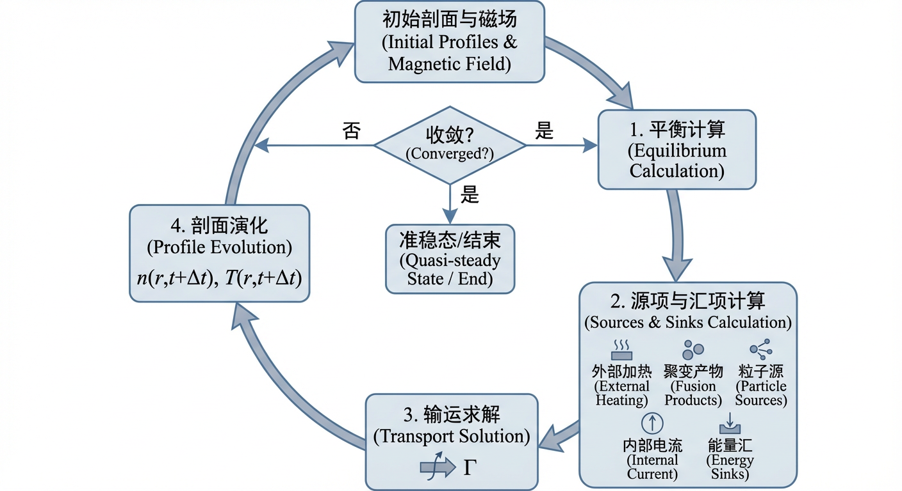
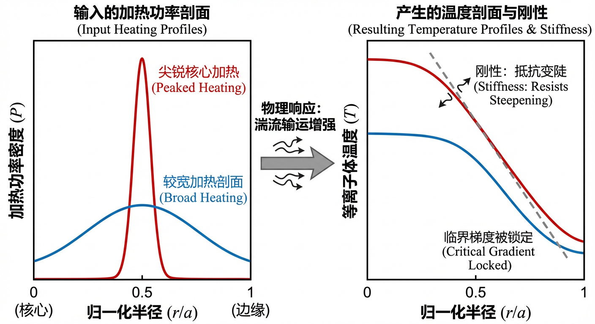
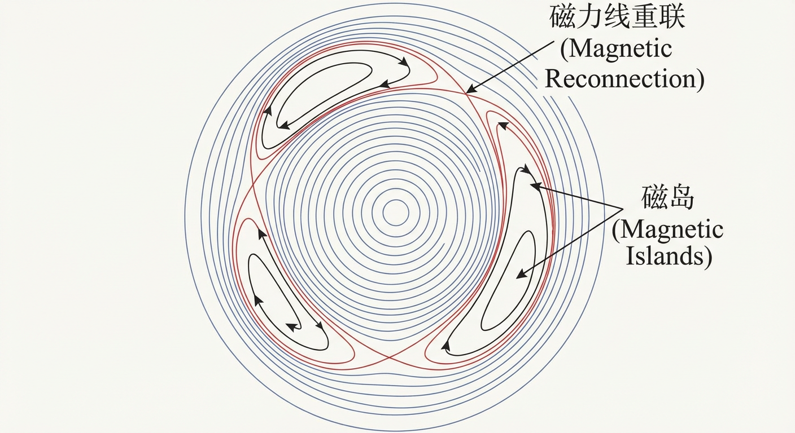
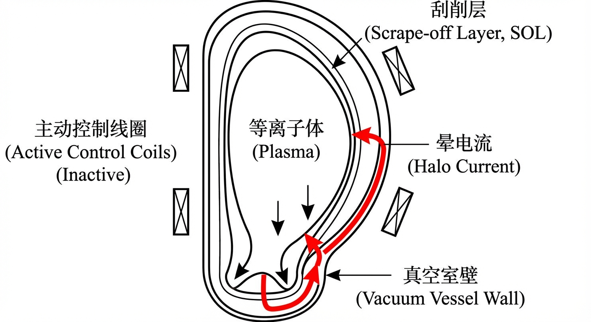
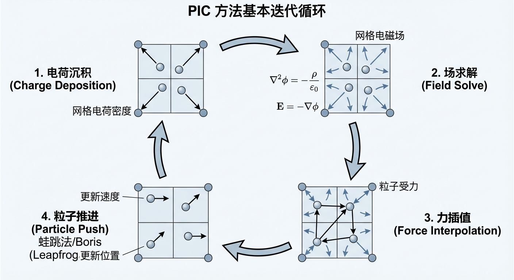
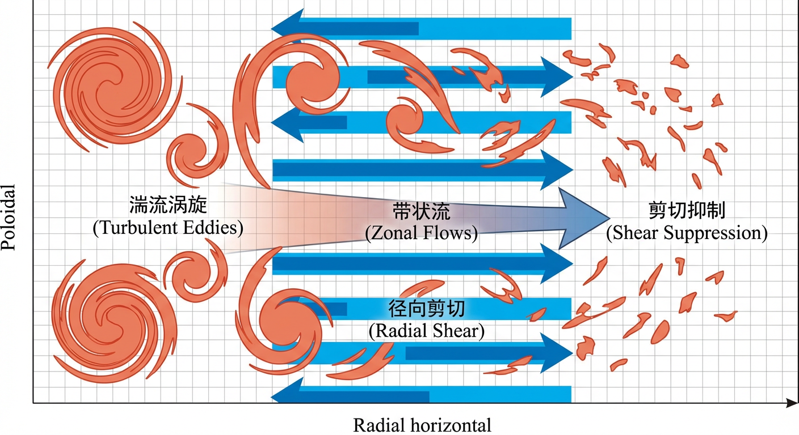
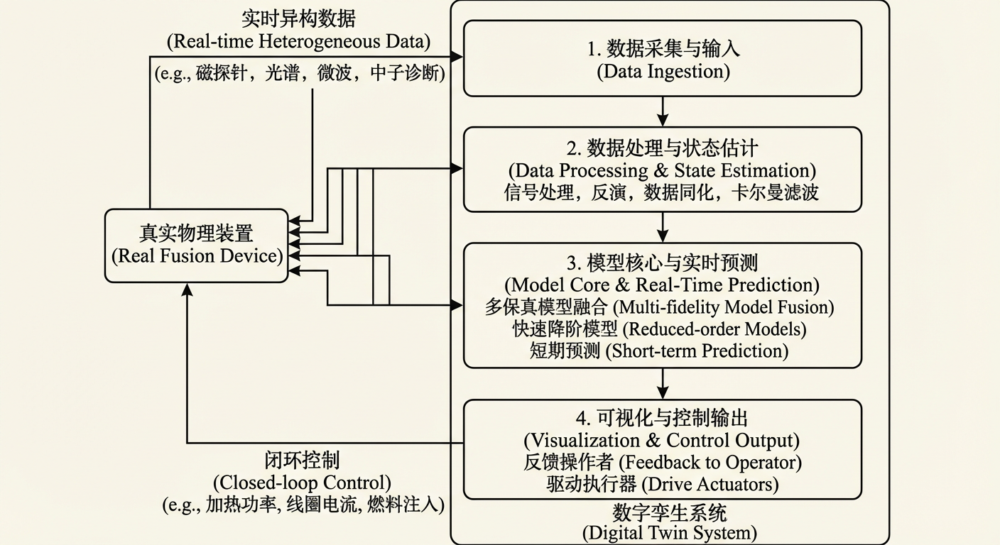
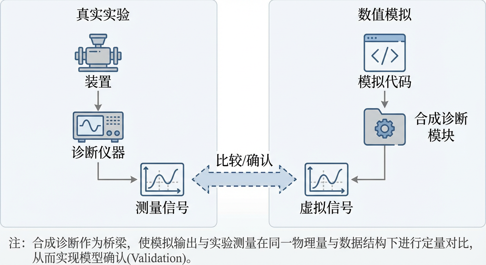

# 第10章：集成建模、数值模拟与方案迭代收敛

## 10.0 项目概述

在掌握了可控核聚变的基本物理原理、磁约束装置的工程设计以及等离子体加热与驱动技术之后，我们面临的终极挑战是将这些孤立的知识点编织成一个统一的、动态的预测系统。这不仅是理解等离子体复杂行为的关键，更是迈向数字化聚变堆设计与运行控制的必由之路。本章我们将进入“集成建模”的世界，学习如何构建一个能够在计算机中模拟真实聚变装置运行全过程的虚拟实验室。

为了让大家深刻体会集成建模的威力与挑战，本章设计了一个贯穿始终的实战项目：**“虚拟托卡马克：从平衡构建到数字孪生验证”**。在这个项目中，你将扮演一名计算物理学家，任务是从零开始构建一个简化的托卡马克模拟流程。

**项目背景与挑战：**
假设我们正在设计一台名为“VT-1”（Virtual Tokamak-1）的新型实验装置。我们需要验证其设计方案在物理上是否可行，在工程上是否安全。这涉及到四个关键阶段的任务，分别对应本章的四个子章节：
1. **平衡与边界耦合**：首先，你需要计算装置在真空场下的磁场分布，并确定等离子体的平衡边界。这里的核心挑战在于如何处理等离子体与外部真空区域的耦合问题。
2. **破裂风险评估**：在确定了平衡位形后，你需要评估其在发生垂直位移事件（VDE）时的结构安全性，特别是估算晕电流造成的不对称电磁力。
3. **微观湍流诊断**：为了理解装置的能量约束性能，你需要深入微观尺度，设计一种能够降低统计噪声的诊断方法，以精确计算由湍流引起的热通量。
4. **数字孪生基准测试**：最后，为了确保模拟结果可信，你需要建立一套标准化的基准测试流程，验证数值算法在处理电磁场时间演化时的准确性。

通过这个项目，你将不再是旁观者，而是亲手触摸那些描述等离子体宏观平衡、微观输运、灾难性破裂以及数值验证的核心方程。现在，让我们开启这段从代码到物理的集成之旅。

## 10.1 平衡—输运集成链路

在探索可控核聚变的漫长征途中，我们始终在与一个深刻的悖论共舞：一个成功的聚变等离子体，其本质上是一个高度自洽的、自我组织的系统。在托卡马克这样的磁约束装置中，上亿度高温的等离子体被精巧的磁场“牢笼”所约束，而这个“牢笼”的形态恰恰又由其内部等离子体的压力和电流分布所决定。这构成了一个经典的“鸡生蛋，蛋生鸡”式的难题：磁场位形决定了热量和粒子的输运，而输运过程又反过来塑造了决定磁场位形的压力和电流剖面。我们无法孤立地求解其中任何一个环节，因为容器（位形）与内容物（剖面）的命运早已密不可分。

要破解这一难题，并最终获得预测乃至控制聚变“火炉”的能力，我们必须构建一个能够体现这种内在耦合的计算框架。这便是本节的核心主题——**平衡—输运集成链路（Equilibrium-Transport Integrated Link）**。它并非一个单一的求解器，而是一套协同工作的计算模块与物理模型所组成的迭代循环，是连接等离子体宏观形态与微观输运行为的数字神经系统。本节将深入剖析这一集成建模的基石，阐明其工作原理、核心模块以及其揭示的关键物理现象，为后续章节中更复杂的稳定性与湍流集成模拟奠定基础。

### 两大支柱：平衡求解器与输运模型

集成链路的核心，是两大物理模块之间的持续“对话”：一个负责描绘磁场几何骨架的平衡求解器，以及一个负责描述能量与粒子在骨架上流动的输运模型。

#### 平衡：磁场骨架的构建

正如第三章所述，轴对称的托卡马克等离子体在磁流体动力学（MHD）时间尺度上的宏观形态，由著名的格林–沙夫拉诺夫方程（Grad–Shafranov equation）所描述。这是一个二维的、非线性的椭圆型偏微分方程，其求解构成了平衡计算的核心。在集成建模的实践中，我们通常会遇到两种不同哲学思想的平衡求解器。

第一种是**固定边界平衡求解器（fixed-boundary equilibrium solver）**。它解决一个定义明确的数学问题：在给定一个固定的最外层闭合磁通面（即等离子体边界）形状，以及内部的压力剖面 $p(\psi)$ 和极向电流函数 $F(\psi)$ 的前提下，计算出该边界内部的磁通函数 $\psi(R,Z)$ 分布。这在概念上，与求解一个给定边界条件和内部电荷分布的静电学泊松问题惊人地相似。正如一块被固定边缘拉紧的鼓面，其振动模式（本征函数）由其形状所决定，固定边界求解器也利用等离子体边界这一“刚性”约束，高效地求解内部的磁场结构。由于其计算速度快、鲁棒性好，这类求解器通常被用在集成模拟的内层迭代循环中，作为快速更新磁场几何的“工作母机”。

然而，真实的托卡马克实验中，等离子体的边界并非预先给定，而是由等离子体自身与外部极向场线圈电流之间复杂的电磁力平衡共同决定的。为了捕捉这一更为真实的物理图景，我们需要第二种更为强大的工具——**自由边界平衡求解器（free-boundary equilibrium solver）**。这类求解器不再预设等离子体的边界形状，而是将其作为待解的未知量之一。它求解的是一个更大范围的耦合问题：同时找到满足内部力学平衡的等离子体位形，以及在外部真空区域和线圈中能够产生并维持这一位形所需的一组线圈电流。因此，自由边界求解器不仅给出了等离子体的磁场结构，更建立了等离子体状态与外部工程控制手段（线圈电流）之间的直接联系，是连接物理与工程、实现闭环控制不可或缺的一环。

在自由边界求解中，一个关键的数学挑战是如何处理等离子体边界与外部真空区域的衔接。在真空区，由于没有体电流，轴对称情况下磁通函数满足齐次的格林–沙夫拉诺夫算子（真空格林–沙夫拉诺夫方程），在合适的变量表述下可等价为拉普拉斯型问题。理解真空场的特性对于准确计算等离子体边界至关重要，这也正是我们实战项目第一步所要解决的核心问题。

#### 输运：能量与粒子的流动

如果说平衡求解器描绘了等离子体约束的“河道”，那么输运模型则描述了河中“水流”（即能量、粒子、动量等）的运动规律。如第六章所述，由于托卡马克等离子体在磁面上的输运远快于跨越磁面的输运，我们可以将三维的输运问题简化为一维的、沿径向的通量–梯度关系。描述等离子体密度 $n$、温度 $T$ 等剖面演化的通用方程可以写为守恒形式：
$$
\frac{\partial U}{\partial t}+\frac{1}{V'}\frac{\partial}{\partial r}\!\left(V'\Gamma\right)=S
$$
其中 $U$ 是某个物理量（如 $n$、$p=nT$），$\Gamma$ 是其对应的径向通量，$S$ 是体积源项与汇项，而 $V'(r)=\mathrm{d}V/\mathrm{d}r$ 是与磁面几何相关的体积导数。

输运建模的核心任务便是确定通量 $\Gamma$。对此，也存在两种截然不同的策略，分别对应着**解释性（interpretive）**与**预测性（predictive）**建模。

在**解释性输运建模**中，我们从实验测量出的密度、温度等剖面出发，利用这些已知的剖面及其梯度，反向推断出能够导致这些剖面形成的输运系数（如热扩散系数 $\chi$ 和粒子扩散系数 $D$）。这个过程的目标是“解释”一次已经发生的放电，诊断出其内部的输运特性，它回答的是“发生了什么？”以及“为何会这样？”的问题。

相比之下，**预测性输运建模（predictive transport modeling）**追求一个更宏大的目标：从第一性原理出发，预测等离子体的未来。在这种模式下，输运通量不再是推断出来的，而是由一个理论模型直接计算得出。这些模型，小到基于新经典理论的计算，大到由高性能计算驱动的、基于回旋动理学理论的湍流模型（如第六章介绍的 TGLF、CGYRO 等），它们根据局部的等离子体参数（如 $T_e,n_e$）及其梯度（如 $R/L_T,R/L_n$）来计算由湍流引起的粒子和能量通量。其目标是回答“将会发生什么？”的问题，是设计和优化未来聚变装置运行方案的重要工具。

### 集成链路：物理模块的迭代对话

平衡与输运，这两大支柱通过一个精巧的迭代循环被编织在一起，形成一个自洽的整体。这个循环构成了集成建模框架的心脏，它模拟了等离子体在输运时间尺度上（通常是毫秒到秒量级）的缓慢演化。整个过程如同一场精心编排的、在不同物理模块之间展开的对话：

1. **初始猜测**：从一个合理的等离子体剖面（$n_e(r),T_e(r),T_i(r),\dots$）和磁场位形作为起点。
2. **平衡计算**：将当前的压力和电流剖面传递给平衡求解器，计算出与之对应的、更新后的磁场几何结构。这包括磁通面形状、磁场分量、安全因子剖面 $q(r)$ 以及各种与几何相关的度规系数。
3. **源项计算**：在新的几何与剖面背景下，调用一系列物理模块，计算所有**输运方程中的源项（sources）与汇项（sinks）**。这是一个“记账”环节，物理学家在此清点所有注入、产生、消耗或逃逸的能量与粒子。这些源项构成了输运方程的右端项 $S$，其物理内容包罗万象：
   * **外部加热与电流驱动**：中性束注入（NBI）的沉积剖面、射频波（ICRH、ECRH、LHCD）的功率吸收与电流驱动剖面（详见第七章）。
   * **聚变产物**：由聚变反应自身产生的阿尔法粒子（$\alpha$ 粒子）所携带的能量，它们在慢化过程中将能量传递给背景等离子体，形成一个核心加热源。
   * **粒子源**：通过气体注入（gas puffing）或弹丸注入（pellet injection）引入的燃料粒子，以及从中性束或与壁再循环过程中产生的中性粒子电离。
   * **内部电流**：由压力梯度驱动的自举电流（bootstrap current），这是等离子体自组织能力的体现（详见 6.1 节）。
   * **能量汇**：韧致辐射、同步辐射以及杂质线辐射等导致的能量损失（详见 4.1 节）。
4. **输运求解**：利用更新后的几何信息和剖面梯度，调用预测性输运模型（如基于回旋动理学的湍流模型）计算出跨越每个磁面的热流与粒子流，即输运通量 $\Gamma$。
5. **剖面演化**：有了输运通量 $\Gamma$ 和源汇项 $S$，便可以求解一维输运方程，将等离子体剖面向前推进一个时间步 $\Delta t$，得到一组新的剖面 $n(r,t+\Delta t),T(r,t+\Delta t)$。
6. **迭代收敛**：将更新后的剖面作为新的输入，返回步骤 2，开始新一轮的“平衡–源–输运”计算。这个循环不断重复，直到剖面随时间的变化趋于平稳，达到一个准稳态，或者持续演化直到放电结束。

这一迭代过程，正是“模型构建”思想的生动体现：它将一个庞大、耦合的非线性系统，分解为一系列更小、更易于处理的模块，并通过迭代的方式，最终逼近其自洽的解。

### 剖面一致性：等离子体的“韧性”

通过平衡–输运集成模拟，物理学家们发现了一个深刻而时而令人困惑的现象：**剖面一致性（profile consistency）**，亦常被称为**剖面刚性（profile stiffness）**或**剖面韧性（profile resiliency）**。直观上，人们可能认为，通过将加热功率集中在等离子体核心，就能“雕刻”出一个非常尖锐的温度剖面。然而，实验和模拟都表明，等离子体往往会主动“抵抗”这种改变。

当温度梯度试图超过某个由底层微观不稳定性（如离子温度梯度模，ITG）决定的临界值时，湍流输运会急剧增强。这就像一扇温控的窗户，一旦室内外温差过大，窗户就会自动开得更大，迅速将热量排出，从而使温差（即温度梯度）回落到临界值附近。这种“刚性”的输运响应，使得归一化的温度剖面形状在很大程度上被物理临界梯度所“锁定”，而对外部加热剖面的具体形态不甚敏感。

这种剖面刚性是等离子体自组织能力的核心体现，它为聚变堆的设计和控制带来了深远的影响。一方面，它意味着通过简单的功率“塑形”来主动控制温度剖面的能力是有限的；另一方面，它也使得对聚变性能的预测在某种程度上更加鲁棒，因为最终的剖面形状更多地由普适的物理定律决定，而非精确的、难以预测的加热细节。

### 核心–边缘集成：一个未完成的宏图

我们至今的讨论主要集中在等离子体的核心区，那里等离子体温度高、磁场结构良好。然而，真实的托卡马克还存在一个同样重要的区域——边界。边界等离子体，包括刮削层（SOL）和偏滤器区域，其物理过程（如原子物理、等离子体–材料相互作用）与核心区截然不同，且时间尺度可能快得多。

一个完整的集成模型，必须将这两个区域连接起来。这就是**核心–边缘集成建模（core-edge integrated modeling）**的目标。核心区域产生的热量和粒子通量，构成了流入边界区域的“上游”条件，决定了偏滤器靶板上的热负荷。反之，边界区域的中性粒子行为、杂质的产生与输运，则为核心区域的模拟提供了至关重要的边界条件。实现这种跨区域、跨物理、跨尺度的耦合，是当前集成建模领域的最大挑战之一，也是通向能够真正预测整个装置性能的“全装置建模”的必由之路。

### 小结

平衡–输运集成链路是现代磁约束聚变模拟的支柱。它将描述宏观磁场结构的平衡方程与描述能量、粒子流动的输运方程通过一个严谨的迭代框架耦合起来，从而能够自洽地模拟等离子体在输运时间尺度上的演化。这一框架不仅为我们提供了预测未来聚变装置性能的工具，更深刻地揭示了等离子体内部物理过程的相互关联性，特别是像剖面刚性这样的自组织现象。它将等离子体描绘成一个复杂的、动态的系统，其中几何、源项和输运三者之间不断进行着“对话”，共同决定着系统的最终状态。

> **实战项目应用 I：真空场耦合与 Dirichlet-to-Neumann 映射**  
> **背景：** 在自由边界平衡求解器中，等离子体外部的真空区域是一个关键环节。线圈电流在真空区产生磁场，这些磁场在等离子体边界处提供约束。为获得可解析、可验证的模型，我们考虑二维横截面中真空区域的标量势问题：真空磁标势 $\Phi$ 满足拉普拉斯方程 $\nabla^2\Phi=0$，并由边界电势决定边界法向导数（对应边界法向场分量）的映射。  
> **任务：**  
> 1. **理论推导**：考虑二维圆形等离子体边界（半径 $R$），其外部为真空区域 $r\ge R$。给定边界上的磁标势（Dirichlet 数据）为 $g(\theta)=\cos(n\theta)$。推导满足远场有界（或衰减）条件的外部真空磁标势解 $\Phi(r,\theta)$，并给出边界上的法向导数 $\partial\Phi/\partial r|_{r=R}$。  
> 2. **DtN 对角化证明**：在傅里叶基底下，证明 Dirichlet-to-Neumann（DtN）映射将每个模态 $e^{\mathrm{i}n\theta}$（或 $\cos(n\theta)$、$\sin(n\theta)$）分别映射为同一模态并乘以一个特征值，从而该映射在傅里叶空间是对角的。  
> 3. **数值验证**：编写简单数值程序（如 Python），在极坐标或笛卡尔网格上用有限差分近似计算边界法向导数，并与解析表达式对比。建议在 $r=R$ 处采用二阶单边差分或在 $r=R\pm \Delta r$ 上的中心差分以控制离散误差。  
> 4. **误差分析**：针对不同模数 $n$ 与网格分辨率，分析误差随 $\Delta r$ 的收敛阶，并讨论高模数下对径向分辨率更敏感的原因（外部解随 $r$ 的幂律衰减更快）。  
> **思考：** 这种从边界电势推导边界法向场的能力，是自由边界平衡计算中高效处理真空区影响的重要数学基础；在更一般的几何中，DtN 思想仍可通过边界积分或谱方法实现快速耦合。

本节所建立的这一集成建模概念，是后续章节讨论更复杂的稳定性与湍流集成模拟，乃至最终构建“数字孪生”（Digital Twin）的逻辑起点。它诠释了现代科学如何通过模块化、多尺度耦合的计算思维，来逐步攻克那些看似无法逾越的复杂性高峰。

## 10.2 稳定性与破裂模拟链路

在第五章中，我们已经探讨了维系托卡马克等离子体稳定运行所需满足的苛刻物理条件。我们认识到，等离子体如同被无形磁力线驯服的恒星之火，其平衡是脆弱的，时刻受到内部强大驱动力的挑战。然而，理解稳定性的边界仅仅是故事的开端。为了确保未来聚变反应堆的安全可靠运行，我们必须回答一个更深层次、更具挑战性的问题：当平衡被打破，当不稳定性失控时，接下来会发生什么？我们能否预测这场灾难的演进，并最终模拟其对装置的全部影响？这正是本节“稳定性与破裂模拟链路”所要解决的问题，它与前一节的平衡–输运链路共同构成了完整的物理图景。

回答这些问题，需要构建一条从不稳定性初生到装置结构响应的完整“稳定性与破裂模拟链路”（Stability and Disruption Simulation Link）。这条链路并非单一的模型，而是由一系列环环相扣的计算模块构成的复杂系统，它旨在捕捉从理想磁流体动力学（Ideal Magnetohydrodynamics, MHD）的快速宏观运动，到电阻效应引发的拓扑重构，再到灾难性破裂事件中多物理场相互作用的完整动力学过程。本节将深入这条模拟链路的核心，揭示其背后的数值方法论、关键物理模型，以及它们如何共同描绘出可控核聚变中最危险的现象——大破裂（major disruption）的全貌。这不仅是一次计算物理的探索，更是连接理论洞察与工程现实的桥梁，其最终目标是将聚变等离子体安全、可控地运行在可接受的风险边界内。

### 理想磁流体稳定性分析的数值方法

稳定性分析的起点是理想 MHD 模型。如第五章所述，理想 MHD 能量原理为我们提供了一个判断等离子体稳定性的强大理论工具：通过计算系统势能的二阶变分 $\delta W$，我们可以判断是否存在一个能使系统能量降低的位移，从而判定系统是否稳定。然而，对于托卡马克复杂的环形几何，解析地计算 $\delta W$ 几乎是不可能的。因此，大规模数值模拟成为了不可或缺的研究手段。

这些模拟的核心任务，是在离散的计算网格上求解 MHD 方程组。然而，将连续的物理定律转化为计算机可以执行的离散算法，本身就充满挑战。其中一个最根本的挑战，源于麦克斯韦方程组中的一条基本定律：磁单极子不存在，其数学表达为 $\nabla\cdot\mathbf{B}=0$。在连续理论中，由 $\partial_t\mathbf{B}=-\nabla\times\mathbf{E}$ 可知若初始磁场无散，则在满足适当边界条件并以一致的连续算子演化时可保持无散；然而在离散网格上，由于截断误差的存在，用于近似旋度（$\nabla\times$）和散度（$\nabla\cdot$）的数值算子之间的代数恒等式一般不再严格成立，可能导致微小但持续累积的“数值磁单极子”在模拟中出现。这些非物理的散度误差会通过动量方程中的磁力项引入赝力，污染物理结果，甚至导致模拟不稳定。

为了维护磁场的无散性，计算物理学家发展出两种主要思路。第一种是“预防式”的**约束输运（Constrained Transport, CT）**方法。它通过在网格上交错布置电场和磁场分量，使得离散散度算子和离散旋度算子在代数上保持兼容，从而在机器精度内抑制数值磁单极子的产生。CT 方法非常稳健，但其架构相对约束，在处理复杂几何与非结构网格时实现难度较高。

第二种是“纠正式”的思路，它允许散度误差产生，但引入主动机制来传播并衰减这些误差。其中，**双曲散度清理（Hyperbolic Divergence Cleaning）**是一种常用技术，也称为广义拉格朗日乘子（Generalized Lagrange Multiplier, GLM）方法。该方法通过引入一个辅助标量场 $\psi$ 扩充 MHD 方程组：非零的 $\nabla\cdot\mathbf{B}$ 成为 $\psi$ 的源项，而 $\psi$ 的梯度项反过来修正磁场演化，使散度误差被转换为可传播、可阻尼的波动过程。对散度误差 $D\equiv\nabla\cdot\mathbf{B}$ 的有效动力学可写为类似电报方程的形式：
$$
\frac{\partial^2 D}{\partial t^2} + (\text{damping})\,\frac{\partial D}{\partial t} - c_h^2\nabla^2 D = 0 .
$$
通过设定清理波速 $c_h$（常取与系统中快波速度同量级）并引入阻尼项，散度误差可以在计算域中传播并被衰减。由于其灵活性和对并行计算的良好适应性，双曲散度清理已成为现代 MHD 模拟代码中处理 $\nabla\cdot\mathbf{B}=0$ 约束的重要技术之一。

### 破裂起始与前兆建模

理想 MHD 不稳定性（如外部扭曲模）的增长时间尺度极快（阿尔芬时间尺度，常为微秒到百微秒量级，取决于装置尺寸与磁场强度），一旦触发，宏观上反应窗口极窄。现实中的等离子体并非完美导体，其有限电阻率使得更缓慢、更隐蔽的不稳定性得以发展，而这些不稳定性往往是大破裂的重要前兆。

电阻的存在使得“冻结”在等离子体中的磁力线可以在局部发生断裂与重新连接，即**磁重联（magnetic reconnection）**。这种拓扑变化倾向于在电流密度梯度较大的有理磁面上发生，通过形成**磁岛（magnetic islands）**结构来释放磁能。由电阻驱动的典型不稳定性为**撕裂模（tearing mode）**。驱动撕裂模生长的“自由能”大小，可用稳定性参数 $\Delta'$ 来表征，它由线性化方程在共振层外解的匹配条件给出，并刻画了共振层两侧磁扰动径向导数的不连续性；通常 $\Delta'>0$ 对应经典撕裂模的驱动条件。描述磁岛宽度 $W$ 随时间演化的核心模型是（修正的）**卢瑟福方程（Rutherford equation）**，它将磁岛的增长率与 $\Delta'$ 以及新经典效应、极向电流与极向流等修正联系起来。

在破裂模拟链路中，对这些前兆的建模至关重要，因为它构成了破裂预测的基础。其中几个关键的建模场景包括：

* **模式锁定（mode locking）**：等离子体中的磁岛通常会随等离子体旋转。托卡马克装置中不可避免的误差场会对旋转磁岛施加电磁制动力矩，而粘滞与动量输入则试图维持旋转。该过程可用耦合方程组建模，描述磁岛幅度、相位与转动频率的演化。当制动力矩占优时，磁岛会减速并在真空室参考系中“锁定”到特定环向位置。模式锁定通常与约束劣化、破裂风险升高高度相关，因此精确模拟这一过程对于估计破裂窗口具有重要意义。

* **种子岛与新经典撕裂模（Neoclassical Tearing Modes, NTM）**：在高性能等离子体中，即使经典线性指标显示撕裂模稳定（可表现为有效的 $\Delta'<0$ 或被极向流、剪切等抑制），新经典撕裂模仍可能被触发。这种不稳定性源于磁岛导致的自举电流扰动所形成的正反馈。NTM 的触发往往需要初始“种子岛”，种子可由其他 MHD 事件提供，例如核心区的**锯齿（sawtooth）**不稳定性。锯齿崩塌本质上涉及 $q=1$ 面附近的快速重联与能量再分布，会向外传播磁扰动并可能在其他有理面（如 $q=2$ 面）诱发种子岛。对种子岛大小的估算可借助多种重联尺度模型（包括 Sweet–Parker 标度、以及更适用于快速重联的其他模型）和经验约束进行。若种子岛宽度超过 NTM 的阈值，原本稳定的运行点可能转变为不稳定状态，体现了破裂模拟中跨尺度耦合的复杂性。

### 基本破裂场景建模：垂直位移事件

在追求高性能的现代托卡马克中，为了提高等离子体比压和能量约束，等离子体截面通常被设计成垂直拉长的“D”形。这种设计虽然带来了性能上的优势，但也引入了一种固有的、极其危险的宏观不稳定性——**垂直不稳定性（vertical instability）**。

这种不稳定性在宏观上表现为等离子体电流柱的整体垂直位移，可视为轴对称的 $n=0$ 模式；在工程上常用“刚性电流环”类比来把握其主导动力学。其驱动力源于维持等离子体拉长所需的外部极向场与等离子体电流之间的耦合：对于拉长位形，垂直位移会改变互感与外场的平衡，使位移进一步增长，形成正反馈。若没有稳定机制，这种不稳定性可在非常快的理想 MHD 时间尺度上增长。

幸运的是，包围等离子体的导电真空室壁起到了关键的**被动稳定（passive stabilization）**作用。根据楞次定律，等离子体的快速运动会在壁上感应出涡电流，而这些涡电流产生的磁场会施加恢复力，有效抑制快速位移。然而，由于真空室壁具有有限电阻，这些涡电流会以一个称为**电阻壁时间（resistive wall time）** $\tau_w$ 的特征时间尺度衰减。因此，电阻壁并不能完全消除垂直不稳定性，而是将其从理想快模延缓到接近 $\tau_w$ 的较慢时间尺度；相应地，系统可出现与电阻壁相关的慢增长模态（在更一般的稳定性语境中常被讨论为电阻壁模，RWM）。

这个延缓为**主动反馈控制（active feedback control）**系统提供了宝贵的干预窗口。通过实时监测等离子体的垂直位置，并驱动外部控制线圈产生校正磁场，可以维持等离子体的宏观稳定。然而，一旦主动控制系统失效，或外部扰动超出控制能力，垂直漂移就可能失控，演变成灾难性的**垂直位移事件（Vertical Displacement Event, VDE）**。

VDE 的模拟是破裂链路中的核心模块。它通常从对失控漂移的建模入手，常采用**刚性等离子体近似（rigid plasma approximation）**：假设等离子体在垂直运动中保持形状与内部电流分布近似不变，其动力学由描述等离子体位移、速度与壁涡流耦合的等效电路/力学方程组决定。当模拟显示等离子体边界与第一壁或偏滤器发生接触时，灾难的下一阶段便拉开序幕。

### 破裂后果建模与缓解

当 VDE 或其他前兆不稳定性发展到不可逆转的阶段，大破裂便进入其最具破坏性的阶段。模拟链路的末端旨在预测这些后果，并评估缓解策略的有效性。

大破裂的核心过程通常分为两步：
1. **热猝发（Thermal Quench, TQ）**：失控的 MHD 不稳定性（通常是多种模式的非线性耦合）破坏磁面的约束，形成显著的磁场随机化或强径向关联的对流结构。等离子体核心储存的热能可在亚毫秒到数毫秒的时间尺度内快速释放到等离子体边界与面向等离子体部件上，导致温度从数 keV 量级骤降到数 eV 量级。
2. **电流猝发（Current Quench, CQ）**：这是大破裂中最危险的阶段之一。根据斯皮策电阻率标度（$\eta \propto T_e^{-3/2}$），热猝发导致的温度下降会使等离子体电阻率大幅升高，从而促使等离子体电流在较短时间尺度内衰减。快速变化的电流通过感应效应在等离子体及周围导电结构中产生显著电压与电流，带来两类主要工程威胁：**晕电流（halo currents）**与**逃逸电子（runaway electrons）**。

#### 晕电流力估计

在 VDE 期间，当等离子体接触到真空室壁时，新的电流回路形成：在 CQ 阶段的感应环向电场驱动下，部分原本在等离子体内部闭合的环向电流经边缘等离子体与**刮削层（Scrape-off Layer, SOL）**进入导电壁体，在壁中沿极向路径流动一段距离后再返回等离子体。这些在等离子体与壁结构之间流动的异常电流被称为晕电流。

晕电流模拟是聚变反应堆结构设计的关键输入。晕电流可达到总等离子体电流的显著比例（工程上常以 10%–几十% 量级作为设计关注范围，取决于情景），更危险的是其高度的**不对称性**。首先，由于 VDE 的方向性（向上或向下），电流可能表现出显著的**极向不对称**。其次，等离子体与壁的接触往往是局域化的，导致晕电流集中在环向的某个扇区，形成**环向不对称**。工程上常用**环向峰值因子（Toroidal Peaking Factor, TPF）**表征局部峰值与环向平均值之比，设计情景中峰值可能达到平均值的数倍量级。

这些巨大的、非对称的晕电流与托卡马克强大的环向磁场相互作用，会产生显著的 $\mathbf{J}\times\mathbf{B}$ 洛伦兹力。模拟代码需要计算这些力的大小与空间分布，包括作用在真空室上的净侧向力与扭转力矩。对于反应堆级装置，这些电磁载荷可达到非常高的量级，足以对结构造成严重机械风险。因此，晕电流的力学效应评估是破裂模拟链路中至关重要的一环。

#### 逃逸电子缓解策略

电流猝发期间的巨大感应环向电场，如同在托卡马克内部开启了一台粒子加速器。如果该电场超过由碰撞阻力决定的**临界电场**，一部分电子可进入持续加速状态，形成**逃逸电子（Runaway Electrons, RE）**。在逃逸电子产生机制中，常讨论两类特征电场：一类是与热电子“德雷塞”逃逸相关的 **Dreicer 电场**，另一类是表征雪崩增殖阈值的 **临界电场**（常用 Connor–Hastie 形式）。在强电场与高电流密度条件下，初始逃逸电子还可能通过与背景电子碰撞触发雪崩增殖，形成高能电子束流，对第一壁材料构成严重威胁。

破裂缓解系统的目标之一是抑制或耗散逃逸电子。目前常用策略包括**大规模气体注入（Massive Gas Injection, MGI）**以及**碎片注入（Shattered Pellet Injection, SPI）**等。在探测到破裂风险时，向真空室注入大量气体或碎片以快速增加等离子体密度并增强辐射耗散。由于雪崩过程的有效阈值电场与电子密度相关（临界电场标度随 $n_e$ 增大而增大），密度上升可提高形成强逃逸电子束的难度；同时，高 $Z$ 杂质通过增强辐射损失与碰撞效应可促进能量耗散并改变电场演化。模拟这些原子物理、辐射与电路耦合过程，并评估不同注入物种与注入量对逃逸电子抑制效果，是指导缓解系统设计的关键。

### 小结

稳定性与破裂模拟链路是一条从抽象理论通向工程实践的计算长链。它始于对理想 MHD 方程的数值求解，通过引入电阻效应捕捉不稳定的前兆，进而模拟垂直位移事件等具体破裂场景，最终以预测晕电流电磁载荷与评估逃逸电子缓解策略为终点。这条链路的每一个环节都体现了对等离子体物理的理解与对建模细节的把握。

从概念上看，这条链路是多物理、多尺度耦合的典范，它将等离子体物理、电磁学、原子物理、辐射物理以及结构力学紧密联系在一起。它不仅是理解与预测托卡马克危险现象的工具，也是未来反应堆运行安全体系的重要组成部分。在后续章节中，我们将看到，这条宏观 MHD 模拟链路的有效性依赖于对第 10.3 节所讨论的粒子–流体与湍流过程的理解；而当这条链路被进一步加速并与实时数据流整合时，它便构成了第 10.4 节将要探讨的面向运行控制的“数字孪生”的核心。

> **实战项目应用 II：晕电流的环向峰值因子与应力估算**  
> **背景：** VDE 事件中具有环向不对称性的晕电流会造成局部电磁载荷显著增大。为建立结构设计的“最坏情景”输入，需要用可解释的参数化模型估计环向峰值因子，并将其映射为局部应力裕度要求。  
> **任务：**  
> 1. **模型构建**：假设 VT-1 装置在 VDE 期间晕电流的环向分布 $I(\phi)$ 可用截断傅里叶级数表示（含 $n=1$ 与 $n=2$ 模态）：
>    $$
>    I(\phi)=I_{\mathrm{avg}}\!\left[1+a_{1}\cos(\phi-\phi_{1})+a_{2}\cos\bigl(2(\phi-\phi_{2})\bigr)\right].
>    $$
>    说明 $I_{\mathrm{avg}}$、$a_1$、$a_2$、$\phi_1$、$\phi_2$ 的物理含义，并给出 $I(\phi)$ 的取值范围约束（例如保证 $I(\phi)\ge 0$ 的必要条件）。  
> 2. **最坏情况分析**：定义环向峰值因子 $\mathrm{TPF}\equiv I_{\max}/I_{\mathrm{avg}}$。在“最坏相位对齐”（使两项余弦在同一 $\phi$ 处同时取最大值）的条件下，推导最大峰值因子 $\mathrm{TPF}_{\max}$ 的表达式，并讨论相位对齐成立的条件。  
> 3. **工程含义解读**：讨论 $\mathrm{TPF}_{\max}$ 对真空室局部电磁力与应力估算的影响。若设计基准按均匀分布（$\mathrm{TPF}=1$）的平均负载给出允许应力或壁厚，加入 TPF 后局部载荷如何放大，安全裕度应如何调整。  
> **思考：** 该模型强调了不对称模态叠加对局部极值的影响，为“保守设计”提供了明确的数学抓手；在更高保真模拟中，$a_n$ 与 $\phi_n$ 可由破裂链路计算并输入结构分析。

这条从理论到应用的模拟之路，正是聚变科学从基础研究迈向工程应用的缩影。

## 10.3 粒子—流体与湍流模拟要素

在探索可控核聚变这一宏伟目标的征途中，我们必须面对一个核心挑战：如何精确描述并预测上亿度高温等离子体的复杂行为？这种由海量带电粒子构成的物质形态，其内部充满了跨越巨大时空尺度的相互作用，从单个粒子的微观运动到集体性的宏观涌现，构成了一幅极其复杂的物理画卷。

在前两节中，我们主要利用宏观的流体模型（如 MHD 和输运方程）来处理平衡、输运和稳定性问题。然而，流体描述往往掩盖了许多关键的微观细节，特别是那些驱动输运的湍流过程，其根源在于粒子的动理学效应。因此，为了更深入地理解输运的物理本质，并为第 10.1 节中的预测性输运模型提供精确的通量计算，我们需要进入更为微观的模拟世界。本节将深入探讨构成现代聚变等离子体模拟的核心要素，尤其是那些超越简单流体描述、致力于捕捉动理学效应与湍流物理的先进方法。我们将从“粒子–网格”这一混合思想出发，逐步迈向为聚变研究量身定制的“回旋动理学”理论。

### 粒子–网格（PIC）方法：捕捉集体之舞

要从第一性原理出发描述等离子体，最直接的思路是追踪数量庞大（例如聚变装置中粒子数可达 $10^{20}$ 以上）的电子和离子在它们相互产生的电磁场中的运动。然而，这是一个计算上的 $N$ 体问题，直接计算两两相互作用的成本随粒子数 $N$ 的平方增长（$O(N^2)$），对于实际系统不可承受。另一方面，纯粹的流体模型虽然高效，却将一切平均化，无法描述高能粒子束穿透背景等离子体等非平衡动理学现象。正是在这种两难困境中，**粒子–网格（Particle-in-Cell, PIC）**混合方法应运而生，它在粒子描述的动理学信息与网格场求解的计算可行性之间取得了平衡。

PIC 方法的核心思想，是利用计算网格作为粒子间长程相互作用的中介，从而避免 $N^2$ 计算。其基本循环包含四个步骤：

1. **电荷沉积（charge deposition）**：每个“宏粒子”（代表一大群真实粒子）通过加权方案将其电荷分配到周围网格节点。以**云中元（Cloud-in-Cell, CIC）**为例，电荷按粒子在网格单元中的相对位置对单元顶点进行线性权重分配，从而形成网格上的电荷密度 $\rho(\mathbf{x})$。
2. **场求解（field solve）**：在网格上求解电磁场方程。静电近似下求解泊松方程
   $$
   \nabla^2\phi=-\rho/\varepsilon_0,
   $$
   得到电势 $\phi$ 与电场 $\mathbf{E}=-\nabla\phi$。电磁 PIC 则需离散麦克斯韦方程组并与电流沉积耦合。
3. **力插值（force interpolation）**：将网格上的场插值回粒子位置，计算洛伦兹力 $\mathbf{F}=q(\mathbf{E}+\mathbf{v}\times\mathbf{B})$。为减少自作用与保持守恒性质，插值方案需与沉积方案相一致。
4. **粒子推进（particle push）**：用时间推进算法更新粒子速度与位置。PIC 中常用且具有良好长期稳定性的推进器包括**蛙跳法（leapfrog）**与 **Boris 推进器**；二者都通过时间交错实现稳定的相空间推进。

完成四步后，进入下一时间步。理想的 Vlasov–Maxwell 描述在无碰撞极限成立；为更贴近聚变等离子体，必须考虑库仑碰撞效应。工程上常在 PIC 循环中加入**蒙特卡罗二体碰撞模型（Monte Carlo binary collision model）**：在网格单元内按概率随机配对粒子，并用与小角库仑散射相一致的随机过程更新速度增量，以保证动量与能量守恒的统计性质（经典实现如 Takizuka–Abe 或 Nanbu 方法）。

PIC 方法还受内禀数值约束：网格间距 $\Delta x$ 需能解析德拜屏蔽长度 $\lambda_D$（通常要求 $\Delta x\lesssim \lambda_D$ 的量级约束），否则可能出现非物理数值加热；时间步长 $\Delta t$ 需解析等离子体频率 $\omega_p$ 所对应的快速响应（例如要求 $\Delta t$ 足够小以满足稳定性条件并解析主要波动）。这些约束连同有限粒子数导致的统计噪声，构成了 PIC 设计与结果解释的关键要素。

### 降维的艺术：回旋动理学与湍流模拟

尽管 PIC 方法极其强大，但在应用于磁约束聚变等离子体、特别是低频湍流模拟时，会遭遇尺度障碍：强磁场中粒子以高回旋频率 $\Omega$ 围绕磁力线快速回旋，而回旋半径 $\rho$ 很小。若用标准 PIC 解析每次回旋，需要极小时间步长和网格尺度，无法覆盖湍流的长时间演化。

这促使物理学家发展**回旋动理学（gyrokinetics）**理论。对于驱动输运的低频湍流（$\omega\ll\Omega$），快速回旋相位并非关键，重要的是**导向中心（guiding center）**的慢漂移。回旋动理学通过**回旋平均（gyro-averaging）**变换在回旋轨道上平均，从而滤除快速回旋相位，自然将六维相空间中的一个快变量消去。点粒子在计算中被等效为带电回旋环，模拟任务从追踪瞬时粒子轨道转为追踪导向中心（或回旋中心）动力学，从而显著放宽时间步长限制，使低频湍流的长时间模拟成为可能。

即使滤除了回旋运动，统计噪声仍是挑战：湍流涨落往往是背景分布函数 $f_0$ 上的小扰动 $\delta f$。若直接采样总分布 $f=f_0+\delta f$，有限采样对巨大背景带来的散粒噪声会淹没 $\delta f$。为此，**$\delta f$（delta-f）方法**应运而生：只模拟偏离平衡态的扰动部分 $\delta f$。在 $\delta f$-PIC 中，计算粒子携带权重 $w_p=\delta f/f_0$，权重演化由线性化的源项与非线性相互作用决定，从而显著提升信噪比。

结合回旋平均与 $\delta f$ 思想的**回旋动理学模拟（gyrokinetic simulation）**是研究托卡马克湍流输运的核心工具。它通常分为两个层次：

首先是**线性回旋动理学模拟（linear gyrokinetic simulation）**：对回旋动理学方程线性化，求解特征值问题，以识别在给定剖面下主导的微观不稳定性（如 ITG、TEM 等），并给出增长率与实频率。

其次是**非线性回旋动理学湍流模拟（nonlinear gyrokinetic turbulence simulation）**：线性不稳定性指数增长在物理上会被非线性机制饱和。非线性模拟揭示了湍流与剪切流的自洽耦合，其中关键机制之一是**带状流（zonal flows）**：一种在环向与极向平均意义上对称（常用 $m=0,n=0$ 表征其对称性）的径向剪切流，可由湍流雷诺应力等非线性项驱动生成。带状流通过剪切撕裂湍流涡旋抑制输运，使系统达到统计稳态，形成“捕食者–猎物”式的自洽动力学。

饱和湍流如何决定宏观输运？**准线性输运理论（quasi-linear transport theory）**提供了连接桥梁：输运通量（如热通量 $Q$）来源于涨落之间的相关性，例如
$$
Q \propto \langle \tilde{v}_r \tilde{T} \rangle ,
$$
其中 $\tilde{v}_r$ 是径向 $E\times B$ 漂移速度涨落、$\tilde{T}$ 为温度涨落。尽管单个涨落的平均为零，但二者若存在相干相关性，其乘积平均可非零，导致净输运。准线性理论常用线性模结构与谱信息近似这种相关性，从而快速估算湍流输运水平，是预测性输运模型构建的重要基础之一。

此外，除静电势涨落驱动的湍流输运外，还存在由磁场拓扑改变导致的输运：当撕裂模等 MHD 不稳定性导致磁岛重叠，磁力线可能出现显著随机化，形成**随机磁场（stochastic magnetic field）**。在随机磁场中，粒子（尤其是电子）沿磁力线导热可导致电子热输运急剧增强，这一机制对理解热猝发、某些高 $\beta$ 情景以及强 MHD 活动期间的能量损失至关重要。

### 小结

本节揭示了聚变等离子体模拟的一条关键脉络：通过物理近似与降维，把原本计算上不可承受的多体问题转化为可在现代计算平台上求解的模型体系。从通用的 PIC 方法，到面向磁约束湍流的回旋动理学，再到聚焦涨落本体的 $\delta f$ 技术，我们建立了由简至繁、保真度逐级提升的模拟层级，并理解了它们各自的适用边界与数值约束。

> **实战项目应用 III：湍流热通量诊断中的控制变量降噪**  
> **背景：** 在 $\delta f$ PIC（含回旋动理学或导向中心动力学）模拟中，湍流热通量 $Q$ 常由带权粒子求和得到。尽管 $\delta f$ 方法显著降低噪声，实际计算中通量仍可能具有较大统计方差，需要进一步降噪以降低算力成本并提高诊断精度。  
> **任务：**  
> 1. **控制变量法原理**：给定通量估计量 $H$，引入期望值已知（尤其是为零）的辅助量 $C$，考虑新估计量 $H-\alpha C$。说明如何通过选择系数 $\alpha$ 降低方差，并给出“零均值”条件对无偏性的要求。  
> 2. **最优系数推导**：在平板几何下，考虑离子热通量诊断。背景分布 $f_0$ 取非均匀麦克斯韦分布。利用权重演化方程
>    $$
>    \frac{\mathrm{d}w}{\mathrm{d}t}=S_w,
>    $$
>    构造控制变量 $C=\alpha S_w$，并推导使 $\mathrm{Var}(H-\alpha S_w)$ 最小的最优系数
>    $$
>    \alpha=\frac{\langle H S_w\rangle_0}{\langle S_w^2\rangle_0},
>    $$
>    其中 $\langle\cdot\rangle_0$ 表示以 $f_0$ 加权的相空间平均。  
> 3. **结果解析**：将推导得到的 $\alpha$ 表达为背景温度 $T_0$ 与梯度尺度参数（如 $\kappa_n,\kappa_T$）的函数，并讨论在密度梯度主导或温度梯度主导情形下 $\alpha$ 的标度行为。  
> **思考：** 控制变量法通过利用已知统计结构，把可观测量中“可预测的噪声成分”抵消，从而以更少的宏粒子实现同等置信度的通量估计，是高维湍流计算中十分关键的数值技巧。

这一系列模拟要素从最基本的粒子运动出发，最终为我们描绘出湍流如何从背景梯度中汲取能量、如何通过非线性效应达到饱和，以及如何通过涨落关联驱动宏观输运的物理图像。它们不仅是理论物理的重要成果，更是连接理论与实验、并最终服务于未来聚变装置设计的不可或缺的计算工具。

## 10.4 数字孪生与合成诊断验证

在前述章节中，我们已经系统地构建了描述聚变等离子体行为的集成模型链路与高保真度数值模拟能力，我们已经能够从第一性原理出发“计算”出等离子体的平衡、输运和稳定性。然而，这引出了一个更为深刻且至关重要的问题：我们如何能“信任”这些计算结果？在建造和运行耗资巨大的聚变装置时，我们能否依赖这些复杂的模拟程序来做出关键的工程与控制决策？本节旨在回答这一问题，将叙事重心从“把物理算出来”推进到“如何让计算结果在装置的证据链中可被信任、可被实时使用、可被跨平台复现”。

为此，我们将引入一系列概念，它们共同构成现代计算聚变科学的重要方法论：首先以装置运行对实时性与闭环决策的需求为切入点，引入**数字孪生（Digital Twin）**作为集成建模的工程化落点；随后探讨**合成诊断（Synthetic Diagnostics）**如何在模拟与实验观测之间建立可定量比较的映射；在此基础上讨论**验证、确认与不确定性量化（Verification, Validation, and Uncertainty Quantification, V&V/UQ）**框架；进一步阐述**代码基准测试（Code Benchmarking）**的社区意义；最后介绍如何利用**基于物理信息神经网络（Physics-Informed Neural Networks, PINNs）的代理建模（Surrogate Modeling）**提升实时预测能力，从而闭合“感知–决策–控制”的回路。

### 聚变装置的数字孪生：架构与实时建模

传统数值模拟通常是离线过程：在固定输入下运行，输出结果与真实装置的实时状态没有直接闭环耦合。然而，运行中的托卡马克是动态系统，状态随时间变化。为实现精确控制（避免破裂、优化性能等），需要一个能与物理装置持续同步的虚拟副本，即**数字孪生**。

聚变装置的数字孪生不是单一程序，而是一个与真实装置通过数据流耦合的动态系统。其基础架构通常包含四个组成部分：

1. **数据采集与输入（data ingestion）**：从磁探针、光谱、微波、中子等诊断实时采集异构数据。
2. **数据处理与状态估计（data processing and state estimation）**：通过信号处理、反演与数据同化，将间接测量转化为等离子体状态（温度、密度、电流剖面等）的估计。状态估计常采用卡尔曼滤波及其非线性扩展（如扩展卡尔曼滤波、集合卡尔曼滤波等），以融合测量噪声与模型预测。
3. **模型核心与实时预测（model core and real-time prediction）**：融合多保真模型（平衡、输运、稳定性、以及必要的快速降阶模型），以状态估计为初值向前推演，给出短期预测与风险指标。
4. **可视化与控制输出（data visualization and control output）**：将预测结果反馈给操作者与控制系统，驱动执行器（加热功率、线圈电流、燃料注入等）实现闭环控制。

数字孪生的难点在于实时性：高保真模拟（如全局回旋动理学）通常远慢于物理演化时间，无法直接用于实时闭环。因此数字孪生必须调度不同保真度模型并引入快速代理模型。长脉冲运行中，壁条件等缓慢变化可能导致模型预测性能随时间漂移，这类现象常称为“概念漂移（concept drift）”。成熟系统需在线监测误差（例如分析状态估计中的“新息”序列是否维持近似白噪声特性），并触发模型校准与更新。

### 合成诊断：连接模拟与观测的桥梁

数字孪生依赖模型可信度，而可信度来自模型能否再现实验观测。但模拟输出（如 $T_e(\boldsymbol{x})$）与诊断测量量（如电子回旋辐射某频点的辐射温度、或汤姆逊散射的离散采样）常并非同一物理量，无法直接比较。

**合成诊断（synthetic diagnostics）**即为跨越此鸿沟的正演工具：它以模拟输出为输入，模拟真实诊断的观测几何、响应函数、噪声与数据处理流程，输出与实验测量具有相同数据结构与物理意义的“虚拟信号”。

例如，为验证回旋动理学湍流模拟，可构建散射类诊断的合成模块：
1. 从回旋动理学代码（如 GENE、CGYRO 等）读取三维密度涨落场 $\tilde{n}_e(\boldsymbol{x},t)$。
2. 模拟相干散射诊断（如 DBS 或 PCI）的几何布局，包括天线位置、波束形状与传播路径。
3. 依据散射理论计算诊断敏感的散射体积与波数范围内的散射信号。
4. 叠加仪器传递函数、电子学噪声等效应，得到与实验可对照的时序信号或谱量。

随着模拟保真度提高，**先进合成诊断（advanced synthetic diagnostics）**需纳入更复杂的物理：光谱诊断需包含电离、复合、激发等原子过程，以及多普勒展宽、斯塔克展宽与仪器展宽；波动诊断可能需考虑折射、非线性散射与多尺度耦合等。合成诊断的复杂性与保真度，直接决定可验证物理模型的深度与广度。

### 建立可信度：验证、确认与不确定性量化（V&V/UQ）

有了合成诊断，我们便可系统评估并建立对模拟代码的信任。在现代计算科学与工程中，这由**验证、确认与不确定性量化（V&V/UQ）**框架规范，其中验证与确认的区分尤为关键。

* **验证（verification）**：回答“我们是否正确地求解了方程？”（Are we solving the equations right?）。这是数学与计算问题，独立于实验数据。典型手段包括：
  * **代码验证**：使用制造解方法（Method of Manufactured Solutions, MMS）构造具有解析解的问题，检验实现正确性。
  * **解验证**：通过网格加密与时间步收敛研究，检验数值解是否以预期收敛阶逼近连续模型解，并估计离散化误差。

* **确认（validation）**：回答“我们是否求解了正确的方程？”（Are we solving the right equations?）。这是物理问题，通过与独立实验数据的定量比较评估模型近似的适用性。聚变模拟中，确认常通过合成诊断输出与真实诊断数据的对比来完成。用于确认的数据应独立于用于模型校准的数据，以避免循环论证。

* **不确定性量化（uncertainty quantification, UQ）**：回答“我们对预测的信心有多大？”。UQ 区分两类不确定性：
  * **偶然不确定性（aleatoric uncertainty）**：源于系统内在随机性，如湍流随机波动、电子学噪声。
  * **认知不确定性（epistemic uncertainty）**：源于知识缺乏，如参数不确定、边界条件不精确、以及模型形式误差。原则上可通过更多数据与更好模型减小。

一个完整确认过程是统计意义下的定量检验：若模拟预测与实验测量的差异落在综合不确定性（包含模拟与实验不确定性）所允许范围内，模型可在给定置信水平上被认为通过确认。

### 跨越鸿沟：代码基准测试与社区协作

在聚变这样高度复杂的领域，没有单一代码可被视为“绝对真值”。建立领域共识需要社区协作，**代码基准测试（code benchmarking）**是关键机制。

基准测试要求多个独立开发的代码解决同一精确定义问题（可为理论算例或具有公开高质量数据的实验放电），通过比较结果实现：
* **交叉验证**：不同数值方法给出一致结果可增强对物理结论的信心。
* **识别错误**：显著偏离提示实现或建模可能存在问题。
* **评估模型差异**：不同物理模型（理想 MHD、电阻 MHD、包含双流体或动理学修正等）对结果的影响可被系统揭示。

国际托卡马克物理活动（ITPA）等组织推动的跨代码基准测试，为模型可信度建立、理论检验与人才培养提供共同平台。

### 加速未来：基于物理信息神经网络的代理建模

数字孪生要求实时预测，而高保真模拟往往无法实时运行。为跨越需求与算力鸿沟，可采用机器学习构建**代理模型（surrogate modeling）**或降阶模型：以低成本近似高保真模型的输入–输出映射，使预测在毫秒甚至微秒内完成。

传统数据驱动代理模型（神经网络、高斯过程等）常将高保真模型视为黑箱，依赖大量训练样本且在外推区域可能违反物理规律。为克服这一点，**物理信息神经网络（Physics-Informed Neural Networks, PINNs）**将已知物理定律以正则化约束方式纳入训练损失函数：除数据拟合项外，引入控制方程残差项，惩罚对守恒律或动力学方程的违反。

例如，若训练预测温度剖面演化的 PINN，可在损失函数中同时最小化数据误差与能量输运方程残差。若以热扩散形式写作
$$
\frac{\partial T}{\partial t}=-\nabla\cdot\boldsymbol{q}+S,
$$
则可对网络输出 $T$ 与由其导数构造的残差进行约束。通过联合优化，网络在拟合数据的同时保持物理一致性，从而提升泛化能力并减少训练数据需求。快速、可微且物理自洽的代理模型，是未来聚变装置数字孪生与智能控制的重要使能技术。

### 小结

本节展示了从“计算”到“可信计算”的范式转变。数字孪生描绘了将模型与现实装置动态耦合的蓝图；合成诊断提供了模拟与观测可定量比较的翻译器；V&V/UQ 框架将模型可信度建立为可量化、可追溯的证据链；代码基准测试通过社区协作提升共识；代理建模与 PINNs 则把高保真物理转化为可实时使用的工程能力。

> **实战项目应用 IV：时域有限差分（FDTD）模型的基准测试**  
> **背景：** 数字孪生要求电磁场更新可被信任。考虑一个用于描述细金属丝（探针或天线模型）在电磁 FDTD（Yee 网格）中的“次网格（subcell）”算法，需要用可复现算例完成代码验证。  
> **任务：**  
> 1. **解析基准建立**：建立二维静电同轴结构的解析真值。设细导线半径为 $a$，外部参考柱面半径为 $b$（同轴、介质均匀、介电常数为 $\varepsilon$），由高斯定律推导单位长度电容
>    $$
>    C'=\frac{2\pi\varepsilon}{\ln(b/a)}.
>    $$
>    说明 $b$ 的选取如何对应数值模型中的边界或参考导体，并给出解析导纳幅值 $|Y_{\mathrm{ana}}|=\omega C'\Delta z$（其中 $\Delta z$ 为导线在三维网格中的有效长度）。  
> 2. **数值协议设计**：设计蛙跳时间步进（leapfrog）数据处理流程：对导线施加正弦电压 $V(t)=V_0\sin(\omega t)$，在稳态后测量响应电流 $I(t)$，用同步解调或最小二乘拟合提取幅值与相位，从而得到数值导纳 $Y_{\mathrm{meas}}$。  
> 3. **误差量化**：编写程序对比 $Y_{\mathrm{meas}}$ 与 $Y_{\mathrm{ana}}$，计算相对误差并分析 $\Delta t$ 对误差的影响。可进一步讨论空间离散（网格尺寸、次网格模型参数）对误差的影响。  
> **思考：** 将数值结果与解析解严格对比是代码验证的核心；除实现正确性外，还需用收敛研究区分离散误差与模型误差，这是大型聚变模拟代码进入工程应用的基本门槛。

这一整套方法论不仅是第十章“集成建模”的逻辑终点，也是通往后续聚变堆工程约束与全集成系统设计的重要认知桥梁。它确保我们用于设计与控制未来聚变能源系统的计算工具建立在可验证、可确认且可量化的不确定性基础之上。

## 总结

本章通过“集成建模”这一核心概念，将前面章节中相对独立的物理过程——平衡、输运、稳定性、湍流——有机串联起来，展示了如何构建一个全尺度、自洽的托卡马克虚拟实验平台。我们不仅学习了固定边界与自由边界求解器的区别，理解了剖面刚性的物理根源，还深入探讨了破裂模拟链路中的关键环节，以及如何通过粒子模拟和回旋动理学捕捉微观湍流的精细结构。最后，我们引入了数字孪生与验证、确认与不确定性量化（V&V/UQ）框架，强调了计算结果可信度的重要性。

在本章的实战项目**“虚拟托卡马克：从平衡构建到数字孪生验证”**中，我们通过四个具体的计算任务，亲历了从理论推导到数值实现的完整过程。以下是对各个项目环节中关键问题的详细解答与总结：

**1. 真空场耦合与 Dirichlet-to-Neumann 映射（对应 10.1 节）**

* **问题回顾**：推导圆形边界外真空磁标势的解，并证明 Dirichlet-to-Neumann（DtN）映射在傅里叶空间是对角化的。分析数值误差。
* **解答**：
  * **理论推导**：真空区磁标势 $\Phi$ 满足拉普拉斯方程 $\nabla^2\Phi=0$。在极坐标 $(r,\theta)$ 下考虑外部区域 $r\ge R$ 且远处有界（取衰减解）。对边界条件 $g(\theta)=\cos(n\theta)$，分离变量法得外部解
    $$
    \Phi(r,\theta)=\left(\frac{R}{r}\right)^n\cos(n\theta)\quad(n\ge 1).
    $$
    边界上的法向（径向）导数为
    $$
    \left.\frac{\partial\Phi}{\partial r}\right|_{r=R}=-\frac{n}{R}\cos(n\theta).
    $$
    这表明 DtN 映射将 $\cos(n\theta)$ 映射为 $-(n/R)\cos(n\theta)$，即在傅里叶模态下为对角算子，特征值为 $-n/R$。对 $n=0$，外部有界解为常数；若要求无穷远衰减，则只能取 $\Phi\equiv 0$，其法向导数为 0。
  * **数值实现**：在边界附近采用有限差分近似法向导数，例如用二阶单边差分或中心差分：
    $$
    \left.\frac{\partial\Phi}{\partial r}\right|_{r=R}\approx\frac{\Phi(R+\Delta r)-\Phi(R-\Delta r)}{2\Delta r},
    $$
    并计算与解析值的差异（可给出最大绝对误差或 $L^2$ 误差）。
  * **结果分析**：误差主要来自空间离散，中心差分的主导截断误差为 $O(\Delta r^2)$；高模数 $n$ 下解的径向变化更快，对 $\Delta r$ 更敏感，需要更细的径向分辨率以保持相同精度。

**2. 晕电流的环向峰值因子与应力估算（对应 10.2 节）**

* **问题回顾**：基于截断傅里叶模型
  $$
  I(\phi)=I_{\mathrm{avg}}\!\left[1+a_{1}\cos(\phi-\phi_{1})+a_{2}\cos\bigl(2(\phi-\phi_{2})\bigr)\right],
  $$
  计算最大环向峰值因子 $\mathrm{TPF}_{\max}$，并讨论其工程影响。
* **解答**：
  * **最坏情况推导**：$\mathrm{TPF}_{\max}$ 定义为 $I_{\max}/I_{\mathrm{avg}}$。若存在相位使得两项余弦在同一 $\phi$ 处同时取 1，则括号内最大为 $1+a_1+a_2$，从而
    $$
    \mathrm{TPF}_{\max}=1+a_1+a_2.
    $$
    相位对齐可通过选择满足 $\phi=\phi_1$ 且同时 $2(\phi-\phi_2)=0\;(\mathrm{mod}\;2\pi)$ 的 $\phi$ 实现，即要求 $\phi_1-\phi_2=k\pi$（$k$ 为整数）。
  * **计算结果**：若取 $a_1=0.47$、$a_2=0.18$，则 $\mathrm{TPF}_{\max}=1.65$。
  * **工程含义**：局部晕电流与相应 $\mathbf{J}\times\mathbf{B}$ 电磁力可被放大到平均值的 $1.65$ 倍。若结构按均匀平均负载设计，局部可能过载。因此在以平均负载为基准的设计体系中，安全裕度至少需按 TPF 进行放大，并结合材料许用应力、疲劳与瞬态动力学响应进行综合评估。

**3. 湍流热通量诊断中的控制变量降噪（对应 10.3 节）**

* **问题回顾**：推导控制变量 $C=\alpha S_w$ 的最优系数 $\alpha$，以最小化热通量诊断的方差。
* **解答**：
  * **原理**：用零均值控制变量修正估计量。对估计量 $H$，取新量 $H-\alpha S_w$，最优系数满足方差最小条件：
    $$
    \alpha=\frac{\langle H S_w\rangle_0}{\langle S_w^2\rangle_0}.
    $$
  * **推导步骤**：权重源项可写作
    $$
    S_w=-\frac{1}{f_0}\,\mathbf{v}_E\cdot\nabla f_0.
    $$
    对麦克斯韦背景 $f_0$，有
    $$
    \frac{\nabla f_0}{f_0}=\nabla\ln n+\left(\frac{E_k}{T}-\frac{3}{2}\right)\nabla\ln T,
    $$
    从而在平板几何、以径向为 $x$、且用 $v_{E x}$ 表示径向 $E\times B$ 漂移时，可写为
    $$
    S_w=-v_{E x}\!\left[\kappa_n+\kappa_T\left(\frac{E_k}{T}-\frac{3}{2}\right)\right],
    $$
    其中 $\kappa_n\equiv-\partial_x\ln n$、$\kappa_T\equiv-\partial_x\ln T$。若以 $H=v_{E x}E_k$ 表示热通量的基本权重结构，则代入麦克斯韦矩（$\langle E_k\rangle=\frac{3}{2}T$、$\langle E_k^2\rangle=\frac{15}{4}T^2$）即可计算分子分母并化简。
  * **最终结果**：在 $v_{E x}$ 与速度模平方统计独立、且以 $T_0$ 表示局部背景温度的简化假设下，可得
    $$
    \alpha=-\frac{\frac{3}{2}T_0\,(\kappa_n+\kappa_T)}{\kappa_n^2+\frac{3}{2}\kappa_T^2}.
    $$
    负号反映了本构造中 $S_w$ 定义的符号；若采用相反符号定义的 $S_w$，则 $\alpha$ 的符号相应改变。该表达式将最优降噪权重与宏观梯度尺度直接联系起来。

**4. FDTD 模型的基准测试（对应 10.4 节）**

* **问题回顾**：推导细导线单位长度电容 $C'$，并利用 FDTD 算法进行数值导纳测量，计算相对误差。
* **解答**：
  * **解析基准**：同轴结构中，单位长度线电荷为 $\lambda$ 时径向电场
    $$
    E_r=\frac{\lambda}{2\pi\varepsilon r}.
    $$
    电势差为
    $$
    V=\int_a^b E_r\,\mathrm{d}r=\frac{\lambda}{2\pi\varepsilon}\ln\!\left(\frac{b}{a}\right),
    $$
    因而单位长度电容
    $$
    C'=\frac{\lambda}{V}=\frac{2\pi\varepsilon}{\ln(b/a)}.
    $$
    若考虑长度为 $\Delta z$ 的离散单元，则解析导纳幅值为 $|Y_{\mathrm{ana}}|=\omega C'\Delta z$。
  * **数值误差分析**：在用离散信号估计导纳时，若以离散差分近似时间导数（例如由电容关系 $I=C\,\mathrm{d}V/\mathrm{d}t$ 推导），对正弦信号会引入离散频响误差，常出现 $\operatorname{sinc}$ 型因子：
    $$
    |Y_{\mathrm{meas}}|=|Y_{\mathrm{ana}}|\;\frac{\sin(\omega\Delta t/2)}{\omega\Delta t/2}.
    $$
  * **误差规律**：相对误差可写为
    $$
    \mathrm{err}=\left|\frac{\sin x}{x}-1\right|,\quad x=\frac{\omega\Delta t}{2}.
    $$
    这表明误差随时间步长变小而减小，并与频率分辨度直接相关；在实际 FDTD 验证中还应同时考察空间离散、边界条件与次网格模型带来的误差贡献。

通过本章的学习和项目实践，我们不仅掌握了集成建模的理论框架，更通过具体的数值计算体会了从微观到宏观、从物理到工程的跨越。这些知识将为进一步学习聚变堆工程约束与全集成系统设计打下坚实基础。