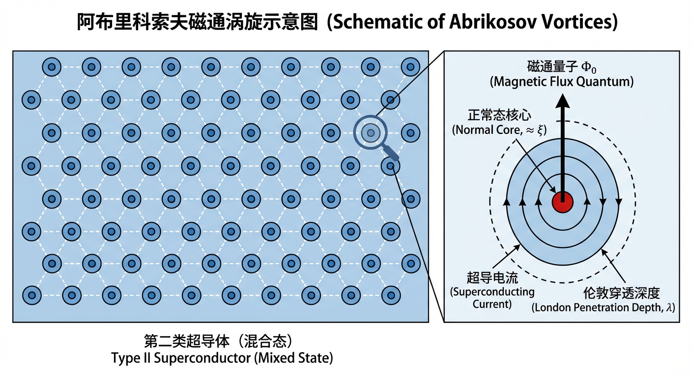
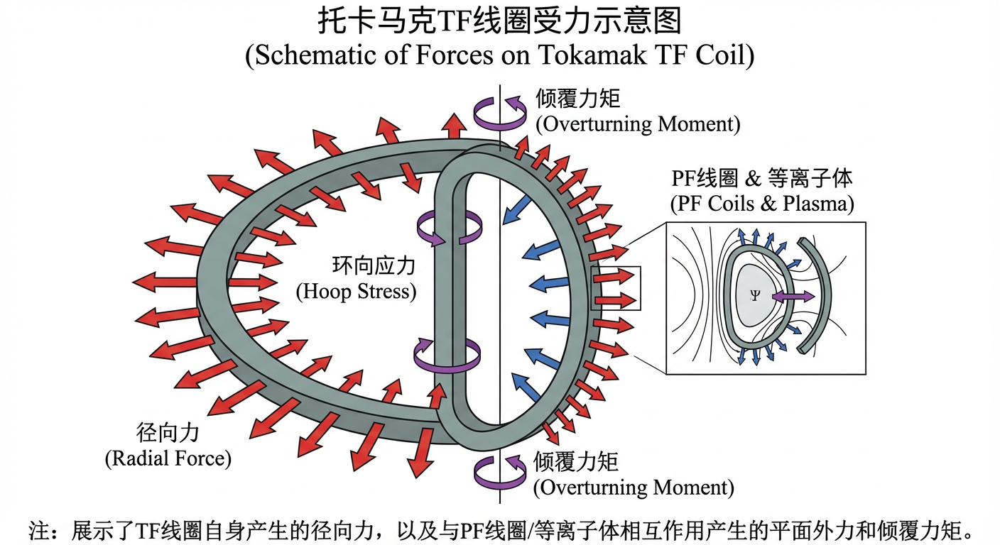
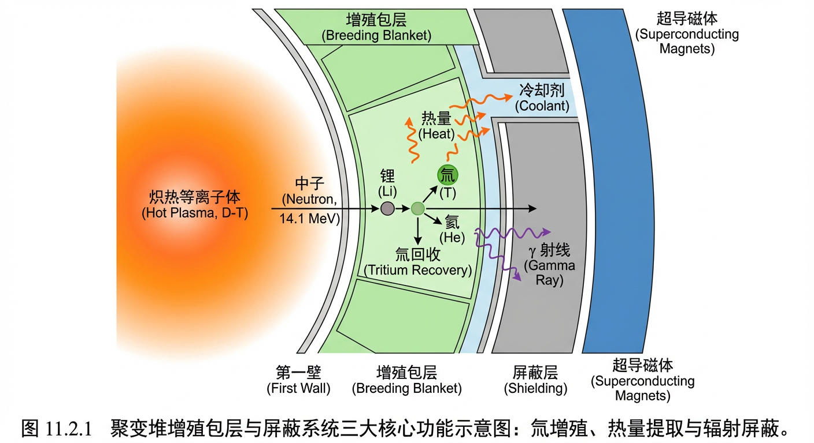
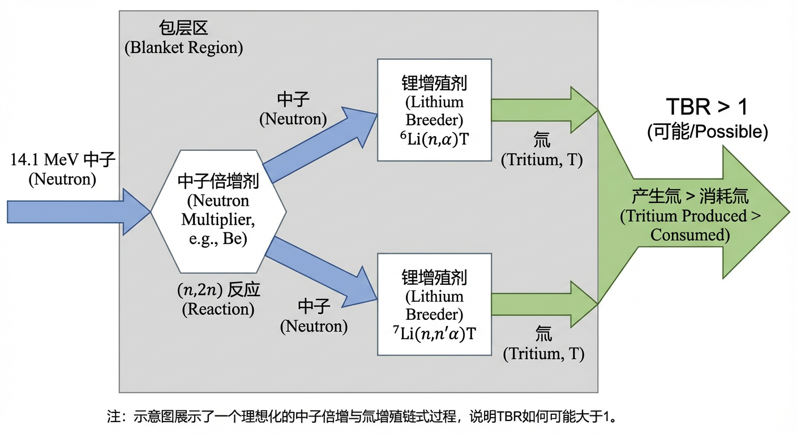
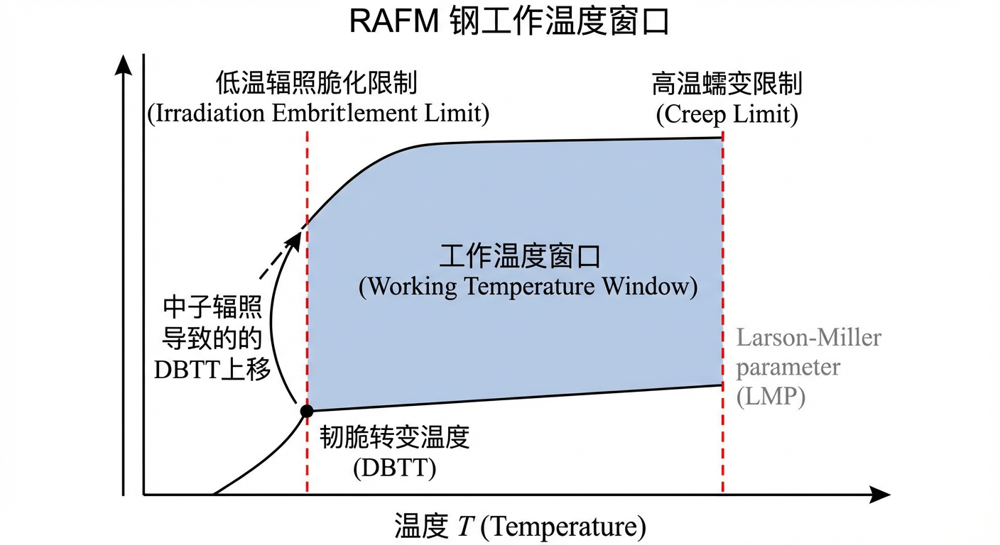
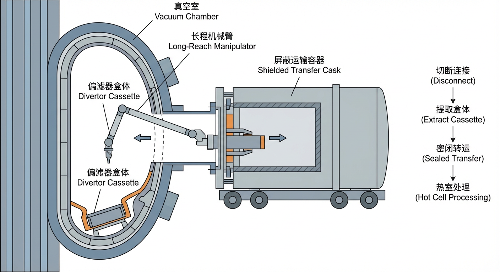

# 第11章 聚变堆工程约束与系统一致性收敛

## 11.0 项目概述

**实战项目：500 MW 聚变示范堆核心系统的一致性设计与平衡校核**

在之前的章节中，我们学习了聚变反应的物理原理；而本章将带领大家进入“工程现实”的世界。为了将理论转化为可运行的电站，必须满足严苛的工程约束并实现各子系统间的一致性。本章将贯穿一个虚构但基于物理真实的实战项目：设计并校核一座热功率为 500 MW 的氘-氚（D-T）聚变示范堆（DEMO）的关键工程参数。

**项目核心挑战：**  
聚变堆不是各部件的简单堆砌，而是一个高度耦合的系统。磁体系统需要极低温环境，这受到增殖包层屏蔽性能的制约；增殖包层需要生产足够的氚，其产率决定了燃料循环系统的库存需求；而所有这些系统的材料选择都必须通过寿命与安全性的考量。

**项目路径：**  
我们将通过三个关键阶段来完成这一挑战，每个阶段对应本章的一个核心子系统：
1. **磁体热负荷与低温架构校核**：针对超导磁体系统，计算辐射和传导热负荷，设计合理的低温冷却回路（基于 11.1 节）。
2. **包层中子谱与活化分析**：定性分析包层设计中慢化剂的引入如何改变中子能谱，进而影响钨和钢结构的活化路径与衰变热特性（基于 11.2 节）。
3. **燃料循环库存与自持性计算**：基于给定的驻留时间和效率参数，计算全厂各子系统的氚库存分布，验证燃料循环的闭合性（基于 11.3 节）。

通过这个项目，你将不仅仅是阅读工程原理，而是像总工程师一样，亲手处理聚变堆设计中的能量平衡、粒子平衡与系统集成问题。

---

## 11.1 磁体系统与电磁结构约束

在前面的章节中，我们已经深入探讨了约束、加热并维持聚变等离子体所需的复杂物理过程。然而，要将这些物理原理从理论构想转化为一个能够稳定运行的工程实体，我们需要一个强大的“容器”——一个能够产生并承受极端电磁环境的骨架。这个骨架，便是由超导磁体及其支撑结构组成的磁体系统。它不仅是实现磁约束聚变的核心技术基石，其自身的设计与运行也构成了一系列深刻而迷人的工程物理挑战。本子章节旨在系统性地阐述聚变装置磁体系统的设计原理、多物理场约束及其解决方案，揭示从微观的超导量子现象到宏伟的工程结构之间内在的逻辑关联。

我们将从超导磁体的基本物理原理出发，理解为何超导材料是聚变磁体的唯一选择，并探讨不同材料（从传统的低温超导体到前沿的高温超导体）的性能权衡。随后，我们将深入电磁设计，分析线圈如何产生所需的磁场位形。在此基础上，本节将聚焦于核心的电磁-结构耦合问题：由巨大电流和强磁场相互作用产生的、足以扭曲钢铁的电磁力，以及为抵御这些力而必须建立的结构约束。最后，我们将审视磁体系统在运行中所面临的稳定性与安全挑战，特别是“失超”这一终极故障模式及其精密的探测与保护策略。通过本章的学习，读者将能够理解，一个安全、可靠、高效的磁体系统，本身就是一场在电磁学、材料科学、结构力学与低温工程等多学科边界上寻求最优平衡的宏大交响。

为了支撑我们的实战项目，理解磁体系统的热负荷管理尤为关键。因为磁体不仅要产生磁场，还必须在极低温下维持运行，这直接决定了电站的能耗与架构。

### 11.1.1 聚变用超导磁体：原理与选材

要将上亿摄氏度的等离子体“装在瓶子里”，我们需要一个强大到超乎想象的磁场“牢笼”。若使用传统的铜线圈来产生如此强度的磁场，其自身巨大的电阻焦耳热将使其熔化。因此，工程师们将目光投向了一类神奇的量子材料——超导体（superconductors）。然而，通往实用聚变磁体的道路，远非寻找一种零电阻材料那么简单，它充满了精妙的物理原理与严苛的工程权衡。

#### 从“完美”到“实用”：第二类超导体的“魔鬼交易”

超导态的标志性特征不仅是零电阻，还伴随着一种被称为**迈斯纳效应（Meissner effect）**的抗磁行为：当材料转变为超导态时，它会将磁场从其内部排斥出去。这种行为定义了**第一类超导体（Type I superconductors）**在外磁场不超过临界值 $H_c$ 时的表现。然而，这种“纯粹”也使其脆弱：一旦外界磁场超过 $H_c$，超导性便会崩溃。对于需要产生十几特斯拉强磁场的聚变磁体而言，这类材料无法在强磁场环境下工作。

幸运的是，自然界提供了另一种选择：**第二类超导体（Type II superconductors）**。它们与强磁场达成了一种巧妙的“妥协”。这一行为的根源在于两种微观长度尺度的竞争：超导电子对维持其量子相干性的**相干长度（coherence length）** $\xi$，以及外部磁场能穿透超导体表面的**伦敦穿透深度（London penetration depth）** $\lambda$。当穿透深度远大于相干长度（即金兹堡–朗道参数 $\kappa=\lambda/\xi>1/\sqrt{2}$，工程上常见为 $\kappa\gg 1$）时，正常态区域与超导态区域之间的界面能为负，磁场以量子化形式进入体内在能量上更有利。

这便是第二类超导体的“魔鬼交易”：当外场超过下临界场 $H_{c1}$ 时，它不再完全排斥磁场，而是允许磁场以一根根**阿布里科索夫磁通涡旋（Abrikosov vortices）**的形式穿过材料。每个涡旋的核心是一个半径约为 $\xi$ 的正常态细丝，它携带一个磁通量子 $\Phi_0$，周围则环绕着超导电流。通过这种方式，第二类超导体与强磁场共存，直到达到更高的**上临界场（upper critical field）** $H_{c2}$ 时，超导性才会被完全摧毁。正是这种在“混合态”下承受高磁场的能力，为聚变磁体的建造提供了关键材料基础。

然而，这种共存并非没有代价。当承载输运电流密度 $\mathbf{J}$ 时，磁通涡旋会受到**洛伦兹力（Lorentz force）**密度 $\mathbf{f}_L=\mathbf{J}\times\mathbf{B}$ 的驱动。一旦涡旋运动，就会产生能量耗散。为了实现高电流承载能力，必须将这些涡旋“钉住”。这通过在材料中引入微观缺陷——如纳米析出相、晶界、位错等——来实现，这些缺陷成为涡旋的“钉扎中心”，提供抵抗洛伦兹力的钉扎力。材料能够无损耗承载的最大电流密度，即**临界电流密度（critical current density）** $J_c$，本质上由钉扎力与洛伦兹力之间的平衡决定。因此，高性能超导线材的制造，就是一门在原子尺度上进行“缺陷工程”的艺术。

#### 候选材料与工程约束

基于上述原理，聚变工程领域发展了几代关键的超导材料，每一种都代表了在性能、成本和工程可行性之间的独特权衡。

- **铌钛合金（NbTi）**：这种韧性良好的合金易于加工，是早期聚变装置和大型粒子加速器磁体的常用材料。然而，它的上临界场与临界电流密度在约 $10\,\mathrm{T}$ 以上会明显下降，难以满足现代高场聚变磁体的需求。

- **铌锡化合物（Nb\(_3\)Sn）**：作为一种 A15 相金属间化合物，Nb\(_3\)Sn 拥有更高的上临界场（在 $4.2\,\mathrm{K}$ 时约 $25$–$30\,\mathrm{T}$），使其能够在 $12$–$13\,\mathrm{T}$ 甚至更高的场区工作，是当前大型聚变装置（如 ITER）磁体的重要候选。然而，Nb\(_3\)Sn 的致命弱点是其极端的脆性。这催生了一种独特的“**先绕后反应（wind and react）**”工艺：首先用柔韧的铌和锡前驱体细丝绕制成线圈，然后将整个线圈在约 $650$–$700\,^{\circ}\mathrm{C}$ 下进行长时间热处理，使锡扩散并与铌反应生成 Nb\(_3\)Sn 相。这一过程对线圈绝缘、支撑等组件的高温耐受提出严苛要求。

- **高温超导体（High-Temperature Superconductors, HTS）**：以**稀土-钡-铜-氧（REBCO）**化合物为代表的 HTS 材料，为聚变磁体带来了革命性前景。它们拥有更高的临界温度与更高的上临界场（低温下可达远高于传统 LTS 的水平，工程上常以“远超几十特斯拉”描述），为在更高磁场（例如 $>13\,\mathrm{T}$）下运行提供更大的性能裕度。REBCO 通常以薄膜形式沉积在金属基带上形成复合带材，结构赋予其较高的机械强度和一定的应变耐受性。例如，托卡马克中心螺线管在脉冲运行中存在显著的电磁与热致应变循环，这对 Nb\(_3\)Sn 是严峻挑战，而 REBCO 带材在某些应变状态下具有更高的可用裕度。因此，先进设计方案常采用混合策略：为环向场（Toroidal Field, TF）线圈选择更成熟的 Nb\(_3\)Sn 或 HTS 方案之一，而为承受极端循环载荷的中心螺线管探索 REBCO 等 HTS 方案。

最后，我们必须区分**临界电流密度** $J_c$ 和**工程电流密度（engineering current density）** $J_e$。$J_c$ 是超导材料本身的物理极限，而 $J_e$ 是总电流除以导体的总截面积（包括超导体、用于稳定的铜、冷却通道和结构支撑）。$J_e$ 才是衡量整个磁体系统紧凑性和经济性的最终工程指标。聚变磁体设计的核心任务之一，便是在满足所有物理和工程约束的前提下，尽可能最大化 $J_e$。

### 11.1.2 线圈构型与电磁场计算

拥有了高性能的超导线材，下一步便是将其“编织”成能够产生特定磁场位形的宏伟线圈。这一过程始于电磁学最基本的定律，并终于复杂的工程几何。

从**毕奥–萨伐尔定律（Biot–Savart law）**出发，我们可以推导出最基本的场源关系。例如，对于一个半径为 $a$、长度为 $L$、总匝数为 $N$（匝密度 $n=N/L$）的有限长螺线管，通过将整个螺线管视为一叠连续的载流圆环，并利用叠加原理进行积分，可以得到其轴线上任意一点 $z$（距中心）的磁场精确表达式：

$$
B(z)=\frac{\mu_0 n I}{2}\left(\frac{\frac{L}{2}-z}{\sqrt{a^2+\left(\frac{L}{2}-z\right)^2}}+\frac{\frac{L}{2}+z}{\sqrt{a^2+\left(\frac{L}{2}+z\right)^2}}\right)
$$

这个公式是连接线圈几何参数与所产生磁场的理论基石。它清晰地表明，磁场强度不仅依赖于安匝数 $nI$，还与观察点相对于线圈两端的位置密切相关。只有在螺线管极长（$L\gg a$）且观察点远离两端（$|z|\ll L/2$）的理想情况下，该公式才退化为我们所熟知的无限长螺线管近似 $B\approx \mu_0 nI$。这个从第一性原理出发的推导，为所有更复杂的磁体数值模拟提供了基准。

在实际的聚变磁体中，线圈的绕制方式多种多样，以适应不同的力学和制造需求。例如，大型螺线管可以采用**分层绕制（layer-wound）**，即沿轴向连续螺旋绕制多层；也可以采用**饼式绕制（pancake-wound）**，即将多个独立绕制的扁平“线圈饼”堆叠起来。饼式绕制便于制造和质量控制，但饼之间的接头会引入额外的热负荷，并可能带来局部电磁与结构设计复杂性。

除了产生主磁场的螺线管，聚变装置还需要各种具有特定场形的线圈，例如用于校正磁场误差的校正场线圈。这类线圈的设计可采用**倾斜余弦-θ（Canted Cosine-Theta, CCT）**等构型，通过在圆柱面上布置倾斜导体路径，来产生高纯度的横向偶极场或其他高阶多极场。这些复杂构型的设计依据，仍然是毕奥–萨伐尔定律和安培定律。

### 11.1.3 电磁力与结构约束

当巨大的电流在线圈中流过，并置于自身和其它线圈产生的强磁场中时，一场无形但无比强大的“风暴”便在导体内部酝酿。根据洛伦兹力定律，每段载流导体都会受到电磁力密度 $\mathbf{f}=\mathbf{J}\times\mathbf{B}$ 的作用。这些力累积起来，足以对数千吨重的磁体结构产生毁灭性的影响。因此，理解、计算并约束这些力，是磁体设计的核心挑战。

#### 磁压力与环向应力

最主要的电磁力源于磁场自身的“压力”。磁场蕴含能量，其能量密度为 $u_B=B^2/(2\mu_0)$。在工程上常将其对应的量视为一种等效压力尺度，作用于承载电流的结构上。对于产生轴向磁场 $B_z$ 的螺线管，其周向电流密度 $J_\phi$ 与 $B_z$ 相互作用，产生巨大的径向向外力。这种力试图将线圈像轮胎一样“撑爆”，在线圈及其支撑结构中产生巨大的**环向应力（hoop stress）**。应力的大小与 $B^2$ 成正比，这意味着磁场强度每提高一倍，结构需要承受的应力便增大四倍。

#### 复杂载荷与结构支撑

在托卡马克这样复杂的环形装置中，力的图景变得更加错综复杂。除了环向场（TF）线圈自身产生的径向力，TF 线圈还会与极向场（PF）线圈及等离子体电流产生的磁场发生相互作用。来自 PF 系统和等离子体的磁场分量可能垂直或平行于 TF 线圈平面。这些相互作用会在 TF 线圈上产生强大的**平面外力（out-of-plane forces）**和**倾覆力矩（overturning moments）**，试图将其掰弯或扭曲。因此，工程师必须将每一段线圈都视为一个复杂的梁结构，计算这些力产生的弯矩和剪应力，并设计出坚固的支撑结构——如线圈盒、模块间剪力键以及外部抗扭结构——来共同抵御这些力。

#### 储存能量与安全风险

超导磁体系统中储存的电磁能量是巨大的。对于一个特征场强为 $5.5\,\mathrm{T}$、有效磁场体积为 $180\,\mathrm{m^3}$ 的大型托卡马克，按
$
U_B=\int (B^2/2\mu_0)\,\mathrm{d}V
$
估算，其储存的磁能约为 $2.2\,\mathrm{GJ}$。这约等于 $5.2\times 10^2\,\mathrm{kg}$ TNT 爆炸所释放的能量量级。虽然这股能量在正常运行时是受控的，但在故障（如大规模失超）情况下，如果这股能量在短时间内不受控释放，后果将非常严重。因此，低温系统排放与泄压、能量提取系统以及结构约束系统都必须按能够承受相关瞬态载荷的工况进行设计与定级。

### 11.1.4 运行约束：热负荷与失超保护

超导磁体运行在一个极其脆弱的平衡之上，对热扰动极为敏感。维持这种平衡，并在其被打破时进行有效干预，是确保磁体系统安全可靠运行的关键。

#### 热负荷管理

维持超导体所需的低温环境（例如液氦温区 $4.5\,\mathrm{K}$）本身就是一项巨大的工程挑战。低温系统必须持续不断地将各种来源的热量泵出。这些热负荷可分为两类：

- **静态热负荷**：即使在磁体稳定运行时也持续存在的热量来源，主要包括通过机械支撑结构和电流引线从高温区传入的**热传导**，通过多层绝热材料的残余**热辐射**，以及聚变中子和次级伽马射线穿透屏蔽层后在磁体冷质量中沉积的**核热**。
- **动态热负荷**：仅在磁场或电流发生变化时（如等离子体启动或关闭阶段）产生的热量，统称为**交流损耗（AC losses）**。变化的磁场会在超导电缆复杂的内部结构中（如超导细丝、稳定化铜基体）感应出微小的**涡流（eddy currents）**和**耦合电流（coupling currents）**，这些电流在正常金属中流动时会产生焦耳热。许多 AC 损耗分量与磁场变化率呈幂律关系（在一些常用近似下可随 $(\mathrm{d}B/\mathrm{d}t)^2$ 增长），因此直接限制了磁体电流的升降速率。

低温制冷机的容量必须根据正常运行时静态热负荷与脉冲运行期间峰值动态热负荷的叠加来设计，并留有足够的裕度。

#### 失超：探测与保护的“冰与火之歌”

超导磁体最严重的故障模式被称为**失超（quench）**。任何局部扰动（如机械振动或局部温升）都可能导致一小段导体暂时失去超导性，变为有电阻的正常态。运行电流流过该“正常区”会产生焦耳热，热量又会加热相邻区域，使其也转变为正常态，形成正反馈。如果不加以控制，正常区会蔓延并导致磁能以热形式快速释放，从而造成局部过热甚至损毁。

正常区在导体中传播的速度，即**正常区传播速度（Normal Zone Propagation Velocity, NZPV）**，是磁体保护设计的关键参数。对于传统低温超导体（LTS），如 NbTi、Nb\(_3\)Sn，由于工作温度低、材料比热容小，局部温升更容易触发传播，其 NZPV 常可达到 $\mathrm{m/s}$ 量级。这一特性有利于在较短时间内形成可测电压信号，从而实现电气探测。

对于高温超导体（HTS），如 REBCO，其工作温度可在 $20$–$50\,\mathrm{K}$ 区间，比热容更大，局部热扰动不易快速扩展，因此 NZPV 往往显著更低，常见为 $\mathrm{mm/s}$ 量级。较慢的传播使电压信号增长更慢，可能导致热点在电气信号可检测之前已积累较高温升，从而增加保护难度。相应地，失超探测与保护策略必须更主动、更分布式。

一种策略是安装**失超加热器（quench heaters）**，在探测到失超后主动加热线圈使其更均匀进入正常态，将能量分散到更大体积中。对于 HTS，由于热容大、热扩散路径复杂，传统加热器的有效性可能受限。更先进的技术之一是**耦合损耗诱导失超（Coupling-Loss-Induced Quench, CLIQ）**：通过向磁体注入快速变化的电流，在导体中诱发耦合与涡流损耗，从而实现更快、更均匀的能量沉积与电流衰减。

此外，**无绝缘（No-Insulation, NI）**绕制技术为 HTS 磁体提供了“自保护”思路：允许电流在失超或局部电阻出现时在匝间旁路分流，从而降低局部热点风险。但这会带来更长的电流充放时间常数以及更复杂的电磁力与热分析要求。

### 11.1.5 面向未来：高温超导与可拆卸磁体

随着聚变研究从科学实验走向工程示范和商业电站，磁体系统的设计理念也在不断演进。其中，由 HTS 技术催生的**可拆卸磁体（demountable magnets）**概念，旨在解决未来聚变堆维护性的根本难题。

传统托卡马克磁体，特别是环向场（TF）线圈，通常是一体的、闭合的环路。这意味着要更换堆芯部件（如包层模块），往往需要进行大规模拆解，停机时间长。可拆卸磁体的构想，是将 TF 线圈分成数个部分，通过精密的**机械与电学接头**连接。在维护期间，可“打开”接头并移出部分线圈，为内部部件更换提供通道。

这种便利性带来了严峻代价。在接头处，承载数万安培电流的导体需要跨越接触界面，接头不可避免存在**接触电阻（contact resistance）**。即使电阻为纳欧姆量级，在大电流下产生的焦耳热 $P=I^2R_j$ 也会给低温系统带来显著静态热负荷。此外，接头处也是结构薄弱环节，巨大的电磁力需要通过接头传递，可能引发应力集中与疲劳问题。

REBCO 等 HTS 的出现，使应对这些挑战更具可行性。更高的工作温度（$20$–$50\,\mathrm{K}$）为接头发热提供了更大的热裕度；带材形态与复合结构也有利于工程结构设计。可拆卸磁体研发体现了材料进步如何突破传统工程约束，为聚变堆维护性与经济性开辟新路径。

> **实战项目应用 I：磁体低温冷却回路的架构设计与校核**  
> 假设你正在设计上述 500 MW 聚变堆的磁体低温系统。磁体本身（冷质量）工作在 $T_c=4.5\,\mathrm{K}$，而为了减少热辐射，你设置了一个 $T_s=60\,\mathrm{K}$ 的热屏蔽层。外部真空容器温度为 $T_w=300\,\mathrm{K}$。  
>  
> **任务：**  
> 1. **热负荷估算**：利用斯蒂芬–玻尔兹曼定律计算从室温容器到 $60\,\mathrm{K}$ 热屏蔽层，以及从热屏蔽层到 $4.5\,\mathrm{K}$ 冷质量的辐射热负荷（已知发射率 $\varepsilon$ 和面积 $A$）。同时，计算 12 根复合支撑结构传导的热负荷。  
> 2. **质量流量计算**：已知 $4.5\,\mathrm{K}$ 回路允许的温升为 $\Delta T_{4.5}=0.2\,\mathrm{K}$，氦气定压比热容取 $c_p\approx 7000\,\mathrm{J/(kg\cdot K)}$ 的工程估算值。基于能量守恒，计算所需的氦气质量流量。  
> 3. **架构选择**：你需要决定采用“单级冷却”（只用 $4.5\,\mathrm{K}$ 制冷机冷却所有部件）还是“双级冷却”（独立的 $4.5\,\mathrm{K}$ 和 $60\,\mathrm{K}$ 回路）。请根据热力学效率和辐射热负荷与 $T^4$ 的强依赖关系，论证为何双级冷却（dual-level）是合理选择。  
>  
> 具体参数见本章末尾总结部分的解答。

### 小结

本节内容引领我们完成了一次从微观物理到宏观工程的旅程。我们看到，聚变磁体系统的构建，其根基是第二类超导体的量子特性：它允许磁场以磁通涡旋的形式进入，从而在牺牲部分完美抗磁性的前提下，换取了在高磁场下工作的能力。为了承载巨大电流，我们必须通过“缺陷工程”来钉扎涡旋。

从一根超导线材到一座宏伟磁体，是一项系统工程：需要精确计算由毕奥–萨伐尔定律决定的磁场分布，并据此预测由洛伦兹力定律产生的巨大电磁力，从而设计能够承受这些力的支撑结构。磁体中储存的磁能可达吉焦耳量级，要求能量提取与结构/低温安全系统具备相应的定级能力。

在运行层面，我们面临静态热负荷与动态交流损耗，并必须为“失超”设计可靠保护系统。高温超导体（HTS）呈现“双刃剑”：更高的热稳定性往往伴随更慢的正常区传播与更难的电气探测，促使 CLIQ、无绝缘线圈等策略发展。展望未来，以 HTS 为基础的可拆卸磁体预示维护性驱动的架构变革。

---

磁体系统的成功设计只是第一步。要让这些磁体在聚变环境下长期存活，它们必须得到保护，免受来自等离子体中心的高能中子轰击。这项任务由增殖包层与屏蔽系统承担，这正是我们下一阶段项目的核心——分析中子如何被慢化和屏蔽，以及这一过程如何反过来影响材料的活化特性。

## 11.2 增殖包层与中子学屏蔽接口

在聚变反应堆的设计蓝图中，增殖包层与屏蔽系统构成了连接炽热等离子体核心与外部超导磁体及支撑结构之间的关键接口。这一区域不仅是聚变能从诞生到被利用的第一个中转站，更是决定未来聚变电站能否实现燃料自持、安全运行与经济可行的核心地带。它肩负着三重相互交织且时常冲突的使命：首先，它必须像一座核物理炼金工厂，利用聚变产生的中子将锂元素转化为稀有的氚燃料，以满足反应堆自身的消耗，实现燃料循环的闭合；其次，它需要像一块高效的海绵，吸收并导出绝大部分聚变能（主要由中子携带），为发电提供热源；最后，它又必须如同一面坚不可摧的盾牌，将逃逸的中子与次级伽马射线层层削弱，以保护其身后脆弱的超导磁体和结构部件免遭辐射损伤。本节将循着一个典型聚变中子的生命轨迹，系统性地剖析实现这三大功能所依赖的中子物理学原理，以及在复杂工程约束下进行设计与优化的核心方法论。

### 11.2.1 聚变中子源与中子输运

所有包层中子学分析的起点，是对等离子体中聚变中子的诞生过程进行物理描述。在以氘-氚（deuterium–tritium, D-T）为燃料的聚变反应堆中，每个聚变事件产生一个氦核（$\alpha$ 粒子）和一个能量约 $14.1\,\mathrm{MeV}$ 的中子。为在后续工程计算中表征这一过程，我们引入体积中子源项 $S(\mathbf{r},E,\boldsymbol{\Omega})$，它描述在空间位置 $\mathbf{r}$、单位时间、单位体积、单位能量 $E$ 和单位立体角 $\boldsymbol{\Omega}$ 内产生的中子数。

对于由热核反应主导的 D-T 等离子体，其局域反应率密度由氘和氚的数密度 $n_D(\mathbf{r})$、$n_T(\mathbf{r})$ 以及与离子温度 $T_i$ 相关的反应性 $\langle\sigma v\rangle$ 决定。由于每个 D-T 反应产生一个中子，中子产生率可写为 $n_D(\mathbf{r})n_T(\mathbf{r})\langle\sigma v\rangle(T_i)$。工程中常采用两个近似构建源项：其一为**单能近似（monoenergetic approximation）**，即以狄拉克 $\delta$ 函数 $\delta(E-14.1\,\mathrm{MeV})$ 表示中子能量集中在 $14.1\,\mathrm{MeV}$；其二为**各向同性近似（isotropic approximation）**，即以 $1/4\pi$ 表示方向均匀发射。综合起来，理想化体积中子源项可写作：

$$
S(\mathbf{r},E,\boldsymbol{\Omega})=n_D(\mathbf{r})n_T(\mathbf{r})\langle\sigma v\rangle(T_i)\frac{\delta\!\left(E-14.1\,\mathrm{MeV}\right)}{4\pi}.
$$

理解这两个近似的物理基础与局限性至关重要。单能近似忽略了离子热运动引起的能谱展宽。实际上，聚变中子能谱在 $T_i\sim 10$–$20\,\mathrm{keV}$ 时可表现为以 $14.1\,\mathrm{MeV}$ 为中心、宽度为数百 $\mathrm{keV}$ 的分布。对于多数包层与屏蔽中的宏观输运与能量沉积计算，单能近似通常足够；而对于需要高分辨率能谱信息的应用（如中子谱诊断），则需要考虑展宽。同样地，各向同性近似源于 D-T 反应在质心系中的近各向同性以及热等离子体统计特性。但在存在显著定向离子群（例如由中性束注入驱动的快离子）或宏观旋转时，实验室系中子发射可呈现各向异性，源项需包含更复杂的角度依赖。

一旦中子离开等离子体，它在包层与屏蔽材料中的输运由中子输运理论支配。描述这一过程的重要数学工具是**玻尔兹曼输运方程（Boltzmann transport equation, BTE）**。其稳态形式为：

$$
\boldsymbol{\Omega}\cdot\nabla\psi(\mathbf{r},\boldsymbol{\Omega},E)+\Sigma_t(\mathbf{r},E)\psi(\mathbf{r},\boldsymbol{\Omega},E)
=
\int_{4\pi}\int_{0}^{\infty}\Sigma_s(\mathbf{r},E'\to E,\boldsymbol{\Omega}'\to\boldsymbol{\Omega})\psi(\mathbf{r},\boldsymbol{\Omega}',E')\,\mathrm{d}E'\,\mathrm{d}\boldsymbol{\Omega}'
+Q(\mathbf{r},\boldsymbol{\Omega},E).
$$

方程左侧代表损失：第一项为流失项，第二项为碰撞移出项（由宏观总截面 $\Sigma_t$ 表征）。右侧代表增益：第一项为散射源项（由双微分散射截面 $\Sigma_s$ 描述），第二项为外源项 $Q$。由于 BTE 复杂，直接解析求解困难。现代聚变中子学设计中常用**蒙特卡罗方法（Monte Carlo method）**，通过模拟大量中子生命史统计得到通量分布与反应率；能够同时追踪中子与次级光子的**耦合中子–光子输运**模拟，是计算核加热、剂量等工程参数的常用高精度工具。

### 11.2.2 中子经济学：氚增殖与中子倍增

中子在包层中的旅程并非漫无目的，其核心使命是实现“中子经济学”的平衡甚至盈余，以确保氚燃料自持。这依赖于两个关键核过程：氚增殖与中子倍增。

为了闭合 D-T 燃料循环，每一个在聚变反应中消耗的氚原子，都必须通过中子与锂（Li）的反应重新生成。自然界两种锂同位素 $^{6}\mathrm{Li}$ 与 $^{7}\mathrm{Li}$ 均可用于此目的，但反应特性不同。$^{6}\mathrm{Li}(n,\alpha)\mathrm{T}$ 反应为放热反应（$Q=+4.78\,\mathrm{MeV}$），无能量阈值，其截面在低能区近似遵循 $1/v$ 规律，对慢中子具有高概率。相反，$^{7}\mathrm{Li}(n,n'\alpha)\mathrm{T}$ 为吸热反应（$Q\approx -2.47\,\mathrm{MeV}$），存在约 $2.8\,\mathrm{MeV}$ 阈能，主要由快中子触发，并在产氚同时放出一个能量较低的出射中子。

**氚增殖比（Tritium Breeding Ratio, TBR）**严格定义为整个系统中氚的总产生率与聚变反应中氚的总消耗率之比。由于中子在输运过程中会被结构材料寄生吸收或泄漏，单纯依赖 $^{6}\mathrm{Li}(n,\alpha)\mathrm{T}$ 的“一中子换一氚”机制难以在真实系统中获得足够裕度。因此，工程上通常引入**中子倍增（neutron multiplication）**机制，通过高能中子与材料发生 **$(n,2n)$ 反应**产生额外中子，以提高可用于增殖的中子数。聚变包层常用倍增剂为铍（Be）与铅（Pb）：$^{9}\mathrm{Be}(n,2n)$ 阈能约 $1.7\,\mathrm{MeV}$，而 Pb 的 (n,2n) 阈能约 $7$–$8\,\mathrm{MeV}$。因此铍能在更宽能谱范围参与倍增。铍作为轻元素也具有一定慢化作用，有利于将中子能量降至 $^{6}\mathrm{Li}$ 有效区间。成功的包层设计需要“中子谱工程”：通过合理布置增殖剂、倍增剂与慢化剂，兼顾增殖、倍增、能量提取与屏蔽等目标。

### 11.2.3 包层概念与中子谱工程

基于对中子经济学的理解，聚变工程界发展了多种包层概念。这些方案通过不同材料与冷却剂组合塑造不同中子能谱环境，形成各自独特的性能与挑战。

- **氦冷卵石床包层（Helium-Cooled Pebble Bed, HCPB）**：采用锂陶瓷（如 $\mathrm{Li_4SiO_4}$）与铍卵石床分别作为增殖剂与倍增剂，使用高压氦气冷却。氦对中子慢化效应弱，因此能谱较硬（快中子占比高），有利于铍的 (n,2n) 倍增，但对 $^{6}\mathrm{Li}$ 的低能区俘获优势利用相对不足，且对后方屏蔽提出更高要求。

- **水冷铅锂包层（Water-Cooled Lithium Lead, WCLL）**：采用液态铅锂合金（LiPb）作为增殖介质，并利用铅的 (n,2n) 反应进行倍增，结构材料由加压水冷却。水是强慢化剂，会显著软化能谱，提高 $^{6}\mathrm{Li}(n,\alpha)\mathrm{T}$ 反应率，但会降低高能中子通量，从而抑制 Pb 的高阈值 (n,2n) 反应；同时水中的氢也会产生寄生俘获。WCLL 的 TBR 取决于这些效应的权衡。

- **双冷铅锂包层（Dual Coolant Lithium Lead, DCLL）**：采用液态 LiPb 作为增殖与传热介质，结构材料回路采用氦冷却。与 WCLL 相比，DCLL 不含强慢化剂水，因此能谱较硬，更有利于 Pb 的 (n,2n) 反应，具有实现较高 TBR 的潜力。

值得注意的是，即使某包层单元的理想化局部增殖比（local breeding ratio, LBR）很高，真实全局 TBR 仍会因几何覆盖率不足、贯穿孔道、结构材料寄生吸收与缝隙泄漏而降低。简化估算示例：若增殖区 LBR 为 1.40，几何覆盖率 85%，且进入该区域的中子有 25% 因吸收或泄漏损失，则净 TBR 约为

$$
1.40\times 0.85\times 0.75\approx 0.89,
$$

已无法满足自持要求。这凸显了最大化覆盖率与减少非增殖材料的重要性。

### 11.2.4 屏蔽、核热与损伤：中子输运的工程后果

中子与物质相互作用的终点，除了产生氚，还必然伴随着能量沉积与材料结构改变。对这些后果的预测与管理，构成了中子学与热工、结构、材料等学科的关键接口。

**辐射屏蔽与流漏**

包层自身是第一道辐射屏障，但其后通常仍需专用屏蔽层保护超导磁体。对厚屏蔽层快中子深度穿透，可用**宏观移出截面（macroscopic removal cross section）** $\Sigma_R$ 作简化估算，快中子通量在均匀屏蔽体内近似指数衰减：

$$
\Phi(x)\approx \Phi(0)\exp(-\Sigma_R x).
$$

例如，要将入射通量衰减 $5.85\times 10^{5}$ 倍，若 $\Sigma_R\approx 0.0775\,\mathrm{cm^{-1}}$，则所需厚度

$$
x=\frac{\ln(5.85\times 10^{5})}{0.0775}\approx 171\,\mathrm{cm}.
$$

该模型仅适用于均匀体屏蔽。在真实聚变堆中存在诊断与管路孔道，导致**中子流漏（neutron streaming）**，孔道出口辐射水平可能高出周围体屏蔽数个数量级，需通过影子屏蔽或几何优化抑制。

**核热沉积与材料损伤**

中子慢化与俘获会将动能与反应能量沉积为**核热（nuclear heating）**，常用体积热源 $q'''(\mathbf{r})$（单位 $\mathrm{W/m^3}$）描述，为后续热工水力与热应力分析提供输入。中子碰撞还会造成**辐射损伤**，用**每原子离位数（displacements per atom, dpa）**表征。核热与 dpa 的空间分布通常通过中子学模拟（如蒙特卡罗）获得，是材料寿命评估与性能演化建模的基础。

文中示例需要满足量纲与热传导边界条件一致：对于厚度 $L=5\,\mathrm{mm}$ 的钢第一壁，若承受表面热流 $q''=1.0\,\mathrm{MW/m^2}$ 且存在均匀体积核热 $q'''=5.0\,\mathrm{MW/m^3}$，其稳态温差量级可用一维导热估算为

$$
\Delta T \approx \frac{q''L}{k}+\frac{q'''L^2}{2k}.
$$

取钢在高温区导热系数 $k\sim 20$–$30\,\mathrm{W/(m\cdot K)}$，则 $\Delta T$ 为数百开尔文量级，体现核热与高热流对温度梯度的显著影响。

> **实战项目应用 II：中子能谱软化对材料活化的影响分析**  
> 你的项目进入包层材料优化阶段。现在有两种包层设计方案：  
> - **设计 1**：未慢化的快中子谱（含铍作为倍增剂/倍增层的代表材料）。  
> - **设计 2**：引入石墨或水作为慢化剂，使能谱“软化”，增加低能中子比例。  
>  
> **任务：**  
> 1. **反应率定性分析**：基于反应率公式 $R_i=N\int \phi(E)\sigma_i(E)\,\mathrm{d}E$，定性判断从设计 1 转变为设计 2 时，钢结构中的 $(n,\gamma)$ 俘获反应（如 $\mathrm{^{58}Fe}(n,\gamma)$）和阈值反应（如 $\mathrm{^{56}Fe}(n,p)$）的速率如何变化。  
> 2. **衰变热预测**：钢中的短寿命核素（如 $\mathrm{^{56}Mn}$，半衰期 $2.6\,\mathrm{h}$）主要由快中子阈值反应产生，而长寿命核素（如 $\mathrm{^{60}Co}$）主要由热中子俘获产生。预测引入慢化剂后，停堆初期的“瞬时衰变热”和长期放射性水平分别呈现怎样的变化趋势，并讨论其对废料管理的含义。  
>  
> 具体分析见本章末尾总结部分的解答。

### 小结

本节系统探索了聚变堆核心中子物理。我们从 $14.1\,\mathrm{MeV}$ 中子的诞生出发，借助玻尔兹曼输运方程追踪其在包层与屏蔽中的输运。为实现氚自持，必须综合利用 $^{6}\mathrm{Li}$ 与 $^{7}\mathrm{Li}$ 的增殖特性，并通过 (n,2n) 反应进行中子倍增，“中子经济学”的关键在于能谱调控。不同包层概念展示了材料与冷却剂如何塑造能谱与系统权衡。最后，我们讨论了屏蔽、核热沉积与辐照损伤等工程后果，说明中子学如何为热工、结构与材料设计提供关键输入。

---

如果说中子学解决了氚的“生产”问题，那么如何将这些氚提取、纯化并送回等离子体，则是我们项目在“物质循环”层面面临的最大挑战。在下一节，我们将通过计算具体的质量流量和滞留时间，来量化这个过程。

## 11.3 氚燃料循环与氚安全边界

如果说增殖包层与屏蔽系统的设计（见 11.2 节）是聚变堆工程的“硬件”挑战，那么维系这颗“人造太阳”持续燃烧的“软件”与“血液循环系统”，则完全围绕着一种独特而棘手的元素——氚。作为氘-氚（D-T）聚变反应的关键燃料，氚的供应与控制是决定聚变能能否从科学演示走向商业现实的命脉。然而，氚是一种半衰期为 12.32 年的放射性同位素，在自然界中仅痕量存在。这一障碍催生了可控核聚变领域最精巧、也最具挑战性的系统工程之一：氚燃料循环（tritium fuel cycle）。

本节将引领读者探索这个维系聚变之火的生命线：为何必须选择 D-T 反应路径；如何在反应堆内部通过中子与锂反应实现氚增殖；为何氚“产出”必须系统性超越“消耗”；燃料循环关键子系统与氚库存核算；以及氚在材料中的渗透与滞留如何构成安全边界。最后，我们将讨论增殖包层的热工水力学建模，展示这些物理化学过程与工程约束的耦合。通过本节学习，读者将理解对氚全生命周期进行建模与控制，是聚变能安全与经济可行性的关键。

### 氚的自持：从核反应到增殖比

#### 缘起：D-T 反应的物理与经济必然性

在众多潜在聚变反应中，D-T 反应因其高反应性而备受青睐：

$$
\mathrm{D}+\mathrm{T}\rightarrow \alpha+n+17.6\,\mathrm{MeV}.
$$

依据能量与动量守恒，中子带走约 $14.1\,\mathrm{MeV}$（约 80%），$\alpha$ 粒子带走约 $3.5\,\mathrm{MeV}$（约 20%）。$\alpha$ 粒子被磁场约束在等离子体内部并用于自加热，中子逃逸并在包层沉积能量用于发电，同时为增殖提供“触发器”。

选择 D-T 反应的根本原因是其高反应性。在离子温度约 $15\,\mathrm{keV}$（约 $1.7\times 10^8\,^{\circ}\mathrm{C}$）附近，D-T 反应的功率密度相对 D-D 反应通常高出约两个数量级。功率密度比可用如下形式估算：

$$
\frac{P_{DT}}{P_{DD}}\approx \frac{\langle\sigma v\rangle_{DT}Q_{DT}}{\tfrac{1}{2}\langle\sigma v\rangle_{DD}Q_{DD}}.
$$

在常用反应性数据下，该比值可达到 $10^2$–$10^3$ 的量级，工程上常见估算为数百量级。这意味着采用 D-T 燃料可以在更小尺寸或更低约束要求下达到较高功率密度，降低实现净能量增益的门槛。但其代价是燃料中氚的稀缺性：氚在自然界极少，无法依赖外部长期供应。因此任何可持续运行的 D-T 聚变电站都必须实现氚自持，即在消耗氚的同时在包层内生产足够的氚补充消耗。

#### “炼金术”：中子与锂的创生之舞

实现氚自持的途径是利用 D-T 反应产生的高能中子与增殖包层中的锂发生反应“炼”出新的氚。自然锂由两种稳定同位素 $^{6}\mathrm{Li}$ 与 $^{7}\mathrm{Li}$ 组成：

- **$^{6}\mathrm{Li}(n,\alpha)\mathrm{T}$**：放热反应（$Q=+4.78\,\mathrm{MeV}$），无阈值，低能区截面大，近似遵循 $1/v$ 规律，是主要增殖通道。
- **$^{7}\mathrm{Li}(n,n'\alpha)\mathrm{T}$**：吸热反应（$Q\approx -2.47\,\mathrm{MeV}$），阈能约 $2.8\,\mathrm{MeV}$，由快中子触发；产氚同时放出一个能量较低的中子，可继续参与增殖。

由于中子在输运中会被吸收或泄漏，仅靠“一换一”难以获得足够裕度，因此常引入**中子倍增剂（neutron multiplier）**。铍与铅可发生 $(n,2n)$ 反应，增加中子总数，从而提高可用于增殖的中子“通货”。不同材料的倍增性能与阈能不同，因此包层设计需综合材料选择与能谱塑形以最大化增殖效率。

#### 超越“一换一”：氚增殖比的系统需求

**氚增殖比（TBR）**严格定义为单位时间内从增殖系统净产生并进入可用库存的氚量与等离子体中实际消耗的氚量之比。为燃料自持，TBR 必须大于 1，且工程上通常要求达到约 1.1 或更高，以覆盖损失与库存增长需求。定义**增殖增益** $BG=\mathrm{TBR}-1$，其必要性来源于：

1. **燃烧不完全**：燃烧份额 $f_b$ 往往仅为百分之几到十几，大量未燃烧燃料需回收。
2. **处理损失**：同位素分离、净化等过程回收效率非 100%。
3. **材料滞留**：部分氚滞留在材料中形成库存。
4. **放射性衰变**：氚以 12.32 年半衰期衰变。
5. **启动库存增长**：为未来机组启动积累富余氚。

将这些因素量化可得到所需 TBR。例：若一座约 2 GW 级电站燃料循环综合效率为 95%，并计划每年积累 10 kg 启动库存，则其所需 TBR 可能达到约 1.1–1.2 的量级，这对包层中子学设计与工程实现提出苛刻要求。

### 氚的迷宫：燃料循环与材料相互作用

氚在包层中诞生后，必须被提取、净化、分离并重新注入等离子体，形成闭环系统。

#### 闭环之旅：燃料循环的系统架构

典型氚燃料循环可分为多个互联系统：

- **增殖与提取系统（Blanket & TES）**：氚在包层中产生并被吹扫气体或液态介质带出。
- **废气处理与真空泵送系统（Exhaust processing & VPS）**：抽排未反应 D-T、氦灰与杂质。
- **同位素分离系统（Isotope Separation System, ISS）**：常采用深冷精馏等手段分离 H/D/T。
- **储存与供料系统（Storage & Delivery System, SDS）**：安全储存并按需供料。
- **大气除氚系统（Atmospheric Detritiation System, ADS）**：捕获厂房空气中泄漏氚，作为安全屏障的重要组成。

关键概念包括**通量**、**滞留时间**与**库存**，满足 $I=\dot{m}\tau$。等离子体内库存可能仅为克或更低量级（滞留时间短），而在滞留时间较长的处理系统中，库存可能显著增大。因此，对各子系统库存进行建模与核算，是氚安全管理与经济运行的基础。

#### 渗透与滞留：氚作为“越狱大师”的物理学

**渗透（permeation）**指氚穿透固体材料的过程。气相氢同位素分子在金属表面解离并溶解，常用**西弗茨定律（Sieverts' law）**描述溶解浓度 $c$ 与分压 $p$ 关系：

$$
c=S\sqrt{p},
$$

其中 $S$ 为溶解度。溶解原子在浓度梯度驱动下扩散，遵循**菲克定律（Fick's law）**：

$$
\mathbf{J}=-D\nabla c.
$$

在稳态、一维、两侧分压分别为 $p_1$ 与 $p_2$ 的情况下，可得到渗透通量关系：

$$
J=\frac{P}{L}\left(\sqrt{p_1}-\sqrt{p_2}\right),
$$

其中 $P=DS$ 为**渗透率（permeability）**，$L$ 为壁厚。该式表明降低渗透可通过降低溶解度或降低扩散系数实现。

**滞留（retention）**关注氚在材料缺陷中的俘获与累积。缺陷（空位、位错、晶界等）形成陷阱，按结合能可区分为：

- **可移动库存（mobile inventory）**：浅陷阱，工作温度下可释放并继续扩散。
- **不可移动库存（trapped inventory）**：深陷阱，释放时间可达月到年量级。

不可移动库存会造成氚衡算中的“表观亏损”，对燃料管理与安全评估提出挑战。

#### 建造“氚之墙”：渗透屏障的设计与挑战

工程上常通过**渗透屏障（permeation barrier）**降低氚向冷却剂或环境迁移。多层结构可类比电阻串联：总渗透阻力为各层阻力之和。通过在结构钢表面沉积低渗透率陶瓷涂层（如 $\mathrm{Al_2O_3}$、$\mathrm{Er_2O_3}$），即使厚度为微米级，也可显著降低等效渗透率。工程上常用**渗透降低因子（Permeation Reduction Factor, PRF）**表征屏障效果，PRF 达到 $10^4$–$10^6$ 的量级在实验与工程目标中均常被讨论。

屏障长期可靠性受高温、辐照与应力耦合影响：热膨胀不匹配可导致开裂/剥落；辐照可引发缺陷增殖并可能出现辐照增强扩散（radiation-enhanced diffusion, RED），削弱屏障有效性。因此屏障评估需考虑长期演化与多场耦合。

### 边界与权衡：热工、安全与经济性

#### 多物理场耦合：增殖包层的热工水力学

增殖包层也是聚变能的主要转换区，核热形成强体积热源。液态金属包层（如铅锂）中一个突出挑战是**磁流体动力学（Magnetohydrodynamics, MHD）**效应：导电流体在强磁场中流动感应电流，电流与磁场作用产生洛伦兹力，形成“磁制动”，增加压降并抑制湍流。湍流被抑制会恶化传热与传质，导致包层温度升高、氚输运变慢，进而可能加剧渗透风险。电绝缘流道插件等技术常用于减弱 MHD 压降与改善传热，是液态金属包层可行性的关键环节。

#### 动态安全边界：库存演化与控制

全厂氚库存是需严格控制的源项。可通过耦合常微分方程组建立库存动态模型，描述各子系统库存因生产、消耗、处理、泄漏与衰变而变化。该模型可用于分析子系统效率下降等故障对总库存的瞬态影响，并计算库存达到安全阈值所需时间，为预警、事故分析与应急规程提供定量依据。

#### 系统集成与经济性考量

燃料循环性能直接影响经济可行性。若计入损失后有效 TBR 小于 1，将导致持续燃料赤字。氚在市场上价格昂贵，微小亏损率对年消耗上百公斤的电站可造成显著成本。同时，庞大库存带来资产与监管成本。通过优化设计实现高 TBR、高处理效率与低滞留时间，是聚变商业化的关键。燃料循环可靠性与缓冲库存大小也影响电站可用性与抗供应中断能力。

文中示例“一个拥有 7 天缓冲库存但存在 3.2% 氚亏损的电站，在外部供应完全中断情况下缓冲库存可维持约 219 天”在时间尺度上不一致：若仅有 7 天库存，则在无补给且持续消耗条件下无法维持数百天运行。合理表述应为：在外部供应中断时，电站可运行时间主要由缓冲库存与净亏损（或净增殖）共同决定；若库存为 7 天且无增殖补偿，则运行时间约为 7 天量级；若存在较大库存或净增殖，则可显著延长运行时间。

> **实战项目应用 III：燃料循环系统的库存计算与闭合性验证**  
> 项目进入“软件”设计阶段。你构建了一个包含六个子系统的闭环模型：**等离子体、真空、泵送、处理、增殖、储存**。  
>  
> **任务：**  
> 1. **质量平衡计算**：已知电站聚变功率 $P_f=500\,\mathrm{MW}$，等离子体燃烧份额 $f_b=0.10$。根据 $E_{DT}=17.6\,\mathrm{MeV}$，计算氚的燃烧速率 $\dot{m}_{\mathrm{burn}}$、注入速率 $\dot{m}_{\mathrm{inj}}$ 以及从等离子体排出的未燃烧流 $\dot{m}_{\mathrm{pump}}$。  
> 2. **增殖需求确定**：假设处理系统有 $L=0.5\%$ 的损耗。为维持稳态储存库存不变（$(1-L)\dot{m}_{\mathrm{pump}}+\dot{m}_{\mathrm{breed}}=\dot{m}_{\mathrm{inj}}$），计算增殖包层必须提供的产氚率 $\dot{m}_{\mathrm{breed}}$。  
> 3. **库存分布评估**：基于各子系统的滞留时间 $\tau$（如泵送系统 $80\,\mathrm{s}$，增殖包层 $10^5\,\mathrm{s}$），利用 $I=\dot{m}_{\mathrm{through}}\tau$ 计算各子系统稳态库存。注意辨析各子系统的物理流通量 $\dot{m}_{\mathrm{through}}$ 对应注入量、泵送量还是增殖量。  
>  
> 具体计算过程与结果见本章末尾总结部分的解答。

### 小结

本节揭示了氚燃料循环作为聚变堆核心系统工程的本质：它从微观核反应起步，却最终决定电站宏观经济性与安全边界。实现氚自持不仅需要 TBR 大于 1 的中子学能力，更依赖高效、低损耗、可控库存的化工处理闭环。氚渗透与滞留从原子尺度扩散到宏观屏障工程再到厂房除氚与许可要求，构成纵深防御的重要组成。

---

前述的燃料循环和中子学设计，实际上为材料提出了严酷的“生存环境”。高温、中子辐照和氚渗透的组合，对反应堆材料的寿命构成了终极约束。在下一节，我们将探讨这些材料如何在如此极端条件下服役。

## 11.4 材料服役与寿命约束

在前面的章节中，我们已经探讨了聚变堆的磁体、包层与燃料循环等核心工程系统。然而，所有这些宏伟的工程构想，最终都必须由实实在在的材料来承载。在聚变反应堆的心脏地带，材料将经受严酷考验：高温、中子辐照、机械与热应力循环，以及与冷却剂的化学交互。在多物理场耦合环境中，材料性能会随时间退化。因此，理解材料服役行为、量化性能衰减并预测寿命，直接决定聚变电站安全性、经济性与可行性。

本节将讨论聚变堆关键材料的服役与寿命约束：结构材料（低活化钢与高熵合金）、功能材料（SiC/SiC 与钨）、活化与衰变热建模，以及多尺度建模如何连接原子尺度机制与工程寿命预测。

### 聚变结构材料：低活化设计与性能演化

#### 低活化铁素体/马氏体钢

当前研究最成熟的候选结构材料之一是**低活化铁素体/马氏体钢（Reduced-Activation Ferritic/Martensitic, RAFM）**。其设计理念是在 9–12%Cr 耐热钢基础上，通过元素筛选降低长寿命放射性产物生成。

“低活化”并非没有放射性，而是尽量缩短退役后放射性衰减到法规阈值所需时间。其核物理基础在于避免或限制某些元素（如 Nb、Mo、Ni、Co 等），以抑制生成长寿命核素。例如，含 Nb 的钢在中子辐照下可生成半衰期约 $2\times 10^4$ 年的 $^{94}\mathrm{Nb}$。而关于“Mo 生成 $^{99}\mathrm{Tc}$ 且半衰期数十万年”的表述需限定：$^{99}\mathrm{Tc}$（半衰期约 $2.1\times 10^5$ 年）确是重要长寿命核素，但其在结构钢中的形成路径与能谱、反应链和元素组成有关；工程低活化设计通常仍倾向于用 W、Ta 等替代部分 Mo/Nb 以改善活化特性，但具体核素谱需通过活化计算（如 FISPACT/ALARA 或相应数据库）评估。低活化策略目标是使部件在约百年量级冷却后有望达到回收或低放处置标准。

RAFM 钢的高温强度与抗蠕变能力与其**回火马氏体（tempered martensite）**微观结构相关：位错、板条边界与弥散碳化物析出相共同强化材料并影响辐照缺陷演化，从而抑制辐照肿胀。

RAFM 钢寿命主要受两类约束：高温蠕变与低温辐照脆化。蠕变可借助时间–温度等效思想，使用**拉森–米勒参数（Larson–Miller parameter, LMP）**进行外推：

$$
P_{LM}=T\left(C+\log_{10}t_r\right),
$$

其中 $T$ 为绝对温度（$\mathrm{K}$），$t_r$ 为断裂时间（通常以小时计），$C$ 为材料常数。对于给定应力水平，$P_{LM}$ 近似恒定，可用高温短时数据外推低温长时寿命。文中举例“由 900 K 下 5000 h 与 1000 K 下 20 h 两点确定材料常数并预测 950 K 下断裂寿命 274 h”属于示例性说明，实际外推通常需多点数据与应力相关拟合（如主曲线法），以满足工程规范要求。

另一方面，RAFM 钢为体心立方（BCC）金属，存在**韧脆转变温度（Ductile-to-Brittle Transition Temperature, DBTT）**。中子辐照导致缺陷增殖与辐照硬化，提高屈服强度并降低韧性，使 DBTT 上移，限制启停与事故工况的最低允许温度。因此，高温蠕变与低温辐照脆化共同限定了材料的**工作温度窗口**，进而约束热效率与结构设计。

#### 高熵合金

为突破传统合金瓶颈，提出了**高熵合金（High-Entropy Alloys, HEA）**范式。HEA 通常由 $\ge 5$ 种元素以近等原子比混合，通过较高的构型熵促进形成简单固溶体相并抑制部分金属间化合物形成。HEA 的晶格畸变与化学无序可能影响缺陷迁移与复合过程，从而带来潜在抗辐照优势。但“迟滞扩散（sluggish diffusion）”作为普适规律并非对所有 HEA 都成立，需结合具体体系、温度与相结构通过实验与计算验证。

HEA 研究体现了**集成计算材料工程（Integrated Computational Materials Engineering, ICME）**思想：连接加工–组织–性能–服役的预测链。以 CoCrFeNiMn 等体系为例，不同加工方式（如增材制造与铸造）将导致不同凝固路径与组织；进一步可结合晶体塑性模型与 Hall–Petch 关系，从晶粒尺度预测强度，并输入疲劳/断裂模型评估寿命。这种多尺度、多模型协同可加速材料筛选与设计。

### 陶瓷与难熔材料：面向极端环境的屏障

#### 碳化硅复合材料

碳化硅（SiC）具有低活化、高温稳定等优势，但单体陶瓷脆性大。**SiC/SiC 纤维增强复合材料**通过引入弱界面层（如热解碳或氮化硼）实现裂纹偏转与纤维拔出耗能，使材料表现出“伪延性”。

陶瓷寿命仍可能受**亚临界裂纹扩展（Subcritical Crack Growth, SCG）**控制。在应力与腐蚀环境下，裂纹增长速率常用幂律表示：

$$
v=\frac{\mathrm{d}a}{\mathrm{d}t}=A K_I^n,\qquad K_I=Y\sigma\sqrt{\pi a}.
$$

当 $K_I$ 达到断裂韧性 $K_{Ic}$ 时发生快速断裂。文中“牙科陶瓷”示例用于说明方法学，聚变用 SiC/SiC 的参数与环境（温度、冷却剂化学、辐照）不同，工程应用需使用相应材料数据库与环境相关模型。

#### 钨及难熔材料

钨（W）及其合金熔点高、导热好、抗溅射能力强，是偏滤器等面向等离子体部件常用材料。钨为 BCC 金属，DBTT 较高，辐照会进一步硬化并上移 DBTT，限制最低安全工作温度。高能中子嬗变可生成 Re 等元素，改变力学性能与脆性行为。

钨的氢同位素滞留也很关键：辐照缺陷形成深陷阱增加滞留，对燃料循环与安全构成挑战；同时陷阱也会降低有效扩散，从渗透角度可能具有双重影响，需结合温度与缺陷演化综合评估。

### 材料中的活化与衰变热建模

材料辐照活化与衰变热决定维护、事故分析与废物管理的关键输入。对于特定放射性核素 $P_i$，在恒定中子通量 $\phi$ 下辐照时间 $t_{\mathrm{irr}}$ 后、冷却时间 $t_{\mathrm{cool}}$ 时的活度可写为：

$$
A_{P_i}(t_{\mathrm{cool}})=N_{X_i}\,\bar{\sigma}_i\,\phi\left(1-e^{-\lambda_i t_{\mathrm{irr}}}\right)e^{-\lambda_i t_{\mathrm{cool}}},
$$

其中 $N_{X_i}$ 为靶核素原子数密度，$\bar{\sigma}_i$ 为谱平均活化截面，$\lambda_i$ 为衰变常数。总活度与衰变热功率为各核素贡献加和。

关于“在 RAFM 钢中，用 Mo 替代 W 可显著降低短期衰变热”的表述需更正方向：低活化设计通常倾向于限制 Mo 并以 W（及 Ta 等）替代，原因在于 Mo 可能生成某些长寿命核素并影响长期放射性；而 W 的某些活化产物在短期可贡献较高衰变热。实际合金设计需要在力学与核性能之间权衡，并通过活化与衰变热计算对具体成分进行定量比较。总体而言，微小成分变化确可能显著改变不同冷却时间尺度上的衰变热与放射性谱。

在事故工况（如失冷事故，LOCA）分析中，衰变热决定温升速率。聚变结构材料的衰变热功率密度通常显著低于裂变燃料，且部件热容较大，因此温升时间尺度常以小时计，为应急处置提供更大宽限时间，这是聚变安全特性的关键组成。

### 聚变的多尺度材料建模

聚变材料宏观服役行为源于跨尺度过程的涌现。**多尺度建模（multiscale modeling）**通过信息传递连接不同尺度模型：

1. **原子尺度**：第一性原理计算（如密度泛函理论，DFT）可得到缺陷形成能、迁移能垒等关键参数。
2. **介观尺度**：基于第一性原理参数构建原子势，尤其是**机器学习原子间势（Machine Learning Interatomic Potentials, MLIPs）**可在接近 DFT 精度下显著提速。结合分子动力学（MD）研究位错运动、晶界行为与裂纹扩展等。MLIP 训练需覆盖材料在服役条件下可能出现的构型空间。
3. **宏观尺度**：将介观规律提炼成本构与损伤演化模型，输入有限元方法（FEM）模拟真实部件在复杂载荷下的响应与寿命。

这一链条使材料行为可从量子规律追溯到工程寿命，为理性设计聚变材料提供基础。

### 小结

本节讨论了聚变环境下材料的服役挑战与寿命约束：低活化设计、蠕变寿命预测、辐照脆化的温度窗口约束；SiC/SiC 的断裂与 SCG 框架；钨的 DBTT、嬗变与氢同位素滞留；活化与衰变热建模作为安全与废物管理输入；以及多尺度建模如何连接微观机制与宏观寿命预测。材料约束为包层、偏滤器与电站整体可维护性提供边界条件，并为许可评估提供关键证据链。

---

当所有的核心部件——磁体、包层、材料——都就位后，我们必须从更高维度审视电站的整体设计。可维护性、安全性和许可是决定电站能否落地的“最后一公里”。

## 11.5 电站系统与许可约束

在前面的章节中，我们已经深入探讨了构成聚变反应堆核心的各个关键子系统——从超导磁体，到增殖包层，再到氚燃料循环与材料寿命约束。然而，将这些部件组装在一起，并不足以构成一座能够并网发电的商业聚变电站。聚变电站必须在全生命周期内安全、可靠、可维护，并获得法规与社会认可。本节旨在完成从“装置”到“设施”的认知跨越，将工程约束收敛为两类系统问题：可维护性与可许可性。

### 一、用于维护的遥操作系统：从“装备”到“系统约束”

D-T 聚变产生的中子使真空室内部与周边部件发生中子活化，停堆后仍具有显著辐射水平。活化粉尘与氚污染共同使堆内成为人不可进入区域。然而，面向等离子体部件（PFCs）与包层模块等寿命有限，必须更换。这一矛盾催生了聚变工程核心领域之一：**遥操作系统（Remote Handling Systems, RHS）**。遥操作不仅是设备选型问题，更是影响电站架构、停堆时间与可用性的系统约束。

#### 1.1 维护任务分解与系统功能定义

以更换托卡马克偏滤器盒体为例，流程可分解为：切断冷却剂管道、松开紧固件、从导轨提出、转运至热室、安装新盒体、连接/焊接管道、真空检漏。任务分解直接定义遥操作系统功能需求：既要具备重载能力，也要具备精密定位与作业能力。典型偏滤器遥操作系统包含：

- **真空室内工具（In-vessel tooling）**：部署于长程机械臂末端，执行切割、焊接、拆装与测量。
- **运输接口（Transfer cask system）**：重型屏蔽容器，与端口对接并密闭转运高放射性部件。
- **热室与厂房物流系统（Hot cell and ex-vessel transportation）**：部件检测、维修、处置与新部件运输。

该架构与其他系统强耦合：运输接口与真空边界与密闭策略协同；热室吞吐能力需匹配更换效率；工具可靠性决定停堆时间与可用性。

#### 1.2 遥操作的“可证明性”：机器人学与控制的挑战

遥操作需在障碍密集、通信延迟、辐射环境下安全可靠完成，关键在“可证明性”。

- **无碰撞运动规划**：利用数字孪生建立三维模型，将避障问题转化为位形空间（C-space）路径搜索。
- **双边遥操作与稳定性**：力反馈双边遥操作在存在通信延迟时可能失稳。基于**无源性（passivity）**的控制方法常通过“波变量（wave variables）”等变换提高稳定性与鲁棒性。
- **可审核性（auditable）**：为许可与质量保证，需建立可追溯审计链，记录操作主体、对象、时间、位置与操作参数（如扭矩）及上下文。

### 二、安全、环境与许可：从“可行”到“可准”

聚变电站必须向监管机构证明安全性与环境可接受性。安全论证可用“源项—驱动能量—屏障”的框架理解。

#### 2.1 聚变安全论证的核心逻辑

- **源项**：聚变不产生裂变产物与超铀元素，主要放射性库存来自氚与活化产物。氚危害与化学形态相关：氚化水（HTO）的生物有效性显著高于气态氚（HT），因此氚安全控制重点包括防止氧化与管理含水环境。
- **驱动能量**：裂变堆主要驱动能量包括链式反应与余热；聚变等离子体无法链式失控，主要驱动能量来自非核部分，如磁体储能与低温系统相关能量，以及事故工况下的衰变热与化学反应热等。
- **LOCA 对比**：聚变结构材料衰变热功率密度通常低于裂变燃料，部件热容大，因此在失去主动冷却时温升时间尺度更长（小时到天量级），为被动余热导出提供更大宽限时间。

#### 2.2 纵深防御哲学与许可基础

聚变安全设计遵循**纵深防御（defense-in-depth）**，设置多重独立屏障：

- **第一道屏障**：真空室及延伸至第一可靠隔离阀/密封件的管道系统。
- **第二道屏障**：厂房与环境控制系统。厂房常设计为负压环境并配备空气除氚系统（ADS），以在泄漏时限制外排。

许可过程可视为约束优化：法规约束定义“可行集” $\mathcal{F}$，设计者在 $\mathcal{F}$ 内优化性能指标。**ALARA 原则**可视为在满足法规底线基础上的风险—成本权衡目标。由于聚变危险源项与事故后果不同于裂变，监管可采用**分级审评（graded approach）**，将严格程度与风险相称并聚焦聚变特有风险（氚、活化产物与粉尘等）。

### 三、全生命周期评估与系统收敛

#### 3.1 维护策略与电站可用性

电站经济性取决于**可用性（availability）**。聚变电站计划性停机多由部件寿命与遥操作维护决定。可用关键路径法（CPM）建模维护流程，识别瓶颈。例如更换多套偏滤器可通过多端口并行，但总停机时间可能受运输往返或热室吞吐限制。此时优化物流调度或增加运输能力可能是提升可用性的关键手段。顶层维护方案（径向维护或垂直维护）因影响并行作业与物流效率而直接影响经济性。

#### 3.2 环境遗产：聚变的长期承诺

聚变不产生长寿命锕系元素废料，长期放射性负担相对较低。主要放射性废物来自活化结构材料。采用低活化材料的目标之一是实现退役后经过可控冷却时间达到**清除（clearance）**标准，便于回收或低放处置。

关于含氚废水示例：若初始活度为 $10^6\,\mathrm{Bq/L}$，需衰减至 $10^4\,\mathrm{Bq/L}$，衰减因子为 100。氚半衰期 $T_{1/2}=12.32\,\mathrm{y}$，所需时间为

$$
t=\frac{\ln(100)}{\ln 2}\,T_{1/2}\approx 6.64\times 12.32\,\mathrm{y}\approx 82\,\mathrm{y}.
$$

这一量级说明含氚废物在数十年至百年尺度内可显著衰减，但工程上仍需综合考虑形态转化、处理路径与法规限值。

### 小结

本节完成了从工程部件到电站级可运营、可许可系统的收敛。遥操作系统不仅是维护工具，更是影响可用性与经济性的系统约束；安全与许可不是事后校核，而是通过纵深防御、分级审评与可审核证据链，从源头内嵌到设计之中的论证过程。电站方案的成熟度可用“可维护性、可许可性与可证明性”三项高级准则进行评价。

---

## 总结

通过本章的学习和实战项目，我们不仅理解了聚变堆各子系统的工程约束，更亲手验证了这些系统之间的一致性关系。我们从磁体冷却的能耗与热负荷分配出发，理解了为何需要热屏蔽与高性能屏蔽层；从中子谱工程的材料效应出发，认识了活化控制的重要性；最后通过燃料循环的库存计算，确认了氚自持的严苛条件与库存安全边界的系统意义。

### 实战项目解答与解析

以下是针对各实战项目应用环节的详细解答，涵盖具体计算过程与物理分析。

### 1. 磁体低温冷却回路架构（对应 11.1 节项目）

**问题回顾：** 计算辐射热负荷，确定 $4.5\,\mathrm{K}$ 和 $60\,\mathrm{K}$ 回路的质量流量，并论证双级冷却的必要性。

**解答：**

1. **热负荷计算**
   - **辐射热（Stefan–Boltzmann 定律）**：
     $$
     Q_{\mathrm{rad}}=\varepsilon\sigma A\left(T_{\mathrm{high}}^{4}-T_{\mathrm{low}}^{4}\right),
     $$
     其中 $\sigma=5.670\times 10^{-8}\,\mathrm{W/(m^2\cdot K^4)}$。
     - 从室温（$T_w=300\,\mathrm{K}$）到热屏蔽（$T_s=60\,\mathrm{K}$）：  
       $T_w^4=8.10\times 10^{9}$，$T_s^4=1.30\times 10^{7}$。  
       $$
       Q_{w\to s}=0.05\times 5.67\times 10^{-8}\times 450\times (300^{4}-60^{4})\approx 10.3\,\mathrm{kW}.
       $$
     - 从热屏蔽（$T_s=60\,\mathrm{K}$）到冷质量（$T_c=4.5\,\mathrm{K}$）：  
       $60^4=1.30\times 10^{7}$，$4.5^4\approx 4.10\times 10^{2}$。  
       $$
       Q_{s\to c}=0.03\times 5.67\times 10^{-8}\times 400\times (60^{4}-4.5^{4})\approx 8.85\,\mathrm{W}.
       $$
     - **结论**：热屏蔽拦截了绝大部分辐射热（约 $10\,\mathrm{kW}$ 量级），进入冷质量的辐射热为 $10\,\mathrm{W}$ 量级。
   - **传导热（12 根支撑）**：按 $Q=kA\Delta T/L$ 估算（以等效导热系数表示两段支撑的不同热阻）。
     - 上段（$300\to 60\,\mathrm{K}$）：
       $$
       Q_{300\to 60}=12\times \left[0.8\times \frac{6\times 10^{-4}}{0.5}\right]\times (300-60)\approx 2.76\,\mathrm{W}.
       $$
     - 下段（$60\to 4.5\,\mathrm{K}$）：
       $$
       Q_{60\to 4.5}=12\times \left[0.2\times \frac{6\times 10^{-4}}{0.5}\right]\times (60-4.5)\approx 0.16\,\mathrm{W}.
       $$
   - **总热负荷（示例汇总）**：
     - $60\,\mathrm{K}$ 级：主要由辐射与部分传导构成，约 $10.3\,\mathrm{kW}+2.8\,\mathrm{W}\approx 10.3\,\mathrm{kW}$（数量级主导项为辐射）。
     - $4.5\,\mathrm{K}$ 级：辐射与下段传导合计约 $9\,\mathrm{W}$ 量级；实际工程中还需叠加电流引线、核热与其他漏热，示例取总计约 $509\,\mathrm{W}$ 用于后续流量计算。

2. **质量流量计算**
   - $4.5\,\mathrm{K}$ 回路：
     $$
     \dot{m}_{4.5}=\frac{Q_{4.5}}{c_{p,4.5}\Delta T_{4.5}}=\frac{509}{7000\times 0.2}\approx 0.36\,\mathrm{kg/s}.
     $$
   - $60\,\mathrm{K}$ 回路（示例取 $c_{p,60}\approx 5200\,\mathrm{J/(kg\cdot K)}$，允许温升 $\Delta T_{60}=10\,\mathrm{K}$）：
     $$
     \dot{m}_{60}=\frac{Q_{60}}{c_{p,60}\Delta T_{60}}=\frac{1.03\times 10^{4}}{5200\times 10}\approx 0.20\,\mathrm{kg/s}.
     $$

3. **架构选择论证**
   - **正确选项：双级冷却（dual-level）**。  
   - **理由**：在 $4.5\,\mathrm{K}$ 温区移除热量的制冷功耗远高于在 $60\,\mathrm{K}$ 温区移除同等热量。通过 $60\,\mathrm{K}$ 热屏蔽在较高温度截获绝大部分辐射热，可显著降低昂贵的 $4.5\,\mathrm{K}$ 制冷需求。辐射热随 $T^4$ 变化，若没有热屏蔽，面向冷质量的辐射负荷将显著增加，并使 $4.5\,\mathrm{K}$ 回路在能耗与设备能力上难以承受。

### 2. 中子能谱与材料活化（对应 11.2 节项目）

**问题回顾：** 分析引入慢化剂（软化能谱）对钢结构中不同反应类型速率的影响，以及对衰变热的短期/长期影响。

**解答：**

1. **反应率定性分析**
   - **阈值反应（如 $(n,p)$、$(n,2n)$）**：需要较高中子能量（常为 $\gtrsim \mathrm{MeV}$ 量级）。慢化剂降低快中子通量，因此 $\mathrm{^{56}Fe}(n,p)$ 等阈值反应速率显著下降。
   - **俘获反应（如 $(n,\gamma)$）**：截面常在低能区增大（许多核素在一定能区近似呈 $1/v$ 趋势）。能谱软化提高低能中子比例，因此 $\mathrm{^{58}Fe}(n,\gamma)$ 等俘获反应速率上升。

2. **衰变热预测**
   - **短期（停堆初期）衰变热**：若主要来自快中子阈值反应产物（如 $\mathrm{^{56}Mn}$ 可由 $\mathrm{^{56}Fe}(n,p)$ 产生），能谱软化抑制阈值反应，初期衰变热峰值通常降低。
   - **长期放射性**：长寿命核素（如 $\mathrm{^{60}Co}$，半衰期 $5.27\,\mathrm{y}$）主要由俘获反应产生。若材料中存在 Co（包括合金元素或杂质），$\mathrm{^{59}Co}(n,\gamma)\mathrm{^{60}Co}$ 在软谱下会增强，可能提高长期放射性水平。  
   - **结论**：能谱软化可能降低短期事故热风险，但可能增加某些长期活化核素贡献，体现中子谱工程的权衡。

### 3. 燃料循环库存计算（对应 11.3 节项目）

**问题回顾：** 计算燃烧率、注入率、增殖需求及各系统库存。

**解答：**

1. **质量平衡计算**
   - 聚变反应率：
     $$
     R=\frac{P_f}{E_{DT}}=\frac{500\times 10^{6}}{17.6\times 1.602\times 10^{-13}}\approx 1.77\times 10^{20}\,\mathrm{s^{-1}}.
     $$
   - 氚原子质量（每个氚原子）取
     $$
     m_T\approx 3.016\,u\approx 3.016\times 1.6605\times 10^{-27}\,\mathrm{kg}\approx 5.01\times 10^{-27}\,\mathrm{kg}
     =5.01\times 10^{-24}\,\mathrm{g}.
     $$
   - **燃烧速率**：
     $$
     \dot{m}_{\mathrm{burn}}=R\,m_T\approx 1.77\times 10^{20}\times 5.01\times 10^{-24}\approx 8.87\times 10^{-4}\,\mathrm{g/s}.
     $$
   - **注入速率**（$f_b=0.10$）：
     $$
     \dot{m}_{\mathrm{inj}}=\frac{\dot{m}_{\mathrm{burn}}}{f_b}\approx \frac{8.87\times 10^{-4}}{0.10}=8.87\times 10^{-3}\,\mathrm{g/s}.
     $$
   - **泵送速率**（未燃烧流）：
     $$
     \dot{m}_{\mathrm{pump}}=\dot{m}_{\mathrm{inj}}-\dot{m}_{\mathrm{burn}}\approx 7.98\times 10^{-3}\,\mathrm{g/s}.
     $$

2. **增殖需求确定**
   - 处理系统损耗 $L=0.5\%$，回收流：
     $$
     \dot{m}_{\mathrm{recovered}}=(1-L)\dot{m}_{\mathrm{pump}}=0.995\times 7.98\times 10^{-3}\approx 7.94\times 10^{-3}\,\mathrm{g/s}.
     $$
   - 稳态方程 $(1-L)\dot{m}_{\mathrm{pump}}+\dot{m}_{\mathrm{breed}}=\dot{m}_{\mathrm{inj}}$，得：
     $$
     \dot{m}_{\mathrm{breed}}=\dot{m}_{\mathrm{inj}}-\dot{m}_{\mathrm{recovered}}
     \approx 8.87\times 10^{-3}-7.94\times 10^{-3}=9.3\times 10^{-4}\,\mathrm{g/s}.
     $$
     由于存在损耗，所需增殖量略大于燃烧量，对应有效 TBR 大于 1。

3. **库存分布评估**（$I=\dot{m}\tau$）
   - **泵送系统**（流经为 $\dot{m}_{\mathrm{pump}}$，$\tau=80\,\mathrm{s}$）：
     $$
     I_{\mathrm{pump}}=7.98\times 10^{-3}\times 80\approx 0.64\,\mathrm{g}.
     $$
   - **增殖包层**（驻留的是新产生氚，流率取 $\dot{m}_{\mathrm{breed}}$，$\tau=10^{5}\,\mathrm{s}$）：
     $$
     I_{\mathrm{breed}}=9.3\times 10^{-4}\times 10^{5}\approx 93\,\mathrm{g}.
     $$
   - **结论**：尽管增殖流率远小于泵送流率，但由于包层氚提取与驻留时间可能很长，包层内库存可成为重要安全源项，必须通过提取效率与滞留控制进行优化。

---

**核心知识点总结：**  
本章阐明了聚变堆工程设计的“收敛性”：关键选择相互耦合、相互制约。
- **磁体**不仅是电磁学问题，双级冷却与热屏蔽由热力学效率与辐射热负荷分配决定。
- **中子学**不仅是物理计算，能谱软硬直接影响增殖裕度、屏蔽厚度、活化与废物特性。
- **燃料循环**不仅是化工流程，库存核算揭示安全风险可能集中在处理系统与滞留环节，而非仅在等离子体核心。
- **材料与许可**提供系统边界条件，决定部件寿命、维护频次与法规合规性，从而决定电站能否落地。

在下一章，我们将运用这种系统思维，去评估另一种完全不同的聚变路径——惯性约束聚变。