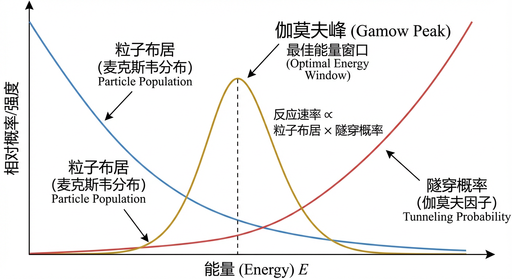
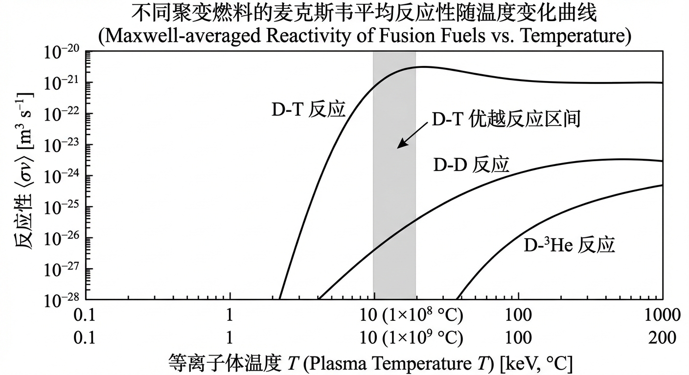
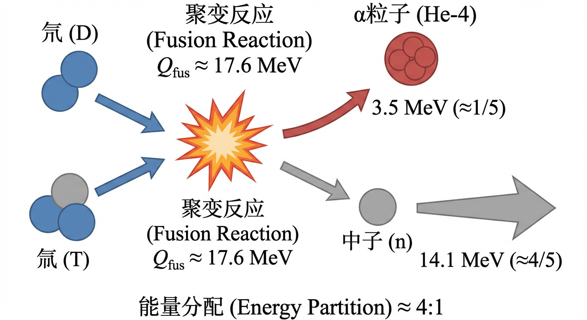
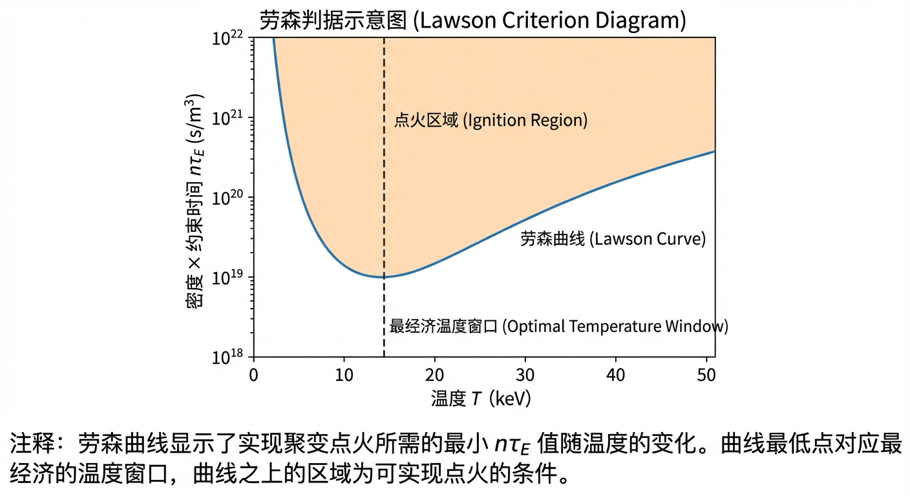
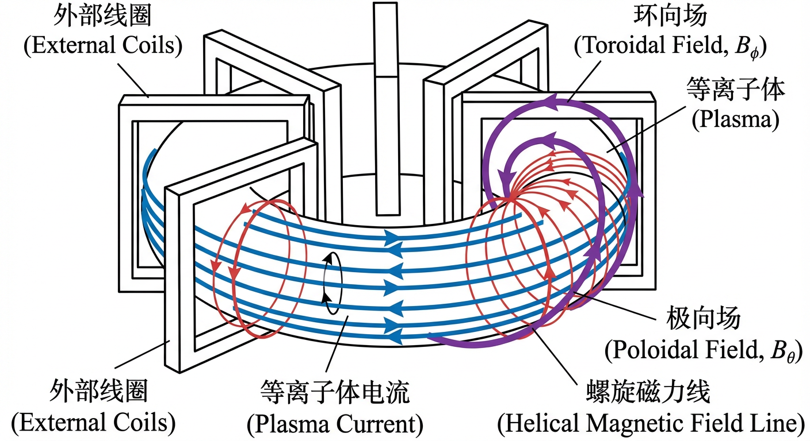
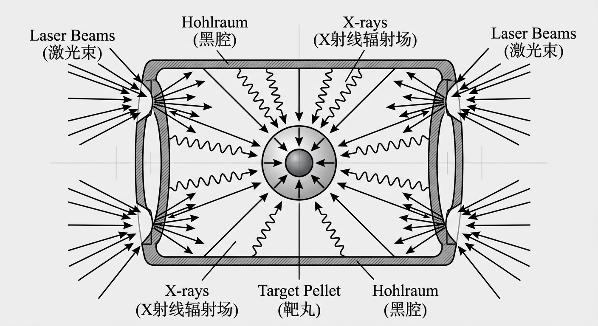
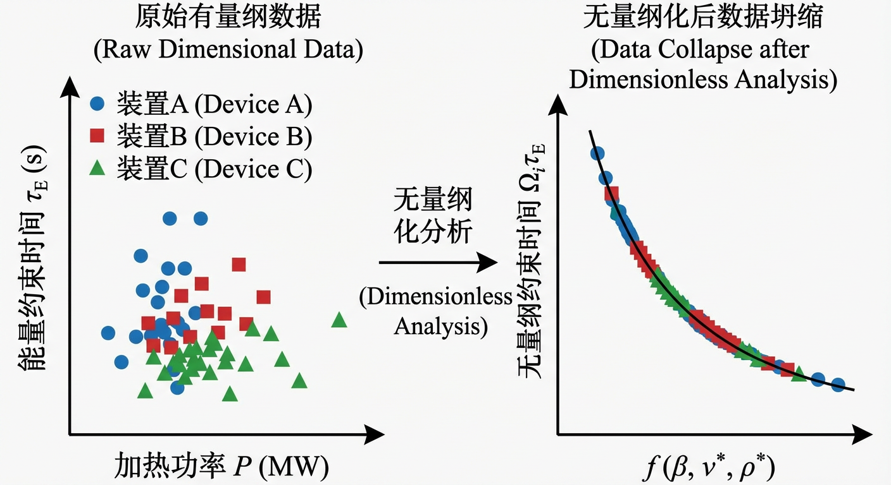
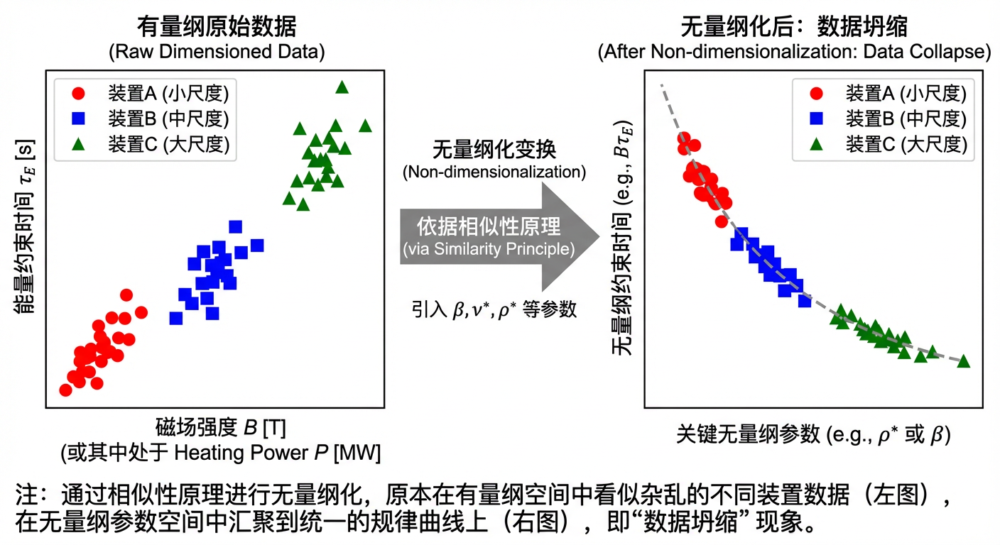

# 第1章 工程目标、指标体系与方案闭环边界

## 1.0 项目概述

欢迎进入可控核聚变工程设计的世界。在本章中，我们将开启一个名为“虚拟聚变堆概念验证（Virtual Fusion Reactor Proof-of-Concept）”的实战项目。该项目旨在帮助你从零开始构建一个氘氚（D–T）聚变反应堆的基础物理模型。

核聚变研究并非空中楼阁，它建立在一套严密的指标体系和物理约束之上。面对实现“人造恒星”这一宏伟目标，我们首先面临的挑战是：如何用数字定义成功？仅仅达到高温是不够的，我们需要量化反应堆的产出效率、确定系统边界，并找到一种科学的方法将实验室的小型实验结果外推至未来的商用电站。

本项目将贯穿本章的三个小节，逐步引导你完成以下任务：

1. 核心参数计算：利用第1.1节的指标语言，基于给定的等离子体密度和温度，计算反应堆核心的聚变功率密度，评估其能量产出潜力。
2. 物理机制验证：结合第1.2节的系统边界知识，深入分析燃烧等离子体中阿尔法粒子的行为特征及其对系统稳定性的影响，确立反应堆的物理自持逻辑。
3. 模型架构选择：应用第1.3节的无量纲化思想，确定描述该反应堆宏观动力学行为所必需的控制方程组（MHD方程），为后续的数值模拟奠定基础。

通过这个项目，你将不仅仅是被动地接受劳森判据或 $Q$ 值等概念，而是像一位真正的反应堆设计师一样，运用这些工具去解决实际的工程物理问题。

---

## 1.1 聚变指标语言与约束对象

可控核聚变作为旨在地球上复制恒星能源的宏伟科学事业，其根本目标是实现能量的净输出。然而，要衡量我们向这一目标迈进的距离，就需要一套精确、普适的“指标语言”。我们如何量化一个聚变装置的性能？何种参数决定了我们距离创造一个自持燃烧的“微型恒星”还有多远？本节旨在构建这一核心语言体系，它将作为我们贯穿全书的度量衡与评价标准。我们将从单个原子核相遇的微观概率出发，逐步构建起描述等离子体宏观产热能力的物理量，进而定义衡量系统能量增益的工程指标，并最终推导出判断聚变反应能否“点火”并自我维持的终极判据。这一系列环环相扣的指标，共同构成了评估和设计任何聚变能源系统的理论基石，并清晰地界定了所有可行方案所必须满足的物理约束。

### 微观尺度：聚变反应截面与伽莫夫峰

一切聚变能量的源头，都始于两个原子核在微观尺度上的一次成功“配对”。这种配对发生的可能性，由一个核心物理量——聚变反应截面（fusion reaction cross-section），记作 $\sigma(E)$——来描述。我们可以直观地将其理解为，在能量为 $E$ 的一次碰撞中，一个原子核向另一个原子核呈现的有效“靶的面积”。截面越大，反应发生的概率就越高。

然而，对于带正电的原子核（如氘 D 和氚 T），由于静电库仑力的相互排斥，它们之间仿佛隔着一堵巨大的能量壁垒。在经典世界里，如果粒子的能量不足以“翻越”这道库仑壁垒（Coulomb barrier），它们将无法足够靠近以发生核反应。幸运的是，在量子世界中，存在量子隧穿（quantum tunneling）效应。即使能量不足，粒子也有一定概率“穿过”这道能量壁垒。这一隧穿概率对能量极为敏感，其大小大致由伽莫夫因子（Gamow factor）决定，近似为
\[
\exp\!\left(-\frac{b}{\sqrt{E}}\right),
\]
其中 $b$ 是与相互作用原子核电荷数与约化质量有关的常数。

与此同时，一个聚变等离子体并非所有粒子都具有相同的能量，而是遵循麦克斯韦–玻尔兹曼能量分布（Maxwell–Boltzmann energy distribution）。这意味着，拥有极高能量的粒子数量随着能量的增加呈指数衰减，近似为 $\exp(-E/k_{\mathrm B}T)$，其中 $k_{\mathrm B}$ 是玻尔兹曼常数，$T$ 是等离子体温度。

因此，在给定的等离子体温度下，聚变反应的发生面临一场深刻的物理学“博弈”：

1. 隧穿概率：希望粒子能量尽可能高，以最大化穿越库仑壁垒的可能性。
2. 粒子布居：能量越高的粒子，其在等离子体中的数量就越稀少。

将这两个相互竞争的指数因子相乘，我们发现，绝大多数聚变反应并非发生在等离子体的平均能量处，而是在一个能量显著更高、但又并非遥不可及的狭窄能量窗口内。这个最佳的能量“甜蜜点”被称为伽莫夫峰（Gamow peak）。它是量子力学与统计物理学达成的一个精妙妥协，精确地指明了在给定温度的等离子体中，聚变反应最活跃的能量区间。这引发我们思考，仅仅提高等离子体的平均温度并非提升聚变效率的唯一途径；理解并可能调控伽莫夫峰区域的粒子能量分布，是更深层次的物理挑战。

### 宏观平均：麦克斯韦平均反应性

为了将微观的反应概率转化为可用于宏观计算的实用参数，我们需要对所有可能的粒子速度和能量进行统计平均。物理学家为此定义了一个至关重要的量：麦克斯韦平均反应性（Maxwell-averaged reactivity），通常记作 $\langle\sigma v\rangle$。它是在一个温度为 $T$ 的热平衡等离子体中，反应截面 $\sigma$ 与相对速度 $v$ 乘积的平均值：

$$
\langle\sigma v\rangle = \int_0^\infty \sigma(E)\, v(E)\, f_{\mathrm{MB}}(E;T)\,\mathrm{d}E
$$

其中 $f_{\mathrm{MB}}(E;T)$ 是按能量表述的麦克斯韦–玻尔兹曼分布函数。$\langle\sigma v\rangle$ 的单位是 $\mathrm{m^3\,s^{-1}}$，可以直观地理解为“单位粒子对的反应体积扫过率”。它的精妙之处在于，它将所有复杂的微观核物理（如量子隧穿、共振效应等）全部封装在一个仅依赖于等离子体温度的函数 $\langle\sigma v\rangle(T)$ 之中。这使得我们可以将微观物理与宏观的等离子体工程参数（如密度）清晰地分离开来。

不同聚变燃料的 $\langle\sigma v\rangle(T)$ 曲线存在巨大差异，这也从根本上决定了第一代聚变反应堆的技术路线。氘–氚（D–T）反应（$\mathrm{D}+\mathrm{T}\rightarrow \alpha + n$）的反应性在所有现实可用燃料中最为突出，它在约 10–20 keV（约 $1$–$2\times 10^8\,^\circ\mathrm{C}$）的“较低”温度区间就达到高值（其峰值出现在更高温度区间）。相比之下，氘–氘（D–D）反应或更先进的所谓“低中子”反应（如 D–$^3$He），则需要在高得多的温度下才能达到可观的反应性。例如，在 10–20 keV 的典型工作温度下，D–T 反应的功率产出能力可以比 D–D 反应高出数十倍到数百倍。因此，尽管 D–T 反应面临中子管理和氚燃料循环的工程挑战，其优越的反应性使其成为当前实现聚变能最有希望的途径。

### 功率与能量：聚变功率密度与能量分配

有了反应性 $\langle\sigma v\rangle$，我们便可以直接计算聚变反应堆的核心性能指标：聚变功率密度（fusion power density），$P_{\mathrm{fus}}$。对于两种密度分别为 $n_1$ 和 $n_2$ 的燃料离子，单位体积内每秒发生的聚变反应次数，即反应率密度 $R$，为：

$$
R = n_1 n_2 \langle\sigma v\rangle
$$

若为同种粒子（如 D–D 反应），则为
$$
R = \frac{1}{2} n^2 \langle\sigma v\rangle
$$
以避免重复计数。

每一次聚变反应都会释放出巨大的核能，称为反应能值（Q-value），此处用 $Q_{\mathrm{fus}}$ 表示单次反应释放的能量。因此，聚变功率密度就是反应率密度与反应能值的乘积：

$$
P_{\mathrm{fus}} = n_1 n_2 \langle\sigma v\rangle Q_{\mathrm{fus}}
$$

然而，并非所有释放的能量都能用于维持聚变反应自身。能量在反应产物中的分配（energy partition）至关重要。根据动量守恒和能量守恒定律，对于一个双体反应，较轻的产物将获得更多的动能。以 D–T 反应为例，其总能量释放 $Q_{\mathrm{fus}} \approx 17.6\,\mathrm{MeV}$，产物为一个氦核（$\alpha$ 粒子）和一个中子（$n$）。由于中子质量约为 $\alpha$ 粒子的 $1/4$，它将带走约 $4/5$ 的能量，即 $14.1\,\mathrm{MeV}$；而较重的 $\alpha$ 粒子则获得剩余约 $1/5$ 的能量，即 $3.5\,\mathrm{MeV}$。

这个约 $4:1$ 的能量分配对磁约束聚变装置的设计具有决定性影响。中子不带电，不受磁场约束，会直接穿出等离子体，其能量必须在反应堆的包层中被捕获并转化为热能。而带电的 $\alpha$ 粒子则会被磁场束缚在等离子体内部，通过与周围的燃料离子和电子发生库仑碰撞而逐渐减速，将其能量传递给等离子体，实现自加热（self-heating）。因此，真正用于维持等离子体高温的功率，即阿尔法加热功率密度（alpha heating power density）$P_{\alpha}$，仅为总聚变功率的一部分：

$$
P_{\alpha} = f_{\alpha} P_{\mathrm{fus}}
$$

其中 $f_{\alpha}$ 为阿尔法粒子携带的能量份额；对于 D–T 反应，
$$
f_{\alpha}=\frac{3.5}{17.6}\approx 0.20.
$$
理解这一能量分配机制，是构建聚变功率平衡模型的第一步。

### 衡量成功：聚变增益因子 $Q$ 与点火

聚变等离子体本质上是一个处于加热与冷却持续斗争中的系统。其内部总热能 $W_{\mathrm{th}}$ 的变化率由一个简单的功率收支平衡决定：

$$
\frac{\mathrm{d}W_{\mathrm{th}}}{\mathrm{d}t} = P_{\mathrm{heat}} - P_{\mathrm{loss}} = (P_{\mathrm{aux}} + P_{\alpha}) - P_{\mathrm{loss}}
$$

其中，加热功率 $P_{\mathrm{heat}}$ 来自外部注入的辅助加热功率 $P_{\mathrm{aux}}$（如中性束或射频波）和内部的阿尔法自加热功率 $P_{\alpha}$。能量损失功率 $P_{\mathrm{loss}}$ 主要包括通过热传导、对流等输运过程泄漏的能量，以及以电磁辐射形式损失的能量（如轫致辐射）。

为了衡量这场能量博弈的成功程度，我们定义聚变增益因子（fusion gain factor），记作 $Q$。它是聚变产生的总功率与为维持等离子体而注入的外部加热功率之比：

$$
Q = \frac{P_{\mathrm{fus}}}{P_{\mathrm{aux}}}
$$

$Q$ 值的大小标志着聚变研究的几个关键里程碑：

- 科学盈亏平衡（scientific breakeven）：$Q=1$。此刻，聚变产生的功率恰好等于外部输入的加热功率。这是一项重大的科学成就，证明了原理的可行性，但距离发电厂的目标尚远。因为此时，阿尔法自加热功率 $P_{\alpha}$ 仅为 $P_{\mathrm{fus}}$ 的约 20%，且还需与等离子体总能量损失竞争。
- 工程盈亏平衡（engineering breakeven）：考虑到将热能转化为电能的效率（约 30%–40%）以及驱动加热系统和其他电站辅助设备所需的再循环功率，一个发电厂要实现净电力输出，其等离子体的 $Q$ 值必须显著大于 1，工程概念研究中常见的目标量级为 $Q\gtrsim 10$（实际要求依赖于具体电站方案与再循环功率分数）。
- 点火（ignition）：当阿尔法自加热功率强大到足以完全平衡所有能量损失时（$P_{\alpha} \ge P_{\mathrm{loss}}$），我们便可以在稳态意义上将外部加热降至很小甚至关闭。理想化表述为 $P_{\mathrm{aux}}\to 0$，对应 $Q\to \infty$。此时，等离子体将实现自持燃烧。

### 综合判据：劳森判据与聚变三乘积

那么，究竟需要满足何种条件才能实现点火？这一问题将我们引向可控聚变领域最著名的物理判据。从点火的功率平衡条件 $P_{\alpha} \ge P_{\mathrm{loss}}$ 出发，我们可以推导出一个对等离子体核心参数的综合要求。

首先，我们将损失功率用一个宏观的工程参数——能量约束时间（energy confinement time）$\tau_E$——来描述，它衡量了等离子体“保温性能”的优劣：
$$
P_{\mathrm{loss}}=\frac{W_{\mathrm{th}}}{\tau_E}.
$$
对于一个由电子与离子组成、温度可近似相等（$T_e\approx T_i\equiv T$）且满足准中性（$n_e\approx n_i\equiv n$）的氘氚等离子体，其单位体积热能密度可近似写作
$$
W_{\mathrm{th}}\approx 3n k_{\mathrm B}T,
$$
对应电子与离子两部分各占 $\tfrac{3}{2} n k_{\mathrm B}T$。

对于 D–T 等离子体，若氘、氚数密度近似相等，$n_D\approx n_T\approx n/2$，则反应率密度为
$$
R=n_D n_T\langle\sigma v\rangle \approx \frac{1}{4}n^2\langle\sigma v\rangle.
$$
点火条件 $P_{\alpha} \ge P_{\mathrm{loss}}$ 可写作：

$$
f_{\alpha}\left(\frac{1}{4}n^2\langle\sigma v\rangle Q_{\mathrm{fus}}\right)\ge \frac{3n k_{\mathrm B}T}{\tau_E}.
$$

对上式进行整理，我们得到对密度与约束时间乘积的要求：

$$
n\tau_E \ge \frac{12 k_{\mathrm B} T}{f_{\alpha}\langle\sigma v\rangle Q_{\mathrm{fus}}}.
$$

这就是著名的劳森判据（Lawson criterion）。它揭示了一个深刻的物理事实：要实现点火，等离子体的燃料密度 $n$ 和能量约束时间 $\tau_E$ 的乘积必须达到一个由温度决定的阈值。由于方程右侧仅是温度的函数，我们可以绘制出 $n\tau_E$ 随温度 $T$ 变化的曲线（即劳森曲线），发现它在某个温度处具有最小值，这意味着存在一个实现点火的“最经济”的温度窗口（对 D–T 反应通常在十几 keV 的量级）。

在现代聚变研究中，我们更常使用一个与之等价但形式上更具启发性的指标——聚变三乘积（fusion triple product）$nT\tau_E$。将劳森判据两边同乘以温度 $T$，并用压力 $p\propto nT$ 来理解，三乘积实际上反映了等离子体压力与其保温性能的乘积。点火条件可以表达为三乘积必须超过一个阈值：

$$
nT\tau_E \ge \frac{12 (k_{\mathrm B} T)^2}{f_{\alpha}\langle\sigma v\rangle Q_{\mathrm{fus}}}.
$$

这个判据是衡量聚变装置性能的重要标尺。它告诉我们，通往聚变能源的道路，本质上是不断提升三乘积数值的征程。不同的技术路线，如磁约束聚变（MCF）与惯性约束聚变（ICF），正是通过不同的策略来攀登这座“劳森高峰”：磁约束追求以较低的密度实现较长的约束时间，而惯性约束则试图在极短的瞬间达到超高的密度。无论路径如何，三乘积都是它们共同的目标与约束。

### 小结

本节构建了一套用于衡量和理解可控核聚变性能的“指标语言”。我们从原子核间反应的微观概率——由反应截面 $\sigma(E)$ 描述，并受伽莫夫峰主导——出发，通过在热等离子体中的统计平均，得到了仅依赖于温度的宏观反应性 $\langle\sigma v\rangle$。结合反应能值 $Q_{\mathrm{fus}}$ 和能量分配规则，我们定义了聚变装置的核心产出——聚变功率密度 $P_{\mathrm{fus}}$ 和自加热功率 $P_{\alpha}$。

在此基础上，我们引入了衡量系统能量效率的聚变增益因子 $Q$，并区分了科学盈亏平衡（$Q=1$）与最终目标——点火（理想化表述为 $Q\to\infty$）。最后，通过建立功率平衡方程，我们将所有这些物理量统一在一个强大的综合判据之下：劳森判据及其现代形式——聚变三乘积 $nT\tau_E$。这些指标不仅为聚变研究设定了明确的量化目标，也清晰地揭示了实现聚变所需的核心物理条件：足够高的温度、足够高的密度与足够好的能量约束。

这些指标构成了第一章的理论基石，为后续章节中对具体约束方案（如磁约束与惯性约束）的探讨（第1.2节）以及对不同装置和实验进行比较的相似性标度方法（第1.3节）提供了共同的评价框架和理论接口。理解这套语言，是开启对聚变科学与工程后续所有复杂课题探索的钥匙。

> **实战项目应用 I：虚拟堆芯功率估算**  
> 假设你正在设计一个环形约束装置（如托卡马克）的“虚拟堆芯”。为了评估其作为能源的可行性，首要任务是计算其核心区域的体积功率密度 $P_f$。  
>  
> **设计参数：**  
> - 燃料：氘–氚（D–T）双组分等离子体。  
> - 假设：等离子体在空间上均匀，处于热平衡状态，且无宏观漂移速度。  
> - 密度：$n_{D}=5.0\times 10^{19}\,\mathrm{m^{-3}}$，$n_{T}=4.0\times 10^{19}\,\mathrm{m^{-3}}$。  
> - 温度：$T_D=T_T=12\,\mathrm{keV}$。在此温度下，D–T 反应的麦克斯韦平均反应性为 $\langle\sigma v\rangle_{DT}=1.5\times 10^{-22}\,\mathrm{m^3\,s^{-1}}$。  
> - 能量沉积模型：  
>   - $\alpha$ 粒子能量 $E_{\alpha}=3.5\,\mathrm{MeV}$，假设全部沉积在等离子体内。  
>   - 中子能量 $E_n=14.1\,\mathrm{MeV}$，假设仅有 $\varepsilon_n=0.02$ 的份额在逸出前沉积在等离子体中。  
> - 有效能量：定义 $Q_{\mathrm{eff}}$ 为每次反应沉积在等离子体中的有效能量。  
>  
> **任务挑战：**  
> 1. 基于反应率密度定义 $R=n_1 n_2\langle\sigma v\rangle$，计算该堆芯的反应率密度。  
> 2. 根据给定能量沉积模型，确定每次反应的有效沉积能量 $Q_{\mathrm{eff}}$（注意单位换算：$1\,\mathrm{eV}=1.602176634\times 10^{-19}\,\mathrm{J}$）。  
> 3. 计算体积功率密度 $P_f=R Q_{\mathrm{eff}}$，结果保留四位有效数字，单位为 $\mathrm{MW\,m^{-3}}$。  
>  
> 这一步计算的结果将直接决定你的虚拟装置能否产生足够的热量，从而支撑后续章节讨论的“燃烧”等离子体状态。

---

## 1.2 系统边界与约束路径选型

在前一节中，我们建立了描述聚变性能的“指标语言”，并计算了理想状态下的聚变功率密度。这回答了“我们需要什么”的问题。然而，要实现这些指标，我们必须解决“如何容纳”的问题。这些指标定义了聚变反应自持燃烧的“目标”——即需要达到的温度、密度与约束时间的组合。本节我们将探讨实现这一目标的“方法”，即如何将这一恒星过程在地球上工程化。其核心挑战似乎无法逾越：当没有任何地球上的材料能承受超过一亿摄氏度的高温燃料时，我们如何容纳它？答案并非建造一个更坚固的容器，而在于用力场创造一个无形的牢笼。

对这一根本性问题的不同回答，将可控核聚变的研究分化为两条截然不同的技术路径，每条路径都定义了独特的系统边界与工程约束。这两种主要策略，即磁约束聚变（Magnetic Confinement Fusion, MCF）与惯性约束聚变（Inertial Confinement Fusion, ICF），代表了为达到劳森判据所要求的极端条件而采取的两种截然相反的哲学。本节将首先深入这两种路径的基本物理原理，探讨它们如何约束超高温等离子体；进而，我们将审视这些原理如何演化为燃烧等离子体装置与未来反应堆的设计概念；最后，我们将系统边界扩展至完整的聚变电站，考察其能量转换链与辅助系统，揭示从等离子体物理到并网电力的宏伟蓝图。

### 磁约束聚变（MCF）：耐心织就的磁笼

磁约束聚变好比一场耐心的“围攻”。它采取的策略是利用较低密度的等离子体（数密度约 $10^{19}$–$10^{20}\,\mathrm{m^{-3}}$，远低于大气密度），并用强大而复杂的磁场将其约束较长时间（典型放电可达数秒，稳态设想可更长）。其核心思想是：我们不依赖材料直接承受一亿度燃料，而是利用电磁学的基本定律，编织一个无形的磁力牢笼。

这一原理的基石是洛伦兹力。一个带电粒子（离子或电子）在磁场中运动时，会感受到一个始终垂直于其速度和磁力线的力。这个力在理想情况下不做功，不改变粒子的动能，只改变其运动方向，迫使其以螺旋线的方式沿着磁力线盘旋。这种回旋运动使带电粒子在两次碰撞之间主要沿磁力线运动，从而显著抑制其横越磁场的运动。一个离子在两次碰撞之间沿磁力线行进的平均距离（沿场自由程）通常远大于其回旋半径，这正是磁约束的关键所在。

然而，一个简单的线性磁场（如螺线管产生的磁场）两端是开放的，粒子会沿着磁力线逃逸。一个重要的解决方案是将这个线性系统弯曲成一个闭合的环，形成一个没有端点的“甜甜圈”形状，即环体（torus）。这是迄今最成功的磁约束装置之一——托卡马克（tokamak）——的基本构型。在托卡马克中，一组外部线圈产生沿环体长路径方向的主磁场，即环向场（toroidal field, $B_{\phi}$）。

但纯粹的环向场本身并不足以稳定约束等离子体。由于环形几何的固有曲率和磁场强度随大半径 $R$ 的变化（近似 $B_{\phi}\propto 1/R$），带电粒子会产生曲率漂移与梯度漂移；离子与电子漂移方向相反，可能导致电荷分离并建立电场，从而引发等离子体整体的横向漂移。解决方案是为磁场增加一个“扭转”，使磁力线呈螺旋状。这样，一个粒子在环体的一侧向上漂移，在沿磁力线运动的过程中会过渡到使它向下漂移的另一侧，从而在一个磁面上部分抵消漂移效应，改善约束。在托卡马克中，这种扭转通常通过在等离子体自身中感应强大的环向电流（可达百万安培量级）来实现。该电流产生极向场（poloidal field, $B_{\theta}$），环向场与极向场叠加形成螺旋磁力线结构。

这些磁力线的“扭曲程度”由一个关键无量纲参数——安全因子（safety factor, $q$）——来量化。它常用来表示磁力线沿环向绕行一周时对应的极向绕行圈数（或等价的比值表述）。该参数与等离子体的宏观稳定性密切相关：若 $q$ 过低（扭转不足或电流过大），位形可能出现电流驱动的螺旋不稳定性。著名的克鲁斯卡尔–沙弗拉诺夫极限（Kruskal–Shafranov limit）指出，柱状近似下 $q(a)>1$ 是避免 $m=1$ 扭结模的重要条件之一；在实际环形装置中，稳定性还取决于剪切、形状与剖面等因素。因此，将安全因子维持在合适的范围内，是托卡马克稳定运行的关键。

除了托卡马克，另一条主要的磁约束路径是仿星器（stellarator）。与托卡马克依赖等离子体电流产生部分约束磁场不同，仿星器通过一系列外形复杂的三维外部线圈直接产生所需的三维螺旋磁场。其优点是有望实现真正的稳态运行，因为它不依赖感应电流；代价则是工程设计与制造复杂，并需要精密的优化以控制三维非对称性引起的新古典输运与粒子损失。

### 惯性约束聚变（ICF）：瞬时完成的闪击

与磁约束的“持久战”形成鲜明对比，惯性约束聚变采取的是一场“闪电战”。它的策略是取一个毫米级的燃料靶丸，在纳秒（$10^{-9}\,\mathrm{s}$）甚至皮秒（$10^{-12}\,\mathrm{s}$）量级的极短时间内，用极高功率密度将其压缩至超高密度和超高温度，从而触发聚变反应。在这种极端状态下，燃料来不及因热运动而显著飞散，就被其自身的惯性（inertia）短暂地“约束”在一起——这就是“惯性约束”名称的由来。在这里，极高的密度 $n$ 补偿了极短的约束时间 $\tau$，以求达到劳森判据。

如何施加这种极端压力？典型方案是利用高功率激光或粒子束将能量沉积到靶丸外层。能量使靶丸外壳材料迅速加热并向外喷射，形成烧蚀层（ablator）的外喷。根据牛顿第三定律，外喷产生反冲，将剩余壳层向内加速并压缩，实现内爆（implosion）。

实现这一过程主要有两种驱动方案：

- 直接驱动（direct drive）：多束激光直接、尽可能均匀地照射靶丸。此法的能量耦合效率较高，但对束匀滑、束形与等离子体不稳定性控制要求极高。
- 间接驱动（indirect drive）：激光束射入由高原子序数材料（如金）制成的微小中空腔体，即黑腔（hohlraum）。黑腔内壁吸收激光并产生强烈的 X 射线辐射场，近似各向均匀地驱动靶丸内爆。间接驱动通常以牺牲部分能量耦合效率为代价，换取更好的驱动对称性与工况可控性。

当球形燃料壳层向内高速运动时，球形会聚（spherical convergence）的几何效应使体积急剧缩小，密度和压力快速增长，最终在中心形成炽热的“火花塞”，即热斑（hot spot），其周围是高度压缩的、相对更“冷”的主燃料层。

要获得净能量增益，这个热斑必须点火（ignite），即聚变反应产生的带电产物在燃料内沉积的能量足以使燃烧过程自我维持并向周围传播。在 D–T 反应中，高能 $\alpha$ 粒子（氦核）在致密燃料中通过碰撞沉积能量，形成向外传播的热核燃烧波（thermonuclear burn wave）。因此，点火的关键之一在于热斑与周围燃料必须足够“厚实”，以使相当比例的 $\alpha$ 粒子能量沉积在燃料内部。这个“厚实度”常由面密度（areal density, $\rho R$）来衡量，即特征密度 $\rho$ 与特征尺度 $R$ 的乘积。当 $\rho R$ 超过 $\alpha$ 粒子在燃料中的典型阻止面密度（数量级约 $0.3\,\mathrm{g\,cm^{-2}}$）时，自加热才可能显著。通往点火的道路上布满障碍，其中最关键的之一是流体动力学不稳定性（hydrodynamic instabilities），如瑞利–泰勒不稳定性，它可能破坏内爆对称性，导致点火失败。

### 从燃烧等离子体到发电厂：系统边界与能量转换

无论是 MCF 还是 ICF，其核心都是创造燃烧等离子体（burning plasma）——一个主要由其内部聚变反应产生的 $\alpha$ 粒子自我加热的等离子体。像国际热核聚变实验堆（ITER）这样的装置，其首要科学目标就是研究并控制燃烧等离子体的物理学，在强自加热占比条件下实现并维持高增益状态（如设计目标 $Q\approx 10$）。然而，一个科学上的成功装置与一个能为城市供电的商业发电厂之间，还存在着巨大的鸿沟。后者不仅要实现能量增益，还必须将聚变能高效地转化为净电力输出，并满足可维护性、寿命、可靠性与经济性等系统工程约束。

要理解这一过程，我们必须将分析的系统边界（system boundary）从等离子体本身扩展到整个发电厂。我们可以将一个聚变电站视为一个控制体积（control volume），遵循严格的能量与物质守恒定律。聚变反应产生的能量以两种形式出现：带电的 $\alpha$ 粒子和不带电的中子。在 D–T 反应中，约 80% 的能量由高能中子携带。

能量的转换与利用遵循一条精密的链条：

1. 能量捕获：带电的 $\alpha$ 粒子被约束在等离子体内部，其能量用于维持等离子体的高温；这部分能量最终通过辐射与粒子/热流通道传递到反应堆内壁、偏滤器（divertor）等部件上。与此同时，中子不受磁场约束，穿出等离子体，被真空室外的增殖包层（breeding blanket）吸收，其动能转化为热能。
2. 燃料自持：增殖包层还承担另一项至关重要的使命。包层材料中含锂元素，中子与锂核反应可增殖新的氚燃料。一个成功的聚变电站必须实现燃料循环闭合，即产生的氚至少能补偿消耗与处理损失。氚增殖比（Tritium Breeding Ratio, TBR）必须大于 1（工程上通常还需留有裕量），这是聚变能源可持续性的关键约束。
3. 发电：包层、偏滤器与第一壁等系统捕获的热能通过冷却剂（如水、氦气或液态金属）导出，用于驱动传统的朗肯或布雷顿循环，通过蒸汽轮机或燃气轮机带动发电机发电，产生总发电功率（gross electric power）。
4. 辅助系统与功率再循环：维持聚变反应堆运行需要消耗显著电力。这部分再循环功率（recirculating power）用于超导磁体与深冷系统、等离子体加热与电流驱动系统、燃料循环与真空系统，以及在 ICF 中的高功率驱动器（如激光器）等。

因此，一个聚变电站的净电力输出，是其总发电功率减去再循环功率后的剩余部分。这就解释了为什么仅仅实现等离子体的能量盈亏平衡（$Q=1$）是远远不够的。考虑到热电转换效率（通常约 30%–40%）以及辅助系统电耗，一个能够产生可观净电力的商业电站，其等离子体增益 $Q$ 往往需要达到十几到数十的量级，具体取决于电站总体设计与再循环功率分数。严谨地定义系统边界，对能量输入、输出、内部转换和损耗进行精确核算，是评估任何聚变路径方案可行性的基础。只有通过系统工程视角，才能在等离子体物理约束与工程、经济需求之间找到通往实用聚变能的可行路径。

### 小结

本节中，我们确立了可控核聚变的两条主要技术路径——磁约束聚变（MCF）与惯性约束聚变（ICF）——作为应对劳森判据所提出极端物理挑战的两种截然不同的策略。MCF 以“较长时间、较低密度”的准则，催生了托卡马克与仿星器等依靠精密磁场构型来约束等离子体的设计；而 ICF 则以“极短时间、极高密度”的理念，发展出利用强大驱动器实现内爆压缩的方案。我们看到，每条路径的选择都深刻地决定了其核心物理挑战、关键技术瓶颈以及最终的工程形态。

更重要的是，我们将系统边界从核心的燃烧等离子体扩展至完整的电站系统。这揭示了一个更深层次的真理：聚变能源的实现不仅是物理问题，更是复杂的系统工程问题。它要求将等离子体约束、燃料自持（氚增殖）、能量提取、热电转换以及辅助系统功耗等多个环节作为一个整体进行优化。对系统边界的严谨定义与对能量流的精确核算，构成了评估任何聚变方案能否从科学演示走向商业现实的基石。

本节内容为后续章节的学习搭建了宏观框架。我们已经勾勒出聚变装置的外部轮廓与系统逻辑。接下来，我们将逐一深入这些系统的内部构造。从第2章开始，我们将聚焦于等离子体本身的物理行为，从构成磁约束基础的单粒子运动轨迹开始，逐步构建理解聚变“恒星之火”所需的完整物理模型体系。这一从宏观系统边界到微观物理机制的过渡，将使我们更深刻地理解驱动这一伟大科学事业的内在逻辑。

> **实战项目应用 II：阿尔法粒子动力学与稳定性评估**  
> 你的虚拟堆芯正在设计中，现在需要深入评估燃烧等离子体的关键物理特性。在你的全装置模型（whole-device model）中，聚变反应产生 $3.5\,\mathrm{MeV}$ 的 $\alpha$ 粒子（氦核），它们是维持堆芯温度的关键。  
>  
> **场景设定：**  
> - 装置为托卡马克，轴对称构型。  
> - $\alpha$ 粒子与背景电子和离子的相互作用由库仑碰撞主导。  
> - 忽略外部射频波（RF），也不考虑中性粒子损失。  
> - 模型需涵盖从微观粒子分布到宏观 MHD 稳定性的耦合。  
>  
> **关键决策：**  
> 为了确保模型的科学真实性，你需要判断以下哪些物理描述是正确的，并以此作为代码编写的依据：  
> - A. 慢化分布：$\alpha$ 粒子的稳态速度分布 $f(v)$ 是否应呈现 $\left(v^3+v_c^3\right)^{-1}$ 的形式？能量主要传给电子还是离子？  
> - B. 热化假设：能否简单地假设 $\alpha$ 粒子瞬间热化，并仅作为离子的均匀热源？  
> - C. 麦克斯韦化：能否将 $\alpha$ 粒子模拟为温度为 $3.5\,\mathrm{MeV}$ 的麦克斯韦分布？  
> - D. 不稳定性风险：$\alpha$ 粒子是否会与剪切阿尔芬波共振，驱动环形阿尔芬本征模（TAE），进而可能破坏约束？  
> - E. 耦合范围：$\alpha$ 源项是否仅影响电子热方程，而与动量平衡和稳定性无关？  
>  
> **任务：**  
> 1. 基于库仑碰撞理论与波–粒子相互作用原理，逐项分析上述陈述。  
> 2. 选出应纳入模型的正确物理描述（正确选项）。  
> 3. 简要说明为什么这些机制对你的虚拟堆芯能否实现 $Q>10$ 至关重要。

---

## 1.3 相似性标度与无量纲化接口

在探索可控核聚变的征途中，我们面临着一个根本性的尺度鸿沟：一个是在实验室中运行的、米级的实验装置，另一个是未来可能实现的、数十米规模的宏伟聚变反应堆。我们如何才能将从小型实验中获得的物理理解，可靠地外推到巨型反应堆的设计与运行之中？我们又如何能从描述等离子体行为的、形式复杂的偏微分方程组中，提炼出支配其演化的核心物理规律？这些问题的答案，深植于物理学中一个极其深刻而优雅的方法论工具——无量纲化（nondimensionalization）。

本节内容的目的，并非进行一次纯粹的数学整理，而是要为贯穿全书的理论分析、实验诠释与数值模拟建立一套通用的“语法”。无量纲化是一种概念上的透镜，它引导我们将视角从“一个物理量有多大？”转变为“一种效应与另一种效应相比有多强？”。通过剥离米、秒、特斯拉等人为选择的单位，我们将揭示隐藏在现象背后的、由普适物理定律所支配的竞争关系。这一过程不仅能简化控制方程，更能将不同尺度、不同参数下的物理系统置于一个统一的可比较坐标系中，从而为后续章节中所有关于标度、近似和仿真的讨论提供坚实的逻辑接口。

### 从方程到无量纲群：揭示物理竞争

无量纲化的艺术始于一个看似简单却至关重要的步骤：为问题中的物理量选择一组特征尺度（characteristic scales）。这些尺度并非任意选取，而是蕴含了我们对问题主导物理过程的洞察。例如，对于在托卡马克装置中演化的等离子体，特征长度尺度可取装置的小半径 $L$，特征速度可取阿尔芬速度 $v_A$，特征时间可取 $t_0=L/v_A$（或在输运问题中取能量约束时间 $\tau_E$）。

一旦选定特征尺度，我们便可定义一组无量纲变量，通常以星号或帽子标记，例如 $\boldsymbol{x}^*=\boldsymbol{x}/L$。随后，我们将这些无量纲变量代入系统的控制方程（如流体方程或动理学方程）。经过代数整理，原方程中纷繁复杂的物理参数（如密度 $\rho$、黏度系数 $\mu$、磁场 $B$ 等）将自然地组合成一系列无量纲数群。这些无量纲数，正是物理学家用以对话的通用语言。

以理想流体的动量守恒方程为例，其有量纲形式可写为：

$$
\rho\left(\frac{\partial \boldsymbol{u}}{\partial t} + \boldsymbol{u}\cdot\nabla \boldsymbol{u}\right) = -\nabla p + \boldsymbol{f}_{\mathrm{ext}},
$$

其中左侧代表流体的惯性，右侧代表压力梯度和外力。通过引入特征尺度——长度 $L_0$、速度 $U_0$、时间 $t_0=L_0/U_0$、密度 $\rho_0$、压力 $p_0$——并进行代数变换，可得到无量纲形式：

$$
\frac{\partial \boldsymbol{u}^*}{\partial t^*} + \boldsymbol{u}^*\cdot\nabla^* \boldsymbol{u}^* = -\left(\frac{p_0}{\rho_0 U_0^2}\right)\nabla^*p^* + \frac{L_0}{\rho_0 U_0^2}\boldsymbol{f}_{\mathrm{ext}}.
$$

观察这个更“干净”的方程，我们发现原先复杂的物理参数被整合成括号内的无量纲系数。这些系数描述了物理过程相对强弱的比例关系。例如，压力梯度项的系数 $\frac{p_0}{\rho_0 U_0^2}$，利用理想气体声速 $c_s^2=\gamma p_0/\rho_0$，可写成 $\frac{1}{\gamma (U_0/c_s)^2}$，其中自然出现马赫数（Mach number）$M\equiv U_0/c_s$。若外力为引力（$\boldsymbol{f}_{\mathrm{ext}}=\rho \boldsymbol{g}$），则外力项可写成 $\frac{g_0 L_0}{U_0^2}\boldsymbol{g}^*$，其倒数平方根对应弗洛德数（Froude number）$Fr\equiv U_0/\sqrt{g_0 L_0}$，度量惯性与引力的相对重要性。

在磁约束聚变等离子体中，无量纲化同样能揭示支配行为的核心参数。例如，在磁流体动力学（MHD）中，对包含电阻项的感应方程（或广义欧姆定律的简化形式）进行无量纲化，会出现伦奎斯特数（Lundquist number）$S$。它比较磁场的电阻扩散时间与阿尔芬时间：
\[
S\equiv \frac{\tau_R}{\tau_A},
\quad
\tau_R\sim \frac{\mu_0 L^2}{\eta},
\quad
\tau_A\sim \frac{L}{v_A},
\]
其中 $\eta$ 为电阻率（magnetic diffusivity 相关系数），$\mu_0$ 为真空磁导率。当 $S\gg 1$ 时，电阻扩散相对缓慢，等离子体在宏观尺度上更接近理想 MHD 的“磁冻结”行为；当 $S$ 有限时，磁重联等电阻效应不可忽略。

因此，无量纲化的首要功能之一，是将物理方程转译为关于物理竞争的叙事。方程中每一项前面的无量纲系数，量化了该项所代表过程相对于选定主导过程（常取惯性或波传播项）的强度。这些无量纲数的大小，为我们判断主要矛盾与次要矛盾、进而简化模型与建立物理图像，提供了系统性的指导。

### 相似性原理：连接不同世界的桥梁

无量纲化的第二个深远推论是相似性原理（principle of similarity）。该原理指出：如果两个物理系统几何相似，并且其所有相关的无量纲数都一一对应相等，那么这两个系统的无量纲解在相应边界与初始条件下应当呈现相同的结构。

这一原理是连接不同尺度物理世界的关键桥梁。它意味着，我们可以在一个小型、低成本的实验装置上，通过精心调节其运行参数，使关键无量纲数与未来大型反应堆的目标值尽可能匹配。对聚变等离子体而言，这些无量纲参数常包括等离子体贝塔值 $\beta$、归一化碰撞频率 $\nu^*$、归一化拉莫尔半径 $\rho^*$ 等。若匹配成功，那么我们在小装置上观测到的无量纲物理现象——例如归一化的温度剖面形状、湍流涨落的相对幅度、不稳定性的增长率——将能够为大型反应堆提供直接的物理参照。

相似性原理的重要应用之一，是为建立经验标度律（empirical scaling laws）提供理论支撑。在聚变研究中，一个核心问题是预测等离子体的能量约束时间 $\tau_E$。研究者在不同装置上测量了大量放电实验数据。直接比较有量纲数据并不容易，因为装置尺寸、磁场强度、密度等差异显著。相似性思想提示：适当无量纲化后的约束时间（例如 $\Omega_i\tau_E$，其中 $\Omega_i$ 是离子回旋频率）应当是控制等离子体行为的无量纲参数（如 $\beta,\nu^*,\rho^*$ 等）的函数。通过多变量回归分析，研究者得以建立幂律形式的经验标度关系，例如著名的 ITER-98(y,2) 约束标度律。所谓“数据坍缩”（data collapse）现象——不同装置的散点在无量纲参数空间中汇聚到较统一的趋势上——正体现了相似性思想在复杂系统中的实际价值。我们将在后续章节中进一步讨论约束标度与外推问题。

### 实践中的复杂性与接口规范

尽管相似性原理威力强大，但在聚变研究实践中，实现完美的动力学相似异常困难，这恰恰揭示了等离子体物理的复杂性。

首先，存在“隐性参数”的挑战。一个典型情形是：我们基于一组看似完备的无量纲数在实验室中进行缩比模型实验，却发现结果无法准确预测真实尺度下的现象，其原因常是存在被忽略的物理过程引入了新的、未被匹配的无量纲数。在聚变等离子体中，一个至关重要的“隐性”参数是归一化拉莫尔半径（normalized Larmor radius）$\rho^*$，即离子回旋半径与装置小半径之比。现有多数托卡马克实验装置的 $\rho^*$ 通常显著大于未来反应堆的 $\rho^*$。由于湍流输运的尺度与回旋半径密切相关，这种 $\rho^*$ 不匹配可能是经验标度律外推到反应堆尺度时不确定性的重要来源之一。

其次，是解的非唯一性问题。即使两个系统几何相似且所有无量纲数都完全匹配，也不保证行为必然完全相同。非线性系统的控制方程可能存在多个稳定解或亚稳态，系统落入哪一种状态还可能依赖初始条件与扰动历史。聚变等离子体中常见的例子是：在相近的宏观无量纲参数下，等离子体既可能处于约束较差的 L 模（low-confinement mode），也可能跃迁到约束显著改善的 H 模（high-confinement mode）。这种模式转换可能表现出迟滞现象：进入 H 模和退出 H 模的阈值并不相同。这表明，相似性思想常能限定“可能性空间”，但不一定能唯一决定系统最终状态。

最后，无量纲化作为一种通用接口，在连接物理理论与现代计算科学方面扮演着关键角色。无论是求解偏微分方程的传统数值模拟，还是训练物理信息神经网络（Physics-Informed Neural Networks, PINNs）等数据驱动方法，一个良态（well-posed）且数值条件良好的问题是获得稳定、准确解的前提。直接在有量纲方程上计算，常因不同物理效应尺度相差悬殊而导致数值刚性（stiffness）与矩阵病态（ill-conditioning）。通过选择恰当的特征尺度，将变量与方程项归一化到数量级为 1（order-one），无量纲化可改善数值条件，使不同物理项在计算中具有可比权重。这不仅有助于迭代求解的稳定性，也为跨平台、跨代码的验证与确认（verification and validation, V&V）提供与单位无关的比较基准。对于后续章节将讨论的集成建模与数值模拟，本节建立的无量纲化接口是确保鲁棒性与可比性的关键基础。

### 小结

本节中，我们建立了无量纲化作为可控核聚变研究中核心方法论的地位。它不仅是单位换算，更是洞察物理竞争与构建跨尺度桥梁的重要工具。通过将控制方程转化为由无量纲数支配的普适形式，我们得以：

1. 识别主导物理：通过比较无量纲数的大小，判断在特定运行区间内何种物理过程（如惯性、扩散、波传播）占据主导，从而为模型简化与近似提供依据。
2. 建立相似性标度：基于相似性思想，将不同装置、不同尺度下获得的实验数据在无量纲参数空间中进行整合，建立经验标度律，并指导从实验到反应堆的工程外推。
3. 构建通用接口：为数值模拟与数据驱动建模提供尺度均衡的计算框架，提升数值稳定性与跨代码可比性，为理论与计算的融合铺平道路。

归根结底，无量纲化为我们提供了一套通用坐标系与语法。在这个框架下，我们可以更清晰地审视和比较各种物理模型，理解它们的适用边界。在后续章节中，当我们讨论单粒子轨道、磁流体、波、湍流和输运等不同层次的模型时，从无量纲化视角出发，理解它们分别由哪些关键无量纲数所控制，将是贯穿始终的核心分析思路。诸如等离子体贝塔值 $\beta$、归一化碰撞率 $\nu^*$ 和归一化拉莫尔半径 $\rho^*$ 等，将成为我们导航复杂等离子体物理世界的重要“罗盘”。

> **实战项目应用 III：仿真物理模型的选择**  
> 你的虚拟反应堆项目已进入仿真验证阶段。为了模拟等离子体在磁场中的宏观流动和平衡，你需要选择一套正确的控制方程组。  
>  
> **任务挑战：**  
> 在聚变反应堆研究中，磁流体动力学（MHD）方程组扮演着关键角色。请判断以下关于 MHD 方程及其相关性的描述，哪一项是正确的，并说明理由，这将决定你仿真代码的核心算法：  
> - A. MHD 方程组由流体方程（可视为纳维–斯托克斯方程在电磁作用下的拓展/变体）与电磁学方程（麦克斯韦方程在低频近似下的适当形式）耦合组成，描述了等离子体流动与磁场的双向相互作用。  
> - B. MHD 方程组纯粹源于量子力学，专门用于模拟等离子体中的电子行为。  
> - C. MHD 方程组假设等离子体必须是密度与温度均匀的单流体，且完全忽略带电粒子的碰撞效应。  
> - D. MHD 方程组在聚变反应堆中不相关，因为等离子体动力学主要由相对论效应主导。  
>  
> 你的选择将决定仿真模型能否正确捕捉到反应堆中的等离子体流体行为。

---

## 总结

本章通过“虚拟聚变堆概念验证”实战项目，将抽象的物理指标与具体的工程设计紧密结合。回顾整个流程，我们从微观的反应率计算出发，评估了核心功率密度；接着深入分析了燃烧等离子体的动力学特性，特别是阿尔法粒子的加热与稳定性风险；最后，确立了描述宏观等离子体行为的 MHD 数学模型。

以下是对实战项目中各步骤问题的详细解答与解析。

### 实战项目应用 I 解答：虚拟堆芯功率估算

1. 反应率密度 $R$ 计算：  
   依据公式 $R=n_{D}n_{T}\langle\sigma v\rangle_{DT}$，代入给定数值：
   $$
   n_D=5.0\times 10^{19}\,\mathrm{m^{-3}},\quad
   n_T=4.0\times 10^{19}\,\mathrm{m^{-3}},\quad
   \langle\sigma v\rangle_{DT}=1.5\times 10^{-22}\,\mathrm{m^3\,s^{-1}}.
   $$
   $$
   R=(5.0\times 4.0\times 1.5)\times 10^{(19+19-22)}
   =30.0\times 10^{16}
   =3.0\times 10^{17}\,\mathrm{m^{-3}\,s^{-1}}.
   $$

2. 有效沉积能量 $Q_{\mathrm{eff}}$ 计算：  
   $$
   Q_{\mathrm{eff}} = E_{\alpha}+\varepsilon_n E_n
   =3.5\,\mathrm{MeV}+0.02\times 14.1\,\mathrm{MeV}
   =3.782\,\mathrm{MeV}.
   $$
   换算为焦耳：
   $$
   Q_{\mathrm{eff}}
   =3.782\times 10^{6}\,\mathrm{eV}\times 1.602176634\times 10^{-19}\,\mathrm{J/eV}
   \approx 6.0594\times 10^{-13}\,\mathrm{J}.
   $$

3. 体积功率密度 $P_f$ 计算：  
   $$
   P_f=R\,Q_{\mathrm{eff}}
   =(3.0\times 10^{17}\,\mathrm{m^{-3}\,s^{-1}})\times (6.0594\times 10^{-13}\,\mathrm{J})
   \approx 1.8178\times 10^{5}\,\mathrm{W\,m^{-3}}
   =0.1818\,\mathrm{MW\,m^{-3}}.
   $$

结论：该虚拟堆芯的体积功率密度约为 $0.1818\,\mathrm{MW\,m^{-3}}$。

### 实战项目应用 II 解答：阿尔法粒子动力学

在全装置建模中，正确的物理描述是选项 A 和 D。

- 选项 A：$\alpha$ 粒子在等离子体中的慢化由库仑碰撞主导。经典稳态慢化分布常写作 $f(v)\propto (v^3+v_c^3)^{-1}$（在合适的源项与损失假设下成立）。能量传递具有速度尺度分界：当 $v\gtrsim v_c$ 时，$\alpha$ 粒子主要向电子传能；当 $v\lesssim v_c$ 时，主要向离子传能。这与“只加热离子”的简单假设不同。
- 选项 D：$\alpha$ 粒子的非麦克斯韦分布及其空间梯度可提供自由能，通过共振驱动剪切阿尔芬波相关不稳定性，如环形阿尔芬本征模（TAE）。这些不稳定性可导致快离子径向再分布甚至损失，从而降低核心自加热效率并增加对第一壁的粒子/热负荷风险。

为何重要：若模型错误地假设 $\alpha$ 粒子瞬间热化并且仅作为离子的均匀热源（选项 B），会高估离子温度和聚变反应率；若忽略 TAE 等快离子驱动模（选项 D），会低估对约束性能退化和部件载荷的风险。准确预测 $Q$ 值及其实现路径，依赖于对慢化、能量沉积与波–粒子相互作用的自洽建模。

### 实战项目应用 III 解答：仿真物理模型的选择

正确的描述是选项 A。

- A 正确：MHD 方程组可视为流体守恒方程（质量、动量、能量）与电磁学方程（麦克斯韦方程在低频近似下的形式）通过洛伦兹力与电磁感应耦合的结果，描述导电流体的宏观运动与磁场演化的双向反馈。这是聚变装置宏观平衡与稳定性分析的基础。
- B 错误：MHD 是经典连续介质模型，并非源于量子力学，也不专门针对电子。
- C 错误：MHD 常采用单流体近似，但并不要求密度与温度均匀；此外，电阻率等耗散项恰与碰撞有关，有限电阻 MHD 显式包含碰撞导致的耗散效应。
- D 错误：典型聚变等离子体宏观流速远低于光速，相对论效应通常不是主导项，经典（或广义）MHD 在许多宏观问题上高度相关。

通过本章的学习，我们不仅掌握了聚变工程的核心指标体系，理解了磁约束与惯性约束的系统边界，还通过实战项目亲手计算了功率密度并确立了正确的物理模型。这一从宏观目标到微观机制，再到数学描述的逻辑链条，将为后续深入学习等离子体物理的具体细节奠定坚实基础。