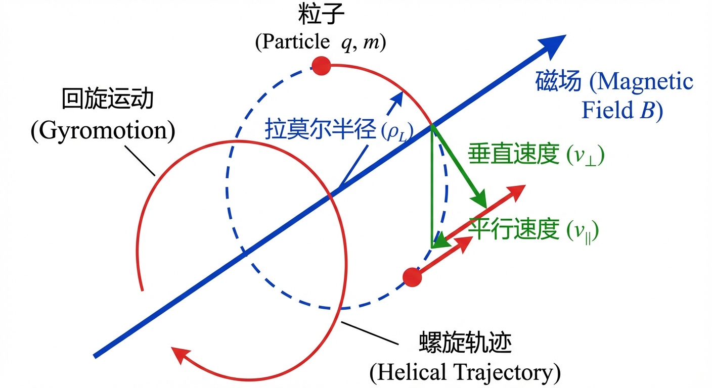
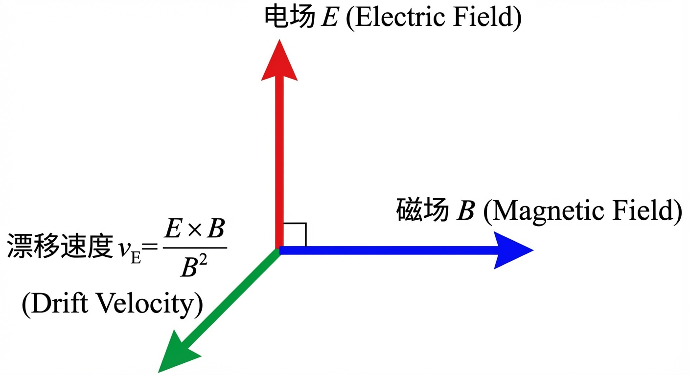
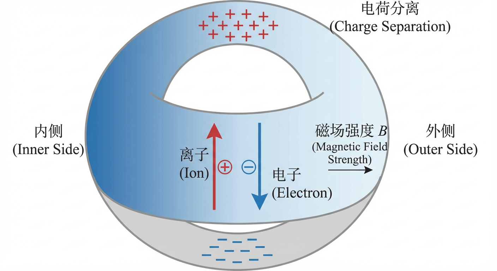
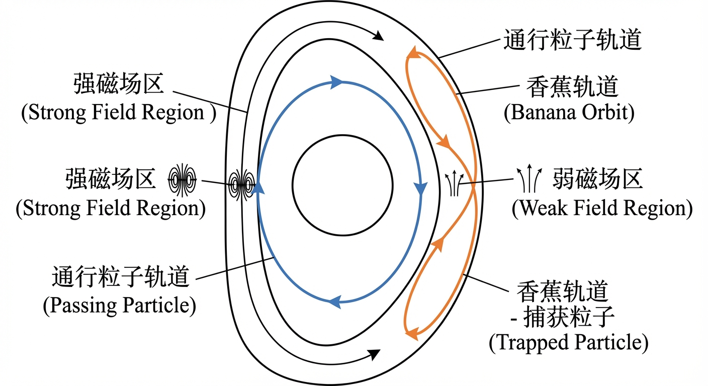
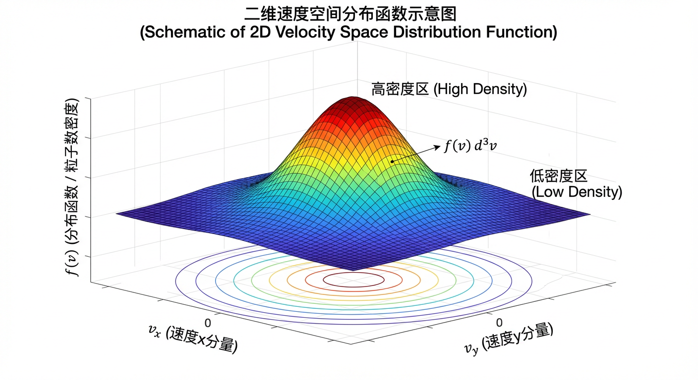
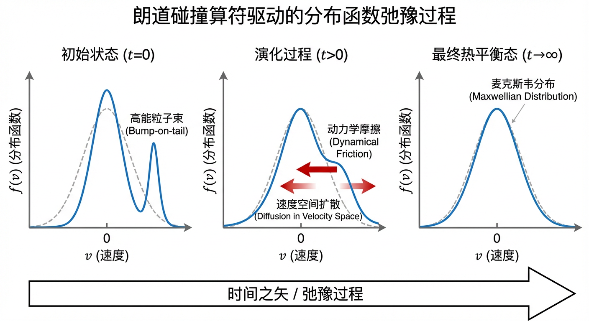
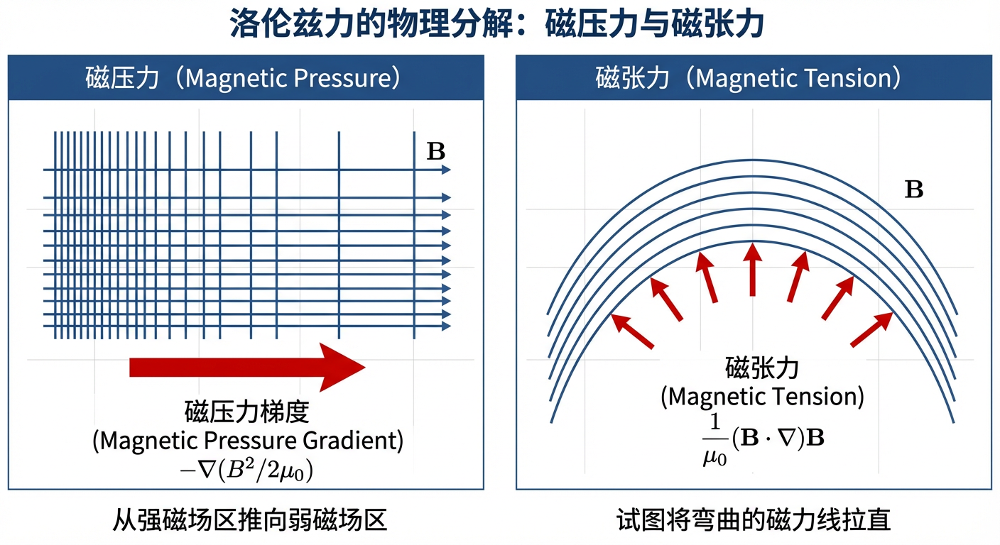
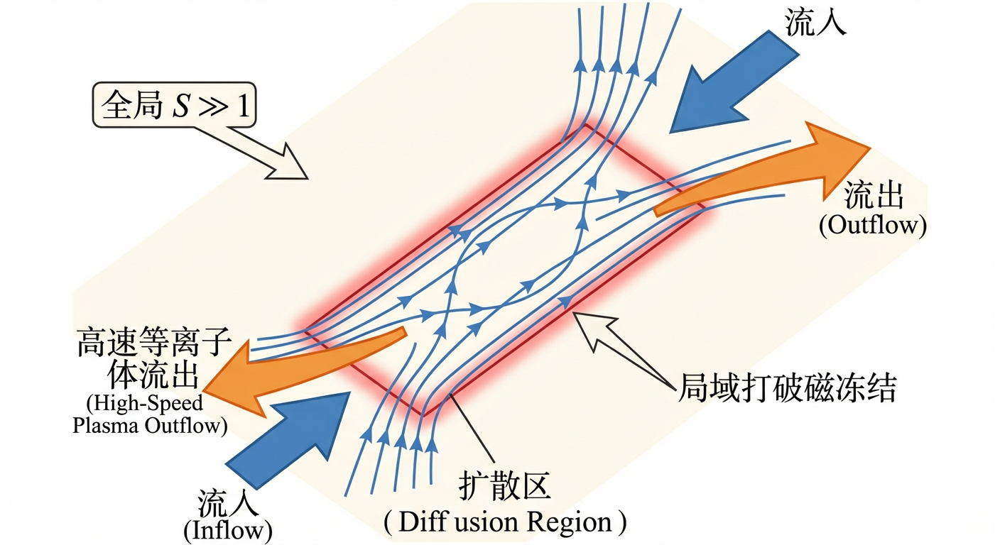

# 第2章：最小可计算模型栈与装置级状态变量

## 2.0 项目概述

在探索可控核聚变这一宏伟工程的征途中，我们面临的最大挑战之一是如何预测和控制高温等离子体的行为。等离子体是一个极其复杂的多尺度系统，跨越了从微观电子回旋（纳秒级、微米级）到宏观装置运行（秒级、米级）的巨大的时空跨度。为了实现有效的工程设计，我们不能仅仅停留在单一的尺度上，而必须构建一个“最小可计算模型栈”。

本章的实战项目将聚焦于“托卡马克运行模式的适用模型评估”。在建立核聚变装置的模拟代码或进行理论分析时，选择正确的物理模型至关重要。一个过于复杂的模型（如全动理学模拟）在计算上是不可行的，而一个过于简化的模型（如不可压理想MHD）如果用在错误的参数范围内，则会得出错误的结论。

虽然本章前两节主要奠定微观和介观的理论基础（单粒子轨道与动理学），但在本章的最后，我们将利用第2.3节建立的磁流体（MHD）理论，结合真实的托卡马克参数（核心区、边缘区、球形托卡马克），进行一次关键的模型有效性评估。你将亲手计算不同工况下的声速马赫数和等离子体比压 $\beta$，判定在哪些区域我们可以安全地使用简化的“不可压理想MHD”模型，从而为后续的稳定性分析打下坚实的工程判断基础。

让我们从最底层的单粒子图景开始，逐步向上构建这一模型栈。

## 2.1 单粒子轨道与漂移图景

在可控核聚变的研究中，我们的核心任务是将由带电粒子构成的、温度高达亿度的等离子体约束在有限的空间内。要理解这一宏伟工程的物理基础，我们必须回归其最基本的单元：单个带电粒子在强磁场中的行为。一个看似简单的问题摆在我们面前：当一个粒子被置于由复杂线圈系统产生的电磁场中时，它的运动轨迹究竟是怎样的？本节将作为一扇教学透镜，引领我们从支配粒子运动的洛伦兹力（Lorentz force）出发，逐步揭示一幅既优美又深刻的物理图景。我们将看到，粒子并非简单地被磁力线“锁住”，而是在快速的回旋运动之上，叠加了一系列缓慢而系统性的漂移。正是这些漂移，构成了理解等离子体约束、输运和稳定性的基石，并为后续章节中更宏观的动理学与磁流体动力学（Magnetohydrodynamics, MHD）描述奠定了不可或缺的微观基础。

### 导向中心近似：从复杂螺旋到简化漂移

一个电荷为 $q$、质量为 $m$ 的粒子在电磁场（$\mathbf{E}$ 和 $\mathbf{B}$）中的运动由洛伦兹力定律精确描述。在最简单的情况下，即一个均匀、恒定的磁场中，粒子会沿着磁场方向以恒定速度 $v_\parallel$ 运动，同时在垂直于磁场的平面内进行匀速圆周运动。这两种运动的结合，形成了一条优美的螺旋线轨迹。这种垂直于磁场的快速圆周运动被称为回旋运动（gyromotion），其角频率——即回旋频率（gyrofrequency）$\Omega_c = |q|B/m$——仅由粒子的荷质比和磁场强度决定；其半径——即拉莫尔半径（Larmor radius）$\rho_L = v_\perp/\Omega_c$——则正比于其垂直速度 $v_\perp$。

然而，在托卡马克（Tokamak）或仿星器（Stellarator）这样的聚变装置中，磁场在空间上绝非均匀，在时间上也可能缓慢变化。粒子的轨迹因此变得异常复杂，直接求解变得不切实际。为了洞察其中的物理本质，我们必须引入一种强大的简化方法——导向中心近似（Guiding Center Approximation）。其核心思想是，当磁场的变化足够缓慢和缓和时，我们可以将粒子复杂的螺旋运动分解为两个部分：一个围绕某“中心点”的快速回旋运动，以及这个“中心点”自身的缓慢漂移运动。这个被平滑掉快速回旋细节的轨道中心，就被称为导向中心（guiding center）。

这一近似的有效性，并非凭空臆断，而是建立在一系列严格的尺度分离条件之上。这些条件共同构成了所谓的导向中心序（guiding-center ordering）。其核心在于，我们要求粒子回旋运动的特征时空尺度，远小于背景电磁场发生显著变化的特征时空尺度。我们可以定义一个无量纲小参数 $\epsilon \equiv \rho_L/L \ll 1$，其中 $L$ 是电磁场（如 $|\nabla \ln B|^{-1}$）的特征变化尺度。这个条件在物理上意味着，粒子在完成一次甚至多次快速回旋的过程中，其感受到的背景磁场几乎是恒定的。同样，我们也要求场的特征变化频率 $\omega$ 远低于粒子的回旋频率 $\Omega_c$。当这些条件满足时，我们便可以将描述粒子完整六维相空间轨迹的复杂问题，简化为描述其导向中心在三维空间中缓慢运动的、更易于处理的问题。这种从完整轨道到导向中心轨道的简化，是理解磁约束等离子体物理的第一次、也是至关重要的一次概念飞跃。

### 基本漂移：导向中心的横越磁场之旅

在导向中心近似的框架下，我们发现除了沿着磁力线的平行运动外，导向中心还会因为电场、磁场梯度和磁场曲率等因素，产生一系列垂直于磁力线的缓慢漂移运动。这些漂移虽慢，却对粒子的长期约束和等离子体的宏观行为具有决定性影响。

#### E×B 漂移：电磁场上的“魔毯”

首先考虑最基本也是最重要的漂移——$E\times B$ 漂移。当一个导向中心同时处于相互垂直的电场 $\mathbf{E}$ 和磁场 $\mathbf{B}$ 中时，它会经历一个既垂直于 $\mathbf{E}$ 又垂直于 $\mathbf{B}$ 的漂移运动。其漂移速度由一个极为简洁的公式给出：
$$
\mathbf{v}_E = \frac{\mathbf{E} \times \mathbf{B}}{B^2}.
$$
这个结果蕴含着一个深刻的物理洞见。我们可以通过一个思想实验来理解它：想象我们进入一个以速度 $\mathbf{u} = (\mathbf{E} \times \mathbf{B}) / B^2$ 运动的参考系。根据电磁场的洛伦兹变换，在这个新的参考系中，观测到的电场
$$
\mathbf{E}' \approx \mathbf{E} + \mathbf{u} \times \mathbf{B}
$$
将会消失（非相对论、且 $E\ll cB$ 的极限下）。这意味着，在那个随波逐流的参考系里，粒子感受不到电场，它所做的只是单纯的、围绕磁力线的回旋运动。我们在实验室参考系中观察到的所谓 $E\times B$ 漂移，不过是这个简单的回旋运动叠加了参考系自身的平移运动而已。因此，$E\times B$ 漂移更像是一种运动学效应，而非一种新的力所驱动。

这一解释直接导出了 $E\times B$ 漂移最惊人的特性：它的速度完全独立于粒子的质量 $m$、电荷 $q$ 甚至电荷的符号。这意味着，在一个给定的正交电磁场中，一个重离子和一个轻电子，将以完全相同的速度、肩并肩地漂移，仿佛被一张无形的电磁“魔毯”承载着。其直接推论是，纯粹的 $E\times B$ 漂移本身不会引起离子和电子的分离，因此不会直接产生电流。它代表了等离子体作为一个整体的宏观流动。在托卡马克中，径向电场是普遍存在的，它与环向和极向磁场相结合，驱动了等离子体的整体旋转。这种旋转及其剪切，正如我们将在第六章中看到的，对抑制湍流和改善约束起着至关重要的作用。

#### 梯度 $B$ 漂移与曲率漂移：几何的馈赠

现在，让我们把目光转向由磁场自身几何形态引起的漂移。现实中的磁场几乎从不均匀，这种不均匀性是粒子漂移的另一个重要来源。

梯度 $B$ 漂移（gradient-$B$ drift）源于磁场强度的空间梯度。当一个粒子在磁场中回旋时，其拉莫尔半径 $\rho_L = m v_\perp/(|q|B)$ 与磁场强度成反比。如果磁场存在梯度，例如在粒子回旋轨道的一侧场强较强，另一侧较弱，那么粒子在弱场侧的轨道曲率半径会更大，而在强场侧的曲率半径会更小。其结果是，粒子在一个回旋周期后无法回到起点，而是产生了一个净的侧向位移。为了理解这一过程，我们引入一个在导向中心近似下近乎守恒的量——磁矩（magnetic moment）
$$
\mu = \frac{m v_\perp^2}{2B}.
$$
它被誉为第一个绝热不变量（adiabatic invariant），其守恒性是导向中心理论的基石。一个具有磁矩 $\mu$ 的回旋粒子，如同一个微小的磁偶极子，在存在磁场梯度的空间中会感受到一个力
$$
\mathbf{F}_{\nabla B} = -\mu \nabla B.
$$
这个力总是将粒子推向磁场较弱的区域。然而，在强磁场中，这个垂直于 $\mathbf{B}$ 的力并不会使粒子沿力的方向持续加速，而是通过洛伦兹力诱导出一个横向漂移：
$$
\mathbf{v}_{\nabla B} = \frac{\mathbf{F}_{\nabla B} \times \mathbf{B}}{q B^2}
= \frac{\mu}{q B^2} \left(\mathbf{B} \times \nabla B\right).
$$
这个漂移的方向既垂直于磁场，也垂直于磁场的梯度方向。例如，在一个磁场强度仅随 $x$ 坐标变化的磁场 $\mathbf{B} = B(x)\hat{\mathbf{z}}$ 中，磁场梯度指向 $\hat{\mathbf{x}}$ 方向，而漂移则发生在 $\hat{\mathbf{y}}$ 方向，导向中心在 $\hat{\mathbf{x}}$ 方向上并无净位移。

与磁场梯度密切相关的是磁场的曲率。当磁力线本身是弯曲的时，一个沿磁力线运动的粒子会感受到一个等效的惯性力（可理解为离心效应）
$$
\mathbf{F}_c = m v_\parallel^2\,\boldsymbol{\kappa},
$$
其中 $\boldsymbol{\kappa} \equiv (\mathbf{b}\cdot\nabla)\mathbf{b}$ 为磁力线曲率向量，$\mathbf{b}=\mathbf{B}/B$。该力同样会诱导一个漂移，即曲率漂移（curvature drift）：
$$
\mathbf{v}_c = \frac{\mathbf{F}_c \times \mathbf{B}}{q B^2}
= \frac{m v_\parallel^2}{q B^2}\left(\boldsymbol{\kappa} \times \mathbf{B}\right).
$$
值得注意的是，梯度 $B$ 漂移正比于粒子的垂直动能（通过 $\mu$），而曲率漂移则正比于平行动能。更重要的是，这两种漂移的速度都反比于电荷 $q$。这意味着正离子和负电子将沿着相反的方向漂移。这种电荷相关的漂移是等离子体内部自发产生电流和电荷分离效应的重要来源，对等离子体的平衡和稳定性有着深远的影响。

在托卡马克这样的环形装置中，磁场强度由于几何效应在环的外侧较弱、内侧较强（近似满足 $B \propto 1/R$），同时磁力线本身也是弯曲的。梯度 $B$ 漂移和曲率漂移因此同时存在，并且在大部分区域对同一电荷符号的粒子而言指向相近的方向（例如，垂直于环平面的方向）。这导致了一个系统性的垂直漂移：离子朝一个方向，电子朝相反方向。若没有其他机制来补偿，这种持续的电荷分离将产生显著的电场，进而通过 $E\times B$ 漂移将整个等离子体推向容器壁，导致约束的失败。现代磁约束装置设计的精髓，正是通过引入扭曲的、螺旋形的磁力线（即在环向场上叠加一个极向场），使得一个粒子在其轨道运动中能够交替地经历向上和向下的漂移，从而在一个轨道周期内使净的垂直漂移被平均掉。这种轨道补偿机制，是实现长时间稳定约束的先决条件，也引出了磁面、安全因子等将在第三章详细讨论的关键概念。

### 磁镜效应与绝热不变量

除了横越磁场的漂移运动，磁场的非均匀性还深刻地影响着粒子沿磁力线的运动，这便引出了磁镜效应（magnetic mirror effect）。想象一个粒子进入一个两端强、中间弱的磁场区域。我们再次求助于两个基本守恒律：粒子的总动能
$$
E = \frac{1}{2}m v_\perp^2 + \frac{1}{2}m v_\parallel^2
$$
守恒，以及在绝热近似下磁矩
$$
\mu = \frac{m v_\perp^2}{2B}
$$
守恒。

当粒子从中间的弱场区 $B_{\min}$ 向一端的强场区 $B_{\text{turn}}$ 运动时，为了保持 $\mu$ 不变，其垂直动能 $K_\perp = \mu B$ 必须随 $B$ 的增加而增加。由于总能量 $E$ 是守恒的，这意味着其平行动能
$$
K_\parallel = E - K_\perp = E - \mu B
$$
必须相应减少。粒子的前进速度会越来越慢。如果磁场变得足够强，粒子可能会到达一个转折点，在该点其平行动能降为零，即 $K_\parallel = 0$。此时，粒子无法再向前行进，将被磁力反射回弱场区。这便是磁镜效应的本质。

然而，并非所有粒子都会被反射。一个粒子的命运取决于它在磁场最弱处的初始状态，具体来说，是其速度矢量与磁力线的夹角——螺距角（pitch angle）$\alpha_0$。一个恰好在磁场最强处 $B_{\max}$ 被反射的粒子，其在磁场最弱处的临界螺距角 $\alpha_c$ 满足关系：
$$
\sin^2\alpha_c = \frac{B_{\min}}{B_{\max}}.
$$
所有初始螺距角小于这个临界角 $\alpha_c$ 的粒子，其平行动能过大，足以克服磁镜的势垒而逃逸。在速度空间中，这些逃逸粒子的速度矢量构成了一个围绕磁场方向的锥体，即著名的损失锥（loss cone）。

这个原理在自然界和实验室中都无处不在。地球的范艾伦辐射带（Van Allen radiation belts）就是一个宏伟的天然磁镜，它俘获了大量高能粒子在南北磁极之间来回反弹，而极光正是粒子被散射进损失锥后轰击高层大气的壮丽景象。在可控核聚变研究中，环形装置（如托卡马克）的磁场在环外侧较弱、内侧较强，自然形成了磁镜结构。这导致等离子体中的粒子被分为两类：一类是能够沿磁力线完整绕环运动的通行粒子（passing particles），另一类则是被俘获在环外侧弱场区来回“弹跳”的捕获粒子（trapped particles）。捕获粒子的导向中心在极向截面上的投影，因弹跳运动与缓慢的环向进动（由梯度 $B$ 和曲率漂移引起）相结合，描绘出独特的“香蕉”形状轨道，即香蕉轨道（banana orbit）。

这种粒子轨道拓扑的分类，是理解更高级输运过程——即将在第六章深入探讨的新经典输运（neoclassical transport）——的出发点。除了磁矩 $\mu$ 之外，对于被俘获的粒子，还存在第二个绝热不变量，即纵向绝热不变量（longitudinal adiabatic invariant）
$$
J = \oint m v_\parallel\, dl,
$$
它是在一个完整的弹跳周期内沿轨道对平行动量所作的积分。在更长的时间尺度上，如果磁场位形缓慢变化，粒子还会遵循第三个绝热不变量——漂移壳层不变量 $\Phi$。这些不变量的近似守恒，构成了磁约束等离子体中粒子轨道理论的优雅数学结构，并为我们预测和控制高能粒子（如聚变产生的 $\alpha$ 粒子或中性束注入的快离子）的行为提供了强大的理论工具。例如，当波与粒子的运动发生共振时，这些不变量可能被打破，导致粒子能量的快速交换或空间的快速输运，这是波加热、电流驱动以及快粒子不稳定性等关键物理过程的基础。

### 小结

本节为我们描绘了一幅关于磁化等离子体中单粒子行为的精细图景。我们看到，尽管粒子被强大的磁场紧密束缚，在极小的拉莫尔半径内进行快速回旋，但它们并非被完美地限制在单一磁力线上。通过导向中心近似，我们将复杂的螺旋运动简化为导向中心的慢速漂移。$E\times B$ 漂移揭示了等离子体作为一个整体如何响应电场，其不依赖于粒子性质的特性是理解宏观流动的基础。与之相对，由磁场几何（梯度和曲率）驱动的漂移则是电荷依赖的，它们是驱动等离子体内部电流与电荷分离效应、并可能引起粒子损失的重要机制，其存在从根本上决定了磁约束位形的几何选择。最后，磁镜效应和绝热不变量（特别是磁矩 $\mu$）不仅解释了粒子在非均匀磁场中的纵向约束，还将粒子划分为通行和捕获两类，为我们理解环形装置中更为复杂的轨道拓扑和新经典输运理论打开了大门。

单粒子轨道理论是连接微观洛伦兹力与宏观等离子体现象的第一座桥梁。它从最基本的物理定律出发，导出了漂移和轨道约束等核心概念，这些概念的集体后果将在后续的动理学和磁流体动力学章节中得到充分展现。可以说，不理解单粒子轨道，就无法深刻把握磁约束聚变的本质。

然而，聚变反应堆中不仅仅有一个粒子，而是亿万个相互作用的粒子。当我们试图描述这庞大群体的集体行为时，追踪每一个粒子的轨道变得不再现实。因此，在下一节中，我们将把视角从“单个粒子的确定性轨道”切换到“大量粒子的统计分布”，引入动理学描述。

## 2.2 动理学表述与碰撞闭合

在上一节中，我们通过导向中心近似（guiding-center approximation），将单个带电粒子在复杂磁场中的运动分解为快速的回旋与缓慢的漂移，从而揭示了粒子轨道的基本图景。然而，一个真实的聚变等离子体是由数以万亿计的粒子组成的集体，追踪每一个粒子的轨迹显然是徒劳的。为了描述这个庞大系统的整体行为，我们必须从个体的、确定的力学描述，转向统计的、概率的动理学描述。

本节的核心议题是建立这种统计描述的理论框架。我们将首先引入相空间中的分布函数作为描述等离子体状态的基本语言，并由此建立起描述无碰撞等离子体演化的弗拉索夫-麦克斯韦方程组（Vlasov-Maxwell equations）。紧接着，我们将面对聚变等离子体中固有的多尺度挑战，并阐述回旋动理学（gyrokinetics）理论如何通过系统性的简化，在保留核心物理的同时，极大地降低了模型的复杂性。然而，一个没有碰撞的理想模型是无法描述趋向热平衡以及输运等不可逆过程的。因此，本节的后半部分将聚焦于“碰撞闭合”这一关键步骤：我们将深入探讨等离子体中长程库仑相互作用的本质，引入朗道碰撞算符（Landau collision operator），并最终推导出决定等离子体欧姆加热和磁场扩散的宏观输运系数——著名的斯皮策电阻率（Spitzer resistivity）以及其在新经典理论（neoclassical theory）中的重要修正。通过这一系列的理论构建，我们将为下一节过渡到更为宏观的磁流体（MHD）模型打下坚实的物理基础。

### 弗拉索夫-麦克斯韦方程组：无碰撞等离子体的理想之舞

要从个体粒子的喧嚣中洞悉集体的和谐，我们必须引入动理学理论的基石——单粒子分布函数（single-particle distribution function），记为 $f_s(\mathbf{x}, \mathbf{v}, t)$。它并非描述某个特定粒子的状态，而是回答一个统计问题：在时间 $t$，位于相空间（phase space）点 $(\mathbf{x}, \mathbf{v})$ 附近，在无穷小的位置空间体积元 $d^3\mathbf{x}$ 和速度空间体积元 $d^3\mathbf{v}$ 内，特定种类 $s$ 的粒子期望数量是多少？这个数量即为 $f_s(\mathbf{x}, \mathbf{v}, t)\, d^3\mathbf{x}\, d^3\mathbf{v}$。因此，$f_s$ 本质上是六维相空间中的粒子数密度。有了这张“相空间人口地图”，我们便可以从描述离散、嘈杂的微观世界，跃迁到描述平滑、连续的统计物理系统。

通过对分布函数在速度空间中取矩，我们可以恢复所有宏观流体量，例如数密度
$$
n_s(\mathbf{x},t) = \int f_s\, d^3\mathbf{v}
$$
和平均速度
$$
\mathbf{u}_s(\mathbf{x},t) = \frac{1}{n_s} \int \mathbf{v}\, f_s\, d^3\mathbf{v}.
$$

现在，让我们考虑一个理想化的世界——一个高温、稀薄到粒子间的短程碰撞可以忽略不计的“无碰撞”等离子体。在这个世界里，粒子仅通过它们共同产生的、平滑的宏观电磁场 $\mathbf{E}$ 和 $\mathbf{B}$ 相互作用。根据刘维尔定理（Liouville's theorem），在哈密顿系统（由洛伦兹力主导的系统正属此类）中，相空间中的“流体”是不可压缩的。这意味着，如果我们跟随一个粒子在相空间中的运动轨迹，其周围的分布函数 $f_s$ 的值保持不变。这一守恒定律的数学表述即为弗拉索夫方程（Vlasov equation）：
$$
\frac{d f_s}{dt}
= \frac{\partial f_s}{\partial t}
+ \mathbf{v}\cdot\nabla_{\mathbf{x}} f_s
+ \frac{q_s}{m_s}\left(\mathbf{E} + \mathbf{v}\times\mathbf{B}\right)\cdot\nabla_{\mathbf{v}} f_s
= 0.
$$
值得注意的是，只要电磁场不依赖于粒子速度（这在宏观场中成立），洛伦兹力所驱动的相空间流是无散的，即
$$
\nabla_{\mathbf{x},\mathbf{v}} \cdot (\dot{\mathbf{x}}, \dot{\mathbf{v}}) = 0.
$$
这直接保证了上述弗拉索夫方程的简洁形式，即分布函数沿粒子特征线的全导数为零。

然而，弗拉索夫方程本身并未封闭。它描述了粒子如何在给定的电磁场中运动，但这些场本身是由所有粒子的集体运动（即电荷密度
$$
\rho(\mathbf{x}, t) = \sum_s q_s \int f_s\, d^3\mathbf{v}
$$
和电流密度
$$
\mathbf{J}(\mathbf{x}, t) = \sum_s q_s \int \mathbf{v}\, f_s\, d^3\mathbf{v}
$$
）产生的。这种自洽的耦合通过麦克斯韦方程组（Maxwell's equations）来完成。弗拉索夫方程与麦克斯韦方程组相结合，构成了描述无碰撞等离子体演化的第一性原理模型——弗拉索夫-麦克斯韦方程组。

这个理想化的系统展现出深刻的物理特性。由于其哈密顿结构的本质，弗拉索夫动力学在微观层面是时间可逆的，并严格保持由分布函数定义的 Casimir 不变量；相应地，对任意满足充分光滑条件的 $f$，量 $\int \mathcal{C}(f)\, d^6\tau$ 在无碰撞演化中守恒。常用的“玻尔兹曼熵”形式
$$
S = -k_B \int f \ln f \, d^6\tau
$$
在无碰撞弗拉索夫演化中也保持不变。这意味着，一个纯粹的弗拉索夫系统永远无法自发地产生不可逆耗散并趋向热力学平衡。它缺少了实现弛豫和产生电阻等耗散效应的关键要素——碰撞。

### 多尺度挑战与回旋动理学简化

弗拉索夫-麦克斯韦方程组虽然完备，但直接求解它在计算上面临着巨大的挑战，这主要源于强磁化等离子体中固有的多尺度特性。在聚变装置的强磁场中，带电粒子围绕磁力线进行极高频率的回旋运动（gyromotion），其特征频率为回旋频率 $\Omega = |q|B/m$，特征尺度为拉莫尔半径 $\rho = v_\perp/\Omega$。例如，在 $B_0 = 5\,\mathrm{T}$ 的磁场中，一个 $10\,\mathrm{keV}$ 的氘离子，其回旋频率约为 $2.4\times 10^8\,\mathrm{s^{-1}}$。要用数值方法解析如此快速的运动，需要极小的时间步长，这使得对我们更感兴趣的、发生在慢得多的输运和湍流时间尺度上的现象进行模拟变得不切实际。

回旋动理学理论（gyrokinetic theory）正是为了应对这一挑战而发展的系统性简化理论。其核心思想是，对于我们关心的低频（$\omega \ll \Omega$）现象，粒子快速回旋运动的相位角是一个可以被平均掉的自由度。回旋动理学通过一系列严谨的数学变换（如李变换），将描述粒子瞬时位置和速度 $(\mathbf{x}, \mathbf{v})$ 的六维相空间，降阶为一个描述回旋中心（gyrocenter）运动的五维相空间。新的坐标通常包括回旋中心位置 $\mathbf{R}$、平行速度 $v_\parallel$ 以及磁矩 $\mu = m v_\perp^2 / (2B)$。在低频、弱非均匀近似下，磁矩 $\mu$ 是一个绝热不变量（adiabatic invariant），这意味着它在粒子的慢速漂移过程中近似守恒。

通过对快速回旋相位进行平均，我们消除了最快的时间尺度，得到了一个描述回旋平均分布函数 $F(\mathbf{R}, v_\parallel, \mu, t)$ 演化的方程——回旋动理学方程（gyrokinetic equation）。在无碰撞的极限下，它同样是一个弗拉索夫类型的方程，表明回旋中心分布函数沿其特征轨道守恒：
$$
\frac{dF}{dt} = 0.
$$
然而，这里的特征轨道不再是粒子的完整轨道，而是回旋中心的漂移轨道。值得注意的是，从粒子坐标到回旋中心坐标的变换通常是非正则的，这意味着在新的相空间中，相空间体积微元的雅可比行列式（Jacobian）并非恒为1。刘维尔定理的正确形式变为加权相空间流的无散性，即
$$
\nabla_{\mathbf{Z}} \cdot (\mathcal{J}\, \dot{\mathbf{Z}}) = 0,
$$
其中 $\mathcal{J}$ 是雅可比行列式，$\mathbf{Z}$ 代表回旋中心坐标。正是这一性质保证了回旋动理学弗拉索夫方程的成立。

回旋动理学的巨大威力在于，它允许我们研究垂直波长与拉莫尔半径相当（$k_\perp \rho \sim 1$）的物理现象，这对于描述驱动反常输运的微观湍流（如离子温度梯度模）至关重要，同时又避免了处理回旋运动本身带来的巨大计算开销。

### 碰撞闭合：从库仑相互作用到宏观输运

无论是弗拉索夫方程还是其回旋动理学形式，在无碰撞的假设下都无法描述等离子体的电阻、黏滞和热弛豫等不可逆过程。为了引入这些效应，我们必须在动理学方程的右侧加入一个碰撞算符（collision operator）$C[f]$：
$$
\frac{df}{dt} = C[f].
$$
这个算符描述了粒子间碰撞如何改变分布函数。与中性气体中主要由短程、硬球式碰撞主导不同，完全电离等离子体中的相互作用是长程的库仑力。一次远距离的“掠过”所产生的偏转虽然微小，但由于其作用范围广，这类事件的发生频率极高。事实上，对于弱耦合等离子体（即粒子间平均势能远小于平均动能，这是聚变等离子体的典型特征），动量和能量的交换主要由大量微弱、小角度的散射累积而成，而非少数剧烈的大角度碰撞所主导。

直接对所有距离的库仑碰撞进行积分会导致结果在小角度（大碰撞参数）和大角度（小碰撞参数）两端发散。物理上，这种发散被两种效应所“驯服”：
1. 在远距离端，等离子体的集体德拜屏蔽（Debye screening）效应使得单个粒子的电场在超出德拜长度 $\lambda_D$ 后呈指数衰减，为积分提供了自然的上限截断。
2. 在近距离端，导致大角度偏转的碰撞本身就不再满足小角度散射的近似；此外在量子力学层面，粒子散射还会受到德布罗意波长等量子效应的限制。

计入这些效应后，碰撞的累积效果最终可以由一个称为库仑对数（Coulomb logarithm）$\ln\Lambda$ 的因子来概括，其中 $\Lambda$ 是远近截断距离之比。在聚变等离子体中，$\ln\Lambda$ 通常在 10 到 20 之间，其远大于 1 的事实，正是“小角度散射占主导”这一物理图像的数学体现。

基于这一物理图像，描述库仑碰撞最精确的算符是朗道碰撞算符（Landau collision operator），它是玻尔兹曼碰撞积分在小角度散射极限下的展开，最终形式为一个复杂的积分-微分方程。其结构内嵌了粒子数、动量和能量的守恒定律，并满足玻尔兹曼 $H$ 定理，即它总是驱动分布函数趋向于熵最大的麦克斯韦分布，从而为系统引入了“时间之矢”。尽管其形式复杂，朗道算符的物理内涵可以被理解为在速度空间中同时作用的两种过程：一个使高能粒子减速的动力学摩擦（dynamical friction），以及一个改变粒子运动方向的速度空间扩散（diffusion in velocity space）。

### 碰撞输运系数：斯皮策与新经典电阻率

有了描述碰撞的动理学工具，我们便可以从微观层面推导宏观的输运系数，其中最重要的便是电阻率（resistivity）。电阻的物理来源，是电子在电场作用下加速时，通过与离子碰撞而损失的定向动量。在一个简化的流体模型中，平行于磁场的电场力 $-e E_\parallel$ 与电子-离子碰撞的摩擦力 $m_e \nu_{ei} u_e$ 相平衡（此处 $u_e$ 表示电子流体相对于离子流体的平行漂移速度），其中 $\nu_{ei}$ 是电子-离子碰撞频率。由此可得到平行电阻率的量纲形式：
$$
\eta_\parallel \sim \frac{m_e \nu_{ei}}{n_e e^2}.
$$

更精确的计算需要求解包含碰撞算符的动理学方程。这一工作由斯皮策（Spitzer）和哈尔姆（Härm）完成，他们得到的斯皮策电阻率 $\eta_{\mathrm{Sp}}$ 揭示了其著名的温度依赖性（给出量纲关系）：
$$
\eta_{\mathrm{Sp}} \propto \frac{Z_{\mathrm{eff}} \ln\Lambda}{T_e^{3/2}}.
$$
这个结果表明，等离子体的电阻率随电子温度的升高而急剧下降。这与金属导体截然相反，其物理根源在于，高温下的电子热速度更快，库仑散射的有效动量交换随速度增加而减弱。公式中的有效电荷数（effective charge）
$$
Z_{\mathrm{eff}} = \frac{\sum_i n_i Z_i^2}{n_e}
$$
是对所有离子种类电荷数平方的加权平均。由于其对 $Z^2$ 的依赖，即使是痕量的重杂质离子也能显著增加等离子体的电阻率，这对聚变装置的性能至关重要。

此外，强磁场会使电导率表现出强烈的各向异性。平行于磁场的电子运动几乎不受回旋的限制，其电导率 $\sigma_\parallel \approx 1/\eta_{\mathrm{Sp}}$。然而，垂直于磁场的电导率 $\sigma_\perp$ 会受到回旋运动的强烈抑制。当电子回旋频率远大于碰撞频率时（这在聚变等离子体中普遍成立），$\sigma_\perp$ 会比 $\sigma_\parallel$ 小很多个数量级。这正是磁约束概念的重要物理基础之一：磁场能极有效地抑制横向输运。

然而，在托卡马克等环形装置的复杂磁场几何中，斯皮策电阻率模型仍不完备。由于磁场强度在磁面上不均匀（外侧弱，内侧强），一部分粒子会被捕获（trapped）在磁场弱区，沿着类似香蕉形状的轨道运动，而无法自由地沿磁力线环绕整个装置。在新经典理论中，这些捕获粒子对稳态平行电流的贡献受到抑制，从而在给定的平行电场作用下，实际产生的电流会小于斯皮策理论在简单几何下的预测，等效的平行电阻率则会相应增大。这种由环形几何效应引起的电阻率增强，被称为新经典电阻率（neoclassical resistivity）。其大小依赖于捕获粒子的份额，而后者又与装置的反纵横比 $\epsilon=r/R$ 等几何参数相关。在现代托卡马克的设计与分析中，新经典修正是必须考虑的关键物理效应。

### 小结

本节内容引领我们完成了一次从微观到宏观的理论跨越。我们从描述单个粒子行为的六维相空间分布函数出发，建立了无碰撞等离子体的理论基石——弗拉索夫-麦克斯韦方程组。为了应对聚变等离子体中巨大的时空尺度分离，我们引入了回旋动理学理论，通过对快速回旋相位的平均，将模型简化为更易处理的五维回旋中心坐标系。

然而，一个可逆的、无碰撞的系统无法描述输运和热化。为此，我们深入探讨了等离子体中长程库仑碰撞的物理本质，阐明了以朗道算符为代表的福克-普朗克类碰撞模型如何通过描述速度空间中的摩擦与扩散，为动理学方程提供了不可或缺的“闭合”项。正是这个碰撞项，赋予了等离子体系统走向热力学平衡的趋势和“时间之矢”。

最终，通过将动理学理论与碰撞模型相结合，我们推导出了宏观的输运系数，特别是斯皮策电阻率。我们不仅理解了其对温度和杂质含量的依赖关系，还进一步探讨了由环形磁场几何引入的新经典修正。本节所建立的动理学描述和碰撞闭合模型，尤其是得到的电阻率，是连接微观物理与宏观现象的桥梁。它不仅解释了等离子体自身的输运特性，更将作为下一节研究电阻磁流体动力学、磁扩散与不稳定性的关键输入参数，从而将我们的认知从粒子层面提升到流体层面。理解动理学与碰撞的相互作用，是构建可计算、可预测的聚变等离子体模型的基石。

尽管动理学模型非常精确，但对于描述装置尺度上的宏观平衡和稳定性问题，六维（或五维）相空间的计算成本依然过于高昂。因此，在下一节中，我们将把“积分”进行到底，通过对分布函数取矩，进入流体力学的世界，构建工程上最为常用的磁流体动力学（MHD）模型。

## 2.3 磁流体近似与电磁扩散尺度

在前面的章节中，我们分别从单粒子轨道和统计动理学的视角，探索了等离子体中带电粒子的复杂行为。然而，对于聚变装置中宏观尺度上的平衡、稳定性与输运等工程核心问题，追踪数万亿粒子的微观轨迹或求解六维相空间的分布函数，在计算上是不可承受之重。因此，我们需要一个更简洁、更宏观的理论框架来描述等离子体的集体行为。本节的目的，正是要建立这样一个框架，将“单粒子—动理学”的视角进一步“上卷”，发展成为装置级最小可计算模型中的流体描述层。

我们关心的是低频（远低于粒子回旋频率）、大尺度（远大于粒子回旋半径）且整体上保持电中性的等离子体动力学。在这些条件下，我们可以将等离子体这锅由电子和离子组成的“汤”，近似看作一种单一的、导电的连续流体。这种将流体力学与电磁学相结合的理论，便是磁流体动力学（Magnetohydrodynamics, MHD）。本节将首先构建理想 MHD 方程组，揭示其核心物理内涵——磁冻结定理（Frozen-in Theorem）；随后，通过引入广义欧姆定律（Generalized Ohm's Law），我们将打破理想化假设，过渡到更真实的电阻 MHD（Resistive MHD）模型；最后，通过分析磁场演化中的对流与扩散竞争，我们将建立起电磁扩散的时间尺度与关键的无量纲判据——伦奎斯特数（Lundquist number），为理解等离子体的宏观稳定性与动态演化奠定理论基石。

### 理想磁流体动力学方程组

为了将等离子体描述为单一流体，我们首先需要定义其宏观状态变量。由于电子质量远小于离子质量（$m_e \ll m_i$），等离子体的质量密度 $\rho$ 和宏观流体速度 $\mathbf{v}$ 主要由离子决定，即 $\rho \approx n_i m_i$ 和 $\mathbf{v} \approx \mathbf{v}_i$，其中 $n_i$ 和 $m_i$ 分别是离子的数密度和质量。在准中性（quasineutrality）假设下，我们有 $n_e \approx n_i = n$（对于单价离子；更一般地应满足 $n_e \approx \sum_i Z_i n_i$）。

基于这些单流体变量，我们可以通过守恒定律推导出一套封闭的方程组，来描述这种导电流体的演化。

#### 1. 质量守恒与动量守恒

与普通流体一样，等离子体的质量守恒由连续性方程（continuity equation）描述：
$$
\frac{\partial \rho}{\partial t} + \nabla \cdot (\rho \mathbf{v}) = 0.
$$
此方程表明，除非有外部的粒子源或汇，否则流体质量是守恒的。

流体元的运动则由动量方程（momentum equation）决定。它本质上是牛顿第二定律的流体形式，但增加了一个至关重要的力——作用于等离子体电流之上的洛伦兹力（Lorentz force）：
$$
\rho \left( \frac{\partial \mathbf{v}}{\partial t} + (\mathbf{v} \cdot \nabla) \mathbf{v} \right) = -\nabla p + \mathbf{J} \times \mathbf{B}.
$$
方程左侧是单位体积流体的惯性项，其中 $\frac{d\mathbf{v}}{dt} \equiv \frac{\partial \mathbf{v}}{\partial t} + (\mathbf{v} \cdot \nabla) \mathbf{v}$ 是流体元的随动导数。右侧是作用在流体元上的合力密度，包括热压力梯度力 $-\nabla p$ 和洛伦兹力 $\mathbf{J} \times \mathbf{B}$。

在 MHD 的低频近似下，我们可以忽略位移电流，安培定律简化为
$$
\nabla \times \mathbf{B} = \mu_0 \mathbf{J}.
$$
代入洛伦兹力表达式，并利用矢量恒等式，我们可以将其分解为两个具有直观物理意义的部分：
$$
\mathbf{J} \times \mathbf{B}
= \frac{1}{\mu_0}(\nabla \times \mathbf{B}) \times \mathbf{B}
= -\nabla \left( \frac{B^2}{2\mu_0} \right) + \frac{1}{\mu_0}(\mathbf{B} \cdot \nabla)\mathbf{B},
$$
其中使用了 $\nabla\cdot\mathbf{B}=0$。第一项是磁压力（magnetic pressure）的梯度，其大小为 $p_m = B^2/(2\mu_0)$。它如同气体压力一样，从磁场强的区域推向磁场弱的区域。第二项是磁张力（magnetic tension），它好比拉紧的橡皮筋产生的力，仅当磁力线弯曲时才出现，并总是试图将弯曲的磁力线拉直。因此，动量方程可以重写为：

$$
\rho \frac{d\mathbf{v}}{dt} = -\nabla \left( p + \frac{B^2}{2\mu_0} \right) + \frac{1}{\mu_0}(\mathbf{B} \cdot \nabla)\mathbf{B}.
$$
这清晰地表明，等离子体的宏观运动是由总压力（热压力与磁压力之和）的梯度与磁张力共同驱动的。

#### 2. 能量守恒与状态方程

为了使方程组闭合，我们需要一个联系压力 $p$ 和密度 $\rho$ 的状态方程。在理想 MHD 中，我们假设等离子体的热力学过程是绝热的，即流体元与外界没有热交换。这由绝热定律（adiabatic law）描述：
$$
\frac{d}{dt} \left( \frac{p}{\rho^\gamma} \right) = 0,
$$
其中 $\gamma$ 是绝热指数（对于单原子理想气体，$\gamma=5/3$）。这意味着对于一个特定的流体元，量 $p/\rho^\gamma$ 在其运动轨迹上保持不变。

#### 3. 理想欧姆定律与磁感应方程

方程组闭合的最后一块拼图，是建立电磁场与流体运动之间的关系。在理想 MHD 的图景中，我们假设等离子体是理想导体（perfect conductor），其电阻率为零（$\eta=0$）。这意味着，在与等离子体一同运动的参考系中，电场必须为零，否则无穷大的电导率会驱动出无穷大的电流，瞬间中和任何电场。这一物理图像的数学表述，即理想欧姆定律（ideal Ohm's law）：
$$
\mathbf{E} + \mathbf{v} \times \mathbf{B} = 0.
$$
将此关系代入法拉第电磁感应定律
$$
\frac{\partial \mathbf{B}}{\partial t} = -\nabla \times \mathbf{E},
$$
我们可以消去电场 $\mathbf{E}$，得到描述磁场如何随流体运动而演化的磁感应方程（induction equation）：
$$
\frac{\partial \mathbf{B}}{\partial t} = \nabla \times (\mathbf{v} \times \mathbf{B}).
$$
这个方程是理想 MHD 的灵魂，它描述了磁场被导电流体“对流”和“拉伸”的过程。

至此，我们得到了封闭的理想 MHD 方程组：
1. **连续性方程**：$\frac{\partial \rho}{\partial t} + \nabla \cdot (\rho \mathbf{v}) = 0$
2. **动量方程**：$\rho \frac{d\mathbf{v}}{dt} = -\nabla p + \mathbf{J} \times \mathbf{B}$
3. **绝热定律**：$\frac{d}{dt} (p \rho^{-\gamma}) = 0$
4. **感应方程**：$\frac{\partial \mathbf{B}}{\partial t} = \nabla \times (\mathbf{v} \times \mathbf{B})$
5. **辅助方程**：$\nabla \times \mathbf{B} = \mu_0 \mathbf{J}$ 和 $\nabla \cdot \mathbf{B} = 0$

这套方程组共同描绘了一幅宏伟而自洽的图景：等离子体流体在压力和洛伦兹力的作用下运动，而它的运动又反过来通过磁感应方程改变磁场的位形。

### 磁冻结定理：一种强大的几何直觉

理想感应方程蕴含着一个深刻的物理后果——磁冻结定理（Frozen-in Theorem）。该定理指出，在理想导电的等离子体中，磁力线如同被“冻结”在流体元中，随流体一同运动。穿过任何随流体运动的闭合回路的磁通量是守恒的。

这一定理为我们提供了强大的几何直觉。想象磁力线是嵌入等离子体中的无限细、无限拉伸的弹性弦。当等离子体流动时：
- **压缩**：如果流体被压缩，磁力线也会被挤压得更紧密，导致磁场强度增加。
- **拉伸**：如果流体元沿磁场方向被拉伸，为了保持磁通量守恒，磁场强度也必须相应改变。
- **剪切**：如果流体发生剪切流动，磁力线会被拉长和扭曲，可能从一个初始简单的磁场位形中产生出更复杂的结构。例如，在一个剪切流场中，初始垂直于流动的磁场分量会被拉伸，从而产生一个平行于流动方向的新磁场分量，其强度在理想条件下可随时间增长。

磁冻结效应是磁约束概念的基石。正是因为磁力线与等离子体“绑”在一起，我们才能够利用精心设计的磁场构型来约束和塑造高温等离子体。然而，理想的冻结也意味着磁场拓扑的不变性：磁力线可以被任意扭曲和拉伸，但不能被切断和重联。这引出了一个问题：我们如何在现实中解释像太阳耀斑或托卡马克中的锯齿崩塌这类涉及磁场拓扑剧烈改变的现象？答案在于打破理想化的假设。

### 从理想走向现实：广义欧姆定律与电阻 MHD

理想 MHD 的核心假设是等离子体电阻率为零。然而，正如我们在 2.2 节所讨论的，由于电子与离子间的库仑碰撞，真实等离子体总存在有限的电阻率（resistivity）$\eta$。为了描述非理想效应，我们必须回到更普适的广义欧姆定律（generalized Ohm's law）。它源于电子流体的动量方程，其完整形式相当复杂，但一个包含关键物理的简化形式为：
$$
\mathbf{E} + \mathbf{v} \times \mathbf{B}
= \eta \mathbf{J}
+ \frac{1}{e n_e}(\mathbf{J} \times \mathbf{B})
- \frac{1}{e n_e}\nabla p_e
+ \frac{m_e}{e^2 n_e} \frac{\partial \mathbf{J}}{\partial t}.
$$
方程右侧的各项分别代表电阻、霍尔效应、电子压力梯度和电子惯性等非理想效应。在许多宏观、慢变的聚变等离子体现象中，霍尔效应、电子压力和电子惯性等项的贡献是高阶小量。在这种情况下，保留主导的非理想项——电阻项，我们便得到了电阻 MHD 模型（Resistive MHD）。其欧姆定律简化为：
$$
\mathbf{E} + \mathbf{v} \times \mathbf{B} = \eta \mathbf{J}.
$$
将这一定律代入法拉第感应定律，并使用 $\mathbf{J} = (\nabla \times \mathbf{B})/\mu_0$，在电阻率 $\eta$ 近似为空间常数的情况下可得电阻 MHD 感应方程：
$$
\frac{\partial \mathbf{B}}{\partial t}
= \nabla \times (\mathbf{v} \times \mathbf{B})
+ \frac{\eta}{\mu_0}\nabla^2 \mathbf{B}.
$$
与理想感应方程相比，这里多出了一项 $(\eta/\mu_0)\nabla^2 \mathbf{B}$。这是一个标准的扩散项（diffusion term），它描述了磁场如何因有限电阻率而发生磁扩散（magnetic diffusion）并耗散。磁场不再完美地“冻结”于流体中，而是允许发生“滑移”。

### 磁扩散时间与伦奎斯特数

磁感应方程中的对流项和扩散项，代表了两种相互竞争的物理过程。为了量化这场博弈，我们可以定义两个特征时间尺度：
- **阿尔芬时间（Alfvén time）** $\tau_A = L/V_A$，是 MHD 扰动（如阿尔芬波）穿过系统特征尺度 $L$ 所需的时间，代表了理想动力学过程的时间尺度。其中阿尔芬速度
  $$
  V_A = \frac{B}{\sqrt{\mu_0\rho}}.
  $$
- **电阻扩散时间（resistive diffusion time）** $\tau_R = \mu_0 L^2 / \eta$，是磁场通过电阻扩散穿过尺度 $L$ 所需的时间。

这两个时间尺度的比值，定义了一个至关重要的无量纲参数——伦奎斯特数（Lundquist number）$S$：
$$
S = \frac{\tau_R}{\tau_A} = \frac{\mu_0 L V_A}{\eta}.
$$
伦奎斯特数衡量了磁场对流与磁场扩散的相对重要性。
- 当 $S \gg 1$ 时，$\tau_R \gg \tau_A$，磁场扩散极其缓慢，等离子体行为在宏观上接近理想 MHD。
- 当 $S \lesssim 1$ 时，扩散效应变得重要或占主导。

让我们来估算一个典型的聚变级托卡马克核心的伦奎斯特数。对于半径尺度 $L=0.5\,\mathrm{m}$，磁场 $B_0=5\,\mathrm{T}$，密度 $n_e=10^{20}\,\mathrm{m^{-3}}$，温度 $T_e=10\,\mathrm{keV}$ 的氘等离子体，其斯皮策电阻率 $\eta$ 极低。量级估算可得，阿尔芬时间 $\tau_A$ 约为 $10^{-7}\,\mathrm{s}$ 的量级，而电阻扩散时间 $\tau_R$ 可达 $10^2\,\mathrm{s}$ 量级（甚至更长，取决于具体参数与 $Z_{\mathrm{eff}}$）。因此，其伦奎斯特数 $S$ 通常可达 $10^9$ 量级或更高。

如此巨大的 $S$ 值揭示了聚变等离子体的一种深刻“双重性格”：全局近似理想，局域必须非理想。在宏观尺度上，$S \gg 1$ 意味着磁冻结是极好的近似，这是实现稳定磁约束的基础。然而，这种近乎完美的导电性也使得欧姆加热效率随温度升高而急剧下降（$\eta \propto T_e^{-3/2}$），限制了仅靠欧姆加热所能达到的温度。

更重要的是，即使在全局理想的背景下，电阻效应也绝非无足轻重。在等离子体中，可以形成极薄的、具有强烈电流梯度的电流片（current sheet）。在这些薄层内部，特征尺度 $L$ 变得极小，使得扩散项中的 $\nabla^2 \mathbf{B}$ 变得巨大。这足以让扩散项与对流项相抗衡，在局部打破磁冻结。

这正是磁重联（magnetic reconnection）发生的物理根源。如经典的 Sweet–Parker 模型所示，即使在 $S$ 值极高的情况下，有限的电阻率也允许相反的磁力线在一个薄的扩散层内断开并重新连接，从而释放巨大的磁能。尽管经典模型的重联率量级关系（$M_{\mathrm{in}} \sim S^{-1/2}$）对于解释某些聚变等离子体中的快速事件（如锯齿崩塌）往往过慢，但它揭示了电阻（以及更广义的非理想效应）是启动拓扑变化的必要条件之一。现代重联理论在此基础上进一步考虑霍尔效应、压力张量、以及等离子体团（plasmoid）不稳定性等机制，解释了当 $S$ 超过某个临界值（常取 $S\sim 10^4$ 的量级）后，重联过程如何转变为一种更快速的爆发模式。

因此，伦奎斯特数不仅是区分理想与电阻行为的标尺，它还构成了理解等离子体中各种不稳定性的时间与空间尺度的基础。例如，后续章节将要讨论的撕裂模（tearing mode），其增长率依赖于 $S$ 的分数次幂（典型标度关系如 $\gamma \propto S^{-3/5}$，具体指数取决于模型与几何），而周期性的锯齿振荡（sawtooth oscillation），其缓慢的爬升阶段正是一个由 $\tau_R$ 控制的电流扩散过程。这一“全局理想，局域非理想”的观念，是我们理解磁约束等离子体中从稳定平衡到剧烈破裂等一系列复杂动力学现象的认知锚点。

> **实战项目应用 I：托卡马克运行区间的 MHD 适用性评估**  
> 理论模型必须在正确的参数区间内使用，否则将导致严重的设计错误。本项目的任务是定量评估“不可压理想 MHD”模型（即假设 $\nabla\cdot\mathbf{v} \approx 0$ 且忽略电阻）对以下三种典型托卡马克运行模式的适用性。  
>  
> 1. **模式 A（核心区）**：$n=8.0\times 10^{19}\,\mathrm{m^{-3}}$，$T_{e}=T_{i}=10\,\mathrm{keV}$，$B=5.5\,\mathrm{T}$，扰动速度 $v=5.0\times 10^3\,\mathrm{m/s}$。  
> 2. **模式 B（边缘区，ELM 前兆）**：$n=6.0\times 10^{19}\,\mathrm{m^{-3}}$，$T_{e}=T_{i}=1.0\,\mathrm{keV}$，$B=2.0\,\mathrm{T}$，扰动速度 $v=1.5\times 10^5\,\mathrm{m/s}$。  
> 3. **模式 C（球形托卡马克，高 $\beta$ 放电）**：$n=1.5\times 10^{20}\,\mathrm{m^{-3}}$，$T_{e}=T_{i}=3.0\,\mathrm{keV}$，$B=0.70\,\mathrm{T}$，扰动速度 $v=2.0\times 10^5\,\mathrm{m/s}$。  
>  
> **任务要求：**  
> 1. 将等离子体压力近似为
>    $$
>    p \approx n k_B T_e + n k_B T_i = n k_B (T_e+T_i),
>    $$
>    并取质量密度（氘等离子体近似）
>    $$
>    \rho \approx n m_i.
>    $$
> 2. 计算各模式下的绝热声速
>    $$
>    c_s = \sqrt{\frac{\gamma p}{\rho}}
>    $$
>    与声速马赫数
>    $$
>    M_s = \frac{v}{c_s}.
>    $$
> 3. 计算各模式下的等离子体比压
>    $$
>    \beta = \frac{2\mu_0 p}{B^2}.
>    $$
> 4. 基于 $M_s$（衡量压缩性）和 $\beta$（衡量热压与磁压的相对强度，并影响不同 MHD 模式的耦合），判定上述哪种模式可以合理使用不可压理想 MHD 近似进行线性稳定性分析。

### 小结

本节中，我们从动理学图像过渡到了宏观的磁流体动力学（MHD）描述。我们系统地构建了理想 MHD 方程组，并阐明了其核心物理推论——磁冻结定理，它为磁约束提供了直观的几何图像。然而，理想 MHD 无法解释磁场拓扑的改变。

通过引入广义欧姆定律，我们揭示了电阻率作为破坏理想性的关键因素。在电阻 MHD 框架下，磁感应方程中的对流项与扩散项形成了一场博弈，其胜负由伦奎斯特数 $S$ 决定。对于聚变等离子体，极高的 $S$ 值意味着系统在宏观上近乎理想，但在局域的薄电流层中，电阻效应却能主导物理过程，为磁重联、撕裂模等关键动力学事件打开大门。

这种“全局理想、局域非理想”的双重性格，是理解可控核聚变等离子体行为的精髓。它不仅为后续章节中将要探讨的平衡、稳定性和破裂等问题提供了统一的方程接口和时间尺度语言，也为我们展现了从一个简单的物理近似出发，如何逐步揭示出等离子体世界丰富而深刻的内在逻辑与理论美感。

## 总结

本章我们完成了一次宏大的理论构建，建立了可控核聚变研究的“最小可计算模型栈”。我们首先从单粒子轨道出发，理解了磁约束的基本机制——回旋与漂移；随后引入动理学描述，通过分布函数和碰撞算符处理统计行为，推导出了关键的输运系数；最后，通过对动理学方程取矩，我们获得了宏观的 MHD 模型，这是描述等离子体整体平衡与稳定性的核心工具。

特别是通过实战项目：托卡马克运行区间的 MHD 适用性评估，我们将抽象的 MHD 方程与真实的装置参数联系了起来。以下是对该项目问题的详细解答。

**项目解答：MHD 适用性评估**

要判断不可压理想 MHD 近似是否适用，我们需要考察两个关键指标：
1. **声速马赫数 $M_s = v/c_s$**：不可压近似要求密度扰动相对较小，线性波动层面常用量级关系 $\delta \rho/\rho_0 \sim M_s^2$，因此需 $M_s \ll 1$。
2. **等离子体比压 $\beta$**：$\beta$ 衡量热压相对磁压的强弱。较低的 $\beta$ 往往意味着磁场在力学上更“刚性”，部分模式下压缩效应相对不显著，但是否可不可压仍需与 $M_s$ 共同判断。

我们使用以下常数进行计算（假设单价氘等离子体，$m_i \approx 3.345\times 10^{-27}\,\mathrm{kg}$，$\gamma=5/3$，且 $T$ 以能量单位给出时用 $k_B T \equiv T\,(\mathrm{J})$，即 $1\,\mathrm{keV}=1.602\times 10^{-16}\,\mathrm{J}$）：

- **模式 A（核心区）**：
  - 压力
    $$
    p = n(T_e+T_i) = 8.0\times 10^{19}\times (20\,\mathrm{keV})
    \approx 2.56\times 10^{5}\,\mathrm{Pa},
    $$
    密度
    $$
    \rho \approx n m_i \approx 2.68\times 10^{-7}\,\mathrm{kg/m^3}.
    $$
  - 声速
    $$
    c_s = \sqrt{\frac{\gamma p}{\rho}}
    \approx 1.26\times 10^{6}\,\mathrm{m/s}.
    $$
  - 马赫数
    $$
    M_s = \frac{5.0\times 10^{3}}{1.26\times 10^{6}} \approx 0.004 \ll 1.
    $$
  - 比压
    $$
    \beta = \frac{2\mu_0 p}{B^2}
    \approx 2.1\times 10^{-2}\;(2.1\%).
    $$
  - **结论**：$M_s$ 极小且 $\beta$ 较低，适用不可压理想 MHD 近似进行线性稳定性分析。

- **模式 B（边缘区）**：
  - 压力
    $$
    p = 6.0\times 10^{19}\times (2\,\mathrm{keV})
    \approx 1.92\times 10^{4}\,\mathrm{Pa}.
    $$
  - 密度
    $$
    \rho \approx 6.0\times 10^{19}\times 3.345\times 10^{-27}
    \approx 2.01\times 10^{-7}\,\mathrm{kg/m^3}.
    $$
  - 声速
    $$
    c_s \approx \sqrt{\frac{(5/3)\times 1.92\times 10^{4}}{2.01\times 10^{-7}}}
    \approx 4.0\times 10^{5}\,\mathrm{m/s}.
    $$
  - 马赫数
    $$
    M_s = \frac{1.5\times 10^{5}}{4.0\times 10^{5}} \approx 0.375.
    $$
  - 比压
    $$
    \beta \approx \frac{2\mu_0\times 1.92\times 10^{4}}{(2.0)^2}
    \approx 1.2\times 10^{-2}\;(1.2\%).
    $$
  - **结论**：虽然 $\beta$ 较低，但 $M_s\approx 0.38$，压缩性不可忽略；不适用不可压近似，应考虑可压效应（并在边缘情形中进一步关注非理想项与几何效应）。

- **模式 C（球形托卡马克）**：
  - 压力
    $$
    p = 1.5\times 10^{20}\times (6\,\mathrm{keV})
    \approx 1.44\times 10^{5}\,\mathrm{Pa}.
    $$
  - 密度
    $$
    \rho \approx 1.5\times 10^{20}\times 3.345\times 10^{-27}
    \approx 5.02\times 10^{-7}\,\mathrm{kg/m^3}.
    $$
  - 声速
    $$
    c_s \approx \sqrt{\frac{(5/3)\times 1.44\times 10^{5}}{5.02\times 10^{-7}}}
    \approx 6.9\times 10^{5}\,\mathrm{m/s}.
    $$
  - 马赫数
    $$
    M_s = \frac{2.0\times 10^{5}}{6.9\times 10^{5}} \approx 0.29.
    $$
  - 比压
    $$
    \beta \approx \frac{2\mu_0\times 1.44\times 10^{5}}{(0.70)^2}
    \approx 0.74.
    $$
  - **结论**：$M_s$ 不可忽略且 $\beta$ 很高，高 $\beta$ 下压力驱动效应与可压耦合显著；不适用不可压理想 MHD 近似。

综上所述，仅有模式 A（核心区低频扰动）能够合理地使用不可压理想 MHD 模型。这揭示了一个重要的工程现实：虽然 MHD 模型强大，但必须针对装置的不同区域（核心与边缘）和不同构型（常规与球形）谨慎选择具体的模型近似，否则计算结果将缺乏可靠性。这一结论将直接指导我们在后续章节中对不同不稳定性模式的分析方法选择。