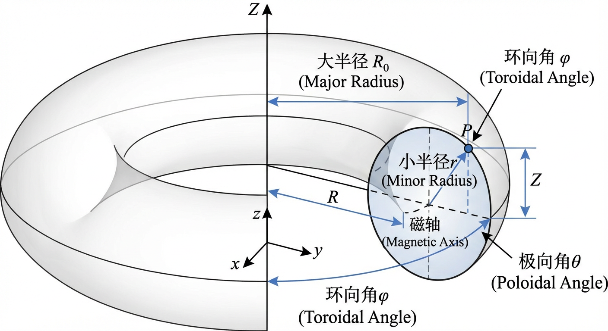
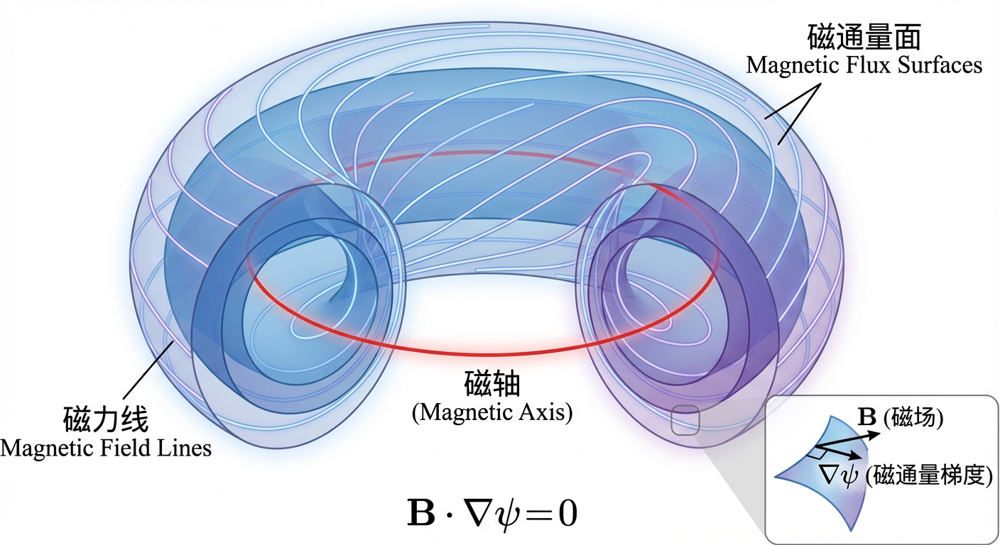
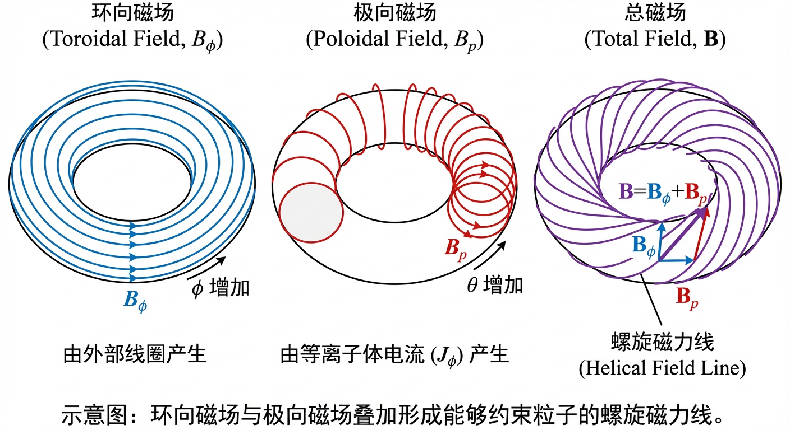
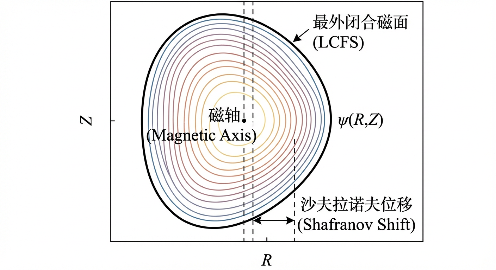
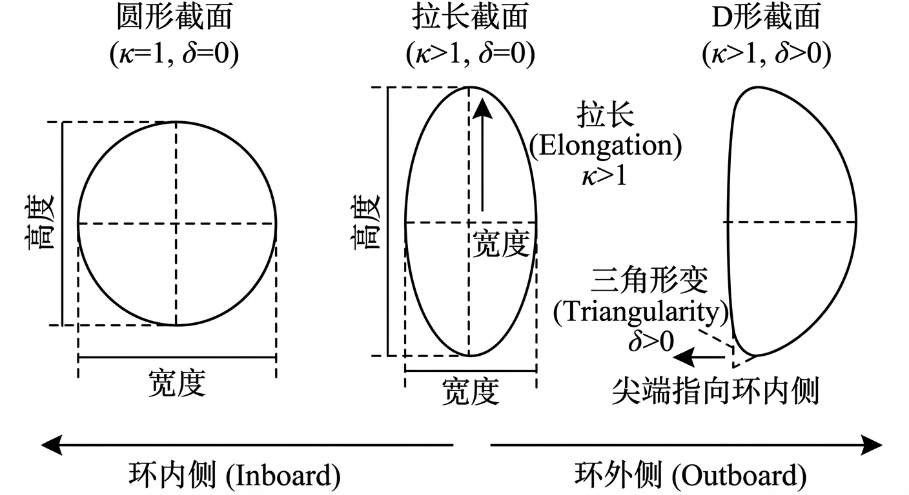
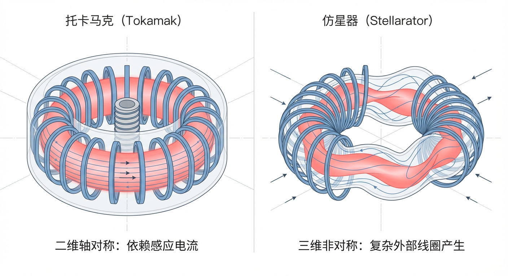
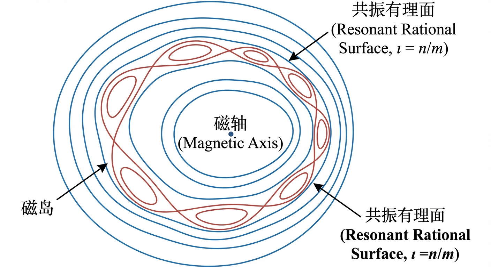
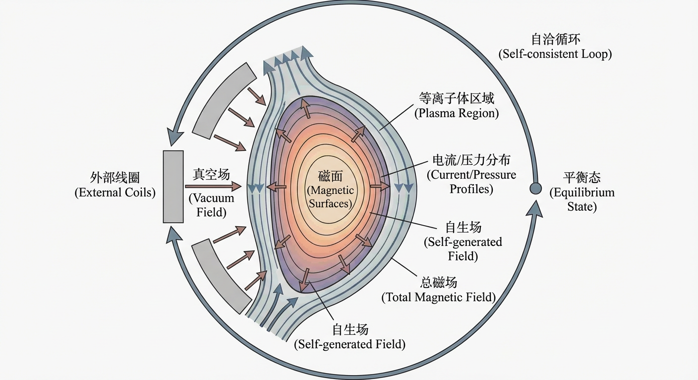

# 第3章：位形选择、平衡求解与线圈接口收敛

## 3.0 项目概述

在磁约束核聚变的研究与工程实践中，理论模型与数值模拟是不可或缺的“双翼”。为了将本章抽象的几何概念、平衡方程以及复杂的优化原理转化为具体的工程能力，我们将引入一个贯穿全章的实战项目——“虚拟聚变堆：从几何定义到自由边界平衡的数值构建”。

本项目旨在模拟一个简化但物理自洽的聚变装置设计流程。面对一个尚处于概念阶段的磁约束装置，我们面临的核心挑战是：如何用精确的数学语言描述其磁场拓扑？如何在力学平衡的约束下求解其内部结构？当装置走向三维（如仿星器）时，如何选择高效的计算工具？以及最终，如何处理等离子体与外部线圈之间真实的耦合关系？

我们将分四个阶段推进这一项目：

1. **坐标系定义**：基于 3.1 节，选择并定义适合回旋动力学分析的磁通坐标系（如 Boozer 或 Hamada 坐标）。
2. **二维平衡求解**：基于 3.2 节，编写一个简化（线性闭合关系下）的格拉德-沙夫拉诺夫（Grad–Shafranov）方程求解器，计算托卡马克截面上的磁通与压力分布。
3. **三维求解器评估**：基于 3.3 节，通过误差与分辨率分析，对比谱方法与有限元方法在三维平衡计算中的内存消耗，为仿星器优化选择合适的工具。
4. **误差场修正策略**：基于 3.4 节，分析并选择针对线圈安装误差的最佳修正策略（真空场调整 vs 自由边界优化）。

通过这一项目，你不仅能加深对旋转变换、磁剪切、$\beta$ 值等核心参数的理解，还将掌握聚变物理学家日常使用的数值方法与思维模式。

## 3.1 环形几何与磁拓扑参数化

在第二章中，我们已经建立了描述等离子体作为导电磁流体的基本方程组。然而，在着手求解这些复杂的方程以确定等离子体的具体行为之前，我们必须首先回答一个更根本的问题：我们应当在怎样的“舞台”上描述这场由磁场与物质共同上演的戏剧？对于磁约束聚变装置而言，这个舞台便是一个由磁场自身精心编织的环形几何空间。若无一套能够精确描绘这一无形容器的几何形态与拓扑结构的数学语言，分析等离子体的平衡、稳定性与输运将无从谈起。

本节的任务，便是构建这样一套基础语言。我们将从最直观的环形几何坐标出发，逐步引入一系列深刻的物理概念：由磁场线构成的嵌套“磁通量面”（magnetic flux surfaces），它如同俄罗斯套娃般，构成了理想约束的拓扑骨架；作为骨架支柱的环向（toroidal）与极向（poloidal）磁场；以及最终，我们将定义一组用以量化磁场拓扑“扭曲”程度的核心参数——旋转变换（rotational transform, $\iota$）、安全因子（safety factor, $q$）与磁剪切（magnetic shear, $\hat{s}$）。这些参数不仅是对几何的描述，更是决定等离子体能否稳定存在、能量能否被有效约束的关键物理量。掌握这套语言，是理解后续章节中更为复杂的平衡、稳定性与输运问题的先决条件。

### 环形几何与坐标系

为了描述环形磁约束装置中的等离子体，我们首先需要一个合适的坐标系。最直观的起点是一个理想的、具有圆形截面的环，即环面（torus）。我们可以用三个坐标来唯一地确定环内任意一点的位置：大半径 $R$（从环体对称轴到该点的距离）、垂直高度 $Z$、以及环向角 $\phi$（绕对称轴的方位角）。这便是在第二章中已熟悉的柱坐标系 $(R,Z,\phi)$。

然而，为了更好地反映环形等离子体的小截面结构，引入一套以环的小半径为基准的坐标系通常更为便利。设环的大半径为 $R_0$（从装置中心到截面圆心的距离），小半径为 $r$（从截面圆心到特定点的距离），我们可以定义一套环形坐标系 $(r,\theta,\phi)$，其中 $\theta$ 是在每个环形截面内测量的极向角。这两套坐标系之间的转换关系为：
$$
R = R_0 + r\cos\theta,\qquad Z = r\sin\theta .
$$
将此关系与柱坐标到笛卡尔坐标 $(x,y,z)$ 的转换（$x=R\cos\phi,\ y=R\sin\phi,\ z=Z$）相结合，便可建立起任意环形坐标点与标准三维空间位置的一一对应。

在任何坐标变换中，雅可比行列式（Jacobian determinant），记为 $\mathcal{J}$，都扮演着核心角色。它联系了坐标空间中的微元体积与物理空间中的真实体积：$dV=\mathcal{J}\,dr\,d\theta\,d\phi$。对于上述简单的环形坐标系，通过直接计算可以得到其雅可比行列式为：
$$
\mathcal{J}(r,\theta)=r\bigl(R_0+r\cos\theta\bigr) .
$$
值得注意的是，当 $r=0$ 时，$\mathcal{J}=0$。这个位置对应于环的中心线，在磁约束聚变中被称为磁轴（magnetic axis）。在磁轴上，小半径为零，导致极向角 $\theta$ 的定义变得模糊，所有 $\theta$ 值都指向同一点。这与二维极坐标系中原点的角度奇点完全类似，是环形几何内禀的性质。理解这种坐标奇点的存在，对于后续构建和使用更为复杂的磁坐标系至关重要。

### 磁面：理想的约束拓扑

在理想磁流体动力学（ideal MHD）模型中，高温导电等离子体中的带电粒子被“冻结”在磁力线上，其运动轨迹与磁力线紧密耦合。为了实现对等离子体的长时间有效约束，我们必须构建一个“磁笼”，防止粒子直接逃逸并撞击容器壁。这一磁笼的拓扑结构，正是由一系列嵌套的闭合磁通量面（magnetic flux surfaces），简称磁面，所构成。

一个磁面在物理上是一个二维曲面，磁场矢量 $\mathbf{B}$ 在该曲面上的每一点都与之相切。这意味着，一旦一条磁力线起始于某个磁面，它将永远被约束在该曲面上运动，无法穿越。为了用数学语言描述这一特性，我们引入一个标量函数 $\psi(\mathbf{x})$，称为磁通量函数（flux function），并定义磁面为其等值面，即由方程 $\psi(\mathbf{x})=\text{const}$ 描述的曲面。根据矢量微积分，一个标量场的梯度 $\nabla\psi$ 处处垂直于其等值面。因此，磁场线位于磁面上的物理条件，可以被简洁地表达为磁场矢量 $\mathbf{B}$ 与磁通量函数梯度 $\nabla\psi$ 处处正交：
$$
\mathbf{B}\cdot\nabla\psi=0 .
$$
这个方程深刻地揭示了沿着任意一条磁力线的路径，磁通函数 $\psi$ 的值都保持不变。这正是磁力线被“囚禁”于磁面之上的数学表述。

这些嵌套磁面的拓扑结构是什么？一个直观的猜测可能是球面，但这被一个深刻的拓扑学定理——毛球定理（Hairy Ball Theorem）——所否定。该定理指出，在球面 $S^2$ 上，任何连续的切向矢量场必有至少一个零点。然而，为了约束等离子体，磁场 $\mathbf{B}$ 在磁面上必须处处非零。因此，磁通量面不可能是球面。与之相对，一个亏格为 1 的环面（torus, $T^2$）则允许存在处处非零的切向矢量场。这从根本上决定了磁约束装置的基本形态必须是环形的。

### 磁场的分解与参数化

为了在环形几何中形成具有约束能力的磁场，通常需要两种不同方向的磁场分量协同作用。基于我们建立的环形坐标，我们可以定义两个关键方向：环向（toroidal），即沿着环的大圆周（$\phi$ 增加）的方向；以及极向（poloidal），即沿着环的小截面圆周（$\theta$ 增加）的方向。总磁场 $\mathbf{B}$ 可以被分解为这两个方向上的分量：
$$
\mathbf{B}=B_{\phi}\,\hat{\mathbf{e}}_{\phi}+B_{p}\,\hat{\mathbf{e}}_{p} ,
$$
其中，$\hat{\mathbf{e}}_{\phi}$ 和 $\hat{\mathbf{e}}_{p}$ 分别是环向和极向的单位矢量（在一般环形坐标中，极向方向的单位矢量需由度规定义；这里用 $\hat{\mathbf{e}}_{p}$ 表示沿极向增大的切向单位方向）。

这两个磁场分量的产生机制截然不同：
- **环向磁场 $B_{\phi}$** 主要由装置外部的环向场线圈（toroidal field coils）产生。这些线圈沿极向环绕等离子体，并沿环向均匀分布。在没有等离子体电流的真空中，由安培定律可推导出其强度近似与大半径 $R$ 成反比，即 $B_{\phi}\propto 1/R$。
- **极向磁场 $B_{p}$** 则主要由等离子体内部流动的环向电流 $J_{\phi}$ 产生。这是托卡马克（tokamak）装置的基本工作原理：通过感应或非感应方式在等离子体中驱动强大的环向电流，这个电流如同一个螺线管，产生一个环绕自身的极向磁场。

正是这两种磁场的叠加，使得最终的磁力线不再是简单的闭合圆环，而是以螺旋状的方式缠绕前进，从而形成了我们所需要的、能够约束粒子的闭合磁面。

### 磁力线拓扑的关键参数

为了定量地描述磁力线在磁面上的螺旋缠绕程度，我们引入三个核心的拓扑参数。在理想的嵌套磁面平衡中，它们通常是磁通量函数（flux functions），即在同一个磁面上为常数。

#### 旋转变换（rotational transform, $\iota$）与安全因子（safety factor, $q$）

这两个参数从不同角度描述磁力线的扭曲率。$\iota(\psi)$ 定义为磁力线沿环向绕行一周时，其在极向方向上转过的圈数；而 $q(\psi)$ 定义为磁力线沿极向绕行一周时，在环向方向上转过的圈数。在采用一致的角坐标规范时，它们互为倒数：
$$
q(\psi)=\frac{1}{\iota(\psi)} .
$$
在托卡马克中，由于环向磁场通常远强于极向磁场，磁力线缠绕得较为“平缓”，$q$ 值通常大于 1。$q$ 值不仅是几何描述，更是一个关乎稳定性的关键参数。当某个磁面上的 $q$ 值为有理数，例如 $q=m/n$（$m,n$ 为整数），磁力线在该面上会在环向绕行 $n$ 圈、极向绕行 $m$ 圈后回到起点，形成一条闭合的周期轨道。这样的有理面（rational surface）对具有相同螺旋性的磁场扰动极为敏感，容易发生共振，从而导致磁流体动力学（MHD）不稳定性的增长。相反，如果 $q$ 为无理数，磁力线将永不闭合，而是会遍历性地（ergodically）覆盖整个磁面。

#### 磁剪切（magnetic shear, $\hat{s}$）

磁剪切描述了磁力线的扭曲程度随径向位置的变化率。一个常用的无量纲定义是：
$$
\hat{s}=\frac{r}{q}\frac{dq}{dr} ,
$$
其中 $r$ 是与磁通量函数 $\psi$ 相关的某个径向坐标。磁剪切的物理意义在于，如果 $\hat{s}\neq 0$，那么相邻两个磁面上的磁力线具有不同的螺距。当它们沿环向行进时，会像剪刀一样相互“滑动”或“剪切”。这种效应对于抑制大尺度不稳定性至关重要。一个试图径向穿越多个磁面的扰动，必须克服这种因磁力线扭曲而产生的能量代价（磁张力）。因此，一个具有适当正或负磁剪切的位形，通常比零剪切的位形更为稳定。

### 小结

在本节中，我们为描述磁约束聚变等离子体的复杂世界构建了一套基础的数学与物理语言。我们从直观的环形几何出发，理解了坐标系的建立及其内在的奇点。更重要的是，我们引入了磁通量面这一核心拓扑概念，它将理想 MHD 中磁场“冻结”于流体的图像具体化为一系列嵌套的、如同无形容器般的环状曲面。

为了定量地描述这个无形容器的结构，我们进一步定义了环向与极向磁场，并揭示了它们的物理起源。最终，我们将磁力线在磁面上的螺旋缠绕行为参数化为三个关键的拓扑量：旋转变换 $\iota$、安全因子 $q$ 和磁剪切 $\hat{s}$。这些参数不仅是对磁场几何的静态描述，更蕴含着深刻的动力学与稳定性信息。

至此，我们已经搭建好了分析问题的舞台。然而，仅有几何框架是不够的，我们还需要选择特定的坐标系来定量计算后续的物理过程。例如，回旋动力学模拟对坐标的选择极为敏感，这构成了我们实战项目的第一步。

> **实战项目应用 I：磁通坐标系定义**  
> **项目阶段目标**：为虚拟聚变堆的多粒子回旋动力学模拟确定一套精确的坐标系定义。  
> **任务描述**：考虑一个大环径比、轴对称托卡马克装置，其磁场结构由嵌套的环形磁通面构成。为了正确进行回旋动力学公式推导，你需要定义一套沿磁力线排列的磁通坐标系 $(\psi,\theta,\zeta)$。  
> **核心挑战**：依靠标准的平衡条件（如 $\nabla\cdot\mathbf{B}=0$、$\mathbf{j}\times\mathbf{B}=\nabla p$），你需要明确：  
> 1. 磁通坐标的定义：$\psi$ 应对应极向磁通还是环向磁通？直场线属性如何通过旋转变换 $\iota(\psi)$ 或安全因子 $q(\psi)$ 来表达？  
> 2. 度规与雅可比：如何写出度规元素 $g^{ij}$ 和位形空间雅可比 $J$？  
> 3. Boozer 与 Hamada 坐标的区别：这两种广泛使用的磁通坐标系在磁场分量表示和雅可比对角度的依赖性上有何本质不同？  
> 请在阅读完本节关于磁面和旋转变换的内容后，思考如何选择和区分这些坐标系，具体解答将在本章总结中给出。

接下来的 3.2 节将在此基础上，引入等离子体的压力和电流，探讨在力的平衡下，这些磁面的具体形状是如何被决定的，即求解著名的 Grad–Shafranov 方程。这套语言，是连接理想化几何模型与真实等离子体平衡、稳定性和输运物理的桥梁。

## 3.2 托卡马克平衡与形状自由度

在上一节中，我们建立了描述环形磁约束等离子体的几何与拓扑语言，引入了磁通量面、安全因子等核心概念，并初步探讨了适应这些拓扑结构的坐标系选择。这为我们描绘了一幅静态的磁场“骨架”。然而，一个根本性的问题随之而来：一个由数亿度高温带电粒子构成的、具有巨大内部压力的流体，是如何在这副磁场骨架中维持稳定形态的？是什么物理定律支配着这场高温物质与无形磁场之间的精妙博弈？本节将深入探讨这一核心问题，即托卡马克中的磁流体动力学（MHD）平衡。我们将从基本的力学平衡原理出发，推导出描述轴对称平衡的主方程——格拉德-沙夫拉诺夫方程，并进一步探索如何通过主动“雕刻”等离子体的几何形状来优化其性能，从而为后续章节中关于稳定性与输运的讨论奠定坚实的物理基础。

### 环向平衡中的力学原理

在理想磁流体动力学模型中，一个处于静态（即宏观速度为零）的等离子体，其内部每一点都必须满足力学平衡。这本质上是两种力的抗衡：一是源于等离子体热运动、试图使其向外膨胀的压力梯度力 $\nabla p$，二是源于电流与磁场相互作用、试图约束等离子体的洛伦兹力 $\mathbf{J}\times\mathbf{B}$。因此，静态理想 MHD 平衡方程写作：
$$
\nabla p=\mathbf{J}\times\mathbf{B} .
$$
将方程两边分别与磁场 $\mathbf{B}$ 和电流密度 $\mathbf{J}$ 点乘，可得两个重要结论：$\mathbf{B}\cdot\nabla p=0$ 和 $\mathbf{J}\cdot\nabla p=0$。这表明压力梯度矢量 $\nabla p$ 必须同时垂直于磁场方向和电流方向。由于梯度方向总是垂直于等值面，这意味着磁力线和电流线都位于等压面上。

在托卡马克这样具有良好嵌套磁通量面的环形装置中，磁力线通常会遍历整个磁面。因此，压力不仅在单根磁力线上是常数，在整个磁通量面上也必然是常数。这使我们能够将三维的压力标量场 $p(R,\phi,Z)$ 简化为一维的剖面函数 $p(\psi)$，其中 $\psi$ 是用于标记不同磁面的极向磁通函数。将物理量写成磁通函数，是化简环形平衡问题的关键一步。

然而，环形几何的引入带来了不可避免的复杂性。在托卡马克环中，等离子体环向电流与其自生磁场的相互作用（可形象类比为“试图伸直的电流环”所对应的电磁自力）共同产生一股净的、指向大半径方向的膨胀趋势，工程上常称为箍缩力（hoop force）效应。为了维持平衡，必须有向内的力来抵消它。这一过程导致等离子体磁轴以及整个嵌套磁面结构相对于真空室的几何中心向外侧（大半径方向）发生偏移。这种现象被称为沙夫拉诺夫位移（Shafranov shift），记为 $\Delta$。沙夫拉诺夫位移并非一个不稳定的标志，而是等离子体在环形几何中寻找力学平衡的自然结果。通常情况下，压力和（或）电流越大，位移越显著；位移的大小也反映了等离子体压力（常用无量纲参数比压 $\beta$ 来衡量）与磁场约束能力之间的竞争。

### 格拉德-沙夫拉诺夫方程

对于具有轴对称性的托卡马克，复杂的矢量平衡方程可以转化为一个二维的标量偏微分方程——格拉德-沙夫拉诺夫方程（Grad–Shafranov equation, GS）。

轴对称性允许我们将极向磁场 $\mathbf{B}_p$ 用极向磁通函数 $\psi(R,Z)$ 表示。进一步可证明，函数
$$
F(\psi)\equiv R B_{\phi}
$$
也是一个磁通函数，即 $F=F(\psi)$。它与等离子体的极向电流密度分布相关。将这些关系代入力平衡方程，并结合安培定律 $\nabla\times\mathbf{B}=\mu_0\mathbf{J}$，可得到 GS 方程：
$$
\Delta^\star \psi = -\mu_0 R^2 \frac{dp}{d\psi} - F(\psi)\frac{dF}{d\psi} ,
$$
其中，微分算子 $\Delta^\star$ 定义为
$$
\Delta^\star\psi \equiv R\frac{\partial}{\partial R}\left(\frac{1}{R}\frac{\partial\psi}{\partial R}\right)+\frac{\partial^2\psi}{\partial Z^2 .
}
$$
（为避免排版歧义，常将其写为 $\Delta^\star\psi=\partial^2\psi/\partial R^2-(1/R)\,\partial\psi/\partial R+\partial^2\psi/\partial Z^2$，与上式等价。）

这个方程在数学上是椭圆型偏微分方程。其左侧的 $\Delta^\star\psi$ 可以理解为极向磁场曲率相关的“磁张力”效应；右侧代表环向电流密度 $j_\phi$ 的源项贡献，包含两部分：与压力梯度 $p'(\psi)\equiv dp/d\psi$ 相关的抗磁（diamagentic）贡献，以及与 $F'(\psi)$ 相关的电流分布贡献。

GS 方程的意义在于，它将等离子体内部的一维剖面函数与空间几何结构直接联系起来。给定压力剖面 $p(\psi)$、函数 $F(\psi)$ 以及合适的边界条件（例如最外层闭合磁面上 $\psi$ 为常数），即可求解出极向截面上的磁通分布 $\psi(R,Z)$。

尽管 $p(\psi)$ 和 $F(\psi)$ 在数学上可以任意选取，但物理现实对它们施加了重要约束。例如，压力通常在磁轴处最高，向边界递减，这意味着（在常用的极向磁通符号约定下）$p'(\psi)\le 0$。同时，为避免在等离子体与真空的边界上出现强的表面电流，常在建模中选择使源项在边界附近平滑衰减的剖面。作为示例，可以取
$$
p(\psi)=p_0(1-\bar{\psi})^{n},\qquad F(\psi)=F_0\bigl(1+\alpha\,\bar{\psi}\bigr),
$$
其中 $\bar{\psi}$ 为归一化磁通。通过计算导数即可构造 GS 方程右侧源项并求解平衡。

在某些特殊假设下，GS 方程存在解析解。著名例子是索洛维耶夫平衡（Solov'ev equilibrium），它取 $p'(\psi)$ 和 $(F^2)'(\psi)$ 为常数，从而将 GS 方程化为线性方程。这类解析解虽理想化，但为理解不同几何形状（圆形、D 形等）的平衡形成提供了清晰图像，并常作为数值平衡代码的验证基准。

### 等离子体位形：性能优化的几何学

现代托卡马克的设计早已超越了简单的圆形截面，转而采用精雕细琢的非圆形位形。对等离子体形状的控制（plasma shaping）是提升聚变性能的核心策略，其目标是通过改变几何形状来优化稳定性和约束。

我们用两个关键的无量纲参数描述截面的主要几何特征：

- **拉长率（elongation）** $\kappa$：定义为等离子体截面在垂直方向的高度与水平方向宽度的比值。$\kappa>1$ 意味着等离子体被垂直拉长。
- **三角形变（triangularity）** $\delta$：衡量截面偏离纯椭圆的“三角形”程度。正的三角形变（$\delta>0$）对应常见的“D”形，其尖端指向环内侧。

这些形状参数可以通过在磁轴附近对磁通函数 $\psi$ 的局部展开来关联。例如，在以磁轴为原点的局部坐标系 $(x,z)$ 中，$\psi$ 的展开式可写为：
$$
\psi(x,z)\approx \psi_{0}+\frac{1}{2}\psi_{xx0}x^{2}+\frac{1}{2}\psi_{zz0}z^{2}+\frac{1}{6}\psi_{xxx0}x^{3}+\frac{1}{2}\psi_{xzz0}x z^{2}+\dots
$$
其中二阶导数的组合刻画局部椭圆性。对于磁轴附近的小振幅磁面，拉长率常与二阶项的相对大小相关；在简化的椭圆近似下可取
$$
\kappa \approx \sqrt{\frac{\psi_{xx0}}{\psi_{zz0}}} ,
$$
而三阶项（如 $\psi_{xzz0}$）等与三角形变等非对称形状信息相关。

为何要塑造等离子体？根本动机在于，通过几何形状的改变，可以间接调控磁场曲率分布和磁剪切，从而抑制多种 MHD 不稳定性，最终允许等离子体在更高的比压 $\beta$ 下稳定运行。$\beta$ 是等离子体压力与磁场压力之比，是衡量磁约束效率和聚变功率潜力的核心指标。

- **拉长的作用**：将等离子体垂直拉长（$\kappa>1$）能够显著提高其承载电流与压力的能力。拉长位形改变了磁力线几何与剪切分布，通常有利于提高对压力驱动不稳定性（如气球模）的稳定极限，从而提升可实现的 $\beta$。
- **三角形变形成 D 形的作用**：引入正的三角形变（$\delta>0$）同样对稳定性有显著益处。它通过进一步优化曲率分布并改变边界剪切特性，与拉长率协同作用，提升对边界剥离-气球模（peeling–ballooning modes）的稳定性，这对于维持高约束模式（H-mode）的边界台基至关重要。

高性能位形也伴随代价。高度拉长的等离子体在垂直方向上是内禀不稳定的：任何微小的垂直扰动都可能增长，导致等离子体迅速撞向真空室上下壁，引发垂直位移事件（vertical displacement event, VDE）。因此，采用拉长位形的托卡马克需要主动反馈控制系统，通过实时调整外部控制线圈电流抑制这种不稳定性。这揭示了等离子体物理与控制工程之间的紧密联系，也为拉长率的选择施加了工程上限。

在这些形状参数影响下，沙夫拉诺夫位移的依赖关系也更为复杂。一般而言，$\Delta$ 由压力、环向电流及几何因子共同决定；在某些简化解析模型中，通过求解 $\nabla\psi=0$ 来确定磁轴位置，可得到包含形状参数修正的代数方程（例如以二次形式近似表示位移条件），反映形状参数通过改变系统的有效“径向刚度”来影响平衡位置。

### 小结

本节揭示了托卡马克平衡的内在物理逻辑：等离子体的压力与电流必须与磁场产生的洛伦兹力在空间每一点精确平衡。这一矢量平衡条件在轴对称几何下可浓缩为二维标量方程——格拉德-沙夫拉诺夫方程。它既是理论分析的基石，也是连接物理与工程的桥梁。

我们还看到，GS 方程的解（磁面的空间构型）具有丰富的形状自由度。通过改变截面的拉长率与三角形变，可以主动调控平衡性质，以追求更高运行参数与更好稳定性，但这是一场性能与风险之间的权衡。

为了真正掌握 GS 方程的物理内涵，最好的方式之一是亲手求解它。在实战项目的第二阶段，我们将用数值方法求解一个在特定闭合关系下的线性 GS 方程。

> **实战项目应用 II：数值求解 Grad–Shafranov 方程**  
> **项目阶段目标**：编写代码，在一个矩形域内数值求解线性化（线性闭合关系下）的 Grad–Shafranov 方程，并计算平衡后的等离子体压力。  
> **任务描述**：假设轴对称等离子体处于柱坐标 $(R,\phi,Z)$ 下，且满足线性闭合关系 $dp/d\psi=\alpha$ 和 $F(\psi)=k\psi$。  
> 1. 方程推导：基于本节介绍的 $\Delta^\star$ 算子定义，推导出在此闭合关系下的线性椭圆型偏微分方程
>    $$
>    \Delta^\star \psi + k^2 \psi = -\mu_0 \alpha R^2 .
>    $$
> 2. 数值实现：在均匀网格 $(R_i,Z_j)$ 上，使用能保持算子散度形式的二阶有限差分法离散化该方程。边界条件设为 $\psi=0$（固定边界）。  
> 3. 压力计算：构建稀疏线性系统并求解 $\psi$，进而计算磁场分量和等离子体压力场 $p(\psi)=\alpha\psi+p_0$。  
> 4. 案例测试：针对不同参数组合（如泊松极限 $k=0$ 或亥姆霍兹情形 $\alpha=0$），计算区域平均压力 $\bar{p}$。  
> 该任务要求你将抽象的微分算子转化为具体的矩阵运算，直接观察源项（压力和电流）如何决定磁通 $\psi$ 的分布。

至此，我们已经理解了在给定边界下，等离子体如何形成一个平衡态。但这引出了一个更深层次的问题：真实装置中边界本身并非预先画定，而是由等离子体电流与外部线圈电流相互作用共同决定的自由边界。下一节将进入更接近现实的图景：三维平衡与仿星器优化接口。

## 3.3 三维平衡与仿星器优化接口

前文探讨了轴对称托卡马克的等离子体平衡，其二维对称性使得我们可以通过求解 Grad–Shafranov 方程来描述平衡。然而，为了从根本上规避与等离子体电流相关的宏观不稳定性，并实现稳态运行，另一条重要技术路线——仿星器（stellarator）——选择放弃轴对称性，通过复杂的三维外部线圈直接产生约束磁场。

仿星器摆脱了对大规模感应电流的依赖，天然具备连续运行潜力。但对称性的破缺也带来了粒子约束困难：带电粒子在三维磁场中的漂移轨道可能不再闭合，导致新经典输运增强，制约等离子体性能。这引出仿星器研究的核心问题：能否在广阔设计空间中塑造三维磁场位形，使其既能稳定约束高压等离子体，又能改善粒子轨道性质，从而获得接近甚至媲美托卡马克的约束性能？

本节将讨论三维平衡求解方法与仿星器优化原理。我们将介绍准对称性与全同轨道性等粒子约束思想，讨论低压极限下的无力平衡与泰勒弛豫态，并阐明三维磁拓扑对误差场的敏感性：磁岛形成与磁随机性的出现。最终，我们将展示从物理目标到计算实现再到工程接口的闭环。

### 描述与求解三维平衡

与托卡马克中可化为二维的 GS 方程不同，仿星器的理想 MHD 平衡是三维问题。静态力平衡方程 $\nabla p=\mathbf{J}\times\mathbf{B}$ 是非线性矢量偏微分方程组，直接求解困难，因此现代仿星器设计高度依赖计算工具。

代表性工具之一是基于变分原理的平衡求解器，如 VMEC（Variational Moments Equilibrium Code）。其核心思想是：在给定约束下，平衡态可由能量泛函的驻点条件得到。VMEC 通过对磁能与约束项构成的变分问题求解，得到满足理想 MHD 平衡的嵌套磁面解。该方法的前提是假设存在一族光滑、完整的嵌套磁通量面，从而压强可写为 $p=p(\psi)$。

为描述三维几何，常在磁面上用极向角 $\theta$ 与环向角 $\zeta$ 的双傅里叶级数表示标量函数（如 $B$）。对于具有 $N_{\mathrm{fp}}$ 个场周期的仿星器，其物理性质在环向旋转 $2\pi/N_{\mathrm{fp}}$ 后重复。对应的傅里叶表示可写为：
$$
B(\psi,\theta,\zeta)=\sum_{m,n} B_{m,n}(\psi)\cos\bigl(m\theta-nN_{\mathrm{fp}}\zeta\bigr) ,
$$
其中 $m$ 为极向模数，$n$ 为环向模数族。傅里叶系数 $B_{m,n}$ 在优化中常被用作描述位形的重要量。

### 设计的艺术：仿星器优化原理

仿星器设计的核心在于通过雕刻三维磁场几何提升粒子约束。传统仿星器由于缺乏对称性，新经典输运较大；现代优化的目标正是抑制这一缺陷。

#### 准对称性与全同轨道性

准对称性（quasi-symmetry, QS）的思想是：虽然磁场矢量 $\mathbf{B}$ 不具备严格几何对称性，但若在特定坐标中磁场模值 $B$ 具有隐藏的连续对称性，粒子导心运动可获得类似对称系统的守恒量。准对称性通常在 Boozer 坐标 $(\psi,\theta_B,\zeta_B)$ 中表述为：
$$
B = B\bigl(\psi, M\theta_B - N\zeta_B\bigr) .
$$
在这种情况下，导心拉格朗日量在对应广义坐标方向上具有循环坐标性质，从而存在守恒的正则动量，显著改善无碰撞导心轨道的长期径向漂移性质。根据整数 $(M,N)$ 的不同，可区分准轴对称（QAS）与准螺旋对称（QHS）等类型。

理论研究表明，在一般环形三维几何中，严格意义上在整个体积实现完美 QS 受到约束，因此仿星器设计通常通过优化尽量减小破坏 QS 的谐波分量。

全同轨道性（omnigenity）是更普适的约束原理。它不要求 $B$ 具有对称性，而要求所有被磁镜捕获的粒子在一个弹跳周期内的平均径向漂移为零。其常用等价表述是：粒子的第二绝热不变量（纵向不变量）
$$
J_{\parallel}=\oint v_{\parallel}\,dl
$$
在同一磁面上仅为 $\psi$ 的函数，即 $J_{\parallel}=J_{\parallel}(\psi)$。若满足这一条件，捕获粒子的轨道可在磁面上闭合，从而显著抑制新经典输运。准对称性是实现全同轨道性的充分但非必要条件；另一条途径如准等动态（quasi-isodynamic, QI）设计，通过优化磁阱结构与漂移性质满足相应约束，而不依赖隐藏对称性。

#### 有限压强下的平衡与稳定性

在聚变相关压力下，等离子体对磁场位形的反馈不可忽略。压力会通过力平衡改变磁面几何与旋转变换剖面，并可能产生类似托卡马克中的沙夫拉诺夫位移效应（其具体表现与三维几何相关）。同时，压力梯度为多种 MHD 不稳定性提供自由能。为维持宏观稳定性，位形需抵抗由压力梯度与不利曲率耦合驱动的交换模（interchange modes）与气球模（ballooning modes）。梅西耶判据（Mercier stability criterion）给出局域交换模稳定性的条件，量化磁剪切、磁阱（magnetic well）等稳定化项与压力-曲率驱动项之间的竞争。因此，成功的仿星器优化必须在目标运行压力下验证：位形既要具备良好粒子约束，也要具备足够 MHD 稳定裕度。

### 低压极限与自组织：无力平衡与泰勒态

当等离子体压力可忽略（$\beta\to 0$）时，力平衡方程 $\nabla p=\mathbf{J}\times\mathbf{B}$ 近似化为
$$
\mathbf{J}\times\mathbf{B}=\mathbf{0} ,
$$
即 $\mathbf{J}$ 处处平行于 $\mathbf{B}$，称为无力磁场（force-free field）。无力场与等离子体自组织密切相关。

泰勒弛豫假说（Taylor relaxation hypothesis）指出：在被导电壁包围、具有有限电阻且发生强湍动与磁重联的等离子体中，总磁螺度（magnetic helicity）$K$ 近似守恒，而磁能耗散较快。系统趋向于在螺度约束下的最小磁能态。变分法给出的极值条件是线性无力场：
$$
\nabla\times\mathbf{B}=\alpha\mathbf{B} ,
$$
其中 $\alpha$ 为常数。该泰勒态为解释反场箍缩（RFP）与球马克（spheromak）等装置中的磁场自发形成提供了理论基础。尽管现代仿星器的磁场主要由外部线圈“指定”，无力场理论仍有助于理解某些低压启动阶段或弛豫事件中的磁拓扑演化。

### 拓扑的脆弱性：磁岛与随机性

仿星器精心设计的嵌套磁面拓扑结构对误差场十分敏感。线圈制造与安装误差会产生三维扰动，即使幅度很小，也可能显著影响约束。

当扰动的某个螺旋谐波与等离子体内部某个有理面（例如旋转变换满足 $\iota=n/m$）发生共振时，理想磁面会在电阻效应与磁重联作用下形成磁岛（magnetic islands）。磁岛内部磁力线形成新的拓扑结构，破坏全局约束。磁岛宽度与扰动幅度相关，并与局部磁剪切 $|d\iota/d\psi|$ 的大小呈反相关：剪切越强，通常越不利于磁岛扩展。

若多个有理面上的磁岛链足够大，以致相邻磁岛重叠，根据希里科夫判据（Chirikov criterion），其间区域会出现混沌，形成磁随机性（magnetic stochasticity）区域。此时磁力线沿径向呈随机游走，沿磁力线的快速热传导会显著劣化能量约束。

从动力学角度，磁力线可表述为哈密顿系统；嵌套磁面对应于可积系统的不变环面（invariant tori）。KAM（Kolmogorov–Arnold–Moser）定理指出，小扰动下大多数具有“足够无理”旋转数的不变环面仍可存活，而共振有理面会破坏并形成磁岛链。因此，仿星器磁场从有序到混沌的转变由离散共振与幸存 KAM 面交织，结构十分丰富。工程上，这要求仿星器设计具备对误差场的鲁棒性（robustness）。

### 优化接口：从物理到工程的闭环

仿星器设计通常是多目标优化问题：在由数百到数千参数（如等离子体边界傅里叶系数、线圈几何参数）构成的设计空间中，同时满足物理与工程约束。目标包括：

- **物理性能**：降低新经典与湍流输运、提高 MHD 稳定性、改善高能粒子约束、获得合适的旋转变换剖面并降低共振风险等。
- **工程可行性**：线圈复杂度可制造（曲率、扭转、长度等）、线圈间留有装配与维护空间、结构受力与热管理可行等。

典型计算工作流是：优化算法给出几何参数定义等离子体边界；三维平衡求解器（如 VMEC）计算理想 MHD 平衡；平衡输出再交由后续物理模块评估。

例如，为计算非对称磁场导致的新经典环向粘滞（neoclassical toroidal viscosity, NTV）力矩，VMEC 输出通常需转换到 Boozer 坐标，以提供漂移动力学需要的几何信息（如 $B_{mn}$ 谱、度规等）。随后可调用等离子体响应计算代码（具体选用取决于模型与近似），计算等离子体对外部误差场的屏蔽或放大；再由漂移-动理学求解器以平衡与扰动谱及剖面（温度、密度、旋转等）为输入，求解漂移-动理学方程得到 NTV 力矩。

在优化策略上，常采用延拓法（continuation method）：从较小的目标权重开始，优先保证平衡可行（残差足够小）；随后逐步提高物理目标权重，引导解向期望方向移动，从而在可行性与性能之间建立稳定迭代闭环。

### 小结

本节揭示了仿星器物理学的核心挑战与智慧：通过拥抱三维复杂性换取稳态运行潜力，但将设计重心转向“先验”的计算优化。准对称性与全同轨道性为改善粒子约束提供了原则；泰勒弛豫与磁岛重叠揭示了磁拓扑的自组织趋势与脆弱性。现代仿星器通过多目标优化与模块化计算接口，在物理与工程约束下迭代寻找可行位形。

面对复杂三维计算，选择合适的数值工具至关重要。实战项目第三阶段将从计算科学角度比较谱方法与有限元方法在精度与资源消耗上的权衡。

> **实战项目应用 III：3D 平衡求解器的选型分析**  
> **项目阶段目标**：对比分析三维谱方法求解器（以 VMEC 的数值思想为代表）与三维有限元求解器在计算资源上的差异，为虚拟反应堆的平衡计算选择工具。  
> **任务描述**：以三维椭圆型方程（用泊松方程 $-\Delta u=f$ 表征）为模型，目标精度为 $\varepsilon$。  
> 1. 理论推导：  
>    - 谱方法：误差随分辨率 $n$ 指数衰减 $E\sim C_s e^{-\alpha n}$，推导满足精度 $\varepsilon$ 的最小 $n$。  
>    - 有限元方法（FEM）：误差随网格尺寸 $h=1/m$ 代数衰减 $E\sim C_f h^{p+1}$，推导满足精度的最小 $m$。  
> 2. 内存估算：  
>    - 建立内存模型：谱方法内存 $M_{\mathrm{spec}}\propto n^3$；FEM 在三维自由度规模上满足 $N_{\mathrm{dof}}\sim (mp+1)^3$，稀疏存储时内存通常与 $N_{\mathrm{dof}}$ 成正比（常写作 $M_{\mathrm{fem}}\propto N_{\mathrm{dof}}$，系数与稀疏带宽和预条件有关）。  
>    - 编写程序比较两者在不同精度要求（如 $\varepsilon=10^{-6}$ 到 $10^{-12}$）下的内存消耗趋势。  
> 3. 决策支持：根据计算结果，判断在光滑解且高精度要求下哪类方法更具优势？这如何解释谱方法在嵌套磁面平衡优化中的常见优势？  
> 该任务将帮助你从计算科学角度理解为何在处理光滑环形磁面时常偏好谱方法，而在处理磁岛、随机区或几何非光滑问题时需要其他离散方法。

本章建立的三维平衡与优化框架为后续讨论奠定基础。理解了磁位形如何被“设计”出来，下一节将进一步讨论如何通过具体线圈与导电结构将位形“实现”出来：自由边界平衡与等离子体-线圈耦合。

## 3.4 自由边界平衡与等离子体-线圈耦合

前述章节中，我们建立了理想磁约束等离子体平衡的核心工具：轴对称位形的 GS 方程，以及三维位形的变分平衡求解。然而，这些讨论往往采用了一个重要简化：假设等离子体最外层边界预先给定。固定边界（fixed-boundary）模型在理论分析中便利，却回避了一个根本问题：真实装置中，等离子体的边界形状与位置由什么决定？

答案是：等离子体边界并非先验设定，而是炽热等离子体与外部工程部件（主要是线圈与导电结构）之间复杂电磁相互作用的结果。等离子体携带强电流、具有有限可压缩性，其形态由内部压力、电流分布与外部线圈磁场共同塑造；反过来，等离子体电流的自生磁场也影响系统整体磁拓扑。因此，我们必须从“孤立等离子体”转向“系统耦合”视角，形成自由边界平衡（free-boundary equilibrium）框架，并进一步讨论平衡重建与涡流效应。

### 自由边界平衡：一个自洽的耦合系统

自由边界模型中，等离子体边界是未知量。问题空间分为等离子体区与真空区。总磁场可写为等离子体电流产生的磁场与外部线圈真空场的叠加：
$$
\mathbf{B}=\mathbf{B}_{\mathrm{plasma}}+\mathbf{B}_{\mathrm{coil}} .
$$
求解自由边界平衡，本质上是寻找满足下列条件的自洽解：

1. 等离子体区域内部满足静态理想 MHD 力平衡：$\nabla p=\mathbf{J}\times\mathbf{B}$。轴对称托卡马克中等价于求解 GS 方程。
2. 真空区域内无体电流（$\mathbf{J}=0$），因此 $\nabla\times\mathbf{B}=\mathbf{0}$ 且 $\nabla\cdot\mathbf{B}=0$；磁场由线圈电流与边界条件决定，可用毕奥-萨伐尔定律与标量势方法表述。
3. 在未知的等离子体-真空边界上，边界必须为磁通面，即
   $$
   \mathbf{B}\cdot\mathbf{n}=0 ,
   $$
   并满足磁场的适当连续条件（在无表面电流的理想化情况下，切向分量连续；存在薄电流层时需按麦克斯韦边界条件处理）。

这三者构成耦合闭环：线圈电流决定真空磁场；真空场与等离子体自生场叠加决定总磁场位形，从而定义等离子体边界与内部磁面；而压力与电流分布（作为磁面函数）又反过来决定自生场。平衡态对应于这一循环的不动点。

从计算角度看，自由边界问题比固定边界复杂：不仅要求解场，还要确定其定义域边界。轴对称情况下在二维 $(R,Z)$ 平面求解；三维装置则需处理完整三维平衡与线圈几何耦合。计算规模常随每个维度分辨率增长而急剧上升，并叠加几何与接口条件处理，使其成为聚变计算科学的关键挑战之一。

自由边界平衡求解器因此成为连接等离子体物理与聚变工程设计的核心接口：设计阶段输入线圈几何与电流，求解器作为前向模型输出等离子体平衡位形（形状、位置、内部剖面等），从而评估设计性能与可控性。

### 磁诊断与平衡重建：耦合框架的逆向应用

实验中常面临逆问题：等离子体内部的 $p(\psi)$ 与 $F(\psi)$（或等价源项 $p'(\psi)$ 与 $FF'(\psi)$）不可直接测量，而真空室壁上的磁诊断提供外部磁场信息。利用外部测量反演内部平衡状态的过程称为平衡重建（equilibrium reconstruction）。

平衡重建与自由边界求解使用同一套耦合框架，但角色互换：线圈电流作为已知控制量，磁诊断信号作为约束条件。

主要磁诊断包括：

- **磁通环（flux loops）**：环绕装置或局部区域的线圈。根据法拉第定律，感应电压的时间积分给出穿过回路的磁通变化。经适当初值与校准处理后，磁通环可为真空室壁附近的磁通函数提供强约束，用于确定解的偏置常数并提供边界条件信息。
- **磁探针（magnetic probes）/米尔诺夫线圈（Mirnov coils）**：小面积线圈测量局部磁场分量的时间导数。对平衡（准静态）部分而言，经积分与校准后可获得局部磁场分量信息。轴对称情况下，极向磁场分量与 $\psi$ 的空间导数相关，例如
  $$
  B_R=-\frac{1}{R}\frac{\partial\psi}{\partial Z},\qquad
  B_Z=\frac{1}{R}\frac{\partial\psi}{\partial R} ,
  $$
  因而磁探针为平衡求解提供关于 $\nabla\psi$ 的约束，可对应诺依曼型（Neumann）或混合型边界条件。

现代平衡重建代码（如 EFIT）通常将该逆问题形式化为优化问题：对未知剖面 $p(\psi)$、$F(\psi)$ 进行参数化（多项式或样条），迭代执行：在当前参数下求解自由边界 GS 方程；由解计算各诊断位置的预测信号；与测量比较构造代价函数（常用 $\chi^2$）；用优化算法更新参数以最小化代价函数。当收敛时所得平衡被认为与测量在模型框架内最自洽。

这一过程体现了理论与实验的融合：磁诊断信号成为约束理论模型的边界条件与积分量，将原本不适定的反问题转化为可计算的、物理自洽的重建问题。

### 导电结构中的涡流：动态耦合的现实

上述讨论隐含假设等离子体与线圈耦合发生在理想真空环境且响应可视为瞬时。但真实装置存在大型导电结构（真空室壁、偏滤器部件、被动稳定板等），它们引入关键动态效应：涡流（eddy currents）。

根据法拉第定律，变化的磁通会在导体中感应电流。当等离子体位移、形状改变，或外部线圈电流变化时，穿过导电结构的磁通变化将在其中感应涡流，涡流产生额外瞬态磁场 $\mathbf{B}_{\mathrm{eddy}}$。因此，等离子体感受到的总磁场为：
$$
\mathbf{B}=\mathbf{B}_{\mathrm{plasma}}+\mathbf{B}_{\mathrm{coil}}+\mathbf{B}_{\mathrm{eddy}} .
$$
涡流会在一定时间尺度内抵抗磁通变化，使系统响应呈现延迟与滤波效应。该特征时间尺度由结构几何、有效电阻与互感决定，常称为壁时间（wall time）。

在平衡重建中，涡流贡献必须被建模处理：磁探针测得信号包含等离子体、主动线圈与被动涡流的叠加。为分离等离子体贡献，重建代码需包含导电结构电磁模型以估算并扣除涡流影响。

涡流建模可有不同复杂度：实时控制常用等效电路模型，将真空室结构等效为多回路耦合电路（电阻、互感）；离线分析则可用三维有限元电磁计算直接求解涡流分布与磁场。

涡流并非只是一种需修正的“负担”，它也能提供短时被动稳定。例如，拉长等离子体的垂直不稳定性中，等离子体快速垂直位移会在真空室壁诱发涡流，涡流磁场在短时间内提供恢复力而稳定等离子体；但由于壁电阻非零，涡流随时间衰减，稳定作用逐渐丧失。这种动态耦合是电阻壁模（resistive wall mode, RWM）等现象的重要物理基础。

### 小结

本节完成了从固定边界平衡到系统级自由边界模型的关键跃迁。自由边界平衡揭示：等离子体位形由内部压力与电流分布，以及外部线圈与导电结构的电磁作用在自洽闭环中共同决定。将该框架逆向应用并结合磁诊断信息，构成平衡重建这一连接理论与实验的核心工具。进一步引入导电结构涡流后，我们认识到等离子体-线圈耦合在动态过程中具有重要延迟与稳定化效应，这既是重建与控制必须处理的现实因素，也是理解后续稳定性问题的关键环节。

> **实战项目应用 IV：误差场修正策略分析**  
> **项目阶段目标**：针对仿星器中不可避免的线圈安装误差，基于物理原理选择计算策略以优化修正线圈（trim coils）的电流。  
> **任务描述**：已知装置存在线圈对齐误差。为修正由此产生的误差场，你有两种策略：  
> 1. 真空场调整（vacuum field adjustment）：假设等离子体区域无电流，直接用毕奥-萨伐尔定律计算修正量。  
> 2. 自由边界平衡优化（free-boundary optimization）：使用三维平衡求解框架计算包含等离子体响应（plasma response）的自由边界平衡。  
> **核心挑战**：  
> - 在 $\beta>0$（存在等离子体压力）情况下，这两种方法会给出相同的修正电流吗？为什么？  
> - 哪种方法能够捕捉旋转变换 $\iota$ 的变化与有理面位置的移动？  
> - 真空场调整在 $\nabla\times\mathbf{B}=\mathbf{0}$ 近似下可以对真空场谐波谱进行匹配，但它能否在忽略等离子体响应时可靠优化有理面上的共振谐波 $b_{mn}$？  
> 请基于本节关于自由边界与等离子体响应的讨论，分析两种策略的物理本质差异。

这一实战项目串联了本章关键知识点：从几何定义到二维平衡，再到三维优化与真实边界耦合，并为理解聚变装置设计的系统工程属性奠定基础。

## 总结

本章通过“虚拟聚变堆”实战项目，将抽象的磁流体动力学平衡理论转化为一系列具体计算任务。我们从定义磁通坐标系出发，构建二维平衡求解器，评估三维计算工具，并最终讨论实际边界耦合与误差修正问题。以下给出各阶段项目任务的解答与知识总结。

### 实战项目解答

### I. 磁通坐标系定义（对应 3.1 节）

针对轴对称托卡马克的回旋动力学分析，常用的一组磁通坐标定义如下：

1. **定义**：$\psi$ 常取为极向磁通（poloidal flux）的函数（不同文献对常数因子与符号约定可能不同）。直场线属性可通过定义场线标记（例如 $\alpha=\theta-\iota(\psi)\zeta$）实现，使得沿磁力线有
   $$
   \frac{d\theta}{d\zeta}=\iota(\psi)=\frac{1}{q(\psi)} .
   $$
2. **度规与雅可比**：度规元素 $g^{ij}=\nabla u^i\cdot\nabla u^j$；坐标雅可比常写为
   $$
   J^{-1}=\nabla\psi\cdot(\nabla\theta\times\nabla\zeta) .
   $$
3. **Boozer 与 Hamada 的区别**：  
   - **Boozer 坐标**：磁场可写成协变表示
     $$
     \mathbf{B}=I(\psi)\nabla\theta_B+G(\psi)\nabla\zeta_B+\beta(\psi,\theta_B,\zeta_B)\nabla\psi ,
     $$
     其特征是磁场的逆变表示具有“直场线”形式，且在该坐标中 $B$ 的傅里叶谱与粒子漂移共振分析相匹配；常见规范下雅可比满足 $J_B\propto 1/B^2$。  
   - **Hamada 坐标**：在理想 MHD 平衡中可构造使磁场的逆变分量成为磁通函数的坐标系，并可选择使雅可比在磁面上为常数（与角度无关），便于某些输运与平均操作。

### II. 数值求解 Grad–Shafranov 方程（对应 3.2 节）

1. **方程推导**：将 $F(\psi)=k\psi$ 与 $p'(\psi)=\alpha$ 代入 GS 方程
   $$
   \Delta^\star\psi=-\mu_0 R^2 p'(\psi)-F(\psi)F'(\psi)
   $$
   得 $F'(\psi)=k$，故
   $$
   F(\psi)F'(\psi)=k\psi\cdot k=k^2\psi ,
   $$
   从而得到线性方程
   $$
   \Delta^\star\psi+k^2\psi=-\mu_0\alpha R^2 .
   $$
2. **数值结果**：在网格上求解后可计算 $p(\psi)=\alpha\psi+p_0$ 并求区域平均压力 $\bar{p}$。不同网格、域大小、边界条件与归一化会显著影响具体数值；因此案例测试应以可复现的参数（计算域、网格数、$\alpha,k,p_0$、单位归一化）为准，并用收敛性检验（随网格加密变化）报告结果趋势。

### III. 3D 平衡求解器的选型分析（对应 3.3 节）

1. **精度与分辨率**：谱方法误差 $E\sim C_s e^{-\alpha n}$，满足 $E\le\varepsilon$ 的最小分辨率为
   $$
   n \ge \frac{1}{\alpha}\ln\left(\frac{C_s}{\varepsilon}\right).
   $$
   有限元误差 $E\sim C_f h^{p+1}=C_f m^{-(p+1)}$，满足 $E\le\varepsilon$ 的最小 $m$ 为
   $$
   m \ge \left(\frac{C_f}{\varepsilon}\right)^{\frac{1}{p+1}} .
   $$
2. **内存消耗对比**：谱方法自由度规模常与 $n^3$ 同阶；FEM 的自由度规模常与 $m^3$ 同阶，并且稀疏矩阵存储与线性求解器的内存消耗与预条件器有关。总体趋势是：对光滑解且追求很高精度时，谱方法可用较少自由度达到较小误差；而 FEM 误差为代数收敛，达到同等精度可能需要显著更多自由度与更高资源消耗。
3. **结论**：在嵌套磁面平衡且解足够光滑的情形下，谱方法往往更高效，这也是 VMEC 等谱/傅里叶表示方法在仿星器优化中常见的原因。处理磁岛、随机区、边界非光滑或拓扑破裂等情形时，需要能够表达非嵌套结构的模型与离散方法（如特定的三维平衡/磁场线追踪与有限元/有限体积框架）。

### IV. 误差场修正策略分析（对应 3.4 节）

对比真空场调整与自由边界优化：

1. **物理本质差异**：真空场调整假设 $\mathbf{J}=0$，忽略等离子体对误差场的响应；自由边界优化则要求满足 $\nabla p=\mathbf{J}\times\mathbf{B}$，包含等离子体压力、电流与形状的自洽响应。
2. **修正结果**：当 $\beta>0$ 时，等离子体可能产生屏蔽/放大响应并改变旋转变换剖面与有理面位置，因此两者得到的最优修正电流一般不相同。
3. **能力范围**：自由边界优化能捕捉由压力与电流变化引起的 $\iota(\psi)$ 改变与有理面移动；真空场方法可对真空场谐波谱进行匹配，但在忽略等离子体响应时，对共振谐波 $b_{mn}$ 的有效性与鲁棒性受到限制，难以预测实际等离子体中的共振驱动与屏蔽效果。

### 核心知识点回顾

本章系统构建了磁约束聚变的平衡理论框架：从环形几何与磁通坐标系出发，确立描述嵌套磁面的标准语言；通过 Grad–Shafranov 方程掌握二维轴对称平衡的控制法则；通过仿星器三维平衡与优化理解准对称性与全同轨道性；最后通过自由边界模型揭示等离子体与外部线圈及导电结构的强耦合本质。

这一从几何到物理、从固定边界到自由边界的路径，为理解聚变装置运行奠定基础。后续章节将引入时间维度，讨论在平衡背景上宏观不稳定性如何释放自由能，以及如何通过控制工程手段抑制这些不稳定性。