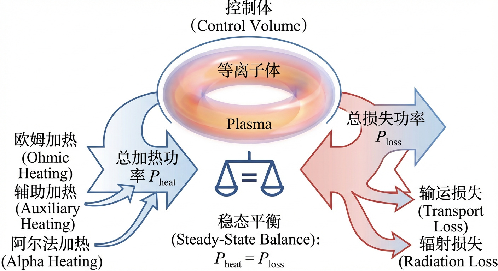
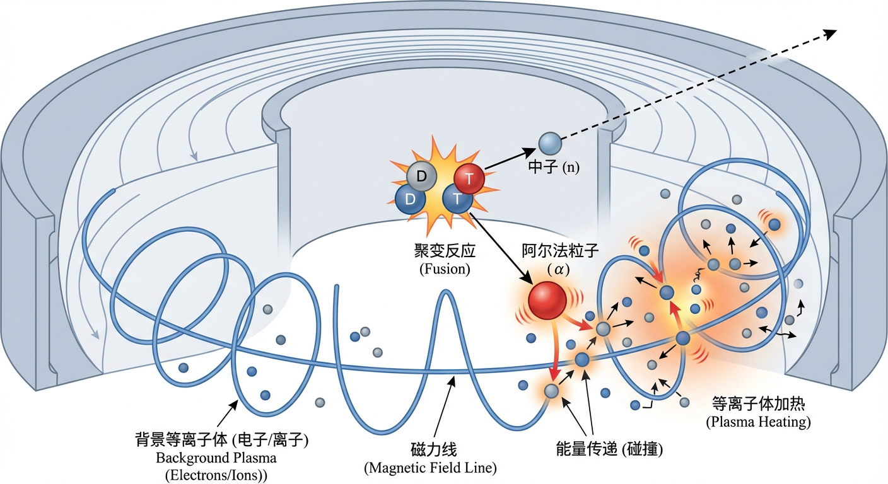
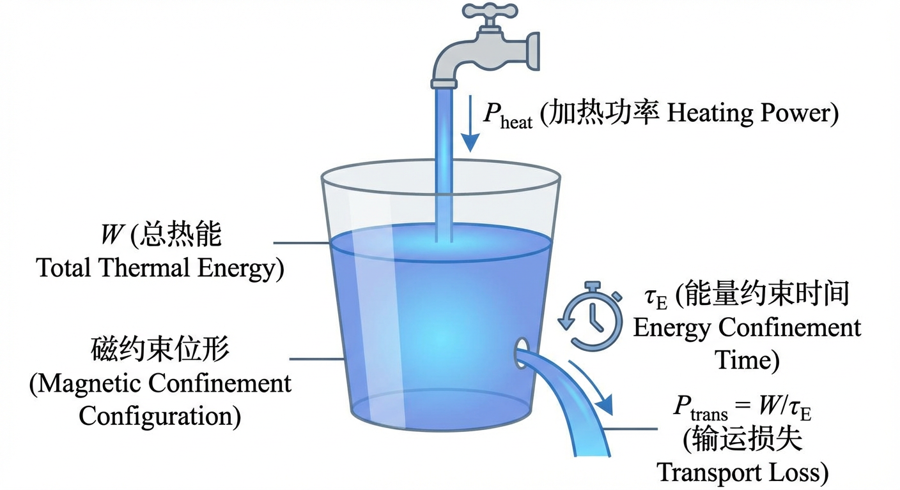
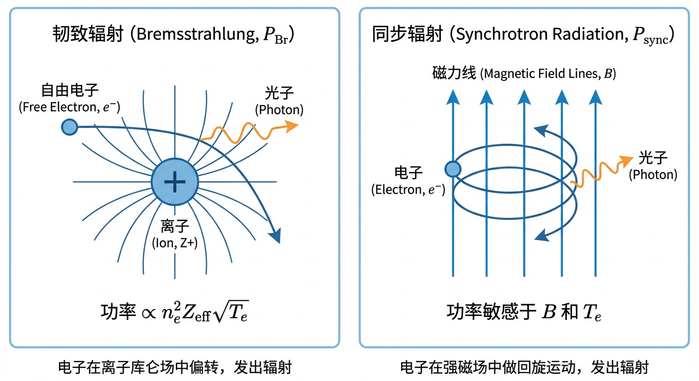
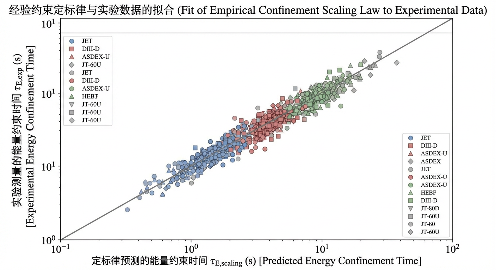
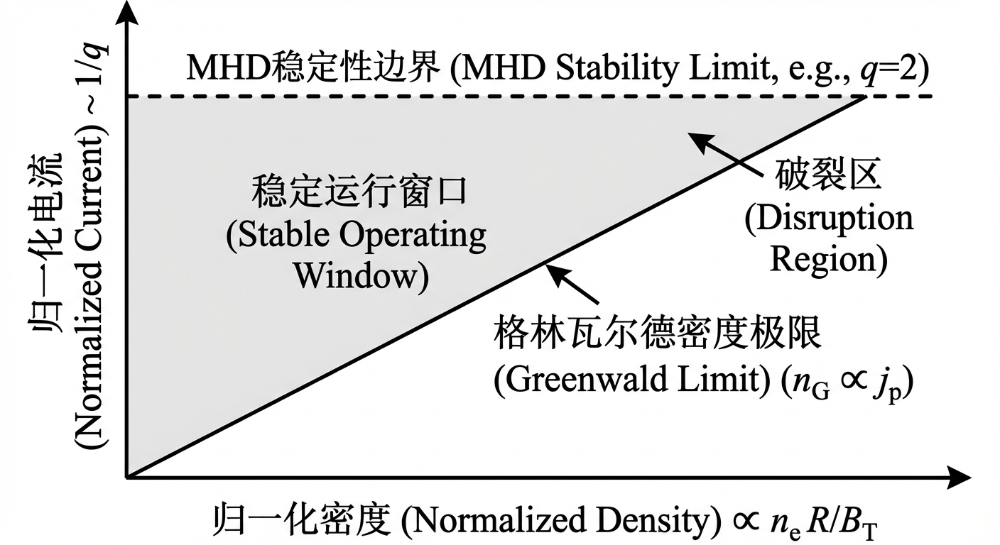
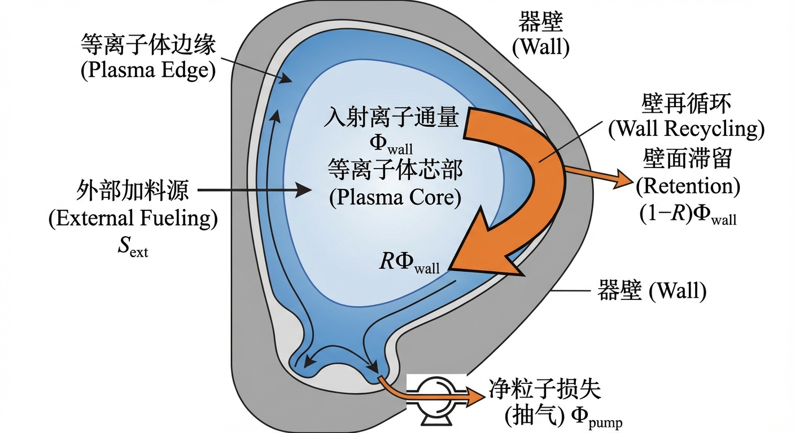
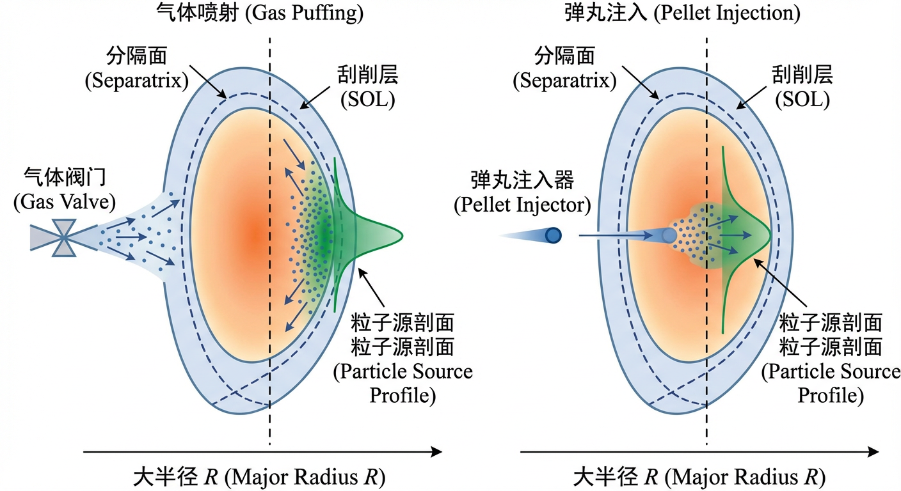

# 第4章 0D/1D功率-粒子收支与运行窗口初设

## 4.0 项目概述

在构建聚变反应堆的宏伟工程中，物理学家和工程师首先需要回答的核心问题是：装置需要多大的加热功率才能维持燃烧？磁容器的“保温”性能如何决定装置的尺寸？以及我们如何通过加料系统控制燃料的密度？

本章将建立一套宏观的零维（0D）分析框架，将复杂的等离子体物理简化为能量与粒子的输入输出平衡问题。通过本章的学习，我们将掌握评估聚变装置性能的基本方法。

为了加深对“平衡”与“分布”概念的理解，本章设计了一个基础物理实战项目——“基于统计力学的密度剖面基准模型”。该项目将在4.3节中引入，通过解析一个经典的理想气体在势场中与储层平衡的模型，帮助大家从热力学平衡的角度理解“储层（如器壁）”如何通过化学势决定系统的密度分布。尽管这与托卡马克中的输运主导的准稳态有所不同，但它揭示了粒子源与边界条件对系统状态的决定性作用。

---

## 4.1 功率与能量平衡建模

在探索可控核聚变的漫漫征途中，一个根本性的挑战始终居于核心：我们如何在地球上创造并维持一个比太阳核心还要炙热的等离子体，并使其稳定“燃烧”？这一宏伟目标的实现，本质上是一场关于能量的精密“收支核算”。正如任何一个物理系统，等离子体的热力学状态由其内部能量的流入与流出速率决定。能量守恒定律是这场博弈的根本法则，但仅仅知道能量守恒是不够的。决定成败的关键在于功率——能量流动的速率。本节旨在建立一个描述这一动态过程的零维（0D）全局模型，即功率与能量平衡建模（Power and Energy Balance Modeling）。我们将首先界定作为研究对象的等离子体系统，而后系统性地剖析注入其中的功率源项与从中散失的功率损失项。通过这一框架，我们将揭示聚变等离子体运行窗口的边界条件，并为后续章节中更复杂的输运和稳定性分析奠定概念基础。

### 全局功率平衡：一个开放系统的能量收支

要对等离子体进行能量核算，我们首先必须明确其系统边界。从热力学角度看，一个磁约束聚变等离子体是一个典型的开放系统（open system），或者说一个控制体（control volume）。它通过外部加热系统、聚变反应产物等方式获得能量，通过粒子和热量输运、电磁辐射等方式失去能量，同时还与外界进行着物质交换（如燃料注入和氦灰排出）。

根据热力学第一定律，这个控制体内总能量（在本章的0D模型中主要取等离子体热储能）$W$ 的时间变化率，等于所有注入系统的净功率之和。这可以表示为一个简洁而深刻的全局功率平衡方程：

$$
\frac{dW}{dt} = P_{\mathrm{heat}} - P_{\mathrm{loss}} = \sum P_{\mathrm{in}} - \sum P_{\mathrm{out}} .
$$

这里，$W$ 是等离子体的总储能（Total Stored Energy），它是在整个等离子体体积 $V$ 内对所有粒子（电子和各种离子）热动能的积分。对于满足麦克斯韦分布的各组分，可以表示为
$$
W=\frac{3}{2}\int_V\!\left(n_e T_e+\sum_i n_i T_i\right)\,dV ,
$$
其中温度以能量单位表示（常用 eV 或 keV）；若使用国际单位制的温度（K），则应写为 $W=\frac{3}{2}\int_V (n_e k_B T_e+\sum_i n_i k_B T_i)\,dV$。方程的右边，$P_{\mathrm{heat}}$ 代表所有加热项的总功率，而 $P_{\mathrm{loss}}$ 则是所有能量损失项的总功率。

在许多聚变装置的运行中，我们追求的是一种稳态（steady-state）运行模式，即等离子体的宏观参数（如温度、密度）不随时间变化。在这种理想情况下，总储能 $W$ 保持恒定，即 $\frac{dW}{dt}=0$。此时，功率平衡方程简化为一个更为直观的动态平衡条件：

$$
P_{\mathrm{heat}} = P_{\mathrm{loss}} .
$$

这个简单的等式构成了所有稳态聚变反应堆设计的基础。它昭示了一个核心物理事实：要维持等离子体的高温，注入的功率必须精确地补偿所有损失的功率。因此，理解并量化方程两侧的每一个功率项，是评估聚变装置性能、预测运行参数和设计未来反应堆的第一步。

### 功率源项：为等离子体“点火”与“保温”

为将等离子体加热至聚变所需的上亿摄氏度，并维持这一极端状态，必须有持续的功率输入。这些加热功率 $P_{\mathrm{heat}}$ 主要来自以下几个方面：

- **欧姆加热（Ohmic Heating, $P_{\mathrm{OH}}$）**：这是托卡马克等装置中最基本的一种自加热机制。驱动等离子体电流 $I_p$ 的环向电场，在克服等离子体自身电阻的过程中，通过焦耳热效应将电磁能转化为等离子体的内能。其功率密度正比于电阻率 $\eta$ 和电流密度的平方 $j^2$。然而，等离子体电阻率随电子温度的升高而急剧下降（经典的斯皮策电阻率 $\eta \propto T_e^{-3/2}$），这意味着欧姆加热在高温阶段效率极低，不足以将等离子体加热到点火温度。

- **辅助加热（Auxiliary Heating, $P_{\mathrm{aux}}$）**：为了跨越欧姆加热的温度瓶颈，必须从外部注入强大的辅助功率。主流的辅助加热技术包括注入高能中性束注入（Neutral Beam Injection, NBI）和发射大功率射频波（Radio-Frequency, RF）。这些技术（将在第7章详细讨论）能够将能量直接沉积到等离子体核心，是实现和维持高性能放电不可或缺的手段。

- **阿尔法粒子加热（Alpha Particle Heating, $P_{\alpha}$）**：这是聚变反应堆实现自持燃烧的终极能源。在氘-氚（D–T）聚变反应 $D+T\rightarrow \alpha+n$ 中，产生的高能带电阿尔法粒子（$\alpha$ 粒子，即氦核）在理想情况下可被磁场约束在等离子体内部。它们在慢化过程中通过库仑碰撞将其携带的动能（约 $3.5\,\mathrm{MeV}$）传递给背景的电子和离子，从而实现对等离子体的“自加热”。这就像篝火用自己产生的热量点燃新的木柴，是实现燃烧等离子体（Burning Plasma）的物理基础。

因此，总的加热功率可以写为 $P_{\mathrm{heat}}=P_{\mathrm{OH}}+P_{\mathrm{aux}}+P_{\alpha}$。

### 功率损失项：能量的无情“泄漏”

与加热的努力相抗衡的，是无处不在的能量损失 $P_{\mathrm{loss}}$。这些损失渠道主要分为两大类：输运损失和辐射损失。

#### 1. 能量输运损失与约束时间

即使在最理想的磁约束位形中，磁场“牢笼”也并非完美无缺。由于粒子间的碰撞以及由各种微观不稳定性驱动的湍流，等离子体中的粒子和热量会持续地从高温、高密度的核心区域向外渗透，最终逃逸。这种通过传导和对流方式发生的能量损失被称为能量输运损失（Energy Transport Loss, $P_{\mathrm{trans}}$）。

从第一性原理出发精确计算湍流输运极其困难。因此，在零维模型中，我们引入一个唯象的宏观参数——能量约束时间（Energy Confinement Time, $\tau_E$）——来整体性地量化输运损失的强度。其定义为：

$$
P_{\mathrm{trans}} \equiv \frac{W}{\tau_E} .
$$

$\tau_E$ 的物理意义是，在没有其他能量源或汇的情况下，等离子体因输运而损失其全部热能所需的特征时间。它综合反映了磁约束位形对能量的“保温”性能。$\tau_E$ 越大，意味着等离子体的保温性能越好。在功率平衡分析中，$\tau_E$ 常常被视为一个待定的关键参数，它的取值直接决定了聚变装置的性能。

#### 2. 辐射损失

等离子体作为一种高温物质，会以电磁波的形式向外辐射能量，这是另一种主要的能量损失渠道 $P_{\mathrm{rad}}$。根据其物理机制的不同，辐射损失主要包括以下几种：

- **韧致辐射（Bremsstrahlung, $P_{\mathrm{Br}}$）**：这是由自由电子在离子库仑场中减速或偏转时产生的辐射，意为“刹车辐射”。在完全电离的聚变等离子体中，韧致辐射功率密度 $p_{\mathrm{Br}}$ 与电子密度 $n_e$、离子密度以及离子电荷数的平方加权和、并与电子温度的平方根成正比：
  $$
  p_{\mathrm{Br}} \propto n_e \sum_i n_i Z_i^2 \sqrt{T_e} .
  $$

  为了处理包含多种离子（燃料离子和杂质离子）的复杂情况，我们引入一个至关重要的无量纲参数——有效电荷数（Effective Charge, $Z_{\mathrm{eff}}$）：
  $$
  Z_{\mathrm{eff}} \equiv \frac{\sum_{j} n_{j} Z_{j}^{2}}{n_{e}} ,
  $$
  其中求和遍及所有离子种类 $j$。$Z_{\mathrm{eff}}$ 的定义巧妙地捕捉了这样一种物理效应：许多与库仑碰撞相关的过程（如韧致辐射和电阻）的强度与离子电荷数的平方 $Z^2$ 成正比。因此，它是一个针对这些过程的、按 $Z^2$ 加权的平均电荷数。利用 $Z_{\mathrm{eff}}$，总的韧致辐射功率可以简洁地写为
  $$
  P_{\mathrm{Br}} \propto n_e^2 Z_{\mathrm{eff}} \sqrt{T_e} .
  $$
  这个表达式清晰地表明，即使痕量的高 $Z$ 杂质（如来自壁材料的钨），由于其巨大的 $Z^2$ 权重，也能不成比例地显著提高 $Z_{\mathrm{eff}}$ 和韧致辐射损失，从而“毒化”聚变反应。

- **同步辐射（Synchrotron Radiation, $P_{\mathrm{sync}}$）**：在强磁场中做回旋运动的电子，由于向心加速度而产生辐射。对于聚变等离子体中的高温电子，这种辐射通常需要考虑相对论修正。其功率对磁场强度和电子温度极为敏感。与韧致辐射不同，同步辐射的谱线主要落在微波到远红外波段，等离子体对其自身的部分同步辐射可能是不透明的，会发生自吸收。这使得精确计算净损失变得复杂，通常它表现为一种与表面积相关的损失，而非纯粹的体积损失。在传统的托卡马克中，同步辐射损失通常小于韧致辐射，但在高场强、高温度的先进反应堆概念中，它可能成为一个不可忽视的能量损失通道。

- **线辐射（Line Radiation, $P_{\mathrm{line}}$）**与**复合辐射（Recombination Radiation, $P_{\mathrm{rec}}$）**：这些辐射源于等离子体中未被完全电离的杂质离子。束缚在离子上的电子在不同能级间跃迁会发射特定频率的光，形成线辐射。自由电子被离子俘获并跃迁到束缚态时，会发射连续谱的复合辐射。这些原子过程的辐射能力极强，尤其是在等离子体温度较低的边缘区域。一个杂质离子的电离状态由局域的电子温度决定，在许多边缘与稀薄区域常用冕区平衡（Coronal Equilibrium）作为近似模型，即电子碰撞电离与辐射复合（Radiative Recombination）等过程达到动态平衡。因此，线辐射和复合辐射不仅是边缘等离子体中重要的能量损失项，也是决定等离子体边界物理和功率耗散的关键机制，我们将在第八章深入探讨。

### 经验约束定标律：构建运行窗口的经验法则

至此，我们的全局功率平衡方程可以写得更为具体：

$$
\frac{dW}{dt} = P_{\mathrm{OH}} + P_{\mathrm{aux}} + P_{\alpha} - \left(P_{\mathrm{Br}} + P_{\mathrm{sync}} + P_{\mathrm{line}} + P_{\mathrm{rec}}\right) - \frac{W}{\tau_E} .
$$

在这个方程中，除了 $\tau_E$ 之外，几乎所有项都可以通过理论模型，根据等离子体的基本参数（密度、温度、电流、磁场、杂质含量等）进行估算。然而，由湍流主导的能量约束时间 $\tau_E$ 仍然是理论上的巨大挑战。

为了在设计和分析中取得进展，聚变界发展出一种强大而务实的方法：经验约束定标律（Empirical Confinement Scaling Laws）。研究人员通过对全球数十个托卡马克装置上积累的海量实验数据进行统计回归分析，总结出 $\tau_E$ 与一系列宏观工程参数之间的幂律关系。一个典型的定标律形式如下：

$$
\tau_E = C \cdot I_p^a \cdot B_T^b \cdot \bar{n}_e^c \cdot P_{\mathrm{loss}}^{-d} \cdot R^e \cdot \epsilon^f \cdot \kappa^g \cdot M^h .
$$

其中 $I_p$ 是等离子体电流，$B_T$ 是环向磁场，$\bar{n}_e$ 是平均电子密度，$R$ 是大半径，$\epsilon=a/R$ 是反纵横比，$\kappa$ 是拉长率，$M$ 是离子质量数。而 $P_{\mathrm{loss}}$ 是总的损失功率，其指数通常为负（$d>0$），这反映了著名的功率衰退（power degradation）现象——即注入的加热功率越高，约束性能反而相对越差。

最著名的定标律包括描述标准运行模式的 ITER89-P L 模定标律和描述高性能模式的 IPB98(y,2) H 模定标律。这些定标律为不同的约束状态（将在第6章讨论）提供了基准。例如，IPB98(y,2) 公式为：

$$
\tau_{E,\mathrm{98(y,2)}}(\mathrm{s}) = 0.0562 \, M^{0.19} \, I_p^{0.93} \, B_T^{0.15} \, \bar{n}_e^{0.41} \, R^{1.97} \, \epsilon^{0.58} \, \kappa_a^{0.78} \, P_{\mathrm{loss}}^{-0.69} ,
$$

（各变量单位需按标准代入）。

在零维建模中，这类经验定标律提供了一个代数“封闭关系”，使得功率平衡方程变得可解。通过联立功率平衡方程和能量约束时间定标律（注意到稳态时 $P_{\mathrm{loss}}\approx P_{\mathrm{heat}}$ 成立），我们便可以针对一组给定的装置参数和辅助加热功率，求解出等离子体能够达到的稳态工作点（主要是温度）。这一过程是定义聚变装置运行窗口（operational window）和探索点火条件的基石。

### 小结

本节建立了描述聚变等离子体宏观热力学状态的核心工具——零维全局功率平衡模型。我们系统地解构了维持等离子体高温所需的加热功率源（欧姆、辅助、阿尔法加热）和导致其冷却的能量损失渠道（输运和辐射）。特别地，我们引入了两个关键的唯象概念：用于量化杂质效应的有效电荷数 $Z_{\mathrm{eff}}$，以及用于描述输运损失的能量约束时间 $\tau_E$。

我们看到，辐射损失，特别是韧致辐射，与 $Z_{\mathrm{eff}}$ 密切相关，凸显了控制等离子体纯度的极端重要性。更重要的是，我们揭示了在零维模型中，能量约束时间 $\tau_E$ 这一难以从第一性原理预测的量，是如何通过经验约束定标律与可控的工程参数联系起来的。

这个看似简单的功率平衡方程，实则蕴含了聚变物理的丰富内涵。它将等离子体物理（如聚变反应率、辐射机制）、原子分子物理（如杂质电离与复合）以及复杂的湍流输运物理（通过 $\tau_E$ 体现）与聚变装置的工程设计参数（尺寸、场强、电流）联系在一起，构成了一个自洽的分析框架。正是基于这一框架，我们才能够开始着手进行聚变堆的设计、评估其性能，并最终勾画出通往点火和净能量增益的道路。

### 逻辑过渡

在掌握了功率平衡的基本方程 $P_{\mathrm{heat}} = P_{\mathrm{loss}} + dW/dt$ 之后，我们意识到，方程中最为关键却又最难以捉摸的变量是代表“保温性能”的能量约束时间 $\tau_E$。在 4.1 节中，$\tau_E$ 仅仅是作为一个唯象参数被引入以封闭方程。在接下来的 4.2 节中，我们将深入“黑盒”内部，详细探讨 $\tau_E$ 的物理定义、测量方法以及它如何通过经验标度律与装置的工程参数（如电流、尺寸）建立定量联系，并进一步讨论制约装置运行的另一大边界——密度极限。

---

## 4.2 约束时间与装置定标接口

在上一节中，我们建立了描述等离子体功率与能量收支的零维模型，如同为一座核电站绘制了宏观的能量流向图。然而，要真正评估这座“人造太阳”的效率与可行性，我们必须回答一个更为深刻的问题：我们用以束缚上亿度等离子体的无形磁瓶，其“保温性能”究竟如何？能量、粒子与动量在被强大的磁场约束的同时，依然会不可避免地从高温高密度的核心区向外泄漏。衡量这种泄漏速率，或者说磁瓶“密封”性能好坏的核心物理标尺，便是约束时间（confinement time）。本节将深入探讨约束时间这一核心概念，并介绍连接其与装置工程参数的强大经验工具——标度律，最终勾勒出由约束和密度共同界定的初步运行窗口。

### 约束时间：衡量磁瓶性能的生命体征

想象我们正试图维持一个正在漏水的桶中的水位。桶中的总储水量，好比等离子体储存的总能量或总粒子数；而水漏出去的速度，便是损失率。一个直观衡量水桶“保水”能力的方法，便是用总储水量除以损失率，其结果便是水在桶中平均停留的特征时间。这一简洁而深刻的类比，正是约束时间概念的物理精髓。

在等离子体物理中，我们关心的守恒量主要有三：总热能 $W$、总粒子数 $N$ 以及总环向角动量 $L_{\phi}$。对其中任何一个量，我们都可以定义其相应的约束时间。以能量为例，其全局平衡方程可以写作：

$$
\frac{dW}{dt} = P_{\mathrm{in}}(t) - P_{\mathrm{loss}}(t) .
$$

其中，$P_{\mathrm{in}}$ 是总的加热功率（包含外部注入功率和聚变自加热功率），$P_{\mathrm{loss}}$ 则是总的能量损失功率。遵循“漏水的桶”这一直观模型，能量约束时间（energy confinement time, $\tau_E$）被严格定义为等离子体中储存的总热能与其总损失功率之比：

$$
\tau_E(t) = \frac{W(t)}{P_{\mathrm{loss}}(t)} = \frac{W(t)}{P_{\mathrm{in}}(t) - \frac{dW}{dt}} .
$$

这个定义在实验上尤为重要，它允许我们通过测量等离子体储能 $W(t)$ 的时间演化和已知的输入功率 $P_{\mathrm{in}}(t)$，来推断出 $\tau_E$。在许多实验追求的准稳态（quasi-steady state）条件下，$dW/dt \approx 0$，此时 $P_{\mathrm{in}} \approx P_{\mathrm{loss}}$，定义式便简化为 $\tau_E = W/P_{\mathrm{in}}$。$\tau_E$ 直接量化了磁约束装置“保温”的能力，是评估聚变装置性能的黄金标准，并直接关联着第一章中介绍的聚变三重积 $nT\tau_E$ 与点火判据。

与此完全平行，我们也可以定义粒子约束时间（particle confinement time, $\tau_p$）和动量约束时间（momentum confinement time, $\tau_{\phi}$）：

$$
\tau_p(t) = \frac{N(t)}{\Gamma_{\mathrm{loss}}(t)}, \qquad \tau_{\phi}(t) = \frac{L_{\phi}(t)}{\mathcal{T}_{\mathrm{loss}}(t)} .
$$

其中 $\Gamma_{\mathrm{loss}}$ 是总的粒子损失率，而 $\mathcal{T}_{\mathrm{loss}}$ 是总的动量损失率（即阻尼力矩）。$\tau_p$ 反映了等离子体维持其密度的能力，对于燃料补充和“氦灰”排出至关重要，我们将在4.3节中深入探讨。$\tau_{\phi}$ 则衡量了维持等离子体旋转的能力，而受控的旋转对于抑制某些不稳定性、改善约束性能具有重要意义。这三个约束时间共同构成了描述等离子体宏观约束性能的“生命体征”。

### 能量约束的经验标度律：从数据中寻找规律

尽管约束时间的概念清晰明了，但从第一性原理出发，基于复杂的湍流理论来精确预测其数值，至今仍是聚变物理面临的巨大挑战。面对这一困境，科学家们采取了一种极为成功的研究范式——通过统计分析来自全球数十个托卡马克装置的海量实验数据，寻找并总结出能量约束时间与宏观工程参数之间的定量关系。这种经验公式被称为能量约束标度律（energy confinement scaling laws）。

这些标度律通常呈现为幂律形式，它假设 $\tau_E$ 可以表示为多个关键工程变量的乘积，每个变量都带有一个由数据回归确定的指数。一个通用的表达式可以写作：

$$
\tau_E = C \cdot I_p^a \, B_T^b \, \bar{n}_e^c \, P_{\mathrm{loss}}^{-d} \, R^e \, a^f \, \kappa^g \, M^h .
$$

公式中的变量是描述托卡马克状态与尺寸的“控制旋钮”：$I_p$ 是等离子体电流，$B_T$ 是环向磁场，$\bar{n}_e$ 是线平均电子密度，$P_{\mathrm{loss}}$ 是在稳态下近似等于注入加热功率的损失功率，$R$ 和 $a$ 分别是装置的大、小半径，$\kappa$ 是等离子体截面的拉长率，而 $M$ 则是工作气体的平均离子质量数。这些指数 $a,b,c,\dots$ 凝聚了无数次实验的结果，揭示了约束性能对各项工程参数的敏感度。

值得注意的是，等离子体可以存在于具有根本不同输运性质的多种约束模式中。其中最基本的两种是低约束模式（Low-confinement mode, L mode）和高约束模式（High-confinement mode, H mode）。相应地，研究人员为它们建立了不同的标度律。例如，经典的 ITER89-P L 模标度律：

$$
\tau_{E,\mathrm{89P}}(\mathrm{s}) = 0.048 \, M^{0.5} \, I_p^{0.85} \, B_T^{0.20} \, R^{1.20} \, a^{0.30} \, \kappa^{0.50} \, \bar{n}_e^{0.10} \, P_{\mathrm{loss}}^{-0.50} ,
$$

而对于性能更优的 H 模，一个被广泛使用的基准是 IPB98(y,2) H 模标度律：

$$
\tau_{E,\mathrm{98(y,2)}}(\mathrm{s}) = 0.0562 \, I_p^{0.93} \, B_T^{0.15} \, \bar{n}_e^{0.41} \, P_{\mathrm{loss}}^{-0.69} \, R^{1.97} \, \epsilon^{0.58} \, \kappa_a^{0.78} \, M^{0.19} .
$$

对比这两个公式，我们可以洞察到深刻的物理差异。从 L 模到 H 模，约束性能对密度的依赖性显著增强（$\bar{n}_e$ 的指数从 0.10 跃升至 0.41），这对需要高密度运行的聚变堆极为有利。然而，一个普遍存在的现象是功率衰退（power degradation），即 $\tau_E$ 随着加热功率 $P_{\mathrm{loss}}$ 的增加而下降（指数为负）。这一现象通常与加热功率改变温度梯度与湍流饱和水平有关，因而会导致更强的有效输运。

为了量化特定实验的约束性能，我们引入约束改善因子（confinement enhancement factor, H factor），它被定义为实验测得的约束时间与某个标准标度律预测值的比值：$H=\tau_E^{\mathrm{exp}}/\tau_E^{\mathrm{scaling}}$。例如，一个 H 模放电的 $H_{98(y,2)}=1.2$，意味着其约束性能比数据库中的平均 H 模水平高出 20%。$H$ 因子作为一个无量纲的品质因数，使得全球不同装置的性能得以在统一的框架下进行比较，并成为评估先进运行模式性能的核心指标。

在这些标度关系中，同位素效应（isotope effect）是一个持续被观测到且物理机制仍在深入探讨的现象。标度律中对离子质量 $M$ 的正幂次依赖（如 L 模的 $M^{0.5}$ 和 H 模的 $M^{0.19}$）表明，使用更重的氢同位素（如氘 D 或氚 T）作为燃料，通常能获得比使用氕（H）更好的能量约束。这背后的物理可能与湍流特征尺度、增长率及带状流剪切抑制等机制有关，这些微观过程都与离子的惯性（质量）相关。尽管其物理根源尚不完全明晰，但同位素效应对未来 D–T 聚变堆具有重要意义。

### 标度律的物理内涵与外推接口

经验标度律并非纯粹的数字拟合，其幂指数蕴含着重要的物理信息，构成了连接宏观工程参数与微观输运理论的桥梁。能量约束的本质是输运过程，在一个简化的扩散模型中，$\tau_E \sim a^2/\chi$，其中 $\chi$ 是有效热扩散系数。不同的湍流理论对 $\chi$ 有着不同的预测。例如，玻姆（Bohm）输运模型（$\chi_B \sim T/B$）和回旋玻姆（gyro-Bohm）输运模型（$\chi_{gB} \sim (T/B)(\rho_i/a)$）对装置尺寸的标度行为预测不同。实验标度律中对尺寸的依赖关系（如 IPB98(y,2) 中的 $R^{1.97}$）体现出明显的有利尺寸标度，这与回旋玻姆类输运的“尺寸增大、相对输运减弱”的趋势相一致，从而为现代基于回旋动理学理论的湍流模型提供了重要的实验支撑。

这种经验方法的核心价值在于其作为装置定标接口的功能——即利用现有装置的数据预测未来更大尺寸装置的性能。然而，这种外推充满了挑战。首先，标度律的构建依赖于统计回归，而实验数据中的变量往往存在多重共线性（multicollinearity）（例如，实验中为维持稳定性，常常同时提高电流 $I_p$ 和磁场 $B_T$），这使得精确分离每个变量的独立贡献变得困难，增大了指数的不确定性。其次，标度律隐含了“剖面相似性”的假设，即不同装置或不同参数下的等离子体剖面形状是相似的，而当内部输运垒（ITB）等结构出现时，这一假设被打破，全局标度律便可能失效。

更重要的是，将标度律外推至未来反应堆（如 ITER 或 DEMO）的参数区间，意味着进入一个现有数据库覆盖不足的区域，例如更低的碰撞率 $\nu_*$ 或更高的比压 $\beta$。如果标度律中存在未被揭示的对这些无量纲参数的“隐藏”依赖，外推结果就可能产生系统性偏差。因此，理解并量化这种外推的不确定性，是利用标度律进行反应堆设计的核心任务。工程师们必须引入设计余量，确保即使在标度律预测的“悲观”一侧，装置性能依然能够满足聚变能量增益 $Q$ 的目标。这凸显了不断通过实验和理论研究，发展更精确、物理基础更坚实的约束预测模型对于降低未来聚变堆风险与成本的至关重要性。

### 运行窗口边界：格林瓦尔德密度极限

除了约束性能，聚变等离子体的运行还受到一系列硬性边界的限制，其中最基本的就是密度极限（density limit）。实验发现，托卡马克能够稳定维持的等离子体密度存在一个上限，一旦超过，往往会导致辐射冷却增强，电流通道收缩，最终触发灾难性的**大破裂（disruption）**。

一个惊人普适的经验标度律，即格林瓦尔德密度极限（Greenwald density limit），描述了这一边界：

$$
n_G\,[10^{20}\,\mathrm{m}^{-3}] = \frac{I_p\,[\mathrm{MA}]}{\pi a^2\,[\mathrm{m}^2]} .
$$

该公式表明，可达到的最大线平均密度 $n_G$ 正比于等离子体的平均电流密度 $\langle j_p\rangle = I_p/(\pi a^2)$。这强烈暗示密度极限的根源与边缘等离子体的电流与功率平衡有关。关于其物理机制，辐射相关模型（如边缘辐射/功率平衡模型）能够提供一个直观图像：当密度增加时，边缘区域由杂质和燃料粒子引起的辐射功率会随之上升；当局域加热与输运能够提供的功率不足以补偿辐射与能量损失时，边缘温度下降并形成强辐射区（如 MARFE），从而显著恶化电流与稳定性条件并可能触发破裂。通过将边缘的功率平衡（如欧姆加热项与辐射项的量级关系）与电流密度的定义相结合，可以得到与 $n_e$ 与 $j$ 相关的标度趋势，从而为格林瓦尔德标度律提供定性支撑。

为了便于比较和控制，实验中通常使用格林瓦尔德分数 $f_G=\bar{n}_e/n_G$ 来量化运行密度与极限的接近程度。安全运行通常要求 $f_G$ 显著小于 1。值得注意的是，对于具有拉长、三角化等位形设计的现代托卡马克，其等离子体截面积 $A_{\mathrm{cs}}$ 通常大于 $\pi a^2$；在讨论平均电流密度等量时应使用真实截面积，而格林瓦尔德极限本身通常仍按其原始经验定义（以 $a$ 表征）进行比较，并据此引入相应的几何修正与工程裕度。

密度极限并非孤立存在，它与 MHD 稳定性等其他运行边界紧密交织。例如，为避免某些不稳定性，边缘安全因子 $q_{95}$ 必须大于某个阈值（如 $q_{95}>2$）。由于典型标度上 $q_{95}\propto a^2 B_T/(R I_p)$，这对 $I_p$ 施加了上限。一旦 $I_p$ 的上限被 MHD 稳定性确定，格林瓦尔德密度极限的上限也随之确定，从而形成诸如 $n_G\propto B_T/(R q_{95})$ 的联系；以此为基础的运行空间常以 Hugill 图等形式加以呈现。这清晰地展示了托卡马克运行窗口是由多个物理约束共同塑造的结果。

### 小结

本节为我们描绘了一幅从零维功率平衡出发，定义聚变装置核心性能指标的蓝图。我们引入了能量、粒子和动量约束时间作为衡量磁约束“瓶子”性能的普适生命体征，并揭示了它们背后复杂的物理机制与诊断方法。更重要的是，我们建立了连接微观输运物理与宏观工程现实的关键接口——经验约束标度律。这些基于全球实验数据凝练而成的幂律公式，不仅为我们提供了评估和比较不同约束模式（如 L 模和 H 模）性能的“标准尺”，更成为指导未来聚变反应堆（如 ITER）设计、进行性能外推不可或缺的工具。然而，经验方法的成功也伴随着其固有的局限性，如多重共线性和外推风险，这些挑战促使我们不断寻求更深层次的物理理解。最后，通过引入格林瓦尔德密度极限，我们为这个由约束性能定义的运行空间划定了一道关键的“硬边界”。

### 逻辑过渡

至此，我们已经了解了反应堆需要多大的加热功率（4.1节）以及它能维持热量多久（4.2节）。我们还看到了密度极限 $n_G$ 的存在。然而，知道“密度上限是多少”并不等于知道“如何控制密度”。与能量可以通过加热器直接注入不同，粒子的平衡受到一个强大内部循环——壁再循环的支配。为了完整构建 0D/1D 模型，我们必须解决最后一个环节：粒子是如何进入等离子体，又是如何在核心、边缘与器壁之间循环往复的？这正是 4.3 节的主题。

---

## 4.3 粒子平衡与再循环边界

在前几节中，我们建立了描述等离子体宏观性能的零维功率平衡框架，并探讨了能量约束时间这一核心指标。然而，聚变反应的产额不仅取决于温度，还强烈地依赖于等离子体密度。一个自然而然的问题是：我们能否通过外部加料系统，随心所欲地设定和维持聚变堆芯所需要的高密度？这个问题的答案，既是否定的，又是复杂的，它将我们引向可控核聚变中一个至关重要的领域——粒子平衡与边界物理。

与能量可以通过加热功率持续注入不同，等离子体中的粒子遵循着严格的守恒定律。任何密度的变化都必须通过粒子源与汇的精确平衡来实现。表面上看，这个问题似乎很简单：通过外部加料系统注入的燃料粒子，应等于通过输运损失并被真空系统抽走的粒子。然而，这幅图景忽略了一个在磁约束装置中起着主导作用的、强大的内在反馈回路：壁再循环（wall recycling）。炽热的等离子体与其容器的材料壁之间并非完美绝缘，粒子在等离子体与壁之间持续地进行着交换。这个过程不仅深刻地改变了粒子源的分布，还从根本上重塑了等离子体密度对外部控制的响应方式。

本节将从一个统一的粒子收支视角出发，将外部加料、边界损失、抽运和壁面反馈置于同一系统边界内，从而揭示“再循环边界”作为粒子平衡闭环的关键环节。我们将首先确立以再循环为中心的边界物理如何从根本上决定了粒子平衡的动态；随后，我们将探讨气体喷射（gas puffing）和弹丸注入（pellet injection）这两种主流加料系统如何与这一边界相互作用，并揭示它们在时空沉积分布和加料效率上的本质差异；最后，我们将把粒子平衡的框架延伸至等离子体中的杂质输运（impurity transport），从核心源与边缘源的不同视角，理解杂质作为一种特殊的粒子组分，其积累或排出如何影响聚变反应的成败。通过本节的学习，我们将建立起一个连接微观原子物理、宏观粒子约束与聚变工程控制的完整知识图景。

### 壁再循环与全局粒子平衡

描述等离子体中粒子密度演化的基本出发点是粒子连续性方程（particle continuity equation）。这是一个局域的粒子数守恒定律，它指出在任意一个微小体积内，粒子数密度的变化率等于流入和流出该体积的粒子通量之差，再加上该体积内部的粒子净产生率。其微分形式为：

$$
\frac{\partial n}{\partial t} + \nabla \cdot \boldsymbol{\Gamma} = S - L .
$$

这里，$n(\mathbf{x},t)$ 是粒子数密度，$\boldsymbol{\Gamma}(\mathbf{x},t)$ 是描述粒子宏观流动的粒子通量密度，$S$ 和 $L$ 分别代表单位体积内的粒子源项和汇项。这个方程是粒子世界的“会计准则”，每一颗粒子的来去都必须被精确记账。

在聚变等离子体中，源项 $S$ 主要来自中性原子的电子碰撞电离（electron-impact ionization），即一个中性原子被高能电子撞击后失去电子，成为一个新的等离子体离子。而汇项 $L$ 在热等离子体核心通常较弱，但在较冷、较稠密的边缘与偏滤器等区域，复合（recombination）过程可以显著增强，即一个离子俘获一个电子，变回中性原子。这些原子物理过程的速率，由参与反应的粒子密度和依赖于等离子体温度的反应速率系数（rate coefficient）$\langle \sigma v \rangle$ 共同决定。例如，电离源的强度可以写作：

$$
S_{\mathrm{ion}} = n_e n_n \langle \sigma v \rangle_{\mathrm{ion}} ,
$$

其中 $n_e$ 和 $n_n$ 分别是电子和中性粒子的密度。

然而，磁约束瓶并非完美。粒子，特别是位于等离子体最外层的粒子，会沿着磁力线或通过跨场输运泄漏出去，最终撞击到装置的内壁材料上。从等离子体的角度看，这是一个通过边界通量 $\boldsymbol{\Gamma}$ 产生的强大粒子损失。如果故事到此为止，等离子体将迅速熄灭。但事实上，器壁并非粒子的“坟墓”，而更像一扇繁忙的“旋转门”。当一个等离子体离子撞击壁面时，它并不会简单消失，而是通过一系列复杂的等离子体-壁相互作用（plasma–wall interaction, PWI）过程，可能以中性原子或分子的形式返回到等离子体边界中。这个过程便是壁再循环。

为了量化这一过程，我们定义一个无量纲的再循环系数（recycling coefficient, $R$），即从壁面返回的中性粒子通量与入射到壁面的离子通量之比。这个系数综合了多种复杂的物理机制，包括高能离子的瞬时反射、注入粒子在材料中的滞留与热解吸、乃至化学溅射等。壁再循环的本质，是将一个边界上的粒子损失，转化为了一个体现在等离子体边缘的中性粒子源，这些中性粒子随后又可以通过电离过程重新成为等离子体的一员。

这个反馈循环对全局的粒子平衡具有决定性的影响。让我们考虑一个零维的全局粒子平衡模型。等离子体中的总粒子数 $N$ 的变化，由外部加料源 $S_{\mathrm{ext}}$（如气体阀或弹丸注入）、被真空泵抽走的净粒子损失 $\Phi_{\mathrm{pump}}$、以及与壁面交换的净通量共同决定。设撞击壁面的总离子通量为 $\Phi_{\mathrm{wall}}$，那么返回的中性粒子通量为 $R\Phi_{\mathrm{wall}}$，而真正被壁面永久俘获（滞留）的粒子通量为 $(1-R)\Phi_{\mathrm{wall}}$。因此，系统的总净损失率 $\Phi_{\mathrm{loss}}$ 为：

$$
\Phi_{\mathrm{loss}} = (1-R)\Phi_{\mathrm{wall}} + \Phi_{\mathrm{pump}} .
$$

据此，我们可以定义全局粒子约束时间（global particle confinement time, $\tau_p$），它表征了粒子在被永久移除前在系统中的平均停留时间：

$$
\tau_p = \frac{N}{\Phi_{\mathrm{loss}}} = \frac{N}{(1-R)\Phi_{\mathrm{wall}} + \Phi_{\mathrm{pump}}} .
$$

这个关系式揭示了一个极为重要的现象：在典型的托卡马克高再循环状态下，$R$ 非常接近于 1。这意味着分母中的 $(1-R)$ 项变得非常小，在其他条件不变时，较小的净外部补给就可能维持较高的稳态粒子库存。芯部密度因此对边界条件（特别是壁的状态）可能表现出很强的敏感性：$R$ 的变化会通过净损失率改变粒子库存及其稳态水平。这种由再循环建立的芯部—边界强耦合关系，是理解和控制聚变等离子体密度的关键。

然而，这种粒子约束的改善并非没有代价，它揭示了约束的权衡。高再循环意味着大量“冷”的中性粒子从壁返回，它们需要消耗等离子体宝贵的能量来进行电离和加热，并且电荷交换等过程也会带走能量。这些过程构成了额外的能量损失通道。因此，一个高再循环的运行模式虽然可能显著延长 $\tau_p$，但往往会因为引入额外的能量损失而恶化整体能量收支，从而对能量约束与功率平衡提出更苛刻要求。在聚变实验中，如何在粒子约束与能量收支之间取得最佳平衡，是一个需要精妙权衡的核心问题。

### 加料系统：边缘与核心的对话

在强大的壁再循环背景下，如何有效地为聚变之火“添薪”，成为一门精妙的艺术。外部加料系统不仅要补充被永久损失的燃料，更要与巨大的内部再循环流共同决定密度剖面的形成与演化，从而实现对密度剖面的调控。主流的加料技术——气体喷射与弹丸注入——正是这一挑战的两种截然不同的回应。

#### 气体喷射：轻柔的边缘调控

最直观的加料方法，莫过于在等离子体边缘通过精密阀门“吹”入一股燃料气体，这便是气体喷射（Gas Puffing）。注入的中性气体分子在进入灼热的等离子体边界时，其命运几乎是迅速决定的。在典型的边缘条件下（例如，电子密度 $n_e \sim 10^{19}\,\mathrm{m}^{-3}$，电子温度 $T_e \sim 20\,\mathrm{eV}$），中性原子在被电离前的平均自由程通常处于厘米量级（具体取决于电离截面与局域参数）。这意味着，通过气体喷射注入的燃料，主要沉积在等离子体的最外层——刮削层（Scrape-Off Layer, SOL）及其附近区域。

刮削层是由开放磁力线构成的区域，粒子可以沿着磁力线高速流向偏滤器靶板。对于一个在刮削层中新生的离子，它面临着一场不公平的竞赛：沿着磁力线的快速平行输运（特征时间 $\tau_{\parallel}$ 可在亚毫秒至毫秒量级，视连接长度与声速而定）与相对缓慢的跨场输运（特征时间 $\tau_{\perp}$ 往往更长）。大量由气体喷射产生的粒子会在向核心扩散之前沿磁力线损失至偏滤器与壁面，从而进入再循环与抽运回路。

这种物理图像决定了气体喷射的根本特性：其核心加料效率（fueling efficiency, $\varepsilon$）通常较低。在一个简化的模型中，我们可以定义加料效率 $\varepsilon = \Gamma_{\mathrm{core}}/\Gamma_{\mathrm{inj}}$，其中 $\Gamma_{\mathrm{inj}}$ 是外部注入率，$\Gamma_{\mathrm{core}}$ 是对核心区的净粒子贡献。对于气体喷射，只有一部分注入粒子能够在不被快速平行输运损失的情况下向内输运并影响核心密度，其余很大一部分会先进入边界再循环回路。尽管再循环本身也能为核心提供粒子来源，但由于刮削层与边界输运的存在，这一路径对核心的有效贡献通常受限。总体而言，气体喷射常被视为一种更偏向边缘的加料与控制手段：正因为其沉积浅、作用集中于边界，它成为精确、灵敏地调控边缘等离子体状态的有效工具，而边缘状态（如密度、温度、中性粒子压力）对全局约束和稳定性至关重要。

#### 弹丸注入：有力的核心打击

如果说气体喷射是轻柔的边缘微调，那么弹丸注入（Pellet Injection）则是对核心的更深部、更直接的加料。该技术将燃料气体（如氘）冷凝成毫米量级的固体颗粒，然后以高速（典型可达数百 $\mathrm{m/s}$ 至数 $\mathrm{km/s}$，取决于发射技术与装置需求）将其射入等离子体。

当这颗冰冷的弹丸闯入高温等离子体时，它并不会简单瞬间消失。弹丸表面在高热通量作用下消融（ablation）产生的稠密中性气体云，会在弹丸周围形成一个对入射热流具有屏蔽作用的区域，从而减缓进一步消融的速率。正是由于这一被称为中性气体屏蔽（Neutral Gas Shielding, NGS）的机制，弹丸才得以在一定程度上穿透等离子体边缘并将粒子沉积到更深的径向位置，深入到气体喷射难以企及的区域。

因此，弹丸注入是一种深部加料方式，它能够相对绕过边界区域的快速平行输运损失通道，将相当一部分燃料直接沉积到闭合磁面内部，从而获得更高的核心加料效率。对于给定的沉积深度与沉积份额，弹丸注入在提升核心密度、建立中心密度更高的密度剖面方面具有明显优势，常被用于高密度运行以及对瞬态事件（如 ELM 引发的粒子排空）后的快速补给。

值得注意的是，弹丸加料的物理过程还展现了等离子体输运与消融物理的复杂性。例如，不同同位素（如 H、D、T）的弹丸，其消融、云层动力学以及穿透深度可能存在差异；在特定参数下，更重同位素可能因云层动力学与能量沉积差异而表现出更深或更浅的穿透行为，这取决于具体模型与运行条件，体现了主导机制与简单直觉之间可能存在偏差。

在现代托卡马克的运行中，气体喷射和弹丸注入常被协同使用，构成一个复杂的反馈控制系统。气体喷射用于对边缘进行平稳、精细的调控；而弹丸注入用于对核心进行快速、大量的补充，以响应瞬态事件造成的密度跌落或实现高密度运行。这种协同控制是实现先进运行模式的基础，也对等离子体控制系统提出了极高的要求。

### 等离子体中的杂质：源项、输运与屏蔽

粒子平衡的框架不仅适用于燃料粒子，同样适用于等离子体中的“不速之客”——杂质（impurities）。杂质的来源主要有两类：一类是边缘源（edge source），主要来自等离子体与壁材料相互作用（PWI）产生的溅射物，如钨、铍、碳等；另一类是核心源（core source），主要是由聚变反应自身产生的氦灰（Helium ash）。这些杂质离子的行为同样遵循粒子连续性方程，其空间分布由输运过程决定。

杂质粒子的径向通量 $\Gamma_Z$ 通常可以分解为两部分：

$$
\Gamma_Z = -D(r)\frac{\partial n_Z}{\partial r} + V(r)n_Z .
$$

第一项是扩散（diffusion）项，由扩散系数 $D$ 和杂质密度梯度 $\partial n_Z/\partial r$ 驱动，它倾向于将粒子从高浓度区域输运到低浓度区域，从而抹平密度剖面。第二项是对流（convection）项，也常称为箍缩（pinch），由对流速度 $V$ 驱动，它代表一种独立于梯度的系统性径向流动。

这两种输运的相对强度，可以用一个无量纲的佩克莱数（Péclet number）$Pe_Z \sim |V|L/D$ 来衡量，其中 $L$ 是系统的特征尺度。

- 当扩散主导（$Pe_Z \ll 1$）时，杂质剖面趋于平坦，其含量主要由边界源与损失速率决定。
- 当对流主导（$Pe_Z \gg 1$）时，杂质剖面由对流速度的方向决定。若 $V<0$（向内箍缩），杂质会在核心区聚集并可能形成尖峰剖面，从而增加辐射并稀释燃料；若 $V>0$（向外对流），杂质则更易被排出核心区，形成更“空心”的分布。

输运系数 $D$ 和 $V$ 的根源在于复杂的微观物理。在环形几何中，即使没有湍流，粒子碰撞与轨道漂移的耦合也会产生所谓的新经典输运（neoclassical transport）。对于高电荷数（高 $Z$）杂质，在特定新经典输运区间内可能出现显著的向内箍缩趋势。然而，在真实的等离子体中，输运通常由湍流（turbulence）显著影响。不同类型的湍流，如由离子温度梯度驱动的 ITG 模和由捕获电子驱动的 TEM 模，可能产生方向相反的对流贡献。因此，杂质的最终命运取决于新经典与湍流效应之间的微妙博弈。

理解这一点对于控制杂质至关重要。对于来自壁的边缘源杂质，我们希望等离子体边缘能形成有效的杂质屏蔽（impurity shielding），即通过强烈的扩散或净向外输运，阻止它们穿透到核心区。这正是现代偏滤器设计的核心目标之一，通过优化几何和等离子体参数，将杂质尽可能地限制在边界区域。

而对于聚变反应产生的核心源杂质——氦灰，情况则恰好相反。我们必须确保有足够强的向外输运，将它们有效地从核心区排出，以防止燃料稀释。这就对氦灰的粒子约束时间 $\tau_{\mathrm{He}}$ 提出了上限要求。例如，为了将稳态运行的 D–T 等离子体中氦灰的稀释份额 $f=n_{\mathrm{He}}/(n_D+n_T)$ 控制在 5% 以下，通过简单的零维粒子平衡（聚变产生率 = 损失率）可以计算出，$\tau_{\mathrm{He}}$ 必须小于某个临界值，该值反比于燃料密度与聚变反应率。在典型堆芯参数下（例如 $n_D=n_T=5\times 10^{19}\,\mathrm{m}^{-3}$，$T_i=15\,\mathrm{keV}$），所需的氦灰约束时间常在秒量级。这个结论与我们希望能量约束时间尽可能长的目标形成鲜明对比，凸显了聚变堆中不同组分输运需求的多样性和复杂性。

### 小结

本节从粒子数守恒这一基本物理原理出发，构建了一幅关于等离子体粒子平衡的完整图景。我们看到，看似简单的密度控制问题，其核心在于理解并驾驭一个由外部加料、内部输运、边界损失、真空抽运以及强大的壁再循环反馈共同构成的复杂动态系统。

壁再循环作为连接等离子体与物质边界的桥梁，扮演了核心角色。它深刻影响了全局粒子约束时间与密度对边界条件的敏感性，并与能量收支形成微妙的权衡关系。正是这一强大的边界效应，决定了不同加料技术——气体喷射和弹丸注入——在加料效率和沉积剖面上的本质差异：前者更适合边缘调控，后者更适合深部加料与核心快速补给。

将这一粒子平衡框架应用于杂质这一特殊组分，我们揭示了其输运的双重性。无论是来自壁面的边缘源，还是来自聚变反应的核心源，杂质的最终分布均取决于扩散与对流之间的竞争。这种竞争的结果，不仅决定了杂质是对聚变反应的“毒药”，还是在特定场景下可用于边界辐射耗散的“工具”，也为我们通过光谱诊断窥探等离子体内部状态提供了可能。

本节建立的“源—输运—边界”的统一语言，不仅是对第四章“0D/1D功率-粒子收支”模型的深化，更为后续章节的讨论奠定了基础。对粒子和杂质剖面的精确控制，是实现高级运行模式和维持稳定燃烧（第六章、第七章）的前提；对再循环和边界粒子通量的管理，是偏滤器物理和功率排出（第八章）的核心；而所有这些过程的诊断与反馈控制（第九章），则是将物理理解转化为工程现实的必要环节。可以说，掌握粒子平衡与再循环边界的物理，就是掌握了开启稳态、高性能聚变等离子体之门的钥匙。

> **实战项目应用 I：基于统计力学的密度剖面基准模型**  
> 在前面的讨论中，我们看到托卡马克中的粒子分布由复杂的动态过程（输运、源项、再循环）决定。为了从物理本源上理解“外部储层（如器壁）如何决定内部密度分布”，我们暂时抛开湍流，考察一个处于热力学平衡的理想化模型。  
>  
> **场景设定：**  
> 考虑一个被限制在 $z>0$ 区域的三维（3D）经典理想气体，受重力场 $g$ 作用（重力势 $U(z)=mgz$）。该系统在 $z=0$ 处与一个二维（2D）粒子储层接触并达到热力学平衡。该储层由自旋为 $1/2$ 的费米子组成，具有固定的面密度 $\sigma_0$。整个系统温度为 $T$。  
>  
> **任务目标：**  
> 利用巨正则系综理论，推导出 3D 气体区域内的平衡粒子数密度分布 $n(z)$。  
>  
> **关键步骤：**  
> 1. **储层性质**：计算 2D 费米气体储层的化学势 $\mu$，将其表示为 $\sigma_0$ 和 $T$ 的函数。  
> 2. **化学平衡**：利用扩散平衡条件，确定 3D 气体的化学势分布关系。  
> 3. **分布导出**：结合 3D 经典理想气体的化学势表达式与重力势，推导 $n(z)$。  
>  
> **思考：**  
> 尽管聚变等离子体不是受重力约束的热力学平衡系统，但这个模型中的 $z=0$ 平面（2D 储层）与 $z>0$ 空间（3D 气体）的关系，在概念上类比于托卡马克中的器壁（粒子滞留库）与芯部等离子体：边界条件通过“可交换的守恒量”（此处为化学势）设定体内密度的基准水平。

---

## 总结

本章通过三个递进的层次，构建了磁约束核聚变装置宏观运行的物理框架：

1. **功率平衡（能量收支）**：我们建立了 $P_{\mathrm{heat}} = P_{\mathrm{loss}}$ 的基本方程，指出了实现点火必须依靠阿尔法粒子自加热来补偿由辐射与输运造成的损失，并强调了杂质控制对辐射损失的重要性。
2. **约束时间（保温性能）**：我们引入了能量约束时间 $\tau_E$ 这一核心指标，并展示了如何利用经验标度律（如 IPB98(y,2)）将物理性能与工程参数（电流、磁场、尺寸）关联起来，从而定义装置的运行窗口，同时讨论了密度极限作为关键运行边界的作用。
3. **粒子平衡（密度控制）**：我们揭示了壁再循环在粒子库存与密度响应中的关键作用，区分了气体喷射（偏边缘加料）与弹丸注入（深部加料）的差异，并探讨了杂质输运对聚变性能的双重影响。

---

### 实战项目应用解析：基于统计力学的密度剖面基准模型

针对 4.3 节提出的实战项目，我们在此提供详细的推导与解答。该项目旨在通过一个可解的平衡态模型，展示边界储层如何通过化学势控制体内的密度分布。

**问题回顾：**  
系统由 $z>0$ 处的 3D 经典理想气体（受重力势 $mgz$ 作用）和 $z=0$ 处的 2D 费米气体储层（面密度 $\sigma_0$）组成，两者温度为 $T$，处于扩散平衡。求 $n(z)$。

**解答步骤：**

#### 第一步：确定系统的化学势 $\mu$

系统处于扩散平衡，意味着 3D 气体与 2D 储层具有相同的化学势 $\mu$。$\mu$ 由 2D 储层的性质决定。

对于 2D 自旋 $1/2$ 的理想费米气体，其粒子数面密度 $\sigma_0$ 为能量分布函数的积分：

$$
\sigma_0 = \int_0^\infty D(\epsilon) f(\epsilon)\, d\epsilon ,
$$

其中

$$
f(\epsilon) = \frac{1}{e^{(\epsilon - \mu)/k_B T} + 1}
$$

是费米–狄拉克分布。二维态密度（考虑自旋简并度 $g_s=2$）为常数：

$$
D(\epsilon) = \frac{g_s m}{2\pi \hbar^2} = \frac{m}{\pi \hbar^2} .
$$

积分得：

$$
\sigma_0 = \frac{m}{\pi \hbar^2} \int_0^\infty \frac{d\epsilon}{e^{(\epsilon-\mu)/k_B T}+1}
= \frac{m k_B T}{\pi \hbar^2}\ln\!\left(1+e^{\mu/k_B T}\right) .
$$

反解出化学势 $\mu$：

$$
e^{\mu/k_B T} = \exp\!\left(\frac{\pi \hbar^2 \sigma_0}{m k_B T}\right) - 1 .
$$

#### 第二步：描述 3D 经典理想气体的密度分布

对于处于外势 $U(z)=mgz$ 中的 3D 经典理想气体，其局域粒子数密度 $n(z)$ 服从玻尔兹曼分布，且化学势满足：

$$
\mu = k_B T \ln\!\left(n(z)\lambda_T^3\right) + U(z) ,
$$

其中热德布罗意波长

$$
\lambda_T = \sqrt{\frac{2\pi \hbar^2}{m k_B T}} .
$$

整理得密度表达式：

$$
n(z) = \frac{1}{\lambda_T^3} e^{\mu/k_B T} e^{-mgz/k_B T} .
$$

代入 $\lambda_T$ 的表达式，得前置因子：

$$
\frac{1}{\lambda_T^3}=\left(\frac{m k_B T}{2\pi \hbar^2}\right)^{3/2} .
$$

#### 第三步：综合结果

将第一步得到的 $e^{\mu/k_B T}$ 代入 $n(z)$ 的表达式：

$$
n(z) = \left( \frac{m k_B T}{2\pi \hbar^2} \right)^{3/2}
\left[ \exp\!\left( \frac{\pi \hbar^2 \sigma_0}{m k_B T} \right) - 1 \right]
\exp\!\left( -\frac{mgz}{k_B T} \right) .
$$

**物理意义解读：**  
该结果清晰地展示了密度的决定因素：

1. **高度依赖项** $\exp(-mgz/k_B T)$：体现了重力场对分布的限制（类比于托卡马克中输运与磁场结构对剖面形状的约束作用）。
2. **储层因子** $[\cdots]$：体现了 $z=0$ 处的边界条件（储层面密度 $\sigma_0$）如何设定了整体密度的绝对数值。这与托卡马克中边界条件（如再循环与抽运所形成的有效粒子源/汇平衡）对全局粒子库存与平均密度的控制，在“边界决定基准”的意义上具有相通之处。