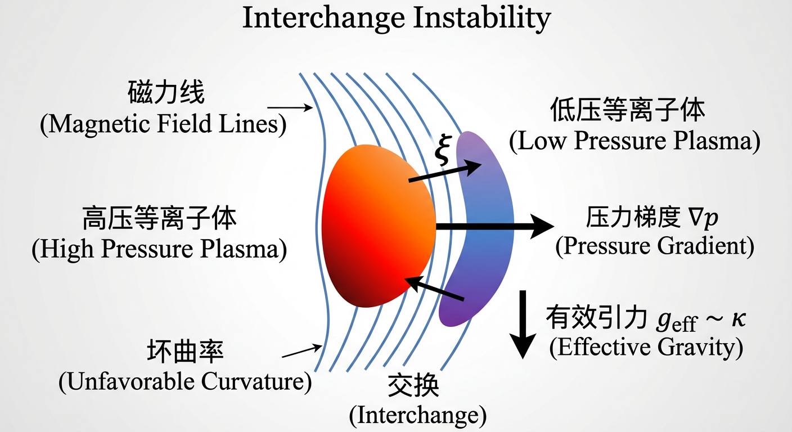
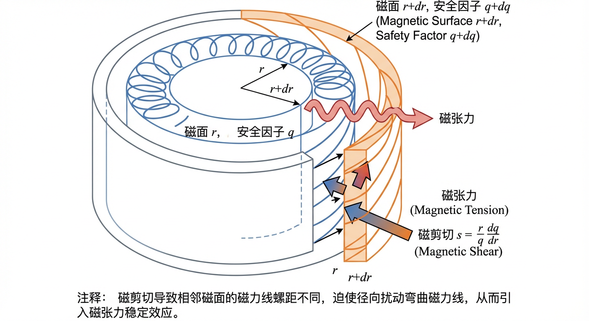
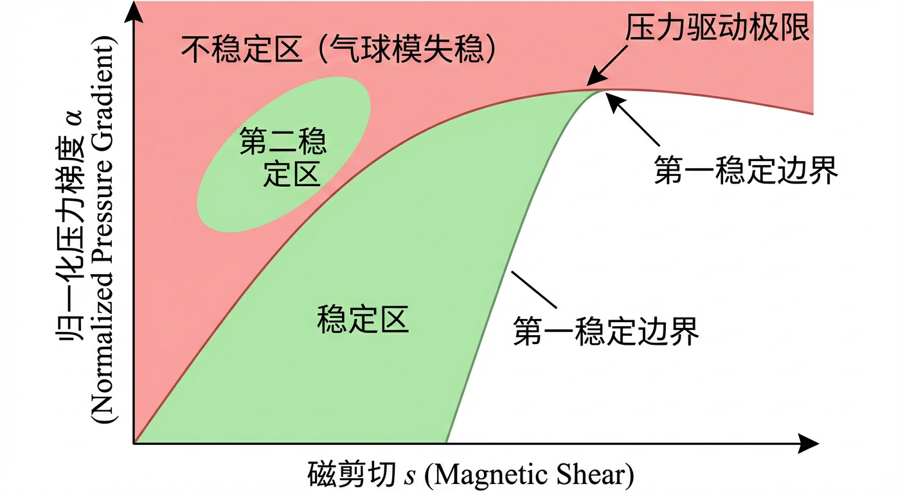
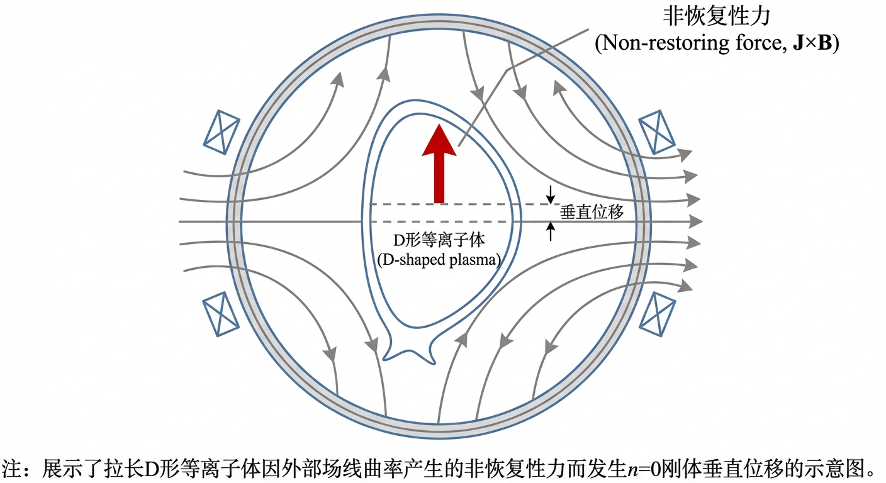
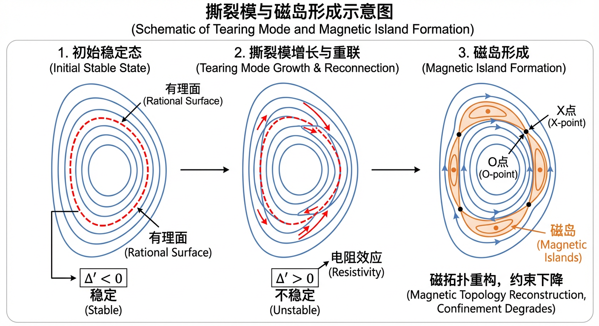
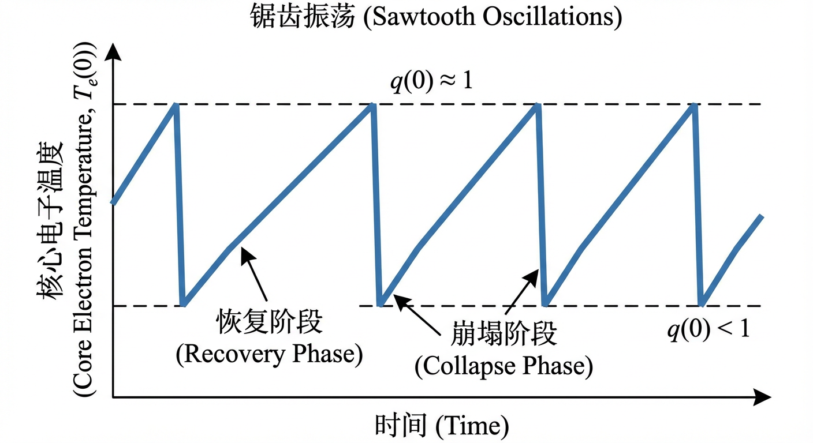
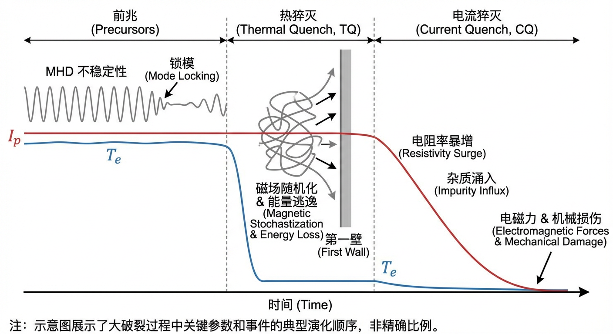
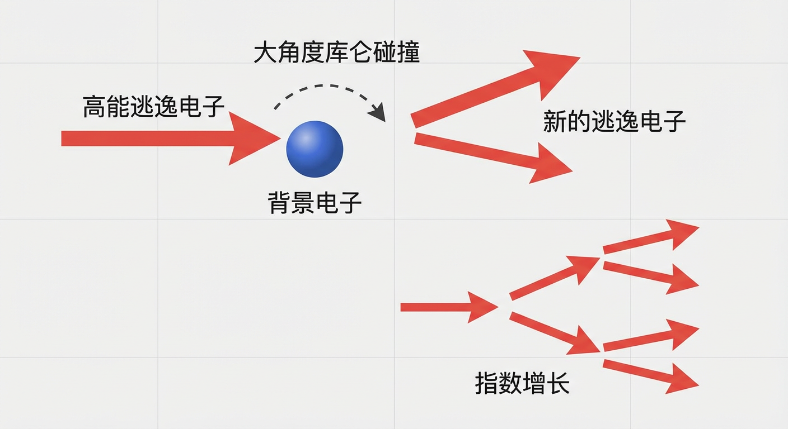

# 第5章：稳定性边界、磁重联链路与破裂风险闭环

## 5.0 项目概述

**实战项目：托卡马克“普罗米修斯”的稳定性疆域与安全系统设计**

在完成了前四章关于聚变原理、装置构造、磁面几何及宏观平衡的学习后，我们已经能够在图纸上构建一个处于平衡态的托卡马克装置。然而，设计出的装置能否在真实物理世界中存活，取决于其稳定性。本章我们将启动贯穿全章的实战项目——“普罗米修斯（Prometheus）”计划。

作为该计划的首席物理设计师，你面临的核心挑战是如何确保高压、大电流等离子体不发生灾难性的崩溃。你需要从理论推导出发，划定安全运行的边界，并设计一套能够应对最坏情况的保护系统。本项目将分为四个阶段，分别对应本章的四个子章节：

1. **稳定性判据推导**：基于能量原理，推导圆柱几何下的 Suydam 判据，确定压力梯度的理论上限。  
2. **垂直位移诊断**：针对拉长位形，分析垂直位移事件（VDE）的物理机制，识别控制失效前的前兆信号。  
3. **误差场与锁模分析**：评估工程误差场对等离子体的影响，建立锁模风险的物理图像。  
4. **缓解系统布局设计**：设计碎裂弹丸注入（SPI）系统的空间布局，计算沉积均匀性指标，以确保在破裂不可避免时能实现“软着陆”。

通过本项目，你将把抽象的 MHD 稳定性理论转化为具体的工程设计参数，深刻理解从微观不稳定性到宏观破裂的完整物理链条。

## 5.1 能量原理与压力驱动边界

在第四章中，我们通过宏观的功率与粒子收支模型，初步划定了聚变等离子体得以存在的运行窗口。然而，一个满足了基本能量平衡的等离子体，未必是一个能够稳定存在的等离子体。作为一团被强磁场约束的、蕴含着巨大能量的高温导电流体，等离子体天生就具有挣脱束缚、回归无序的倾向。任何微小的扰动，如果找到了可以释放系统能量的路径，便会如雪崩般自我放大，最终演变成灾难性的不稳定性，导致约束的瞬间崩溃。因此，理解等离子体稳定性的物理边界，是确保聚变装置安全、可靠运行的先决条件，也是实现高性能运行的必经之路。

本章将开启对等离子体稳定性的探索。我们将从一个最基本也最深刻的问题出发：一个处于平衡态的等离子体，其稳定性究竟由什么决定？我们将引入理想磁流体动力学（Ideal Magnetohydrodynamics, MHD）的能量原理，这一强大的理论工具将复杂的动力学问题转化为一个直观的能量最小化问题。在此基础上，我们将聚焦于由等离子体自身压力驱动的一类核心不稳定性——交换不稳定性与气球模，并阐明决定其稳定性的关键物理量，如磁场曲率、压力梯度和磁剪切，最终引出标志着等离子体性能极限的压力驱动边界。

### 能量原理：稳定性的终极判据

物理世界遵循着一条深刻而普适的“懒惰”法则：任何孤立系统总是自发地趋向于能量更低的状态。一个置于山顶的石球会滚落至谷底，一杯热水会逐渐冷却至室温。对于被磁场囚禁的等离子体这颗“人造太阳”而言，这条法则同样适用。等离子体的“不稳定”，本质上就是它找到了一个可以降低自身总势能的“捷径”，并通过宏观运动将多余的势能释放出来，转化为自身的动能。

这一思想被物理学家们提炼为判断等离子体稳定性的黄金准则——**能量原理（Energy Principle）**。该原理指出，对于一个处于平衡态的理想等离子体，如果任何可能的、微小的位移形变 **\(\boldsymbol{\xi}\)** 都会导致系统的总势能增加，那么系统就如同一个安坐在势能“山谷”底部的石球，是稳定的。反之，只要存在任何一种允许的形变能够使系统的总势能降低，那么等离子体就必然会沿着这条路径自发地演化，从而表现出不稳定性。

从数学上，我们将这种由位移 **\(\boldsymbol{\xi}\)** 引起的势能变化记为 \(\delta W[\boldsymbol{\xi}]\)。因此，能量原理可以简洁地表述为：若对于所有满足物理约束的非零位移 **\(\boldsymbol{\xi}\)**，\(\delta W[\boldsymbol{\xi}]>0\) 恒成立，则系统是理想 MHD 稳定的。这个看似简单的判据，其背后蕴含着深刻的物理。首先，一个 MHD 平衡态（满足力平衡方程 \(\nabla p=\mathbf{J}\times\mathbf{B}\)）恰好对应于势能泛函的一个驻点，即对于任意微小位移，势能的一阶变分为零。这与力学中平衡点是势能对广义坐标一阶导数为零的结论一脉相承。因此，稳定性取决于势能的二阶变分，即 \(\delta W\) 的正负号。

为了运用能量原理，我们首先在一个理想化的世界中展开讨论，即**理想 MHD 模型**。该模型假设等离子体是无电阻的完美导体、无粘性、无宏观流动，且扰动过程是绝热的。在这些理想化假设下，系统的势能变化 \(\delta W\) 可以被精确地写成一个只依赖于位移 **\(\boldsymbol{\xi}\)** 和平衡态物理量的泛函：
$$
\delta W=\frac{1}{2}\int_{\Omega}\left[\frac{|\delta\mathbf{B}|^2}{\mu_0}+\gamma p\,|\nabla\cdot\boldsymbol{\xi}|^2+(\boldsymbol{\xi}\cdot\nabla p)(\nabla\cdot\boldsymbol{\xi})-(\mathbf{J}\times\boldsymbol{\xi})\cdot\delta\mathbf{B}\right]\,\mathrm{d}V
$$
其中，\(\delta\mathbf{B}=\nabla\times(\boldsymbol{\xi}\times\mathbf{B})\) 是由位移引起的磁场扰动。这个表达式虽然复杂，但其各项都具有清晰的物理意义，共同描绘了一场决定等离子体命运的“拔河比赛”。

### 交换不稳定性：压力与“坏”曲率的共谋

在这场拔河比赛中，一方是试图撕开磁笼的破坏性力量，另一方则是维护约束的恢复性力量。不稳定性的主要驱动力，源于等离子体压力与磁场几何形态的共谋。

想象一束磁力线，如果它们向着等离子体压力减小的方向弯曲（即磁力线向外凸出），我们就称这片区域具有**“坏”曲率（unfavorable curvature）**。当一团高压等离子体沿着位移 **\(\boldsymbol{\xi}\)** 进入这个区域时，它就如同一个被置于斜坡顶端的重物，获得了释放势能的机会。它会向外膨胀，进入一个磁场更弱、约束更松的区域。这种由压力梯度 \(\nabla p\) 和曲率矢量 **\(\boldsymbol{\kappa}\)** 共同驱动的不稳定性，被称为**交换不稳定性（interchange instability）**。它的物理图像与经典的瑞利–泰勒不稳定性（重流体位于轻流体之上）相似：这里的“重”对应于高压等离子体，“轻”对应于低压等离子体，而“重力”可由弯曲磁力线导致的有效引力 \(g_{\mathrm{eff}}\sim v_A^2\kappa\) 类比表征。因此，不稳定的驱动条件可以直观地理解为有效引力的方向与压力增长的方向一致，即 \(\boldsymbol{\kappa}\cdot\nabla p>0\)。

在能量原理的表达式中，这个驱动力体现为可以为负的贡献项。为了最大限度地利用这个驱动力，同时最小化稳定性的抵抗，最“聪明”的不稳定性会选择一种特殊的形态——**长笛模（flute modes）**。这种模式的扰动沿着磁力线的方向保持不变，即平行波矢 \(k_{\parallel}\approx 0\)。如此一来，扰动就像在长笛上滑动的指法，可以在不弯曲磁力线的情况下交换相邻的等离子体团。这使得 \(\delta W\) 中最主要的稳定项——**磁张力（magnetic tension）**，或称**磁力线弯曲能（line-bending energy）**——的贡献趋近于零。磁力线弯曲项在 \(\delta W\) 中通常正比于 \(k_{\parallel}^2\)，它如同橡皮筋的弹力，总是抵抗任何形式的变形。长笛模正是通过选择 \(k_{\parallel}\approx 0\) 的路径，巧妙地绕开了这道最强的防线。

### 稳定性的屏障：磁剪切与 Suydam 判据

既然存在压力驱动，且长笛模可以规避磁张力，那么是否所有具有“坏”曲率的磁约束位形都注定是不稳定的呢？幸运的是，大自然提供了另一道更为精巧的防线——**磁剪切（magnetic shear）**。

在一个真实的托卡马克中，描述磁力线螺旋程度的安全因子 \(q\) 通常随半径变化，这意味着相邻磁面上的磁力线螺距不同。这种磁力线方向的径向变化，就是磁剪切，通常用无量纲参数 \(s=(r/q)\,\mathrm{d}q/\mathrm{d}r\) 来量化。在一个具有有限磁剪切的系统中，一个在径向有一定宽度的长笛模扰动，即使在其中心磁面处满足 \(k_{\parallel}=0\) 的共振条件，一旦它延伸到相邻的磁面，由于磁场方向的改变，其 \(k_{\parallel}\) 将不再为零。磁剪切越大，这种偏离共振的效应就越强，从而被迫引入了显著的磁力线弯曲。这重新激活了强大的磁张力稳定效应，其稳定能量的贡献随磁剪切增强而显著增加（在局部模型中常表现为与 \(s^2\) 同阶的标度）。

因此，稳定性最终取决于压力梯度驱动与磁剪切稳定效应之间的竞争。对于简化的圆柱形等离子体，这一竞争关系被著名的**Suydam 局部交换稳定性判据（Suydam local interchange stability criterion）**精确量化。用磁力线螺距参数 \(P=rB_z/B_{\theta}\) 表示，该判据常写为：
$$
\frac{B_z^2}{8\mu_0}\left(\frac{\mathrm{d}\ln P}{\mathrm{d}r}\right)^2+\frac{\mathrm{d}p}{\mathrm{d}r}>0
$$
其中 \(p\) 为等离子体压力，\(B_z\) 为轴向（类环向）磁场，\(B_{\theta}\) 为极向磁场。公式左边的第一项代表了磁剪切的稳定作用（始终为正），第二项代表了压力梯度在坏曲率下的失稳驱动（在标准剖面下 \(\mathrm{d}p/\mathrm{d}r<0\)）。Suydam 判据为我们提供了一个清晰的物理图像：足够强的磁剪切可以稳定足够陡的压力梯度。虽然它是在简化模型下得出的局域判据，但它深刻地揭示了磁剪切在约束高压等离子体中的核心作用。

### 气球模：压力驱动极限的守门人

在真实的环形托卡马克中，磁场曲率在极向方向上不断变化，有好有坏。长笛模这种全局 \(k_{\parallel}\approx 0\) 的理想模式难以存在。取而代之的是一种更为“智能”的不稳定性——**气球模（ballooning modes）**。

气球模不再追求在整条磁力线上都保持 \(k_{\parallel}\approx 0\)，而是采取了一种妥协策略：它将其扰动振幅主要集中在环外侧的“坏”曲率区，像一个向外“鼓包”的气球，从而最大化地利用不稳定性的驱动源；而在环内侧的“好”曲率区，其振幅则很小，以减少稳定效应的影响。当然，这种局域化的结构本身就意味着存在显著的平行梯度（有限的 \(k_{\parallel}\)），因此必须付出场线弯曲的能量代价。只有当集中的驱动足够强大，能够克服这个能量代价时，气球模才会被激发。

对气球模稳定性的分析，催生了聚变物理中一个极其强大的理论框架——**\(s\)–\(\alpha\) 模型**。该模型将复杂的稳定性问题提炼为两个关键无量纲参数的竞争：
- **归一化压力梯度（normalized pressure gradient）**：\(\alpha=-(2\mu_0R_0q^2/B^2)\,\mathrm{d}p/\mathrm{d}r\)，它正比于压力梯度，是气球模的驱动力。  
- **磁剪切（magnetic shear）**：\(s\)，它通过场线弯曲提供稳定，并影响扰动的沿磁力线局域化结构。

通过求解相应的气球模方程（其形式常类比于量子力学中的一维薛定谔方程），可以得到一张在 \((s,\alpha)\) 平面上的稳定性图。这张图清晰地揭示了等离子体运行的“安全”与“危险”疆域。对于给定的磁剪切 \(s\)，存在一个临界的压力梯度 \(\alpha_{\mathrm{crit}}(s)\)。当 \(\alpha<\alpha_{\mathrm{crit}}(s)\) 时，等离子体稳定；一旦 \(\alpha\) 超过这个临界值，气球模就会失稳。这条边界被称为**第一稳定边界（first stability boundary）**，它定义了由压力驱动的理想 MHD 不稳定性所设定的基本性能极限，即**压力驱动极限（pressure-driven limit）**。在实际操作中，这个极限对应于等离子体所能承受的最大压力梯度，直接关系到聚变反应堆的最终输出功率。因此，精确理解和计算这个边界，是托卡马克设计和运行优化的核心任务之一。

值得一提的是，\(s\)–\(\alpha\) 图还预言了一个更为奇妙的现象：在跨越第一稳定边界后，如果继续增大压力梯度，系统在某些弱磁剪切区域竟然可以重新进入一个稳定状态，这便是著名的**第二稳定区（second stability regime）**。这一发现为实现更高性能的“先进托卡马克”运行模式开辟了新的道路。

### 小结

本节我们建立了判断等离子体稳定性的基本框架——能量原理。它将复杂的动力学问题转化为一个关于系统势能变化的能量问题，其核心是驱动不稳定的力（如压力与坏曲率的耦合）与稳定化的力（如磁张力）之间的永恒博弈。我们首先分析了最简单的压力驱动模式——交换不稳定性，并揭示了磁剪切如何通过 Suydam 判据为其设置稳定边界。随后，我们将这一图像推广到更真实的环形几何中，引出了气球模的概念，并阐明了由第一稳定边界定义的压力驱动极限。

> **实战项目应用 I：圆柱几何下的 Suydam 判据推导**  
> 作为“普罗米修斯”计划的第一步，你需要为装置核心区域的局域稳定性建立数学基准。虽然托卡马克是环形的，但其局域稳定性常可以通过圆柱螺旋箍缩（screw pinch）模型进行近似分析。  
>  
> 任务：从局部交换不稳定性的能量平衡出发，使用磁力线螺距参数 \(P=rB_z/B_{\theta}\) 或等价的螺距参数 \(\mu(r)=B_{\theta}(r)/(rB_z(r))\)，推导圆柱几何下的局部交换稳定性判据。要求将结果写成 \(\mathrm{d}\ln P/\mathrm{d}r\)（或 \((1/\mu)\,\mathrm{d}\mu/\mathrm{d}r\)）、压力梯度 \(\mathrm{d}p/\mathrm{d}r\) 与轴向磁场 \(B_z\) 的函数形式，并说明其中磁剪切项为何总为稳定化贡献、压力梯度项在常见剖面下为何提供失稳驱动。该判据将作为你判断装置压力梯度极限的基础公式。

至此，我们探讨的都是在理想 MHD 模型下的稳定性。然而，真实的等离子体并非完美导体，其有限的电阻率、粘滞性以及离散的粒子效应，将为不稳定性打开新的大门，并深刻地改变我们对稳定性边界的认知。在接下来的章节中，我们将首先继续在理想 MHD 框架下探讨由电流驱动的扭曲不稳定性及其著名的 Kruskal–Shafranov 极限，然后逐步引入电阻效应，探索撕裂模与磁岛的形成，最终构建起一幅更完整、更接近真实的等离子体稳定性图景。本节所建立的能量原理和压力驱动的思想，将作为一条主线，贯穿于我们后续的全部讨论之中。

## 5.2 理想 MHD 运行窗口与垂直稳定性

在上一节中，我们通过能量原理揭示了等离子体中压力驱动不稳定性的物理本质，这些不稳定性为聚变装置的性能设下了第一重边界。然而，等离子体的行为远比这更为复杂。除了自身的热压力，等离子体中流动的巨大电流同样是宏观不稳定性的强大驱动源。此外，为了追求更高的约束性能，我们对等离子体进行的几何“雕塑”本身也会引入新的、固有的不稳定性。本节将深入探讨这些由电流和几何位形主导的理想磁流体动力学不稳定性，它们共同定义了托卡马克安全运行的“理想 MHD 运行窗口”，并引出在真实装置中必须面对的垂直稳定性这一核心挑战。

### 电流驱动的宏观不稳定性与 Kruskal–Shafranov 极限

让我们从一个最简单的磁约束位形——Z 箍缩（Z-pinch）——出发，来理解电流驱动不稳定性的根源。在这种构型中，强大的轴向电流自身产生的环向磁场，像桶箍一样约束着等离子体柱。然而，这种看似优雅的自约束结构，却内在地孕育了两种灾难性的不稳定性。其一是**香肠不稳定性（sausage instability）**，对应于轴对称的（\(m=0\)）扰动。在等离子体柱发生颈缩处，环向磁场因半径减小而增强，更强的磁压缩力会使颈缩加剧，最终如同香肠一样被“掐断”。其二是更具破坏性的**扭曲不稳定性（kink instability）**，对应于螺旋状的（\(m=1\)）扰动。当等离子体柱发生整体弯曲时，弯曲内侧的磁力线被压缩、外侧磁力线被拉伸，伴随磁张力与磁压的耦合作用，形成正反馈，导致整个等离子体柱发生剧烈的螺旋扭曲。

为了驯服这些狂暴的电流驱动模，一个根本性的改进是在系统中引入一个强大的轴向磁场 \(B_z\)。此时，总磁场由轴向场和等离子体电流产生的极向场叠加而成，磁力线不再是简单的圆环，而是缠绕等离子体柱盘旋前进的螺旋线。这种螺旋结构赋予了等离子体一个刚性的“磁脊柱”，任何香肠或扭曲变形都必须付出弯曲和拉伸磁力线的巨大能量代价，从而显著增强系统的稳定性。

为了精确地描述这种磁力线的螺旋缠绕程度，我们引入了**安全因子（safety factor, \(q\)）**这一关键的几何参数。其物理意义是，磁力线在极向（短路）方向绕行一圈的同时，会在环向（长路）方向绕行 \(q\) 圈。因此，\(q\) 值是磁力线螺距的一种度量，它与等离子体电流的大小和分布密切相关。

不稳定性总是倾向于选择能量耗散最小的路径生长。一种具有特定螺旋形态（由极向模数 \(m\) 和环向模数 \(n\) 描述）的扰动，当其螺距与背景磁场的螺距匹配时，它就能更容易生长且较少引起磁力线弯曲。共振条件发生在所谓的**有理面（rational surfaces）**上，即满足 \(q(r)=m/n\) 的磁面上。在这些位置，不稳定性的耦合往往最强。

在所有扭曲模中，最危险的通常是波长最长、尺度最大的**外部扭曲模（external kink mode）**，它涉及整个等离子体边界的自由位移。对于环向模数 \(n=1\) 的外部扭曲模，最不稳定的分量常为 \(m=1\)。其典型共振条件为 \(q=1\)。如果等离子体边界的安全因子 \(q_a\) 小于 1，意味着边缘磁力线扭转得比 \(m=1,n=1\) 的螺旋更紧，等离子体可以更容易地变形为这种螺旋形态并向外发展，系统更易失稳。反之，如果 \(q_a>1\)，\(m=1,n=1\) 扰动通常需要强制弯曲边界处磁力线，从而更易受到磁张力的抑制。

这一物理图像导出了聚变物理学中最著名的判据之一：**Kruskal–Shafranov 稳定性极限（Kruskal–Shafranov stability limit）**。对自由边界外部扭曲模，其经典形式指出，为了抵抗由电流驱动的外部扭曲不稳定性，等离子体边界的安全因子需要满足
$$
q_a>1 .
$$
这是一个深刻的结论，它为给定环向磁场和装置尺寸下，托卡马克能稳定承载的总等离子体电流 \(I_p\) 设定了一个重要约束。该电流约束与著名的**特洛伊恩极限（Troyon limit）**经验标度相关：归一化比压常写为
$$
\beta_N\equiv \frac{\beta(\%)\,a B_t}{I_p(\mathrm{MA})}\lesssim 3\text{--}4 ,
$$
其中 \(a\) 为小半径（m），\(B_t\) 为环向磁场（T），\(I_p\) 以 MA 计。它体现了在给定磁场与尺寸下，压力极限与电流规模之间的耦合：提高 \(I_p\) 往往有利于提高可达 \(\beta\)，但电流又受到外部扭曲模等稳定性边界的制约。二者共同构成理想 MHD 运行窗口的关键边界。

### 等离子体形状与垂直不稳定性

在 K–S 极限所定义的电流边界和 5.1 节讨论的压力边界之内，我们似乎拥有了一个安全的运行空间。然而，为了追求更高的聚变增益，工程师和物理学家们永不满足于现状。通过精心设计外部极向场线圈，我们可以将等离子体的截面从圆形“雕塑”成垂直拉长的 D 形。这种**位形整形（plasma shaping）**，特别是增加**拉长率（elongation, \(\kappa>1\)）**和**三角形变（triangularity, \(\delta>0\)）**，能够有效地提高压力驱动不稳定性的阈值，从而允许等离子体在更高的比压 \(\beta\) 下稳定运行。

然而，这一优化也带来了一个严峻的挑战：如同将铅笔立于笔尖，拉长的等离子体在垂直方向上处于一种固有的脆弱平衡状态。维持等离子体拉长所需的外部磁场，其径向分量 \(B_R\) 在赤道面附近通常呈现不利的空间变化，使得等离子体一旦发生微小垂直位移，外部场与等离子体电流的相互作用可能产生非恢复的洛伦兹力，反而将其进一步推离平衡位置。这就是**垂直不稳定性（vertical instability）**。

这种不稳定性具有一个鲜明的特征：它是一种**轴对称（axisymmetric, \(n=0\)）的刚体位移模式**。其物理根源在于，只有在环向上处处同步的（\(n=0\)）扰动，才能对整个等离子体环产生一个非零的净垂直力，从而驱动其质心发生整体平移。任何非轴对称的（\(n\neq 0\)）扰动，其在环向上产生的局域力在积分后都会相互抵消。因此，垂直不稳定性表现为整个等离子体作为一个刚性电流环，直直地向上或向下漂移。

更值得注意的是，这种不稳定的驱动力与等离子体自身的性能参数紧密耦合。更高的等离子体压力（由**极向比压（poloidal beta, \(\beta_p\)）**表征）和更尖锐的电流剖面（由**内部电感（internal inductance, \(l_i\)）**表征），都会增强等离子体向外扩张的“箍力”（hoop force）。为了在径向上平衡这个力，就需要一个更强的外部垂直场，而该场的不利空间变化也随之增强，从而导致更强的垂直不稳定倾向。在常用的线性化模型中，不稳定驱动常随 \((\beta_p+l_i/2)\) 的增大而增强。这揭示了一个深刻的内在矛盾：我们为追求高性能而采取的措施（高比压、高拉长率），往往将等离子体推向垂直不稳定的边缘。

### 被动与主动稳定：从理想壁到电阻壁模

如果垂直不稳定性完全以理想 MHD 的阿尔芬时间尺度发展，那么任何拉长位形的托卡马克都将难以运行。幸运的是，等离子体并非孤立存在于真空中，它被导电的真空室壁所包围。这道“墙”为我们提供了第一道也是至关重要的防线，即**被动稳定（passive stabilization）**。

当等离子体发生垂直位移时，变化的磁通量会根据**楞次定律（Lenz's law）**在导电壁中感应出强大的**涡电流（eddy currents）**。这些涡电流产生的磁场会产生一个与位移方向相反的恢复力，如同一个磁弹簧，有效抑制等离子体的快速运动。在一个理想的、无电阻的完美导电壁模型中，这种稳定作用是永久的，足以完全抑制垂直不稳定性。从能量原理的角度看，理想壁的存在为系统贡献了一个巨大的、正的真空磁能项 \(\delta W_{\mathrm{vac}}\)，它能够克服等离子体自身释放的负能量，从而确保总的势能变化 \(\delta W\) 为正。

然而，真实的真空室壁总有有限的电阻。这意味着感应出的涡电流会因欧姆耗散而逐渐衰减，其特征时间可用由壁电阻与电感决定的**壁时间（wall time, \(\tau_w\)）**来表征。因此，导电壁的稳定作用不再是永久的。它无法完全消除不稳定性，而是将其从一个快速的理想模式，转变为一个在壁时间尺度上缓慢增长的模式。这种被壁的电阻“拖慢”了脚步的不稳定性，被称为**电阻壁模（Resistive Wall Mode, RWM）**。

无论是 \(n=0\) 的垂直不稳定性，还是由压力和电流驱动的 \(n>0\) 外部扭曲模，当其理想驱动力被导电壁抑制后，都可能以 RWM 的形式缓慢“渗出”。这种缓慢的增长为我们赢得了宝贵的时间窗口。通过实时监测等离子体的位置和形态，并利用外部的主动控制线圈产生精确的校正磁场，我们可以在 RWM 发展到危险幅度之前将其抑制。这就是**主动反馈控制（active feedback control）**，它是现代高性能托卡马克运行不可或缺的核心技术。

### 垂直位移事件（VDE）动力学

当主动反馈控制系统失效或无法应对一个巨大的初始扰动时，由 RWM 主导的缓慢垂直漂移将持续下去，最终演变成一场被称为**垂直位移事件（Vertical Displacement Event, VDE）**的事故过程。VDE 常与等离子体与壁的接触、热猝灭和电流猝灭相互耦合，并可能演化为**大破裂（major disruption）**。

典型的 VDE 过程始于等离子体在毫秒尺度上向真空室顶部或底部的漂移。当等离子体边界接触到第一壁或偏滤器时，其最外层的开放磁力线区域——刮削层（Scrape-Off Layer, SOL）——与导电的壁部件形成电流通道。紧接着，接触导致的壁材料溅射和杂质涌入，会引发剧烈的辐射冷却，导致**热猝灭（Thermal Quench, TQ）**，等离子体温度在亚毫秒内崩溃。温度的骤降使得等离子体电阻率飙升多个数量级，巨大的环向电流无法维持，从而在几毫秒到几十毫秒内快速衰减，此即**电流猝灭（Current Quench, CQ）**。

在 VDE 的壁接触和电流猝灭阶段，一个特别危险的现象是**晕电流（halo currents）**的产生。强大的感应电场会驱动部分等离子体电流沿着 SOL 的开放磁力线流入壁面，在壁结构内流过一段距离后，再返回等离子体，形成一个完整的极向闭合回路。这股电流与托卡马克强大的环向磁场相互作用，产生的 \(\mathbf{J}\times\mathbf{B}\) 力可对装置造成严重的机械应力，是 VDE 造成装置损害的主要原因之一。理解并预测 VDE 的完整动力学链条，对于设计破裂缓解系统和保障未来聚变反应堆的结构安全至关重要。

### 小结

本节的探索揭示了理想 MHD 稳定性如何为托卡马克划定一个多维的运行窗口。Kruskal–Shafranov 极限从电流的角度定义了边界，而上一节讨论的压力极限则从另一个维度进行了约束。然而，对更高性能的追求通过采用拉长位形又引入了垂直不稳定性这一新的、更为严苛的限制。幸运的是，导电壁的被动稳定作用将这些快速的理想不稳定性转化为缓慢增长的电阻壁模，为主动反馈控制创造了可能。这清晰地展示了理论物理、计算模拟与控制工程如何在聚变研究中深度融合。

> **实战项目应用 II：垂直位移事件（VDE）的物理辨识与前兆**  
> 你的“普罗米修斯”装置设计采用了拉长 D 形截面，因此必须面对垂直不稳定的风险。为了设计有效的保护逻辑，你必须清晰定义什么是 VDE，并能够从传感器数据中识别出它即将发生的前兆。  
>  
> 任务：基于线性化垂直运动模型  
> $$
> c_w\,\frac{\mathrm{d}z}{\mathrm{d}t}=-k_{\mathrm{eff}}(t)\,z+g_c\,i_c+\xi(t)
> $$
> 及其控制律，分析当系统接近垂直稳定性极限（\(k_{\mathrm{eff}}\to 0^+\) 或最小闭环特征值 \(\lambda\to 0^+\)）时：  
> 1. VDE 在物理本质上究竟是哪种类型的不稳定性（例如：模数 \(n\) 是多少？是快模式还是慢模式？）？  
> 2. 从反馈控制线圈电流 \(i_c(t)\) 和垂直位置 \(z(t)\) 的信号特征来看，你会观测到什么样的前兆现象（例如：低频增益、相位滞后、信号方差等）？  
>  
> 准确识别这些特征，是你的安全系统决定何时触发紧急停机的关键。

一旦控制失效，VDE 便会发生，其复杂的动力学过程将等离子体物理与材料科学、结构力学紧密联系在一起。本节所建立的关于理想 MHD 稳定性边界和 RWM 的概念，为我们下一节深入探讨更为普遍的、由等离子体有限电阻率驱动的撕裂模及其导致的磁岛链路奠定了坚实的物理基础，并为最终理解 5.4 节将要讨论的完整破裂动力学铺平了道路。

## 5.3 电阻 MHD 磁岛链路

在前述章节中，我们探讨了理想磁流体动力学（Ideal Magnetohydrodynamics, MHD）框架下的等离子体稳定性。理想 MHD 将等离子体视为完美导体，其核心推论——磁通冻结定理——保证了磁力线与等离子体流体时刻绑定，从而维系了完美的嵌套磁面拓扑结构。这幅图像为磁约束的实现提供了理论基石，但它也描绘了一个过于乐观的世界。真实的聚变等离子体，无论温度多高，终究不是完美导体，其内部始终存在着有限的电阻率。

这一微小的“不完美”，正是打开潘多拉魔盒的钥匙。它从根本上打破了磁力线不可侵犯的神话，允许了磁场的拓扑重构——即磁重联（magnetic reconnection）。本节将深入探讨由电阻效应主导的一系列关键物理过程，它们共同构成所谓的“电阻 MHD 磁岛链路”。这条链路始于磁场的撕裂，形成被称为“磁岛”的拓扑结构；它在等离子体核心以“锯齿振荡”的形式周期性地搏动；在高参数运行时，它又演变为更具危害性的“新经典撕裂模”；最终，它还与装置的工程缺陷“共谋”，通过“误差场穿透”将等离子体推向破裂的边缘。理解这条从微观电阻到宏观失稳的完整物理链条，是掌握可控核聚变稳定运行的关键所在。

### 撕裂模与磁岛的形成：理想约束的裂痕

理想磁约束的美妙画卷，建立在光滑、连续的嵌套磁面之上。然而，这幅画卷中隐藏着天然的“接缝”——**有理面（rational surfaces）**。在托卡马克的环形几何中，磁力线以螺旋状缠绕在磁面上。我们用**安全因子（safety factor, \(q\)）**来描述这种缠绕的疏密程度，其定义为磁力线在极向（短路径）绕行一圈的同时，在环向（长路径）绕行 \(q\) 圈。在那些 \(q\) 值恰好为有理数（\(q(r_s)=m/n\)，其中 \(m,n\) 为整数）的磁面上，磁力线在行进了有限的圈数后会精确地闭合。

这些有理面对于具有相同螺旋“节拍”的磁扰动而言，是天然的共振场所。对于一个空间形态由 \(\exp[i(m\theta-n\phi)]\) 描述的螺旋扰动，其平行于背景磁场的波矢 \(k_{\parallel}\) 与 \(m-nq(r)\) 成正比。在 \(q(r_s)=m/n\) 的有理面上，\(k_{\parallel}=0\)。这意味着扰动可以沿着磁力线方向延伸而不需要付出显著的场线弯曲能量代价，为不稳定性的生长打开了方便之门。

在理想 MHD 的完美导电世界里，即使存在共振，磁通冻结定理依然禁止磁力线的断裂和重联，磁岛无从形成。然而，现实世界中有限的**电阻率（resistivity, \(\eta\)）**，改变了这一结论。尽管在数千电子伏特乃至更高温度的等离子体中，由电子–离子碰撞引起的斯皮策电阻率（Spitzer resistivity）很低，但在有理面附近一个极薄的“电阻层”内，其效应会被显著放大。正如**广义欧姆定律（generalized Ohm's law）**所示，理想 MHD 的约束 \(\mathbf{E}+\mathbf{v}\times\mathbf{B}=\mathbf{0}\) 被修正为
\[
\mathbf{E}+\mathbf{v}\times\mathbf{B}=\eta\mathbf{J}+\cdots
\]
这一修正允许平行于磁场的电场（\(E_{\parallel}=\eta J_{\parallel}\)）存在，从而打破“冻结”的约束，使得磁力线得以在局部“滑移”、断裂并重新连接。

这种由电阻效应参与、发生在有理面附近的拓扑重构过程，便是**撕裂模（Tearing Mode, TM）**的重要物理机制。那么，是否只要存在有理面和电阻，撕裂模就一定会发生？答案是否定的，它还需要一个能量上的驱动。为此引入一个关键判据——**撕裂模稳定性指数（tearing stability index, \(\Delta'\)）**。\(\Delta'\) 量化了电流剖面中可供撕裂模释放的自由能。其正负号决定撕裂模的命运：
- \(\Delta'>0\)：存在驱动不稳定的自由能，撕裂模会自发增长。  
- \(\Delta'<0\)：系统处于经典稳定状态，微小扰动会被抑制。  

\(\Delta'\) 的值完全由全局电流剖面的形态决定。例如，在经典的电流片模型中，\(\Delta'\) 与电流梯度的尖锐程度相关，一个更尖锐的电流剖面更容易导致 \(\Delta'>0\)。

当 \(\Delta'>0\) 时，撕裂模的生长将改变磁面的拓扑结构。原本光滑的嵌套磁面在有理面附近被“撕裂”，通过磁重联形成一串由 \(m\) 个**磁岛（magnetic islands）**组成的链状结构。在磁岛的中心是 O 点，磁力线围绕其形成新的闭合磁面；而在磁岛之间是 X 点，磁力线在此处交叉重联。磁岛的出现，如同在完美的绝热墙上打开了一扇窗，热量和粒子可以沿着岛内的磁拓扑快速输运，显著削弱等离子体的约束性能。

磁岛的生长并非一蹴而就。其线性增长阶段的增长率 \(\gamma\) 是一个由阿尔芬时间 \(\tau_A\) 和电阻扩散时间 \(\tau_R\) 共同决定的混合时间尺度，其标度关系遵循著名的 FKR 理论：
\[
\gamma \tau_A\propto (\Delta'a)^{4/5}S^{-3/5},
\]
其中 \(S=\tau_R/\tau_A\) 为伦德奎斯特数（Lundquist number）。当磁岛宽度 \(w\) 增长到超过电阻层厚度后，其演化进入由**卢瑟福方程（Rutherford equation）**描述的非线性代数增长阶段，其增长率变为
\[
\frac{\mathrm{d}w}{\mathrm{d}t}\propto \eta \Delta' .
\]
这个方程为从实验观测的磁岛宽度演化反推关键物理参数 \(\Delta'\) 提供了重要桥梁。

### 锯齿振荡与 \(q=1\) 面：等离子体核心的脉动

在许多托卡马克放电中，等离子体核心的电子温度和密度会呈现一种独特的周期性弛豫振荡，其波形酷似锯齿，因而被称为**锯齿振荡（sawtooth oscillations）**。这种现象是电阻 MHD 物理在等离子体核心最生动的体现，其核心舞台便是**单位安全因子面（\(q=1\) surface）**。

锯齿振荡的触发机制与一种特殊的、模数为 \(m/n=1/1\) 的**内扭曲模（internal kink mode）**相关。如前所述，不稳定性在 \(q=m/n\) 的有理面处最易发生。因此，\(m/n=1/1\) 的内扭曲模存在的一个必要条件是，等离子体中必须存在 \(q=1\) 的有理面。在一个典型的、安全因子 \(q(r)\) 从中心向外单调增加的剖面中，这意味着中心安全因子 \(q(0)\) 必须小于 1。

锯齿振荡的过程可近似理解为缓慢积累与快速崩塌交替出现的弛豫振荡：
1. **恢复阶段**：在一次崩塌后，核心区的温度和电流剖面被部分压平，\(q(0)\) 往往被抬升到接近 1 的水平，此时内扭曲模更趋向稳定。随后，在欧姆加热或辅助加热的作用下，核心温度逐渐回升。由于斯皮策电阻率与温度强相关（\(\eta\propto T_e^{-3/2}\)），核心电流密度会因电阻率下降而逐渐更集中，导致 \(q(0)\) 缓慢下降。  
2. **崩塌阶段**：当 \(q(0)\) 下降到某个阈值（常见在 \(0.8\)–\(1.0\) 附近，具体取决于动理学效应与形状等因素）以下，内扭曲模的驱动力足以克服稳定化效应，不稳定性被触发。在 \(m=1\) 扰动的驱动下，\(q=1\) 面附近发生快速磁重联，将核心高温等离子体与外部较冷等离子体在极短时间内（典型为几十到几百微秒）混合，导致核心温度和压力迅速下降，同时剖面被部分压平，\(q(0)\) 被重置到接近 1 的水平。

经典的**Kadomtsev 全重联模型**认为，崩塌过程会将 \(q=1\) 面内的磁通量完全重联，使得崩塌后 \(q(0)=1\)。然而，大量实验表明，崩塌后 \(q(0)\) 往往仍可小于 1，这促使人们发展了考虑更复杂物理（如动理学效应、两流体效应等）的**部分重联模型**。值得注意的是，实验上通过软 X 射线或电子回旋辐射（Electron Cyclotron Emission, ECE）诊断观测到的锯齿“反转半径”，即温度由下降转为上升的径向位置，并不严格等于 \(q=1\) 面半径，而与重联后的混合区半径相关。

### 新经典撕裂模：高压强下的幽灵

随着托卡马克向高性能（高比压 \(\beta\)）运行模式发展，一种更为“狡猾”和危险的磁岛不稳定性开始显现——**新经典撕裂模（Neoclassical Tearing Modes, NTMs）**。它令人困惑之处在于，它常常在经典理论预测为稳定（即 \(\Delta'<0\)）的等离子体中出现。这一现象的解释，蕴藏在托卡马克环形几何所独有的新经典输运物理之中。

NTM 的驱动力并非主要来自电流剖面的宏观梯度，而是源于磁岛自身对其“生存环境”的改变。在环形几何中，压力梯度会驱动一股被称为**自举电流（bootstrap current）**的内禀电流，其大小与压力梯度相关（\(j_{\mathrm{bs}}\propto -\partial p/\partial r\)，比例系数取决于碰撞性与几何等）。当一个“种子”磁岛形成后，岛内快速的平行输运会抹平压力梯度，导致该区域的自举电流减弱或消失。这个螺旋状的“电流缺口”所产生的磁场效应可与磁岛扰动同相，从而形成驱动磁岛进一步生长的正反馈。

这一机制的直接后果是，NTM 的驱动力与等离子体压力（常用极向比压 \(\beta_p\) 衡量）相关。为了描述这种新的非线性驱动，经典的卢瑟福方程被修正为**修正的卢瑟福方程（Modified Rutherford Equation, MRE）**。一种常用的结构化写法为：
$$
\frac{\tau_R}{r_s^2}\frac{\mathrm{d}w}{\mathrm{d}t}
=
\Delta'
+
c_{\mathrm{bs}}\beta_p\,\frac{w}{w^2+w_c^2}
-
c_{\mathrm{pol}}\frac{1}{w^3}
$$
方程右侧展示了一场相互竞争：
- **经典项**：\(\Delta'\)，对 NTM 背景往往为负。  
- **自举驱动项**：\(c_{\mathrm{bs}}\beta_p\,{w}/({w^2+w_c^2})\)，是非线性驱动项；其中 \(w_c\) 表征压力恢复与输运相关的临界宽度，当 \(w\gg w_c\) 时该项趋于 \(\propto 1/w\)。  
- **小岛稳定项**：\(-c_{\mathrm{pol}}/w^3\)，代表离子极化电流（ion polarization current）等效应对小尺度磁岛的稳定化贡献。  

正是这种竞争赋予了 NTM **亚临界（sub-critical）不稳定性**的特征：它通常不会从任意微小扰动自发产生，而需要一个宽度超过临界阈值 \(w_{\mathrm{crit}}\) 的初始“种子磁岛（seed island）”来触发。一旦种子岛宽度超过阈值，自举电流驱动就会接管，即使在 \(\Delta'<0\) 的背景下也能驱动磁岛持续增长。

这些危险的“种子”从何而来？它们往往是其他 MHD 事件的副产物。**锯齿崩塌**便是重要的种子源之一。一次强烈的锯齿崩塌可以非线性地在外部的有理面（如 \(q=3/2\) 或 \(q=2/1\)）上激发暂态磁扰动。如果这个扰动的等效宽度超过了该处的 NTM 触发阈值，危险的 NTM 就会被“播种”并开始生长。因此，通过主动控制电流剖面（例如使用电子回旋电流驱动（Electron Cyclotron Current Drive, ECCD））调控核心 \(q\) 剖面并弱化强锯齿，是预防 NTM 的有效策略之一。

### 误差场穿透：工程缺陷与等离子体的共谋

最后，我们必须面对一个源于工程现实的挑战：**误差场（error fields）**。由于磁体线圈制造和安装的微小公差，任何托卡马克装置都存在偏离理想轴对称的寄生磁场。这些静态的、微弱的误差场虽然幅度不大（通常为主磁场的 \(10^{-5}\)–\(10^{-4}\)），但其特定的螺旋谐波分量能够与等离子体中的有理面发生共振。

一个快速旋转的等离子体由于其高导电性，能够通过感应屏蔽电流有效地将这些外部静磁场排斥在外。然而，当等离子体旋转由于某种原因（例如密度升高导致动量阻尼增强）减慢时，这种屏蔽效应会减弱，使得误差场得以**穿透（penetrate）**到有理面，强制驱动出一个与误差场同步、在实验室系中近似静止的磁岛。

更糟糕的是，这个过程本身会形成危险的正反馈循环。穿透的误差场会对等离子体施加电磁力矩，使其进一步减速，从而导致更强的穿透和更大的力矩。当电磁力矩超过等离子体的粘滞与外源驱动共同提供的恢复力矩时，模式的旋转会停止，发生**模式锁定（mode locking）**。锁定磁岛通常会迅速增长，严重恶化约束，并常常是导致灾难性大破裂的直接导火索。

因此，对误差场的测量（例如利用磁探针与专门的扫描策略进行谐波辨识）和主动修正（利用外部校正线圈产生反向补偿场）是现代托卡马克运行的重要环节。同时，通过中性束注入等手段维持足够的等离子体旋转，也是在运行层面提高装置对误差场“容忍度”的关键策略。

### 小结

本节揭示了理想磁约束模型的脆弱性，并构建了一条从微观电阻物理到宏观稳定性问题的链路。等离子体的有限电阻率打破了磁通冻结的理想约束，使得磁力线可以在有理面上发生重联，从而催生了**撕裂模**与**磁岛**。这一基本过程在不同条件下展现出多样形态：
- 在电流剖面本身不稳定的情况下，它表现为经典的撕裂模，其稳定性由 \(\Delta'\) 判据决定。  
- 在等离子体核心 \(q<1\) 的区域，它以锯齿振荡形式周期性重构核心磁场与剖面。  
- 在高压力等离子体中，它与新经典效应耦合，演变为需要“种子”触发的、更具危害性的 NTM。  

> **实战项目应用 III：误差场穿透与锁模风险评估**  
> 即使你的“普罗米修斯”设计尽可能接近理想，施工中的线圈不对中仍不可避免。这将产生静态的非轴对称误差场（常以主谐波 \(n=1\) 为代表）。为了评估这一风险，你需要理解误差场如何“攻破”等离子体的旋转屏蔽并触发锁模链条。  
>  
> 任务：在电阻 MHD 框架下，分析误差场穿透、磁岛形成与模式锁定之间的因果链条：  
> 1. 解释多普勒频移频率 \(\omega_d\) 在旋转屏蔽机制中的核心作用。当 \(|\omega_d|\to 0\) 时，屏蔽效应如何变化？  
> 2. 即使等离子体本质上对自发撕裂模是稳定的（\(\Delta'<0\)），误差场是否仍能驱动出磁岛？其物理机制是什么？  
> 3. 描述电磁力矩 \(T_{\mathrm{EM}}\) 如何与动量阻尼相互作用导致锁模，并说明为何锁模常被视为大破裂的前兆。  
>  
> 你的分析将直接指导装置中纠错线圈（Error Field Correction Coils）的设计需求。

这些由电阻效应引发的磁岛链条构成连接稳定运行与灾难性破裂之间的关键环节。它们不仅限制约束性能，其自身的演化——生长、饱和与锁定——也常是破裂的重要前兆信号。因此，对这一链路的理解是通往稳定、高性能聚变能源的必经之路，并为下一节“破裂动力学与缓解策略”奠定物理基础。

## 5.4 破裂动力学与缓解策略

在前面几节中，我们已经系统地探讨了等离子体如何因为越过理想与电阻性磁流体动力学（Magnetohydrodynamics, MHD）的稳定性边界而变得脆弱。我们理解了，无论是压力驱动的气球模，还是电流驱动的扭曲模与撕裂模，它们都在等离子体内部埋下了不安的种子。然而，一个根本性的问题依然悬而未决：当这些不稳定性失控增长时，会发生什么？本节将带领我们从“为何会失稳”的诊断，走向“失稳后如何演化”的动力学全景，并最终聚焦于“如何在工程上主动干预”这一核心挑战。

托卡马克中的大破裂（Major Disruption）并非一个单一事件，而是一场在毫秒尺度上上演的、环环相扣的灾难性级联反应。它不仅终结聚变放电，其产生的巨大热负荷与电磁载荷更是对装置本身构成严峻威胁。因此，理解破裂动力学、发展可靠的预测与缓解策略，是未来聚变反应堆能否安全稳定运行的基石。本节将首先勾勒大破裂的典型时间线，从可观测的前兆出发，剖析其动力学主干——热猝灭与电流猝灭。随后，我们将视角转向“预测–决策–执行”的闭环，探讨如何量化风险并选择恰当的缓解手段，特别是大规模气体注入与碎裂弹丸注入。最后，我们将收束于破裂过程中最危险的副产物——逃逸电子，深入其产生与雪崩动力学，并以此为据完成对缓解策略的闭环讨论。

### 大破裂动力学与前兆

大破裂的发生通常始于一种或多种 MHD 不稳定性的非线性增长。这些不稳定性，如撕裂模、新经典撕裂模（NTM）、电阻壁模（RWM）以及各种理想 MHD 模式，构成破裂的可观测**前兆（precursors）**。一个典型的破裂路径可能是：旋转的 NTM 磁岛由于与装置固有的微小误差场相互作用，或因动量阻尼增强而减速。当旋转频率低于某个阈值时，电磁拖拽力矩会显著增大，导致模式在毫秒量级内停止旋转，并锁定在特定的环向位置上。这个**锁模（mode locking）**过程往往是破裂的直接导火索。

一旦大的锁模磁岛形成，或多个不同有理面的磁岛增长到相互重叠的程度（满足切利科夫判据，Chirikov criterion），等离子体的磁拓扑便会遭到大规模破坏。原本光滑嵌套的磁面不复存在，取而代之的是大片磁力线随机化（stochastic）的区域。这一过程为等离子体能量的快速逃逸打开通道，标志破裂动力学的第一个关键阶段——**热猝灭（Thermal Quench, TQ）**——开始。

在热猝灭期间，被约束在核心的高温电子和离子得以沿着随机化磁力线快速输运到第一壁。我们可以用一个简化模型估算其时间尺度：热量沿磁力线的输运时间 \(\tau_{\mathrm{TQ}}\) 近似为有效连接长度 \(L_{\parallel}\) 与主导能量输运的粒子平行速度 \(v_{\parallel}\) 之比。在随机化磁场中，\(L_{\parallel}\) 的典型尺度可取为 \(2\pi qR_0\)，而主导能量损失的电子速度为电子热速度 \(v_{\mathrm{th},e}\)。对于一个典型的大型托卡马克（如主半径 \(R_0\sim 1.7\,\mathrm{m}\)，安全因子 \(q\sim 3\)，核心温度 \(T_e\sim 5\,\mathrm{keV}\)），
\[
v_{\mathrm{th},e}\approx \sqrt{\frac{2T_e}{m_e}}\approx 4.2\times 10^7\,\mathrm{m\,s^{-1}},
\qquad
\tau_{\mathrm{TQ}}\sim \frac{2\pi qR_0}{v_{\mathrm{th},e}}\approx 0.8\,\mu\mathrm{s}.
\]
在实际装置中，热猝灭时间常受随机化程度、杂质辐射与输运等多因素影响，典型观测多为 \(0.1\)–\(1\,\mathrm{ms}\) 量级。值得注意的是，由于电磁感应的“惯性”，在热猝灭极短的时间内，宏观总等离子体电流 \(I_p\) 往往变化不大。

热猝灭结束标志着**电流猝灭（Current Quench, CQ）**阶段开始。此时等离子体温度已降至数 eV，但仍承载着几乎全部的兆安培级电流。一方面，热猝灭期间与壁的相互作用导致大量杂质（如碳、钨）进入等离子体，使有效电荷数 \(Z_{\mathrm{eff}}\) 升高；另一方面，温度骤降使等离子体电阻率（斯皮策标度 \(\eta\propto Z_{\mathrm{eff}}T_e^{-3/2}\)）暴增多个数量级。高电阻使巨大的等离子体电流无法维持，并开始在由等离子体电感与电阻决定的电流衰减时间尺度上快速衰减。常用的数量级估算为
\[
\tau_{\mathrm{CQ}}\sim \frac{\mu_0 a^2}{\eta},
\]
在破裂后的冷等离子体条件下通常为若干到数十毫秒。快速变化的电流会在真空室等导电结构中感应巨大涡电流，其与强磁场相互作用产生的 \(\mathbf{J}\times\mathbf{B}\) 电磁力可对装置造成严重机械损伤。同时，对于采用垂直拉长位形的托卡马克，热猝灭导致的压力与电流剖面变化会破坏垂直力平衡，触发**垂直位移事件（VDE）**。失控的等离子体向上或向下撞向壁面，并在接触点与导电壁之间形成强大的**晕电流（halo currents）**，产生额外且高度非对称的结构载荷。

### 破裂预测与风险度量

鉴于破裂的巨大危害，发展可靠的预测与缓解系统至关重要。这要求我们从“事件是否发生”的二元判断，转向“事件发生的瞬时风险有多大”的概率性评估。**生存分析（survival analysis）**为描述这一过程提供数学语言。我们可以将“到破裂的时间”视为随机变量，其瞬时风险由**危险率函数（hazard function）** \(h(t)\) 刻画。\(h(t)\) 定义为：在时刻 \(t\) 之前放电依然正常的条件下，在接下来一个极小时间间隔内发生破裂的瞬时条件概率速率。它是动态变化的量，能够实时反映等离子体状态的“健康”程度。

现代预测系统，如基于机器学习的分类器或物理信息神经网络（Physics-Informed Neural Networks, PINN），正是通过学习海量实验数据中的前兆信号（如磁探针信号、辐射功率、位移与旋转等）与最终破裂结果之间的关系，来实时估计风险。一个优秀的预测系统不仅要提供高置信度的预警，还必须量化其预测的**不确定性**。不确定性常分为两类：**偶然不确定性（aleatoric uncertainty）**，源于测量噪声与过程随机性；以及**认知不确定性（epistemic uncertainty）**，源于模型不完美与训练数据覆盖不足。利用贝叶斯推断（Bayesian inference）等方法，模型可以输出概率分布而不仅是点估计，从而明确告知操作者预测的可信度。

更重要的是，最终决策——是否触发缓解系统——不应只基于原始破裂概率，而应基于综合考量后果代价的**风险度量（risk metric）**。一次未被缓解的破裂造成的损失通常远大于一次被成功缓解的破裂，而后者又往往高于一次不必要的缓解（假警报）代价。决策理论指出，合理策略是最小化**期望损失（expected loss）**：即便某个缓解动作可能因降低触发阈值而导致更多“缓解性停机”，但如果它能有效将高代价的“硬破裂”转化为更低代价的“软着陆”，则该策略在整体上仍可能更优。这种面向后果的风险管理思维，是设计未来聚变反应堆安全系统的核心原则。

### 破裂缓解策略：大规模物质注入

一旦破裂被判定为不可避免，主动缓解系统必须在毫秒量级时间内介入，将不受控的灾难转化为可管理的“计划内停机”。目前主流策略是向等离子体快速注入大量物质，其核心思想是通过引入杂质与/或提升密度，触发可控的**辐射坍缩（radiative collapse）**并抑制逃逸电子的形成。

#### 大规模气体注入（MGI）

大规模气体注入（Massive Gas Injection, MGI）通过快速阀门将高压惰性气体（如氖、氩）注入等离子体。其过程链可概括为：中性气体进入边缘后迅速电离，形成高密度、低温的电离云，并可能触发 MHD 混合过程，将杂质向内输运并趋向环向对称化。

当杂质在体积内实现有效混合后，其辐射能力便开始主导能量耗散。杂质辐射功率密度可写为
\[
P_{\mathrm{rad}}\approx n_e n_Z L_Z(T_e),
\]
其中 \(n_e\) 为电子密度，\(n_Z\) 为杂质离子密度，\(L_Z(T_e)\) 为与温度相关的辐射冷却系数。MGI 的关键在于选择合适杂质与注入量，使辐射在空间上尽可能均匀分布，以降低局域热负荷集中。关于“最适元素”的选择需结合目标温区的电离与激发谱结构、以及实际混合效率；例如，氩（Ar, \(Z=18\)）在若干百 eV 到 keV 温区具有较强线辐射能力，常用于破裂缓解研究与实验。

#### 碎裂弹丸注入（SPI）

碎裂弹丸注入（Shattered Pellet Injection, SPI）是一种更先进的物质注入技术。它将低温固态弹丸（如氖或氘冰）在注入前击碎成大量碎片，利用碎片的惯性更深入穿透边缘区域，从而提高核心沉积的概率。这种机制带来几项优势：

1. **更高的同化效率**：相比 MGI 中部分气体在边缘即被电离并停留于外层，SPI 的碎片更易将物质输送到更深处，提高利用率。  
2. **更快的密度抬升**：碎片在更深处烧蚀，有利于更快提高核心电子密度，这对抑制逃逸电子至关重要。  
3. **更优的沉积可控性**：通过调整弹丸大小、速度以及破碎后的碎片谱，可对沉积剖面实现一定调控。  

从物理机制上看，SPI 的建模涉及从宏观到微观的链条：碎片在等离子体中的烧蚀常由**中性气体屏蔽（Neutral Gas Shielding, NGS）**模型描述，该模型刻画烧蚀蒸汽云对入射热流的屏蔽作用；在快速冷却的非平衡过程中，杂质的**电荷态冻结（charge state freeze-in）**会影响瞬时辐射效率，需要含时碰撞辐射（time-dependent collisional–radiative）模型进行描述。

### 逃逸电子的产生与缓解

破裂过程中最危险的副产物之一是**逃逸电子（runaway electrons, RE）**。在电流猝灭阶段，等离子体电阻急剧上升会根据法拉第感应定律产生强大的环向感应电场 \(E_{\parallel}\)。电子在电场中加速，同时受到库仑碰撞导致的减速。由于相对论高能区的有效碰撞阻力随动量增加而减小，电子可能进入“加速胜过阻力”的区域并持续增能，形成高能逃逸电子群体。

逃逸电子的产生通常分为“播种”和“生长”两个阶段：
- **初级（播种）机制**：包括**德莱赛（Dreicer）机制**与**热尾（hot-tail）机制**。德莱赛机制描述强电场下麦克斯韦分布尾部电子越过碰撞阻力“势垒”并成为逃逸电子；热尾机制发生在热猝灭的快速冷却中，高能电子因碰撞弛豫时间较长而滞留于高能区，形成非麦克斯韦“热尾”，更易被电场捕获加速。  
- **次级（生长）机制**：一旦存在种子逃逸电子，**雪崩（avalanche）倍增**机制便可能主导。高能逃逸电子通过大角度库仑碰撞可将背景电子“敲出”并使其也进入逃逸状态，导致逃逸电子数目指数增长。雪崩机制的发生需满足感应电场超过**康纳–哈斯蒂临界场（Connor–Hastie critical field）** \(E_c\)。  

关于临界场与德莱赛场的标度关系，可作如下对比：\(E_c\) 与电子密度近似成正比（更严格地说 \(E_c\propto n_e\ln\Lambda\)），而德莱赛场 \(E_D\) 在经典近似下对温度更敏感（常写为 \(E_D\propto n_e\ln\Lambda/T_e\)）。在破裂后的低温高密度等离子体中，通常满足
\[
E_c\ll E_{\parallel}\ll E_D,
\]
这意味着德莱赛播种可能被抑制，但雪崩条件却更容易满足。

这揭示了 MGI 与 SPI 等缓解策略抑制逃逸电子的关键思路：通过注入大量物质实现密度 \(n_e\) 的快速抬升，从而提高临界电场 \(E_c\) 并降低 \(E_{\parallel}/E_c\)。尽管快速电流猝灭可能增大 \(E_{\parallel}\)，但只要密度增幅足够大，仍可将 \(E_{\parallel}/E_c\) 控制在接近或低于 1 的水平，从而显著抑制雪崩倍增。通过计算不同注入量下 \(E_{\parallel}\) 与 \(E_c\) 的动态演化，可为缓解方案优化提供工程依据。

### 小结

本节勾勒了托卡马克大破裂的动力学全景，并阐述其缓解策略的物理基础。破裂是从 MHD 不稳定性的非线性发展，到热猝灭和电流猝灭的级联，再到可能产生破坏性逃逸电子束的复杂过程。然而，通过对这一过程的理解，我们得以发展基于“预测–决策–执行”框架的主动干预手段。无论是 MGI 还是 SPI，其核心都是通过物质注入调控辐射与输运过程，将不受控事件转化为更可管理的停机过程，并尽可能降低热负荷、电磁载荷与逃逸电子风险。

> **实战项目应用 IV：SPI/MGI 注入系统布局设计与均匀性计算**  
> “普罗米修斯”装置的最后一道防线是破裂缓解系统。为避免单点注入造成局域热负荷过高，你计划采用分布式 SPI 或 MGI 注入布局，并用几何均匀性指标对布局进行定量评估。  
>  
> 任务：在简化几何模型中，装置在环向 \(2\pi\) 与极向 \(2\pi\) 上分别布置 \(N\) 个环向注入端口和 \(P\) 个极向注入平面。每个注入器产生角宽度为 \(\Delta\phi\)（环向）或 \(\Delta\theta\)（极向）的“礼帽形”沉积剖面。设相邻注入器的均匀间隔分别为 \(s_{\phi}=2\pi/N\)、\(s_{\theta}=2\pi/P\)，未覆盖的间隙长度为 \(\max(s-\Delta,0)\)。  
> 1. 推导环向沉积均匀性指标 \(U_{\phi}\) 与极向沉积均匀性指标 \(U_{\theta}\) 的表达式。  
> 2. 定义总对称因子 \(S=U_{\phi}\times U_{\theta}\)。  
> 3. 计算配置 \(N=7,\ \Delta\phi=1.1\,\mathrm{rad}\) 与 \(P=3,\ \Delta\theta=1.4\,\mathrm{rad}\) 下的 \(S\)。  
>  
> 计算：  
> 环向间隔 \(s_{\phi}=2\pi/7\approx 0.8976\,\mathrm{rad}\)。因 \(\Delta\phi>s_{\phi}\)，未覆盖间隙为 0，故 \(U_{\phi}=1\)。  
> 极向间隔 \(s_{\theta}=2\pi/3\approx 2.0944\,\mathrm{rad}\)。因 \(\Delta\theta<s_{\theta}\)，覆盖比例为
> $$
> U_{\theta}=\frac{P\Delta\theta}{2\pi}=\frac{3\times 1.4}{2\pi}\approx 0.6685.
> $$
> 因而
> $$
> S=U_{\phi}U_{\theta}\approx 1\times 0.6685=0.6685.
> $$
> 该结果表示在该简化模型下，角向覆盖与对称性约为 0.6685，可作为进一步优化端口数量与沉积宽度的定量依据。

本节作为第五章的收官，将前面章节介绍的各种理想与电阻性 MHD 不稳定性置于其最终、最具工程意义的后果——大破裂——的背景之下，完成了从“为何失稳”到“如何应对”的逻辑闭环。同时，本节对缓解系统、诊断需求和风险评估的讨论，也为后续第九章“诊断、平衡重建、控制与跨证据验证”和第十章“集成建模、数值模拟与方案迭代收敛”中更深入的讨论埋下伏笔。对破裂动力学与缓解策略的研究，不仅是聚变物理学前沿，更是连接基础理论与未来聚变反应堆工程设计的关键桥梁。

## 总结

在本章中，我们通过理论推导与“普罗米修斯”实战项目的结合，系统地构建了等离子体稳定性的物理框架。我们从理想 MHD 的能量原理出发，建立了压力驱动的 Suydam 判据与气球模边界的物理图像；分析了垂直不稳定性的物理机制、RWM 与 VDE 的控制前兆；探讨了电阻效应导致的磁重联、误差场穿透及锁模链条；最后通过破裂缓解系统的几何设计与均匀性计算，完成了对装置安全闭环的构建。

以下是对实战项目中各个核心问题的详细解答与分析：

### 1. 实战项目应用 I 解答：Suydam 判据推导

**问题回顾**：推导圆柱螺旋箍缩的 Suydam 判据，并用磁场螺距参数 \(\mu(r)=B_{\theta}(r)/(rB_z(r))\) 及其导数 \(\mathrm{d}\mu/\mathrm{d}r\)、压力梯度 \(\mathrm{d}p/\mathrm{d}r\) 与轴向磁场 \(B_z\) 表示。

**解答步骤**：
1. **螺距参数变换**：定义 \(P=rB_z/B_{\theta}=1/\mu\)。则
   \[
   \frac{\mathrm{d}\ln P}{\mathrm{d}r}=-\frac{1}{\mu}\frac{\mathrm{d}\mu}{\mathrm{d}r}.
   \]
2. **Suydam 判据标准形式**：
   \[
   \frac{B_z^2}{8\mu_0}\left(\frac{\mathrm{d}\ln P}{\mathrm{d}r}\right)^2+\frac{\mathrm{d}p}{\mathrm{d}r}>0.
   \]
3. **写成 \(\mu(r)\) 的形式**：代入 \(\mathrm{d}\ln P/\mathrm{d}r\) 得
   \[
   \frac{B_z^2}{8\mu_0}\left(\frac{1}{\mu}\frac{\mathrm{d}\mu}{\mathrm{d}r}\right)^2+\frac{\mathrm{d}p}{\mathrm{d}r}>0.
   \]
   该表达式清晰展示：磁剪切（第一项）提供稳定化贡献，压力梯度（第二项）在常见 \(\mathrm{d}p/\mathrm{d}r<0\) 剖面下提供失稳驱动。

### 2. 实战项目应用 II 解答：VDE 辨识与前兆

**问题回顾**：定义 VDE 的物理类型，并说明接近稳定性极限（\(\lambda\to 0^+\)）时 \(z(t)\) 和 \(i_c(t)\) 的前兆特征。

**解答**：
1. **物理本质**：VDE 的主导模式为**轴对称（\(n=0\)）**的刚体垂直位移。由于导电壁的有限电阻，被动稳定不再永久，系统常表现为在壁时间尺度上的**慢增长不稳定性**，可视作与 \(n=0\) 垂直位移相关的 RWM 过程在闭环控制失效后的演化。  
2. **前兆特征**：当 \(\lambda\to 0^+\) 时，闭环系统低频“刚度”降低：  
   - **垂直位置 \(z(t)\)**：对低频扰动的增益显著上升，表现为低频漂移增强、慢速晃动幅度与方差增大。  
   - **线圈电流 \(i_c(t)\)**：反馈为对抗漂移需要更大控制动作，故 \(i_c(t)\) 的幅度与低频成分上升，并与 \(z(t)\) 呈更强相干。  
   - **相位滞后与饱和风险**：受线圈电感、壁时间常数与控制带宽限制，\(i_c(t)\) 相对 \(z(t)\) 的相位滞后增大，最终可能因电源饱和或相位裕度不足导致控制丢失。

### 3. 实战项目应用 III 解答：误差场与锁模

**问题回顾**：解释 \(|\omega_d|\to 0\) 时的屏蔽失效、\(\Delta'<0\) 下的磁岛形成及锁模机制。

**解答**：
1. **旋转屏蔽失效**：多普勒频移 \(\omega_d\) 表征等离子体相对于静态误差场的相对转动。当 \(|\omega_d|\) 较大时，有理面处的感应电流可有效屏蔽外部静磁扰动；当 \(|\omega_d|\to 0\) 时，屏蔽减弱，误差场更易穿透并在有理面形成有限幅度响应。  
2. **强制重联**：即便等离子体对自发撕裂模稳定（\(\Delta'<0\)），外部误差场仍可作为边界驱动在有理面产生磁岛响应，这属于**强制磁重联（forced magnetic reconnection）/误差场强制磁岛**机制，与 \(\Delta'>0\) 的自发撕裂模不同。  
3. **锁模机制**：误差场与磁岛电流相互作用产生的电磁力矩 \(T_{\mathrm{EM}}\) 通常反向作用于等离子体旋转；当该力矩超过外源驱动与粘滞/中性阻尼等提供的恢复能力时，模式频率坍塌并锁定。锁定磁岛会显著增加输运并破坏剖面，常被视为大破裂前兆。

### 4. 实战项目应用 IV 解答：均匀性计算

**问题回顾**：计算 \(N=7,\ \Delta\phi=1.1\) 与 \(P=3,\ \Delta\theta=1.4\) 配置下的沉积对称因子 \(S\)。

**解答**：
1. **环向均匀性 \(U_{\phi}\)**：  
   \(s_{\phi}=2\pi/7\approx 0.8976\)。因 \(\Delta\phi>s_{\phi}\)，未覆盖间隙为 0，故 \(U_{\phi}=1\)。  
2. **极向均匀性 \(U_{\theta}\)**：  
   \(s_{\theta}=2\pi/3\approx 2.0944\)。因 \(\Delta\theta<s_{\theta}\)，覆盖比例
   \[
   U_{\theta}=\frac{3\times 1.4}{2\pi}\approx 0.6685.
   \]
3. **对称因子 \(S\)**：  
   \[
   S=U_{\phi}U_{\theta}\approx 0.6685.
   \]
   表示在该简化模型下，极向覆盖成为主要限制因素。

通过本章学习，我们应当形成一条清晰认识：稳定性不仅是约束的边界，也是设计的准绳。从局部判据与全局边界，到 VDE 与锁模等工程风险，再到破裂预测与缓解系统的设计闭环，每一个环节都直接决定聚变装置能否在高性能状态下安全运行。在后续章节中，我们将进一步讨论如何利用诊断系统实时捕捉这些过程，并将控制算法与模型验证结合，将等离子体长期维持在稳定边界内的安全一侧。