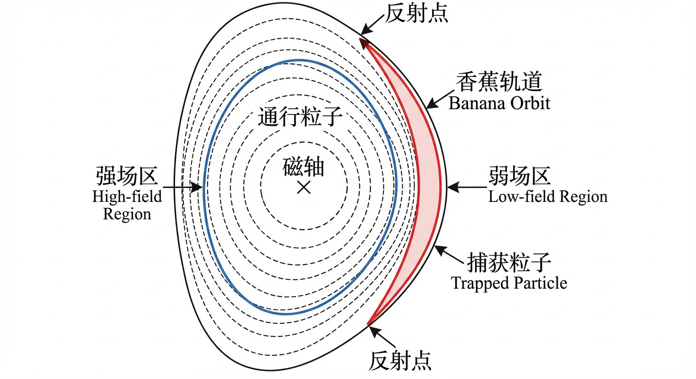
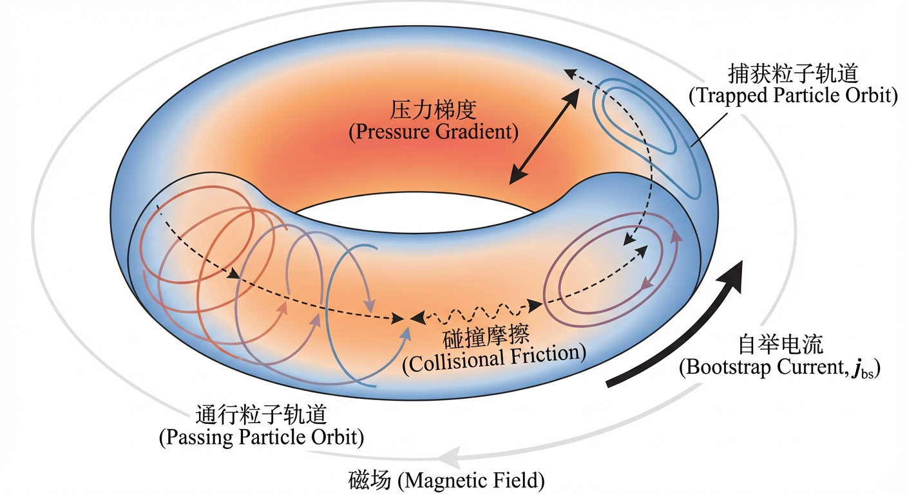
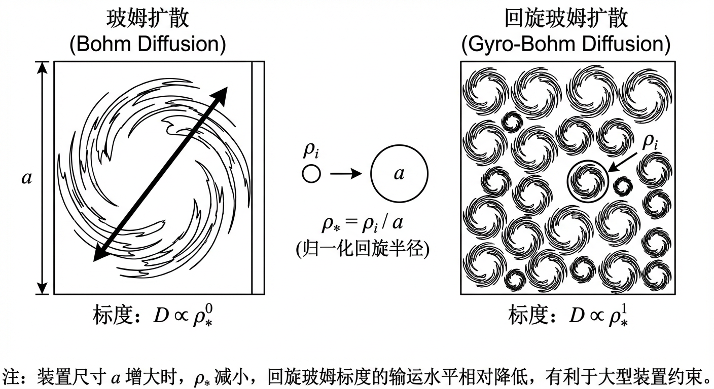
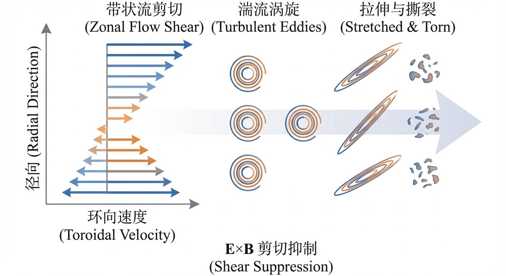
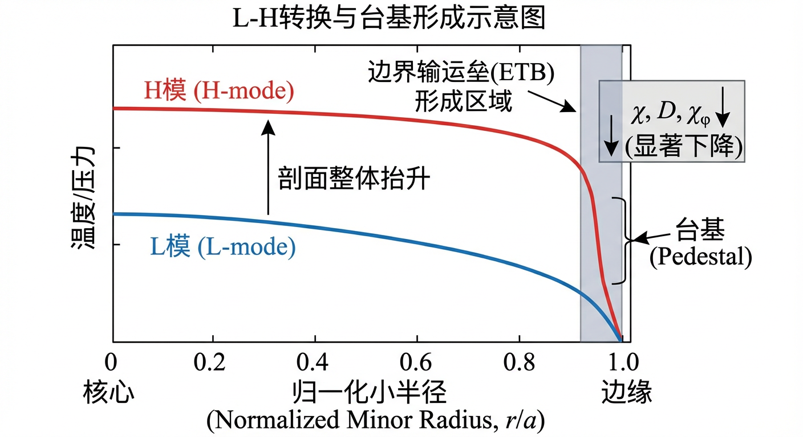
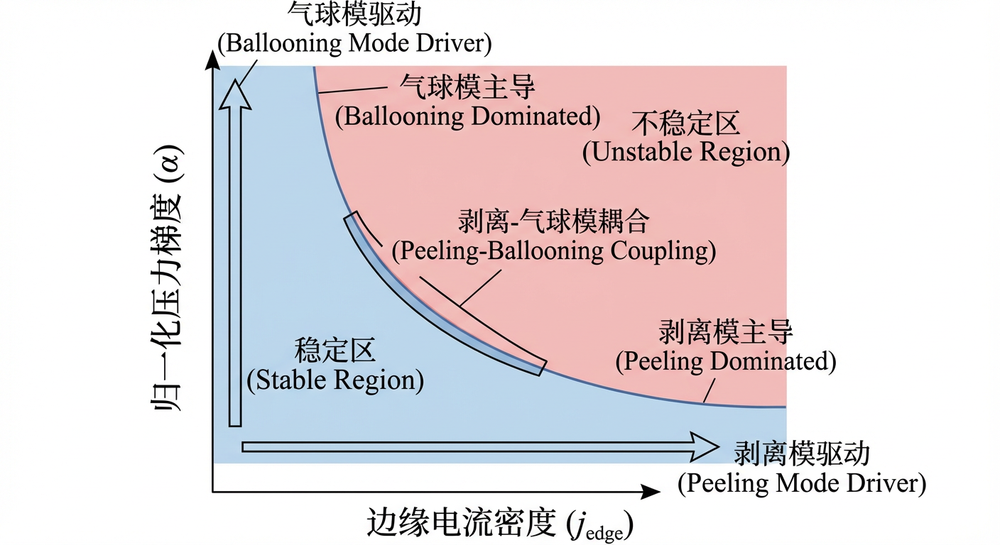
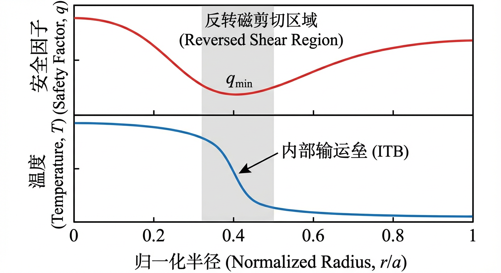

# 第6章 输运与约束的剖面自洽迭代

## 6.0 项目概述

在磁约束核聚变的研究中，理论不仅仅是理解现象的工具，更是设计下一代反应堆的指南针。本章我们将深入探讨等离子体中粒子与能量的输运机制，这是一个从微观粒子运动到宏观约束模式的跨尺度过程。为了让这些抽象的理论更具实感，我们将引入一个贯穿全章的实战项目——**“模拟托卡马克能量约束性能评估”**。

本项目的核心挑战是：**如何基于物理原理，预测一个特定托卡马克装置的能量约束时间，并评估其进入高性能运行模式（H模）的可行性？**

我们将通过三个阶段逐步完成这个挑战，每个阶段对应本章的一个子章节：
1.  **基础评估**：利用新经典理论，估算在特定磁场几何下的粒子碰撞行为，判断离子轨道是否处于理想的“香蕉区”。
2.  **修正与对比**：引入反常输运的视角，对比玻姆与回旋玻姆标度律，理解为什么现代装置的约束性能远低于经典预测，并以此修正我们的预测模型。
3.  **模式跃迁计算**：结合L-H转换理论，计算在给定加热功率下，装置能否冲破功率阈值，建立边界输运垒，从而实现约束性能的倍增。

通过这个项目，你将亲手操作聚变科学家日常使用的估算工具，从零开始构建一个托卡马克性能评估报告。这不仅是对知识的检验，更是未来参与反应堆设计的预演。

---

## 6.1 经典与新经典输运骨架

在探索可控核聚变的漫长征途中，我们始终面临一个核心悖论：一方面，我们需要将等离子体加热至前所未有的亿度高温以点燃聚变之火；另一方面，这团炽热的物质却像一个急于挣脱束缚的精灵，无时无刻不在试图通过各种途径泄漏其宝贵的能量与粒子。这种泄漏，我们称之为“输运”（transport）。在之前的章节中，我们已经建立了描述等离子体宏观平衡与稳定性的理论框架，但一个静态、稳定的平衡态能否持久，最终取决于我们能否有效抑制输运。因此，理解并量化输运过程，构成了从理论蓝图迈向工程现实的关键一步。

本节的任务，便是构建我们理解输运现象的第一个，也是最基础的理论框架——**经典与新经典输运骨架**。这个“骨架”描述的是由等离子体内部粒子间不可避免的库仑碰撞所驱动的、最本源的输运过程。即便在一个理想的、没有任何湍流的等离子体中，这个由碰撞主导的输运也依然存在，它为我们评估聚变装置的约束性能设定了一个不可逾越的“地板”。我们将从一个最简化的物理图像——**经典输运理论（classical transport theory）**——出发，它假设磁场是均匀的直线。随后，我们将打破这一理想化假设，进入由环形几何主导的、更为真实也更为复杂的**新经典输运理论（neoclassical transport theory）**的世界。在这一过程中，你将看到，仅仅是磁场几何形状的改变，如何催生出诸如**捕获粒子（trapped particles）**、**香蕉轨道（banana orbits）**等全新的物理图像，并进而衍生出**自举电流（bootstrap current）**和**Ware箍缩（Ware pinch）**等深刻影响托卡马克运行的宏观效应。本节内容不仅是理解和量化输运的基石，也将为后续章节中探讨更为剧烈的反常输运和湍流现象提供必不可少的参照系和理论语言。

### 从直线到环：经典输运的理想与局限

让我们从一个最纯粹的思想实验开始。想象一个由带电粒子构成的等离子体，被置于一个完美的、无限长且均匀的直线磁场 $\boldsymbol{B}$ 中。根据单粒子运动理论，每个粒子都会围绕着一条磁力线做快速的回旋运动，同时沿着磁力线自由前进，其轨迹是一条优美的螺旋线。如果没有粒子间的相互作用，每个粒子将被永恒地束缚在它最初的磁力线上，约束将是完美的。

然而，等离子体是一个拥挤的粒子集合。粒子间持续不断的库仑碰撞，如同微观世界里永不停歇的“交通意外”，成为了完美约束的破坏者。每一次碰撞，都像一次随机的推挤，使得粒子的回旋中心从一条磁力线“跳跃”到邻近的另一条上。单次跳跃的步长，正是粒子的拉莫尔半径（Larmor radius） $\rho$。尽管这一步本身微不足道，但无数次随机方向的跳跃累积起来，就构成了一场横越磁场的“随机行走”（random walk）。随着时间的推移，粒子会逐渐从等离子体的高密度、高温度核心区域“漫步”到边缘。这个由碰撞驱动的、跨越磁力线的缓慢扩散过程，正是**经典输运**的核心思想。

由此，我们可以估算出经典的粒子扩散系数 $D_{\mathrm{cl}}$。它正比于碰撞频率 $\nu$（行走的频率）和拉莫尔半径的平方（步长的平方），即 $D_{\mathrm{cl}} \sim \nu \rho^2$。类似地，热扩散系数 $\chi_{\mathrm{cl}}$ 也遵循相同的标度律。这个简单的关系式揭示了经典输运的一个关键特征：由于 $\rho \propto B^{-1}$，输运系数与磁场强度的平方成反比（$D_{\mathrm{cl}} \propto B^{-2}$），这意味着增强磁场可以极大地改善约束。

然而，经典理论的优雅简洁是建立在一个关键假设之上的：磁场是均匀的。真实的聚变装置，如托卡马克（tokamak），为了解决粒子沿开放磁力线逃逸的问题，必须将磁场弯曲成环形。这个几何上的改变，看似简单，却从根本上颠覆了物理图像，催生了全新的输运机制。在环形几何中，磁场强度在环的内侧更强、外侧更弱，近似满足 $B \propto 1/R$。这种沿磁力线的磁场变化，使得平行于磁场的磁镜力
$$
F_\parallel = -\mu \nabla_\parallel B
$$
不再为零，其中 $\mu$ 是粒子的磁矩。正是这个在经典理论中被忽略的磁镜力，开启了新经典物理的大门。

### 环形几何的新物理：捕获粒子与香蕉轨道

在托卡马克的环形磁场中，当粒子沿着螺旋形的磁力线从磁场较弱的外侧向磁场较强的内侧运动时，磁镜力会像一个“上坡”的阻力，不断减小其平行速度。对于那些平行速度分量较小的粒子，它们甚至在到达磁场最强点之前，平行速度就会减为零，然后被“反射”回弱场区。这些无法完成完整环向运动、被束缚在环外侧弱场区域来回“弹跳”的粒子，被称为**捕获粒子（trapped particles）**。与之相对，那些具有足够大平行速度、能够克服磁镜势垒的粒子，则被称为**通行粒子（passing particles）**。这种粒子分类在经典理论中是完全不存在的，因为在均匀磁场中磁镜力为零。

捕获粒子的存在，是新经典理论与经典理论最根本的区别。一个捕获粒子在两个反射点之间来回“弹跳”的同时，其导向中心还会因为磁场的梯度和曲率而经历一个持续的、主要沿竖直方向（对托卡马克而言近似为“上下”方向）的漂移。这两种运动的结合，使得捕获粒子在托卡马克极向截面上的投影轨迹，描绘出一种形似香蕉的闭合曲线——这便是著名的**香蕉轨道（banana orbit）**。

这些香蕉轨道并非完美地贴合在单一的磁通量面上，而是具有一定的径向宽度，称为**香蕉宽度（banana width）** $\Delta_b$。通过分析粒子在漂移运动中的守恒量，可以推导出香蕉宽度的标度关系：
$$
\Delta_b \sim \frac{q}{\sqrt{\epsilon}} \rho
$$
其中，$\rho$ 是粒子的拉莫尔半径，$\epsilon=r/R$ 是反映环几何的逆环径比，而 $q$ 是安全因子。由于在托卡马克中通常有 $q>1$ 且 $\epsilon \ll 1$，香蕉宽度 $\Delta_b$ 远大于经典输运的步长——拉莫尔半径 $\rho$。

这一发现彻底改变了我们对碰撞输运的理解。现在，一次碰撞不再仅仅是让粒子的回旋中心跳跃一个微小的 $\rho$ 距离，而是可能将一个粒子从一条宽大的香蕉轨道“踢”到另一条，或者将一个捕获粒子“撞”成通行粒子。无论哪种情况，其导致的单次径向位移步长都与巨大的香蕉宽度 $\Delta_b$ 相当。这个由几何效应主导的、以香蕉宽度为步长的随机行走过程，导致了远比经典理论预测剧烈的径向输运。通过简单的标度分析，我们可以估算出在低碰撞率的“香蕉区”，新经典输运系数相对于经典值的增强因子：
$$
\frac{D_{\mathrm{neo}}}{D_{\mathrm{cl}}} \sim f_t \left( \frac{\Delta_b}{\rho} \right)^2 \sim \sqrt{\epsilon} \left( \frac{q}{\sqrt{\epsilon}} \right)^2 = \frac{q^2}{\sqrt{\epsilon}}
$$
其中，$f_t \sim \sqrt{\epsilon}$ 是捕获粒子的份额。对于一个典型的托卡马克核心区域（例如，取 $q=1.7$，$R=1.7\,\mathrm{m}$，$r=0.30\,\mathrm{m}$，则 $\epsilon \approx 0.176$），这个增强因子约为 $1.7^2/\sqrt{0.176} \approx 6.88$。这意味着，仅仅因为几何形状从直线变为环形，由碰撞引起的输运就被放大了近 7 倍。在某些情况下，这个增强因子甚至可以达到 50–100。这雄辩地证明了，在磁约束聚变中，几何形状会深刻影响输运水平。

除了香蕉轨道，粒子轨道还存在其他有趣的类别。当高能粒子的香蕉宽度增长到与等离子体小半径相当时，其轨道不再是闭合的香蕉形，而是会与磁轴相交，形成更宽的**土豆轨道（potato orbit）**。而在捕获与通行粒子之间的相空间边界上，还存在着**停滞轨道（stagnation orbit）**，这些粒子在磁场极值点附近运动极其缓慢，对碰撞和微小扰动极为敏感。

### 新经典输运的碰撞率分区

新经典输运的物理图像强烈地依赖于**碰撞率**。为了描述碰撞在输运中的角色，我们定义一个关键的无量纲参数——**归一化碰撞率（normalized collisionality）** $\nu^*$，它代表了粒子的有效碰撞频率与其在环形轨道上运动的特征频率（如捕获粒子的反弹频率 $\omega_b$ 或通行粒子的渡越频率 $\omega_t$）之比。根据 $\nu^*$ 的大小，新经典输运可以被划分为三个截然不同的物理区域：

1.  **香蕉区（banana regime, $\nu^* \ll 1$）**：这是高温、低密度等离子体核心的典型状态。在此区域，碰撞频率远低于粒子的轨道频率，捕获粒子可以在被碰撞散射之前完成许多次完整的香蕉轨道运动。输运的物理图像正是我们前面讨论的、以香蕉宽度为步长的随机行走。一个与直觉相悖但至关重要的结论是，在该区域，输运系数正比于碰撞频率（$D \propto \nu$）。这是因为虽然每次碰撞的概率降低了，但输运的发生仍需要碰撞在相空间中不断散射粒子，使其跨越轨道族并产生净径向位移。

2.  **皮尔施–施吕特区（Pfirsch–Schlüter regime, $\nu^* \gg 1$）**：这是在等离子体边缘等较冷、较密区域的常见状态。在此区域，碰撞极其频繁，粒子的平均自由程远小于磁力线的连接长度。粒子在完成一次完整的轨道运动之前就会经历多次碰撞，因此离散的香蕉轨道图像不再适用。此时，等离子体表现出更强的流体性质。由磁场梯度和曲率引起的漂移会产生极向的电荷分离，为了维持等离子体的准中性并满足总电流散度为零（$\nabla \cdot \mathbf{J} = 0$），必须自发地产生一股沿磁力线方向的补偿电流，即**皮尔施–施吕特电流**。这股平行电流流经有电阻的等离子体时，会因摩擦和焦耳热而导致额外的径向粒子和热量损失。在该区域，输运系数同样正比于碰撞频率（$D \propto \nu$），其几何增强通常用与安全因子相关的量级因子来表征（在简化模型中常出现 $\sim 1+2q^2$ 的量级估计）。

3.  **平台区（plateau regime, $\nu^* \sim 1$）**：这是连接上述两个极限区域的过渡地带。在此区域，碰撞频率与粒子的轨道频率相当。其结果是输运系数在一段范围内对碰撞频率的依赖变弱，常近似为几乎与碰撞频率无关（$D \propto \nu^0$）。因此，当我们绘制输运系数随碰撞率变化的曲线时，它在香蕉区和皮尔施–施吕特区随 $\nu$ 上升，而在中间的平台区呈现近似平坦的“平台”。

由于电子和离子的质量与速度差异巨大，它们的碰撞率和轨道频率也大相径庭。因此，在等离子体的同一径向位置，电子和离子完全可能处于不同的输运区域，这为输运分析带来了额外的复杂性。

### 新经典理论的自洽性：内禀流与电流

新经典理论不仅描述了由热力学梯度驱动的径向输运，还揭示了等离子体中一系列由几何效应和碰撞诱导的、自发产生的内禀流动与电流。这些现象对于理解托卡马克的宏观平衡、稳定性与电流剖面控制至关重要。

#### 输运矩阵与径向电场

为了更严谨地描述输运过程，我们通常将径向的粒子通量 $\Gamma_s$ 和热通量 $Q_s$ 表示为热力学驱动力（如密度梯度 $\nabla n_s$、温度梯度 $\nabla T_s$）以及径向电场 $E_r$ 等的函数。在近似的线性响应框架下，可写成输运矩阵形式（此处仅示意最常用的梯度驱动部分）：
$$
\begin{pmatrix}
\Gamma_s \\
Q_s / T_s
\end{pmatrix}
=
-
\begin{pmatrix}
L_{11} & L_{12} \\
L_{21} & L_{22}
\end{pmatrix}
\begin{pmatrix}
\nabla n_s / n_s \\
\nabla T_s / T_s
\end{pmatrix}
+\dots
$$
其中，对角项 $L_{11}$ 和 $L_{22}$ 分别代表由自身梯度驱动的粒子扩散和热传导；非对角项 $L_{12}$ 和 $L_{21}$ 则描述交叉输运效应：$L_{12}$ 代表由温度梯度驱动的粒子通量（热扩散），$L_{21}$ 代表由密度梯度驱动的热通量（杜福尔效应）。在适当选择热力学力与通量的配对定义后，源于微观可逆性的**昂萨格倒易关系（Onsager reciprocal relations）**要求输运矩阵满足对称性条件（常写为 $L_{12}=L_{21}$）。这一对称性是新经典理论的重要约束，也为理解交叉输运与宏观电流形成提供了统一的框架。

此外，由于离子和电子的质量与电荷不同，它们各自的本征输运速率也不同。为了维持等离子体的宏观电中性，避免电荷的持续积累，系统必须满足**双极性（ambipolarity）**条件，即总的径向电荷通量为零：
$$
\sum_s e_s \Gamma_s = 0 .
$$
在轴对称的托卡马克中，由于环向正则动量守恒等对称性约束，新经典理论在最低阶近似下往往呈现“内禀双极性”的性质：离子与电子的径向通量在主要阶次上倾向于相互匹配，使得 $E_r$ 的决定通常需要更高阶的新经典效应、边界条件以及与湍流和外部动量注入等过程的共同作用来闭合。这个自洽决定的 $E_r$ 会引入 $\mathbf{E}\times\mathbf{B}$ 漂移（体现为等离子体旋转），反过来又会影响粒子轨道与输运过程。

#### Ware箍缩与自举电流

新经典理论预测了两种重要的、与电流剖面直接相关的内禀流动。

其一是**Ware箍缩（Ware pinch）**。在由外部变压器感应的环向电场 $E_\phi$ 作用下，捕获粒子为了维持其环向正则动量的守恒，会经历一个净的、指向等离子体中心的径向漂移。这个内向的粒子对流速度大小为
$$
v_W = -\frac{E_\phi}{B_\theta},
$$
它有助于在欧姆加热的放电中形成中心密度尖峰。

其二是更为关键的**自举电流（bootstrap current）**。在存在径向压力梯度的等离子体中，捕获粒子与通行粒子之间的碰撞摩擦会驱动一股净的、平行于磁场的电流。这股电流由等离子体自身的压力梯度“自举”产生，无需外部电场驱动。其电流密度 $j_{\mathrm{bs}}$ 在标度上与压力梯度成正比，并依赖于碰撞率（在香蕉区通常最强）。自举电流的存在，为实现**稳态托卡马克（steady-state tokamak）**——即无需外部感应电场、可连续运行的聚变反应堆——提供了物理上的可能性。通过优化等离子体剖面以提高自举电流份额，可以降低对外部电流驱动系统的功率需求。然而，这股在等离子体剖面特定位置产生的电流也会改变安全因子 $q$ 的分布，进而影响MHD稳定性，这为等离子体控制带来了新的挑战与机遇。

### 小结

本节的旅程带领我们从经典输运的简单世界，步入了由环形几何塑造的、充满精妙物理的新经典王国。我们揭示了，仅仅是将磁场从直线弯曲成环，就催生了捕获粒子这一全新的粒子布居。这些粒子的特殊轨道行为，特别是其远大于拉莫尔半径的香蕉轨道，从根本上改变了碰撞输运的物理图像，导致了远超经典预测的输运水平。

我们进一步看到，新经典输运并非一成不变，而是根据等离子体的碰撞率，展现出香蕉区、平台区和皮尔施–施吕特区这三种截然不同的行为模式。更重要的是，新经典理论不仅描述了径向的“泄漏”，还预测了等离子体内部由几何与碰撞效应自发产生的内禀流动与电流。其中，Ware箍缩解释了粒子向心汇聚的现象，而自举电流则为实现稳态聚变反应堆提供了关键的物理基础。

> **实战项目应用 I：香蕉区有效性验证**  
> 在着手建立任何输运模型之前，我们必须确认等离子体所处的物理区域。新经典理论预测，在高温低碰撞率下，离子应处于“香蕉区”，此时捕获粒子的轨道效应最为显著。  
>
> 假设一个大型托卡马克装置（参数接近JET或ITER的缩尺版本），其参数如下：  
> *   大半径 $R = 3\,\mathrm{m}$  
> *   小半径 $a = 0.3\,\mathrm{m}$（逆环径比 $\epsilon = a/R = 0.1$）  
> *   环向磁场 $B_\phi = 5\,\mathrm{T}$  
> *   安全因子 $q = 3$  
> *   氘离子温度 $T_i = 10\,\mathrm{keV}$  
> *   离子密度 $n_i = 10^{20}\,\mathrm{m^{-3}}$  
>
> **核心任务**：基于第一性原理，利用上述参数计算三个关键频率：离子回旋频率 $\Omega_i$、捕获离子反弹频率 $\omega_b$ 和离子-离子碰撞频率 $\nu_{ii}$。通过比较这三者的大小关系（排序），验证该装置中的香蕉轨道在碰撞存在的情况下是否依然保持良好的磁化和轨道特征。请选择最符合物理图像的频率排序关系，并给出数量级估算以支持你的结论。这步工作决定了我们能否使用低碰撞率的“香蕉”输运公式来描述该装置的核心区域。

至此，我们已经构建了理解磁约束等离子体中由碰撞驱动的、不可避免的输运的“骨架”。这个骨架为我们提供了一个基准，一个理论“地板”。然而，正如我们将在下一节（6.2 反常输运与湍流工程后果）中看到的，真实聚变等离子体中的输运往往远高于这个新经典“地板”，其主因是更为剧烈的微观湍流。因此，本节所建立的新经典输运骨架，不仅是自身完备的理论体系，更是我们即将深入探索的湍流世界中必不可少的参照物和导航图。

---

## 6.2 反常输运与湍流工程后果

在上一节中，我们构建了基于粒子碰撞和环形轨道几何的经典与新经典输运理论框架，并确认了在高温托卡马克核心区，如果仅考虑库仑碰撞，离子应处于低碰撞率的“香蕉区”。这套理论逻辑自洽，为理解磁约束等离子体中粒子和能量的基本泄漏机制提供了坚实的“骨架”。然而，自20世纪60年代以来，一个困扰了聚变物理学家数十年的难题愈发清晰：几乎所有磁约束实验中观测到的能量和粒子损失，都远超新经典理论的预测，有时甚至高出数个数量级。这种远远超出理论预期的输运现象，被冠以一个恰如其分的名字——**反常输运（anomalous transport）**。

这一理论与实验的巨大鸿沟，迫使我们不得不正视一个深刻的现实：除了粒子间的二体碰撞，等离子体中还存在着更为强大、更具破坏性的集体行为。本节的核心任务，正是要揭开反常输运的根源——**等离子体湍流（plasma turbulence）**。我们将看到，等离子体并非一个宁静的“热汤”，而是一片波涛汹涌、充满各种尺度涡旋的混沌之海。我们将从描述湍流输运的两种基本标度律出发，剖析驱动这片海洋汹涌的各种微观不稳定性，并最终揭示等离子体如何通过自组织行为，实现对湍流的自我调控。理解这一复杂的湍流生态系统，不仅是解释反常输运的关键，更是我们设计和建造未来聚变反应堆、最终实现高性能约束的工程基石。

### 输运标度之争：从Bohm到Gyro-Bohm

历史地看，对反常输运的第一次定量描述源于物理学家戴维·玻姆（David Bohm）提出的经验公式。在早期放电等离子体实验中，人们发现粒子约束随磁场增强而改善的程度显著弱于经典碰撞理论所预言的 $D \propto B^{-2}$。为解释这种观测，人们提出了一个常用的经验扩散系数形式，即**玻姆扩散（Bohm diffusion）**：
$$
D_{\mathrm{B}} \sim \frac{1}{16}\frac{k_B T}{eB}.
$$
这个公式的物理图像常被理解为一种“最坏情况”下的湍流输运：它对应的扩散强度只随 $B^{-1}$ 衰减，远强于经典预测。如果聚变反应堆的输运长期遵循玻姆标度，那么建造一个经济可行的反应堆将变得异常困难。

幸运的是，随着理论与实验的深入，物理学家们发现，在现代高温托卡马克的核心区域，湍流的性质更为“温和”。其主导机制并非宏观的磁流体不稳定性，而是由等离子体自身剖面梯度驱动的**微观不稳定性（micro-instabilities）**。这些不稳定性的特征尺度，不再是装置的宏观尺寸，而是由等离子体自身的微观物理参数决定的——最核心的就是离子的**回旋半径（gyroradius）** $\rho_i$。

这一认识催生了**回旋玻姆（gyro-Bohm）标度**。其物理图像是，湍流涡旋的特征尺度与离子回旋半径相当，即 $k_{\perp}\rho_i \sim 1$。基于此，通过混合长度理论可以得到一种常用的输运系数标度：
$$
D_{\mathrm{gB}} \sim \frac{v_{thi}\rho_i^2}{L} \propto \frac{T^{3/2}}{B^2 L},
$$
其中 $v_{thi}=\sqrt{2T_i/m_i}$ 为离子热速度，$L$ 是背景梯度的特征长度。为了更清晰地揭示这两种标度律的本质区别，我们可以引入一个至关重要的无量纲参数——**归一化回旋半径** $\rho_*=\rho_i/a$（其中 $a$ 是装置小半径）。利用这个参数，可以将扩散系数的典型量纲写作 $D\sim (T/B)\times(\text{无量纲因子})$，从而突出不同标度对装置尺寸的依赖：
- **玻姆扩散**：$D_{\mathrm{B}} \propto \dfrac{T}{B}\cdot(\rho_*)^0$
- **回旋玻姆扩散**：$D_{\mathrm{gB}} \propto \dfrac{T}{B}\cdot\rho_*^1$

玻姆扩散（指数为0）意味着输运水平与装置的相对大小无关，这是一种“悲观”的标度；回旋玻姆扩散（指数为1）则预示着，当装置尺寸 $a$ 增大时，$\rho_*$ 会减小，归一化的输运水平随之降低。这正是建造大型托卡马克（如ITER）能够在相似等离子体条件下获得更好约束的重要理论依据之一。大量实验与回旋动力学模拟表明，现代托卡马克核心区的主导湍流输运常呈现接近回旋玻姆的尺寸与磁场定标。

值得注意的是，这两种标度并非绝对对立。在等离子体中，不同的区域可能遵循着不同的物理规律。例如，在温度较低、碰撞更频繁的等离子体边缘，湍流的性质可能发生改变，使得输运表现出更接近玻姆标度的特征。因此，真实的等离子体输运更像是一幅由不同标度律共同“绘制”的拼图，理解从回旋玻姆区到玻姆区的过渡，是理解和控制全局约束性能的关键。

### 微观湍流的“动物园”：漂移波不稳定性

既然我们知道反常输运的根源是微观湍流，那么这些湍流究竟是什么？在磁约束等离子体中，最普遍、最重要的微观不稳定性是一类被称为**漂移波（drift waves）**的波动。它们由等离子体中固有的密度和温度梯度驱动，并通过波-粒子相互作用，将梯度中储存的自由能释放出来，转化为导致输运的涨落。根据驱动源和参与的粒子种类的不同，这个“动物园”里有几个最主要的成员。

#### 离子温度梯度模（Ion Temperature Gradient mode, ITG）

**离子温度梯度模（ITG）**是聚变等离子体中研究最深入、也通常被认为是最主要的离子热输运通道之一。其核心驱动力来自于陡峭的离子温度梯度。当归一化的离子温度梯度参数
$$
\eta_i = \frac{L_n}{L_{T_i}},\qquad L_n^{-1}=-\frac{d\ln n}{dr},\quad L_{T_i}^{-1}=-\frac{d\ln T_i}{dr}
$$
超过临界阈值时，ITG模就可能被激发。

其物理机制与环形几何的“坏曲率”效应密切相关。在托卡马克环的外侧，离子的磁漂移（由梯度-$B$ 和曲率引起）与由压力梯度导致的效应相互作用，使得扰动可以从背景梯度中提取能量并增长。这种不稳定性通过离子的非绝热响应，在密度涨落与电势涨落之间产生相位差，从而产生净的径向热通量。一个显著的特征是，ITG湍流通常以离子热输运为主，对粒子输运的相对贡献可能较小，但具体份额取决于参数与非线性饱和态。

#### 电子温度梯度模（Electron Temperature Gradient mode, ETG）

**电子温度梯度模（ETG）**可视为ITG模在电子尺度上的对应物。它由电子温度梯度 $\nabla T_e$ 驱动，其特征尺度与电子回旋半径 $\rho_e$ 相当（$k_\perp \rho_e \sim 1$）。在ETG模的时空尺度上，离子由于惯性大，对快速涨落的响应较弱，常近似为背景，而电子则表现出完整的动理学行为。

由于其尺度小得多，简单的标度分析常给出ETG驱动的有效热输运在某些情况下小于离子尺度湍流，但其贡献并不必然可忽略：在离子尺度湍流被有效抑制的区域（例如强 $\mathbf{E}\times\mathbf{B}$ 剪切区），ETG可能成为主导的电子热损失通道。并且，ETG湍流可形成径向拉长的“飘带（streamers）”结构，从而使实际输运强度偏离最简单的混合长度估计。

#### 捕获电子模（Trapped Electron Mode, TEM）

在环形几何中，由于磁镜效应，一部分平行速度较小的电子会被“捕获”在磁场较弱的外侧区域，无法沿磁力线自由运动。这些**捕获电子（trapped electrons）**的动力学行为与可以自由穿行的**通行电子（passing electrons）**截然不同。通行电子往往能较快响应电势涨落并近似满足玻尔兹曼响应，而捕获电子则会呈现更强的非绝热行为。

**捕获电子模（TEM）**正是利用了捕获电子的非绝热响应。其驱动机制来自于漂移波频率与捕获电子的进动漂移频率（由磁场梯度和曲率引起）之间的相互作用。该机制使扰动能够从背景的密度梯度或电子温度梯度中提取能量，驱动不稳定性增长。TEM常处于离子尺度范围（$k_\perp \rho_i \sim 1$），并且常与ITG模在参数空间中竞争或共存，共同决定粒子与电子热量的输运水平。

#### 微撕裂不稳定性（Microtearing Mode, MTM）

与前述主要为静电性的漂移波不同，**微撕裂不稳定性（MTM）**是一种电磁不稳定性。尽管它也常由电子温度梯度驱动，但其物理机制不同。MTM能够扰动磁场，产生小幅的径向磁场涨落分量，使得有理磁面附近发生微尺度的**磁重联（magnetic reconnection）**，形成微小的**磁岛（magnetic islands）**。

当这些磁岛在一定条件下增长并发生重叠时，局域的磁力线可能出现一定程度的随机化。电子作为质量极轻的粒子，沿磁力线的热传导非常强，因此磁拓扑的扰动会导致显著的电子热输运增强。MTM相关输运通常以导热为主，其饱和机制与静电湍流不同，往往与电磁非线性、碰撞与剖面弛豫等因素耦合。

### 自我调节的湍流生态系统

线性理论告诉我们，一旦驱动梯度超过阈值，不稳定性就会指数增长。但这显然不会无限持续下去。等离子体湍流展现出一种自组织和自调节能力，其核心机制之一在于**带状流（zonal flows）**的产生与作用。

#### 带状流：湍流的捕食者

带状流是一种由湍流自身通过非线性相互作用（主要体现为**雷诺应力（Reynolds stress）**）自发产生的、轴对称的（通常指环向模数 $n=0$，并在局部近似中对应 $k_y=0$ 的低频）径向剪切流。它们不直接贡献平均径向输运，但却是湍流的强大“天敌”。一旦产生，带状流的径向剪切会强力地拉伸并破坏湍流涡旋结构，这一过程被称为**$\mathbf{E}\times\mathbf{B}$剪切抑制（$\mathbf{E}\times\mathbf{B}$ shear suppression）**。

一个常用的经验判据是，当 $\mathbf{E}\times\mathbf{B}$ 剪切率 $\gamma_E$ 超过湍流的线性增长率 $\gamma_{\mathrm{lin}}$ 时，湍流就会被有效抑制：
$$
\gamma_E \gtrsim \gamma_{\mathrm{lin}}.
$$
这构成了一个直观的**捕食者–猎物（predator–prey）**类比：背景梯度“喂养”湍流（猎物），湍流增长“催生”带状流（捕食者），带状流反过来抑制湍流。正是这个负反馈循环，使湍流强度在非线性饱和中受到限制，从而决定最终的输运量级。在环形几何中，除低频带状流外，还存在其振荡分支——**测地声模（Geodesic Acoustic Mode, GAM）**，它同样参与这一自调节过程。

#### 临界梯度模型与雪崩输运

湍流的自调节行为，引出了**临界梯度输运模型（critical gradient transport model）**的概念。该模型强调输运的“刚性（stiffness）”：当驱动梯度（如 $R/L_T$）低于某个临界值时，湍流较弱、输运较低；一旦梯度超过临界值，湍流输运会迅速增强，并倾向于将梯度限制在临界值附近。这意味着，额外加热功率在一定条件下更可能增强输运而非等比例提升中心温度。

更有趣的是，非线性模拟揭示了所谓的**迪米茨位移（Dimits shift）**现象。由于带状流的抑制作用可能非常高效，强湍流输运爆发的“非线性阈值”可显著高于线性理论预测的失稳阈值。在这个线性不稳定但非线性输运仍较低的区间内，等离子体表现出一定的“韧性”。

最后，输运并非总是局域的扩散过程。在某些条件下，局域湍流爆发可以触发在空间中传播的、尺度大于单个湍流涡旋的**输运雪崩（transport avalanche）**。这种现象揭示了输运的非局域性与间歇性，对于预测和避免聚变装置中的极端热与粒子负荷具有重要意义，也提醒我们输运的本质远比简单的Fick定律所描述的更为丰富。

### 小结

本节引领我们穿越了从经典/新经典输运理论的不足到现代湍流物理学的图景。我们看到，反常输运并非无法解释的现象，而是由等离子体内部梯度驱动的微观湍流在宏观上的体现。其工程后果是决定性的：约束性能的好坏，直接取决于湍流的类型及其输运标度律。从早期悲观的玻姆标度，到在许多核心区条件下更符合观测与模拟的回旋玻姆标度，这一认知飞跃是聚变科学走向工程设计的重要基础。

我们剖析了湍流“动物园”中的几个关键成员——ITG、ETG、TEM和MTM，它们各自占据不同尺度，由不同梯度驱动，通过不同机制（静电对流或电磁拓扑扰动）导致输运。更深刻的图像在于，这些不稳定性并非肆意增长：等离子体通过自发产生带状流建立负反馈，从而形成饱和态。$\mathbf{E}\times\mathbf{B}$剪切抑制、临界梯度行为以及Dimits位移等现象，都是这种自组织调控的体现。

> **实战项目应用 II：约束时间标度律修正**  
> 在上一步中，我们基于参数计算确认了等离子体理应处于“香蕉区”。然而，仅仅依赖经典/新经典理论会极大高估约束性能。为了更接近真实的工程设计，我们必须引入反常输运的视角。  
>
> **核心任务**：  
> 1.  利用扩散方程 $\partial f/\partial t = D \nabla^2 f$ 的量纲分析，推导能量约束时间 $\tau_E$ 与装置小半径 $a$ 及扩散系数 $D$ 的基本关系。  
> 2.  分别代入**玻姆扩散**（$D_{\mathrm{B}} \propto T/B$）和**回旋玻姆扩散**（$D_{\mathrm{gB}} \propto \rho_i^2 v_{th}/a$，其中 $\rho_i\propto \sqrt{m_i T}/B$）的标度关系，推导这两种机制下 $\tau_E$ 随 $B$、$T$、$a$ 及离子质量 $m_i$ 的变化规律。  
> 3.  **关键决策**：对于我们在6.1节中定义的现代大型强场装置，哪种标度律（玻姆 vs 回旋玻姆）能预测出更好的约束性能？这种差异对未来的反应堆设计（如增大尺寸 $a$ 或增强磁场 $B$）意味着什么？请根据推导结果进行对比分析。  

至此，我们已经从第6.1节的“输运骨架”（经典与新经典）进展到本节的“输运肌肉”（反常湍流）。我们理解了输运系数是如何产生的，以及湍流是如何被抑制的。这自然引出了下一个核心问题：在这些复杂的物理机制共同作用下，等离子体如何自发地组织成具有不同约束性能的宏观状态？我们能否通过工程手段，将等离子体引导并维持在输运被极大抑制的“优异约束”窗口？对这些问题的回答，将引导我们进入下一节——“约束模式与输运垒窗口”的探索。

---

## 6.3 约束模式与输运垒窗口

在前面章节中，我们已经深入探讨了等离子体中粒子与能量输运的两种基本形式：由粒子间碰撞驱动的、构成输运“骨架”的新经典输运，以及由微观不稳定性驱动的、通常占据主导地位的反常湍流输运。我们已经建立了描述这些输运过程的物理语言，从单个粒子的轨道动力学到集体性的漂移波湍流。然而，仅仅理解输运系数如何产生是不够的。在真实的聚变装置中，这些底层的输运机制会在加热、电流驱动以及复杂的边界条件共同作用下，展现出自组织行为，形成具有截然不同约束性能的宏观运行模式。

本节的教学视角将从“输运系数如何产生”转向“约束状态如何在剖面与边界条件的约束下自组织成运行窗口”。我们将不再仅仅视等离子体为被动泄漏的流体，而是将其看作一个能够通过非线性反馈自发跃迁到不同“态”的复杂系统。我们将首先从实验上最重要、也最具革命性的发现——高约束模式（high-confinement mode, H-mode）——入手，探讨其准入的物理门槛。随后，我们将深入剖析H模得以实现的核心结构——边界输运垒（edge transport barrier, ETB）与台基（pedestal）的物理，以及限制其性能并引发台基周期性弛豫的边缘局域模（edge localized modes, ELM）。最后，我们将视线从边界转向核心，介绍另一种性能优越的运行模式——内部输运垒（internal transport barrier, ITB），并以此为全节收束，为后续关于加热、电流驱动与集成建模的章节预留认知入口。

### H模的准入：L-H转换与功率阈值

在托卡马克运行中，最引人注目的自组织现象莫过于从低约束模式（low-confinement mode, L-mode）到高约束模式（H-mode）的转换。这一转换并非平滑渐变，而是一场发生在等离子体边缘的突发“相变”，它常将等离子体的整体能量约束性能提高到原来的约 $1.5$–$2$ 倍量级。然而，这场“边界的革命”并非无条件发生，它需要跨越一个由功率流定义的门槛——**L-H转换功率阈值（L-H transition power threshold, $P_{th}$）**。

从现象上看，L-H转换的核心是在分界面（separatrix）内侧的一个狭窄区域内，自发形成一个**边界输运垒（ETB）**。这个输运垒的本质是该区域内径向输运的急剧降低：有效热扩散系数 $\chi$、粒子扩散系数 $D$ 和动量扩散系数 $\chi_\phi$（或等效的动量扩散率）都显著下降，趋近于由碰撞决定的、显著更低的新经典量级。根据输运方程（例如热流密度）
$$
q_r = - n \chi \frac{\partial T}{\partial r},
$$
在输运系数 $\chi$ 急剧下降的垒区，为了传导由芯部加热决定的相同热流，等离子体必须建立起更陡峭的温度和密度梯度。这个在边缘形成的、具有陡峭压力梯度的结构，被称为**台基（pedestal）**。高台基通过剖面刚性将核心区的温度与压力剖面整体抬升，从而在输入功率不变时增加总储能 $W$ 并提高能量约束时间 $\tau_E$。

要触发这一转变，注入等离子体的功率必须足够高。物理上，直接驱动边缘转变的能量来源是净穿越分界面、流入刮削层（scrape-off layer, SOL）的功率，记为 $P_{\mathrm{sep}}$。功率阈值 $P_{th}$定义为L-H转换发生瞬间的 $P_{\mathrm{sep}}$ 值。对约束区等离子体进行能量平衡分析，可写出：
$$
P_{\mathrm{sep}} = P_{\mathrm{abs}} + P_{\alpha} - P_{\mathrm{rad,core}} - P_{\mathrm{loss,fast}} - \frac{dW}{dt}.
$$
这里，$P_{\mathrm{abs}}$ 是外部加热系统（如中性束注入 NBI 或射频 RF 加热）被等离子体吸收的功率；$P_{\alpha}$ 是聚变反应产生的阿尔法粒子加热功率；$P_{\mathrm{rad,core}}$ 是核心区体积辐射损失；$P_{\mathrm{loss,fast}}$ 是高能快粒子的轨道损失功率；而 $dW/dt$ 是总储能的时间变化率。这个方程提醒我们，L-H转换是一个动态过程：在功率扫描实验中，储能增加（$dW/dt>0$）会消耗一部分输入功率，从而降低实际流向边界的功率。精确确定 $P_{th}$ 需要对这些功率通道进行细致测量与核算，例如通过辐射计阵列对辐射功率进行空间分辨重建以区分核心与边界辐射。

那么，为何存在这样一个功率门槛？其背后的核心物理机制是**$\mathbf{E}\times\mathbf{B}$剪切流对湍流的抑制**。L模边缘充满由微观不稳定性驱动的湍流涡旋，它们是反常输运的重要来源。然而，当一个径向变化的 $\mathbf{E}\times\mathbf{B}$ 漂移流（剪切流）足够强时，它能够拉伸并破坏湍流涡旋的相干结构，从而抑制湍流增长。抑制发生的临界条件常表述为：
$$
\gamma_E \gtrsim \gamma_{\mathrm{lin}}.
$$
从微观上看，剪切流可使湍流涡旋的径向波数随时间增长，将能量转移到更高波数，进而被有限拉莫尔半径效应等耗散机制更有效地削弱。

这一关键剪切流的根源之一在于等离子体边缘的径向电场 $E_r$。根据离子径向力平衡方程，在忽略粘滞与惯性等项的简化图像下，可写为：
$$
E_r \approx \frac{1}{Z_i e n_i}\frac{dp_i}{dr} + v_{\phi i} B_\theta - v_{\theta i} B_\phi.
$$
其中第一项是源于离子压力梯度的抗磁项，后两项来自环向与极向流动在磁场中的洛伦兹力贡献。L-H转换常可被理解为：随注入功率增加，边缘压力梯度 $|dp_i/dr|$ 增大，从而增强 $E_r$ 及其剪切并抑制湍流；当剪切跨越临界条件时，输运垒形成并进入H模。典型量级上，若边缘 $E_r$ 在厘米量级的宽度上出现 $\sim 10$–$20\,\mathrm{kV/m}$ 的变化，则可产生 $\sim 10^4$–$10^5\,\mathrm{s^{-1}}$ 的剪切率，足以与典型湍流增长率量级相当，从而触发转变。

更有趣的是，L-H转换常表现为具有**正反馈**的**分岔（bifurcation）**现象。一旦初始剪切开始抑制湍流，输运降低会使压力梯度进一步变陡，而更陡的梯度又增强剪切，进一步抑制湍流。这个“剪切增强 → 输运降低 → 梯度增大 → 剪切更强”的循环，使系统迅速从高输运的L模跃迁到低输运的H模。这一非线性动力学常用“捕食者–猎物”模型类比，其中湍流是“猎物”，剪切流是“捕食者”。其直接后果之一是**迟滞（hysteresis）**：维持H模所需的功率往往小于触发它所需的功率，即从H模回到L模的阈值 $P_{HL}$ 通常低于 $P_{LH}$。这意味着在功率区间 $[P_{HL},P_{LH}]$ 内系统可能呈现双稳态，最终状态依赖历史路径。

### 边界输运垒与台基弛豫

一旦H模建立，其边缘台基结构并不能无限增高或变陡。台基的压力梯度和由其驱动的电流受到宏观稳定性规律的限制。当这些参数增长到一定极限时，会触发磁流体动力学（magnetohydrodynamics, MHD）不稳定性，导致台基的周期性崩塌，这种现象被称为**边缘局域模（ELM）**。理解台基稳定性边界与ELM弛豫机制，是实现高性能稳态运行的核心。

#### 台基的稳定性极限：剥离–气球模

台基的稳定性主要受到两类MHD不稳定性的制约，它们都源于台基区的陡峭梯度：

1.  **气球模（ballooning mode）**：由压力梯度驱动。在托卡马克外侧（低场侧）存在“坏曲率区”，高压等离子体倾向于向外“鼓包”以释放压强能。其驱动力可用归一化压力梯度参数表示，常写作
    $$
    \alpha \propto -\frac{q^2 R}{B^2}\frac{dp}{dr}.
    $$

2.  **剥离模（peeling mode）**：由边缘电流密度驱动。H模台基的陡峭压力梯度会通过新经典效应驱动显著的**自举电流（bootstrap current）**，在标度上有 $j_{\mathrm{bs}}\propto -dp/dr$。当边缘电流密度足够大时，会驱动类似外部扭曲模的MHD不稳定性，表现为电流层从等离子体边界“剥离”开来的趋势。

在真实台基中，压力梯度和边缘电流同时存在，两类不稳定性相互耦合，形成所谓的**剥离–气球模（peeling–ballooning mode）**。耦合效应可降低稳定边界，使系统在压力梯度与电流密度均未达到各自独立阈值时也可能失稳，从而在二维参数空间中形成复杂的稳定性边界。

#### ELM的循环与弛豫

ELM的周期性爆发可概括为围绕剥离–气球模稳定边界的循环演化：

1.  **ELM间歇期**：一次ELM后，输运垒重建，台基在持续加热与粒子补给下逐渐恢复，压力梯度与自举电流逐步增大，工作点向失稳边界移动。

2.  **ELM触发**：当工作点触及并越过剥离–气球模的稳定性边界时，不稳定性被触发并增长。

3.  **ELM崩塌**：不稳定性在接近阿尔芬时间尺度的快时间上进入非线性阶段，形成沿磁力线拉长的灯丝状结构，将粒子与能量从台基区向外快速排出，导致台基压力弛豫与崩塌。

4.  **恢复**：崩塌耗尽驱动不稳定的自由能，系统返回稳定区，输运垒重新建立，开启下一轮循环。

这种周期性弛豫过程有助于排出杂质，但大型I型ELM释放的瞬时热负荷可能对未来聚变堆（如ITER）的偏滤器靶板材料构成严峻挑战，甚至可能造成熔化或烧蚀。

#### ELM的控制：迈向稳态高性能

鉴于大型ELM的潜在危害，发展主动ELM控制技术是聚变研究重点。核心思想是避免台基积累过多能量，在触发破坏性大ELM之前，通过更温和方式释放能量或改变边缘稳定性。

一种有力技术是施加**共振磁扰动（resonant magnetic perturbations, RMPs）**。通过外部线圈在等离子体边界施加弱的非轴对称静态磁场扰动，可在特定有理磁面（$q=m/n$）附近产生磁岛链；当扰动增强并使相邻磁岛发生重叠时，根据 **Chirikov判据**，局域磁力线可能趋于随机化，从而为粒子与能量提供额外泄漏通道，使台基压力被“钳位”在低于触发大型ELM的临界值之下，从而实现ELM抑制或显著缓解。

然而，ELM控制并非没有代价。无论是RMP还是其他技术（如弹丸注入定步），其本质都是通过改变边缘输运与稳定性来换取台基的安全运行，可能引起不同程度的台基性能下降。更需关注的是，RMP引入的三维扰动可通过新经典环向粘滞（neoclassical toroidal viscosity, NTV）等机制对等离子体施加阻尼力矩，降低旋转速度。由于旋转与其剪切常有助于抑制核心湍流，过强的旋转刹车可能导致核心约束性能下降。因此，ELM控制的工程应用需要在抑制ELM、维持台基性能与保持良好核心约束之间进行优化与权衡，这也是集成建模与控制研究的重要前沿。

### 内部输运垒：核心区的约束革命

除了发生在等离子体边界的ETB，另一种高性能约束模式可以在核心区形成，即**内部输运垒（ITB）**。ITB表现为在等离子体内部某个径向位置（如 $r/a\lesssim 0.7$）形成的输运显著降低区域，如同在等离子体内部构建了一道“隔热层”。

ITB的形成同样依赖湍流抑制，其核心机制通常包括**$\mathbf{E}\times\mathbf{B}$剪切流**与**磁剪切位形**效应。与ETB不同，ITB的形成与维持更依赖对剖面的主动控制。

- **磁剪切优化**：ITB常与弱磁剪切或**反转磁剪切（reversed magnetic shear, RS）**位形相关。通过离轴电流驱动（如低杂波电流驱动）等手段，可构造非单调的安全因子 $q$ 剖面，在芯部形成极小值 $q_{\min}$。在 $q_{\min}$ 附近的弱或负磁剪切区域，湍流的径向相干结构更易被破坏，从而降低输运。实验与理论常表明ITB倾向于在 $q_{\min}$ 附近形成。

- **$\mathbf{E}\times\mathbf{B}$剪切驱动**：通过离轴加热（如离子回旋共振加热 ICRH）或动量注入（如NBI），可在局部产生强温度梯度或旋转，从而通过径向力平衡形成强剪切的 $E_r$ 结构以抑制湍流。

这两种机制常协同作用：有利磁剪切位形为ITB萌发提供“温床”，而加热与动量注入通过增强 $\mathbf{E}\times\mathbf{B}$ 剪切来“点燃”并维持ITB。更进一步，ITB本身也可表现出正反馈：ITB导致的压力梯度增强会驱动局域化自举电流，进而改变电流与 $q$ 剖面并影响磁剪切，从而巩固ITB。这种自举电流–磁剪切–输运垒的耦合反馈，是理解ITB形成位置与演化的重要线索。

ITB的出现，为实现所谓的**先进托卡马克（advanced tokamak, AT）**运行模式铺平道路。AT模式旨在同时获得高约束、高比压（$\beta$）与高自举电流份额，是实现稳态、经济聚变堆的理想蓝图。一个具有“温和”ITB并配合稳定边界台基的集成运行方案展现了潜力：ITB提升核心聚变性能并增加自举电流份额，从而降低外部电流驱动需求；而边界控制用于处理功率排出问题。例如，通过在边界引入杂质形成高辐射的“辐射偏滤器”，可将较大部分功率以辐射形式分散，从而在维持高聚变功率与高自举电流份额（如 $\gtrsim 80\%$）的同时，将偏滤器热负荷控制在可承受范围内。这种芯部与边界协同优化的集成思路，体现了将基础物理转化为反应堆可行方案的关键路径。

### 小结

本节内容引导我们从对输运机制的微观理解，迈向对等离子体宏观约束状态的系统认知。我们看到，无论是发生在边界的H模，还是发生在核心的ITB，其本质都是等离子体在特定条件下通过抑制湍流而达成的自组织状态。其物理统一性在于**剪切效应**（$\mathbf{E}\times\mathbf{B}$ 流剪切与磁剪切）对湍流的抑制作用。

L-H转换功率阈值将宏观功率平衡与微观湍流物理联系起来，揭示H模准入是一个由功率流驱动、跨越临界条件的非线性分岔过程。边界台基物理则是在输运（决定台基如何建立）与MHD稳定性（决定台基何时崩塌）之间寻求动态平衡的舞台。由台基弛豫引发的ELM现象不仅是理解MHD稳定性的范例，也将视野延伸到等离子体–材料相互作用与反应堆工程的严峻挑战。

最后，内部输运垒将“局域输运抑制”从边界推广至核心，并将其形成与控制需求指向外部执行器（加热、电流驱动与动量输入等）。ITB与高自举电流份额的关联性，为实现稳态、经济的聚变反应堆描绘了重要蓝图。

> **实战项目应用 III：H模约束改善倍增计算**  
> 项目的最后一步，我们将验证通过L-H转换建立台基，对能量约束的实际改善效果。  
>
> 假设我们的装置在L模状态下，热扩散系数 $\chi_L$ 在全半径内均匀分布。当注入功率超过阈值触发H模后，边缘形成了一个宽度为 $\Delta$ 的输运垒（台基区），该区域的热扩散系数 $\chi_{\mathrm{ped}}$ 显著降低，而核心区 $\chi_{\mathrm{core}}$ 保持不变。  
>
> **核心任务**：  
> 1.  基于稳态能量守恒方程（忽略对流，仅考虑扩散）和圆柱近似几何，推导径向温度分布 $T(r)$。  
> 2.  利用以下参数计算并对比L模与H模下的能量约束时间 $\tau_E$：  
>     *   $\chi_L = 1.0\,\mathrm{m^2/s}$  
>     *   $\chi_{\mathrm{core}} = 1.0\,\mathrm{m^2/s}$  
>     *   $\chi_{\mathrm{ped}} = 0.20\,\mathrm{m^2/s}$（输运显著降低）  
>     *   $\Delta = 0.08\,\mathrm{m}$（台基宽度）  
>     *   其他几何参数同6.1节项目设定（$R=3.0\,\mathrm{m},\,a=1.0\,\mathrm{m}$），边界温度 $T_{\mathrm{edge}}=150\,\mathrm{eV}$。  
> 3.  **最终成果**：计算改善因子 $F=\tau_E^{(H)}/\tau_E^{(L)}$。量化说明仅仅这 $8\,\mathrm{cm}$ 厚的“隔热层”（不到小半径的10%），是如何实现约束性能显著提升的，并据此解释为什么H模是ITER等未来反应堆的首选运行模式之一。  

总而言之，约束模式与输运垒窗口的物理，是连接微观输运、宏观稳定性与工程应用的枢纽。它展现了磁约束等离子体作为一个复杂系统，如何通过内在的非线性反馈与自组织，在有序与混沌之间达到精妙的平衡，从而为获取聚变能开辟道路。

---

## 总结

本章通过理论讲解与实战项目相结合的方式，构建了对可控核聚变中输运与约束的完整认知。回顾我们的**“模拟托卡马克能量约束性能评估”**项目，我们经历了以下三个关键步骤的推演：

### 项目问题解析

**1. 针对“实战项目应用 I：香蕉区有效性验证”的解析**
*   **物理推导**：要使香蕉轨道（捕获粒子）在存在碰撞的情况下依然保持良好的磁化和轨道特征，必须满足两个条件：  
    1.  **磁化条件**：粒子回旋频率 $\Omega_i$ 必须远大于任何其他相关频率，确保导向中心近似成立，即 $\Omega_i \gg \omega_b$ 且 $\Omega_i \gg \nu_{ii}$。  
    2.  **低碰撞率（香蕉区）条件**：粒子在被碰撞散射出捕获区之前，应能完成多次反弹（bounce）运动，即 $\nu_{ii} \ll \omega_b$。  
    综上，正确的频率排序应为：**$\nu_{ii} \ll \omega_b \ll \Omega_i$**。  
*   **数值验证**：代入项目参数（$T_i=10\,\mathrm{keV}$，$B_\phi=5\,\mathrm{T}$，$n_i=10^{20}\,\mathrm{m^{-3}}$，$R=3\,\mathrm{m}$，$\epsilon=0.1$）：  
    *   回旋频率
        $$
        \Omega_i=\frac{eB_\phi}{m_i}\approx 2.4\times 10^8\,\mathrm{s^{-1}}.
        $$
    *   反弹频率（量级估算）
        $$
        \omega_b \sim \frac{v_{thi}\sqrt{\epsilon}}{qR}
        \approx 3.4\times 10^4\,\mathrm{s^{-1}}.
        $$
    *   碰撞频率（量级估算；取典型库仑对数 $\ln\Lambda$ 的数量级并采用常用近似公式）
        $$
        \nu_{ii}\sim 10^2\,\mathrm{s^{-1}}
        $$
        的量级是合理的估计。  
    *   结果显示 $\nu_{ii} \ll \omega_b \ll \Omega_i$，符合预期排序。  
*   **结论**：该装置核心区处于**香蕉区**，新经典理论中的香蕉轨道效应与自举电流机制在量级上是适用的基准描述。

**2. 针对“实战项目应用 II：约束时间标度律修正”的解析**
*   **量纲分析**：由扩散方程 $\partial f/\partial t = D\nabla^2 f$ 可知特征时间 $\tau \sim L^2/D$。对装置小半径 $a$，能量约束时间量级可写为 $\tau_E \sim a^2/D$。  
*   **标度律推导**：  
    *   **玻姆扩散**：$D_{\mathrm{B}} \propto T/B$。代入得
        $$
        \tau_E^{(\mathrm{B})}\sim \frac{a^2}{D_{\mathrm{B}}}\propto \frac{a^2 B}{T}.
        $$
    *   **回旋玻姆扩散**：$D_{\mathrm{gB}} \propto \rho_i^2 v_{th}/a$，其中 $\rho_i\propto \sqrt{m_i T}/B$，$v_{th}\propto \sqrt{T/m_i}$，因此
        $$
        D_{\mathrm{gB}} \propto \frac{T^{3/2}\sqrt{m_i}}{B^2 a}.
        $$
        代入得
        $$
        \tau_E^{(\mathrm{gB})}\sim \frac{a^2}{D_{\mathrm{gB}}}\propto \frac{a^3 B^2}{T^{3/2}\sqrt{m_i}}.
        $$
*   **对比决策**：  
    *   玻姆预测：$\tau_E \propto B^1$，且 $\propto a^2$。  
    *   回旋玻姆预测：$\tau_E \propto B^2$，且 $\propto a^3$。  
    *   结论：回旋玻姆标度给出更强的磁场与尺寸增益（$B^2$ 与 $a^3$），这对现代大型强场装置是更有利的趋势，也解释了为何增大尺寸与提高磁场强度是反应堆设计中的关键方向之一。在建立工程预测时，应优先采用与装置运行区域相匹配、并经实验与模拟支持的回旋玻姆类标度作为基准，而非简单沿用玻姆扩散的悲观极限。

**3. 针对“实战项目应用 III：H模约束改善倍增计算”的解析**
*   **模型构建**：在圆柱近似、稳态、仅扩散且密度近似常数的条件下，能量方程可写成
    $$
    \frac{1}{r}\frac{d}{dr}\!\left(r\,n\chi(r)\frac{dT}{dr}\right) = -\frac{2}{3}\frac{P(r)}{2\pi R},
    $$
    其中 $P(r)$ 表示单位长度上的体积加热功率源项的径向累积（或等价表示）。由分段常数的 $\chi(r)$（核心与台基区不同）可积分得到 $T(r)$，再由 $W=\int \tfrac{3}{2}nT\,dV$ 计算储能并得到 $\tau_E=W/P_{\mathrm{loss}}$ 的量级对比。  
*   **数值计算**：  
    *   对于L模（全区域 $\chi=1.0\,\mathrm{m^2/s}$）：可得到一组自洽的温度剖面与储能，从而得到 $\tau_E^{(L)}$ 的量级估算。  
    *   对于H模（核心 $\chi_{\mathrm{core}}=1.0\,\mathrm{m^2/s}$，边缘 $8\,\mathrm{cm}$ 区域 $\chi_{\mathrm{ped}}=0.20\,\mathrm{m^2/s}$）：边缘输运系数降低使得边缘温度梯度显著增加，从而抬高核心温度剖面并提高 $W$，得到更大的 $\tau_E^{(H)}$。  
*   **最终成果**：改善因子 $F=\tau_E^{(H)}/\tau_E^{(L)}$ 的计算应体现：即便输运垒只占小半径的一小部分，其对边界热阻的贡献也可能主导全局温度剖面的“基底高度”，从而带来可观的约束改善。  
*   **结论**：通过边缘输运垒的形成，可以在不显著改变核心本征输运性质的情况下，提高整体储能并显著提升能量约束时间。这正是H模作为未来反应堆重要候选运行模式的核心物理原因之一。

### 全章核心回顾

本章不仅展示了从**经典/新经典理论**（6.1）到**反常湍流**（6.2）的物理图像演变，更揭示了等离子体如何通过**自组织**（6.3）实现约束性能的跃升。我们看到，尽管微观湍流导致反常输运，但通过利用**剪切效应**（$\mathbf{E}\times\mathbf{B}$剪切或磁剪切）抑制湍流，可以构建**输运垒**（ETB或ITB），从而打开高性能运行窗口。这些知识将在接下来的章节中，与加热驱动（第7章）和反应堆工程相关议题深度融合，共同构筑通往聚变能源的技术路线图。