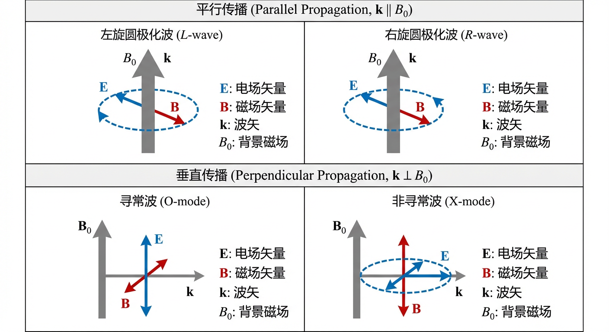
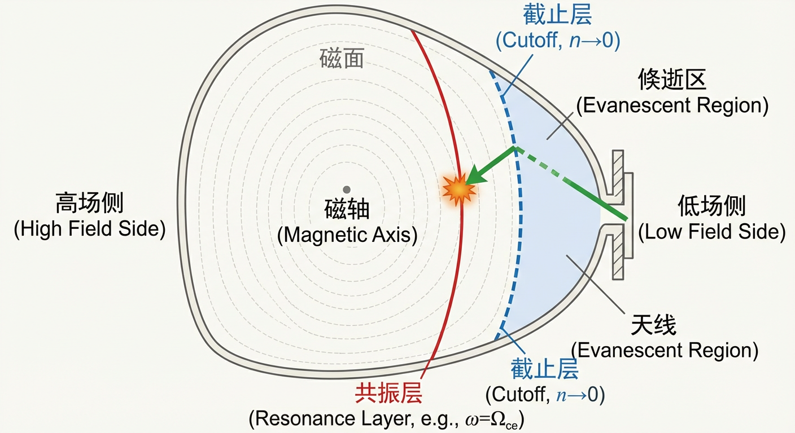
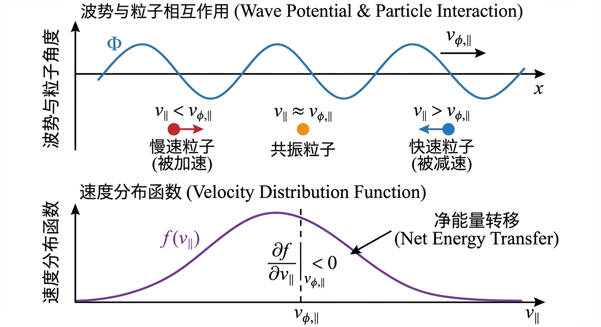
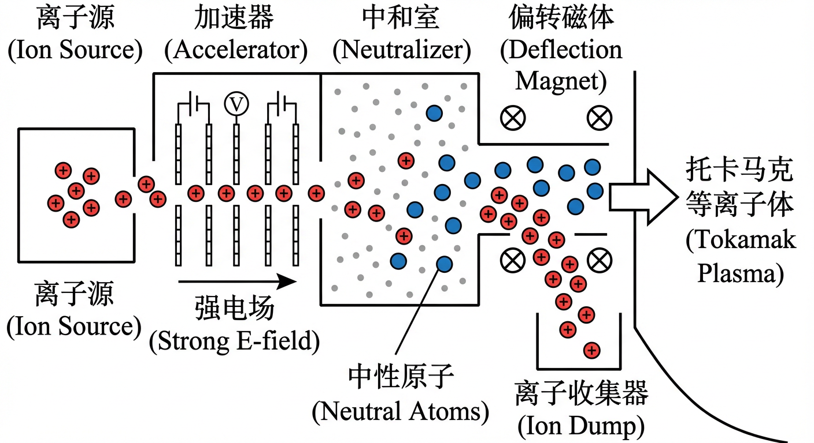
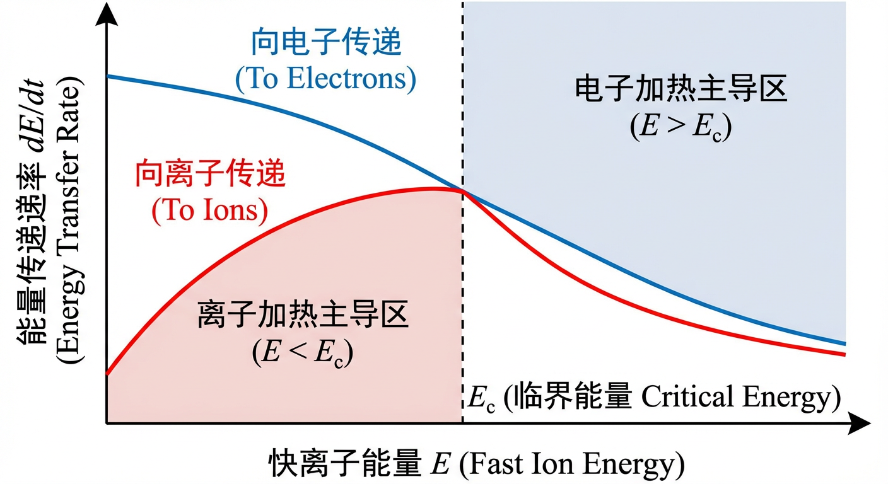
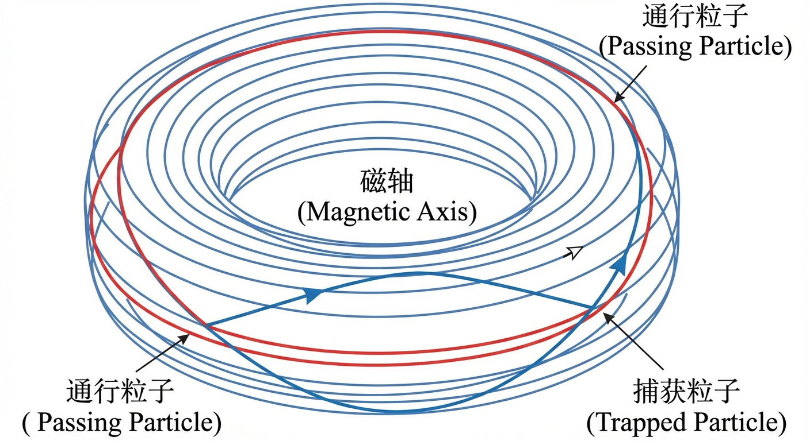
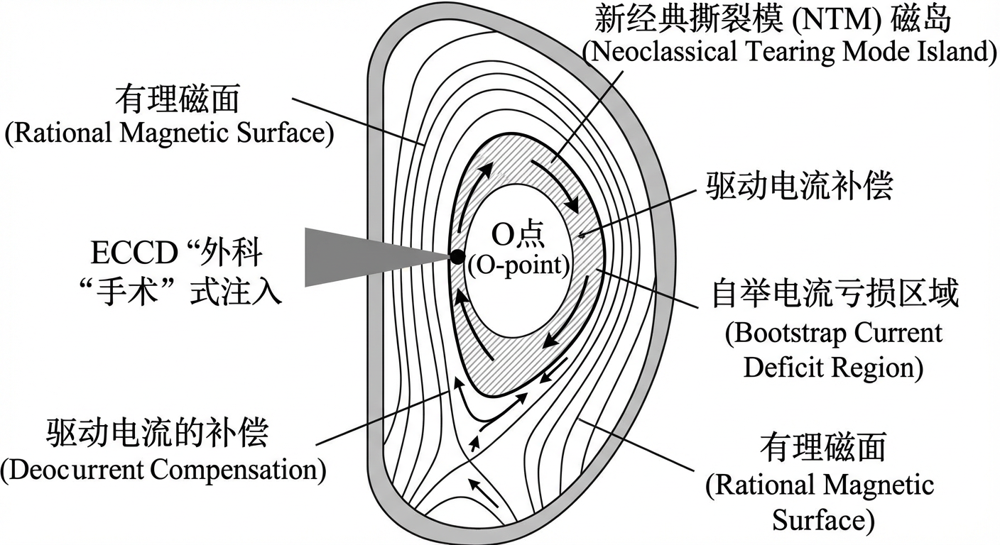
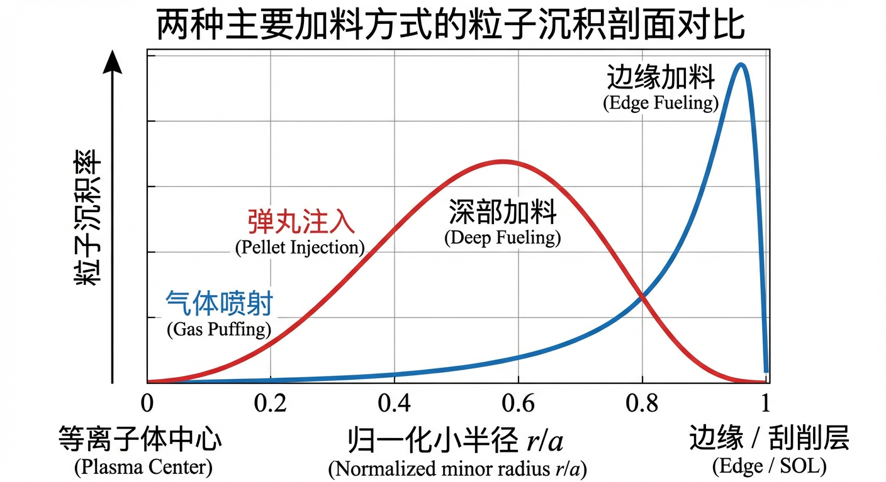

# 第7章 加热、电流驱动与加料的可控性配置

## 7.0 项目概述

在构建聚变反应堆的过程中，仅仅拥有强大的磁场容器是不够的。为了点燃并维持聚变火种，工程师必须设计一套精密的外部注入系统，能够穿透真空与磁场的壁垒，将能量、动量和粒子精准地输送到核心区域。本章的实战项目——“托卡马克加热与注入系统设计”，将带你模拟这一复杂的工程物理设计过程。

在这个贯穿全章的项目中，你将扮演首席物理师的角色，面对一个具体的挑战：为一台新建的高场托卡马克装置设计一套集成的加热与驱动方案。你不仅需要计算电磁波能否穿透等离子体边缘的“屏蔽层”，还需要论证为什么在大电流运行阶段必须引入中性束注入（NBI），并从相空间能量流动的角度评估先进的射频波应用策略。通过这些步骤，你将把抽象的介电张量、截止频率和准线性扩散理论，转化为具体的工程设计判据。

---

## 7.1 波传播与功率沉积接口

### 引言

在《可控核聚变》这部教材的前续章节中，我们已经建立了描述高温等离子体宏观平衡与稳定性的理论框架。然而，要将聚变燃料加热并维持在足以点燃热核反应的上亿摄氏度，仅靠欧姆加热是远远不够的。因此，必须依赖强大的外部辅助加热系统。利用射频（Radio Frequency, RF）电磁波对等离子体进行加热和电流驱动，是现代磁约束聚变研究中最核心、最灵活的技术之一。这门技术如同一位技艺精湛的指挥家，通过演奏特定频率和节奏的“电磁交响乐”，与等离子体中粒子的微观运动共鸣，从而实现能量的精确注入与状态的主动调控。

本节内容旨在搭建一座从基础电磁理论到聚变工程应用的桥梁，系统性地回答一系列关键问题：我们如何为炙热的磁化等离子体选择合适的电磁波“探针”？这些波又是如何穿越等离子体复杂的、不均匀的介质环境，抵达需要加热的核心区域？最终，波所携带的能量又是通过何种物理机制，精准地传递给特定的粒子群体？

为了解答这些问题，我们将首先从“冷等离子体模型”（cold plasma model）这一理想化但极富洞察力的理论出发，推导描述等离子体对电磁场响应的介电张量（dielectric tensor），并由此揭示磁化等离子体中所支持的丰富波动模式。随后，我们将探讨波在传播过程中遇到的基本物理现象——截止（cutoff）、共振（resonance）与可达性（accessibility），它们共同构成了波能否“使命必达”的物理边界。接着，我们将深入到波-粒相互作用的微观核心，阐明朗道阻尼（Landau damping）和回旋阻尼（cyclotron damping）等无碰撞加热机制的物理本质。最后，我们将介绍用于描述和预测波传播与功率沉积的现代计算工具——射线追踪（ray tracing）与全波模型（full-wave model），并探讨波如何从天线耦合进入等离子体这一关键的工程接口。通过本节的学习，读者将掌握射频波物理的基本语言与核心图景，为理解后续章节中具体的加热与电流驱动方案（如 ICRH、ECRH、LHCD）奠定坚实的理论基础。

### 等离子体的介电响应：一部由电磁场谱写的粒子动力学

当一束电磁波入射到等离子体中，它所“看到”的并非一片虚空，而是一个由亿万带电粒子组成的、能够对电磁场做出复杂集体响应的动态介质。为了描述这种响应，我们引入一个核心的理论工具——等离子体介电张量（plasma dielectric tensor）$\boldsymbol{\varepsilon}$。这个张量将麦克斯韦方程组中的位移电流项 $\mathbf{D}$ 与电场 $\mathbf{E}$ 联系起来（$\mathbf{D}=\boldsymbol{\varepsilon}\cdot\mathbf{E}$），从而将等离子体中所有粒子在波场驱动下的微观动力学行为，封装在一个宏观的响应函数中。

#### 冷等离子体介电张量

在许多射频波应用场景中，波的相速度远大于等离子体粒子的热运动速度，此时我们可以忽略粒子热运动带来的压强效应。这个近似被称为冷等离子体模型（cold plasma model）。在该模型下，我们考虑一个背景磁场为 $\mathbf{B}_0 = B_0 \hat{\mathbf{z}}$ 的均匀等离子体，其中每种粒子（以角标 $s$ 区分）的线性化运动方程为：
$$
m_s \frac{\partial \mathbf{v}_{s1}}{\partial t} = q_s \left(\mathbf{E}_1 + \mathbf{v}_{s1} \times \mathbf{B}_0\right) .
$$
其中 $\mathbf{E}_1$ 和 $\mathbf{v}_{s1}$ 分别是波引起的微扰电场和粒子速度。对于频率为 $\omega$ 的时谐波，求解此方程可以得到粒子速度响应与电场的关系，进而得到由所有粒子运动构成的总扰动电流 $\mathbf{J}_1 = \sum_s n_s q_s \mathbf{v}_{s1}$。通过将此电流与真空位移电流相结合，我们最终可以推导出相对介电张量 $\mathbf{K} = \boldsymbol{\varepsilon}/\epsilon_0$。在以 $\mathbf{B}_0$ 为 $z$ 轴的坐标系中，它具有如下矩阵形式：
$$
\mathbf{K} = \begin{pmatrix} S & -iD & 0 \\ iD & S & 0 \\ 0 & 0 & P \end{pmatrix} .
$$

其中的三个关键参数（Stix 参数）由等离子体的基本性质决定：
$$
S = 1 - \sum_s \frac{\omega_{ps}^2}{\omega^2 - \Omega_{s}^2} ,
$$
$$
D = \sum_s \frac{\Omega_{s}}{\omega}\frac{\omega_{ps}^2}{\omega^2 - \Omega_{s}^2} ,
$$
$$
P = 1 - \sum_s \frac{\omega_{ps}^2}{\omega^2} .
$$

这里，$\omega_{ps} = \sqrt{n_s q_s^2 / (m_s \epsilon_0)}$ 是等离子体频率（plasma frequency）；$\Omega_{s} = q_s B_0 / m_s$ 是包含电荷符号的回旋角频率（cyclotron angular frequency）。

这三个参数各自蕴含着深刻的物理意义：$P$ 描述了平行于磁场方向的介电响应，它不受磁场影响，仅与等离子体频率有关；$S$ 和 $D$ 描述了垂直于磁场的响应，其中 $S$ 代表了左右旋响应的平均效应，而 $D$ 则源于不同带电粒子在磁场中回旋方向的差异，体现了等离子体的“手性”或霍尔效应（Hall effect）。

#### 冷磁化等离子体中的基本波模

将介电张量代入麦克斯韦方程组，我们可以得到描述波在等离子体中传播的普适波动方程：
$$
\mathbf{k} \times (\mathbf{k} \times \mathbf{E}_1) + \frac{\omega^2}{c^2} \mathbf{K} \cdot \mathbf{E}_1 = 0 .
$$
此方程的非平庸解条件（系数矩阵行列式为零）给出了色散关系（dispersion relation），它联系了波的频率 $\omega$ 与波矢 $\mathbf{k}$。通过分析色散关系在不同传播方向下的简化形式，我们得以识别出磁化等离子体中支持的几种基本波模。

当波平行于磁场传播时（$\mathbf{k} \parallel \mathbf{B}_0$），系统的轴对称性使得介电张量可以被对角化，波动方程解耦为两种独立的横波模式：
1. **右旋圆极化波（Right-Hand Circularly Polarized wave, R-wave）**：其电场矢量沿磁场方向的旋转 sense 与电子回旋的 sense 相同。其色散关系为 $n_R^2 = R \equiv S+D$。
2. **左旋圆极化波（Left-Hand Circularly Polarized wave, L-wave）**：其电场矢量沿磁场方向的旋转 sense 与离子回旋的 sense 相同。其色散关系为 $n_L^2 = L \equiv S-D$。

当波垂直于磁场传播时（$\mathbf{k} \perp \mathbf{B}_0$），波动模式同样解耦为两种：
1. **寻常波（Ordinary wave, O-mode）**：这是一种横向电磁波，其电场矢量平行于背景磁场（$\mathbf{E}_1 \parallel \mathbf{B}_0$）。由于其电场方向与 $\mathbf{v}\times\mathbf{B}_0$ 项不耦合，它不受磁场影响，其行为如同在无磁化等离子体中传播，色散关系为 $n_O^2 = P = 1 - \omega_{pe}^2/\omega^2$。
2. **非寻常波（Extraordinary wave, X-mode）**：这是一种混合模式，其电场矢量垂直于背景磁场（$\mathbf{E}_1 \perp \mathbf{B}_0$）。它同时受到等离子体振荡和回旋运动的影响，色散关系为 $n_X^2 = (S^2-D^2)/S = RL/S$。

这些基本波模（R、L、O、X）构成了我们理解和应用射频波的“字母表”。通过选择发射波的频率和极化，我们就能选择性地激发特定的波模，以实现不同的物理目标。

### 波的旅程：截止、共振与可达性

从天线发射的波能否成功抵达等离子体核心并沉积能量，取决于它在传播路径上所经历的复杂“地貌”。这个地貌由截止（cutoff）和共振（resonance）这两种关键的拓扑特征所定义，它们共同决定了波的可达性（accessibility）。

截止发生在折射率 $n$ 趋于零的位置。物理上，这意味着波的波长无限长，无法在介质中传播，因而被完全反射。例如，O-mode 在 $\omega = \omega_{pe}$ 的位置会发生截止，这意味着它无法穿透密度高于此截止密度的区域。在不均匀的等离子体中，截止点构成了一个波无法逾越的边界，形成了倏逝区（evanescent region），波场在其中呈指数衰减。这种现象与声波在不同声阻抗介质界面上的反射和透射机理类似：射频波在等离子体的截止层也会被反射，其反射和透射的能量比例由界面两侧的有效“波阻抗”决定。

共振则发生在冷等离子体模型中某些介电张量分量或色散关系的特征量趋于奇异的位置，对应于波与粒子或集体自由度的强耦合。常见情形下，色散关系会表现为某些分支的 $n^2$ 急剧增大，从而使得场在共振层附近增强并导致强烈吸收或模式转换。冷等离子体模型预测了几种重要的共振：
- **回旋共振（Cyclotron Resonance）**：当波频 $\omega$ 趋近于某种粒子的回旋频率大小 $|\Omega_s|$（或其谐波）时，介电张量的某些分量会出现强响应。具体而言，R-wave 在电子回旋频率 $\omega = |\Omega_{ce}|$ 处共振，而 L-wave 则在离子回旋频率 $\omega = |\Omega_{ci}|$（及其相关谐波）附近具有强耦合。这种选择性共振是 ECRH 和 ICRH 的物理基础。
- **混杂共振（Hybrid Resonance）**：即使波频不等于任何一种粒子的回旋频率，在某些特定频率下，多粒子流体的集体响应也能导致强耦合。例如，对于垂直传播的 X-mode，当 $S=0$ 时会发生共振，这定义了上混杂共振（Upper Hybrid Resonance）
  $$
  \omega_{UH}^2 = \omega_{pe}^2 + \Omega_{ce}^2 .
  $$
  低混杂共振对应于更一般的冷流体色散条件，在典型托卡马克参数下其特征频率满足近似关系
  $$
  \omega_{LH}^2 \simeq \frac{\Omega_{ci}\,\Omega_{ce}}{1+\omega_{pe}^2/\Omega_{ce}^2} ,
  $$
  并且通常满足 $\omega_{ci} \ll \omega_{LH} \ll |\Omega_{ce}|$。

在托卡马克这样密度和磁场都非均匀的复杂环境中，波的传播路径上可能同时存在多个截止层和共振层。波要从等离子体边缘的天线传播到核心的吸收区，就必须确保其路径上不存在无法穿越的倏逝区。例如，从托卡马克外侧（低场侧）发射的基频 X-mode 电子回旋波，在到达其共振层之前，往往会先遇到一个 R-cutoff。为了克服这一障碍，可以采用更高频率的二次谐波，或者通过设定合适的平行折射率 $n_\parallel$ 与发射几何来满足相应的可达性条件，从而“打开”通往目标吸收层的传播通道。对可达性的精确分析是所有射频加热与电流驱动方案设计的先决条件，这通常需要借助射线追踪（ray tracing）等数值工具来求解波在真实等离子体平衡位形中的传播路径。

### 能量的终点：波-粒相互作用与功率沉积

当波成功到达吸收区域后，其携带的能量最终必须通过具体的物理机制转移给等离子体粒子。从能量守恒定律出发，可以证明，电磁场到等离子体的净功率转移密度等于波电场对等离子体电流所做的功，即 $\langle \mathbf{J} \cdot \mathbf{E} \rangle$。所有功率沉积机制，本质上都是在解释等离子体如何在特定条件下产生与波电场同相的电流分量，从而实现能量的净吸收。

#### 碰撞阻尼与无碰撞阻尼

在温度较低、碰撞较为频繁的等离子体中，碰撞阻尼（collisional damping）是一个重要的吸收机制。电子和离子在波场驱动下获得的有序动能，通过与其它粒子的库仑碰撞转化为无序的热运动。这类似于导体中的焦耳热，其功率密度为 $\eta j^2$。由于等离子体电阻率 $\eta$ 随温度升高而急剧下降（$\eta \propto T_e^{-3/2}$），碰撞阻尼在聚变级的高温等离子体中效率很低。

在高温、稀薄的聚变等离子体中，无碰撞阻尼（collisionless damping）机制起主导作用。这些机制不依赖于粒子间的直接碰撞，而是通过波与特定粒子群之间的共振相互作用来实现能量的不可逆转移。
- **朗道阻尼（Landau Damping）**：这是最普适的一种无碰撞阻尼机制。其物理图像可以类比为“粒子在波上冲浪”。对于具有平行电场分量的波，其平行相速度为 $v_{\phi,\parallel} = \omega / k_\parallel$。那些平行速度 $v_\parallel$ 略小于 $v_{\phi,\parallel}$ 的“共振”粒子，会被波持续加速，从波中净获取能量；而那些速度略大于 $v_{\phi,\parallel}$ 的粒子，则会将能量交给波。在一个典型的麦克斯韦速度分布中，$v_{\phi,\parallel}$ 附近的分布函数斜率通常为负，因此净效应是波的能量被粒子吸收，导致波的振幅衰减。朗道阻尼的强度与分布函数在共振速度处的斜率 $ \left.\partial f / \partial v_\parallel\right|_{v_{\phi,\parallel}} $ 相关。

- **回旋阻尼（Cyclotron Damping）与渡越时间磁泵浦（Transit-Time Magnetic Pumping, TTMP）**：这些是朗道阻尼在磁化等离子体中的推广。回旋阻尼发生在波频（在粒子参考系中）与粒子回旋频率的整数倍相匹配时，即
  $$
  \omega - k_\parallel v_\parallel = n\Omega_s .
  $$
  波的垂直电场与粒子的回旋运动共振，导致其垂直动能增加。TTMP 则是一种与压缩磁场扰动相关的加热机制：当粒子以平行速度 $v_\parallel$ 穿越一个空间周期性变化的平行磁场（波的磁场分量 $\delta B_\parallel$）时，若满足近似共振 $\omega \approx k_\parallel v_\parallel$，粒子可通过与磁场强度起伏的相位相关作用发生能量交换。TTMP 常被视为由磁镜力引起的“磁朗道阻尼”机制，与回旋阻尼一起构成射频功率沉积的重要物理基础。

#### 从冷到暖：动理学修正与全波模型

值得注意的是，上述所有无碰撞阻尼机制都依赖于粒子的热运动。冷等离子体模型由于忽略了粒子速度分布，无法描述这些过程，并会在某些共振条件附近出现非物理的奇异行为。为了正确地描述能量吸收，必须采用包含热效应的暖等离子体模型（warm plasma model）或更完整的动理学模型（kinetic model）。

在这些更精确的模型中，介电响应不再是局域的简单代数表达式，而是包含对速度空间积分的复杂算符。它将冷等离子体模型中的共振奇异性“平滑”为有限的吸收峰，峰的宽度和高度由温度、多普勒展宽和相对论效应等共同决定。

为了精确模拟波在真实聚变装置中的传播和吸收，发展了两类主要的计算工具：
- **射线追踪（Ray Tracing）**：基于几何光学（WKB）近似，将波视为一系列沿群速度方向传播的波包（射线）。该方法计算效率高，能够直观展示波能流路径，并能以近似方式计入动理学吸收来计算功率沉积。然而，它无法描述衍射、干涉以及模式转换等纯粹的波动现象。
- **全波模型（Full-Wave Models）**：通过在整个等离子体区域内直接求解完整的麦克斯韦波动方程（通常耦合动理学闭合以包含吸收），全波模型能够自洽处理反射、干涉、倏逝层隧穿和模式转换等波动效应。尽管计算量巨大，但它们为理解天线近场耦合、全局本征模激发以及复杂模式转换场景提供了最精确的理论描述。

这两类模型相辅相成，共同构成了我们设计、分析和优化射频波加热与电流驱动方案的计算工具箱，是连接基础波物理与聚变实验不可或缺的桥梁。

### 小结

本节内容系统地勾勒了射频波在磁化等离子体中传播与吸收的物理全景。我们从冷等离子体介电张量出发，识别了等离子体中存在的 R、L、O、X 等基本波模，并阐明了决定其传播命运的截止与共振现象。这些概念构成了理解波能否到达目标区域的“可达性”问题的基础。

进一步地，我们深入到波-粒相互作用的微观层面，揭示了朗道阻尼与回旋阻尼等无碰撞能量吸收机制的物理本质。这不仅解释了波的能量最终去向何方，也凸显了从冷等离子体模型向包含热效应的暖等离子体乃至动理学模型演进的必要性。最后，我们介绍了射线追踪和全波模型这两种现代计算工具，它们是连接抽象理论与复杂实验现象、实现功率沉积精确预测与控制的关键。

在本章后续的小节中，我们将看到本节建立的这些基本概念——波模、极化、截止、共振、可达性与阻尼机制——是如何在具体的加热与电流驱动方案（如中性束、ICRH、ECRH、LHCD 等）中被应用和组合，以实现对聚变等离子体的精确控制。本节所建立的“波传播与功率沉积接口”，正是贯穿整个外部加热与电流驱动技术的统一物理语言和分析框架。它不仅为理解现有技术提供理论基础，也为探索和优化未来的先进控制策略指明方向，例如，我们能否设计一种波，利用其动量来抑制湍流，或是利用其精确的沉积特性来“手术”般地切除不稳定性？这些前沿问题的答案，都深植于本节所探讨的基础物理之中。

> **实战项目应用 I：波的可达性计算**  
> 作为本章项目中加热系统设计的起步，你首先需要评估基本的波传播特性。假设该托卡马克可近似为冷磁化等离子体。  
>  
> **核心任务：**  
> 考虑一个由电子和单价离子组成的准中性冷等离子体（$n_e \approx n_i$），处于沿 $z$ 轴的均匀背景磁场 $\mathbf{B}_0$ 中。为了探测或加热等离子体，我们发射一个角频率为 $\omega$、波矢 $\mathbf{k}$ 垂直于 $\mathbf{B}_0$（即 $\mathbf{k} \parallel \hat{\mathbf{x}}$）的单色电磁波。  
>  
> 1. 利用冷等离子体介电张量，推导寻常波（O-mode）（定义为电场 $\mathbf{E} \parallel \mathbf{B}_0$ 的模式）的色散关系。  
> 2. 推导其截止角频率 $\omega_{\mathrm{cut}}$ 的解析表达式，即波开始能够传播的最小频率。  
> 3. 如果入射波频率 $\omega$ 低于此截止频率，波将成为倏逝波。推导此时的倏逝长度（趋肤深度）$\delta(\omega)$，即波幅衰减到 $1/e$ 的距离。  
>  
> 提示：请从麦克斯韦方程组和线性化冷流体运动方程出发，不直接套用最终公式，以此验证你对介电张量构建过程的理解。结果应表示为 $\omega_{pe}$、$\omega$、$c$ 的函数（并说明离子项在 O-mode 截止条件中的影响为何可忽略）。

---

## 7.2 中性束注入与快离子链路

在掌握了电磁波的传播特性后，我们自然会问：除了波，还有没有其他方式将能量注入磁笼？对于大型装置，仅仅依赖波加热可能面临耦合效率或局部过热的挑战。此时，我们需要一种更“有实体感”的手段——粒子束。然而，带电粒子无法直接穿越磁场，这就引出了本节的主角：中性束注入。在项目设计的第二阶段，我们需要评估为何引入这套昂贵的系统是必要的，以及它与简单的欧姆加热有何本质区别。

### 中性束注入与快离子链路

在寻求可控核聚变能源的征途中，我们面临一个根本性挑战：如何将能量与动量有效输运至一个被强大磁场囚禁、温度高达数亿摄氏度的等离子体核心？任何带电粒子都会被磁场的洛伦兹力偏转，难以长驱直入。中性束注入（Neutral Beam Injection, NBI）技术正是在这一背景下诞生的一种强大方案：通过注入电中性的高能原子束穿越磁场壁垒，在等离子体内部被电离，释放出携带能量和动量的快离子。

本节将系统剖析这一过程，追溯一个中性束粒子从产生到最终将其能量和动量赋予等离子体的生命周期：从 NBI 源物理与技术约束，到等离子体中的电离沉积，再到快离子慢化实现加热与电流驱动，最后讨论快离子轨道动力学及其与集体不稳定性的相互作用，形成影响装置性能的“快离子链路”。

### 中性束的产生与注入：穿越磁场壁垒的艺术

要将能量信使送入托卡马克等离子体这一被强大磁场守护的“城池”，直接发射带电粒子束是行不通的。根据洛伦兹力定律 $\mathbf{F} = q(\mathbf{E} + \mathbf{v} \times \mathbf{B})$，带电粒子在强磁场中会发生显著偏转。例如，一个能量为 100 keV 的氘离子，在 $B=5\ \mathrm{T}$ 的典型托卡马克磁场中，若其速度主要垂直于磁场，则拉莫尔回旋半径
$$
r_L = \frac{m v_\perp}{|q|B}
$$
量级为数厘米（约 $3\ \mathrm{cm}$），远小于装置尺度。这意味着离子束在进入等离子体边缘磁场后会迅速绕磁力线回旋并扩散，难以实现对核心的深部穿透。因此需要不带电荷的中性原子作为能量载体。

然而，静电加速器无法直接加速中性粒子。这催生了 NBI 系统经典的三步流程：在离子源中产生大量离子；利用强电场将离子加速到所需能量（从几十 keV 到数 MeV）；在注入前让高能离子束穿过充满中性气体的中和室（neutralizer），通过原子碰撞过程将其转变为高速中性原子。

这一中性化过程是 NBI 技术的关键瓶颈之一，其效率由原子物理碰撞截面决定。对于能量较低（约 $<150\ \mathrm{keV/amu}$）的系统，通常采用正离子源。高能正离子穿过中和室时，通过电荷交换（charge exchange）俘获电子成为中性原子。然而，随着能量升高，电荷交换截面下降，中性化效率恶化。为满足未来大型装置对更高束流能量（约 $1\ \mathrm{MeV}$）的需求，通常采用基于负离子源的 NBI 技术。负离子（如 $D^-$）在中和室中通过剥离（electron detachment）实现中性化，该过程在高能区仍可保持较高效率，为高能 NBI 提供可行路径。

### 束流沉积与快离子的诞生：能量的投放

一束高能中性原子进入等离子体后，通过与电子和离子发生碰撞而被电离，成为高能快离子（fast ion）。电离过程主要包括电子碰撞电离（impact ionization）以及与背景离子的电荷交换。一旦电离，快离子即被磁场束缚并成为等离子体粒子群的一部分。

中性束在等离子体中强度会随穿透深度增加而衰减，其特征由电离与电荷交换决定的平均自由程控制。一般而言，束流能量越高，相关截面在一定能区往往更小，平均自由程更长，有利于穿透到更深、更致密的区域，实现堆芯沉积。但若束流能量过高或等离子体密度过低，部分中性束可能在未被充分吸收前穿透等离子体并撞击第一壁，产生穿透（shine-through）热负荷，这是能量选择必须权衡的问题。

我们可以将快离子产生的径向源项模型化为 $S_{n_f}^{\mathrm{NBI}}(r,t)$，它描述单位时间、单位体积内新生快离子的数量。这个分布由束流初始通量、注入几何以及沿途等离子体参数决定的衰减共同决定。在简化模型中，给定初始束流功率 $P_b(t)$ 和单粒子能量 $E_b$，束流的初始粒子通量（单位面积、单位时间的粒子数通量）为
$$
\Phi_b(0,t) = \frac{P_b(t)}{E_b A_{\mathrm{beam}}} .
$$
沿路径坐标 $s$ 的衰减可用比尔–朗伯定律表示：
$$
\Phi_b(s,t) = \Phi_b(0,t)\exp\!\left[-\int_{0}^{s} n_e(r(s'),t)\,\sigma_{\mathrm{ion}}(E_b)\,\mathrm{d}s'\right] .
$$
局域快离子源项为束流通量的衰减率：
$$
S_{n_f}^{\mathrm{NBI}}(r(s),t) = -\frac{\mathrm{d}\Phi_b(s,t)}{\mathrm{d}s} = n_e(r,t)\,\sigma_{\mathrm{ion}}(E_b)\,\Phi_b(s(r),t) .
$$
这个源项是所有后续过程——加热、电流驱动与动量输入——的起点。

### 快离子慢化：能量与动量的传递

新生快离子携带的巨大动能和定向动量，通过与背景等离子体中电子和离子的库仑碰撞（Coulomb collisions）逐渐转移并热化，这一过程称为慢化（slowing-down）。能量在电子与离子之间的分配由一个关键参数——临界能量（critical energy）$E_c$——所决定。

快离子同时受到电子与离子的碰撞阻力。由于电子质量轻、热速度高，快离子在电子背景中的减速在高能区更为显著；而与离子的能量交换在较低能区相对更强。因此存在一个能量点 $E_c$，使得快离子向电子与向离子传递能量的速率相等。该临界能量主要由 $T_e$、离子质量与有效电荷等参数决定，常见标度关系为 $E_c \propto T_e$（对具体系数与依赖项需用标准慢化理论给出）。

由此可得：
- 当注入能量 $E_b \gg E_c$ 时，快离子主要将能量传递给电子，更有利于电子加热并提高电流驱动效率。
- 当注入能量 $E_b \lesssim E_c$ 时，向离子的能量传递更有效，有利于离子加热。

在典型的氘燃料托卡马克参数下，$E_c$ 常处于几十至数百 keV 的量级（随 $T_e$ 等显著变化）。因此，约 $100\ \mathrm{keV}$ 级 NBI 往往能较有效地加热离子，而 MeV 级 NBI 的能量沉积更偏向电子，常用于堆芯穿透与非感应电流驱动的需求。

NBI 的另一个功能是中性束电流驱动（Neutral Beam Current Drive, NBCD）。通过切向注入，中性束电离生成的快离子携带定向的环向动量。在慢化过程中，这个动量通过碰撞逐步转移给背景粒子，并在包含碰撞、回旋与回流电流（return current）等效应的整体动量平衡下形成净环向电流。驱动电流的效率（单位注入功率产生的电流）依赖于注入能量、几何、等离子体碰撞性与电流扩散等细节。一般而言，LHCD 等射频方法能更直接地将平行动量耦合给电子，电流驱动效率常高于 NBI；但 NBI 仍以其可靠性与多功能性，在聚变装置中扮演重要角色。

更进一步地，NBI 注入的动量还会驱动等离子体宏观旋转。在轴对称托卡马克中，外加力矩会改变等离子体的总角动量。NBI 通过注入携带环向动量的粒子，为等离子体提供持续外部力矩源。一个质量为 $m_b$、环向速度为 $v_\phi$ 的粒子在主半径为 $R$ 处电离时，其环向角动量贡献为 $L_\phi = m_b R v_\phi$。这种力矩输入对驱动等离子体旋转、产生速度剪切流并影响湍流输运具有重要作用。

### 快离子链路：从轨道到宏观效应

快离子一旦诞生，其行为便构成连接外部注入与等离子体宏观响应的关键一环，即“快离子链路”。这条链路的物理核心是高能粒子的轨道动力学。

在理想的轴对称托卡马克中，由于环向对称性的存在，粒子的正则环向角动量（canonical toroidal momentum）
$$
P_\phi = m R v_\phi + q\Psi
$$
是守恒量（其中 $\Psi$ 为极向磁通）。这意味着粒子的径向运动受到严格约束，但并不意味着粒子严格局限在出生磁面：快离子会沿引导中心轨道（guiding-center orbit）运动，轨道可能显著偏离初始磁面。由轨道漂移引起的径向偏移称为有限轨道宽度（Finite Orbit Width, FOW）效应，它导致真实的能量与力矩沉积剖面并非简单等于快离子的出生剖面，而是出生剖面与轨道加权核的非局域卷积。精确计算常需轨道跟踪与蒙特卡洛模拟：对由源项 $S_{n_f}^{\mathrm{NBI}}(r,t)$ 抽样得到的大量快离子进行跟踪，并累积其慢化过程中沿轨道对背景等离子体的碰撞作用。

根据能量和螺距角（pitch angle，$v_\parallel/v$）不同，快离子轨道可分为通行粒子（passing particles）和捕获粒子（trapped particles）。NBI 的注入几何（如同轴或离轴、切向角等）会影响新生快离子在相空间中的分布，从而改变通行与捕获比例、轨道形态与沉积位置。通行粒子通常更有利于驱动环向电流与旋转，而捕获粒子因径向漂移较大，对输运与损失更为敏感。

快离子群体作为一个非热平衡能量库，也可能主动驱动不稳定性。当快离子的特征频率（渡越频率、进动频率等）与某些电磁模（如阿尔芬本征模 Alfvén Eigenmodes, AEs）发生共振时，快离子可向波传递自由能，使波增长，从而引发快离子再分布甚至损失。这会降低加热与电流驱动效率，改变力矩沉积剖面，并可能对第一壁造成局部热负荷，是限制高性能运行的关键问题之一。

因此，NBI 与等离子体相互作用往往构成复杂闭环：NBI 产生快离子；快离子通过慢化加热并驱动等离子体；轨道动力学塑造沉积剖面；快离子又可能激发不稳定性；不稳定性反过来改变快离子分布与约束。理解并掌控这一“快离子链路”，是实现先进托卡马克稳态高性能运行的核心挑战之一。

### 小结

本节系统描绘了中性束注入的物理全景。我们从“如何穿越磁场壁垒”出发，揭示使用中性原子的必要性，并讨论了离子源与中性化的关键原子过程与技术挑战。进入等离子体后，中性束通过电离沉积形成快离子源项；快离子慢化将能量与动量转移给背景等离子体，从而实现加热、电流驱动与力矩输入。随后，我们讨论了正则动量守恒与有限轨道宽度效应如何导致沉积过程的非局域性，并指出快离子还可能通过共振激发阿尔芬类不稳定性，形成影响聚变性能的反馈回路。

> **实战项目应用 II：加热机制验证**  
> 在本章项目设计评审中，有人提出质疑：既然托卡马克自身就有强大的感应电流和欧姆加热，为什么还要投资建设中性束注入（NBI）和射频加热系统？  
>  
> **核心任务：**  
> 利用你对本节和前一节物理机制的理解，分析并判断以下关于加热机制的描述是否正确，并据此反驳“单纯依赖欧姆加热”的观点。  
>  
> 1. 欧姆加热的效率是否随着等离子体温度的升高而单调增加？（考虑电阻率 $\eta$ 与电子温度 $T_e$ 的关系）  
> 2. NBI 注入的是加速的带电粒子还是中性原子？其能量与动量主要通过什么机制（如库仑碰撞与慢化）传递给等离子体？  
> 3. 射频加热如何实现能量转移？请用“共振条件 + 选择性吸收（朗道/回旋/TTMP）”的语言描述其物理图像。  
>  
> 提示：请准确描述每种加热方式的物理图像，特别是它们在高温条件下的表现差异，并指出“高温下电阻更大所以欧姆加热更强”这一判断与电阻率温度标度的矛盾。

---

## 7.3 射频加热与电流驱动方案

通过前两节的铺垫，我们已经掌握了波的传播特性（7.1）和中性束注入的物理图景（7.2）。现在，我们回到本章项目设计的核心——如何选择和优化具体的射频加热方案。我们不仅要利用波进行加热，更要利用它进行电流驱动。这要求我们更深入地理解波与粒子在相空间（位置与速度空间）的能量交换过程。本节将在前述基础之上，探讨从离子回旋到电子回旋的各种具体方案，并引入一个高级概念——如何通过设计波-粒相互作用的相空间路径，实现更高效的控制。

### 射频加热与电流驱动的角色定位

将聚变等离子体加热至上亿摄氏度并长久维持稳定燃烧，是实现受控核聚变的核心挑战之一。仅依靠等离子体自身电阻的欧姆加热（Ohmic Heating）存在固有局限：一方面，等离子体电阻率随温度升高而下降（$\eta \propto T_e^{-3/2}$），在给定等离子体电流密度 $j$ 的条件下，欧姆加热功率密度 $p_\Omega=\eta j^2$ 将随温度升高而降低，出现“欧姆饱和”，难以达到点火所需温度；另一方面，驱动欧姆电流的感应电场源于中心螺线管有限的磁通变化，使得托卡马克在纯感应运行下本质上是脉冲式的，其放电时间受限于伏秒（volt-second）能力，难以满足未来电站所需稳态运行。

因此，需要辅助加热（auxiliary heating）与非感应电流驱动（non-inductive current drive）。与可在外部线圈中提供主要变换磁场的仿星器（stellarator）不同，托卡马克稳定运行通常依赖等离子体内部兆安培级环向电流来提供极向磁场并形成约束位形。射频（Radio Frequency, RF）波注入是实现辅助加热与非感应电流驱动的关键手段之一：通过发射特定频率与波模的电磁波，利用共振相互作用将能量局域沉积，并通过平行动量注入驱动电流。

本节将探讨离子回旋共振加热（ICRH）、电子回旋共振加热（ECRH）及其电流驱动（ECCD）、低混杂波电流驱动（LHCD）与快波电流驱动（FWCD），比较其机制、适用范围与工程约束，并讨论它们作为“执行器”用于主动调控剖面与稳定性的典型方式。

### 离子回旋共振加热与模式转换

离子回旋共振加热（Ion Cyclotron Resonance Heating, ICRH）是直接加热离子的主要手段之一。当满足共振条件（更一般地考虑多普勒与谐波）
$$
\omega - k_\parallel v_\parallel = n\Omega_i
$$
时，波场可与离子的回旋运动发生强耦合，使离子吸收能量并增加垂直能量分量。在托卡马克环形几何中，由于磁场强度 $B$ 近似随大半径 $R$ 变化（低 $\beta$ 近似下 $B\propto 1/R$），在给定波频 $\omega$ 时，共振发生在满足条件的磁面附近，使 ICRH 具有空间局域性。

少数派加热（Minority Heating）是 ICRH 常用且高效的方案：在多数离子（如氘 D）等离子体中掺入少量（常为 1%–10%）少数离子（如氢 H 或氦-3 $^3\mathrm{He}$），将频率调谐至少数离子的回旋共振附近。由于极化与介质响应的耦合，少数离子可强吸收并形成高能尾分布（可达数百 keV 乃至更高），随后通过库仑碰撞将能量传递给背景离子和电子，实现强加热。

当离子能量足够高时，相对论效应会使有效回旋频率降低：
$$
\Omega_{i,\mathrm{rel}}=\frac{\Omega_i}{\gamma} ,
$$
其中 $\gamma$ 为洛伦兹因子。对离子而言该修正通常较小，但在需要精确控制沉积位置或解释高能尾动力学时，应将其纳入分析。

除直接共振吸收外，多离子等离子体还可能发生模式转换（Mode Conversion）。在两种离子的离子-离子混合共振层附近，入射快磁声波（Fast Wave, FW）可以部分转换为短波长的静电波，如离子伯恩斯坦波（Ion Bernstein Wave, IBW）或离子回旋准静电波，从而在很局域区域通过朗道阻尼或回旋阻尼被吸收。模式转换效率受密度梯度、磁剪切、波谱与多组分参数的共同影响；在某些条件下可作为高度局域化加热方案，在另一些条件下也可能导致不期望的功率分流，因此对其理解与控制是 ICRH 物理的核心课题之一。

尽管 ICRH 可通过波谱与发射几何实现一定电流驱动，但由于功率主要沉积于离子，电流载体电子获得平行动量往往需要通过碰撞间接实现，整体效率通常不如专门的电子驱动方案。因此 ICRH 在工程上主要作为强离子加热与剖面调控工具。

### 电子回旋共振加热与电流驱动

电子回旋共振加热（Electron Cyclotron Resonance Heating, ECRH）利用频率与电子回旋频率（或谐波）匹配的微波，通过共振直接加热电子。电子回旋角频率的大小为 $|\Omega_{ce}|=eB/m_e$。在典型托卡马克磁场下所需频率常在 100–200 GHz 量级，工程上通常使用回旋管（gyrotron）作为大功率微波源。ECRH 的突出优点是功率沉积的高度局域性：共振对 $B$ 的依赖强，且微波束可通过准光学系统（quasi-optical system）聚焦，实现厘米级沉积宽度。

在启动阶段，ECRH 可用于预电离与辅助击穿，以降低感应电场需求并提高启动可靠性。

ECRH 更重要的应用之一是电子回旋电流驱动（Electron Cyclotron Current Drive, ECCD）。若波束垂直注入且 $k_\parallel=0$，主要加热垂直能量，难以产生净电流。为驱动电流，需要以一定倾斜角注入，使 $k_\parallel\neq 0$，此时共振条件变为
$$
\omega - k_\parallel v_\parallel = n\Omega_{ce} .
$$
这使得波选择性地与具有特定 $v_\parallel$ 的电子共振。通过选择 $k_\parallel$ 的符号，可不对称地加热顺/逆向运动电子，从而打破速度分布对称性并驱动宏观环向电流。

ECCD 的“外科手术”式局域沉积能力，使其成为主动控制磁流体动力学（Magnetohydrodynamics, MHD）不稳定性的理想工具。典型应用是稳定新经典撕裂模（Neoclassical Tearing Modes, NTMs）：NTM 在有理磁面形成磁岛，其驱动与磁岛内压强平坦化导致的自举电流亏损相关。ECCD 策略是在磁岛 O 点附近局域驱动电流补偿亏损自举电流，要求实时对准磁岛位置并尽量保证相位匹配。稳定效果对沉积位置与相位误差敏感，因而体现了 ECCD 对控制与诊断闭环的高要求。

### 低混杂波电流驱动

低混杂波电流驱动（Lower Hybrid Current Drive, LHCD）以高电流驱动效率著称。其工作频率满足
$$
\omega_{ci} \ll \omega \ll |\Omega_{ce}| ,
$$
驱动机制主要是电子朗道阻尼（Electron Landau Damping, ELD）。

LHCD 通过相控波导阵列天线（常称为“栅”）发射具有特定平行折射率 $n_\parallel = ck_\parallel/\omega$ 的慢波。选择合适的 $n_\parallel$ 使平行相速度 $v_{\mathrm{ph},\parallel}=c/n_\parallel$ 与若干倍电子热速度的超热电子发生朗道共振，从而将波的平行动量直接传递给电子并驱动电流。LHCD 高效的根源在于：其一，动量直接作用于最终电流载体电子；其二，共振电子速度高、碰撞频率低（标度上 $\nu \propto v^{-3}$），能长时间保持波赋予的动量，以较小功率维持可观电流。

LHCD 的高效率使其成为长脉冲乃至稳态运行的重要候选手段，可通过电流爬升显著节省中心螺线管磁通消耗。与此同时，LHCD 也是强大的电流剖面控制工具：通过离轴注入可在中半径驱动局域电流峰，改变安全因子 $q(r)$ 剖面，构建负磁剪切或弱磁剪切先进位形，并触发内部输运垒（Internal Transport Barrier, ITB）从而改善约束。

LHCD 同样面临可达性（accessibility）限制：为使低混杂波在边缘与高密度等离子体中传播，波谱的 $n_\parallel$ 必须满足由局域密度与磁场决定的临界条件。高密度条件下，可达性限制可能使 LHCD 难以有效进入堆芯并在中心驱动电流。

### 快波电流驱动

快波电流驱动（Fast Wave Current Drive, FWCD）采用与 ICRH 相近的频率范围，但目标是利用快磁声波与电子相互作用来驱动电流。其机制可包括电子朗道阻尼并辅以 TTMP 等效应。与 LHCD 相比，FWCD 的优势在于对高密度等离子体的穿透能力更强，更适合未来高密度、高温堆芯的可达性需求。

然而，FWCD 的高效率实现具有挑战：快波对电子的单程吸收可能较弱，常需要多程传播与吸收，使沉积剖面控制不如 ECRH 或 LHCD 直接；同时需避免与离子回旋吸收竞争，从而减少功率分流。

FWCD 与其他系统之间可能存在协同效应（synergy）。例如，高功率 NBI 可提高电子温度 $T_e$。由于电子碰撞频率随温度升高而降低（$\nu_{ei} \propto T_e^{-3/2}$），更高的 $T_e$ 会减小电流驱动中的碰撞阻力，从而提高 FWCD（以及一般电子驱动方案）的效率。射频方法之间也可协同：例如 LHCD 先产生超热电子尾，ECCD 进一步作用于该群体，通过调节其能量与俯仰角分布降低等效碰撞性，使综合电流驱动效率超过各自单独作用的效果。

### 小结

射频加热与电流驱动方案构成一个互补的工具箱，使托卡马克从被动的欧姆阶段进入能够主动、精确“雕刻”等离子体状态的阶段。

- 欧姆加热受电阻率随温度升高而降低以及对变压器磁通的依赖所限，难以支撑稳态高性能反应堆。
- ICRH 通过少数派加热、谐波吸收与模式转换等机制高效加热离子，但电流驱动效率通常有限。
- ECRH/ECCD 具有高度局域沉积能力，是控制 MHD 不稳定性（如 NTMs）的关键“手术刀”。
- LHCD 以高电流驱动效率成为长脉冲与稳态运行的重要候选，并可用于灵活电流剖面控制以构建先进位形。
- FWCD 凭借对高密度堆芯的可达性成为未来堆芯电流驱动的重要选项，且与 NBI、ECCD 等可形成协同优化。

尽管频率与波模各异，这些方案统一于波-粒共振框架：
$$
\omega - k_\parallel v_\parallel = n\Omega_s .
$$
通过选择频率 $\omega$、波矢 $\mathbf{k}$ 与极化，可决定与离子或电子、热粒子或快粒子、核心或边界发生相互作用。这种选择性正是射频技术的核心魅力。

> **实战项目应用 III：评估先进加热情景**  
> 在本章项目的后期规划中，团队考虑采用“Alpha Channeling（Alpha 粒子通道化）”的先进技术，以提高反应堆效率。这需要深入理解射频波与粒子在相空间中的相互作用。  
>  
> **核心任务：**  
> 利用坡印廷定理（Poynting theorem）和准线性波-粒相互作用理论，从能量流动角度区分 Alpha Channeling 与传统射频加热（如 ICRH）。  
>  
> 1. 已知场—粒子功率传输由 $\langle \mathbf{J}\cdot\mathbf{E}\rangle$ 给出。  
> 2. 准线性理论中，波驱动的速度空间扩散通量为 $\mathbf{F}_{s} = -\mathbf{D}_{s}\cdot\nabla_{\mathbf{v}} f_{s}$。  
> 3. 请定义 Alpha Channeling：它如何利用聚变产生的 Alpha 粒子分布 $f_\alpha$ 的各向异性或梯度特性，通过波诱导的相空间扩散将能量从 Alpha 粒子“转移”到波（并最终转移给燃料粒子）？在这种情况下，$\langle \mathbf{J}\cdot\mathbf{E}\rangle_\alpha$ 的符号是什么？这与传统加热（波阻尼）在能量流向上的根本差异是什么？

---

## 7.4 粒子源与杂质源协同

在完成加热与电流驱动系统的物理设计后，我们必须面对最后一个同样至关重要的环节：粒子控制。能量的注入必须与物质的注入相匹配，才能维持燃烧。然而，这不仅仅是向真空室加气那么简单。正如前几节所示，能量源（NBI、RF）与等离子体的相互作用极为复杂；同样，粒子源（加料）与杂质源（污染）之间也存在微妙的协同关系。本节将把视野从单一加料扩展到整个“源—输运—汇”的循环，探讨如何在高功率加热下维持高纯度等离子体。

### 粒子控制的协同目标

在前面章节对加热与电流驱动方案的探讨中，我们已将外部能量注入视为一个精确可控的物理过程。本节将遵循相同的叙事目标，将视线转向等离子体的另一个基本控制维度：粒子注入。然而，一个聚变装置的粒子平衡远非仅由燃料加料系统决定，它是燃料粒子与必然存在的杂质粒子相互交织、共享输运通道、并共同影响装置性能的复杂协同问题。因此，本节旨在将加料系统从单一执行器提升为与杂质源共同设计、共同约束的控制问题，并阐明其在维持稳定运行窗口中的核心作用。

我们将首先以“粒子源—杂质源的共用通道与相互反馈”为线索，在统一的粒子源语言下，对比分析两种主流加料技术——气体喷射与弹丸注入——的时空沉积特性，为后续的协同设计建立可计算的接口。随后，我们将转向杂质的物理全景，阐明其输运规律如何决定空间分布，而原子过程如何决定辐射特性，最终将边界杂质屏蔽与核心辐射坍塌串联成可用于判定运行边界的因果链。最后，本节以辐射复合与碰撞辐射建模作收束，阐明从零维功率平衡项到可用于预测与控制的辐射源模型所需的理论闭合与数据库支持，从而将本节输出对接到集成建模与光谱诊断需求之中。

### 加料系统：时空沉积特征的对比坐标系

维持聚变反应的持续燃烧，本质上是维持等离子体粒子数密度在最优区间的动态平衡。如第四章所建立的零维粒子平衡方程所示，这一平衡是外部加料、壁再循环、跨场输运损失以及主动抽气之间竞争的结果。作为可控的外部粒子源，加料系统的设计与运行策略直接决定了密度剖面调控能力。目前主流加料技术主要为气体喷射（Gas Puffing）和弹丸注入（Pellet Injection）。

气体喷射（Gas Puffing）是最基础的加料方式：通过真空室壁上的喷嘴，将常温燃料气体（如氘气）脉冲注入边缘。分子在进入等离子体后先离解，再经历由电子碰撞主导的电离过程。在边缘低温稀薄条件下，电离平均自由程常为厘米量级，使气体喷射的粒子源高度局域在等离子体外层与刮削层（Scrape-Off Layer, SOL）。

SOL 由开放磁力线构成，沿磁力线的平行输运时间尺度 $\tau_\parallel$ 可达亚毫秒量级，而跨场湍流扩散时间尺度 $\tau_\perp$ 往往更长。多数新生粒子在扩散进入闭合磁面之前被平行输运带至偏滤器靶板，导致气体喷射的核心加料效率偏低。气体喷射因此更适用于边缘密度与台基区顶部的精细调节，并与边缘稳定性控制密切相关。

为突破气体喷射穿透深度限制，弹丸注入（Pellet Injection）应运而生。该技术将燃料冷凝成毫米量级固体颗粒，通过气动或离心加速，以超过 $1\ \mathrm{km/s}$ 的速度射入等离子体。弹丸表面受高热流迅速蒸发，发生消融（ablation）。中性气体屏蔽（Neutral Gas Shielding, NGS）模型认为：消融产生的稠密中性气体云在弹丸周围形成动态屏蔽层，吸收入射热流并转化为云气膨胀动能，从而减缓对弹丸本体的直接加热，使弹丸能够更深入穿透并实现深部加料。

弹丸沉积剖面并非简单沿直线弹道分布。消融云团成为带电粒子后会受到背景径向电场 $\mathbf{E}_r$ 与环向磁场 $\mathbf{B}_\phi$ 的作用，产生 $\mathbf{E}\times\mathbf{B}$ 漂移，通常表现为显著的极向运动，使沉积位置偏离几何路径。此外，两种加料方式对同位素质量的依赖性也不同：气体喷射中，较重同位素热速度更低、边缘电离与回收过程的综合效应往往使有效穿透不占优；弹丸注入中，材料与消融动力学参数的变化可能改变屏蔽层与消融速率，从而影响穿透深度与沉积位置。

综上，气体喷射与弹丸注入在时空沉积特征上形成鲜明对比：气体喷射是精细但偏边缘的源控制器；弹丸注入则是更高效的深部源补充器。现代装置通常通过二者协同并结合实时控制实现复杂密度剖面的动态调控。

### 杂质输运、屏蔽与辐射坍塌

在聚变等离子体中，燃料粒子不是唯一成分。来自面向等离子体部件（Plasma-Facing Components, PFCs）溅射的杂质（如钨 W、碳 C 等）不可避免地进入等离子体。杂质与燃料离子共享输运物理，但其高电荷态带来显著辐射与稀释效应，可能对性能造成严重影响。

在通量面平均框架下，一种杂质离子 $z$ 的密度 $n_z$ 在径向的稳态分布由连续性方程决定：
$$
\frac{1}{V'(\rho)} \frac{\mathrm{d}}{\mathrm{d}\rho} \left[ V'(\rho)\,\Gamma_z(\rho) \right] = S_z(\rho) ,
$$
其中 $\rho$ 是磁通面标签，$V'(\rho)$ 是微分体积，$\Gamma_z$ 是径向粒子通量，$S_z$ 是净源项。湍流主导的输运模型中，$\Gamma_z$ 常分解为扩散与对流：
$$
\Gamma_z(\rho) = -D_z(\rho)\,\frac{\mathrm{d}n_z}{\mathrm{d}\rho} + V_z(\rho)\,n_z(\rho) .
$$
其中扩散系数 $D_z$ 描述随机行走导致的梯度抹平效应；对流速度 $V_z$（亦称箍缩速度 pinch velocity）描述系统性径向漂移。若 $V_z>0$（指向外侧）则为杂质屏蔽（impurity screening）；若 $V_z<0$（指向内侧）则为杂质箍缩（impurity pinch）。

可用无量纲佩克莱数（Peclet number）
$$
Pe_z = \frac{|V_z|a}{D_z}
$$
量化二者相对强弱（$a$ 为小半径）：
- $Pe_z \ll 1$：扩散主导，杂质剖面趋于平坦；
- $Pe_z \gg 1$ 且 $V_z>0$：强外向对流形成中空杂质剖面，属于理想屏蔽状态；
- $Pe_z \gg 1$ 且 $V_z<0$：强内向箍缩导致中心峰化并可能引发堆积风险。

$V_z$ 的方向与大小来自新经典与湍流输运的竞争。新经典理论预言了由环向感应电场驱动的向内 Ware pinch，以及由温度梯度相关效应导致的温度屏蔽（temperature screening）。湍流输运方面，不同湍流主导机制（如 ITG、TEM）可能对杂质产生不同方向的对流贡献。因此，装置运行参数决定了杂质处于屏蔽还是堆积状态。

杂质堆积的后果可能极其严重。高原子序数（高 $Z$）杂质如钨在聚变等离子体温度下可达到高电离度，但在实际温度剖面与辐射区间内仍可能存在强线辐射贡献，同时韧致辐射随 $Z^2$ 增强，使其成为强辐射源。若局域辐射功率损失超过加热功率，可能触发热不稳定性：温度微降会导致某些温区辐射冷却率上升，形成正反馈，导致核心温度雪崩式下跌，即辐射坍塌（radiative collapse）。辐射坍塌不仅会熄灭反应，还可能诱发更强破裂风险。因此，维持杂质屏蔽并避免核心堆积是稳定燃烧的先决条件。

### 辐射复合与碰撞辐射建模

为定量预测杂质辐射并为光谱诊断提供依据，需要建立碰撞辐射（Collisional-Radiative, CR）模型。其核心是在给定电子温度 $T_e$ 与电子密度 $n_e$ 条件下，计算杂质元素各电荷态的布居分布与发射系数。

杂质电荷态 $Z$ 在电子碰撞作用下动态演化：高能电子引发碰撞电离（collisional ionization）使 $Z$ 升高；离子俘获自由电子发生复合（recombination）使 $Z$ 降低。在稳态下，每一电荷态的产生与损失率平衡。主要复合过程包括：
- 辐射复合（Radiative Recombination, RR）：俘获电子并辐射光子带走能量；
- 双电子复合（Dielectronic Recombination, DR）：共振俘获并形成双激发态，随后辐射稳定；在许多多电子离子与特定温区内常为主导通道；
- 三体复合（Three-Body Recombination, TBR）：俘获能量由第三电子带走，速率与 $n_e^2$ 成正比，在高密度低温环境（如偏滤器脱靶区）更重要。

通过求解包含这些过程的速率方程组，CR 模型给出不同 $T_e$ 与 $n_e$ 下各电荷态平衡分数。结合各电荷态激发与辐射数据库，可计算辐射冷却率系数 $L_Z(T_e,n_e)$。该系数与测得的 $n_e$、杂质密度剖面共同用于预测总辐射功率、分析功率平衡与开展输运反演。光谱诊断中常用光子发射系数（Photon Emissivity Coefficient, PEC）将谱线亮度与粒子布居联系起来，从而为求解输运系数 $D_z$ 与 $V_z$ 提供闭合关系。

因此，从加料与杂质源的工程设计，到输运方程的宏观描述，再到原子过程的精细建模，这一系列环节构成控制聚变等离子体粒子与功率平衡的完整物理链条。

### 小结

本节从统一的粒子源视角，将燃料加料与杂质源问题整合为协同控制挑战。我们对比了气体喷射与弹丸注入的时空沉积特征，为剖面控制建立了物理接口；通过扩散—对流模型阐明杂质屏蔽与堆积的输运根源，并揭示辐射坍塌作为堆积极端后果所依赖的原子过程与热不稳定性机制；最后以碰撞辐射建模收束，指出其在辐射预测与诊断反演中的核心作用。

---

## 总结

通过本章的学习，我们完成了托卡马克加热与驱动系统的概念设计验证。这一过程串联了电磁波传播、中性束物理和射频加热机制，并揭示了等离子体外部控制的多样性与复杂性。

在项目实战环节，我们通过三个具体步骤，验证了理论知识的工程价值：

1. **波的可达性验证：**
   - 通过对冷等离子体介电张量与 O-mode 波动方程的推导，我们确认了对于垂直传播的 O-mode，其截止角频率为
     $$
     \omega_{\mathrm{cut}} = \omega_{pe} .
     $$
     这表明当射频源频率低于该值时，O-mode 在该区域无法传播。
   - 在截止频率以下（$\omega < \omega_{\mathrm{cut}}$），波成为倏逝波。由 $n^2 = 1-\omega_{pe}^2/\omega^2 < 0$ 可得指数衰减的倏逝长度（趋肤深度）
     $$
     \delta(\omega) = \frac{c}{\sqrt{\omega_{pe}^{2} - \omega^{2}}} .
     $$
     在工程设计中，应保证天线到截止层之间的有效倏逝区宽度可接受，或选择高于 $\omega_{\mathrm{cut}}$ 的频率以实现传播与耦合。

2. **加热机制的必要性验证：**
   - 欧姆加热在给定电流密度下的功率密度 $p_\Omega=\eta j^2$ 随温度升高而降低，因为 $\eta \propto T_e^{-3/2}$。这解释了为何必须引入辅助加热以跨越欧姆饱和并达到聚变条件。
   - 中性束注入（NBI）注入的是高能中性原子（而非带电粒子），以穿越磁场；其能量与动量主要通过快离子慢化中的库仑碰撞逐步传递给背景等离子体。
   - 射频加热通过共振条件（如 $\omega - k_\parallel v_\parallel = n\Omega_s$）实现选择性吸收，主要机制包括朗道阻尼、回旋阻尼与 TTMP 等，从而实现局域沉积与电流驱动。

3. **先进场景评估（Alpha Channeling）：**
   - 传统射频加热中，波能量通过阻尼沉积给目标粒子群，此时对该目标群体有 $\langle \mathbf{J}\cdot\mathbf{E}\rangle_{\text{target}} > 0$。
   - Alpha Channeling 的目标是在特定相空间结构与波谱设计下，使聚变产生的 Alpha 粒子将能量转移给波，出现“负吸收”效应，对 Alpha 粒子群体满足
     $$
     \langle \mathbf{J}\cdot\mathbf{E}\rangle_{\alpha} < 0 ,
     $$
     随后波再将能量传递给燃料离子或用于其他可控通道，实现比单纯碰撞慢化更可控的能量管理。

综上，本章建立了外部控制框架：从波的发射与传播（7.1），到中性束的穿越与慢化（7.2），再到射频方案的组合应用（7.3），最后落实到粒子与杂质源的协同控制（7.4）。在掌握这些“执行器”的原理后，后续章节将进一步讨论边界与壁相互作用等问题，因为边界物理将决定注入的能量与粒子如何被等离子体吸收、再分布与排出。