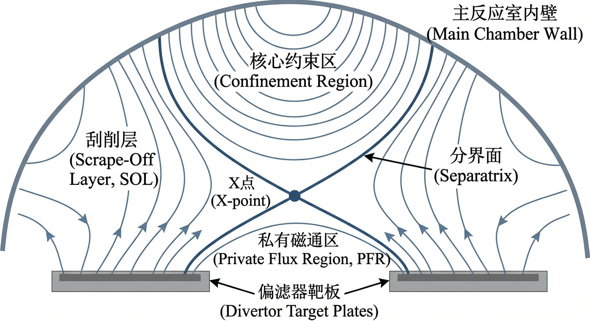
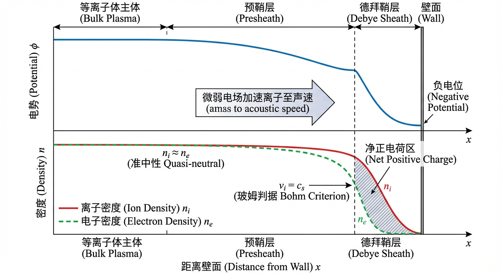
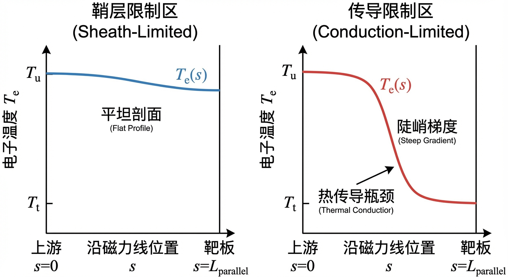
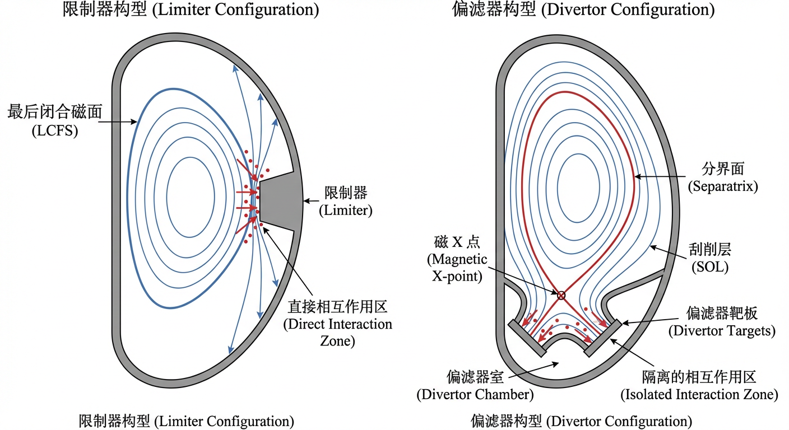
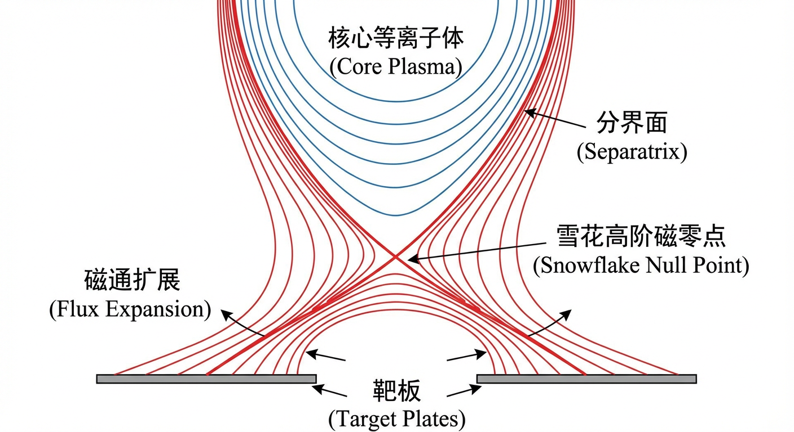
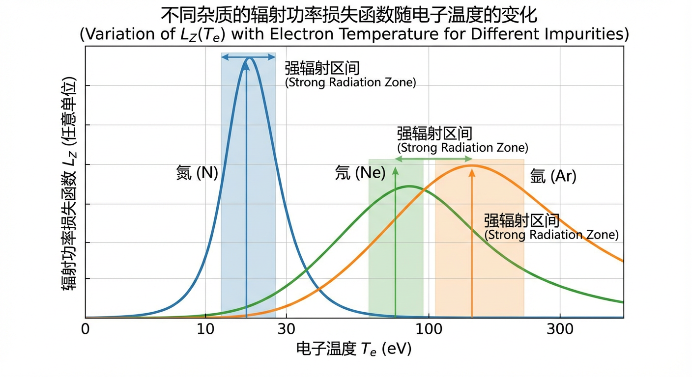
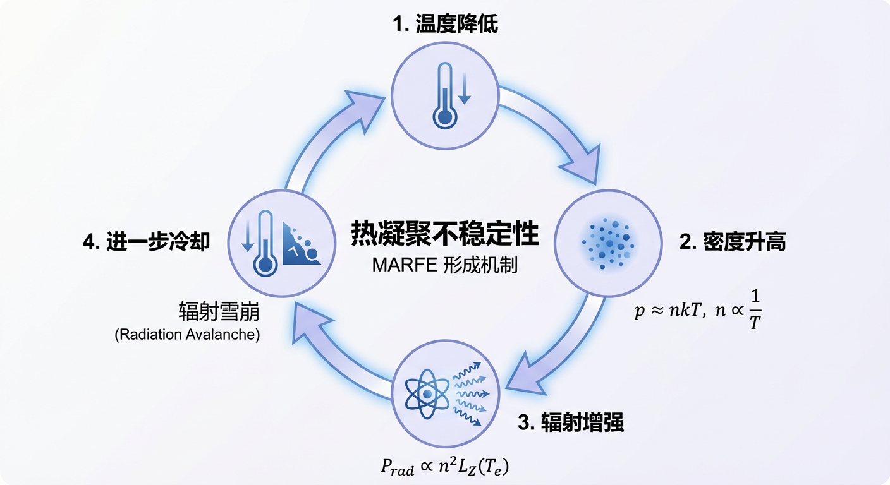
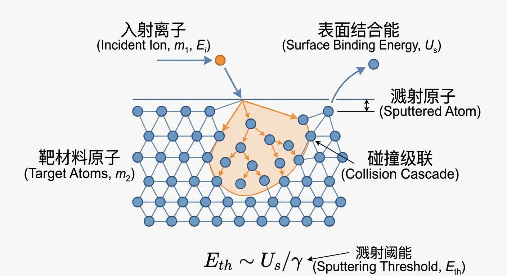

# 第8章：边界物理、功率排出与等离子体-材料相互作用窗口

## 8.0 项目概述

在掌握了可控核聚变的核心约束原理后，我们不仅要设法在地球上创造并约束一颗微型“太阳”，更面临着一个同样严峻的挑战：如何为其设计一个安全、高效的“排气系统”。聚变反应堆核心的等离子体温度高达亿度，其内部的能量与粒子不可避免地会向外泄漏。为了帮助读者从理论走向实践，深刻理解这一复杂过程，本章引入了一个贯穿始终的实战项目——**“设计下一代聚变堆的偏滤器与边界防护系统”**。

本项目旨在模拟聚变工程师的实际工作流程。我们将从零开始，逐步构建一个能承受极端热负荷的边界系统。项目的推进完全依赖于各节所学的物理知识：从定义边界的磁拓扑开始，到设计热通量控制方案，再到选择能够抵御侵蚀的装甲材料。  
*   在 **8.1节**，我们将从磁拓扑与刮削层/鞘层的定义出发，建立边界区域的物理边界条件与输运框架，为后续工程设计做概念与定量准备。  
*   在 **8.2节**，利用磁拓扑知识，我们将对比不同的偏滤器构型（如 Super-X 与 Snowflake），评估它们在降低热通量和提升中性粒子闭合度方面的潜力。  
*   在 **8.3节**，我们将通过守恒定律配平核反应方程式，理解粒子鉴别与边缘辐射功率排出之间的联系，并从微观层面掌握能量耗散的机制。  
*   在 **8.4节**，我们将作为材料科学家，根据溅射阈值、热导率等参数，为反应堆的不同部位选择最合适的“盾牌”材料。  

通过这个项目，你将不再是被动的知识接收者，而是主动的系统设计者，亲身体验如何将抽象的物理公式转化为具体的工程解决方案。让我们开启这段驾驭亿度烈焰的旅程。

## 8.1 SOL与鞘层约束

### 引言

在追求可控核聚变的宏伟征途中，我们不仅要设法在地球上创造并约束一颗微型“太阳”，更面临着一个同样严峻的挑战：如何为其设计一个安全、高效的“排气系统”。聚变反应堆核心的等离子体温度高达亿度，其内部的能量与粒子不可避免地会向外泄漏。这股强大的能流与粒子流，若不加控制地直接冲击反应堆内壁，足以在瞬间熔化或蒸发任何已知材料。因此，理解并驾驭这股能量流的输运，是决定聚变装置能否长时、稳定运行的先决条件。

这道难题的答案，深藏于等离子体与物质世界交锋的最前线——一个被称为刮削层（Scrape-Off Layer, SOL）的边界区域，以及在其末端形成的、尺度极薄却物理过程极其丰富的等离子体鞘层（plasma sheath）。本节将作为一扇教学透镜，引领读者深入探索刮削层与鞘层的物理世界。我们将从定义边界的磁场拓扑结构出发，揭示粒子与能量在开放磁力线上的输运法则，辨析由等离子体碰撞性决定的两种截然不同的输运机制——传导限制与鞘层限制，并阐明鞘层作为最终边界所施加的不可动摇的约束。通过本节的学习，读者将能够构建起关于等离子体边界物理的系统性认知，为理解后续章节中更为复杂的偏滤器设计与功率排出策略奠定坚实的理论基础。

### 磁场拓扑与刮削层的形成

在托卡马克（tokamak）这类轴对称磁约束装置中，核心等离子体的宏观平衡由磁流体动力学（Magnetohydrodynamics, MHD）方程所描述，其力学平衡可概括为等离子体压力梯度与洛伦兹力的抗衡（$\nabla p = \mathbf{J}\times\mathbf{B}$）。在这种平衡态下，磁场展现出高度有序的拓扑结构，是实现粒子与能量长时约束的根本。

为了定量描述这种结构，我们引入一个标量函数——极向磁通函数（poloidal magnetic flux function）$\psi(R,Z)$，其中 $(R,Z)$ 为极向截面上的柱坐标。根据其定义，磁力线处处沿着 $\psi$ 的等值面缠绕，即 $\mathbf{B}\cdot\nabla\psi = 0$。因此，$\psi$ 的等值线在极向截面上描绘出了一系列嵌套的环形磁通量面（magnetic flux surfaces）。

通过在装置外部精心布置一系列极向场线圈，我们可以在等离子体区域的边缘创造出一种特殊的拓扑结构。当某个位置的极向磁场（poloidal magnetic field）$B_p$ 为零时（等价于 $\nabla\psi=\mathbf{0}$），若该点在数学上对应于 $\psi$ 函数的一个鞍点，我们称之为磁 X 点（magnetic X-point）。值得强调的是，在托卡马克中，X 点处的总磁场强度 $|\mathbf{B}|$ 并不为零。这是因为尽管极向磁场 $B_p$ 消失，但强大的环向磁场（toroidal magnetic field）$B_\phi$ 依然存在，因此 $|\mathbf{B}|\approx |B_\phi|\neq 0$。

穿过 X 点的这条特殊的磁通等值线被称为**分界面（separatrix）**。分界面在拓扑上如同一道分水岭：其内部，磁力线在环形磁面上自我闭合，形成了核心**约束区（confinement region）**；而在其外部，磁力线不再闭合，而是“开放”的，它们的端点将延伸并最终与反应堆的实体部件（如偏滤器靶板或限制器）相交。这个由开放磁力线构成的区域，被精确地定义为**刮削层（Scrape-Off Layer, SOL）**。

刮削层的物理特性由一个核心特征主导：极端的**输运各向异性（transport anisotropy）**。由于等离子体被强磁场高度磁化，带电粒子沿磁力线的输运远比跨越磁力线的输运快得多。我们通常用平行热导率 $\kappa_{\parallel}$ 和垂直热导率 $\kappa_{\perp}$ 来描述这一现象，其关系为 $\kappa_{\parallel}\gg\kappa_{\perp}$。这种极端的各向异性与开放的磁拓扑结构相结合，是理解刮削层功能的关键：一旦粒子或热量通过缓慢的垂直输运（如湍流）从核心区泄漏至刮削层，它们就会被快速的平行输运“引导”或“刮削”至偏滤器靶板，从而保护主反应室的内壁。

此外，在现代偏滤器位形中，分界面还将刮削层与另一个区域隔开——**私有磁通区（Private Flux Region, PFR）**。该区域由 X 点下方、连接内外偏滤器靶板的开放磁力线构成。由于 PFR 在拓扑上与核心等离子体完全不连通，它在控制杂质和中性粒子方面扮演着独特的角色。

### 平行输运与鞘层约束

刮削层中的等离子体沿着磁力线从上游（通常指靠近核心等离子体的中平面区域）流向下游的材料表面。这一过程的终点，即等离子体与固体壁的交界面，由一个被称为**等离子体鞘层（plasma sheath）**的薄边界层所支配，它为整个刮削层的平行输运施加了至关重要的边界条件。

#### 等离子体-壁边界：鞘层与玻姆判据

当等离子体接触一个电学悬浮的固体表面时，由于电子的质量远小于离子，其热速度要快得多，因此会率先到达壁面，使壁面带上负电。这个负电位会排斥绝大多数电子，同时加速正离子向壁面运动，直至达到一种动态平衡——流向壁面的净电流为零。这个在壁面附近形成的、电荷不再中性的薄层就是德拜鞘层（Debye sheath），其厚度约为几个德拜长度（Debye length）$\lambda_D$。

然而，一个稳定的、电势单调下降的鞘层结构要得以形成，必须满足一个前提条件。通过分析鞘层入口处的电荷密度对电势变化的响应，可以证明，离子在进入鞘层时必须已经具备一个最小速度。这个条件被称为**玻姆判据（Bohm criterion）**，它要求离子进入鞘层的速度 $v_i$ 至少等于当地的**离子声速（ion acoustic speed）** $c_s$：
$$
v_i \ge c_s = \sqrt{\frac{k_B(T_e + \gamma_i T_i)}{m_i}}
$$
其中 $T_e$ 和 $T_i$ 分别是电子和离子温度，$m_i$ 是离子质量，$k_B$ 是玻尔兹曼常数，而 $\gamma_i$ 是离子多方指数（polytropic index），反映了离子在流动过程中的热力学行为。（在常用近似 $T_i\ll T_e$ 且离子近似等温时，可取 $c_s\simeq\sqrt{k_B T_e/m_i}$。）

这个判据的物理意义在于：如果离子速度太慢，它们在鞘层电场中减速时会过度“堆积”，其密度的增加会超过因电势排斥而减少的电子密度，从而无法形成一个稳定的、单调的正空间电荷区。只有当离子以足够高的动能“冲”入鞘层时，才能确保鞘层结构的稳定性。

那么，离子是如何被加速到声速的呢？在德拜鞘层的上游，存在一个更宽广的、满足准中性（$n_i \approx n_e$）的**预鞘层（presheath）**区域。在这个区域中，存在一个由电子压力梯度驱动的微弱电场，它虽然不足以打破电中性，但作用在整个预鞘层的尺度上，足以将来自上游的亚声速离子逐步加速，使其在鞘层入口处恰好达到玻姆判据所要求的声速。

#### 输运机制：鞘层限制与传导限制

刮削层中的平行热输运机制，很大程度上取决于等离子体的**碰撞性（collisionality）**。我们可以定义一个无量纲参数，即刮削层碰撞性 $\nu_{SOL}^* \equiv L_{\parallel}/\lambda_{ee}$，它比较了系统的特征尺度——磁力线连接长度（parallel connection length）$L_{\parallel}$——与电子的碰撞平均自由程 $\lambda_{ee}$。根据 $\nu_{SOL}^*$ 的大小，平行热输运呈现出两种截然不同的极限状态。

##### 鞘层限制区

当等离子体温度很高或密度很低时，碰撞性极低（$\nu_{SOL}^*\ll 1$），电子在从上游到达靶板的途中几乎不发生碰撞。在这种**鞘层限制（sheath-limited）**区域，平行热传导极其高效，足以将沿磁力线的温度梯度显著削弱，使得上游温度与靶板附近温度近似相等（$T_u\approx T_t$）。此时，限制能量流向靶板的瓶颈，不再是等离子体自身的输运能力，而是鞘层本身对能量与粒子通量的边界条件。

总的平行热通量 $q_{\parallel}$ 由鞘层边界的粒子通量和每个粒子携带的能量决定。根据玻姆判据，粒子通量由离子声速 $c_s$ 设定，而能量则由鞘层热传输系数（sheath heat transmission coefficient）$\gamma$ 描述。因此，热通量可以表示为：
$$
q_{\parallel} \approx \gamma\, n_t k_B T_t\, c_s
$$
由于 $c_s \propto \sqrt{T_t}$，我们得到 $q_{\parallel}\propto n_t T_t^{3/2}$。这个标度关系清晰地揭示了鞘层限制热通量的物理图像：它由靶板前的粒子密度（能量载体数量）和温度（每个载体的能量及输运速度）共同决定。

##### 传导限制区

当等离子体密度很高或温度很低时，碰撞性变得非常高（$\nu_{SOL}^*\gg 1$），电子在沿磁力线运动时会经历大量碰撞。在这种**传导限制（conduction-limited）**区域，能量的输运过程类似于经典的热传导，必须存在一个显著的温度梯度（通常 $T_u\gg T_t$）才能驱动热量流动。此时，限制能量流动的瓶颈是等离子体沿磁力线有限的热传导能力。

电子平行热传导由经典的 **Spitzer–Härm** 定律描述，其热导率 $\kappa_{\parallel}$ 对电子温度有强烈的非线性依赖，$\kappa_{\parallel}=\kappa_0 T_e^{5/2}$。假设刮削层中没有体积能量源或汇，平行热通量 $q_{\parallel}$ 沿磁力线守恒。对热传导方程 $q_{\parallel} = -\kappa_{\parallel}\, \mathrm{d}T_e/\mathrm{d}s$ 沿磁力线从上游（$s=0,\, T_e=T_u$）到下游（$s=L_{\parallel},\, T_e=T_t$）进行积分，可得：
$$
T_u^{7/2}-T_t^{7/2}=\frac{7}{2}\frac{q_{\parallel}L_{\parallel}}{\kappa_0}
$$
这个关系式，即著名的**两点模型（two-point model）**的核心，揭示了一个至关重要的物理图像：在传导限制区，我们可以通过增加连接长度 $L_{\parallel}$ 或通过增强体积能量损失（如辐射）来降低 $q_{\parallel}$，从而在维持上游高温的同时，在偏滤器靶板处获得更低的温度。这正是实现“脱靶”运行、从而大幅降低靶板热负荷的物理基础。

从该模型中还可以推导出不同机制下上游温度对输入功率（或 SOL 功率通量）的敏感度。在传导限制区，常得到 $T_u \propto P_{SOL}^{2/7}$ 的弱响应；而在鞘层限制区（在其他参数近似不变的理想化条件下），常得到更强的功率依赖标度。通过实验测量这类标度关系，可作为判断刮削层所处输运机制与能量损失机制的重要证据。

#### 动理学效应与计算模型中的通量限制

Spitzer–Härm 定律是基于流体描述的，它隐含地假设电子分布函数接近于局域麦克斯韦分布。这一假设在碰撞性足够高的传导限制区是成立的。然而，当碰撞性极低（$\lambda_{ee}\gtrsim L_{\parallel}$）时，该假设失效，电子输运呈现出**非局域性（non-local）**。此时，流体模型可能预测出超过物理上限的、非真实的巨大热流。

为了在流体模型中计入这种动理学饱和效应，计算物理学家引入了**热流限制器（flux limiter）**的概念。这是一种唯象的修正方法，它为经典传导热流设定了一个动理学上限，通常与电子的自由流热通量（free-streaming heat flux）相联系。一种常见的形式是：
$$
q_{\parallel}=\min\left(\left|-\kappa_0 T_e^{5/2}\frac{\mathrm{d}T_e}{\mathrm{d}s}\right|,\ \alpha\, n_e k_B T_e\, v_{th,e}\right)
$$
其中 $v_{th,e}$ 是电子热速度，$\alpha$ 是量级为 0.1–0.3 的限制因子。这种方法使得计算程序能够在高碰撞区自动恢复为 Spitzer–Härm 定律，而在低碰撞区平滑地过渡到物理上合理的饱和热流水平，从而实现了对不同输运状态的统一描述。

### 垂直输运与等离子体-中性粒子耦合

至此，我们主要关注了沿磁力线的平行输运，它决定了能量和粒子如何被“排空”。然而，刮削层的径向结构，即其宽度，则是由缓慢的**垂直输运（cross-field transport）**与快速的平行损失之间的一种精细平衡所决定的。

垂直输运主要由等离子体中的**湍流（turbulence）**驱动。由于刮削层中存在陡峭的压力梯度，会激发各种不稳定性，产生波动的电场。这些电场与主磁场相互作用，产生 $\mathbf{E}\times\mathbf{B}$ 漂移，从而将粒子和能量以“团块”或“细丝”（blobs/filaments）的形式向外输运。刮削层的特征宽度，如功率衰减长度 $\lambda_q$，可以近似地理解为 $\lambda_q \sim \sqrt{\chi_{\perp}\tau_{\parallel}}$，其中 $\chi_{\perp}$ 是有效垂直热扩散系数，$\tau_{\parallel}\sim L_{\parallel}/c_s$ 是平行损失的特征时间。正是这种垂直输运不断地为刮削层“填充”来自核心区的粒子和能量。

此外，当等离子体与壁面相互作用时，会中和并以**中性原子或分子**的形式返回等离子体，这个过程称为**再循环（recycling）**。这些中性粒子不受磁场约束，可以在边界区域自由穿行，直到它们与等离子体发生碰撞。关键的相互作用包括：

*   **电子碰撞电离**：中性粒子被电子电离，成为新的等离子体粒子源。  
*   **电荷交换（charge exchange）**：一个快速的等离子体离子与一个慢速的中性原子交换电子，这构成了等离子体平行流动动量的重要损失机制。  

这些**等离子体-中性粒子耦合（plasma-neutral coupling）**过程，在刮削层物理中扮演着至关重要的角色，尤其是在高密度、低温的偏滤器区域。它们是后续章节将要深入探讨的**偏滤器脱靶（divertor detachment）**现象的物理基础。由于中性粒子输运的复杂性，精确建模通常需要依赖**动力学蒙特卡罗（kinetic Monte Carlo）**方法，如 EIRENE 程序，来追踪大量中性粒子在复杂几何中的运动轨迹和碰撞过程。

### 小结

本节为我们描绘了可控核聚变装置中等离子体边界的基本物理图像。我们从磁场拓扑结构出发，理解了刮削层（SOL）作为连接炽热核心与冰冷器壁的“开放通道”的本质。其核心特征是输运的极端各向异性，即沿磁力线的平行输运远快于垂直输运。

在平行输运的终点，等离子体鞘层扮演着“守门人”的角色，它通过玻姆判据为流向壁面的等离子体设定了最小速度——离子声速，从而约束了粒子和能量的损失。基于等离子体碰撞性的高低，平行热输运呈现出两种截然不同的机制：由鞘层边界条件与饱和效应共同决定的“鞘层限制”区，和由等离子体自身导热能力决定的“传导限制”区。两点模型为我们提供了一个理解这两种机制及其转换的简化而强大的理论框架。

本节建立的这些关于刮削层和鞘层的基本概念，构成了整个第八章乃至后续章节的基石。它们是理解偏滤器拓扑设计（8.2节）、辐射功率排出（8.3节）以及最终的等离子体-材料相互作用（8.4节）等更为复杂的工程物理问题的出发点。对 SOL 与鞘层约束的深刻理解，是通往成功驾驭聚变能这条漫长而充满挑战的道路上，不可或缺的第一步。在接下来的章节中，我们将看到这些基础原理如何被应用于设计更为精巧的偏滤器系统，以应对未来聚变反应堆的极端挑战。

## 8.2 偏滤器拓扑与热通量控制

在上一节中，我们已经建立了刮削层（SOL）的基本物理图像，认识到能量沿着磁力线的平行输运远快于垂直输运，这使得热负荷在靶板上高度集中。本节将利用这些原理，深入探讨如何通过操纵磁场几何来“驯服”这股能量流。偏滤器（divertor）的设计，不仅仅是物理概念的体现，更是决定聚变堆工程可行性的关键环节。

### 磁拓扑与边界构型

在托卡马克等轴对称环形装置中，等离子体的宏观平衡由磁流体动力学（MHD）所描述，其核心特征是等离子体压强梯度与洛伦兹力相抗衡（$\mathbf{J}\times\mathbf{B}=\nabla p$）。在理想平衡态下，磁力线并非杂乱无章，而是规则地缠绕在一系列嵌套的环形磁面上。这些磁面由极向磁通函数（poloidal flux function）$\psi(R,Z)$ 的等值线在极向截面上描绘而出。

定义等离子体边界的方式从根本上决定了装置与等离子体的相互作用模式，由此产生了两种基本的边界构型：限制器与偏滤器。

**限制器构型**是一种通过物理部件定义等离子体边界的简单策略。它将一个或一组由耐高温材料制成的部件伸入真空室，直接“刮削”等离子体的边缘。在此构型中，最后闭合磁面（Last Closed Flux Surface, LCFS）被定义为不与限制器相切的最外层闭合磁面。任何穿越 LCFS 的粒子，都将在沿磁力线运动有限的距离（即平行连接长度 $L_{\parallel}$）后撞击到限制器上。这种构型的磁拓扑结构相对简单，不涉及特殊的磁场奇点，但其代价是剧烈的等离子体-材料相互作用直接发生在主等离子体附近，难以有效处理高热负荷并容易造成核心污染。

相比之下，**偏滤器构型**则是一种更为精巧的磁控边界方案。通过在装置的特定位置（通常是顶部或底部）布置强电流的极向场线圈，可以在等离子体主约束区之外创造出一种特殊的拓扑结构——**磁 X 点**（magnetic X-point）。在 X 点处，极向磁场（poloidal magnetic field）$B_p$ 为零，使得该点的磁通函数 $\psi$ 梯度为零，且其二阶导数（Hessian 矩阵）呈现鞍点特性，即 $\nabla\psi=\mathbf{0}$ 且 $\det(H[\psi])<0$。值得强调的是，尽管 $B_p$ 为零，但强大的环向磁场 $B_\phi$ 依然存在，因此 X 点处的总磁场强度 $|\mathbf{B}|\approx |B_\phi|$ 远非为零。穿过 X 点的特殊磁通面被称为**分界面**（separatrix），它如同一道分水岭，将内部具有闭合磁力线（理想化极限下 $L_{\parallel}\to\infty$）的核心约束区，与外部磁力线通向材料表面的开放区域——**刮削层**（Scrape-Off Layer, SOL）——清晰地分离开来。这些开放的磁力线被“偏转”并引导至远离核心的、专门设计的**偏滤器室**（divertor chamber）内，最终撞击在**偏滤器靶板**（divertor target）上。这种设计巧妙地将剧烈的等离子体-材料相互作用隔离在特定区域，为主动控制和耗散巨大的能量流创造了条件。

这些不同的拓扑结构也深刻地影响了等离子体的稳定性。在分界面附近，由于 $B_p$ 在几何上较小，安全因子 $q$（在大长细比近似下可理解为 $q\propto B_\phi/B_p$）以及磁剪切可能显著增大。这种增强的剪切对某些不稳定性具有抑制作用，但也会使得边界区域对外部的非轴对称磁扰动更加敏感，例如施加共振磁扰动（Resonant Magnetic Perturbations, RMPs）时，靶板上的打击点会分裂成复杂的螺旋状结构。

### 偏滤器物理与热负荷控制

偏滤器的核心使命是安全地处理从主等离子体边界进入 SOL 的高功率通量（对未来反应堆而言可达数十至数百兆瓦量级的总功率）。这要求我们深入理解能量从刮削层到靶板的输运物理，并利用其规律来缓解热负荷。

#### 热通量输运：宽度与几何的挑战

从核心区跨越分界面进入刮削层的功率 $P_{sep}$，主要沿着磁力线以极高的平行热通量（parallel heat flux）$q_{\parallel}$ 流向偏滤器。然而，实验和理论均表明，这个能量通道在径向上的宽度——即**热通量宽度**（heat flux width）$\lambda_q$——非常狭窄，通常只有几毫米。著名的多装置经验定标律——**Eich 标度律**更进一步指出，在强等离子体电流（从而边缘极向场 $B_p$ 较大）的运行模式下，$\lambda_q$ 往往更窄（常见形式为 $\lambda_q\propto 1/B_p$ 或等价表述），这使得热负荷问题愈发严峻。

面对如此集中的能量流，首要的缓解策略是利用磁场几何进行“功率扩展”。这主要通过两种方式实现：第一，**靶板倾斜**。通过让磁力线以一个极小的掠射角 $\alpha$ 入射到靶板上，可以将法向热通量 $q_{\perp}$ 降低为 $q_{\perp}=q_{\parallel}\sin\alpha$。第二，**磁通扩展**（magnetic flux expansion）$f_{\exp}$。由于磁通守恒给出 $B A_{\perp}\approx \text{const}$，且在近似忽略体积损失时沿通量管的功率守恒可写为 $q_{\parallel}A_{\perp}\approx \text{const}$，因此可得 $q_{\parallel}/B\approx \text{const}$。由此，通过在靶板附近设计一个弱磁场区，就可以有效降低到达靶板的 $q_{\parallel}$。磁通扩展因子 $f_{\exp}$ 可理解为通量管截面积的扩展比，常与上游与靶板处磁场强度之比相关联。作为工程量级示例，减小掠射角与增大磁通扩展确实能够显著降低局部峰值热负荷；具体降温幅度依赖于输入功率、导热、辐射与材料/几何细节，应以装置与工况的热工水力计算为准。

#### 连接长度与输运机制的转变

磁拓扑结构还决定了另一个关键参数——**平行连接长度**（parallel connection length）$L_{\parallel}$。偏滤器位形由于磁力线需绕过 X 点区域并进入偏滤器腿，其 $L_{\parallel}$（典型值可达几十米甚至更长）通常远长于限制器位形（典型值为几米量级）。这一差异是影响刮削层平行输运机制的重要因素。

我们可以通过一个无量纲的**碰撞性参数** $\nu_*\equiv L_{\parallel}/\lambda_e$ 来区分两种输运状态，其中 $\lambda_e$ 是电子的平均自由程。  
*   **鞘层限制区**（sheath-limited regime, $\nu_*\ll 1$）：常见于短 $L_{\parallel}$ 的限制器等离子体。等离子体碰撞稀少，能量输运瓶颈在于靶板前鞘层边界条件与饱和效应，温度沿磁力线几乎是平坦的。  
*   **传导限制区**（conduction-limited regime, $\nu_*\gg 1$）：常见于长 $L_{\parallel}$ 的偏滤器等离子体。频繁的碰撞使得电子热传导成为能量输运的瓶颈，必须存在一个陡峭的温度梯度才能驱动热流。根据 Spitzer–Härm 热导率（$\kappa_e\propto T_e^{5/2}$）推导的**两点模型**（two-point model）表明，在这种情况下，$q_{\parallel}\propto T_u^{7/2}/L_{\parallel}$（$T_u$ 为上游温度，且忽略体积源汇）。  

因此，从限制器到偏滤器的转变，通过将 $L_{\parallel}$ 增加一个量级，往往将系统推向更接近传导限制的状态。这为在到达靶板前通过体积过程耗散能量创造了条件，是许多先进功率排出方案的物理基础。

### 主动热通量控制：辐射、脱靶与先进位形

仅靠几何扩展仍不足以应对未来聚变堆的挑战，必须引入主动的能量耗散机制。

#### 辐射冷却与偏滤器脱靶

最有效的能量耗散方式是在能量到达靶板前，通过体积辐射将其转化为光子。这通常通过向偏滤器区域注入少量低 $Z$ 或中 $Z$ 杂质（如氮 N、氖 Ne）来实现，即**杂质注入**（impurity seeding）。这些杂质在偏滤器典型的低温高密度环境下，具有较高的**线辐射**效率，能够将相当比例的输入功率以辐射形式耗散出去。

当辐射和与中性粒子的动量交换过程足够强时，偏滤器等离子体可以进入一种被称为**脱靶**（detachment）的理想运行状态。其标志是：靶板附近的等离子体温度下降到几个 eV 量级，同时轰击靶板的粒子和热量通量在经历一个“高再循环”峰值后，发生“翻转”（rollover）并显著降低。这一状态的实现，根植于动量损失（主要由离子与中性原子的电荷交换与弹性碰撞引起）导致的靶板处压强降低，以及低温下体积复合（volumetric recombination）过程增强并成为重要的粒子汇。

为了实现和维持稳定的脱靶，**偏滤器闭合度**（divertor closure）至关重要。通过安装挡板等工程结构，可以有效限制中性粒子从偏滤器区域逃逸，从而提高局域中性气体密度。这不仅增强了动量和能量的体积耗散，还有助于将靶板溅射产生的杂质“屏蔽”在偏滤器内部，防止其污染核心等离子体。

#### 先进偏滤器拓扑

为了将功率排出能力推向极致，研究人员发展了一系列先进的偏滤器拓扑概念。  
*   **雪花偏滤器**（Snowflake Divertor）：通过精密的线圈控制，在偏滤器区域创造一个高阶磁零点，使极向磁场在零点附近呈更高阶的小量行为（理想化二阶零点可写为 $B_p=0$ 且 $\nabla B_p=\mathbf{0}$）。在此高阶零点附近，极向磁场的空间增长比标准一阶 X 点更缓慢，从而导致更大的局域磁通扩展和更长的有效连接长度。其分界面呈现出六瓣结构，并形成更复杂的私有磁通区（private flux region）拓扑，这不仅有助于摊薄热流，也可能增强辐射和中性粒子俘获，从而更易获得稳健的脱靶窗口。  

*   **Super-X 偏滤器**：这种方案采取了不同的设计哲学，即大尺度几何工程。它通过一个非常长的偏滤器“腿”，将靶板放置在远大于主等离子体半径的大主半径处。利用环向磁场 $B_\phi\propto 1/R$ 的特性，靶板处的磁场显著降低，从而获得巨大的磁通扩展。同时，极长的连接长度和更强的几何闭合为中性粒子提供了充足的体积进行能量和动量耗散，使其在实现脱靶方面具有天然优势。定性模型与实验/数值研究普遍表明，Super-X 与雪花偏滤器相对于传统偏滤器均可能显著降低峰值热通量，但其侧重点有所不同：前者侧重于大尺度几何布局与大半径弱场效应，而后者侧重于局域拓扑操控。  

*   **磁岛偏滤器**（Magnetic Island Divertor）：这是一种利用三维磁场效应的方案，常见于仿星器，也可通过在托卡马克中施加共振磁扰动场来形成边界磁岛结构。它在等离子体边界创造一个或一系列磁岛。磁岛的分界面将等离子体划分为核心区、岛内闭合区和开放的螺旋刮削层（Helical SOL, HSOL）。能量必须先通过磁岛附近的三维场结构，再沿着由稳定与不稳定流形引导的螺旋路径到达靶板。该拓扑结构可实现更长的有效连接长度，并将热量以螺旋带的形式分布到靶板上。通过精确控制三维磁场结构，可主动调控这些螺旋带的位置和宽度，从而实现对热负荷的精细控制。  

### 小结

本节内容揭示了磁场拓扑作为控制聚变等离子体边界相互作用和热量排出的核心工具所具有的强大威力与深刻的物理内涵。我们从区分限制器与偏滤器这两种基本边界构型出发，认识到通过引入磁 X 点和分界面，偏滤器从根本上改变了能量和粒子的排出路径，为应对极端热负荷提供了可能。

本节的核心逻辑链条可以概括为：**磁拓扑决定几何参数，几何参数影响输运机制，而输运机制决定了热负荷缓解策略的成败**。具体而言，偏滤器拓扑通过延长连接长度 $L_{\parallel}$ 往往使刮削层更接近传导限制状态，这是实现体积功率耗散和脱靶运行的重要前提；同时，通过增大磁通扩展 $f_{\exp}$ 和优化靶板倾角 $\alpha$，直接在几何上摊薄了热流。雪花、Super-X、磁岛等先进偏滤器概念，则是将这些基本原理推向极致的工程物理方案。

> **实战项目应用 I：先进偏滤器位形选择与评估**  
> 你的项目任务是为下一代高性能托卡马克设计偏滤器系统。你面临两个主要的先进位形选择：**Super-X 偏滤器**与**雪花（Snowflake）偏滤器**。  
> 为了做出正确的设计决策，你需要基于以下关键几何与物理参数的影响进行评估：  
> 1. **连接长度 ($L_{\parallel}$)**：磁力线从上游中平面到靶板的距离。  
> 2. **磁通扩展 ($f_{\exp}$)**：靶板处与上游磁通管截面积之比，近似由磁场强度比值决定。  
> 3. **中性粒子闭合度（Neutral Closure）**：中性粒子被限制在偏滤器区域内的能力。  
>   
> **项目任务：**  
> 根据本节所学的磁拓扑知识和热输运原理，对比这两种构型相对于传统单零点（Single-Null）偏滤器的优势。  
> * **问题**：请详细阐述 Super-X 和雪花偏滤器分别如何通过改变磁场几何（$B_\phi$ 或 $B_p$ 的空间分布）来影响 $L_{\parallel}$ 和 $f_{\exp}$？  
> * **推导**：利用磁通守恒原理 $B\cdot A_{\perp}\approx \text{const}$，推导 $f_{\exp}$ 与磁场强度 $B_{up}, B_{tgt}$ 的关系，并结合托卡马克中 $B_\phi\propto 1/R$ 的特性，解释为何 Super-X 将靶板移至大半径处能显著增加 $f_{\exp}$。  
> * **决策**：若你的设计目标是最大化中性粒子闭合度以实现更容易的脱靶，哪种位形（在不添加额外挡板的情况下）具有天然优势？为什么？  
>   
> （详细解答与分析将在本章总结部分提供）

理解本节内容，对于后续章节至关重要。它为我们即将在 8.3 节讨论的辐射配平与坍塌边界提供了物理场景，即这些辐射过程在何处发生、为何发生以及如何被利用。同时，它也为 8.4 节将要探讨的面向等离子体部件的材料响应设定了边界条件——正是偏滤器拓扑与热通量控制的成败，决定了材料将要面对的是可承受的温和环境，还是毁灭性的能量冲击。

## 8.3 辐射配平与坍塌边界

在上一节，我们设计了利用磁拓扑来“几何扩展”热流的偏滤器系统。然而，仅仅靠几何扩展在未来的聚变堆中往往是不够的。我们需要更主动的手段——在能量到达固体壁之前，将其转化为光子辐射出去。本节将深入探讨这种“软着陆”机制背后的物理——辐射配平，以及这种机制失效时可能引发的系统性坍塌。

### 等离子体中的辐射损失机制

等离子体，作为一团由带电粒子组成的“汤”，其内部时刻发生着剧烈的电磁相互作用。这些相互作用不可避免地伴随着电磁辐射的产生，构成了从等离子体中带走能量的直接通道。

#### 韧致辐射：库仑碰撞的“刹车”之光

当一个电子高速掠过一个离子时，它会在离子的库仑电场作用下发生偏转，其运动轨迹的改变意味着加速度的存在。根据经典电动力学，任何加速的电荷都会向外辐射电磁波。这种因带电粒子在碰撞中减速或“制动”而产生的辐射，被称为**韧致辐射**（bremsstrahlung）。在完全电离的聚变等离子体中，这主要是电子在离子电场中偏转时产生的连续谱辐射。

要量化总的韧致辐射功率，一个关键的物理洞见是，总辐射功率与电子密度 $n_e$、离子密度 $n_i$ 以及离子电荷数 $Z$ 的平方成正比，并与电子温度 $T_e$ 的平方根成正比。这种对 $Z^2$ 的强烈依赖性意味着，高电荷数的杂质离子对韧致辐射的贡献远超其在等离子体中的粒子数占比。

为了统一描述这种由多组分离子构成的复杂体系，我们引入了**有效电荷数（effective charge）** $Z_{\mathrm{eff}}$ 的概念，其定义为：
$$
Z_{\mathrm{eff}} \equiv \frac{\sum_{j} n_{j} Z_{j}^{2}}{n_{e}}
$$
其中求和遍及所有离子种类 $j$。$Z_{\mathrm{eff}}$ 的物理图像是，它刻画了多组分等离子体中库仑碰撞相关过程（如韧致辐射与电阻）对离子电荷态的加权敏感性。借助 $Z_{\mathrm{eff}}$，韧致辐射功率密度可简洁地表示为 $P_{\mathrm{Br}}\propto n_e^2 Z_{\mathrm{eff}}\sqrt{T_e}$。

这个参数的力量在于它揭示了“少量高 $Z$ 杂质即可显著抬升辐射与电阻”的效应。例如，在一个主要由氘（$Z=1$）和氦（$Z=2$）组成，但混入了仅占总离子数 1% 的全电离氩（$Z=18$）的等离子体中，尽管氩的粒子数占比极低，但其对 $Z_{\mathrm{eff}}$ 的贡献（正比于 $18^2=324$）却很强，足以使韧致辐射功率和电阻相关效应显著增加。因此，$Z_{\mathrm{eff}}$ 不仅是衡量等离子体纯净度的核心指标，更是决定核心等离子体基础辐射损失水平的关键参数。

#### 同步辐射：磁场中的回旋之舞

在强磁场约束的托卡马克中，电子被迫围绕磁力线做回旋运动。这种圆周运动本身就是一种加速运动，因此也会产生辐射，我们称之为回旋辐射（cyclotron radiation）。对于聚变堆芯部温度在 10–20 keV 量级的热电子群，其动能远小于其静止能量（$m_e c^2 \approx 511\,\mathrm{keV}$），因此它们处于弱相对论状态。此时的辐射主要集中在电子回旋频率的基频和低次谐波上，总功率相对较小，且在高密度等离子体中还会受到辐射输运与再吸收的影响。

然而，当电子被加速到相对论性速度时（例如，在等离子体破裂期间产生的能量可达 MeV 量级的“逃逸电子”），辐射的性质会发生根本性改变，演变为**同步辐射（synchrotron radiation）**。相对论效应会将辐射强烈地束缚在电子瞬时运动方向的一个极窄圆锥内，使得静止观测者接收到的是一串尖锐的、周期性的电磁脉冲。根据傅里叶分析，这种脉冲信号的频谱包含了大量高频谐波，它们融合在一起，形成一个准连续的宽谱辐射。同步辐射的功率随电子能量的增加而急剧增长，是影响逃逸电子能量演化的重要能量损失通道之一，同时，其独特的频谱特征也为诊断这些高能粒子群提供了宝贵的窗口。

#### 线辐射与辐射复合：杂质的原子指纹

在聚变等离子体中，最具威力且最富变化的辐射源，源自不完全电离的杂质离子内部的电子跃迁。这些杂质原子，即使在数千万度的高温下，也可能保留一部分束缚电子。当等离子体中的自由电子与这些杂质离子碰撞时，可能将其束缚电子激发到更高的能级。随后，这些被激发的电子会自发地跃迁回低能级，并以发射特定频率（波长）的光子的形式释放能量。由于原子能级是量子化的，这种辐射呈现出离散的谱线，故称为**线辐射（line radiation）**。

与线辐射密切相关的是**辐射复合（radiative recombination）**。这是一个自由电子被杂质离子俘获，直接跃迁到其某个束缚能级，同时将多余的能量以光子的形式辐射出去的过程。这个过程不仅直接贡献了辐射损失，更是改变杂质电荷态、进而影响其整体辐射能力的关键一环。

描述杂质辐射能力的核心是**辐射功率损失函数** $L_Z(T_e)$，它表征了在单位电子密度和单位杂质密度下，某种杂质在特定电子温度 $T_e$ 时单位体积的辐射功率。$L_Z(T_e)$ 对温度和杂质种类极为敏感，通常在某个特征温度区间达到峰值。例如，氮的辐射峰值常出现在约 10–30 eV 的区间，而氖的辐射峰值常出现在更高的温度区间（装置与电离平衡条件不同，峰值位置可有所变化）。这意味着，通过控制等离子体局域的温度，我们就有可能“点燃”或“熄灭”特定杂质的强辐射能力。

为了精确建模 $L_Z(T_e)$，我们必须求解一个复杂的原子动力学问题，即在各种碰撞和辐射过程的竞争中，杂质的电离态和激发态布居数如何达到平衡。在聚变等离子体中，通常有两种典型的平衡模型：  
*   **冕区平衡（Coronal Equilibrium, CE）**：适用于核心等离子体等低密度、高温环境。在此模型下，电子碰撞电离与辐射复合（包括更复杂的**双电子复合（dielectronic recombination, DR）**）相平衡，而电子碰撞激发则与自发辐射退激发相平衡。DR 是一种共振过程，一个入射电子在被俘获的同时激发了离子内的一个束缚电子，其复合速率在特定温度下可远超普通辐射复合，对电离平衡有重要影响。  
*   **局域热动平衡（Local Thermodynamic Equilibrium, LTE）**：适用于极高密度、低温环境，是一种理想化极限。在此模型下，许多原子过程趋向由碰撞主导，其逆过程也由碰撞主导。例如，电子碰撞电离与**三体复合（three-body recombination, TBR）**——一个电子在第三个粒子的辅助下被俘获——相平衡。由于 TBR 速率对电子密度（$\propto n_e^2$）和温度（$\propto T_e^{-9/2}$）有极强的依赖性，它在低温高密度区可成为重要的复合机制，显著促进等离子体的“中性化”。  

掌握这些辐射机制，特别是杂质线辐射的特性，是我们从被动地接受辐射损失，转向主动地利用辐射进行功率控制的第一步。

### 辐射配平：从能量汇到工程工具

尽管核心区的辐射通常被视为性能的“敌人”，但在等离子体边界，辐射却摇身一变，成为保护聚变装置的“守护神”。从等离子体核心逃逸出的功率通量可达极高水平，足以在短时间内造成严重材料损伤。因此，一个核心的工程策略是在这些能量到达实体部件之前，就通过辐射的方式将其耗散掉。这就是**辐射配平（radiation balancing）**或辐射功率排出的概念。

其核心思想是在等离子体刮削层（Scrape-Off Layer, SOL）或偏滤器（divertor）区域，通过主动注入少量中低 $Z$ 杂质（如氮、氖或氩），人为地创造一个强辐射区，即**辐射包层（radiative mantle）**。这个辐射包层就像一个高效的散热器，将集中的、沿磁力线传导的热流，转化为更弥散的光子辐射，并分布到更大面积的真空室壁上。

要理解这一过程，我们必须建立一个局域的能量平衡观念。在一个辐射包层区域，其热力学状态由能量的流入和流出决定。流入的能量主要来自上游核心区通过热传导输运来的热量，而流出的能量则包括向下游传导的热量和体积辐射损失。一个稳定的辐射包层，其状态必须满足局域的稳态能量平衡：体积辐射与其他体积损失总和，与输入到该区域的净功率相匹配。对聚变边界等离子体而言，辐射输运往往处于非局域、非 LTE 的稀薄辐射条件，常用的工程建模方法是将辐射作为能量方程中的体积损失项 $P_{\mathrm{rad}}=n_e n_Z L_Z(T_e)$ 来处理，而不是使用黑体辐射的局域平衡形式。

值得注意的是，这里的稳态能量平衡与严格的**热力学平衡（thermodynamic equilibrium, TE）**有本质区别。后者要求系统各处温度均匀，且辐射场是对应于该温度的各向同性黑体谱，这是聚变等离子体无法达到的理想状态。然而，通过精心设计，我们可以在一个开放的、非平衡的系统中创造出局域的、稳态的辐射主导耗散区。这正是辐射偏滤器设计的精髓所在，它将一个原本有害的物理过程，巧妙地转化为实现聚变工程可行性的关键技术。

### 辐射坍塌边界与MARFE现象

然而，利用辐射来配平能量是一场在悬崖边上的舞蹈。如果辐射冷却的能力过强，或者等离子体的密度超过某个临界值，整个能量平衡就会失控，导致**辐射坍塌（radiative collapse）**。这种现象在边界区的典型表现之一，是被称为 **MARFE** 的辐射不稳定结构。

#### 热凝聚不稳定性：辐射雪崩的物理根源

MARFE 的形成，源于一种被称为**热凝聚不稳定性（thermal-condensation instability）**的失控正反馈循环。我们可以通过一个思想实验来理解其机制。想象在等离子体边界有一小团等离子体，由于某种随机扰动，它的温度比周围略微降低。此时，会发生一系列连锁反应：

1. **等压收缩**：由于等离子体中的声波传播很快，这团微扰区域会较快与周围环境达到压力近似平衡。根据理想气体定律 $p=nkT$，在压强 $p$ 近似保持不变的情况下，温度 $T$ 的降低会导致密度 $n$ 的相应升高。  
2. **辐射增强**：杂质线辐射功率对密度和温度极为敏感，近似关系为 $P_{\mathrm{rad}}\propto n^2 L_Z(T_e)$。代入等压条件 $n\propto 1/T$，得到 $P_{\mathrm{rad}}\propto T^{-2} L_Z(T_e)$。在聚变等离子体边界典型的温度范围（数 eV 到数十 eV）内，许多常用杂质的 $L_Z(T_e)$ 在某些区间会随温度下降而上升。这意味着，温度的初始降低，将导致辐射功率在一定条件下进一步增强。  
3. **失控冷却**：增强的辐射带走了更多的能量，使得这团等离子体进一步冷却。这又导致其密度进一步上升，从而引发更强的辐射……如此循环往复，形成一场“辐射雪崩”。  

这种失控的冷却与致密化过程，与天体物理中某些辐射冷却导致的凝聚过程存在类比：当能量损失机制在某些温度区间增强时，系统会在越过临界条件后发生灾难性失稳。

#### MARFE的形态、位置及其对运行边界的定义

这种热不稳定性发展的最终产物，就是一个 **MARFE**（源于 **M**ultifaceted **A**symmetric **R**adiation **F**rom the **E**dge，即边缘多面不对称辐射）。它是一个空间上高度局域化的、非常稠密、温度较低且发出强烈辐射的等离子体结构。由于托卡马克环形几何中的输运特性与辐射/再循环分布，MARFE 常倾向于在环内侧（高场侧）形成，并可与 X 点附近的边界条件相关联，呈现出沿磁力线拉长而在垂直方向上较窄的带状或片状结构。

MARFE 的形成，常与托卡马克的某些运行边界相关联，尤其是在欧姆加热或边缘加热不足时更为明显。著名的**格林沃尔德密度极限（Greenwald density limit）**给出了最大线平均密度的经验定标：
$$
n_G\ (\!10^{20}\,\mathrm{m^{-3}})=\frac{I_p\ (\mathrm{MA})}{\pi a^2\ (\mathrm{m^2})}
$$
其中 $I_p$ 为等离子体电流，$a$ 为小半径。该经验极限与边缘辐射、再循环、中性粒子与杂质行为及 MHD 稳定性共同相关；在许多情形下，边缘强辐射结构（包括 MARFE）被视为接近密度极限的前兆之一。一旦边缘形成强辐射、低温、高密度结构并向上游发展，核心等离子体可能迅速冷却，能量约束退化，并增加发生破坏性大破裂（disruption）的风险。因此，MARFE 的出现常被用作密度极限或破裂风险上升的诊断信号之一。

#### MARFE的双重角色：从灾难到解决方案

物理学的魅力在于，一个过程的“好”与“坏”往往取决于其发生的地点和我们控制它的能力。在主等离子体边界失控的 MARFE 是运行风险，但如果我们将强辐射前沿控制在远离核心的**偏滤器**（divertor）区域，它就可能成为解决功率排出问题的重要手段之一。

这与**偏滤器脱靶（divertor detachment）**运行模式密切相关：通过向偏滤器中主动注入杂质气体并配合提高中性粒子密度，可在偏滤器腿内形成强辐射与强动量损失的区域（常被称为“辐射前沿”）。该前沿可以拦截来自上游的热流并降低靶板处的温度与粒子通量，从而将热负荷降至材料可承受的水平。在实际研究中，脱靶前沿与 MARFE 既存在相似的辐射不稳定特征，也存在重要差异：关键在于其空间位置是否被稳定地限制在偏滤器区，以及是否能通过反馈控制避免其向上游侵入主等离子体边界。

因此，现代聚变研究的一大核心挑战，便是在稳定性和性能之间进行精妙的权衡：既要通过增加密度和杂质在偏滤器中形成一个“有益”的强辐射前沿，又要确保该前沿不会失控地向上游移动，侵入核心等离子体，从而引发性能崩塌甚至破裂。这要求我们不仅对辐射物理有深刻理解，还需要发展先进的诊断与实时反馈控制系统，以将等离子体精确地维持在狭窄而关键的运行窗口之内。

### 小结

本节的探索揭示了辐射在可控核聚变中扮演的深刻而矛盾的角色。它既是源于基本电磁和原子过程的、不可避免的能量损失渠道，其强度被杂质的存在极大地放大；又是我们主动管理兆瓦级功率排出、实现未来聚变堆工程可行性的核心工具。从韧致辐射对等离子体纯度的敏感性，到线辐射作为调控旋钮的巨大潜力，再到 MARFE 作为边缘热辐射不稳定结构的双重性——风险信号与可控散热前沿的物理原型之一——对辐射的理解贯穿了从核心物理到边界工程的整个链条。

> **实战项目应用 II：核反应配平与粒子鉴别**  
> 在理解了宏观的辐射配平之后，我们需要回到微观层面，确认我们所使用的粒子种类。虽然偏滤器的辐射主要来自杂质原子的电子跃迁，但理解原子核本身的嬗变与反应是聚变物理的基础。  
>   
> **项目任务：**  
> 在模拟实验中，我们观测到了两种关键的核反应过程，这对理解粒子源和杂质控制至关重要。你需要利用核反应方程中的守恒定律（质量数 $A$ 守恒与电荷数 $Z$ 守恒）来识别未知的粒子。  
>   
> **场景 A：中子源的产生**  
> 考虑一种用于诊断或辅助加热的核反应（与硼的经典裂变反应相同的反应道）：  
> $$ ^{10}_{5}\mathrm{B} + \mathrm{X} \rightarrow ^{7}_{3}\mathrm{Li} + ^{4}_{2}\mathrm{He} $$  
> * **问题**：根据守恒律，确定入射粒子 X 的身份（是质子、中子还是其他？）。  
>   
> **场景 B：杂质的衰变**  
> 考虑聚变堆中可能产生的放射性同位素钇-90（Yttrium-90，$^{90}_{39}\mathrm{Y}$），它是一种纯 $\beta^-$ 辐射体（发射电子）：  
> $$ ^{90}_{39}\mathrm{Y} \rightarrow \mathrm{Daughter} + ^{0}_{-1}\beta $$  
> * **问题**：确定衰变后产生的子核（Daughter Nuclide）是什么元素？  
>   
> （详细解答与分析将在本章总结部分提供）

理解辐射配平与坍塌边界，本质上是理解一个非平衡开放系统的能量平衡及其稳定性。在本章的前几节中，我们已经探讨了能量和粒子如何被输运至边界，以及如何通过磁场拓扑进行初步管理。本节则聚焦于最终的能量耗散机制。在接下来的子章节（8.4 面向等离子体部件与材料响应）中，我们将完成这一逻辑闭环，审视那些历经辐射冷却后仍然到达固体表面的残余能量和粒子，将会对材料本身造成何种长期的、累积性的影响，从而将边界物理的讨论从等离子体本身延伸至其物质载体——反应堆内壁的工程现实。

## 8.4 面向等离子体部件与材料响应

前述章节已系统阐述了边界等离子体物理，描绘了能量与粒子如何通过刮削层（Scrape-Off Layer, SOL）输运至第一壁，以及如何通过磁拓扑设计与辐射配平策略对热通量进行初步管理。然而，这仅是故事的一半。当灼热的等离子体最终与物质世界交锋，这场对话的另一方——即面向等离子体部件（Plasma-Facing Components, PFCs）——如何响应？它们的响应又将如何反过来重塑边界条件，甚至决定整个聚变反应堆的命运？本节将视角从等离子体转向材料，深入探讨这个构成了聚变工程物理核心闭环的复杂领域。

我们将 PFCs 视为一个系统接口，其输入是来自刮削层和偏滤器的热流、粒子流及其能谱与角分布，其输出则是关乎反应堆可行性的关键指标：部件的侵蚀寿命、进入等离子体的杂质源项、燃料的滞留库存以及材料结构的长期完整性。通过建立这一框架，我们旨在阐明，本节并非孤立的材料科学探讨，而是边界物理不可或缺的下游约束。本章将循着三条相互关联的线索展开：首先是“原子被带走”的侵蚀问题，以溅射产额模型为核心，连接部件寿命与等离子体杂质控制；其次是“燃料被留下”的滞留问题，聚焦于氚的滞留与渗透，建立 PFC 与燃料循环及安全边界的接口；最后，我们将时间尺度拉伸至反应堆的整个服役期，考察“材料被改变”的辐射损伤问题，揭示其如何重塑前两个过程并最终限定 PFC 的服役窗口。

### 等离子体-材料相互作用：侵蚀、再沉积与杂质源

当高能等离子体离子撞击 PFCs 表面时，最直接的后果便是材料的侵蚀。这不仅损耗部件，更向等离子体中引入了非燃料的杂质原子，对聚变性能构成威胁。理解并量化这一过程，是 PFC 设计与评估的起点。

#### 溅射产额模型：从碰撞到侵蚀

材料侵蚀的主要物理机制是**物理溅射（physical sputtering）**，一个由入射粒子与靶材料原子之间发生动量传递所驱动的机械过程。当一个能量为 $E_i$ 的入射离子（质量 $m_1$）撞击固体表面时，它会与表面的靶原子（质量 $m_2$）发生一系列碰撞，引发一场短暂而剧烈的原子尺度雪崩，即**碰撞级联（collision cascade）**。如果级联中的某个近表面原子获得的、指向外部的动能超过了将它束缚在固体中的**表面结合能（surface binding energy）** $U_s$，该原子便会被“溅射”出去。

这一过程存在一个**溅射阈能（sputtering threshold energy）** $E_{th}$。基于二体碰撞运动学，可以用最大能量转移系数估算阈值与表面结合能及质量比的关系：
$$
E_{th}\sim \frac{U_s}{\gamma},\qquad \gamma=\frac{4m_1m_2}{(m_1+m_2)^2}
$$
其中 $\gamma$ 表征了入射粒子在一次弹性碰撞中向靶原子可转移的最大能量分数。此关系清晰地揭示了溅射的两个基本原则：首先，表面结合能 $U_s$ 越高的材料越难被溅射；其次，入射粒子与靶原子的质量比严重影响能量传递效率。对于轻的氘（D）离子（$m_1\approx 2\,\mathrm{u}$），当轰击同样是轻元素的铍（Be，$m_2\approx 9\,\mathrm{u}$）或碳（C，$m_2\approx 12\,\mathrm{u}$）时，能量传递相对高效，导致其溅射阈能较低（量级通常为数十 eV）。相比之下，当轰击重元素钨（W，$m_2\approx 184\,\mathrm{u}$）时，能量传递效率极低，因此其物理溅射阈能显著更高（典型量级可达 $\sim 200\,\mathrm{eV}$，具体数值与表面状态和入射角有关）。

描述溅射效率的核心参数是**溅射产额（sputtering yield）** $Y$，定义为平均每个入射离子能溅射出的靶原子数。$Y$ 对入射能量 $E_i$ 和入射角 $\theta$（相对于表面法线）有强烈的依赖性。当 $E_i>E_{th}$ 时，$Y$ 随能量增加而上升，但在更高能量（数 keV 量级及以上）时，由于离子穿透深度增加、能量沉积更深入，近表面可用于溅射的能量分数下降，产额可能达到峰值后下降。此外，随着入射角从垂直入射（$\theta=0^\circ$）向掠射角增加，离子在近表面层的路径变长，能量沉积更集中于表层，导致产额显著增加，通常在 $\theta \approx 60^\circ$–$75^\circ$ 时达到最大值。

对于某些材料，如碳，还存在**化学溅射（chemical sputtering）**。氢同位素离子与碳原子反应生成易挥发的碳氢化合物（如 $\mathrm{CH}_4$），从而在远低于物理溅射阈值的能量下造成显著侵蚀。这一机制对温度和表面化学状态极为敏感，是碳基材料面临的特有挑战。

#### 混合材料效应与净侵蚀

在真实的聚变装置中，PFCs 表面并非一成不变的纯净材料。来自不同部件的溅射产物会通过等离子体输运，在其他表面再沉积，形成**混合材料层（mixed-material layer）**。例如，主腔室的铍可能沉积在钨偏滤器上。这种表面成分的演变会极大地改变溅射行为。一个原本纯净的钨表面，由于其高 $E_{th}$，在面对能量为 $100\,\mathrm{eV}$ 的氘离子时几乎不会被溅射。然而，一旦其表面覆盖了一层薄薄的铍，入射离子将主要与铍原子相互作用。由于铍的溅射阈能远低于 $100\,\mathrm{eV}$，溅射产额会急剧增加，导致材料侵蚀速率的显著上升。

更重要的是，被溅射出的原子并非永远地离开了表面。它们作为中性粒子进入刮削层等离子体后，有较高概率在短距离内被电子碰撞电离。新生成的杂质离子带上了电荷，其运动将主要受电场和磁场的支配。离子在鞘层电场和磁力线的引导下，有很大概率被迅速输运回附近的 PFCs 表面，这一过程称为**再沉积（redeposition）**。因此，我们必须区分**总侵蚀（gross erosion）**（因溅射离开表面的总原子通量）和**净侵蚀（net erosion）**（总侵蚀减去再沉积的通量）。净侵蚀率才是决定部件寿命的最终指标。

一个完整的侵蚀/再沉积模型（例如 ERO 等代码所采用的思路）必须包含一系列耦合的物理过程：根据入射等离子体参数计算**溅射源**；追踪溅射出的中性原子在等离子体中的**输运和电离**；模拟新生成的杂质离子的**导向中心运动（guiding-center motion）**；最后计算其在壁面的**沉积**。计算与实验分析表明，较重的原子（如钨）在典型边界条件下更容易在靠近壁面处被电离并在局域电场作用下返回表面，从而可能具有较高的再沉积率。这使得高 $Z$ 材料虽然在某些条件下总溅射产额并非一定极低，但其净侵蚀率仍可能显著低于轻元素材料。

### 燃料滞留、渗透与屏障

当等离子体与材料相互作用时，一部分燃料原子（特别是放射性的氚）不会被“带走”，而是会被“留下”，即**氚滞留（tritium retention）**。过量的氚滞留不仅是燃料的损失，更是聚变安全领域的重大关切。同时，氚向结构部件深处的**渗透（permeation）**并泄漏到冷却剂等外部回路，也是必须严格控制的风险。

#### 氚滞留机制：注入与共沉积

氚在 PFCs 中的滞留主要通过两种机制发生。第一种是**注入（implantation）**，即高能的氚离子直接穿透材料表面并被植入近表面层。随后，这些氚原子可能在材料内部扩散，并被晶格缺陷所俘获。

第二种机制，也是对于使用碳或铍等低 $Z$ 材料的聚变装置中长期氚积累的重要贡献者，是**共沉积（co-deposition）**。这个过程与上一节讨论的侵蚀/再沉积循环紧密相连。当被溅射出的壁材料原子（如碳）与等离子体中的燃料粒子一同输运并沉积在装置中那些远离等离子体直接轰击的“阴影区”时，氚原子会被“活埋”在不断生长的沉积层中。由于这些阴影区温度较低且缺乏高能粒子轰击来促进氚的释放，通过共沉积滞留的氚相对稳定，难以去除。因此，在存在显著侵蚀的系统中，即使是远离主等离子体的区域，也可能成为巨大的氚库存。

#### 氚渗透与渗透障

氚作为一种轻气体原子，能够在固体材料中扩散，从而穿透真空容器壁，进入冷却系统或外部环境。描述这一过程的宏观物理框架由菲克定律（Fick’s laws）给出。对许多金属中的氢同位素渗透，稳态渗透通量常用**Sieverts 定律**与扩散耦合的形式表达，可写为：
$$
J=\frac{P}{L}\left(\sqrt{p_1}-\sqrt{p_2}\right)
$$
其中 $L$ 是材料厚度，$p_1,p_2$ 是两侧的氢同位素分压，而 $P$ 是材料的**渗透率（permeability）**。渗透率由**扩散系数（diffusivity）** $D$ 和**溶解度（solubility）** $S$ 的乘积决定，即 $P=D\cdot S$。$D$ 和 $S$ 都是强烈依赖于温度的材料本征属性。

为了将氚的泄漏控制在安全限值以内，必须采用**氚渗透障（Tritium Permeation Barrier, TPB）**。理想的 TPB 材料应具有极低的渗透率。这可以通过选择具有极低扩散系数的材料（如强共价键合的碳化硅 SiC），或具有极低溶解度的材料（如热力学稳定的氧化物 $\mathrm{Al_2O_3}$、$\mathrm{Er_2O_3}$）来实现。例如，在钢结构表面沉积一层数微米厚的氧化物陶瓷涂层，其渗透“电阻”（$L/P$）可以远大于基体本身，从而将总的渗透通量降低数个数量级，形成一个有效的**渗透减少因子（Permeation Reduction Factor, PRF）**。

### 替代方案与长期演化：液态金属与辐射损伤

固体 PFCs 面临的侵蚀、开裂和燃料滞留等根本性挑战，促使科学家探索替代方案，并深入研究材料在反应堆全寿命周期内的演化行为。

#### 液态金属壁：一种流动的“自愈”装甲

**液态金属壁（liquid metal wall）**，特别是采用锂（Li）或锡（Sn）等低熔点金属，为解决 PFCs 问题提供了一条新路径。与固体相比，液体展现出几大独特的优势：  
1. **自我修复**：液体不形成可长期累积的热应力裂纹网络，表面扰动可通过流动和表面张力快速平复。  
2. **蒸汽屏蔽（vapor shielding）**：在类似边缘局域模（Edge-Localized Modes, ELMs）的剧烈瞬态热负荷下，液态金属表面可能蒸发，形成金属蒸汽云。该蒸汽云可吸收、辐射并散射入射能量，从而降低下方材料所承受的瞬态热冲击。  
3. **粒子泵送**：液态锂对氢同位素具有较强的化学亲和力，其表面可降低边缘粒子再循环，在一定运行窗口内提供额外的粒子控制手段。  

当然，液态金属也带来了新的挑战，例如导电液体在强磁场中流动时产生的磁流体动力学（Magnetohydrodynamics, MHD）阻力、液膜稳定性与飞溅控制、以及液态金属蒸发或溅射对核心等离子体的潜在污染。

#### 辐射损伤：材料的缓慢嬗变

在 D–T 聚变反应堆中，PFCs 不仅要承受来自等离子体的热与粒子轰击，还必须面对来自聚变反应的 $14.1\,\mathrm{MeV}$ 高能中子的持续辐照。中子作为不带电粒子，能够穿透磁场深入材料内部，并与晶格原子发生碰撞。

一次高能中子碰撞可以将一个晶格原子（称为初级离位原子，Primary Knock-on Atom, PKA）以高能量撞出其平衡位置，并由此引发一场持续时间仅为皮秒量级的**位移级联（displacement cascade）**。这场微观“风暴”会在材料中留下大量的**点缺陷**，主要是**空位（vacancy）**和**间隙原子（interstitial atom）**。这些缺陷的累积，其程度通常用**每原子离位数（displacements per atom, dpa）**来衡量，是材料宏观性能退化的根源。

对于 PFCs 的响应而言，辐射损伤带来了两个尤为重要的后果：  
1. **辐照诱生陷阱与氚滞留**：由中子辐照产生的空位、空位团簇以及位错环等缺陷，对于扩散的氚原子而言是能量上有利的**俘获陷阱（trapping sites）**。这些陷阱，特别是具有高结合能的深陷阱，能够将氚原子牢固地束缚住，显著增加材料中的总氚库存。综合模型通常需要考虑陷阱的产生（与 dpa 率相关）和热退火/扩散释放之间的动态平衡，以预测稳态下的陷阱密度与氚滞留量。  
2. **氦泡与表面形貌演变**：聚变反应产生的 $\alpha$ 粒子（氦核）以及中子与材料原子发生的 (n,$\alpha$) 核反应，都会向材料中引入氦。由于氦在金属中溶解度极低，这些氦原子会在材料内部聚集，形成高压的**氦泡（helium bubbles）**。在特定温度和离子能量条件下，这些氦泡的演化会导致显著的表面形态改变。例如，近表面层氦泡的过压可能诱发表面**鼓泡（blistering）**与剥落；在一定温度窗口与低能氦等离子体持续作用下，钨等材料表面还可能形成被称为**“纳米绒毛”（nano-fuzz）**的多孔结构。形貌改变不仅影响材料的热学和力学性能，也改变其与等离子体的相互作用与再循环行为。  

### 小结

本节内容揭示了面向等离子体部件（PFCs）在聚变环境中响应的复杂图景。我们看到，PFCs 的性能与寿命并非由单一因素决定，而是由侵蚀、滞留和辐射损伤这三条主线交织而成的动态演化过程。

首先，以**溅射**为主导的侵蚀过程决定了杂质源的强度和部件的物理寿命。这一过程不仅受入射粒子能量、角度和材料本身性质的影响，更被再沉积效应深刻地调制，使得净侵蚀成为一个依赖于整个边界等离子体系统的复杂问题。其次，以**注入和共沉积**为机制的**氚滞留**，以及向结构深处的**渗透**，构成了燃料循环闭环和反应堆安全的关键约束。设计有效的渗透障需要对材料的扩散、溶解和陷阱特性有深刻的理解。最后，贯穿整个反应堆寿命的**辐射损伤**，通过不断产生晶格缺陷，从根本上改变了材料的微观结构和宏观属性。位移级联产生的空位成为氚的深陷阱，而氦的积累则可能催生鼓泡和纳米绒毛等表面结构，这些都使得 PFC 的响应行为随时间演化，具有强烈的历史依赖性。

> **实战项目应用 III：PFC材料选型与参数化评估**  
> 你的最终任务是为反应堆的三个关键区域（第一壁、限制器、偏滤器靶板）选择最合适的面向等离子体材料（PFCs）。你拥有三种候选材料：**钨 (W)**、**碳 (C)**、**铍 (Be)**。  
>   
> **项目任务：**  
> 1. **定义 PFCs**：首先明确“面向等离子体部件”的确切含义，排除非直接暴露于等离子体的支撑结构。  
> 2. **参数化建模**：作为一个计算建模者，你需要为这三种材料分配正确的物理参数值。  
>    * **关键参数**：溅射阈值能量（$E_{th}^{\mathrm{D}\to \mathrm{X}}$）、表面结合能（$U_s$）、热导率（$k$）、熔点（$T_m$）、原子质量（$M$）。  
> 3. **决策分析**：  
>    * 对于**氘 (D) 等离子体**环境，利用二体碰撞能量转移系数 $\gamma=\frac{4m_1m_2}{(m_1+m_2)^2}$ 解释为什么钨的溅射阈值（$E_{th}$）远高于铍和碳？  
>    * 分析热导率（$k$）和熔点（$T_m$）如何影响部件在热负荷下的生存能力（联系稳态与瞬态热传导的工程约束）。  
>    * **最终选择**：结合再沉积效应（redeposition），解释为什么尽管钨很重，但其净侵蚀率可能比轻元素更低？哪种材料最适合做高热负荷、低侵蚀要求的偏滤器靶板？  
>   
> （详细解答与分析将在本章总结部分提供）

由此可见，对 PFCs 材料响应的理解，是连接边界等离子体物理（第8章）、集成建模（第10章）以及聚变堆工程约束（第11章）的核心枢纽。从 PFCs 研究中得到的侵蚀源项、氚库存模型和材料寿命极限，将直接作为输入，用于评估等离子体性能、设计燃料循环系统和确定反应堆的最终运行窗口。这充分体现了可控核聚变作为一门多物理、多尺度综合性工程科学的内在逻辑与魅力。

## 总结

本章我们完成了一次从理论物理到工程实践的深度穿越，系统地构建了聚变装置边界系统的知识大厦。从 8.1 节刮削层（SOL）与鞘层的微观输运机制出发，我们建立了“磁力线是高速公路，垂直方向是乡间小道”的各向异性输运图像，并理解了玻姆判据如何作为物理法则在边界把守大门。8.2 节进一步展示了如何通过宏观的磁拓扑设计（偏滤器）来操控这些输运过程，利用几何扩展和连接长度的变化来缓解热负荷。8.3 节则引入了辐射这一强有力的能量耗散工具，并指出了其双刃剑性质——既能通过可控辐射前沿帮助实现脱靶保护壁面，也可能在边界形成强辐射结构（如 MARFE）并与性能坍塌风险相关。最后，8.4 节将所有这些能量和粒子流汇聚于材料表面，通过溅射、滞留和损伤模型，评估了工程部件的最终命运。

在本章的实战项目 **“设计下一代聚变堆的偏滤器与边界防护系统”** 中，我们通过三个具体的应用环节，将抽象的公式转化为设计决策。以下是针对各项目环节中核心问题的详细解析：

### 项目问题解答与解析

#### 1. 先进偏滤器位形选择与评估（对应 8.2 节）

**问题回顾**：对比 Super-X 与雪花（Snowflake）偏滤器在 $L_{\parallel}$、$f_{\exp}$ 和中性粒子闭合度上的差异。

**解析**：  
* **物理原理**：  
  * **磁通扩展 $f_{\exp}$**：定义为 $f_{\exp}=A_{\perp,tgt}/A_{\perp,up}$。由磁通守恒 $B A_{\perp}\approx \text{const}$，可得 $f_{\exp}\approx B_{up}/B_{tgt}$（这里的 $B$ 表示沿通量管取有效法向磁场强度的量级，用于工程估算）。在托卡马克中，总磁场常由环向磁场主导，且 $B_\phi\propto 1/R$。  
  * **连接长度 $L_{\parallel}$**：磁力线从上游到靶板的积分长度，受偏滤器腿几何与局域磁场分布共同决定。  
* **Super-X 偏滤器（SXD）**：  
  * **机制**：将靶板放置在更大的主半径 $R_{tgt}$ 处（长腿结构）。  
  * **效果**：由于 $B_\phi\propto 1/R$，靶板处的环向场 $B_{\phi,tgt}$ 显著降低，使 $B_{tgt}$ 量级下降，从而通过 $f_{\exp}\approx B_{up}/B_{tgt}$ 使 **$f_{\exp}$ 增加**。同时，几何上的长腿与螺旋磁力线共同导致 **$L_{\parallel}$ 显著增加**。  
  * **中性粒子闭合度**：长腿几何通常使偏滤器区与主腔室的直接连通性降低，在不加额外挡板时也可能获得相对更好的天然闭合条件，但闭合度的强弱仍取决于具体几何开口、泵送与中性回流路径。  
* **雪花偏滤器（SFD）**：  
  * **机制**：利用高阶磁零点，使得 X 点附近的极向磁场 $B_p$ 更弱且空间变化更缓慢。  
  * **效果**：更弱的 $B_p$ 使局域通量管更易膨胀，产生**更强的局域磁通扩展**；同时，磁场几何的改变可增加有效连接长度与偏滤器区的体积，使得辐射与中性相互作用过程更充分。若不采用类似 Super-X 的长腿几何，其总 $L_{\parallel}$ 的增加通常不如 Super-X 直接由大尺度长度带来的增量显著。  
  * **中性粒子闭合度**：其几何闭合度高度依赖于具体实现方式与附加挡板/泵送设计；在不添加额外挡板的前提下，并不存在对所有设计都成立的单一“必然更强/更弱”的结论。  
* **结论**：若目标是同时显著增大 $L_{\parallel}$ 并利用大半径弱场效应增大 $f_{\exp}$，**Super-X** 往往具有更直接的几何优势；若目标是强化 X 点附近的局域磁通扩展并扩大辐射/动量损失的可控空间，**雪花偏滤器**则提供了更强的局域拓扑调控能力。最终位形选择应结合中性粒子闭合、可控脱靶窗口与工程空间约束综合权衡。  

#### 2. 核反应配平与粒子鉴别（对应 8.3 节）

**问题回顾**：利用守恒律识别核反应中的未知粒子。

**解析**：  
* **场景 A：硼反应道粒子识别**  
  * 反应式：$^{10}_{5}\mathrm{B}+\mathrm{X}\rightarrow ^{7}_{3}\mathrm{Li}+^{4}_{2}\mathrm{He}$  
  * **质量数守恒（$A$）**：$10+A_X=7+4\Rightarrow A_X=1$。  
  * **电荷数守恒（$Z$）**：$5+Z_X=3+2\Rightarrow Z_X=0$。  
  * **结论**：$\mathrm{X}$ 的特征为 $(A=1,\ Z=0)$，即 **中子（$^{1}_{0}\mathrm{n}$）**。  
* **场景 B：钇-90 的 $\beta^-$ 衰变**  
  * 反应式：$^{90}_{39}\mathrm{Y}\rightarrow \mathrm{Daughter}+^{0}_{-1}\beta$  
  * **质量数守恒（$A$）**：$90=A_{\mathrm{daughter}}$。  
  * **电荷数守恒（$Z$）**：$39=Z_{\mathrm{daughter}}+(-1)\Rightarrow Z_{\mathrm{daughter}}=40$。  
  * **结论**：原子序数 $Z=40$ 的元素是 **锆（Zr）**，因此子核为 **锆-90（$^{90}_{40}\mathrm{Zr}$）**。  

#### 3. PFC材料选型与参数化评估（对应 8.4 节）

**问题回顾**：为 PFC 选择材料（W、C、Be）并解释物理原因。

**解析**：  
* **PFC 定义**：**面向等离子体部件**指第一壁、限制器和偏滤器靶板等**直接暴露**于等离子体与边界中性粒子的表面，不包括背后的支撑结构与非暴露部件。  
* **物理参数对比（典型工程认识）**：  
  * **钨（W）**：高熔点（$T_m\approx 3695\,\mathrm{K}$），高热导率（工程上常用量级 $k\sim 100$–$200\,\mathrm{W\,m^{-1}\,K^{-1}}$，随温度变化），对 D/T 的物理溅射阈能较高。  
  * **碳（C）**：常压下不熔化而以升华/相变方式失效，且存在显著化学溅射与共沉积导致的氚滞留风险。  
  * **铍（Be）**：低熔点（$T_m\approx 1560\,\mathrm{K}$），低 $Z$ 有利于降低核心辐射污染，但对 D/T 的溅射阈值较低。  
* **溅射阈值 $E_{th}$ 的物理机制**：  
  * 由能量转移因子 $\gamma=\frac{4m_1m_2}{(m_1+m_2)^2}$ 决定，且 $E_{th}$ 与 $U_s$ 与 $\gamma$ 的组合相关。  
  * 对于氘离子（$m_1\approx 2\,\mathrm{u}$）轰击轻元素（Be、C），质量更接近，$\gamma$ 较大，能量传递更高效，因此 $E_{th}$ 较低（数十 eV 量级）。  
  * 对于轰击重元素钨（$m_2\approx 184\,\mathrm{u}$），$m_2\gg m_1$，$\gamma$ 很小，能量传递效率低，因此需要更高的入射能量才能造成溅射（可达 $\sim 200\,\mathrm{eV}$ 量级）。  
* **再沉积与净侵蚀**：  
  * 重原子（如 W）溅射后更容易在靠近壁面处被电离并回沉积，从而净侵蚀率可能低于轻元素材料。  
  * **结论**：在高热负荷、低侵蚀要求的偏滤器靶板应用中，**钨（W）**通常是更优的候选材料之一，其优势来自高 $T_m$、较高 $E_{th}$ 以及可能较高的局域再沉积率；但其高 $Z$ 杂质一旦进入核心会带来更强辐射损失，因此必须与边界杂质屏蔽与脱靶控制协同设计。  

通过本章的学习与项目实践，我们不仅掌握了边界物理的理论，更通过“设计者”的视角，理解了每一个物理参数背后的工程权衡。这种系统性的思维模式，将为你进入第10章的集成建模和第11章的反应堆工程设计打下坚实基础。