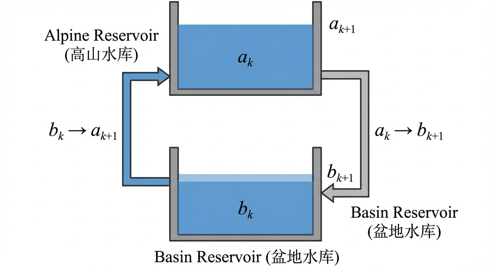
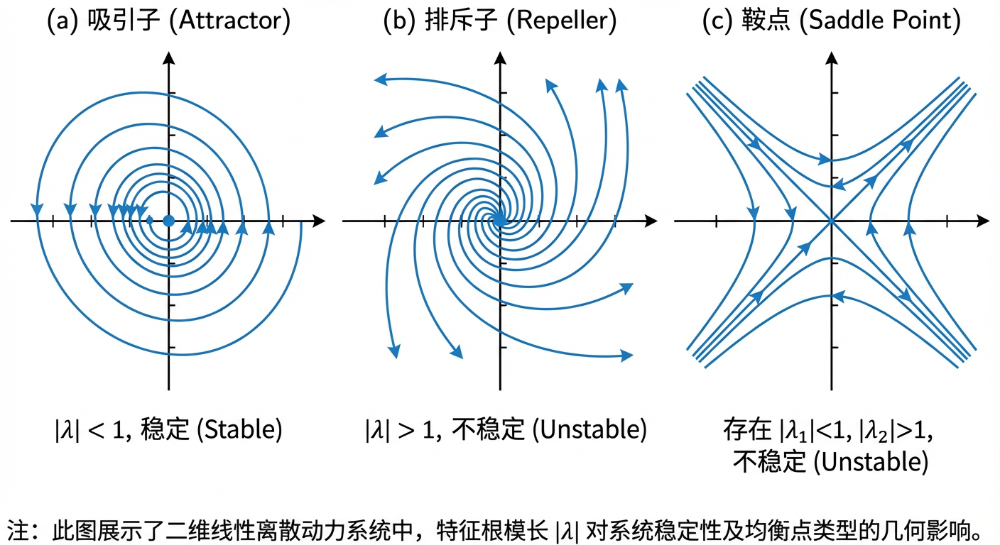
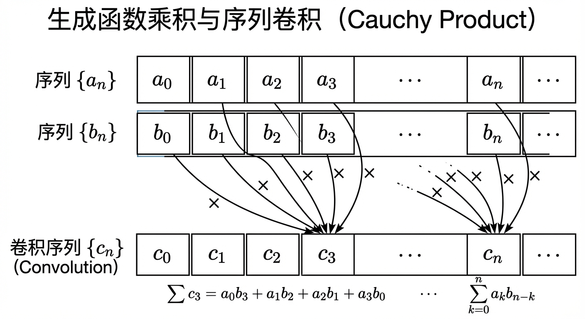
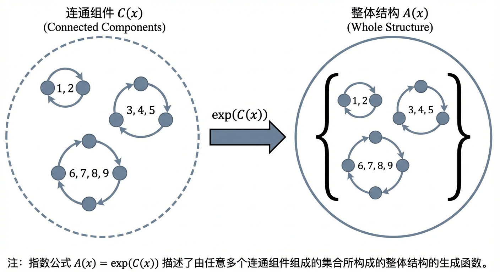
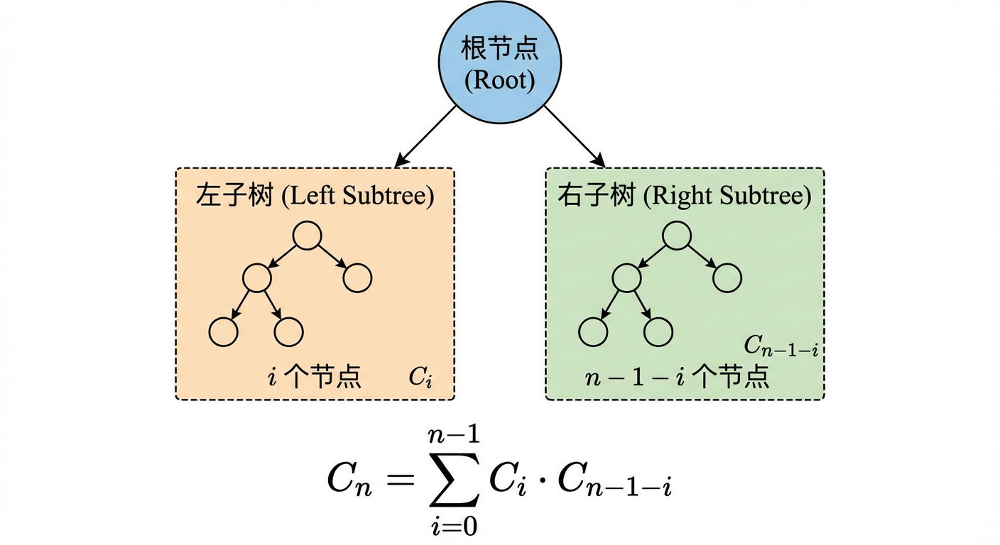
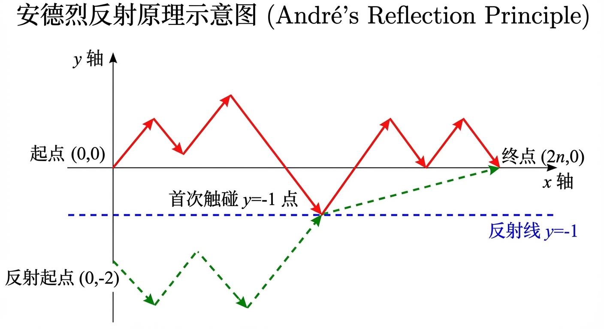
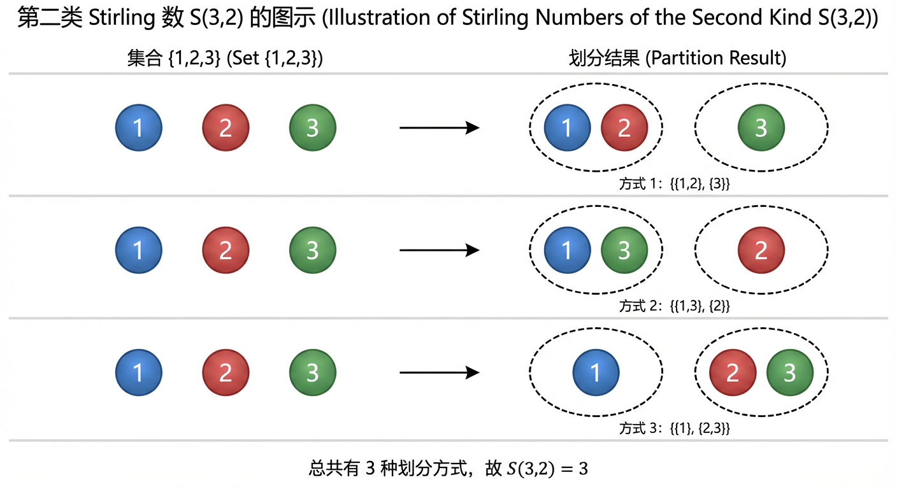
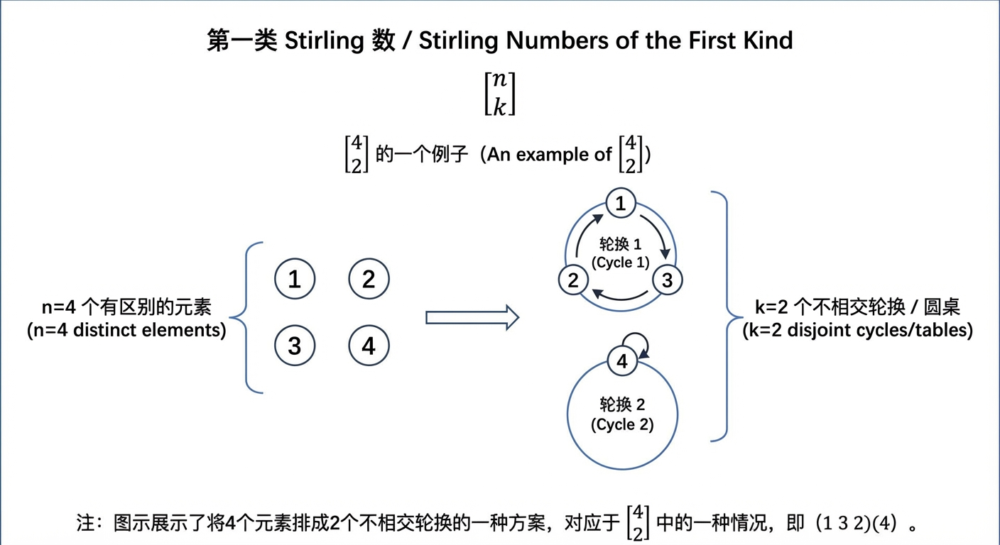

# 第10章：递推方程与生成函数

递推方程与生成函数刻画的是同一类核心对象——“序列”——的两种互补语言：前者以“由前到后”的局部演化规则描述序列的生成机制，后者以“整体封装”的方式将序列编码为函数，从而把离散问题转化为代数与分析问题。本章将沿着“递推建模 → 典型可解模型 → 生成函数统一求解与构造 → 重要组合数列”这一主线展开，并在各节之间不断建立交叉引用，使读者形成一条可迁移的方法论链条。

---

## 10.1 递推方程及其应用

在第一章，我们已经接触了递归定义（Recursive Definition）这一强大的描述工具，它允许我们通过对象自身更简单的形式来定义该对象。这种“自引用”的思想不仅是数学构造的基础，更是刻画离散世界中动态过程的核心语言。从斐波那契数列的自然生长，到算法“分而治之”的精巧策略，再到金融市场价格的波动，许多现象的本质规律都可以用一种逐步演化的规则来描述：系统的下一个状态由其一个或多个前序状态决定。本节将系统地探讨这种描述动态过程的数学模型——**递推方程（Recurrence Relation）**，也被称为差分方程（Difference Equation）。

我们的探索将遵循一条从建模到求解，再到解释的完整路径。首先，我们将明确递推方程的构成要素，并学习如何将实际问题转化为规范的数学形式。随后，我们将聚焦于一类具有系统性解法的核心模型——常系数线性递推方程，并建立一套完整的求解理论框架。在此基础上，我们将探讨更复杂的非齐次情形以及其他高级解法，为下一节将要介绍的、更为强大的生成函数方法埋下伏笔。最后，我们将回归计算机科学的根本，揭示递推方程与递归算法复杂度分析之间密不可分的联系，从而将数学理论的洞见回馈于算法设计的实践之中。

> **新增衔接说明**：本节中的“矩阵方法”和“生成函数法”将多次出现。矩阵方法强调把高阶递推改写为一阶线性系统，从而用矩阵幂刻画演化；生成函数法（10.2）则强调把序列整体编码为幂级数，通过代数/微分运算一次性“解码”出通项。两者都是将“逐项递推”提升为“结构化求解”的思想。

### 10.1.1 递推方程的定义及实例

一个序列的**递推方程**是一个用序列中一个或多个前项来表示该序列通项的方程。为了唯一地确定一个序列，递推方程必须辅以**初始条件（Initial Conditions）**，即指定序列最开始的若干项的值。一个递推方程和一组足以唯一确定该序列的初始条件共同构成了一个**递推关系**。

**定义 10.1.1：递推方程与初始条件**

给定一个序列 $\{a_n\}_{n \ge n_0}$，一个将 $a_n$ 与其前驱项 $a_{n-1}, a_{n-2}, \dots, a_{n-k}$ 联系起来的方程称为一个 **$k$ 阶递推方程**。若一个递推方程的形式为
$$
a_n = c_1(n) a_{n-1} + c_2(n) a_{n-2} + \dots + c_k(n) a_{n-k} + f(n),
$$
其中系数 $c_i(n)$ 和 $f(n)$ 是关于 $n$ 的函数，则称该方程为**线性递推方程（Linear Recurrence Equation）**。若所有系数 $c_i$ 均为常数，则称为**常系数线性递推方程**。进一步地，若 $f(n) \equiv 0$，则方程是**齐次的（Homogeneous）**；否则为**非齐次的（Non-homogeneous）**。

递推关系的过程性描述固然精确，但其计算成本高昂。若想得知第 $n$ 项的值，必须先计算出前面所有项。因此，求解递推方程的核心目标，是寻找到一个**闭式解（Closed-form Solution）**，即一个关于 $n$ 的显式函数 $a_n = g(n)$，它不依赖于序列的其他项。这个过程，本质上是从一个描述“过程”的局部规则，走向一个揭示“终局”的全局公式。

让我们通过几个实例来感受递推方程的建模能力。

**例 10.1.1：金融模型**  
在一个简化的经济模型中，某种商品在第 $n$ 个月的市场价格 $P_n$ 被认为由前两个月的价格决定。这种历史价格对当前供需关系的影响可以用一个递推方程来捕捉。例如，假设价格模型为：
$$
P_n = 5P_{n-1} - 4P_{n-2}, \quad n \ge 2.
$$
这是一个二阶常系数线性齐次递推方程。给定初始价格 $P_0$ 和 $P_1$，我们便可以预测未来任意月份的价格趋势。其闭式解将揭示价格是稳定、衰退还是指数增长。

**例 10.1.2：耦合系统与线性代数**  
在更复杂的系统中，多个序列可能相互影响，形成耦合的递推关系。例如，在模拟两个相互连接的水库（Alpine 和 Basin）的水位动态时，其每周的水位变化 $a_k$ 和 $b_k$ 可能遵循如下规则：
$$
\begin{cases}
a_{k+1} = 4a_k + b_k,\\
b_{k+1} = -a_k + 2b_k.
\end{cases}
$$
这组方程揭示了递推关系与线性代数之间深刻的联系。若我们将状态定义为向量 $\vec{v}_k = (a_k, b_k)^T$，则系统演化可以被优雅地描述为一个矩阵方程：

$$
\vec{v}_{k+1} = \begin{pmatrix} 4 & 1 \\ -1 & 2 \end{pmatrix} \vec{v}_k.
$$
记该矩阵为 $A$，则 $\vec{v}_k = A^k \vec{v}_0$。问题的求解便转化为计算矩阵的幂，其核心在于矩阵的对角化、Jordan 标准形与特征值分析。值得注意的是，我们可以通过代数消元将这个耦合系统转化为一个关于单一序列的高阶递推方程。例如，从第一个方程解出 $b_k = a_{k+1} - 4a_k$，代入第二个方程，经过整理可以得到一个只关于 $a_k$ 的二阶递推方程：
$$
a_{k+2} - 6a_{k+1} + 9a_k = 0.
$$
这表明，高阶递推方程与耦合的一阶递推系统在本质上是相通的。

> **新增承上启下**：例 10.1.2 已经暗示了两条后续主线：其一，求解高阶递推可借助线性代数（矩阵幂、特征值、Jordan 形）；其二，这种“把递推改写为代数对象”的思想在 10.2 的生成函数法中会进一步系统化——生成函数把“无穷多个未知量”编码进“一个函数”。

### 10.1.2 常系数线性齐次递推方程的求解

常系数线性齐次递推方程（Linear Homogeneous Recurrence Relations with Constant Coefficients, LHRRCC）是最基本且最重要的一类递推方程，其求解方法构成后续学习的基石。一个 $k$ 阶 LHRRCC 的一般形式为：
$$
a_n - c_1 a_{n-1} - c_2 a_{n-2} - \dots - c_k a_{n-k} = 0,
$$
其中 $c_1, c_2, \dots, c_k$ 均为常数，且 $c_k \ne 0$。

受到常系数线性微分方程求解方法的启发，我们猜想其解可能具有指数形式。为此，我们尝试一个形如 $a_n = r^n$（其中 $r \ne 0$）的解。将其代入上述方程，得到：
$$
r^n - c_1 r^{n-1} - c_2 r^{n-2} - \dots - c_k r^{n-k} = 0.
$$
两边同除以 $r^{n-k}$，我们便将一个关于无穷序列的递推关系，转化为了一个关于变量 $r$ 的代数方程：
$$
r^k - c_1 r^{k-1} - c_2 r^{k-2} - \dots - c_k = 0.
$$
这个方程被称为递推方程的**特征方程（Characteristic Equation）**。它将序列的动态演化翻译成了代数的语言。特征方程的根，即**特征根（Characteristic Roots）**，决定了序列所有可能的指数增长模式。

**定理 10.1.1：LHRRCC 的通解结构**  
对于一个 $k$ 阶 LHRRCC，其所有解的集合构成一个 $k$ 维向量空间。若其特征方程有 $k$ 个互异的根 $r_1, r_2, \dots, r_k$，则该递推方程的通解为：
$$
a_n = \alpha_1 r_1^n + \alpha_2 r_2^n + \dots + \alpha_k r_k^n,
$$
其中 $\alpha_1, \alpha_2, \dots, \alpha_k$ 是由初始条件决定的任意常数。序列 $\{r_1^n\}, \{r_2^n\}, \dots, \{r_k^n\}$ 构成了该解空间的一组基。

这个定理的背后，是深刻的线性代数结构。正如一个 $k$ 阶线性齐次微分方程的解空间是 $k$ 维的，递推方程亦然。对于一个给定的方程，其所有可能的解序列也构成一个向量空间。定理中断言的 $\{r_i^n\}$ 就是这个解空间的一组“自然基底”，任何解都可以表示为它们的线性组合。我们可以使用**凯利—哈密顿定理（Cayley–Hamilton theorem）**来严格证明这一点，也可以通过**卡索拉行列式（Casoratian）**——作为朗斯基行列式（Wronskian）在离散领域的对应物——来检验这组基底解的线性无关性。

#### 情况一：特征根互异

当特征方程的根都是单根时，求解过程最为直接。

**例 10.1.3：求解具有互异实根的 LHRRCC**  
在一个计算模型中，某系统状态 $x_n$ 的演化遵循
$$
x_n = 5x_{n-1} - 6x_{n-2}.
$$
这是一个二阶 LHRRCC。其特征方程为：
$$
r^2 - 5r + 6 = 0.
$$
因式分解得到 $(r-2)(r-3) = 0$，特征根为 $r_1 = 2, r_2 = 3$。根据定理 10.1.1，该递推方程的通解为：
$$
x_n = \alpha_1 \cdot 2^n + \alpha_2 \cdot 3^n.
$$
若给定初始条件，如 $x_0=1, x_1=0$，我们便可建立一个关于 $\alpha_1, \alpha_2$ 的线性方程组来确定其值：
$$
\begin{cases}
x_0 = \alpha_1 \cdot 2^0 + \alpha_2 \cdot 3^0 = \alpha_1 + \alpha_2 = 1,\\
x_1 = \alpha_1 \cdot 2^1 + \alpha_2 \cdot 3^1 = 2\alpha_1 + 3\alpha_2 = 0.
\end{cases}
$$
解得 $\alpha_1 = 3, \alpha_2 = -2$。因此，该系统在给定初始条件下的特解为：
$$
x_n = 3 \cdot 2^n - 2 \cdot 3^n.
$$

特征根的模长（绝对值）揭示了系统的长期行为。在例 10.1.3 中，由于 $|3| > |2|$，当 $n$ 很大时，$3^n$ 项将主导整个序列的增长，这种起决定性作用的根被称为**主根（dominant root）**。在离散动力系统的稳定性分析中，特征根的模长至关重要。例如，在一个描述市场波动的线性模型中，若所有特征根的模长都小于 1，则任何偏离均衡点的扰动都会随时间衰减，系统是稳定的，均衡点是一个**吸引子（attractor）**。若存在模长大于 1 的根，系统则是不稳定的，均衡点可能是一个**排斥子（repeller）**或**鞍点（saddle point）**。

#### 情况二：存在重根

当特征方程存在重根时，情况稍显复杂。如果一个根 $r_0$ 的重数为 $m \ge 2$，那么它不仅贡献了 $r_0^n$ 这一个基底解，还贡献了另外 $m-1$ 个形式为 $n r_0^n, n^2 r_0^n, \dots, n^{m-1} r_0^n$ 的解。

**定理 10.1.2：重根情况下的通解**  
若 $k$ 阶 LHRRCC 的特征方程的根 $r_0$ 是一个 $m$ 重根，则通解中与 $r_0$ 对应的部分是以下 $m$ 个线性无关解的线性组合：
$$
\{r_0^n, n r_0^n, n^2 r_0^n, \dots, n^{m-1} r_0^n\}.
$$
其一般形式为：
$$
(\alpha_0 + \alpha_1 n + \alpha_2 n^2 + \dots + \alpha_{m-1} n^{m-1}) r_0^n.
$$

**例 10.1.4：求解具有重根的 LHRRCC**  
在例 10.1.2 中，我们得到了描述水库水位的递推方程
$$
a_{k+2} - 6a_{k+1} + 9a_k = 0.
$$
其特征方程为 $r^2 - 6r + 9 = (r-3)^2 = 0$，因此有二重根 $r_0=3$。根据定理 10.1.2，其通解形式为：
$$
a_k = (\alpha_1 + \alpha_2 k)\cdot 3^k.
$$
假设初始条件为 $a_0 = 1, b_0 = 2$。我们需要 $a_1$ 来确定系数。由原耦合系统可知：
$$
a_1 = 4a_0 + b_0 = 4(1) + 2 = 6.
$$
代入通解：
$$
\begin{cases}
a_0 = (\alpha_1 + \alpha_2 \cdot 0)\cdot 3^0 = \alpha_1 = 1,\\
a_1 = (\alpha_1 + \alpha_2 \cdot 1)\cdot 3^1 = 3(\alpha_1 + \alpha_2) = 6,
\end{cases}
$$
解得 $\alpha_1 = 1, \alpha_2 = 1$。因此特解为：
$$
a_k = (1+k)3^k.
$$
这个 $k$ 因子的出现，可以类比于物理学中的共振现象：当系统的内在模式发生简并时，会产生一种新的、代数增长的行为。

> **新增交叉引用**：这里“重根导致多项式因子 $n^{m-1}$”的现象，在矩阵语言中对应 Jordan 块带来的幂次增长；在 10.2 的生成函数框架中则常体现为分母出现高重极点，导致系数含有多项式因子。不同语言描述的是同一结构性原因。

### 10.1.3 常系数线性非齐次递推方程的求解

现在，我们转向更一般的情形，即 $f(n)$ 不为零的非齐次方程：
$$
a_n - c_1 a_{n-1} - \dots - c_k a_{n-k} = f(n).
$$
这类方程的求解遵循一个重要的线性系统原理：**一个非齐次线性方程的通解等于其对应的齐次方程的通解与该非齐次方程的任意一个特解之和**。

**定理 10.1.3：非齐次方程的通解**  
设 $a_n^{(h)}$ 是对应的齐次方程
$$
a_n - c_1 a_{n-1} - \dots - c_k a_{n-k} = 0
$$
的通解，而 $a_n^{(p)}$ 是原非齐次方程的一个特解，则原非齐次方程的通解为：
$$
a_n = a_n^{(h)} + a_n^{(p)}.
$$

证明该定理是直观的。若 $a_n$ 和 $b_n$ 都是非齐次方程的解，那么它们的差 $d_n = a_n - b_n$ 满足对应的齐次方程。因此，任何解都可以表示为某个特解 $b_n$ 加上一个齐次解 $d_n$。

求解的核心因此转化为寻找一个特解 $a_n^{(p)}$。**待定系数法（Method of Undetermined Coefficients）**为此提供了一个有效的途径，其基本思想是“猜测”特解的形式与非齐次项 $f(n)$ 的形式相似。

**特解的猜测规则：**
1. **多项式形式**：如果 $f(n)$ 是一个 $m$ 次多项式，我们通常猜测 $a_n^{(p)}$ 是一个同次的 $m$ 次多项式。
2. **指数形式**：如果 $f(n)$ 是指数形式 $\beta^n$ 的倍数，我们猜测 $a_n^{(p)}$ 是 $A \cdot \beta^n$。
3. **组合形式**：如果 $f(n)$ 是上述形式的乘积或和，我们的猜测也应是相应形式的乘积或和。

**修正规则：** 如果猜测的特解形式中的某一项（例如 $A \cdot \beta^n$）已经是对应齐次方程通解的一部分（即 $\beta$ 是一个重数为 $m$ 的特征根），那么必须将猜测的特解乘以 $n^m$ 以确保线性无关性。

**例 10.1.5：求解非齐次递推方程**  
求解递推关系 $a_n = 3a_{n-1} + 2n$，$a_1 = 3$。

**第一步：求解对应的齐次方程。**  
齐次方程为 $a_n = 3a_{n-1}$，其特征方程为 $r-3=0$，解得 $r=3$。所以齐次通解为 $a_n^{(h)} = \alpha \cdot 3^n$。

**第二步：寻找一个特解。**  
非齐次项 $f(n)=2n$ 是一个 1 次多项式。我们猜测特解形式为 $a_n^{(p)} = Bn + C$。代入原方程：
$$
Bn + C = 3(B(n-1) + C) + 2n,
$$
$$
Bn + C = 3Bn - 3B + 3C + 2n,
$$
$$
0 = (2B+2)n + (-3B+2C).
$$
为了使该等式对所有 $n$ 成立，各项系数必须为零：
$$
\begin{cases}
2B + 2 = 0 \implies B = -1,\\
-3B + 2C = 0 \implies 3 + 2C = 0 \implies C = -\dfrac{3}{2}.
\end{cases}
$$
于是，我们得到一个特解 $a_n^{(p)} = -n - \dfrac{3}{2}$。

**第三步：组合通解并使用初始条件。**  
通解为
$$
a_n = a_n^{(h)} + a_n^{(p)} = \alpha \cdot 3^n - n - \frac{3}{2}.
$$
使用初始条件 $a_1=3$：
$$
3 = \alpha \cdot 3^1 - 1 - \frac{3}{2}
\implies 3\alpha = 3 + 1 + \frac{3}{2} = \frac{11}{2},
$$
解得 $\alpha = \dfrac{11}{6}$。因此，最终的闭式解为：
$$
a_n = \frac{11}{6} \cdot 3^n - n - \frac{3}{2}.
$$

> **新增衔接说明**：待定系数法强调“猜测特解”。而在下一节 10.2 的生成函数法中，非齐次项往往会转化为生成函数方程中的“已知函数”，从而把“猜测”替换为更系统的代数化求解；两种方法在常系数情形下通常互相印证。

### 10.1.4 递推方程的其他解法

除了特征方程法，还有其他强大的技术可以求解递推方程，它们为我们提供了不同的视角，并且能处理更复杂的问题。

#### 1. 迭代法

迭代法（或称展开法）是一种直接、朴素的求解方法。它通过反复将递推关系代入自身，直到模式浮现，最终用初始条件表达通项。对于简单的递推关系，这是一种非常直观的方法。例如，对于 $a_n = a_{n-1} + n$，通过迭代可以发现：
$$
a_n = a_0 + \sum_{i=1}^n i = a_0 + \frac{n(n+1)}{2}.
$$
然而，对于高阶或复杂的递推，迭代展开的代数过程会变得异常繁琐。

#### 2. 生成函数法

**生成函数（Generating Functions）**是求解递推方程乃至处理组合计数问题的最强大的工具之一，我们将在 10.2 节中对其进行深入探讨。其核心思想是将一个无穷序列 $\{a_n\}$ 编码为一个单一的函数——它的生成函数，通常是形式幂级数
$$
G(x) = \sum_{n=0}^{\infty} a_n x^n.
$$

这种方法的魔力在于，它能将关于离散序列的递推关系，转化为关于连续函数 $G(x)$ 的代数方程或微分方程。需要注意的是：将递推关系两边同乘以 $x^n$ 并对 $n$ 求和，通常得到的是关于**普通生成函数**的代数方程；而若使用指数生成函数 $A(x)=\sum_{n\ge 0} a_n x^n/n!$，则“下标移位”常对应于对 $A(x)$ 的微分，从而更自然地产生微分方程。

例如，将递推关系 $a_{n+1} = 2a_n + b_n$ 两边同乘以 $\dfrac{x^n}{n!}$ 并对 $n\ge 0$ 求和，可以得到关于其指数生成函数 $A(x), B(x)$ 的微分方程关系：
$$
A'(x) = 2A(x) + B(x).
$$
求解这个函数方程后，再通过级数展开或系数提取，便可“解码”出序列的通项公式 $a_n$。生成函数法不仅能系统地处理常系数线性递推方程（包括齐次与非齐次），在更一般的场景下也常能将复杂的序列运算转化为可操作的函数方程。

> **新增过渡到 10.2**：至此我们已经看到：特征方程法以“指数试探”切入，矩阵方法以“状态向量”切入，而生成函数法以“整体编码”切入。10.2 将把生成函数的定义、运算与应用系统化；读者可把它理解为一种将递推方程“翻译”为函数方程的通用语法。

### 10.1.5 递推方程与递归算法

递推方程在计算机科学中的一个核心应用，是分析**递归算法（Recursive Algorithms）**的计算复杂度。一个递归算法的运行时间 $T(n)$（其中 $n$ 是输入规模）通常可以自然地表示为一个递推方程。

例如，著名的**归并排序（Merge Sort）**算法，其工作流程是：将一个规模为 $n$ 的数组一分为二，递归地对两个规模为 $n/2$ 的子数组进行排序，最后花费 $O(n)$ 的时间合并两个已排序的子数组。其运行时间 $T(n)$ 满足如下递推方程：
$$
T(n) = 2T(n/2) + cn, \quad n > 1,
$$
其中 $c$ 是一个常数。求解这个方程将告诉我们归并排序的时间复杂度。通过迭代展开可以发现 $T(n) = O(n \log n)$。

对于形如 $T(n) = aT(n/b) + f(n)$ 的递推方程，在算法分析中极为常见，它们描述了将原问题分解为 $a$ 个规模为 $n/b$ 的子问题，并额外花费 $f(n)$ 的时间进行分解和合并的算法。**主定理（Master Theorem）**为求解这类方程提供了一个强大的判别法，它通过比较“分解/合并”的代价 $f(n)$ 与“递归部分产生的总代价”的增长速度 $n^{\log_b a}$ 来确定最终的复杂度。主定理的逻辑基础，是对各种情况下的递推过程进行严谨的归纳证明，这再次印证了数学归纳法与递归/递推思想的同源性。

理解并求解递推方程，使我们能够从算法的递归结构出发，精确地推断其全局的性能表现，这是连接算法设计与算法分析的坚实桥梁。

### 小结

本节中，我们建立了递推方程这一描述离散动态过程的核心数学框架。我们从定义出发，认识到递推关系由递推方程和初始条件共同构成，其求解目标是找到一个表达序列长期行为的闭式解。

我们系统地研究了常系数线性递推方程的求解。对于齐次情形，我们引入了作为“万能钥匙”的特征方程，并根据其根（互异或重根）的性质，构建了基于指数函数的通解。这一过程深刻地揭示了线性代数中的向量空间理论在解结构中的基础性作用。对于非齐次情形，我们确立了“齐次通解 + 非齐次特解”的核心求解策略。

通过对矩阵方法和生成函数法的初步介绍，我们为求解更复杂的耦合系统和非线性问题打开了大门，并为下一节的内容做好了铺垫。最后，我们将递推方程的应用聚焦于计算机科学的核心领域——递归算法的复杂度分析，展现了这一数学工具在衡量计算效率方面的强大威力。

从本质上看，递推方程是连接“过程”与“结构”的桥梁。它以一种分步、迭代的语言描述世界的演化，而求解它的过程，则是通过代数和分析的工具，洞察这些演化背后隐藏的确定性模式和长期趋势。掌握递推方程，意味着掌握了一种理解和预测离散系统行为的普适性语言。在后续章节中，无论是组合计数还是概率分析，我们都将反复看到递推思想的闪现。

---

> **新增章节过渡（10.1 → 10.2）**：10.1 的主线是“从递推式出发求闭式解”。然而当递推关系变复杂（例如出现卷积、变系数或多序列耦合）时，直接在序列层面操作往往代价很高。10.2 将引入普通生成函数，把序列整体编码为形式幂级数；许多“序列上的运算”会变成“函数上的代数运算”，从而显著简化求解与计数。

---

## 10.2 生成函数及其应用

在前一节中，我们探讨了如何使用递推方程来刻画和求解序列问题。递推方法循序渐进，如同多米诺骨牌，通过局部规则推导全局性质。然而，当递推关系变得复杂时，逐项求解的过程可能变得异常繁琐。这引发了一个深刻的思考：我们是否能找到一种方法，将整个序列——一个无限的、离散的对象——“封装”成一个单一的、有限的代数实体，从而将对序列的离散操作转化为对这个实体的代数或分析操作？这正是生成函数（Generating Functions）将要扮演的核心角色。它是一种概念上的飞跃，从“递推”到“封装”，再从“操作”到“解码”，为我们提供了一套将离散数学问题翻译为代数和微积分语言的统一框架。

本节我们将首先介绍作为这一框架基石的牛顿二项式定理，它为我们展开和识别函数提供了基本语法。随后，我们将正式定义生成函数及其核心运算性质，揭示序列操作与函数操作之间的深刻对应关系。最后，我们将通过一系列典型的应用任务链——求解递推方程、解决组合计数问题、分析概率分布——来展示生成函数如何作为一把万能钥匙，开启通往离散世界诸多领域的大门。

### 10.2.1 牛顿二项式定理与牛顿二项式系数

我们在第8章已经学习了二项式定理，它为我们展开 $(x+y)^n$（其中 $n$ 为非负整数）提供了组合解释和代数公式。然而，在生成函数的世界里，我们经常遇到形如 $(1-x)^{-k}$ 的表达式，其中指数不再局限于正整数。艾萨克·牛顿的伟大洞见在于，他将二项式定理推广到了任意实数指数，这为我们处理形式幂级数提供了强有力的基础。

**定义 10.2.1（牛顿二项式系数）**  
对于任意实数 $\alpha \in \mathbb{R}$ 和非负整数 $k \in \mathbb{N}_0$，**牛顿二项式系数**（Newtonian binomial coefficient），记作 $\binom{\alpha}{k}$，定义为：
$$
\binom{\alpha}{k} =
\begin{cases}
\dfrac{\alpha(\alpha-1)\cdots(\alpha-k+1)}{k!}, & k \ge 0,\\[6pt]
0, & k < 0.
\end{cases}
$$
当 $k=0$ 时，分子是空积，其值为 $1$，因此 $\binom{\alpha}{0} = 1$。如果 $\alpha$ 是一个正整数 $n$，这个定义与我们熟悉的组合系数 $\binom{n}{k} = \dfrac{n!}{k!(n-k)!}$ 完全一致。

基于此定义，我们可以陈述推广的二项式定理。

**定理 10.2.1（牛顿二项式定理）**  
设 $\alpha \in \mathbb{R}$，则对于所有满足 $|x|<1$ 的实数 $x$，下式成立：
$$
(1+x)^\alpha = \sum_{k=0}^{\infty} \binom{\alpha}{k} x^k
= 1 + \alpha x + \frac{\alpha(\alpha-1)}{2!}x^2 + \cdots.
$$
在生成函数的研究中，我们通常将上式视为一个**形式幂级数**（formal power series）的恒等式，这意味着我们关注的是系数之间的代数关系，而暂时忽略其作为解析函数的收敛性问题。这使得我们可以在一个纯代数的框架内自由地操作这些级数。

一个在实践中极其重要的特例是 $(1-x)^{-n}$ 的展开。令原公式中的 $x$ 为 $-x$，$\alpha$ 为 $-n$（其中 $n$ 为正整数），我们得到：
$$
(1-x)^{-n} = \sum_{k=0}^{\infty} \binom{-n}{k} (-x)^k.
$$
我们来计算其系数：
$$
\binom{-n}{k}
= \frac{(-n)(-n-1)\cdots(-n-k+1)}{k!}
= (-1)^k \frac{n(n+1)\cdots(n+k-1)}{k!}
= (-1)^k \binom{n+k-1}{k}.
$$
因此，
$$
(1-x)^{-n}
= \sum_{k=0}^{\infty} (-1)^k \binom{n+k-1}{k} (-x)^k
= \sum_{k=0}^{\infty} \binom{n+k-1}{k} x^k.
$$
利用组合恒等式 $\binom{n+k-1}{k} = \binom{n+k-1}{n-1}$，我们得到一个非常优美的结果。

**推论 10.2.1**  
对于任意正整数 $n$，有如下形式幂级数展开：
$$
\frac{1}{(1-x)^n} = \sum_{k=0}^{\infty} \binom{k+n-1}{n-1} x^k.
$$
这个公式是连接有理函数与其幂级数系数的桥梁，在从生成函数“解码”回序列通项公式的过程中扮演着核心角色。例如，当 $n=1$ 时，我们得到熟悉的几何级数公式 $\dfrac{1}{1-x} = \sum_{k=0}^{\infty} x^k$。

### 10.2.2 生成函数的定义及其性质

现在，我们准备正式地将序列“封装”为函数。

**定义 10.2.2（普通生成函数）**  
对于一个无限序列 $a = \{a_0, a_1, a_2, \dots\}$，其**普通生成函数**（Ordinary Generating Function, OGF），记作 $G(x)$ 或 $G_a(x)$，是定义在变量 $x$ 上的一个形式幂级数：
$$
G(x) = \sum_{n=0}^{\infty} a_n x^n = a_0 + a_1 x + a_2 x^2 + \cdots.
$$
我们称 $a_n$ 是 $G(x)$ 中 $x^n$ 项的系数，记作 $a_n = [x^n]G(x)$。

这里的关键思想是，函数 $G(x)$ 作为一个整体，唯一地代表了序列 $\{a_n\}$。对序列的任何操作，都应有与之对应的函数操作。

#### 生成函数的基本运算

1. **加法与标量乘法**：  
   设 $A(x) = \sum a_n x^n$ 和 $B(x) = \sum b_n x^n$ 分别是序列 $\{a_n\}$ 和 $\{b_n\}$ 的生成函数。
   - $A(x) + B(x) = \sum (a_n + b_n) x^n$，是序列 $\{a_n + b_n\}$ 的生成函数。
   - $cA(x) = \sum (c a_n) x^n$，是序列 $\{c a_n\}$ 的生成函数。

2. **乘法（柯西乘积）**：  
   生成函数的乘法是最重要且最不直观的运算。一个常见的误解是，两个生成函数 $A(x)$ 和 $B(x)$ 的乘积会生成序列 $\{a_n b_n\}$。让我们通过一个具体的例子来检验这个猜想。

   考虑序列 $\{a_n\}$，其中 $a_n = 3^n$，其生成函数为
   $$
   A(x) = \sum_{n=0}^\infty (3x)^n = \frac{1}{1-3x}.
   $$
   再考虑序列 $\{b_n\}$，其中 $b_n = n$，其生成函数为
   $$
   B(x) = \sum_{n=0}^\infty nx^n = \frac{x}{(1-x)^2}.
   $$
   如果猜想成立，乘积 $P(x) = A(x)B(x)$ 的 $x^4$ 系数应为 $a_4 b_4 = 3^4 \cdot 4 = 324$。然而，真实的乘积函数为
   $$
   P(x) = \frac{x}{(1-3x)(1-x)^2}.
   $$
   由生成函数乘积的系数规则，
   $$
   [x^4]P(x)=\sum_{k=0}^4 a_k b_{4-k}
   =\sum_{k=0}^4 3^k(4-k)
   = 46.
   $$
   显然，$46 \neq 324$，这有力地证伪了上述猜想。

   那么，生成函数的乘积究竟代表什么？

   $$
   A(x)B(x) = \left(\sum_{i=0}^{\infty} a_i x^i\right)\left(\sum_{j=0}^{\infty} b_j x^j\right)
   = \sum_{n=0}^{\infty}\left(\sum_{k=0}^{n} a_k b_{n-k}\right)x^n.
   $$
   我们看到，$x^n$ 的系数 $c_n$ 是一个和式 $c_n = \sum_{k=0}^{n} a_k b_{n-k}$。这个和式被称为序列 $\{a_n\}$ 和 $\{b_n\}$ 的**卷积**（convolution）或**柯西乘积**（Cauchy product）。因此，**生成函数的乘积对应于序列的卷积**。这个性质是生成函数在组合计数和概率论中发挥巨大作用的根源。

3. **移位运算**：  
   将序列向右移动 $k$ 位（前面补 $k$ 个零）得到新序列 $c_n = a_{n-k}$（约定 $a_j=0$ 当 $j<0$），其生成函数为 $x^kA(x)$。  
   将序列向左移动 $k$ 位（丢弃前 $k$ 项）得到新序列 $d_n = a_{n+k}$，其生成函数为
   $$
   \frac{A(x) - \sum_{i=0}^{k-1} a_i x^i}{x^k}.
   $$

4. **微分与积分**：  
   对生成函数进行微分，会使其系数乘以其下标：
   $$
   A'(x) = \sum_{n=1}^{\infty} n a_n x^{n-1}
   \implies xA'(x) = \sum_{n=1}^{\infty} n a_n x^n.
   $$
   这意味着算子 $x\dfrac{d}{dx}$ 作用于 $A(x)$，会生成序列 $\{n a_n\}$。  
   类似地，积分运算
   $$
   \int_0^x A(t)\,dt = \sum_{n=0}^\infty \frac{a_n}{n+1} x^{n+1},
   $$
   与系数除以下标相关。这些运算在计算期望和方差等矩时非常有用。

> **新增概念对比提示**：此处“乘法对应卷积”是普通生成函数的核心语义；而在 10.3 的指数生成函数中，乘法将对应“二项卷积”（会出现 $\binom{n}{k}$），适用于带标签对象的划分计数。两者差异的根源，正来自系数中是否含有 $n!$ 的归一化。

### 10.2.3 生成函数的应用

我们现在将这些代数工具应用于解决三类典型问题，形成一条从解码、构造到分析的应用链条。

#### 应用一：求解递推方程

生成函数为求解线性常系数递推方程提供了一条系统而强大的路径，它将问题转化为纯粹的代数操作。其核心思想是“编码—求解—解码”三部曲。

考虑求解由递推关系 $c_n = 5c_{n-1} - 6c_{n-2}$（$n \ge 2$）且初始值为 $c_0=0, c_1=1$ 所定义的序列 $\{c_n\}$ 的通项公式。

1. **编码**：设 $C(x) = \sum_{n=0}^{\infty} c_n x^n$ 为该序列的生成函数。我们的目标是将递推关系转化为关于 $C(x)$ 的方程。将递推关系两边同乘以 $x^n$ 并对所有 $n \ge 2$ 求和：
   $$
   \sum_{n=2}^{\infty} c_n x^n
   = 5 \sum_{n=2}^{\infty} c_{n-1} x^n
   - 6 \sum_{n=2}^{\infty} c_{n-2} x^n.
   $$
   现在，我们将每一项都用 $C(x)$ 来表示：
   - 左边：
     $$
     \sum_{n=2}^{\infty} c_n x^n = C(x) - c_0 - c_1x = C(x) - x.
     $$
   - 右边第一项：
     $$
     5 \sum_{n=2}^{\infty} c_{n-1} x^n
     = 5x \sum_{n=2}^{\infty} c_{n-1} x^{n-1}
     = 5x\,(C(x)-c_0)
     = 5xC(x).
     $$
   - 右边第二项：
     $$
     -6 \sum_{n=2}^{\infty} c_{n-2} x^n
     = -6x^2 \sum_{n=2}^{\infty} c_{n-2} x^{n-2}
     = -6x^2 C(x).
     $$

   于是，我们得到关于 $C(x)$ 的代数方程：
   $$
   C(x) - x = 5xC(x) - 6x^2 C(x).
   $$

2. **求解**：从该方程中解出 $C(x)$：
   $$
   C(x)(1 - 5x + 6x^2) = x
   \implies C(x) = \frac{x}{1 - 5x + 6x^2}.
   $$

3. **解码**：将 $C(x)$ 展开为幂级数，以提取系数 $[x^n]C(x)$。为此，我们使用部分分式分解。分母 $1-5x+6x^2 = (1-2x)(1-3x)$：
   $$
   C(x) = \frac{x}{(1-2x)(1-3x)} = \frac{A}{1-2x} + \frac{B}{1-3x}.
   $$
   通过求解得到 $A=-1, B=1$。因此，
   $$
   C(x) = \frac{1}{1-3x} - \frac{1}{1-2x}.
   $$
   利用几何级数公式展开：
   $$
   C(x) = \sum_{n=0}^{\infty} (3x)^n - \sum_{n=0}^{\infty} (2x)^n
   = \sum_{n=0}^{\infty} (3^n - 2^n)x^n.
   $$
   通过比较系数，我们直接读出通项公式：
   $$
   c_n = 3^n - 2^n.
   $$
   这个结果对于 $n=0,1$ 同样成立，验证了其正确性。这种方法将求解递推的迭代过程，转化成了一次性的代数与级数展开操作。

#### 应用二：组合计数

生成函数的乘法法则（序列卷积）使其成为解决组合计数问题的天然工具。其基本原则是：**构造选择的代数蓝图，其中加法对应“或”（互斥选择），乘法对应“与”（独立步骤）。**

让我们考虑一个整数划分问题：一个正整数 $n$ 可以被表示为一系列正整数之和。若对划分中所使用的整数（称为“部分”）加以限制，我们能计算出划分方法的数量吗？

例如，假设我们要计算将整数 $n$ 划分为满足以下规则的划分（partition）的数量 $a_n$：
- 大小为 $k \equiv 1 \pmod 5$ 或 $k \equiv 4 \pmod 5$ 的部分，可使用任意多次。
- 大小为 $k \equiv 2 \pmod 5$ 的部分，至多使用一次。
- 大小为 $k \equiv 3 \pmod 5$ 的部分，禁止使用。
- 大小为 $k \equiv 0 \pmod 5$ 的部分，至多使用两次。

我们为每一种可能的部分大小 $k$ 构建一个因子，该因子是一个幂级数，其中 $x^j$ 的系数表示使用 $j$ 个大小为 $k$ 的部分的方式数。
- 对于可无限次使用的部分 $k$，其选择的生成函数是 $1+x^k+x^{2k}+\dots = \dfrac{1}{1-x^k}$。
- 对于至多使用一次的部分 $k$，其选择是“不用”或“用一次”，生成函数为 $1+x^k$。
- 对于禁止使用的部分 $k$，其选择只有“不用”，生成函数为 $1$。
- 对于至多使用两次的部分 $k$，其选择是“不用”、“用一次”或“用两次”，生成函数为 $1+x^k+x^{2k}$。

总的生成函数 $F(x) = \sum a_n x^n$ 是所有这些独立选择的因子的乘积。我们将所有部分按模 5 的余数分类：
$$
F(x) = \prod_{k \ge 1} (\text{factor for part } k),
$$
$$
F(x)
= \left( \prod_{m \ge 1} \frac{1}{1-x^{5m-4}} \cdot \frac{1}{1-x^{5m-1}} \right)
\cdot \left( \prod_{m \ge 1} (1+x^{5m-3}) \right)
\cdot \left( \prod_{m \ge 1} 1 \right)
\cdot \left( \prod_{m \ge 1} (1+x^{5m}+x^{10m}) \right).
$$
这个紧凑的函数 $F(x)$ 蕴含了关于所有 $a_n$ 的全部信息。例如，如果我们想知道是否存在一种方式将整数 15 如此划分，我们只需考察 $[x^{15}]F(x)$。通过代数结构的分析（无需完全展开），我们便能洞察问题的答案。这种方法将复杂的组合约束直接翻译成了代数表达式的乘积，展现了生成函数的构造之美。

#### 应用三：概率论与算法分析

生成函数在概率论中被称为**概率生成函数**（Probability Generating Function, PGF），它为分析离散随机变量及其和提供了无与伦比的便利，并构成了通往第12章概率论的重要桥梁。

**定义 10.2.3（概率生成函数）**  
对于一个取值为非负整数的离散随机变量 $X$，其概率质量函数为 $p_k = P(X=k)$。它的 PGF 定义为
$$
G_X(s) = E[s^X] = \sum_{k=0}^{\infty} p_k s^k.
$$

PGF 的关键性质在于，**独立随机变量之和的 PGF 是它们各自 PGF 的乘积**。若 $Z = X+Y$ 且 $X, Y$ 独立，则：
$$
G_Z(s) = E[s^{X+Y}] = E[s^X s^Y] = E[s^X]E[s^Y] = G_X(s)G_Y(s).
$$
这一性质将概率论中复杂的卷积运算，转化为了函数论中简单的乘法运算。

**示例1：二项分布的和**  
假设一家工厂有两条独立的生产线，生产同一种元件，每件产品有概率 $p$ 为次品。A 线生产了 $n_A$ 件，B 线生产了 $n_B$ 件。A 线次品数 $X \sim \mathrm{Binomial}(n_A, p)$，B 线次品数 $Y \sim \mathrm{Binomial}(n_B, p)$。总次品数 $Z=X+Y$ 的分布是什么？  
我们知道，二项分布 $\mathrm{Binomial}(n,p)$ 的 PGF 为 $G(s) = (1-p+ps)^n$。因此，
$$
G_X(s) = (1-p+ps)^{n_A}, \quad G_Y(s) = (1-p+ps)^{n_B}.
$$
由于 $X,Y$ 独立，
$$
G_Z(s) = G_X(s)G_Y(s) = (1-p+ps)^{n_A+n_B}.
$$
我们立即识别出这是 $\mathrm{Binomial}(n_A+n_B, p)$ 分布的 PGF。类似地，可以证明两个独立泊松分布 $\mathrm{Poisson}(\lambda_1)$ 和 $\mathrm{Poisson}(\lambda_2)$ 之和是 $\mathrm{Poisson}(\lambda_1+\lambda_2)$。

**示例2：计算期望与方差**  
PGF 的导数与随机变量的矩密切相关：
$$
E[X] = G_X'(1),
$$
$$
\mathrm{Var}(X) = G_X''(1) + G_X'(1) - \bigl(G_X'(1)\bigr)^2.
$$
例如，一个系统的寿命 $X$ 由 PGF
$$
G_X(s) = \frac{0.2}{1-0.8s}
$$
描述。其期望寿命为
$$
E[X] = G_X'(1) = \frac{0.2\cdot 0.8}{(1-0.8)^2} = 4 \text{ 个周期},
$$
其方差为
$$
\mathrm{Var}(X) = \frac{0.2\cdot 0.8(1+0.8)}{(1-0.8)^3} - 4^2 = 20.
$$
这种通过微分计算矩的方法，往往比直接根据定义求和要快捷得多。

**示例3：分支过程与算法分析**  
生成函数的威力还体现在分析递归和迭代结构中。例如，在分析**分支过程**（branching process）时，若一个种群中每个个体产生后代的数量分布由 PGF $G(s)$ 描述，那么第 $n$ 代种群规模的 PGF 就是 $G(s)$ 的 $n$ 次复合：
$$
G_n(s) = \underbrace{G(G(\dots G(s)\dots))}_{n\text{ 次}}.
$$
种群最终灭绝的概率，就是求解不动点方程 $s=G(s)$ 得到的最小非负解。

一个更为深刻的例子是对**随机快速排序**（randomized Quicksort）算法平均性能的分析。设 $C_n$ 为对 $n$ 个元素排序所需的比较次数（一个随机变量），其 PGF 为 $G_n(s)$。通过分析算法的递归结构，可以建立一个关于 $G_n(s)$ 的递推关系。进一步地，定义这些 PGF 序列的生成函数
$$
G(z,s) = \sum_{n=0}^\infty G_n(s)z^n,
$$
可以将原递推关系转化为一个关于 $G(z,s)$ 的函数方程（在更精细的分析中常出现偏微分方程）。通过求解并提取系数，可以得到平均比较次数的通项公式
$$
\mathbb{E}[C_n] = 2(n+1)H_n - 4n,
$$
其中 $H_n$ 是调和数。这一经典结果展示了生成函数如何连接算法、概率论和分析学，将一个复杂的平均情况分析问题转化为结构清晰的函数求解问题。

### 小结

在本节中，我们引入了生成函数这一强大的数学工具，它通过将离散的数字序列编码为形式幂级数，成功地在离散的组合世界与连续的代数分析世界之间架起了一座桥梁。我们遵循“表示—运算—对应”的逻辑，明确了生成函数的定义及其核心代数性质，特别是乘法与序列卷积的深刻联系。

通过一系列应用，我们展示了生成函数作为一种方法论的统一力量。无论是求解递推方程的“编码—求解—解码”范式，还是解决组合计数问题的“代数蓝图”构造法，抑或是分析概率分布与算法复杂度的“PGF 方法”，其本质都是将原域中复杂的操作（如递推、组合或卷积）转化为生成函数域内更为简单的代数或分析操作（如乘法、复合或微分）。

本节所讨论的普通生成函数，主要适用于处理无标号对象的组合问题。然而，当我们面对涉及排列等有标号对象的计数问题时，普通生成函数将显得力不从心。这为我们下一节引入功能更适配的**指数生成函数**埋下了伏笔，也预示着我们的工具箱将得到进一步的扩充与升级。生成函数的思想，作为一种核心的数学建模语言，将在后续的组合计数、概率论乃至算法分析等章节中反复回响。

---

> **新增章节过渡（10.2 → 10.3）**：10.2 的普通生成函数以“柯西乘积 = 无标号卷积”为核心语义，适合“只计数量、不计标签”的组合对象。若对象带有标签（例如集合划分、排列结构），组合构造中会自然出现 $\binom{n}{k}$ 的选择因子；10.3 将通过在系数中引入 $n!$ 的归一化，令乘法自动产生“二项卷积”，从而把带标签计数也纳入生成函数统一框架。

---

## 10.3 指数生成函数及其应用

在前一节中，我们见证了普通生成函数（Ordinary Generating Function, OGF）如何将离散的序列计数问题转化为连续的函数代数问题，从而为求解递推关系与组合计数提供了强有力的统一框架。然而，普通生成函数的语义根植于对“无差别”对象的组合：我们只关心每类物品选取的数量，而不关心物品本身的区别。当我们面对的问题场景中，元素的“身份”或“标签”至关重要时，例如对一组带标签的球进行排列或分组，OGF 便显得不够自然。这正是我们引入一种新的、更为精妙的代数工具——**指数生成函数（Exponential Generating Function, EGF）**——的逻辑起点。本节将从这一问题意识的转变切入，揭示 EGF 如何通过其独特的定义，将带标签对象的组合操作优雅地映射为函数间的代数与分析运算，从而开启一扇通往结构化计数新天地的大门。

### 10.3.1 定义与基本性质

我们必须首先回答一个根本问题：为何普通生成函数不适用于带标签对象的计数？设想将 $n$ 个**可区分**的球放入两个**可区分**的盒子，使得第一个盒子放 $k$ 个，第二个盒子放 $n-k$ 个。选择哪 $k$ 个球放入第一个盒子的方式有 $\binom{n}{k}$ 种。如果我们在每个盒子上执行某种操作，其方式数分别为 $a_k$ 和 $b_{n-k}$，那么根据乘法法则和加法法则，总的方式数 $c_n$ 将是所有可能划分方式的总和：
$$
c_n = \sum_{k=0}^{n} \binom{n}{k} a_k b_{n-k}.
$$
这个公式被称为**二项卷积（binomial convolution）**。显然，这与普通生成函数乘积所对应的柯西乘积
$$
c_n = \sum_{k=0}^{n} a_k b_{n-k}
$$
在形式上存在本质差异。我们的新工具必须能够自然地产生这个二项式系数。

这引导我们来到指数生成函数的定义。

**定义 10.3.1（指数生成函数）**  
对于一个序列 $a_0, a_1, a_2, \dots$，其**指数生成函数**是一个形式幂级数，定义为：
$$
A(x) = \sum_{n=0}^{\infty} a_n \frac{x^n}{n!},
$$
其中约定 $0! = 1$。

乍一看，这个定义仅仅是在普通生成函数的每一项系数上除以了 $n!$。然而，这个看似微小的调整，正是其“魔力”的来源。在组合计数中，$n!$ 正是 $n$ 个带标签对象进行排列的方式数。通过除以 $n!$，我们相当于对计数结果进行一种“归一化”处理，从而使函数层面的运算能够与带标签对象的组合操作完美对应。

与普通生成函数类似，EGF 的核心威力体现在其运算规则上。

**定理 10.3.1（指数生成函数的乘积法则）**  
设 $A(x)$ 和 $B(x)$ 分别是序列 $\{a_n\}$ 和 $\{b_n\}$ 的指数生成函数。则它们的乘积 $C(x) = A(x)B(x)$ 是序列 $\{c_n\}$ 的指数生成函数，其中 $c_n$ 由二项卷积定义：
$$
c_n = \sum_{k=0}^{n} \binom{n}{k} a_k b_{n-k}.
$$

**证明**：
$$
A(x)B(x)
= \left( \sum_{k=0}^{\infty} \frac{a_k}{k!} x^k \right)\left( \sum_{m=0}^{\infty} \frac{b_m}{m!} x^m \right)
= \sum_{n=0}^{\infty}\left( \sum_{k=0}^{n} \frac{a_k}{k!} \frac{b_{n-k}}{(n-k)!}\right) x^n.
$$
考察 $x^n$ 的系数：
$$
\sum_{k=0}^{n} \frac{a_k b_{n-k}}{k!(n-k)!}
= \frac{1}{n!}\sum_{k=0}^{n} \frac{n!}{k!(n-k)!} a_k b_{n-k}
= \frac{1}{n!}\sum_{k=0}^{n} \binom{n}{k} a_k b_{n-k}.
$$
因此，$x^n/n!$ 的系数恰好是 $c_n$。证毕。

这个乘积法则精确地捕捉了将一个带标签集合划分为两个子集，并在每个子集上独立构建组合结构的计数过程。这为我们用代数方法解决复杂的带标签对象的组合问题铺平了道路。

让我们通过一个经典的组合问题——**错排（derangements）**——来感受其力量。一个 $n$ 个元素的错排是指一个排列，其中没有任何元素出现在其原始位置。记 $n$ 个元素的错排数为 $D_n$，并约定 $D_0=1$。考虑一个任意的 $n$ 元排列，我们可以从组合构造的角度对其进行分解：首先选择 $k$ 个元素作为**不动点**（保持在原位），然后将其余的 $n-k$ 个元素进行错排。对所有可能的 $k$ 值求和，便得到所有排列的总数 $n!$，从而得到恒等式：
$$
n! = \sum_{k=0}^{n} \binom{n}{k}\cdot 1 \cdot D_{n-k}.
$$

现在，我们用 EGF 的语言来翻译这个恒等式。令 $P(x)$、$F(x)$、$D(x)$ 分别为全排列、不动点结构和错排结构的 EGF。
- **全排列**：$a_n = n!$，其 EGF 为
  $$
  P(x) = \sum_{n=0}^{\infty} \frac{n!}{n!}x^n = \sum_{n=0}^{\infty} x^n = \frac{1}{1-x}.
  $$
- **不动点结构**：$a_n=1$，其 EGF 为
  $$
  F(x) = \sum_{n=0}^{\infty} \frac{1}{n!}x^n = e^x.
  $$
- **错排结构**：$a_n=D_n$，其 EGF 为
  $$
  D(x) = \sum_{n=0}^{\infty} \frac{D_n}{n!}x^n.
  $$

上述组合恒等式恰好是二项卷积的形式，根据定理 10.3.1，它直接转化为 EGF 的乘积关系：
$$
P(x) = F(x)D(x).
$$
代入已知函数得到：
$$
\frac{1}{1-x} = e^x D(x),
$$
从而
$$
D(x) = \frac{e^{-x}}{1-x}.
$$
就这样，一个复杂的组合计数问题，通过 EGF 的视角，被转化为一个简洁的函数求解问题。

### 10.3.2 微分运算与递推关系

EGF 的优雅之处不止于代数。它在离散的序列世界与连续的微积分世界之间架起了一座坚实的桥梁。对 EGF 求导，会产生一个简单的移位操作。

**定理 10.3.2（指数生成函数的微分法则）**  
若 $A(x) = \sum_{n=0}^{\infty} a_n \frac{x^n}{n!}$ 是序列 $\{a_n\}$ 的 EGF，则其导数 $A'(x)$ 是序列 $\{a_{n+1}\}$ 的 EGF：
$$
A'(x) = \sum_{n=0}^{\infty} a_{n+1} \frac{x^n}{n!}.
$$

**证明**：
$$
A'(x)
= \frac{d}{dx}\sum_{n=0}^{\infty} a_n \frac{x^n}{n!}
= \sum_{n=1}^{\infty} a_n \frac{n x^{n-1}}{n!}
= \sum_{n=1}^{\infty} a_n \frac{x^{n-1}}{(n-1)!}.
$$
令 $m = n-1$，则
$$
A'(x) = \sum_{m=0}^{\infty} a_{m+1} \frac{x^m}{m!}.
$$
证毕。

这一定理赋予了我们一种强大的新能力：将涉及序列项与其下标的**递推关系**转化为关于其生成函数的**微分方程**。

让我们回到错排数 $D_n$。它们满足递推关系（$n \ge 1$）：
$$
D_n = nD_{n-1} + (-1)^n,
$$
初始条件为 $D_0=1, D_1=0$。将等式两边同乘以 $x^n/n!$ 并对 $n \ge 1$ 求和：
$$
\sum_{n=1}^{\infty} D_n \frac{x^n}{n!}
= \sum_{n=1}^{\infty} nD_{n-1} \frac{x^n}{n!}
+ \sum_{n=1}^{\infty} (-1)^n \frac{x^n}{n!}.
$$
逐项分析：
- 左边：
  $$
  \sum_{n=1}^{\infty} D_n \frac{x^n}{n!} = D(x) - D_0\frac{x^0}{0!} = D(x) - 1.
  $$
- 右边第一项：
  $$
  \sum_{n=1}^{\infty} nD_{n-1}\frac{x^n}{n!}
  = \sum_{n=1}^{\infty} D_{n-1}\frac{x^n}{(n-1)!}
  = x\sum_{n=1}^{\infty} D_{n-1}\frac{x^{n-1}}{(n-1)!}
  = xD(x).
  $$
- 右边第二项：
  $$
  \sum_{n=1}^{\infty} (-1)^n \frac{x^n}{n!} = e^{-x} - 1.
  $$

整合得到：
$$
D(x) - 1 = xD(x) + e^{-x} - 1,
$$
即 $(1-x)D(x) = e^{-x}$，从而
$$
D(x) = \frac{e^{-x}}{1-x}.
$$
这与我们通过组合分解方法得到的结果完全一致，展现了组合构造与递推分析在 EGF 框架下的统一性。

这种“递推关系 $\to$ 微分方程”的转换管线是 EGF 的核心应用之一。考虑由
$$
a_{n+3} - 3a_{n+1} + 2a_n = 0
$$
定义的序列 $\{a_n\}$。若其 EGF 为 $A(x)$，那么根据微分法则，序列 $\{a_{n+1}\}$、$\{a_{n+2}\}$、$\{a_{n+3}\}$ 的 EGF 分别为 $A'(x)$、$A''(x)$、$A'''(x)$。将递推关系两边乘以 $x^n/n!$ 并对 $n \ge 0$ 求和，得到：
$$
A'''(x) - 3A'(x) + 2A(x) = 0.
$$
一旦给定初始值 $a_0, a_1, a_2$，我们就可以确定微分方程的初始条件 $A(0), A'(0), A''(0)$，进而求解出唯一的 $A(x)$，再通过泰勒展开得到 $a_n$ 的通项公式。

### 10.3.3 指数公式：从组件到整体的构造法则

我们已经看到，EGF 的乘法对应于将带标签集合划分为**两个**部分并进行构造。如果我们想将一个集合划分为**任意多个**部分呢？这种“由组件构成整体”的场景在组合数学中极为普遍，例如，一个排列是若干个不相交轮换的集合，一个集合的划分是若干个不相交块的集合。指数生成函数为此提供了一个惊人地简洁的构造法则，称为**指数公式（exponential formula）**。

**定理 10.3.3（指数公式）**  
假设有一类带标签的“连通”组合结构，其 EGF 为 $C(x)$，且 $C(0)=0$（即没有大小为 0 的连通结构）。那么，由这些连通结构任意多个（0 个或多个）组成的**集合**所构成的组合结构，其 EGF 为：
$$
A(x) = \exp(C(x)).
$$

这里的“连通”是一个抽象概念，具体含义取决于问题背景。例如，在图中，它是指连通图；在排列中，它是指单个轮换。

让我们应用指数公式来理解一些重要的组合对象。

- **排列（Permutations）**：一个排列可以唯一地分解为不相交轮换的集合。因此，排列的“连通组件”是单个轮换。在 $k$ 个标签上形成一个 $k$-轮换的方式有 $(k-1)!$ 种。所以，单个 $k$-轮换的 EGF 贡献是 $\dfrac{(k-1)!}{k!}x^k = \dfrac{x^k}{k}$。所有可能的轮换（长度 $k \ge 1$）的 EGF 是：
  $$
  C(x) = \sum_{k=1}^{\infty} \frac{x^k}{k} = -\ln(1-x).
  $$
  根据指数公式，由这些轮换构成的集合——也就是所有排列——的 EGF 是：
  $$
  P(x) = \exp(C(x)) = \exp(-\ln(1-x)) = \frac{1}{1-x}.
  $$
  这与我们之前得到的结论吻合。

- **对合（Involutions）**：对合是一种特殊的排列，其平方是恒等排列。这意味着其轮换分解中只包含长度为 1（不动点）和长度为 2 的轮换。因此，对合的“连通组件”是 1-轮换和 2-轮换。它们的 EGF 分别是 $x$ 和 $\dfrac{x^2}{2}$。组件的 EGF 为 $C(x) = x + \dfrac{x^2}{2}$。根据指数公式，对合数的 EGF 为：
  $$
  I(x) = \exp\left(x + \frac{x^2}{2}\right).
  $$
  这个 EGF 也满足递推关系 $I_n = I_{n-1} + (n-1)I_{n-2}$。将该递推转化为关于 EGF 的方程时，可以得到一阶微分方程 $I'(x) = (1+x)I(x)$，其解与上述 EGF 一致。

- **集合划分与贝尔数（Set Partitions and Bell Numbers）**：一个集合的划分是将其分解为若干非空、不相交的子集（称为“块”）。因此，集合划分的“连通组件”是单个块。一个大小为 $k \ge 1$ 的块，本质上只是一个包含 $k$ 个标签的集合，形成这样一个集合只有 1 种方式。所以，单个 $k$-块的 EGF 贡献是 $\dfrac{1}{k!}x^k$。所有可能的块的 EGF 是：
  $$
  C(x) = \sum_{k=1}^{\infty} \frac{x^k}{k!} = e^x - 1.
  $$
  根据指数公式，贝尔数 $B_n$ 的 EGF 为：
  $$
  B(x) = \exp(C(x)) = \exp(e^x - 1).
  $$
  对其求导 $B'(x) = B(x)e^x$，通过对比系数，可以推导出递推公式
  $$
  B_{n+1} = \sum_{k=0}^{n} \binom{n}{k} B_k.
  $$

指数公式为一整类“分解—组装”式的组合问题提供了统一的建模蓝图，将复杂的组合规则转化为构建生成函数的简单配方。例如，若我们想计算所有轮换长度均为奇数的排列数，只需将组件 EGF $C(x)$ 中的求和限制在奇数项上即可：
$$
C_{\text{odd}}(x) = \sum_{m=0}^{\infty} \frac{x^{2m+1}}{2m+1} = \operatorname{artanh}(x).
$$
这类排列的 EGF 就是
$$
\exp(\operatorname{artanh}(x)) = \sqrt{\frac{1+x}{1-x}}.
$$

### 10.3.4 应用：处理复杂结构与多变量计数

EGF 的威力还体现在其处理带有额外参数或复杂约束的组合结构的能力上。通过引入新的变量，我们可以对结构中的特定属性进行“标记”和计数，从而得到信息更丰富的**多变量生成函数（multivariate generating function）**。

例如，我们不仅关心一个排列，还关心它有多少个不动点。令 $a_{n,k}$ 为 $n$ 个元素中恰有 $k$ 个不动点的排列数。我们可以构建一个二元 EGF：
$$
A(x,y) = \sum_{n=0}^{\infty}\left(\sum_{k=0}^{n} a_{n,k} y^k\right)\frac{x^n}{n!}.
$$
这里的变量 $y$ 是一个“标记”，它的指数记录了不动点的数量。从组合意义上，一个有 $k$ 个不动点的排列，是选择 $k$ 个元素作为不动点，并对剩下 $n-k$ 个元素进行错排。这恰好是二项卷积的形式。不动点（被 $y$ 标记）的 EGF 为 $e^{yx}$，错排的 EGF 为 $D(x)=\dfrac{e^{-x}}{1-x}$。因此，
$$
A(x,y) = e^{yx}\cdot \frac{e^{-x}}{1-x} = \frac{e^{(y-1)x}}{1-x}.
$$
这个函数封装了关于不动点分布的全部信息。例如，对 $A(x,y)$ 关于 $y$ 求导并在 $y=1$ 处取值，就可以得到 $n$ 元素随机排列中不动点个数的期望值（恰好为 1）。

### 小结

本节引入了指数生成函数，它是继普通生成函数之后，我们工具箱中的又一件利器。其核心价值在于为**带标签**的组合对象提供了自然且强大的代数描述。我们从其定义出发，揭示了分母中的 $n!$ 因子如何使其乘法法则天然对应二项卷积，这是处理带标签对象划分与组合的关键。

我们通过错排、对合和集合划分等经典对象展示了 EGF 的两种核心应用范式：一是利用**乘积法则**与**指数公式**，将组合对象的构造过程直接翻译为函数方程，通过代数求解得到生成函数；二是利用**微分算子**，将离散的递推关系转化为连续的微分方程，通过分析方法求解。两条路径往往相互印证，揭示了代数学与分析学在组合计数领域的内在统一。

通过本节的学习，我们应当建立起一种方法论上的自觉：面对计数问题时，首先判断对象是“带标签的”还是“无标签的”。若是前者，指数生成函数通常是更自然、更强大的选择。本节建立的 EGF 理论框架，为下一节我们将要讨论的 Stirling 数等重要组合序列的统一处理奠定了方法论基础。

---

> **新增章节过渡（10.3 → 10.4）**：10.3 的指数公式已经把“集合划分（贝尔数）”自然纳入 EGF 的统一框架，并揭示了贝尔数与划分结构的内在关系。10.4 将把这种“结构—递推—生成函数—封闭形式”的方法论落到两类经典对象上：Catalan 数（典型的卷积递推与代数生成函数）以及 Stirling 数（二维计数与划分/轮换结构），从而把前面三节的工具性内容凝练为可识别、可套用的组合范式。

---

## 10.4 Catalan数与Stirling数

在前面的小节中，我们已经系统地学习了递推方程与生成函数——这两件刻画与求解离散序列的强力分析武器。我们见证了它们如何将复杂的计数问题转化为代数运算，从而揭示序列的内在规律。现在，我们将焦点从“方法论”转向“对象”，运用这些工具来探索组合数学领域中两族声名显赫的特殊数列：Catalan 数与 Stirling 数。它们并非孤立的数学珍品，而是两类基础组合结构——“非交叉结构”与“划分与置换结构”——的计数度量。本节旨在引导读者识别并建模这两类结构，并体会递推与生成函数框架在其中扮演的核心角色，从而完成从“会用工具”到“能用工具解决一类典型问题”的认知跃迁。

### Catalan数：非交叉结构的统一计数

组合世界中充满了各种看似迥异，实则同构的计数问题。一个重要事实是，它们中的许多问题，例如合法括号序列的数目、二叉树的形态数、凸多边形的三角剖分数，都由同一数列——Catalan 数（Catalan numbers）——给出答案。这背后深刻地揭示了它们共享着一种名为“非交叉”的底层结构。

#### 从二叉树计数到 Catalan 递推关系

让我们从一个计算机科学中的核心问题出发：一个由 $n$ 个节点构成的结构互异的二叉树（更准确地说，是形状不同的有序满二叉树/二叉树形状，或与之等价的二叉搜索树形状）有多少种？令 $C_n$ 代表该数目。

一个精妙的观察是，这个问题的结构天然蕴含着递归。一棵含有 $n$ 个节点的二叉树，必然由一个根节点、一棵左子树和一棵右子树构成。如果我们假设左子树拥有 $i$ 个节点（其中 $0 \le i \le n-1$），那么右子树就必须拥有 $n-1-i$ 个节点。左子树本身有 $C_i$ 种可能的结构，而右子树有 $C_{n-1-i}$ 种。由于左右子树的构造是相互独立的，根据乘法法则，对于一个固定的节点划分方案（左 $i$ 个，右 $n-1-i$ 个），共有 $C_i C_{n-1-i}$ 种二叉树。

遍历所有可能的左子树节点数 $i$，从 0 到 $n-1$，再根据加法法则求和，我们便得到了一个关于 $C_n$ 的递推方程：
$$
C_n = \sum_{i=0}^{n-1} C_i C_{n-1-i}, \quad n \ge 1.
$$
我们还需要确定初始条件。对于 $n=0$ 的情况，即空树，只有一种形态。因此，我们定义 $C_0=1$。利用这个递推关系，我们可以计算出序列的前几项：
$$
C_1 = C_0C_0 = 1,
$$
$$
C_2 = C_0C_1 + C_1C_0 = 2,
$$
$$
C_3 = C_0C_2 + C_1C_1 + C_2C_0 = 5.
$$

这个卷积形式的递推关系正是 Catalan 数的标志性特征。在 10.2 节中我们已经看到，这种形式的递推关系与生成函数的乘法紧密相关。定义 Catalan 数的普通生成函数为
$$
C(x) = \sum_{n=0}^\infty C_n x^n.
$$
上述递推关系意味着 $C(x)$ 满足如下的二次方程：
$$
C(x) = 1 + x C(x)^2.
$$
其中，“1”对应 $C_0$ 的贡献，而 $xC(x)^2$ 正是卷积项在生成函数层面的体现。解这个方程可得
$$
C(x) = \frac{1 \pm \sqrt{1-4x}}{2x}.
$$
考虑到当 $x \to 0$ 时，$C(x)$ 应趋近于 $C_0 = 1$，我们必须选取负号，从而得到 Catalan 数的生成函数：
$$
C(x) = \frac{1 - \sqrt{1-4x}}{2x}.
$$

#### 封闭形式与格路模型的几何诠释

虽然可以利用 10.2 节介绍的广义二项式定理从 $C(x)$ 中提取 $x^n$ 的系数得到 $C_n$ 的封闭形式，但一个更富启发性的组合证明来自于几何模型。这便是著名的迪克路径（Dyck path）问题。

一条长度为 $2n$ 的迪克路径，是从平面直角坐标系的原点 $(0,0)$ 出发，经过 $2n$ 步最终到达点 $(2n,0)$ 的格路，每一步只能是向右上方的 $(1,1)$（称为“上行步”）或向右下方的 $(1,-1)$（称为“下行步”），且路径从不低于 $x$ 轴。可以验证，合法括号序列、出入栈序列等问题都可以一一对应到迪克路径。

为了对 $C_n$ 进行计数，我们采用一种强大的组合技巧——安德烈反射原理（André's reflection principle）。其思想是“总数减去坏数”。

1. **路径总数**：任何一条从 $(0,0)$ 到 $(2n,0)$ 的路径，必然包含 $n$ 个上行步和 $n$ 个下行步。这相当于在 $2n$ 个位置中选择 $n$ 个作为上行步，其总数为 $\binom{2n}{n}$。
2. **“坏”路径数**：一条“坏”路径是指至少有一次穿过直线 $y=-1$ 的路径。对任意一条坏路径，找到它第一次到达 $y=-1$ 的位置，将从起点到该位置（含该步）的路径关于直线 $y=-1$ 反射，可建立坏路径与从 $(0,-2)$ 到 $(2n,0)$ 的路径之间的一一对应。后者的路径需要 $n+1$ 个上行步和 $n-1$ 个下行步，其总数为 $\binom{2n}{n+1}$（或等价地 $\binom{2n}{n-1}$）。

3. **最终公式**：迪克路径的数量 $C_n$ 即为总路径数减去坏路径数：
   $$
   C_n = \binom{2n}{n} - \binom{2n}{n+1}.
   $$
   通过简单代数变换，得到更常见的封闭形式：
   $$
   C_n = \binom{2n}{n} - \frac{n}{n+1}\binom{2n}{n} = \frac{1}{n+1}\binom{2n}{n}.
   $$

Catalan 数的魅力在于其惊人的普适性，它为大量“非交叉”组合结构提供了统一的计数框架，例如凸 $(n+2)$-边形的三角剖分数量、圆周上 $2n$ 个点不交叉地连成 $n$ 条弦的方案数等。在计算机科学中，除了二叉树计数，它还与栈结构、括号匹配、树形结构的算法分析等主题密切相关。

### Stirling数：划分与置换的精细语言

与 Catalan 数描述的一维序列结构不同，Stirling 数是一个二维的数族，它为我们提供了精细描述集合划分与排列循环结构的语言。它分为两类，分别对应组合世界中两种基础的构造操作。

#### 第二类 Stirling 数：集合的划分

**第二类 Stirling 数**（Stirling numbers of the second kind），记作 $S(n,k)$ 或 $\begin{Bmatrix} n \\ k \end{Bmatrix}$，其组合意义是：将一个包含 $n$ 个有区别元素的集合，划分成 $k$ 个非空且不可区分的子集的方案数。

例如，将集合 $\{1,2,3\}$ 划分为 2 个非空子集，有以下 3 种方式：$\{\{1,2\},\{3\}\}$，$\{\{1,3\},\{2\}\}$，$\{\{1\},\{2,3\}\}$。因此，$S(3,2)=3$。

思考元素 $n$ 的归属，我们可以建立第二类 Stirling 数的递推关系。对于一个 $n$ 元集的 $k$ 划分，元素 $n$ 的位置有两种可能：
1. 元素 $n$ 单独构成一个子集。那么剩下的 $n-1$ 个元素必须被划分为 $k-1$ 个子集，方案数为 $S(n-1, k-1)$。
2. 元素 $n$ 与其他元素同在一个子集。我们先将 $n-1$ 个元素划分为 $k$ 个子集，有 $S(n-1, k)$ 种方案；然后将元素 $n$ 放入这 $k$ 个子集中的任意一个，有 $k$ 种选择。此情况下的方案数为 $k S(n-1, k)$。

综上所述：
$$
S(n,k) = k S(n-1, k) + S(n-1, k-1).
$$
边界条件为 $S(n,n)=1$（$n \ge 0$）和 $S(n,0)=0$（$n \ge 1$）。

第二类 Stirling 数的一个核心应用是计数满射函数。设想一个数据中心有 $n$ 个独特的计算任务需要分配给 $m$ 台不同的服务器，要求每台服务器都必须至少处理一个任务。这本质上是求从 $n$ 元集到 $m$ 元集的满射（surjection）数量。我们可以分两步解决：首先将 $n$ 个任务划分为 $m$ 个非空的组，方案数为 $S(n,m)$；然后将这 $m$ 个组分配给 $m$ 台服务器，有 $m!$ 种方式。因此，满射的数量为 $m! S(n,m)$。

另一个重要恒等式将普通幂与 Stirling 数联系起来。考虑从 $n$ 元集到 $m$ 元集的全体函数，总数为 $m^n$。按像集大小分类：若像集大小为 $k$，则先从 $m$ 个目标中选择 $k$ 个作为像集（$\binom{m}{k}$ 种），再构造从 $n$ 元集到该 $k$ 元像集的满射（$k! S(n,k)$ 种）。对所有可能的 $k$ 求和：
$$
m^n = \sum_{k=0}^{n} \binom{m}{k} k! S(n,k) = \sum_{k=0}^{n} S(n,k) (m)_k,
$$
其中 $(m)_k = m(m-1)\cdots(m-k+1)$ 是降阶乘（falling factorial）。这个恒等式表明，第二类 Stirling 数是连接普通幂基 $\{x^k\}$ 与降阶乘基 $\{(x)_k\}$ 的桥梁。

如果我们对一个集合的所有划分方式感兴趣，而不限制子集的数量，这就引出了**贝尔数**（Bell numbers）。第 $n$ 个贝尔数 $B_n$ 定义为 $n$ 元集的划分总数。根据加法法则，它是第二类 Stirling 数的行和：
$$
B_n = \sum_{k=0}^{n} S(n,k).
$$

#### 第一类 Stirling 数：排列的轮换

与第二类 Stirling 数关注“划分”不同，**第一类 Stirling 数**（Stirling numbers of the first kind）关注“排列”。无符号第一类 Stirling 数记作 $c(n,k)$ 或 $\begin{bmatrix} n \\ k \end{bmatrix}$，其组合意义是：将 $n$ 个有区别的元素的排列写成 $k$ 个不相交轮换（cycles）的方案数。

一个直观模型是宴会排座：将 $n$ 位客人安排在 $k$ 张相同的圆桌上，且每张桌子至少坐一人；桌内的相对顺序也计入方案数（圆排列）。这个问题由 $c(n,k)$ 给出。

其递推关系可通过考察元素 $n$ 的位置得到：
1. 元素 $n$ 单独构成一个轮换。剩下的 $n-1$ 个元素需形成 $k-1$ 个轮换，方案数为 $c(n-1,k-1)$。
2. 元素 $n$ 插入到已有轮换中。先将 $n-1$ 个元素排成 $k$ 个轮换，有 $c(n-1,k)$ 种；然后将 $n$ 插入到任一已有元素的左侧（等价于在每个轮换的某个位置插入），共有 $n-1$ 个插入位置。此情况下方案数为 $(n-1)c(n-1,k)$。

合并两种情况：
$$
c(n,k) = (n-1)c(n-1,k) + c(n-1,k-1).
$$
边界条件为 $c(n,n)=1$（$n \ge 0$）和 $c(n,0)=0$（$n \ge 1$）。

由于任何一个 $n$ 元排列都唯一对应一个轮换分解，将所有 $c(n,k)$ 对 $k$ 从 1 到 $n$ 求和，得到排列总数：
$$
\sum_{k=1}^{n} c(n,k) = n!.
$$

第一类 Stirling 数也有其代数定义，它作为升阶乘（rising factorial）
$$
x^{(n)} = x(x+1)\cdots(x+n-1)
$$
展开成普通幂多项式的系数：
$$
x^{(n)} = \sum_{k=0}^{n} c(n,k) x^k.
$$
与之对应，有符号第一类 Stirling 数 $s(n,k)$，满足 $s(n,k)=(-1)^{n-k}c(n,k)$，是降阶乘
$$
x_{(n)} = x(x-1)\cdots(x-n+1)
$$
展开式的系数：
$$
x_{(n)} = \sum_{k=0}^{n} s(n,k) x^k.
$$
例如：
$$
x_{(4)} = x(x-1)(x-2)(x-3) = x^4 - 6x^3 + 11x^2 - 6x,
$$
可读出 $s(4,4)=1, s(4,3)=-6, s(4,2)=11, s(4,1)=-6$。

#### 两类 Stirling 数的联系

两类 Stirling 数构成了一对对偶关系：它们分别扮演着在普通幂基与阶乘幂基之间转换的角色。这种对偶性在复合组合构造中也常出现。例如，考虑一个两阶段的重组过程：首先将 5 个不同的部门划分为 $j$ 个非空“事业部”，然后将这些事业部排成 2 个“协作圈”。对固定的 $j$，第一步方案数是 $S(5,j)$；第二步是将 $j$ 个可区分对象排成 2 个轮换，方案数为 $c(j,2)$。总方案数对所有可能的 $j$ 求和：
$$
\sum_{j=2}^{5} S(5,j) c(j,2).
$$
这类复合计数过程揭示了两类 Stirling 数如何协同作用，描述更复杂的组合构造。

### 小结

本节我们探讨了 Catalan 数与 Stirling 数这两类在离散数学中占据核心地位的特殊数列。我们看到，Catalan 数串联起一系列具有“非交叉”或“合法嵌套”特性的组合对象，其标志性的卷积递推关系是识别这类问题的关键，而生成函数与格路模型为求解其封闭形式提供了有力工具。

与此不同，Stirling 数以二维数表的形式，为我们提供了关于“划分”与“轮换”这两种基本组合操作的精密语言。第二类 Stirling 数与满射计数和幂的阶乘展开紧密相连；第一类 Stirling 数与排列的循环结构和阶乘幂展开相关。它们之间的递推关系与代数恒等式不仅是计算依据，也体现了深刻的组合意义。

通过本节的学习，我们应将视野从孤立地求解计数问题，提升到识别问题背后的结构范式。Catalan 数与 Stirling 数正是这类范式的典型代表，它们既是本章方法论的应用场，也构成了通往后续章节（如离散概率与算法分析）的桥梁。

---

## 总结

本章围绕“序列的刻画与求解”构建了一个层层递进的理论链条。

- 在 **10.1** 中，我们以递推方程作为离散动态过程的基本模型，强调“递推方程 + 初始条件”共同确定序列；系统给出了常系数线性齐次递推的特征方程法（互异根与重根两种结构），并以“齐次通解 + 特解”建立非齐次递推的统一框架，同时指出矩阵方法与递归算法复杂度分析中的递推模型之间的内在一致性。
- 在 **10.2** 中，我们引入普通生成函数（OGF）作为“整体封装”序列的语言，明确其运算语义（尤其是乘法对应柯西乘积/卷积），并通过“编码—求解—解码”范式展示其在递推求解、组合计数与概率分析中的统一作用。
- 在 **10.3** 中，指数生成函数（EGF）通过引入 $n!$ 的归一化自然适配“带标签对象”，其乘法对应二项卷积，微分对应下标移位，从而把递推与微分方程、把结构分解与指数公式统一起来；贝尔数等对象由此获得紧凑的函数表达。
- 在 **10.4** 中，我们把方法论落到典型对象上：Catalan 数以卷积递推与代数生成函数为核心特征；Stirling 数以二维递推刻画集合划分与排列轮换结构，并与贝尔数等序列相互勾连，形成组合计数中的“基础语汇”。

从整体看，递推方程提供“局部演化规则”，生成函数提供“全局编码与代数化操作”；两者共同构成处理离散序列与组合结构的核心工具箱，并为后续章节中更复杂的计数、概率与算法分析问题奠定了统一的语言基础。

---

## 练习题

1. 【计算题】设序列 $\{x_n\}$ 满足二阶常系数线性非齐次递推方程
   $$
   x_n = 2x_{n-1} - x_{n-2} + \kappa,\quad n\ge 2,
   $$
   其中 $\kappa$ 为常数，已知初始条件 $x_0, x_1$。请给出 $x_n$ 的闭式表达式（可使用“将递推改写为矩阵迭代并用 Jordan 分解计算矩阵幂”的方法来组织推导）。

2. 【计算题】Motzkin 数的普通生成函数 $M(z)=\sum_{n\ge 0}M_n z^n$ 满足
   $$
   M(z)=1+zM(z)+z^2M(z)^2.
   $$
   中心 Delannoy 数 $d_n=D(n,n)$ 的普通生成函数为
   $$
   D(z)=\sum_{n\ge 0}d_n z^n=\frac{1}{\sqrt{1-6z+z^2}}.
   $$
   定义 Hadamard 积 $H(z)=\sum_{n\ge 0}M_n d_n z^n$。求幂级数 $H(z)$ 的收敛半径。

3. 【计算题】设
   $$
   p(x)=\sum_{n=0}^{\infty}B_n\frac{x^n}{n!}
   $$
   为 Bell 数的指数生成函数，其中 $B_0=1,B_1=1,B_2=2,B_3=5,B_4=15$。考虑微分方程
   $$
   u''(x)+p(x)u(x)=0,
   $$
   且 $u(x)$ 在 $x=0$ 解析，Maclaurin 展开为 $u(x)=\sum_{n\ge 0}a_n x^n$。在初始条件 $u(0)=1,\;u'(0)=0$ 下，求系数 $a_4$。

4. 【推导题】从所有 $n$ 元集合的划分中等概率随机选取一个划分，令随机变量 $X$ 表示该划分的块数。用 Bell 数 $B_n$ 表示期望 $E[X]$，要求给出仅含 $B_n$ 与 $B_{n+1}$ 的紧凑表达式。

---

### 参考答案（习题解答要点）

1. 由递推可得闭式解
   $$
   x_n=(1-n)x_0+nx_1+\frac{\kappa}{2}n(n-1),\quad n\ge 0.
   $$
   要点：将状态向量取为 $\mathbf{v}_n=(x_n,x_{n-1},1)^T$，构造矩阵迭代 $\mathbf{v}_n=M\mathbf{v}_{n-1}$；利用 $M$ 的 Jordan 形（特征值为 1 的非对角化情形）计算 $M^n$，取第一分量得到 $x_n$。

2. 收敛半径为
   $$
   R_H=1-\frac{2\sqrt2}{3}.
   $$
   要点：先求两普通生成函数的收敛半径：  
   - $D(z)=1/\sqrt{1-6z+z^2}$ 的最近奇点为 $z=3-2\sqrt2$，故 $R_D=3-2\sqrt2$；  
   - $M(z)$ 由 $M=1+zM+z^2M^2$ 得到判别式为 $1-2z-3z^2$，最近正根为 $z=1/3$，故 $R_M=1/3$；  
   Hadamard 积的收敛半径满足 $R_H=R_MR_D=\frac13(3-2\sqrt2)=1-\frac{2\sqrt2}{3}$。

3.
   $$
   a_4=-\frac{1}{24}.
   $$
   要点：代入级数 $u(x)=\sum_{n\ge 0}a_n x^n$，则
   $$
   u''(x)=\sum_{n\ge 0}(n+2)(n+1)a_{n+2}x^n;
   $$
   又
   $$
   p(x)=1+x+x^2+\frac{5}{6}x^3+\cdots.
   $$
   由 $u''+pu=0$ 比较系数，结合 $a_0=1,a_1=0$，依次求得 $a_2=-\frac12,a_3=-\frac16$，再由 $x^2$ 系数方程得到 $a_4=-\frac{1}{24}$。

4.
   $$
   E[X]=\frac{B_{n+1}}{B_n}-1.
   $$
   要点：$P(X=k)=\dfrac{\left\{{n\atop k}\right\}}{B_n}$，故
   $$
   E[X]=\frac{1}{B_n}\sum_{k=1}^n k\left\{{n\atop k}\right\}.
   $$
   利用 Stirling 数递推
   $$
   \left\{{n+1\atop k}\right\}=k\left\{{n\atop k}\right\}+\left\{{n\atop k-1}\right\},
   $$
   对 $k$ 求和得
   $$
   \sum_{k=1}^n k\left\{{n\atop k}\right\}=B_{n+1}-B_n,
   $$
   代回即得结论。