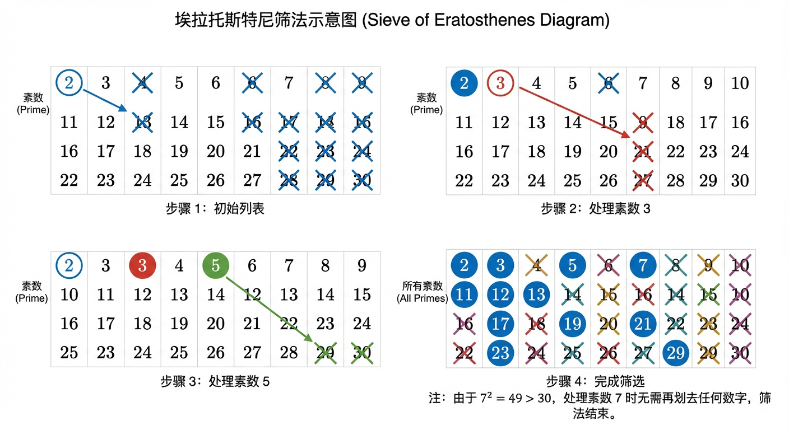
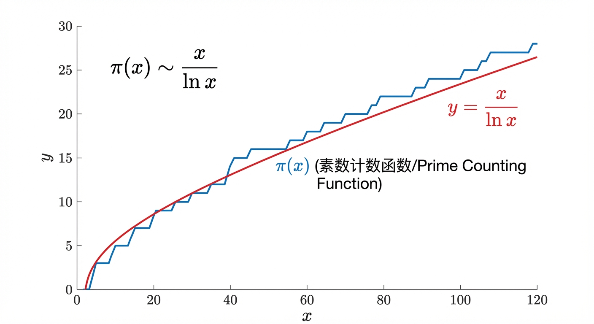
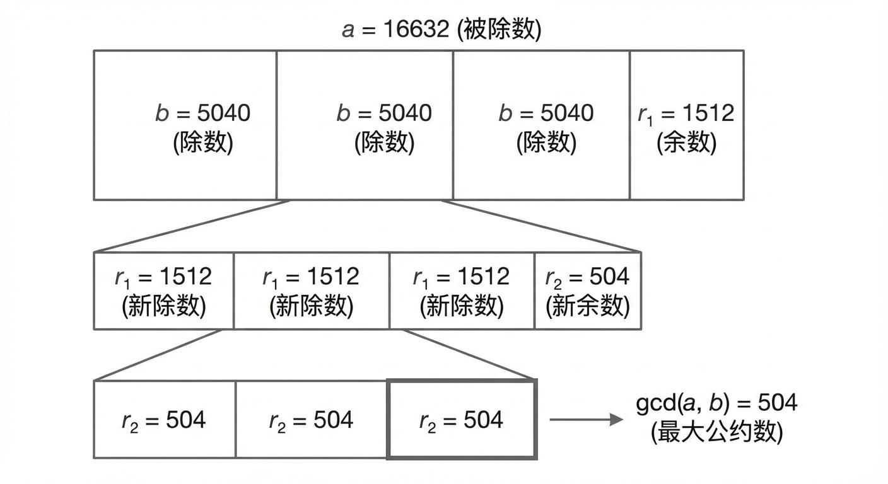
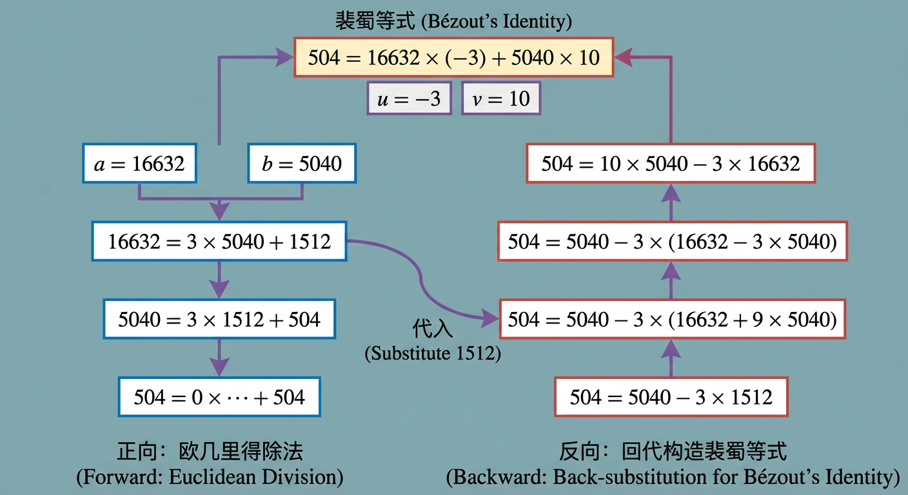
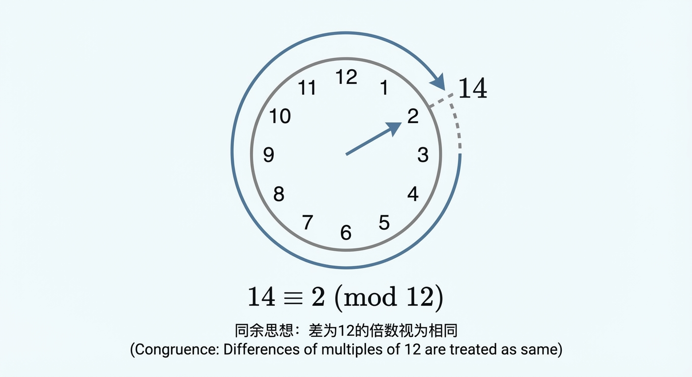
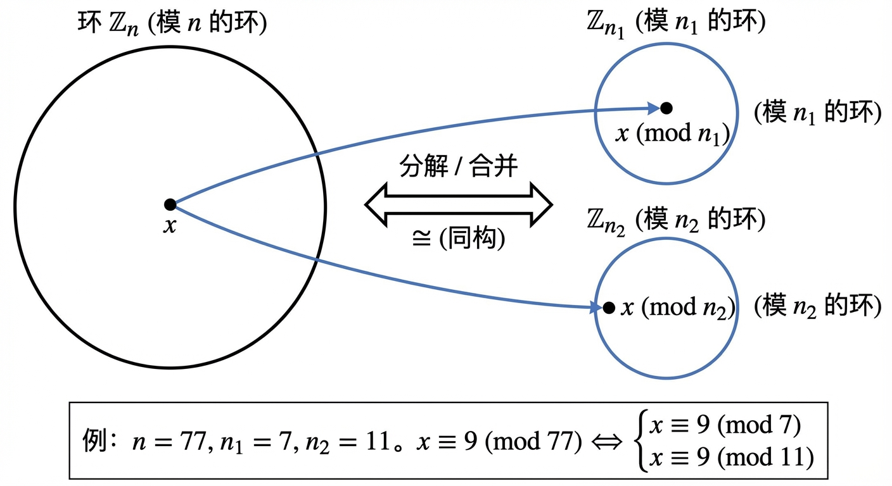
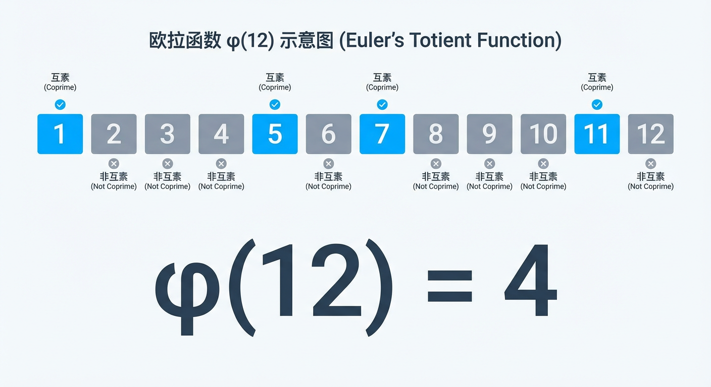
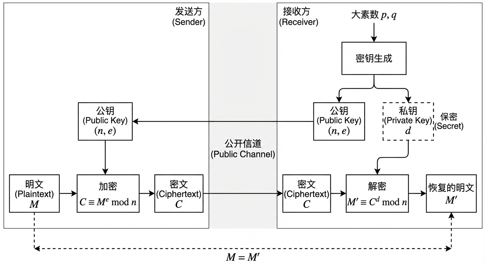

# 第11章 初等数论

## 11.1 素数

在探索整数世界的繁复结构时，我们自然会问：构成这一切的基本单元是什么？如同化学家将万物分解为元素，数学家也将整数分解为更基础的组成部分。这一探索之旅的起点，便是素数——整数世界中不可再分的“原子”。本节将以素数的定义为基石，逐步建立起判定、生成与洞察其分布规律的思维框架，为后续整个数论章节的讨论奠定坚实的结构与方法论基础。

### 素数的定义与唯一分解定理

我们对整数最直观的认识源于其可分解性，例如 $12 = 2 \times 6 = 3 \times 4 = 2 \times 2 \times 3$。观察这些分解，我们发现存在一些特殊的数，如 2 和 3，它们无法被进一步分解为更小的整数之积。这些数正是我们寻找的“原子”。为了精确地捕捉这一概念，我们引入如下定义。

在整数环 $\mathbb{Z}$ 中，乘法单位元是 1，其可逆元（unit）为 $\pm 1$。一个非零、非单位元的整数 $n$ 如果可以表示为两个非单位元整数的乘积，即 $n=ab$ 且 $|a|>1, |b|>1$，则称 $n$ 具有一个**非平凡因子分解（nontrivial factorization）**。

**定义 11.1.1 (素数与合数)**
设 $n$ 为一个整数且 $|n|>1$。
1. 如果 $n$ 无法进行任何非平凡因子分解，则称 $n$ 为**素数（prime number）**或**不可约数（irreducible number）**。换言之，若 $n=ab$ 对某些整数 $a,b$ 成立，则必然有 $|a|=1$ 或 $|b|=1$。
2. 如果 $n$ 至少可以进行一种非平凡因子分解，则称 $n$ 为**合数（composite number）**。

根据此定义，$2, 3, 5, 7$ 都是素数。它们的负数 $-2, -3, -5, -7$ 同样是素数，因为例如 $-5 = ab$ 蕴含着 $5 = |a||b|$，这迫使 $|a|$ 或 $|b|$ 必须为 1。与此相对，$6=2 \times 3$, $-12=3 \times (-4)$ 都是合数，因为它们的因子绝对值均大于 1。这个定义将整数集合 $\mathbb{Z} \setminus \{-1, 0, 1\}$ 完美地划分为素数与合数两个不相交的子集。

这引发了一个看似琐碎却至关重要的问题：为什么数字 1 不被归类为素数？这并非一个随意的约定，而是为了维护数学结构中最核心的一块基石——算术基本定理的优美与自洽。

**定理 11.1.1 (算术基本定理，Fundamental Theorem of Arithmetic)**
每一个大于 1 的整数，或者其本身是一个素数，或者可以被唯一地表示为一串素数的乘积（不计因子次序）。

如果我们假设 1 是一个素数，那么这个定理的**唯一性（uniqueness）**部分将立刻失效。例如，整数 6 可以被分解为 $2 \times 3$，但也可以写成 $1 \times 2 \times 3$, $1 \times 1 \times 2 \times 3$ 等无穷多种形式。这些分解包含了不同数量的“素数”1，从而破坏了分解的唯一性。为了避免这种理论上的混乱，我们将 1 排除在素数之外。这一定理揭示了素数的根本重要性：它们是整数乘法结构的基底，所有大于 1 的整数都可以由它们唯一地搭建而成。这一定理将是本章后续所有讨论的隐含线索，我们研究最大公约数、同余乃至更高级的理论，其根源都系于整数的这种素数分解结构。

### 素数判定与因子分解

算术基本定理确保了任何大于 1 的整数要么是素数，要么是合数。那么，给定一个整数 $n$，我们如何判定它属于哪一类呢？这是数论中最基本也是最具计算挑战性的问题之一。

最直接的方法是**试除法（Trial Division）**。根据定义，要判断 $n$ 是否为素数，我们可以尝试用从 2 到 $n-1$ 的所有整数去除 $n$。如果无一能整除，则 $n$ 是素数。然而，这个过程可以被极大地优化。

**定理 11.1.2**
如果一个整数 $n > 1$ 是合数，那么它必定有一个素因子 $p$ 满足 $p \le \sqrt{n}$。

**证明：** 由于 $n$ 是合数，它必定可以表示为 $n = ab$，其中 $a,b$ 是整数且 $1 < a \le b < n$。我们用反证法（proof by contradiction）。假设 $n$ 的所有素因子都大于 $\sqrt{n}$。既然 $a>1$，$a$ 必然有至少一个素因子，我们称之为 $p$。根据假设，$p > \sqrt{n}$。由于 $a$ 是 $p$ 的倍数（或 $a=p$），我们有 $a \ge p > \sqrt{n}$。同理，$b$ 也必须有素因子，因此 $b > \sqrt{n}$。这样一来，它们的乘积 $n = ab > \sqrt{n} \times \sqrt{n} = n$，即 $n>n$，这显然是一个矛盾。因此，原假设不成立，即 $n$ 必须有一个素因子 $p \le \sqrt{n}$。 $\blacksquare$

这个定理为素性判定提供了一个强大的工具。要判断 $n$ 是否为素数，我们不再需要测试到 $n-1$，而只需测试到 $\sqrt{n}$。例如，要判断 211 是否为素数，我们只需测试不大于 $\sqrt{211} \approx 14.5$ 的素数，即 2, 3, 5, 7, 11, 13。通过计算可知，211 无法被这些数中的任何一个整除，因此 211 是素数。

在实际应用中，尤其是在密码学等领域，我们需要处理的数字极大，试除法即使经过优化也显得力不从心。这催生了对更高效素性测试算法的追求。理论上，威尔逊定理（Wilson's Theorem）提供了一个优美的判定准则：一个整数 $n>1$ 是素数的充要条件是 $(n-1)! \equiv -1 \pmod{n}$。然而，计算 $(n-1)!$ 的巨大开销使其在实践中毫无用处，这体现了理论简洁性与计算可行性之间的张力。

幸运的是，现代计算数论已经发展出多种高效的算法。其中，**米勒-拉宾（Miller-Rabin）**等概率性素性测试算法，能够在极短的时间内以极高的概率判断一个数是否为素数，这对于 RSA 等公钥密码系统的密钥生成至关重要。最终，在 2002 年，**AKS 素性测试**被提出，它是一个确定性的、无条件地在输入位数的**多项式时间（polynomial time）**内完成判定的算法。这一里程碑式的成果表明，“判断一个数是否为素数”在计算复杂性上属于 **P 类问题**，即存在多项式时间算法。这与“对一个合数进行质因数分解”形成了鲜明对比：后者目前尚无已知的多项式时间经典算法，且在现代公钥密码中常被当作计算上“困难”的问题来使用，这种难易程度的不对称性构成了若干密码体制的基础。

### 素数的生成与计数

既然我们能够判定单个素数，一个自然的问题随之而来：如何系统地生成一张素数列表？古希腊数学家埃拉托斯特尼（Eratosthenes）为此设计了一种优雅且高效的算法，即**埃拉托斯特尼筛法（Sieve of Eratosthenes）**。

该算法的原理是对定理 11.1.2 的巧妙运用。要找出所有不大于 $N$ 的素数，我们从一个包含 2 到 $N$ 所有整数的列表开始：

1. 首先，我们认定 2 是素数。然后，将列表中所有 2 的倍数（4, 6, 8, ...）划去，因为它们必然是合数。
2. 接下来，找到下一个未被划去的数，即 3。认定 3 是素数，然后将列表中所有 3 的倍数（6, 9, 12, ...）划去。
3. 重复此过程，找到下一个未被划去的数（即 5），认定其为素数，再划去其所有倍数。
4. 这个过程持续进行，直到我们处理的素数 $p$ 满足 $p^2 > N$。

一个关键的优化是，当我们处理素数 $p$ 时，可以从 $p^2$ 开始划去其倍数。这是因为任何小于 $p^2$ 的 $p$ 的倍数，形如 $k \cdot p$（其中 $k<p$），必然含有一个小于 $p$ 的素因子（即 $k$ 的某个素因子），因此它在处理那个更小的素因子时就已经被划掉了。例如，当处理 5 时，我们无需划去 $2 \times 5=10$ 或 $3 \times 5=15$，因为它们早已在处理 2 和 3 时被划去。我们只需从 $5 \times 5 = 25$ 开始。

当筛法结束时，列表中所有未被划去的数就是不大于 $N$ 的全部素数。埃拉托斯特尼筛法以一种批量处理的方式，高效地生成了素数表，其总操作次数的量级近似为 $O(N \log \log N)$。

随着素数列表的不断延伸，一个新的问题浮现出来：素数的数量有多少？它们在数轴上的分布呈现何种规律？我们定义**素数计数函数（prime-counting function）** $\pi(x)$ 为不超过 $x$ 的素数的个数。例如，$\pi(10)=4$（2, 3, 5, 7），$\pi(100)=25$，$\pi(1000)=168$。这个函数的值呈现出增长趋势，但增长速度似乎在放缓。

高斯和勒让德在 18 世纪末通过大量的数值观察，分别提出了与 $\pi(x)$ 增长有关的近似规律；后在 19 世纪末，哈达玛和德拉瓦莱普桑（de la Vallée Poussin）独立证明了核心结论，这便是数论的又一块基石——**素数定理（Prime Number Theorem）**。

**定理 11.1.3 (素数定理)**
当 $x$ 趋于无穷大时，$\pi(x)$ 与 $\frac{x}{\ln x}$ 是渐近等价的，记为：
$$
\pi(x) \sim \frac{x}{\ln x}
$$
其中 $\ln x$ 是自然对数。

素数定理揭示了素数分布的宏观规律。它告诉我们，一个远大于 1 的随机整数 $n$ 是素数的“概率”大约是 $\frac{1}{\ln n}$。例如，在生成一个 1024 位的 RSA 密钥时，我们需要寻找两个 512 位的素数。一个 512 位的随机奇数 $n$ 的大小约为 $2^{511}$，其为素数的概率大约是
$$
\frac{1}{\ln(2^{511})}=\frac{1}{511\ln 2}\approx \frac{1}{354}.
$$
这意味着平均测试约三百多个候选奇数，就能找到一个素数，这在计算上是完全可行的。素数定理将离散、不规则的素数序列与光滑的对数函数联系起来，展现了数学中离散与连续的深刻对偶。

### 素数的无穷性与分布奥秘

我们已经知道如何判定和生成素数，也了解了它们在大尺度上的近似分布。但是，素数的旅程会终结吗？是否存在一个最大的素数？两千多年前，欧几里得给出了一个绝妙的否定回答。

**定理 11.1.4 (欧几里得定理)**
素数的个数是无穷的。

**证明：** 我们再次使用反证法。假设素数的个数是有限的，记为 $P = \{p_1, p_2, \dots, p_k\}$，其中 $p_k$ 是最大的素数。
现在，让我们构造一个新整数 $N$，它等于所有这些有限的素数之积再加一：
$$
N = (p_1 \times p_2 \times \dots \times p_k) + 1
$$
根据算术基本定理，$N$ 必须有至少一个素因子，我们称之为 $p$。这个素因子 $p$ 必然属于我们假设的完备素数集合 $P$。因此，$p$ 必定是 $p_1, p_2, \dots, p_k$ 中的某一个。
这意味着 $p$ 能够整除它们的乘积 $(p_1 \times p_2 \times \dots \times p_k)$。
然而，从 $N$ 的构造我们知道，$N$ 除以任何一个 $p_i$（$i=1,\dots,k$）都余 1。这意味着 $p$ 不能整除 $N$。
我们得到了一个矛盾：素因子 $p$ 既能整除 $N$ 又不能整除 $N$。
因此，我们最初的假设——“素数是有限的”——必定是错误的。故素数的个数是无穷的。 $\blacksquare$

欧几里得的证明不仅简洁有力，而且具有构造性，它指明了如何从任何一个有限的素数集合出发，找到一个不在此集合中的新素数。

尽管素数无穷无尽且在宏观上遵循素数定理，但它们的局部行为却充满了神秘和不规则性。数学家们围绕素数的精细分布提出了许多深刻的猜想，其中一些至今仍是数学皇冠上的明珠。例如：
- **孪生素数猜想（Twin Prime Conjecture）：** 是否存在无穷多对形如 $(p, p+2)$ 的素数，如 (3, 5), (5, 7), (11, 13), (17, 19)？
- **哥德巴赫猜想（Goldbach's Conjecture）：** 是否每个大于 2 的偶数都可以表示为两个素数之和？例如，$4=2+2$, $100=3+97$。
- **黎曼猜想（Riemann Hypothesis）：** 这个与黎曼 Zeta 函数零点分布相关的猜想，其深刻影响着我们对素数定理误差项的精确理解。

此外，素数在特定模式下的分布也引人入胜。例如，像 $p$ 和 $2p+1$ 均为素数的**索菲·热尔曼素数（Sophie Germain primes）**（如 $p=2, 3, 5, 11, 23$），或者在等差数列中出现的素数。**狄利克雷定理（Dirichlet's Theorem on Arithmetic Progressions）**保证，在形如 $an+b$ 的等差数列中，只要 $a$ 和 $b$ 互素（即 $\gcd(a,b)=1$），就存在无穷多个素数。例如，在形如 $4k+3$ 的数列（3, 7, 11, 15, ...）中，包含了无穷多个素数。对这类特定模式的素数分布的研究，不仅是纯粹数学的智力挑战，也为我们下一节引入同余理论提供了直观的动机。

### 小结

本节中，我们为“素数”这一数论中的核心角色建立了坚实的理论框架。从其作为整数乘法结构“原子”的根本地位出发，我们明确了其严格定义，并阐明了算术基本定理赋予其分解唯一性的核心价值。

我们遵循“判定—生成—规律”的逻辑路径，首先探讨了素性判定的基本方法。通过证明合数必有不大于其平方根的素因子，我们为试除法和埃拉托斯特尼筛法等算法奠定了理论基础，并从计算复杂性的视角，将经典的判定方法与现代高效的概率性测试及确定性的 AKS 算法并置，使读者对“判定素数”这一问题的可计算性有了层次分明的认识。

接着，我们转向素数的宏观行为，引入了素数计数函数与素数定理，揭示了素数在整体上看似随机、实则有序的渐近分布规律。欧几里得关于素数无穷性的经典反证法，不仅展示了数学证明的优雅，也强化了我们对素数永不枯竭的认知。最后，通过点染孪生素数、哥德巴赫猜想以及等差数列中的素数等话题，我们得以一窥素数分布局部不规则性背后的深邃谜团。

作为初等数论的开篇，本节所建立的“素数是分解基底”的观念，将直接引导我们进入下一节对**最大公约数（11.2）**的讨论。而本节末尾对“按模分类观察素数”的提及，则为**同余理论（11.3）**的引入埋下了伏笔，并为后续章节中需要依赖互素与分解性质的**一次同余方程（11.4）**和**费马小定理（11.5）**的学习提供了必要的问题意识与认知钩子。至此，我们不仅掌握了素数的基本概念与方法，更重要的是，为即将展开的整个数论工具链的探索，铺设了统一的叙事起点。

在明确了素数作为“不可分原子”的地位之后，我们面临的下一个逻辑必然是：如何处理这些原子重新组合而成的复合体？如果说算术基本定理给出了整数的“化学式”，那么接下来我们需要探究的便是不同整数之间如何通过这些共享的“原子”发生联系。这种联系最直接的体现，便是公约数与公倍数。

## 11.2 最大公约数与最小公倍数

在上一节中，我们确立了素数作为整数世界的基本“原子”。算术基本定理向我们揭示，任何大于 1 的整数都可以唯一地分解为这些原子的乘积。这一深刻的见解不仅为我们提供了审视单个整数的“化学式”，更为我们理解整数之间的相互关系——尤其是整除关系——提供了一把锋利的解剖刀。本节将以此为起点，深入探讨两个在数论和计算机科学中至关重要的概念：最大公约数与最小公倍数。我们将循着“从定义到结构、从结构到算法、再从算法到应用”的脉络，揭示它们优美的对偶性，掌握高效的计算方法，并最终将它们锻造成解决后续问题的关键工具。

### 定义与素因子刻画

我们首先从最直观的集合角度来定义这两个概念。

**定义 11.2.1 (公约数与最大公约数)**  
对于两个不全为零的整数 $a$ 和 $b$，它们的 **公约数 (Common Divisor)** 是指一个能同时整除 $a$ 和 $b$ 的整数。在所有正的公约数中，最大的那一个被称为 $a$ 和 $b$ 的 **最大公约数 (Greatest Common Divisor, GCD)**，记作 $\gcd(a, b)$。

**定义 11.2.2 (公倍数与最小公倍数)**  
对于两个非零整数 $a$ 和 $b$，它们的 **公倍数 (Common Multiple)** 是指一个能同时被 $a$ 和 $b$ 整除的整数。在所有正的公倍数中，最小的那一个被称为 $a$ 和 $b$ 的 **最小公倍数 (Least Common Multiple, LCM)**，记作 $\operatorname{lcm}(a, b)$。

按照约定，对于任意非零整数 $a$，我们定义 $\gcd(a, 0) = |a|$。这是因为 $0$ 可以被任何非零整数整除，所以 $a$ 和 $0$ 的公约数集合恰好就是 $a$ 的约数集合，其最大的正约数自然是 $|a|$。相应地，$a$ 和 $0$ 的公倍数集合由所有 $a$ 的倍数组成，其中唯一的非负且能被 $0$ 整除的整数是 $0$，因此我们定义 $\operatorname{lcm}(a, 0) = 0$。

这些定义虽然清晰，但依赖于寻找并比较约数或倍数集合，在计算上并不高效。真正的力量蕴藏于算术基本定理之中。假设正整数 $a$ 和 $b$ 的素因子分解式为：
$$
a = \prod_{i=1}^{k} p_i^{\alpha_i}
\quad \text{和} \quad
b = \prod_{i=1}^{k} p_i^{\beta_i}
$$
其中 $\{p_1, p_2, \ldots, p_k\}$ 是包含了 $a$ 或 $b$ 所有素因子的集合，指数 $\alpha_i, \beta_i \ge 0$（若某素数不是因子，则其指数为 0）。

一个数 $d = \prod p_i^{\delta_i}$ 要成为 $a$ 和 $b$ 的公约数，它必须满足 $d \mid a$ 和 $d \mid b$。根据整除性的素因子判据，这意味着对于每一个 $i$，必须有 $\delta_i \le \alpha_i$ 且 $\delta_i \le \beta_i$，即 $\delta_i \le \min(\alpha_i, \beta_i)$。为了使 $d$ 成为**最大**的公约数，我们必须为每个素因子选择尽可能大的指数，因此，我们必须取 $\delta_i = \min(\alpha_i, \beta_i)$。

与此对偶，一个数 $m = \prod p_i^{\mu_i}$ 要成为 $a$ 和 $b$ 的公倍数，必须满足 $a \mid m$ 和 $b \mid m$。这意味着 $\alpha_i \le \mu_i$ 且 $\beta_i \le \mu_i$，即 $\mu_i \ge \max(\alpha_i, \beta_i)$。为了使 $m$ 成为**最小**的正公倍数，我们必须为每个素因子选择尽可能小的指数，因此，我们必须取 $\mu_i = \max(\alpha_i, \beta_i)$。

这引导我们获得了 GCD 和 LCM 的一个更为深刻且富有结构性的描述。

**定理 11.2.3 (GCD 与 LCM 的素因子分解)**  
若正整数 $a = \prod p_i^{\alpha_i}$ 且 $b = \prod p_i^{\beta_i}$，则：
$$
\gcd(a, b) = \prod_{i=1}^{k} p_i^{\min(\alpha_i, \beta_i)}
$$
$$
\operatorname{lcm}(a, b) = \prod_{i=1}^{k} p_i^{\max(\alpha_i, \beta_i)}
$$

这个定理揭示了一种美妙的对偶性：在素数指数的微观世界里，宏观的、基于整除关系的 GCD 和 LCM 运算，被还原为了对每个素数指数的 `min` 和 `max` 操作。例如，对于 $a = 12 = 2^2 \cdot 3^1$ 和 $b = 18 = 2^1 \cdot 3^2$，我们有：
$$
\gcd(12, 18) = 2^{\min(2, 1)} \cdot 3^{\min(1, 2)} = 2^1 \cdot 3^1 = 6
$$
$$
\operatorname{lcm}(12, 18) = 2^{\max(2, 1)} \cdot 3^{\max(1, 2)} = 2^2 \cdot 3^2 = 36
$$

这种视角是证明 GCD 和 LCM 相关性质的强大武器。其中最核心的恒等式如下。

**定理 11.2.4 (GCD-LCM 恒等式)**  
对于任意正整数 $a$ 和 $b$，有：
$$
\gcd(a, b) \cdot \operatorname{lcm}(a, b) = ab
$$

**证明：**  
利用定理 11.2.3，我们考察等式两边每个素因子 $p_i$ 的指数。  
左边 $p_i$ 的指数为 $\min(\alpha_i, \beta_i) + \max(\alpha_i, \beta_i)$。  
右边 $ab = \left(\prod p_i^{\alpha_i}\right)\left(\prod p_i^{\beta_i}\right) = \prod p_i^{\alpha_i + \beta_i}$，所以 $p_i$ 的指数为 $\alpha_i + \beta_i$。  
对于任意两个非负整数（更一般地，对任意两个实数）$x, y$，恒有 $\min(x, y) + \max(x, y) = x + y$。因此，对于每一个 $i$，两边的指数都相等。根据算术基本定理的唯一性，这两个数必然相等。  
∎

这个恒等式不仅优美，而且极具实用价值：一旦我们通过某种方法求得了 $\gcd(a, b)$，便能立刻通过除法得到 $\operatorname{lcm}(a, b)$，反之亦然。例如，计算 $\operatorname{lcm}(289, 391)$，直接分解可能不那么直观，但我们可能注意到 $289 = 17^2$。测试 $391$ 是否能被 $17$ 整除，发现 $391 = 17 \cdot 23$。于是 $\gcd(289, 391) = 17$，从而
$$
\operatorname{lcm}(289, 391) = \frac{289 \cdot 391}{17} = 289 \cdot 23 = 6647.
$$

### 欧几里得算法：高效计算的引擎

尽管素因子分解为我们提供了深刻的结构洞察，但它依赖于一个计算上的“硬问题”——大整数的质因数分解。在实践中，我们需要一种不依赖于分解的高效算法。这个古老而优雅的算法就是欧几里得算法（Euclidean Algorithm）。

欧几里得算法的核心基于下面这个简单的引理。

**引理 11.2.5**  
对于任意整数 $a, b$，其中 $b \neq 0$，若 $a = qb + r$，其中 $q, r$ 是整数，则 $\gcd(a, b) = \gcd(b, r)$。

**证明：**  
设 $d$ 是 $a$ 和 $b$ 的一个公约数，即 $d \mid a$ 且 $d \mid b$。由于 $r = a - qb$，根据整除的线性组合性质，必有 $d \mid r$。因此 $d$ 也是 $b$ 和 $r$ 的一个公约数。  
反之，设 $d'$ 是 $b$ 和 $r$ 的一个公约数，即 $d' \mid b$ 且 $d' \mid r$。由于 $a = qb + r$，必有 $d' \mid a$。因此 $d'$ 也是 $a$ 和 $b$ 的一个公约数。  
这表明，$a$ 和 $b$ 的公约数集合与 $b$ 和 $r$ 的公约数集合完全相同。既然公约数集合相同，它们的最大正公约数也必然相同。  
∎

这个引理允许我们通过一系列的带余数除法，将求两个较大数的 GCD 问题，转化为求两个较小数的 GCD 问题，直至其中一个数为 0。

**算法 11.2.6 (欧几里得算法)**  
输入：两个非负整数 $a, b$，不妨设 $a \ge b$。  
输出：$\gcd(a, b)$。  
1. 若 $b = 0$，则返回 $a$。  
2. 否则，计算 $r = a \bmod b$。  
3. 返回 $\gcd(b, r)$ 的计算结果。

我们以计算 $\gcd(16632, 5040)$ 为例来展示其威力：
\begin{align*}
16632 &= 3 \cdot 5040 + 1512 \\
5040 &= 3 \cdot 1512 + 504 \\
1512 &= 3 \cdot 504 + 0
\end{align*}
余数依次为 $1512, 504, 0$。最后一个非零余数是 $504$，因此 $\gcd(16632, 5040) = 504$。这个过程远比对 $16632$ 和 $5040$ 进行素因子分解要快得多。

### 裴蜀等式与扩展欧几里得算法

欧几里得算法的价值远不止于计算 GCD 本身。通过追溯其计算过程，我们可以揭示一个关于 GCD 的深刻的线性组合性质，这便是裴蜀等式（Bézout's Identity）。

**定理 11.2.7 (裴蜀等式)**  
对于任意两个不全为零的整数 $a, b$，存在整数 $u, v$ 使得：
$$
au + bv = \gcd(a, b).
$$

这个定理的一个优雅证明是考虑集合 $S = \{ax + by \mid x, y \in \mathbb{Z}\}$，即所有 $a$ 和 $b$ 的整数线性组合构成的集合。可以证明，$S$ 中最小的正元素恰好就是 $\gcd(a, b)$。既然此最小正元素属于 $S$，它自然可以被写成 $au + bv$ 的形式。

而**扩展欧几里得算法 (Extended Euclidean Algorithm)** 正是找出这样一对整数 $(u, v)$ 的构造性方法。它通过在执行欧几里得算法的每一步，同时维护余数如何表示为原始数 $a, b$ 的线性组合。

我们再次以 $\gcd(16632, 5040) = 504$ 为例。  
从 $16632 = 3 \cdot 5040 + 1512$，我们得到 $1512 = 16632 - 3 \cdot 5040$。  
从 $5040 = 3 \cdot 1512 + 504$，我们得到 $504 = 5040 - 3 \cdot 1512$。  
现在，我们将 $1512$ 的表达式代入上式：
\begin{align*}
504 &= 5040 - 3 \cdot (16632 - 3 \cdot 5040) \\
&= 5040 - 3 \cdot 16632 + 9 \cdot 5040 \\
&= 10 \cdot 5040 - 3 \cdot 16632
\end{align*}
于是，我们找到了 $u = -3, v = 10$，使得 $16632(-3) + 5040(10) = 504$。

找到这对系数 $(u, v)$ 的能力，是解决一次同余方程 $ax \equiv c \pmod m$ 的基石，因为它直接关系到求模逆元的存在性与计算。因此，扩展欧几里得算法是连接数论与密码学等应用领域的一座至关重要的桥梁，我们将在 11.4 节中充分利用它。

### 结构性质与推广

GCD 和 LCM 运算满足一系列优美的代数性质，这些性质使它们成为构建更复杂理论的可靠工具。这些性质大多可以通过素因子指数的 `min/max` 运算法则得到简洁的证明。

**定理 11.2.8 (GCD 与 LCM 的代数性质)**  
对于任意正整数 $a, b, c$ 和 $k > 0$：  
1. **交换律**：$\gcd(a, b) = \gcd(b, a)$，$\operatorname{lcm}(a, b) = \operatorname{lcm}(b, a)$。  
2. **结合律**：$\gcd(a, b, c) = \gcd(\gcd(a, b), c)$，$\operatorname{lcm}(a, b, c) = \operatorname{lcm}(\operatorname{lcm}(a, b), c)$。  
3. **分配律**：  
   $\gcd(a, \operatorname{lcm}(b, c)) = \operatorname{lcm}(\gcd(a, b), \gcd(a, c))$  
   $\operatorname{lcm}(a, \gcd(b, c)) = \gcd(\operatorname{lcm}(a, b), \operatorname{lcm}(a, c))$  
4. **缩放律**：$\gcd(ka, kb) = k \cdot \gcd(a, b)$，$\operatorname{lcm}(ka, kb) = k \cdot \operatorname{lcm}(a, b)$。

结合律的成立使得我们可以无歧义地讨论一组数的最大公约数与最小公倍数。例如，计算 $\gcd(84, 126, 210)$，我们可以先计算 $\gcd(84, 126) = 42$，再计算 $\gcd(42, 210) = 42$。

这些性质，特别是分配律，暗示了一个更深层的结构。如果我们考虑正整数集合 $\mathbb{Z}^+$，并定义其上的偏序关系为整除关系（即 $a \preceq b \iff a \mid b$），那么在这个偏序集（poset）中，$\gcd(a, b)$ 正是 $a$ 和 $b$ 的**最大下界 (Greatest Lower Bound, or meet)**，而 $\operatorname{lcm}(a, b)$ 则是它们的**最小上界 (Least Upper Bound, or join)**。这套系统 $(\mathbb{Z}^+, \gcd, \operatorname{lcm})$ 构成了一个**格 (Lattice)** 结构，这为我们在第 14 章学习代数系统提供了重要的具体实例。

更有趣的是，这种结构在环论中有个完美的对应：对于主理想整环（如整数环 $\mathbb{Z}$），两个元素 $a, b$ 生成的理想的和等于它们最大公约数生成的理想，而它们生成的理想的交则等于它们最小公倍数生成的理想：
$$
(a) + (b) = (\gcd(a, b))
\quad \text{和} \quad
(a) \cap (b) = (\operatorname{lcm}(a, b)).
$$
这一视角将数论中的算术运算与抽象代数中的理想运算统一起来，展现了数学内在的和谐。

### 小结

本节中，我们从素因子分解这一结构性视角出发，重新审视了最大公约数（GCD）与最小公倍数（LCM），揭示了它们在素数指数层面上的 `min/max` 对偶关系。这一观点不仅催生了核心恒等式 $\gcd(a, b) \cdot \operatorname{lcm}(a, b) = ab$，也让我们得以优雅地证明了它们所满足的交换、结合、分配等一系列代数定律。

然而，理论的优美必须与计算的可行性相结合。我们认识到，依赖于大数分解的结构方法在计算上是困难的，这促使我们转向了基于整除递推思想的欧几里得算法。它不仅为 GCD 提供了高效的计算路径，其扩展形式更是揭示了深刻的裴蜀等式，为我们提供了将 GCD 表达为线性组合的构造性工具。

至此，我们完成了从定义到结构，再到算法的完整认知链条。本节建立的理论和工具，特别是扩展欧几里得算法，并不仅仅是数论内部的智力游戏。它将作为一把关键的钥匙，在下一节“同余”中，为我们打开模算术世界的大门，并为最终在 11.4 节中系统地求解一次同余方程、计算模逆元做好必不可少的准备。可以说，掌握了 GCD 与 LCM，我们才真正拥有了在离散的整数世界中进行代数运算的“语法”和“引擎”。

有了处理整除和最大公约数的工具，我们已经可以解决整数间的许多线性关系问题。然而，这种处理方式往往依赖于具体的数值大小。为了更深刻地揭示整数的周期性结构，并简化诸如“大数除以某数的余数”这类问题的表达，我们需要引入一种更高阶的数学语言。这种语言将“整除”这一关系符号化，让我们能够在“余数”的层面上进行等价运算，这就是同余。

## 11.3 同余

在前两节中，我们建立了以素数为基石的整数分解理论，并掌握了以欧几里得算法为核心的最大公约数计算方法。这些工具为我们深入探索整数的结构特性铺平了道路。现在，我们将视角从整数的个体属性转向它们之间的关系，引入一种能够极大简化数论问题的强大语言——**同余（congruence）**。本节将从“整除—余数—等价”的视角出发，建立同余作为一种可计算的表达语言，系统化地解决一次同余方程，并最终揭示其作为“分而治之”策略的深刻思想，为后续章节中更为精妙的定理与应用奠定坚实的语法基础。

### 同余的定义与基本性质

我们日常生活中对时间的感知，便是同余思想最直观的体现。例如，时钟指向 14 点，我们习惯称之为下午 2 点。在这个以 12 为循环的世界里，14 和 2 扮演着相同的角色，相差 12 的整数倍被视为等同。这种“只关心余数”的思想，正是同余理论的精髓。

**定义 11.3.1（同余）**  
设 $m$ 是一个正整数。若两个整数 $a$ 和 $b$ 满足 $m \mid (a-b)$，则称 $a$ 和 $b$ **模 $m$ 同余**，记作 $a \equiv b \pmod m$。  
若 $m \nmid (a-b)$，则称 $a$ 和 $b$ **模 $m$ 不同余**，记作 $a \not\equiv b \pmod m$。

这里的整数 $m$ 称为**模（modulus）**。从定义可以看出，同余关系本质上是对整除关系的一种等价表述。$a \equiv b \pmod m$ 与 $a = b + km$（对于某个整数 $k$）是等价的，这意味着 $a$ 和 $b$ 在除以 $m$ 时具有相同的余数。

同余关系是定义在整数集 $\mathbb{Z}$ 上的一个二元关系。不难验证，它满足作为等价关系的三个基本性质：
1.  **自反性**：对任意整数 $a$，$a \equiv a \pmod m$。
2.  **对称性**：若 $a \equiv b \pmod m$，则 $b \equiv a \pmod m$。
3.  **传递性**：若 $a \equiv b \pmod m$ 且 $b \equiv c \pmod m$，则 $a \equiv c \pmod m$。

既然同余是等价关系，它便将整数集 $\mathbb{Z}$ 划分成了若干个互不相交的等价类，这些等价类被称为**模 $m$ 的剩余类（residue classes）**或**同余类**。每个剩余类中的所有整数模 $m$ 都同余。例如，模 3 的剩余类有三个：
-   $[0]_3 = \{\dots, -6, -3, 0, 3, 6, \dots\}$
-   $[1]_3 = \{\dots, -5, -2, 1, 4, 7, \dots\}$
-   $[2]_3 = \{\dots, -4, -1, 2, 5, 8, \dots\}$

这 $m$ 个剩余类构成了所谓的**模 $m$ 剩余类集**，记为 $\mathbb{Z}_m = \{[0]_m, [1]_m, \dots, [m-1]_m\}$。在不引起混淆的情况下，我们通常用其代表元 $0, 1, \dots, m-1$ 来指代这些剩余类。

同余关系的美妙之处在于它与算术运算的和谐共存。这使得我们可以在有限的剩余类集合上进行“模算术”，极大地简化了涉及大数的计算。

**定理 11.3.1（同余的运算性质）**  
若 $a \equiv b \pmod m$ 且 $c \equiv d \pmod m$，则：
1.  $a+c \equiv b+d \pmod m$
2.  $a-c \equiv b-d \pmod m$
3.  $ac \equiv bd \pmod m$
4.  对任意正整数 $n$，$a^n \equiv b^n \pmod m$
5.  对任意整数 $k$，$ka \equiv kb \pmod m$

这些性质表明，在模 $m$ 的运算中，我们可以随时将一个数替换为其模 $m$ 同余的任何其他数，而不会改变最终结果的同余类。这为处理复杂的算术表达式提供了极大的灵活性。

### 一次同余方程

掌握了模算术的基本规则后，我们自然会问：如何在同余的世界里解方程？最基本的一类便是**一次同余方程（linear congruence equation）**。

**定义 11.3.2（一次同余方程）**  
形如 $ax \equiv b \pmod m$ 的方程，其中 $a,b,m$ 是整数且 $m>0$，$x$ 为未知整数，称为一次同余方程。

在实数域中解方程 $ax=b$，只要 $a \neq 0$，我们便可以两边同除以 $a$ 得到唯一解 $x=b/a$。然而，在模算术中，“除法”并非理所当然。例如，考虑 $2x \equiv 4 \pmod 6$ 和 $2x \equiv 3 \pmod 6$。前者有解 $x=2$ 和 $x=5$，而后者无解。这引发了核心问题：何时可以进行“约去”或“除法”？

这里的“除以 $a$”等价于乘以 $a$ 的**模 $m$ 乘法逆元（multiplicative inverse）**，即寻找一个整数 $a'$ 使得 $aa' \equiv 1 \pmod m$。我们在 11.2 节中已经知道，这样的逆元存在的充要条件是 $\gcd(a,m)=1$。

当 $\gcd(a,m)=1$ 时，解方程 $ax \equiv b \pmod m$ 就变得简单。利用扩展欧几里得算法可以求得 $a$ 模 $m$ 的逆元 $a^{-1}$，方程两边同乘以 $a^{-1}$ 即可得到唯一解 $x \equiv b\cdot a^{-1} \pmod m$。

那么，当 $\gcd(a,m)=g>1$ 时，情况又如何呢？  
我们将同余方程 $ax \equiv b \pmod m$ 转化为其等价的丢番图方程形式：$ax-my=b$，其中 $y$ 是某个整数。根据裴蜀等式，我们知道 $a$ 和 $m$ 的所有线性组合都是它们最大公约数 $g$ 的倍数。因此，这个方程有整数解 $(x,y)$ 的充要条件是 $g \mid b$。

**定理 11.3.2（一次同余方程的可解性与解的结构）**  
一次同余方程 $ax \equiv b \pmod m$ 有解的充要条件是 $\gcd(a,m)\mid b$。  
若有解，则该方程在模 $m$ 的意义下恰有 $\gcd(a,m)$ 个不同的解。

若条件满足，设 $g=\gcd(a,m)$。我们可以将方程 $ax \equiv b \pmod m$ 的两边以及模数同时除以 $g$，得到一个新的同余方程：
$$
\frac{a}{g}x \equiv \frac{b}{g} \pmod{\frac{m}{g}} .
$$
在这个新方程中，系数 $\frac{a}{g}$ 与新模数 $\frac{m}{g}$ 是互素的。因此，我们可以求出 $\frac{a}{g}$ 模 $\frac{m}{g}$ 的唯一逆元，从而求得 $x$ 模 $\frac{m}{g}$ 的唯一解，我们称之为 $x_0$。  
这个 $x_0$ 是原方程的一个特解。所有满足 $x \equiv x_0 \pmod{\frac{m}{g}}$ 的整数都是原方程的解。这些解在模 $m$ 的意义下构成了 $g$ 个不同的剩余类，它们分别是：
$$
x_0,\quad x_0+\frac{m}{g},\quad x_0+2\frac{m}{g},\quad \dots,\quad x_0+(g-1)\frac{m}{g}.
$$

**示例**：求解 $420x \equiv -42 \pmod{378}$。  
1.  **判定可解性**：首先计算 $\gcd(420,378)$。通过素因子分解 $420 = 2^2 \cdot 3 \cdot 5 \cdot 7$ 和 $378 = 2 \cdot 3^3 \cdot 7$，我们得到 $\gcd(420,378)=2\cdot 3\cdot 7=42$。因为 $42\mid (-42)$，所以方程有解，且解的个数为 42。  
2.  **构造解**：我们将原方程的所有部分同除以 42：
    $$
    \frac{420}{42}x \equiv \frac{-42}{42} \pmod{\frac{378}{42}}
    \implies 10x \equiv -1 \pmod 9 .
    $$
    由于 $10 \equiv 1 \pmod 9$，所以方程等价于 $x \equiv -1 \pmod 9$，即 $x \equiv 8 \pmod 9$。这是一个模 9 的解。  
3.  **刻画解集**：所有解构成了模 378 的 42 个同余类。第一个解是 $x_0=8$。其他解为 $8+k\cdot \frac{378}{42}=8+9k$，其中 $k=0,1,\dots,41$。所以解集为 $\{8,17,26,\dots,377\}$。

### 同余方程组与中国剩余定理的思想

解决了单个同余方程后，一个自然的问题是：如果一个数 $x$ 需要同时满足多个同余约束，我们该如何求解？这就是**同余方程组（system of congruences）**问题。
$$
\begin{cases}
x \equiv a_1 \pmod{m_1},\\
x \equiv a_2 \pmod{m_2},\\
\vdots\\
x \equiv a_k \pmod{m_k}.
\end{cases}
$$
这类问题在密码学、编码理论和计算机科学中有广泛应用。例如，一个系统可能需要一个密钥 $x$ 同时满足由多个独立服务器施加的校验条件。

解决此类问题的关键思想是**分而治之（divide and conquer）**，这一思想的经典体现便是**中国剩余定理（Chinese Remainder Theorem, CRT）**，它将在 11.4 节详细展开。本节我们先通过一个强大的结构性例子来领会其精髓。

思考一个非线性的问题：求解 $x^2 \equiv 9 \pmod{77}$。  
直接在模 77 的范围内寻找似乎很困难。但注意到模数 $77 = 7 \times 11$，且 7 和 11 互素。一个数模 77 与 9 同余，当且仅当它模 7 与模 9 同余且模 11 与模 9 同余。更一般地，若 $n=n_1n_2$ 且 $\gcd(n_1,n_2)=1$，则对任意整数 $A$，有
$$
x \equiv A \pmod n \quad \Longleftrightarrow \quad
\begin{cases}
x \equiv A \pmod{n_1},\\
x \equiv A \pmod{n_2}.
\end{cases}
$$
因此，原方程等价于以下方程组：

$$
\begin{cases}
x^2 \equiv 9 \pmod 7,\\
x^2 \equiv 9 \pmod{11}.
\end{cases}
$$
对于 $x^2 \equiv 9 \pmod 7$，解为 $x \equiv \pm 3 \pmod 7$，即 $x \equiv 3 \pmod 7$ 或 $x \equiv 4 \pmod 7$。  
对于 $x^2 \equiv 9 \pmod{11}$，解为 $x \equiv \pm 3 \pmod{11}$，即 $x \equiv 3 \pmod{11}$ 或 $x \equiv 8 \pmod{11}$。

现在，我们将这些“局部”解组合起来。总共有 $2 \times 2 = 4$ 种组合，每种组合都对应一个一次同余方程组：
1.  $x \equiv 3 \pmod 7$ 且 $x \equiv 3 \pmod{11} \implies x \equiv 3 \pmod{77}$
2.  $x \equiv 3 \pmod 7$ 且 $x \equiv 8 \pmod{11} \implies x \equiv 52 \pmod{77}$
3.  $x \equiv 4 \pmod 7$ 且 $x \equiv 3 \pmod{11} \implies x \equiv 25 \pmod{77}$
4.  $x \equiv 4 \pmod 7$ 且 $x \equiv 8 \pmod{11} \implies x \equiv 74 \pmod{77}$

令人惊讶的是，这个二次同余方程在模 77 下竟然有四个解：$3,25,52,74$。这与我们在实数域中“二次方程最多两个根”的经验截然不同，深刻揭示了合数模下算术结构的复杂与丰富。这种“分解—组合”的策略，正是中国剩余定理的核心。

更一般地，若 $n = p_1^{k_1} p_2^{k_2} \cdots p_t^{k_t}$，其中 $p_1,\dots,p_t$ 两两不同，则关于模 $n$ 的同余方程（无论线性还是非线性）在满足可分解条件时，可以被分解为一组关于其素数幂模 $p_i^{k_i}$ 的同余方程；若每个子方程在模 $p_i^{k_i}$ 下的解的数量为 $s_i$，则原方程在模 $n$ 下的解的数量为 $s_1s_2\cdots s_t$。如果任何一个子方程无解（即某个 $s_i=0$），则原方程也无解。

那么，当我们面对一个一般的同余方程组时，其模数 $m_i$ 未必两两互素，该如何处理？这需要一个**相容性条件（compatibility condition）**。  
考虑方程组 $x \equiv a_i \pmod{m_i}$ 和 $x \equiv a_j \pmod{m_j}$。若存在解 $x$，则 $x$ 满足 $x=a_i+k_i m_i=a_j+k_j m_j$。这意味着 $a_i-a_j=k_j m_j-k_i m_i$，差值 $a_i-a_j$ 必须是 $\gcd(m_i,m_j)$ 的倍数。因此，一个方程组有解的必要条件是：
$$
a_i \equiv a_j \pmod{\gcd(m_i,m_j)} \quad \text{对所有 } i \neq j .
$$
可以证明这也是充分条件。

完整的求解算法遵循“分解—检验—合并”的流程：
1.  **分解**：将系统中每个模 $m_i$ 分解为素数幂的乘积。将原方程组 $x \equiv a_i \pmod{m_i}$ 转化为一个更大的、模皆为素数幂的方程组。
2.  **检验与化简**：对每个素数 $p$，收集所有模为 $p$ 的幂的方程。检验它们是否满足相容性条件。如果满足，这个子系统可以化简为单个同余方程，其模为该素数的最高次幂。
3.  **合并**：经过化简，我们得到一个模两两互素的新方程组。此时便可应用中国剩余定理的标准形式（或迭代替换法）来构造唯一解。

例如，要解方程组 $x \equiv 1 \pmod 8,\ x \equiv 2 \pmod 9,\ x \equiv 3 \pmod{25}$，我们可以采用迭代替换法：  
由 $x \equiv 1 \pmod 8$，设 $x = 8k+1$。  
代入第二式：$8k+1 \equiv 2 \pmod 9 \implies 8k \equiv 1 \pmod 9 \implies -k \equiv 1 \pmod 9 \implies k \equiv -1 \equiv 8 \pmod 9$。  
于是 $k=9t+8$，代回得 $x = 8(9t+8)+1 = 72t+65$。这表明前两个方程的解是 $x \equiv 65 \pmod{72}$。  
再代入第三式：$72t+65 \equiv 3 \pmod{25}$。化简得 $22t+15 \equiv 3 \pmod{25} \implies 22t \equiv -12 \pmod{25} \implies -3t \equiv -12 \pmod{25} \implies 3t \equiv 12 \pmod{25} \implies t \equiv 4 \pmod{25}$。  
于是 $t = 25s+4$，最终得到 $x = 72(25s+4)+65 = 1800s + 288 + 65 = 1800s+353$。  
所以，原方程组的解为 $x \equiv 353 \pmod{1800}$。

### 小结

本节我们建立了同余这一描述整数关系的核心语言。它不仅仅是一种记号，更是一种视角，将无限的整数世界映射到有限的、循环的模算术系统中。我们看到，同余关系保持了基本的算术结构，使得我们能够发展一套完整的“模代数”。

在此基础上，我们系统地分析了一次同余方程 $ax \equiv b \pmod m$ 的求解理论，将其与最大公约数和模逆元紧密联系起来，形成了“判定可解性、构造特解、刻画通解”的完整框架。这一框架直接依赖于前一节的欧几里得算法。

更重要的是，我们初步领略了中国剩余定理“分而治之”的强大威力。它揭示了在合数模下的算术问题可以分解为在素数幂模下的子问题，再将子问题的解合并为全局解。这一思想不仅是解决同余方程组的算法核心，更重要的是，它为我们接下来在 11.4 节中形式化地处理一般同余方程组，以及理解模算术的深层结构，提供了必要的思想准备。

同余概念的引入，使我们能够像在初等代数中解方程一样处理整数问题。然而，对于多个约束条件并存的复杂场景——即同余方程组——我们还需要更系统的方法。这不仅是算法上的需求，也是理解整数结构（如模运算如何分解为素数幂模运算）的关键。下一节，我们将正式探讨中国剩余定理，它是解决这类问题的终极武器。

## 11.4 一次同余方程与中国剩余定理

在前续章节中，我们已经熟悉了同余作为一种描述整除关系的语言，并掌握了其基本运算规则。然而，正如在普通代数中，我们不仅满足于数的运算，更致力于解方程一样，数论的核心挑战之一也在于求解同余方程。本节将聚焦于最基本但应用也最广泛的方程类型——一次同余方程及其方程组。我们将从求解单个方程的普遍方法出发，揭示其解的存在性、唯一性与结构，并将看到扩展欧几里得算法如何再次成为我们手中不可或缺的利器。随后，我们将视野从单个方程扩展到联立的同余方程组，引出数论中一个璀璨的瑰宝——中国剩余定理。这个古老而深刻的定理不仅提供了一套优雅的“分而治之”的计算方法，更揭示了模算术世界背后深刻的代数结构。最终，我们将探讨这些理论如何转化为现代计算中处理大整数运算的强大引擎，成为密码学等前沿应用不可或缺的基石。

### 11.4.1 一次同余方程

形如 $ax \equiv b \pmod{n}$ 的方程，其中 $a,b,n$ 为整数且 $n>1$，$x$ 为未知整数，被称为**一次同余方程 (Linear Congruence Equation)**。解此方程，意味着要找出所有满足该同余式的整数 $x$。

在熟悉的实数域中，解一次方程 $ax=b$（$a\neq 0$）相当直接：$x=b/a$。但在整数的同余世界里，“除法”并非理所当然。我们的首要问题是：何时方程有解？以及，若有解，解的结构是怎样的？

回顾上一节，同余式 $ax \equiv b \pmod{n}$ 等价于存在某个整数 $k$，使得 $ax-b=nk$，即 $ax-nk=b$。这是一个关于整数变量 $x$ 和 $k$ 的线性丢番图方程。我们在 11.2 节已经知道，此方程有解的充要条件是 $\gcd(a,n)$ 必须整除 $b$。这便是我们判定一次同余方程可解性的根本依据。

**定理 11.4.1（一次同余方程的可解性与解的结构）**  
对于一次同余方程 $ax \equiv b \pmod{n}$，令 $d=\gcd(a,n)$。
1. **可解性**：该方程有解，当且仅当 $d\mid b$。
2. **解的结构**：若方程有解，则它在模 $n$ 的意义下恰有 $d$ 个互不同余的解。这些解在模 $n/d$ 的意义下属于同一个剩余类。

现在，我们来系统地探讨求解过程。

**情形一：$\gcd(a,n)=1$**

当 $a$ 与 $n$ 互素时，$d=1$。由于 $1$ 能整除任何整数 $b$，方程 $ax \equiv b \pmod{n}$ 恒有解，且在模 $n$ 意义下解是唯一的。此时，求解的关键是找到 $a$ 在模 $n$ 下的**乘法逆元 (Multiplicative Inverse)**，记作 $a^{-1}$。所谓逆元，即满足 $a\cdot a^{-1}\equiv 1 \pmod{n}$ 的整数。一旦找到 $a^{-1}$，我们只需在方程两边同乘以它：
$$
a^{-1}(ax)\equiv a^{-1}b \pmod{n}
$$
$$
(a^{-1}a)x\equiv a^{-1}b \pmod{n}
$$
$$
1\cdot x\equiv a^{-1}b \pmod{n}
$$
由此得到唯一解 $x\equiv a^{-1}b \pmod{n}$。寻找逆元 $a^{-1}$ 的任务，等价于求解 $au\equiv 1 \pmod n$，这正是我们已经熟知的、可以通过扩展欧几里得算法高效解决的问题。该算法能够找到整数 $u,v$ 使得 $au+nv=\gcd(a,n)=1$，取模 $n$ 后即得 $au\equiv 1 \pmod n$，此时 $u$ 就是 $a$ 的一个逆元。

**情形二：$\gcd(a,n)=d>1$**

当 $a$ 与 $n$ 不互素时，我们首先检查可解性条件：$d\mid b$。若不成立，方程无解。若成立，则 $a,b,n$ 都是 $d$ 的倍数。此时，我们可以将方程 $ax \equiv b \pmod{n}$ 的三部分同时除以 $d$，得到一个等价的**约化方程**：
$$
\frac{a}{d}x \equiv \frac{b}{d} \pmod{\frac{n}{d}}
$$
令 $a'=a/d,\ b'=b/d,\ n'=n/d$。由于 $\gcd(a,n)=d$，我们有 $\gcd(a/d,n/d)=\gcd(a',n')=1$。这意味着，新方程 $a'x \equiv b' \pmod{n'}$ 的系数与模是互素的，回归到了情形一。我们可以用扩展欧几里得算法找到 $(a')^{-1}$ 模 $n'$ 的逆，从而求得 $x \equiv (a')^{-1}b' \pmod{n'}$。

这个解 $x_0 \equiv (a')^{-1}b' \pmod{n'}$ 告诉我们，所有满足条件的 $x$ 都属于模 $n'$ 的同一个剩余类。换言之，$x$ 必形如 $x_0+k\cdot n'$，其中 $k$ 为任意整数。但我们需要的是在模 $n$ 意义下的解。将这些解放在模 $n$ 的框架下观察，它们是：
$$
x_0,\quad x_0+n',\quad x_0+2n',\quad \dots,\quad x_0+(d-1)n'
$$
这 $d$ 个值在模 $n$ 下是互不同余的，因为它们之间的差值是 $n'$ 的倍数但不是 $n=dn'$ 的倍数。当 $k$ 继续增大到 $d$ 时，$x_0+dn'=x_0+n$，这与 $x_0$ 模 $n$ 同余，开始循环。因此，原方程在模 $n$ 下恰有 $d$ 个解。

**示例：** 求解一次同余方程 $84x \equiv 180 \pmod{360}$。
1. **判定可解性**：首先计算 $d=\gcd(84,360)$。$84=2^2\cdot 3\cdot 7$，$360=2^3\cdot 3^2\cdot 5$，因此 $d=2^2\cdot 3^1=12$。我们检查 $d$ 是否整除 $b=180$。因为 $180=12\cdot 15$，所以 $d\mid b$，方程有解，且在模 $360$ 下恰有 $12$ 个解。
2. **约化方程**：将方程 $84x \equiv 180 \pmod{360}$ 的各项均除以 $d=12$，得到：
   $$
   7x \equiv 15 \pmod{30}
   $$
3. **求解约化方程**：我们需要找到 $7$ 模 $30$ 的逆。通过扩展欧几里得算法解 $7u+30v=1$，可得 $7\cdot 13+30\cdot (-3)=1$，所以 $7^{-1}\equiv 13 \pmod{30}$。两边乘以 $13$：
   $$
   13\cdot 7x \equiv 13\cdot 15 \pmod{30}
   $$
   $$
   x \equiv 195 \pmod{30}
   $$
   由于 $195=6\cdot 30+15$，我们得到约化方程的唯一解 $x \equiv 15 \pmod{30}$。
4. **列出所有解**：这个解表示所有满足条件的 $x$ 构成一个以 $15$ 为代表、公差为 $30$ 的算术序列。在模 $360$ 下，这 $d=12$ 个解是：
   $$
   15,\ 45,\ 75,\ 105,\ 135,\ 165,\ 195,\ 225,\ 255,\ 285,\ 315,\ 345
   $$
   这个解集可以简洁地表示为 $x \equiv 15 \pmod{30}$。

### 11.4.2 中国剩余定理

在解决了单个一次同余方程之后，一个自然的问题是：我们能否求解由多个同余式构成的方程组？例如，是否存在一个整数 $x$，同时满足 $x \equiv 3 \pmod 7$ 和 $x \equiv 5 \pmod{11}$？这类问题最早见于中国古代数学典籍《孙子算经》中，其求解思想被后世系统化，形成了著名的**中国剩余定理 (Chinese Remainder Theorem, CRT)**。

**定理 11.4.2（中国剩余定理）**  
设 $m_1,m_2,\dots,m_k$ 是 $k$ 个**两两互素**的正整数，令 $M=m_1m_2\cdots m_k$。对于任意给定的整数 $a_1,a_2,\dots,a_k$，同余方程组
$$
\begin{cases}
x \equiv a_1 \pmod{m_1} \\
x \equiv a_2 \pmod{m_2} \\
\vdots \\
x \equiv a_k \pmod{m_k}
\end{cases}
$$
在模 $M$ 的意义下有唯一的解。

该定理断言了解的存在性与唯一性。从一个更深刻的视角看，它揭示了一个美妙的结构性事实：一个整数在模 $M$ 下的取值，与它在各个互素因子 $m_i$ 下的“指纹”向量 $(a_1,a_2,\dots,a_k)$ 之间，存在一一对应关系。这为我们提供了一种强大的“分而治之”的思维范式。

**构造性求解方法**

我们以一个具体的例子来展示求解过程。考虑求解方程组：
$$
x \equiv 3 \pmod 7,\quad x \equiv 5 \pmod{11}
$$
这里 $m_1=7,\ m_2=11$ 两两互素，解在模 $7\times 11=77$ 下唯一存在。

**方法一：迭代代入法**  
从第一个方程 $x \equiv 3 \pmod 7$ 出发，我们知道 $x$ 必形如 $x=7k+3$，其中 $k$ 为某个整数。将此表达式代入第二个方程：
$$
7k+3 \equiv 5 \pmod{11}
$$
这是一个关于 $k$ 的一次同余方程：$7k \equiv 2 \pmod{11}$。由于 $\gcd(7,11)=1$，我们可以求 $7$ 模 $11$ 的逆。易知 $7\times 8=56\equiv 1 \pmod{11}$，故 $7^{-1}\equiv 8 \pmod{11}$。两边乘以 $8$：
$$
k \equiv 2\cdot 8=16\equiv 5 \pmod{11}
$$
这意味着 $k$ 必形如 $k=11j+5$。将其代回 $x$ 的表达式：
$$
x=7(11j+5)+3=77j+35+3=77j+38
$$
因此，原方程组的解为 $x \equiv 38 \pmod{77}$。

**方法二：基于裴蜀等式的显式构造**  
此方法更具一般性。对于方程组 $x \equiv a_i \pmod{m_i}$，我们构造一系列特殊的整数 $e_i$，它们如同“选择器”，满足：
$$
e_i \equiv 1 \pmod{m_i}\quad \text{且}\quad e_i \equiv 0 \pmod{m_j}\ (j\neq i)
$$
一旦找到这些 $e_i$，解就可以直接构造为：
$$
x \equiv a_1e_1+a_2e_2+\dots+a_ke_k \pmod M
$$
这是因为当我们对这个和式取模 $m_i$ 时，除了第 $i$ 项 $a_ie_i\equiv a_i\cdot 1=a_i$ 外，所有其他项 $a_je_j$ 都因 $e_j \equiv 0 \pmod{m_i}$ 而消失。

如何构造 $e_i$？令 $M_i=M/m_i$。由于诸 $m_j$ 两两互素，$\gcd(M_i,m_i)=1$。根据裴蜀等式，存在整数 $u,v$ 使得 $uM_i+vm_i=1$。取模 $m_i$ 后有 $uM_i \equiv 1 \pmod{m_i}$。这个 $u$ 就是 $M_i$ 在模 $m_i$ 下的逆元，记为 $M_i^{-1}\pmod{m_i}$。于是，我们令
$$
e_i=M_i\cdot (M_i^{-1}\pmod{m_i})。
$$
显然 $e_i \equiv 1 \pmod{m_i}$，且由于 $m_j$（$j\neq i$）是 $M_i$ 的因子，有 $e_i \equiv 0 \pmod{m_j}$。

回到例子 $x \equiv 3 \pmod 7,\ x \equiv 5 \pmod{11}$：  
$M=77,\ m_1=7,\ m_2=11$，$a_1=3,\ a_2=5$。  
$M_1=77/7=11,\ M_2=77/11=7$。
- 求解 $11y_1 \equiv 1 \pmod 7$。即 $4y_1 \equiv 1 \pmod 7$。易得 $y_1 \equiv 2 \pmod 7$。
- 求解 $7y_2 \equiv 1 \pmod{11}$。易得 $y_2 \equiv 8 \pmod{11}$。  
构造解：
$$
x \equiv a_1M_1y_1+a_2M_2y_2 \pmod{77}
$$
$$
x \equiv 3\cdot 11\cdot 2+5\cdot 7\cdot 8 \pmod{77}
$$
$$
x \equiv 66+280 \pmod{77}
$$
$$
x \equiv 66+49 \equiv 115 \equiv 38 \pmod{77}
$$
两种方法殊途同归，都得到了 $x \equiv 38 \pmod{77}$。

**非互素模的情况**

当模 $m_i$ 不满足两两互素时，情况变得复杂。一个方程组
$$
x \equiv a_i \pmod{m_i}\quad (i=1,\dots,k)
$$
有解的充要条件是，对于任意一对 $i,j$，它们的相容性条件必须满足：
$$
a_i \equiv a_j \pmod{\gcd(m_i,m_j)}
$$
若此条件对所有下标对均成立，则方程组有解，并且解在模 $\operatorname{lcm}(m_1,m_2,\dots,m_k)$ 的意义下唯一。

例如，系统 $S_1: x \equiv 1 \pmod 6,\ x \equiv 2 \pmod 9$。这里 $\gcd(6,9)=3$。相容性条件为 $1 \equiv 2 \pmod 3$，这显然不成立，故该系统无解。而对于系统 $S_2: x \equiv 1 \pmod 6,\ x \equiv 1 \pmod 9$，相容性条件 $1 \equiv 1 \pmod 3$ 成立，故有解。这个解在模 $\operatorname{lcm}(6,9)=18$ 下是唯一的，即 $x \equiv 1 \pmod{18}$。

### 11.4.3 结构洞察与计算应用

中国剩余定理的威力远不止于求解方程组，它更是一种深刻的结构性工具和计算策略，其本质是建立了一个环同构：
$$
\mathbb{Z}/M\mathbb{Z} \cong \mathbb{Z}/m_1\mathbb{Z} \times \mathbb{Z}/m_2\mathbb{Z} \times \cdots \times \mathbb{Z}/m_k\mathbb{Z}
$$
这意味着，在模 $M$ 下的运算可以分解为在各个模 $m_i$ 下的独立分量运算，反之亦然。这一“分解—计算—合并”的模式在现代计算中具有非凡价值。

**1. 大整数算术运算**

在处理超出标准硬件（如 64 位）表示范围的大整数时，直接计算可能非常缓慢或导致溢出。CRT 提供了一种天然的并行化策略。例如，要计算一个非常大的整数 $\Delta$，我们可以选择一组足够大的、两两互素的素数模 $p_1,\dots,p_k$，使得它们的乘积 $M=p_1\cdots p_k$ 保证大于 $|\Delta|$ 的任何可能取值。然后，我们在每个模 $p_i$ 下独立计算 $\Delta \pmod{p_i}$，这些计算只涉及普通大小的整数。最后，通过 CRT 从这些余数 $(r_1,\dots,r_k)$ 中重构出 $\Delta$ 模 $M$ 的值。由于 $\Delta$ 在区间 $(-M/2,\,M/2]$（或其他约定的代表元区间）内由其模 $M$ 的值唯一确定，我们就得到了它的精确值。

这一思想在**计算几何**中尤为重要。例如，在判断三点 $P_0,P_1,P_2$ 的方向时，需要计算一个行列式 $\Delta$ 的符号。若坐标值很大，$\Delta$ 的计算可能溢出。通过 CRT，我们可以在多个小素数模下计算行列式，然后重构出 $\Delta$ 的精确值，从而无误差地判断方向，避免了使用高代价的“大数库”。

**2. 密码学中的应用**

CRT 在现代密码学中扮演着核心角色，既是构建高效系统的工具，也是攻击不安全系统的武器。
- **加速 RSA 运算**：在 RSA 密码系统中，私钥操作（解密或签名）需要计算 $m \equiv c^d \pmod N$，其中模 $N=pq$ 是一个非常大的合数。直接计算模 $N$ 的幂次方非常耗时。利用 CRT，这一计算可以分解为两个较小的计算：$m_p \equiv c^d \pmod p$ 和 $m_q \equiv c^d \pmod q$。由于模数大大减小，这两个幂运算会快得多。算出 $m_p,m_q$ 后，再用 CRT 解方程组 $x \equiv m_p \pmod p,\ x \equiv m_q \pmod q$，即可快速得到最终的明文 $m$。
- **Håstad 广播攻击**：CRT 也揭示了某些密码协议设计的脆弱性。假设一个发送者使用 RSA，用同一个小公钥指数 $e$（例如 $e=3$）将同一条消息 $m$ 加密后发送给多个接收者，每个接收者有不同的模数 $N_1,N_2,\dots,N_k$。一个窃听者截获了多个密文 $c_i \equiv m^e \pmod{N_i}$。这构成了一个关于未知数 $m^e$ 的同余方程组。通过 CRT，窃听者可以解出 $m^e$ 模 $N_1N_2\cdots N_k$ 的值。如果 $m$ 本身不大，使得 $m^e < N_1N_2\cdots N_k$，那么解出的值就是 $m^e$ 的精确整数值。此时，只需对该整数开 $e$ 次方根，即可恢复明文 $m$，完全绕过了 RSA 的安全性。

**3. 揭示代数结构**

CRT 的同构关系让我们能够通过分解来理解复杂的代数结构。例如，要分析同余方程 $x^2 \equiv 9 \pmod{77}$ 的解。在实数域中，这样的方程只有两个解 $\pm 3$。然而，在模 $77$ 下，情况有所不同。根据 CRT，该方程等价于方程组：
$$
x^2 \equiv 9 \pmod 7 \quad \text{和} \quad x^2 \equiv 9 \pmod{11}
$$
在模 $7$ 下，解为 $x \equiv \pm 3 \equiv 3,4 \pmod 7$。  
在模 $11$ 下，解为 $x \equiv \pm 3 \equiv 3,8 \pmod{11}$。  
将这两组解进行所有可能的配对，可以得到 $2\times 2=4$ 个不同的线性同余方程组：
1. $x \equiv 3 \pmod 7,\ x \equiv 3 \pmod{11} \implies x \equiv 3 \pmod{77}$
2. $x \equiv 3 \pmod 7,\ x \equiv 8 \pmod{11} \implies x \equiv 52 \pmod{77}$
3. $x \equiv 4 \pmod 7,\ x \equiv 3 \pmod{11} \implies x \equiv 25 \pmod{77}$
4. $x \equiv 4 \pmod 7,\ x \equiv 8 \pmod{11} \implies x \equiv 74 \pmod{77}$

因此，方程 $x^2 \equiv 9 \pmod{77}$ 在模 $77$ 下竟然有四个解：$\{3,25,52,74\}$。这一现象可由模数可分解且存在非平凡零因子这一结构特征来解释，而 CRT 为我们提供了精确分析其结构并量化其后果的透镜。这种通过分解来计数解或分析结构的方法，是数论和代数中一个普遍而强大的工具。

### 小结

本节内容构成了从基础同余理论迈向高级数论应用的关键桥梁。我们系统化了求解一次同余方程 $ax \equiv b \pmod n$ 的完整框架，其核心在于利用扩展欧几里得算法判定可解性并构造解，同时明晰了解的个数与模数之间的深刻联系。

在此基础上，我们将视角提升至同余方程组，引入了中国剩余定理。CRT 不仅是一个强大的计算算法，更重要的是它揭示的“分而治之”的哲学思想和深刻的代数结构同构。它告诉我们，一个在大的合数模下的复杂问题，可以被分解为在各个互素的素数幂模下的一系列简单问题，这些子问题的解可以被唯一地“粘合”回原始问题的解。这种思想是数论乃至整个离散数学中算法设计的基石之一。

从承接关系上看，本节是 11.2 节中欧几里得算法与裴蜀等式功能的直接应用与升华，也是 11.3 节同余概念的自然延伸。它所建立的“分解-合并”计算模式与结构洞察，为我们即将在 11.5 节中学习的欧拉定理、费马小定理提供了必要的结构背景与计算工具，例如在处理大指数模幂时，常需先对模数进行分解。更长远地，本节所展现的理论与算法直接通向了第 13 章中的密码学世界，是理解 RSA 公钥密码体制等现代加密技术为何能有效运作、又可能在何处被攻击的理论基础。

一次同余方程 $ax \equiv b \pmod n$ 为我们解决“线性”问题提供了方法。然而，在数论和现代密码学中，我们经常遇到指数形式的方程，例如 $x^k \equiv a \pmod n$。要处理这类“非线性”问题，我们需要研究幂运算在模算术中的周期性规律。这直接引出了数论中的两颗明珠：欧拉定理与费马小定理。

## 11.5 欧拉定理和费马小定理

在前几节中，我们已经为同余理论建立了坚实的运算基础，掌握了一次同余方程的求解，并领略了中国剩余定理“分而治之”的威力。这些工具使我们能够在模算术的世界里进行加、减、乘乃至某种意义下的“除法”（通过求逆元）。然而，当面临指数运算，特别是形如 $a^E \pmod n$ 且指数 $E$ 极其巨大的情形时，直接的计算是不可想象的。这自然引出一个深刻的问题：在同余的结构中，幂运算是否也呈现出某种隐藏的周期性与规律，从而允许我们将其化繁为简？本节将要介绍的费马小定理与欧拉定理，正是对这一问题的辉煌解答。它们将大指数幂的简化从一种计算技巧，升华为一套优雅而强大的理论工具，不仅是初等数论的顶峰之一，更是通往现代密码学等应用领域的关键桥梁。

### 费马小定理

我们首先聚焦于一个特殊但极为重要的场景：模数为素数。皮埃尔·德·费马（Pierre de Fermat）在17世纪发现，此时的幂运算具有惊人的简洁规律。

**定理 11.5.1（费马小定理, Fermat's Little Theorem）**

该定理通常有两种等价的表述形式：

**(1) 形式一：** 如果 $p$ 是一个素数，那么对于任意整数 $a$，都有
$$a^p \equiv a \pmod p$$

**(2) 形式二：** 如果 $p$ 是一个素数，且整数 $a$ 不能被 $p$ 整除（即 $\gcd(a, p) = 1$），那么
$$a^{p-1} \equiv 1 \pmod p$$

这两种形式在逻辑上紧密相连，理解它们的适用边界与相互推导，是精确运用此定理的第一步。形式一的适用范围更广，对所有整数 $a$ 都成立。形式二则附加了 $a$ 与 $p$ 互素的条件。

让我们来审视二者的关系。假设形式二成立，即对于所有与 $p$ 互素的 $a$，有 $a^{p-1} \equiv 1 \pmod p$。我们可以分两种情况证明形式一：
- 若 $\gcd(a, p) = 1$，在 $a^{p-1} \equiv 1 \pmod p$ 的两边同乘以 $a$，立刻得到 $a^p \equiv a \pmod p$。
- 若 $\gcd(a, p) \neq 1$，因为 $p$ 是素数，这必然意味着 $p \mid a$，即 $a \equiv 0 \pmod p$。于是，$a^p \equiv 0^p \equiv 0 \pmod p$，此种情形下 $a^p \equiv a \pmod p$ 依然成立。
由此可见，形式一包含了形式二以及 $p \mid a$ 的平凡情况。

反之，若形式一 $a^p \equiv a \pmod p$ 成立，当我们附加条件 $\gcd(a, p) = 1$ 时，根据 11.3 节的知识，这意味着 $a$ 在模 $p$ 意义下存在乘法逆元，我们可以在同余式两边合法地“约去”一个 $a$，从而得到 $a^{p-1} \equiv 1 \pmod p$。这个推导过程也再次提醒我们，同余式中的消去律依赖于被消去因子与模数互素这一前提，这是模算术中至关重要的“方法意识”。

在应用费马小定理的任何一种形式时，必须严格遵守其两大前提：

1. **模数 $p$ 必须是素数**。这是一个绝对的、不可动摇的条件。例如，试图计算 $4^{13} \pmod{15}$ 时，若错误地将 $n=15$ 视为素数并套用 $a^{n-2}$ 公式求逆，尽管可能在某些特殊数值下得到巧合的正确答案，但其逻辑基础是完全错误的，因为 $15$ 是合数。
2. **对于 $a^{p-1} \equiv 1 \pmod p$ 的形式，底数 $a$ 必须与 $p$ 互素**。若试图计算 $19^{18} \pmod{19}$，直接套用 $a^{p-1} \equiv 1 \pmod p$ 会得出错误的结论 $1$。正确的计算应是 $19 \equiv 0 \pmod{19}$，故 $19^{18} \equiv 0^{18} \equiv 0 \pmod{19}$。这里的根本错误在于忽略了 $p \nmid a$ 的条件。

### 欧拉定理：从素数到一般模数

费马小定理的优美规律是否可以推广至模数为任意正整数 $n$ 的情况？答案是肯定的，但这需要我们引入一个新的计数工具来替代素数模下的 $p-1$。

**定义 11.5.1（欧拉函数, Euler's Totient Function）**

对于正整数 $n$，**欧拉函数** $\phi(n)$ 定义为小于或等于 $n$ 的正整数中与 $n$ 互素的数的个数，记作：
$$\phi(n) = \left|\left\{k \in \mathbb{Z}^+ \mid 1 \le k \le n \text{ and } \gcd(k, n) = 1\right\}\right|$$

例如，$\phi(1)=1$。对于素数 $p$，小于 $p$ 的正整数 $\{1, 2, \dots, p-1\}$ 都与 $p$ 互素，因此 $\phi(p) = p-1$。对于合数 $n=9$，与 $9$ 互素的数是 $\{1, 2, 4, 5, 7, 8\}$，故 $\phi(9) = 6$。

有了欧拉函数，我们便可以将费马小定理推广为欧拉定理。

**定理 11.5.2（欧拉定理, Euler's Totient Theorem）**

如果整数 $a$ 与正整数 $n$ 互素，即 $\gcd(a, n) = 1$，那么
$$a^{\phi(n)} \equiv 1 \pmod n$$

显而易见，当 $n$ 为素数 $p$ 时，由于 $\phi(p)=p-1$，欧拉定理就退化为费马小定理的形式二。因此，费马小定理是欧拉定理在素数模下的一个特例。欧拉定理为我们提供了一个在任意模数下进行指数规约的普适性框架。

### 定理的证明视角

欧拉定理的深刻性不仅在于其应用价值，还在于它能从多个不同的数学视角得到证明，每一种证明都揭示了其背后更深层次的结构。本教材强调离散数学的融会贯通，故在此提供两种思维路径迥异的证明。

**1. 组合计数视角：基于剩余系的置换**

此证明方法是纯粹组合式的，与第 8 章的计数思想一脉相承。

设 $S = \{r_1, r_2, \dots, r_{\phi(n)}\}$ 是模 $n$ 的一个既约剩余系，即这 $\phi(n)$ 个数代表了所有与 $n$ 互素的同余类。
考虑整数 $a$ 满足 $\gcd(a, n) = 1$。我们将 $S$ 中的每个元素都乘以 $a$，得到一个新的集合 $S' = \{ar_1, ar_2, \dots, ar_{\phi(n)}\}$。

我们断言，集合 $S'$ 在模 $n$ 的意义下，仅仅是集合 $S$ 的一个置换。首先，$S'$ 包含 $\phi(n)$ 个元素。其次，对于任意 $ar_i \in S'$，因为 $\gcd(a, n) = 1$ 且 $\gcd(r_i, n) = 1$，所以 $\gcd(ar_i, n) = 1$，即 $S'$ 中的所有元素仍然与 $n$ 互素。最后，这些元素两两不同余。若 $ar_i \equiv ar_j \pmod n$，由于 $\gcd(a, n) = 1$，$a$ 存在模 $n$ 的逆元，同余式两边乘以 $a^{-1}$ 得 $r_i \equiv r_j \pmod n$，这与 $r_i, r_j$ 是既约剩余系中不同代表元矛盾。

既然 $S'$ 与 $S$ 在模 $n$ 意义下是相同的元素集合，那么将它们各自所有元素相乘，其乘积必然同余：
$$\prod_{i=1}^{\phi(n)} (ar_i) \equiv \prod_{i=1}^{\phi(n)} r_i \pmod n$$
$$a^{\phi(n)} \left(\prod_{i=1}^{\phi(n)} r_i\right) \equiv \prod_{i=1}^{\phi(n)} r_i \pmod n$$
令 $P = \prod_{i=1}^{\phi(n)} r_i$。由于所有 $r_i$ 都与 $n$ 互素，它们的乘积 $P$ 也必与 $n$ 互素。因此，$P$ 存在模 $n$ 的逆元，我们可以从同余式两边消去 $P$，得到：
$$a^{\phi(n)} \equiv 1 \pmod n$$
这便完成了欧拉定理的证明。

**2. 代数结构视角：基于群论的推论**

此证明视角更为抽象，但更具普适性，它将定理置于代数系统（第 14 章）的宏大背景之下。

考虑由模 $n$ 的所有可逆元（即与 $n$ 互素的同余类）构成的集合，记为 $(\mathbb{Z}/n\mathbb{Z})^* $。这个集合在模 $n$ 乘法下构成一个有限群，其阶（元素的个数）正是 $\phi(n)$。

对于群中的任意一个元素 $[a]$（其中 $a$ 是与 $n$ 互素的整数），根据群论中最基本的**拉格朗日定理 (Lagrange's Theorem)**，一个有限群中任何元素的阶必定能整除该群的阶。元素 $[a]$ 的阶是使得 $a^k \equiv 1 \pmod n$ 成立的最小正整数 $k$。因此，必然有 $k \mid \phi(n)$。

既然 $k$ 整除 $\phi(n)$，那么存在某个整数 $m$ 使得 $\phi(n) = km$。于是，我们可以计算：
$$a^{\phi(n)} = a^{km} = (a^k)^m$$
根据元素阶的定义，我们有 $a^k \equiv 1 \pmod n$。代入上式，即得：
$$a^{\phi(n)} \equiv 1^m \equiv 1 \pmod n$$
这个证明虽然使用了更抽象的语言，但它揭示了欧拉定理的本质：它是有限乘法群结构的一个直接推论。

### 方法落地：计算与应用

欧拉定理和费马小定理最直接的应用，就是极大地简化了模算术中的大指数幂运算。

**1. 指数规约**

根据欧拉定理 $a^{\phi(n)} \equiv 1 \pmod n$（当 $\gcd(a, n) = 1$ 时），我们可以推导出一个强大的指数化简规则：当计算 $a^E \pmod n$ 时，若 $E \equiv E' \pmod{\phi(n)}$，则
$$a^E \equiv a^{E'} \pmod n$$

这是因为，若 $E = q \cdot \phi(n) + E'$，则：
$$a^E = a^{q \cdot \phi(n) + E'} = (a^{\phi(n)})^q \cdot a^{E'} \equiv 1^q \cdot a^{E'} \equiv a^{E'} \pmod n$$

例如，在一个简化的密码学场景中，需要计算 $13^k \pmod{55}$，其中 $k = 10^{100} + 3$。直接计算 $k$ 是不可能的。但我们可以利用欧拉定理。模数 $n=55=5 \times 11$，$\phi(55) = \phi(5)\phi(11) = (5-1)(11-1) = 4 \times 10 = 40$。由于 $\gcd(13, 55)=1$，我们可以将指数 $k$ 对 $40$ 进行规约。
注意到 $10^2 = 100 \equiv 20 \pmod{40}$，并且 $10^m \equiv 0 \pmod{40}$ 对所有 $m \ge 2$ 都成立，因此
$$10^{100} \equiv 0 \pmod{40},\quad k = 10^{100}+3 \equiv 3 \pmod{40}.$$
原问题就转化为一个简单的计算：
$$13^{10^{100}+3} \equiv 13^3 \pmod{55}$$
$13^2 = 169 \equiv 4 \pmod{55}$。
$13^3 = 13^2 \cdot 13 \equiv 4 \cdot 13 = 52 \pmod{55}$。
通过指数规约，一个看似无法解决的问题迎刃而解。

**2. 计算模逆元**

欧拉定理还为我们提供了一种构造模逆元的直接方法。从 $a^{\phi(n)} \equiv 1 \pmod n$ 可以分解出 $a \cdot a^{\phi(n)-1} \equiv 1 \pmod n$。这恰好符合模逆元的定义 $ax \equiv 1 \pmod n$，其中 $x = a^{\phi(n)-1}$。

- 当模数为素数 $p$ 时，此公式简化为 $a^{-1} \equiv a^{p-2} \pmod p$。这在理论上非常简洁。
- 当模数为合数 $n$ 时，公式为 $a^{-1} \equiv a^{\phi(n)-1} \pmod n$。

然而，我们必须从计算复杂度的角度审视这个方法的实用性。要使用该公式，我们必须先计算出 $\phi(n)$。根据 $\phi(n)$ 的计算公式，这通常要求我们知道 $n$ 的素因子分解。对于一个大的合数 $n$，对其进行素因子分解被认为是计算上的“困难问题”，目前尚无已知的经典确定性多项式时间算法。因此，对于因子分解未知的大的合数 $n$，通过计算 $\phi(n)$ 来求逆元通常是不可行的。在这种通用情况下，我们在 11.2 节学习的扩展欧几里得算法，其复杂度仅与 $\log n$ 相关，是远为高效和实用的选择。

**3. RSA公钥密码系统**

欧拉定理的威力在著名的 RSA 公钥密码系统中得到了淋漓尽致的展现，它构成了该系统正确性的数学基石。RSA 算法的完整流程如下：

1. **密钥生成**：
   - 选取两个不同的大素数 $p$ 和 $q$。
   - 计算模数 $n = pq$ 和欧拉函数值 $\phi(n) = (p-1)(q-1)$。
   - 选择一个公钥指数 $e$，要求 $1 < e < \phi(n)$ 且 $\gcd(e, \phi(n)) = 1$。
   - 计算私钥指数 $d$，它是 $e$ 模 $\phi(n)$ 的乘法逆元，即 $ed \equiv 1 \pmod{\phi(n)}$。这步通常使用扩展欧几里得算法完成。
   - 公钥为 $(n, e)$，公开给所有人。私钥为 $d$，由持有者秘密保管。$p, q, \phi(n)$ 也需销毁或保密。

2. **加密**：
   - 发送方将明文消息 $M$（一个小于 $n$ 的非负整数）使用接收方的公钥 $(n, e)$ 加密，得到密文 $C$：
     $$C \equiv M^e \pmod n$$

3. **解密**：
   - 接收方使用自己的私钥 $d$ 对密文 $C$ 进行解密，恢复明文 $M$：
     $$M' \equiv C^d \pmod n$$

解密之所以能够成功，其核心在于欧拉定理。我们将 $C \equiv M^e \pmod n$ 代入解密公式：

$$M' \equiv (M^e)^d = M^{ed} \pmod n$$
由密钥生成步骤可知，$ed = k \cdot \phi(n) + 1$ 对某个整数 $k$ 成立。因此：
$$M' \equiv M^{k \cdot \phi(n) + 1} = M \cdot (M^{\phi(n)})^k \pmod n$$
如果 $\gcd(M, n)=1$，根据欧拉定理，$M^{\phi(n)} \equiv 1 \pmod n$。于是：
$$M' \equiv M \cdot 1^k \equiv M \pmod n$$
即使在 $\gcd(M, n) \neq 1$ 的少数情况下（例如 $M$ 是 $p$ 或 $q$ 的倍数），也可以利用中国剩余定理证明 $M^{ed} \equiv M \pmod n$ 依然成立。由于 $0 \le M < n$，同余关系保证了 $M'=M$，明文被精确恢复。

RSA 的安全性恰恰依赖于我们前面讨论的计算复杂性：从公钥 $(n, e)$ 推导出私钥 $d$ 的关键在于计算 $\phi(n)$，而在 $n=pq$（$p,q$ 为大素数）的设定下，能够高效计算 $\phi(n)$ 通常等价于能够分解大整数 $n$，这在计算上被普遍认为是困难的。

### 边界与推广：从定理到算法

深刻的数学定理往往也伴随着清晰的适用边界，对其边界的探索是通向更强大理论的起点。

**1. 逆命题的失效：伪素数与卡米歇尔数**

费马小定理断言：“若 $n$ 是素数，则 $a^{n-1} \equiv 1 \pmod n$（对 $\gcd(a,n)=1$ 成立）”。一个自然的问题是，其逆命题是否成立？即：“若 $a^{n-1} \equiv 1 \pmod n$ 对某个与 $n$ 互素的 $a$ 成立，则 $n$ 必为素数吗？”

答案是否定的。例如，对于合数 $n=341=11 \times 31$，我们可以验证 $2^{340} \equiv 1 \pmod{341}$。这样的合数 $n$ 被称为关于基 $a$ 的**费马伪素数 (Fermat pseudoprime)**。它们在费马测试中“伪装”成了素数。

更令人惊讶的是，存在一类合数，它们对所有与自己互素的基 $a$ 都能通过费马测试。这类数被称为**卡米歇尔数 (Carmichael numbers)**。最小的卡米歇尔数是 $n=561=3 \times 11 \times 17$。可以验证，对于任何与 $561$ 互素的整数 $a$，都有 $a^{560} \equiv 1 \pmod{561}$。这意味着，仅仅依赖费马小定理的结论，我们无法将卡米歇尔数与素数区分开来。这揭示了费马测试作为一种素性判定方法的局限性。

**2. 从费马测试到米勒-拉宾测试**

伪素数与卡米歇尔数的存在，促使数学家寻找更强的素性检验方法。其关键思想在于，除了验证 $a^{n-1} \equiv 1 \pmod n$ 之外，还需利用素数模下“若 $x^2 \equiv 1 \pmod p$，则 $x \equiv \pm 1 \pmod p$”这一更深层的性质。

**米勒-拉宾 (Miller-Rabin) 素性测试**正是基于此思想。该测试首先将 $n-1$ 分解为 $2^s d$（其中 $d$ 是奇数），然后考察序列 $a^d, a^{2d}, \dots, a^{2^{s-1}d}$ 模 $n$ 的值。如果 $n$ 是素数，这个序列要么从 $a^d \equiv 1$ 开始，要么在变为 $1$ 之前必然会经过 $-1$。任何违反此模式的行为都将揭示 $n$ 的合数本质。例如，若找到一个 $x \not\equiv \pm 1 \pmod n$ 但 $x^2 \equiv 1 \pmod n$，则 $n$ 必为合数。这个更精细的检验方法虽然是概率性的，但其“误判”的概率极低，在实践中是应用最广泛的素性测试算法之一，我们将在第 13 章进一步探讨。

### 小结

本节我们深入探讨了数论中两个核心的幂同余定理——费马小定理与欧拉定理。它们不仅揭示了模算术中指数运算的深刻规律，更提供了一套行之有效的指数规约方法，将看似无法企及的大指数计算问题，转化为可操作的同余演算。我们从素数模的特殊情况出发，通过引入欧拉函数，将费马小定理平滑地推广至任意模数下的欧拉定理，并从组合计数和代数结构两个维度理解了其理论根源。

作为理论与实践的连接点，我们展示了这些定理如何直接应用于计算模逆元，并以 RSA 公钥密码系统为例，完整呈现了它们在现代信息安全领域的奠基性作用。同时，通过剖析费马小定理逆命题的失效，我们引入了伪素数和卡米歇尔数的概念，这不仅划定了定理应用的边界，也自然地引出了对更强素性检验方法（如米勒-拉宾测试）的需求。

欧拉定理和费马小定理是本章数论工具链的顶峰，它们建立在前面所学的整除、同余、最大公约数、模逆元和中国剩余定理的基础之上。同时，它们也为第 13 章的密码学与随机算法，以及第 14 章的代数系统学习，提供了不可或缺的理论引擎与认知接口。对这些定理的掌握，标志着我们不仅能够“计算”，更能开始理解和驾驭数论世界的深层“结构”。

## 总结

本章我们完成了一次从基础到应用的数论探索之旅。我们以**素数**（11.1）为起点，将其确立为整数世界的构建基石，并引入了算术基本定理作为整数唯一分解性质的依据。为了处理整数间的关系，我们发展了**最大公约数与最小公倍数**（11.2）的理论，并通过欧几里得算法与裴蜀等式，将抽象的整除关系转化为可计算的线性组合。

随后，我们引入了**同余**（11.3）这一强大的语言，将无限的整数集映射到有限的剩余类集合上，从而简化了算术运算。利用这一工具，我们解决了**一次同余方程**（11.4），并利用**中国剩余定理**（11.4）展示了“分而治之”在解决复杂同余系统中的核心作用。

最后，我们将讨论从线性运算推广至指数运算，通过**费马小定理与欧拉定理**（11.5），揭示了模算术中深层的周期性结构，为大数幂运算提供了化简路径。这一系列理论不仅在数学内部自洽优美，更是现代密码学（如 RSA 算法）和算法设计的理论支柱。掌握本章内容，意味着读者已经获得了通往高级离散数学与计算机安全领域的关键钥匙。

## 练习题

1.  **[算法设计] 埃拉托斯特尼筛法的尾递归实现**
    请设计并实现一个尾递归（tail-recursive）版本的埃拉托斯特尼筛法，用于找出所有不大于给定非负整数 $N$ 的素数。实现需基于以下基础：素数的定义、递归的逻辑结构以及尾递归的定义。具体要求如下：
    *   构建一个布尔数组表示从 0 到 $N$ 的候选素数，其中索引 0 和 1 标记为非素数。
    *   实现一个尾递归过程，给定当前素数候选 $p$，从 $p^2$ 开始以 $p$ 为步长标记其倍数，直到超过 $N$。此标记过程必须是尾递归的。
    *   实现一个尾递归驱动程序，在完成 $p$ 的标记后，前进到下一个未标记的候选数，直到 $p^2 > N$。此时所有剩余未标记的候选数即为素数。
    *   处理边界情况：若 $N \le 1$ 则素数列表为空；若 $N=2$ 则结果包含 2。
    *   你的程序应输出 $N = -5, 0, 1, 2, 30, 100, 201$ 时的结果。

2.  **[计算题] 扩展欧几里得算法与非互素模同余方程组**
    考虑模数不互素的同余方程组：
    $$x \equiv 37 \pmod{84}, \qquad x \equiv 79 \pmod{126}.$$
    请完成以下步骤：
    *   从最大公约数的核心定义和欧几里得算法的性质出发，严格论证该方程组解的存在性。
    *   将问题转化为线性丢番图方程。
    *   使用扩展欧几里得算法（Extended Euclidean Algorithm, EEA），明确计算所需的 GCD 和贝祖系数（Bézout coefficients），推导出最小非负整数解 $x$。
    *   在推导过程中，请指出欧几里得算法在计算 GCD 和求逆元时分别进行了多少次除法步骤。

3.  **[多选题] 模逆元与 RSA 公钥密码学**
    设 $a$ 和 $m$ 为整数且 $m>1$。模逆元定义为满足 $a a^{-1} \equiv 1 \pmod m$ 的整数 $a^{-1}$。在 RSA 密码系统中，解密指数的定义正是基于模逆元条件。基于同余和整除的定义，请选择所有关于模逆元存在性、属性及其在 RSA 中作用的正确陈述：
    *   A. 模 $m$ 的逆元 $a^{-1}$ 存在当且仅当 $\gcd(a,m)=1$，且若存在，其在模 $m$ 意义下是唯一的。
    *   B. 模 $m$ 的逆元 $a^{-1}$ 存在当且仅当 $m$ 是素数。
    *   C. 若 $a$ 整除 $m$ 且 $a \neq \pm 1$，则 $a$ 必然有模 $m$ 的逆元。
    *   D. 若 $\gcd(a,m)=d$ 且 $d>1$，则 $a$ 在模 $m$ 下无逆元。
    *   E. 在模数 $n=pq$（$p,q$ 为不同素数）的 RSA 密钥生成中，选择满足 $\gcd(e, \varphi(n))=1$ 的公钥指数 $e$，保证了满足 $ed \equiv 1 \pmod{\varphi(n)}$ 的解密指数 $d$ 的存在性（其中 $\varphi$ 为欧拉函数）。

4.  **[编程实现] 一次同余方程组通用求解器**
    请基于数论的第一性原理（同余定义、最大公约数、扩展欧几里得算法），实现一个求解一次同余方程组的通用程序。每个方程形式为 $a_i x \equiv b_i \pmod{m_i}$，其中模数 $m_i$ 严格为正。程序需具备以下功能：
    *   能处理模数非两两互素的情况。
    *   能处理系数 $a_i$ 在模 $m_i$ 下不可逆的混合情况（即能够判定单个方程的可解性并进行化简）。
    *   对每个系统，返回 `[feasible, r, M]`，表示解集为 $x \equiv r \pmod M$；若无解则返回 `[False, 0, 0]`；若无约束（全集）则返回 `[True, 0, 1]`。
    *   测试系统如下：
        *   System 1: $[(6, 8, 14), (5, 1, 9)]$
        *   System 2: $[(2, 1, 4), (1, 0, 2)]$
        *   System 3: $[(0, 0, 5), (4, 6, 10)]$
        *   System 4: $[(-3, 6, 15), (7, 1, 10)]$
        *   System 5: $[(4, 4, 6), (6, 12, 15), (1, 5, 7)]$
        *   System 6: $[(1, 1, 2), (1, 0, 4)]$
        *   System 7: $[(7, 3, 1)]$

5.  **[应用分析] 密码学安全性与算法敏捷性**
    一个网络物理系统（CPS）的控制器群通过 TLS 进行通信，并由基于 PKI 的证书授权中心（CA）管理。为了满足未来至少 10 年的安全需求（约 128 位安全强度），并要求具备“算法敏捷性”（即能够集中更改加密算法而无需重新部署设备），请根据 NIST 指导原则，选择最合适的方案：
    *   A. 使用 2048 位 RSA 密钥，ECDSA (P-256) 签名，允许 TLS 1.2/1.3。通过在证书中嵌入多个算法标识符来实现敏捷性。
    *   B. CA 和服务器使用 3072 位 RSA 密钥，设备使用 ECDSA (P-256) 和 ECDHE。限制使用 TLS 1.3 及 AES-128-GCM 等算法。通过 PKI 策略枚举允许的 OID 和 TLS 密码套件配置来实现敏捷性，并在策略变更时通过重新签发证书升级算法。
    *   C. 强制全线使用 ECC (P-384) 和 TLS_AES_256_GCM_SHA384 以“面向未来”。通过硬编码单一密码套件来禁止协商，从而防止设备偏离指定算法。
    *   D. 使用 AES-128 对称密钥签署 X.509 证书，保留 TLS 1.0 以兼容旧设备，通过 DNS 白名单而非证书 OID 来实现算法敏捷性。

**参考答案与解答要点**

1.  **参考代码逻辑（Python 示例）**：
    核心逻辑包括三个尾递归函数：
    - `mark_multiples(p, m)`: 从 $m$ 开始以 $p$ 为步长标记合数。
    - `next_prime_after(p)`: 寻找大于 $p$ 的下一个未标记数。
    - `process(p)`: 驱动函数，当 $p^2 \le N$ 时调用标记函数并递归处理下一个素数。
    结果输出应为：`[[], [], [], [2], [2, 3, 5, 7, 11, 13, 17, 19, 23, 29], [2, 3, 5, 7, 11, 13, 17, 19, 23, 29, 31, 37, 41, 43, 47, 53, 59, 61, 67, 71, 73, 79, 83, 89, 97], [2, 3, 5, 7, 11, 13, 17, 19, 23, 29, 31, 37, 41, 43, 47, 53, 59, 61, 67, 71, 73, 79, 83, 89, 97, 101, 103, 107, 109, 113, 127, 131, 137, 139, 149, 151, 157, 163, 167, 173, 179, 181, 191, 193, 197, 199]]`（最后一项为不大于 201 的素数列表）。

2.  **解答要点**：
    *   **存在性**：$\gcd(84,126)=42$。两方程相减得 $79-37=42$，因为 $42 \mid 42$，满足相容性条件，故解存在。
    *   **转化**：将 $x=84k+37$ 代入第二式，化简得 $84k \equiv 42 \pmod{126}$，两边同除以 $42$ 得 $2k \equiv 1 \pmod 3$。
    *   **计算**：
        - 求 $\gcd(84,126)$ 需 2 步除法。
        - 解 $2k \equiv 1 \pmod 3$ 时，求逆需计算 $\gcd(2,3)$，需 2 步除法。$2$ 在模 $3$ 下的逆元为 $2$（亦即 $-1$）。
        - 故 $k \equiv 2 \pmod 3$。
    *   **结果**：$k=3t+2$，代回 $x=84(3t+2)+37=252t+205$。最小非负解为 **205**。

3.  **正确选项：A, D, E**。
    *   A 正确：这是模逆元存在的基本定理。
    *   B 错误：例如模 8（合数），3 有逆元。
    *   C 错误：若 $a \mid m$ 且 $|a|>1$，则 $\gcd(a,m)=|a|>1$，无逆元。
    *   D 正确：这是 A 的逆否命题。
    *   E 正确：RSA 的数学基础。

4.  **解答要点与结果**：
    *   程序需实现：(1) 对每个 $a_i x \equiv b_i \pmod{m_i}$，利用扩展 GCD 判定 $g=\gcd(a_i,m_i)$ 是否满足 $g \mid b_i$，若不满足则无解；若满足则化简为 $a_i' x \equiv b_i' \pmod{m_i'}$，其中 $a_i'=a_i/g$，$b_i'=b_i/g$，$m_i'=m_i/g$，再求得等价的 $x \equiv r_i \pmod{m_i'}$。(2) 逐步合并方程，利用扩展 GCD 求解
        $$M_{\text{sys}}k \equiv r_{\text{new}}-r_{\text{sys}} \pmod{M_{\text{new}}}$$
        来更新系统解。
    *   测试结果：
        - System 1: `[False, 0, 0]`
        - System 2: `[False, 0, 0]`
        - System 3: `[True, 4, 5]`
        - System 4: `[False, 0, 0]`
        - System 5: `[True, 19, 105]`
        - System 6: `[False, 0, 0]`
        - System 7: `[True, 0, 1]`

5.  **正确选项：B**。
    *   **解析**：
        - B 选项选择了满足约 128 位安全强度的组合（如 RSA-3072、P-256、AES-128-GCM 等），并通过策略控制与证书生命周期管理（需要时重新签发/更换算法）来实现算法敏捷性。
        - A 错误：RSA-2048 通常仅对应约 112 位安全强度；X.509 证书的签名算法标识符由证书签名所用算法确定，不能通过“在证书中嵌入多个算法标识符”实现协商式敏捷性。
        - C 错误：硬编码单一密码套件会削弱协商与升级能力，不符合算法敏捷性的目标。
        - D 错误：X.509 证书签名应使用公钥算法而非对称密钥；TLS 1.0 已不安全；DNS 白名单不是标准的算法敏捷性机制。