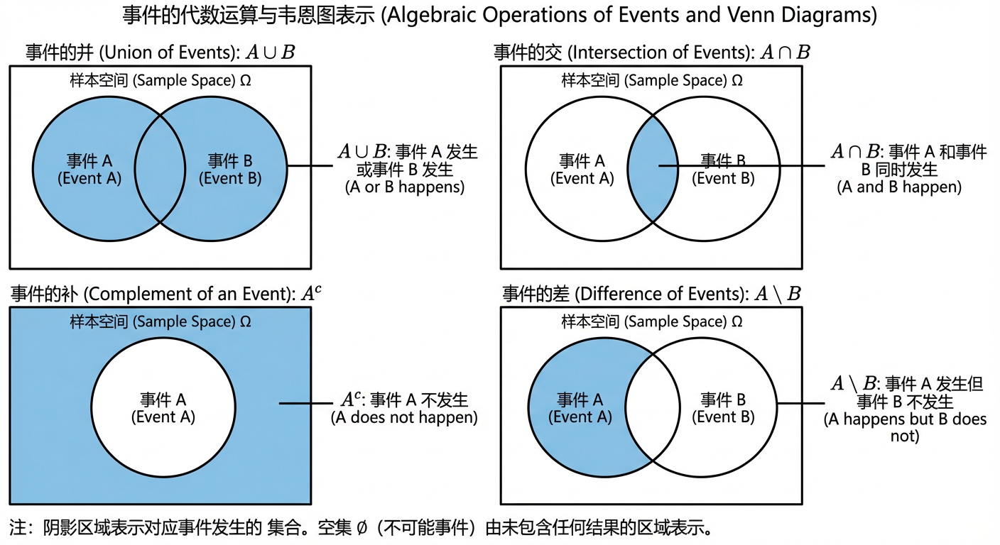
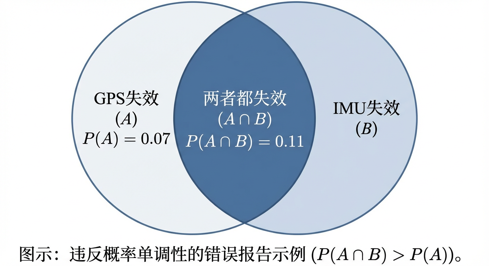
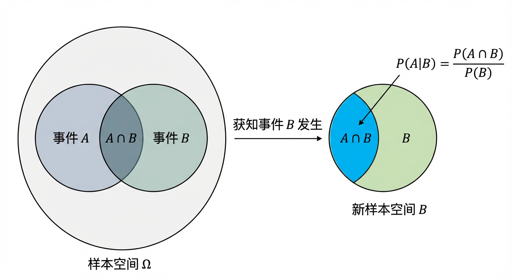
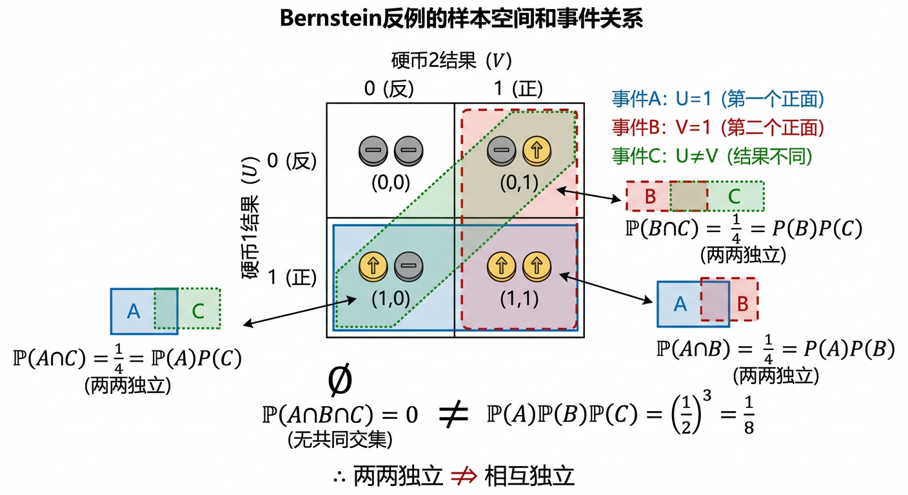
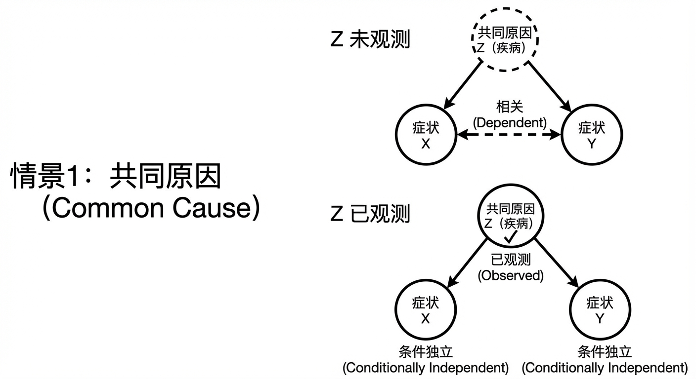
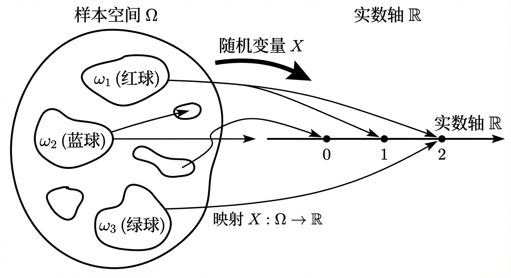
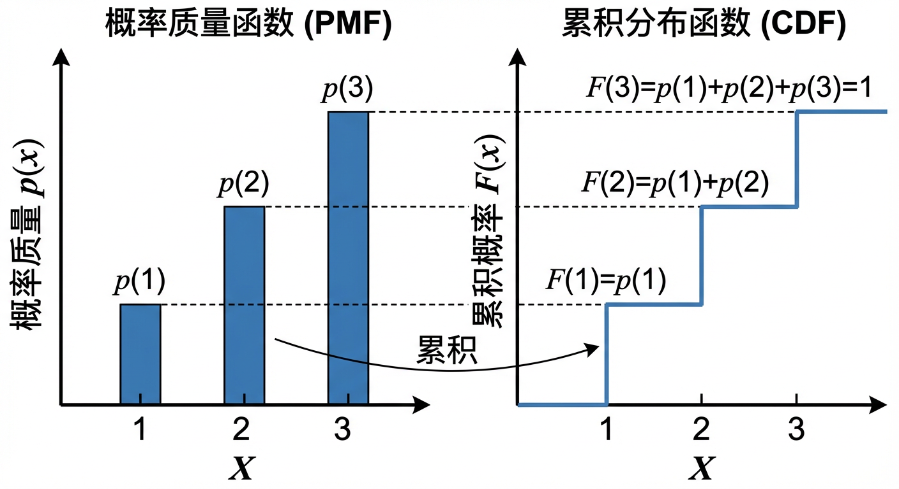
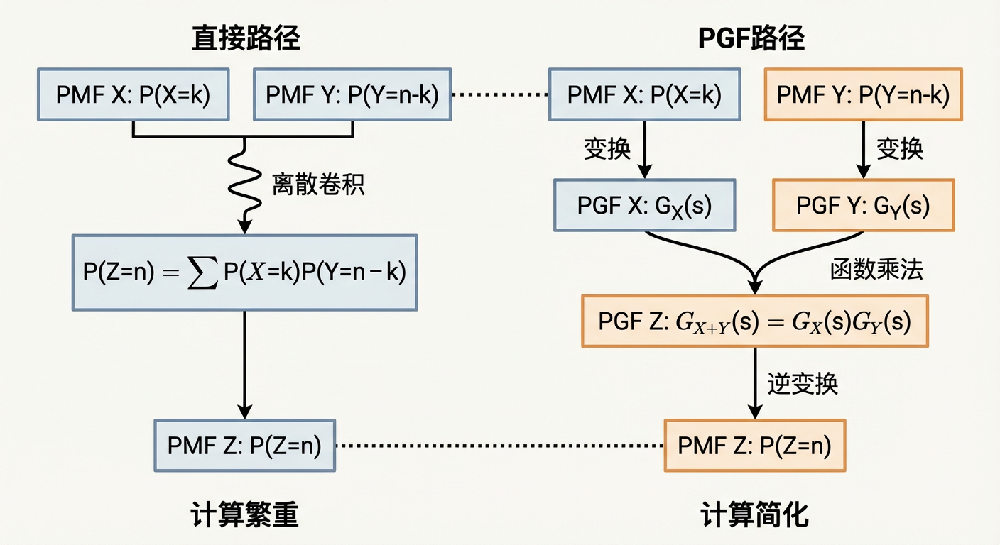

# 第12章：离散概率

从本章开始，我们将把前面章节中“集合论的结构化语言”（第1章）与“组合计数的定量工具”（第8、9章）融合起来，建立一套处理不确定性现象的离散概率理论框架。本章的主线是：先用事件与概率公理刻画“发生与否”（12.1），再用条件概率与独立性刻画“信息如何改变判断”（12.2），继而把关注点提升到“数值结果”的随机变量与分布（12.3），最后引入生成函数思想在概率论中的对应物——概率母函数（12.4），以更代数化的方式统一处理期望、方差与求和结构。

---

## 12.1 随机事件与概率、事件的运算

我们对“可能性”的感知与生俱来，但在离散数学的严谨世界中，如何将这种直觉转化为一门精确的科学？从第八、九章我们已经掌握了强大的计数工具，从第一章我们习得了集合论这一描述结构与关系的普适语言。本节的任务，便是将这二者熔于一炉，为研究不确定性现象构建一个坚实的数学基础。我们将从“离散概率为何需要集合语言与计数方法”这一动机切入，探索如何把随机试验的不可预测结果组织成清晰的数学对象，并为这些对象赋予量化的“可能性”度量。这一过程不仅是概率论的起点，更是离散数学思想——用结构化方法驾驭复杂性——的又一次深刻体现。

> 本节将建立“事件=集合”的语言与“概率=测度”的公理体系。它们不仅服务于本节的事件运算与概率计算，也将直接支撑下一节的条件概率定义（以交事件与归一化为核心），并在后续被随机变量的分布律（本质上仍是对事件 $\{X=x\}$ 赋概率）所继承。

### 1. 随机试验与事件的语言

概率论的探索始于对**随机试验 (Random Experiment)** 的形式化。一个随机试验是在相同条件下可重复进行的，但其结果具有不确定性。试验的每一次执行都会产生一个确定的、不可再分的**结果 (Outcome)**，通常用符号 $\omega$ 表示。

**定义 12.1.1：样本空间 (Sample Space)**
一个随机试验所有可能结果的集合，被称为该试验的**样本空间 (Sample Space)**，记作 $\Omega$。样本空间为我们提供了试验所有可能性的完整清单，是我们定义事件和概率的第一步。

精确地定义样本空间至关重要，因为它决定了我们能够分析的事件范围。例如，抛掷一枚标准的六面骰子，其结果是点数，样本空间为一个有限集 $\Omega = \{1, 2, 3, 4, 5, 6\}$。然而，在更复杂的场景中，样本空间可能是无限的。譬如，一位IT管理员正在监控一小时内到达邮件服务器的邮件数量，由于邮件数量在理论上没有上限，其样本空间是一个可数无限集，即所有非负整数的集合 $\Omega = \mathbb{N}_0 = \{0, 1, 2, \dots\}$。

在定义了样本空间 $\Omega$ 之后，我们通常对某些结果的集合感兴趣，而不仅仅是单个结果。

**定义 12.1.2：事件 (Event)**
样本空间 $\Omega$ 的任何一个子集都被称为一个**事件 (Event)**。一个事件的发生，意味着随机试验的实际结果落在了该子集之中。

在任何样本空间中，总有两个特殊的事件：必然事件（Certain Event），即整个样本空间 $\Omega$，它包含了所有可能的结果；以及不可能事件（Impossible Event），即空集 $\emptyset$，它不包含任何结果。

通过将事件定义为集合，我们立刻获得了一套强大的语言——集合论——来描述和操作它们。这正是我们将离散数学中集合论知识迁移至概率论的第一座桥梁。

### 2. 事件的代数运算

一旦我们将事件视为集合，一个全新的逻辑世界就此开启。我们在第一章所学的集合运算，如并、交、补、差等，现在都成为了组合与分析事件的利器，构成了一套“事件代数”。

- **事件的并 (Union of Events)**：事件 $A \cup B$ 表示“事件 $A$ 发生或事件 $B$ 发生”。
- **事件的交 (Intersection of Events)**：事件 $A \cap B$ 表示“事件 $A$ 和事件 $B$ 同时发生”。
- **事件的补 (Complement of an Event)**：事件 $A^c$（或 $\bar{A}$）表示“事件 $A$ 不发生”。
- **事件的差 (Difference of Events)**：事件 $A \setminus B$ 表示“事件 $A$ 发生但事件 $B$ 不发生”，它等价于 $A \cap B^c$。

让我们回到邮件服务器的例子。假设我们定义了两个事件：
- 事件 $E$：收到的邮件数量至少为5封。作为集合， $E = \{n \in \mathbb{N}_0 \mid n \ge 5\}$。
- 事件 $F$：收到的邮件数量至多为10封。作为集合， $F = \{n \in \mathbb{N}_0 \mid n \le 10\}$。

现在，如果我们关心一个更复杂的事件 $G$：“收到的邮件数量在5到10封之间（含边界）”，我们无需重新描述，只需运用事件的代数。一个数字既要“至少为5”又要“至多为10”，这在逻辑上是“与”的关系，对应于集合的交集。因此，事件 $G$ 可以被精确地表达为：
$$ G = E \cap F = \{n \in \mathbb{N}_0 \mid 5 \le n \le 10\} $$
这种从自然语言到形式化事件表达的转换为后续的概率计算铺平了道路。

在此基础上，两个重要的结构性概念自然产生：

- **互斥事件 (Mutually Exclusive Events)**：如果两个事件 $A$ 和 $B$ 的交集为空集，即 $A \cap B = \emptyset$，则称它们是互斥的。这意味着它们不可能同时发生。
- **划分 (Partition)**：如果一系列事件 $\{A_1, A_2, \dots, A_n\}$ 两两互斥，并且它们的并集等于整个样本空间 $\Omega$（即 $\bigcup_{i=1}^n A_i = \Omega$），我们就称这个事件集合构成了 $\Omega$ 的一个划分。划分思想是将复杂的样本空间分解为若干简单、不重叠部分的基本策略。

> 事件运算的“分解/重组”能力，将在本节后续推导加法规则、全概率律雏形时体现；而“交事件 + 归一化”的结构，则正是下一节条件概率 $P(A\mid B)=\frac{P(A\cap B)}{P(B)}$ 的核心来源。

### 3. 概率的公理化定义

有了描述事件的语言，我们如何为事件发生的可能性赋予一个数值呢？这就是概率的使命。在现代数学中，概率并非凭空猜测，而是被一个严谨的公理体系所约束。

**定义 12.1.3：概率测度 (Probability Measure)**
一个定义在样本空间 $\Omega$ 上的概率测度 $P$ 是一个将事件映射到实数的函数，它必须满足以下三条公理：
1.  **非负性公理**：对于任意事件 $A \subseteq \Omega$，其概率非负，即 $P(A) \ge 0$。
2.  **正则性公理**：整个样本空间的概率为1，即 $P(\Omega) = 1$。
3.  **可数可加性公理**：对于一列两两互斥的事件 $A_1, A_2, \dots$（即对所有 $i \neq j$，有 $A_i \cap A_j = \emptyset$），它们并集的概率等于它们各自概率之和：
    $$ P\left(\bigcup_{i=1}^{\infty} A_i\right) = \sum_{i=1}^{\infty} P(A_i) $$
    对于离散概率，我们更常使用其有限形式：若 $A_1, \dots, A_n$ 两两互斥，则 $P(\bigcup_{i=1}^n A_i) = \sum_{i=1}^n P(A_i)$。

这三条公理如同一部宪法，所有关于概率的定理和性质都必须由它们推导而出。这种公理化的方法论，正是数学力量的体现——从最少的、不证自明的规则出发，构建起一座宏伟的理论大厦。

**定理 12.1.1 (概率的基本性质)**
仅从上述三条公理，我们就能推导出一些至关重要的性质。
(1) **不可能事件的概率为0**：$P(\emptyset) = 0$。
*证明*：考虑必然事件 $\Omega$ 与不可能事件 $\emptyset$。它们显然是互斥的，因为 $\Omega \cap \emptyset = \emptyset$。根据公理3，我们有 $P(\Omega \cup \emptyset) = P(\Omega) + P(\emptyset)$。又因为 $\Omega \cup \emptyset = \Omega$，所以 $P(\Omega \cup \emptyset) = P(\Omega)$。结合两式可得 $P(\Omega) = P(\Omega) + P(\emptyset)$。再根据公理2，$P(\Omega)=1$，代入即得 $1 = 1 + P(\emptyset)$，因此 $P(\emptyset)=0$。

(2) **补事件的概率**：对于任意事件 $A$，有 $P(A^c) = 1 - P(A)$。
*证明*：事件 $A$ 与其补事件 $A^c$ 必然是互斥的 ($A \cap A^c = \emptyset$)，且它们的并集构成了整个样本空间 ($A \cup A^c = \Omega$)。根据公理3， $P(A \cup A^c) = P(A) + P(A^c)$。而根据公理2，$P(A \cup A^c) = P(\Omega) = 1$。因此，$P(A) + P(A^c) = 1$，移项即得证。

(3) **概率的单调性**：若事件 $A \subseteq B$，则 $P(A) \le P(B)$。
*证明*：若 $A \subseteq B$，则事件 $B$ 可以被划分为两个互斥的部分：$A$ 和 $B \setminus A$。即 $B = A \cup (B \setminus A)$，且 $A \cap (B \setminus A) = \emptyset$。根据公理3， $P(B) = P(A) + P(B \setminus A)$。再根据公理1，$P(B \setminus A) \ge 0$。因此，$P(B) \ge P(A)$。

概率的单调性为我们提供了一个检验概率模型是否合理的有力工具。例如，一位系统工程师报告称，导航系统中GPS接收器失效的概率为 $P(A) = 0.07$，而GPS和惯性测量单元（IMU）同时失效的概率为 $P(A \cap B) = 0.11$。这个报告存在根本性错误。因为“两者都失效”（$A \cap B$）必然是“GPS失效”（$A$）的一个子事件，即 $A \cap B \subseteq A$。根据概率的单调性，必须有 $P(A \cap B) \le P(A)$。而 $0.11 > 0.07$ 显然违反了这一基本原则，说明该模型不自洽。

### 4. 事件运算与概率计算

将事件代数与概率公理相结合，我们便获得了计算复杂事件概率的系统方法。

**定理 12.1.2 (概率加法规则)**
对于任意两个事件 $A$ 和 $B$，它们并集的概率为：
$$ P(A \cup B) = P(A) + P(B) - P(A \cap B) $$
*证明*：我们可以将 $A \cup B$ 划分为三个互斥的事件：$A \setminus B$，$B \setminus A$ 和 $A \cap B$。同时，$A = (A \setminus B) \cup (A \cap B)$ 和 $B = (B \setminus A) \cup (A \cap B)$。根据公理3，我们有 $P(A) = P(A \setminus B) + P(A \cap B)$ 和 $P(B) = P(B \setminus A) + P(A \cap B)$。将 $P(A \cup B)$ 展开：
$$P(A \cup B) = P(A \setminus B) + P(B \setminus A) + P(A \cap B)$$
将前两项用 $P(A)$ 和 $P(B)$ 的表达式替换：
$$P(A \cup B) = (P(A) - P(A \cap B)) + (P(B) - P(A \cap B)) + P(A \cap B) = P(A) + P(B) - P(A \cap B)$$
此定理是处理非互斥事件并集的核心。当 $A$ 和 $B$ 互斥时，$P(A \cap B) = P(\emptyset) = 0$，该公式退化为公理3的有限形式。

这一思想可以推广到多个事件，其一般形式便是我们在第九章学习的**容斥原理 (Principle of Inclusion-Exclusion)**。对于三个事件 $A, B, C$，其并集的概率为：
$$ P(A \cup B \cup C) = P(A)+P(B)+P(C) - P(A \cap B) - P(A \cap C) - P(B \cap C) + P(A \cap B \cap C) $$

在实践中，将复杂事件分解为更易于计算的部分，是概率建模的关键技能。事件代数为此提供了两种主要工作流：一种是分解为互斥部分的并集，另一种是利用补事件简化计算。

考虑一个生物化学情景，一个蛋白质有三个独立的位点可以被修饰，其修饰概率分别为 $p_1, p_2, p_3$。我们关心事件 $E$：“恰好有两个位点被修饰”。这个事件可以用事件代数分解为三个互斥子事件的并集：
- $E_1$: 位点1和2被修饰，位点3未被修饰。
- $E_2$: 位点1和3被修饰，位点2未被修饰。
- $E_3$: 位点2和3被修饰，位点1未被修饰。
因此，$E = E_1 \cup E_2 \cup E_3$。由于这三个子事件两两互斥，根据公理3， $P(E) = P(E_1) + P(E_2) + P(E_3)$。这样，一个复杂的描述就被转化为了三个独立部分概率的求和（我们将在下一节学习如何计算各部分的概率）。

另一种强大的分解策略是利用样本空间的划分。
**定理 12.1.3 (全概率律的雏形)**
若事件集合 $\{B_1, B_2, \dots, B_n\}$ 构成了样本空间 $\Omega$ 的一个划分，则对于任意事件 $A$，有：
$$ P(A) = \sum_{i=1}^{n} P(A \cap B_i) $$
*证明*：由于 $\{B_i\}$ 是 $\Omega$ 的划分，我们可以利用集合的分配律将事件 $A$ 表示为 $A = A \cap \Omega = A \cap (\bigcup_{i=1}^n B_i) = \bigcup_{i=1}^n (A \cap B_i)$。由于 $B_i$ 之间两两互斥，那么 $A \cap B_i$ 各项之间也必然两两互斥。因此，根据公理3，我们得到 $P(A) = P(\bigcup_{i=1}^n (A \cap B_i)) = \sum_{i=1}^n P(A \cap B_i)$。
这个定理揭示了一个深刻的分解思想：计算一个复杂事件 $A$ 的概率，可以通过将其在不同“场景”（由划分 $B_i$ 定义）下的发生情况分别计算，然后加总得到。这是通向条件概率和贝叶斯分析的重要阶梯。

> 上面的“划分 + 分解求和”给出了全概率律的雏形；而“交事件”在条件概率中将变成分子 $P(A\cap B)$。因此，12.2节并非引入全新体系，而是在 12.1 的事件代数与概率公理之上，增加“信息条件”这一层结构。

### 5. 古典概率模型

公理化框架为概率论提供了普适的基础。当试验满足特定对称性条件时，我们可以回归到一种更直观的计算模型，它直接与我们在第八、九章学习的组合计数方法相连。

**定义 12.1.4：古典概率模型 (Classical Probability Model)**
若一个随机试验满足以下两个条件：
1.  样本空间 $\Omega$ 是有限的。
2.  所有基本结果（样本点）$\omega \in \Omega$ 发生的可能性相同（等可能）。

则称该模型为古典概率模型。在此模型下，任何事件 $A$ 的概率可以被计算为：
$$ P(A) = \frac{\text{构成事件 } A \text{ 的结果数}}{\text{样本空间的总结果数}} = \frac{|A|}{|\Omega|} $$
在等可能假设下，公理1、2、3均自然成立。这时，计算概率的挑战就完全转化为了一个计数问题：确定样本空间 $\Omega$ 和事件 $A$，然后利用排列、组合等工具数出它们的基数 $|A|$ 和 $|\Omega|$。

例如，一个研究所有7名资深科学家和5名初级科学家。如果随机挑选4人组成一个任务小组，这个小组恰好由2名资深和2名初级科学家组成的概率是多少？
这里的样本空间 $\Omega$ 是从12人中任选4人的所有组合，其总数为 $|\Omega| = \binom{12}{4} = 495$。
我们关心的事件 $A$ 是“选出2名资深和2名初级科学家”。根据乘法法则，有利结果数为 $|A| = \binom{7}{2} \times \binom{5}{2} = 21 \times 10 = 210$。
因此，该事件的概率为 $P(A) = \frac{210}{495} = \frac{14}{33}$。
这清晰地展示了从定义事件到运用组合工具完成计数的完整工作流。

### 小结

在本节中，我们为研究离散概率奠定了概念与语言的基石。我们从随机试验出发，通过引入样本空间和事件，成功地将不确定性现象纳入了集合论的严谨框架。这使得我们能够运用并、交、补等集合运算，构建起一套描述和分解复杂事件的“事件代数”。

更重要的是，我们建立了概率的公理化体系。这三条看似简单的公理，不仅定义了概率作为一种测度的本质，也成为我们推导所有概率性质的逻辑起点。我们由此证明了补事件概率公式、概率单调性以及加法规则等基本工具。通过将事件代数与这些计算规则相结合，我们形成了分析复杂事件的两条核心路径：通过容斥原理直接计算，或通过分解为互斥部分、划分样本空间来间接计算。最后，我们将这一抽象框架与古典概率模型相连，揭示了在等可能性假设下，概率问题如何回归为我们熟悉的组合计数问题。

至此，我们已经掌握了描述静态事件并为其赋概率值的基本语言。然而，现实世界中的事件往往相互关联，信息的获取也会动态地改变我们对可能性的判断。这引发了新的问题：一个事件的发生如何影响另一个事件的概率？我们如何刻画事件之间的“无关性”？这些问题将我们引向下一节的核心主题——条件概率与独立性，从而将我们对概率的理解从静态描述推向动态分析。

在 12.1 中，我们能够计算 $P(A\cup B)$、$P(A\cap B)$ 等“无条件”的概率；但一旦获得信息“$B$ 已发生”，我们需要把计算基准从 $\Omega$ 缩小到 $B$。条件概率正是对这一“基准切换”的形式化，而独立性则是“切换后概率不变”的结构性特例。

---

## 12.2 条件概率与独立性

在上一节中，我们建立了描述随机现象的语言——事件，并学习了如何为这些事件赋予一个静态的度量，即概率。然而，现实世界是动态的，我们的知识和信念会随着新信息的到来而不断更新。例如，一个医疗诊断的初始评估，在获得新的检测结果后会如何改变？一个系统正常运行的概率，在已知其某个部件已发生故障的条件下又该如何重新计算？为了刻画这种在信息约束下概率的动态演化，我们必须引入条件概率的概念。它将带领我们从对事件的静态描述，走向一个能够处理证据、更新信念、并最终揭示事件间深层关系的推理框架。

### 12.2.1 条件概率与乘法法则

想象一下，我们所研究的随机试验的全部可能结果构成了样本空间 $\Omega$ 这个“概率宇宙”。当我们获知某个事件 $B$ 已经发生时，我们的注意力便不再聚焦于整个 $\Omega$，而是转移到了一个新的、更小的“宇宙”——子集 $B$ 之上。在这个收缩了的样本空间中，我们关心另一个事件 $A$ 发生的可能性。这个在“事件 $B$ 发生”这一条件下，事件 $A$ 发生的概率，就被称为**条件概率（Conditional Probability）**。

**定义 12.2.1（条件概率）**

设 $A$ 和 $B$ 是同一样本空间 $\Omega$ 中的两个事件，且 $P(B) > 0$。我们定义在给定事件 $B$ 发生的条件下，事件 $A$ 发生的**条件概率**为：
$$
P(A|B) = \frac{P(A \cap B)}{P(B)}
$$
这个定义的直观含义是，条件概率 $P(A|B)$衡量的是在由 $B$ 构成的新的可能性集合中，$A$ 所占的比例。具体来说，分子 $P(A \cap B)$ 代表了那些既满足新条件 $B$ 又属于我们关心的事件 $A$ 的结果的概率，而分母 $P(B)$ 则扮演了“归一化因子”的角色，将概率的计算基准从整个样本空间 $\Omega$ 调整为新的样本空间 $B$。

这个看似简单的公式是概率论中进行动态推理的基石。通过一个简单的代数变形，我们可以立即得到一个极其有用的工具——概率的乘法法则。

**定理 12.2.1（概率乘法法则）**

对于任意两个事件 $A$ 和 $B$，若 $P(B) > 0$，则它们同时发生的概率为：
$$
P(A \cap B) = P(A|B)P(B)
$$
类似地，若 $P(A) > 0$，则有 $P(A \cap B) = P(B|A)P(A)$。

乘法法则的威力在于，它将一个可能难以直接计算的联合事件的概率，分解为一系列更易于评估的条件概率的乘积。这对于分析多阶段或序贯的随机过程尤为重要。我们可以将此法则推广至多个事件的情形，形成链式法则。

**定理 12.2.2（概率链式法则）**

对于 $n$ 个事件 $A_1, A_2, \dots, A_n$，只要所有条件概率均有定义，它们的交事件的概率可以表示为：
$$
P(A_1 \cap A_2 \cap \dots \cap A_n) = P(A_1) P(A_2|A_1) P(A_3|A_1 \cap A_2) \dots P(A_n|A_1 \cap \dots \cap A_{n-1})
$$
这为我们分析复杂系统中一连串事件的发生概率提供了统一的计算模板。

> 链式法则提供了把多事件交概率逐步分解的统一模板；当后续把“事件”升级为“随机变量取值事件” $\{X=x\}$ 时（见 12.3），同样的条件化思想会以“联合 PMF / 条件 PMF”的形式继续出现。

### 12.2.2 事件的独立性

条件概率回答了“当 B 发生时，A 发生的概率是多少？”这一问题。现在，我们来思考一种特殊但极其重要的情况：如果事件 $B$ 的发生与否，对事件 $A$ 发生的概率毫无影响，那会怎样？这种“信息无效”的现象，在概率论中被形式化为**独立性（Independence）**。

**定义 12.2.2（两个事件的独立性）**

对于两个事件 $A$ 和 $B$，如果满足 $P(A|B) = P(A)$（假设 $P(B)>0$），我们就称事件 $A$ **独立于**事件 $B$。

将此定义代入乘法法则 $P(A \cap B) = P(A|B)P(B)$，我们立即得到一个更对称、更具普适性的等价定义：

> 两个事件 $A$ 和 $B$ 是**独立的**，当且仅当它们同时发生的概率等于它们各自概率的乘积：
> $$
> P(A \cap B) = P(A)P(B)
> $$

这个乘法公式是检验和应用独立性的核心。独立性是一个关于事件间结构关系的深刻论断，它意味着两个事件在概率意义上互不提供任何信息。值得注意的是，事件的独立性是一个数学定义，必须通过计算来验证，而不应仅仅依赖于直觉。互斥事件（若 $A \cap B = \emptyset$ 且 $P(A)>0, P(B)>0$）必然是不独立的，因为知道其一发生，就能断定另一必然不发生，这本身就是极强的信息。

独立性的概念可以自然地推广到多个事件。

**定义 12.2.3（多个事件的相互独立性）**

称 $n$ 个事件 $A_1, A_2, \dots, A_n$ 是**相互独立的（Mutually Independent）**，如果对于其中任意一个子集 $\{A_{i_1}, A_{i_2}, \dots, A_{i_k}\}$（其中 $k \ge 2$），都满足：
$$
P(A_{i_1} \cap A_{i_2} \cap \dots \cap A_{i_k}) = P(A_{i_1})P(A_{i_2})\dots P(A_{i_k})
$$
这个定义要求概率的乘法分解不仅对所有事件的整体成立，而且对任何规模的子集都成立。

一个重要的推论是，如果一组事件是相互独立的，那么将其中任意一个或多个事件替换为它们的补事件，所得到的新事件组仍然是相互独立的。这为处理涉及“不发生”的复杂独立事件提供了极大的便利。

**示例 12.2.1** 假设事件 $A, B, C$ 相互独立，其概率分别为 $P(A), P(B), P(C)$。求事件“$A$ 发生，但 $B$ 和 $C$ 都不发生”的概率。
我们要求的是 $P(A \cap B' \cap C')$。由于 $A, B, C$ 相互独立，可知 $A, B', C'$ 也相互独立。因此：
$P(A \cap B' \cap C') = P(A)P(B')P(C') = P(A)(1-P(B))(1-P(C))$。

#### 两两独立与相互独立的辨析

在处理三个或更多事件时，一个常见的误区是混淆**两两独立（Pairwise Independence）**与相互独立。两两独立仅要求任意一对事件都满足独立性定义，即 $P(A_i \cap A_j) = P(A_i)P(A_j)$ 对所有 $i \neq j$ 成立。这并不足以保证相互独立。下面的例子清晰地揭示了二者的区别。

**示例 12.2.2（Bernstein 构造的反例）**
设有两个独立的、完全公平的硬币（或两个独立的伯努利随机变量 $U, V$，取值为 0 或 1 的概率均为 $1/2$）。试验结果的样本空间为 $\{(0,0), (0,1), (1,0), (1,1)\}$，每个结果的概率均为 $1/4$。
定义三个事件：
- $A$: 第一个硬币为正面（$U=1$）。$A = \{(1,0), (1,1)\}$。
- $B$: 第二个硬币为正面（$V=1$）。$B = \{(0,1), (1,1)\}$。
- $C$: 两个硬币的结果不同。$C = \{(0,1), (1,0)\}$。

首先，我们计算每个事件的概率：
$P(A) = P(\{(1,0)\}) + P(\{(1,1)\}) = 1/4 + 1/4 = 1/2$。
$P(B) = P(\{(0,1)\}) + P(\{(1,1)\}) = 1/4 + 1/4 = 1/2$。
$P(C) = P(\{(0,1)\}) + P(\{(1,0)\}) = 1/4 + 1/4 = 1/2$。

接下来，我们检验两两独立性：
- $A \cap B = \{(1,1)\}$，所以 $P(A \cap B) = 1/4$。而 $P(A)P(B) = (1/2)(1/2) = 1/4$。故 $A, B$ 独立。
- $A \cap C = \{(1,0)\}$，所以 $P(A \cap C) = 1/4$。而 $P(A)P(C) = (1/2)(1/2) = 1/4$。故 $A, C$ 独立。
- $B \cap C = \{(0,1)\}$，所以 $P(B \cap C) = 1/4$。而 $P(B)P(C) = (1/2)(1/2) = 1/4$。故 $B, C$ 独立。

至此，事件 $A, B, C$ 满足两两独立。然而，它们是否相互独立呢？我们需要检验三者的交事件：
$A \cap B \cap C$ 表示“第一个硬币为正，第二个硬币为正，且两个硬币结果不同”。这是一个矛盾的事件，不可能发生。所以 $A \cap B \cap C = \emptyset$。
因此，$P(A \cap B \cap C) = 0$。
但是，$P(A)P(B)P(C) = (1/2)(1/2)(1/2) = 1/8$。
由于 $0 \neq 1/8$，三者的相互独立性不成立。

这个例子严正地提醒我们，在处理多个事件的独立性时，必须严格依据定义进行检验，两两独立是相互独立的必要条件，但并非充分条件。

#### 条件独立性：在特定情境下的独立

独立性的概念还可以被推广到条件概率的框架下，形成**条件独立性（Conditional Independence）**。

**定义 12.2.4（条件独立性）**

设 $A, B, C$ 为三个事件，且 $P(C) > 0$。如果 $P(A \cap B | C) = P(A|C)P(B|C)$，则称事件 $A$ 和 $B$ **在给定事件 $C$ 的条件下是独立的**。

条件独立性意味着，一旦我们知道了事件 $C$ 已经发生，那么关于事件 $B$ 是否发生的信息，将不会再对事件 $A$ 的发生概率产生任何影响（反之亦然）。

值得注意的是，事件的独立性与条件独立性是两个截然不同的概念。两个在边缘上（无条件）独立的事件，在给定某个条件下可能变得相关；反之，两个相关的事件，在给定某个条件下也可能变得独立。

- **情景1：共同原因（Common Cause）**
  假设一个疾病（事件 $Z$）会引发两种不同的症状（事件 $X$ 和 $Y$）。即 $X \leftarrow Z \rightarrow Y$。在不知道病人是否患病的情况下，观察到症状 $X$ 会增加我们对病人患病的信念，从而也增加了观察到症状 $Y$ 的可能性。因此，边缘上 $X$ 和 $Y$ 是相关的（不独立）。但是，如果我们**已知**病人患有此病（即以 $Z$ 为条件），那么症状 $X$ 的出现与否对症状 $Y$ 是否出现没有额外的预测价值，因为它们的共同原因已经被确定。在这种结构下，$X$ 和 $Y$ 在给定 $Z$ 的条件下是独立的。

- **情景2：共同效应（Collider）**
  考虑一个金融市场的警报系统（事件 $C$）。警报可能由两种独立的原因触发：交易员的欺诈行为（事件 $A$）或合法的宏观经济新闻冲击（事件 $B$）。即 $A \rightarrow C \leftarrow B$。在默认情况下，$A$ 和 $B$ 是不相关的独立事件。但是，如果我们**观察到**警报被触发（以 $C$ 为条件），情况就发生了变化。此时，如果得知市场上确实有重大的新闻冲击（$B$ 发生），那么这个事实就“解释”了警报的来源，从而降低了警报是由欺诈行为 $A$ 引起的可能性。反之亦然。这种“此消彼长”的推理模式被称为“解释效应（Explaining Away）”。在这种结构中，两个原本独立的事件 $A$ 和 $B$，在以它们的共同效应 $C$ 为条件时，变得条件相关（通常是负相关）。

这两种情景揭示了条件作用的深刻影响：它可以通过固定共同原因来“阻断”依赖路径，也可以通过固定共同效应来“打开”新的依赖路径。正确地辨识和运用条件独立性，是构建复杂概率模型（如贝叶斯网络）和进行有效因果推断的核心。

### 12.2.3 伯努利概型与二项概率

现在，我们将独立性的概念应用于一类最基本也最常见的随机过程：一系列重复的、独立的试验。

**定义 12.2.5（伯努利概型）**

一个由 $n$ 次试验组成的随机过程，如果满足以下三个条件，则称之为 **$n$ 重伯努利概型（Bernoulli Scheme）** 或 **伯努利试验（Bernoulli Trials）**：
1.  每次试验只有两种可能的结果，我们称之为“成功”和“失败”。
2.  每次试验中，“成功”的概率 $p$ 保持不变，“失败”的概率则为 $1-p$。
3.  各次试验的结果是相互独立的。

伯努利概型是许多现实问题的数学抽象，例如：连续抛掷一枚硬币 $n$ 次、对一个生产线上的 $n$ 件产品进行质量检测、或是在一项治疗中有 $n$ 位患者，观察其是否康复。

在伯努-利概型中，我们最关心的问题之一是：“在 $n$ 次试验中，‘成功’恰好发生 $k$ 次的概率是多少？”

为了回答这个问题，让我们进行分步推导：
1.  **考虑一个特定的成功序列**：让我们想象一个具体的、含有 $k$ 次成功和 $n-k$ 次失败的序列。例如，前 $k$ 次成功，后 $n-k$ 次失败。由于各次试验相互独立，这个特定序列发生的概率是各次试验概率的乘积：
    $$ \underbrace{p \cdot p \cdot \dots \cdot p}_{k \text{ 次}} \cdot \underbrace{(1-p) \cdot (1-p) \cdot \dots \cdot (1-p)}_{n-k \text{ 次}} = p^k (1-p)^{n-k} $$
2.  **计算所有可能的成功序列数**：事件“恰好发生 $k$ 次成功”包含了所有满足条件的序列。任何一个含有 $k$ 次成功和 $n-k$ 次失败的序列，其概率都与上面计算的相同。那么，总共有多少个这样的不同序列呢？这等价于从 $n$ 个试验位置中，选择 $k$ 个位置安放“成功”。根据第 8 章的组合计数原理，这样的选择总数是组合数 $\binom{n}{k}$。
3.  **合并计算总概率**：由于这些不同的成功序列是互斥事件，根据概率的加法法则，事件“恰好发生 $k$ 次成功”的总概率，就是单个序列的概率乘以序列的总数。

这就导出了著名的**二项概率公式（Binomial Probability Formula）**。

**定理 12.2.3（二项概率）**

在 $n$ 重伯努利概型中，设单次试验成功的概率为 $p$。那么，成功恰好发生 $k$ 次（其中 $0 \le k \le n$）的概率 $b(k; n, p)$ 为：
$$
b(k; n, p) = \binom{n}{k} p^k (1-p)^{n-k}
$$
这个公式完美地融合了独立性（体现在概率的乘积上）和组合计数（体现在序列的计数上），是离散概率论中最重要和最实用的成果之一。

**示例 12.2.3** 一位家庭护工每天需要为一位老人进行 10 次独立的药物管理。假设单次管理发生错误的概率为 $p=0.02$，且各次管理是否出错相互独立。求一天中至少发生一次错误的概率。

直接计算“至少一次”错误（即 $k=1, 2, \dots, 10$ 的概率之和）较为繁琐。我们可以利用补事件的思想。事件“至少发生一次错误”的补事件是“一次错误也未发生”（即 $k=0$）。
这是一个包含 $n=10$ 次试验，成功（此处指“出错”）概率为 $p=0.02$ 的伯努利概型。
利用二项概率公式计算 $k=0$ 的概率：
$$ P(\text{0 次错误}) = b(0; 10, 0.02) = \binom{10}{0} (0.02)^0 (1-0.02)^{10} = 1 \cdot 1 \cdot (0.98)^{10} \approx 0.8171 $$
因此，至少发生一次错误的概率为：
$$ P(\text{至少一次错误}) = 1 - P(\text{0 次错误}) \approx 1 - 0.8171 = 0.1829 $$
这意味着，即使单次出错的概率很低，在多次重复下，累积的出错风险也变得不容忽视。这引发了我们对系统可靠性设计的进一步思考，例如引入独立的双重检查机制。若由两人独立检查，只要一人发现错误即可，系统的整体检出率会显著高于个人。读者可自行推导，若两人检出率分别为 $p_1$ 和 $p_2$，则联合检出率（即至少一人检出）为 $1-(1-p_1)(1-p_2) = p_1 + p_2 - p_1p_2$。

### 小结

本节内容是离散概率论的逻辑核心。我们从引入新信息如何改变概率的动机出发，建立了**条件概率**的形式化语言 $P(A|B)$。这不仅让我们能够量化信念的更新，还通过**乘法法则**与**链式法则**，为分析复杂事件的分解与组合提供了强大的计算工具。

在此基础上，我们将“信息不改变概率”这一特殊情况抽象为**独立性**。我们深入辨析了独立性的层次：从两个事件的独立，到多个事件的两两独立与相互独立的深刻差异，再到更为精妙的**条件独立性**。通过“共同原因”与“共同效应”等结构性实例，我们揭示了条件作用如何能够创造或消除事件间的依赖关系，这不仅深化了我们对概率的理解，也为后续章节中更高级的概率图模型和因果推断思想埋下了伏笔。

最后，我们将独立性的概念落到实处，将其作为核心假设构建了**伯努利概型**。通过结合第 8 章的组合计数工具，我们推导出了**二项概率公式**，它精确地刻画了在一系列独立重复试验中成功次数的分布规律。这不仅展示了数学内部不同分支（概率论与组合学）的优美融合，也为下一节引入**离散型随机变量**及其分布提供了最经典、最直观的范例。本节所建立的条件化、独立化与重复试验的分析语言，将在后续的学习中被不断地泛化与应用，成为我们理解与建模不确定性世界的关键方法论。

在 12.2 中，我们仍以“事件是否发生”为基本对象，并通过条件化与独立性描述事件间关系。但很多问题并非关心“是否发生”，而关心一个数值结果（次数、成本、时间等）。把样本点 $\omega$ 映射为数值 $X(\omega)$ 后，事件 $\{X=x\}$ 的概率就形成了分布律（PMF），而条件概率与独立性的思想将自然延伸为随机变量的联合分布、边缘化与独立性判别。

---

## 12.3 离散型随机变量

在前两节中，我们建立了描述随机现象的基础语言：将试验结果抽象为样本空间中的事件，并为这些事件赋予概率。这一框架虽然坚实，但我们的关注点仍停留在事件的“发生与否”上。然而，在科学与工程的诸多领域，我们更关心的是与试验结果相关联的某个**数值量**。例如，在分析一个网络协议时，我们关心的不是哪一个数据包出错，而是整个传输过程中出错数据包的总数；在评估一个随机算法的性能时，我们关心的不是某一次运行的独特轨迹，而是其平均运行时间。为了系统地研究这些数值结果，我们必须完成一次重要的概念飞跃：从事件的集合语言，过渡到对结果进行数值化表达的函数视角。这便引出了概率论中至关重要的核心概念——**随机变量（Random Variable）**。它如同一座桥梁，将抽象的样本空间与具体的数值分析连接起来，是我们用数学工具量化、分析并预测不确定性的基石。

本节将聚焦于随机变量家族中的一类重要成员——离散型随机变量。我们将首先定义这一概念，并引入其核心的描述工具——分布律。随后，我们将探讨几个在离散数学与计算机科学中至关重要的常用分布模型。在此基础上，我们将引入数学期望与方差这两个关键的数字特征，它们如同一把手术刀，能够剖析一个随机变量的中心趋势与离散程度。通过本节的学习，读者将掌握一套将随机现象数值化并进行分析的完整工作流，这套方法论将为第13章中算法的平均复杂度分析与随机算法设计等应用主题奠定坚实的基础。

### 12.3.1 离散型随机变量及其分布律

从形式上看，一个随机变量是一个定义在样本空间 $\Omega$ 上的函数，它将每一个基本事件 $\omega \in \Omega$ 映射到一个实数。

**定义 12.3.1（随机变量）**
设 $(\Omega, \mathcal{F}, P)$ 是一个概率空间。一个**随机变量（Random Variable）**是一个可测函数 $X: \Omega \to \mathbb{R}$，它为样本空间 $\Omega$ 中的每一个结果 $\omega$ 赋予一个实数值 $X(\omega)$。

我们通常用大写字母（如 $X, Y, Z$）表示随机变量，用小写字母（如 $x, y, z$）表示其可能取到的具体数值。随机变量的本质是一次“翻译”，它将可能非数值的、描述性的试验结果，转化为可以进行代数运算的数字。

根据其可能取值的特性，随机变量可分为两大类。本章我们主要关注离散型随机变量。

**定义 12.3.2（离散型随机变量）**
如果一个随机变量 $X$ 的所有可能取值（即其值域）是一个有限或可数无穷的集合，则称 $X$ 为**离散型随机变量（Discrete Random Variable）**。

例如，抛掷一枚硬币 $n$ 次，正面朝上的次数是一个离散型随机变量，其取值范围是 $\{0, 1, \dots, n\}$。在一个通信信道中，成功传输一个数据包所需的重传次数也是一个离散型随机变量，其取值范围是 $\{0, 1, 2, \dots\}$，这是一个可数无穷集。

离散型随机变量也可以从连续现象中产生。设想一个在区间 $[0, n)$ 上均匀分布的连续随机变量 $U$（例如一个信号电压），我们可以通过取整函数定义一个新的随机变量 $X = \lfloor U \rfloor$。由于 $X$ 的取值只能是整数集合 $\{0, 1, \dots, n-1\}$，它便是一个离散型随机变量。这个过程在信号处理中被称为“量化”，是模拟信号向数字信号转换的基础。

为了完整地刻画一个离散型随机变量的概率行为，我们需要知道它取每一个可能值的概率。这由它的分布律或称为**概率质量函数（Probability Mass Function, PMF）**所描述。

**定义 12.3.3（概率质量函数 / 分布律）**
对于离散型随机变量 $X$，其**概率质量函数（PMF）**，也称**分布律**，是一个函数 $p(x)$，定义为：
$$ p(x) = P(X = x) = P(\{\omega \in \Omega \mid X(\omega) = x\}) $$
一个有效的PMF必须满足以下两个性质：
1.  **非负性**：对所有可能的 $x$，有 $p(x) \ge 0$。
2.  **归一性**：所有可能取值的概率之和为 1，即 $\sum_{x} p(x) = 1$。

PMF是离散型随机变量的“身份指纹”，完全决定了它的所有概率特性。有时，我们不仅关心单个随机变量，还需要同时研究多个随机变量的联合行为。例如，在分析一个分类模型的性能时，我们可能同时关心一个组件的真实状态（$X=1$ 表示故障，$X=0$ 表示正常）和模型的预测结果（$Y=1$ 表示预测为故障，$Y=0$ 表示预测为正常）。此时，我们需要**联合概率质量函数（Joint PMF）** $p(x, y) = P(X=x, Y=y)$ 来描述它们。

从联合分布出发，我们可以通过对其中一个变量的所有可能取值求和，来恢复出另一个变量的分布。这个过程称为**边缘化（Marginalization）**，得到的分布称为**边缘分布（Marginal Distribution）**。
$$ p_X(x) = \sum_{y} p(x, y) \quad \text{且} \quad p_Y(y) = \sum_{x} p(x, y) $$
这实质上是全概率公式在随机变量上的体现。此外，两个离散随机变量 $X$ 和 $Y$ 被称为**独立的（Independent）**，当且仅当它们的联合分布等于它们各自边缘分布的乘积，即对所有 $x, y$ 都有 $p(x, y) = p_X(x) p_Y(y)$。例如，给定联合分布 $p(0,0)=0.4, p(0,1)=0.1, p(1,0)=0.2, p(1,1)=0.3$，我们可以计算出边缘分布 $p_X(0) = 0.5$ 和 $p_Y(0) = 0.6$。由于 $p(0,0)=0.4 \neq p_X(0)p_Y(0) = 0.5 \times 0.6 = 0.3$，我们可以断定这两个随机变量不是独立的。

除了PMF，另一个描述随机变量的工具是**累积分布函数（Cumulative Distribution Function, CDF）**，它给出了随机变量取值不大于某个特定值的概率。

**定义 12.3.4（累积分布函数）**
随机变量 $X$ 的**累积分布函数（CDF）** $F(x)$ 定义为：
$$ F(x) = P(X \le x) $$
对于离散型随机变量，其CDF是通过对PMF进行求和得到的：
$$ F(x) = \sum_{t \le x} p(t) $$
CDF是一个右连续的非减阶梯函数，其“跳跃”发生在 $X$ 的各个可能取值点上，跳跃的高度恰好是该点的概率质量 $p(x)$。相应地，我们可以从CDF反推出PMF：

$$ p(x) = P(X=x) = P(X \le x) - P(X \le x-1) = F(x) - F(x-1) $$
（对于非整数取值的离散变量，这里的 $x-1$ 应理解为“恰好在 $x$ 之前的一个可能取值”）。例如，若一个随机变量 $X$ 在 $\{0, 1, 2, 3, 4\}$ 上的CDF为 $F(x) = \frac{(x+1)^2}{25}$，我们可以通过计算差分来求得其PMF：$p(x) = F(x) - F(x-1) = \frac{(x+1)^2}{25} - \frac{x^2}{25} = \frac{2x+1}{25}$。

> 到这里为止，我们已经把“事件概率”扩展为“取值事件 $\{X=x\}$ 的概率”，从而得到 PMF/CDF 这两种等价刻画。接下来 12.3.2 将展示若干典型 PMF 模型；而 12.3.3、12.3.4 将进一步把“分布的全部信息”压缩为少数数值特征（期望与方差）。这一“从全分布到特征量”的压缩思想，也会在 12.4 中以“从分布到母函数编码”的方式再次出现。

### 12.3.2 常用离散分布

在12.2节中，我们通过分析独立重复试验引出了二项分布，它描述了在 $n$ 次独立的伯努利试验中，“成功”事件发生 $k$ 次的概率。这是离散型随机变量分布的一个典型代表，其PMF为 $P(X=k) = \binom{n}{k}p^k(1-p)^{n-k}$。除此之外，还有一些在离散数学和计算机科学中扮演重要角色的分布模型。

*   **离散均匀分布（Discrete Uniform Distribution）**：当一个随机变量在一组有限的可能结果中等概率地取值时，它服从离散均匀分布。例如，掷一个标准的六面骰子，其结果 $X \in \{1, 2, 3, 4, 5, 6\}$ 服从均匀分布，其PMF为 $p(k) = 1/6$ 对所有 $k$ 成立。

*   **几何分布（Geometric Distribution）**：它描述了在伯努利试验序列中，为取得第一次成功所需进行的试验次数。例如，一个算法在每次迭代时有概率 $p$ 成功解决问题，则需要 $k$ 次迭代才首次成功的概率是 $p(k) = (1-p)^{k-1}p$。

*   **泊松分布（Poisson Distribution）**：它常用于为单位时间或空间内稀有事件发生的次数建模。例如，一个网站服务器在一分钟内收到的请求数，或者一段很长的DNA序列中某个特定短基序出现的次数。如果事件发生的平均速率为 $\lambda$，则在单位间隔内观察到 $k$ 次事件的概率为 $p(k) = \frac{e^{-\lambda}\lambda^k}{k!}$。值得注意的是，当二项分布的试验次数 $n$ 很大且成功概率 $p$ 很小时，它可以用参数为 $\lambda=np$ 的泊松分布很好地近似。

这些分布为我们提供了一套标准化的“建模积木”，使得我们能够用简洁的参数化形式来描述和分析各种各样的随机现象。

### 12.3.3 数学期望

分布律或PMF完整地描述了一个随机变量，但它包含了所有可能取值及其概率的全部信息，有时显得过于复杂。在许多实际应用中，我们希望用一两个简明的数字来概括分布的关键特征。其中最重要、最核心的数字特征便是**数学期望（Mathematical Expectation）**。

**定义 12.3.5（数学期望）**
离散型随机变量 $X$ 的**数学期望（Expected Value）**，记为 $E[X]$ 或 $\mu$，定义为：
$$ E[X] = \sum_{x} x \cdot p(x) $$
其中求和遍历 $X$ 的所有可能取值。

从直观上看，数学期望是随机变量所有可能取值的“概率加权平均值”。它代表了在大量重复试验中，我们所期望观察到的该随机变量的平均结果。例如，在一个简化的分子模型中，一个化学键的共享电子对数 $K$ 可以取 $\{1, 2, 3\}$，其概率与 $k^2$ 成正比，即 $P(K=k)=c \cdot k^2$。首先通过归一化 $\sum_{k=1}^3 c k^2 = c(1+4+9) = 14c = 1$ 求得 $c=1/14$。然后，期望的电子对数即为 $E[K] = \sum_{k=1}^3 k \cdot p(k) = \frac{1}{14}(1 \cdot 1^2 + 2 \cdot 2^2 + 3 \cdot 3^2) = \frac{1+8+27}{14} = \frac{36}{14} = \frac{18}{7}$。

期望的概念极其强大，但有时也会带来反直觉的结论。考虑一个“拉斯维加斯”随机算法，它保证总能给出正确答案，但其运行时间 $T$ 是一个随机变量。假设其运行时间为 $2^k$ 的概率是 $2^{-(k+1)}$（其中 $k=0, 1, 2, \dots$）。该算法是否总能终止？是的，因为所有可能性的概率之和 $\sum_{k=0}^{\infty} 2^{-(k+1)} = 1$。然而，其期望运行时间是多少？
$$ E[T] = \sum_{k=0}^{\infty} 2^k \cdot P(T=2^k) = \sum_{k=0}^{\infty} 2^k \cdot 2^{-(k+1)} = \sum_{k=0}^{\infty} \frac{1}{2} = \infty $$
这是一个惊人的结果：一个保证终止的算法，其平均运行时间可以是无穷大！这揭示了期望作为“平均值”深刻的数学内涵，它对具有小概率的极端大值非常敏感。

我们常常对随机变量的函数更感兴趣。例如，已知随机变量 $X$，我们想求 $Y=X^2$ 的期望。一个直接的方法是先求出 $Y$ 的PMF，再按定义计算 $E[Y]$。但一个更强大的工具，有时被称为**“无意识统计学家定律”（Law of the Unconscious Statistician, LOTUS）**，允许我们直接在 $X$ 的分布上进行计算。

**定理 12.3.1（函数的期望）**
设 $Y = g(X)$ 是离散型随机变量 $X$ 的函数，则 $Y$ 的期望为：
$$ E[Y] = E[g(X)] = \sum_{x} g(x) \cdot p(x) $$
例如，若 $X$ 在 $\{-2, -1, 1, 2\}$ 上取值，PMF为 $p(k) = |k|/6$，我们想求 $Y=X^2$ 的期望。可以直接计算：
$$ E[X^2] = \sum_{k \in \{-2, -1, 1, 2\}} k^2 \cdot p(k) = (-2)^2\frac{|-2|}{6} + (-1)^2\frac{|-1|}{6} + (1)^2\frac{|1|}{6} + (2)^2\frac{|2|}{6} = \frac{8}{6} + \frac{1}{6} + \frac{1}{6} + \frac{8}{6} = \frac{18}{6} = 3 $$
这一思想的应用极为广泛。例如，在信息论中，一个信源的**香农熵（Shannon Entropy）**被定义为 $H(X) = E[-\log_2 p(X)]$，它衡量了随机变量结果的平均不确定性或“信息量”。这正是期望概念在一个非线性函数 $g(x) = -\log_2 p(x)$ 上的应用。

期望算子最重要的性质之一是其**线性性（Linearity of Expectation）**。

**定理 12.3.2（期望的线性性）**
对于任意两个随机变量 $X, Y$（无论它们是否独立）和任意常数 $a, b$，总有：
$$ E[aX + bY] = aE[X] + bE[Y] $$
这个性质的威力在于它极大地简化了随机变量和的期望计算。在12.2节中，我们提到二项分布 $B(n, p)$ 的期望是 $np$。这个结果可以通过复杂的代数和式证明，但利用期望的线性性则异常简单。一个服从二`项分布的随机变量 $S$ 可以看作 $n$ 个独立的伯努利随机变量 $X_i$ 的和，$S = X_1 + \dots + X_n$，其中 $X_i=1$ 的概率为 $p$，$X_i=0$ 的概率为 $1-p$。每个 $X_i$ 的期望是 $E[X_i] = 1 \cdot p + 0 \cdot (1-p) = p$。根据期望的线性性，即使这些变量不独立，我们也能得到：
$$ E[S] = E[\sum_{i=1}^n X_i] = \sum_{i=1}^n E[X_i] = \sum_{i=1}^n p = np $$
这一优雅的证明彰显了期望线性性的普适性与力量。

### 12.3.4 方差

数学期望描述了随机变量的“中心”位置，但它没有告诉我们变量的取值围绕这个中心的分散程度。例如，两个投资策略可能有相同的期望回报，但一个可能回报稳定，另一个则可能大起大落。为了量化这种“波动性”或“风险”，我们引入了**方差（Variance）**。

**定义 12.3.6（方差与标准差）**
随机变量 $X$ 的**方差**，记为 $\text{Var}(X)$ 或 $\sigma^2$，定义为其与均值 $\mu=E[X]$ 偏离的平方的期望值：
$$ \text{Var}(X) = E[(X - \mu)^2] $$
方差的平方根 $\sigma = \sqrt{\text{Var}(X)}$ 称为**标准差（Standard Deviation）**，其单位与随机变量本身相同。

方差的定义虽然直观，但在计算中常常使用一个更便捷的等价公式。

**定理 12.3.3（方差的计算公式）**
$$ \text{Var}(X) = E[X^2] - (E[X])^2 $$
**证明**：
$\text{Var}(X) = E[(X - \mu)^2] = E[X^2 - 2X\mu + \mu^2]$。
根据期望的线性性，$E[X^2 - 2X\mu + \mu^2] = E[X^2] - E[2X\mu] + E[\mu^2]$。
由于 $\mu=E[X]$ 是一个常数，我们有 $E[2X\mu] = 2\mu E[X] = 2\mu^2$ 和 $E[\mu^2] = \mu^2$。
因此，$\text{Var}(X) = E[X^2] - 2\mu^2 + \mu^2 = E[X^2] - \mu^2 = E[X^2] - (E[X])^2$。
□

这个公式表明，方差是“平方的期望”减去“期望的平方”。
例如，考虑一个模拟离子通道电荷流动的随机变量 $X$，其PMF为 $P(X=-1)=0.2, P(X=0)=0.5, P(X=1)=0.3$。
首先计算期望：$E[X] = (-1)(0.2) + (0)(0.5) + (1)(0.3) = 0.1$。
接着计算平方的期望：$E[X^2] = (-1)^2(0.2) + (0)^2(0.5) + (1)^2(0.3) = 0.2 + 0 + 0.3 = 0.5$。
最后，方差为：$\text{Var}(X) = E[X^2] - (E[X])^2 = 0.5 - (0.1)^2 = 0.49$。

方差也有一些重要的代数性质：
1.  对于任意常数 $c$，$\text{Var}(c) = 0$。
2.  $\text{Var}(X+c) = \text{Var}(X)$。常数平移不改变分布的离散程度。
3.  $\text{Var}(cX) = c^2\text{Var}(X)$。将随机变量乘以一个常数，方差会以该常数的平方倍变化。

对于两个随机变量的和，其方差的计算比期望要复杂。这需要引入**协方差（Covariance）**的概念，它衡量了两个变量线性相关的程度和方向。
$$ \text{Cov}(X, Y) = E[(X - E[X])(Y - E[Y])] = E[XY] - E[X]E[Y] $$
有了协方差，和的方差公式为：
$$ \text{Var}(X+Y) = \text{Var}(X) + \text{Var}(Y) + 2\text{Cov}(X,Y) $$
一个至关重要的特例是，当 $X$ 和 $Y$ **独立**时，它们的协方差为零，此时方差具有简单的可加性：
$$ \text{Var}(X+Y) = \text{Var}(X) + \text{Var}(Y) \quad (\text{若 } X, Y \text{ 独立}) $$
值得注意的是，这与期望的线性性形成鲜明对比：期望的和总是等于和的期望，而方差只有在随机变量独立（或至少不相关）时才具有类似的可加性。

### 小结

在本节中，我们完成了从事件到数值的关键一步，引入了离散型随机变量作为量化随机试验结果的核心工具。我们确立了其概率行为的完整描述——分布律（PMF），并探讨了其与累积分布函数（CDF）的内在联系。在此基础上，我们进一步提炼出两个最为重要的数字特征：数学期望与方差。数学期望以概率加权平均的形式捕捉了随机变量的中心趋势，其强大的线性性质是概率论中最有力的工具之一；而方差则度量了数据围绕期望的离散程度，为我们量化风险、稳定性和不确定性提供了标尺。

至此，我们已经构建了一套用于描述、分析和总结单个或多个离散型随机变量的理论框架。然而，当处理复杂的求和运算或需要系统地计算各阶矩（如期望、方差等）时，直接基于PMF的计算会变得日益繁琐。这自然地引出了一个问题：是否存在一种更优雅、更具代数技巧性的方法来“封装”整个分布的信息，并从中便捷地提取其数字特征？下一节将要介绍的**概率母函数（Probability Generating Function）**，正是对这个问题的完美回答。它将把分布律这一离散序列，巧妙地编码为一个幂级数，从而将概率的求和运算转化为函数的代数运算，为我们分析随机变量提供了全新的视角和强大的计算武器。

12.3 中的期望与方差已经暗示了一个共同结构：它们都是对概率序列 $\{p_k\}$ 的加权求和。若能把 $\{p_k\}$ 作为“系数”编码进一个函数，那么通过对该函数进行代数与微积分操作，就可能系统地抽取这些加权和。这正对应第10章的生成函数思想，12.4 将给出它在概率论中的专门化：概率母函数（PGF）。

---

## 12.4 概率母函数

在前一节中，我们探讨了如何通过分布律、期望与方差等数值特征来刻画离散型随机变量。这些工具固然是概率论的基石，但在处理某些特定问题时，它们的局限性也逐渐显现。例如，当需要计算两个独立随机变量之和的分布时，我们必须面对繁琐的卷积求和；当分布的结构较为复杂时，直接从定义出发计算其高阶矩，也往往会陷入复杂的代数运算。这些计算上的痛点，促使我们去探寻一种更为优雅且强大的分析框架。

这自然地将我们的思绪引向本书第10章所介绍的生成函数。我们曾见证，生成函数如何将一个离散的数列“编码”为一个紧凑的函数，从而将组合计数问题转化为函数的代数运算问题。这一思想能否被移植到概率论的领域，为处理概率分布序列提供一个统一的运算平台呢？答案是肯定的。本节所要介绍的概率母函数（Probability Generating Function, PGF），正是这一思想在概率论中的深刻体现。它将作为我们分析非负整数值离散型随机变量的“代数引擎”，将概率论中的卷积、求和与矩的计算，巧妙地转化为我们更为熟悉的函数求导、乘法与复合。

### 12.4.1 概率母函数的定义与基本性质

概率母函数的构建，其核心是一种信息编码的艺术。它将一个完整的概率分布，即一个无穷的概率序列，压缩到一个单一的解析函数之中，同时确保信息无损，可以随时“解压”还原。

**定义 12.4.1 (概率母函数)**
设 $X$ 是一个取值于非负整数集合 $\{0, 1, 2, \dots\}$ 的离散型随机变量，其概率质量函数 (Probability Mass Function, PMF) 为 $p_k = \mathbb{P}(X=k)$。$X$ 的 **概率母函数** $G_X(s)$ 定义为 $s^X$ 的期望值：
$$ G_X(s) = \mathbb{E}[s^X] = \sum_{k=0}^{\infty} \mathbb{P}(X=k) s^k = \sum_{k=0}^{\infty} p_k s^k $$
这里的 $s$ 是一个形式变量，在分析其解析性质时，我们通常关注它在实数区间 $[-1, 1]$ 内的行为。

从定义可以看出，$G_X(s)$ 是一个关于 $s$ 的幂级数。这个级数的结构精妙地封装了分布 $X$ 的全部信息：变量 $s$ 的**幂次 $k$** 扮演着“记账员”的角色，忠实地标记着随机变量的每一个可能取值；而 $s^k$ 的**系数 $p_k$** 则记录了该取值所对应的概率。变量 $s$ 本身并无直接的物理意义，它是一个数学占位符，为我们搭建了一座从概率空间通往函数空间的桥梁。

让我们通过几个基本分布来熟悉概率母函数的构建过程。

**例 1**：考虑一个最简单的随机试验——伯努利试验。令随机变量 $X \sim \text{Bernoulli}(p)$，它表示单次试验的结果，成功取值为1，失败取值为0。其概率质量函数为 $\mathbb{P}(X=1)=p$ 和 $\mathbb{P}(X=0)=1-p$。根据定义，其概率母函数为：
$$ G_X(s) = \mathbb{P}(X=0)s^0 + \mathbb{P}(X=1)s^1 = (1-p) + ps $$

**例 2**：设想一个用于测试的极简2-bit数字寄存器，它可以等概率地存储四个整数值 $\{0, 1, 2, 3\}$ 之一。令随机变量 $X$ 表示该寄存器存储的数值。显然，对任意 $k \in \{0, 1, 2, 3\}$，$\mathbb{P}(X=k) = \frac{1}{4}$。其概率母函数是一个简单的多项式：
$$ G_X(s) = \sum_{k=0}^{3} \frac{1}{4}s^k = \frac{1}{4}(1 + s + s^2 + s^3) $$

将概率分布编码为函数后，我们可以利用函数的一些基本性质来反向提取关于原分布的重要信息。这构成了概率母函数的两个最基本却至关重要的性质。

**性质 1：概率的恢复**
“母函数”的“母”字（generating）正体现于其“生成”整个概率分布的能力。由于 $G_X(s)$ 是一个幂级数，$\mathbb{P}(X=k)$ 就是其展开式中 $s^k$ 项的系数。对于一个给定的 PGF，我们可以通过泰勒展开来恢复出任意一项的概率。具体而言，函数在 $s=0$ 处的 $k$ 阶导数与 $\mathbb{P}(X=k)$ 之间存在如下关系：
$$ \mathbb{P}(X=k) = \frac{1}{k!} \frac{d^k G_X(s)}{ds^k} \bigg|_{s=0} $$
其中一个特别有用的特例是 $k=0$ 的情况，此时 $G_X(0) = \mathbb{P}(X=0)$。这意味着，PGF 在原点的值直接给出了随机变量取值为零的概率。

**性质 2：归一化校验**
对于任何合法的概率分布，所有可能取值的概率之和必须为1，即 $\sum_{k=0}^{\infty} p_k = 1$。将这一公理应用到 PGF 的定义中，我们只需令 $s=1$：
$$ G_X(1) = \sum_{k=0}^{\infty} \mathbb{P}(X=k) (1)^k = \sum_{k=0}^{\infty} \mathbb{P}(X=k) = 1 $$
因此，任何合法的概率母函数在 $s=1$ 处的值必为1。这一 **归一化条件** $G_X(1)=1$ 是一个强大的检验标准，可用于确定 PGF 模型中的未知参数或验证一个函数是否可能是一个 PGF。

### 12.4.2 利用导数计算矩

概率母函数最强大的功能之一，在于它将期望和方差等矩的计算，从复杂的求和运算转化为优雅的微分运算。这为我们在上一节遇到的计算难题提供了全新的解决路径。

**定理 12.4.2 (期望)**
对于一个随机变量 $X$，其期望 $\mathbb{E}[X]$ 等于其概率母函数 $G_X(s)$ 在 $s=1$ 处的一阶导数：
$$ \mathbb{E}[X] = G_X'(1) $$
**证明**：对 $G_X(s) = \sum_{k=0}^{\infty} p_k s^k$ 两边关于 $s$ 求导，得到：
$$ G_X'(s) = \frac{d}{ds} \sum_{k=0}^{\infty} p_k s^k = \sum_{k=1}^{\infty} k p_k s^{k-1} $$
在 $s=1$ 处取值，我们立即得到期望的定义式：
$$ G_X'(1) = \sum_{k=1}^{\infty} k p_k (1)^{k-1} = \sum_{k=0}^{\infty} k p_k = \mathbb{E}[X] $$
证毕。

同样的方法可以推广到更高阶的矩。直接计算二阶矩 $\mathbb{E}[X^2]$ 稍显不便，但我们可以通过计算二阶导数来求得所谓的 **二阶阶乘矩 (second factorial moment)**，$\mathbb{E}[X(X-1)]$。对 $G_X'(s)$ 再次求导：
$$ G_X''(s) = \frac{d^2}{ds^2} G_X(s) = \sum_{k=2}^{\infty} k(k-1) p_k s^{k-2} $$
在 $s=1$ 处取值，得到：
$$ G_X''(1) = \sum_{k=2}^{\infty} k(k-1) p_k = \mathbb{E}[X(X-1)] $$
利用 $\mathbb{E}[X(X-1)] = \mathbb{E}[X^2 - X] = \mathbb{E}[X^2] - \mathbb{E}[X]$，我们可以推导出方差的计算公式。

**定理 12.4.3 (方差)**
随机变量 $X$ 的方差 $\text{Var}(X)$ 可以通过其概率母函数的导数计算：
$$ \text{Var}(X) = G_X''(1) + G_X'(1) - (G_X'(1))^2 $$
**证明**：
$$ \begin{aligned} \text{Var}(X) &= \mathbb{E}[X^2] - (\mathbb{E}[X])^2 \\ &= (\mathbb{E}[X(X-1)] + \mathbb{E}[X]) - (\mathbb{E}[X])^2 \\ &= G_X''(1) + G_X'(1) - (G_X'(1))^2 \end{aligned} $$
证毕。

这两个定理将矩的计算完全转化为了对函数求导和求值的过程，极大地简化了运算。

**例 3**：让我们来验证泊松分布的一个著名性质。在上一节我们已知，若 $X \sim \text{Poisson}(\lambda)$，则 $\mathbb{E}[X]=\lambda$ 且 $\text{Var}(X)=\lambda$。其概率母函数为 $G_X(s) = e^{\lambda(s-1)}$。我们来用PGF方法推导这一结论。
首先计算一阶和二阶导数：
$$ G_X'(s) = \lambda e^{\lambda(s-1)} $$
$$ G_X''(s) = \lambda^2 e^{\lambda(s-1)} $$
在 $s=1$ 处求值：
$$ \mathbb{E}[X] = G_X'(1) = \lambda e^{\lambda(1-1)} = \lambda $$
$$ G_X''(1) = \lambda^2 e^{\lambda(1-1)} = \lambda^2 $$
现在计算方差：
$$ \text{Var}(X) = G_X''(1) + G_X'(1) - (G_X'(1))^2 = \lambda^2 + \lambda - (\lambda)^2 = \lambda $$
这个简洁的推导过程，充分展现了概率母函数作为分析工具的威力与优美。

**例 4**：在一个游戏中，玩家开启一个宝箱会获得两个独立的“神秘小袋”。每个小袋有75%的概率开出3个“星辰碎片”，25%的概率为空。求玩家从一个宝箱中获得星辰碎片总数 $X$ 的期望和方差。
这个问题可以被建模为 $X = X_1 + X_2$，其中 $X_1, X_2$ 是来自两个小袋的星辰数，它们是独立同分布的。单个小袋的星辰数 $Y$ 的分布为 $\mathbb{P}(Y=3)=0.75, \mathbb{P}(Y=0)=0.25$。其PGF为 $G_Y(s) = 0.25 + 0.75s^3$。由于 $X_1, X_2$ 独立，总数 $X$ 的PGF是 $G_X(s) = G_Y(s) \cdot G_Y(s) = (0.25 + 0.75s^3)^2$。
我们来计算其导数：
$$ G_X'(s) = 2(0.25 + 0.75s^3)(2.25s^2) $$
$$ \mathbb{E}[X] = G_X'(1) = 2(0.25+0.75)(2.25) = 2(1)(2.25) = 4.5 $$
计算二阶导数：
$$ G_X''(s) = 2(2.25s^2)(2.25s^2) + 2(0.25+0.75s^3)(4.5s) $$
$$ G_X''(1) = 2(2.25)^2 + 2(1)(4.5) = 10.125 + 9 = 19.125 $$
计算方差：
$$ \text{Var}(X) = G_X''(1) + G_X'(1) - (G_X'(1))^2 = 19.125 + 4.5 - (4.5)^2 = 23.625 - 20.25 = 3.375 $$
即期望为 $\frac{9}{2}$，方差为 $\frac{27}{8}$。

### 12.4.3 独立随机变量的和与复合分布

概率母函数最优雅的性质之一，在于它处理独立随机变量之和以及更复杂的复合结构时，所展现出的惊人简洁性。

#### 独立和的 PGF

在概率论中，计算两个独立随机变量之和 $Z=X+Y$ 的分布律，需要进行离散卷积运算 $\mathbb{P}(Z=n) = \sum_{k=0}^n \mathbb{P}(X=k)\mathbb{P}(Y=n-k)$，这在计算上是相当繁重的。然而，在 PGF 的世界里，这个运算被转化为简单的函数乘法。

**定理 12.4.4 (独立和的 PGF)**
若 $X$ 和 $Y$ 是两个独立的、取非负整数值的随机变量，则它们的和 $Z=X+Y$ 的概率母函数是它们各自概率母函数的乘积：
$$ G_{X+Y}(s) = G_X(s) G_Y(s) $$
**证明**：根据 PGF 的定义和期望的性质：
$$ G_{X+Y}(s) = \mathbb{E}[s^{X+Y}] = \mathbb{E}[s^X s^Y] $$
由于 $X$ 和 $Y$ 是独立的，函数 $s^X$ 和 $s^Y$ 也是独立的随机变量。因此，乘积的期望等于期望的乘积：
$$ \mathbb{E}[s^X s^Y] = \mathbb{E}[s^X]\mathbb{E}[s^Y] = G_X(s)G_Y(s) $$
证毕。

这个定理的影响是深远的。它意味着，在 PGF 域中，“卷积”被“乘法”所取代。这一性质不仅极大地简化了计算，也为我们洞察常见概率分布的再生性（closure property）提供了全新的视角。

**例 5 (二项分布的再生性)**：假设某公司生产线上有两个独立的生产批次。第一批生产了 $n_A$ 个逻辑门，每个门有 $p$ 的概率是次品。第二批生产了 $n_B$ 个，次品率同为 $p$。求两批中总次品数 $Z$ 的分布。
令 $X$ 和 $Y$ 分别是两批中的次品数。我们知道 $X \sim \text{Binomial}(n_A, p)$ 和 $Y \sim \text{Binomial}(n_B, p)$。二项分布是 $n$ 次伯努利试验之和，单次试验的 PGF 为 $(1-p+ps)$，故 $n$ 次为 $(1-p+ps)^n$。
因此，$G_X(s) = (1-p+ps)^{n_A}$，$G_Y(s) = (1-p+ps)^{n_B}$。
由于 $X$ 和 $Y$ 独立，总次品数 $Z=X+Y$ 的PGF为：
$$ G_Z(s) = G_X(s)G_Y(s) = (1-p+ps)^{n_A} (1-p+ps)^{n_B} = (1-p+ps)^{n_A+n_B} $$
我们立刻识别出，这是参数为 $n_A+n_B$ 和 $p$ 的二项分布的 PGF。因此，我们优雅地证明了两个独立、具有相同成功概率的二项分布变量之和，仍然服从二项分布，其试验次数为两者之和。

这一强大的代数性质甚至可以用来解决“逆问题”。
**例 6**：在一个简化的足球比赛模型中，总进球数 $S$ 是上半场进球数 $X$ 和下半场进球数 $Y$ 的和，且 $X, Y$ 独立。已知上半场进球数 $X$ 服从伯努利分布，进一球的概率为 $p=1/3$。若总进球数 $S$ 的 PGF 为 $G_S(z) = \frac{1}{12}(2 + 5z + 4z^2 + z^3)$，试求下半场进球数 $Y$ 的 PGF。
首先，我们求得 $X$ 的PGF：$G_X(z) = (1-1/3) + (1/3)z = \frac{2}{3} + \frac{1}{3}z = \frac{1}{3}(2+z)$。
根据定理 12.4.4，我们有 $G_Y(z) = G_S(z) / G_X(z)$。
$$ G_Y(z) = \frac{\frac{1}{12}(2 + 5z + 4z^2 + z^3)}{\frac{1}{3}(2+z)} = \frac{1}{4} \cdot \frac{z^3 + 4z^2 + 5z + 2}{z+2} $$
通过多项式除法，我们发现 $z^3 + 4z^2 + 5z + 2 = (z+2)(z^2+2z+1) = (z+2)(z+1)^2$。
因此，
$$ G_Y(z) = \frac{1}{4}(z+1)^2 = \frac{1}{4}(1 + 2z + z^2) = \frac{1}{4} + \frac{1}{2}z + \frac{1}{4}z^2 $$
这是一个合法的PGF（系数非负且和为1），它对应于一个二项分布 $\text{Binomial}(2, 1/2)$。

#### 复合分布与随机过程

PGF 的威力在处理层级或递归的随机结构时，展现得淋漓尽致。其中最典型的两类是复合分布（随机和）与分支过程。

**1. 复合分布 (Random Sums)**

在许多模型中，我们遇到的求和项数本身就是一个随机变量。例如，一次连锁反应中产生的次级粒子总数，等于每次裂变产生的粒子数之和，而裂变的次数是随机的。形式上，我们考虑一个随机和 $S = \sum_{i=1}^{N} X_i$，其中加数的数量 $N$ 是一个随机变量，每个 $X_i$ 是独立同分布 (i.i.d.) 的随机变量，且与 $N$ 独立。

**定理 12.4.5 (复合分布的 PGF)**
随机和 $S = \sum_{i=1}^{N} X_i$ 的概率母函数是 $N$ 的 PGF 与 $X_i$ 的 PGF 的复合：
$$ G_S(s) = G_N(G_X(s)) $$
**证明**：利用全期望定律，我们对 $N$ 的取值进行条件化：
$$ G_S(s) = \mathbb{E}[s^S] = \mathbb{E}[\mathbb{E}[s^S | N]] $$
当给定 $N=n$ 时，$S = \sum_{i=1}^{n} X_i$ 是 $n$ 个独立同分布变量的和。根据定理 12.4.4，其条件 PGF 为 $\mathbb{E}[s^S|N=n] = (G_X(s))^n$。因此，$\mathbb{E}[s^S|N]$ 这个随机变量可以写作 $(G_X(s))^N$。代回全期望公式：
$$ G_S(s) = \mathbb{E}[(G_X(s))^N] $$
观察右侧表达式，它正是随机变量 $N$ 的 PGF $G_N(\cdot)$ 的定义，只不过变量从 $s$ 换成了 $G_X(s)$。因此，$G_S(s) = G_N(G_X(s))$。证毕。

这个优美的复合规则是分析级联过程（cascade processes）的基石。例如，在一个多级信号放大器中，若初始光电子数服从泊松分布（PGF 为 $G_{N_0}(s)$），每一级放大产生的次级电子数分布的PGF为 $g_j(s)$，则经过 $D$ 级放大后，总输出电子数的PGF就是 $G_{N_D}(s) = G_{N_0}(g_1(g_2(\dots g_D(s)\dots)))$，一个优雅的函数嵌套结构。

**2. 分支过程 (Branching Processes)**

分支过程，特别是 Galton-Watson 过程，是研究群体繁衍、网络信息传播等递归增长现象的经典数学模型。模型假设每个个体在下一代独立地产生若干“后代”，后代数量服从一个固定的分布。PGF 在此扮演着核心角色。

设单个个体的后代数量分布由 PGF $f(s)$ 描述。若过程从单个祖先 ($Z_0=1$) 开始，第一代个体数 $Z_1$ 的分布就是后代分布，其 PGF 为 $G_{Z_1}(s) = f(s)$。第二代个体总数 $Z_2$ 是 $Z_1$ 个体产生的后代之和，这是一个典型的随机和问题。应用定理 12.4.5，我们得到：
$$ G_{Z_2}(s) = G_{Z_1}(f(s)) = f(f(s)) = f^{(2)}(s) $$
以此类推，第 $n$ 代个体数量的 PGF 是后代 PGF 的 $n$ 次函数迭代：$G_{Z_n}(s) = f^{(n)}(s)$。

分支过程理论中一个核心问题是：**群体是否会最终灭绝？** 灭绝概率 $q$ 定义为存在某个时刻 $n$ 使得 $Z_n=0$ 的概率。这等价于 $\lim_{n \to \infty} \mathbb{P}(Z_n = 0)$。由于 $\mathbb{P}(Z_n=0) = G_{Z_n}(0) = f^{(n)}(0)$，灭绝概率 $q$ 是序列 $q_n = f^{(n)}(0)$ 的极限。根据 $q_{n+1}=f(q_n)$ 并在两侧取极限，我们得到一个关于 $q$ 的不动点方程。

**定理 12.4.6 (灭绝概率)**
在 Galton-Watson 过程中，以单个祖先开始的谱系最终灭绝的概率 $q$，是后代 PGF $f(s)$ 在区间 $[0, 1]$ 上的最小非负不动点，即满足方程 $s = f(s)$ 的最小非负解。

**例 7**：在一种新兴病毒传播的早期阶段，模型显示每个感染者产生的新感染人数（即“后代数”）服从一个均值为 $R_0=1.8$，离散度参数为 $k=1$ 的负二项分布。其后代 PGF 可推导为 $f(s) = (1 - \frac{R_0}{k}(s-1))^{-k}$。求该病毒传播链最终自行中断（即灭绝）的概率 $q$。
代入参数 $R_0=1.8, k=1$，我们有 $f(s) = (1 - 1.8(s-1))^{-1} = \frac{1}{2.8 - 1.8s}$。
我们需要解不动点方程 $q = f(q)$：
$$ q = \frac{1}{2.8 - 1.8q} $$
整理得 $1.8q^2 - 2.8q + 1 = 0$，即 $9q^2 - 14q + 5 = 0$。
解这个二次方程得到两个根：$q = \frac{14 \pm \sqrt{196 - 180}}{18} = \frac{14 \pm 4}{18}$。
两个解为 $q_1 = \frac{10}{18} = \frac{5}{9}$ 和 $q_2 = \frac{18}{18} = 1$。根据定理，灭绝概率是最小的非负解，因此 $q = 5/9$。这意味着，即使平均每个感染者会传染给超过一个人（$R_0 > 1$），由于传播的随机性，仍有约 55.6% 的可能性该传播链会自行终结。

### 12.4.4 PGF 在算法分析中的应用

概率母函数的思想不仅限于纯粹的概率论，它也为计算机科学中随机算法的分析提供了强有力的工具。一个经典的例子是对随机快速排序算法（Randomized Quicksort）平均比较次数的分析。

考虑对一个包含 $n$ 个不同元素的数组进行随机快速排序。设 $C_n$ 是总比较次数的随机变量。在每一步，算法随机选取一个主元（pivot），并将其与子数组中的其他 $n-1$ 个元素进行比较。之后，算法递归地对划分后的两个子数组进行排序。如果随机选取的主元恰好是第 $K$ 小的元素（其中 $K$ 在 $\{1, \dots, n\}$ 上均匀分布），则 $C_n$ 满足如下的随机递推关系：
$$ C_n = (n-1) + C_{K-1} + C'_{n-K} $$
其中 $C_{K-1}$ 和 $C'_{n-K}$ 是对子数组排序的比较次数，它们是独立的随机变量。

通过对这个递推关系应用概率母函数，并结合普通生成函数（见第10章）的方法，可以为 $C_n$ 的 PGF 序列 $G_n(s)$ 对应的普通生成函数 $G(z,s) = \sum G_n(s)z^n$ 建立一个偏微分方程。进而，通过对该方程求导并令 $s=1$，可以得到期望比较次数 $\mathbb{E}[C_n]$ 序列的普通生成函数 $E(z)$ 所满足的常微分方程。求解这个常微分方程并提取系数，最终可以得到 $\mathbb{E}[C_n]$ 的精确表达式：
$$ \mathbb{E}[C_n] = 2(n+1)H_n - 4n $$
其中 $H_n = \sum_{k=1}^n \frac{1}{k}$ 是第 $n$ 个调和数。当 $n$ 很大时，$\mathbb{E}[C_n] \approx 2n \ln n$。这个推导过程虽然复杂，但它完美地展示了生成函数方法论的统一性与强大威力——它将一个关于随机算法的组合与概率问题，转化为一个分析学中的微分方程问题，最终得出一个精确的解析解。

### 小结

本节我们引入了概率母函数这一核心工具，它为研究非负整数值离散随机变量提供了一个功能强大的分析框架。其本质在于，通过将概率分布序列映射为一个幂级数，将概率论中的操作转化为函数论中的代数与微积分操作，从而极大地简化了分析过程。

我们见证了概率母函数的几大核心威力：
1.  **矩的计算**：通过对 PGF 求导并在 $s=1$ 处取值，我们可以系统地计算出期望（$G_X'(1)$）与方差（$G_X''(1) + G_X'(1) - (G_X'(1))^2$），将繁琐的求和转变为机械的微分。
2.  **独立和的代数化**：PGF 将随机变量和的分布（卷积）问题转化为了对应 PGF 的乘法问题（$G_{X+Y}=G_X G_Y$）。这一性质不仅简化了计算，也为证明分布的再生性提供了捷径。
3.  **复合与递归结构的解析**：对于随机和与分支过程等具有层级或递归结构的模型，PGF 通过函数复合（$G_S = G_N(G_X)$）和函数迭代（$G_{Z_{n+1}} = G_{Z_n}(f)$）给出了极其优雅的描述，并导出了如灭绝概率不动点方程等深刻的理论结果。

从方法论的角度看，概率母函数是本书第10章介绍的生成函数思想在概率领域的直接应用与升华。它再次印证了离散数学中一个普遍而深刻的解题范式：将离散的、组合的对象（此处为概率序列）转化为连续的、解析的对象（函数），利用后者的丰富工具（微积分、代数）解决问题，再将结果转化回原始领域。

通过本节的学习，我们不仅掌握了一个计算工具，更重要的是，我们获得了一种全新的视角来理解和分析随机现象的结构。这套方法论将为我们在第13章中探讨随机算法的平均复杂度分析等更高级的主题奠定坚实的基础，帮助我们更深入地洞察离散世界中确定性与随机性交织的内在规律。

---

# 总结

本章围绕“离散概率如何在离散数学框架中被严谨刻画并可计算”建立了完整链条：

- 在 **12.1** 中，我们用集合论语言把随机试验结果组织为样本空间 $\Omega$，把事件刻画为子集，并以概率测度的三公理为起点，推导出补事件公式、单调性与加法规则；同时强调用互斥分解、容斥与划分思想（全概率律雏形）将复杂事件化简。
- 在 **12.2** 中，我们引入条件概率 $P(A\mid B)=\frac{P(A\cap B)}{P(B)}$，由此得到乘法法则与链式法则，实现“在信息约束下”的概率更新；并把“不因信息改变而改变”的结构抽象为独立性，进一步讨论多事件相互独立与条件独立。
- 在 **12.3** 中，我们完成从“事件发生与否”到“数值结果”的跃迁：随机变量 $X(\omega)$ 将样本点映射为数值；PMF/CDF 作为分布描述工具；期望与方差作为关键数值特征，用以刻画中心趋势与离散程度。
- 在 **12.4** 中，我们把第10章生成函数思想迁移到概率论：以概率母函数 $G_X(s)=E[s^X]$ 无损编码分布，通过求导抽取期望与方差，并将独立和、随机和、分支过程等结构转化为乘法与复合运算，从而把“卷积求和”提升为“函数代数”。

由此，本章形成了从事件—条件—随机变量—母函数的递进框架，为后续进一步研究随机过程与随机算法分析奠定了统一的语言与方法论基础。

---

# 练习题

1. [计算题] 设样本空间 $S$ 中有两个事件 $A,B\subseteq S$。已知 $P(A\cup B)=p$，且对称差 $A\Delta B=(A\setminus B)\cup(B\setminus A)$ 的概率为 $P(A\Delta B)=q$。求 $P(A\cap B)$ 用 $p,q$ 表示的表达式。

2. [推导题] 设事件 $A,B,C$ 相互独立，且 $P(A)=p_A,\;P(B)=p_B,\;P(C)=p_C$。定义事件 $E$ 为“至少有两个事件发生”（即至少两者为真）。推导条件概率 $P(A\mid E)$ 的符号表达式（用 $p_A,p_B,p_C$ 表示）。

3. [推导题] 离散型随机变量 $X$ 取值集合为 $\{1,2,\dots,N\}$。其 PMF 为
\[
p(k)=P(X=k)=C\lambda^k,\quad k=1,2,\dots,N,
\]
其中 $C$ 为归一化常数，$\lambda>0$ 且 $\lambda\neq 1$。求 $E[X]$ 的闭式表达式。

4. [计算题] 离散型随机变量 $X\in\{1,2,3\}$，其 PMF 由参数 $a$ 给出：
$P(X=1)=a$，$P(X=2)=2a$，$P(X=3)=1-3a$，其中 $0<a<\frac13$。求方差 $\mathrm{Var}(X)$。

**参考答案**
1. 由不交分解 $A\cup B=(A\Delta B)\cup(A\cap B)$ 且二者互斥，得
\[
P(A\cup B)=P(A\Delta B)+P(A\cap B)\Rightarrow P(A\cap B)=p-q.
\]

2. 用条件概率定义：
\[
P(A\mid E)=\frac{P(A\cap E)}{P(E)}.
\]
事件 $E=(A\cap B)\cup(A\cap C)\cup(B\cap C)$。容斥化简得
\[
P(E)=P(A\cap B)+P(A\cap C)+P(B\cap C)-2P(A\cap B\cap C)
= p_Ap_B+p_Ap_C+p_Bp_C-2p_Ap_Bp_C.
\]
且 $A\cap E=A\cap(B\cup C)$，所以
\[
P(A\cap E)=P(A)P(B\cup C)=p_A\bigl(p_B+p_C-p_Bp_C\bigr).
\]
因此
\[
P(A\mid E)=\frac{p_A (p_B + p_C - p_B p_C)}{p_A p_B + p_A p_C + p_B p_C - 2 p_A p_B p_C}.
\]

3. 先由归一化求 $C$：
\[
1=\sum_{k=1}^N C\lambda^k=C\cdot \frac{\lambda(1-\lambda^N)}{1-\lambda}
\Rightarrow C=\frac{1-\lambda}{\lambda(1-\lambda^N)}.
\]
再算
\[
E[X]=\sum_{k=1}^N k\,C\lambda^k.
\]
代入加权等比求和结果并化简，可得
\[
E[X]=\frac{1}{1-\lambda}-\frac{N\lambda^N}{1-\lambda^N}.
\]

4. 先求
\[
E[X]=1\cdot a+2\cdot2a+3(1-3a)=3-4a,
\]
\[
E[X^2]=1^2\cdot a+2^2\cdot2a+3^2(1-3a)=9-18a.
\]
故
\[
\mathrm{Var}(X)=E[X^2]-(E[X])^2=(9-18a)-(3-4a)^2=6a-16a^2.
\]