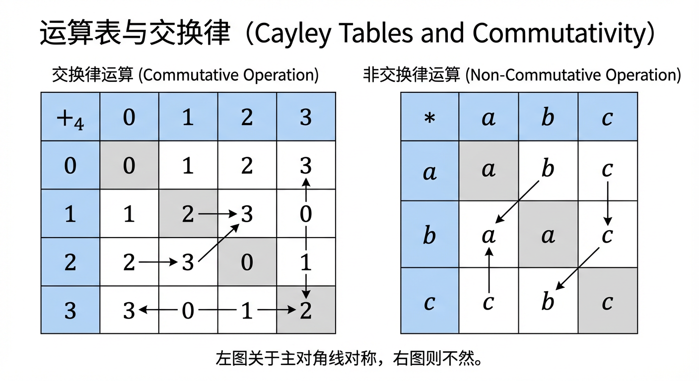
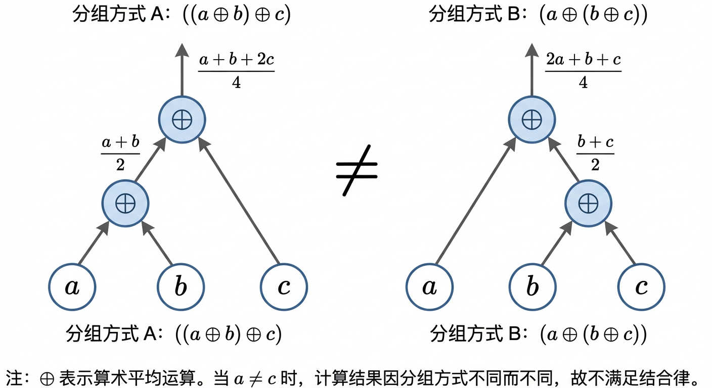
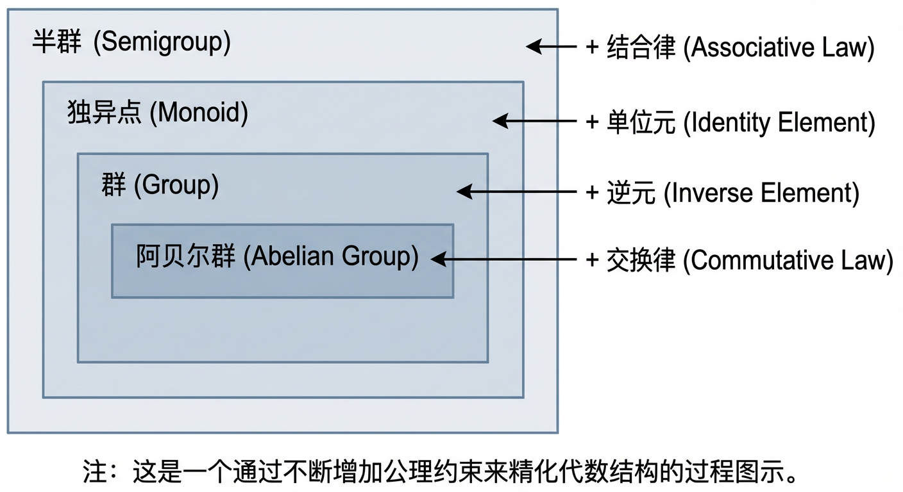
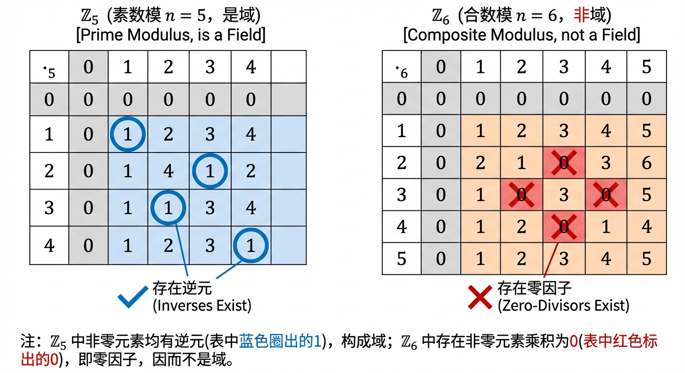
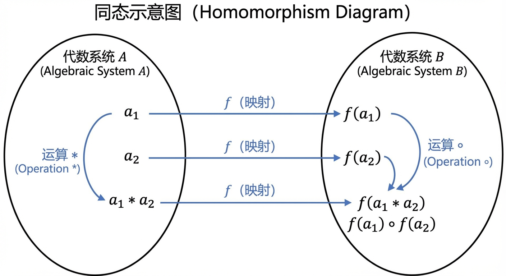
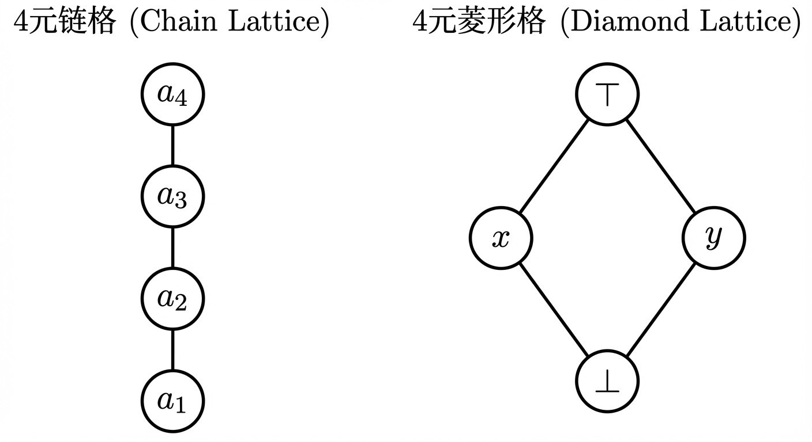
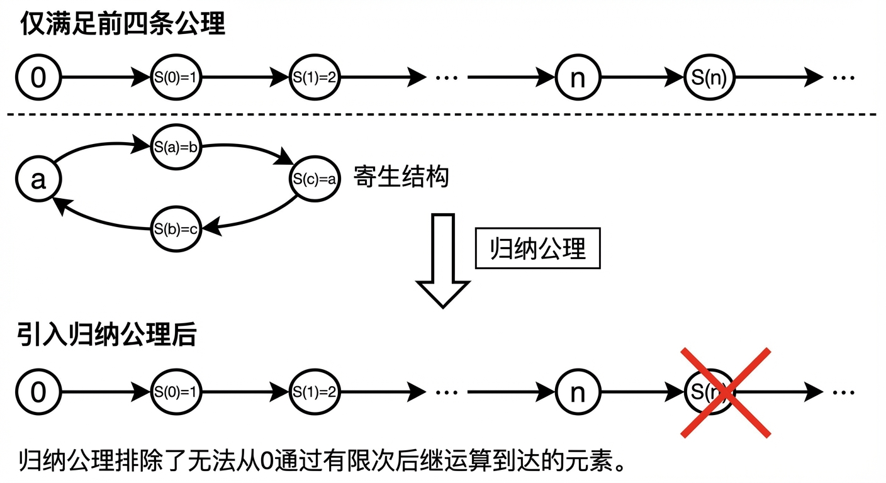
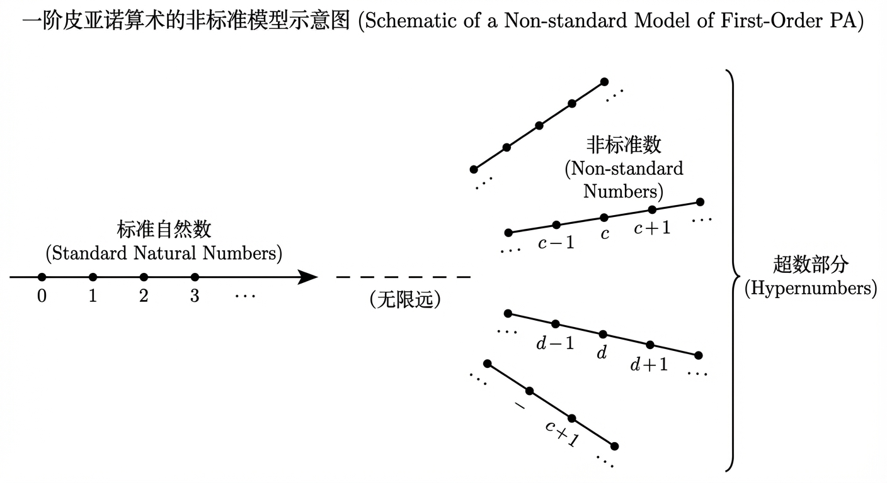

# 第14章 代数系统

在离散数学中，“代数系统”提供了一种把对象（集合）与对象之间的组合规则（运算）以及这些规则应满足的约束（公理）统一起来的框架。第14章将沿着“先定义运算与性质 → 再上升到系统与映射 → 最后回到典型结构与自然数公理化”的主线，完成从直观运算到抽象结构、再到形式化算术基础的闭环。

## 14.1 二元运算及其性质

在前面的学习中，我们已经熟悉了集合、关系与函数这套数学语言，它们为我们描述对象及其相互关联提供了精确的工具。然而，要深入理解数学结构的内在动力，我们还需要一个更具动态和构造性的视角——“运算”的视角。运算，本质上是关于如何将一些元素按照特定规则“合成”一个新元素的过程。本节将从这个视角出发，为我们即将展开的代数系统之旅奠定基石。我们将看到，如何从函数的概念平滑过渡到运算的定义，并探索那些看似简单却能决定整个代数世界形态的基本性质。

### 从函数到运算：一种形式化的综合

我们不妨从一个广义的视角来看待“运算”。一个操作，无论是作用于单个对象（如取一个数的相反数）还是组合多个对象（如两数相加），都可以被看作一个接受输入并产生输出的确定性过程。这正是函数的核心思想。基于此，我们可以给出运算的形式化定义。

**定义 14.1.1 (一元与二元运算)**
设 $S$ 是一个非空集合。
1.  一个从 $S$到 $S$ 的函数 $f: S \to S$ 称为 $S$ 上的一个 **一元运算 (unary operation)**。
2.  一个从 $S$ 的笛卡儿积 $S \times S$到 $S$ 的函数 $f: S \times S \to S$ 称为 $S$ 上的一个 **二元运算 (binary operation)**。

习惯上，我们更喜欢用中缀或前缀运算符（如 $+$, $\cdot$, $*$, $\circ$）来表示二元运算，而不是函数记号 $f(a,b)$。例如，我们将 $f((a,b))$ 写成更自然的 $a * b$。

这个定义看似迂腐，却蕴含了代数思维的第一个核心要求：**封闭性 (closure)**。定义域是 $S \times S$ 意味着运算必须能处理来自 $S$ 的*任意*一对有序元素；值域是 $S$ 则强制要求运算的结果必须*返回*到原集合 $S$ 中。一个集合连同其上的一个或多个封闭的运算，便构成了一个自洽的“代数世界”。如果运算的结果可能“逃离”这个集合，那么后续的结构性讨论将无从谈起。例如，整数集合 $\mathbb{Z}$ 在加法、减法和乘法下都是封闭的，但在除法下不是，因为 $3 \div 2 = 1.5$ 不再是整数。因此，我们说 $(\mathbb{Z}, +)$、$(\mathbb{Z}, -)$ 和 $(\mathbb{Z}, \cdot)$ 是有意义的代数结构研究对象，而 $(\mathbb{Z}, \div)$ 则不是。

> **知识脉络**：从这一刻起，我们将“运算”视为一种特殊的函数，并把关注点从“是否可定义”转移到“定义后会呈现怎样的规律”。这些规律以公理或性质的形式出现，直接决定了后续14.2节中“代数系统”的分类层级（半群、独异点、群、环、域等）以及14.2节末尾“同态/同构”所强调的“结构保持”究竟要保持哪些运算规律。

### 游戏规则：决定运算行为的基本性质

一旦我们确定了一个封闭的运算，就可以开始探究其内在的“游戏规则”。这些规则，或者说性质，决定了运算的行为模式。其中最基础、最核心的两个性质是交换律和结合律。

**定义 14.1.2 (交换律与结合律)**
设 $*$ 为集合 $S$ 上的一个二元运算。
1.  如果对于 $S$ 中任意的元素 $x, y$，都有 $x * y = y * x$，则称运算 $*$ 满足 **交换律 (Commutativity)**。
2.  如果对于 $S$ 中任意的元素 $x, y, z$，都有 $(x * y) * z = x * (y * z)$，则称运算 $*$ 满足 **结合律 (Associativity)**。

交换律回答的问题是：运算对象的顺序重要吗？整数加法满足交换律（$3+5=5+3$），而矩阵乘法通常不满足。这一性质在视觉上有一个优美的体现：一个运算是交换的，当且仅当它的运算表（或称凯莱表，Cayley Table）关于主对角线对称。即在第 $i$ 行第 $j$ 列的元素与第 $j$ 行第 $i$ 列的元素总是相同的。

结合律则提出了一个更深刻的问题：当处理三个或更多元素时，计算的“分组方式”重要吗？整数加法是结合的，这使得我们可以毫无顾虑地写下 $2+3+4$ 而无需括号。这一性质看似理所当然，实则弥足珍贵。许多有意义的运算并不满足结合律。例如，在实数集 $\mathbb{R}$ 上定义运算 $a \oplus b = (a+b)/2$（即取算术平均值），它显然是交换的，但我们来检验其结合律：
$$((a \oplus b) \oplus c) = \frac{\frac{a+b}{2} + c}{2} = \frac{a+b+2c}{4}$$
$$(a \oplus (b \oplus c)) = \frac{a + \frac{b+c}{2}}{2} = \frac{2a+b+c}{4}$$
显然，当 $a, c$ 不相等时，两者通常不相等。因此，算术平均运算不满足结合律。

结合律是代数结构中最为关键的性质之一。它的重要性在于，它保证了重复应用同一运算的最终结果是唯一的，与计算过程的次序无关。这使得“幂”或“序列的积”等概念得以明确定义。例如，在计算机科学中，高效的“快速幂”算法（或称“反复平方法”）正是建立在运算的结合律之上的。该算法通过计算 $a, a^2, a^4, a^8, \dots$ 等一系列值的乘积来得到 $a^k$，其正确性依赖于我们可以按任意顺序组合这些因子，例如 $a^5 = a^1 \cdot a^4$。这种重新组合的能力完全源于结合律。一个仅要求结合律的代数结构（半群）便足以支撑这种强大的算法范式。

值得注意的是，交换律与结合律是彼此独立的性质。例如，我们在前面看到算术平均运算是交换而非结合的。反之，函数复合和矩阵乘法是结合而非交换的典型例子。我们甚至可以构造出既不交换也不结合的运算。

> **知识脉络**：这里对交换律与结合律的区分，将在14.2节的“代数系统的分类”中被系统化：半群只要求结合律；群在此基础上引入单位元与逆元；阿贝尔群再额外要求交换律。并且在14.2节“同态与同构”中，所谓“结构保持”会要求映射在运算层面尊重这些公理（例如把“乘积”映到“乘积”）。

### 特殊成员：构建代数坐标系的结构性元素

在由运算规则所支配的世界里，某些元素可能会扮演特殊的角色，如同物理空间中的原点或单位向量。它们为整个结构提供了参照，是更精细的代数性质得以定义的基础。最重要的两种特殊元素是单位元和逆元。

**定义 14.1.3 (单位元)**
设 $*$ 为集合 $S$ 上的一个二元运算。如果存在一个元素 $e \in S$，使得对于 $S$ 中任意的元素 $x$，都有
$$e * x = x * e = x$$
则称 $e$ 是运算 $*$ 的 **单位元 (identity element)** (或幺元)。

单位元是在运算中“什么也不做”的元素。对于整数加法，单位元是 $0$；对于实数乘法，单位元是 $1$。在一些更抽象的例子中，单位元可能并不那么直观。
- 在所有有限二进制串的集合上，字符串连接运算的单位元是 **空字符串 $\epsilon$**，因为任何字符串与空串连接都保持不变。
- 在给定集合 $U$ 的幂集 $\mathcal{P}(U)$ 上，集合并运算 $\cup$ 的单位元是 **空集 $\emptyset$**，因为对任意子集 $A \subseteq U$，都有 $A \cup \emptyset = A$。
- 在正有理数集 $\mathbb{Q}^+$ 上定义运算 $a \circ b = \frac{ab}{3}$。为了找到单位元 $e$，我们求解方程 $a \circ e = a$，即 $\frac{ae}{3} = a$。对于任意 $a \in \mathbb{Q}^+$，这都要求 $e=3$。因此，在这个奇特的乘法世界里，扮演“1”的角色的是数字 $3$。

一个基本且重要的问题是：单位元是否唯一？答案是肯定的。这里的证明本身就是一次优雅的逻辑演练，它展示了如何仅凭定义和逻辑进行推理。

**定理 14.1.1 (单位元的唯一性)**
如果集合 $S$ 上的二元运算 $*$ 有单位元，那么单位元是唯一的。

**证明：** 假设 $e_1$ 和 $e_2$ 都是运算 $*$ 的单位元。
根据单位元的定义：
1. 因为 $e_1$ 是单位元，所以对于任意元素 $x \in S$，有 $e_1 * x = x * e_1 = x$。我们令 $x = e_2$，得到 $e_1 * e_2 = e_2$。
2. 因为 $e_2$ 是单位元，所以对于任意元素 $y \in S$，有 $e_2 * y = y * e_2 = y$。我们令 $y = e_1$，得到 $e_1 * e_2 = e_1$。

由 1 和 2 可知，$e_1 = e_1 * e_2 = e_2$。因此 $e_1 = e_2$。证毕。

这个证明精妙地揭示了，仅仅“存在一个左单位元和一个右单位元”就足以保证它们的同一性和唯一性。

一旦一个代数世界里有了“原点”（单位元），我们就可以谈论“方向”或“对称”——即逆元。

**定义 14.1.4 (逆元)**
设 $*$ 是集合 $S$ 上的一个有单位元 $e$ 的二元运算。对于 $S$ 中的一个元素 $a$，如果存在一个元素 $b \in S$，使得
$$a * b = b * a = e$$
则称 $b$ 是 $a$ 的 **逆元 (inverse element)**，并记作 $a^{-1}$。

逆元提供了“撤销”一个操作的能力。对于 $(\mathbb{Z}, +)$，任意整数 $n$ 的逆元是 $-n$。对于 $(\mathbb{Q}^+, \times)$，任意有理数 $p/q$ 的逆元是 $q/p$。值得注意的是，并非所有元素都必须有逆元。在 $(\mathbb{Z}, \times)$ 中，只有 $1$ 和 $-1$ 有逆元。在字符串连接运算中，只有单位元——空串 $\epsilon$——拥有逆元（它自己）。

逆元的存在与否，是区分不同代数结构的关键分水岭。一个所有元素都可逆的世界（群）与一个大部分元素都不可逆的世界（独异点，如字符串连接）有着截然不同的结构和应用。

> **知识脉络**：单位元与逆元一旦出现，代数推理就会获得“可消去”“可反演”的能力，这将直接体现在14.3节对群、环、域的讨论中；而当我们把“特殊元素”也纳入系统语言（14.2节中的“常数/杰出元”）时，就能用统一的形式把 $(\mathbb{N},0,S)$、$(\mathbb{Z},+,0)$、$(\mathbb{R}^+,\cdot,1)$ 等结构都放进同一框架比较。

### 规则的力量：性质驱动的推论

到目前为止，我们所定义的性质——结合律、单位元、逆元——不仅是枯燥的标签。它们是逻辑推理机器的齿轮。一旦我们知道一个系统遵循哪些规则，我们就能推导出影响深远的、往往是意想不到的结论。代数推理的魅力，正是在于从最少的公理出发，通过严密的逻辑链条，构建起一座宏伟的理论大厦。

我们已经见识了单位元唯一性的证明。现在，让我们来看一个代数学中最基石的结论之一：逆元的唯一性。在所有熟悉的例子里，一个元素的逆元似乎总是唯一的。例如，唯一能与 5 相加得到 0 的数是 -5。这仅仅是巧合吗？还是有更深层的原因？答案是，这背后是结合律在施加其强大的约束力。

**定理 14.1.2 (逆元的唯一性)**
在一个拥有结合律和单位元的代数结构中，如果一个元素有逆元，那么它的逆元是唯一的。

**证明：** 设 $*$ 是集合 $S$ 上的一个满足结合律的二元运算，且单位元为 $e$。假设元素 $a \in S$ 有两个逆元，分别是 $b$ 和 $c$。
根据逆元的定义，我们有：
$a * b = e$ 且 $b * a = e$
$a * c = e$ 且 $c * a = e$

现在，让我们来考察元素 $b$。
$$
\begin{aligned}
b &= b * e & & \text{(根据单位元的定义)} \\
&= b * (a * c) & & \text{(因为 } a*c=e \text{)} \\
&= (b * a) * c & & \text{(因为运算 * 满足结合律！)} \\
&= e * c & & \text{(因为 } b*a=e \text{)} \\
&= c & & \text{(根据单位元的定义)}
\end{aligned}
$$
推导的结论无可避免：$b$ 必须等于 $c$。因此，逆元是唯一的。

这个证明是公理化方法力量的绝佳展示。请注意第三步，即 $b * (a * c) = (b * a) * c$。这一步的转换，正是结合律的直接应用。如果没有结合律，整个逻辑链条将在这一步断裂。那么，如果运算不满足结合律，一个元素是否可能拥有多个逆元呢？答案是肯定的。我们可以构造一个包含单位元但运算不满足结合律的系统，其中某个元素确实拥有多个逆元。这戏剧性地表明，我们所定义的每一个“游戏规则”都不是随意的装饰，而是构建我们所研究的代数宇宙的根本法则。改变规则，你就改变了宇宙的几何。

同样，基于这些基本性质，我们可以推导出其他有用的运算规则。例如，在任何满足结合律且元素皆有逆元的结构（即群）中，著名的“穿脱袜子”法则是成立的：$(a * b)^{-1} = b^{-1} * a^{-1}$。其证明本身也是一次运用公理进行符号演算的精彩练习。我们只需证明 $b^{-1} * a^{-1}$ 确实是 $a*b$ 的逆元即可：
$$
(a*b) * (b^{-1}*a^{-1}) = a * (b * b^{-1}) * a^{-1} = a * e * a^{-1} = a * a^{-1} = e
$$
同样地可以验证另一侧。值得深思的是，当我们断言 $(a * b)^{-1} = b^{-1} * a^{-1}$ 时，我们已经暗中使用了逆元是唯一的一这一结论。我们证明了 $b^{-1} * a^{-1}$ 是 $a*b$ 的一个逆元，而因为我们知道逆元是唯一的，所以它必然就是“那个”逆元。

> **知识脉络**：以上推理展示了“只要公理成立，就能机械般推出结论”。14.2节将把这种“由公理刻画结构”的思想提升到系统层面：我们不仅关心某个运算是否交换/结合，还关心“哪些运算一起出现、彼此如何相容（如分配律）”，以及“不同系统之间哪些映射能保持这些法则（同态/同构）”。

### 小结

在本节中，我们从函数的视角出发，为“运算”这一核心概念建立了坚实的形式化基础。二元运算被定义为一个从 $S \times S$ 到 $S$ 的映射，其固有的封闭性要求为代数世界的构建划定了边界。

随后，我们探索了描述运算行为的两个基本维度：**交换律**决定了运算是否依赖于顺序，而**结合律**则保证了多重运算结果的确定性。我们看到，这些性质是独立的，并且它们的组合定义了运算的不同“性格”。结合律尤为关键，它是进行有意义的代数推演和算法设计（如快速幂）的基石。

接着，我们引入了赋予代数结构以坐标的两个特殊角色：**单位元**（代数“原点”）和**逆元**（“对称”操作）。我们不仅给出了它们的定义和判别方法，更重要的是，通过严谨的证明，揭示了它们的唯一性是如何从更基本的公理（如结合律）中推导出来的。这让我们第一次深刻体会到代数学的公理化方法论：从最少的规则出发，通过逻辑推演，揭示结构内在的、必然的属性。

通过本节的学习，我们已经装备了一套分析工具箱，里面装有“运算”和“性质”这两样基本积木。我们学会了如何检验一个运算是否封闭、交换、结合，以及如何寻找并验证单位元和逆元。我们更领略了这些性质如何像物理定律一样，约束并塑造着它们所在的代数世界。在接下来的14.2节中，我们将把这些积木按照不同的组合方式进行搭建，从而正式进入“代数系统”的宏伟殿堂，对半群、独异点、群等结构进行系统性的分类和研究。

---

## 14.2 代数系统

在上一节中，我们探讨了二元运算及其性质，如同熟悉了一套用于构建复杂结构的积木。我们认识到，运算的封闭性、结合律、交换律、单位元和逆元等性质，是决定代数行为的基本“规则”。现在，我们将从研究孤立的运算规则，迈向一个更宏大、更具整体性的视角：将一个集合连同其上定义的一个或多个运算，以及这些运算所遵循的公理，作为一个统一的整体来研究。这个整体，便是**代数系统 (algebraic system)**。本节将为您开启通往抽象代数世界的大门，我们将学习如何定义、分类、构造和比较这些蕴含着深刻数学之美的结构。

> **知识脉络**：14.1节的重点是“单个运算的性质”；而本节将把“运算”组织成系统，进一步引入两个关键思想：其一是“结构的层级分类”（哪些性质组合在一起形成半群、群、环、域等），其二是“结构之间的比较”（同态与同构）。这些内容将为14.3节列举典型系统、以及14.4节将自然数视为代数系统并公理化奠定直接语言基础。

### 代数系统的定义与实例

从最根本的层面看，数学的核心任务之一便是从具体问题中提炼出普适的结构。我们观察到整数的加法、矩阵的乘法、逻辑命题的合取，它们看似形态各异，却可能遵循着相似的内在法则。为了捕捉这种共性，我们需要一个统一的语言框架。

**定义 14.2.1 (代数系统)**：一个**代数系统**是一个有序多元组 $\langle S, f_1, f_2, \dots, f_k, c_1, c_2, \dots, c_m \rangle$，其中 $S$ 是一个非空集合，称为该系统的**载体 (carrier)** 或**域 (domain)**；$f_1, f_2, \dots, f_k$ 是定义在 $S$ 上的 $n_i$ 元运算的集合；$c_1, c_2, \dots, c_m$ 是 $S$ 中的一些特定元素，称为**常数**或**杰出元 (distinguished elements)**。通常，若上下文明晰，常数可被视为零元运算，代数系统可简记为 $\langle S, f_1, f_2, \dots \rangle$。

此定义的核心在于，所有运算都必须在集合 $S$ 上是**封闭的**，即运算的结果必须仍然是 $S$ 的成员。这个看似简单的要求，是维系一个系统完整性的基石。

一个集合与一个运算可以构成无数种代数系统，但并非所有系统都具有值得深入研究的良好性质。我们真正感兴趣的，是那些其运算满足特定**公理 (axioms)** 的系统。这些公理，如上一节讨论的结合律，正是赋予代数系统“结构”与“灵魂”的法则。

让我们以平面上的点集 $\mathbb{R}^2$ 为载体，来直观感受不同运算如何塑造出性质迥异的代数系统。考虑三个点 $P_1, P_2, P_3 \in \mathbb{R}^2$，我们定义几种不同的二元运算：
1.  **向量加法** $\otimes$: $P_1 \otimes P_2 = (x_1+x_2, y_1+y_2)$
2.  **偏移加法** $\boxplus$: $P_1 \boxplus P_2 = (x_1+x_2+1, y_1+y_2-1)$
3.  **偏心“中点”** $\oplus$: $P_1 \oplus P_2 = (\frac{2x_1+x_2}{3}, \frac{2y_1+y_2}{3})$

现在，我们来检验这些运算是否满足结合律，即 $(P_1 * P_2) * P_3 = P_1 * (P_2 * P_3)$ 是否恒成立。
对于向量加法 $\otimes$，我们有：
$(P_1 \otimes P_2) \otimes P_3 = ((x_1+x_2)+x_3, (y_1+y_2)+y_3)$
$P_1 \otimes (P_2 \otimes P_3) = (x_1+(x_2+x_3), y_1+(y_2+y_3))$
由于实数加法满足结合律，故 $\langle \mathbb{R}^2, \otimes \rangle$ 是一个满足结合律的代数系统。同样地，通过代数展开可以验证，偏移加法 $\boxplus$ 也满足结合律。
然而，对于偏心“中点”运算 $\oplus$，计算可得：
$(P_1 \oplus P_2) \oplus P_3 = (\frac{4x_1+2x_2+3x_3}{9}, \frac{4y_1+2y_2+3y_3}{9})$
$P_1 \oplus (P_2 \oplus P_3) = (\frac{6x_1+2x_2+x_3}{9}, \frac{6y_1+2y_2+y_3}{9})$
两者显然不等。因此，$\langle \mathbb{R}^2, \oplus \rangle$ 是一个**不满足结合律**的代数系统。

这个简单的例子揭示了一个深刻的道理：代数系统的性质并非与生俱来，而是由其运算的定义严格决定的。我们研究代数系统，本质上就是在研究不同公理约束下的结构世界。值得注意的是，我们熟悉的计算机浮点数运算，虽然意在模仿实数域，但由于舍入误差的存在，其加法和乘法实际上**不满足**严格的结合律。例如，`(1.0e30 + 1.0) - 1.0e30` 的结果很可能是 `0.0`，而 `1.0e30 - 1.0e30 + 1.0` 的结果则是 `1.0`。这提醒我们，在将抽象的代数模型应用于实际计算时，必须警惕模型与现实之间的偏差。

> **知识脉络**：这里通过“是否结合”来区分系统的例子，实际上预告了下一部分“分类”的逻辑：分类的核心就是按公理强弱分层。换言之，14.1节中被逐条引入的性质（结合、交换、单位元、逆元）将成为分类的坐标轴。

### 代数系统的分类

面对千变万化的代数系统，我们需要一套行之有效的分类法。通常，分类的依据是系统所包含的运算数量，以及这些运算满足的公理强度。这种分类构建了一个从简单到复杂的结构“阶梯”，让我们能够循序渐进地理解代数世界。

#### 单一二元运算系统：从半群到群

我们从最简单但也是最重要的情形入手：一个集合 $S$ 和一个二元运算 $*$ 构成的系统 $\langle S, * \rangle$。
*   如果运算 $*$ 满足**结合律**，我们称该系统为**半群 (semigroup)**。
*   如果一个半群还拥有**单位元 (identity element)**，则称之为**独异点 (monoid)**。
*   如果一个独异点中每个元素都存在**逆元 (inverse element)**，则称之为**群 (group)**。
*   若群的运算还满足**交换律**，则称之为**阿贝尔群 (Abelian group)** 或交换群。

这是一个通过不断增加公理约束来精化代数结构的典型过程。让我们通过实例来辨析这些概念。

考虑一个在计算机科学中无处不在的例子：所有有限二进制字符串的集合 $S$，包括空串 $\epsilon$，其上的运算为**字符串连接**。
*   **封闭性**：两个有限字符串连接后仍是有限字符串，封闭性成立。
*   **结合律**：例如，`("10" + "110") + "1"` 的结果与 `"10" + ("110" + "1")` 相同，都是 `"101101"`。字符串连接天然满足结合律。因此，它是一个**半群**。
*   **单位元**：空串 $\epsilon$ 扮演了单位元的角色，因为任何字符串 $s$ 与 $\epsilon$ 连接，结果仍是 $s$。所以，这是一个**独异点**。
*   **逆元**：对于一个非空字符串，例如 `"101"`，我们能找到另一个字符串 $s'$ 使得 `"101" + s'` 等于空串 $\epsilon$ 吗？显然不能，因为连接只会增加字符串的长度。因此，除空串自身外，没有元素存在逆元。
结论：有限二进制字符串与连接运算构成一个**独异点**，但**不是一个群**。

与之相对，考虑实数集 $\mathbb{R}$ 和运算 $a * b = \sqrt[5]{a^5 + b^5}$ 构成的系统 $\langle \mathbb{R}, * \rangle$。直接验证其性质会颇为繁琐，但我们可以借助一个巧妙的视角。注意到函数 $f(x) = x^5$ 是一个从 $\mathbb{R}$到 $\mathbb{R}$ 的双射。该运算可以写成 $a*b = f^{-1}(f(a)+f(b))$。这表明，系统 $\langle \mathbb{R}, * \rangle$ 的结构可以通过函数 $f$ “翻译”成我们所熟知的实数加法群 $\langle \mathbb{R}, + \rangle$ 的结构。因为 $\langle \mathbb{R}, + \rangle$ 是一个阿贝尔群，我们可以断定 $\langle \mathbb{R}, * \rangle$ 也是。例如，其单位元是 $f^{-1}(0)=0$，元素 $a$ 的逆元是 $f^{-1}(-f(a)) = -a$。这种“结构搬运”的思想，我们将在同构部分深入探讨。

> **知识脉络**：此处用“通过双射把一个运算翻译成另一个运算”的思想，本质上就是14.2节后文“同态/同构”的核心直觉：当翻译是双射且保持运算时，我们就认为两个系统在结构上等价。它也预示了14.4节中通过符号语言与公理把自然数结构固定下来的做法：同样是在追求“结构”而非“表象”。

#### 双运算系统：环与域

现实世界中的许多对象，如数字，都同时拥有加法和乘法两种运算。这就引出了包含两个二元运算（通常记为 $+$ 和 $\cdot$）的代数系统。其中最重要的便是环和域。

**定义 14.2.2 (环与域)**
*   一个代数系统 $\langle R, +, \cdot \rangle$ 称为一个**环 (ring)**，如果它满足：
    1.  $\langle R, + \rangle$ 是一个阿贝尔群（其单位元记为 $0$，称为零元）。
    2.  $\langle R, \cdot \rangle$ 是一个半群（即乘法满足结合律）。
    3.  乘法对加法满足**分配律**：对任意 $a,b,c \in R$，有 $a \cdot (b+c) = a \cdot b + a \cdot c$ 和 $(b+c) \cdot a = b \cdot a + c \cdot a$。

*   若环中的乘法还满足交换律，则称为**交换环 (commutative ring)**。
*   若交换环中存在乘法单位元 $1$ ($1 \neq 0$)，且没有**零因子 (zero divisor)**（即不存在非零元素 $a,b$ 使得 $a \cdot b = 0$），则称之为**整环 (integral domain)**。
*   若交换环中存在乘法单位元 $1$ ($1 \neq 0$)，且每个非零元素都有乘法逆元，则称之为**域 (field)**。

域是一种代数性质最为“完美”的结构，我们可以在其中自由地进行加、减、乘、除（除数不为零）四则运算。从环到整环再到域，同样是一个通过增强公理约束而形成的结构阶梯。

*   **整数集** $\langle \mathbb{Z}, +, \cdot \rangle$ 是一个典型的**整环**。它拥有加法和乘法单位元，满足交换律且没有零因子。但它**不是一个域**，因为像 2 这样的非零元素，其乘法逆元 $1/2$ 不在 $\mathbb{Z}$ 中。
*   **有理数集** $\langle \mathbb{Q}, +, \cdot \rangle$、**实数集** $\langle \mathbb{R}, +, \cdot \rangle$ 都是**域**。
*   **偶数集** $\langle 2\mathbb{Z}, +, \cdot \rangle$ 是一个有趣的例子。不难验证它满足环的所有公理，且乘法是可交换的。但它**没有乘法单位元**，因为 1 不是偶数。这是一个**无单位元交换环**的实例。
*   **模 $n$ 整数环** $\langle \mathbb{Z}_n, +_n, \cdot_n \rangle$ 的性质则与 $n$ 的取值密切相关。例如，在 $\mathbb{Z}_{30}$ 中，我们有 $5 \neq 0$ 且 $6 \neq 0$，但 $5 \cdot_n 6 = 30 \equiv 0 \pmod{30}$。因此，5 和 6 都是**零因子**。一个深刻的结论是：$\mathbb{Z}_n$ 是一个**域**当且仅当 $n$ 是一个**素数**。当 $n$ 为素数时，任何非零元素都与 $n$ 互素，保证了乘法逆元的存在；当 $n$ 为合数时，则必然存在零因子。

一个更根本的定理揭示了有限性与代数结构之间的奇妙关联：**任何有限整环都是一个域**。这意味着在一个有穷的、没有零因子的交换环里，乘法逆元的存在性是“自动”满足的。这为我们提供了一个有力的判定工具。

### 子代数与积代数

在对代数系统有了初步分类后，我们自然会关心如何从已知的系统中构造出新的系统。两种基本的方式是“向内看”和“向外组合”，分别对应子代数和积代数的概念。

**定义 14.2.3 (子代数)**：设 $\langle S, F \rangle$ 是一个代数系统，其中 $F$ 是运算的集合。若 $S'$ 是 $S$ 的一个非空子集，且 $S'$ 对于 $F$ 中的所有运算都是**封闭的**，则称 $\langle S', F \rangle$ 是 $\langle S, F \rangle$ 的一个**子代数系统 (sub-algebraic system)**。

如果母系统具有某种代数结构（如群、环），其子代数若也保持该结构，则称为子群、子环等。例如，$\langle \mathbb{Z}, + \rangle$ 是 $\langle \mathbb{R}, + \rangle$ 的一个子群，而 $\langle 2\mathbb{Z}, +, \cdot \rangle$ 是 $\langle \mathbb{Z}, +, \cdot \rangle$ 的一个子环。

**定义 14.2.4 (积代数)**：设 $\langle A, *_A, \circ_A, \dots \rangle$ 和 $\langle B, *_B, \circ_B, \dots \rangle$ 是两个类型相同的代数系统。它们的**积代数 (product algebra)** 定义在笛卡尔积 $A \times B$ 上，其运算是**逐分量 (component-wise)** 定义的。例如，对于二元运算，我们定义：
$$(a_1, b_1) * (a_2, b_2) = (a_1 *_A a_2, b_1 *_B b_2)$$
可以证明，积代数会“继承”其因子代数的许多性质。例如，两个群的直积仍然是一个群，其单位元是 $(e_A, e_B)$，元素 $(a,b)$ 的逆是 $(a^{-1}, b^{-1})$。我们熟悉的平面向量加法群 $\langle \mathbb{R}^2, + \rangle$ 就是实数加法群 $\langle \mathbb{R}, + \rangle$ 与自身的直积。

> **知识脉络**：子代数强调“在同一结构内部截取封闭部分”，积代数强调“把多个结构并置并逐分量运算”。两者都为下一步“比较结构”服务：当我们谈同态时，既要能把一个结构映到另一个结构，也要理解映射是否与子结构、直积结构相协调，这将成为抽象代数中进一步研究核与商结构的前奏（本章点到为止）。

### 代数系统的同态与同构

定义和分类固然重要，但代数学的真正威力在于比较不同系统之间的关系。**同态 (homomorphism)** 和 **同构 (isomorphism)** 正是为此而生的最核心的工具，它们是衡量两个代数系统“相似度”的标尺。

**定义 14.2.5 (同态与同构)**
设 $\langle A, * \rangle$ 和 $\langle B, \circ \rangle$ 是两个代数系统。
*   一个映射 $f: A \to B$ 如果保持运算结构，即对所有 $a_1, a_2 \in A$ 都有：
    $$f(a_1 * a_2) = f(a_1) \circ f(a_2)$$
    则称 $f$ 是一个从 $\langle A, * \rangle$ 到 $\langle B, \circ \rangle$ 的**同态**。
*   如果一个同态 $f$ 同时还是一个**双射 (bijection)**（即一一对应），则称 $f$ 是一个**同构**。此时，我们称系统 $\langle A, * \rangle$ 与 $\langle B, \circ \rangle$ 是**同构的**，记为 $\langle A, * \rangle \cong \langle B, \circ \rangle$。

同态好比一种“结构保持的翻译”，它确保了我们可以在两个世界之间转换，而运算的内在逻辑不变。同构则是一种更强的关系，它意味着两个代数系统在结构上是完全无法区分的，它们仅仅是元素的“标签”不同而已。一个经典的同构例子是对数函数 $\log: \langle \mathbb{R}^+, \cdot \rangle \to \langle \mathbb{R}, + \rangle$，它将正实数的乘法完美地“翻译”成了实数的加法。

同构的概念是极其强大的，它允许我们将一个陌生系统的问题转化到一个熟悉系统中去解决。之前我们遇到的系统 $\langle \mathbb{R}, * \rangle$ 与 $a * b = \sqrt[5]{a^5 + b^5}$，正是通过同构映射 $f(x)=x^5$ 与 $\langle \mathbb{R}, + \rangle$ 联系起来，从而轻松证明了其群结构。

一个极具启发性的思考是：我们能否在**无理数集** $\mathbb{I} = \mathbb{R} \setminus \mathbb{Q}$ 上定义加法和乘法，使其构成一个域？乍一看，这似乎不可能。例如，$\sqrt{2}$ 和 $-\sqrt{2}$ 都是无理数，但它们的（标准）和为 $0$，是一个有理数，运算不封闭。然而，这个反驳仅仅否定了**标准**运算的可能性。代数结构的本质在于公理，而非特定的运算形式。

在集合论中我们知道，无理数集 $\mathbb{I}$ 与实数集 $\mathbb{R}$ 的基数是相同的，这意味着存在一个双射 $f: \mathbb{I} \to \mathbb{R}$。借助这个双射，我们可以将 $\mathbb{R}$ 的域结构“搬运”或“移植”到 $\mathbb{I}$ 上。我们为任意两个无理数 $x, y \in \mathbb{I}$ 定义新的运算 $\oplus$ 和 $\otimes$ 如下：
$$x \oplus y := f^{-1}(f(x) + f(y))$$
$$x \otimes y := f^{-1}(f(x) \cdot f(y))$$
通过构造，映射 $f$ 成为了从新系统 $\langle \mathbb{I}, \oplus, \otimes \rangle$ 到我们熟知的域 $\langle \mathbb{R}, +, \cdot \rangle$ 的一个**同构**。由于 $\mathbb{R}$ 是一个域，那么与之同构的 $\mathbb{I}$ 在这套新定义的运算下也必然是一个域。例如，新系统的加法单位元是 $e_{\oplus} = f^{-1}(0)$，这是一个无理数！

这个例子雄辩地证明了代数结构的抽象性与普适性。一个集合能否构成某种代数系统，本质上是一个关于其基数和能否找到满足公理的运算的问题，而不仅是我们对“加法”和“乘法”的传统认知。同构正是那座连接不同数学表象下相同内在结构的桥梁。

> **知识脉络**：同态/同构不仅是“换一套符号做同一件事”，更是把“公理约束下的运算规律”作为不变量来研究。14.3节将展示：布尔代数、格、环、域等系统之所以能成为理论核心，正是因为它们的公理集合既足够强以推出丰富定理，又足够弱以覆盖大量实例。而14.4节则把这种公理化精神推到极致：用皮亚诺公理把自然数这一“最熟悉的对象”也纳入代数系统视角。

### 小结

本节中，我们完成了从“运算”到“代数系统”的认知飞跃。我们用集合、运算和公理这三驾马车，形式化地定义了代数系统，并通过实例展示了运算规则如何决定系统的根本性质。

我们建立了代数系统的一个基本分类阶梯：从满足最少公理的半群，到结构丰富的群、环和域。这个层级化的视角揭示了不同代数世界之间的包含与演进关系，让我们理解了单位元、逆元、零因子等概念在划分代数结构中的关键作用。此外，我们还学习了通过子代数和积代数来构造新系统的方法。

最重要的是，我们引入了同态与同构这两个核心概念。它们不仅是比较代数系统结构异同的“度量衡”，更是揭示数学内在统一性的强大工具。通过同态，我们得以在不同代数语言之间进行“翻译”；通过同构，我们则能断言两个系统在抽象结构层面是完全等价的。

在本章的下一节，我们将聚焦于这些代数系统中几个最典型、最重要的代表——半群、独异点、群、环、域、格与布尔代数，深入剖析它们各自独特的理论与应用。本节所建立的“系统-结构-映射”的统一框架，将为我们接下来的探索提供坚实的导航。

---

## 14.3 几个典型的代数系统

在前两节中，我们已经为代数系统建立了形式化的描述框架，并探讨了子结构与结构间的保持映射。这些准备工作如同一位建筑师备齐了图纸与建材，现在，我们将运用它们来构筑几座在现代数学与计算机科学中至关重要且极具代表性的“代数大厦”。本节的旅程将遵循一条从简至繁、从单一运算到复合运算、从代数视角到逻辑视角的公理化路径。

我们将首先从仅需一条结合律的**半群**出发，通过加入单位元构建**独异点**，理解最基本的计算过程模型。随后，通过引入逆元，我们将见证结构如何从“过程”升华为“对称”，从而进入**群**的优美世界。接着，我们将视角扩展至双运算体系，通过组合加法群与不同强度的乘法半群，逐层揭示**环**、**整环**与**域**的丰富内涵，这些结构是数论与高等代数的基石。最后，我们将切换到由序关系主导的视角，引入**格**与**布尔代数**，将代数运算与逻辑推理、集合运算紧密联系起来，从而与本书的前续章节形成深刻的呼应。通过本节的学习，读者将掌握这些典型系统的公理集合、核心性质与判别方法，并初步领会以少量公理刻画大量结构这一现代数学的核心思想。

> **知识脉络**：请注意本节材料与14.2节的对应关系：14.2节提供“分类规则与结构保持映射”，而本节给出“分类中的典型代表”。理解这些代表的关键方法仍是回到14.1节的运算性质：先识别封闭性、结合性、单位元、逆元、分配律、补元等，再由定义归类。

### 14.3.1 半群与独异点

我们探索的起点是代数世界中最基本、约束最少的结构之一：半群。

**定义 14.3.1（半群）**
一个代数系统 $\langle S, * \rangle$ ，其中 $S$ 是一个非空集合，* 是定义在 $S$ 上的二元运算，如果运算 * 满足**结合律（Associativity）**，即对任意 $a, b, c \in S$，都有 $(a*b)*c = a*(b*c)$，则称该代数系统为一个**半群（Semigroup）**。

结合律的意义非凡，它保证了在进行一连串同种运算时，只要元素的顺序不变，任何运算次序（即括号的添加方式）都不会影响最终结果。这一性质看似平凡，却是许多计算模型能够成立的根本。例如，计算机科学中常见的字符串拼接操作便是一个典型的半群。设 $\Sigma^+$ 为由字母表 $\Sigma$ 中字符构成的所有非空字符串的集合，字符串的拼接运算 `·` 显然满足结合律，因此 $\langle \Sigma^+, · \rangle$ 是一个半群。

在算法设计中，结合律是“分而治之”策略能够正确实施的代数基础。考虑一个聚合任务，如计算一列元素的总和或总乘积。如果其“合并”操作满足结合律，那么无论是采用顺序的左折叠 `((x₁ * x₂) * x₃) * ...`，还是采用类似二叉树的递归合并方式，最终结果都将是相同的。这赋予了算法极大的灵活性。

然而，半群的结构略显松散。若我们为其增加一个特殊的“中性”元素，便能得到一个性质更丰富的结构——独异点。

**定义 14.3.2（独异点）**
一个半群 $\langle M, * \rangle$ ，如果存在一个**单位元（Identity Element）** $e \in M$，使得对于任意 $a \in M$，都有 $a*e = e*a = a$，则称该代数系统为一个**独异点（Monoid）**。

在半群的基础上，独异点仅仅增加了一条单位元公理，但这一小步却是结构上的一个巨大飞跃。字符串的世界里，如果我们把空字符串 `ε` 也包含进来，构成集合 $\Sigma^*$，那么 $\langle \Sigma^*, ·, \varepsilon \rangle$ 就是一个独异点。我们熟悉的自然数加法 $\langle \mathbb{N}, +, 0 \rangle$ 和自然数乘法 $\langle \mathbb{N}, \times, 1 \rangle$ 都是独异点。值得注意的是，幂运算作为一种重复的二元运算，其形式化定义正是建立在独异点结构之上：对于独异点 $\langle M, *, e \rangle$ 中的任意元素 $a$ 和非负整数 $k$，我们递归地定义 $a^0 = e$ 以及 $a^{k+1} = a^k * a$。由于 * 运算的结合律，指数律 $a^{m+n}=a^m * a^n$ 自然成立。这一思想在模算术等领域有重要应用，例如，在研究乘法幺半群 $\langle \mathbb{Z}_n, \cdot, [1]_n \rangle$ 时，快速幂算法本质上就是利用了这种独异点结构。

半群与独异点的关系极为密切。事实上，任何半群都可以通过“自由”地添加一个单位元来“扩张”成一个独异点。这种从一个代数范畴到另一个代数范畴的构造过程，在更高等的代数中体现为一种被称为**伴随函子（Adjoint Functor）**的深刻联系。这启发我们，不同的代数系统并非孤立存在，它们之间常常可以通过保持结构的映射和构造机关联起来。

> **知识脉络**：从半群到独异点的“增加单位元”可被视为把14.1节的“单位元概念”上升为系统公理的一步。继续沿着同一思路，如果再为每个元素要求逆元，就自然到达下一小节“群”；而群的“可逆性”将成为环与域中“可消去/可除”的核心背景。

### 14.3.2 群

在独异点的基础上，如果我们要求每个元素都具有“可逆性”，便进入了群的世界。群论是研究对称性的数学语言，在物理学、化学、密码学等领域无处不在。

**定义 14.3.3（群）**
一个独异点 $\langle G, *, e \rangle$ ，如果对于任意元素 $a \in G$，都存在一个**逆元（Inverse Element）** $a^{-1} \in G$，使得 $a*a^{-1} = a^{-1}*a = e$，则称该代数系统为一个**群（Group）**。如果运算 * 还满足交换律，则称其为**阿贝尔群（Abelian Group）**或交换群。

整数集合 $\mathbb{Z}$ 在加法下构成一个阿贝尔群 $\langle \mathbb{Z}, +, 0 \rangle$，其中每个整数 $n$ 的逆元是 $-n$。有理数集合 $\mathbb{Q}$ 去掉 $0$ 之后，在乘法下构成阿贝尔群 $\langle \mathbb{Q}\setminus\{0\}, \times, 1 \rangle$。从半群到独异点，再到群，我们看到一个通过逐步增强公理约束来获得更精良结构的典型过程。

引入逆元这一公理，带来了根本性的变化。其一，它使得方程求解成为可能。在群 $\langle G, * \rangle$ 中，形如 $a*x=b$ 的方程总有唯一解 $x = a^{-1}*b$。其二，它保证了**消去律（Cancellation Law）**的成立：若 $a*c = b*c$ 或 $c*a=c*b$，则必有 $a=b$。这在不含逆元的半群或独异点中通常是不成立的。例如，在整数乘法独异点 $\langle \mathbb{Z}, \times, 1 \rangle$ 的子系统——模6整数乘法 $\langle \mathbb{Z}_6, \times, [1] \rangle$ 中，我们有 $[2]\times[3]=[4]\times[3]=[0]$，但 $[2] \neq [4]$。

群是离散数学中第一个真正意义上的“对称”结构。群中的每个元素都可以看作一个作用于集合上的可逆变换或对称操作，而群运算就是这些变换的复合。这种观点是群论应用的核心。

> **知识脉络**：14.1节中逆元唯一性的证明，正是在“结合律 + 单位元”的背景下完成的；而群在公理层面保证“每个元素都有逆元”，因此群内可以广泛使用“唯一逆元”“消去律”等推论。这些推论在后续环与域中会以“加法群”与“乘法可逆性”的方式再次出现。

### 14.3.3 环与域

至此我们所见的代数系统都只带有一种运算。现在，我们将注意力转向包含两种运算的系统，其中最重要的是环与域。它们是对我们所熟悉的整数、有理数、实数等数系算术规则的抽象。

**定义 14.3.4（环）**
一个代数系统 $\langle R, +, \cdot \rangle$，其中 $R$ 是一个非空集合，+ 和 · 是定义在 $R$ 上的两个二元运算，如果满足以下公理：
1.  $\langle R, + \rangle$ 是一个阿贝尔群（其单位元记为 $0$，称为**零元**）；
2.  $\langle R, \cdot \rangle$ 是一个半群；
3.  乘法 · 对加法 + 满足**分配律（Distributive Laws）**，即对任意 $a, b, c \in R$，有 $a \cdot (b+c) = (a \cdot b) + (a \cdot c)$ 和 $(b+c) \cdot a = (b \cdot a) + (c \cdot a)$。
则称该系统为一个**环（Ring）**。

此外，根据乘法半群的性质，我们还有如下细分：
-   若乘法 · 满足交换律，则称其为**交换环（Commutative Ring）**。
-   若乘法 · 存在单位元（记为 $1$，称为**幺元**），则称其为**含幺环（Ring with Unity）**。

整数环 $\langle \mathbb{Z}, +, \cdot \rangle$、有理数环 $\langle \mathbb{Q}, +, \cdot \rangle$、实数环 $\langle \mathbb{R}, +, \cdot \rangle$ 都是含幺交换环。但环的范畴远不止于此，例如所有 $n \times n$ 实矩阵在矩阵加法和乘法下构成一个含幺但非交换的环。

在环的结构中，有两个特殊的元素类别值得关注。一个是**零因子（Zero Divisor）**，即存在两个非零元素 $a, b$，使得 $a \cdot b = 0$。例如，在环 $\mathbb{Z}_6$ 中，$[2]$ 和 $[3]$ 都是零因子。另一个是**单位（Unit）**，即乘法可逆元。环中所有的单位在乘法下构成一个群，称为**单位群（Group of Units）**。

从环到域，同样是一个公理逐步强化的过程。

**定义 14.3.5（整环与域）**
- 一个没有零因子的含幺交换环称为**整环（Integral Domain）**。
- 一个含幺交换环，如果其中每个非零元素都是单位（即都有乘法逆元），则称其为一个**域（Field）**。

整数环 $\mathbb{Z}$ 是一个整环，但不是域，因为除了 $\pm 1$ 之外，其他非零整数在 $\mathbb{Z}$ 中没有乘法逆元。而有理数环 $\mathbb{Q}$、实数环 $\mathbb{R}$ 和复数环 $\mathbb{C}$ 都是域。容易证明，**任何域都必定是整环**。

域是性质最为优美的代数系统之一，它完美地推广了我们熟悉的四则运算法则。在域中，任何非零元皆可除，使得代数运算极为自由。一个重要的事实是，对于整数 $n>1$，环 $\mathbb{Z}_n$ 是一个域当且仅当 $n$ 是一个素数。这为我们构造**有限域（Finite Field）**提供了最基本的材料。

环论中最引人入胜的主题之一是**因子分解的唯一性**。我们知道，算术基本定理保证了任何整数都能唯一地分解为素数的乘积。我们自然会问：这种美好的性质在其他环中是否依然成立？答案是否定的。考虑环 $\mathbb{Z}[\sqrt{-5}] = \{a+b\sqrt{-5} \mid a,b \in \mathbb{Z}\}$，这是一个整环。在此环中，元素 6 有两种本质不同的分解方式：
$$ 6 = 2 \cdot 3 = (1 + \sqrt{-5})(1 - \sqrt{-5}) $$
可以证明，这里的 $2, 3, 1+\sqrt{-5}$ 和 $1-\sqrt{-5}$ 都是环中的“不可约元”（无法再分解的非单位元素），且它们之间除了差一个符号外，并非简单的“同类物”。这表明 $\mathbb{Z}[\sqrt{-5}]$ 不是一个**唯一因子分解整环（Unique Factorization Domain, UFD）**。这一发现揭示了数系结构的深层复杂性，并直接催生了“理想”这一更强大的代数工具，用以恢复某种形式的唯一分解。

> **知识脉络**：环与域把“可逆性”的思想分层处理：加法部分要求成为阿贝尔群（因此每个元素都有加法逆元），乘法部分先只要求半群，再逐步加强到含幺、无零因子、非零元皆可逆。这个“分层加强”与14.2节的分类阶梯在精神上完全一致：每加一条公理，就收获一批更强的推论。

### 14.3.4 格与布尔代数

最后，我们转向一类其结构更多由“序”而非“运算”来定义的代数系统。这类系统将代数与第四章的偏序关系以及第二章的命题逻辑联系起来。

**定义 14.3.6（格）**
一个非空集合 $L$ 与其上的一个偏序关系 $\le$ 构成的偏序集 $\langle L, \le \rangle$，如果对于任意一对元素 $a, b \in L$，它们的**最小上界（Supremum）**和**最大下界（Infimum）**都存在于 $L$ 中，则称该偏序集为一个**格（Lattice）**。

最小上界也称为**并（Join）**，记作 $a \lor b$；最大下界也称为**交（Meet）**，记作 $a \land b$。可以证明，在一个格中，并运算和交运算都是满足交换律、结合律和**吸收律**（$a \lor (a \land b) = a$, $a \land (a \lor b) = a$）的二元运算。因此，格也可以被纯粹地定义为一个满足这些公理的代数系统 $\langle L, \lor, \land \rangle$。

一个集合 $S$ 的幂集 $\mathcal{P}(S)$ 在集合包含关系 $\subseteq$ 下就是一个典型的格，其并运算是集合的并 $\cup$，交运算是集合的交 $\cap$。另一个简单的例子是正整数集合在整除关系 `|` 下构成的格，其并运算是最小公倍数，交运算是最大公约数。在一个仅有4个元素的集合上，可以构造出两种非同构的格结构：一个链格和一个菱形格，这为理解格的基本形态提供了直观的实例。

在格的家族中，有一类与数字电路和逻辑演算关系最为密切，那就是布尔代数。

**定义 14.3.7（布尔代数）**
一个格 $\langle B, \lor, \land \rangle$ 如果是**有界格**（即存在最小元 $0$ 和最大元 $1$）、**分配格**（即 $\lor$ 对 $\land$ 和 $\land$ 对 $\lor$ 都满足分配律），并且是**有补格**（即对任意元素 $x \in B$，都存在一个**补元（Complement）** $\neg x \in B$，使得 $x \land \neg x = 0$ 且 $x \lor \neg x = 1$），则称该系统为一个**布尔代数（Boolean Algebra）** $\langle B, \lor, \land, \neg, 0, 1 \rangle$。

布尔代数公理体系具有高度的内在和谐性与对称性。一个核心特性是**对偶原理（Principle of Duality）**：在任何一个布尔代数的有效等式中，若将 $\lor$ 与 $\land$ 互换、 $0$ 与 $1$ 互换，得到的等式依然成立。例如，分配律 $x \land (y \lor z) = (x \land y) \lor (x \land z)$ 的对偶形式就是 $x \lor (y \land z) = (x \lor y) \land (x \lor z)$。

这套看似小巧的公理系统威力惊人，许多我们认为“不证自明”的逻辑定律，如幂等律（$x \lor x = x$）、对合律（$\neg(\neg x) = x$）以及著名的**德摩根定律（De Morgan's Laws）**，都可以从中严格推导出来。例如，为了证明德摩根定律之一 $\neg(x \lor y) = \neg x \land \neg y$，我们只需证明 $\neg x \land \neg y$ 满足 $x \lor y$ 的补元的定义即可。而这一证明过程，将不可避免地依赖于分配律。事实上，可以证明，在一个分配格中，若一个元素存在补元，则其补元是唯一的。正是这种由分配律保证的唯一性，赋予了布尔代数严谨的推演能力。

布尔代数不仅是命题逻辑的代数模型，也是集合代数和开关电路的数学基础。它以一种令人惊叹的方式，将逻辑真假、集合归属和电路通断这些看似无关的概念统一在同一个优美的代数框架之下。

> **知识脉络**：布尔代数再次让我们看到“从少量公理推导大量恒等式”的模式，这与14.1节通过结合律推出逆元唯一性、14.4节在PA中通过归纳推出加法交换律的逻辑形态高度一致：选定语言与公理 → 在系统内做形式推演。差别仅在于所研究的载体与运算不同。

### 小结

在本节中，我们巡礼了离散数学中最具代表性的几类代数系统。我们的旅程始于仅满足结合律的半群，通过逐步添加单位元（独异点）和逆元（群），展示了代数结构如何通过公理的层累而变得日益丰富和强大。随后，我们转向双运算系统，在环与域的层级中，看到了对整数和有理数算术体系的深刻抽象，并触及了唯一因子分解等核心数论问题。最后，我们以格与布尔代数为终点，将代数结构与偏序理论及逻辑演算融为一体。

贯穿本节的核心思想是**公理化方法**的力量：通过从具体实例（如数、字符串、集合）中提炼出共通的运算规则（公理），我们可以建立起一个抽象的结构模型。在这个模型内部，我们可以进行纯粹的逻辑推演，而得出的结论（定理）将普适于所有满足该公理系统的具体实例。这种思想不仅是现代代数学的灵魂，也是整个离散数学乃至计算机科学理论的基石。

至此，我们已经熟悉了代数系统的基本词汇与语法。在下一节中，我们将看到如何运用这种公理化的思维，对我们最熟悉、也最基础的数学对象——自然数——进行严格的形式化刻画，从而为全章的探索画上一个完美的句号。

---

## 14.4 皮亚诺系统

在本章的前几节中，我们已经习惯于从“集合 + 运算 + 公理”的视角来审视群、环、域等代数结构。这些结构捕捉了对称、变换与方程求解等核心数学行为的本质。现在，我们将用这把锋利的解剖刀，转向一个我们自幼便与之相熟、看似不证自明的概念——自然数。我们真的理解自然数吗？例如，著名的**角谷猜想（Collatz conjecture）**，又称 $3n+1$ 问题，声称对任何正整数 $n$ 进行如下操作：若 $n$ 为偶数，则变为 $n/2$；若 $n$ 为奇数，则变为 $3n+1$；如此反复，最终必然会回到 1。计算机已经验证了直到高达 $10^{20}$ 的所有自然数，均符合此猜想。然而，这种大规模的数值检验，无论其规模多么浩瀚，提供的仅仅是极高的经验“置信度”，而非逻辑上的“确定性”。我们无法排除在已验证范围之外，存在一个反例的可能性。这引发了一个深刻的问题：我们如何才能获得关于全体自然数性质的绝对真理？答案在于，必须将我们对自然数的直觉提炼为一组无可辩驳的公理，并在此基础上进行纯粹的逻辑推演。本节的使命，正是将自然数及其算术体系，作为一个代数系统来公理化地刻画，这个系统便是**皮亚诺系统 (Peano System)**。

> **知识脉络**：从结构视角看，$(\mathbb{N},0,S)$ 是一个“带常数与一元运算”的代数系统：$0$是杰出元，$S$是运算。它与14.2节的定义14.2.1完全同型；而“用公理锁定结构”的做法，则是把14.3节对典型系统的公理化精神应用到自然数这一基础对象上。

### 皮亚诺公理：捕获“数”之结构

我们对自然数的直觉根植于“计数”这一原始行为：存在一个起点（比如 0），并且每个数都有一个唯一的“后继者”。意大利数学家朱塞佩·皮亚诺 (Giuseppe Peano) 在19世纪末，将此直觉提炼为一组精炼的公理。一个皮亚诺系统可以被视为一个代数系统 $(\mathbb{N}, 0, S)$，其中 $\mathbb{N}$ 是一个集合， $0 \in \mathbb{N}$ 是一个常数（称为“零”），而 $S: \mathbb{N} \to \mathbb{N}$ 是一个一元运算（称为**后继函数 (successor function)**）。这个系统需满足以下公理：

**定义 14.4.1 (皮亚诺公理)**
1.  **起点存在**: $0 \in \mathbb{N}$。 (0是一个自然数。)
2.  **后继封闭**: 对任意 $n \in \mathbb{N}$，其后继 $S(n)$ 也是一个自然数。
3.  **起点无前驱**: 对任意 $n \in \mathbb{N}$， $S(n) \neq 0$。 (0不是任何自然数的后继。)
4.  **后继唯一性 (单射性)**: 对任意 $m, n \in \mathbb{N}$，若 $S(m) = S(n)$，则 $m = n$。 (不同的自然数有不同的后继。)
5.  **归纳公理**: 设 $A$ 是 $\mathbb{N}$ 的一个子集。若 $0 \in A$，且对任意 $n \in \mathbb{N}$，只要 $n \in A$ 就有 $S(n) \in A$，则 $A = \mathbb{N}$。

前四条公理描绘了自然数的基本“链状”结构：它有一个明确的起点0，并且从0开始，通过后继运算 $S$ 可以不断向前延伸，形成一条无分支、无环的无限链。例如，公理3保证了链条不会“向后”闭合成环（如 $S(k)=0$），公理4保证了链条不会“汇合”（如 $S(m)=S(n)$ 但 $m \ne n$）。

然而，仅有前四条公理是不够的。它们允许存在一些“寄生”的、与0毫无关联的链条或循环结构。这正是第五条公理——**归纳公理 (Axiom of Induction)**——发挥关键作用的地方。它以一种极为深刻的方式断言：自然数集合 $\mathbb{N}$ 中，不存在任何“孤岛”。任何一个包含了0，并且对后继运算封闭的子集，必然就是整个自然数集。从集合论的角度看，这等价于说，自然数集 $\mathbb{N}$ 是满足前四条公理的“最小”集合。这与我们在集合论中将自然数集 $\omega$ 定义为“最小的归纳集”的思想一脉相承，保证了 $\mathbb{N}$ 内的每一个元素都可以从0出发，通过有限次后继运算抵达。这正是我们在第1章所学的**数学归纳法 (Mathematical Induction)** 的公理化基石。

### 一阶皮亚诺算术：构建运算体系

上述的皮亚诺系统优雅地刻画了自然数的基本序结构。然而，为了发展完整的算术理论，我们还需要定义加法、乘法等运算，并研究它们的性质。为此，我们将皮亚诺系统嵌入到一阶逻辑的框架中，形成一个称为**一阶皮亚诺算术 (First-order Peano Arithmetic, PA)** 的形式理论。

PA的语言 $L_{PA}$ 包含常数符号 $0$，一元函数符号 $S$，以及两个二元函数符号 $+$ 和 $\cdot$。等号 $=$ 是逻辑部分的标准配置。在此语言中，我们可以为每个自然数 $n$ 定义一个对应的**数码 (numeral)** $\bar{n}$，它是一个指代 $n$ 的封闭项，归纳定义为：$\bar{0}$ 就是常数符号 $0$，$ \overline{n+1}$ 是项 $S(\bar{n})$。

PA的公理系统由以下三部分构成：

1.  **后继公理**:
    *   $\forall x \, (S(x) \neq 0)$
    *   $\forall x \forall y \, (S(x) = S(y) \rightarrow x = y)$

2.  **运算的递归定义**:
    *   **加法公理**: $\forall x \, (x+0 = x)$ 和 $\forall x \forall y \, (x+S(y) = S(x+y))$。
    *   **乘法公理**: $\forall x \, (x \cdot 0 = 0)$ 和 $\forall x \forall y \, (x \cdot S(y) = (x \cdot y) + x)$。
    
    值得注意的是，这些公理正是第1章中递归定义的精确形式化。它们利用已知的后继运算 $S$ 和在更“小”的数上的运算值，来定义在更“大”的数上的运算值。例如，要计算 $x+(y+1)$，公理告诉我们这等价于先计算 $x+y$，再取其后继。这与我们在第10章学习的递推思想，以及计算机科学中的递归算法，有着深刻的共鸣。

3.  **归纳公理模式 (Schema of Induction)**:
    对于语言 $L_{PA}$ 中的**任意**公式 $\varphi(x)$ (可含有其他自由变量)，以下公式都是一条公理：
    $$(\varphi(0) \wedge \forall x \, (\varphi(x) \rightarrow \varphi(S(x)))) \rightarrow \forall x \, \varphi(x)$$

这里的归纳公理与定义14.4.1中的第五公理有着微妙但关键的差别。由于一阶逻辑的限制，我们无法直接量化“所有子集”。取而代之，我们为语言中每一个可以写出的**公式** $\varphi(x)$ 都设立一条归纳公理。由于 $L_{PA}$ 中可以构造出无穷多条不同的公式，所以PA实际上拥有一个无穷的公理集合，我们称之为“公理模式”。

有了PA这套强大的公理，我们就可以从最基本的定义出发，像搭建精密机械一样，逐步证明所有我们熟知的算术定律。例如，我们可以定义序关系 $x \leq y \leftrightarrow \exists z \, (x+z=y)$，然后利用PA公理证明 $\leq$ 的自反性、反对称性和传递性。

**示例：在PA中证明加法交换律**

让我们体验一下这个过程的严谨之美。交换律 $\forall x \forall y (x+y=y+x)$ 并非公理，而是PA的一个定理。它的证明需要巧妙地运用归纳法。限于篇幅，我们仅勾勒其思路：
(1) 首先，需要一个引理：$\forall x (0+x=x)$。这可以通过对 $x$ 的归纳来证明。
(2) 其次，需要另一个引理：$\forall x \forall y (S(x)+y = S(x+y))$。这可以通过对 $y$ 的归纳来证明。
(3) 最后，在上述引理的基础上，对 $y$ 使用归纳法证明 $\forall x(x+y=y+x)$。
   - **基础情况 ($y=0$)**: 需证 $\forall x (x+0 = 0+x)$。由加法公理，$x+0=x$；由引理(1)，$0+x=x$。故 $x+0=0+x$ 成立。
   - **归纳步骤**: 假设 $\forall x(x+y=y+x)$ 成立（归纳假设）。需证 $\forall x(x+S(y) = S(y)+x)$。
     - 左边：$x+S(y) = S(x+y)$ (由加法公理)。
     - 根据归纳假设，$S(x+y) = S(y+x)$。
     - 右边：$S(y)+x$ 根据引理(2) 等于 $S(y+x)$。
     - 综上，左边 = $S(y+x)$ = 右边。归纳步骤完成。
这个例子生动地展示了PA如何从几条简单的递归规则出发，通过归纳法这一核心引擎，推导出整个算术大厦的结构性支柱。

### 表达力的权衡：一阶逻辑的 शक्ति 与 束缚

PA无疑是一个异常强大的系统。它可以证明所有**原始递归函数 (primitive recursive functions)** 的全域性（即对于任意输入，函数总有输出）。这意味着几乎所有在计算机科学中遇到的具体算法（只要不涉及无界搜索）的终止性，都可以在PA中得到形式化的证明。

然而，PA的强大是否足以“唯一”地刻画自然数结构呢？这引出了我们在14.2节讨论过的**范畴性 (Categoricity)** 问题：一个理论的所有模型是否都同构？对于PA，答案是否定的。这正是一阶逻辑表达能力局限性的体现。

为了理解这一点，让我们回顾一下归纳公理。PA的归纳公理模式只对可被一阶公式**定义**的子集有效。但可定义的子集只是全部子集中的可数无穷个，而自然数集的全部子集是不可数无穷的。这种“疏忽”为**非标准模型 (non-standard models)** 的存在留下了空间。通过哥德尔的紧致性定理可以证明，存在一个PA的模型，它不仅包含标准的自然数 $0, S(0), S(S(0)), \dots$，还包含一些“无限大”的非标准数。在这个模型中，所有的PA公理（包括无穷条归纳公理）都成立，但它与我们直观的自然数结构并不同构。

与之形成鲜明对比的是**二阶皮亚诺算术 (Second-order Peano Arithmetic, PA2)**。在PA2中，我们使用二阶逻辑，可以直接量化所有子集，从而将归纳公理模式替换为一条单一的、更强的公理（即定义14.4.1中的第五公理）。这条二阶归纳公理的强大威力足以排除所有非标准模型，使得PA2是**范畴的**：任何满足PA2的两个模型都必然同构。

这一对比揭示了一个深刻的权衡：
- **一阶PA**：拥有一个有效的、可被计算机枚举的证明系统，这与希尔伯特纲领中对“有穷”方法的要求相契合。但它以牺牲范畴性为代价，无法唯一地锁定我们心目中的自然数。
- **二阶PA**：成功地实现了范畴性，唯一地刻画了自然数结构。但它付出的代价是，二阶逻辑没有一个完备有效的证明系统。我们失去了一套可靠的、机械的推理工具。

### 不完备性：形式系统的内在边界

PA的探索并未止步于此。20世纪30年代，库尔特·哥德尔 (Kurt Gödel) 的**不完备性定理 (Incompleteness Theorems)** 彻底改变了我们对形式系统的认知。
- **哥德尔第一不完备性定理**指出，任何一个像PA这样足够强大、公理可有效枚举且一致的系统，必然是不完备的。也就是说，总会存在一些关于自然数的真命题，在PA内部既不能被证明，也不能被证伪。一个著名的例子是**巴黎—哈灵顿原理 (Paris–Harrington Principle)**，这是一个关于图染色的组合学命题，它在标准的自然数模型中为真，但无法在PA中被证明。
- **哥德尔第二不完备性定理**则更为震撼：如果PA是协调的（即无矛盾的），那么PA自身无法证明其自身的协调性。这意味着，我们无法在一个系统内部，用其自身的工具，来证明这个系统的安全性。

这些结果表明，任何试图用一套固定的公理和规则来一劳永逸地“捕获”全部算术真理的努力，都注定会失败。算术的真理世界，比任何单一形式系统所能证明的都要广阔。

### 小结

在本章的收官之节，我们将目光投向了数学中最基础的结构——自然数。通过皮亚诺系统，我们将对自然数的直观认识升华为一个严谨的公理化代数系统。我们看到，加法、乘法等运算，以及它们所遵循的代数定律，都可以从简单的后继运算和强大的归纳原理中逻辑地推导出来。这一过程不仅是本章“代数系统”思想的巅峰应用，也与本书开篇介绍的递归定义和归纳证明形成了完美的闭环。

然而，对皮亚诺算术的深入剖析，也引导我们窥见了形式方法的边界。一阶逻辑与二阶逻辑在刻画自然数上的能力差异，揭示了逻辑语言的表达力与证明系统的有效性之间存在着深刻的张力。哥德尔不完备性定理更是宣告，没有哪个固定的公理系统能够穷尽算术的所有真理。

因此，皮亚诺系统既是数学确定性的坚固基石，也是通往逻辑、可计算性与数学哲学等更深邃领域的一扇大门。它向我们展示了公理化方法的巨大成功——从几条公理中构建起整个算术世界，同时也揭示了这一方法固有的、令人着迷的局限性。它提醒我们，数学的探索永无止境，总有新的真理地平线，等待在现有形式系统的边界之外被发现。

---

## 总结

本章以“运算—系统—典型结构—自然数公理化”为主线完成了代数系统的整体建构。

- 在14.1节中，我们把运算视为从 $S\times S$ 到 $S$ 的函数，强调封闭性是结构讨论的前提；并系统整理了交换律、结合律、单位元与逆元等核心概念，给出单位元唯一性与（在结合律与单位元前提下）逆元唯一性的典型公理化推理。
- 在14.2节中，我们将“集合+运算+常数/杰出元”组织为代数系统，建立从半群、独异点到群、环与域的分类阶梯；并引入子代数与积代数作为结构构造方法；最后用同态与同构刻画“结构保持”的比较框架，强调代数学研究的对象是公理约束下的不变量。
- 在14.3节中，我们以半群/独异点/群、环/域、格/布尔代数为典型代表，展示少量公理如何生成丰富推论，并把代数视角与逻辑、集合与偏序等主题贯通起来。
- 在14.4节中，我们把自然数系统纳入代数系统视角，用皮亚诺公理与一阶PA语言刻画后继、加法、乘法与归纳推理，并进一步讨论一阶/二阶刻画的差异以及不完备性所揭示的形式系统边界。

通过本章，读者应能够：从运算性质出发识别结构类型；用代数系统语言描述并比较结构；理解典型代数系统的公理集合与核心推论；并把“公理化+归纳/递归”作为贯穿离散数学的基础方法。

## 练习题

1. [计算题]（对应14.1）在一个仅含主输入与二输入 AND 的 And-Inverter Graph (AIG) 表示中，主输入索引固定为 $A\to 1, B\to 2, C\to 3, D\to 4$，新建 AND 结点依次编号从 5 开始。工具采用“striding”规则：对任一 AND 结点，其两个输入结点索引需满足“第一个严格小于第二个”，否则交换两输入；但不进行结合律层面的重结合（即保持原括号结构）。对下列布尔函数分别构造规范化 AIG，并判断五个函数总共需要多少个结构上互不相同的规范 AIG：
   - $F_1=(A\cdot B)\cdot C$
   - $F_2=A\cdot (C\cdot B)$
   - $F_3=B\cdot (A\cdot C)$
   - $F_4=(D\cdot A)\cdot B$
   - $F_5=D\cdot (B\cdot A)$  
   结果用一个整数表示。

2. [计数/判定题]（对应14.2）设 $C_n$ 表示有向 $n$-环。给定源图 $G=C_{30}$，候选目标集合  
   $\mathcal{S}=\{C_2,C_3,C_4,C_5,C_6,C_7,C_8,C_9,C_{10},C_{11},C_{12}\}$。  
   问：$\mathcal{S}$ 中有多少个有向环 $C_m$ 使得存在从 $C_{30}$ 到 $C_m$ 的图同态 $f$（即对每条有向边 $(u,v)$，都有 $(f(u),f(v))$ 仍为目标图的有向边）？

3. [化简题]（对应14.3）在二值开关代数/布尔代数中，$+$ 表示 OR，$\cdot$ 表示 AND，$\overline{\phantom{X}}$ 表示取反。给定
   $$PG=SLEEP+IDLE\cdot \overline{REQ}$$
   且在所有可达状态满足不变式 $SLEEP\le IDLE$ 与 $SLEEP\le \overline{REQ}$。在此约束下，将 $PG$ 化简为逻辑等价且使用尽可能少二输入门（允许使用反相器得到补文字）的形式，给出最终的闭式布尔表达式（只写表达式本身）。

4. [证明/结论题]（对应14.4）在皮亚诺公理给出的自然数 $\mathbb N$ 上，用原始递归定义二元函数 $A:\mathbb N^2\to\mathbb N$：
   $$A(x,0)=x,\qquad A(x,y+1)=S(A(x,y)).$$
   证明该定义给出的 $A(x,y)$ 与标准加法一致，并写出 $A(x,y)$ 的闭式表达式（只写最后闭式）。

**参考答案**

1. 需要的结构上互不相同的规范 AIG 数量为 **5**。（每个表达式按括号自底向上建结点，对每个 AND 仅做输入次序规范化；五个最终规范结构两两不同。）

2. 答案为 **5**。关键判定：存在同态 $C_{30}\to C_m$ 当且仅当 $m\mid 30$。在集合 $\{2,3,4,5,6,7,8,9,10,11,12\}$ 中整除 30 的为 $2,3,5,6,10$ 共 5 个。

3. 化简结果为  
   $$IDLE\cdot \overline{REQ}.$$
   要点：由 $SLEEP\le IDLE$ 与 $SLEEP\le \overline{REQ}$ 得 $SLEEP=SLEEP\cdot IDLE\cdot \overline{REQ}$，从而 $SLEEP$ 被 $IDLE\cdot \overline{REQ}$ 吸收。

4. 闭式为  
   $$x+y.$$
   要点：按 $y$ 归纳验证递归子句与加法公理一致，因此 $A(x,y)$ 计算的正是标准加法。