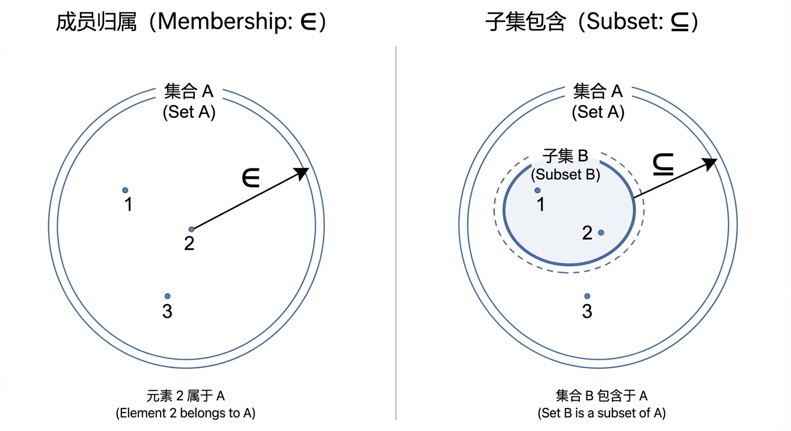
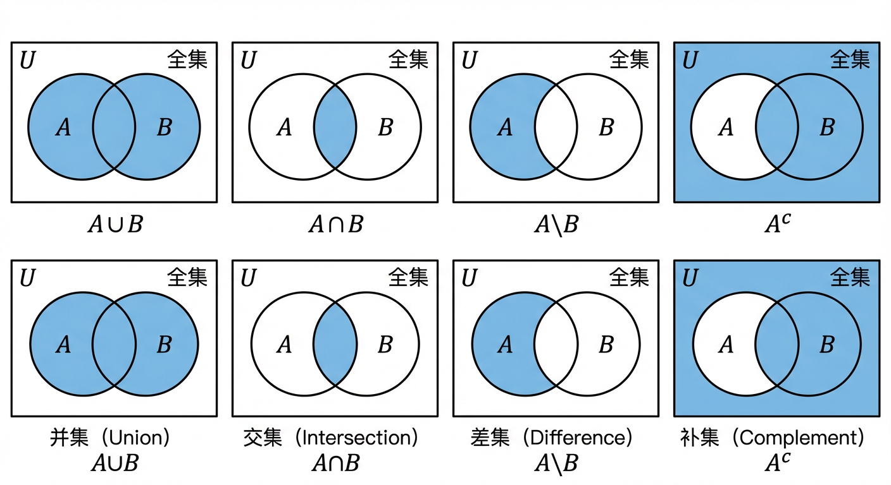
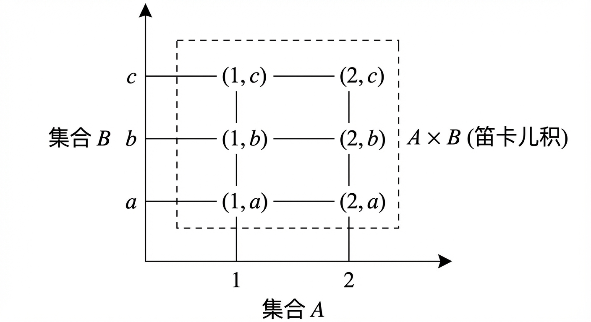
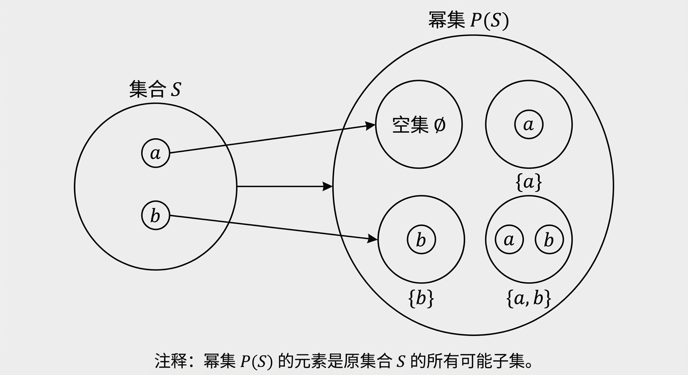
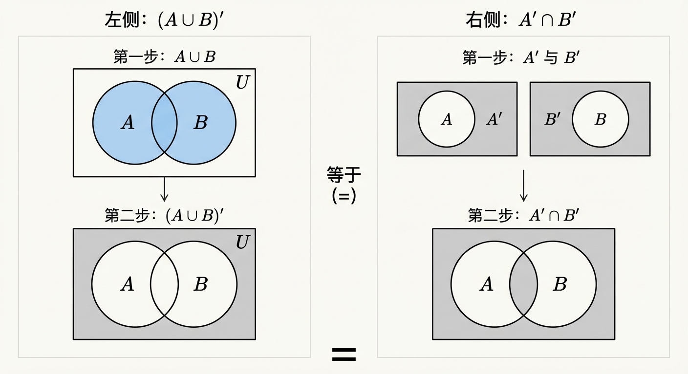
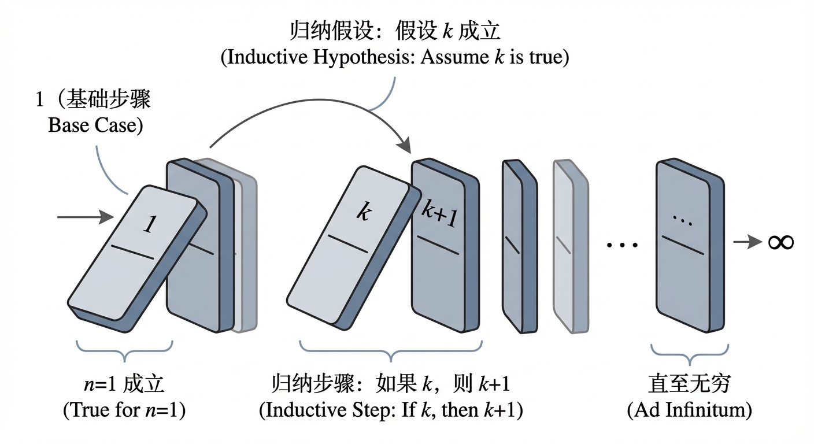
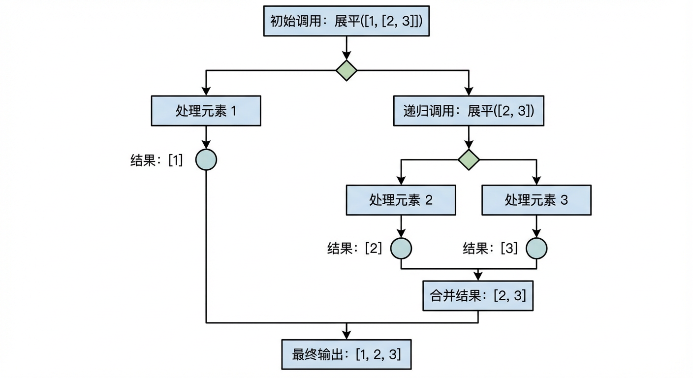
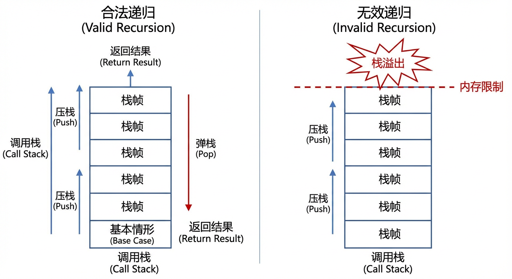

# 第1章：数学语言与证明方法

离散数学的学习路径有一个清晰的内在逻辑：先建立**可精确书写与阅读**的形式语言（符号），再用它去刻画最基础的研究对象（集合）并进行运算推演，继而上升到“如何论证”的层面（证明方法），最后再把归纳思想翻转为“如何生成对象”的层面（递归定义）。本章即沿着这条从“表达”到“推理”、再到“构造”的主线展开。下面进入各节内容。

---

## 1.1 常用的数学符号

在人类的自然语言中，充满了模糊与歧义。当我们说“有些学生很高”时，“有些”和“很高”的含义在不同语境下千差万别。然而，数学，特别是作为计算机科学基石的离散数学，追求的是一种无懈可击的精确性。为了构建理论大厦，进行严密推理，我们必须首先建立一套通用的、无歧义的书写体系。这套体系就是数学符号的语言。它不仅是节省笔墨的简写，更是思想的脚手架，使我们能够清晰地定义对象、描述操作、并陈述确定无疑的断言。

本节将作为我们进入离散数学世界的起点，统一后续所有定义、命题与证明所依赖的共同语法。我们将遵循“对象—操作—断言”这一符合人类认知的链条，逐步掌握这门语言的核心要素。

### 集合符号：构建数学对象的基元

离散数学所研究的一切，归根结底都是由最基本的元素——**集合 (Set)** ——所构建的。集合是我们这门新语言的“名词”。为了谈论集合，我们需要一套符号来描述它们以及它们与元素之间的关系。

**1. 归属与构造**

最核心的关系是**成员归属 (membership)**。我们用符号 $\in$ 表示一个元素属于一个集合，用 $\notin$ 表示不属于。例如，若 $A = \{1, 2, 3\}$，则 $2 \in A$ 为真，而 $4 \notin A$ 为真。这里需要特别注意区分**元素 (element)** 与**子集 (subset)**。一个集合 $B$ 是 $A$ 的子集，记作 $B \subseteq A$，意味着 $B$ 中的**每一个**元素都属于 $A$。例如，$\{1, 2\} \subseteq A$，但 $\{1, 2\} \notin A$，因为集合 $\{1, 2\}$ 本身并不是 $A$ 的一个成员。精确地区分 $\in$ 和 $\subseteq$ 是理解集合语言层级结构的关键。

除了用列举法（如 $A = \{1, 2, 3\}$）定义集合，一种更强大的方式是**描述法**，它使用**集合建构式符号 (set-builder notation)**。其通用形式为：
$$ \{ x \in D \mid P(x) \} $$
这表示“所有满足性质 $P(x)$ 的、来自论域 $D$ 的元素 $x$ 所构成的集合”。竖线 `|` 读作“使得 (such that)”，它左边是元素的代表，右边是该元素必须遵守的“入会规则”。例如，所有偶数构成的集合可以写成 $\{ n \in \mathbb{Z} \mid \exists k \in \mathbb{Z}, n=2k \}$。这种表示法将一个模糊的描述转化为一个精确的、可检验的逻辑条件。

**2. 常用集合与书写规范**

为方便起见，本书约定以下常用集合的符号：
*   $\mathbb{N}$：自然数集 $\{0, 1, 2, \dots\}$。（注意：不同教材对自然数是否包含 $0$ 有不同约定，本书约定包含 $0$）
*   $\mathbb{Z}$：整数集 $\{\dots, -2, -1, 0, 1, 2, \dots\}$。
*   $\mathbb{Q}$：有理数集。
*   $\mathbb{R}$：实数集。
*   $\emptyset$ 或 $\{\}$：**空集 (empty set)**，即不包含任何元素的集合。

在形式化系统中，符号的意义被严格规定，其构造本身也蕴含着深刻的思想。例如，在数理逻辑的基石——**皮亚诺算术 (Peano Arithmetic, PA)** 中，我们用一套极其简洁的语言符号 $\{0, S, +, \cdot\}$ 来构建整个算术世界。其中，$0$ 是唯一的常量符号，而 $S$ 是一元函数符号，代表“后继 (successor)”。在这个体系里，我们熟悉的自然数实际上是作为**项 (term)** 被构造出来的。数字 $1$ 的正式名称是 $S(0)$，数字 $2$ 是 $S(S(0))$，以此类推，数字 $n$ 的“规范名称”或**数码 (numeral)** 是 $S^n(0)$。这种构造方式看似繁琐，却至关重要。它确保了每一个自然数在我们的形式语言内部都有一个唯一、明确的表达，这是实现**算术化 (arithmetization)** ——即用自然数来编码数学公式和证明本身——的先决条件，也是后续探讨计算与逻辑极限的深刻结果（如哥德尔不完备性定理）的基石。

> **新增衔接说明**：上面我们用集合符号确立了“对象如何被命名与构造”。但仅有对象还不够：离散数学大量讨论“对象之间如何组合、如何变换”。因此下一小节引入运算符号，作为把对象连接成更复杂表达式的“动词”。这些表达式随后还将进入第1.2节，成为集合运算与集合恒等式的直接操作对象。

### 运算符号：组合与变换对象

有了表示对象的基本符号，我们接下来需要“动词”——即对这些对象进行操作的**运算符号 (operation symbols)**。

最常见的运算作用于集合之上：
*   **并集 (Union)** $\cup$：$A \cup B = \{x \mid x \in A \lor x \in B\}$。它对应于逻辑上的“或”。
*   **交集 (Intersection)** $\cap$：$A \cap B = \{x \mid x \in A \land x \in B\}$。它对应于逻辑上的“与”。
*   **差集 (Difference)** $\setminus$ 或 $-$：$A \setminus B = \{x \mid x \in A \land x \notin B\}$。它表示从 $A$ 中“挖掉”属于 $B$ 的部分。
*   **补集 (Complement)** $A^c$ 或 $\bar{A}$：在给定全集 $U$ 的上下文中，$A^c = U \setminus A = \{x \in U \mid x \notin A\}$。

这些运算符号可以将简单的集合组合成复杂的结构。例如，一个有限的几何形状，可以被看作是多个无限半平面的交集；而两条代数曲线的并集，如坐标轴系，可以用一个简洁的方程 $xy=0$ 来描述，其背后正是并集与逻辑“或”的深刻联系。

另一类重要的构造性运算是**笛卡儿积 (Cartesian product)**，用符号 $\times$ 表示。两个集合 $A$ 和 $B$ 的笛卡儿积定义为所有可能序对 $(a, b)$ 的集合，其中 $a \in A, b \in B$：
$$ A \times B = \{ (a, b) \mid a \in A \land b \in B \} $$
笛卡儿积是构建高维空间和复杂数据结构（如关系、函数和图）的基础。例如，我们熟悉的二维实数平面 $\mathbb{R}^2$ 正是 $\mathbb{R} \times \mathbb{R}$。

最后，还有用于表达大规模运算的**求和 ($\sum$)** 与**求积 ($\prod$)** 符号，它们是处理序列和级数不可或缺的工具。这些符号的使用都遵循严格的作用域、优先级和结合性规则，括号 `()` 在其中扮演着至关重要的角色，用以消除任何潜在的歧义。掌握这些运算符号，意味着我们具备了将自然语言描述的复杂操作，压缩为可计算、可推演的精确表达式的能力。

> **新增衔接说明**：当我们写下 $A\cup B$、$A\cap B$、$A\setminus B$ 这样的表达式时，本质上已经在用逻辑联结词（$\lor,\land,\neg$ 等）给集合“下定义”。因此，运算符号与逻辑符号之间存在天然的同构关系：集合代数往往就是逻辑代数的“集合版本”。这一对应关系将在第1.2节的集合恒等式中变得格外重要。

### 逻辑符号：形式化数学断言

拥有了“名词”（集合）和“动词”（运算）之后，我们还需要语法来构建完整的“句子”——即能够判断真假的**数学断言 (mathematical assertion)**。**逻辑符号 (logic symbols)** 正是这套语法的核心。

**1. 联结词与量词**

**命题联结词 (propositional connectives)** 用于连接更简单的命题，构成复合命题：
*   $\neg$ (或 $\sim$)：**否定 (negation)**，读作“非”。
*   $\land$ (或 $\cdot$)：**合取 (conjunction)**，读作“与”。
*   $\lor$ (或 $+$)：**析取 (disjunction)**，读作“或”。
*   $\to$：**蕴涵 (implication)**，读作“如果…则…”。$P \to Q$ 等价于 $\neg P \lor Q$。
*   $\leftrightarrow$：**等价 (biconditional)**，读作“当且仅当”。

然而，仅有联结词不足以表达离散数学中丰富的思想。我们需要**量词 (quantifiers)** 来进行推广：
*   $\forall$：**全称量词 (universal quantifier)**，读作“对于所有”。$\forall x P(x)$ 表示对于论域中所有元素 $x$，$P(x)$ 都为真。
*   $\exists$：**存在量词 (existential quantifier)**，读作“存在”。$\exists x P(x)$ 表示论域中至少存在一个元素 $x$，使得 $P(x)$ 为真。

量词的引入极大地增强了我们语言的表达能力。例如，我们可以用它精确定义集合的子集关系：$A \subseteq B \iff \forall x (x \in A \to x \in B)$。

**2. 符号的力量：表达复杂性与揭示极限**

逻辑符号的真正威力在于，它能够将抽象的、甚至反直觉的概念形式化，从而使我们能够对其进行严密的分析。这引发了我们对这门语言自身能力与边界的深刻思考。

一个经典的例子来自计算理论。我们可以用逻辑符号来精确表达“图灵机是否停机”这一基本问题。“机器 $e$ 在输入 $x$ 上停机”可以被形式化为一个**$\Sigma_1^0$ 公式**：
$$ H(e,x) \equiv \exists t \exists y \, H_{fin}(e,x,t,y) $$
这里，$H_{fin}$ 是一个（无量词的）可判定关系，表示“$y$ 是机器 $e$ 在输入 $x$ 上执行 $t$ 步的、合法的、且最终停机的计算历史的编码”。这个公式的结构——一个存在量词后跟一个可判定的核心——精准地捕捉了“停机”这一性质的验证方式：我们只需找到一个具体的停机时刻 $t$ 和计算历史 $y$ 即可。反之，“机器 $e$ 在输入 $x$ 上永不停机”则是一个**$\Pi_1^0$ 公式**：
$$ NH(e,x) \equiv \forall t \forall y \, \neg H_{fin}(e,x,t,y) $$
这种表达方式不仅是对停机问题的精确描述，其符号结构本身（$\exists$ vs. $\forall$）也揭示了这两类问题在计算复杂性上的根本不对称性，这是后续学习可计算性理论的关键。

更进一步，这套强大的符号语言甚至能反思其自身的局限性。通过**哥德尔编码 (Gödel numbering)**，我们可以为语言中的每一个符号、公式和证明分配一个唯一的自然数，记作 $\ulcorner\varphi\urcorner$。这使得算术语言能够谈论其自身的语法结构。一个自然的问题随之而来：我们能否在该语言内部定义一个“真理谓词” $T(x)$，使得对于任何句子 $\varphi$，“$T(\ulcorner\varphi\urcorner)$ 为真” 当且仅当 “$\varphi$ 为真”？这可以写作**塔斯基双条件句 (Tarski's biconditional)**：
$$ T(\ulcorner\varphi\urcorner) \leftrightarrow \varphi $$
波兰逻辑学家阿尔弗雷德·塔斯基 (Alfred Tarski) 证明了一个惊人的结论：对于任何足以表达基本算术的语言，这样的真理谓词 $T(x)$ 是**不可定义 (undefinable)** 的。其证明的核心，正是利用了语言的自我指涉能力：假设存在这样一个 $T(x)$，我们便可以构造出一个“说谎者句子” $\lambda$，它断言自身的虚假，即 $\lambda \leftrightarrow \neg T(\ulcorner\lambda\urcorner)$，从而导出逻辑矛盾。这个结果雄辩地证明了任何足够丰富的形式语言，其表达能力都存在着内在的、不可逾越的边界。

### 小结

在本节中，我们初步建立了一套用于离散数学的符号语言。我们遵循“对象（集合符号）—操作（运算符号）—断言（逻辑符号）”的认知路径，约定了这门语言的基本词汇和语法规则。这些符号远非简单的速记，它们是一套精确、强大且具有深刻内涵的工具。它不仅使我们能够无歧义地描述离散结构、定义复杂的计算过程，甚至赋予我们审视语言自身能力与极限的哲学视角。

我们看到，一个简单的数码 $S^n(0)$ 如何为数论的形式化奠定基础；量词的交替如何刻画了计算问题的内在难度；而对语言自身的反思，又如何揭示了真理的不可定义性。这些例子提醒我们，掌握数学符号，不仅是学会“读”与“写”，更是理解一种独特的思维方式的开始。

这套符号语法将是我们贯穿全书的通用语言。在下一节中，我们将运用这门语言，正式开始系统地探索离散数学最核心的研究对象——集合，以及其上的各种运算与关系。我们将从“会读会写”迈向“能用符号进行计算与证明”的全新阶段。

> **新增过渡段落（通向1.2）**：第1.1节解决的是“如何把概念说清楚”。但数学不仅要“说清楚”，还要“算得动、推得动”。第1.2节将把第1.1节引入的集合对象与运算符号真正组织成一套可操作的系统：通过集合的表示、包含与相等、幂集、集合运算以及恒等式，把自然语言条件转为可演算的形式，并为后面第1.3节的“证明方法”提供大量可练习的证明载体。

---

## 1.2 集合及其运算

在上一节中，我们为数学的精确表达建立了符号体系。现在，我们将运用这套语法，从符号的识读转向对数学世界最基本“原子”——集合——的操作与推理。集合（Set）这一概念，其核心思想异常朴素：将一些明确、相异的对象汇集成一个整体。然而，正是从这个看似简单的原点出发，整个离散数学乃至现代数学的宏伟大厦得以构建。本节将引导我们系统地探索集合的表示方法、集合之间的关系、构造更复杂集合的途径，并最终建立一套行之有效的“集合代数”，使我们能够像解方程一样对逻辑条件进行推演与化简。

### 集合及其表示法

在数学中，一个**集合**是若干确定的、可相互区分的对象的汇集，这些对象被称为集合的**元素**（Element）。定义集合的关键在于其**确定性**（对于任何一个对象，我们都能明确判断它是否属于该集合）与**互异性**（集合中的元素不重复）。此外，集合是**无序的**，元素的排列顺序无关紧要。

为了精确地描述一个集合，我们通常采用以下两种方法：

1.  **列举法**（Roster Method）：当集合的元素有限且易于列出时，我们直接将所有元素写在大括号 `{}` 内，以逗号分隔。例如，构成单词 `wolf` 的字母集合可表示为 $A = \{w, o, l, f\}$。由于元素的无序性和互异性，它也等同于集合 $\{f, o, l, w\}$。

2.  **描述法**（Set-Builder Notation）：当集合元素无限，或其共性比个体更重要时，我们采用描述法。其标准形式为 $\{ x \mid P(x) \}$，其中 `x` 代表集合中的任意元素，`|`（或冒号 `:`）读作“满足”，`P(x)` 是一个关于 `x` 的逻辑陈述，精确描述了元素应具备的性质。例如，所有偶数构成的集合可以表示为 $E = \{ x \mid x \in \mathbb{Z} \land x \text{ 是 2 的倍数} \}$。

元素与集合之间的关系用**隶属关系符号**（Membership Symbol）$\in$ 表示。$x \in A$ 读作“$x$ 属于 $A$”，而 $x \notin A$ 读作“$x$ 不属于 $A$”。

在讨论集合时，我们总是默认在一个特定的上下文环境中，这个环境包含了我们所关心的一切可能元素，我们称之为**全集**（Universal Set），记作 $U$。与之相对的，一个不包含任何元素的特殊集合被称为**空集**（Empty Set），记作 $\emptyset$ 或 `{}`。

**可视化：维恩图（Venn Diagrams）**

为了直观地理解集合间的关系，我们常常借助**维恩图**。通常，一个矩形代表全集 $U$，而集合则用其中的圆或其它封闭曲线表示。然而，维恩图作为一种辅助直觉的工具，其表达能力是有限的。例如，一个基础的集合论公理断言：空集是任何集合的子集，即对任意集合 $A$，$\emptyset \subseteq A$ 恒成立。我们如何在维恩图中描绘这一事实？我们是否应该在代表 $A$ 的圆内画一个更小的、标记为 $\emptyset$ 的圆？这样做会错误地暗示 $\emptyset$ 是一个占据“空间”的区域，甚至可能被误解为 $A$ 的一个非空子集。或者，在 $A$ 区域内画一个点来代表 $\emptyset$？这会更严重地误导我们，因为它表达的是 $\emptyset \in A$（空集是 $A$ 的一个元素），这与 $\emptyset \subseteq A$ 是完全不同的两个概念，前者通常不成立。

正确的理解是：$\emptyset \subseteq A$ 是一个无需、也无法在维恩图上通过特定图形来表示的普适逻辑真理。它内在于集合论的定义之中，是我们进行集合推理时的一个基本公理，而非一个需要被“看见”的图形关系。这个例子提醒我们，虽然可视化工具很有帮助，但严格的数学推理最终必须回归到形式化的定义与逻辑本身。

> **新增衔接说明**：一旦集合能被精确定义与识别，下一步自然是比较两个集合的“关系强弱”：一个集合是否包含另一个？两个集合何时算作“相同”？这些问题将把第1.1节的量词与蕴涵（如 $\forall x(\cdot\to\cdot)$）直接用到集合语言中，从而进入1.2.2。

### 集合之间的关系：包含与相等

有了集合的精确表示，我们便可以探讨它们之间的关系。最重要的两种关系是包含与相等。

**子集**（Subset），记作 $\subseteq$。若集合 $A$ 的每一个元素都是集合 $B$ 的元素，则称 $A$ 是 $B$ 的子集，记作 $A \subseteq B$。形式化地：
$$ A \subseteq B \iff \forall x (x \in A \rightarrow x \in B) $$
如果 $A \subseteq B$ 且 $A \neq B$，则称 $A$ 是 $B$ 的**真子集**（Proper Subset），记作 $A \subset B$。

**集合相等**（Set Equality），记作 $=$。两个集合 $A$ 和 $B$ 相等，当且仅当它们含有完全相同的元素。这被称为**外延性原则**（Principle of Extensionality），它强调决定一个集合的唯一标准是它的成员，而非其描述方式或表示顺序。

要证明两个集合相等，最基本也最重要的方法是**双重包含法**（Double-Inclusion Method）。该方法依据以下逻辑等价关系：
$$ A = B \iff (A \subseteq B \land B \subseteq A) $$
这意味着，证明 $A=B$ 的任务被分解为两个独立的子任务：首先证明 $A$ 是 $B$ 的子集，然后证明 $B$ 是 $A$ 的子集。这一方法为所有关于集合相等的证明提供了一个清晰、可执行的流程，我们将在后续的证明方法学习中反复运用它。

> **新增衔接说明**：当我们学会了“比较集合”（包含与相等）后，便可以进一步把“集合本身作为元素”来研究，从而形成新的对象层级。幂集就是这种抽象跃迁的典型例子：它把“所有子集”收拢为一个新集合，并将1.2.2中的 $\subseteq$ 关系内化为幂集的成员条件（见 $\mathcal{P}(S)=\{A\mid A\subseteq S\}$）。这将引向1.2.3。

### 幂集：集合的集合

我们不仅可以讨论由具体对象构成的集合，还可以将集合本身作为元素，构建“集合的集合”。其中最重要的一种构造是**幂集**（Power Set）。

对于任意集合 $S$，其所有子集构成的集合被称为 $S$ 的幂集，记作 $\mathcal{P}(S)$ 或 $2^S$。形式化定义为：
$$ \mathcal{P}(S) = \{ A \mid A \subseteq S \} $$
幂集的概念，本质上是在探究一个给定集合所能提供的“所有可能性”。让我们从最简单的情况开始：
- 对于空集 $\emptyset$，它唯一的子集就是它自身，因此 $\mathcal{P}(\emptyset) = \{ \emptyset \}$。
- 对于单元素集合 $\{a\}$，它有两个子集：$\emptyset$ 和 $\{a\}$，因此 $\mathcal{P}(\{a\}) = \{ \emptyset, \{a\} \}$。

当我们构造一个子集时，对于原集合中的每一个元素，我们都面临一个二元选择：将它包含进子集，还是不包含。如果一个集合 $S$ 有 $n$ 个元素，我们就需要做 $n$ 次独立的二元选择。根据乘法法则，总共的可能性数量为 $2 \times 2 \times \dots \times 2$（$n$ 次），即 $2^n$。这揭示了幂集基数的基本规律：
$$ \text{若 } |S| = n, \text{ 则 } |\mathcal{P}(S)| = 2^n $$
这种指数级的增长是惊人的。例如，我们可以通过迭代构造幂集来观察这一现象。设 $S_1 = \emptyset$，其基数为 $|S_1|=0$。它的幂集 $S_2 = \mathcal{P}(S_1) = \{\emptyset\}$，基数为 $|S_2| = 2^0 = 1$。$S_2$ 的幂集 $S_3 = \mathcal{P}(S_2) = \{\emptyset, \{\emptyset\}\}$，基数为 $|S_3| = 2^1 = 2$。可以看到，即使从虚无开始，集合的层级也会以惊人的速度在规模上爆炸式增长。这一思想由数学家康托（Georg Cantor）推广至无限集合，最终导向了“无穷大存在不同等级”这一革命性结论。

值得注意的是，幂集是训练我们精确区分隶属关系（$\in$）和包含关系（$\subseteq$）的最佳场所。对于集合 $S=\{a, b\}$，它的幂集是 $\mathcal{P}(S) = \{\emptyset, \{a\}, \{b\}, \{a, b\}\}$。在这里，$\{a\}$ 是 $S$ 的一个子集（$\{a\} \subseteq S$），但同时，它也是幂集 $\mathcal{P}(S)$ 的一个**元素**（$\{a\} \in \mathcal{P}(S)$）。混淆这两个符号是初学者常见的错误，必须通过细致的辨析加以克服。

> **新增衔接说明**：幂集让我们看到“集合的集合”这一层级结构，但要真正对集合进行推理与化简，还必须掌握集合的基本运算规则。接下来1.2.4将系统列出并集、交集、补集、差集等运算，并展示它们如何将自然语言条件翻译为可演算的符号表达；这些运算随后在1.2.5中会进一步抽象为恒等式体系。

### 基本集合运算

如果说集合是数学语言的名词，那么集合运算就是其动词。它们使我们能够组合、修改和比较集合，从而表达复杂的思想。

- **并集**（Union, $\cup$）：$A \cup B = \{ x \mid x \in A \lor x \in B \}$。它包含所有属于 $A$ 或属于 $B$ 的元素。
- **交集**（Intersection, $\cap$）：$A \cap B = \{ x \mid x \in A \land x \in B \}$。它包含所有同时属于 $A$ 和 $B$ 的元素。
- **补集**（Complement, $A^c$ or $\bar{A}$）：$A^c = \{ x \in U \mid x \notin A \}$。它包含全集 $U$ 中所有不属于 $A$ 的元素。
- **差集**（Difference, $\setminus$）：$A \setminus B = \{ x \mid x \in A \land x \notin B \}$。它包含所有属于 $A$ 但不属于 $B$ 的元素。

这些运算提供了一种强大的形式化语言，能将自然语言中的逻辑条件精确地转化为数学表达式。例如，考虑一个实验室的安全警报系统，它监控三个条件：门是否打开（$D$）、是否为夜间（$N$）以及一扇窗户是否打开（$W$）。如果警报逻辑是“当门打开且为夜间，或者窗户被打开时，警报响起”，我们可以将这三种条件看作三个集合，警报触发的状态集合 $L$ 就可以精确地表示为：
$$ L = (D \cap N) \cup W $$
这种从自然语言到集合表达式的翻译，是离散数学应用的核心技能之一。

除了上述基本运算，我们还可以定义一些非常有用的派生运算。**对称差**（Symmetric Difference），记作 $A \Delta B$，定义为所有属于 $A$ 或 $B$ 中恰好一个集合的元素构成的集合。它在逻辑上对应于“异或”（XOR）。它有几个等价的定义：
$$ A \Delta B = (A \setminus B) \cup (B \setminus A) = (A \cup B) \setminus (A \cap B) $$
我们将在下一节看到，对称差拥有非常优美的代数性质。

此外，我们还能构造包含更复杂元素的新集合。**笛卡尔积**（Cartesian Product），记作 $A \times B$，是所有可能的**有序对**（ordered pair）$(a, b)$ 构成的集合，其中 $a \in A$ 且 $b \in B$。有序对与集合的关键区别在于其次序性，即当 $a \neq b$ 时，$(a, b) \neq (b, a)$。因此，笛卡尔积通常是不可交换的。这个概念是后续章节中学习关系和函数的基础。读者应在此处建立一个重要的警惕：处理不同类型的数学构造时，直觉可能会失效。例如，$\mathcal{P}(A \times B)$ 与 $\mathcal{P}(A) \times \mathcal{P}(B)$ 这两个表达式看起来相似，但它们代表着完全不同的事物。前者是一个由“有序对的集合”构成的集合，而后者是一个由“集合的有序对”构成的集合。它们的元素类型完全不同，因此绝无可能相等。这告诫我们，在数学中，对定义的精确把握至关重要。

> **新增衔接说明**：掌握运算定义之后，接下来关心的就是“这些运算是否像加法乘法那样满足规律”。一方面，这些规律使我们能像代数化简一样化简集合表达式；另一方面，它们也提供了大量适合训练证明技巧的命题（如交换律、分配律、德摩根律等），将直接服务于第1.3节的证明方法学习。于是我们进入1.2.5的集合恒等式体系。

### 集合恒等式及其应用

正如算术有加法和乘法的运算法则，集合运算也遵循一套严谨的代数定律，我们称之为**集合恒等式**（Set Identities）。掌握这些恒等式，能让我们通过符号演算来证明集合的相等或包含关系，从而避免了每次都回到元素层面进行冗长的逻辑论证。

为了构建一套优雅的代数体系，我们首先需要统一运算的基础。差集运算 $A \setminus B$ 可以通过交集和补集来定义，这成为连接各种恒等式的桥梁：
$$ A \setminus B = A \cap B' $$
有了这个基础，我们便可引入集合代数的核心定律，其中包括：

- **交换律**：$A \cup B = B \cup A$, $A \cap B = B \cap A$
- **结合律**：$(A \cup B) \cup C = A \cup (B \cup C)$, $(A \cap B) \cap C = A \cap (B \cap C)$
- **分配律**：$A \cap (B \cup C) = (A \cap B) \cup (A \cap C)$, $A \cup (B \cap C) = (A \cup B) \cap (A \cup C)$
- **德摩根定律**（De Morgan's Laws）：$(A \cup B)' = A' \cap B'$, $(A \cap B)' = A' \cup B'$

- **其他基本律**：包括**恒等律**（如 $A \cup \emptyset = A$）、**零律**（如 $A \cap \emptyset = \emptyset$）、**幂等律**（$A \cup A = A$）以及**补集律**（$A \cup A' = U$, $(A')' = A$）。

这些恒等式为我们提供了一个强大的工具箱，用以化简复杂的集合表达式。例如，考虑表达式 $[(A \cup A^c) \cap (A \setminus A)]^c$。直接分析其含义颇为费力，但通过代数演算，化简过程一目了然：
$$ [(A \cup A^c) \cap (A \setminus A)]^c = [U \cap \emptyset]^c = [\emptyset]^c = U $$
每一步都严格依据一条基本定律，最终将一个复杂的表达式还原为其最简单的本质——全集 $U$。

对称差运算 $\Delta$ 的代数性质尤为突出。它满足交换律、结合律，并且拥有单位元（$\emptyset$）和逆元（每个集合自身都是其逆元，即 $A \Delta A = \emptyset$）。这些性质使得 $(\mathcal{P}(U), \Delta)$ 构成了一个称为**阿贝尔群**（Abelian Group）的代数结构，这为我们开启了通往第14章“代数系统”的一扇窗。这些优良性质使得化简包含对称差的表达式异常便捷。例如，表达式 $((A \Delta B) \Delta (A \Delta \emptyset)) \cup (B \cap U)$ 可以如下化简：
$$ ((A \Delta B) \Delta (A \Delta \emptyset)) \cup (B \cap U) = ((A \Delta B) \Delta A) \cup B = (A \Delta A \Delta B) \cup B = (\emptyset \Delta B) \cup B = B \cup B = B $$
整个过程如同解代数方程一样流畅，彰显了抽象结构的力量。更进一步，可以证明，将交集运算 $\cap$ 视为“乘法”，对称差 $\Delta$ 视为“加法”，那么幂集 $\mathcal{P}(U)$ 就构成了一个**交换环**（Commutative Ring）。

最后，我们必须审视这些恒等式在应用于幂集等高级构造时的行为。通过严谨的证明可以发现，幂集运算与交集运算可以完美地“分配”：
$$ \mathcal{P}(A \cap B) = \mathcal{P}(A) \cap \mathcal{P}(B) $$
然而，对于并集，我们只能得到一个包含关系，而非等式：
$$ \mathcal{P}(A) \cup \mathcal{P}(B) \subseteq \mathcal{P}(A \cup B) $$
等号通常不成立，因为当 $A$ 和 $B$ 互有不属于对方的元素时，它们的并集 $A \cup B$ 会产生一些“混合”了 $A$ 和 $B$ 元素的子集，这些子集无法在 $\mathcal{P}(A)$ 或 $\mathcal{P}(B)$ 中找到。这再次提醒我们，数学的严谨性要求我们审慎地对待每一步推广，依赖证明而非直觉。

### 小结

本节中，我们完成了从认识集合到运用集合进行推理的关键一步。我们首先规范了集合的表示法，并探讨了集合间的两种基本关系：包含与相等，确立了“双重包含”作为证明相等的黄金法则。接着，通过引入幂集，我们进行了一次重要的抽象跃迁，开始探讨“集合的集合”，并理解了其基数的指数增长规律。

在此基础上，我们系统地定义了并、交、补、差以及对称差等集合运算，并将它们视为构建复杂逻辑条件的工具。这自然地引出了本节的核心——集合恒等式。这些恒等式构成了集合的“代数”，为我们提供了除元素级论证之外的另一条高效推理路径：通过符号演算来化简表达式和证明等价性。

本节所学的知识，是后续学习的坚实基础。一方面，这里建立的集合论证方法，特别是双重包含法和代数演算法，将成为下一节“证明方法概述”中诸多通用技巧的具体实例。另一方面，我们建立的这套集合语言及其代数规则，与第二章“命题逻辑”中的逻辑等价演算形成了深刻的同构关系，它们都是布尔代数这一更深层结构的体现。最终，我们在本节中定义和操作的各种对象——集合、子集、有序对——将成为第四章“关系”和第五章“函数”等后续章节探讨的核心。可以说，掌握集合论，就如同掌握了一门能够精确描述和探索整个离散世界的通用语言。

> **新增过渡段落（通向1.3）**：至此我们已经拥有了大量“可陈述的命题”：例如集合恒等式、包含关系、关于幂集的等式/包含式等。下一步关键问题是：当我们面对一个断言时，应该如何选择证明路径？第1.3节将把第1.1节的逻辑结构（尤其是蕴涵、否定、量词）与第1.2节的具体数学对象结合，形成一套可复用的证明策略体系。

---

## 1.3 证明方法概述

在前面的小节中，我们已经熟悉了离散数学的基本“词汇”——数学符号，以及基本的“名词”与“动词”——集合及其运算。现在，我们将进入这门语言的核心：如何构建一篇令人信服的“文章”，即数学证明。一个证明远非直觉的简单断言，它是一座由逻辑规则精心搭建的、坚不可摧的建筑，其每一个环节都必须接受最严苛的检验。本节的目标，便是引导你从被动地接受数学事实，过渡到主动地、有条理地论证这些事实。我们将从最基本的证明策略出发，逐步探索各种方法的适用场景与内在逻辑，为你后续的理论学习与研究，奠定稳固的论证基石。

### 直接证明与间接证明

数学中的许多命题都呈现为“如果 P，则 Q”的蕴含形式，记作 $P \to Q$。其中，$P$ 是前提或假设，$Q$ 是结论。证明此类命题最符合人类思维习惯的路径，便是从前提 $P$ 出发，通过一系列逻辑上无懈可击的推演，最终抵达结论 $Q$。这便是**直接证明法 (Direct Proof)**。它如同一条清晰的线性路径，引导我们从已知走向未知。

然而，在逻辑的迷宫中，直线未必总是最短或最易通行的路径。有时，直接从 $P$ 出发可能线索繁杂，无从下手。此时，我们需要更具策略性的间接方法。

#### 逆否证法：换个视角看问题

逻辑等价定律告诉我们，一个蕴含命题 $P \to Q$ 与其**逆否命题 (Contrapositive)** $\neg Q \to \neg P$ 是完全等价的。这意味着，证明“如果 $Q$ 不成立，那么 $P$ 也不成立”就等同于证明了“如果 $P$ 成立，那么 $Q$ 成立”。这就是**逆否证法 (Proof by Contrapositive)** 的精髓。当结论 $Q$ 的否定形式比前提 $P$ 的原始形式更具体、更易于操作时，这种方法尤为有效。

例如，考虑命题：“对于任意函数 $f: \mathbb{R} \to \mathbb{R}$，如果 $f$ 在 $\mathbb{R}$ 上是无界的，那么它的极限 $\lim_{x \to \infty} f(x)$ 不存在。” 直接从“函数在所有 $[M, \infty)$ 区间上无界”这个复杂的条件出发，去论证“极限不存在”，在逻辑上颇为曲折。

让我们尝试逆否证法。该命题的形式为 $P \to Q$，其中：
- $P$: 函数 $f$ 在每一个形如 $[M, \infty)$ 的区间上都无界。
- $Q$: 极限 $\lim_{x \to \infty} f(x)$ 不存在。

其逆否命题 $\neg Q \to \neg P$ 则为：“如果极限 $\lim_{x \to \infty} f(x)$ 存在，那么存在某个区间 $[M, \infty)$ 使得 $f$ 在其上有界。” 这个新命题的证明路径就清晰多了。假设极限存在且为 $L$，即 $\lim_{x \to \infty} f(x) = L$。根据极限的定义，对于任意给定的 $\varepsilon > 0$，总能找到一个实数 $M$，使得所有 $x > M$ 都满足 $|f(x) - L| < \varepsilon$。我们不妨取 $\varepsilon=1$。那么，存在一个 $M$，对于所有 $x > M$，我们有 $|f(x)| < |L| + 1$。这恰恰说明了函数 $f$ 在区间 $(M, \infty)$ 上是有界的。我们成功地从 $\neg Q$ 推导出了 $\neg P$。由于逆否命题成立，原命题也必然成立。

#### 归谬法：将谬误推向深渊

在所有证明方法中，最具戏剧性与力量的，或许当属**归谬法 (Proof by Contradiction)**，又称反证法。它的策略大胆而深刻：为了证明一个命题 $P$ 为真，我们先假设它是假的（即 $\neg P$ 为真）。然后，从这个“谎言”出发，进行滴水不漏的逻辑推理，直至得出一个荒谬绝伦的结论——这个结论与已知公理、定义或前提相矛盾，我们称之为导出**矛盾 (Contradiction)**，记作 $\bot$。

如果我们的推理过程无懈可击，那么唯一的解释就是：我们最初的假设 $\neg P$ 本身就是错误的。因此，$P$ 必须为真。这好比一个逻辑陷阱：我们邀请一个错误的前提进入，然后看着它在逻辑的迷宫中自我毁灭。

一个经典的例子是证明“一个有理数与一个无理数的和必为无理数”。设 $r$ 是有理数，$x$ 是无理数，我们要证明它们的和 $S = r+x$ 是无理数。
我们用归谬法，假设结论不成立，即假设 $S$ 是有理数。设 $S = r'$，其中 $r'$ 也是一个有理数。于是我们有 $r' = r+x$。通过简单的代数变形，我们得到 $x = r' - r$。根据有理数的封闭性，两个有理数的差仍然是有理数。这意味着 $x$ 是一个有理数。但这与我们的初始前提“$x$ 是无理数”直接矛盾。这个矛盾源于我们最初的假设“$S$ 是有理数”。因此，该假设必须为假，结论“$S$ 是无理数”必然为真。

值得注意的是，归谬法与逆否证法在形式上有所不同。逆否证法专门用于证明蕴含式 $P \to Q$，其结构是“假设 $\neg Q$，推出 $\neg P$”。而归谬法则更为通用，它可以用来证明任何形式的命题 $P$。在证明蕴含式 $P \to Q$ 时，归谬法的结构是“同时假设 $P$ 和 $\neg Q$，然后导出一个矛盾”。

#### 逻辑深度：经典逻辑与构造性思维的分野

深入探讨归谬法，我们会触及一个深刻的逻辑分野。在经典的数学逻辑体系中，从“假设 $\neg P$ 导致矛盾”直接跳到“结论 $P$ 为真”，依赖于一个称为**排中律 (Law of Excluded Middle)** 的基本公理，即对于任何命题 $P$，$P \lor \neg P$ 必为真。与之等价的，是**双重否定消除律 (Double Negation Elimination)**，即 $\neg\neg P \to P$。

然而，在以**构造主义 (Constructivism)** 或**直觉主义 (Intuitionism)** 为代表的数学哲学流派中，排中律和双重否定消除律不被普遍接受。在这些体系看来，一个证明必须能“构造”出所声称的对象。从这个角度看，当“假设 $\neg P$”导致矛盾时，我们仅仅是拒绝了 $\neg P$，即证明了 $\neg\neg P$。但从 $\neg\neg P$ 到 $P$ 的飞跃，并非总是构造性的。

让我们想象一个由直觉主义逻辑驱动的自动定理证明器。一位习惯于经典逻辑的工程师想证明某个系统的安全属性 $S$。他成功地向证明器展示了“假设系统不安全 ($\neg S$)”会导致矛盾，即他证明了 $\neg S \to \bot$。根据否定的定义（$\neg A \equiv A \to \bot$），他实际上证明了 $\neg\neg S$。在经典逻辑中，这足以得出 $S$ 为真。然而，这个基于直觉主义的证明器会拒绝这最后一步，因为它并没有“构造”出一个 $S$ 为真的直接证据，而仅仅是驳斥了 $S$ 为假的可能。这个例子提醒我们，即使是“证明”这一概念，在不同的逻辑框架下也有着不同的内涵和标准。我们本书默认采用的是包含排中律的经典逻辑体系，但在后续关于计算理论的讨论中，这种构造性思维将变得至关重要。

### 结构化策略：分情况与构造

面对复杂的命题，单靠线性的或间接的推理可能不足以理清头绪。此时，我们需要更具结构化的策略，将一个大问题分解为若干个可控的子问题，或通过显式构建一个例子来完成证明。

#### 分情况证明法：分而治之的艺术

**分情况证明法 (Proof by Cases)**，或称穷举证明法，是一种将问题分解的强大工具。它的逻辑基础是命题逻辑中的析取消除规则：如果我们知道 $P_1 \lor P_2 \lor \dots \lor P_k$ 为真，并且我们能证明在每一种情况 $P_i$ 下结论 $Q$ 都成立（即 $P_i \to Q$ 对所有 $i$ 都成立），那么我们就可以断定 $Q$ 为真。运用此法的关键在于，找到一组完备的（无遗漏）、最好是互斥的（无重叠）分类标准。

数论是分情况证明的天然舞台。例如，要证明“对于任意整数 $n$，$n^2$ 除以 4 的余数只能是 0 或 1”，我们可以基于整数的**奇偶性 (Parity)** 进行分类：
- **情况 1：$n$ 是偶数。** 设 $n=2k$，则 $n^2 = (2k)^2 = 4k^2$。此数能被 4 整除，余数为 0。
- **情况 2：$n$ 是奇数。** 设 $n=2k+1$，则 $n^2 = (2k+1)^2 = 4k^2+4k+1 = 4(k^2+k)+1$。此数除以 4 余数为 1。

由于任何整数非偶即奇，这两种情况覆盖了所有可能性。因此，我们证明了结论。这个小小的结论威力巨大，例如，它可以立即推断出满足 $a^2+b^2=c^2$ 的勾股数三元组 $(a, b, c)$ 中，$a$ 和 $b$ 不可能同时为奇数。因为如果它们都是奇数，那么 $a^2 \equiv 1 \pmod 4$ 且 $b^2 \equiv 1 \pmod 4$，导致 $c^2 = a^2+b^2 \equiv 2 \pmod 4$。但这与我们刚证明的“任何平方数模 4 的余数都不可能是 2”相矛盾。

在图论中，分情况证明同样核心。著名的拉姆齐理论断言：在任意 6 个人的聚会中，总能找到 3 个人互相认识，或者 3 个人互相不认识。其证明是分情况思想的典范。任选一人 $v$，根据鸽巢原理，他与其他 5 人之间，至少有 3 人是他认识的，或者至少有 3 人是他不认识的。这便构成了两个主要情况，每种情况下再进行简单的子情况分析，都能最终找到所求的单色三人组。

#### 构造性证明法：用实例说话

许多数学命题断言某种对象的“存在性”，例如“存在一个满足性质 P 的数 x”。证明此类命题最令人信服的方式，莫过于直接把这个对象“构造”出来，并验证它确实满足性质 P。这就是**构造性证明法 (Constructive Proof)**。

与此相对的是**非构造性证明 (Non-constructive Proof)**，它虽然能通过逻辑推断（通常是归谬法）证明对象必然存在，但并不提供找到该对象的方法。

让我们通过一个精妙的例子来体会二者的差异。考虑命题：“存在无理数 $a$ 和 $b$，使得 $a^b$ 是有理数。”

下面是一个非构造性证明：
令 $a=\sqrt{2}$， $b=\sqrt{2}$。我们知道 $\sqrt{2}$ 是无理数。现在考虑 $a^b = \sqrt{2}^{\sqrt{2}}$。根据排中律，这个数要么是有理数，要么是无理数。
- **情况 1：** 如果 $\sqrt{2}^{\sqrt{2}}$ 是有理数，那么我们已经找到了满足条件的 $a$ 和 $b$（即 $a=\sqrt{2}, b=\sqrt{2}$）。
- **情况 2：** 如果 $\sqrt{2}^{\sqrt{2}}$ 是无理数，那么我们令 $a' = \sqrt{2}^{\sqrt{2}}$ （一个无理数）和 $b' = \sqrt{2}$ （一个无理数）。此时 $a'^{b'} = (\sqrt{2}^{\sqrt{2}})^{\sqrt{2}} = \sqrt{2}^{(\sqrt{2} \cdot \sqrt{2})} = \sqrt{2}^2 = 2$，而 2 是一个有理数。在这种情况下，我们也找到了一对满足条件的无理数 $a'$ 和 $b'$。

由于这两种情况穷尽了所有可能，且每种情况都导向了肯定的结论，我们证明了命题为真。但请注意，这个证明并未明确告诉我们，究竟是 $(\sqrt{2}, \sqrt{2})$ 这对，还是 $(\sqrt{2}^{\sqrt{2}}, \sqrt{2})$ 这对是我们寻找的答案。它只保证了“其中必有一对是”。

构造性证明在计算机科学中具有特殊地位。一个算法本质上就是对其所解决问题的一个构造性证明。例如，用于在有限维空间中将一组线性无关向量转换为标准正交基的**格拉姆-施密特算法 (Gram-Schmidt Algorithm)**，就是“任何有限维内积空间都存在标准正交基”这一命题的构造性证明。相比之下，在无限维空间中证明基的存在性，则往往需要依赖如**佐恩引理 (Zorn's Lemma)** 这类非构造性的公理。

这种区别的意义远超理论层面。设想一个非构造性证明显示“P=NP”（一个计算复杂性理论中的核心猜想）为真，它仅仅告诉我们对于所有 NP 问题都**存在**一个多项式时间的解法，但完全没有给出找到这个解法的方法，甚至连其复杂度的具体阶数都无法确定。对于实践者而言，这样的证明虽然是革命性的，但在短期内无法带来任何可执行的算法。这凸显了构造性证明在算法设计与工程实践中的核心价值。

### 数学归纳法：驯服无穷的阶梯

我们如何证明一个命题对所有自然数 $n=1, 2, 3, \dots$ 都成立？我们不可能逐一检验，因为自然数是无穷的。**数学归纳法 (Mathematical Induction)** 为这个无穷问题提供了一个优雅而强大的解决方案，它如同一副可以延伸至天际的逻辑阶梯。

其原理分为两步：
1.  **基础步骤 (Base Case):** 证明命题对起始值（通常是 $n=0$ 或 $n=1$）成立。这相当于证明我们能安全地踏上阶梯的第一级。
2.  **归纳步骤 (Inductive Step):** 证明**如果**命题对任意一级 $k$ 成立（这个“如果”被称为**归纳假设 (Inductive Hypothesis)**），那么它也必然对下一级 $k+1$ 成立。这相当于证明，只要我们站在任何一级，我们总有能力爬到它的上一级。

只要这两步都完成，我们就等于拥有了爬完整个无限阶梯的能力。从第一级出发，我们可以到第二级；从第二级，可以到第三级……依此类推，直至无穷。

例如，证明著名的等差数列求和公式：$\sum_{i=1}^{n} i = \frac{n(n+1)}{2}$。
- **基础步骤：** 当 $n=1$ 时，左边为 $\sum_{i=1}^{1} i = 1$。右边为 $\frac{1(1+1)}{2} = 1$。等式成立。
- **归纳步骤：** 假设命题对某个正整数 $k$ 成立，即 $\sum_{i=1}^{k} i = \frac{k(k+1)}{2}$ （归纳假设）。
现在我们需要证明命题对 $k+1$ 也成立。考察 $k+1$ 的情况：
$$ \sum_{i=1}^{k+1} i = \left(\sum_{i=1}^{k} i\right) + (k+1) $$
我们将归纳假设代入上式，得到：
$$ \frac{k(k+1)}{2} + (k+1) = \frac{k(k+1) + 2(k+1)}{2} = \frac{(k+1)(k+2)}{2} $$
这恰好是 $n=k+1$ 时公式的右边形式。我们证明了从 $k$ 到 $k+1$ 的传递性。因此，根据数学归纳法原理，该公式对所有正整数 $n$ 均成立。

有时，为了证明 $P(k+1)$，我们不仅需要 $P(k)$ 成立的假设，可能还需要 $P(1), P(2), \dots, P(k)$ 全部成立的假设。这种变体被称为**强归纳法 (Strong Induction)**。虽然名为“强”，但它与标准归纳法在逻辑上是等价的，只是在处理某些问题时提供了更灵活的假设。

#### 归纳法的逻辑根基

归纳法为何有效？其逻辑确定性根植于自然数集的一个基本性质：**良序原理 (Well-Ordering Principle)**，它断言任何非空的正整数集合必有其最小元素。归纳法、强归纳法与良序原理三者在逻辑上是等价的。

良序原理为一种强大的归谬法变体——**无穷递降法 (Method of Infinite Descent)**——提供了基础。该方法由费马首创，用于证明某个方程在正整数范围内无解。其思想是：假设存在至少一个解，那么根据良序原理，必然存在一个与解相关的“最小”正整数（例如，某个变量的最小值）。然后，通过代数构造，从这个“最小解”出发，推导出一个更小的正整数解。这与“最小”的假设相矛盾，从而证明解根本不存在。费马正是运用此法，出色地证明了费马大定理在 $n=4$ 的情况（即 $x^4+y^4=z^4$ 无正整数解）。

实际上，任何一个归纳证明都可以被改写为一个基于良序原理的归谬证明。假设归纳法失败，那么存在一个使 $P(n)$ 为假的正整数集合（反例集）。根据良序原理，这个集合必有一个最小元素 $m$。由于 $m$ 是最小反例，$m-1$（如果大于等于基础情况）必然满足 $P(m-1)$。但归纳步骤恰恰保证了 $P(m-1) \to P(m)$，这导致 $P(m)$ 必须为真，与 $m$ 是反例的身份相矛盾。因此，反例集必为空。这种“最小反例”的论证方式在图论和算法正确性证明中极为常见。

最后，值得一提的是，归纳法不仅适用于自然数。它可以推广到任何递归定义的离散结构上，如树、列表或形式语言的公式。这种更广义的归纳称为**结构归纳法 (Structural Induction)**。我们将证明对最小的结构（基础情况）成立，并证明如果它对子结构成立，那么它也对由这些子结构构造出的更大结构成立。这为下一节我们将要学习的递归定义提供了有力的分析工具。

### 小结

在本节中，我们开启了构建严谨数学论证的旅程，探索了证明的“工具箱”。我们看到，证明并非只有一种模式，而是一系列可供选择的策略。**直接证明**提供了从前提到结论的清晰路径。当此路不通时，**逆否证法**通过转换视角，常常能化繁为简。而更具普适性的**归谬法**则通过“将荒谬进行到底”来确立真理，并引导我们思考经典逻辑与构造性思维的深刻差异。

面对复杂性，**分情况证明**体现了“分而治之”的智慧，将大问题拆解为可管理的小块。**构造性证明**则以其“眼见为实”的说服力，强调了在离散数学与计算机科学中“存在”与“可计算”的紧密联系。最后，**数学归纳法**为我们提供了驯服无穷的阶梯，它不仅是一种证明技巧，更是根植于自然数良序性质的深刻原理，其思想通过“最小反例”论证和“无穷递降法”渗透到离散数学的各个角落。

掌握这些证明方法，意味着你已从一个数学语言的使用者，成长为一名思想的构建者。这些工具将是你探索后续章节——无论是逻辑、图论还是组合计数——不可或缺的利器。它们不仅塑造了我们认知数学世界的方式，也构成了理性思维本身的核心框架。在下一节中，我们将看到归纳思想的另一面：如何用递归的方式来**定义**那些我们希望用归纳法来**证明**其性质的离散结构。

> **新增过渡段落（通向1.4）**：归纳法提供了“对无限对象的性质进行验证”的范式：基础 + 递推。第1.4节将把这一范式反向使用：用“基础情形 + 递归步骤”来**生成/定义**对象或函数本身，并解释这种自引用定义为何仍然是良定义的。换言之，1.3节回答“如何证明”，1.4节回答“如何定义可被证明的对象”。

---

## 1.4 递归定义

在前一节中，我们确立了数学归纳法作为证明与自然数相关命题的强大范式。其核心在于“奠基”与“递推”——从一个初始命题出发，通过一个普适的步骤，将结论延展至整个自然数集合。现在，我们将视角翻转：如果说数学归纳法是沿着一个给定的结构进行“验证”的工具，那么我们是否能用类似的思想来“创造”或“定义”这个结构本身？本节的目标，正是要回答这一问题，并建立一套严谨的、可用于后续章节的 **递归定义 (Recursive Definition)** 规范。我们将探索如何从有限的规则中生成无限的集合、序列乃至更复杂的离散结构，并理解这种定义的威力、基础与界限。

### 递归定义的形式与结构

想象一下，您站在两面平行的镜子之间，看到自己影像构成的无限隧道。每一个影像都包含了整个场景的一个更小版本，这个更小的版本又包含一个更小的版本，依此类推。这种迷人的自引用现象，正是递归思想的直观体现。一个有效的 **递归 (recursion)**，其本质在于“用一个事物**更简单的**自身版本来定义该事物”。为了利用递归的力量而不陷入无限循环的悖论，任何一个结构良好的递归定义都必须包含两个不可或缺的组成部分。

1.  **基本情形 (Base Case)**：这是递归的基石，是定义链条的终点。它直接规定了该结构最简单、最原初的实例，不依赖于任何自引用。它如同坚实的地面，防止整个定义结构陷入无限回溯的深渊。
2.  **递归步骤 (Recursive Step)** 或 **归纳步骤 (Inductive Step)**：这是一套构造规则，它精确地描述了如何从一个或多个已存在的、更简单的实例中，构建出一个新的、更复杂的实例。

这“基本情形 + 递归步骤”的二元结构，是递归思想的基本语法。让我们通过几个核心范例来深入理解它。

#### 结构递归：定义对象的集合

递归不仅可以定义函数，还可以用来精确地界定一个无穷集合的成员资格。这种依据对象构造方式的递归定义，我们称之为 **结构递归 (Structural Recursion)**。

思考一个经典例子：如何定义由字母表 $\Sigma$ 上的字符构成的所有**回文 (palindrome)** 的集合 $S$？回文是指正读和反读都相同的字符串。

*   **基本情形**：最简单的回文是什么？不包含任何字符的空字符串 $\lambda$ 是一个。此外，任何单个字符，例如 $a \in \Sigma$，其自身也是一个回文。因此，我们规定：
    (1) $\lambda \in S$
    (2) $\forall a \in \Sigma, a \in S$
*   **递归步骤**：如果我们已经拥有一个回文 $w$，如何构造一个更长的回文？可以在 $w$ 的两侧同时包裹上任意一个相同的字符 $a \in \Sigma$，得到的新字符串 $awa$ 必然也是回文。因此，我们规定：
    (3) 若 $w \in S$ 且 $a \in \Sigma$，则 $awa \in S$
*   **结束条款**：为了确保集合 $S$ 的纯粹性，我们还需一个隐含的约定：只有通过有限次应用上述规则(1)、(2)、(3)所产生的字符串才属于 $S$。

这套规则清晰地生成了所有的回文，并且只生成回文。例如，由(2)可知 'b' $\in S$；再由(3)可知 'aba' $\in S$；继续应用(3)可知 'cabac' $\in S$。这种思想在计算机科学中至关重要，例如，当我们需要将一个任意嵌套的列表（如 `[1, [2, [3, 4]]]`）展平为一个简单的线性列表 `[1, 2, 3, 4]` 时，其算法的结构也完美地遵循了数据类型的递归定义：处理一个元素，如果它是原子（非列表），则直接打包成列表；如果它是一个列表，则递归地处理其所有子元素，并将结果拼接起来。

#### 原始递归：定义数论函数

在离散数学中，最常见也最基础的一类递归定义是针对自然数集 $\mathbb{N}=\{0, 1, 2, \dots\}$ 上的函数。这套体系被称为**原始递归 (Primitive Recursion)**，它构成了可计算理论的基石。

**定义 1.4.1（原始递归函数）**

**原始递归函数 (Primitive Recursive Functions)** 类是满足以下条件的最小函数类：

1.  **初始函数 (Initial Functions)**：
    *   **零函数 (Zero Function)** $Z(x) = 0$。
    *   **后继函数 (Successor Function)** $S(x) = x+1$。
    *   **投影函数 (Projection Functions)** $P_i^n(x_1, \dots, x_n) = x_i$，对于任意 $n \ge 1$ 和 $1 \le i \le n$。

2.  **闭包性质 (Closure Properties)**：
    *   **复合 (Composition)**：若 $g$ 是一个 $m$ 元原始递归函数，且 $h_1, \dots, h_m$ 都是 $k$ 元原始递归函数，则由 $f(\vec{x}) = g(h_1(\vec{x}), \dots, h_m(\vec{x}))$ 定义的 $k$ 元函数 $f$ 也是原始递归的。
    *   **原始递归模式 (Schema of Primitive Recursion)**：若 $g$ 是一个 $k$ 元原始递归函数，且 $h$ 是一个 $k+2$ 元原始递归函数，则由以下模式定义的 $k+1$ 元函数 $f$ 也是原始递归的：
        $$
        \begin{cases}
        f(0, \vec{x}) = g(\vec{x}) & \text{(基本情形)} \\
        f(n+1, \vec{x}) = h(n, f(n, \vec{x}), \vec{x}) & \text{(递归步骤)}
        \end{cases}
        $$
        其中 $\vec{x}$ 代表 $k$ 个参数 $(x_1, \dots, x_k)$。

这套框架看似抽象，但它足以从最贫瘠的初始函数出发，一步步构建出我们熟悉的所有算术大厦。

**例 1.4.1** 定义加法函数 $\mathrm{add}(x, y) = x+y$。
我们对第一个参数 $x$ 进行递归。
*   **基本情形 ($x=0$)**：$\mathrm{add}(0, y) = y$。这可以由投影函数 $g(y) = P_1^1(y) = y$ 给出。
*   **递归步骤 ($x=n+1$)**：$\mathrm{add}(n+1, y) = (n+y)+1 = S(\mathrm{add}(n, y))$。这里，步骤函数 $h(n, z, y) = S(z)$，其中 $z$ 是前一步的值 $\mathrm{add}(n, y)$。$h$ 可以由后继函数与投影函数复合而成：$h(n, z, y) = S(P_2^3(n, z, y))$。
因为初始函数和所用的构造函数 $h$ 都是原始递归的，所以加法是原始递归的。

**例 1.4.2** 定义乘法函数 $\mathrm{mult}(x, y) = x \cdot y$。
同样对 $x$ 递归，并利用已经定义好的加法。
*   **基本情形 ($x=0$)**：$\mathrm{mult}(0, y) = 0$。由零函数 $g(y) = Z(y)$ 给出。
*   **递归步骤 ($x=n+1$)**：$\mathrm{mult}(n+1, y) = (n \cdot y) + y = \mathrm{add}(\mathrm{mult}(n, y), y)$。步骤函数为 $h(n, z, y) = \mathrm{add}(z, y)$。
由于加法已被证明是原始递归的，所以乘法也是原始递归的。读者可以此为练习，进一步定义指数函数。

### 递归定义的有效性与基础

一个递归定义能如此清晰地生成复杂的结构，这引发了一个深刻的问题：是什么在背后保证了这种自引用定义的逻辑自洽性与确定性？为何我们能确信，一个递归定义总能指定一个**唯一的**、**定义良好的 (well-defined)** 对象或函数，而不是产生歧义或矛盾？

答案深植于我们研究自然数的公理体系之中，特别是**数学归纳法原理**。事实上，归纳原理不仅是证明的工具，它更是递归定义之所以成立的**合法性根基**。这背后的形式化结果是**递归定理 (Recursion Theorem)**，它断言：对于任何集合 $A$，一个指定的初始元素 $a \in A$ 和一个变换函数 $\varphi: A \to A$，存在一个**唯一的**函数 $F: \mathbb{N} \to A$ 满足 $F(0)=a$ 且对于所有 $n \in \mathbb{N}$，有 $F(n+1)=\varphi(F(n))$。这个定理的证明本身就必须依赖于数学归纳法。因此，是自然数集的归纳性质，保证了我们沿着 $0, 1, 2, \dots$ 的链条进行递归定义时，每一步都是确定且唯一的。从一个更抽象的视角看，这说明结构 $(\mathbb{N}, 0, S)$ 在所有“带有一个起点和一个后继操作”的代数结构中具有一种称为“初始性”的普适性质，使其成为递归的天然土壤。

理解了这一点，我们就更能体会一个“坏”的递归定义错在何处。考察下面这个有缺陷的函数定义：
$$
S(\text{arr}, n)=\begin{cases} 0, & \text{若 } n=0, \\ S(\text{arr}, n)+\text{arr}[n-1], & \text{其他情况.} \end{cases}
$$
尽管它有基本情形 $n=0$，但其递归步骤 $S(\text{arr}, n) = S(\text{arr}, n) + \dots$ 试图用自身来定义自身，而不是用一个**更简单**的版本。这里的递归调用并未使参数 $n$ 向基本情形 $n=0$ 靠近。这样的定义是无效的，因为它没有提供一个可终止的计算路径。在计算机程序中，这种逻辑缺陷会导致所谓的**无限递归 (infinite recursion)**。

在实际的计算机系统中，每次函数调用都会在内存中一个称为**调用栈 (call stack)** 的区域分配一块空间，称为**栈帧 (stack frame)**，用于存储参数、局部变量和返回地址。一个合法的递归，其调用链条是有限的，栈会逐层深入，然后在到达基本情形后逐层返回并释放空间。然而，一个像上面例子那样的无效递归，会导致调用栈无休止地增长。由于系统内存是有限的（例如，一个线程的栈空间可能被限制为2MB），当调用深度过大，耗尽了所有可用栈空间时，程序就会崩溃，抛出“**栈溢出 (stack overflow)**”错误。因此，保证递归步骤总是朝向基本情形“前进”，是确保递归定义有效且在实践中可行的根本前提。

### 递归定义的应用与扩展

递归的力量远不止于定义算术函数，它是一种普适的构造性思维，能够用来刻画和操作各种复杂的离散结构。这种思维方式是离散数学和计算机科学的核心技能之一。

#### 定义复杂结构与语言

递归是描述具有自相似性结构的理想语言。一个经典的例子是分形几何中的**科赫雪花 (Koch snowflake)**。其生成规则极为简单：从一个等边三角形开始（基本情形），然后将每条边替换为由四段更小线段构成的特定“凸起”形状（递归步骤）。不断重复此过程，一个简单的初始图形便能演化出具有无限周长的复杂曲线。

在逻辑学和计算机科学的理论基石——**形式语言 (Formal Languages)** 中，递归定义更是无处不在。例如，我们如何定义**命题逻辑中的合式公式 (Well-Formed Formula, WFF)**？
*   **基本情形**：单个命题变量（如 $p, q, r$）是合式公式。
*   **递归步骤**：若 $\varphi$ 和 $\psi$ 是合式公式，则 $(\neg \varphi)$, $(\varphi \land \psi)$, $(\varphi \lor \psi)$, $(\varphi \to \psi)$ 等也都是合式公式。

这套规则能够生成所有语法正确的命题逻辑表达式。更进一步，我们还能递归地定义这些公式上的**性质**。例如，一个**一阶逻辑**公式 $\varphi$ 中的**自由变量 (free variables)** 集合 $FV(\varphi)$ 就可以递归定义：
*   **基本情形**：若 $\varphi$ 是原子公式 $P(t_1, \dots, t_n)$，则 $FV(\varphi)$ 是所有项 $t_i$ 中出现的变量的集合。
*   **递归步骤**：
    *   $FV(\neg \psi) = FV(\psi)$
    *   $FV(\psi_1 \lor \psi_2) = FV(\psi_1) \cup FV(\psi_2)$
    *   $FV(\exists x \, \psi) = FV(\psi) \setminus \{x\}$

这种通过遵循对象自身的递归结构来定义其上属性或操作的范式，称为**结构归纳法 (structural induction)**，它与递归定义构成了完美的对偶关系。

#### 驱动算法设计

许多高效的算法其内在逻辑就是一种递归过程。

**构造性算法**：思考如何生成 $n$ 位的**格雷码 (Gray Code)** 序列，这是一种任意相邻两个码字仅有一位不同的二进制编码。其递归构造方法极具美感：
*   **基本情形 ($n=1$)**：序列为 `[0, 1]`。
*   **递归步骤**：要得到 $n$ 位格雷码，首先获取 $n-1$ 位的格雷码序列 $G_{n-1}$。将 $G_{n-1}$ 的每个码字前缀加'0'得到第一部分；然后将 $G_{n-1}$ **逆序**，在每个码字前缀加'1'得到第二部分。拼接两部分即得 $n$ 位格雷码。例如，$G_2$ 由 $G_1 = [0, 1]$ 构造：第一部分是 `[00, 01]`，第二部分由逆序的 $G_1$ 即 `[1, 0]` 加前缀'1'得到 `[11, 10]`，最终 $G_2 = [00, 01, 11, 10]$。这个定义直接就给出了一个优美的递归算法。

**搜索与回溯算法**：在图或状态空间中寻找路径的问题，如在迷宫中寻找出路，或者模拟供应链中因某个工厂倒闭而引发的连锁短缺效应，其核心都是递归搜索。从一个初始状态（如迷宫入口、故障工厂）出发，算法尝试所有可能的下一步。对于每一个合法的下一步，它**递归地**调用自身来探索从该新状态出发的后续路径。为了避免在有环的图中无限循环，这种递归通常需要一个“已访问”集合来记录状态，确保每个子问题都比原问题“更小”（可探索的节点集在变小）。如果一个方向走不通，算法会**回溯 (backtrack)** 到上一个分岔口，尝试其他路径。

**分治与动态规划**：在解决优化问题时，递归思想也扮演着核心角色。例如，要计算压缩一个字符串 `s` 的最小代价，我们可以定义函数 $C(i)$ 为压缩后缀 `s[i:]` 的最小代价。那么 $C(i)$ 的值可以通过考虑所有从位置 $i$ 开始的可能的第一段压缩（单个字符或一个字典词条），并取其中“当前段代价 + 递归计算剩余部分代价 $C(j)$”的最小值来确定。这种递归关系若直接实现，常因重复计算相同子问题而效率低下，通过**记忆化 (memoization)**——缓存子问题的解——便演化为强大的**动态规划 (dynamic programming)** 技术。

#### 递归模式的层次与局限

原始递归模式 $f(n+1, \vec{x}) = h(n, f(n, \vec{x}), \vec{x})$ 虽然强大，但它并非递归的全部。它的一个关键限制是，计算 $f(n+1, \dots)$ 只能依赖于 $f(n, \dots)$ 这一个前驱值。是否存在一些定义良好、直观上可计算的函数，却无法用原始递归模式表达？

答案是肯定的。一个著名的例子是**阿克曼函数 (Ackermann function)** $A(m, n)$，其定义如下：
$$
A(m, n) = 
\begin{cases}
n+1 & \text{若 } m=0 \\
A(m-1, 1) & \text{若 } m>0 \text{ 且 } n=0 \\
A(m-1, A(m, n-1)) & \text{若 } m>0 \text{ 且 } n>0
\end{cases}
$$
这个函数是可计算的，对任何输入 $(m, n)$ 都有确定的输出。然而，它的增长速度快得惊人，远超任何一个原始递归函数。可以通过一个对角化论证来证明：任何原始递归函数的增长速度都可以被某个固定 $m$ 值的阿克曼函数 $n \mapsto A(m, n)$ 超越。因此，$A(m, n)$ 本身不可能是原始递归的。

这一发现揭示了计算世界的一个深刻层次：**原始递归函数类**只是所有**可计算函数 (Computable Functions)**（或称**图灵可计算函数**）的一个**真子集**。存在一个更广阔的计算领域，需要比原始递归更强大的递归模式来定义，例如允许在递归步骤中嵌套递归调用的**嵌套递归**，或是通过最小化操作来寻找满足特定条件的第一个值。这最终导向了现代计算理论的核心——图灵机和 $\mu$-递归函数的概念，它们被认为是刻画“有效可计算”这一直观概念的终极形式。

### 小结

本节中，我们从与数学归纳法的对偶关系出发，系统地建立了递归定义的框架。我们看到，一个严谨的递归定义由**基本情形**和**递归步骤**构成，其有效性根植于自然数系的归纳性质。这一看似简单的思想，却具有惊人的构造力，它不仅能从无到有地构建出算术系统，还能精确定义复杂的离散结构、形式语言及其性质。

递归定义不仅是一种数学工具，更是一种核心的计算思维模式。它直接启发了从结构化数据处理、图的遍历、回溯搜索到分治算法等一系列基本的算法设计范式。同时，通过审视原始递归模式的局限性，特别是阿克曼函数的例子，我们得以窥见计算世界内部丰富的层次结构，为后续章节中更深入地探讨计算的本质与极限埋下了伏笔。

至此，我们完成了第一章“数学语言与证明方法”的学习。我们已经掌握了集合、符号这套基本语言，熟悉了证明的基本方法，并理解了归纳与递归这一对相辅相成的构造性与验证性原理。这些工具将构成我们探索后续所有离散数学主题——从逻辑、关系、图论到组合计数的坚实基础。读者应能体会到，从定义出发，通过严谨的逻辑推演来构建和理解数学对象的体系，正是离散数学的学科精髓所在。

---

## 总结

本章围绕“数学语言如何支撑严密推理”这一主线，完成了从符号到证明、再到递归构造的层层递进：

- 在**第1.1节**，我们建立了离散数学的形式语言基础：用集合符号刻画对象，用运算符号描述对象间的组合与变换，用逻辑符号（联结词与量词）形式化断言，并看到量词结构与可判定性/不可定义性等深刻主题之间的联系。  
- 在**第1.2节**，我们把符号体系落到集合这一核心对象上：从表示法出发，讨论包含与相等（尤其是双重包含法），再提升到幂集这一“集合的集合”构造，并系统整理集合运算与恒等式，使集合表达式能够像代数式一样被演算化简。  
- 在**第1.3节**，我们从“对象与表达式”上升到“如何论证表达式为真”：直接证明、逆否证法、归谬法、分情况证明与构造性证明构成基本工具箱；数学归纳法则提供了处理无穷对象性质的核心范式，并与良序原理等价。  
- 在**第1.4节**，我们将归纳思想翻转为递归定义：用基本情形与递归步骤生成对象或函数，理解递归定义的良定义性基础（递归定理与归纳原理），并通过原始递归与阿克曼函数等例子把握递归模式的层次与局限。

这些内容共同为后续章节奠定三项基础能力：**精确表达**（符号与量词）、**对象操作与等价变形**（集合与恒等式）、以及**严密论证与结构化构造**（证明方法与递归/归纳对偶）。

---

## 练习题

1. [选择题] 在原子轨道波函数的“正/负号（+ / -）”作为“相位”标记的解释下，两个原子以核间连线为 x 轴靠近形成双原子分子。以下哪种轨道相互作用会产生稳定的**成键分子轨道**？  
A. 两个 $2p_x$ 轨道沿核间轴头对头重叠，但（+）瓣与（-）瓣重叠。  
B. 两个 $2p_y$ 轨道侧向重叠，但上方（+）与（-）重叠、下方（-）与（+）重叠。  
C. 一个 $2p_y$ 与一个 $2p_z$ 轨道发生重叠。  
D. 两个 $2p_x$ 轨道沿核间轴头对头重叠，且（+）瓣与（+）瓣重叠。  
E. 一个 $2p_y$ 与一个 $2p_x$ 轨道发生重叠。  

2. [选择题] 在联邦学习中，客户端每轮更新 $\Delta \mathbf{w}\in\mathbb{R}^d$ 为 $k$-稀疏（$k\ll d$）。比较两种聚合协议的**每客户端通信复杂度（比特数）**：  
- 随机投影草图（sketching）：需 $s=\Theta\!\left(k\log\frac{d}{k}\right)$ 个测量，每个测量用 $q$ 比特量化；投影种子预共享。  
- 安全聚合（SA）：上传完整掩码向量，$d$ 个坐标各用 $b$ 比特；密钥交换等额外开销为相对低阶项。  
服务器下行广播全局模型维度为 $d$，每坐标 $b$ 比特，与上行协议无关。  
问：下列哪一项对上行/下行的渐近复杂度描述正确？  
A. 上行：sketching 为 $\Theta\!\left(k\log\frac{d}{k}\cdot q\right)$，SA 为 $\Theta(d\cdot b)$；下行对两者均为 $\Theta(d\cdot b)$。当 $k\log\frac{d}{k}\cdot q\ll d\cdot b$ 时 sketching 具有上行优势。  
B. 上行：sketching 为 $\Theta(k\cdot q)$，SA 为 $\Theta(d\cdot b\cdot\log n)$；且 sketching 下行额外增加 $\Theta(k\log d)$。  
C. 上行：sketching 为 $\Theta(\log d)$（仅传种子），SA 为 $\Theta(n)$（仅密钥交换），均与 $d$ 无关；下行与上行无关。  
D. sketching 受安全聚合信息论下界限制，无法优于 $\Theta(d)$，故两者上行同为 $\Theta(d)$。  

3. [选择题] 设 $f:\mathbb{R}\to\mathbb{R}$ 任意，考虑命题：  
“若 $f$ 在 $\mathbb{R}$ 上 Lipschitz，则 $f$ 在 $\mathbb{R}$ 上一致连续。”  
形式化为
$$
\Big[\exists L>0\,\forall x,y\in\mathbb{R},\ |f(x)-f(y)|\le L|x-y|\Big]\Rightarrow
\Big[\forall \varepsilon>0\,\exists \delta>0\,\forall x,y\in\mathbb{R},\ |x-y|<\delta\Rightarrow |f(x)-f(y)|<\varepsilon\Big].
$$
下列选项中，哪一项同时做到：选择恰当证明策略（直接证法/逆否证法），**正确写出全量词逆否命题**，并基于量词结构给出合理策略说明？  
A. 选择直接证明；并给出逆否命题：若 $f$ 非一致连续（$\exists\varepsilon_0>0\,\forall\delta>0\,\exists x,y:|x-y|<\delta\wedge |f(x)-f(y)|\ge \varepsilon_0$），则 $f$ 非 Lipschitz（$\forall L>0\,\exists x,y:|f(x)-f(y)|>L|x-y|$）。  
B. 选择逆否证明；并将“非一致连续”写作 $\exists\varepsilon_0>0\,\exists\delta>0\,\forall x,y:\ |x-y|<\delta\Rightarrow |f(x)-f(y)|\ge\varepsilon_0$，且将“非 Lipschitz”写作 $\exists L>0\,\forall x,y:\ |f(x)-f(y)|>L|x-y|$。  
C. 选择直接证明；理由是两侧都以存在量词开头；并称逆否命题等同于逆命题“非 Lipschitz $\Rightarrow$ 非一致连续”。  
D. 选择逆否证明；理由是结论以全称量词开头所以必须用逆否；并给出正确逆否命题。  

4. [计算/输出题] 设代数表达式以二叉树表示：  
- 变量：`('var','x')`；常数：`('const',n)`；加法：`('add',E1,E2)`；乘法：`('mul',E1,E2)`。  
在满足给定的求导规则与化简规则（$0+E,E+0$；$0\cdot E,E\cdot 0$；$1\cdot E,E\cdot 1$；常数折叠）下，分别用朴素结构递归求导与“显式栈的尾位置改写”求导，计算测试集 $T_1$ 至 $T_5$ 的输出列表 $[s(E),s(E'),r(E),D_{\mathrm{rec}},D_{\mathrm{tail}},B(E)]$，并按要求给出总输出。测试集：  
$T_1: E=x$；$T_2: E=42$；$T_3: 右深加法链（10 个 x）$；$T_4: 左深乘法链（6 个 x）$；$T_5: E=((x+1)\cdot(x+1))\cdot(x+1)$。  

**参考答案（习题解答要点）**

1. 选 **D**。要点：稳定成键需要（i）几何上有效重叠；（ii）重叠区域相位同号产生相长干涉（构造性干涉），电子密度在核间增强。$2p_x$ 头对头且（+）与（+）重叠满足条件；（+）与（-）为相消干涉产生节点，对应反键；正交轨道重叠积分为 0 不成键。

2. 选 **A**。要点：  
- sketching 上行发送 $s=\Theta(k\log(d/k))$ 个标量，每个 $q$ 比特，故上行为 $\Theta(k\log(d/k)\cdot q)$；  
- SA 上行发送 $d$ 维掩码向量，每坐标 $b$ 比特，主项为 $\Theta(d\cdot b)$（$O(n)$ 密钥交换为相对低阶）；  
- 下行广播全局模型维度 $d$，两者相同，为 $\Theta(d\cdot b)$；  
- 当 $k\log(d/k)\cdot q\ll d\cdot b$ 时，sketching 上行更省。

3. 选 **A**。要点：  
- 直接证明与量词结构相契合：先由 Lipschitz 的 $\exists L>0$ 取见证，再对任意 $\varepsilon>0$ 构造 $\delta$。  
- 逆否命题必须是 $\lnot Q\Rightarrow \lnot P$，且否定量词需翻转：  
  - $\lnot$(一致连续) 为 $\exists\varepsilon_0>0\,\forall\delta>0\,\exists x,y:\ |x-y|<\delta\wedge |f(x)-f(y)|\ge \varepsilon_0$；  
  - $\lnot$(Lipschitz) 为 $\forall L>0\,\exists x,y:\ |f(x)-f(y)|>L|x-y|$。  
其余选项在量词否定、等价关系（逆否/逆命题混淆）或“必须使用某策略”的理由上出错。

4. 总输出应为  
$$
[[1, 1, 1.0, 1, 1, true],\ [1, 1, 1.0, 1, 1, true],\ [19, 1, 0.05263157894736842, 10, 11, true],\ [11, 39, 3.5454545454545454, 6, 11, true],\ [11, 19, 1.7272727272727273, 4, 7, true]].
$$
要点：两种求导策略在同一化简规则下应得到结构相等的 $E'$，故各例 $B(E)=true$；并按题设定义计算 $s(E),s(E'),r(E)$ 与两种深度指标 $D_{\mathrm{rec}},D_{\mathrm{tail}}$。