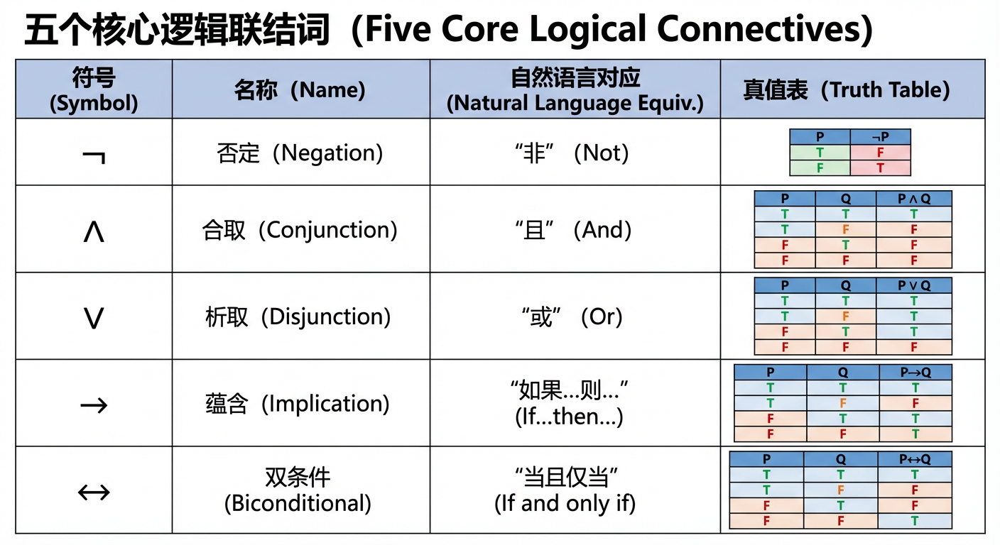
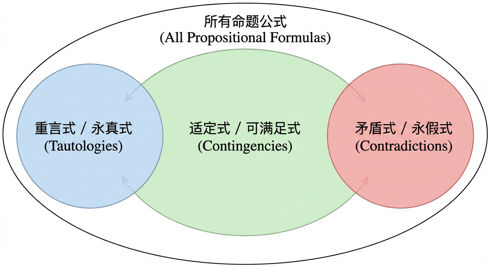
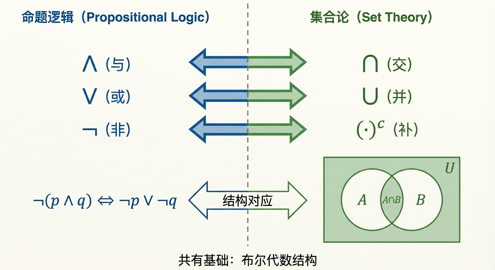
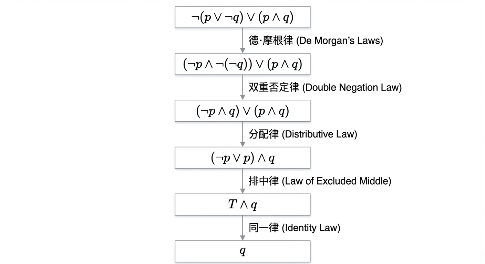
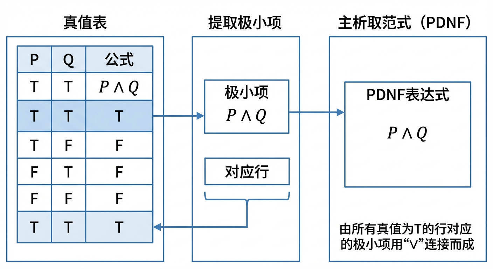
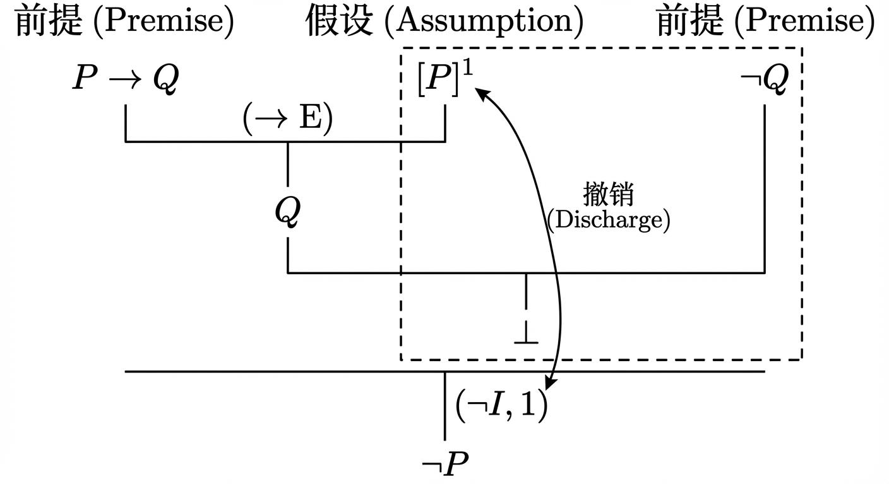
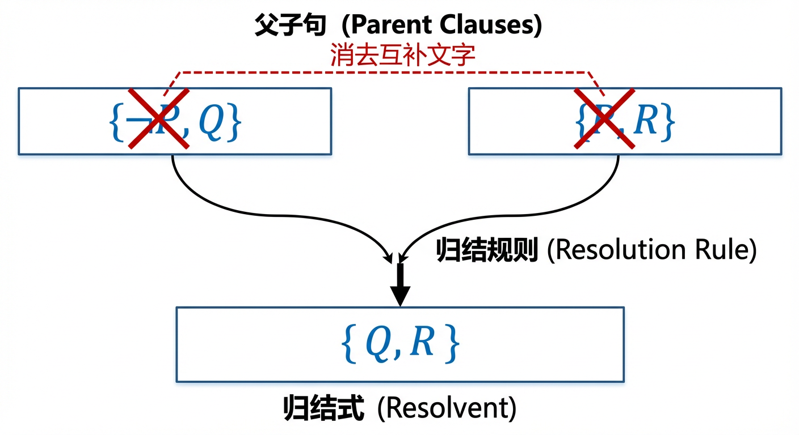

# 第2章：命题逻辑

本章围绕“如何用形式化语言刻画判断、并以可检验的方式进行推理”这一主线展开：先在 2.1 节建立命题逻辑的语法与语义基础（命题、联结词、真值表与公式分类），再在 2.2 节用“逻辑等价”把语义层面的“同真”转化为可操作的符号演算，继而在 2.3 节用范式把任意公式标准化为便于比较与算法处理的统一结构，最后在 2.4 节将这些工具汇聚到“证明与推理”这一动态过程，并引入归结法等更适合机械化推理的技术路线。下面进入各节内容。

## 2.1 命题逻辑基本概念

在第一章中，我们已经熟悉了数学中常用的符号与表达习惯，为精确地描述数学对象与关系奠定了基础。然而，数学的精髓不仅在于描述，更在于推理——从已知的事实出发，通过一系列逻辑上无懈可击的步骤，推导出新的结论。我们日常使用的自然语言，尽管表达力丰富，却常常充满歧义和模糊性，难以承载严谨数学论证的重任。例如，临床决策支持系统中的一条规则“如果患者存在某项诊断且未服用特定药物，则推荐进行某项检查”，必须被转化为机器可以精确执行的指令，不容许任何语义上的偏差。

为了克服自然语言的局限，我们需要建立一种形式化的、可计算、可检验的语言。本章将要探讨的**命题逻辑 (Propositional Logic)**，正是这样一种语言的起点。它将复杂多变的判断抽象为最基本的单元，并提供一套严格的组合规则，让我们能够像搭建精密的机械结构一样，构建和分析复杂的逻辑论断。本节，我们将从命题逻辑的原子——命题与联结词——出发，学习如何构造命题公式，并为这些公式建立一套统一的评价标准，为后续的等值演算与逻辑推理铺设坚实的语义基石。

### 命题与联结词

#### 命题：逻辑的原子

逻辑推理的起点是那些可以被明确判断真伪的陈述。在命题逻辑中，我们研究的核心对象是**命题 (Proposition)**。一个命题是一个具有确定**真值 (Truth Value)** 的陈述句。根据**二值原则 (Principle of Bivalence)**，任何命题的真值要么是**真 (True)**，要么是**假 (False)**，不存在第三种可能。我们通常用符号 T (或 1) 代表“真”，用 F (或 0) 代表“假”。

例如，“7是一个素数”是一个真值为 T 的命题，“$2+3=6$”是一个真值为 F 的命题。而诸如“这门课程很有趣”或“$x > 5$”这样的语句，前者依赖主观评价，后者由于变量 $x$ 未定而无法确定真假，因此它们都不是命题。

我们将无法再分解的命题称为**原子命题 (Atomic Proposition)**，并约定使用大写字母 $P, Q, R, \dots$ 来表示它们。原子命题构成了我们逻辑世界的基本粒子。然而，仅有原子命题不足以表达复杂的思想。我们需要一种“黏合剂”，将这些基本粒子组合成更宏大的逻辑分子——复合命题。

#### 联结词：构建复合命题的语法规则

在命题逻辑中，这种黏合剂就是**逻辑联结词 (Logical Connectives)**。联结词如同严格的语法规则，它将一个或多个命题组合成一个新的、更复杂的复合命题。经典命题逻辑的一个核心特征是**真值函数性 (Truth-functionality)**，即任何一个复合命题的真值完全由其构成部分的真值唯一确定，而与这些构成部分的具体内容无关。下面，我们介绍五个最基本也是最重要的联结词。

**1. 否定 (Negation, $\neg$)**

否定是一个一元联结词，它对单个命题进行操作，将其真值“翻转”。若命题 $P$ 为真，则其否定 $\neg P$（读作“非 P”）为假；反之亦然。其行为可以通过下面的**真值表 (Truth Table)** 精确定义：

| $P$ | $\neg P$ |
|:---:|:---:|
| T   | F   |
| F   | T   |

**2. 合取 (Conjunction, $\land$)**

合取是一个二元联结词，对应自然语言中的“并且”。复合命题 $P \land Q$（读作“P 且 Q”）仅当其两个分支命题 $P$ 和 $Q$ **同时为真**时，其真值才为真；在其他任何情况下，其真值均为假。

| $P$ | $Q$ | $P \land Q$ |
|:---:|:---:|:---:|
| T   | T   | T   |
| T   | F   | F   |
| F   | T   | F   |
| F   | F   | F   |

**3. 析取 (Disjunction, $\lor$)**

析取是另一个核心的二元联结词，对应自然语言中的“或者”。需要注意的是，逻辑中的析取是**相容或 (Inclusive Or)**，即只要分支命题 $P$ 和 $Q$ 中**至少有一个为真**，复合命题 $P \lor Q$（读作“P 或 Q”）的真值就为真。只有当 $P$ 和 $Q$ 同时为假时，$P \lor Q$ 才为假。

| $P$ | $Q$ | $P \lor Q$ |
|:---:|:---:|:---:|
| T   | T   | T   |
| T   | F   | T   |
| F   | T   | T   |
| F   | F   | F   |

**4. 蕴含 (Implication, $\rightarrow$)**

蕴含，或称**实质蕴含 (Material Implication)**，是逻辑学中最为精妙，也最常引起困惑的联结词。它形式化了“如果……那么……”的推理结构。在命题 $P \rightarrow Q$ 中，我们称 $P$ 为**前件 (Antecedent)**，$Q$ 为**后件 (Consequent)**。其真值表定义如下：

| $P$ | $Q$ | $P \rightarrow Q$ |
|:---:|:---:|:---:|
| T   | T   | T   |
| T   | F   | F   |
| F   | T   | T   |
| F   | F   | T   |

$P \rightarrow Q$ 为假的唯一情况是：**前件 $P$ 为真，而后件 $Q$ 为假**。我们可以将蕴含式理解为一份“承诺”或“契约”：“我保证，只要 $P$ 发生， $Q$ 就一定会发生。” 只有当 $P$ 确实发生了（$P$ 为真）而 $Q$ 却没有发生（$Q$ 为假）时，这份承诺才被违背。

那么，为何当前件 $P$ 为假时，无论后件 $Q$ 是真是假，蕴含式都为真呢？这被称为**空虚真理 (Vacuously True)**。从“承诺”的角度看，如果承诺的触发条件 $P$ 根本没有满足，那么我们就不能判定这份承诺被违背了，因此在逻辑上视其为“未被违背”，即为真。这一看似奇怪的定义，其背后有着深刻的理性考量，它确保了数学推理中最核心的规则——**肯定前件式 (Modus Ponens)** 的有效性。该规则断言：若 $P$ 和 $P \rightarrow Q$ 皆为真，则可推出 $Q$ 为真。蕴含的真值表定义恰好杜绝了“从真前提推出假结论”的可能。值得注意的是，蕴含联结词并非可交换的，$P \rightarrow Q$ 与其**逆命题 (Converse)** $Q \rightarrow P$ 的意义截然不同。

**5. 双条件 (Biconditional, $\leftrightarrow$)**

双条件联结词形式化了“当且仅当 (if and only if, iff)”这一概念。命题 $P \leftrightarrow Q$ 仅当 $P$ 和 $Q$ 的**真值相同时**才为真，否则为假。

| $P$ | $Q$ | $P \leftrightarrow Q$ |
|:---:|:---:|:---:|
| T   | T   | T   |
| T   | F   | F   |
| F   | T   | F   |
| F   | F   | T   |

双条件表达了两个命题在逻辑上的等价性。这引发我们思考：我们如何判断两个形式不同的命题公式是否表达了相同的逻辑内涵？

### 命题公式及其分类

#### 命题公式与逻辑等价

通过原子命题和逻辑联结词，我们可以递归地构造出任意复杂的复合命题，我们称之为**命题公式 (Propositional Formula)** 或**合式公式 (Well-formed Formula, WFF)**。例如，$p \land (q \lor \neg r)$ 就是一个命题公式。为了避免歧义，我们约定了联结词的**优先级 (Precedence)**（通常为 $\neg, \land, \lor, \rightarrow, \leftrightarrow$）并使用括号来明确运算顺序。

现在，我们可以回应上一节末尾提出的问题。我们如何判断两个看起来完全不同的公式，例如 $P \lor Q$ 和 $Q \lor P$，是否表达了相同的逻辑意义？尽管它们在符号串的层面上（即**句法 (Syntax)** 上）是不同的，但通过真值表可以发现，它们对于任何可能的真值指派，其最终的真值都完全相同。这种真值层面的一致性，我们称之为**逻辑等价 (Logical Equivalence)**，记为 $P \lor Q \equiv Q \lor P$。

逻辑等价是一个深刻的**语义 (Semantic)** 概念。它告诉我们，不同的符号形式可以承载完全相同的逻辑内涵。这一性质是后续进行逻辑演算的基石，它允许我们在一个更复杂的公式中，用一个子公式的等价形式去替换它，而不改变整个公式的真值。例如，合取（$\land$）、析取（$\lor$）和双条件（$\leftrightarrow$）都满足交换律，而蕴含（$\rightarrow$）则不满足。

进一步地，一个重要的定理指出，两个公式 $\phi$ 和 $\psi$ 逻辑等价，当且仅当由它们构成的双条件公式 $\phi \leftrightarrow \psi$ 是一个**重言式**。这为我们判定等价关系提供了一个直接的判据，并自然地引出了对命题公式的分类问题。

> 【新增衔接】本节在语义层面提出了“逻辑等价”“重言式”等概念，但仅靠真值表来验证等价或判定重言式会遭遇指数爆炸。下一节（2.2）将把“等价”系统化为一套可操作的符号规则体系：用等值式与置换规则进行等值演算，从而在不枚举全部赋值的情况下完成化简、判等与类型判断。

#### 命题公式的分类

对于任何给定的命题公式，其最重要的逻辑特性取决于它在**所有**可能的真值指派下的表现。基于此，我们可以将任意一个命题公式精确地归入以下三类之一。这个分类过程是后续所有逻辑分析的基础。

1.  **重言式 (Tautology)**，又称**永真式**：一个命题公式，如果对于其包含的原子命题的**每一种**真值指派，该公式的计算结果都为真（T）。重言式代表了逻辑上的普遍真理，它们是逻辑推理的定律。
    *   一个最基本的例子是**排中律 (Law of Excluded Middle)**：$P \lor \neg P$。
    *   另一个是**非矛盾律 (Law of Non-Contradiction)** 的否定形式：$\neg(P \land \neg P)$。此公式断言“一个命题和它的否定不能同时为真”，这在任何情况下都成立。
    *   一个更复杂的例子是 $(P \land (P \to Q)) \to Q$。这个公式形式化了**肯定前件式 (Modus Ponens)** 的推理过程，可以证明它是一个重言式，从而保证了该推理规则的可靠性。

2.  **矛盾式 (Contradiction)**，又称**永假式**：一个命题公式，如果对于其包含的原子命题的**每一种**真值指派，该公式的计算结果都为假（F）。矛盾式代表了逻辑上的不可能性。
    *   最简单的例子是 $P \land \neg P$。
    *   考虑公式 $(P \to Q) \land (P \land \neg Q)$。我们知道 $P \to Q$ 为假的唯一情况是 $P$ 真 $Q$ 假。而公式的后半部分 $P \land \neg Q$ 恰好断言了这种情况的发生。因此，整个公式断言了两个互不相容的条件同时成立，它必然是一个矛盾式。

3.  **适定式 (Contingency)**，又称**可满足式**：一个既非重言式也非矛盾式的命题公式。这意味着，至少存在一种真值指派使它为真，也至少存在另一种真值指派使它为假。它的真值是“偶然的”，依赖于具体情况。
    *   原子命题 $P$ 本身就是一个最简单的适定式。
    *   我们在本节开头提到的软件激活规则 $p \land (q \lor \neg r)$ 就是一个典型的适定式。我们可以通过构造它的真值表来验证这一点。对于 $p, q, r$ 的 $2^3=8$ 种真值组合，该公式的结果有真有假。例如，当 $p, q, r$ 均为 T 时，公式为 T；当 $p$ 为 T, $q, r$ 均为 F 时，公式也为 T；但当 $p$ 为 T, $q$ 为 F, $r$ 为 T 时，公式为 F。

判断一个公式属于哪一类，最基础也最可靠的方法就是构造它的**真值表**。通过穷举所有 $2^n$（$n$ 为原子命题个数）种可能的真值指派，并计算出每种情况下公式的最终真值，我们只需检查最终结果列：若全为 T，则是重言式；若全为 F，则是矛盾式；若既有 T 又有 F，则是适定式。

例如，分析公式 $(P \lor Q) \to (P \land Q)$。
| $P$ | $Q$ | $P \lor Q$ | $P \land Q$ | $(P \lor Q) \rightarrow (P \land Q)$ |
|:---:|:---:|:---:|:---:|:---:|
| T | T | T | T | T |
| T | F | T | F | F |
| F | T | T | F | F |
| F | F | F | F | T |
由于最后一列既有 T 又有 F，该公式是一个适定式。

值得注意的是，真值表法虽然根本，但当原子命题数量增多时，其行数会以指数方式增长，导致计算变得异常繁琐。这促使我们必须寻找更高效的代数方法——即将在下一节探讨的**等值演算**——它将利用我们此处建立的逻辑等价概念，将公式分类问题转化为符号的化简与推演。

### 小结

本节中，我们踏出了从自然语言迈向形式逻辑的第一步。我们确立了**命题**作为逻辑分析的基本单位，它必须具有明确的“真”或“假”的**真值**。随后，我们引入了五个核心的**逻辑联结词**（$\neg, \land, \lor, \rightarrow, \leftrightarrow$），它们如同精密的语法，以**真值函数性**为原则，将简单的命题构建为复杂的**命题公式**。

在此基础上，我们建立了评价命题公式的核心标准。通过考察一个公式在所有可能真值指派下的表现，我们将其划分为**重言式**、**矛盾式**和**适定式**三类。这一分类不仅为公式赋予了根本的逻辑身份，也为后续章节的学习奠定了语义基础。我们还初步接触了**逻辑等价**的概念，它揭示了句法形式与语义内涵的区别，为下一节即将展开的、更为高效的代数方法——**等值演算**——埋下了伏笔。

至此，我们已经搭建了命题逻辑的“对象—操作—产物—评价”的完整框架。掌握这些基本概念，就如同掌握了一门新语言的字母表和基本语法，是通往理解复杂逻辑推理、构造严密数学证明，乃至洞悉计算本质的必经之路。在后续的学习中，我们将看到这些基础概念如何支撑起整个逻辑推理的大厦。

> 【新增过渡】2.1 节从语义角度给出了“等价/重言式/可满足性”的判定基准，但它主要依赖真值表。为把这种“判定”进一步变成“可推导的变换”，我们需要把语义事实固化为可复用的等值定律与代换原则，这正是 2.2 节要完成的任务；而 2.2 节的等值演算又将直接服务于 2.3 节的范式化（把公式统一成 CNF/DNF 等标准结构）以及 2.4 节的推理证明（尤其是归结法对 CNF 的依赖）。

## 2.2 命题逻辑等值演算

在上一节中，我们建立了命题逻辑的形式语言，学会了如何通过真值表来精确判断一个命题公式的真伪，并依据其在所有解释下的表现，将其归类为重言式、矛盾式或偶然式。真值表法虽然直观可靠，但其弊端也显而易见：当命题变元增多时，真值表的规模会呈指数级增长，使得分析过程变得异常繁琐乃至不切实际。这引发了一个核心问题：我们能否超越对个别赋值的逐一考察，发展一套纯粹基于公式结构、类似于代数运算的符号推演体系，来判定和变换命题公式？

本节将致力于回答这一问题。我们将引入“逻辑等值”这一核心概念，它不仅为我们提供了衡量两个命题公式在逻辑意义上是否“相同”的标尺，更重要的是，它将开启一扇通往“等值演算”的大门。通过掌握一系列基本的等值定律，我们将能够像在代数中化简表达式一样，对复杂的命题公式进行推导、化简与变形。这套演算体系不仅是后续构造范式（2.3节）和建立推理系统（2.4节）的基石，其本身也深刻地体现了逻辑的代数结构之美。在此基础上，我们将进一步探讨一个更根本的问题：构成我们逻辑语言的联结词集合，其表达能力是否存在边界？“联结词完备集”的概念将揭示，哪些基础联结词的组合足以“生成”整个命题逻辑世界。

### 等值式与等值演算

#### 1. 逻辑等值的定义

我们首先需要一个严格的定义来刻画两个命题公式在逻辑上“意义相同”。这个“相同”的本质，在于无论我们如何解释其中的命题变元，这两个公式的真值始终保持一致。

**定义 2.2.1（逻辑等值）** 设 $\varphi$ 和 $\psi$ 是任意两个命题公式。如果在任何解释（赋值） $v$ 下，$\varphi$ 和 $\psi$ 的真值都相同，即 $v(\varphi) = v(\psi)$，则称 $\varphi$ 与 $\psi$ 是**逻辑等值**的（Logically Equivalent），记作 $\varphi \Leftrightarrow \psi$ 或 $\varphi \equiv \psi$。

逻辑等值关系是命题公式集合上的一个等价关系，满足自反性、对称性和传递性。它将所有命题公式划分到一个由等值类构成的空间中。

这个语义定义与上一节介绍的重言式概念紧密相连。两个公式 $\varphi$ 和 $\psi$ 在所有解释下真值相同，等价于双条件联结的公式 $\varphi \leftrightarrow \psi$ 在所有解释下恒为真。

**定理 2.2.1** 命题公式 $\varphi$ 与 $\psi$ 逻辑等值的充分必要条件是，公式 $\varphi \leftrightarrow \psi$ 为重言式。

这个定理架起了从语义层面的“等值”到句法层面的“重言式”的桥梁，为我们判定等值提供了除真值表外的另一条途径：证明一个双条件句为永真。例如，在分析一个数学断言时，我们常常需要辨析其逆否命题、否命题和逆命题。考虑命题“若函数可导($p$)，则函数连续($q$)”，即 $p \to q$。其逆否命题是 $\neg q \to \neg p$，否命题是 $\neg p \to \neg q$，逆命题是 $q \to p$。通过构造真值表可以发现，只有 $p \to q$ 与 $\neg q \to \neg p$ 的真值列完全相同，因此它们是逻辑等值的。而 $p \to q$ 与其否命题 $\neg p \to \neg q$ 在 $p$ 假 $q$ 真的情况下真值不同，故不等值。有趣的是，否命题 $\neg p \to \neg q$ 与逆命题 $q \to p$ 却是逻辑等值的。这种区分对于精确的数学推理至关重要。

#### 2. 基本等值式

正如代数运算依赖于交换律、结合律等基本公理，命题逻辑的等值演算也建立在一系列基本等值式（或称等值定律）之上。这些等值式本身都是重言式，构成了我们进行符号推演的“规则库”。下表列出了一些最重要和最常用的等值式：

**表 2.1 常用逻辑等值式**

| 定律名称 | 形式一（合取形式） | 形式二（析取形式） |
| :--- | :--- | :--- |
| **同一律** | $p \land T \Leftrightarrow p$ | $p \lor F \Leftrightarrow p$ |
| **零一律/支配律** | $p \land F \Leftrightarrow F$ | $p \lor T \Leftrightarrow T$ |
| **幂等律** | $p \land p \Leftrightarrow p$ | $p \lor p \Leftrightarrow p$ |
| **交换律** | $p \land q \Leftrightarrow q \land p$ | $p \lor q \Leftrightarrow q \lor p$ |
| **结合律** | $(p \land q) \land r \Leftrightarrow p \land (q \land r)$ | $(p \lor q) \lor r \Leftrightarrow p \lor (q \lor r)$ |
| **分配律** | $p \land (q \lor r) \Leftrightarrow (p \land q) \lor (p \land r)$ | $p \lor (q \land r) \Leftrightarrow (p \lor q) \land (p \lor r)$ |
| **吸收律** | $p \land (p \lor q) \Leftrightarrow p$ | $p \lor (p \land q) \Leftrightarrow p$ |
| **德·摩根律** | $\neg(p \land q) \Leftrightarrow \neg p \lor \neg q$ | $\neg(p \lor q) \Leftrightarrow \neg p \land \neg q$ |
| **双重否定律** | $\neg(\neg p) \Leftrightarrow p$ | |
| **矛盾律与排中律** | $p \land \neg p \Leftrightarrow F$ | $p \lor \neg p \Leftrightarrow T$ |
| **蕴含等值式** | $p \to q \Leftrightarrow \neg p \lor q$ | |
| **逆否等值式** | $p \to q \Leftrightarrow \neg q \to \neg p$ | |
| **双条件等值式** | $p \leftrightarrow q \Leftrightarrow (p \to q) \land (q \to p)$ | $p \leftrightarrow q \Leftrightarrow (p \land q) \lor (\neg p \land \neg q)$ |

这些定律不仅是抽象的符号规则，它们在现实世界中有着广泛的应用。例如，双重否定律 $\neg(\neg p) \Leftrightarrow p$ 捕捉了一个简单的直觉：对一个状态翻转两次，将恢复其原始状态。一个系统安全规范中“禁止主电源切断功能处于非激活状态”的繁琐表述，依据此定律可直接简化为“主电源切断功能必须激活”。同样，吸收律 $p \land (p \lor q) \Leftrightarrow p$ 在优化数据库查询逻辑时非常有用。一条“筛选出‘金牌会员’并且（是‘金牌会员’或‘年消费超500元’）的顾客”的规则，可以被直接简化为“筛选出‘金牌会员’”，大大提高了查询效率。

值得注意的是，命题逻辑中的等值规律与我们在第一章学习的集合论中的恒等式存在着深刻的平行关系。如果我们把命题变元 $p, q$ 视作元素 $x$ 分别属于集合 $A, B$ 的断言（即 $p \equiv x \in A, q \equiv x \in B$），并将逻辑联结词 $\land, \lor, \neg$ 分别对应于集合运算 $\cap, \cup, (\cdot)^c$，那么每一条逻辑等值式都对应着一条集合恒等式。例如，德·摩根律 $\neg(p \land q) \Leftrightarrow \neg p \lor \neg q$ 精确地对应于集合恒等式 $(A \cap B)^c = A^c \cup B^c$。这种对应关系源于两者共有的布尔代数结构，其背后的原理是**外延性公理**（Axiom of Extensionality）：两个集合相等，当且仅当它们拥有完全相同的元素。逻辑等值保证了对于任意元素 $x$，它属于一个集合表达式的真值，与它属于另一个等值表达式的真值完全相同，从而保证了两个集合的外延相等。

#### 3. 等值演算与置换规则

有了基本等值式，我们还需要一个核心的规则来驱动整个演算过程，这就是**置换规则**（Substitution Rule）。

**定理 2.2.2（置换规则）** 设 $\varphi$ 和 $\psi$ 是两个逻辑等值的命题公式，即 $\varphi \Leftrightarrow \psi$。如果公式 $A$ 中含有一个或多个子公式 $\varphi$，将 $A$ 中的任意一个或多个 $\varphi$ 替换为 $\psi$ 后得到公式 $B$，那么 $A$ 与 $B$ 逻辑等值，即 $A \Leftrightarrow B$。

置换规则赋予了等值式“可替换性”的强大能力，它保证了我们可以在一个复杂公式的任何局部进行等价代换，而整体的逻辑意义保持不变。这使得我们可以像进行代数运算一样，通过一系列的等值变换，来证明两个公式等值，或将一个复杂公式化简。

**等值演算**（Equivalence Calculus）就是应用基本等值式和置换规则，对命题公式进行推导和变换的过程。其主要应用在于：
1.  **证明公式等值**：通过一系列变换将一个公式转换为另一个。
2.  **化简公式**：将复杂的公式变得更短或结构更清晰。
3.  **推导重言式/矛盾式**：将公式化简为恒真符 $T$ 或恒假符 $F$。

让我们通过一个实例来感受等值演算的威力。考虑化简公式 $\neg(p \lor \neg q) \lor (p \land q)$：
$$
\begin{array}{rll}
& \neg(p \lor \neg q) \lor (p \land q) & \\
\Leftrightarrow & (\neg p \land \neg(\neg q)) \lor (p \land q) & \text{(德·摩根律)} \\
\Leftrightarrow & (\neg p \land q) \lor (p \land q) & \text{(双重否定律)} \\
\Leftrightarrow & (\neg p \lor p) \land q & \text{(分配律)} \\
\Leftrightarrow & T \land q & \text{(排中律)} \\
\Leftrightarrow & q & \text{(同一律)}
\end{array}
$$
通过这几步纯粹的符号操作，我们无需构造有8行的真值表，就证明了原公式等价于简单的 $q$。

另一个重要的应用是证明一个公式的类型。例如，我们可以用等值演算证明**假言三段论**（Hypothetical Syllogism）是一个重言式：
$$
\begin{array}{rll}
& ((p \to q) \land (q \to r)) \to (p \to r) & \\
\Leftrightarrow & \neg((\neg p \lor q) \land (\neg q \lor r)) \lor (\neg p \lor r) & \text{(蕴含等值式，两次)} \\
\Leftrightarrow & (\neg(\neg p \lor q) \lor \neg(\neg q \lor r)) \lor (\neg p \lor r) & \text{(德·摩根律)} \\
\Leftrightarrow & ((p \land \neg q) \lor (q \land \neg r)) \lor (\neg p \lor r) & \text{(德·摩根律, 双重否定律)} \\
\Leftrightarrow & (p \land \neg q) \lor (\neg p) \lor (q \land \neg r) \lor r & \text{(结合律, 交换律)} \\
\Leftrightarrow & ((p \lor \neg p) \land (\neg q \lor \neg p)) \lor ((q \lor r) \land (\neg r \lor r)) & \text{(分配律)} \\
\Leftrightarrow & (T \land (\neg q \lor \neg p)) \lor ((q \lor r) \land T) & \text{(排中律)} \\
\Leftrightarrow & (\neg q \lor \neg p) \lor (q \lor r) & \text{(同一律)} \\
\Leftrightarrow & (\neg q \lor q) \lor (\neg p \lor r) & \text{(结合律, 交换律)} \\
\Leftrightarrow & T \lor (\neg p \lor r) & \text{(排中律)} \\
\Leftrightarrow & T & \text{(零一律)}
\end{array}
$$
演算过程表明，无论 $p, q, r$ 取何值，该公式恒为真。这种代数式的证明方法，为后续章节学习更形式化的推理系统（如自然演绎）奠定了坚实的基础。

### 联结词完备集

到目前为止，我们一直在由联结词 $\{\neg, \land, \lor, \to, \leftrightarrow\}$ 构成的语言中进行演算。一个自然而深刻的问题是：我们是否需要所有这些联结词？是否存在一个更小的、基础的联结词集合，其表达能力足以生成所有可能的逻辑函数？

**定义 2.2.2（功能完备性）** 一个逻辑联结词的集合 $S$ 被称为是**功能完备的**（Functionally Complete），如果任何一个 $n$ 元布尔函数（即任何一个 $n$ 元真值表）都可以由仅使用 $S$ 中的联结词和命题变元构成的命题公式来表示。

我们知道，任何布尔函数都可以表示为析取范式（将在2.3节详细讨论），而析取范式仅使用了 $\neg, \land, \lor$。因此，集合 $\{\neg, \land, \lor\}$ 是功能完备的。进一步地，根据德·摩根律，我们可以用 $\neg$ 和 $\land$ 表示 $\lor$（$p \lor q \Leftrightarrow \neg(\neg p \land \neg q)$），也可以用 $\neg$ 和 $\lor$ 表示 $\land$（$p \land q \Leftrightarrow \neg(\neg p \lor \neg q)$）。因此，$\{\neg, \land\}$ 和 $\{\neg, \lor\}$ 也都是功能完备集。

这引出了一个极具实践意义的探索：是否存在一个仅含单个联结词的功能完备集？答案是肯定的。

1.  **与非（NAND）**：定义为 $p \uparrow q \Leftrightarrow \neg(p \land q)$。
2.  **或非（NOR）**：定义为 $p \downarrow q \Leftrightarrow \neg(p \lor q)$。

仅用“与非”联结词，我们就可以构造出 `NOT` 和 `AND`：
*   $\neg p \Leftrightarrow \neg(p \land p) \Leftrightarrow p \uparrow p$
*   $p \land q \Leftrightarrow \neg(\neg(p \land q)) \Leftrightarrow \neg(p \uparrow q) \Leftrightarrow (p \uparrow q) \uparrow (p \uparrow q)$

既然可以构造出功能完备集 $\{\neg, \land\}$，那么 $\{\uparrow\}$ 本身就是功能完备的。同理可以证明 $\{\downarrow\}$ 也是功能完备的。这一发现是计算机科学的基石之一。它意味着在物理层面，我们只需要大规模制造一种逻辑门——与非门或或非门——就可以构建出能够实现任何复杂逻辑功能的数字电路，从简单的加法器到整个中央处理器（CPU）。

功能完备性也为我们设计极简指令集提供了理论指导。设想一个只内建了蕴含（$\to$）和常数“假”（$\bot$）两种逻辑原语的CPU。这个看似简陋的系统是否具备通用计算能力？答案是肯定的，因为集合 $\{\to, \bot\}$ 是功能完备的。我们可以如下构造其他联结词：
*   $\neg p \Leftrightarrow p \to \bot$
*   $p \lor q \Leftrightarrow (p \to \bot) \to q \Leftrightarrow \neg p \to q$
*   $p \land q \Leftrightarrow (p \to (q \to \bot)) \to \bot \Leftrightarrow \neg(p \to \neg q)$

另一方面，如何证明一个联结词集是**不完备**的呢？其关键在于寻找该集合中所有联结词共同拥有且在复合运算下封闭的“遗传属性”。例如，联结词 $\land$ 和 $\lor$ 都是**保一的**（当所有输入为1时，输出也为1），并且由它们任意复合得到的函数也必然是保一的。但否定联结词 $\neg$ 并非保一的（$\neg 1 = 0$），因此仅由 $\{\land, \lor\}$ 无法构造出否定，故该集合不完备。同理，它们也都是**单调的**（输入从0变1，输出不会从1变0），而否定不是单调的。这些“不完备”的性质，如保一性、保零性、单调性、自对偶性、线性（仿射性），正是判定功能完备性的理论核心（Post定理）。

### 小结

本节我们完成了从语义判定到句法演算的关键一步。**逻辑等值**为我们提供了在保持逻辑意义不变的前提下，对命题公式进行代数式操作的理论基础。以双重否定律、德·摩根律、分配律等为代表的**基本等值式**，构成了我们进行**等值演算**的工具箱，使我们能够高效地化简公式、证明等价关系以及判定公式的逻辑类型，其效力在编译优化、数据库查询乃至系统验证等领域均有体现。

更进一步，**联结词功能完备性**的概念引导我们将视线从公式的变换转向了逻辑语言自身的构造。它揭示了不同联结词在表达能力上的差异与联系，并阐明了仅用极少数（甚至单个）联结词便足以构建整个命题逻辑大厦的深刻原理。这一原理不仅是数字电路设计中“通用逻辑门”的理论支柱，也为我们理解计算的本质提供了逻辑层面的洞见。

至此，我们已经掌握了分析和变换命题公式的强大代数工具。在下一节，我们将运用这些工具，系统性地将任意命题公式转化为结构统一、易于比较和处理的**范式**，为实现算法化的逻辑判定与推理做好准备。

> 【新增过渡】2.2 节的等值演算解决了“如何不依赖真值表而改写公式”的问题，但在很多任务中（比较两个公式、作为算法输入、作为推理系统的工作形式）我们仍希望最终表达具有统一模板。于是 2.3 节将把“等值变形”收束到“标准形”：把任意公式变到 DNF/CNF 乃至唯一的主范式；其中 CNF 的“子句合取”结构还将成为 2.4 节归结证明法的直接输入。

## 2.3 范式

我们在上一节中，已经掌握了等值演算这一强大的工具，它允许我们通过一系列等值替换，将一个命题公式变换为形式上千变万化、但逻辑功能完全相同的其他公式。这种灵活性固然展示了逻辑语言的丰富性，但也带来了一个根本性的问题：面对两个结构迥异的公式，我们如何能够高效且确定地判断它们是否等价？反复构建真值表虽然可靠，但随着变量增多，其规模将呈指数级增长，很快变得不切实际。更进一步，在计算机科学的诸多领域，例如自动定理证明、数据库查询优化和数字电路设计中，我们迫切需要一种处理逻辑表达式的标准化方法，以便于算法的实现与系统的自动化处理。

为了应对这一挑战，我们引入**范式 (Normal Form)** 的概念。范式，顾名思义，是一种“规范形式”。它为纷繁复杂的命题公式提供了一种标准化的结构，如同为每一个逻辑函数颁发的一张“身份证”。通过将任意公式转化为其对应的范式，我们便能获得一个用于比较和判定的共同基准。本节将系统地介绍两种基本的范式——析取范式与合取范式，并在此基础上建立两种唯一的、具有典范意义的范式——主析取范式与主合取范式。它们不仅是判定逻辑等价的终极裁判，更是连接命题逻辑理论与后续推理算法实践的坚实桥梁。

### 析取范式与合取范式

为了精确地定义范式，我们首先需要明确构成它们的最基本单位。

**定义 2.3.1 (文字)**：一个命题变量自身或其否定统称为**文字 (Literal)**。例如，若 $p$ 是一个命题变量，则 $p$ 和 $\neg p$ 都是文字。

基于文字，我们可以构建两种基本的复合结构：一种是通过合取联结词“与”($\land$)将文字连接起来，另一种则是通过析取联结词“或”($\lor$)。

**定义 2.3.2 (合取项与析取项)**：
1.  由有限个文字构成的合取式称为**合取项 (Conjunctive Term)**，有时也称作**积项**。例如，$p$, $\neg q$, $p \land \neg q \land r$ 都是合取项。
2.  由有限个文字构成的析取式称为**析取项 (Disjunctive Term)**，在后续的推理理论中更常被称为**子句 (Clause)**。例如，$p$, $\neg q$, $p \lor \neg q \lor r$ 都是析取项。

需要注意的是，单个文字既可以被看作只含一个文字的合取项，也可以被看作只含一个文字的析取项。这两种结构为我们提供了构建更复杂范式的“逻辑积木”。

**定义 2.3.3 (析取范式与合取范式)**：
1.  由有限个合取项构成的析取式称为**析取范式 (Disjunctive Normal Form, DNF)**。其结构为 $T_1 \lor T_2 \lor \dots \lor T_m$，其中每个 $T_i$ 都是一个合取项。
2.  由有限个析取项（子句）构成的合取式称为**合取范式 (Conjunctive Normal Form, CNF)**。其结构为 $C_1 \land C_2 \land \dots \land C_m$，其中每个 $C_i$ 都是一个析取项（子句）。

从这两种定义的形式看，析取范式可以被直观地理解为一份“触发条件清单”。整个公式的真值由一系列场景（合取项）的析取构成，只要其中任何一个场景被满足（其对应的合取项为真），整个公式即为真。例如，一个无人机返航的逻辑可以是“电量低”或者“（天气恶劣 且 导航信号丢失）”，其公式 $p \lor (q \land r)$ 就是一个简单的析取范式。

与之相对，合取范式则如同一套“系统运行准则”。整个公式由一系列必须同时遵守的规则（析取项/子句）的合取构成，只有当每一条规则都被满足（其对应的析取项为真）时，整个公式才为真。例如，一个系统要保持正常运行，必须同时满足：“（温度不过高 或 冷却系统开启）且（网络不中断 或 备用线路激活）”，这正体现了合取范式的约束思想。

一个重要的理论结论是：**对于任意一个命题公式，都存在一个与之等值的析取范式和合取范式**。这一结论的构造性证明依赖于我们在上一节学习的等值演算。通过运用德摩根律、分配律、双重否定律等基本等值式，我们可以系统地将任意公式转化为DNF或CNF。这个过程保证了任何逻辑函数都可以被表示为这两种标准形式之一。

然而，析取范式与合取范式并非唯一。例如，$p \land (q \lor r)$ 与等值的 $(p \land q) \lor (p \land r)$，前者不是析取范式，后者是。但后者还可以等值地写成 $(p \land q \land r) \lor (p \land q \land \neg r) \lor (p \land \neg q \land r)$ 等更复杂的形式。既然存在多种等价的范式表达，它们还无法直接承担“唯一标识”的重任。为了实现这一目标，我们需要引入结构更为严格的**主范式**。

### 主范式：逻辑函数的唯一标识

主范式的思想，在于将范式中的每一个基本组成部分（合取项或析取项）都提升到一个完备且规范的水平，即要求它们必须包含公式中所出现的所有命题变量。

**定义 2.3.4 (极小项与极大项)**：设命题公式 $A$ 中含有 $n$ 个命题变量 $p_1, p_2, \dots, p_n$。
1.  一个包含这 $n$ 个变量的合取项，其中每个变量或其否定恰好出现一次，称作一个关于这 $n$ 个变量的**极小项 (Minterm)**。
2.  一个包含这 $n$ 个变量的析取项，其中每个变量或其否定恰好出现一次，称作一个关于这 $n$ 个变量的**极大项 (Maxterm)**。

极小项和极大项具有极为优美的性质。对于 $n$ 个变量，总共有 $2^n$ 个不同的真值指派。可以证明，每一个极小项仅在 $2^n$ 个指派中的**一个**指派下取值为真，而在其余所有指派下均取值为假。相对偶地，每一个极大项仅在 $2^n$ 个指派中的**一个**指派下取值为假，而在其余所有指派下均取值为真。

例如，对于变量 $p, q, r$，极小项 $p \land \neg q \land r$ 仅在指派 $(p=T, q=F, r=T)$ 下为真。而极大项 $p \lor \neg q \lor r$ 仅在指派 $(p=F, q=T, r=F)$ 下为假。因此，每个极小项精确地“捕获”了一个使公式为真的特定场景，而每个极大项则精确地“排除”了一个使公式为假的特定场景。为了方便，我们常用 $m_i$ 表示第 $i$ 个极小项，$M_i$ 表示第 $i$ 个极大项，其中下标 $i$ 是对应真值指派的二进制表示所转换成的十进制数（通常约定T为1，F为0）。

基于极小项和极大项，我们便可以定义两种具有唯一性的规范范式。

**定义 2.3.5 (主析取范式与主合取范式)**：
1.  由若干个**极小项**析取而成的公式称为**主析取范式 (Principal Disjunctive Normal Form, PDNF)**。
2.  由若干个**极大项**合取而成的公式称为**主合取范式 (Principal Conjunctive Normal Form, PCNF)**。

**定理 2.3.1 (主范式存在且唯一)**：任何一个非重言式且非矛盾式的命题公式，都存在与之等值的、唯一的PDNF和PCNF（在不计各项次序的前提下）。

这个定理是命题逻辑中的一个核心结果。它意味着，PDNF和PCNF可以作为任何命题逻辑函数的“典范表示”或“唯一指纹”。判断两个公式是否等价，只需将它们分别化为PDNF（或PCNF），然后比较所得结果是否完全相同即可。

从真值表直接构造主范式的方法非常直观：
*   **构造PDNF**：
    1.  列出公式的真值表。
    2.  找出所有使公式真值为 $T$ 的行。
    3.  为每一行写出其对应的极小项。
    4.  将所有这些极小项用 $\lor$ 连接起来。

*   **构造PCNF**：
    1.  列出公式的真值表。
    2.  找出所有使公式真值为 $F$ 的行。
    3.  为每一行写出其对应的极大项。
    4.  将所有这些极大项用 $\land$ 连接起来。

例如，考虑公式 $A = (p \land q) \rightarrow r$ 与 $B = p \rightarrow (q \rightarrow r)$。要判断它们是否等价，无需依赖直觉或复杂的推演。我们只需将它们都转化为一个更简单的等值式 $\neg p \lor \neg q \lor r$。通过其真值表，我们可以找到其PDNF和PCNF。由于它们等值，它们必然共享相同的PDNF和PCNF，从而证明了它们的等价性。主范式为我们提供了一种机械化、确定性的判等算法。

### 主范式之间的关系与应用

主析取范式与主合取范式之间存在一种深刻的对偶关系。对于一个含有 $n$ 个变量的命题公式，其真值表总共有 $2^n$ 行。PDNF由所有使得公式为真的行（设有 $k$ 行）的极小项构成，而PCNF则由所有使得公式为假的行（必然有 $2^n - k$ 行）的极大项构成。这揭示了一个简洁而优美的数量关系：
$$ N_{PDNF} + N_{PCNF} = 2^n $$
其中 $N_{PDNF}$ 是公式的PDNF中所含极小项的个数，$N_{PCNF}$ 是其PCNF中所含极大项的个数。

这个关系非常有用。例如，如果我们知道一个4变量函数只在4种特定情况下为真，那么我们无需任何计算就能断定，它的PCNF必须包含 $2^4 - 4 = 12$ 个极大项。反之亦然。这种对偶性使我们可以在两种范式之间灵活切换，选择更简洁或更适合特定应用场景的表达。

值得注意的是，主范式虽然在理论上是完美的，但在实践中可能非常冗长。一个包含20个变量的函数，其主范式可能包含的项数会达到天文数字。因此，在数字电路设计等工程应用中，我们常常追求的是**最简范式**，即在保持逻辑功能等价的前提下，使用最少的文字或项来表达。从主范式出发，通过吸收律等规则进行化简，是求取最简范式的一种思路，尽管更系统的方法（如卡诺图法和奎因-麦克拉斯基算法）已超出了本章的讨论范围。

### 小结

本节我们围绕“如何为命题公式建立一种标准化的、可比较的表示”这一核心问题，引入了**范式**的概念。我们从最基本的**析取范式 (DNF)** 和**合取范式 (CNF)** 出发，认识到它们是任何命题公式都能达成的两种基础结构，其构造过程充分展示了上一节所学等值演算的威力。

然而，为了获得一种能够作为逻辑函数“唯一指纹”的典范表示，我们进一步定义了更为严格的**主析取范式 (PDNF)** 和**主合取范式 (PCNF)**。通过引入**极小项**和**极大项**的概念，我们建立了一套直接从真值表构造这两种唯一范式的系统方法。主范式的唯一性为判定任意两个复杂公式是否逻辑等价提供了一个确定性的算法，深刻体现了形式化方法在消除模糊性上的力量。PDNF与PCNF之间优美的对偶关系，也揭示了逻辑结构内在的对称之美。

至此，我们已经为命题逻辑构建了从基本概念、等值演算到标准形式的完整理论体系。但范式的意义远不止于此。它不仅是理论分析的终点，更是自动化推理的起点。特别是合取范式（CNF），其“一系列约束的合取”的结构，使其成为下一节我们将要学习的**归结推理**方法的工作台面。范式将逻辑公式转化为一种便于算法操作的标准输入，从而为机器证明和逻辑编程铺平了道路。这也预示着，我们将从“公式是什么”的静态分析，转向“如何基于公式进行推理”的动态过程。

> 【新增过渡】至此我们已拥有两类关键“桥梁”：2.2 节用等值演算把语义等价变成可操作的符号变换；2.3 节用范式把变换的结果统一到标准结构。下一节（2.4）将把这些结构用于推理：一方面在自然演绎/希尔伯特系统中用规则构造证明（对应 2.2 节的“可替换、可推导”思想），另一方面在归结法中以 CNF 的子句集合为平台进行机械化反驳证明（直接依赖 2.3 节对 CNF/子句的刻画）。

## 2.4 推理

在前几节中，我们已经为命题逻辑这门形式语言建立了坚实的“静态”基础。我们定义了它的基本构件（命题）、构造规则（联结词）、以及评价其真值和等价性的标准（真值表、等值演算与范式）。然而，逻辑的真正威力并不仅仅在于描述和分类命题公式，更在于它能将我们从已知的真理引导至未知的真理。本节将带领我们完成从“静态分析”到“动态推演”的认知飞跃，探索如何将我们已知的真值关系，转化为一步步可检验、可信赖的推导过程，这一过程，我们称之为**推理（Inference）**。

在日常与科学探索中，人类运用着多种多样的推理模式。我们可能通过**归纳推理（Inductive Reasoning）**，从具体的、重复的观察中总结出一般规律。例如，一位植物学家在多个独立的大陆干旱地区都观察到，不同科属的植物（仙人掌、大戟科多肉、澳洲草类）都演化出了厚实的蜡质层，从而提出一个一般性假说：“厚实的蜡质层是植物为适应干旱环境、减少水分流失而演化出的共同特征。” 我们也常常使用**设证推理（Abductive Reasoning）**或称“溯因推理”，为某个令人惊讶的现象寻找最佳的解释。例如，在著名的DNA双螺旋结构发现史中，沃森和克里克面对着沙加夫的碱基配比规则和富兰克林的X射线衍射图像等多组孤立的数据，他们构建物理模型的过程，正是一种典型的设证推理：提出“反向平行的双螺旋结构与A-T、G-C互补配对”这一假说，是因为这个模型能够以最优雅、最简洁的方式同时解释所有已知的、看似无关的实验数据。

然而，归纳与设证推理得出的结论本质上都是或然的、可修正的。它们是科学探索中产生假说的强大引擎，但它们不提供确定性。本章所关注的，是逻辑推理中最为严谨、最能保证确定性的一脉——**演绎推理（Deductive Reasoning）**。演绎推理就像一台精密调校的机器：只要你放入的“原材料”（即**前提**）是真实的，那么产出的“产品”（即**结论**）就**必然**是真实的，绝无例外。它将我们从一般性的规则和已知的事实，确定性地引向对特定情况的断言。我们的任务，便是为这台机器构建精确的蓝图，理解其工作的形式结构与内在法则。

### 推理的形式结构

为了对推理进行精确的研究，我们首先需要将其从自然语言的模糊性中剥离出来，赋予其严格的形式化定义。

**定义 2.4.1 (推理与有效性)**
一个**推理** (Inference) 是一个命题公式的有限序列，其中最后一个公式称为**结论 (Conclusion)**，其余公式称为**前提 (Premises)**。
设前提集合为 $\Gamma = \{H_1, H_2, \dots, H_n\}$，结论为 $C$。如果前提的合取蕴涵结论，即公式 $(H_1 \land H_2 \land \dots \land H_n) \to C$ 是一个**重言式**，那么我们称这个推理是**有效的 (Valid)** 或**正确的**，并称结论 $C$ 是前提集合 $\Gamma$ 的**逻辑推论 (Logical Consequence)**。

一个推理的有效性，本质上是语义层面的概念，它要求在所有可能的真值指派下，只要所有前提都为真，结论就必须为真。换言之，前提为真而结论为假的情况绝不可能发生。这与我们在2.1节中定义的**逻辑蕴涵**（或称**语义蕴涵**）关系是等价的。我们用符号 $\Gamma \models C$ 来表示 $C$ 是 $\Gamma$ 的逻辑推论。

然而，逐一检验所有真值指派（即构造真值表）来判断推理有效性，在命题变元增多时会变得异常繁琐。因此，我们需要一种纯粹基于语法和形式规则的推导方法，不依赖于对公式的语义解释。这种基于语法的推导过程称为**证明 (Proof)** 或**推导 (Derivation)**。

**定义 2.4.2 (证明与可推导性)**
从前提集合 $\Gamma$ 出发对结论 $C$ 的一个**证明**，是一个有限的命题公式序列 $A_1, A_2, \dots, A_m$，其中 $A_m = C$，并且序列中的每一个公式 $A_i$ ($1 \le i \le m$) 满足以下三个条件之一：
1. $A_i$ 是一个前提，即 $A_i \in \Gamma$。
2. $A_i$ 是一个公理 (Axiom)（如果我们的证明系统包含公理）。
3. $A_i$ 是由序列中它之前的一个或多个公式，根据某条**推理规则 (Rule of Inference)** 推导出来的。

如果存在这样一个证明，我们就称 $C$ 是从 $\Gamma$ **可推导的 (Derivable)**，记作 $\Gamma \vdash C$。这里的符号 $\vdash$ 读作“推导出”，代表的是**句法可推导性 (Syntactic Derivability)**。

值得注意的是，我们日常交流中充满着各种非严格的推理模式，这些模式通常是**可废止的 (defeasible)**，即增加新的前提可能会让原来的结论不再成立。例如，“鸟会飞”和“Tweety是鸟”可以让我们推断“Tweety会飞”。但如果我们补充一个前提“Tweety是企鹅”，结论就被推翻了。这类推理可以通过**论证模式 (Argumentation Scheme)** 来建模，它是一种带有上下文参数和一组“批判性问题”的推理模板，用于指导对或然论证的评估并分配举证责任。

与此形成鲜明对比，我们本章研究的演绎推理系统是**单调的 (monotonic)**：如果 $\Gamma \vdash C$，那么对于任何新的前提集合 $\Delta$，都有 $\Gamma \cup \Delta \vdash C$。增加前提不会削弱已有的结论。这种单调性正是逻辑确定性的基石，它保证了我们的推理规则是普适和可靠的“真理保持器”。

### 推理的证明

一个有效的推理证明，就像一场依照严格规则进行的游戏。我们从一组给定的前提（棋子）开始，通过一系列允许的“走法”（推理规则），最终达到结论（目标布局）。存在多种不同的“游戏规则”，即不同的证明系统。本节我们主要介绍两种具有代表性的系统：**自然演绎系统 (Natural Deduction)** 和**希尔伯特式系统 (Hilbert-style System)**。

**自然演绎系统 (Natural Deduction, ND)** 由逻辑学家格哈德·根岑 (Gerhard Gentzen) 提出，其设计初衷是为了尽可能地贴近人类进行逻辑思考的自然模式。它的核心特点是：几乎没有公理，但为每个逻辑联结词都提供了一对**引入规则 (Introduction Rule)** 和**排除规则 (Elimination Rule)**。引入规则告诉我们如何构造一个以该联结词为主要联结词的公式，而排除规则则告诉我们如何使用一个以该联结词为主要联结词的公式。

一个自然演绎的证明在结构上是一个**公式出现 (formula occurrences) 的有限根树**。树的叶子节点是前提或临时做出的**假设 (Assumption)**，树根是最终的结论，而每个内部节点都是通过对其子节点应用某条推理规则得到的。

让我们来看几条核心的推理规则：

*   **蕴涵排除规则 ($\to E$)**：这条规则就是古老而著名的**肯定前件式 (Modus Ponens)**。它表明，如果我们有 $P$ 和 $P \to Q$，我们就可以推导出 $Q$。
    $$ \frac{P \quad P \to Q}{Q} \quad (\to E) $$

*   **蕴涵引入规则 ($\to I$)**：这是自然演绎中最具特色和威力的规则之一。要证明 $P \to Q$，我们可以**临时假设** $P$ 成立，然后在这个假设下，通过一系列推导最终得到 $Q$。一旦成功，我们就可以**撤销 (discharge)** 这个假设，并得出结论 $P \to Q$。
    $$ \frac{\begin{array}{c} [P]^1 \\ \vdots \\ Q \end{array}}{P \to Q} \quad (\to I, 1) $$
    方括号和上标 $1$ 表示假设 $P$ 被标记并在应用 $\to I$ 规则时被撤销。假设的作用域被严格限定在它所属的子证明之内。

*   **否定规则**：在直觉主义逻辑（一种比经典逻辑更严格的逻辑）中，$\neg P$ 通常被定义为 $P \to \bot$，其中 $\bot$ 代表**矛盾 (Falsum)** 或“荒谬”。因此，否定规则可以由蕴涵规则和矛盾的性质派生出来。例如，**否定排除规则 ($\neg E$)** 就是从 $P$ 和 $\neg P$（即 $P \to \bot$）推导出 $\bot$。

许多我们习以为常的推理模式，都可以在自然演绎系统中由这些基本规则推导出来。例如，**否定后件式 (Modus Tollens)**，即从 $P \to Q$ 和 $\neg Q$ 推导出 $\neg P$ 的规则，本身并非一条基本规则，但可以被证明。

**证明：Modus Tollens 在自然演绎系统中是可导出的**
我们要证明 $\{P \to Q, \neg Q\} \vdash \neg P$。这意味着我们要推导出 $P \to \bot$。根据 $\to I$ 规则，我们可以假设 $P$，并尝试推导出 $\bot$。
1. $P \to Q$ (前提)
2. $\neg Q$ (前提, 即 $Q \to \bot$)
3. $\quad [P]^1$ (假设)
4. $\quad Q$ (由 1, 3, 应用 $\to E$)
5. $\quad \bot$ (由 2, 4, 应用 $\to E$)
6. $\neg P$ (由 3-5, 应用 $\to I$, 撤销假设 1)

这个简洁的证明展示了自然演绎系统的优雅之处：通过假设和撤销假设的机制，推理过程被组织成结构清晰的子模块，非常符合人类的思维习惯。

与自然演绎系统形成鲜明对比的是**希尔伯特式系统**。这类系统采取了截然相反的设计哲学：它们拥有大量的**公理模式 (Axiom Schemata)** 和极少的推理规则，通常只有肯定前件式 (MP) 这一条。一个希尔伯特式证明是一个线性的公式序列，序列中的每一项要么是一个公理的实例，要么是一个前提，要么是通过MP从前面的项得到的。这种证明虽然在理论分析（例如，证明关于逻辑系统本身的性质）中非常强大，但对于人类来说，构造起来往往冗长乏味且极其不直观。

这两种系统的比较揭示了一个深刻的道理：一个“证明”并不是一个绝对的概念，而是一个在特定形式系统内部，遵循其语法规则构造出的特定对象。系统的设计——是“重规则、轻公理”还是“轻规则、重公理”——极大地影响了证明的形态和复杂度。

### 归结证明法

自然演绎系统虽然直观，但其“自由创造”的特性（例如，何时引入一个合适的假设）使得它难以被直接、高效地自动化。为了满足计算机科学中对**自动定理证明 (Automated Theorem Proving)** 的需求，一种更为机械化、更适合算法实现的证明方法应运而生，这就是**归结证明法 (Resolution Proof Method)**。

归结法的核心思想是**反驳证明 (Proof by Refutation)**，并利用我们在2.3节学习的**合取范式 (Conjunctive Normal Form, CNF)** 作为其标准工作平台。其基本策略如下：

要证明推理 $\{H_1, \dots, H_n\} \vdash C$ 是有效的，我们等价地去证明前提与**结论的否定**的合取是不可满足的（即矛盾的）。也就是说，我们要证明公式 $H_1 \land \dots \land H_n \land \neg C$ 是一个矛盾式。

归结证明法的步骤如下：
1. **子句化**：将所有前提 $H_i$ 和结论的否定 $\neg C$ 转换成合取范式，并将它们合并成一个**子句集合 (Set of Clauses)** $S$。回忆一下，一个子句是文字的析取。
2. **归结**：反复应用**归结规则**到子句集 $S$ 中的子句对，并将新生成的子句（称为**归结式 (Resolvent)**）加入到集合 $S$ 中，直到满足以下两个条件之一：
    *   推导出了**空子句 (Empty Clause)**，记为 $\square$。空子句代表了逻辑矛盾，它恒为假。
    *   无法再生成任何新的子句。
3. **判定**：
    *   如果推导出了空子句 $\square$，则证明原始的子句集合是不可满足的，因此原推理是**有效**的。
    *   如果无法生成新子句且未导出空子句，则原始集合是可满足的，原推理是**无效**的。

**定义 2.4.3 (归结规则)**
对于任意两个子句 $C_1$ 和 $C_2$，如果存在一个命题变元 $P$，使得 $P$ 是 $C_1$ 中的一个文字，而 $\neg P$ 是 $C_2$ 中的一个文字，那么 $C_1$ 和 $C_2$ 的**归结式**是一个新的子句，它包含了 $C_1$ 和 $C_2$ 中除了 $P$ 和 $\neg P$ 之外的所有文字的析取。
形式化地，若 $C_1 = P \lor L_1$ 且 $C_2 = \neg P \lor L_2$（其中 $L_1$ 和 $L_2$ 是其余文字的析取），则它们的归结式为 $L_1 \lor L_2$。

**示例：**
使用归结法证明推理 $\{P \to Q, Q \to R, P\} \vdash R$ 的有效性。

1. **子句化**：
   *   前提 $P \to Q \equiv \neg P \lor Q$。子句为 $\{\neg P, Q\}$。
   *   前提 $Q \to R \equiv \neg Q \lor R$。子句为 $\{\neg Q, R\}$。
   *   前提 $P$。子句为 $\{P\}$。
   *   结论的否定 $\neg R$。子句为 $\{\neg R\}$。
   我们的初始子句集为 $S = \{\{\neg P, Q\}, \{\neg Q, R\}, \{P\}, \{\neg R\}\}$。

2. **归结过程**：
   a. 从 $\{\neg P, Q\}$ 和 $\{P\}$ 归结，得到新子句 $\{Q\}$。
   b. 从 $\{Q\}$ 和 $\{\neg Q, R\}$ 归结，得到新子句 $\{R\}$。
   c. 从 $\{R\}$ 和 $\{\neg R\}$ 归结，得到空子句 $\square$。

3. **判定**：
   因为我们成功导出了空子句 $\square$，所以初始子句集是不可满足的。因此，原推理有效。

归结法的美妙之处在于其过程的高度统一和机械化。它只有一个简单的规则，并且目标明确——推导出空子句。这种算法化的特性使得它成为逻辑编程（如 Prolog 语言）和许多现代自动推理系统的理论基石。

### 对证明方法的补充说明

形式证明是一项精细的工作，任何对规则的误用都可能导致整个论证的崩溃。本节将补充说明几个关键的理论概念和实践中容易出现的误区，以加深对证明方法本质的理解。

**演绎定理 (Deduction Theorem)**
在希尔伯特式系统中，由于只有一个主要的推理规则（肯定前件式），证明一个蕴涵式 $A \to B$ 会非常困难。然而，有一个强大的**元定理 (Meta-theorem)**，即**演绎定理**，极大地简化了这一过程。它指出：

> 对于一个前提集合 $\Gamma$ 和公式 $A, B$，如果从 $\Gamma$ 和假设 $A$ 出发可以推导出 $B$（即 $\Gamma \cup \{A\} \vdash B$），那么从 $\Gamma$ 本身就可以推导出 $A \to B$（即 $\Gamma \vdash A \to B$）。

这个定理本身不是系统内部的一条规则，而是关于该系统能力的一个外部陈述。它通过对证明长度的数学归纳法来证明，其证明过程严格依赖于希尔伯特系统的公理（特别是 $X \to (Y \to X)$ 和 $(X \to (Y \to Z)) \to ((X \to Y) \to (X \to Z))$ 这两条）和唯一的规则MP。演绎定理的精髓在于，它将在一个系统中需要外部元定理才能完成的推理步骤，在另一个系统中被“内化”为一条基本规则。在自然演绎系统中，演绎定理的内容恰恰被**蕴涵引入规则 ($\to I$)** 所捕获。这深刻地揭示了不同证明系统在设计哲学上的权衡与关联。

**假设的作用域与管理**
在自然演绎的树形证明结构中，对假设的管理至关重要。一个假设只在其被“激活”到被“撤销”的子证明中有效。例如，在使用 $\to I$ 规则推导 $P \to Q$ 时，假设 $P$ 只在推导 $Q$ 的过程中有效，一旦推导出 $P \to Q$，该假设就“关闭”了，不能再被后续的推理步骤所使用。这种严格的作用域管理，是通过在证明中对假设进行标记和在应用规则时明确指出所撤销的标记来实现的。混淆假设的作用域是初学者在构造形式证明时最常见的错误之一。

**经典逻辑与直觉主义逻辑**
我们通常默认使用的逻辑是**经典逻辑 (Classical Logic)**，它建立在一些基本假设之上，最著名的就是**排中律 (Law of Excluded Middle)**，即对于任何命题 $P$，$P \lor \neg P$ 恒为真。然而，存在其他逻辑系统，例如**直觉主义逻辑 (Intuitionistic Logic)**，它不接受排中律作为公理。

在直觉主义逻辑中，一个陈述为真，意味着我们必须拥有一个对它的构造性证明。这导致了一些在经典逻辑中成立的等值式和推理规则在直觉主义逻辑中不再有效。例如，双重否定消除律 $\neg \neg P \to P$ 在直觉主义中不成立。其推论是，经典逻辑中的一条重要对偶关系——换位律——也只部分成立。我们可以从 $P \to Q$ 直觉主义地推导出 $\neg Q \to \neg P$，但反向的推导，即从 $\neg Q \to \neg P$ 推导出 $P \to Q$，却是不成立的，除非我们额外引入双重否定消除或排中律作为公理。

这个例子提醒我们，逻辑并非铁板一块，而是由其基础公理和推理规则精确定义的。我们所使用的推理工具的有效性，严格取决于我们所处的形式系统。对这些边界的认知，是进行严谨数学推理不可或缺的一部分，也为我们进入下一章更复杂的一阶逻辑推理做好了准备。

### 小结

本节中，我们将焦点从命题逻辑的静态结构转向了其动态的推理过程。我们首先确立了推理的形式化结构，区分了语义层面的“有效性”($\models$)与句法层面的“可推导性”($\vdash$)，并明确了本章演绎推理系统的单调性特征。

随后，我们深入探讨了两种核心的证明方法。**自然演绎系统**以其丰富的引入/排除规则对和对临时假设的巧妙管理，提供了一种贴近人类直觉的证明范式。而**归结证明法**则以其高度统一的规则和反驳策略，为计算机实现自动推理铺平了道路。这两种方法殊途同归，展现了逻辑证明的多样性与内在统一性。

在对证明方法的补充说明中，我们通过演绎定理揭示了不同证明系统设计哲学之间的深刻联系，并强调了在构造证明时对假设作用域进行严格管理的重要性。最后，通过对经典逻辑与直觉主义逻辑的简要对比，我们得以一窥逻辑系统本身的多样性，理解了看似天经地义的推理规则实际上依赖于其背后的公理基础。

至此，我们完成了对命题逻辑核心三大部分——语法、语义与推理——的全部探索。我们不仅掌握了如何表达和分析命题，更拥有了从已知前提确定性地推导出新结论的强大形式工具。然而，命题逻辑的表达能力是有限的，它无法刻画对象、属性以及量化（“所有”、“存在”）等更精细的结构。在下一章，我们将把本章建立的推理思想进行扩展和深化，进入表达能力更为强大的一阶逻辑世界。

> 【新增总括性过渡（用于章末整合）】回顾全章脉络：2.1 以真值表为核心建立语义判定与公式分类；2.2 将“同真”沉淀为等值定律与置换规则，使变换可计算；2.3 进一步把变换导向标准结构（尤其 CNF/子句），为自动化处理准备统一输入；2.4 则在此基础上刻画“从前提到结论”的两条路线——人类友好的自然演绎与机器友好的归结法。由此，本章把“表达—判定—变换—标准化—证明”连成一条完整链条。

## 总结

本章系统介绍了命题逻辑的核心理论体系，并形成了由“语法—语义—演算—规范表示—推理证明”贯穿的知识链条。

- 在 **2.1 节**，我们从命题与五大联结词出发建立形式语言，借助真值表给出语义评价标准，并据此将命题公式分为重言式、矛盾式与适定式，同时引入逻辑等价作为后续变形与判等的基础语义概念。
- 在 **2.2 节**，我们将“逻辑等价”形式化为可操作的 **等值式体系**，并通过 **置换规则**实现对复杂公式的局部替换，从而在不穷举赋值的前提下完成化简、判定与重言式证明；进一步讨论了 **联结词功能完备性**，说明少量（甚至单个）联结词即可表达全部布尔函数。
- 在 **2.3 节**，我们用 **析取范式(DNF)** 与 **合取范式(CNF)** 对公式进行标准化，并引入 **极小项/极大项**与 **主析取范式(PDNF)/主合取范式(PCNF)**，获得可作为逻辑函数“唯一指纹”的典范表示；同时强调 CNF 的子句结构将直接服务于自动推理。
- 在 **2.4 节**，我们区分语义的有效性（$\models$）与句法的可推导性（$\vdash$），介绍自然演绎与希尔伯特系统等证明观，并重点给出以 CNF/子句为平台的 **归结证明法**，展示命题逻辑推理的机械化路径；最后通过演绎定理、假设作用域及经典/直觉主义差异提示证明系统的边界意识。

这些内容为后续更强表达力的一阶逻辑（涉及对象、谓词与量词）奠定了坚实基础：命题逻辑中关于等价变换、范式化、反驳证明与可计算验证的思想，将在更一般的逻辑体系中继续发挥核心作用。

## 练习题

1. [选择题] 在构建数据库查询优化器时，若 `WHERE` 子句中的条件被判定为重言式（例如 `(price < 100.0) OR (price >= 100.0)`），优化器可跳过该过滤步骤。已知一般的“判定任意命题公式是否为重言式”的 TAUTOLOGY 问题是 **coNP-完全**。以下哪一项最准确描述这对实现“通用重言式检测器”的理论含义？  
A. 对所有逻辑条件都能高效检测，因为 TAUTOLOGY ∈ P。  
B. 理论上有趣但不实用，因为 TAUTOLOGY 是 NP-完全。  
C. 通用情形计算上困难，因为 TAUTOLOGY 是 coNP-完全；优化器可用简单规则/启发式捕捉明显重言式，但普遍且总是快速的算法通常被认为不太可能存在。  
D. TAUTOLOGY 与该优化无关，真正困难是解析查询字符串。  
E. 因为 TAUTOLOGY 在 coNP 但不在 NP，所以更容易证明“不是重言式”，该优化因此在理论上站不住脚。

2. [选择题] 在经典二值命题逻辑的子句语义下，设子句是文字的析取，空子句 $\square$ 表示矛盾。以下哪一项正确给出归结（resolution）作为子句逻辑的反驳演算规则，并陈述保证归结式由父子句语义蕴涵的关键语义要求？  
A. 从 $C\lor p$ 与 $D\lor \neg p$ 推出归结式 $C\lor D$；若推出空子句则得到矛盾。并在标准二值语义与“子句满足=至少一个文字为真”的语义下，有 $\{C\lor p,\,D\lor \neg p\}\models C\lor D$。  
B. 从 $C\land p$ 与 $D\land \neg p$ 推出 $C\land D$；其正确性依赖 $\land$ 对 $\lor$ 的分配律。  
C. 规则同 A，但正确性只依赖非矛盾律，不依赖子句“至少一个文字为真”的语义。  
D. 归结适用于任意公式且推出 $\square$ 证明可满足性；其正确性不依赖否定与析取的标准语义。

3. [多选题] 设 $\Phi$ 为关于变量 $\{x_1,\dots,x_n\}$ 的 CNF 公式（若干子句的合取）。下列哪些结构性质（对任意这样的 $\Phi$）能够保证 $\Phi$ 一定可满足？（可多选）  
A. $\Phi$ 的每个子句至少包含一个正文字（形如 $x_i$）。  
B. $\Phi$ 的每个子句至少包含一个负文字（形如 $\neg x_i$）。  
C. $\Phi$ 的每个子句至多包含一个正文字（Horn 公式）。  
D. $\Phi$ 的每个子句恰含两个文字（2-CNF 公式）。

4. [选择题] 将形式系统中的“证明检验”视为对符号串的机械检查过程。下列哪一项最准确、直接地应用了 Church–Turing 论题来刻画形式证明过程的可计算性含义？  
A. 论题保证对任何一致形式系统，存在算法能为任意真命题找到证明。  
B. 若检验证明序列是否为有效证明是算法过程，则该验证过程可由图灵机模拟。  
C. 论题断言人类发现证明所需的直觉与创造力可化约为简单计算规则。  
D. 论题证明存在图灵机可在有限时间内判定任意命题是否为定理。  
E. 论题断言任何证明都必须能用现代计算机的二进制语言表达。

**参考答案（习题解答要点）**

1. C。要点：TAUTOLOGY 为 coNP-完全，普遍认为不存在对所有输入都多项式时间的通用快速算法（除非复杂性类发生重大坍塌，如 P=NP=coNP）。工程上可用局部等值式/恒等式等启发式识别明显重言式，但无法期待对任意复杂条件都“总是快且完备”。

2. A。要点：归结规则为从 $C\lor p$ 与 $D\lor \neg p$ 推出 $C\lor D$，以推导空子句 $\square$ 作为不可满足性的证据；在经典二值语义、否定为布尔互补、析取子句满足定义为“至少一个文字为真”的前提下，对任意赋值 $v$，若 $v\models C\lor p$ 且 $v\models D\lor \neg p$，则必有 $v\models C\lor D$，即父子句语义蕴涵归结式，保证规则可靠（sound）。

3. 选 AB。要点：  
- A：令所有变量取真，则每个子句含正文字，至少一个文字为真，故全式为真。  
- B：令所有变量取假，则每个子句含负文字，至少一个文字为真，故全式为真。  
- C 不保证：例如 $(x_1)\land(\neg x_1)$ 为 Horn 但不可满足。  
- D 不保证：存在不可满足的 2-CNF（可举含 $x,y$ 的四子句反例：$(x\lor y)\land(\neg x\lor y)\land(x\lor \neg y)\land(\neg x\lor \neg y)$）。

4. B。要点：Church–Turing 论题把“有效可计算过程”与“图灵可计算”对应起来；证明验证是对每一步是否为公理实例或由规则推出的机械检查，属于算法过程，因此可由图灵机模拟。A、D 误把论题当作“可判定/可证明性保证”；C 属哲学强化命题；E 是编码问题而非论题核心。