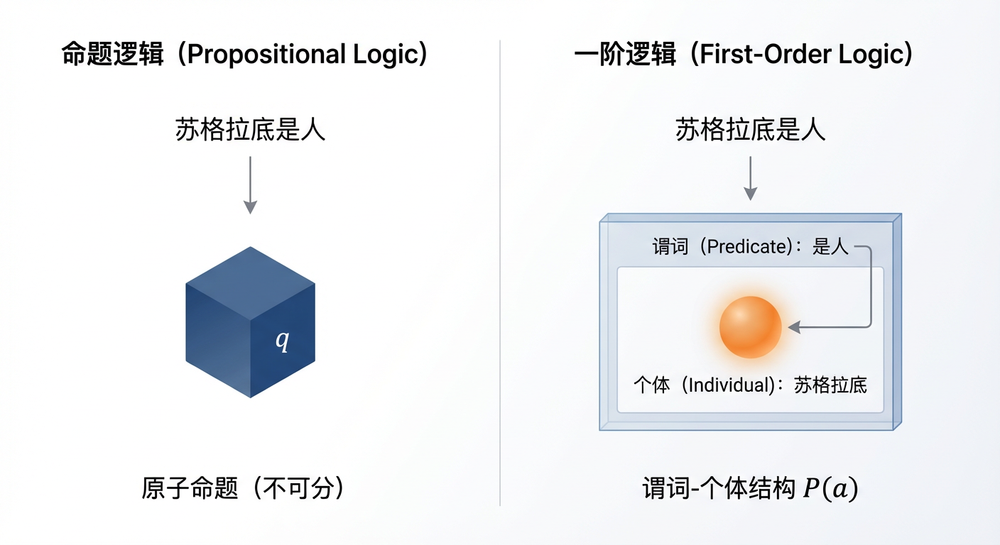
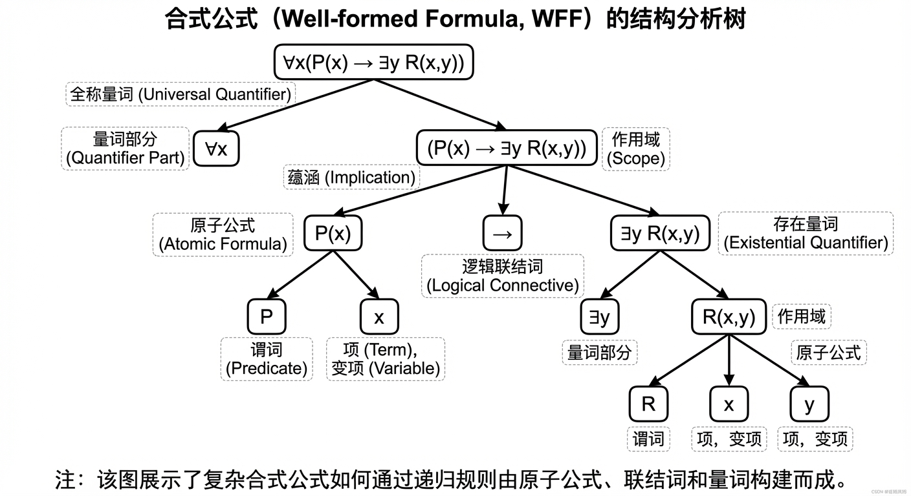
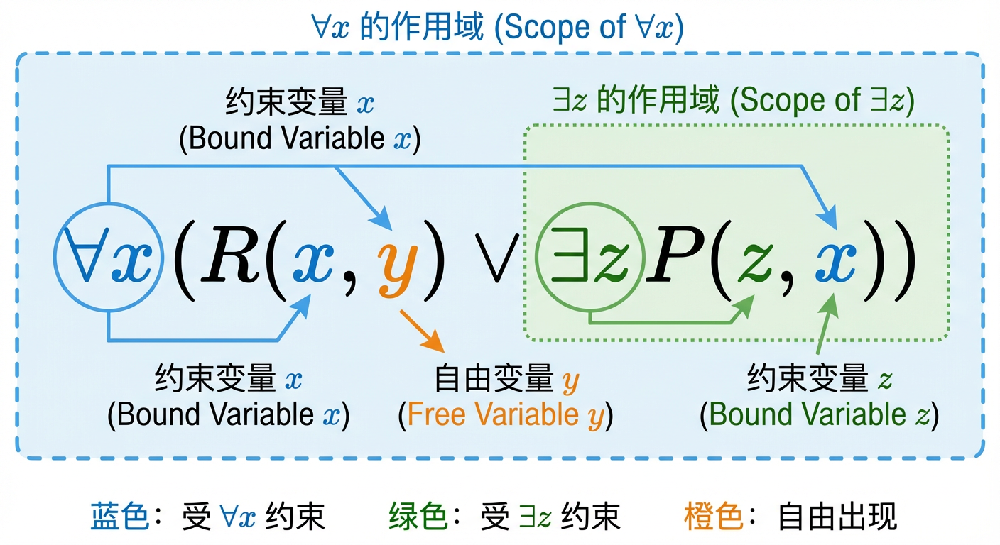
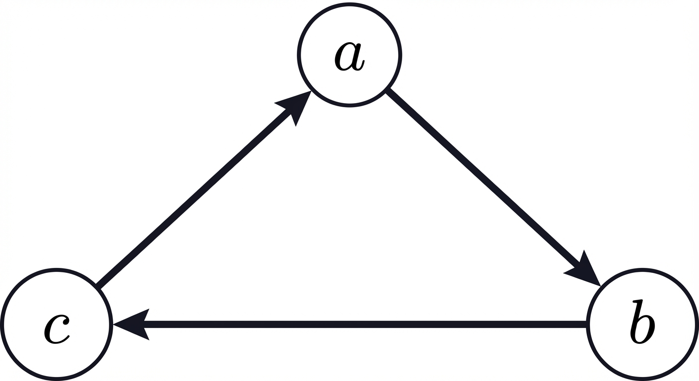
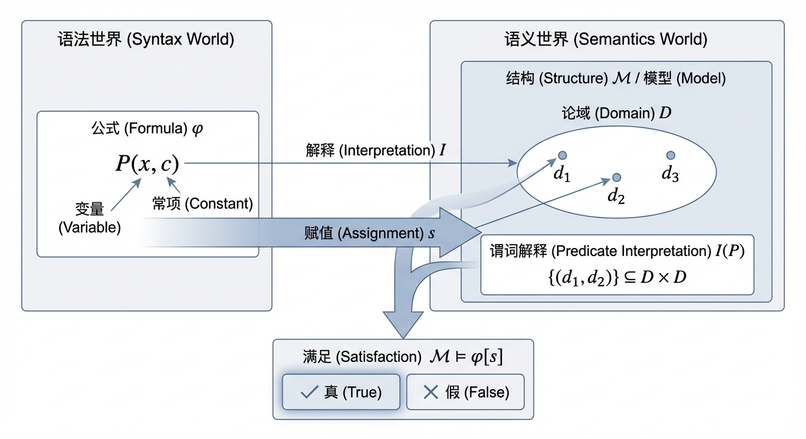
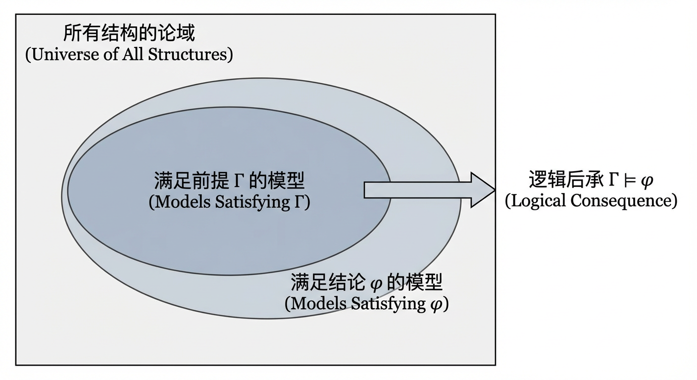
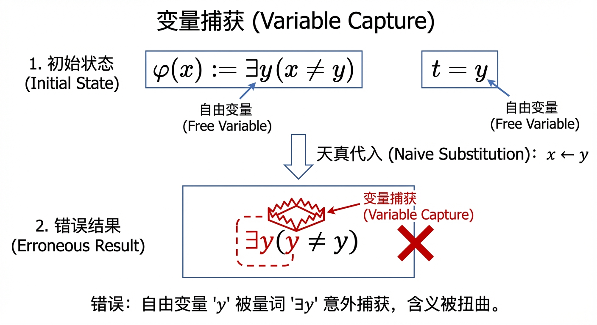
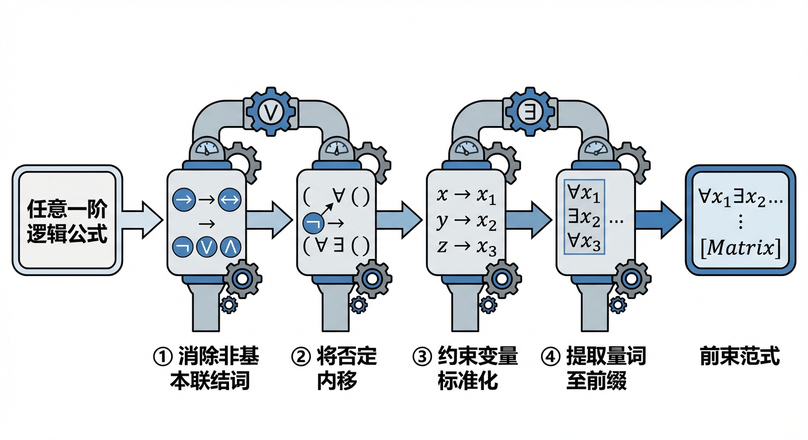

# 第3章：一阶逻辑

命题逻辑为我们提供了分析“命题之间如何组合”的工具，但当论证涉及“对象是谁”“对象满足什么性质”“对象之间有什么关系”以及“所有/存在”等量化表达时，命题逻辑便无法进入命题内部结构。为此，本章引入一阶逻辑：先搭建语言与语义基础（3.1），再在此基础上学习如何在保持语义不变的前提下对公式做等价变形（3.2），从而为后续更系统的推理方法与规范形式转换铺路。

## 3.1 一阶逻辑基本概念

在第二章中，我们探索了命题逻辑的世界，掌握了如何使用逻辑联结词将原子命题组合成复杂的复合命题，并对其进行真值分析与等值演算。这是一个强大的系统，为我们分析论证的整体结构提供了坚实的基础。然而，当我们面对一些司空见惯的论断时，命题逻辑的局限性便显露无遗。例如，思考这个经典的演绎：

> 凡人皆有死。
> 苏格拉底是人。
> 所以，苏格拉底会死。

从直觉上看，这个论证无懈可击。但在命题逻辑的框架下，我们只能将这三个陈述分别符号化为三个独立的原子命题，例如 $p, q, r$。如此一来，推理的形式结构变成了 $p, q \vdash r$，这显然不是一个有效的推理。问题在于，命题逻辑将陈述视为不可再分的原子，它无法深入到陈述的内部，去刻画“凡（所有）”、“是人”、“会死”以及特定个体“苏格拉底”之间的逻辑关系。我们亟需一种表达能力更强的语言，它不仅能处理命题间的联结，更能刻画个体、属性、关系以及“所有”与“存在”这类量化概念。

为应对这一挑战，我们引入**一阶逻辑（First-Order Logic, FOL）**，有时也称为谓词逻辑（Predicate Logic）。它为我们提供了一套精密的工具，用以剖析命题的内部结构，从而能够严谨地表达和推导更为复杂的思想。本节将带领我们搭建一阶逻辑的语言体系，学习其基本构件，掌握从自然语言到一阶逻辑的符号化方法，并最终建立起对一阶逻辑公式的系统性分类框架。

在后续的 3.2 节中，我们将频繁对公式做“替换”“移动量词”“消去联结词”等操作。要理解这些操作何以保持语义不变，必须先牢固掌握本节将建立的语法与语义要点，尤其是：项与合式公式的递归构造、量词的作用域、自由/约束变项的区分，以及“结构—赋值—满足”这套语义框架。

### 一阶逻辑的语言：个体、谓词与量词

构建一阶逻辑这门精确的语言，如同建筑师设计蓝图，需要从最基本的元素开始。这些元素共同构成了一个**一阶逻辑语言的字母表**。在开始任何讨论之前，我们首先需要一个舞台，这个舞台便是**论域（Domain of Discourse）**，也称个体域，它是我们所讨论的全部对象的集合。这个集合必须是非空的，这一约定是为了保证某些基本逻辑定律（如“若所有事物皆为 P，则存在事物为 P”）的普遍有效性。

**1. 个体词 (Individuals)**

个体词是用来指代论域中特定对象的符号。它们分为两类：
*   **常项（Constants）**：用来表示论域中确切、唯一的对象。我们通常用小写字母 $a, b, c, \dots$ 或具有明确含义的字符串（如 `Socrates`, `0`）来表示。
*   **变项（Variables）**：作为论域中任意一个体对象的占位符。我们通常用小写字母 $x, y, z, \dots$ 来表示。

**2. 谓词符号 (Predicate Symbols)**

谓词符号用以描述个体的属性或个体间的关系。每个谓词符号都有一个固定的**元数（Arity）**，即它所需要连接的个体词的数量。
*   **一元谓词**描述单个体的属性，例如，$P(x)$ 可以表示“$x$ 是素数”。
*   **二元谓词**描述两个个体间的关系，例如，$R(x, y)$ 可以表示“$x$ 小于 $y$”。
*   **$n$元谓词**描述 $n$ 个个体间的关系，例如，$T(x, y, z)$ 可以表示“$x, y, z$ 三点共线”。

**3. 函数符号 (Function Symbols)**

函数符号作用于个体，并返回一个个体。与谓词符号一样，每个函数符号也有一个固定的元数。
*   一元函数符号，如 $f(x)$，可以表示“$x$ 的父亲”。
*   二元函数符号，如 $g(x, y)$，可以表示“$x$ 与 $y$ 的和”。
*   元数为 0 的函数符号，等价于常项。

谓词符号、函数符号和常项统称为一个一阶语言的**签名（Signature）**，它定义了该语言的非逻辑符号。

**4. 逻辑符号与合式公式**

除签名外，一阶逻辑还包含一组通用的逻辑符号：命题联结词（$\neg, \land, \lor, \rightarrow, \leftrightarrow$），量词（$\forall, \exists$），等号（$=$）以及括号等辅助符号。通过这些符号，我们可以将上述基本构件组合成有意义的表达式。

首先，我们定义**项（Term）**，它是一个指代论域中对象的表达式。项的集合是满足以下规则的最小集合：
*   任何变项或常项都是一个项。
*   如果 $f$ 是一个 $n$ 元函数符号，$t_1, t_2, \dots, t_n$ 都是项，那么 $f(t_1, t_2, \dots, t_n)$ 也是一个项。

接着，我们定义**原子公式（Atomic Formula）**，它是能被赋予真值的最简单的陈述。
*   如果 $P$ 是一个 $n$ 元谓词符号，$t_1, t_2, \dots, t_n$ 都是项，那么 $P(t_1, t_2, \dots, t_n)$ 是一个原子公式。
*   如果 $t_1, t_2$ 都是项，那么 $t_1 = t_2$ 是一个原子公式。等号是一个特殊的、具有固定解释的逻辑谓词符号。

最后，我们通过结构归纳法定义**合式公式（Well-formed Formula, WFF）**的集合：

*   任何原子公式都是一个合式公式。
*   如果 $\varphi$ 和 $\psi$ 是合式公式，那么 $\neg \varphi, (\varphi \land \psi), (\varphi \lor \psi), (\varphi \rightarrow \psi), (\varphi \leftrightarrow \psi)$ 都是合式公式。
*   如果 $\varphi$ 是一个合式公式，$x$ 是一个变项，那么 $\forall x \varphi$ 和 $\exists x \varphi$ 都是合式公式。这两个符号，即**全称量词（Universal Quantifier）** $\forall$（读作“对于所有”）和**存在量词（Existential Quantifier）** $\exists$（读作“存在”），是一阶逻辑表达能力的核心。

**5. 自由变项与约束变项**

量词的引入带来了一个至关重要的概念：变项的**约束（Binding）**。在一个公式中，变项的出现可以分为**自由出现（Free Occurrence）**和**约束出现（Bound Occurrence）**。直观上，一个被量词“管辖”的变项是约束的，否则是自由的。我们可以通过对公式结构的递归来精确定义：

*   在原子公式中，所有变项的出现都是自由的。
*   在 $\neg\varphi, \varphi \land \psi, \varphi \lor \psi, \varphi \rightarrow \psi$ 中，变项的自由/约束状态与其在子公式 $\varphi, \psi$ 中的状态相同。
*   在 $\forall x \varphi$ 和 $\exists x \varphi$ 中，量词 $\forall x$ 或 $\exists x$ 将 $\varphi$ 中所有原为自由的 $x$ 的出现都“捕获”并变为约束的。$\varphi$ 中其他变项的自由/约束状态保持不变。

例如，在公式 $\forall x (R(x, y) \lor \exists z P(z, x))$ 中：
*   变项 $y$ 的唯一一次出现不受任何量词约束，因此是自由的。
*   变项 $z$ 的出现位于量词 $\exists z$ 的作用域内，因此是约束的。
*   变项 $x$ 的两次出现（一次在 $R(x, y)$ 中，一次在 $P(z, x)$ 中）都位于最外层量词 $\forall x$ 的作用域内，因此它们都是约束的。
最终，该公式中 $x$ 有 0 次自由出现和 2 次约束出现，$y$ 有 1 次自由出现和 0 次约束出现，$z$ 有 0 次自由出现和 1 次约束出现。

一个不含任何自由变项的公式被称为**句子（Sentence）**。区分自由与约束变项对于后续的等值演算和推理规则至关重要，它能帮助我们避免因变项混淆而导致的致命逻辑错误。

尤其要注意，“捕获”这一现象并不仅是语义解释时的概念：在 3.2 节进行代入与等值变形时，若不保持“自由变项仍自由、约束变项仍约束”的结构，便可能把原本等价的变形变成语义改变的错误变形；因此 3.2 节将引入更严格的变量管理（如 $\alpha$-转换）来系统规避变量捕获。

### 从自然语言到一阶逻辑：符号化的艺术

掌握了一阶逻辑的语言构件后，我们便可以将模糊、多义的自然语言陈述，翻译成精确、无歧义的逻辑公式。这不仅是一项技术，更是一种强迫我们进行概念分析的思维训练。

**1. 全称与存在命题的典型模式**

*   **“所有 A 都是 B”**：这类命题通常翻译为 $\forall x (A(x) \rightarrow B(x))$。例如，“所有哺乳动物都是温血动物”，可以符号化为 $\forall x (M(x) \rightarrow W(x))$，其中 $M(x)$ 表示“$x$ 是哺乳动物”，$W(x)$ 表示“$x$ 是温血动物”。这里的蕴含联结词 $\rightarrow$ 至关重要，它将我们的断言范围限定在满足前提 $A(x)$ 的个体上。若误用合取 $\land$，写成 $\forall x(M(x) \land W(x))$，其含义将变为“宇宙中的每一个体既是哺乳动物又是温血动物”，这显然是错误的。
*   **“有些 A 是 B”**：这类命题通常翻译为 $\exists x (A(x) \land B(x))$。例如，“有些学生是党员”，可符号化为 $\exists x (S(x) \land C(x))$，其中 $S(x)$ 表示“$x$ 是学生”，$C(x)$ 表示“$x$ 是党员”。这里必须使用合取 $\land$，因为它断言了同时具备两种属性的个体的存在。若误用蕴含 $\rightarrow$，写成 $\exists x(S(x) \rightarrow C(x))$，其含义将变为“存在一个个体，如果他是学生，那么他是党员”。这是一个非常弱的断言，因为只要论域中存在一个不是学生的人（例如一位教授），这个蕴含式的前件为假，整个式子便为真，这完全没有表达出原意。

**2. 量词的顺序：意义的舞蹈**

当一个公式中出现多个量词时，它们的顺序绝非无足轻重，交换量词顺序往往会彻底改变命题的含义。这背后体现的是变量间的**依赖关系**。

考虑以下两个句子：
1. $\forall x \exists y \, \text{Loves}(x, y)$
2. $\exists y \forall x \, \text{Loves}(x, y)$

第一个句子断言：“对于每一个人 $x$，都存在一个人 $y$，使得 $x$ 爱 $y$。”这是一个关于普遍存在爱之对象的乐观陈述。这里，$y$ 的选择可以**依赖**于 $x$ 的选择：张三可能爱李四，而王五可能爱赵六。

第二个句子则断言：“存在一个人 $y$，使得对于每一个人 $x$，都有 $x$ 爱 $y$。”这是一个强度高得多的陈述，它断言存在一个“万人迷”，被所有人共同爱慕。这里，必须先找到一个**统一的、不依赖于 $x$** 的 $y$，它对所有 $x$ 都有效。

显然，第二个命题蕴含第一个，但反之不成立。我们可以构造一个简单的模型来清晰地展示这一点。设论域 $D = \{a, b, c\}$，关系 $R$ 的解释为 $R^{\mathcal{G}} = \{(a, b), (b, c), (c, a)\}$，可以想象成一个循环指向的图。

*   $\forall x \exists y R(x, y)$ 在该模型中为**真**。因为对于 $x=a$，存在 $y=b$ 使得 $(a,b) \in R^{\mathcal{G}}$；对于 $x=b$，存在 $y=c$；对于 $x=c$，存在 $y=a$。每个元素都有一个“出边”。
*   $\exists y \forall x R(x, y)$ 在该模型中为**假**。因为不存在一个元素，是所有元素的“入边”终点。例如，选择 $y=a$，并非所有的 $x$ 都有 $(x,a) \in R^{\mathcal{G}}$（只有 $(c,a)$）。对 $y=b, c$ 的检验同样失败。

量词的顺序决定了意义的架构。在符号化复杂的自然语言句子时，如“有两个不同的评审阅读了每一篇论文”，正确处理量词的嵌套和作用域，是精确捕捉其逻辑内涵的关键。该句的一种正确翻译是 $\exists r_1 \exists r_2 (R(r_1) \land R(r_2) \land r_1 \neq r_2 \land \forall p (P(p) \rightarrow (\text{Read}(r_1, p) \land \text{Read}(r_2, p))))$，其中存在量词在外，保证了是“同样两位”评审阅读了“所有”论文。

量词顺序与作用域的敏感性，将在 3.2 节的“前束范式”中以更系统的方式体现：前束范式把所有量词提到公式最前端，使量词的嵌套与交替结构直接可见；也正因如此，任何对量词位置的移动都必须依赖严格的等值规则与变量条件。

**3. 用一阶逻辑定义数学性质**

一阶逻辑的精确性使其成为定义数学概念的理想工具。例如，对于一个一元函数 $f$，我们可以用一阶逻辑句子来定义其核心性质：
*   **单射性（Injectivity）**：如果不同的输入总能得到不同的输出，则函数是单射的。
    $$ \forall x \forall y (f(x) = f(y) \rightarrow x=y) $$
*   **满射性（Surjectivity）**：如果值域中的每一个元素都至少有一个原像，则函数是满射的。
    $$ \forall y \exists x (f(x) = y) $$

这种将抽象性质翻译为严格逻辑公式的能力，是一阶逻辑在数学、计算机科学和哲学中发挥巨大作用的根源。从定义等价关系（见第4章）的基本公理，到构建整个皮亚诺算术（Peano Arithmetic）体系，一阶逻辑为构建严谨的理论大厦提供了坚不可摧的基石。值得注意的是，皮亚诺算术中的数学归纳法原理，在一阶逻辑中必须通过一个**公理模式（Axiom Schema）**来表达，即为语言中每一个可定义的性质都提供一条归纳公理。这恰恰反映了一阶逻辑的“一阶”特性：它只能量化个体（数），而不能直接量化性质（数的集合）。

### 公式、语义与分类

构建了一阶逻辑的公式后，我们自然要问：它们的意义是什么？一个公式何时为真？

**1. 真值、模型与满足**

与命题逻辑不同，一阶逻辑公式的真值不是普适的，而是相对于一个**结构（Structure）**或**模型（Model）**而言。一个结构 $\mathcal{M}$ 由两部分组成：一个非空论域 $D$，以及对语言签名中所有常项、函数符号和谓词符号的一个具体**解释（Interpretation）**。例如，对于包含常项 $0$ 和函数符号 $S$ 的语言，一个结构可以解释为自然数集 $\mathbb{N}$，其中 $0$ 解释为数字 0，$S$ 解释为后继函数 $n \mapsto n+1$。

对于一个包含自由变项的公式，其真值还依赖于一个**赋值（Assignment）** $s$，它将每个自由变项映射到论域中的一个元素。我们用 $\mathcal{M} \vDash \varphi[s]$ 表示公式 $\varphi$ 在结构 $\mathcal{M}$ 和赋值 $s$ 下为真（或称被满足）。真值的定义是依据塔斯基（Tarski）真理理论递归定义的：

*   原子公式的真值由解释直接决定。例如，$\mathcal{M} \vDash R(t_1, \dots, t_n)[s]$ 当且仅当由项 $t_1, \dots, t_n$ 在 $\mathcal{M}$ 和 $s$ 下解释成的对象元组，属于谓词 $R$ 在 $\mathcal{M}$ 中的解释。
*   逻辑联结词的语义与命题逻辑相同。例如，$\mathcal{M} \vDash \varphi \land \psi [s]$ 当且仅当 $\mathcal{M} \vDash \varphi[s]$ 且 $\mathcal{M} \vDash \psi[s]$。
*   量词的语义通过变动赋值来定义。例如，$\mathcal{M} \vDash \forall x \varphi[s]$ 当且仅当对于论域 $D$ 中的**每一个**元素 $a$，都有 $\mathcal{M} \vDash \varphi[s(x|a)]$ 成立，其中 $s(x|a)$ 是一个将 $x$ 映射到 $a$ 而其他变项保持不变的新赋值。

让我们通过一个具体的例子来感受这个过程。考虑句子 $\exists x (S(x) = S(S(0)))$ 在我们刚刚定义的自然数结构 $\mathcal{M}$ 中。为了判断其真值，我们需要在论域 $\mathbb{N}$ 中寻找一个“见证者” $a$，使得 $S(x)=S(S(0))$ 在 $x$ 被赋值为 $a$ 时成立。首先，我们解释右侧的项 $S(S(0))$：$0$ 解释为 0，$S(0)$ 解释为 $0+1=1$，$S(S(0))$ 解释为 $1+1=2$。于是，问题转化为：是否存在一个自然数 $a$，使得 $S(a)$ 的解释等于 2？$S(a)$ 解释为 $a+1$，所以我们需要 $a+1=2$。解得 $a=1$。由于 $1$ 是论域 $\mathbb{N}$ 中的一个元素，我们找到了一个见证者。因此，该句子在结构 $\mathcal{M}$ 中为真。

**2. 公式的分类与逻辑后承**

基于公式在不同结构下的真值表现，我们可以对其进行分类：
*   **可满足的（Satisfiable）**：如果一个公式至少在一个结构中（对某个赋值）为真。
*   **永假的 / 矛盾的（Contradiction）**：如果一个公式在任何结构中（对任何赋值）都为假。
*   **有效的 / 永真的（Valid / Tautology）**：如果一个公式在所有结构中（对任何赋值）都为真。

这引出了逻辑推理的核心概念——**逻辑后承（Logical Consequence）**。我们称一组前提 $\Gamma$ 逻辑上蕴含结论 $\varphi$，记作 $\Gamma \vDash \varphi$，当且仅当任何满足 $\Gamma$ 中所有公式的结构，也必然满足 $\varphi$。这正是对“有效论证”的语义刻画。例如，我们可以证明：

$$ \{\forall x (P(x) \rightarrow Q(x)), \exists x P(x)\} \vDash \exists x Q(x) $$
证明思路如下：假设任意一个结构 $\mathcal{M}$ 满足前提。由 $\mathcal{M} \vDash \exists x P(x)$，可知论域中存在某个体 $a$，使得 $P(a)$ 为真。又由 $\mathcal{M} \vDash \forall x (P(x) \rightarrow Q(x))$，可知对于论域中所有个体，包括 $a$，蕴含式 $P(a) \rightarrow Q(a)$ 均为真。根据蕴含的真值条件，当一个蕴含式及其前件都为真时，其后件必为真。因此，$Q(a)$ 在 $\mathcal{M}$ 中为真。既然我们找到了一个个体 $a$ 使得 $Q(a)$ 为真，那么根据存在量词的语义，$\exists x Q(x)$ 在 $\mathcal{M}$ 中必然为真。由于 $\mathcal{M}$ 是任意的，所以该逻辑后承关系成立。

至此，我们已经拥有了“写公式（语法）—解释公式（语义）—判断蕴含（后承）”的基本框架。接下来一个自然问题是：能否像代数变形那样，把复杂公式化简或改写成更适合推理与计算的形式，同时不改变其在所有结构与赋值下的真值？这正引向 3.2 节的一阶逻辑等值演算：它以本节的“满足关系”“自由/约束变项”“量词作用域”为前提，系统研究哪些变形是可靠的、以及为什么可靠。

### 小结

本节中，我们从命题逻辑的表达局限性出发，揭示了引入一阶逻辑的必要性。通过建立由个体词、谓词、函数符号、逻辑符号和量词构成的精密语言体系，我们获得了深入分析命题内部结构的能力。我们学习了如何将自然语言的陈述，特别是涉及全称和存在的量化命题，严谨地符号化为一阶逻辑公式，并特别强调了量词顺序对命题语义的决定性影响。通过对自由与约束变项的区分，以及对公式递归构造的理解，我们为后续的等值演算奠定了语法基础。

一阶逻辑不仅是一种形式语言，更是一个强大的思维框架。它迫使我们在建模时明确我们的**论域**，定义我们使用的**概念**（谓词和函数），并清晰地陈述它们之间的**关系**。这种从具体实例（结构与赋值）出发定义真值的语义学思想，为我们判断一个论断是否为“真理”（永真性）或一个论证是否“可靠”（逻辑后承）提供了坚实的标准。本节建立的符号化能力和语义直觉，是运用逻辑工具刻画和推理离散结构（如后续章节中的关系、函数、图）的基石。

现在，我们已经能够读写一阶逻辑的语言。下一步自然是学习这门语言的“代数”——如何对公式进行等价变形，以简化它们、揭示其内在结构，并为机器自动推理铺平道路。这将是我们下一节——“一阶逻辑等值演算”——的核心主题。

特别地，本节末尾反复出现的“保持语义不变”“避免变量混淆”两条主线，将在 3.2 节中分别对应为：逻辑等价 $\equiv$ 的严格定义与等值式系统，以及为防止变量捕获而引入的 $\alpha$-转换与无捕获代入原则。

## 3.2 一阶逻辑等值演算

在上一节中，我们已经掌握了如何将自然语言的命题翻译为精确的一阶逻辑公式，从而为复杂的论证与结构描述提供了形式化的语言。然而，仅仅能够“写出”公式是不够的。如同在代数中我们需要通过等式变形来求解方程一样，在逻辑中，我们也需要对公式进行等价的改写，以揭示其更深层的结构、简化其形式，或为后续的推理和计算做准备。本节的目标，便是从“构建公式”迈向“操作公式”，建立一套在一阶逻辑领域行之有效的等值演算系统。

与第二章的命题逻辑等值演算相比，一阶逻辑的演算体系既有继承，更有发展。所有命题逻辑的等值式，如德摩根定律、分配律等，在一阶逻辑的公式层面依然完全适用，因为一阶逻辑公式的骨架正是由命题联结词构成的。然而，量词（$\forall, \exists$）和变量的引入，也带来了新的、更为精妙的规则与挑战。本节将首先定义一阶逻辑中的等价关系，然后系统地介绍涉及量词的等值式与置换规则，并特别强调在演算中如何通过规范的变量管理来避免语义谬误。最终，我们将把这些规则整合为一条标准化的流水线，用于将任何公式转化为一种重要的规范形式——**前束范式（Prenex Normal Form, PNF）**，并阐明其在理论与实践中的枢纽地位。

注意：本节所谓“等值”并不是指某个固定模型中的同真同假，而是如 3.1 节所述，要求在任意结构与任意赋值下保持同真同假；也正因为真值依赖赋值与量词作用域，任何“代入”或“移动量词”的操作都必须显式检查自由/约束变项与作用域条件，否则就可能破坏 3.1 节建立的满足关系。

### 一阶逻辑等值式与置换规则

#### 一阶逻辑中的等价关系

我们首先需要精确地定义何为“语义不变”。在命题逻辑中，两个公式等价意味着它们有相同的真值表。这个概念可以自然地推广到一阶逻辑。

**定义 3.2.1（逻辑等价）**：设 $\varphi$ 和 $\psi$ 是两个（可能含有自由变量的）一阶逻辑公式。如果对于任意论域上的任意结构 $\mathcal{M}$ 和任意变量赋值 $s$，$\varphi$ 和 $\psi$ 的真值都相同，那么称 $\varphi$ 和 $\psi$ 是**逻辑等价的（logically equivalent）**，记作 $\varphi \equiv \psi$。

根据定义，$\varphi \equiv \psi$ 成立，当且仅当对于任意的解释 $(\mathcal{M}, s)$，我们有 $\mathcal{M}, s \models \varphi$ 与 $\mathcal{M}, s \models \psi$ 同真同假。这也就等价于说，双条件公式 $\varphi \leftrightarrow \psi$ 在任何解释下都为真，即它是一个**逻辑有效式（logically valid formula）**，记为 $\models \varphi \leftrightarrow \psi$。对于不含自由变量的语句（sentence），其等价性意味着它们在所有结构中同真同假。

建立在逻辑等价的基础上，**置换规则（Substitution Rule）**依然有效：若 $\varphi \equiv \psi$，且公式 $\chi$ 包含子公式 $\varphi$，那么将 $\chi$ 中的一个或多个 $\varphi$ 的出现替换为 $\psi$，得到的新公式 $\chi'$ 与原公式 $\chi$ 逻辑等价。这一原理保证了我们可以像在代数中那样，通过一系列等价替换来逐步演化公式，而其逻辑意义保持不变。

然而，与命题逻辑不同的是：在一阶逻辑中，“替换/代入”会与量词绑定变量产生交互。3.1 节定义的自由/约束变项区分，是判断置换操作是否安全的基础；稍后“变量的纪律：代入与 $\alpha$-转换”将把这种直觉精确化为“无捕获代入”的要求。

#### 涉及量词的基本等值式

一阶逻辑等值演算的核心，在于处理量词与逻辑联结词（特别是否定、合取、析取）之间的交互。

**1. 量词的否定（量词德摩根律）**

最基本也最重要的一组等值式，是关于如何将否定符号 $\neg$ “穿越”量词的，它们常被称为量词的德摩根律（De Morgan's laws for quantifiers）。直观地，“并非所有个体都满足性质 $P$”就意味着“存在某个体不满足性质 $P$”；而“不存在任何个体满足性质 $P$”则意味着“所有个体都不满足性质 $P$”。

我们可以从语义上严格地证明这两条规则。例如，对于 $\neg \forall x \varphi(x) \equiv \exists x \neg \varphi(x)$：
$\mathcal{M}, s \models \neg \forall x \varphi(x)$
$\Leftrightarrow$ $\mathcal{M}, s \not\models \forall x \varphi(x)$ （根据 $\neg$ 的语义）
$\Leftrightarrow$ “对于所有 $a \in |\mathcal{M}|, \mathcal{M}, s[x \mapsto a] \models \varphi(x)$” 这句话是假的
$\Leftrightarrow$ 存在某个 $a_0 \in |\mathcal{M}|$，使得 $\mathcal{M}, s[x \mapsto a_0] \models \varphi(x)$ 不成立
$\Leftrightarrow$ 存在某个 $a_0 \in |\mathcal{M}|$，使得 $\mathcal{M}, s[x \mapsto a_0] \models \neg\varphi(x)$ （根据 $\neg$ 的语义）
$\Leftrightarrow$ $\mathcal{M}, s \models \exists x \neg \varphi(x)$ （根据 $\exists$ 的语义）

由此，我们得到两条核心的量词否定等值式：
- (1) $\neg \forall x \varphi(x) \equiv \exists x \neg \varphi(x)$
- (2) $\neg \exists x \varphi(x) \equiv \forall x \neg \varphi(x)$

结合命题逻辑中的双重否定律 $\neg\neg\varphi \equiv \varphi$，我们还能推导出另外两组有用的形式，它们展示了每个量词都可以由另一个量词和否定来定义：
- (3) $\forall x \varphi(x) \equiv \neg \exists x \neg \varphi(x)$
- (4) $\exists x \varphi(x) \equiv \neg \forall x \neg \varphi(x)$

例如，一个安防系统的告警条件是“并非所有服务器都安全”。若设 $C(s)$ 为“服务器 $s$ 被入侵”，那么“服务器 $s$ 安全”就是 $\neg C(s)$。告警条件可翻译为 $\neg(\forall s, \neg C(s))$。利用量词否定律 (1) 和双重否定律，我们可以进行如下推导：
$\neg(\forall s, \neg C(s)) \equiv \exists s, \neg(\neg C(s)) \equiv \exists s, C(s)$
这个演算过程清晰地揭示了，“并非所有都安全”的真正语义是“至少有一个不安全（被入侵）”。

**2. 量词辖域的扩张与收缩**

另一组重要的等值式，规定了量词的辖域（scope）如何合法地跨越合取（$\land$）和析取（$\lor$）联结词。其基本原则是：如果一个量词所约束的变量在联结的另一部分公式中没有自由出现，那么该量词的辖域就可以自由地扩张或收缩。

设 $Q$ 代表 $\forall$ 或 $\exists$。若变量 $x$ 在公式 $\psi$ 中没有自由出现（记为 $x \notin FV(\psi)$），则下列等值式成立：
- (5) $(Q x \varphi(x)) \land \psi \equiv Q x (\varphi(x) \land \psi)$
- (6) $(Q x \varphi(x)) \lor \psi \equiv Q x (\varphi(x) \lor \psi)$
（相应的，$\psi$ 在左侧的对称形式也成立）

例如，考虑语句“所有哲学家都值得尊敬，并且苏格拉底是人”。设 $P(x)$ 为“$x$ 是哲学家”，$H(x)$ 为“$x$ 是人”，$R(x)$ 为“$x$ 值得尊敬”，$s$ 代表苏格拉底。公式为 $(\forall x (P(x) \to R(x))) \land H(s)$。由于变量 $x$ 没有在 $H(s)$ 中自由出现，我们可以将 $\forall x$ 的辖域扩张至整个公式：$\forall x ((P(x) \to R(x)) \land H(s))$。

然而，当量词与蕴含（$\to$）交互时，情况变得复杂。我们通常先将 $\varphi \to \psi$ 改写为 $\neg \varphi \lor \psi$，再应用上述规则。但直接处理也有规律，只是需要格外小心。同样，在 $x \notin FV(\psi)$ 的条件下：
- (7) $(\forall x \varphi(x)) \to \psi \equiv \exists x (\varphi(x) \to \psi)$
- (8) $(\exists x \varphi(x)) \to \psi \equiv \forall x (\varphi(x) \to \psi)$
- (9) $\psi \to (\forall x \varphi(x)) \equiv \forall x (\psi \to \varphi(x))$
- (10) $\psi \to (\exists x \varphi(x)) \equiv \exists x (\psi \to \varphi(x))$

注意到，当被量化的子公式出现在蕴含式的前件时，量词的类型（$\forall$ 变为 $\exists$，$\exists$ 变为 $\forall$）发生了改变！这引发了我们的思考：为何会如此？读者可以尝试将 $\varphi \to \psi$ 展开为 $\neg \varphi \lor \psi$，然后利用量词否定等值式自行推导，便会发现这一现象的根源在于否定与量词的交互。

#### 变量的纪律：代入与 $\alpha$-转换

在进行等值演算，尤其是移动量词或应用某些推理规则时，一阶逻辑引入了一个命题逻辑中不存在的微妙风险：**变量捕获（variable capture）**。如果一个代入或变换操作，使得一个原本自由的变量，意外地落入了一个同名量词的辖域之内，那么公式的语义可能被彻底改变。

让我们看一个经典的警示案例。考虑公式 $\varphi(x) := \exists y (x \neq y)$，它断言“存在一个个体不等于 $x$”。在一个至少包含两个元素的论域中，无论 $x$ 被赋予何值，这个公式都为真。现在，假设我们想用项 $t=y$ 来代入 $x$。一个“天真”的纯文本替换会得到 $\exists y (y \neq y)$。这个新公式的含义是“存在一个个体不等于它自身”，这在任何标准模型中都必然为假。一个恒真的断言（在特定模型类中）变成了一个永假的断言！问题出在哪里？项 $t$ 中的变量 $y$ 在代入之前是自由的，但代入之后，它被公式 $\varphi$ 中原有的量词 $\exists y$ 所“捕获”，其意义被完全扭曲。

为了保证等值演算的正确性，我们必须遵守严格的变量纪律。所有涉及变量代入的操作，都必须是**无捕获的（capture-avoiding）**。实现这一目标的核心技术，是**约束变量的重命名**，在逻辑中称为 **$\alpha$-转换（alpha-conversion）**。

**$\alpha$-转换**：一个子公式 $Q x \varphi(x)$ 可以被逻辑等价地替换为 $Q z \varphi(z)$，前提是：
1. $z$ 是一个新的变量，它在 $\varphi(x)$ 中没有自由出现。
2. 将 $\varphi(x)$ 中所有 $x$ 的自由出现都替换为 $z$。

例如，在公式 $(\forall x P(x)) \lor (\exists x Q(x))$ 中，两个量词都使用了变量 $x$。虽然这在语法上是合法的，但为了后续演算的便利与安全，我们应当首先对其中一个约束变量进行重命名。例如，将第二个子公式改写为 $\exists y Q(y)$，整个公式就变为 $(\forall x P(x)) \lor (\exists y Q(y))$。经过这样的**变量标准化（standardizing variables apart）**处理后，每一个量词都绑定了一个唯一的变量名，从而极大地降低了在后续步骤中发生变量捕获的风险。这是进行复杂等值演算前一个至关重要的“卫生”步骤。

这里的关键点是：3.1 节中“自由/约束变项”的区分不仅用于读懂公式，还直接决定了哪些变换是合法等值变换；因此，任何涉及“代入”的步骤，都必须配合 $\alpha$-转换，确保代入后自由变项集合的变化符合预期而非被意外捕获。

### 前束范式 (Prenex Normal Form)

现在，我们已经拥有了一套处理量词的等值式，并了解了保证演算安全性的变量管理纪律。一个自然的问题是：能否利用这些工具，将任意一个一阶逻辑公式都化约为某种统一的、结构简明的“标准形式”？答案是肯定的，而前束范式就是这样一种最重要的标准形式。

**定义 3.2.2（前束范式）**：一个一阶逻辑公式被称为处于**前束范式（Prenex Normal Form, PNF）**中，如果它具有如下结构：
$$ Q_1 x_1 Q_2 x_2 \dots Q_n x_n \, M $$
其中，$Q_1, \dots, Q_n$ 是量词（$\forall$ 或 $\exists$），$x_1, \dots, x_n$ 是不同的变量，而 $M$ 是一个**不含量词的公式**。量词串 $Q_1 x_1 \dots Q_n x_n$ 被称为公式的**前缀（prefix）**，而无量词的公式 $M$ 则被称为**母式（matrix）**。

前束范式的核心思想是将公式的量化部分（关于“多少”）与命题逻辑部分（关于“是什么”）完全分离。这极大地简化了公式的结构，使其内在的量化复杂度——例如量词的嵌套和交替情况——一目了然。

#### 转换为前束范式的算法

对于任何一个一阶逻辑公式，我们都存在一个算法，能找到一个与之逻辑等价的前束范式。这个算法就像一条流水线，系统地对公式进行重整。

**PNF 转换算法：**

1.  **步骤一：消除非基本联结词**
    利用等值式 $\varphi \to \psi \equiv \neg\varphi \lor \psi$ 和 $\varphi \leftrightarrow \psi \equiv (\neg\varphi \lor \psi) \land (\neg\psi \lor \varphi)$，将公式中所有的 $\to$ 和 $\leftrightarrow$ 消除，使得公式中只含有联结词 $\neg, \land, \lor$。

2.  **步骤二：将否定内移**
    反复应用量词否定等值式和命题逻辑的德摩根律，将所有否定符号 $\neg$ 向内推，直至它们只直接作用于原子公式。经过这一步，公式被转化为其**否定范式（Negation Normal Form, NNF）**。
    例如，要转化 $\neg \forall x (\varphi(x) \lor \exists y \psi(x,y))$：
    $\neg \forall x (\varphi(x) \lor \exists y \psi(x,y))$
    $\equiv \exists x \neg(\varphi(x) \lor \exists y \psi(x,y))$ （量词否定）
    $\equiv \exists x (\neg\varphi(x) \land \neg\exists y \psi(x,y))$ （德摩根律）
    $\equiv \exists x (\neg\varphi(x) \land \forall y \neg\psi(x,y))$ （量词否定）
    在最终的公式 $\exists x (\neg\varphi(x) \land \forall y \neg\psi(x,y))$ 中，所有否定符号都紧邻原子公式，即达到了 NNF。

3.  **步骤三：约束变量标准化**
    检查公式，对所有约束变量进行重命名（$\alpha$-转换），以确保每个量词都绑定一个唯一的变量名。这可以有效预防下一步中可能出现的变量捕获问题。

4.  **步骤四：提取量词至前缀**
    反复应用前文介绍的量词辖域扩张等值式（如 $(Qx \varphi) \land \psi \equiv Qx(\varphi \land \psi)$ 等），由内向外地将所有量词依次“拉”到公式的最前端。如果在某一步中，应用规则的边条件（如 $x \notin FV(\psi)$）不被满足，就必须先对该约束变量进行重命名（回到步骤三），然后再继续提取。

通过以上四个步骤，任何一阶逻辑公式都能被机械地转换为一个与之逻辑等价的前束范式。

#### PNF 转换实例与语义解读

让我们通过一个实例来完整地体验这个过程，并观察 PNF 如何帮助我们理清思路。考虑语句：“每个哲学家都敬佩某位数学家”。
设 $Ph(x)$：“$x$是哲学家”，$Ma(x)$：“$x$是数学家”，$Adm(x,y)$：“$x$敬佩$y$”。
初始翻译为：$\forall x (Ph(x) \to \exists y (Ma(y) \land Adm(x,y)))$

1.  **消除蕴含**：
    $\forall x (\neg Ph(x) \lor \exists y (Ma(y) \land Adm(x,y)))$

2.  **否定已在内部**：公式已是 NNF。

3.  **变量标准化**：变量 $x$ 和 $y$ 已是唯一的，无需重命名。

4.  **提取量词**：现在需要将 $\exists y$ 移到 $\forall x$ 的辖域之外。由于 $y \notin FV(\neg Ph(x))$，我们可以应用析取辖域扩张规则：
    $\neg Ph(x) \lor \exists y (Ma(y) \land Adm(x,y)) \equiv \exists y (\neg Ph(x) \lor (Ma(y) \land Adm(x,y)))$
    代入回原公式，得到：
    $\forall x \exists y (\neg Ph(x) \lor (Ma(y) \land Adm(x,y)))$

这就是最终的 PNF。其前缀为 $\forall x \exists y$，母式为 $\neg Ph(x) \lor (Ma(y) \land Adm(x,y))$。

值得注意的是，前缀中量词的顺序和类型至关重要，它精确地反映了变量之间的依赖关系。前缀 $\forall x \exists y$ 告诉我们，对于每一个 $x$（哲学家），我们所找到的那个 $y$（数学家）都**可能依赖于**这个 $x$。不同的哲学家可以敬佩不同的数学家。如果我们错误地交换了量词顺序，得到 $\exists y \forall x (\dots)$，其语义将变为“存在一位数学家，他/她被所有哲学家所敬佩”——这显然是一个比原意强得多、且通常不成立的断言。

再看一个例子，考虑一条网络安全策略的否定形式：$\Phi = \neg \exists x \forall y (R(x,y) \to P(y))$，意为“不存在这样一个节点 $x$，它的所有邻居 $y$ 都满足策略 $P$”。这个双重嵌套的否定句式在直觉上不易把握。但通过 PNF 转换：
$\Phi \equiv \forall x \neg \forall y (R(x,y) \to P(y))$
$\equiv \forall x \exists y \neg(R(x,y) \to P(y))$
$\equiv \forall x \exists y (R(x,y) \land \neg P(y))$
转换后的 PNF 形式 $\forall x \exists y (R(x,y) \land \neg P(y))$ 的语义就变得异常清晰：“对每一个节点 $x$，都存在一个邻居 $y$，它不满足策略 $P$”。前束范式通过句法上的整理，极大地增强了公式的语义可读性。

通过“等价关系—量词等值式—变量纪律—PNF 流水线”的逐层推进，我们把 3.1 节给出的语义框架（结构与赋值下的满足）转化为可操作的句法工具：既能保证变形不改变语义，又能将公式整理成结构统一、便于进一步推理处理的形式。这将直接支撑后续更强的规范化与自动推理技术（例如从 PNF 进一步走向子句范式与归结）。

### 小结

本节内容从命题逻辑的等值演算自然过渡到了一阶逻辑的等值演算。我们看到，尽管所有命题逻辑的等值式依然有效，但量词的引入迫使我们必须建立一套新的、与量词和变量相关的规则体系。量词的否定、辖域的变换，以及为避免变量捕获而进行的严格变量管理（$\alpha$-转换），共同构成了这套新体系的核心。

在此基础上，我们引入了前束范式（PNF）这一关键的标准化形式。将任意公式转换为 PNF 的算法，不仅是一次纯粹的句法练习，更是一种深刻的结构分析。它将公式中纠缠不清的量化关系和命题关系梳理开来，形成清晰的“量词前缀 + 无量词母式”结构。

这种结构上的明晰性，使得前束范式成为连接逻辑理论与计算机科学应用的重要桥梁。一方面，它使得公式的量化复杂度（如量词交替次数）得以精确度量，这在可计算性理论和计算复杂性理论中有着深远的应用。另一方面，更为关键的是，PNF 是通往**子句范式（clausal form）** 的必经之路。在后续章节我们将看到，自动定理证明等领域中的核心算法，如归结原理，都要求输入是子句形式。而从 PNF 到子句范式的转换，需要引入一个重要的新技术——**斯科伦化（Skolemization）**，它将消除存在量词，为最终实现逻辑推理的机械化和自动化奠定基础。因此，掌握一阶逻辑的等值演算与前束范式，不仅是对逻辑语言本身的深入理解，更是开启计算逻辑之门的钥匙。

回顾 3.1 与 3.2：前者回答“如何精确表达与解释量化语句”，后者回答“如何在不改变解释结果的前提下改写与规范化表达”。两者共同构成一阶逻辑的核心技能：既能建模（写对），又能演算（变对）。理解“自由/约束变项”与“无捕获代入”的必要性，是把语义正确性落实到具体变形步骤中的关键桥梁。

## 总结

本章围绕“一阶逻辑如何表达并处理含量化的数学与日常陈述”建立了从语言到演算的完整链条。

在 3.1 节，我们从命题逻辑无法刻画“对象—性质—关系—量化”结构这一局限出发，引入一阶逻辑并系统搭建其语法与语义：用论域与签名刻画讨论对象与非逻辑符号，用项、原子公式与合式公式给出递归构造规则，用量词引入对“所有/存在”的表达能力，并通过自由变项与约束变项的区分澄清量词的绑定机制；在语义层面，借助结构、赋值与满足关系（塔斯基语义）定义公式真值，从而给出可满足、永假、有效等分类，并以逻辑后承 $\Gamma \vDash \varphi$ 作为“有效论证”的语义标准。

在 3.2 节，我们在上述语义基础上引入逻辑等价 $\equiv$，并给出一阶逻辑等值演算的关键规则：量词否定（量词德摩根律）、量词辖域的扩张与收缩以及与蕴含交互时的量词变化规律；同时强调变量纪律，指出变量捕获会改变真值条件，从而必须通过无捕获代入与 $\alpha$-转换保持语义不变。在此基础上，我们提出前束范式（PNF）及其标准转换算法（消去 $\to,\leftrightarrow$；否定内移得到 NNF；变量标准化；提取量词），把任意公式整理为“量词前缀 + 无量词母式”的统一结构，为后续进一步规范化（如子句范式、斯科伦化）及自动推理方法奠定基础。

## 练习题

1. [单项选择题] 在讨论 Church–Turing thesis 的证据时，有学生提出：既然一阶谓词逻辑中的“证明检查”可以由固定、机械的推理规则逐步核验，那么可以构造一台图灵机来实现这种证明检查。下列哪一项最准确地解释了“证明检查可由图灵机实现”为何构成对 Church–Turing thesis 的有力支持？  
A. 图灵机可验证形式系统（如一阶逻辑）中任意证明的正确性；证明验证是一种典型“有效过程”，它能被图灵机计算，因而支持图灵机模型刻画了算法计算的范围。  
B. 由此可证明 Church–Turing thesis，并推出所有为真的数学命题都是可计算的，图灵机总能找到并验证其证明。  
C. Church–Turing thesis 蕴含：对任意一阶逻辑真命题，图灵机都能找到证明；证明验证机只是该蕴含的直接结果。  
D. 证据在于：任何图灵机计算都可被一阶逻辑形式化为证明，因此两者在能力上完全等价。  
E. 主要证据是证明验证具有多项式时间复杂度，说明图灵机在实践上高效可行。

2. [不定项选择题] 关于命题逻辑与一阶逻辑中的“代入（substitution）”与“保持逻辑等价/永真性”的说法，选出所有正确选项（可多选）：  
A. 在命题逻辑中，若 $\varphi \equiv \psi$，则对任意由布尔联结词构成的语境 $C[\cdot]$，$C[\varphi] \equiv C[\psi]$；因命题逻辑无量词绑定，不会产生变量捕获。  
B. 在一阶逻辑中，若 $\varphi \equiv \psi$ 且二者自由变项集合完全相同，则对任意由布尔联结词与量词构成的语境 $C[\cdot]$，做无捕获代入后有 $C[\varphi] \equiv C[\psi]$。  
C. 在一阶逻辑中，存在某些公式 $\chi$、项代入 $t/x$ 与语境，使得“天真代入”（不做 $\alpha$-转换）会改变真值条件，从而与无捕获代入的结果不逻辑等价；因此无捕获代入对保持预期等价是必要的。  
D. 在一阶逻辑中，由于语义是组合性的，变量捕获不会影响等价；任何代入（即使会捕获）都保持等价。  
E. 在命题逻辑中，$\rightarrow$ 会绑定其前件中的变量，因此无捕获代入同样是非平凡问题。

### 参考答案（习题解答要点）

1. 选 A。要点：Church–Turing thesis 断言“任何直观意义上的有效过程都可由图灵机实现”。形式系统中的证明是有限序列，每步依据可机械核验的公理/推理规则；因此“证明验证”是典型有效过程。能用图灵机实现证明检查，说明图灵机模型覆盖这类直观机械过程，从而为 thesis 提供证据。B/C 混淆“可验证”与“可判定/可搜索”，并错误推出“总能找到证明”；D 讨论“逻辑可编码计算”但并非题干所强调的证据路径；E 把“可计算性”问题误当成“效率”问题。

2. 选 ABC。要点：  
- A：命题逻辑无绑定算子（无量词），语境由真值函数联结词构成；等价公式在任意布尔语境中可互换，保持等价。  
- B：一阶逻辑中若在任意结构与赋值下 $\varphi,\psi$ 同真同假，并且自由变项集合一致，则在任意含量词语境中做无捕获嵌入/替换，利用语义组合性与对量词的逐层语义定义，可归纳证明替换后仍同真同假。  
- C：变量捕获会改变哪些变量由赋值决定、哪些由量词绑定，从而改变真值条件；因此需要通过 $\alpha$-转换进行无捕获代入以保持预期语义。  
- D 错：组合性不意味着“任意句法替换都保语义”，捕获正是会改变语义的句法变化。  
- E 错：命题逻辑联结词不绑定变量，命题逻辑中不存在变量捕获问题。