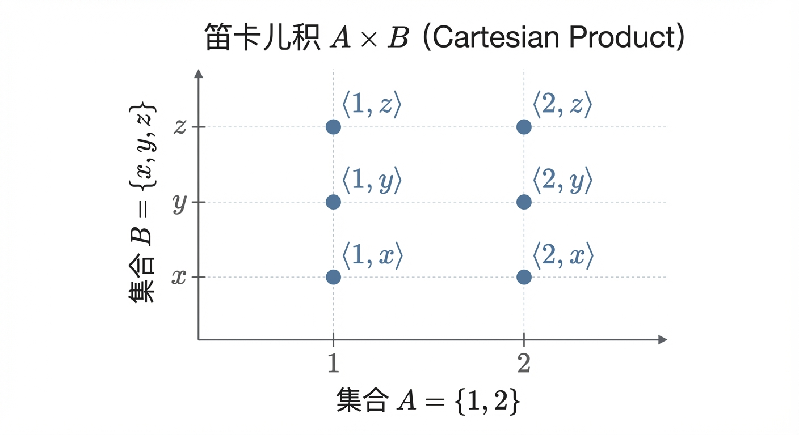
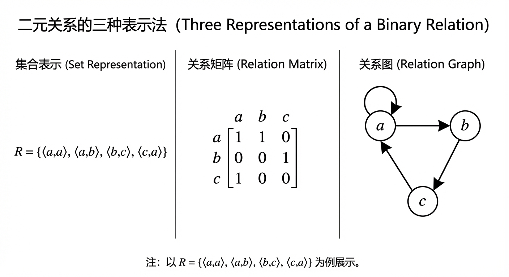
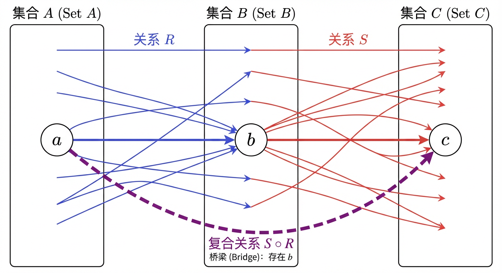
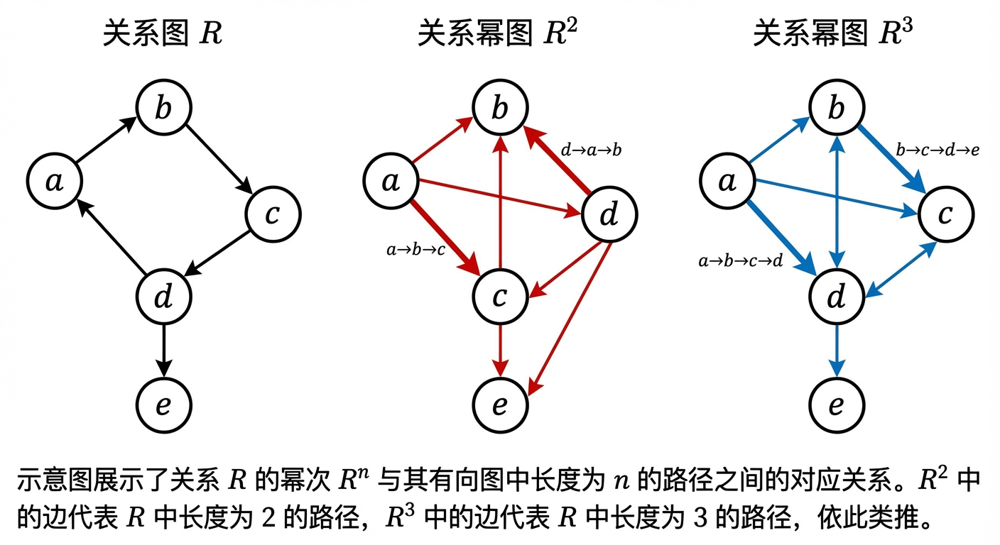
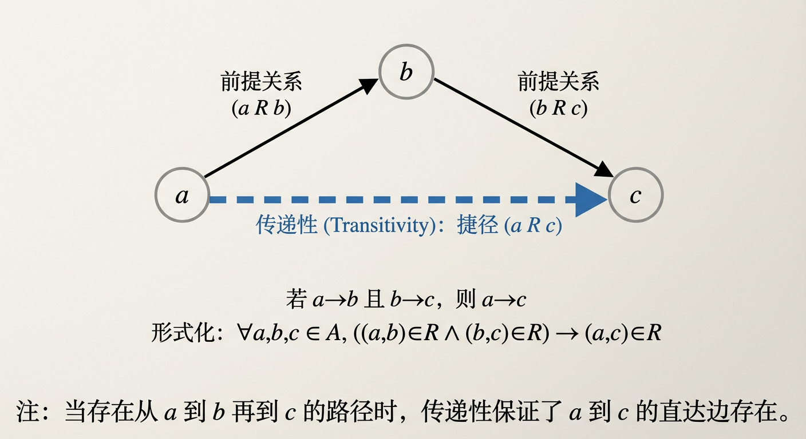
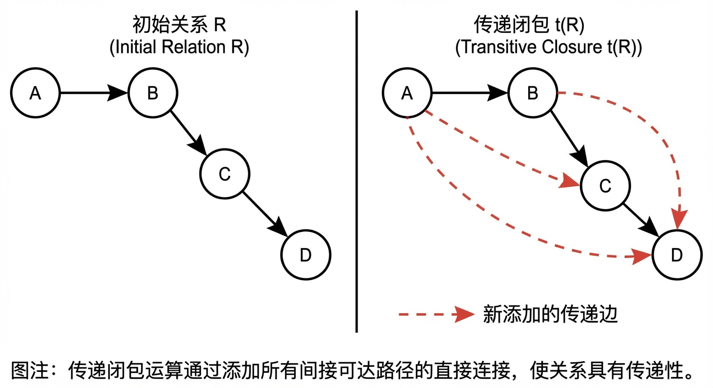
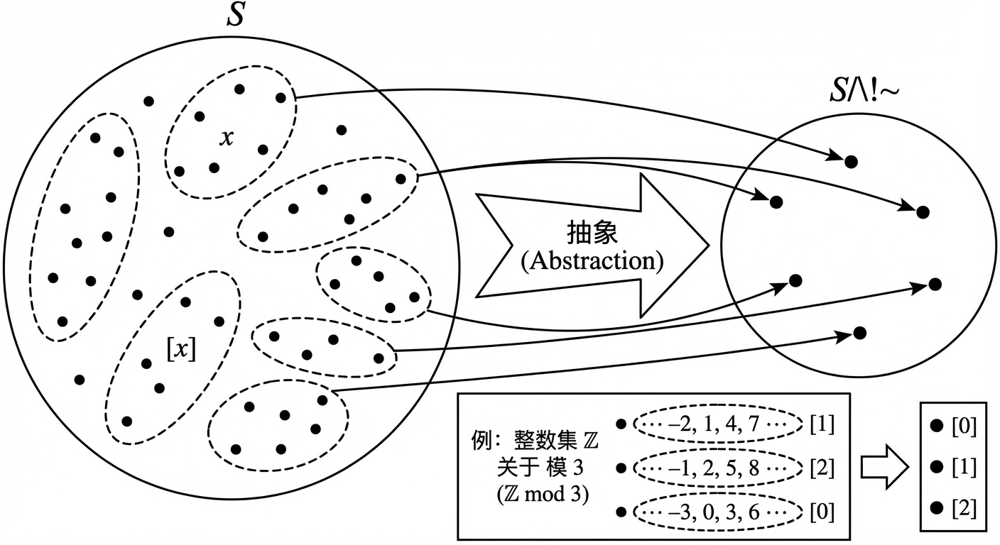
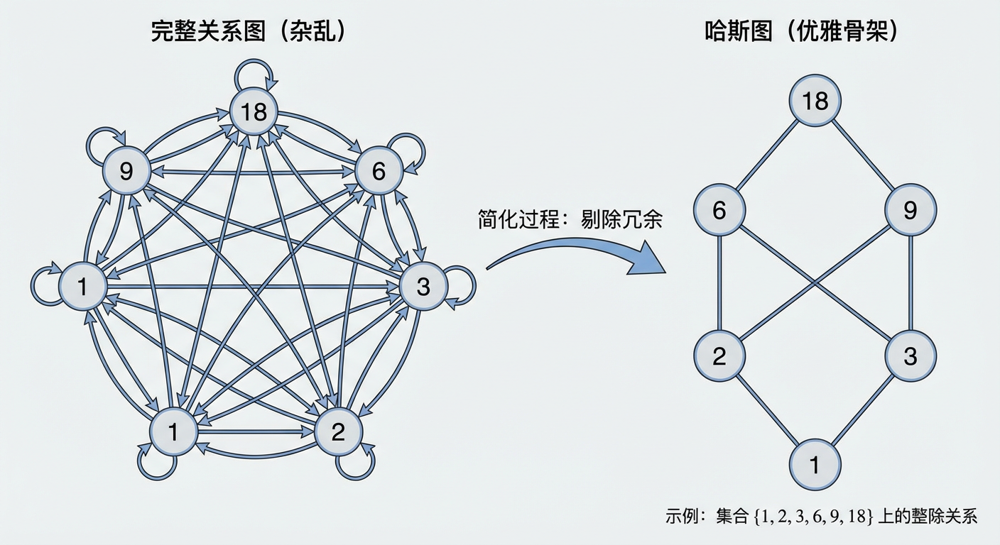

# 第4章：关系

在集合论为我们提供了“对象的集合”之后，本章进一步引入“对象之间的联系”这一更具结构性的概念——关系。我们将沿着“定义与表示 → 运算 → 性质与闭包 → 两类核心结构（等价与偏序）”的主线展开：先把关系作为集合对象严格刻画出来，再建立对关系的操作规则，继而用性质与闭包刻画其内在结构，最终汇聚到等价关系与偏序关系这两类在分类与排序中起基础作用的关系结构。

---

## 4.1 关系的定义及其表示

在之前的学习中，我们已经熟悉了数学的“原子”——集合中的元素，以及由元素构成的“分子”——集合。然而，无论是自然世界还是抽象的数学王国，其丰富性不仅在于“有什么”，更在于“彼此之间如何联系”。从行星间的引力作用，到数字间的大小比较，再到人与人之间的社交网络，我们无时无刻不在与“关系”打交道。那么，我们如何才能为这个无处不在却又看似模糊的“关系”概念，赋予数学所要求的精确性与普适性呢？这引发了一个根本性的思考：我们是应该将关系视为一种独立于对象之外的绝对存在，还是应将其看作仅由对象间的互动所定义的相对概念？本节将从集合论的视角出发，为“关系”建立一个坚实的基础，我们将看到，通过引入“顺序”这一关键门槛，数学如何以一种优美而严谨的方式，从无序的集合出发，构建起描述万物联系的结构化语言。

### 有序对与笛卡儿积

我们迈向关系世界的第一步，是解决一个基础但至关重要的问题：如何在数学中精确地表达“顺序”？在第一章中我们知道，集合的本质是无序的，集合 `{a, b}` 与 `{b, a}` 是同一个集合。然而，在描述坐标、社会角色或逻辑蕴含时，顺序至关重要。例如，地图上的坐标点 $(x, y)$ 显然不同于 $(y, x)$（除非 $x=y$）。为了捕捉这种带有方向性的联系，我们必须引入一个新的基本单位。

**定义 4.1.1（有序对）** 由两个元素 $x$ 和 $y$ 按指定次序组成的对，称为 **有序对（Ordered Pair）**，记作 $\langle x, y \rangle$ 或 $(x, y)$。其中 $x$ 称为第一元素，$y$ 称为第二元素。

有序对的核心特征性质是：对于任意两个有序对 $\langle a, b \rangle$ 和 $\langle c, d \rangle$，当且仅当它们对应的元素完全相同时，这两个有序对才相等。即：
$$ \langle a, b \rangle = \langle c, d \rangle \iff (a = c) \land (b = d) $$
这与集合的相等性形成了鲜明对比，也正是“有序”的精髓所在。

值得一提的是，在公理化集合论的框架下，有序对并非一个全新的、无法定义的基本概念。波兰数学家库拉托夫斯基（Kazimierz Kuratowski）给出了一个巧妙的构造，完全利用无序集合来定义有序对：
$$ \langle a, b \rangle := \{\{a\}, \{a, b\}\} $$
这个定义看似晦涩，却完美地利用集合的非对称性编码了顺序信息。第一元素 $a$ 是其内部所有集合的交集中的唯一元素，而第二元素 $b$ 则可以通过其他集合运算被唯一确定。这一构造深刻地体现了数学的精妙之处：从最基本的、无序的原材料中，通过逻辑的巧思，便能构建出更高级、更复杂的结构。

有了有序对这个能够表达最小单元联系的工具，我们自然会问：对于给定的两个集合，它们之间所有可能的配对方式构成了一个怎样的整体？这就引出了笛卡儿积的概念。

**定义 4.1.2（笛卡儿积）** 设 $A, B$ 为两个集合，由所有以 $A$ 中元素为第一元素、$B$ 中元素为第二元素构成的有序对的集合，称为 $A$ 和 $B$ 的 **笛卡儿积（Cartesian Product）**，记作 $A \times B$。即：
$$ A \times B = \{ \langle a, b \rangle \mid a \in A \land b \in B \} $$

笛卡儿积为我们描绘了一个“背景宇宙”，它包含了两个集合之间所有潜在的、可能的联系。例如，若姓氏集合为 $F = \{\text{张}, \text{王}\}$，名字集合为 $G = \{\text{伟}, \text{芳}\}$，则所有可能的姓名组合就构成了笛卡儿积 $F \times G = \{ \langle\text{张}, \text{伟}\rangle, \langle\text{张}, \text{芳}\rangle, \langle\text{王}, \text{伟}\rangle, \langle\text{王}, \text{芳}\rangle \}$。

根据定义，笛卡儿积具有以下基本性质：
1.  如果 $A, B$ 均为有限集，则其笛卡儿积的基数为 $|A \times B| = |A| \cdot |B|$。
2.  笛卡儿积不满足交换律，即一般情况下 $A \times B \neq B \times A$。
3.  对于任意集合 $A$，有 $A \times \emptyset = \emptyset \times A = \emptyset$。这是因为构造有序对的“配方”要求必须能从两个集合中各取出一个元素，而从空集中无法取出任何元素，故任务失败，无法构成任何有序对。

### 二元关系的定义

有了笛卡儿积这个代表所有可能配对的“背景空间”，定义关系便成了一件水到渠成的事情。所谓一种具体的关系，无非是在所有可能性中做出的一种“选择”。

**定义 4.1.3（二元关系）** 设 $A, B$ 为两个集合，$A \times B$ 的任意一个子集 $R$ 都定义了一个从 $A$ 到 $B$ 的 **二元关系（Binary Relation）**。若 $A = B$，则称 $R$ 是 $A$ 上的一个二元关系。

当有序对 $\langle x, y \rangle \in R$ 时，我们称元素 $x$ 与元素 $y$ 具有关系 $R$，记作 $xRy$。当 $\langle x, y \rangle \notin R$ 时，称 $x$ 与 $y$ 不具有关系 $R$，记作 $x \not R y$。

这个定义极其简约但异常强大，它将一个抽象的、描述性的概念（如“小于”、“整除”、“是朋友”）转化为了一个精确的、可操作的数学对象——一个集合。例如，设集合 $A = \{1, 2, 3, 4\}$，我们可以在 $A$ 上定义“小于”关系 $R_<$。根据定义，$R_<$ 是 $A \times A$ 的一个子集，其中包含了所有满足“小于”条件的有序对：
$$ R_< = \{\langle 1, 2 \rangle, \langle 1, 3 \rangle, \langle 1, 4 \rangle, \langle 2, 3 \rangle, \langle 2, 4 \rangle, \langle 3, 4 \rangle\} $$
从此，$R_<$ 不再仅仅是一个模糊的语词，而是一个可以被精确枚举和分析的集合。

这个基于子集的定义带来了一个惊人的组合学后果。对于一个包含 $n$ 个元素的有限集 $A$，其笛卡儿积 $A \times A$ 的大小为 $n^2$。由于 $A$ 上的任何一个关系都是 $A \times A$ 的一个子集，而一个包含 $k$ 个元素的集合拥有 $2^k$ 个不同的子集（回顾幂集的定义），因此，在 $A$ 上总共可以定义 $2^{n^2}$ 个不同的二元关系。即使对于一个仅有 5 个元素的集合，也存在 $2^{5^2} = 2^{25} \approx 3.3 \times 10^7$ 种不同的关系。这片由关系构成的浩瀚宇宙，促使我们必须发展出一套系统性的理论，来对它们进行表示、运算与分类，这正是本章后续内容的核心主题。

值得注意的是，我们目前聚焦的二元关系是现实世界中众多复杂关联的基础。例如，在医疗信息系统中，一条“患者 P 在时间 T 由医生 U 以剂量 D 服用药物 M”的记录，本质上是一个涉及多个实体的 **n-元关系（n-ary relation）**。在关系数据库或知识图谱等应用中，一种常见的建模策略便是引入一个代表“用药事件”的实体，然后建立该事件与患者、药物、时间等各个参与方之间的多个二元关系。这凸显了二元关系作为理论基石的重要性。

最后，我们必须辨析关系与函数这两个重要概念。在后续章节中我们将深入学习，一个从集合 $A$ 到 $B$ 的 **函数（Function）** $f: A \to B$，是一种非常特殊的二元关系。其特殊性在于，对于定义域 $A$ 中的 **每一个** 元素 $x$，在值域 $B$ 中都存在 **唯一的** 一个元素 $y$ 与之对应，使得 $\langle x, y \rangle$ 在关系中。例如，一个将IP地址映射到其注册国家的系统，如果由于“任播（Anycast）”技术的存在，使得同一个IP地址可以同时在多个国家的服务中心激活，那么“IP地址-国家”这个对应关系就 **不是** 一个函数，因为它不满足“唯一性”的要求。而函数之所以重要，正是因为它保证了这种无歧义的映射，它将在第5章被详细探讨。

### 二元关系的表示

将关系定义为有序对的集合，在理论上是完美的，但在实际应用中，尤其是在处理大规模数据时，我们常常需要更直观、更便于计算机处理的表示方法。以下是三种最常用的关系表示法。

**1. 集合表示法（Roster Method）**
这是最直接的表示方法，即通过枚举关系中所有的有序对来定义关系。对于元素较少的有限集上的关系，这种方法清晰明了。
例如，设 $A = \{a, b, c\}$，其上的关系 $R$ 可以表示为：
$$ R = \{\langle a, a \rangle, \langle a, b \rangle, \langle b, c \rangle, \langle c, a \rangle\} $$

**2. 关系矩阵（Relation Matrix）**
当关系定义在有限集上时，我们可以用一个矩阵来精确地表示它。设 $A = \{a_1, a_2, \dots, a_m\}$ 和 $B = \{b_1, b_2, \dots, b_n\}$ 是两个有限集，从 $A$ 到 $B$ 的关系 $R$ 可以由一个 $m \times n$ 的 **关系矩阵** $M_R = [m_{ij}]$ 表示，其元素的定义如下：
$$ m_{ij} = \begin{cases} 1, & \text{if } \langle a_i, b_j \rangle \in R \\ 0, & \text{if } \langle a_i, b_j \rangle \notin R \end{cases} $$
如果关系是定义在单个集合 $A$ 上的，则关系矩阵是一个方阵。关系矩阵将抽象的集合关系转化为了具体的代数对象，特别适合计算机存储和进行关系运算（如将在4.2节中讨论的复合运算）。

例如，对于前述集合 $A=\{a, b, c\}$ 上的关系 $R$，其关系矩阵 $M_R$ 为（假设行和列的顺序均为 $a, b, c$）：
$$ M_R = \begin{pmatrix} 1 & 1 & 0 \\ 0 & 0 & 1 \\ 1 & 0 & 0 \end{pmatrix} $$
第一行表示，元素 $a$ 与 $a$ 和 $b$ 有关系；第二行表示，元素 $b$ 仅与 $c$ 有关系；第三行表示，元素 $c$ 仅与 $a$ 有关系。

**3. 关系图（Relation Graph）**
对于定义在有限集 $A$ 上的二元关系，最直观的表示方法莫过于 **关系图**，也称为 **有向图（Directed Graph, Digraph）**。在这种表示中，集合 $A$ 的每个元素对应图中的一个顶点（Vertex），而关系中的每一个有序对 $\langle x, y \rangle$ 则对应一条从顶点 $x$ 指向顶点 $y$ 的有向边（Directed Edge）。

关系图的优势在于其强大的可视化能力，能够让我们一眼看清元素之间的复杂联系，例如路径、环路和连通性等。这种表示法是图论（第六章）研究的起点。对于前述关系 $R = \{\langle a, a \rangle, \langle a, b \rangle, \langle b, c \rangle, \langle c, a \rangle\}$，其关系图如图4.1.1所示。

（此处插入关系 $R$ 的有向图表示，包含自环 $a \to a$，以及边 $a \to b, b \to c, c \to a$）
 
图4.1.1 关系 R 的有向图表示

图中，从顶点 $a$ 指向自身的环（loop）表示 $\langle a, a \rangle \in R$。从 $a$ 到 $b$ 的箭头表示 $\langle a, b \rangle \in R$。我们还可以清晰地看到一个由 $a \to b \to c \to a$ 构成的环路结构。

这三种表示法——集合、矩阵、图——从不同侧面刻画了同一个数学对象。集合是其逻辑本质，矩阵是其代数载体，图是其几何形象。能够在这些表示之间灵活转换，是深入理解和应用关系理论的关键。

### 小结

本节为即将展开的关系理论构建了坚实的逻辑起点。我们首先通过引入有序对和笛卡儿积，为在无序的集合世界中表达“顺序”和“配对”提供了严谨的语言。在此基础上，我们将二元关系形式化地定义为笛卡儿积的任意子集，这一看似简单的定义，却蕴含着将抽象的“联系”转化为具体数学对象（集合）的深刻思想。

更重要的是，本节揭示了从抽象定义到具体表示的完整路径。通过关系矩阵和关系图，我们将抽象的有序对集合与代数和几何的世界联系起来，为后续的计算和分析铺平了道路。这体现了离散数学中一个核心的方法论：首先，通过高度抽象来获得理论的普适性与逻辑的严密性；然后，发展出多样的、可操作的表示方法，以应对具体的分析与计算需求。

至此，我们已经掌握了关系的“静态”描述。但数学的魅力更在于其动态的演化。我们如何对关系进行运算，例如，如果一个关系代表“直飞航班”，我们如何推导出代表“一次转机”的新关系？不同的关系又展现出哪些迥异的内在“性格”，例如对称性或传递性？这些关于关系的 **运算** 与 **性质** 的问题，将是我们下一节探索的重点，它们将最终引领我们通往等价关系与偏序关系这两类构筑了现代数学大厦的重要基石。

---

### （新增过渡）从“表示”到“运算”：让关系动起来

在 4.1 节中，我们已经能够用“集合/矩阵/图”三种等价视角刻画同一个关系对象。接下来顺理成章的问题是：当我们把关系当作数学对象时，能否像对数、对集合那样对它进行系统的运算？尤其是：在矩阵表示与关系图表示下，这些运算能否转化为可计算、可组合的规则？这正是 4.2 节要建立的“关系代数”语言；而其中的复合与幂运算，将直接为 4.3 节的“传递性判别”与“闭包构造”提供核心工具。

---

## 4.2 关系的运算

在上一节中，我们为“关系”这一概念奠定了集合论的基础，将其精确定义为笛卡儿积的子集，并探讨了如何通过有序对、关系矩阵和有向图等方式来表示它。然而，数学的魅力不仅在于定义和描述，更在于对所定义的对象进行操作与变换，从而揭示其深层结构并构建更复杂的系统。如果关系仅仅是静态的集合，其应用将大受限制。我们常常需要从已有的关系中推导出新的关系，例如，从“直接好友”关系推导出“朋友的朋友”，从“直接调用”的程序关系推导出完整的依赖链。这便引出了本节的核心议题：我们能否建立一套关于关系的“代数”体系，通过严谨的运算规则来组合、变换和推理关系？

本节将系统地介绍关系的运算。我们将沿着一条由浅入深的认知路径前进：首先，我们将回顾并确认那些可以直接继承自集合论的基本运算，巩固关系作为集合的本质；接着，我们将引入专为关系结构而设计的核心运算——逆与复合，它们是理解关系动态变化的钥匙；最后，我们将从复合运算自然地过渡到关系的幂运算，并将其与图论中的“路径”与“连通性”概念联系起来，最终引出传递闭包这一至关重要的思想。掌握这套运算语言，不仅是后续学习关系性质与闭包的基础，更是通向等价关系、偏序关系乃至图论等更广阔理论疆域的必经之路。

### 关系上的集合运算

鉴于关系在形式上被定义为有序对的集合，所有适用于集合的运算——**并集 (Union)**、**交集 (Intersection)**、**差集 (Difference)** 和 **补集 (Complement)**——都同样适用于关系。这些运算构成了关系代数的基础，为我们提供了依据逻辑联结词“或”、“与”、“非”来组合不同关系准则的直接方法。

设 $R_1$ 和 $R_2$ 是定义在集合 $A$ 和 $B$ 之间的两个关系，即 $R_1, R_2 \subseteq A \times B$。

1.  **并集**：$R_1 \cup R_2 = \{ \langle x, y \rangle \mid \langle x, y \rangle \in R_1 \lor \langle x, y \rangle \in R_2 \}$。
    并集运算在建模“或”逻辑时非常有效。例如，大学的课程注册系统可能包含一个“先修关系” $R_p$ 和一个“推荐选修关系” $R_r$。如果一个学生只要满足其中任一条件即可选课，那么所有允许的选课配对就构成了新关系 $R_p \cup R_r$。

2.  **交集**：$R_1 \cap R_2 = \{ \langle x, y \rangle \mid \langle x, y \rangle \in R_1 \land \langle x, y \rangle \in R_2 \}$。
    交集则对应于“与”逻辑，即需要同时满足多个条件的场景。例如，在一个学校中，设 `S` 为所有学生的集合，`M` 为所有专业的集合，`Y` 为年级集合 `{1, 2, 3, 4}`。我们定义两个三元关系：$R_B \subseteq S \times M \times Y$ 表示篮球队成员，一个元组 $\langle s, m, y \rangle \in R_B$ 意味着学生 `s` 主修专业 `m`，当前是 `y` 年级，并且是篮球队员。类似地，$R_D$ 表示辩论队成员。那么，关系 $R_B \cap R_D$ 精确地描述了这样一群学生：他们既是篮球队员，又是辩论队员，同时保留了其完整的专业和年级信息。

3.  **差集**：$R_1 - R_2 = \{ \langle x, y \rangle \mid \langle x, y \rangle \in R_1 \land \langle x, y \rangle \notin R_2 \}$。
    差集用于筛选出满足一个条件但不满足另一个条件的情形。

4.  **补集**：对于定义在 $A \times B$ 上的关系 $R$，其补集为 $\bar{R} = (A \times B) - R$。

这些运算继承了集合代数的所有定律，如交换律、结合律、分配律以及德摩根定律（De Morgan's laws）。例如，德摩根定律在关系运算中断言 $R - (S \cap T) = (R - S) \cup (R - T)$。这意味着从关系 `R` 中移除那些同时存在于 `S` 和 `T` 中的元素，等价于从 `R` 中移除 `S` 的元素，再并上从 `R` 中移除 `T` 的元素后得到的结果。这种等价性在逻辑推理和查询优化中扮演着重要角色。

值得注意的是，即使参与运算的关系具有某些良好性质（如我们将在下一节学习的自反性、对称性、传递性），运算结果却不一定能保持这些性质。一个经典的例子是，两个等价关系的并集不一定是等价关系。设集合 $S = \{1, 2, 3\}$，考虑两个等价关系 $R_1 = \{\langle 1,1 \rangle, \langle 2,2 \rangle, \langle 3,3 \rangle, \langle 1,2 \rangle, \langle 2,1 \rangle\}$ 和 $R_2 = \{\langle 1,1 \rangle, \langle 2,2 \rangle, \langle 3,3 \rangle, \langle 2,3 \rangle, \langle 3,2 \rangle\}$。它们的并集 $R = R_1 \cup R_2$ 包含 $\langle 1,2 \rangle$ 和 $\langle 2,3 \rangle$，但却不包含 $\langle 1,3 \rangle$。因此，$R$ 破坏了传递性，不再是一个等价关系。这启发我们思考：当运算破坏了我们期望的性质时，是否有办法“修复”它？这一问题将是下一节讨论“闭包”的动机。

若关系由关系矩阵表示，上述集合运算与矩阵的布尔运算有着完美的对应。设 $M_{R_1}$ 和 $M_{R_2}$ 分别是关系 $R_1$ 和 $R_2$ 的关系矩阵，则：
-   $M_{R_1 \cup R_2} = M_{R_1} \lor M_{R_2}$ （矩阵的**逻辑加**，或称**联**）
-   $M_{R_1 \cap R_2} = M_{R_1} \land M_{R_2}$ （矩阵的**逻辑乘**，或称**合取**）

### 关系特有的运算：逆与复合

超越了普适的集合操作，关系理论的核心威力体现在那些专门利用其“有序配对”结构的运算上。其中，逆运算和复合运算是最为重要的两个。

**1. 逆运算 (Inverse Operation)**

每个二元关系都蕴含着一个“相反方向”的视角。**逆关系 (Inverse Relation)**，记作 $R^{-1}$，正是对这种视角的精确刻画。

**定义 4.5** 设 $R$ 是从集合 $A$ 到集合 $B$ 的一个关系。$R$ 的**逆关系** $R^{-1}$ 是一个从 $B$ 到 $A$ 的关系，定义为：
$$ R^{-1} = \{ \langle b, a \rangle \mid \langle a, b \rangle \in R \} $$
简而言之，逆关系就是将原关系中所有有序对的元素顺序颠倒。如果 $R$ 代表“小于”关系 ($<$)，那么 $R^{-1}$ 就代表“大于”关系 ($>$)；如果 $D$ 代表“是...的父亲”，那么 $D^{-1}$ 就代表“是...的子女”。在有向图表示中，求逆关系等价于将图中所有的有向边反向。在关系矩阵表示中，若 $R$ 的矩阵为 $M_R$，则其逆关系 $R^{-1}$ 的矩阵恰好是 $M_R$ 的**转置矩阵 (Transpose Matrix)** $M_R^T$。

逆运算有一些基本的性质，例如 $(R^{-1})^{-1} = R$ 以及 $(R_1 \cup R_2)^{-1} = R_1^{-1} \cup R_2^{-1}$。读者可以自行验证。

**2. 复合运算 (Composition Operation)**

复合运算是关系代数中最强大、也最具构造性的工具。它让我们能够通过一个“中间站”将两个关系串联起来，从而描述“多步”或“间接”的联系。

**定义 4.6** 设 $R$ 是从集合 $A$ 到 $B$ 的关系， $S$ 是从集合 $B$ 到 $C$ 的关系。$R$ 和 $S$ 的**复合关系 (Composite Relation)**，记作 $S \circ R$，是一个从 $A$ 到 $C$ 的关系，定义为：
$$ S \circ R = \{ \langle a, c \rangle \mid \exists b \in B, (\langle a, b \rangle \in R \land \langle b, c \rangle \in S) \} $$

这个定义的精髓在于存在量词 $\exists$ 所扮演的“桥梁”角色。一个有序对 $\langle a, c \rangle$ 属于复合关系 $S \circ R$，当且仅当存在一条从 $a$ 到 $c$ 的“两步路径”：第一步从 $a$ 到某个中间元素 $b$（这条路径需遵循关系 $R$），第二步再从 $b$ 到 $c$（遵循关系 $S$）。

**注意**：符号 $S \circ R$ 的顺序与函数的复合记号一致，表示“先应用 $R$，再应用 $S$”。这在阅读和计算时需要特别留意。例如，若 $R$ 是“是...的儿子”关系，$S$ 是“是...的配偶”关系，那么 $S \circ R$ 表示“某人配偶的儿子”，即“继子”或“儿子”（取决于具体文化语境）；而 $R \circ S$ 表示“某人儿子的配偶”，即“儿媳”。显然，$S \circ R \neq R \circ S$，这表明**关系复合一般不满足交换律**。

然而，关系复合确实满足**结合律 (Associative Law)**：对于任意合适的三个关系 $R, S, T$，有 $(T \circ S) \circ R = T \circ (S \circ R)$。这一性质至关重要，因为它允许我们明确地书写 $T \circ S \circ R$ 而不必担心计算的顺序，为后续定义关系的高次幂铺平了道路。

复合运算与逆运算之间存在一个优美的恒等式，它被称为“穿脱袜子和鞋子”原理：
**定理 4.1**  $(S \circ R)^{-1} = R^{-1} \circ S^{-1}$
**证明**：要证明两个集合相等，我们需证明它们相互包含。
(1) 证明 $(S \circ R)^{-1} \subseteq R^{-1} \circ S^{-1}$：
任取 $\langle c, a \rangle \in (S \circ R)^{-1}$。根据逆关系定义，有 $\langle a, c \rangle \in S \circ R$。
根据复合关系定义，存在 $b$ 使得 $\langle a, b \rangle \in R$ 且 $\langle b, c \rangle \in S$。
再次应用逆关系定义，我们得到 $\langle b, a \rangle \in R^{-1}$ 且 $\langle c, b \rangle \in S^{-1}$。
现在，我们找到了一个以 $b$ 为“桥梁”的路径：从 $c$ 到 $b$（在 $S^{-1}$ 中），再从 $b$ 到 $a$（在 $R^{-1}$ 中）。根据复合定义，这恰恰意味着 $\langle c, a \rangle \in R^{-1} \circ S^{-1}$。
(2) 证明 $R^{-1} \circ S^{-1} \subseteq (S \circ R)^{-1}$：
证明过程与(1)类似，只需将推理步骤逆序进行即可，留给读者作为练习。
证毕。

### 关系的幂运算与连通性

复合运算的一个极其重要的特例是关系与自身的复合。这引出了**关系的幂 (Powers of a Relation)** 的概念，它为我们提供了一种描述和分析网络中“路径长度”的精确语言。

**定义 4.7** 设 $R$ 是集合 $A$ 上的一个二元关系。$R$ 的非负整数次幂定义如下：
-   **零次幂**：$R^0 = I_A = \{ \langle a, a \rangle \mid a \in A \}$，即 $A$ 上的**恒等关系 (Identity Relation)**。
-   **正整数次幂**：对于 $n \ge 0$，定义 $R^{n+1} = R^n \circ R$。

根据此定义，我们有 $R^1 = R^0 \circ R = I_A \circ R = R$，$R^2 = R^1 \circ R = R \circ R$，$R^3 = R^2 \circ R$，依此类推。这里的关键洞见是：**有序对 $\langle a, b \rangle \in R^n$ 当且仅当在关系 $R$ 的有向图中，存在一条从顶点 $a$ 到顶点 $b$ 的长度恰好为 $n$ 的路径。**

这个解释为我们分析网络中的**连通性 (Connectivity)** 问题打开了大门。一个自然的问题是：从一个节点 $a$ 是否存在一条*任意长度*的路径到达节点 $b$？要回答此问题，我们只需将所有可能长度的路径关系汇集起来。

**定义 4.8** 设 $R$ 是集合 $A$ 上的二元关系。
-   $R$ 的**传递闭包 (Transitive Closure)**，记作 $R^+$，是 $R$ 的所有正整数次幂的并集：
    $$ R^+ = \bigcup_{k=1}^{\infty} R^k = R^1 \cup R^2 \cup R^3 \cup \dots $$
    $\langle a, b \rangle \in R^+$ 的充要条件是，在 $R$ 的图中存在一条从 $a$到 $b$ 的长度至少为 1 的路径。

-   $R$ 的**自反传递闭包 (Reflexive Transitive Closure)**，记作 $R^*$，定义为：
    $$ R^* = R^+ \cup R^0 = \bigcup_{k=0}^{\infty} R^k $$
    $\langle a, b \rangle \in R^*$ 的充要条件是，在 $R$ 的图中存在一条从 $a$到 $b$ 的长度为任意非负整数的路径（包括长度为 0 的路径，即 $a$ 到自身）。

传递闭包的概念异常深刻，它也可以从另一个角度来理解。$R^+$ 本质上是包含 $R$ 的“最小”的那个传递关系。这引发我们思考，如何形式化地定义“最小性”？

**定理 4.2** 关系 $R$ 的传递闭包 $R^+$ 是包含 $R$ 的最小的传递关系。
**证明思路**：这个命题的证明包含两个部分。首先，需要证明 $R^+$ 本身是传递的。其次，需要证明对于任何其他包含 $R$ 的传递关系 $T$，都有 $R^+ \subseteq T$。这第二部分恰恰体现了 $R^+$ 的“最小性”。完整的证明需要一定的技巧，但其核心思想是，任何由 $R$ 中的“一步”连接构成的长路径，也必须存在于任何包含 $R$ 的传递关系 $T$ 中，因为 $T$ 对“一步”连接的串联是封闭的。

一个对计算至关重要的问题是：我们是否真的需要计算无穷多次的复合与并集才能得到传递闭包？幸运的是，对于有限集合，答案是否定的。

**定理 4.3** 设 $R$ 是定义在有限集合 $A$ 上的关系，且 $|A| = n$。则
$$ R^+ = R^1 \cup R^2 \cup \dots \cup R^n $$
**直观解释**：在 $n$ 个顶点的图中，任何两个顶点之间的**简单路径**（不重复经过顶点的路径）长度最大为 $n-1$。如果存在一条从 $a$ 到 $b$ 的路径，那么必然存在一条连接它们的简单路径。任何更长的路径都必然包含环路，而环路可以被“移除”以得到一条更短的路径。虽然最长简单路径是 $n-1$，但考虑到图中可能存在复杂的环路结构，可以证明，所有可达性信息都包含在从 $R^1$ 到 $R^n$ 的幂次中。这个定理保证了传递闭包在有限集上是**可计算的**，并为著名的沃舍尔算法（Warshall's Algorithm）等计算方法提供了理论基础。

### 小结

本节我们为关系建立了一套功能强大的运算体系。我们始于基础的集合运算（并、交、差），它们重申了关系作为集合的根本属性，并允许我们用逻辑“与”、“或”、“非”来组合关系。随后，我们深入到关系结构的核心，引入了逆（$R^{-1}$）和复合（$S \circ R$）这两种特有运算。逆运算提供了“反向”审视关系的视角，而复合运算则以前所未有的方式让我们能够追踪和构建“多步”联系。

基于复合运算，我们定义了关系的幂（$R^n$），并赋予其“长度为 $n$ 的路径”这一直观而深刻的图论释义。这一概念的自然延伸，便是通过并集将所有长度的路径汇集起来，从而引出了传递闭包（$R^+$）与自反传递闭包（$R^*$）的定义。我们不仅理解了传递闭包作为“任意长度路径”的集合，更从“最小传递超关系”的角度洞察了其结构本质，并确立了它在有限集上的可计算性。

至此，我们手中的“关系工具箱”已基本完备。这些运算不仅仅是为了构造新关系，它们更是分析关系性质的利器。在下一节中，我们将运用这些工具来精确地定义和判别关系的各种性质，如自反性、对称性和传递性。我们将看到，像 $R^2 \subseteq R$ 这样的表达式如何成为检验传递性的试金石，而传递闭包的构造过程，本身就是将一个非传递关系“修复”为传递关系的过程。这些运算，将是我们通往关系性质、闭包、等价关系与偏序关系等更深层次理论的坚实桥梁。

---

### （新增过渡）从“运算”到“性质”：用规则刻画结构

4.2 节的复合、幂与闭包概念，实际上已经在暗示“性质”的判别方式：例如，传递性可以被理解为“两步可达一定能一步直达”，这恰好对应 $R^2 \subseteq R$；而传递闭包则是在“最小化添加边”的意义下，将非传递关系修复为传递关系。于是，下一节将把这些直觉提升为系统的性质列表，并进一步讨论当性质不满足时如何以闭包的方式进行最小补全。

---

## 4.3 关系的性质

在前两节中，我们已经为关系这一概念建立了坚实的基础，不仅明晰了其作为笛卡儿积子集的本质，也掌握了关系间的运算规则。然而，仅仅定义和操作关系，如同拥有了字母表和拼写规则，却尚未能解读词语的内涵与文法的结构。不同的关系，诸如数字间的“小于等于”、人群中的“同乡”或项目任务间的“前置依赖”，其内部连接模式千差万别，蕴含着迥异的结构与逻辑。为何有些关系能支撑起严谨的推理链条，而另一些则不能？我们如何用一种共通的语言，精确地刻画并分类这些千姿百态的结构？

本节的核心任务，正是要从“关系是什么、能怎么操作”的层面，跃升至“关系满足什么规则、这些规则如何被有效判别与利用”的深度。我们将引入一系列描述关系内部构造的基本“性质”（properties），例如自反性、对称性和传递性等。这些性质如同诊断工具，使我们能够剖析任何关系的内在逻辑。更进一步，当一个关系未能满足我们期望的性质时，我们是否能以最小的代价“修复”或“补全”它？这就引出了“闭包”（closure）这一强大而富有建设性的思想。通过本节的学习，我们将掌握一套用性质来审视关系、用闭包来构造关系的分析框架，这不仅是理解后续等价关系与偏序关系的基础，更是将关系理论应用于计算机科学、人工智能等领域中知识表示与自动推理的关键一步。

### 关系性质的定义与判别

让我们系统地审视那些定义关系结构的核心性质。对于定义在集合 $A$ 上的一个二元关系 $R$，我们可以通过一系列逻辑条件来检验其是否具备某种特性。这些条件不仅可以用自然语言直观描述，更可以用一阶逻辑的语言进行精确的形式化定义。

#### 1. 自反性、反自反性

**定义 4.3.1 (自反性与反自反性)**
设 $R$ 是集合 $A$ 上的一个二元关系。
(1) 如果对任意 $a \in A$，都有 $\langle a, a \rangle \in R$，则称关系 $R$ 在 $A$ 上是**自反的 (reflexive)**。
    形式化地：$\forall a \in A, \langle a,a \rangle \in R$.
(2) 如果对任意 $a \in A$，都有 $\langle a, a \rangle \notin R$，则称关系 $R$ 在 $A$ 上是**反自反的 (irreflexive)**。
    形式化地：$\forall a \in A, \langle a,a \rangle \notin R$.

自反性要求集合中的每个元素都与自身相关。例如，实数集上的“小于等于”（$\le$）关系是自反的，因为任何数都小于或等于它自己。从关系图的角度看，一个自反关系意味着每个顶点都有一条指向自身的环路（loop）。在其关系矩阵中，主对角线上的元素必须全为 1。

反自反性则恰恰相反，它禁止任何元素与自身相关。例如，实数集上的“小于”（$<$）关系就是反自反的，因为没有任何数小于它自己。在关系图中，反自反性表现为没有任何顶点存在环路；在其关系矩阵中，主对角线上的元素必须全为 0。

值得注意的是，一个关系可以既不是自反的，也不是反自反的。例如，在某次宴会上定义的关系“为……夹过菜”，有些人可能为自己夹过，有些人则没有。

#### 2. 对称性、反对称性与非对称性

**定义 4.3.2 (对称性、反对称性与非对称性)**
设 $R$ 是集合 $A$ 上的一个二元关系。
(1) 如果对任意 $a, b \in A$，只要有 $\langle a, b \rangle \in R$，就必有 $\langle b, a \rangle \in R$，则称 $R$ 是**对称的 (symmetric)**。
    形式化地：$\forall a, b \in A, (\langle a,b \rangle \in R \rightarrow \langle b,a \rangle \in R)$.
(2) 如果对任意 $a, b \in A$，只要有 $\langle a, b \rangle \in R$ 且 $\langle b, a \rangle \in R$，就必有 $a = b$，则称 $R$ 是**反对称的 (antisymmetric)**。
    形式化地：$\forall a, b \in A, ((\langle a,b \rangle \in R \land \langle b,a \rangle \in R) \rightarrow a=b)$.
(3) 如果对任意 $a, b \in A$，只要有 $\langle a, b \rangle \in R$，就必有 $\langle b, a \rangle \notin R$，则称 $R$ 是**非对称的 (asymmetric)**。
    形式化地：$\forall a, b \in A, (\langle a,b \rangle \in R \rightarrow \langle b,a \rangle \notin R)$.

对称性描述了一种“双向”的关联。例如，“是……的同班同学”关系就是对称的。在关系图中，对称性意味着任意两个顶点间的连接都是双向箭头（或者用无向边表示）。在其关系矩阵 $M_R$ 中，对称性等价于矩阵是一个对称矩阵，即 $M_R = M_R^T$。

反对称性是构建“序”或“层级”的关键。它并不完全禁止双向关系，而是规定只有当两个元素相同时，双向关系才被允许。实数集上的“小于等于”（$\le$）关系是典型的反对称关系，因为若 $a \le b$ 且 $b \le a$，则必然 $a = b$。在关系图中，反对称性意味着任意两个**不同**的顶点之间，最多只能有一条单向的边。

非对称性是比反对称性更强的约束，它完全禁止任何形式的双向连接。实数集上的“小于”（$<$）关系就是非对称的，若 $a < b$，则 $b < a$ 绝不可能成立。一个非对称的关系必然是反自反的（读者可自行证明），也必然是反对称的。例如，在生态系统中，物质的流动是典型的非对称关系：植物被食草动物消耗（$P \to H$），但这并不意味着食草动物会被植物消耗（$H \not\to P$），这种单向性是构建有向无环图模型的基础。

#### 3. 传递性

**定义 4.3.3 (传递性)**
设 $R$ 是集合 $A$ 上的一个二元关系。如果对任意 $a, b, c \in A$，只要有 $\langle a, b \rangle \in R$ 且 $\langle b, c \rangle \in R$，就必有 $\langle a, c \rangle \in R$，则称 $R$ 是**传递的 (transitive)**。
形式化地：$\forall a, b, c \in A, ((\langle a,b \rangle \in R \land \langle b,c \rangle \in R) \rightarrow \langle a,c \rangle \in R)$.

传递性允许我们构建推理的“链条”。如果 $a$ 与 $b$ 相关， $b$ 与 $c$ 相关，那么传递性保证了 $a$ 与 $c$ 之间存在一条“捷径”。例如，“小于等于”（$\le$）和“是……的祖先”都是传递关系。在关系图中，传递性意味着每当存在一条从 $a$ 到 $b$ 再到 $c$ 的长度为 2 的路径时，必然存在一条从 $a$ 直达 $c$ 的边。从关系运算的角度看，传递性等价于 $R^2 \subseteq R$。

**示例：判别一个具体关系的性质**

让我们通过一个实例来巩固对这些定义的理解。考虑集合 $W=\{1,2,3,4\}$ 上的关系 $R=\{\langle 1,2 \rangle, \langle 2,1 \rangle, \langle 2,3 \rangle, \langle 3,2 \rangle, \langle 3,4 \rangle, \langle 4,3 \rangle, \langle 4,1 \rangle, \langle 1,4 \rangle\}$。这可以被看作一个由四个“世界”组成的系统，其中边表示“可达性”。

1.  **自反性**：$R$ 是自反的吗？我们需要检查对所有 $x \in W$，是否有 $\langle x,x \rangle \in R$。显然，$\langle 1,1 \rangle, \langle 2,2 \rangle, \langle 3,3 \rangle, \langle 4,4 \rangle$ 均不在 $R$ 中。因此，$R$ 不是自反的。它也不是反自反的，因为我们没有检查是否所有 $\langle x,x \rangle$ 都不在 $R$ 中，尽管在这个例子中确实如此。
2.  **对称性**：$R$ 是对称的吗？我们需要检查是否对每个 $\langle x,y \rangle \in R$，都有 $\langle y,x \rangle \in R$。
    - $\langle 1,2 \rangle \in R$，并且 $\langle 2,1 \rangle \in R$。
    - $\langle 2,3 \rangle \in R$，并且 $\langle 3,2 \rangle \in R$。
    - $\langle 3,4 \rangle \in R$，并且 $\langle 4,3 \rangle \in R$。
    - $\langle 4,1 \rangle \in R$，并且 $\langle 1,4 \rangle \in R$。
    所有边都是双向的。因此，$R$ 是对称的。
3.  **反对称性**：$R$ 是反对称的吗？我们需要检查是否只要 $\langle x,y \rangle \in R$ 且 $\langle y,x \rangle \in R$，就有 $x=y$。我们有一个反例：$\langle 1,2 \rangle \in R$ 且 $\langle 2,1 \rangle \in R$，但是 $1 \neq 2$。因此，$R$ 不是反对称的。
4.  **传递性**：$R$ 是传递的吗？我们需要检查是否只要 $\langle x,y \rangle \in R$ 且 $\langle y,z \rangle \in R$，就有 $\langle x,z \rangle \in R$。我们寻找一个反例。考虑路径 $1 \to 2 \to 3$。我们有 $\langle 1,2 \rangle \in R$ 且 $\langle 2,3 \rangle \in R$。为了满足传递性，必须有 $\langle 1,3 \rangle \in R$。然而，通过检查 $R$ 的定义，我们发现 $\langle 1,3 \rangle \notin R$。因此，$R$ 不是传递的。

这个判别过程清晰地展示了，一个给定的关系可以满足某些性质，而违背另一些。正是这些性质的组合，赋予了关系独特的结构特征。

### 关系的闭包

我们常常希望一个关系能拥有某种良好的性质（如传递性），以便于推理或分析。但现实中的关系往往是不完美的。例如，一个城市的地铁换乘网络，如果我们只记录了“可以直接到达”的关系，它可能不是传递的。但从乘客的角度，我们更关心“是否可达”（无论换乘多少次）。这启发我们去“补全”原始关系，使其满足期望的性质。这种“最小的补全”就是**闭包 (closure)** 的思想。

**定义 4.3.4 (关系的闭包)**
设 $R$ 是集合 $A$ 上的一个关系。$R$ 关于性质 $P$ 的闭包，是指满足以下条件的最小关系 $R'$：
(1) $R \subseteq R'$；
(2) $R'$ 具有性质 $P$；
(3) 对于任何其他同时满足(1)和(2)的关系 $R''$，都有 $R' \subseteq R''$。

通俗地说，闭包是在原关系 $R$ 的基础上，添加最少的有序对，从而使其获得性质 $P$。

1.  **自反闭包 (Reflexive Closure)**：$R$ 的自反闭包记作 $r(R)$，它是通过将集合 $A$ 上的恒等关系 $I_A = \{\langle a,a \rangle \mid a \in A\}$ 并入 $R$ 得到的。
    $$r(R) = R \cup I_A$$

2.  **对称闭包 (Symmetric Closure)**：$R$ 的对称闭包记作 $s(R)$，它是通过将 $R$ 的逆关系 $R^{-1}$ 并入 $R$ 得到的。
    $$s(R) = R \cup R^{-1}$$

3.  **传递闭包 (Transitive Closure)**：$R$ 的传递闭包记作 $t(R)$ 或 $R^+$，其构造稍微复杂。直观上，如果从 $a$ 到 $b$ 存在一条或多条由 $R$ 中的边构成的路径，那么有序对 $\langle a, b \rangle$ 就应该在传递闭包中。这恰好对应于我们在 4.2 节中定义的关系的幂。
    $$t(R) = R^+ = \bigcup_{i=1}^{|A|} R^i = R \cup R^2 \cup \dots \cup R^{|A|}$$

    对于有限集 $A$，我们最多只需要计算到 $|A|$ 次幂，因为任何更长的路径必然包含循环，而其连接的起点和终点可以通过更短的路径达到。计算传递闭包的一个经典算法是 **Warshall 算法**，它利用邻接矩阵的布尔运算，高效地找到所有顶点间可达路径，这在图论和计算理论中有重要应用。

### 应用与综合：从知识表示到结构保持

关系性质的判别与闭包的构造，绝非纯粹的符号游戏。它们是计算机科学中构建复杂信息系统，尤其是知识图谱和本体论的理论基石。在这些系统中，关系被用来表示实体间的联系，而关系的性质则决定了系统能否进行自动推理。

例如，在生物信息学的基因本体论（Gene Ontology）中，“is a”（是一个）和“part of”（是……的一部分）是两种核心关系。`part_of` 关系被公理化地定义为**自反的**和**传递的**。例如，“心脏”是“循环系统”的一部分，而“循环系统”是“人体”的一部分。由于传递性，推理机可以自动推断出“心脏”是“人体”的一部分。这种推理能力对于数据查询和知识发现至关重要。与此相对，另一种关系 `regulates`（调节）通常就不是传递的。A 调节 B，B 调节 C，并不一定意味着 A 调节 C。因此，在知识库中不将 `regulates` 断言为传递关系，避免了错误的推论。这说明，为关系赋予正确的性质，是保证知识系统逻辑一致性的前提。

更进一步，我们还可以提出一个更深刻的问题：当我们将一个关系结构映射或简化到另一个结构时，这些性质是否能够保持？这引导我们进入更抽象的代数思维。

让我们设想一个简单的关系 $\mathfrak{A}$，其定义域为 $A = \{0,1,2\}$，关系为 $R^{\mathfrak{A}} = \{\langle 0,1 \rangle, \langle 1,2 \rangle, \langle 2,0 \rangle\}$（一个三元环）。这个关系是**反自反的**和**反对称的**（因为没有形如 $\langle a,b \rangle$ 和 $\langle b,a \rangle$ 的成对边）。现在，我们通过一个映射 $h$ 将其“折叠”到一个更小的结构 $\mathfrak{B}$ 上，其定义域为 $B = \{x,y\}$。映射规则为 $h(0) = x, h(1) = y, h(2) = x$。在 $\mathfrak{A}$ 中的关系边 $\langle 0,1 \rangle$ 映射为 $\langle h(0), h(1) \rangle = \langle x,y \rangle$，边 $\langle 1,2 \rangle$ 映射为 $\langle h(1), h(2) \rangle = \langle y,x \rangle$，边 $\langle 2,0 \rangle$ 映射为 $\langle h(2), h(0) \rangle = \langle x,x \rangle$。因此，在像空间 $h[A]=\{x,y\}$ 上诱导出的新关系为 $R^{\mathfrak{B}} = \{\langle x,y \rangle, \langle y,x \rangle, \langle x,x \rangle\}$。

现在我们来考察新关系 $R^{\mathfrak{B}}$ 的性质。由于 $\langle x,x \rangle \in R^{\mathfrak{B}}$，它不再是反自反的。又因为 $\langle x,y \rangle \in R^{\mathfrak{B}}$ 且 $\langle y,x \rangle \in R^{\mathfrak{B}}$，但 $x \neq y$，所以它也不再是反对称的。这个例子揭示了一个重要的现象：即使是看似简单的结构映射（同态），也可能破坏原有的关系性质。反自反性和反对称性这两个在原结构中成立的性质，在映射后的像结构中都失效了。这提醒我们，在对数据进行抽象、聚合或简化时，必须审慎考察所依赖的关系性质是否得以保持，否则可能导致错误的结论。

### 小结

在本节中，我们为关系的世界引入了一套描述其内部结构的语法——一系列基本性质。自反性、对称性、反对称性和传递性等，如同DNA碱基对，它们的特定组合决定了关系的“物种”与功能。我们不仅学习了如何用形式化语言定义和判别这些性质，也探讨了当关系不具备某种性质时，如何通过构造自反、对称或传递闭包来“补全”它，使其达到一种更完备、更利于推理的状态。

这些看似抽象的性质，在知识表示、数据库理论和算法设计等领域扮演着至关重要的角色。它们是确保逻辑系统一致性与推理有效性的根本保障。本节所建立的这套分析框架，是我们通往下一站的桥梁。在 4.4 节中，我们将看到，两种由这些基本性质构成的“黄金组合”——即由自反、对称、传递性构成的**等价关系**，和由自反、反对称、传递性构成的**偏序关系**——将分别引出“分类”与“排序”这两大数学核心思想，并由此构建起更为宏伟的结构理论。

---

### （新增过渡）从“性质与闭包”到“结构类型”：三公理的不同组合

到目前为止，我们已经看到：性质是描述关系结构的“公理化标签”，闭包则是在不满足某些标签时的“最小修复机制”。当我们把这些性质按特定方式组合时，会得到具有稳定理论与广泛应用的结构类型。下一节将集中研究两类最关键的组合：  
- 自反 + 对称 + 传递 → 等价关系（支撑划分、商集与抽象）；  
- 自反 + 反对称 + 传递 → 偏序关系（支撑层级、依赖与排序）。  
特别地，4.2 节的“自反传递闭包”与本节的“传递闭包”思想，也将与偏序中的“可达性/依赖”直觉形成呼应；而等价关系导出的“商集”则为进一步的结构化压缩提供数学语言。

---

## 4.4 等价关系与偏序关系

在前几节中，我们为关系建立了定义、运算和性质的分析框架。我们认识到，通过检验关系是否满足自反、对称、反对称、传递等性质，可以揭示其内在的结构特征。然而，这些性质并非孤立存在，它们的特定组合能够催生出数学中两种至关重要且无处不在的结构化关系。这便是本节的主题：等价关系与偏序关系。

倘若说关系是描述事物之间联系的语言，那么等价关系就是这门语言中用于表达“相同”与“归类”的语法。它为我们直觉中的“相似性”赋予了严格的逻辑基础，使我们能够将一个庞杂的集合清晰地划分为若干个互不相交的类别。与此相对，偏序关系则是表达“先后”与“依赖”的语法。它承认并非所有事物都能直接比较，从而为真实世界中普遍存在的层级、依赖和因果网络提供了精确的数学模型。本节将深入这两种关系的核心，探索它们如何从简单的公理出发，构建起丰富的理论大厦，并最终成为我们理解和组织复杂系统的有力思想工具。

### 等价关系：分类与抽象的艺术

在科学探索与日常生活中，我们无时无刻不在进行分类：将整数分为奇数和偶数，将几何图形按形状归类，将人群按国籍划分。这些分类行为的背后，都隐藏着一个共同的逻辑内核，即一个关于“等同性”的标准。数学通过**等价关系（Equivalence Relation）**，为这一标准提供了精确的公理化描述。

#### 定义与公理

一个定义在集合 $S$ 上的二元关系 $R$（通常记作 $\sim$）若被称为等价关系，必须同时满足以下三条公理：

1.  **自反性（Reflexivity）**: 对任意 $x \in S$，恒有 $x \sim x$。
    *   **语义**: 任何元素都与自身等价。这是逻辑的基石，确保分类体系的完备性。
2.  **对称性（Symmetry）**: 对任意 $x, y \in S$，若 $x \sim y$，则必有 $y \sim x$。
    *   **语义**: 等价关系是相互的。若 $x$ 与 $y$ 等同，则 $y$ 与 $x$ 也等同。
3.  **传递性（Transitivity）**: 对任意 $x, y, z \in S$，若 $x \sim y$ 且 $y \sim z$，则必有 $x \sim z$。
    *   **语义**: 等价关系是可以传递的。这保证了分类标准的一致性，避免了“A像B，B像C，但A不像C”的逻辑断裂。

这三条公理共同刻画了我们对“在某一标准下相同”这一概念的直观理解。任何一条公理的缺失，都将破坏这种分类的逻辑自洽性。例如，在非零整数集 $\mathbb{Z} \setminus \{0\}$ 上定义“整除”关系 $a|b$，它满足自反性（$a|a$）和传递性（若 $a|b$ 且 $b|c$，则 $a|c$），但通常不满足对称性（例如 $2|4$ 但 $4 \nmid 2$），因此它不是一个等价关系。它描述的是一种层级而非“相同”。

#### 等价类，商集与集合的划分

当一个关系严格遵守这三条公理时，一个奇妙的结构便应运而生。它如同一把逻辑的刻刀，能将一个集合 $S$ 精确地切割成若干个互不相交、且无遗漏的子集。

对于集合 $S$ 上的等价关系 $\sim$ 和任意元素 $x \in S$，我们定义 $x$ 的**等价类（Equivalence Class）**为 $S$ 中所有与 $x$ 等价的元素的集合，记作 $[x]$：
$$
[x] = \{y \in S \mid x \sim y\}
$$
基于等价关系的三个公理，我们可以证明关于等价类的两条核心性质：
1.  对任意 $x \in S$，$x \in [x]$，因此每个等价类都是非空集合。
2.  对任意 $x, y \in S$，两个等价类 $[x]$ 和 $[y]$ 的关系是“黑白分明”的：要么它们完全相同（$[x] = [y]$），要么它们完全没有交集（$[x] \cap [y] = \emptyset$）。绝不会出现部分重叠的情况。

这引发了我们对“划分”这一概念的形式化。一个集合 $S$ 的**划分（Partition）**是指 $S$ 的一个子集族 $\mathcal{P}$，它由一系列非空子集构成，这些子集两两不交，且它们的并集恰好等于 $S$。

由此，我们便来到了**等价关系的基本定理**：集合 $S$ 上的任意一个等价关系 $\sim$ 都唯一地导出一个对 $S$ 的划分，这个划分就是由 $\sim$ 的所有不同等价类构成的集合。反之，对 $S$ 的任意一个划分，也唯一地定义了一个等价关系，即规定两个元素等价当且仅当它们属于划分中的同一个子集。

这揭示了一个深刻的对偶性：**等价关系和集合的划分是同一数学对象的两种不同表述**。它们之间存在一个自然的**双射（Bijective Function）**。当我们谈论一种分类标准时，我们实际上也在谈论由该标准产生的类别本身。

由等价关系 $\sim$ 在集合 $S$ 上产生的所有等价类构成的集合，被称为 $S$ 关于 $\sim$ 的**商集（Quotient Set）**，记作 $S/\!\sim$。即：
$$
S/\!\sim = \{[x] \mid x \in S\}
$$
商集的概念极为强大，它代表了一种更高层次的抽象：我们将每个等价类“捏”成一个新集合里的单个元素，从而忽略了类内部的差异，只关注类与类之间的关系。

让我们通过一个经典的例子来阐明这些概念。考虑整数集 $\mathbb{Z}$ 和关系 $\sim$，定义 $x \sim y$ 当且仅当 $x-y$ 能被 3 整除，即 $x \equiv y \pmod{3}$。
*   **验证公理**：读者可以自行验证，该关系满足自反性（$x-x=0$，能被3整除）、对称性（若 $x-y=3k$，则 $y-x=3(-k)$）和传递性（若 $x-y=3k_1$ 且 $y-z=3k_2$，则 $x-z=3(k_1+k_2)$）。因此，模3同余是一个等价关系。
*   **等价类**：根据除以3的余数，$\mathbb{Z}$ 被划分为三个等价类：
    *   $[0] = \{\dots, -6, -3, 0, 3, 6, \dots\}$ (所有3的倍数)
    *   $[1] = \{\dots, -5, -2, 1, 4, 7, \dots\}$ (所有除以3余1的数)
    *   $[2] = \{\dots, -4, -1, 2, 5, 8, \dots\}$ (所有除以3余2的数)
*   **划分与商集**：这三个等价类构成了对 $\mathbb{Z}$ 的一个划分。商集就是由这三个类作为其元素的集合：
    $$
    \mathbb{Z}/\!\sim = \{[0], [1], [2]\}
    $$
    这个商集通常记作 $\mathbb{Z}_3$，它本身构成了一个新的、有限的数学结构。

#### 构造等价关系：函数核的视角

除了直接定义，是否存在一种通用的方法来构造等价关系？答案是肯定的，并且这与函数概念紧密相连。给定任意一个函数 $f: X \to Y$，我们可以在其定义域 $X$ 上定义一个关系 $\sim$，称为**函数 $f$ 的核（Kernel of $f$）**，记作 $\ker(f)$：
$$
x_1 \sim x_2 \iff f(x_1) = f(x_2)
$$
也就是说，如果两个元素在函数 $f$ 下的像相同，我们就认为它们是等价的。不难证明，这样定义的关系 $\sim$ 必然是一个等价关系，因为它直接继承了等号“=”的自反、对称和传递性。

在这种构造下，元素 $x$ 的等价类 $[x]$ 正是所有被 $f$ 映射到同一个值 $f(x)$ 的元素的集合，即值 $f(x)$ 的**原像（Preimage）** $f^{-1}(\{f(x)\})$。商集 $X/\!\sim$ 的元素（即等价类）与函数 $f$ 的**值域（Image）** $f(X)$ 之间存在一个自然的一一对应关系。

例如，设 $X=\{0,1,2,3,4,5\}$，并定义函数 $f: X \to Y=\{a,b,c\}$ 为 $f(0)=f(1)=a$, $f(2)=f(3)=b$, $f(4)=f(5)=c$。由该函数核导出的等价关系将 $X$ 划分为三个等价类：$\{0,1\}$（原像 $f^{-1}(\{a\})$），$\{2,3\}$（原像 $f^{-1}(\{b\})$）和 $\{4,5\}$（原像 $f^{-1}(\{c\})$）。商集 $X/\ker(f)$ 就是 $\{\{0,1\}, \{2,3\}, \{4,5\}\}$。这一视角为我们提供了一座桥梁，连接了关系理论与即将到来的函数理论。

### 偏序关系：层级与依赖的逻辑

与等价关系旨在捕捉“相同”的本质不同，另一类重要的关系——**偏序关系（Partial Order）**——旨在刻画“先后”、“依赖”或“包含”等具有方向性的层级结构。它承认真实世界中的许多关系并非线性的，即并非所有元素之间都能分出“高下”。

#### 定义与核心特征

一个定义在集合 $S$ 上的二元关系 $R$（通常记作 $\preceq$）若被称为偏序关系，必须同时满足以下三条公理：

1.  **自反性（Reflexivity）**: 对任意 $x \in S$，恒有 $x \preceq x$。
    *   **语义**: 任何事物都被视为其自身的前置或基础。
2.  **反对称性（Antisymmetry）**: 对任意 $x, y \in S$，若 $x \preceq y$ 且 $y \preceq x$，则必有 $x = y$。
    *   **语义**: 关系是单向的，禁止循环。如果 $x$ 是 $y$ 的前提，那么 $y$ 不能同时是 $x$ 的前提，除非它们是同一个事物。这是偏序与等价关系最根本的区别所在，后者要求对称性。
3.  **传递性（Transitivity）**: 对任意 $x, y, z \in S$，若 $x \preceq y$ 且 $y \preceq z$，则必有 $x \preceq z$。
    *   **语义**: 依赖链或因果链可以传递。

一个配备了偏序关系的集合 $(S, \preceq)$ 被称为一个**偏序集（Partially Ordered Set, or Poset）**。

偏序关系真正的魔力在于它*没有*要求的一条性质：**完全性（Totality）**。它不要求对任意两个元素 $x, y \in S$，必须有 $x \preceq y$ 或 $y \preceq x$。当两个元素之间不存在 $\preceq$ 关系时，我们称它们是**不可比的（Incomparable）**。正是这种对不可比性的包容，使得偏序成为描述复杂、分支结构的强大工具。

让我们看几个经典的偏序集实例：
*   **整数的整除关系**: 在正整数集 $\mathbb{N}^+$上，“$a$ 整除 $b$”（记作 $a|b$）是一个偏序关系。例如，2和3就是不可比的，因为 $2 \nmid 3$ 且 $3 \nmid 2$。
*   **幂集的包含关系**: 对任意集合 $A$，其幂集 $\mathcal{P}(A)$ 上的集合包含关系“$\subseteq$”是一个偏序关系。例如，在 $\mathcal{P}(\{1,2,3\})$ 中，集合 $\{1,2\}$ 和 $\{2,3\}$ 是不可比的。
*   **字符串的前缀关系**: 在所有二进制字符串的集合上，“$u$ 是 $v$ 的前缀”构成一个偏序关系。字符串 "01" 和 "10" 显然是不可比的。

#### 偏序集的可视化：哈斯图

如何直观地展现一个偏序集的结构？如果我们为每一对满足 $x \preceq y$ 的元素都画一条有向边，那么由于自反性和传递性，图中会充斥着大量的自环和“捷径”边，使得图像杂乱无章。

**哈斯图（Hasse Diagram）**是一种优雅的解决方案，它通过剔除所有冗余信息来揭示偏序集的“骨架”。其绘制规则如下：
1.  **节点代表元素**：集合中的每个元素都由图中的一个节点表示。
2.  **位置暗示方向**：如果 $x \preceq y$ 且 $x \neq y$，则代表 $y$ 的节点必须画在代表 $x$ 的节点的上方。这个“重力”约定使得我们可以省略所有边的箭头。
3.  **只画覆盖关系**：我们只在 $y$ **覆盖（cover）** $x$ 时画一条连接它们的边。所谓覆盖，是指 $x \prec y$（即 $x \preceq y$ 且 $x \neq y$），并且不存在任何中间元素 $z$ 使得 $x \prec z \prec y$。这意味着我们省去了所有由自反性产生的自环和由传递性产生的“快捷方式”边。

例如，对于集合 $\{1, 2, 3, 6, 9, 18\}$ 上的整除关系，其哈斯图清晰地展示了素因子如何逐层构建起整个结构，而无需画出例如从 1 到 18 的冗余连线。

（此处插入哈斯图：底部为 1，向上连到 2 和 3；2 连到 6，3 连到 6 和 9；6 连到 18，9 连到 18）
 
图4.4.1 集合 $\{a,b,c\}$ 的幂集关于包含关系的哈斯图 (左) 与集合 $\{1,2,3,4,6,12\}$ 关于整除关系的哈斯图 (右)。两者在结构上是同构的。

#### 偏序集中的特殊元素

借助哈斯图，我们可以方便地识别偏序集中的一些关键元素：
*   **极大元（Maximal Element）** 与 **极小元（Minimal Element）**: 哈斯图中最顶部的节点（没有向上的边）是极大元，最底部的节点（没有向下的边）是极小元。一个偏序集可以有多个极大或极小元。
*   **最大元（Maximum Element）** 与 **最小元（Minimum Element）** : 如果一个偏序集中存在一个比所有其他元素都“大”的元素，则称其为最大元。类似地，最小元是比所有其他元素都“小”的元素。最大元（如果存在）必然是唯一的极大元，最小元亦然。但一个有多个极大元的偏序集不可能有最大元。
*   **上界/下界** 与 **上确界/下确界**: 对于偏序集的一个子集，其上界是偏序集中一个比该子集所有元素都大的元素。所有上界中的“最小”者被称为**最小上界（Least Upper Bound, lub）**或**上确界（Supremum）**。类似地，可以定义下界和**最大下界（Greatest Lower Bound, glb）**或**下确界（Infimum）**。

值得注意的是，一个有限非空的偏序集必然至少存在一个极大元和一个极小元。这一结论是许多算法（如拓扑排序）和数学证明（如良序原理的应用）的理论基石。

最后，我们常常遇到一些关系，它们满足自反性和传递性，但非严格的反对称性，例如图中的顶点可达性关系（如果存在环路，则两个不同顶点可以相互到达）。这种关系被称为**预序（Preorder）**。通过引入等价关系 `x ~ y` 当且仅当 `x <= y` 且 `y <= x`，我们可以将预序集中的“循环”部分凝聚成等价类，并在这些等价类构成的商集上诱导出一个规范的偏序关系。这在图论中对应着将一个有向图分解为其**强连通分量（Strongly Connected Components）**，并在这些分量之间建立一个有向无环图（DAG）的过程，这充分展现了等价关系与偏序关系之间深刻的协同作用。

### 小结

本节中，我们深入探讨了两种由基本关系性质组合而成的核心数学结构。等价关系，通过其自反、对称和传递性公理，为“分类”这一基本认知活动提供了严谨的数学语言。它与集合的划分构成了一体两面，并通过商集的概念实现了从具体元素到抽象类别的思想飞跃。而函数核的视角，则揭示了构造等价关系的一种普适机制，并为后续函数章节的学习埋下了伏笔。

与之相对，偏序关系用反对称性取代了对称性，从而完美地刻画了现实世界中广泛存在的层级、依赖与因果结构。偏序集的概念、尤其是哈斯图这一直观的表达工具，使我们能够洞察复杂网络的骨架。对极大/极小元、界等特殊元素的讨论，则为算法设计与理论分析提供了基础。

从方法论上看，本节是关系理论走向结构化数学对象的关键枢纽。我们看到，简单的公理组合如何催生出具有丰富内涵和广泛应用的理论体系。等价关系是代数结构中构造商代数（如商群、商环）的基石，而偏序关系，特别是其可视化表达——哈斯图，与图论中的有向无环图（DAG）紧密相连，是拓扑排序等算法的核心。这两种关系共同构成了离散数学乃至整个数学大厦中不可或缺的承重结构，它们将继续在后续的函数、图论、代数系统等章节中展现其强大的解释力和构造力。

---

## 总结

本章从集合论出发，将“关系”严格定义为笛卡儿积的子集，并通过有序对与笛卡儿积解决了“顺序与配对”的形式化基础（4.1）。在表示层面，我们建立了集合表示、关系矩阵与关系图三种互补视角：集合刻画逻辑本质，矩阵提供代数载体，关系图给出几何直观，并为后续“路径/可达性”的解释奠基。

在此基础上（4.2），我们构建了关系的运算体系：一方面继承集合并、交、差、补等运算，另一方面引入关系特有的逆与复合，进而定义关系幂 $R^n$，并把它与有向图中“长度为 $n$ 的路径”对应起来。传递闭包 $R^+$ 与自反传递闭包 $R^*$ 则把“任意长度路径”汇总为一个关系对象，并以“最小传递超关系”的观点揭示其结构意义；在有限集上，$R^+$ 只需并到 $R^n$，从而保证可计算性。

随后（4.3），我们系统给出并判别关系的基本性质：自反/反自反、对称/反对称/非对称、传递，并由此引出闭包思想：以最小代价补全关系使之满足目标性质，自反闭包、对称闭包与传递闭包分别对应向关系中补入恒等对、补入逆对，以及补入所有可达对（可由幂并或 Warshall 算法求得）。

最后（4.4），本章以“性质组合”汇聚出两类核心结构：等价关系（自反、对称、传递）导出等价类、划分与商集，支撑“分类与抽象”；偏序关系（自反、反对称、传递）刻画“层级与依赖”，并以哈斯图揭示其骨架结构。两者共同构成后续章节（函数、图论、代数结构等）中结构化建模与推理的关键语言。

---

## 练习题

1. 【选择题】在系统生物学中，KEGG 与 Reactome 都提供通路图的可视化。根据如下描述，判断二者在“图中基本元素（节点）”的表达哲学上最根本的差异是哪一项：  
KEGG：代谢物为节点（通常圆形），反应过程用线/箭头连接；酶以文字标签放在邻近的矩形框中。  
Reactome：以反应为中心，反应本身是节点（小黑方块），输入/输出分子用箭头连到反应节点，催化/调控用特殊连线连到反应节点。  
A. KEGG 用圆形表示酶、矩形表示代谢物；Reactome 相反。  
B. KEGG 一定是非物种特异的；Reactome 一定是单一物种特异的。  
C. KEGG 以代谢物为基本图形元素并由反应连接；Reactome 以反应为基本图形元素并连接参与者。  
D. KEGG 把柠檬酸循环画成线性路径；Reactome 才画成环。

2. 【选择题】一个基于一阶逻辑（FO）的关系查询语言希望在有限有序结构上刻画所有数据复杂度属于多项式时间（P）的查询。根据 Immerman–Vardi 定理，向 FO 增加哪一种单一特性既必要又充分以达到目标？  
A. 增加递归/最小不动点（fixed point）能力（例如表达传递闭包）。  
B. 增加非确定性以表达 NP 计算。  
C. 增加大量高级数值聚合与三角函数等库。  
D. 增加底层指针运算与直接内存访问接口。

3. 【多选题】设有向图 $G=(V,E)$ 的布尔邻接矩阵为 $A$。定义自反传递闭包关系 $R^{\ast}$：$\langle i,j \rangle \in R^{\ast}$ 当且仅当存在从 $i$ 到 $j$ 的长度至少为 0 的有向路径。已知 $G$“等于其自反传递闭包”，即对任意 $i,j$，$A_{ij}=1 \iff \langle i,j \rangle \in R^{\ast}$。在该假设下，考虑：  
- 布尔半环下的 Floyd–Warshall（Warshall）算法求传递闭包；  
- min-plus 半环下的 Floyd–Warshall 算法求 APSP，初始化 $w(i,j)=1$（若 $\langle i,j \rangle \in E$），$w(i,i)=0$，否则 $+\infty$。  
判断下列说法哪些正确（可多选）：  
A. 在布尔情形中，各阶段中间矩阵始终等于输入 $A$，不会出现 0 变 1。  
B. 即使没有条目变化，朴素三重循环布尔实现仍需 $\Theta(n^3)$ 次基本布尔评估。  
C. 布尔情形下最终结果依赖中介点枚举顺序，可能产生额外的 1。  
D. min-plus APSP 输出距离矩阵等于输入初始化矩阵（非对角线可达当且仅当距离为 1；不可达保持 $+\infty$）。  
E. 若改用“不含长度 0 路径”的可达性约定，则布尔 Floyd–Warshall 必然把所有对角线都置 1，即使图无有向环。

4. 【计算/简答题】设 $S$ 为 180 的所有正整数因子组成的集合，定义偏序 $\preceq$：对 $a,b\in S$，$a\preceq b$ 当且仅当 $a$ 整除 $b$。问偏序集 $(S,\preceq)$ 的最大反链（antichain）的大小是多少？

> **实战项目应用 I：关系与复杂网络分析**  
>
> **背景**：在社交网络、生物信息学或推荐系统中，实体间的关系往往极其复杂。利用本章的关系理论，可以构建精确的数学模型来解决实际问题。
>
> **任务**：
> 1.  **定义关系**：根据具体场景（如社交网络中的“关注”、生物通路中的“反应”），使用笛卡儿积子集的形式化定义建立关系模型 $R$。
> 2.  **性质判别**：分析该关系是否具备自反性、对称性或传递性。例如，社交网络中的“朋友”通常是对称的，而“关注”则未必。
> 3.  **计算闭包**：若需要分析潜在的影响力传播（如病毒营销），请计算关系的传递闭包 $R^+$，以识别所有间接可达的节点。
> 4.  **结构识别**：利用强连通分量算法（基于预序与等价关系的思想），识别网络中的紧密社群或功能模块。

**参考答案**

1. C。要点：KEGG 是 metabolite-centric（代谢物为节点、反应为连接），Reactome 是 reaction-centric（反应为节点，分子/催化/调控等连接到反应节点）。

2. A。要点：在有限有序结构上，Immerman–Vardi 定理给出 $\mathrm{P}=\mathrm{FO(LFP)}$；即一阶逻辑加最小不动点（递归）刻画恰为多项式时间可计算查询，典型能力是表达传递闭包。

3. 选 ABD。要点：  
- A：若 $A$ 已是自反且传递并且包含所有可达对，则 Warshall 的闭包更新不会新增 1。  
- B：三重循环扫描所有 $(i,j,k)$，无提前终止时仍为 $\Theta(n^3)$。  
- C：错误；在该假设下 $A$ 已是固定点，顺序不影响最终结果。  
- D：可达对已存在直接边且权为 1，因此最短路对非对角线要么为 1 要么不可达为 $+\infty$，输出等于初始化。  
- E：错误；若不含长度 0 路径，则对角线变 1 需要存在正长度回路（有向环），无环时对角线不一定变 1。

4. $5$。要点：$180=2^2\cdot 3^2\cdot 5^1$，因子与指数向量 $(e_1,e_2,e_3)\in\{0,1,2\}\times\{0,1,2\}\times\{0,1\}$ 对应，按秩 $e_1+e_2+e_3$ 分层；生成函数 $(1+x+x^2)^2(1+x)=1+3x+5x^2+5x^3+3x^4+x^5$，最大层大小为 5，因此最大反链大小为 5。