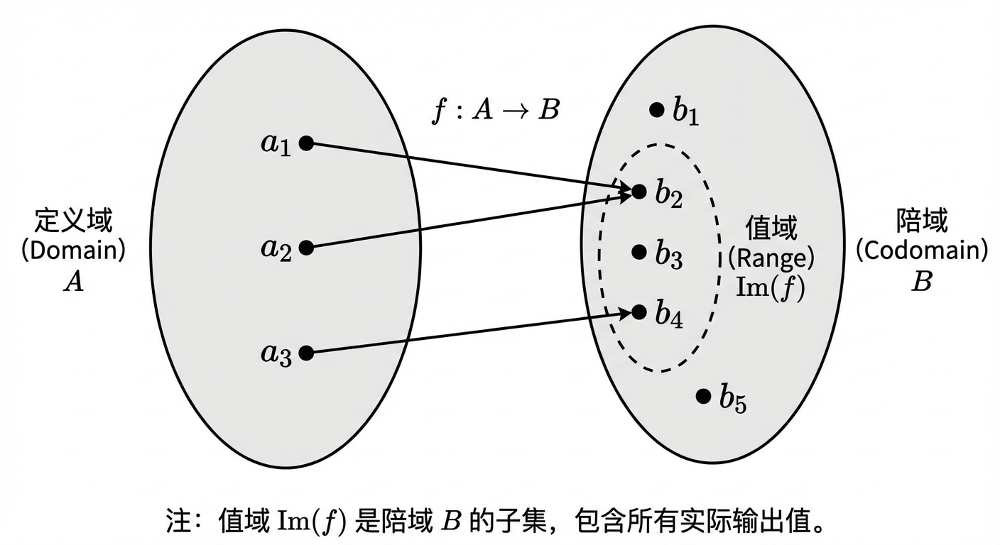
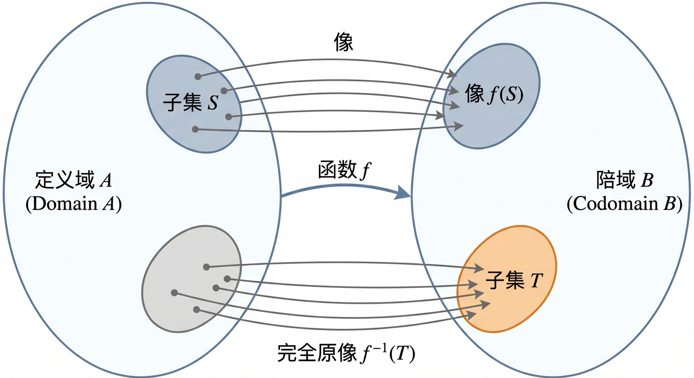
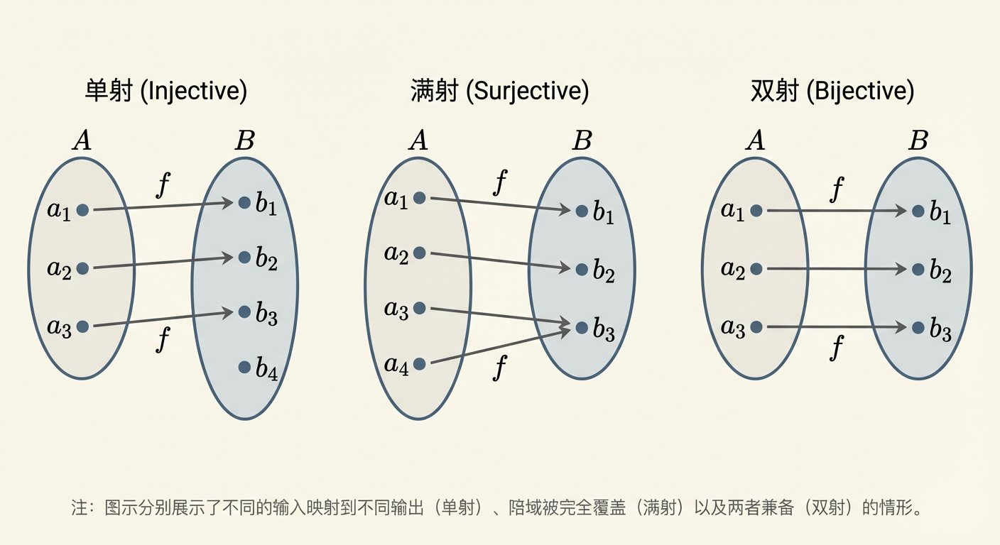
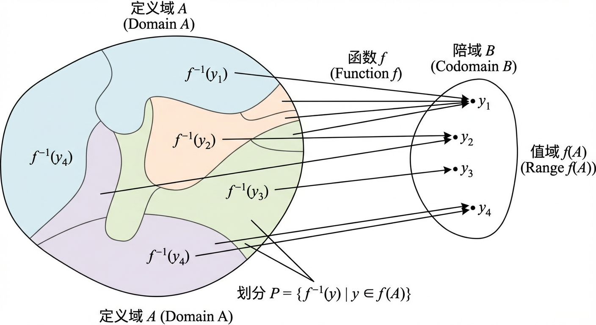
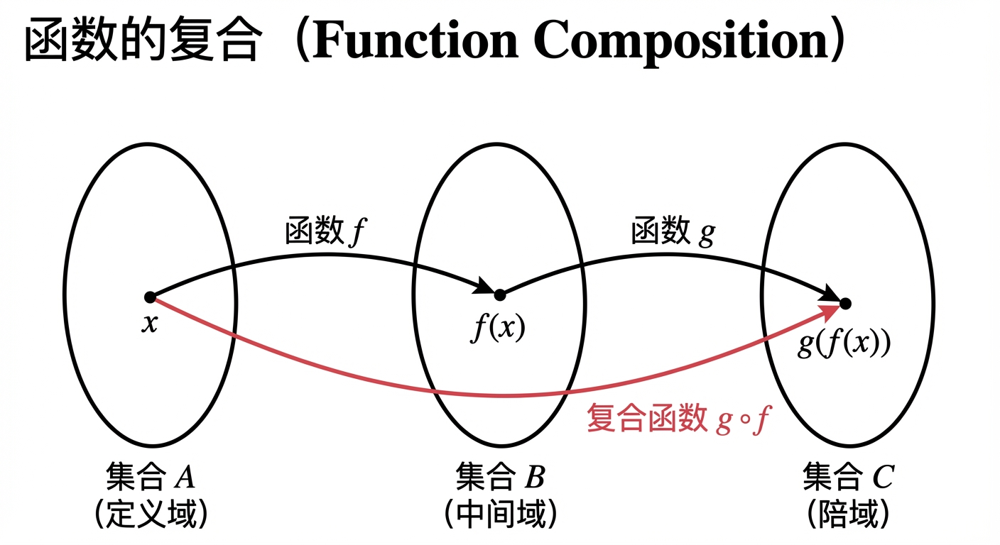
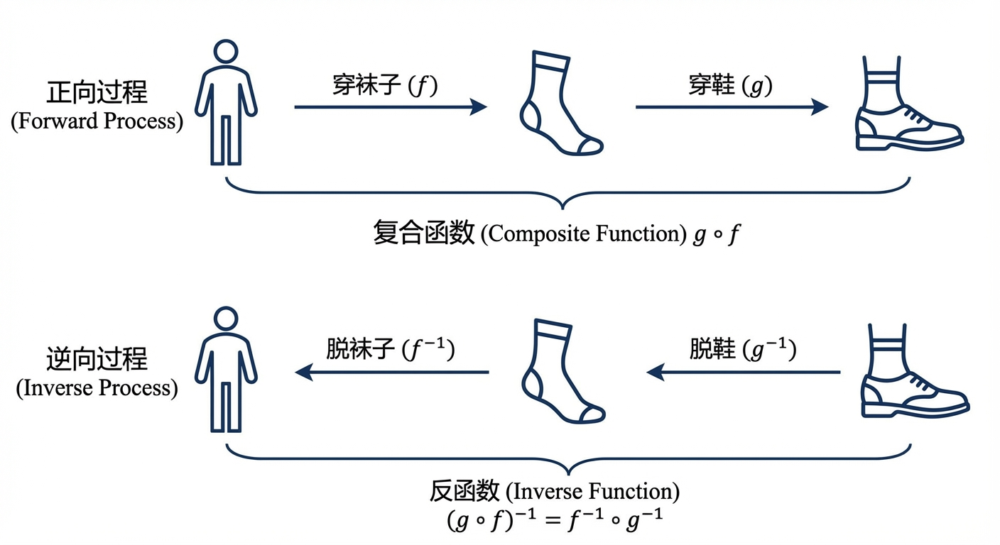
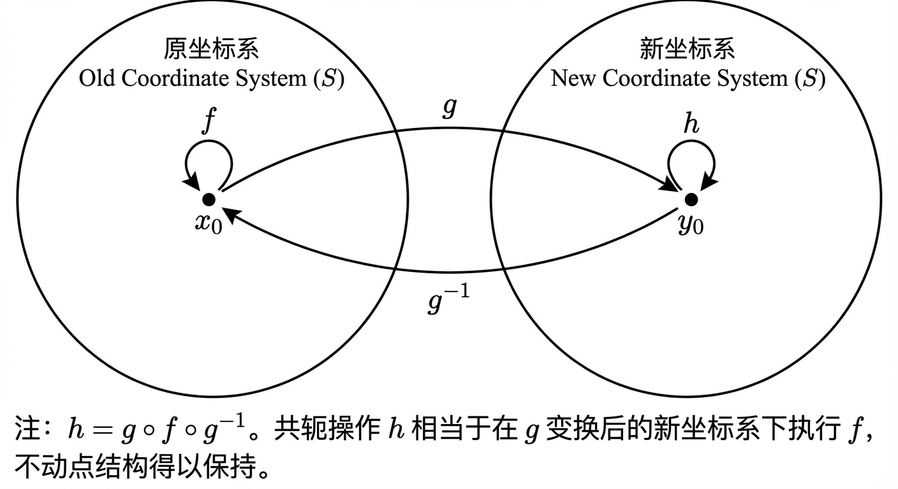

# 第5章：函数

从第4章“关系”出发，我们已经拥有了描述集合元素之间联系的统一语言。函数可以看作关系中最重要、最“确定”的一类：它要求每个输入必须对应且仅对应一个输出。正因为这种确定性，函数既能刻画计算过程，也能刻画结构变换。本章将先用集合论方式严格奠基（5.1），再在此基础上研究函数作为“可组合、可逆的过程”的运算规律（5.2）。其中，5.1 中关于单射/满射/双射的刻画，将直接成为 5.2 中“何时可逆（存在反函数）”的判断核心。

## 5.1 函数的定义及其性质

在上一章中，我们探讨了“关系”这一普遍的数学结构，它描述了集合元素之间的任意联系。现在，我们将注意力转向一种极为特殊且无处不在的关系——函数。从其最直观的意义上讲，函数是一个“规则”或一个“过程”，它为每一个输入精确地指定一个输出。然而，为了在离散数学乃至整个数学的宏伟殿堂中建造坚实的理论大厦，我们必须超越这种直观的理解，建立一个严格、普适且功能强大的形式化框架。

本节的目标正是为此。我们将从集合论的语言出发，为函数奠定一个无懈可击的定义，并厘清其基本构成要素：定义域、陪域与值域。随后，我们会将视角从“点对点”的映射提升到“集对集”的变换，引入“像”与“完全原像”这两个核心分析工具。这套语言不仅能让我们精确描述函数的作用范围，更重要的是，它将成为我们理解和证明函数各种关键性质——如奇偶性、单射性、满射性与双射性——的统一视角和逻辑主线。最终，我们将揭示函数如何通过其原像在定义域上自然地诱导出一种划分，这一深刻的结构性结论不仅呼应了前一章关于等价关系与划分的讨论，也为我们即将在下一节探索的函数复合与反函数理论构建了不可或缺的基石。

从方法论上看，本节内容遵循“从点到集、从性质到结构”的递进：先给出函数作为特殊关系的点值定义，再引入对任意子集的像/原像运算，最后用像/原像把单射与满射等性质改写成集合恒等式，并进一步导出“原像族构成划分”这一结构结论。这个结构结论将在 5.2 中通过“复合”和“反演”被进一步运算化：复合将把多个函数“串联”，而反函数将把双射“可逆”的直觉严格化。

### 函数的严格定义

在数学中，精准是力量的源泉。我们将函数定义为关系的一个特例，以确保其无歧义性。

**定义 5.1.1 (函数)**：设 $A$ 和 $B$ 为两个非空集合。一个从 $A$ 到 $B$ 的**函数 (function)**，记作 $f: A \to B$，是笛卡尔积 $A \times B$ 的一个子集（即一个二元关系），它满足如下条件：对于每一个元素 $a \in A$，都存在**唯一**的一个元素 $b \in B$，使得有序对 $(a, b)$ 属于 $f$。

当 $(a, b) \in f$ 时，我们通常使用更方便的记法 $f(a) = b$。这里的 $b$ 被称为 $a$ 在 $f$ 下的**像 (image)** 或**函数值 (value)**。

在这个定义中，集合 $A$ 被称为函数的**定义域 (domain)**，它代表了所有有效输入的集合。集合 $B$ 被称为**陪域 (codomain)**，它代表了所有可能输出值所在的集合。函数图像的全体，即集合 $\{f(a) \mid a \in A\}$，被称为函数的**值域 (range)**，记作 $\text{Im}(f)$ 或 $f(A)$。

必须强调，**值域是陪域的一个子集**，即 $\text{Im}(f) \subseteq B$。陪域是我们预先设定的输出“目标空间”，而值域是函数实际“击中”的元素集合。这两个概念在讨论函数的性质时有着至关重要的区别。

让我们通过一个例子来深入理解这些概念。考虑一个由极限定义的函数 $f: \mathbb{R} \to \mathbb{R}$：
$$ f(x) = \lim_{n\to\infty} \frac{x^{2n} - 1}{x^{2n} + 1} $$
为了确定这个函数的具体形态，我们需要根据 $|x|$ 的大小分情况讨论 $x^{2n}$ 的行为：
1.  当 $|x| < 1$ 时，$x^2 < 1$，因此当 $n \to \infty$ 时，$x^{2n} \to 0$。此时，$f(x) = \frac{0-1}{0+1} = -1$。
2.  当 $|x| = 1$ 时，即 $x = \pm 1$，$x^{2n} = 1$。此时，$f(x) = \frac{1-1}{1+1} = 0$。
3.  当 $|x| > 1$ 时，$x^2 > 1$，因此当 $n \to \infty$ 时，$x^{2n} \to \infty$。通过分子分母同除以 $x^{2n}$，我们得到：
    $$ f(x) = \lim_{n\to\infty} \frac{1 - 1/x^{2n}}{1 + 1/x^{2n}} = \frac{1-0}{1+0} = 1 $$
这个极限对于所有实数 $x$ 都存在，因此函数的定义域是整个实数集 $\mathbb{R}$。然而，尽管我们声明陪域是 $\mathbb{R}$，但函数实际能取到的值只有 $-1, 0, 1$ 这三个。所以，该函数的值域是离散集合 $\text{Im}(f) = \{-1, 0, 1\}$。这个例子清晰地展示了定义域、陪域与值域之间的区别：定义域是 $\mathbb{R}$，陪域是 $\mathbb{R}$，而值域是 $\{-1, 0, 1\}$。

有了严格定义后，我们接下来需要一种语言来描述“函数对一整个集合的作用”。这不仅是进行计数、分类与结构分析的关键，也将为 5.2 中讨论“把多个函数串联起来”提供自然的接口：复合 $g\circ f$ 本质上就是把 $f$ 的输出集合送入 $g$ 的输入集合。

### 函数的像与完全原像

函数的威力不仅在于它能将单个元素从一个集合映射到另一个集合，更在于它能整体地、结构性地变换整个子集。为了描述这种集合层面的行为，我们引入“像”与“完全原像”这两个概念。

**定义 5.1.2 (像)**：设 $f: A \to B$ 是一个函数，且 $S$ 是定义域 $A$ 的一个子集 ($S \subseteq A$)。$S$ 在 $f$ 下的**像 (image)**，记作 $f(S)$，是陪域 $B$ 中的一个子集，其定义为：
$$ f(S) = \{f(x) \mid x \in S\} $$
简而言之，$f(S)$ 是 $S$ 中所有元素的像所构成的集合。整个定义域的像 $f(A)$ 就是我们之前定义的函数的值域。

**定义 5.1.3 (完全原像)**：设 $f: A \to B$ 是一个函数，且 $T$ 是陪域 $B$ 的一个子集 ($T \subseteq B$)。$T$ 在 $f$ 下的**完全原像 (preimage)**，有时也简称为原像，记作 $f^{-1}(T)$，是定义域 $A$ 中的一个子集，其定义为：
$$ f^{-1}(T) = \{x \in A \mid f(x) \in T\} $$
$f^{-1}(T)$ 包含了所有被 $f$ 映射到集合 $T$ 中的定义域元素。如果 $T$ 是一个单元素集合 $\{y\}$，我们通常简写其原像为 $f^{-1}(y)$。

**重要警示**：初学者必须对记号 $f^{-1}$ 保持高度警惕。在这里，$f^{-1}(T)$ **不是**一个函数作用于 $T$ 的结果，它仅仅是一个方便的**记号**，用以表示一个在定义域中的集合。这个记号的使用**不**意味着 $f$ 具有一个“反函数”（我们将在 5.2 节探讨反函数的严格定义）。一个元素的完全原像 $f^{-1}(y)$ 可能是一个空集，也可能包含一个或多个元素。

让我们通过一个离散的例子来具体化这些定义。考虑函数 $f: \mathbb{Z} \to \mathbb{Z}_7$（映到模 7 的整数环），其规则为 $f(n) = (n^2 + 1) \pmod 7$。
-   **求像**：若我们取定义域的子集 $S = \{0, 1, 2, 3\}$，它的像 $f(S)$ 是什么？
    -   $f(0) = (0^2+1) \pmod 7 = 1$
    -   $f(1) = (1^2+1) \pmod 7 = 2$
    -   $f(2) = (2^2+1) \pmod 7 = 5$
    -   $f(3) = (3^2+1) \pmod 7 = 10 \pmod 7 = 3$
    将这些像收集起来，我们得到 $f(S) = \{1, 2, 3, 5\}$。
-   **求完全原像**：若我们取陪域的子集 $T=\{1, 5\}$，它的完全原像 $f^{-1}(T)$ 是什么？我们需要找到所有整数 $n$，使得 $f(n)$ 等于 $1$ 或 $5$。
    -   $f(n) = 1 \iff (n^2+1) \equiv 1 \pmod 7 \iff n^2 \equiv 0 \pmod 7 \iff n$ 是 $7$ 的倍数。所以 $f^{-1}(1) = \{7k \mid k \in \mathbb{Z}\}$。
    -   $f(n) = 5 \iff (n^2+1) \equiv 5 \pmod 7 \iff n^2 \equiv 4 \pmod 7 \iff n \equiv 2 \pmod 7$ 或 $n \equiv -2 \equiv 5 \pmod 7$。所以 $f^{-1}(5) = \{7k+2 \mid k \in \mathbb{Z}\} \cup \{7k+5 \mid k \in \mathbb{Z}\}$。
    因此，$f^{-1}(T) = f^{-1}(1) \cup f^{-1}(5) = \{n \in \mathbb{Z} \mid n \equiv 0, 2, \text{或} \, 5 \pmod 7\}$。

像与原像把“点值行为”提升为“集合变换行为”。接下来讨论的奇偶性、单射、满射、双射等性质，看似是对点值等式的约束，但它们最终都能（并且最好）被改写成关于像/原像的集合命题。这一点在本节后半部分会被系统体现，并将在 5.2 中转化为“复合后性质如何传递、何时可逆”的核心工具。

### 函数的基本性质

现在我们已经建立了函数的语言体系，可以开始对函数本身进行分类。函数的性质描述了其映射行为的特征，其中一些最基本的性质包括奇偶性、单射性、满射性和双射性。

#### 奇偶性

对于定义域关于原点对称（例如 $\mathbb{R}$ 或 $[-L, L]$）的函数，我们可以讨论其对称性，即奇偶性。

**定义 5.1.4 (奇偶性)**：设函数 $f$ 的定义域 $A$ 关于原点对称（即若 $x \in A$，则 $-x \in A$）。
-   如果对于所有 $x \in A$，都有 $f(-x) = f(x)$，则称 $f$ 为**偶函数 (even function)**。偶函数的图像关于 y 轴对称。
-   如果对于所有 $x \in A$，都有 $f(-x) = -f(x)$，则称 $f$ 为**奇函数 (odd function)**。奇函数的图像关于原点中心对称。

例如，多项式 $f(y) = 4y^2 - 2$ 是一个偶函数，因为 $f(-y) = 4(-y)^2 - 2 = 4y^2 - 2 = f(y)$。而多项式 $g(y) = 8y^3 - 12y$ 是一个奇函数，因为 $g(-y) = 8(-y)^3 - 12(-y) = -8y^3 + 12y = -(8y^3 - 12y) = -g(y)$。

奇偶性的概念不仅仅是一种分类，它揭示了一个深刻的结构性事实：任何定义在对称区间上的函数，都可以被唯一地分解为一个偶函数和一个奇函数之和。

**定理 5.1.5 (奇偶分解)**：设 $f: A \to \mathbb{R}$ 是一个定义在对称集合 $A$ 上的函数。那么存在唯一的偶函数 $f_e$ 和奇函数 $f_o$，使得对于所有 $x \in A$，都有 $f(x) = f_e(x) + f_o(x)$。这两个分量由以下公式给出：
$$ f_e(x) = \frac{f(x) + f(-x)}{2} \quad \text{且} \quad f_o(x) = \frac{f(x) - f(-x)}{2} $$
**证明**：我们首先验证 $f_e$ 是偶函数， $f_o$ 是奇函数。
$f_e(-x) = \frac{f(-x) + f(-(-x))}{2} = \frac{f(-x) + f(x)}{2} = f_e(x)$。
$f_o(-x) = \frac{f(-x) - f(-(-x))}{2} = \frac{f(-x) - f(x)}{2} = - \frac{f(x) - f(-x)}{2} = -f_o(x)$。
它们的和为 $f_e(x) + f_o(x) = \frac{f(x) + f(-x)}{2} + \frac{f(x) - f(-x)}{2} = \frac{2f(x)}{2} = f(x)$。唯一性的证明留作练习。

这个分解在高等数学中有广泛应用。例如，在微积分中，一个奇函数在对称区间 $[-L, L]$ 上的定积分为零，这一性质可以极大简化计算。

奇偶性强调的是“对称性”这一类结构约束；而接下来要讨论的单射/满射/双射，则强调“信息是否丢失”和“输出是否覆盖”的结构约束。它们不仅决定函数是否可逆（见 5.2 的反函数），也决定原像集合的大小与划分形态（见本节后续关于原像诱导划分的定理）。

#### 单射、满射与双射

接下来，我们讨论的性质与函数如何“覆盖”其陪域以及是否存在“重复”映射有关。这些性质在离散数学中尤为重要，因为它们与集合的计数和结构保持密切相关。

**定义 5.1.6 (单射、满射、双射)**：设 $f: A \to B$ 为一个函数。
-   $f$ 是**单射 (injective)** 或称**一对一 (one-to-one)** 的，如果对于任意 $x_1, x_2 \in A$，只要 $x_1 \neq x_2$，就有 $f(x_1) \neq f(x_2)$。等价地，$f(x_1) = f(x_2)$ 蕴含 $x_1 = x_2$。单射函数不会将不同的输入映射到相同的输出。
-   $f$ 是**满射 (surjective)** 或称**映上 (onto)** 的，如果它的值域等于它的陪域，即 $\text{Im}(f) = B$。这意味着对于陪域中的每一个元素 $y \in B$，都至少存在一个 $x \in A$ 使得 $f(x) = y$。
-   $f$ 是**双射 (bijective)** 的，如果它既是单射又是满射。

这些性质在处理有限集合时，会展现出一种特别优美的刚性结构。

**定理 5.1.7**：设 $X$ 是一个非空有限集，且 $f: X \to X$ 是一个从 $X$ 映到自身的函数。以下三个陈述是等价的：
(i) $f$ 是单射。
(ii) $f$ 是满射。
(iii) $f$ 是双射。

**证明思路**：
(i) $\implies$ (ii): 假设 $f$ 是单射。值域 $f(X)$ 是 $X$ 的一个子集。根据单射的定义，对于 $X$ 中任意两个不同的元素 $x_1, x_2$，它们的像 $f(x_1), f(x_2)$ 也不同。这意味着 $X$ 中的 $n=|X|$ 个元素被映射到了值域中的 $n$ 个不同元素。因此，值域的大小 $|f(X)| = |X| = n$。由于 $f(X)$ 是 $X$ 的一个大小为 $n$ 的子集，它必然就是 $X$ 本身。所以 $f$ 是满射。
(ii) $\implies$ (i): 假设 $f$ 是满射，即 $f(X) = X$，所以 $|f(X)|=n$。如果 $f$ 不是单射，那么至少存在两个不同的元素 $x_1, x_2$ 被映射到同一个值。这将导致值域的大小 $|f(X)|$ 最多为 $n-1$，与 $|f(X)|=n$ 矛盾。因此 $f$ 必须是单射。
(iii) 是 (i) 和 (ii) 的结合，因此它们的等价性是显然的。

这个定理是离散世界的一个标志性结果。它意味着对于一个有限集合到自身的映射，我们检查“无冲撞”（单射）和“全覆盖”（满射）这两个性质，只需验证一个即可。这与无限集合的情况形成鲜明对比，例如，函数 $f: \mathbb{Z} \to \mathbb{Z}$ 定义为 $f(n)=2n$ 是单射但不是满射。

此定理还与函数的可逆性有着直接联系，我们将在下一节深入探讨。一个函数 $f: X \to X$ （$X$ 有限）存在一个复合意义下的逆函数，当且仅当它是双射的。在这种情况下，不可能只存在单侧的逆（即只有左逆或右逆），这再次凸显了有限集合上的函数理论的独特性质。

到目前为止，单射/满射等性质仍主要以点值逻辑表达。接下来我们将把它们系统地“翻译”为像与原像的集合论等式/包含关系。这样做的好处是：一方面便于证明（可通过集合恒等式进行推演），另一方面也为 5.2 中的复合运算提供更容易传递的判据（复合天然对应“先像后像”“先原像后原像”的嵌套结构）。

### 性质、像与原像的相互作用

像与完全原像这两个工具的真正威力在于，它们能够将函数的抽象性质（如单射、满射）转化为具体的集合运算等式或包含关系，从而为证明和计算提供了可操作的判据。

首先，我们考察将原像和像运算相继作用会发生什么。

**定理 5.1.8**：对于任意函数 $f: A \to B$ 和任意子集 $T \subseteq B$，恒有：
$$ f(f^{-1}(T)) = T \cap f(A) $$
这个恒等式告诉我们，先对陪域子集 $T$ 取原像，再取像，得到的结果是 $T$ 中那些确实能被函数“达到”的部分。由此可以导出一个判断满射的清晰判据：

**推论 5.1.9**：函数 $f: A \to B$ 是满射的，当且仅当对于所有子集 $T \subseteq B$，都有 $f(f^{-1}(T)) = T$。
**证明**：若 $f$ 是满射，则 $f(A)=B$，代入定理 5.1.8，得到 $f(f^{-1}(T)) = T \cap B = T$。反之，若对所有 $T \subseteq B$ 都有 $f(f^{-1}(T)) = T$，取 $T=B$，则有 $f(f^{-1}(B)) = B$。根据定理 5.1.8，左边等于 $B \cap f(A)$，所以 $B \cap f(A) = B$，这蕴含了 $B \subseteq f(A)$。又因为 $f(A) \subseteq B$，故 $f(A)=B$，即 $f$ 是满射。

现在，我们考察相反的运算顺序：先对定义域子集取像，再取原像。

**定理 5.1.10**：对于任意函数 $f: A \to B$ 和任意子集 $S \subseteq A$，恒有：
$$ S \subseteq f^{-1}(f(S)) $$
这个包含关系是显然的：$S$ 中的每个元素 $x$ 都被映射到 $f(S)$ 中，因此根据原像的定义，$x$ 必然属于 $f^{-1}(f(S))$。但等号何时成立呢？当且仅当没有来自 $S$ 外部的“不速之客”被映射到 $f(S)$ 中。这正是单射性的本质。

**推论 5.1.11**：函数 $f: A \to B$ 是单射的，当且仅当对于所有子集 $S \subseteq A$，都有 $f^{-1}(f(S)) = S$。
**证明**：若 $f$ 是单射，设 $x \in f^{-1}(f(S))$，则 $f(x) \in f(S)$。这意味着存在某个 $s \in S$ 使得 $f(x)=f(s)$。因为 $f$ 是单射，必有 $x=s$，故 $x \in S$。这证明了 $f^{-1}(f(S)) \subseteq S$。结合定理 5.1.10，得证等式成立。反之，若对所有 $S \subseteq A$ 等式成立，取 $S=\{x_1\}$，则 $f^{-1}(f(\{x_1\})) = \{x_1\}$。如果存在 $x_2 \neq x_1$ 使得 $f(x_2)=f(x_1)$，那么 $x_2 \in f^{-1}(f(\{x_1\}))$，但这与该集合只有一个元素 $x_1$ 矛盾。故 $f$ 必为单射。

最后，让我们回到完全原像本身，并观察它如何揭示函数对定义域的内在结构化作用。

**定理 5.1.12 (原像诱导的划分)**：对于任意函数 $f: A \to B$，由其值域 $f(A)$ 中各元素 $y$ 的完全原像所构成的集合族 $\mathcal{P} = \{f^{-1}(y) \mid y \in f(A)\}$ 是定义域 $A$ 的一个**划分 (partition)**。

这意味着，这些非空的原像集合是两两不相交的，并且它们的并集恰好是整个定义域 $A$。

**证明**：
1.  **非空性**：对于任何 $y \in f(A)$，根据值域的定义，必然存在至少一个 $x \in A$ 使得 $f(x)=y$。这个 $x$ 就在 $f^{-1}(y)$ 中，因此 $f^{-1}(y)$ 非空。
2.  **并集为 A**：对于任意 $x \in A$，令 $y=f(x)$。则 $y \in f(A)$ 且 $x \in f^{-1}(y)$。这表明 $A$ 中的每个元素都属于族 $\mathcal{P}$ 中的某个集合。因此，$\bigcup_{y \in f(A)} f^{-1}(y) = A$。
3.  **两两不交**：取值域中两个不同的元素 $y_1, y_2 \in f(A)$。假设它们的完全原像有交集，即存在一个元素 $x$ 使得 $x \in f^{-1}(y_1)$ 且 $x \in f^{-1}(y_2)$。根据定义，这意味着 $f(x)=y_1$ 且 $f(x)=y_2$。但这与 $y_1 \neq y_2$ 矛盾，因为函数对每个输入只能有唯一的输出。因此，假设不成立，任意两个不同的原像集合必不相交。

这个定理提供了一个关于函数作用的深刻观点：每个函数都像一台分类机器，它将定义域中的所有元素根据它们被映射到的目标值进行“分箱”，而这些“箱子”（即原像集）构成了对定义域的一个完美划分。这一思想将函数与第四章中的等价关系紧密联系起来（事实上，任何函数都定义了一个等价关系 $x_1 \sim x_2 \iff f(x_1)=f(x_2)$，其等价类正是这些原像集），并为后续章节中更复杂的结构映射理论奠定了基础。

至此，我们不仅掌握了函数的基本概念与性质，更获得了两把“结构分析”的钥匙：其一，像/原像将性质转译为集合恒等式；其二，原像族给出定义域的自然划分。下一节将把函数进一步当作“可操作的对象”，讨论如何通过复合构造新函数，以及在何种条件下存在反函数来“撤销”映射。特别地，5.1 的“双射”将成为 5.2 中反函数存在性的充要条件，而像/原像的观点也将贯穿复合性质传递与可逆性论证。

### 小结

在本节中，我们为函数概念构建了坚实的集合论基础。我们从一个作为特殊关系的严格定义出发，精确区分了定义域、陪域和值域。通过引入像与完全原像，我们将分析的焦点从孤立的点提升到集合的整体变换，并特别强调了原像记号 $f^{-1}$ 与反函数概念的区分，为后续学习扫清了障碍。

本节的核心思想在于，将函数的关键性质——奇偶性、单射性、满射性和双射性——置于像与原像的运算框架中进行刻画。我们看到，这些性质并非孤立的标签，而是与集合运算的等式和包含关系一一对应，从而获得了可用于证明与计算的锐利工具。特别地，我们探讨了在有限集这一离散数学的核心场景下，单射、满射与双射之间深刻的等价关系。

最后，我们以“原像诱导划分”这一结构性结论收官，揭示了任何函数都内在地对其定义域进行了一次“分类”，这不仅与之前章节的等价关系理论遥相呼应，也从方法论上展示了函数作为一种“结构映射”的本质。这些关于函数性质及其集合论表征的洞见，将是我们下一节研究函数复合与反函数的起点，也是理解未来章节如图同构、代数同态等更高级结构保持映射的基石。读者应深刻体会，理解一个函数，远不止于会计算它的点值，更在于能洞悉它如何整体地、结构性地重塑其定义域。

## 5.2 函数的复合与反函数

在前一节中，我们为函数建立了严格的形式化框架，并探讨了其作为一种特殊关系的性质，如单射、满射与双射。这些性质为我们从集合论的静态视角理解函数的映射行为提供了判据。然而，函数的魅力不止于此。若将函数视为一种“过程”或“变换”，一个自然而然的问题便浮出水面：我们能否将多个过程串联起来，形成一个更复杂的流程？又或者，我们能否撤销一个已经完成的过程，回到初始状态？这两个问题分别导向了本节的核心主题：**函数的复合（Function Composition）**与**反函数（Inverse Function）**。本节将深入探讨这两种对函数的重要操作，揭示它们深刻的代数结构与逻辑内涵，并为后续章节中更抽象的代数系统理论奠定直观基础。

从 5.1 的角度看，“复合”对应将一个函数的输出（值域）作为另一个函数的输入（定义域），它实质上是在集合层面“嵌套”像运算；而“反函数”则是在双射前提下把像与原像之间的对应关系提升为真正的函数互逆。尤其要注意：5.1 中的记号 $f^{-1}(T)$ 是原像集合；而本节的 $f^{-1}$（反函数）是一个从陪域到定义域的函数，二者虽符号相似但概念层级不同。

### 函数的复合

将函数看作一个处理输入、产生输出的“机器”，那么函数的复合就如同构建一条“流水线”，其中一台机器的输出成品，被直接用作下一台机器的输入原料。这种过程的串接在数学和计算机科学中无处不在，从多步算法的执行到复杂系统的建模，都离不开复合的思想。

**定义 5.2.1 (函数的复合)**

设有两个函数，$f: A \to B$ 和 $g: C \to D$。如果函数 $f$ 的值域 $\text{Im}(f)$ 是函数 $g$ 的定义域 $C$ 的一个子集，即 $\text{Im}(f) \subseteq C$，那么我们便可以定义一个从 $A$ 到 $D$ 的新函数，称为 $f$ 与 $g$ 的**复合函数**，记作 $g \circ f$。对于任意 $x \in A$，其函数值定义为：
$$ (g \circ f)(x) = g(f(x)) $$
这里，$g$ 称为**外函数**，$f$ 称为**内函数**。

**注意：**
1.  **复合的可行性**：复合操作的核心前提是“接口兼容”，即内函数 $f$ 的“输出集合”（值域）必须能够被外函数 $g$ 作为“输入集合”（定义域）所接纳。在离散数学中，我们通常处理的情形更为简洁，例如 $f: A \to B$ 和 $g: B \to C$，此时 $f$ 的陪域恰好是 $g$ 的定义域，复合条件自然满足，得到的复合函数 $g \circ f$ 是一个从 $A$ 到 $C$ 的映射。
2.  **运算次序**：记号 $g \circ f$ 的运算顺序与书写顺序相反。它表示“先应用 $f$，再应用 $g$”。这种约定虽然初看起来有些不直观，但它使得函数作用于变量的写法 $(g \circ f)(x) = g(f(x))$ 变得自然流畅。

复合操作不仅生成了新的函数，它本身作为一种运算，也具有极其重要的代数性质。

**定理 5.2.1 (函数复合的结合律)**

函数复合满足**结合律 (Associativity)**。即，若 $f: A \to B$, $g: B \to C$, $h: C \to D$ 是三个函数，则有：
$$ (h \circ g) \circ f = h \circ (g \circ f) $$

**证明：**
要证明两个函数相等，我们必须证明它们的定义域相同，且对定义域中的任意元素，它们的函数值都相等。
首先，根据复合函数的定义，$(h \circ g) \circ f$ 和 $h \circ (g \circ f)$ 的定义域都是 $A$，陪域都是 $D$。
其次，对于任意 $x \in A$，我们有：
$$ ((h \circ g) \circ f)(x) = (h \circ g)(f(x)) = h(g(f(x))) $$
同时，
$$ (h \circ (g \circ f))(x) = h((g \circ f)(x)) = h(g(f(x))) $$
由于对于所有 $x \in A$，两个函数的函数值都相等，因此 $(h \circ g) \circ f = h \circ (g \circ f)$。
□

结合律的意义非凡，它保证了长链条的函数复合如 $f_n \circ \dots \circ f_2 \circ f_1$ 的结果是唯一确定的，与计算的组合顺序无关，这为我们研究由函数构成的代数系统铺平了道路。

在代数结构中，单位元是一个特殊而关键的角色。函数复合运算的单位元是**恒等函数 (Identity Function)**。

**定义 5.2.2 (恒等函数)**

对于任意集合 $A$，其上的恒等函数 $id_A: A \to A$ 定义为，对所有 $x \in A$，$id_A(x) = x$。

恒等函数在复合运算中的作用类似于算术乘法中的“1”。对于任意函数 $f: A \to B$，显然有：
$$ f \circ id_A = f \quad \text{并且} \quad id_B \circ f = f $$
读者可以自行验证这两个等式。

复合不仅是构造新函数的方式，也是传递和研究函数性质的重要途径。一个复合函数的性质与其构成部分的性质之间存在着深刻的联系。

**定理 5.2.2 (复合函数的性质传递)**

设 $f: A \to B$ 和 $g: B \to C$ 为两个函数。

1.  如果 $f$ 和 $g$ 都是单射的，那么 $g \circ f$ 也是单射的。
2.  如果 $f$ 和 $g$ 都是满射的，那么 $g \circ f$ 也是满射的。
3.  如果 $f$ 和 $g$ 都是双射的，那么 $g \circ f$ 也是双射的。

证明留作练习。更有趣的问题是，从复合函数的性质我们能推断出其构成部分的哪些性质？

**定理 5.2.3**

设 $f: A \to B$ 和 $g: B \to C$ 为两个函数。

1.  如果 $g \circ f$ 是单射的，那么 $f$ 必定是单射的。
2.  如果 $g \circ f$ 是满射的，那么 $g$ 必定是满射的。

**证明：**
1.  (证明 $f$ 是单射的) 假设 $f(x_1) = f(x_2)$，其中 $x_1, x_2 \in A$。我们需要证明 $x_1 = x_2$。对等式两边同时应用函数 $g$，得到 $g(f(x_1)) = g(f(x_2))$，即 $(g \circ f)(x_1) = (g \circ f)(x_2)$。因为已知 $g \circ f$ 是单射的，所以由单射的定义，必有 $x_1 = x_2$。因此，$f$ 是单射的。
2.  (证明 $g$ 是满射的) 对任意 $z \in C$，我们需要证明存在一个 $y \in B$ 使得 $g(y) = z$。因为已知 $g \circ f: A \to C$ 是满射的，所以对于这个 $z$，必存在一个 $x \in A$ 使得 $(g \circ f)(x) = z$。展开定义，即 $g(f(x)) = z$。现在，令 $y = f(x)$。由于 $f$ 是从 $A$ 到 $B$ 的函数，这个 $y$ 必定属于 $B$。我们找到了一个 $y \in B$（即 $f(x)$），它满足 $g(y) = z$。因此，$g$ 是满射的。
□

值得注意的是，当 $g \circ f$ 是单射时，我们无法保证 $g$ 也是单射的；同样，当 $g \circ f$ 是满射时，也无法保证 $f$ 是满射的。这提示我们，在分析系统性质时，必须仔细考察信息在“流水线”中是如何流动、压缩或扩展的。

复合运算提供了“串联过程”的语言，但“能否撤销过程”还需要更强的结构：如果输出无法唯一追溯到输入，则撤销无从谈起。这恰好把我们带回 5.1 的双射概念：反函数存在当且仅当原函数是双射。下面我们将把这种直觉严格化，并用复合恒等式刻画“互逆”。

### 反函数

函数复合为我们提供了构建复杂过程的工具，而反函数则探讨了一个相反的问题：一个过程能否被“撤销”或“逆转”？穿上鞋子的过程可以逆转为脱下鞋子，但将鸡蛋打碎的过程却无法逆转。在函数世界中，可逆性是一个精确且核心的概念。

直观地看，一个函数若要可逆，其映射的每一个输出都必须能唯一地追溯回一个输入。若两个不同的输入映射到同一个输出，当试图逆转时，我们便会面临“不知从何而来”的困境。这恰好对应了5.1节中**双射**的定义。

**定义 5.2.3 (反函数)**

设 $f: A \to B$ 是一个**双射函数**。那么 $f$ 的**反函数 (Inverse Function)**，记作 $f^{-1}$，是一个从 $B$ 到 $A$ 的函数，其定义如下：对于任意 $y \in B$， $f^{-1}(y)$ 是集合 $A$ 中唯一的元素 $x$，满足 $f(x) = y$。
即：
$$ f^{-1}(y) = x \iff f(x) = y $$

从定义可见，反函数 $f^{-1}$ 的存在性与 $f$ 的双射性质是等价的。反函数的定义域是原函数的陪域 (由于是双射，陪域等于值域)，反函数的陪域是原函数的定义域。这种角色的互换是反演操作的根本特征。例如，若有复合函数 $f = h \circ g$，其中 $g: S_A \to S_A$ 且 $h: S_A \to S_B$，那么 $f$ 的映射关系为 $f: S_A \to S_B$。其反函数 $f^{-1}$ 的映射关系必然是 $f^{-1}: S_B \to S_A$，即定义域为 $S_B$，陪域为 $S_A$。

**定理 5.2.4 (反函数的存在性与唯一性)**

1.  **存在性**：函数 $f: A \to B$ 存在反函数 $f^{-1}: B \to A$ 的充分必要条件是 $f$ 是一个双射。
2.  **唯一性**：如果一个函数存在反函数，则其反函数是唯一的。

**证明（唯一性）：**
假设函数 $f: A \to B$ 有两个反函数 $g: B \to A$ 和 $h: B \to A$。根据反函数的定义，对于任意 $y \in B$，有 $f(g(y))=y$ 和 $f(h(y))=y$。因此 $f(g(y))=f(h(y))$。由于 $f$ 必须是双射，所以它必然是单射的。由单射的定义，可得 $g(y) = h(y)$。因为 $y$ 是 $B$ 中的任意元素，所以函数 $g$ 和 $h$ 相等。这证明了反函数的唯一性。
□

在离散数学的范畴内，特别是处理有限集时，函数的性质有其特殊之处。一个重要的结论是，对于一个从有限集到其自身的函数，单射、满射和双射三个概念实际上是等价的。这可以由鸽巢原理解释。

**定理 5.2.5 (有限集上的函数性质)**

设 $A$ 是一个有限集，且 $f: A \to A$ 是一个函数。那么以下三个命题是等价的：
(i) $f$ 是单射的。
(ii) $f$ 是满射的。
(iii) $f$ 是双射的。

这个定理在密码学等领域有直接应用。例如，一个设计用于扰乱固定长度数据包的“置乱”函数 $g: \mathcal{P} \to \mathcal{P}$，其中 $\mathcal{P}$ 是所有可能数据包的有限集合。如果设计者能保证该函数无冲突（即任意两个不同的输入包，其输出也绝不相同），这在数学上就意味着函数 $g$ 是单射的。根据定理 5.2.5，这自动保证了 $g$ 也是满射和双射的。因此，每一个可能的扰乱后的数据包都有且仅有一个唯一的原始数据包与之对应，这意味着解扰过程（即反函数 $g^{-1}$）总是存在且唯一的。

反函数与复合运算的关系构成了本节理论的核心闭环。它们互为逆运算，满足一组优雅的恒等式。

**定理 5.2.6 (反函数与复合的恒等关系)**

设 $f: A \to B$ 是一个双射函数，其反函数为 $f^{-1}: B \to A$。则：
1.  $f^{-1} \circ f = id_A$
2.  $f \circ f^{-1} = id_B$

**证明：**
1.  对于任意 $x \in A$，令 $y=f(x)$。根据反函数的定义，$f^{-1}(y) = x$。因此，$(f^{-1} \circ f)(x) = f^{-1}(f(x)) = f^{-1}(y) = x = id_A(x)$。所以 $f^{-1} \circ f = id_A$。
2.  对于任意 $y \in B$，令 $x=f^{-1}(y)$。根据反函数的定义，$f(x) = y$。因此，$(f \circ f^{-1})(y) = f(f^{-1}(y)) = f(x) = y = id_B(y)$。所以 $f \circ f^{-1} = id_B$。
□

这些恒等式揭示了一个深刻的联系：函数与其反函数的复合，其效果等同于“什么也不做”。这正是代数结构中“逆元”概念的本质。当我们研究第14章的群论时，会发现所有双射函数（也称置换）构成的集合在复合运算下形成一个群，称为对称群。其中，恒等函数就是单位元，而每个函数的反函数就是其群论意义下的逆元。因此，**反函数**的概念和**群的逆元**概念在这里是完全统一的。

既然复合与反演都是运算，那么它们之间如何交互？如果一个复杂的“流水线”本身是可逆的，它的逆过程是怎样的？这引出了关于复合函数的反函数的重要定理。

**定理 5.2.7 (复合函数的反函数)**

若 $f: A \to B$ 和 $g: B \to C$ 都是双射函数，则它们的复合函数 $g \circ f: A \to C$ 也是双射的，且其反函数为：
$$ (g \circ f)^{-1} = f^{-1} \circ g^{-1} $$

**证明：**
我们已经知道两个双射的复合是双射，所以 $(g \circ f)^{-1}$ 存在。现在我们需要验证 $f^{-1} \circ g^{-1}$ 是否满足 $(g \circ f)$ 的反函数定义。我们来计算复合：
$$ (f^{-1} \circ g^{-1}) \circ (g \circ f) = f^{-1} \circ (g^{-1} \circ g) \circ f \quad (\text{结合律}) $$
$$ = f^{-1} \circ id_B \circ f \quad (\text{反函数定义}) $$
$$ = f^{-1} \circ f \quad (\text{恒等函数定义}) $$
$$ = id_A \quad (\text{反函数定义}) $$
同理，我们也可以验证 $(g \circ f) \circ (f^{-1} \circ g^{-1}) = id_C$。由于反函数是唯一的，所以必有 $(g \circ f)^{-1} = f^{-1} \circ g^{-1}$。
□

这个定理直观上可以用“穿脱袜子和鞋”来类比：执行的过程是“先穿袜子($f$)，再穿鞋($g$)”，那么逆过程必须是“先脱鞋($g^{-1}$)，再脱袜子($f^{-1}$)”——运算的顺序被颠倒了。这个“反序”原理是代数结构中一个反复出现的主题。

### 代数结构视角

将函数复合视为一种二元运算，将反函数视为求逆运算，我们可以从一个更抽象的代数视角来审视这些概念。所有从一个集合 $S$ 到自身的双射函数（即置换）构成的集合，记为 $S_S$，在复合运算下形成一个称为**对称群 (Symmetric Group)** 的重要代数结构。

在这个结构中，我们可以探讨一些更深入的性质。例如，我们知道实数乘法是可交换的（$ab=ba$），但函数复合通常是**不可交换的 (non-commutative)**，即 $f \circ g \neq g \circ f$。然而，当两个函数恰好满足交换律时，它们的逆函数之间也存在着优雅的关系。

**定理 5.2.8 (可交换双射的性质)**
设 $f, g$ 是集合 $S$ 上的两个双射函数，且它们满足交换律，即 $f \circ g = g \circ f$。那么：
1. $f$ 与 $g^{-1}$ 也可交换, 即 $f \circ g^{-1} = g^{-1} \circ f$。
2. $f^{-1}$ 与 $g$ 也可交换, 即 $f^{-1} \circ g = g \circ f^{-1}$。
3. $f^{-1}$ 与 $g^{-1}$ 也可交换, 即 $f^{-1} \circ g^{-1} = g^{-1} \circ f^{-1}$。

**证明（仅证1）：**
从 $f \circ g = g \circ f$ 出发。
用 $g^{-1}$ 从右复合两边：$(f \circ g) \circ g^{-1} = (g \circ f) \circ g^{-1}$。
利用结合律：$f \circ (g \circ g^{-1}) = g \circ (f \circ g^{-1})$。
化简得：$f \circ id_S = g \circ (f \circ g^{-1})$，即 $f = g \circ (f \circ g^{-1})$。
现在，用 $g^{-1}$ 从左复合两边：$g^{-1} \circ f = g^{-1} \circ (g \circ (f \circ g^{-1}))$。
再次利用结合律：$g^{-1} \circ f = (g^{-1} \circ g) \circ (f \circ g^{-1})$。
化简得：$g^{-1} \circ f = id_S \circ (f \circ g^{-1})$，即 $g^{-1} \circ f = f \circ g^{-1}$。
□

这种纯粹基于运算公理的推导，展现了将函数及其运算看作一个代数系统所带来的强大威力。我们不再关心函数的具体映射规则，而是聚焦于它们遵循的普适结构。

另一个体现结构思想的例子是**共轭 (Conjugation)**。给定两个置换 $f, g$，函数 $h = g \circ f \circ g^{-1}$ 称为 $f$ 被 $g$ 共轭的结果。共轭操作保持了函数的许多结构特性，例如不动点结构。一个函数 $f$ 的**不动点 (fixed point)** 是指满足 $f(x)=x$ 的元素 $x$。

**定理 5.2.9 (共轭与不动点)**
设 $f, g$ 是集合 $S$ 上的双射函数，$h = g \circ f \circ g^{-1}$。元素 $x_0 \in S$ 是 $f$ 的不动点，当且仅当 $y_0 = g(x_0)$ 是 $h$ 的不动点。

**证明：**
$y_0$ 是 $h$ 的不动点 $\iff h(y_0) = y_0 \iff (g \circ f \circ g^{-1})(y_0) = y_0$。
将 $g^{-1}$ 从左复合两边，得到 $f \circ g^{-1}(y_0) = g^{-1}(y_0)$。
这表明元素 $g^{-1}(y_0)$ 是 $f$ 的一个不动点。
将 $y_0 = g(x_0)$ 代入，即 $g^{-1}(g(x_0)) = x_0$。
因此，$y_0$ 是 $h$ 的不动点当且仅当 $x_0$ 是 $f$ 的不动点。
□
这个定理优美地揭示了共轭的几何意义：它相当于对坐标系进行了一次“更换”（通过 $g$），在新的坐标系下执行原操作（$f$），然后再换回原来的坐标系（通过 $g^{-1}$）。$f$ 的不动点在 $g$ 的作用下，就变成了 $h$ 的不动点。

### 小结

本节中，我们从视函数为过程出发，系统地建立了函数的两种核心运算：**复合**与**反演**。函数复合，作为过程的串联，其定义的核心在于接口的匹配，其最重要的代数性质是满足结合律，这为我们视其为一种广义“乘法”提供了基础。

随后，我们将反函数视为复合的逆运算，即过程的“撤销”。我们明确了函数可逆的充要条件是其必须为**双射**，并特别指出了在离散的有限集背景下，单射性足以保证可逆性，这在诸多计算应用中至关重要。反函数的基本性质，如其与原函数复合得到恒等函数，以及复合函数的反函数遵循“反序”规律，即 $(g \circ f)^{-1} = f^{-1} \circ g^{-1}$，构成了本节的理论支柱。

更重要的是，本节引导我们将视角从孤立的函数映射提升到由函数构成的**代数系统**。通过探讨交换律、共轭等概念，我们预演了抽象代数中的基本思想。函数复合的结合律、恒等函数的存在、以及双射函数的反函数存在且唯一，这些性质精确地满足了**群**的公理。本节所讨论的函数集合及其运算，特别是对称群，将成为第14章《代数系统》中一个贯穿始终的核心范例。同时，双射函数作为保持集合基数的结构，其思想将延伸至第6章中图的同构——一种保持图连接结构的双射。可以说，函数的复合与反演，不仅是函数论自身的有机组成部分，更是开启后续更广阔代数结构研究大门的钥匙。

综合 5.1 与 5.2：前者回答“函数是什么、如何用集合语言刻画其性质与结构”，后者回答“函数如何作为运算对象被组合与求逆”。两节共同奠定了后续“结构保持映射”思想的基础：当我们研究图同构、代数同态等概念时，核心都将围绕“映射 + 可组合性 + 在某种意义下的可逆/保持结构”展开。

## 总结

本章围绕“函数”这一特殊关系建立了完整的理论链条。

在 5.1 中，我们以集合论严格定义函数 $f:A\to B$，区分了定义域、陪域和值域，并以像 $f(S)$ 与完全原像 $f^{-1}(T)$ 将函数作用从“元素层面”提升到“集合层面”。在此语言下，我们讨论了奇偶性与奇偶分解（定理 5.1.5），并系统给出单射、满射、双射的定义（定义 5.1.6），强调有限集自映射上单射与满射的等价（定理 5.1.7）。更关键的是，我们用像/原像的恒等式刻画满射与单射（定理 5.1.8–5.1.11），并以“原像诱导的划分”（定理 5.1.12）揭示函数对定义域的内在分类结构，从而与等价关系理论形成呼应。

在 5.2 中，我们把函数视为“过程”，引入复合 $g\circ f$（定义 5.2.1）与恒等函数（定义 5.2.2），证明复合的结合律（定理 5.2.1），并讨论性质在复合中的传递与可反推的方向（定理 5.2.2、5.2.3）。随后以双射为核心刻画反函数（定义 5.2.3），给出存在唯一性（定理 5.2.4），并用复合恒等式表达互逆关系（定理 5.2.6），证明复合函数的反函数满足“反序律”（定理 5.2.7）。最后从代数结构视角说明双射在复合下形成群的雏形，引出交换性与共轭等结构概念（定理 5.2.8、5.2.9），为后续抽象代数与结构保持映射的学习提供统一框架。

## 练习题

1. [选择题] 设 $S$ 为某大型软件项目中所有不同子程序的集合。在 $S$ 上定义二元关系：  
   (1) “直接调用”关系 $R_C$：对任意 $f,g\in S$，$f\,R_C\,g$ 当且仅当 $f$ 的源代码中至少直接调用过一次 $g$；  
   (2) “共享修改者”关系 $R_M$：存在非空真子集 $M\subset S$（且 $|M|\ge 2$），称为 mutators；对任意 $f,g\in S$，$f\,R_M\,g$ 当且仅当 $f\in M$ 且 $g\in M$。  

   已知还满足：  
   - 存在至少一个递归子程序（存在 $f$ 使得 $f\,R_C\,f$）；  
   - 存在一对不同子程序 $a\ne b$ 互相直接调用（$a\,R_C\,b$ 且 $b\,R_C\,a$）；  
   - 存在长度为 2 的调用链但非直接调用：存在两两不同的 $x,y,z\in S$ 使得 $x\,R_C\,y$ 且 $y\,R_C\,z$，但 $x\not R_C z$。  

   记 $R_C^{-1}$ 为 $R_C$ 的逆关系，$R_C^2=R_C\circ R_C$ 为复合关系。判断下列命题真伪：  
   I. $R_C$ 具有传递性。  
   II. $R_M$ 是 $S$ 上的等价关系。  
   III. $R_C\cup R_C^{-1}$ 是对称关系。  
   IV. 对任意 $f,g\in S$，若 $(f,g)\in R_C^2$ 则必有 $(f,g)\in R_C$。  

   问：上述命题哪些为真？  
   A. 仅 III 真  
   B. 仅 I 与 IV 真  
   C. 仅 II 与 III 真  
   D. I、II、III 真  
   E. 全都真  

2. （本题与本章“函数的复合与反函数”主题不直接对应，且属于可计算性与 $\lambda$ 演算范畴，故本章练习题不收录。）

**参考答案**

1. 选 A。要点：  
   - I 假：题设给出反例 $x\,R_C\,y$ 且 $y\,R_C\,z$ 但 $x\not R_C z$，故不传递。  
   - II 假：$R_M$ 在 $S$ 上不自反（因 $M$ 是 $S$ 的真子集，存在 $s\in S\setminus M$ 使 $(s,s)\notin R_M$），因此不是等价关系。  
   - III 真：对任意关系 $R$，$R\cup R^{-1}$ 总是对称。  
   - IV 假：$(x,z)\in R_C^2$（因为存在中介 $y$），但 $(x,z)\notin R_C$，故不成立。