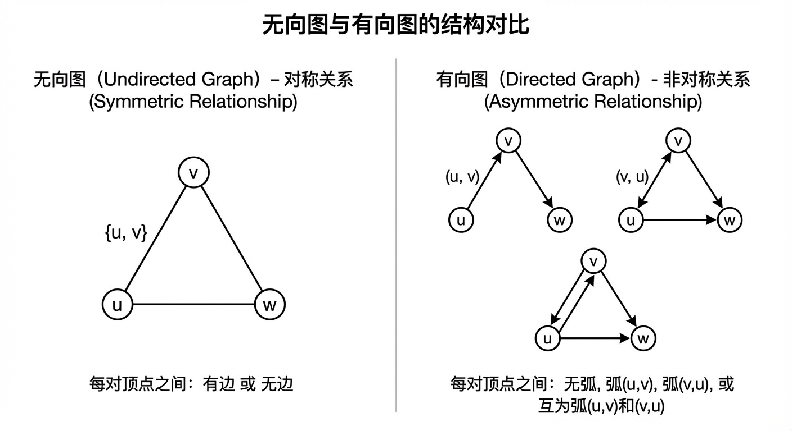
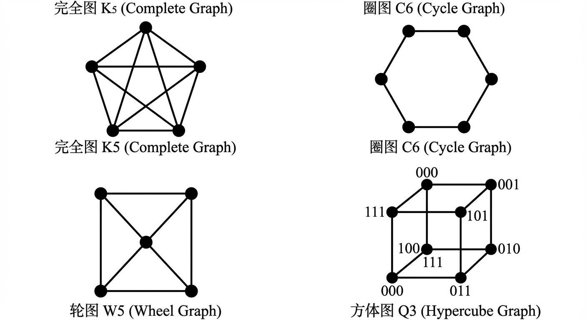
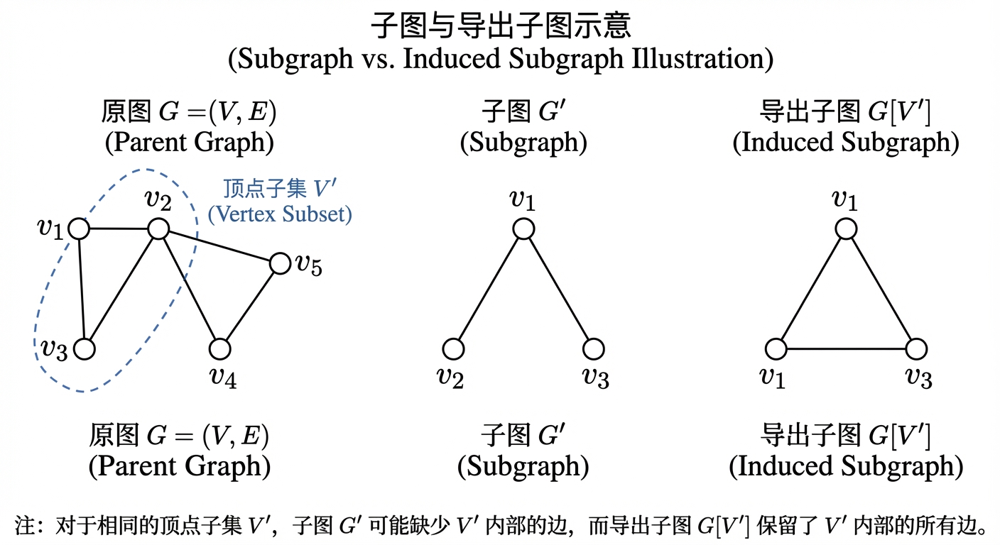
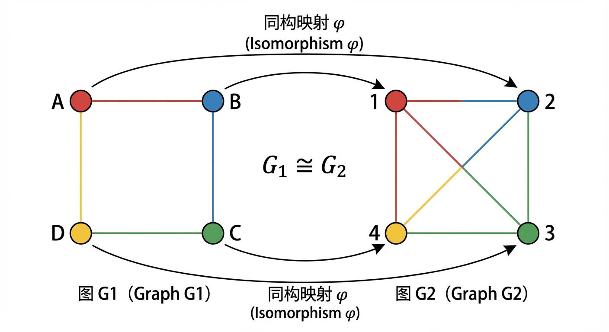
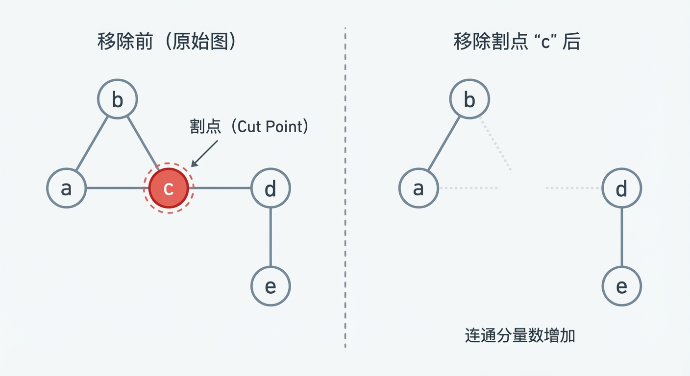
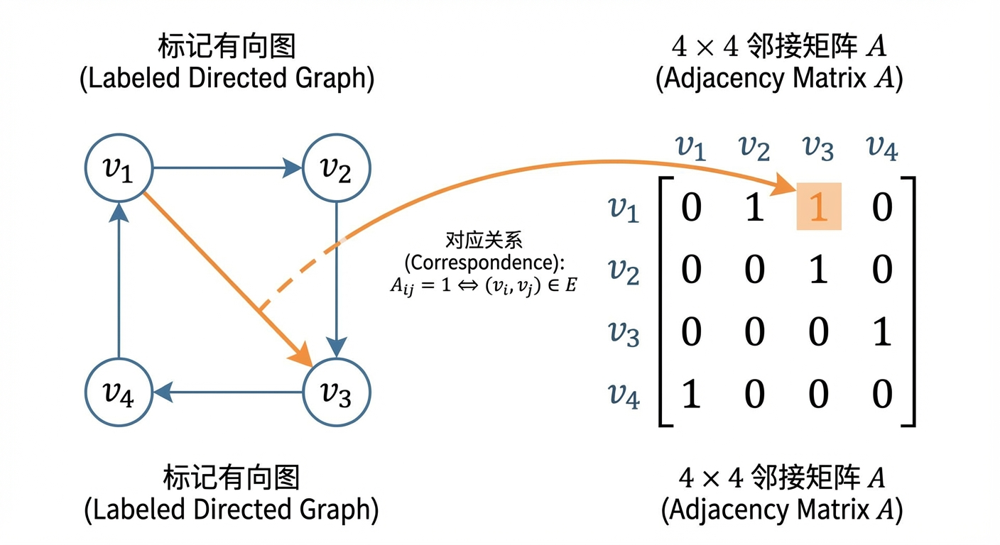
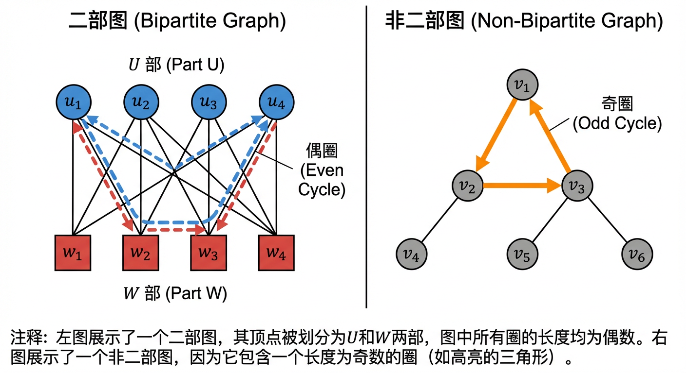
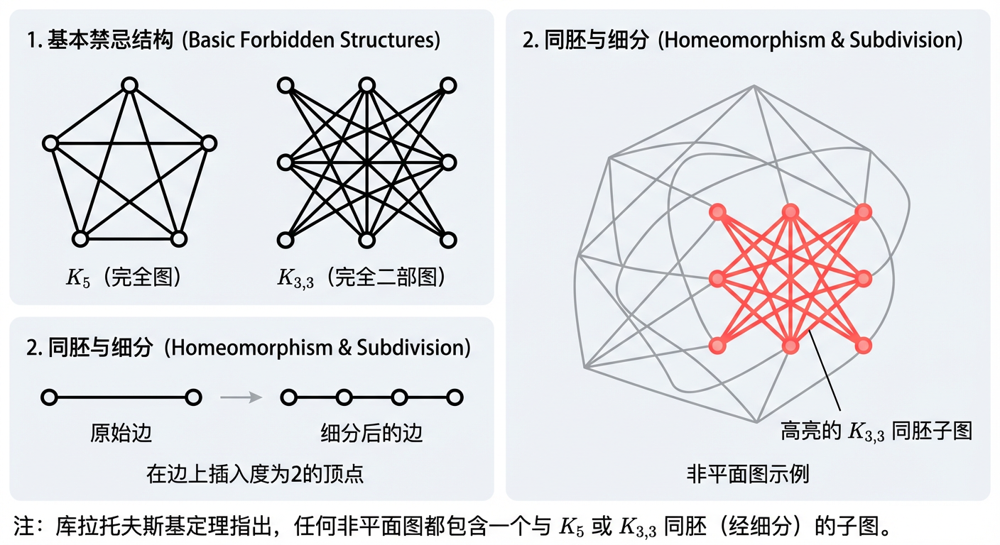

# 第6章：图

从集合、关系与函数出发，我们已经掌握了描述离散结构的基本形式化语言。但在刻画“实体—关系”所形成的复杂网络时，仅用关系的有序对/无序对表示往往缺乏直观的结构感与可操作性。本章引入图论这一统一框架：用顶点抽象实体，用边（或弧）抽象关系。随后我们将依次回答三个层层递进的问题：**图是什么（6.1）**、**图是否“连成一体”（6.2）**、**如何把图变成可计算的代数对象（6.3）**，并在此基础上识别与研究若干反复出现的典型结构（6.4）。为便于形成整体视角，需要特别注意：6.1 中的基本对象（如度、子图、同构）会在 6.2 的连通性度量与 6.3 的矩阵刻画中不断被调用，而 6.4 的特殊图类又往往以“路径/回路/可达性/平面嵌入”等性质为判据，因此四节内容构成一个紧密的理论链条。

---

## 6.1 图的基本概念

我们生活的世界，本质上是由实体以及实体间的各种关系构成的网络。从人际交往构成的社会网络，到计算机程序中模块间的调用关系，再到生物体内的基因调控网络，我们无时无刻不处在各种复杂的关系网中。为了理解、分析并驾驭这些复杂系统，我们需要一种能够穿透表象、直击其结构本质的数学语言。在前面的章节中，我们已经建立了集合、关系与函数等形式化工具，它们为描述离散结构打下了坚实的基础。现在，我们将引入一个更为强大和直观的框架——图论（Graph Theory）。图，作为对二元关系的另一种结构化表达，将系统中的实体抽象为“顶点”，将它们之间的关系抽象为“边”，从而将直观的网络图像平滑过渡到可被严谨推演的数学模型。本节的目标，便是确立这一模型的基本词汇、记号体系与核心对象，为后续深入探索图的丰富世界铺平道路。

在这一节中建立的“顶点—边”语言不仅用于静态描述，更将直接服务于下一节的“可达性”讨论：例如，**通路**将建立在“相邻/关联”的概念之上，**连通度**将以“删除顶点/边后的子图”来定义；再往后，在 6.3 节中我们会看到这些关系还能被编码成矩阵，从而把组合结构转化为代数对象并用于计算。

### 无向图与有向图

从最根本的层面讲，一个**图（graph）** 是一个有序对 $G = (V, E)$，其中 $V$ 是一个非空有限集，其元素称为**顶点（vertices）** 或节点（nodes）；$E$ 是一个由 $V$ 中顶点对构成的集合（或多重集），其元素称为**边（edges）**。一条边连接的两个顶点被称为它的**端点（endpoints）**。如果一个顶点是一条边的端点，我们就说这条边与该顶点是**关联的（incident）**。图论的丰富性与深刻性，正是源于对顶点与边之间关系的各种约束和扩展。

在图论中，最基本的分类之一在于关系是否具有对称性，这引出了无向图与有向图的区分。

**定义 6.1 (无向图)**
一个**无向图（undirected graph）** $G = (V, E)$ 由一个顶点集 $V$ 和一个边集 $E$ 组成，其中 $E$ 中的每一条边都是连接 $V$ 中两个顶点（可以相同）的无序对。如果一条边连接顶点 $u$ 和 $v$，我们将其记为 $\{u, v\}$。

在无向图中，边 $\{u, v\}$ 代表一种对称关系：如果 $u$ 与 $v$ 相连，那么 $v$ 也与 $u$ 相连。这可以比作社交网络中的“好友”关系，或物理网络中的双向通信链路。如果两个顶点被同一条边连接，则称它们是**相邻的（adjacent）**。

**定义 6.2 (有向图)**
一个**有向图（directed graph）**，或称**图（digraph）**，$D = (V, A)$ 由一个顶点集 $V$ 和一个有向边（或称**弧, arc**）集 $A$ 组成，其中 $A$ 中的每一条弧都是连接 $V$ 中两个顶点（可以相同）的有序对。如果一条弧从顶点 $u$ 指向顶点 $v$，我们将其记为 $(u, v)$，并称 $u$ 为弧的**尾（tail）**或起点，$v$ 为弧的**头（head）**或终点。

有向图的弧 $(u, v)$ 代表一种非对称关系，它与 $(v, u)$ 是截然不同的。一个典型的例子是社交平台上的“关注”功能，用户 $u$ 关注 $v$ 并不意味着 $v$ 也关注 $u$。同样，在程序流程图中，一条从模块 $u$ 指向 $v$ 的弧代表了控制流或数据流的单向传递。

方向性的引入，极大地扩展了图的表达能力，但也带来了组合复杂度的急剧增长。这引发我们思考：方向性究竟在多大程度上改变了一个网络的结构可能性？让我们考虑一个仅有3个顶点的微型网络。在无向图中，每对顶点之间只有两种状态：有边或无边。这 $\binom{3}{2}=3$ 对顶点总共可以产生 $2^3=8$ 种不同的标记图。通过消除因顶点标签不同而产生的重复，我们发现只有4种本质上不同的结构（即非同构的图）。然而，在有向图中，每对顶点 $\{u,v\}$ 之间存在四种可能的状态：没有弧、弧 $(u,v)$、弧 $(v,u)$ 或一对相互的弧 $(u,v)$ 和 $(v,u)$。这使得在3个顶点上总共可以构建 $4^3 = 64$ 种不同的标记图，它们对应着16种本质不同的结构。从4到16的跃升，直观地揭示了方向性如何从根本上丰富了网络的结构多样性。

无向/有向的区分会在后续章节持续产生影响：在 6.2 节中，“是否可达”在无向图里天然对称，而在有向图里必须区分弱连通与强连通；在 6.3 节中，邻接矩阵对无向图必为对称矩阵，而对有向图一般不对称，这一差异将直接影响我们用矩阵刻画通路与可达性的方式。

### 顶点的度与握手定理

为了量化顶点的局部连接特性，我们引入“度”的概念。

**定义 6.3 (顶点的度)**
在无向图中，一个顶点 $v$ 的**度（degree）**，记为 $\deg(v)$，是与它关联的边的数目。一个连接自身顶点的边，称为**环（loop）**，在计算度数时通常计两次。
在有向图中，一个顶点 $v$ 的**入度（in-degree）**，记为 $\deg_{in}(v)$ 或 $d^-(v)$，是以 $v$ 为头的弧的数目；其**出度（out-degree）**，记为 $\deg_{out}(v)$ 或 $d^+(v)$，是以 $v$ 为尾的弧的数目。一个顶点的**总度数**是其入度与出度之和，即 $\deg(v) = \deg_{in}(v) + \deg_{out}(v)$。

度数是网络分析中最基本的中心性度量，它反映了一个节点在网络中的局部重要性或活跃程度。例如，在蛋白质相互作用网络中，一个蛋白质的度数越高，意味着它与越多的其他蛋白质发生相互作用，可能在生物功能中扮演着更为核心的角色。

这些看似简单的局部计数，遵循着一个优美而深刻的全局守恒定律，它源于第一章中介绍的双重计数（double counting）证明方法。

**定理 6.1 (握手定理, Handshaking Theorem)**
在一个有限无向图 $G=(V, E)$ 中，所有顶点的度数之和等于边数的两倍。
$$ \sum_{v \in V} \deg(v) = 2|E| $$

**证明**：考虑图中所有“顶点-边”的关联对。我们可以从两个角度来计数。一方面，从顶点的角度看，每个顶点 $v$ 贡献了 $\deg(v)$ 个关联。将所有顶点的贡献相加，总关联数即为 $\sum_{v \in V} \deg(v)$。另一方面，从边的角度看，每一条边（包括环）都有两个端点，因此它恰好贡献了2个关联。将所有边的贡献相加，总关联数即为 $2|E|$。根据双重计数原理，两种方法得到的结果必然相等，故定理成立。

这个定理因其生动的比喻而得名：在一场聚会中，所有参与者握手次数的总和必然是偶数，因为每一次握手都同时增加了两个人的握手次数。这个简单定理有一个非常重要的推论：

**推论 6.1.1**
在任何有限无向图中，度数为奇数的顶点的数量必定是偶数。

**证明**：我们将顶点集 $V$ 划分为度数为偶数的顶点子集 $V_{even}$ 和度数为奇数的顶点子集 $V_{odd}$。根据握手定理，$\sum_{v \in V_{even}} \deg(v) + \sum_{v \in V_{odd}} \deg(v) = 2|E|$。左边的第一项是偶数之和，必然为偶数。等式右边 $2|E|$ 也是偶数。因此，$\sum_{v \in V_{odd}} \deg(v)$ 必须是一个偶数。而一组奇数之和为偶数的充要条件是这组奇数的个数为偶数。故 $|V_{odd}|$ 必为偶数。

对于有向图，类似地，每一条弧都恰好有一个头和一个尾。因此，通过对所有“顶点-弧”的头尾关系进行双重计数，我们立即得到：

**定理 6.2**
在一个有限有向图 $D=(V, A)$ 中，所有顶点的入度之和等于出度之和，且两者都等于弧的总数。
$$ \sum_{v \in V} \deg_{in}(v) = \sum_{v \in V} \deg_{out}(v) = |A| $$

度的概念将在本章后续两处成为关键“接口”：其一是在 6.2 节中，最小度 $\delta(G)$ 出现在 Whitney 不等式 $\kappa(G) \le \lambda(G) \le \delta(G)$ 中，度与连通度由此发生系统联系；其二是在 6.3 节中，度会以“度矩阵”形式进入拉普拉斯矩阵 $L=D-A$，从而把局部计数纳入代数框架。

### 一些重要的图族

在图论的广阔天地中，一些具有特定结构与高度对称性的图族，如同几何学中的正多边形，构成了我们研究与构造复杂图的基础。在定义这些图族之前，我们先明确一个核心概念。

**定义 6.4 (简单图)**
一个**简单图（simple graph）** 是指不含环且任意两个不同顶点之间最多只有一条边的图。对于简单无向图，这意味着边集 $E$ 是 $V$ 的2元子集的集合，即 $E \subseteq \binom{V}{2}$。对于简单有向图，这意味着弧集 $A$ 是 $(V \times V) \setminus \{(v,v) | v \in V\}$ 的一个子集。

除非特别声明，本章后续讨论的图大多默认为简单图。当允许两个顶点间存在多条边时，我们称之为**多重图（multigraph）**；当允许环存在时，有时称之为**伪图（pseudograph）**。

现在，让我们认识几个经典的图族：

*   **完全图（Complete Graph, $K_n$）**: 一个有 $n$ 个顶点的简单无向图，其中任意两个不同的顶点之间都恰好有一条边。$K_n$ 的边数为 $\binom{n}{2} = \frac{n(n-1)}{2}$。
*   **圈图（Cycle Graph, $C_n$）**: 一个由 $n$ 个顶点 $(v_1, v_2, \dots, v_n)$ 构成的图，其边集为 $\{\{v_1, v_2\}, \{v_2, v_3\}, \dots, \{v_{n-1}, v_n\}, \{v_n, v_1\}\}$。$C_n$ 拥有 $n$ 个顶点和 $n$ 条边。
*   **轮图（Wheel Graph, $W_n$）**: 在圈图 $C_{n-1}$ 的基础上，增加一个中心顶点，并将其与 $C_{n-1}$ 的所有 $n-1$ 个顶点相连，所构成的图称为 $n$-轮图 $W_n$（$n \ge 4$）。$W_n$ 有 $n$ 个顶点和 $2(n-1)$ 条边。
*   **正则图（Regular Graph）**: 如果一个图中所有顶点的度数都相同，均为常数 $k$，则该图被称为 **$k$-正则图**。例如，完全图 $K_n$ 是 $(n-1)$-正则的，圈图 $C_n$ 是 $2$-正则的。值得注意的是，轮图 $W_n$ (当 $n \geq 5$ 时) 不是正则图，因为其中心顶点的度为 $n-1$，而轮上顶点的度均为3。唯一的正则轮图是 $W_4$，它与完全图 $K_4$ 同构，是一个3-正则图。
*   **方体图（Hypercube Graph, $Q_n$）**: $n$-维方体图 $Q_n$ 的顶点集是所有长度为 $n$ 的二进制串 $\{0,1\}^n$。两个顶点之间存在一条边，当且仅当它们对应的二进制串恰好在一位上不同。$Q_n$ 共有 $2^n$ 个顶点，并且是一个 $n$-正则图。

这些标准图族在后文会反复作为“参照系”：例如在 6.4 节中，圈图与轮图会出现在欧拉/哈密顿性质的讨论里，而完全图与完全二部图则常作为平面性判据中的典型“障碍物”；同时，图族的高度对称性也使它们成为检验同构（见后文）与矩阵表示（6.3）的良好样例。

### 子图与补图

如同从集合中可以抽取子集，我们也可以从一个图中抽取其部分结构，形成子图。

**定义 6.5 (子图与导出子图)**
给定图 $G=(V, E)$ 和 $G'=(V', E')$。如果 $V' \subseteq V$ 且 $E' \subseteq E$，则称 $G'$ 是 $G$ 的一个**子图（subgraph）**。
特别地，如果 $V' \subseteq V$，并且 $E'$ 包含了 $E$ 中所有两个端点都在 $V'$ 内的边，则称 $G'$ 是由顶点集 $V'$ 从 $G$ 中**导出的子图（induced subgraph）**，记为 $G[V']$。

导出子图的概念在结构图论中至关重要，因为它保留了原图中特定顶点子集内部的全部连接信息。

**定义 6.6 (补图)**
对于一个简单无向图 $G=(V, E)$，它的**补图（complement graph）** $\bar{G}=(V, \bar{E})$ 拥有与 $G$ 相同的顶点集，其边集 $\bar{E}$ 由所有在 $G$ 中*不*存在的边构成。即，对于任意两个不同的顶点 $u, v \in V$，$\{u, v\} \in \bar{E}$ 当且仅当 $\{u, v\} \notin E$。

补图运算为我们提供了一个对偶的视角来审视图的结构。一个顶点的度与其在补图中的度之间存在一个简单的关系：对于任意顶点 $v$，$\deg_G(v) + \deg_{\bar{G}}(v) = n-1$，其中 $n$ 是顶点总数。

子图语言将成为 6.2 节连通性讨论的“语法基础”：删除顶点/边后得到的正是某种子图，而割点、桥与连通度本质上是在研究“哪些删除会改变连通分量”。此外，在 6.4 节平面图部分，库拉托夫斯基定理所说的“包含某类子图（同胚于 $K_5$ 或 $K_{3,3}$）”也将再次调用子图这一概念。

### 图的同构

我们如何判断两个看似不同的图，在本质结构上是否是“相同”的？例如，一个正方形 $C_4$ 与一个由两条不相交的平行线段构成的图，都具有4个顶点和4条边，但它们的连接方式显然不同。图的同构概念为我们提供了判断结构等价性的严格标准。

**定义 6.7 (图的同构)**
称两个图 $G_1=(V_1, E_1)$ 和 $G_2=(V_2, E_2)$ 是**同构的（isomorphic）**，记为 $G_1 \cong G_2$，如果存在一个顶点间的双射函数 $\phi: V_1 \to V_2$，使得对于任意两个顶点 $u, v \in V_1$，$\{u, v\}$ 是 $E_1$ 中的一条边，当且仅当 $\{\phi(u), \phi(v)\}$ 是 $E_2$ 中的一条边。这样的函数 $\phi$ 称为一个**同构映射**。对于有向图，该条件为 $(u, v) \in E_1$ 当且仅当 $(\phi(u), \phi(v)) \in E_2$。

直观地讲，如果两个图同构，那么我们可以通过重新标记其中一个图的顶点，使其在结构上与另一个图完全一样。这好比两张不同的城市地铁图，虽然站名和线路颜色不同，但站点间的连接关系和换乘结构是完全一致的。

证明两个图同构，需要我们构造出具体的同构映射。然而，要证明两个图**不同构**，则往往更为简单：我们只需找到一个在同构下理应保持不变，但在这两个图中却表现出差异的性质。这样的性质被称为**图不变量（graph invariant）**。

一些常见的图不变量包括：
*   顶点数 $|V|$
*   边数 $|E|$
*   **度序列（degree sequence）**：将图中所有顶点的度数按非降序排列形成的序列。
*   连通分量的数目
*   特定长度的圈的存在性与数量

例如，考虑两个简单的4顶点有向图：$G_1$ 的边集为 $\{(v_1, v_2), (v_2, v_3), (v_3, v_4), (v_4, v_1)\}$，而 $G_2$ 的边集为 $\{(u_1, u_2), (u_2, u_1), (u_3, u_4), (u_4, u_3)\}$。我们可以逐一检查它们的不变量。两个图都有4个顶点和4条边。在 $G_1$ 和 $G_2$ 中，每个顶点的入度和出度都是1，因此它们的度序列也完全相同。然而，它们的深层结构却截然不同：$G_1$ 是一个连通的4-圈，而 $G_2$ 由两个互不连通的2-圈构成。连通性（我们将在下一节详细探讨）作为一个图不变量，清晰地揭示了它们的非同构性。这个例子警示我们，仅凭简单的计数不变量往往不足以区分图的结构，我们需要更深刻的结构性质作为判定工具。

图的同构问题本身，即判断任意给定的两个图是否同构，是一个在理论计算机科学中具有特殊地位的难题，其精确的计算复杂度至今仍是开放问题。这也从侧面反映了图结构内在的丰富性和复杂性。

### 小结

在本节中，我们为进入图论的世界奠定了基石。通过将关系抽象为顶点和边，我们建立了无向图与有向图两种基本模型。顶点的度数作为核心的局部属性，其总和受制于优雅的握手定理，并揭示了奇度顶点的数量必须为偶数的深刻约束。我们还熟悉了如完全图、圈图、轮图等一系列标准图族，它们将成为后续讨论中反复使用的参照物与构建模块。子图与补图的概念为我们提供了在图上进行结构分解与变换的工具。最后，图的同构概念将我们的注意力从具体的顶点标签引向了纯粹的、抽象的结构，而图不变量则成为我们识别和分类这些结构的锐利武器。

我们已经完成了从直观网络到形式化数学模型的过渡，并掌握了一套足以描述、计数和比较图的基本词汇。这些基础概念，是后续章节探讨图的连通性、矩阵表示以及欧拉图、哈密顿图等特殊应用的起点。我们即将看到，这些简单的定义如何生长、交织，最终构建起一个能够描述从算法设计到网络科学等诸多领域复杂现象的宏伟理论大厦。而“两个图是否相同”这个看似简单的问题，其背后隐藏的计算挑战，也将持续激励我们去探索更深层次的图结构与算法。

基于 6.1 的语言，我们已经能回答“网络里有哪些点与边、它们怎样相邻”。但一个更根本的问题是：这些连接是否足以支撑信息或资源在网络中传播？换言之，顶点之间是否存在通路？这将引出下一节的连通性理论；并且请注意，上一节提到的“连通分量数量”作为同构不变量，也将在连通性框架中得到严格定义与系统研究。

---

## 6.2 图的连通性

在上一节中，我们建立了图作为数学对象的基本词汇，学习了如何通过顶点、边、度数等概念来描述其静态形态。现在，我们将转向一个更为动态和根本的问题：“能否从一个顶点到达另一个顶点？” 这个问题，看似简单，却开启了图论中至关重要的“连通性”（Connectivity）研究领域。连通性不仅是判断网络是否“完整”的二元标准，更是衡量其结构鲁棒性、信息流动效率和内在凝聚力的深刻尺度。本节将以“到达”这一统一问题为叙事主线，首先建立通路与回路的精确语言，然后深入探讨无向图的连通结构及其强度量化，最后将视角转向有向图，揭示方向性如何催生出层次更为丰富的连通性分类。这趟旅程将带领我们从直观的路径寻觅，走向对网络“灵魂”——其连接本质——的深刻理解，为后续章节中矩阵表示、特殊图的判定以及各类图算法的设计奠定坚实的理论基石。

需要强调的是，本节讨论的“通路”概念将在 6.3 节中被邻接矩阵幂 $A^k$ 精确计数；而“能否到达”的全局问题也将在可达矩阵中得到代数化表达。换言之，本节给出的是组合定义与结构直觉，下一节则会提供相应的矩阵化工具，使这些性质可被计算与验证。

### 通路与回路

为了严谨地讨论顶点之间的可达性，我们必须首先规范化描述“路径”的语言。

**定义 6.2.1（通路与回路）**

设 $G=(V, E)$ 是一个图（无向或有向）。

1.  从顶点 $u$ 到顶点 $v$ 的一条 **通路**（Path）是一个有限、非空的顶点与边的交替序列 $P = (v_0, e_1, v_1, e_2, \dots, e_k, v_k)$，其中 $v_0 = u, v_k = v$。对于无向图，每条边 $e_i = \{v_{i-1}, v_i\}$；对于有向图，每条边 $e_i = (v_{i-1}, v_i)$。由于在简单图中任意两个顶点间至多只有一条边，我们通常可以省略边，将通路简记为顶点序列 $(v_0, v_1, \dots, v_k)$。

2.  通路的 **长度**（Length）是它所包含的边的数量，即 $k$。长度为 $k$ 的通路也称为 $k$-通路。

3.  若通路上的所有顶点互不相同（除了可能 $v_0=v_k$），则称其为 **简单通路**（Simple Path）。

4.  若一条通路的起点和终点相同（即 $u=v$），则称其为 **回路**（Circuit 或 Closed Walk）。

5.  若一条回路中，除了起点和终点相同外，其余所有顶点互不相同，且长度 $k \ge 1$（对于有向图或允许自环的多重图）或 $k \ge 3$（对于无向简单图），则称其为 **圈** 或 **简单回路**（Cycle）。

这些定义共同构成了我们分析图结构时稳定可靠的表达模板，使我们能够清晰地描述和证明关于可达性的各种性质。

这里的“长度”与“通路计数”并非仅为表述方便：在 6.3 节中我们将看到，邻接矩阵的幂 $A^k$ 会把“长度为 $k$ 的通路数量”编码为矩阵元素，从而把本小节的组合概念直接转化为代数事实。

### 无向图的连通性与连通度

在无向图中，边的对称性大大简化了“到达”的含义：如果存在从 $u$ 到 $v$ 的通路，则必然存在从 $v$ 到 $u$ 的通路。基于此，我们可以建立无向图连通性的第一层判定标准。

**连通图与连通分量**

**定义 6.2.2（连通性与连通分量）**

在无向图 $G=(V,E)$ 中，如果在任意两个不同的顶点 $u, v \in V$ 之间都存在一条通路，则称 $G$ 是 **连通图**（Connected Graph）。反之，则称 $G$ 是 **非连通图**（Disconnected Graph）。

在图 $G$ 的顶点集 $V$ 上定义关系 $R$，其中 $(u, v) \in R$ 当且仅当 $u=v$ 或在 $u$ 与 $v$ 之间存在通路。不难验证，$R$ 是一个等价关系（自反、对称、传递）。该等价关系将顶点集 $V$ 划分为若干个等价类，每个等价类所导出的子图被称为 $G$ 的一个 **连通分量**（Connected Component）。连通分量是图的极大连通子图。

一个图是连通的，当且仅当它只有一个连通分量。

**【示例】** 考虑一个由两个独立协作小组构成的网络，其图模型 $G$ 的顶点集为 $V=\{a,b,c,d,e,f,g,h\}$，边集为 $E=\{\{a,b\}, \{b,c\}, \{c,a\}, \{c,d\}, \{d,e\}, \{f,g\}, \{g,h\}, \{h,f\}\}$。
这个图是**非连通的**。顶点 $\{a,b,c\}$ 构成一个三角形，并通过路径 $c-d-e$ 连接到 $\{d,e\}$，这组顶点 $\{a,b,c,d,e\}$ 内部任意两点均可达，构成一个连通分量。而顶点 $\{f,g,h\}$ 构成另一个独立的三角形，是第二个连通分量。因此，图 $G$ 恰有两个连通分量。值得注意的是，尽管在图中存在一条从 $b$ 到 $e$ 的通路（例如 $b \to c \to d \to e$），但这并不足以保证整个图是连通的。全局连通性要求*每一对*顶点之间都存在通路，一个反例（如 $b$ 与 $f$ 之间不通）就足以证明图是非连通的。

**网络的脆弱点：割点与桥**

一个网络仅仅是“连通的”，并不能完全刻画其结构的稳固性。一些网络的连通性可能非常脆弱，依赖于少数关键的节点或连接。这些“单点故障”在图论中有着精确的定义。

**定义 6.2.3（割点与桥）**

在一个无向图 $G$ 中：
1.  如果一个顶点 $v$ 的移除（连同其所有关联的边）导致图的连通分量数量增加，则称 $v$ 为 **割点**（Articulation Point 或 Cut Vertex）。
2.  如果一条边 $e$ 的移除导致图的连通分量数量增加，则称 $e$ 为 **桥**（Bridge 或 Cut Edge）。

**【示例】** 回到刚才的图 $G$，顶点 $c$ 是一个割点。在原图中，$\{a,b,c,d,e\}$ 属于同一个连通分量。如果移除顶点 $c$ 及其关联边 $\{\{c,a\}, \{c,b\}, \{c,d\}\}$，顶点 $a, b$ 仍然通过边 $\{a,b\}$ 相连，顶点 $d, e$ 仍然通过边 $\{d,e\}$ 相连，但 $\{a,b\}$ 与 $\{d,e\}$ 之间的唯一连接（通过 $c$）被切断了。这使得原先的一个连通分量分裂为两个，图的总连通分量数从2增加到3。因此，$c$ 是一个割点。

与此相对，我们来考察边 $\{a,b\}$。它属于圈 $a-b-c-a$ 的一部分。移除它并不会增加连通分量数，因为顶点 $a$ 和 $b$ 依然可以通过路径 $a-c-b$ 保持连通。这揭示了一个基本定理：

**定理 6.2.1**
一条边是桥，当且仅当它不属于任何圈。

根据此定理，在上例中，边 $\{c,d\}$ 和 $\{d,e\}$ 都是桥，因为它们都不在任何圈上。而圈 $\{a,b,c\}$ 上的任意一条边都不是桥。

割点和桥是图中最基础的脆弱性指标。一个没有割点的连通图被称为 **双连通的**（Biconnected）或 **2-顶点连通的**。这种结构保证了网络中任意两点之间至少存在两条内部顶点不相交的通路，从而具备了基本的容错能力。一个没有桥的连通图被称为 **2-边连通的**。

**连通度的量化**

为了从“存在脆弱点”的定性描述，走向“连接有多强”的定量分析，我们引入了连通度的概念。

**定义 6.2.4（点连通度与边连通度）**

对于一个非完全的无向图 $G$，其 **点连通度**（Vertex Connectivity），记作 $\kappa(G)$，是使得 $G$ 变为非连通图或平凡图（仅一个顶点）所需移除的最小顶点数。
对于任何非平凡图 $G$，其 **边连通度**（Edge Connectivity），记作 $\lambda(G)$，是使得 $G$ 变为非连通图所需移除的最小边数。
若一个图的（点/边）连通度至少为 $k$，则称其为 **$k$-顶点连通的** 或 **$k$-边连通的**。

根据定义，一个连通图（顶点数 $n \ge 2$）有割点当且仅当 $\kappa(G)=1$；有桥当且仅当 $\lambda(G)=1$。

这两个度量衡之间并非相互独立，它们受到一个著名的不等式约束：

**定理 6.2.2（Whitney 不等式）**
对于任意简单图 $G$，$\kappa(G) \le \lambda(G) \le \delta(G)$，其中 $\delta(G)$ 是 $G$ 的最小顶点度。

这个不等式蕴含了深刻的结构洞察。例如，它告诉我们，移除顶点通常比移除边更具破坏力。同时，它也排除了某些看似可能的结构。例如，一个图不可能在没有割点（$\kappa(G)>1$）的同时却有桥（$\lambda(G)=1$），因为这会违反 $\kappa(G) \le \lambda(G)$。

**【示例】**
1.  考虑一个由两个 $C_4$（4-圈）仅共享一个顶点 $v$ 构成的图。移除共享顶点 $v$ 会使图断开，因此 $\kappa(G)=1$。然而，图中的每一条边都属于一个 $C_4$，所以没有桥，$\lambda(G) \ge 2$。又因为图中非共享顶点的度数为2，即 $\delta(G)=2$，根据 Whitney 不等式，我们有 $1 \le \lambda(G) \le 2$。结合 $\lambda(G) \ge 2$，可得 $\lambda(G)=2$。这个例子清晰地展示了点连通度与边连通度可以不相等。
2.  在一个为超级计算机设计的 $k$-正则网络中，如果其设计达到了最大的节点容错能力，即 $\kappa(G)=k$，那么根据 Whitney 不等式 $k = \kappa(G) \le \lambda(G) \le \delta(G) = k$，我们可以立即推断出其边连通度也必然为 $k$。这意味着，要通过切断链路来瘫痪这个网络，也至少需要 $k$ 次“攻击”。

点连通度和边连通度在评估网络（如通信网络、交通系统、金融网络）的韧性时至关重要。它们分别对应于使系统失效所需移除的关键节点（如路由器、枢纽机场、系统重要性银行）或关键链路（如光缆、航线、交易渠道）的最小数量。

注意到连通度的定义天然涉及“删点/删边”后得到的新图（子图）。因此它既依赖 6.1 中的子图思想，又将为 6.3 节的矩阵刻画提供目标：例如，可达矩阵可以代数化地回答“删去某些顶点/边后是否仍可达”，从而把鲁棒性分析推向可计算层面。

### 有向图的连通性

当为图的边赋予方向后，“可达性”的概念变得更为精细和复杂。从 $u$ 到 $v$ 存在通路，不再能保证从 $v$ 到 $u$ 也存在通路。这迫使我们将连通性划分为不同的强度等级。

**定义 6.2.5（有向图的连通性）**

设 $D=(V,E)$ 是一个有向图。
1.  如果 $D$ 的 **基图**（Underlying Graph，即忽略所有边的方向后得到的无向图）是连通的，则称 $D$ 是 **弱连通的**（Weakly Connected）。
2.  如果在 $D$ 中，对于任意两个不同的顶点 $u, v \in V$，既存在从 $u$ 到 $v$ 的有向通路，也存在从 $v$ 到 $u$ 的有向通路，则称 $D$ 是 **强连通的**（Strongly Connected）。

弱连通保证了网络的基础设施是完整的，但并未对信息的双向流动做出承诺。强连通则是一个非常强的条件，要求网络中的任何一个节点都能“喊话”给其他所有节点，并且也能“听到”来自其他所有节点的“回音”。

**【示例】** 考虑一个有向图 $G$，其顶点集为 $V=\{1,2,3,4,5,6,7\}$，边集为 $E=\{(1,2), (2,3), (3,1), (4,5), (5,4), (5,6), (6,7)\}$。
-   **弱连通性分析**：其基图的边集为 $\{\{1,2\}, \{2,3\}, \{3,1\}, \{4,5\}, \{5,6\}, \{6,7\}\}$。可以发现，顶点 $\{1,2,3\}$ 构成一个连通的团块，而 $\{4,5,6,7\}$ 构成另一个连通的团块。两者之间没有边相连。因此，该有向图是**非弱连通**的，它包含两个弱连通分量。
-   **强连通性分析**：
    -   在顶点集 $\{1,2,3\}$ 中，由于存在圈 $1 \to 2 \to 3 \to 1$，任意两点之间都可以相互到达。例如，从 1 到 3 可走 $1 \to 2 \to 3$，从 3 到 1 可走 $3 \to 1$。
    -   在顶点集 $\{4,5\}$ 中，由于存在双向边（等价于圈 $4 \to 5 \to 4$），4 和 5 可以相互到达。
    -   顶点 6 可以从 5 到达，但无法回到 5（因为 6 的唯一出边指向 7）。
    -   顶点 7 可以从 6 到达，但它没有任何出边，无法到达任何其他顶点。
    因此，该图显然不是强连通的。

正如无向图可以分解为连通分量，任何有向图也可以唯一地分解为 **强连通分量**（Strongly Connected Components, SCCs）。

**定义 6.2.6（强连通分量）**

有向图 $D$ 的一个强连通分量是其一个极大的强连通子图。

在顶点集上定义关系 $R$，$(u,v) \in R$ 当且仅当 $u=v$ 或 $u,v$ 相互可达。这同样是一个等价关系，其等价类即为图的强连通分量。因此，一个有向图的顶点集可以被唯一地划分为若干个强连通分量。

在上述示例中，图 $G$ 的强连通分量为：$\{1,2,3\}$（一个圈）、$\{4,5\}$（一个双向边对）、$\{6\}$（单个顶点）和 $\{7\}$（单个顶点）。这清晰地揭示了弱连通与强连通之间的巨大差异：一个弱连通的区域（如 $\{4,5,6,7\}$）内部可能包含多个强连通的“孤岛”以及单向流动的“河流”。

将一个复杂的有向图“压缩”成由其强连通分量构成的 **凝聚图**（Condensation Graph），是一种极其有力的分析技巧。在凝聚图中，每个节点代表一个原始的SCC，如果原始图中存在从SCC A中某顶点到SCC B中某顶点的边，则在凝聚图中画一条从A到B的有向边。这个凝聚图必然是一个 **有向无环图**（Directed Acyclic Graph, DAG），它揭示了信息在网络中宏观流动的层级结构，这在分析程序调用图、依赖关系网络等方面具有核心应用价值。

### 小结

本节以“可达性”为核心，构建了图连通性的理论框架。我们从最基本的通路与回路定义出发，区分了无向图的“连通”与“非连通”，并引入了连通分量的概念作为图的基本结构单元。随后，我们深入探讨了衡量网络鲁棒性的关键指标——割点与桥，以及量化其连接强度的点连通度 $\kappa(G)$ 与边连通度 $\lambda(G)$，并通过 Whitney 不等式揭示了它们之间的内在联系。这为我们从定性到定量地评估网络稳定性提供了数学工具。

最后，我们将注意力转向有向图，阐明了方向性如何催生出弱连通和强连通这两种截然不同的连通层次。强连通分量的概念，不仅提供了一种分解复杂有向网络的强大方法，其形成的凝聚图更是揭示了网络宏观流动结构的钥匙。

至此，我们已经从“能否到达”的简单提问，发展出了一套能够描述、度量和分解图的连接特性的精密语言。这些关于连通性的深刻洞见，不仅是图论自身理论体系的重要组成部分，也为我们下一节学习图的矩阵表示（尤其是邻接矩阵与可达矩阵），以及在第6.4节中探讨欧拉图、哈密顿图这类与特定通路存在性密切相关的特殊图类，铺平了道路。同时，连通性的概念，特别是生成树（作为连通图的最小骨架）的思想，将与第7章“树及其应用”无缝对接，展现图论知识体系的内在和谐与逻辑递进。

本节用“通路/可达性/分量/连通度”等概念从组合意义上刻画了连接结构。但在计算机处理中，我们还需要将这些性质转写成可存储、可运算的形式。下一节将通过邻接矩阵、关联矩阵与可达矩阵，把“局部相邻”与“全局可达”统一到矩阵语言中，并让我们可以借助矩阵运算来推断连通性与通路结构。

---

## 6.3 图的矩阵表示

在前两节中，我们已经熟悉了图的语言体系与连通性等基本结构性质。然而，无论是通过顶点与边的集合定义，还是通过直观的图形描绘，图的这些表达方式对于计算而言都显得过于抽象。为了让计算机能够系统地存储、分析和操作图，我们必须将这些离散的结构关系翻译成代数的语言。本节的核心目标，正是建立从图的组合结构到矩阵这一强大数学对象之间的桥梁，并探索如何通过矩阵运算来揭示图的深层性质。

这一视角转换的必要性在处理大规模网络时尤为突出。例如，在分析魔方（Rubik's Cube）的所有可能状态构成的图时，其顶点数高达天文数字（约 $4.3 \times 10^{19}$）。尽管每个状态（顶点）仅与少数几个状态（12个）直接相连，图本身是极其“稀疏”的，但若试图用一个完整的二维表格记录每两个状态之间是否存在转换，所需的存储空间将远超人类现有技术能力的总和。这揭示了一个基本挑战：我们需要一种既能精确描述图结构，又在计算上可行的表示方法。矩阵表示，正是应对这一挑战、开启图论算法与理论分析大门的钥匙。本节将从编码顶点间直接关系的邻接矩阵开始，进而探索编码顶点与边关系的关联矩阵，最终触及描述全局可达性的可达矩阵，从而构建一个从局部到全局、从组合到代数的完整认知框架。

从 6.2 节的角度看，邻接矩阵刻画“一步可达”，其幂刻画“多步通路”；可达矩阵则把“是否存在通路”直接布尔化。与此同时，关联矩阵把“顶点—边关联”显式化，因而与度、流守恒等概念天然相连，并将进一步导向拉普拉斯矩阵这一核心对象。这样，6.3 节并非另起炉灶，而是为 6.1—6.2 中的概念提供一套可运算的代数外衣。

### 邻接矩阵：编码顶点间的直接关系

描述图最直观的代数方式是回答一个基本问题：“任意两个顶点之间是否存在直接连接？” **邻接矩阵（Adjacency Matrix）** 正是为了系统性地回答这一问题而设计的。

**定义 6.3.1**：设 $G = (V, E)$ 是一个有 $n$ 个顶点的图，其顶点集 $V = \{v_1, v_2, \dots, v_n\}$ 已被赋予一个固定的次序。$G$ 的 **邻接矩阵** $A$ 是一个 $n \times n$ 的矩阵，其元素 $A_{ij}$ 定义为：
- 对于无向图，$A_{ij}$ 等于连接顶点 $v_i$ 和 $v_j$ 的边的数量。对于简单无向图，这意味着 $A_{ij} = 1$ 如果 $\{v_i, v_j\} \in E$，否则 $A_{ij} = 0$。
- 对于有向图，$A_{ij}$ 等于从顶点 $v_i$ 到 $v_j$ 的边的数量。对于简单有向图，这意味着 $A_{ij} = 1$ 如果 $(v_i, v_j) \in E$，否则 $A_{ij} = 0$。
- 按照惯例，对于没有环（self-loop）的图，所有对角元素 $A_{ii}$ 均为 $0$。

邻接矩阵的结构深刻地反映了图的内在属性。对于一个简单无向图，由于邻接关系是对称的（若 $v_i$ 与 $v_j$ 相连，则 $v_j$ 也与 $v_i$ 相连），其邻接矩阵必然是一个对称矩阵，即 $A = A^T$。反之，对于有向图，其邻接矩阵则不必对称。这引发了一个有趣的思考：图的一个基本操作——“反转所有边的方向”，在矩阵语言中对应什么？对于一个有向图 $G$ 及其邻接矩阵 $A$，其反转图 $G^{\text{rev}}$ 的邻接矩阵 $A^{\text{rev}}$ 满足 $A^{\text{rev}}_{ij} = A_{ji}$，这正是矩阵的转置操作，即 $A^{\text{rev}} = A^T$。这一简洁的对应关系让我们初次窥见代数操作与图论变换之间的优美联系。

给定一个标记了顶点的图，其邻接矩阵是唯一确定的。反之，从一个邻接矩阵出发，我们也能唯一地重构出对应的标记图。因此，邻接矩阵为标记图提供了一种无歧义的、完备的代数编码。

邻接矩阵的真正威力体现在矩阵乘法运算中。考虑邻接矩阵 $A$ 的幂 $A^k$。矩阵 $(A^k)_{ij}$ 的值代表了什么？让我们从 $A^2$ 开始。根据矩阵乘法定义，$(A^2)_{ij} = \sum_{k=1}^{n} A_{ik}A_{kj}$。乘积项 $A_{ik}A_{kj}$ 等于 1 当且仅当同时存在一条从 $v_i$ 到 $v_k$ 的边和一条从 $v_k$ 到 $v_j$ 的边。这恰好定义了一条从 $v_i$ 经过中间顶点 $v_k$ 到达 $v_j$ 的长度为 2 的通路。因此，$(A^2)_{ij}$ 的值正是从 $v_i$ 到 $v_j$ 的长度为 2 的不同通路的总数。

通过数学归纳法，我们可以将此结论推广到任意长度。

**定理 6.3.1**：若 $A$ 是图 $G$ 的邻接矩阵，则对于任意正整数 $k$，矩阵 $A^k$ 的元素 $(A^k)_{ij}$ 等于从顶点 $v_i$ 到 $v_j$ 的长度为 $k$ 的不同通路的数量。

这一基本定理是连接图的代数表示与通路、路径等组合概念的基石，它使得我们可以通过纯粹的矩阵运算来回答关于图的连通性的问题。例如，要判断两个顶点之间是否存在通路，我们只需检查在矩阵 $A, A^2, \dots, A^{n-1}$ 的相应位置上是否至少有一个非零值。

将“通路”视为矩阵幂的计数对象，意味着 6.2 节中关于“存在通路”的判定可以被算法化：从“证明存在”转为“计算某个矩阵元素是否为 0”。这一思路在后面的可达矩阵与 Warshall 算法中会进一步加强。

### 关联矩阵：编码顶点与边的关联关系

邻接矩阵关注于“顶点-顶点”之间的关系，而 **关联矩阵（Incidence Matrix）** 则提供了另一种视角，它直接编码“顶点-边”之间的基本关联。

**定义 6.3.2**：设 $G = (V, E)$ 是一个有 $n$ 个顶点 $V = \{v_1, \dots, v_n\}$ 和 $m$ 条边 $E = \{e_1, \dots, e_m\}$ 的图。$G$ 的 **关联矩阵** $B$ 是一个 $n \times m$ 的矩阵，其行由顶点索引，列由边索引。其元素 $B_{ie}$ 的定义随图的类型而异：

1.  **无向图的（无符号）关联矩阵**：
    $$
    B_{ie} = \begin{cases}
    1 & \text{如果顶点 } v_i \text{ 是边 } e \text{ 的一个端点} \\
    0 & \text{否则}
    \end{cases}
    $$
    对于没有环的简单无向图，每条边恰好连接两个顶点，因此关联矩阵的每一列都恰好包含两个 1，其列和为 2。

2.  **有向图的（有符号）关联矩阵**：
    $$
    B_{ie} = \begin{cases}
    -1 & \text{如果顶点 } v_i \text{ 是有向边 } e \text{ 的起点（尾）} \\
    +1 & \text{如果顶点 } v_i \text{ 是有向边 } e \text{ 的终点（头）} \\
    0 & \text{否则}
    \end{cases}
    $$
    此定义捕捉了边的方向性。一个显著的特性是，对于任何有向图，其关联矩阵的每一列都恰好包含一个 -1 和一个 +1，因此列和恒为 0。这一性质在代数上表达了“流量守恒”的思想：每条边所代表的“流”从一个顶点流出，并等量地流入另一个顶点。更有趣的是，考察矩阵的行和：第 $i$ 行的元素之和为 $\sum_{e \in E} B_{ie}$。每个指向 $v_i$ 的入边贡献一个 +1，每个从 $v_i$ 出发的出边贡献一个 -1。因此，第 $i$ 行的和恰好等于顶点 $v_i$ 的入度与出度之差：$\deg_{in}(v_i) - \deg_{out}(v_i)$。

关联矩阵为我们提供了一种截然不同的代数视角，其结构与图的拓扑性质，如度、环路和流量，紧密相连。值得注意的是，对于一个无向图，我们依然可以构建一个有符号的关联矩阵。只需为每一条无向边 $\{u, v\}$ **任意**指定一个方向（例如，若 $u < v$，则规定方向为 $u \to v$），然后便可按照有向图的规则构建关联矩阵。这看似随意的操作，却能带来深刻的代数洞见。

让我们来探索这个有符号关联矩阵 $B$ 与其转置 $B^T$ 的乘积 $B B^T$。这是一个 $n \times n$ 的矩阵，其元素 $(B B^T)_{ij} = \sum_{e \in E} B_{ie} B_{je}$。

-   **对角元素 ($i=j$)**：
    $(B B^T)_{ii} = \sum_{e \in E} (B_{ie})^2$。
    对于任意一条边 $e$，如果 $v_i$ 是其端点，则 $B_{ie}$ 为 +1 或 -1，于是 $(B_{ie})^2 = 1$。如果 $v_i$ 不是其端点，则 $(B_{ie})^2 = 0$。因此，这个和式恰好计算了与顶点 $v_i$ 相关联的边的数量，这正是 $v_i$ 的度，即 $\deg(v_i)$。

-   **非对角元素 ($i \neq j$)**：
    $(B B^T)_{ij} = \sum_{e \in E} B_{ie} B_{je}$。
    此和式中的乘积项 $B_{ie} B_{je}$ 非零，当且仅当顶点 $v_i$ 和 $v_j$ 是同一条边 $e$ 的两个端点。在一个简单图中，这样的边至多只有一条。若存在边 $e'=\{v_i, v_j\}$，无论我们任意指定的方向是 $v_i \to v_j$ 还是 $v_j \to v_i$，其对应的矩阵项 $(B_{ie'}, B_{je'})$ 总是一个为 +1，另一个为 -1。因此，其乘积恒为 -1。若 $v_i$ 和 $v_j$ 之间没有边，则此和为 0。

综合以上两点，我们得到了一个至关重要的恒等式。我们发现，矩阵 $B B^T$ 的对角元素是顶点的度，而非对角元素 $(B B^T)_{ij}$ 恰好是邻接矩阵对应元素 $A_{ij}$ 的相反数。这引出了 **图拉普拉斯矩阵（Graph Laplacian Matrix）** 的概念。

**定义 6.3.3**：设 $G$ 是一个有 $n$ 个顶点的图，其邻接矩阵为 $A$，度矩阵 $D$ 是一个对角矩阵，其中 $D_{ii} = \deg(v_i)$。$G$ 的 **拉普拉斯矩阵** $L$ 定义为 $L = D - A$。

根据我们的推导，对于任意一个通过为无向图边任意定向而构造的有符号关联矩阵 $B$，我们有：

**定理 6.3.2**：$L = B B^T$。

这个定理揭示了邻接矩阵与关联矩阵之间深刻的内在联系，它们通过拉普拉斯矩阵这座桥梁被统一起来。一个令人惊叹的事实是，尽管 $B$ 的构造依赖于边的任意方向选择，但其乘积 $B B^T$ 的结果却与方向选择完全无关，它只反映了图自身固有的拓扑结构。从拉普拉斯矩阵的定义 $L=D-A$ 中，我们可以直接读出顶点的度（对角线元素）和顶点间的邻接关系（非对角线元素），从而重构整个图。

由此可见，6.1 节中的“度”不仅是组合计数，它还以 $L$ 的对角元素形式进入线性代数对象；并且 $L=BB^T$ 的形式也解释了为何许多与连通性相关的结论能够通过矩阵性质来刻画（例如后续章节中与生成树计数相关的矩阵树定理，正是以拉普拉斯矩阵为核心）。

### 可达矩阵：编码全局的连通性

邻接矩阵描述了顶点间的“一步可达性”，即直接连接。在第 6.2 节中我们知道，图的许多性质，如连通性，依赖于任意长度的通路。这就自然地引出了 **可达矩阵（Reachability Matrix）** 的概念，它旨在捕捉顶点间的“多步可达性”。

**定义 6.3.4**：设 $G = (V, E)$ 是一个有 $n$ 个顶点的有向图。$G$ 的 **可达矩阵** $R$ 是一个 $n \times n$ 的布尔矩阵，其元素 $R_{ij}$ 定义为：
$$
R_{ij} = \begin{cases}
1 & \text{如果从 } v_i \text{ 到 } v_j \text{ 存在一条长度大于等于 1 的通路} \\
0 & \text{否则}
\end{cases}
$$
有时，为了包含平凡的长度为 0 的通路（从一个顶点到其自身），我们会定义一个自反的可达矩阵 $R^*$，其中所有对角元素 $R^*_{ii}$ 均为 1。这里的 $R$ 是 $R^*$ 的非对角部分加上由环路产生的对角元素。

如何从邻接矩阵计算可达矩阵？定理 6.3.1 告诉我们 $A^k$ 记录了长度为 $k$ 的通路信息。因此，从 $v_i$ 到 $v_j$ 存在通路，当且仅当在矩阵之和 $A + A^2 + A^3 + \dots$ 中，$(i, j)$ 位置的元素非零。由于简单图中任意两个顶点之间的简单通路长度不超过 $n-1$，我们可以通过计算以下矩阵来确定可达性：
$$
C = A + A^2 + \dots + A^{n-1}
$$
那么，$R_{ij} = 1$ 当且仅当 $C_{ij} > 0$。

然而，这种通过计算矩阵幂再求和的方式在计算上是昂贵的。一个更为优雅和高效的算法是 **Warshall 算法**，它通过动态规划思想在 $\Theta(n^3)$ 时间内计算出可达矩阵。该算法的核心思想是迭代地允许通路使用更多的中间顶点。设 $R^{(k)}_{ij}$ 表示从 $v_i$ 到 $v_j$ 是否存在一条所有中间顶点都属于 $\{v_1, \dots, v_k\}$ 的通路。初始时，$R^{(0)} = A$。在第 $k$ 步，我们考虑是否可以利用新顶点 $v_k$ 来创建新的通路。从 $v_i$ 到 $v_j$ 的一条使用 $v_k$ 的新通路，可以分解为从 $v_i$ 到 $v_k$ 的通路，再从 $v_k$ 到 $v_j$ 的通路。因此，迭代规则为：
$$
R^{(k)}_{ij} = R^{(k-1)}_{ij} \lor (R^{(k-1)}_{ik} \land R^{(k-1)}_{kj})
$$
其中 $\lor$ 和 $\land$ 分别代表逻辑或与逻辑与。经过 $n$ 轮迭代，最终得到的矩阵 $R^{(n)}$ 即为完整的可达矩阵 $R$。

可达矩阵是对图连通性的全局总结。例如，一个有向图是强连通的，当且仅当其可达矩阵 $R$ （加上单位矩阵 $I$ 构成自反可达矩阵）是一个全 1 矩阵。对于有向无环图（Directed Acyclic Graph, DAG），其可达矩阵则具有特殊的上三角结构（在某个拓扑排序下），这为我们从代数上判定图的无环性提供了有力的工具。

### 小结

本节中，我们跨越了从图的直观组合描述到其严谨代数表示的鸿沟。我们学习了三种核心的矩阵表示方法：邻接矩阵、关联矩阵和可达矩阵，它们分别从不同层面捕捉了图的结构信息。

-   **邻接矩阵 $A$** 编码了顶点间的直接邻接关系，其幂次 $A^k$ 则揭示了长度为 $k$ 的通路数量，成为分析局部连通性的基本工具。
-   **关联矩阵 $B$** 描述了顶点与边的归属关系。通过引入任意方向，我们构造的有符号关联矩阵与图的拉普拉斯矩阵 $L$ 建立了深刻的联系（$L=BB^T=D-A$），将两种看似无关的矩阵表示统一在一个框架下。
-   **可达矩阵 $R$** 则是对图中任意长度通路的全局总结，它直接回答了“能否从一个顶点到达另一个顶点”的根本问题，并为判定强连通等全局性质提供了代数判据。

将图转化为矩阵，不仅为图的存储与计算提供了标准化的数据结构，更重要的是，它将庞大的线性代数理论体系引入到图论的分析之中。矩阵的乘法、转置、秩、特征值等运算和概念，都对应着图中某种深刻的组合或拓扑性质。这种代数化的思想，为后续章节中我们将要遇到的图算法设计（如最短路径）、结构分析（如在第7章中利用拉普拉斯矩阵计算生成树数量的矩阵树定理）以及性质证明提供了坚实的基础。读者应认识到，选择何种矩阵表示并非无关紧要，它依赖于我们所关心的问题——是局部连接、全局可达，还是更深层的结构特性。掌握在这些不同表示之间自如切换与转换的能力，是深入理解和应用图论的关键一步。

至此，我们已经拥有了两套互补的工具：一套是 6.1—6.2 的组合语言（度、通路、连通度等），另一套是 6.3 的代数表示（邻接/关联/可达矩阵）。下一节将把这些工具“投入使用”，集中识别几类结构约束强、性质鲜明的特殊图。尤其要注意：二部图的判据依赖圈的奇偶性（6.2.1 的“圈”概念），欧拉图与哈密顿图本质上是关于特定通路/回路存在性的命题，而平面图则引入几何约束并通过子图/细分等结构概念来刻画。

---

## 6.4 几种特殊的图

在前几节中，我们已经建立了图的基本语言、连通性理论与矩阵表示方法。这些工具使我们能够描述和分析任意图的普遍性质。然而，在众多的应用场景与理论研究中，一些具有特定结构约束的图反复出现，它们如同数学模型中的标准构件，拥有优美而深刻的特性。理解这些特殊的图，不仅能深化我们对图论的认识，更能为解决实际问题提供强大的分析框架。

本节将承接已有的知识体系，聚焦于四类在理论与实践中均占有核心地位的特殊图：二部图、欧拉图、哈密顿图与平面图。我们将首先探讨基于顶点集划分的**二部图（Bipartite Graph）**，它刻画了许多现实世界中的“两类实体间”的关系模型；接着，我们将转向“遍历性”这一核心问题，分别讨论保证“每条边恰好走一次”的**欧拉图（Eulerian Graph）**和要求“每个顶点恰好访问一次”的**哈密顿图（Hamiltonian Graph）**，并特别对比它们判定条件的难易程度；最后，我们将引入几何约束，研究可以“无交叉地绘制在平面上”的**平面图（Planar Graph）**，并探索其独特的拓扑不变量与结构禁忌。通过本节的学习，我们将在进入第七章更为专门的“树”结构之前，掌握一套可迁移的图结构识别与推断框架，为后续的算法分析、网络建模与组合设计奠定坚坚实基础。

读者可将本节视为对前面理论的“结构化回归”：二部图强调顶点集合划分与圈结构（呼应 6.1 的图族与 6.2 的圈），欧拉/哈密顿问题强调通路与回路的存在性（直接调用 6.2.1），平面图则把子图与细分（6.1 的子图思想）与计数不变量（欧拉公式）结合在一起，从而展现图论“局部—全局”“组合—拓扑”的多重交织。

### 二部图

在许多网络模型中，顶点天然地可以被划分为两个独立的集合，而连接关系只存在于这两个集合之间。例如，求职者与职位、学生与课程、任务与执行者等场景。这类结构在图论中被抽象为二部图。

**定义 6.4.1 (二部图)**：一个无向图 $G=(V, E)$ 称为 **二部图（Bipartite Graph）**，如果其顶点集 $V$ 可以被划分为两个非空的互斥子集 $U$ 和 $W$（即 $V = U \cup W$ 且 $U \cap W = \emptyset$），使得图中的每条边都连接一个 $U$ 中的顶点和一个 $W$ 中的顶点。集合 $U$ 和 $W$ 称为该二部图的**部（parts）**。

根据定义，二部图的同一个部内部不存在任何边。这种结构特性带来了一个极其重要的判定方法，它将代数划分问题与图的几何路径联系起来。

**定理 6.4.1**：一个无向图是二部图，当且仅当它不包含任何长度为奇数的圈，即**奇圈（odd cycle）**。

**证明思路**：
($\Rightarrow$) 若 $G$ 是二部图，其顶点集划分为 $U$ 和 $W$。在 $G$ 的任何一条通路中，顶点必然在 $U$ 和 $W$ 之间交替出现。若要形成一个圈，即从某个顶点出发最终回到自身，通路必须经过偶数步。因此，二部图中的任何圈长度都必须是偶数。

($\Leftarrow$) 若 $G$ 不含奇圈，我们可以证明它是二部图。其构造性证明通常基于广度优先搜索（BFS）或深度优先搜索（DFS）的染色过程。从任一顶点 $v$ 开始，将其染为颜色1；所有与 $v$ 相邻的顶点染为颜色2；再将与颜色2顶点相邻的未染色顶点染为颜色1，以此类推。由于图中不存在奇圈，这个染色过程不会产生冲突（即不会出现两个相邻顶点被染成同色）。所有染为颜色1的顶点构成一部，颜色2的顶点构成另一部。

这个定理揭示了二部图的一个等价刻画：一个图是二部图，当且仅当它是2-可着色的。换言之，它的**色数（chromatic number）** $\chi(G) \le 2$。

一个重要的二部图家族是**完全二部图（complete bipartite graph）**，记作 $K_{m,n}$。它有两个顶点部分，分别包含 $m$ 和 $n$ 个顶点，并且第一部分中的每个顶点都与第二部分中的每个顶点相连。例如，**星形图（star graph）** $K_{1,n}$ 就是一个典型的完全二部图，它由一个中心顶点和 $n$ 个叶子顶点构成。在网络拓扑中，这代表了“中心辐射式”结构。有趣的是，对于一个连通图，其最小顶点覆盖规模为1的充要条件就是该图同构于一个星形图。

在极值图论中，二部图也扮演着核心角色。一个经典问题是：一个有 $n$ 个顶点且不含三角形（$K_3$）的图最多能有多少条边？这个问题的答案由图兰定理（Turán's theorem）的一个特例——曼特尔定理（Mantel's Theorem）给出，最大边数为 $\lfloor n^2/4 \rfloor$。而达到这个上界的唯一图结构，恰恰是完全二部图 $K_{\lfloor n/2 \rfloor, \lceil n/2 \rceil}$。这类图在图兰理论中被称为**图兰图（Turán graph）** $T(n, 2)$。这揭示了一个深刻的原理：为了在避免局部拥塞（三角形）的同时最大化连接数，网络结构被“力”推向了两极分化的二部形态。

二部图常被用于“二类实体”的建模。值得留意的是，将二部结构进一步“投影”为单一顶点类型的图时，可能会丢失重要的关系信息（例如反应网络中“分子—反应”二部结构投影为“分子—分子”共现图时丢失方向、计数等信息）。这种信息丢失现象从侧面提醒我们：图的建模方式（顶点与边/弧的选择）会影响可推断的性质，这与 6.3 节中“选择何种矩阵表示依赖问题目标”的观点相呼应。

### 欧拉图与哈密顿图

在对图的结构有了基本认识之后，一个自然的问题是关于图的遍历。其中，两个最经典的问题分别关注于“走遍每条边”和“访问每个点”，它们分别催生了欧拉图和哈密顿图的概念。将两者并置讨论，更能凸显它们在判定难度上的深刻差异。

#### 1. 欧拉图

欧拉图的研究起源于著名的“柯尼斯堡七桥问题”，其核心是探寻能否设计一条路径，不重复地走过网络中的每一条边。

**定义 6.4.2 (欧拉通路与欧拉回路)**：在一个无向图中，经过每条边恰好一次的通路称为**欧拉通路（Eulerian path）**。如果这条通路还是闭合的（即起点与终点相同），则称之为**欧拉回路（Eulerian circuit）**。含有欧拉回路的图称为**欧拉图（Eulerian graph）**。

一个图是否存在欧拉通路或回路，其判定条件出奇地简单，完全依赖于我们已熟悉的顶点度数。

**定理 6.4.2**：对于一个连通的无向图 $G$：
1.  $G$ 是欧拉图（即存在欧拉回路），当且仅当 $G$ 中所有顶点的度数均为偶数。
2.  $G$ 存在欧拉通路，当且仅当 $G$ 中恰好有两个（或零个）奇数度顶点。若恰好有两个，则通路必以此二顶点为起点和终点。

这个定理的直观解释在于，对于通路中的任意一个中间顶点，我们每“进入”一次，就必须“离开”一次，这消耗了两条与之关联的边。因此，中间顶点的度数必须是偶数。在欧拉回路中，所有顶点都是“中间顶点”；而在欧拉通路中，只有起点和终点例外。

根据此定理，我们可以迅速判定某些图族的欧拉性质。例如，对于完全图 $K_n$，每个顶点的度为 $n-1$。因此，$K_n$ 存在欧拉回路当且仅当 $n-1$ 为偶数，即 $n$ 为奇数。对于完全二部图 $K_{m,n}$，其 $m$ 个顶点的度为 $n$，$n$ 个顶点的度为 $m$。因此，$K_{m,n}$ 存在欧拉回路当且仅当 $m$ 和 $n$ 均为偶数。

#### 2. 哈密顿图

与欧拉图关注“边”的遍历不同，哈密顿图关注“顶点”的遍历。

**定义 6.4.3 (哈密顿通路与哈密顿回路)**：在一个无向图中，经过每个顶点恰好一次的通路称为**哈密顿通路（Hamiltonian path）**。如果这条通路还是闭合的，则称之为**哈密顿回路（Hamiltonian cycle）**。含有哈密顿回路的图称为**哈密顿图（Hamiltonian graph）**。

哈密顿图的命名是为了纪念爱尔兰数学家哈密顿，他曾提出一个关于在正十二面体骨架图上寻找遍历所有顶点的回路的游戏。然而，与欧拉图形成了鲜明的对比，判断一个图是否为哈密顿图是一个极其困难的问题。至今，人们尚未找到一个类似于欧拉图定理的、简单的充要条件。判断哈密顿回路的存在性是经典的NP完全问题之一。这体现了图论中一个深刻的主题：局部性质（如顶点度）与全局性质（如图的整体结构）之间的鸿沟。

尽管没有简单的充要条件，我们仍有一些充分条件。例如，狄拉克定理（Dirac's Theorem）指出，若一个 $n \ge 3$ 的简单图中，每个顶点的度数都至少为 $n/2$，则该图必为哈密顿图。但这只是一个充分条件，许多不满足此条件的图同样是哈密顿图。

对于特定图族，我们可以得到一些确切的结论。例如，轮图 $W_n = C_{n-1} \vee K_1$ 总是哈密顿图。而对于完全二部图 $K_{m,n}$，它存在哈密顿回路的充要条件是 $m=n \ge 2$。这是因为任何回路在二部图的两个部之间交替行进，若要访问所有顶点，两个部的顶点数必须相等。

值得一提的是，欧拉图与哈密顿图之间存在一个有趣的理论联系。对于一个连通图 $G$，如果 $G$ 是一个欧拉图，那么其**线图（line graph）** $L(G)$ 必定包含哈密顿回路。线图的顶点对应于原图的边，两顶点相邻当且仅当原图中的对应边有公共顶点。这个定理在“容易”的欧拉问题和“困难”的哈密顿问题之间架起了一座精妙的桥梁。

这里出现的“细分边”（在边上插入新顶点）不仅是平面图同胚概念的核心操作，也会改变连通度等鲁棒性指标：例如把一条边细分会引入度为 2 的新顶点，从而可能降低点连通度。这一点将在练习中通过一个典型命题得到检验（见本章练习题第 2 题）。

### 平面图

前面讨论的图都关注其组合结构，而平面图则引入了重要的几何约束。在许多应用中，如印刷电路板（PCB）设计、网络拓扑可视化等，我们希望将图绘制在平面上且连接线互不交叉。

**定义 6.4.4 (平面图)**：一个图如果可以被绘制在平面上，使得它的边仅在顶点处相交，则称该图为**平面图（Planar Graph）**。这种无交叉的绘制称为图的一个**平面嵌入（planar embedding）**。

一个平面嵌入将平面分割成若干个由边围成的区域，称为**面（faces）**，其中有且仅有一个是无界面的（外部面）。对于任何一个连通的平面图，其顶点数 $v$、边数 $e$ 和面数 $f$ 之间存在一个基本关系。

**定理 6.4.3 (欧拉公式)**：对于任意一个连通平面图，其顶点数 $v$、边数 $e$ 和面数 $f$ 满足：
$$v - e + f = 2$$

欧拉公式是平面图理论的基石，它引出了一系列重要的推论。在一个 $v \ge 3$ 的简单连通平面图中，每个面至少由3条边围成。通过对边-面关系进行双重计数，可以推导出边数的一个关键上界。

**推论 6.4.1**：若 $G$ 是一个有 $v \ge 3$ 个顶点的简单连通平面图，则其边数 $e$ 满足：
$$e \le 3v - 6$$

这个不等式为我们提供了一个快捷的非平面性判据。例如，对于完全图 $K_5$，有 $v=5, e=10$。而 $3v-6 = 3(5)-6=9$。由于 $10 > 9$，不满足该不等式，因此 $K_5$ 必定是非平面的。

然而，需要特别警惕的是，$e \le 3v - 6$ 仅仅是一个必要条件，而非充分条件。满足此条件的图不一定是平面的。一个经典的**反例**是完全二部图 $K_{3,3}$。它有 $v=6, e=9$，满足 $9 \le 3(6)-6=12$。但我们很快会看到，$K_{3,3}$ 也是非平面的。这表明，仅靠边数不足以完全刻画平面性，我们需要更深刻的结构性禁忌。

这个禁忌结构由库拉托夫斯基定理揭示，它指出了所有非平面图的两个最基本的“障碍物”。

**定理 6.4.4 (库拉托夫斯基定理)**：一个图是平面的，当且仅当它不包含任何与 $K_5$ 或 $K_{3,3}$ **同胚（homeomorphic）** 的子图。

这里的“同胚”可以通俗地理解为，在图的边上插入任意多个度为2的顶点（即“细分”边）所得到的图。瓦格纳定理（Wagner's Theorem）给出了一个等价的、基于**图子式（graph minor）** 的表述：一个图是平面的，当且仅当它不以 $K_5$ 或 $K_{3,3}$ 为子式。这两个定理共同确立了 $K_5$ 和 $K_{3,3}$ 作为平面图世界中“永恒的禁忌”。任何一个非平面网络，无论多么复杂，其内部都必然隐藏着一个 $K_5$ 或 $K_{3,3}$ 的“骨架”。

最后，平面图的理论还包含优美的**对偶（duality）** 概念。对于一个平面嵌入 $G$，其**对偶图（dual graph）** $G^*$ 的顶点对应于 $G$ 的面，而 $G^*$ 的边则穿过 $G$ 中分割这些面的公共边。例如，圈图 $C_n$ 的平面嵌入有两个面（内部和外部），其 $n$ 条边都分割这两个面，因此其对偶图是一个由两个顶点和连接它们的 $n$ 条平行边构成的多重图。一个有趣的特例是**自对偶图（self-dual graph）**，即图与其自身的对偶图同构。最著名的例子是完全图 $K_4$，它既是四面体的骨架，其对偶图（也是四面体）与自身同构。

### 小结

本节我们深入探讨了四类在图论中具有基础性地位的特殊图。我们看到，不同的结构约束——无论是顶点的划分、边的遍历性，还是几何的可嵌入性——都导向了丰富而独特的数学理论。

- **二部图**以其“无奇圈”的特性，成为刻画两类对象间关系的基础模型，并在极值图论中扮演核心角色。
- **欧拉图**与**哈密顿图**的对比，则为我们展示了数学问题中“易”与“难”的深刻分野。欧拉回路的存在性仅由顶点的局部度数决定，易于判定；而哈密顿回路的存在性则是一个全局性的难题，是计算复杂性理论中的一个核心范例。
- **平面图**则将组合结构与几何拓扑紧密结合。欧拉公式揭示了其内在的计数不变量，而库拉托夫斯基定理则通过“禁忌子图” $K_5$ 和 $K_{3,3}$，为平面性提供了完美的结构刻画。

这四类图不仅是理论上的抽象模型，它们更是我们理解和分析现实世界网络的有力工具。从资源分配、路线规划到电路设计，这些特殊图的性质无处不在。它们构成了图论知识体系中的一组核心构件，为我们将在后续章节中学习的树、匹配、网络流等更高级的主题提供了坚实的认知基础，也为更广泛的计算机科学与组合优化领域开启了探索之门。读者可进一步思考，这些特殊性质之间是否存在更深的联系？例如，一个图能否同时是二部的、欧拉的且平面的？对这些问题的探索，将引领我们进入图论更绚烂的腹地。

---

## 总结

本章围绕“图”这一刻画离散关系网络的核心模型，形成了由基础定义到结构性质、再到代数表示与特殊图类识别的完整链条：

- 在 **6.1 图的基本概念** 中，我们以 $G=(V,E)$ 建立图的形式化语言，区分无向图与有向图，给出度、入度/出度及握手定理等基本计数规律；同时介绍简单图与若干经典图族（$K_n,C_n,W_n,Q_n$），并引入子图、补图与同构等结构比较工具，为后文的“分解、变换与判定”提供基本操作。
- 在 **6.2 图的连通性** 中，我们以通路/回路/圈为基本语法，刻画无向图的连通、连通分量，进一步以割点、桥与点连通度 $\kappa(G)$、边连通度 $\lambda(G)$ 定量描述网络鲁棒性，并通过 Whitney 不等式把连通度与最小度 $\delta(G)$ 联系起来；对于有向图，则区分弱连通与强连通并引入强连通分量与凝聚图，展示方向性带来的层次结构。
- 在 **6.3 图的矩阵表示** 中，我们把组合结构翻译为代数对象：邻接矩阵用 $A^k$ 计数长度为 $k$ 的通路，关联矩阵把“顶点—边关联”显式化并导出拉普拉斯矩阵 $L=D-A=BB^T$，可达矩阵与 Warshall 算法则把“是否存在通路”的全局命题转为可计算形式。
- 在 **6.4 几种特殊的图** 中，我们将上述工具用于识别关键结构类：二部图以“无奇圈”为判据；欧拉图以度的奇偶性给出充要条件，哈密顿图则揭示局部条件与全局性质之间的复杂鸿沟；平面图通过欧拉公式与库拉托夫斯基定理把几何可嵌入性转化为计数不变量与禁忌结构。

这些内容为后续章节（尤其是树与更复杂的图算法与结构定理）奠定基础：连通性的最小骨架思想将自然导向树结构，而矩阵化方法也将继续在图的更深层分析中发挥作用。

---

## 练习题

1. [多选题] 在计算生物学中，一个反应系统可用二部图 $G=(U\cup V,E)$ 表示，其中 $U$ 为分子节点集，$V$ 为反应节点集；边 $(u,v)\in E$ 表示分子 $u\in U$ 参与反应 $v\in V$，并且在“最详细设置”下边可携带方向（底物/产物）与化学计量系数等信息。现将其投影为仅含分子节点的简单无向无权图 $H=(U,E')$：当且仅当存在某个反应节点 $v\in V$ 使得 $(u_i,v)\in E$ 且 $(u_j,v)\in E$ 时，便在 $H$ 中加入一条边 $\{u_i,u_j\}\in E'$；同时 $H$ 不保留多重边与权重。问：从 $G$ 到 $H$ 的该投影**必然丢失**下列哪些信息？（可多选）  
A. 分子在某个反应中是底物还是产物  
B. 对任意共参与的一对分子，它们通过哪些反应节点相连，以及共享反应的数量  
C. 系统中包含哪些分子节点  
D. 反应中的化学计量系数信息（包括重复计数是否大于 1）  
E. 两个分子是否曾在至少一个反应中共同出现  
F. 原二部网络中反应节点的总数

2. [单选题] 设非完全图 $G$ 是 3-顶点连通图（即 $\kappa(G)\ge 3$）。任选一条边 $e=\{u,v\}$，对其做一次细分：删除边 $\{u,v\}$，新增顶点 $w$，并加入边 $\{u,w\}$ 与 $\{w,v\}$，得到新图 $G'$。问 $G'$ 的点连通度 $\kappa(G')$ 等于：  
A) 1  
B) 2  
C) 3  
D) 取决于 $G$ 与 $e$

3. [选择题] 设无向图 $G$ 的顶点集 $V=\{v_1,v_2,v_3,v_4,v_5\}$、边集 $E=\{e_1,e_2,e_3,e_4,e_5,e_6\}$，其关联矩阵 $M(G)$ 为
$$
M(G) = 
\begin{pmatrix}
1 & 1 & 0 & 0 & 0 & 0 \\
1 & 0 & 1 & 1 & 0 & 0 \\
0 & 1 & 1 & 0 & 1 & 0 \\
0 & 0 & 0 & 1 & 0 & 1 \\
0 & 0 & 0 & 0 & 1 & 1
\end{pmatrix}.
$$
现删除顶点 $v_3$ 及其所有关联边，得到 $G' = G - v_3$。在保持剩余顶点与边的原有编号相对次序的约定下，下列哪个矩阵是 $M(G')$？  
A.
$$
\begin{pmatrix}
1 & 1 & 0 & 0 & 0 & 0 \\
1 & 0 & 1 & 1 & 0 & 0 \\
0 & 0 & 0 & 1 & 0 & 1 \\
0 & 0 & 0 & 0 & 1 & 1
\end{pmatrix}
$$
B.
$$
\begin{pmatrix}
1 & 0 & 0 \\
1 & 1 & 0 \\
0 & 1 & 1 \\
0 & 0 & 1
\end{pmatrix}
$$
C.
$$
\begin{pmatrix}
1 & 1 & 0 & 0 \\
0 & 1 & 1 & 0 \\
0 & 0 & 1 & 1
\end{pmatrix}
$$
D.
$$
\begin{pmatrix}
1 & 0 & 0 \\
1 & 1 & 0 \\
0 & 1 & 0 \\
0 & 0 & 1
\end{pmatrix}
$$

4. [单选题] 设图 $G=(V,E)$ 的顶点集 $V=\{v_1,v_2,v_3,v_4,v_5,v_6,v_7,v_8\}$，边集
$$
E = \{ (v_1, v_2), (v_1, v_3), (v_1, v_4), (v_1, v_5), (v_1, v_8), (v_2, v_3), (v_2, v_4), (v_2, v_5), (v_2, v_6), (v_3, v_4), (v_3, v_6), (v_3, v_7), (v_4, v_7), (v_4, v_8) \}.
$$
判断 $G$ 是否为分裂图（split graph）。若是，选出正确的分割 $(K,I)$，其中 $K$ 为团（clique），$I$ 为独立集（independent set）：  
A. $K=\{v_1,v_2,v_3,v_4\}$，$I=\{v_5,v_6,v_7,v_8\}$  
B. $K=\{v_1,v_2,v_5,v_8\}$，$I=\{v_3,v_4,v_6,v_7\}$  
C. $K=\{v_2,v_3,v_6\}$，$I=\{v_1,v_4,v_5,v_7,v_8\}$  
D. $K=\{v_1,v_3,v_4,v_7\}$，$I=\{v_2,v_5,v_6,v_8\}$  
E. $G$ 不是分裂图

**参考答案（习题解答要点）**

1. 选 **A、B、D、F**。要点：投影图 $H$ 只保留“是否存在共同反应导致共现”的二元邻接关系（对应选项 E 被保留），并且顶点集仍为 $U$（选项 C 不丢失）。由于 $H$ 无方向、无权且不含反应节点，故必然丢失：底物/产物角色（A）、共享反应的身份与次数（B）、化学计量系数等标签信息（D）、反应节点总数（F）。

2. 选 **B**，即 $\kappa(G')=2$。要点：新顶点 $w$ 的度为 2，因此 $\kappa(G')\le \delta(G')\le 2$；并且删去 $\{u,v\}$ 会使 $w$ 孤立从而断开（给出大小为 2 的割集），所以 $\kappa(G')\le 2$。另一方面，任意删去 1 个顶点都不足以使 $G'$ 断开（分别讨论删 $w$、删 $u$ 或 $v$、删其他顶点），故 $\kappa(G')\ge 2$。综上 $\kappa(G')=2$。

3. 选 **B**。要点：删除 $v_3$ 等价于在关联矩阵中删除第 3 行；同时必须删除与 $v_3$ 关联的边，对应删去第 3 行中为 1 的列（这里是 $e_2,e_3,e_5$，即第 2、3、5 列）。保留顶点顺序 $v_1,v_2,v_4,v_5$ 与边顺序 $e_1,e_4,e_6$，得到矩阵
$$
\begin{pmatrix}
1 & 0 & 0 \\
1 & 1 & 0 \\
0 & 1 & 1 \\
0 & 0 & 1
\end{pmatrix}.
$$

4. 选 **A**。要点：检查 $K=\{v_1,v_2,v_3,v_4\}$ 的两两相邻边均在 $E$ 中，故为团；检查 $I=\{v_5,v_6,v_7,v_8\}$ 内部不存在任何边，故为独立集。因而 $G$ 为分裂图，且该分割正确。