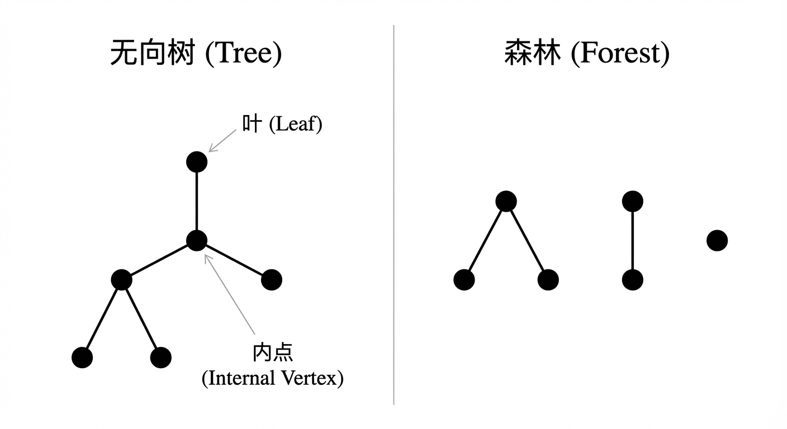
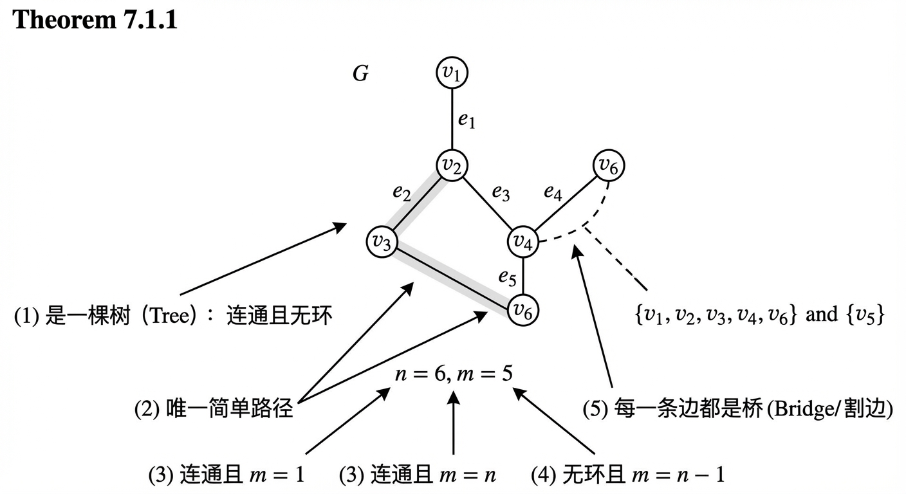
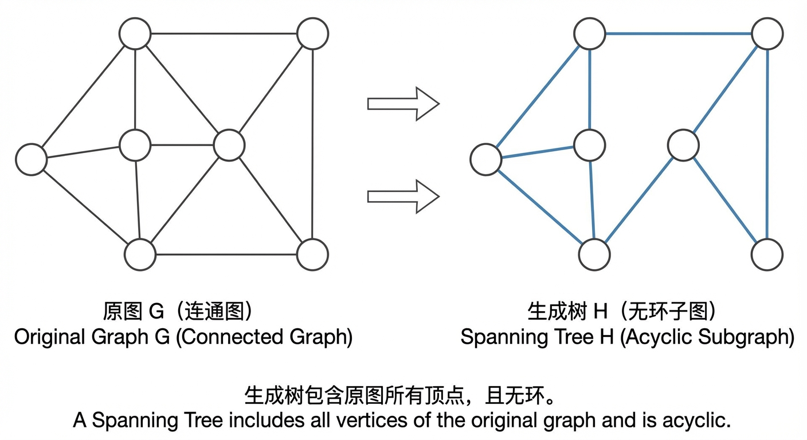
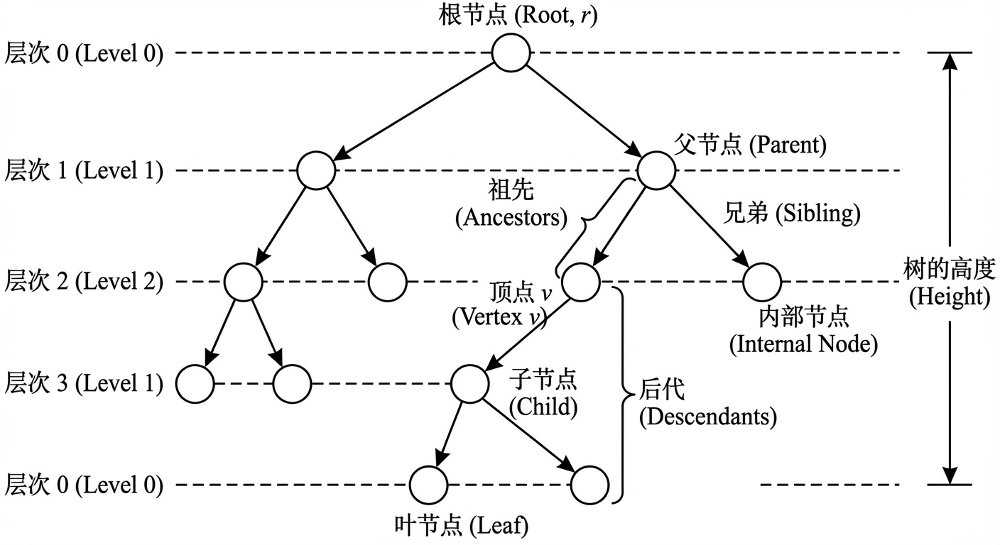
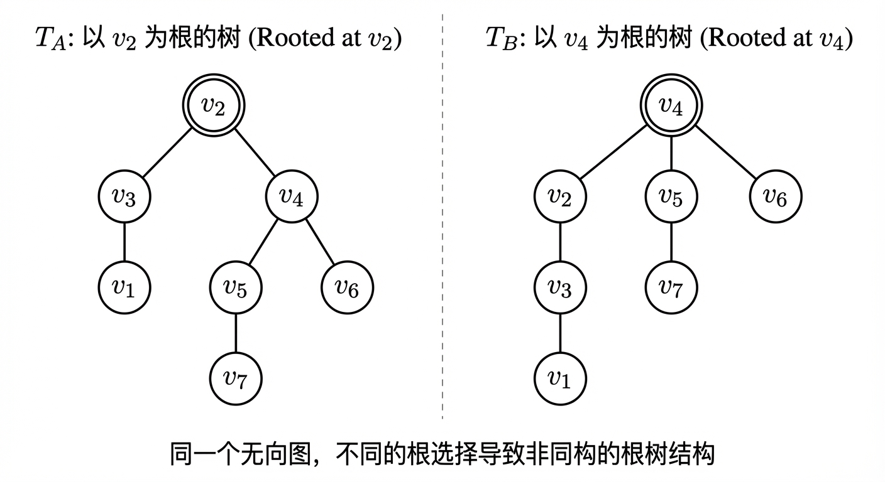
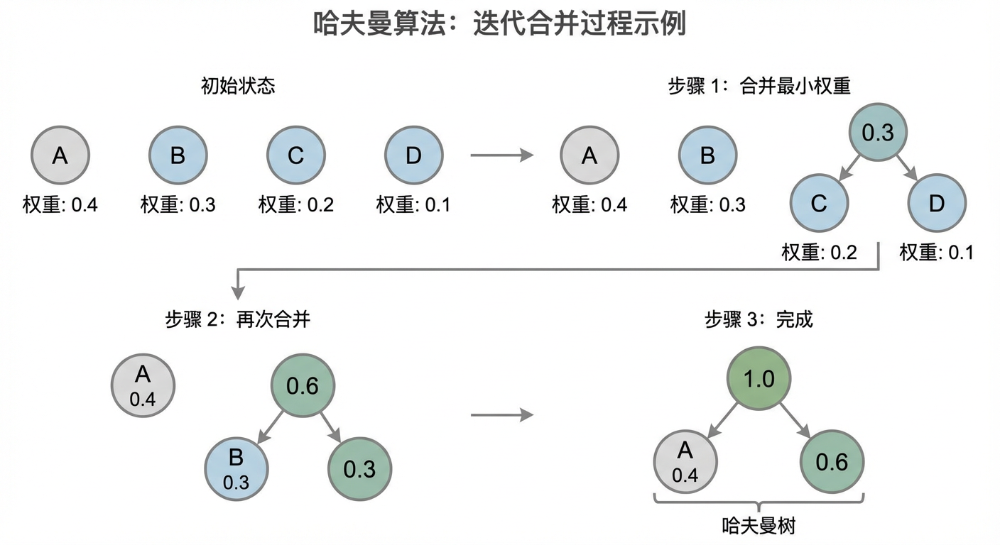
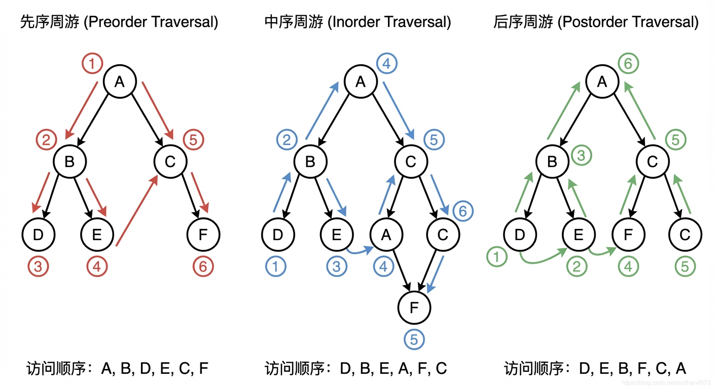
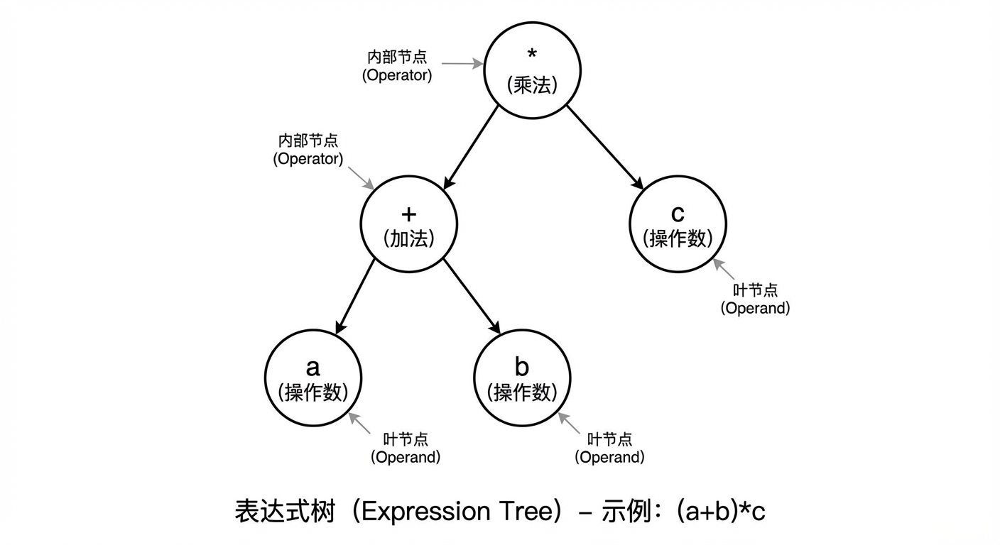

# 第7章：树及其应用

在第六章的图论基础之上，本章聚焦于一类“结构最简而性质极强”的图——树。树一方面以“连通且无环”的极简条件刻画了网络的最经济连通方式；另一方面，只要进一步指定一个根，就会产生层次、方向与可计算的结构，从而自然导向最优编码、遍历与层次查询等重要应用。本章的安排体现了这种递进：先在 7.1 节建立无向树的基本刻画与生成树思想，再在 7.2 节通过“定根”把无向结构转化为有层级的根树，并进入更丰富的算法与应用背景。

## 7.1 无向树

在第六章中，我们探索了图的广阔世界，研究了其连通性、通路与回路。现在，我们将注意力转向一类在理论与实践中均占据核心地位的特殊图——树。想象一下，我们需要设计一个网络（例如，计算机网络、输水管道或城市交通系统），其首要目标是在所有节点间建立连接，同时最大限度地节约成本，避免任何冗余的连接。这一“最经济连通结构”的直观追求，正是我们研究树的动机。树的本质，在于它用最少的“代价”实现了全局的可达性，剔除了所有导致“兜圈”的环路。本节将从无向树的形式化定义出发，揭示其一系列深刻而优美的等价刻画与性质，并最终引出其在一般图论中的重要应用——生成树。

> 本节对“树”的讨论完全基于无向图视角：顶点之间只有“是否相连”，并无“谁指向谁”的方向与层次。正因如此，7.1 节得到的结论（例如唯一路径、边数关系、加边必成环、生成树存在性）将成为 7.2 节“定根”后讨论高度、祖先关系以及遍历算法的结构前提：只有在无环且连通的骨架上，层次结构才是良定义的。

### 树的定义与等价刻画

让我们首先给出树的正式定义，它构筑在我们已有的图论知识之上。

**定义 7.1.1 (树与森林)**
一个**无向树 (Undirected Tree)**，简称**树 (Tree)**，是一个连通且无环的无向简单图。若一个无向简单图无环，但不一定连通，则称之为**森林 (Forest)**。显然，一个森林是由若干棵树作为其连通分量构成的。

在树的结构中，度为 $1$ 的顶点通常被称为**叶 (Leaf)** 或叶节点，而度大于 $1$ 的顶点则被称为**内点 (Internal Vertex)**。

这个定义虽然简洁，但它只是“树”这个丰富概念的其中一副面孔。在数学中，能够从多个等价的角度来刻画同一个对象，是其理论深度与和谐性的体现。对于树而言，存在一系列美妙的等价条件，它们从不同维度揭示了树的本质。

**定理 7.1.1 (树的等价条件)**
设 $G$ 是一个有 $n$ 个顶点和 $m$ 条边的无向简单图。以下陈述是等价的：
(1) $G$ 是一棵树（即 $G$ 是连通且无环的）。
(2) $G$ 中任意两个不同的顶点之间存在唯一的简单路径。
(3) $G$ 是连通的，且 $m = n - 1$。
(4) $G$ 是无环的，且 $m = n - 1$。
(5) $G$ 是连通的，且 $G$ 中的每一条边都是一个**桥 (Bridge)**（或称**割边 (Cut-edge)**），即移除该边会使图的连通分量数增加。

这个定理极为重要，它为我们提供了一个由“判定”到“推导”的工具箱。例如，一旦我们确认一个拥有 $n$ 个顶点的网络是连通的，只需清点其边数是否为 $n-1$，即可判定它是否为一棵树，而无需费力去寻找其中是否存在环路。

让我们来审视这些等价刻画的内涵。条件 (2)，“唯一路径”，可能是最符合直觉的描述。它保证了网络中没有岔路或备用路线。许多真实世界的系统，由于其内在的逻辑约束，天然地呈现出这种特性。然而，当这些约束被打破时，结构就不再是严格的树。例如，一个人类的**家族谱系 (Human Genealogy)**，在理想情况下，追踪任何个体到其祖先的路径是唯一的。但如果发生**近亲结婚 (Mating between blood relatives)**，例如表兄妹生育后代，那么这个后代将通过两条不同的路径追溯到他们共同的祖父母。在图模型中，这就形成了一个环路，使得从这个后代到其曾祖父母的路径不再唯一，从而打破了严格的树结构。类似地，计算机的**文件系统 (File System)** 在概念上是一棵以根目录为起点的树，但**硬链接 (Hard Links)**（使得一个文件节点可以有多个父目录）和**符号链接 (Symbolic Links)**（可能创建指向任意位置的“快捷方式”，甚至导致环路）的存在，使其在严格意义上更像一个**有向无环图 (Directed Acyclic Graph, DAG)**，甚至是一般的有向图。这些例子都从反面印证了“唯一路径”作为树之核心特性的重要性。

条件 (3) 和 (4) 则从“规模”的角度给出了树的“身份证”：$m=n-1$。这个关系是树的最经济性的数学体现。一个连通图的边数不可能少于 $n-1$，否则图必然不连通；而一旦边数达到 $n-1$ 且图依然连通，它就必然是一棵树，任何多余的边都会引入环路。反之，一个无环图的边数不可能多于 $n-1$；而一旦边数达到 $n-1$ 且图依然无环，它就必然是连通的。这一性质极为强大，仅凭清点顶点和边的数目，就能对图的全局结构做出深刻的判断。

条件 (5) 则从“结构脆弱性”的角度描绘了树。每一条边都是一个桥，意味着网络中不存在任何冗余。每一条连接都至关重要，移除任何一条都会导致网络的分裂。这在**径向电力网络 (Radial Power Network)** 等基础设施设计中是一种常见拓扑，其优点是结构简单、易于管理，但缺点是鲁棒性较差，任何单点故障都可能导致下游大范围的服务中断。

> 这里的“森林”概念将在 7.2 节末讨论最近公共祖先（LCA）时再次出现：LCA 在森林中一般是未定义的，除非通过引入“超级根”把森林并为一棵根树；而这种“并树”的思想也与 7.2 节对高度、叶等性质的讨论直接相连。

### 无向树的基本性质

基于上述定义与等价条件，我们可以推导出一系列关于树的结构性质。这些性质不仅加深了我们对树的理解，也为后续章节，尤其是关于组合计数和算法设计的讨论，奠定了基础。

首先，一个直接的推论是关于树中叶节点的存在性。

**定理 7.1.2 (叶的存在性)**
任何一棵有 $n \geq 2$ 个顶点的树，至少有两个叶节点。

**证明**:
设 $T$ 是一棵有 $n \geq 2$ 个顶点和 $m$ 条边的树。我们知道 $m = n-1$。根据第六章介绍的握手定理，所有顶点的度数之和等于边数的两倍：
$$ \sum_{v \in V(T)} \deg(v) = 2m = 2(n-1) $$
我们用反证法。假设 $T$ 中至多有一个叶节点。这意味着或者没有叶节点（即所有顶点的度数 $\deg(v) \geq 2$），或者只有一个叶节点（即一个顶点的度数为 $1$，其余 $n-1$ 个顶点的度数均 $\geq 2$）。

情况一：若没有叶节点，则 $\deg(v) \geq 2$ 对所有 $v \in V(T)$ 成立。此时，度数之和 $\sum \deg(v) \geq 2n$。这与 $\sum \deg(v) = 2n-2$ 相矛盾。
情况二：若只有一个叶节点，则度数之和 $\sum \deg(v) \geq 1 \times 1 + (n-1) \times 2 = 1 + 2n - 2 = 2n-1$。这同样与 $\sum \deg(v) = 2n-2$ 相矛盾。

两种假设均导致矛盾，因此原命题成立，即任何一棵有 $n \geq 2$ 个顶点的树至少有两个叶节点。 $\blacksquare$

这个性质看似简单，却蕴含着深刻的结构约束。这启发我们思考一个有趣的问题：一个图能否同时是一棵树和一个 $k$-正则图？回忆一下，$k$-正则图是指所有顶点的度数均为 $k$ 的图。若一个图是树且 $k$-正则，那么所有 $n$ 个顶点的度数都是 $k$。其度数之和为 $nk$。根据树的性质，我们有 $nk = 2(n-1)$。整理得 $n(k-2) = -2$，即 $n(2-k) = 2$。由于 $n$ 必须是正整数，所以 $n$ 只能是 $1$ 或 $2$。
- 当 $n=1$ 时，$1(2-k)=2 \implies k=0$。此时图是一个孤立顶点，它既是 $0$-正则图，也符合树的定义（平凡树）。
- 当 $n=2$ 时，$2(2-k)=2 \implies k=1$。此时图是两个顶点由一条边相连，它既是 $1$-正则图，也是一棵树。
由此可见，只有这两种极其平凡的情况，即 $(k,n)=(0,1)$ 和 $(k,n)=(1,2)$，才可能存在。这个小小的思想实验有力地展示了树的 $m=n-1$ 性质是如何严格限制其局部结构（度数分布）的。

另一个重要的性质涉及在树中添加边。

**定理 7.1.3 (加边成环)**
在一棵树 $T$ 中，任意连接两个不相邻的顶点 $u$ 和 $v$，会且仅会形成一个环。

**证明**:
由于 $T$ 是一棵树，根据定理 7.1.1，在 $u$ 和 $v$ 之间已经存在一条唯一的简单路径 $P$。当我们添加新边 $\{u, v\}$ 时，这条新边与路径 $P$ 共同构成了一个闭合的回路，即一个环。
为了证明只形成一个环，假设添加边 $\{u, v\}$ 后形成了两个不同的环 $C_1$ 和 $C_2$。这两个环都必须包含新边 $\{u, v\}$，否则它们在原树 $T$ 中就已经存在，与 $T$ 是无环图矛盾。因此，从 $C_1$ 和 $C_2$ 中移除边 $\{u, v\}$ 后，分别得到两条从 $u$ 到 $v$ 的不同路径 $P_1$ 和 $P_2$。这意味着在原树 $T$ 中，从 $u$ 到 $v$ 存在两条不同的路径，这与树的“唯一路径”性质相矛盾。因此，形成的环是唯一的。 $\blacksquare$

> 定理 7.1.3 强调了“树的无环性”一旦被破坏就会立即生成回路；而生成树（下一小节）恰恰是在一般连通图中“系统性地去除回路”以保留连通骨架。换言之，本节前半段揭示“树为什么没有多余边”，后半段则回答“有多余边的连通图如何抽出树骨架”。

### 生成树

我们已经知道，树是连通图的一种“极简”形式。那么，对于一个更普遍的、可能包含环路的连通图，我们是否总能从中“提取”出一个树状的骨架呢？答案是肯定的，这个骨架就是所谓的“生成树”。

**定义 7.1.2 (生成树)**
给定一个连通的无向图 $G=(V, E)$， $G$ 的一个**生成子图 (Spanning Subgraph)** 是一个子图 $H=(V, E')$，它包含 $G$ 的所有顶点。如果这个生成子图本身是一棵树，则称 $H$ 为 $G$ 的**生成树 (Spanning Tree)**。

生成树的概念是连接一般连通图与树的桥梁。它告诉我们，任何复杂的连通网络，其核心的连通性都可以由一个简单的、无冗余的树状结构来支撑。一个自然而重要的问题是：生成树是否总是存在？

**定理 7.1.4 (生成树的存在性)**
任何一个有限的连通无向图 $G$ 都含有一棵生成树。

**证明**:
我们可以从多个角度来证明这个定理，每一种方法都揭示了生成树存在的必然性。

方法一：**删边法 (The Deletion Method)**。如果图 $G$ 中没有环，由于 $G$ 是连通的，它本身就是一棵树，因此它就是自身的生成树。如果 $G$ 中有环，我们可以任意选择一个环并移除其中的一条边。这个操作不会破坏图的连通性，因为环上的任意两点仍然可以通过环的剩余部分互相到达。我们可以重复这个“寻找环、删除边”的过程。由于边的数量是有限的，这个过程必然会终止。当图中不再有环路时，我们得到的图仍然是连通的，并且包含了所有原始顶点，但现在是无环的。根据定义，这就是 $G$ 的一棵生成树。

方法二：**加边法 (The Addition Method)**。我们也可以从空图开始“构建”一棵生成树。初始时，我们有一个包含所有顶点但没有边的图 $H$，它由 $n$ 个连通分量（每个顶点自成一个）构成。我们从原图 $G$ 的边集 $E$ 中不断选取边加入 $H$ 中，但每次只加入那些连接了 $H$ 中两个不同连通分量的边。由于 $G$ 是连通的，这样的边总是存在的（只要 $H$ 还不连通）。每次加边，我们都将两个连通分量合并为一个，并且这个过程绝不会产生环，因为我们连接的是之前不连通的两个部分。这个过程在加入 $n-1$ 条边后终止，此时 $H$ 变成了一个连通图，且无环，包含了所有顶点，因此它是一棵生成树。

方法三：**极大无环子图法 (Maximal Acyclic Subgraph Method)**。考虑 $G$ 的所有包含全部顶点的无环子图（即生成森林）。我们取其中一个**极大的 (maximal)** 成员 $H$。这里的“极大”意味着我们无法再从 $G$ 中添加任何一条边到 $H$ 中而不产生环。我们断言，这样的 $H$ 必须是连通的。如果 $H$ 不连通，那么它至少有两个连通分量。因为 $G$ 是连通的，必然存在一条边 $e \in E(G)$ 连接着 $H$ 的这两个不同的连通分量。将 $e$ 加入 $H$ 不会产生环路，但这与 $H$ 的极大性相矛盾。因此， $H$ 必须是连通的。一个连通的、无环的、包含所有顶点的图，正是一棵生成树。这个证明从逻辑的必然性上确立了生成树的存在。

生成树的这些构造思路，尤其是加边法和删边法，是计算机科学中许多重要算法的理论基础，例如用于寻找**最小生成树 (Minimum Spanning Tree, MST)** 的 Kruskal 算法和 Prim 算法，我们将在后续课程中深入探讨。

最后，值得注意的是，一旦我们从一个无向树中任意指定一个顶点作为“起点”或“根”，整个结构就获得了一种方向感和层次感。这引领我们进入下一节的主题——有根树。例如，一个无向树的**直径 (Diameter)**，即树中任意两点间的最长路径长度，与将其转变为有根树后的**高度 (Height)**（即根到最远叶节点的距离）之间存在一个优美的关系。对于任意选择的根，其高度 $h$ 和原树的直径 $D$ 满足不等式 $h \leq D \leq 2h$。这个关系巧妙地连接了无向树的全局几何特性与有根树的层次度量，为我们从本节的无向、平等的结构视角，平滑过渡到下一节的有向、层级的应用视角提供了坚实的数学桥梁。

### 小结
本节中，我们为“树”这一离散数学中的基本结构建立了坚实的形式化基础。我们从“连通且无环”的核心定义出发，探索了树的一系列等价刻画，包括其独特的“唯一路径”性质以及标志性的 $m=n-1$ 规模关系。这些不同的视角共同揭示了树作为“最经济连通结构”的本质。

通过对树的性质的深入分析，我们推导出了诸如“任何非平凡树至少有两个叶节点”等重要的结构性结论，并通过对 $k$-正则树等思想实验的探讨，体会了这些性质所带来的强大约束力。这不仅是对图论知识的深化，也为后续组合计数等章节埋下了伏笔。

最后，我们引入了生成树的概念，将其定位为从任意连通图中提取出的“连通性骨架”。通过多种方法的证明，我们确立了生成树在任何连通图中的必然存在性。这不仅是图论中的一个优美结论，更为网络设计、最优化等领域的诸多算法提供了理论依据。

本节所建立的关于无向树的结构直觉——无环、连通、最小连接——是后续学习的基础。在下一节中，我们将看到，只要为一棵无向树指定一个根，它就会转变为一棵有根树，从而展现出丰富的层次结构和计算应用价值，如数据组织、搜索策略和最优编码等。从无向到有向，从抽象结构到具体算法，我们将进一步领略树的强大威力。

> 7.1 节的所有结论都可视为“树的无向骨架定理”：它们不依赖起点、不区分上下。接下来在 7.2 节，我们将通过选择一个根，把“唯一路径”转化为“唯一的祖先链”，把“叶（度为1）”转化为“叶（无子节点）”，并引入高度、遍历等依赖方向的概念。特别地，7.2 节最后关于森林与 LCA 的讨论，将与 7.1 节的森林定义形成直接呼应。

## 7.2 根树及其应用

在上一节中，我们探讨了无向树，它作为刻画最经济连通方式的数学对象，其核心在于“连通”与“无环”的结构特质。然而，在许多现实世界的系统中，仅仅描述连通性是不够的。组织结构、家族谱系、文件系统、乃至语言的句法分析，都蕴含着一种内在的方向性与层次感。例如，在分析三个物种X、Y、Z的演化关系时，一个简单的无向树只能告诉我们它们之间存在联系，但无法回答“谁是谁的祖先”这一历史性问题。三种可能的演化历史—— `((X,Y),Z)`（X与Y亲缘关系最近，Z是它们的外群）、`((X,Z),Y)` 和 `((Y,Z),X)` ——虽然对应于同一个无向连接模式，却代表了截然不同的演化叙事。为了捕捉这种层次与方向，我们必须从无向的视角转向一种更具结构性的模型。这便引出了本节的核心概念：**根树 (Rooted Tree)**。

通过在一个无向树中指定一个特殊的顶点作为“根”，我们为整棵树赋予了一个起点和方向，从而建立起一套描述祖先与后代、父辈与子嗣的层级体系。这一看似简单的“定根”之举，将一个静态的连接网络转变为一个动态的、可操作的、信息丰富的层次结构。本节将引领读者深入根树的世界，首先建立其形式化语言与分类体系，然后探索其在构造最优编码（哈夫曼算法）中的核心作用，最后考察根树的周游算法及其在处理表达式、查询层次关系等领域的广泛应用。

### 根树及其分类

从图论的视角看，从无向到有根，是一次赋予结构以方向性的飞跃。

**定义 7.2.1 (根树)**：一棵**根树**是一个偶对 $(T, r)$，其中 $T$ 是一个树，而 $r$ 是 $T$ 中一个被指定为**根 (root)** 的顶点。

一旦指定了根，树中所有边都获得了隐含的方向：均背离根节点。我们可以更严谨地将其表述为一个有向图：一棵根树是一个有向无环图，其基图是一棵树，且存在一个唯一的、称为根的顶点，其入度为0；所有其他顶点的入度均为1。这个定义精确地捕捉了每个非根节点都有且仅有一个直接前驱的本质。

这种方向性自然地引出了一套描述亲缘关系的术语，它深刻地影响着我们如何理解和操作树形结构。

**定义 7.2.2 (根树术语)**：设 $T$ 是一棵以 $r$ 为根的树，对于任意顶点 $v \ne r$，从根 $r$ 到 $v$ 的唯一简单路径上的最后一个顶点被称为 $v$ 的**父节点 (parent)**，而 $v$ 则被称为其父节点的**子节点 (child)**。拥有相同父节点的两个不同顶点互为**兄弟 (siblings)**。路径上（除 $v$ 自身外）的所有顶点都是 $v$ 的**祖先 (ancestors)**，而以 $v$ 为根的子树中的所有顶点（除 $v$ 自身外）都是 $v$ 的**后代 (descendants)**。没有子节点的顶点称为**叶节点 (leaf)**，而至少有一个子节点的非根顶点以及根节点（若其有子节点）统称为**内部节点 (internal node)**。

这些术语共同构建了一个严密的层级世界。例如，在一个拥有 $n$ 个顶点的树中，若要最大化一个顶点的兄弟数量，我们可以构造一个以根为中心，其余 $n-1$ 个顶点均为其子节点的“星形图”。在这种结构中，任意一个叶节点都拥有 $n-2$ 个兄弟。

根的存在也为我们度量树的结构提供了基准。

**定义 7.2.3 (层次与高度)**：在根树中，一个顶点 $v$ 的**层次 (level)**（或深度）被定义为从根到 $v$ 的唯一简单路径的长度（即边的数量）。根的层次为0。树中所有顶点层次的最大值被称为该根树的**高度 (height)**。

根据定义，如果一个非根顶点 $v$ 位于层次 $k$（$k \ge 1$），那么它的父节点必然位于层次 $k-1$，因为父节点恰好是在通往 $v$ 的路径上比 $v$ 更靠近根的一个边的距离。树的高度则刻画了其“纵向”的延伸程度。对于一个含有 $n$ 个顶点的根树，其高度 $h$ 必然满足 $h \le n-1$，因为最长的根叶路径不可能超过树的总边数 $n-1$。这个上界在一个“链状”树（即一个路径图，根位于其一端）中达到，其高度为 $n-1$。而在另一个极端，一个尽可能“茂密”的完全二叉树，其高度约为 $\log_2(n)$。这揭示了树的**平衡性 (balance)** 对其高度的巨大影响，这一性质在算法分析中至关重要。

最后，我们必须区分“作为图的同构”与“作为根树的同构”。根的选取是结构的一部分。两个根树同构，不仅要求它们的图结构相同，还要求同构映射必须将一个根映射到另一个根。这引发了一个深刻的洞察：两个作为无向图同构的树，在选取不同的顶点作为根之后，可能成为非同构的根树。

**例 7.2.1**：考虑一个由7个顶点构成的无向树 $T$，其边集为 $\{(v_1, v_3), (v_2, v_3), (v_2, v_4), (v_4, v_5), (v_4, v_6), (v_5, v_7)\}$。我们通过选取不同的根来构造两个根树：$T_A$ 以 $v_2$ 为根， $T_B$ 以 $v_4$ 为根。

作为无向图，它们显然是同构的（实际上是同一个图）。然而，作为根树，$T_A$ 与 $T_B$ 却并不同构。一个简单的判据是比较根的度数。在 $T_A$ 中，根 $v_2$ 的度数为2；而在 $T_B$ 中，根 $v_4$ 的度数为3。由于图同构必须保持顶点的度数，任何同构映射都不能将 $v_2$ 映射到 $v_4$。因此，不存在一个保持根的同构映射，$T_A$ 和 $T_B$ 作为根树是不同的结构。这个例子清晰地表明，根的选择深刻地定义了树的层次结构和性质。

这种结构上的丰富性也体现在组合计数上。例如，仅用4个无标签的顶点，我们就可以构造出4种非同构的根树。这暗示着随着顶点数量的增加，根树结构的多样性将呈爆炸性增长，为我们用树来建模复杂系统提供了广阔的空间。

> 到目前为止，我们建立的是“根树的语言与度量”：父子、祖先后代、层次高度等。接下来两部分内容（哈夫曼算法与树的周游）将展示这些概念如何变成可计算的方法：前者以“高度/深度”进入带权路径长度的优化目标，后者则以“根与子树”的递归结构定义系统性的访问顺序。

### 最优树与哈夫曼算法

根树不仅是描述静态层次的工具，它同样是解决优化问题的强大载体。一个经典的应用场景源于信息论：如何为一组符号（例如，字母表中的字符）设计最高效的二进制编码？

一个简单的方案是**定长编码 (fixed-length code)**，例如用一个固定的6位二进制串来唯一标识50个州中的每一个。这虽然可行，但如果某些符号的出现频率远高于其他符号，这种方法就显得十分浪费。如同摩尔斯电码为常用字母“E”分配一个短码（`.`）而为稀有字母“Q”分配一个长码（`--.-`）一样，**可变长度编码 (variable-length code)** 的直觉是为高频符号分配短码，为低频符号分配长码，从而使得平均编码长度最短。

然而，可变长度编码必须克服一个潜在的陷阱：解码的歧义性。若“A”编码为`0`，“B”编码为`01`，那么接收到`01...`时，解码器无法立刻确定其是“B”还是“A”后跟其他内容。解决这一问题的优雅方案是**前缀码 (prefix code)**，其核心规则是：**任何码字都不能是其他码字的前缀**。这一特性保证了解码的即时性和唯一性。

奇妙的是，任何一个二进制前缀码都可以用一棵**二叉树 (binary tree)** 来完美表示。在这棵树中，每个叶节点对应一个符号，从根到该叶节点的路径（例如，约定左分支为0，右分支为1）就构成了该符号的码字。前缀码的性质等价于所有符号都位于叶节点上，没有任何符号位于内部节点。

现在，优化问题变得清晰起来。假设我们有一组符号，每个符号 $s_i$ 都有一个权重 $w_i$（通常是其出现的频率或概率）。我们的目标是构建一棵二叉树，其叶节点为这些符号，使得树的**带权路径长度 (Weighted Path Length, WPL)** 最小。带权路径长度定义为：
$$ WPL(T) = \sum_{i} w_i \cdot \text{depth}(s_i) $$
其中 $\text{depth}(s_i)$ 是叶节点 $s_i$ 的层次。这个值正比于编码一个符号的期望比特数。能够最小化 WPL 的树，我们称之为**最优二叉树 (optimal binary tree)**。

**哈夫曼算法 (Huffman's Algorithm)** 提供了一种简洁而高效的贪心策略来构造这样一棵最优树。

**算法 7.2.1 (哈夫曼算法)**
1.  **初始化**：为每个带权重的符号创建一个仅包含单个节点的根树，该节点的权重即为符号的权重。将这些树放入一个集合（通常用优先队列实现）中。
2.  **迭代合并**：当集合中有多于一棵树时，重复以下步骤：
    a. 从集合中选取两棵根权重最小的树。
    b. 创建一个新的根节点，其权重为这两棵树根权重之和。
    c. 将这个新根作为父节点，将选出的两棵树的根作为其子节点，从而合并成一棵新树。
    d. 将新合并的树放回集合中。
3.  **完成**：当集合中只剩下一棵树时，此树即为一棵哈夫曼树。

**例 7.2.2**：假设某卫星传输四种信号，其概率分别为 $w_A = 0.4, w_B = 0.3, w_C = 0.2, w_D = 0.1$。我们使用哈夫曼算法构造最优编码树。

1.  **初始森林**：四棵单节点树 `(A, 0.4)`, `(B, 0.3)`, `(C, 0.2)`, `(D, 0.1)`。
2.  **第一次合并**：选取权重最小的 `C` 和 `D`。创建新根，权重为 $0.2+0.1=0.3$。森林变为 `(A, 0.4)`, `(B, 0.3)`, `(CD, 0.3)`。
3.  **第二次合并**：选取权重最小的 `B` 和 `CD`。创建新根，权重为 $0.3+0.3=0.6$。森林变为 `(A, 0.4)`, `(BCD, 0.6)`。
4.  **第三次合并**：选取 `A` 和 `BCD`。创建新根，权重为 $0.4+0.6=1.0$。算法结束。

最终得到的哈夫曼树，若约定左分支为0，右分支为1，可得到编码：A: `1`，B: `01`，C: `000`，D: `001`。其平均码长为 $0.4 \times 1 + 0.3 \times 2 + 0.2 \times 3 + 0.1 \times 3 = 1.9$ 位/符号。相比之下，定长编码需要 $\lceil \log_2(4) \rceil = 2$ 位/符号。哈夫曼编码在此实现了5%的数据压缩。

哈夫曼算法的正确性基于贪心选择性质：任何最优前缀码树中，两个频率最低的符号必然是处于最深层次的兄弟节点。该算法的每一次合并都遵循此原则，从而保证了全局最优。

### 最佳前缀码

哈夫曼算法的输出——哈夫曼树——直接定义了一个**最佳前缀码 (Optimal Prefix Code)**。从树根到每个叶节点的路径，通过为左右分支赋予0和1，便构造出了码字。这个过程将一个结构优化问题（寻找最优树）与一个信息表示问题（寻找最佳编码）紧密地联系在了一起。

那么，这种“最佳”有多好？是否存在一个理论上的压缩极限？答案由信息论的奠基人克劳德·香农给出。他定义了一个信源的**熵 (Entropy)**，记为 $H(X)$：
$$ H(X) = -\sum_{i} p_i \log_2(p_i) $$
其中 $p_i$ 是符号 $i$ 出现的概率。熵度量了信源内在的平均不确定性或“信息量”，其单位为比特/符号。香农的信源编码定理指出，对于任何唯一可译码，其平均码长 $L$ 必不能小于信源的熵，即 $L \ge H(X)$。

熵为无损压缩设定了不可逾越的理论下界。而哈夫曼编码的性能则与这个极限惊人地接近。可以证明，由哈夫曼算法产生的编码，其平均长度 $L_{H}$ 满足：
$$ H(X) \le L_{H} < H(X) + 1 $$
这表明哈夫曼编码在逐符号编码的框架内已达到最优。其与理论极限 $H(X)$ 之间的微小差距，源于一个现实约束：码字的长度必须是整数，而一个符号的“理想”信息内容 $-\log_2(p_i)$ 却可能是非整数。仅当所有符号的概率都是2的负整数次幂时，$L_H$ 才能精确等于 $H(X)$，此时理论与实践完美契合。

> 在哈夫曼编码中，“码字长度”恰对应根树中叶节点的深度；因此，如何系统地读取根到叶的路径（并按某种顺序输出）与遍历思想密切相关。下面的树周游虽然服务于更一般的数据处理，但其递归结构与“从根出发组织信息”的思想与编码树是一脉相承的。

### 根树的周游及其应用

我们已经学会了如何定义、度量和构造根树。现在的问题是，如何系统性地访问和处理树中存储的信息？这便需要**树的周游 (Tree Traversal)** 算法。对于一个有序树（其子节点的排列顺序有意义），尤其是二叉树，存在三种经典的递归周游方式：

1.  **先序周游 (Preorder Traversal)**：首先访问根节点，然后递归地先序周游其各个子树（从左到右）。
2.  **中序周游 (Inorder Traversal)**：首先递归地中序周游第一个（最左）子树，然后访问根节点，最后递归地中序周游其余子树。
3.  **后序周游 (Postorder Traversal)**：首先递归地后序周游其所有子树，最后访问根节点。

这些周游方式看似只是顺序上的微小差异，却在应用中产生截然不同的结果。一个绝佳的例子是**表达式树 (Expression Tree)**。任何一个算术表达式，如 `(a+b)*c`，都可以被解析成一棵根树，其中内部节点是运算符，叶节点是操作数。这种树结构本身就是编译器进行语法分析时生成的**语法分析树 (Parse Tree)** 的一种抽象。

对这棵表达式树进行不同的周游，可以得到表达式的不同表示形式：
- **中序周游**（并适时添加括号）可以还原出我们日常使用的**中缀表达式**。
- **先序周游**可以生成**前缀表达式**（波兰表示法），如 `* + a b c`。
- **后序周游**可以生成**后缀表达式**（逆波兰表示法），如 `a b + c *`。

后缀表达式在基于栈的计算中尤为重要，因为它无需括号即可无歧义地表示运算次序。因此，树的周游算法构成了从人类可读的表达式到机器高效执行的指令之间的桥梁。更有趣的是，对于一个有歧义的语法（例如，不规定 `+` 和 `*` 优先级的语法），同一字符串 `a+b*c` 可能对应多个不同的语法分析树。这些不同的树结构在后序周游下会产生不同的后缀表达式，如 `a b c * +` 和 `a b + c *`，这精确地反映了运算次序的两种不同解释。

除了处理表达式，根树的层次结构也使其成为处理各类层级关系数据的理想工具。在文件系统、组织架构或面向对象编程的类继承关系中，我们常常需要回答“两个对象之间最近的共同管理者或父类是什么？”这类问题。这在形式上对应于寻找树中两个节点的**最近公共祖先 (Least Common Ancestor, LCA)**。LCA被定义为两个节点的所有共同祖先中，层次最深的那一个。高效的LCA算法是许多图算法和数据结构设计的基石。值得注意的是，LCA的概念严格依赖于单一的根树结构。对于一个由多棵树构成的**森林 (forest)**，不同树中的两个节点不存在公共祖先，因此LCA是未定义的。若要在此情境下讨论LCA，必须首先通过引入一个“超级根”将森林合并为一棵大树，从而建立统一的祖先关系。

最后，根树的研究也与组合数学紧密相连。思考一个简单的文法 $S \to SS \mid a$，它能生成任意长度的 `a` 串。对于字符串 `aaaaa`（$n=5$），其不同语法分析树的数量是多少？这等价于计算有5个叶子的满二叉树的结构数。其答案，14，正是第四个**卡特兰数 (Catalan Number)** $C_4$。这揭示了根树的计数问题与组合数学中的核心序列之间的深刻联系，为我们将在后续章节中深入探讨的递推关系与生成函数埋下了伏笔。

### 小结

本节以“赋予结构以方向”为主线，从无向树平滑过渡到根树。我们看到，仅仅是指定一个根，就催生了一整套描述层次、祖先和后代的丰富语言，并引出了高度、平衡度等关键的结构度量。根树不仅是静态的分类工具，更是动态的计算载体。

在应用层面，我们将根树的结构与信息编码问题相结合，通过哈夫曼算法展示了如何构造最优二叉树来实现高效的数据压缩，并触及了信息熵这一理论极限。这体现了离散结构在解决实际工程优化问题中的力量。随后，我们转向对根树的操作——周游算法。先序、中序、后序三种基本周游方式，看似简单，却在处理表达式树等结构化数据时展现出强大的表达能力，构成了编译原理等领域的基础。最近公共祖先（LCA）的概念则进一步展示了根树在处理一般层次查询中的核心地位。

从结构定义到优化构造，再到算法操作，根树展现了离散数学中一个概念如何层层递进、不断深化，并与算法、信息论和组合学等领域产生深刻的共鸣。它既是一个抽象的数学对象，也是计算机科学中无处不在的基本构件。在本章中，我们从无向树的“连通性”走到了根树的“层次性”，为后续章节中更为复杂的递归、计数与算法分析问题，奠定了一个坚实且可复用的树形思维框架。

> 至此，本章的逻辑闭环已经形成：7.1 节以等价刻画与生成树把握“树作为最简连通骨架”的结构本质；7.2 节在该骨架上引入根与方向，使“结构”转化为“层次”，并进一步进入编码优化与遍历操作。下面的全章总结将把这些概念以“定义—性质—构造—操作”的主线做一次系统回顾。

## 总结

本章围绕“树及其应用”展开，体现了从无向结构到有根结构、从静态性质到算法操作的递进脉络。

在 7.1 节中，我们从**无向树**的定义出发，把握其“连通且无环”的核心特征，并通过定理 7.1.1 给出了树的一组关键**等价刻画**：唯一路径性质、边数恒等式 $m=n-1$、以及“每条边都是桥”等。这些等价条件不仅提供了判定树的多种工具，也揭示了树作为“最经济连通结构”的本质。随后我们讨论了若干基本性质，例如非平凡树必有至少两个叶、树中加边必成且只成一个环，并在此基础上引入并证明了**生成树**的存在性，说明任意有限连通无向图都可抽取出一棵无冗余的连通骨架。这一思想为后续图算法（如最小生成树）奠定了理论基础。

在 7.2 节中，我们通过在树上**指定根**将无向结构赋予方向与层次，建立了父子、祖先后代、兄弟、子树等术语体系，并形式化了**层次与高度**等度量。根的引入使树成为可操作的层级结构，从而自然导出两类典型应用：其一是以深度为代价度量的优化构造——**哈夫曼算法**生成最优二叉树并给出最佳前缀码，其二是面向信息处理的结构操作——树的**先序/中序/后序周游**及其在表达式树、语法分析树等中的作用；同时，最近公共祖先（LCA）展示了根树在层级查询中的核心地位，并强调了森林情境下通过“超级根”统一结构的必要性。

总体而言，本章从树的结构判定与骨架抽取，推进到根树的层级建模与算法化处理，为进一步学习更复杂的递归结构、计数方法与图算法分析提供了关键的概念与思维框架。

## 练习题

1. [简答题]（对应 7.1）设 $T$ 是一棵含 $n$ 个标号顶点的无向树。**树的重心（centroid）**定义为：删去某顶点 $c$（以及与之相连的边）后得到若干连通分量，且每个连通分量的顶点数都不超过 $\lfloor n/2 \rfloor$。请基于“树的定义”“重心的定义”以及“递归必须作用于严格更小子问题”的原则，设计树的**重心分解（centroid decomposition）**的递归算法框架，并明确写出：
   - 递归基（base case）；
   - 递归步（recursive step）；
   - 当一个连通分量存在多个重心时的确定性选择规则；
   - 输出的表示方式（用根树的父节点数组表示，根的父为 0）。

2. [选择题]（对应 7.2）给定一个由 $k$ 棵根树组成的森林 $\{T_1,T_2,\ldots,T_k\}$。构造一棵新的根树 $T$ 的方法为：引入一个新顶点 $r_{\text{new}}$ 作为根，并对每棵 $T_i$，添加一条从 $r_{\text{new}}$ 指向 $T_i$ 根的有向边。设 $T_i$ 的高度为 $h_i$，叶子数为 $l_i$；新树 $T$ 的高度为 $H$，叶子总数为 $L$。以下哪一项正确？
   - A. $H = 1 + \sum_{i=1}^{k} h_i$ 且 $L = \sum_{i=1}^{k} l_i$
   - B. $H = \max\{h_1, h_2, \ldots, h_k\}$ 且 $L = \sum_{i=1}^{k} l_i$
   - C. $H = 1 + \max\{h_1, h_2, \ldots, h_k\}$ 且 $L = k$
   - D. $H = 1 + \max\{h_1, h_2, \ldots, h_k\}$ 且 $L = \sum_{i=1}^{k} l_i$
   - E. $H = 1 + \max\{h_1, h_2, \ldots, h_k\}$ 且 $L$ 无法确定

**参考答案**

1. 要点：
   - 递归基：若当前连通分量大小为 $1$，其唯一顶点就是该分量的重心，递归停止。
   - 递归步：对大小 $m\ge 2$ 的当前连通分量，计算其重心 $c$；删去 $c$ 后得到若干连通分量（每个大小 $\le \lfloor m/2\rfloor$），分别对每个分量递归分解；在“重心分解树”中，把 $c$ 作为这些子分量重心的父节点。
   - 确定性规则：若存在多个重心，选择标号最小者。
   - 输出表示：输出长度为 $n$ 的父节点数组 `parent[1..n]`，`parent[i]` 为顶点 $i$ 在重心分解树中的父节点标号；分解树的根其父节点记为 $0$。
   - 终止性理由：每次删去重心后子问题规模至多减半，且严格小于原规模，故递归良定义并终止。

2. 选 D。理由要点：新根到任一原树叶的路径长度比在原树中多 1，因此 $H=1+\max_i h_i$；添加新根只改变各 $T_i$ 根的父节点，不改变任何原节点的子女关系，故每棵 $T_i$ 的叶仍是 $T$ 的叶，新根不是叶，所以 $L=\sum_i l_i$。