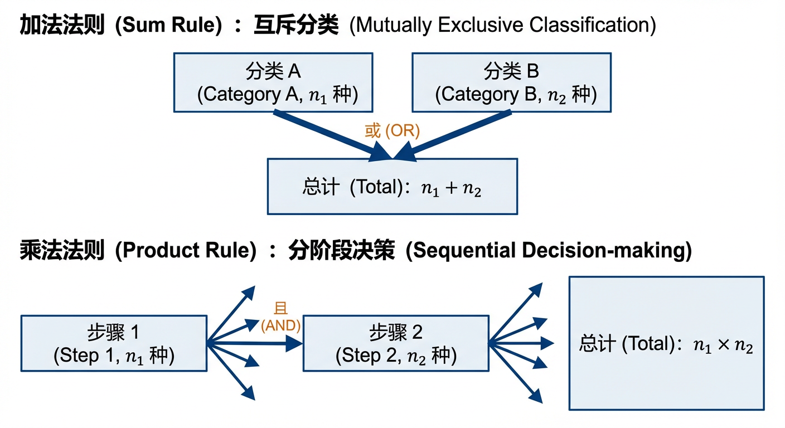
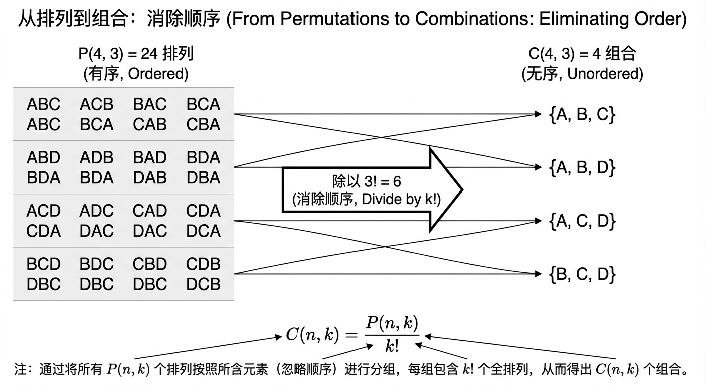
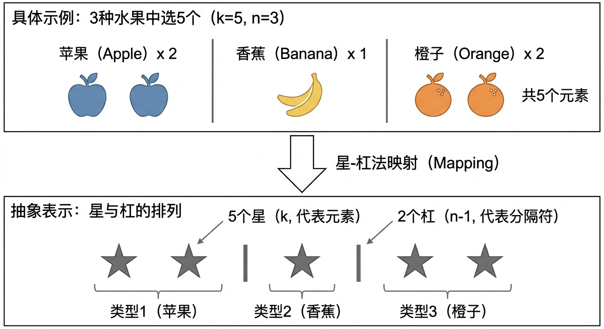
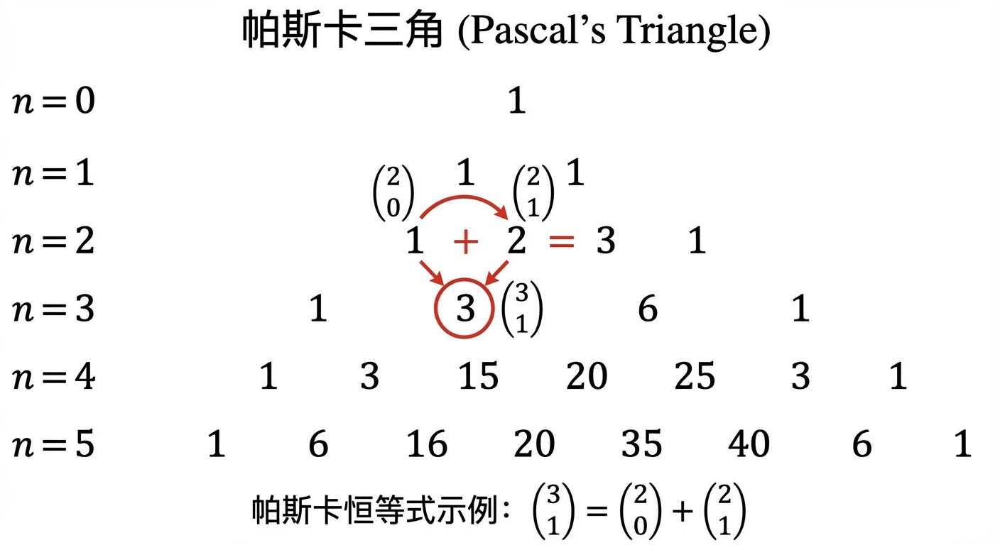
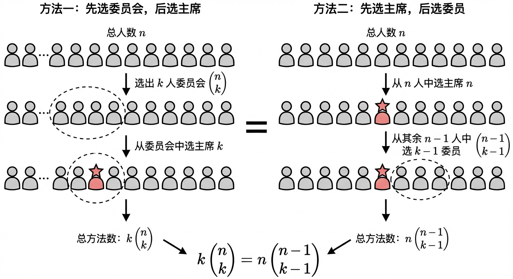
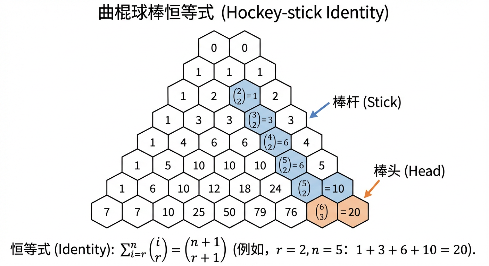
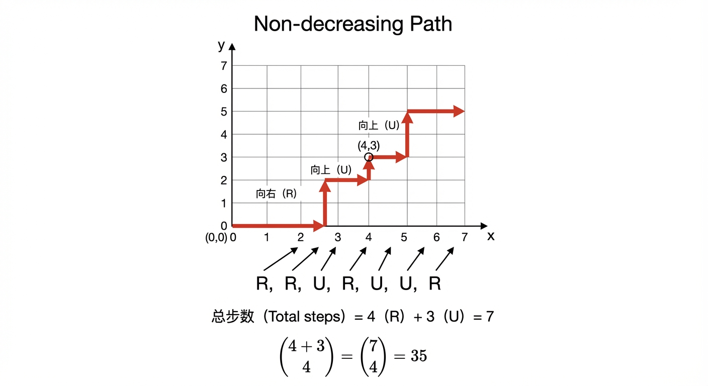
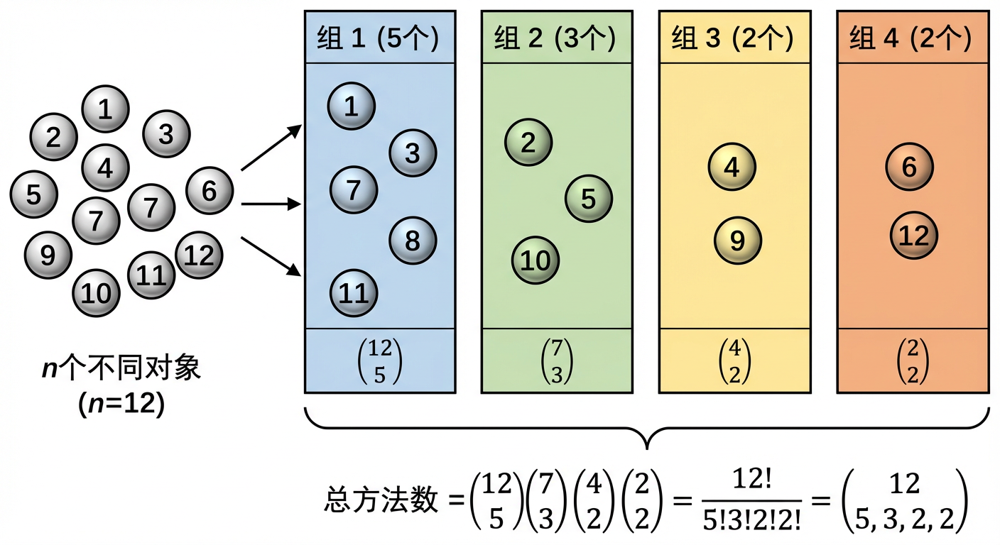

# 第8章：组合计数基础

组合计数研究的核心问题是“有多少种可能性？”。本章从最基本的计数规则出发，逐步建立排列与组合的系统公式，再进一步用二项式定理把“计数”与“代数系数”连接起来，最后推广到多项式定理与多项式系数，使“二元选择”扩展为“多元选择”。这样的安排体现了一条清晰的逻辑主线：**规则（8.1）→ 模型（8.2）→ 代数编码（8.3）→ 多维推广（8.4）**。下面我们依次展开。

---

## 8.1 基本计数规则

在本章中，我们将开启对组合数学核心问题的探索：如何系统地回答“有多少种可能性？”这一问题。从密码学的密钥空间分析，到算法复杂度的评估，再到分子生物学中的序列组合，精确计数的能力是理解和构建离散结构世界的基石。与其将计数视为简单的数数，我们不妨把它看作一种描述选择结构的语言，一种对组织方式进行建模的艺术。这种视角，将我们先前在集合论中建立的框架——集合、关系、函数——与计数问题自然地衔接起来：我们所计数的对象，本质上是特定集合的大小；而我们的计数操作，则巧妙地对应着集合的并集、笛卡儿积等运算。

本节将介绍组合学中最基本、最强大的两种思想工具：**加法法则**与**乘法法则**。这两种法则看似简单，却构成了所有复杂计数技术的根基。我们将遵循“先分类、后分步、再融合”的认知梯度，逐步建立起一套通用的问题分解策略。首先，我们将建立面向“互斥分类”的加法法则，作为最根本的拆分策略；其次，我们将转向“分阶段决策”的乘法法则，将计数问题重构为一系列步骤的组合；最后，我们会将两种法则统一到“分类处理”与“分步处理”的方法论层面，揭示它们如何协同作用，解决更为错综复杂的问题。

### 加法法则：分类的艺术

面对一个庞大的计数问题，最自然的思路莫过于将其分解为若干个更小、更易于处理的子问题。加法法则（The Sum Rule）正是这一“分而治之”策略在计数中的最纯粹体现。它处理的是基于“或”逻辑的选择。

**定义 8.1.1 (加法法则)**
如果一个任务可以由 $k$ 个**互斥**的子任务完成，即完成其中任意一个子任务都意味着整个任务的完成，并且任意两个子任务的完成方式都完全不同。若第 $i$ 个子任务有 $n_i$ 种完成方式（$i = 1, 2, \dots, k$），则完成该总任务的方式总数为：
$$ n_1 + n_2 + \dots + n_k $$
在集合论的语言中，若集合 $A$ 可以被划分为 $k$ 个两两不交的子集 $A_1, A_2, \dots, A_k$，即 $A = A_1 \cup A_2 \cup \dots \cup A_k$ 且对于任意 $i \neq j$ 都有 $A_i \cap A_j = \emptyset$，则集合 $A$ 的基数（元素个数）为：
$$ |A| = |A_1| + |A_2| + \dots + |A_k| = \sum_{i=1}^{k} |A_i| $$

加法法则的精髓在于**分类**。要成功运用此法则，关键在于找到一个清晰的分类标准，保证对所有可能性的划分是**不重不漏**的。这意味着每个可能性必须属于且仅属于一个类别。

例如，假设一个算法设计团队需要从计算机学院或数学学院中推选一名学生代表。计算机学院有 36 名候选人，数学学院有 33 名候选人，且没有任何学生同时属于这两个学院。那么，选择一名代表的总可能性就是将两个学院的候选人数相加：$36 + 33 = 69$ 种。这里的分类标准是“所属学院”，由于两个学生群体不相交，这是一个有效的分类。

让我们看一个更深刻的例子，它展示了如何通过分类来剖析一个复杂的结构。在图论中，一个有向无环图（Directed Acyclic Graph, DAG）的**拓扑排序**是对其顶点的一种线性排序，该排序要求对于图中任意一条从顶点 $u$ 到顶点 $v$ 的有向边， $u$ 都必须出现在 $v$ 之前。一个图可以有多少种不同的拓扑排序呢？

这引发我们思考：任何一个拓扑排序的第一个元素必须具备什么特征？显然，它不能有任何入边，否则排在它前面的顶点就无法确定。这种入度为零的顶点我们称之为“源点”。假设一个图有 $m$ 个源点 $s_1, s_2, \dots, s_m$。我们可以根据“哪一个源点被放在排序的首位”来对所有拓扑排序进行分类。所有以 $s_1$ 开头的排序构成第一类，所有以 $s_2$ 开头的排序构成第二类，以此类推。由于一个排序只能有一个起始元素，这些类别显然是互斥的。因此，总的拓扑排序数等于以 $s_1$ 开头的排序数，加上以 $s_2$ 开头的排序数，……，一直加到以 $s_m$ 开头的排序数。这正是加法法则的应用：将一个庞大的计数问题分解为对若干个（$m$ 个）互斥子问题的计数之和。至于如何计算每个子类别的数量，我们将会在讨论乘法法则后得到更清晰的认识。

### 减法法则：间接计数的智慧

加法法则有一个极其有用的推论，通常被称为减法法则（The Subtraction Rule）。有时，直接计算满足特定条件的对象的数量非常困难，但计算“不”满足该条件的对象的数量却相对容易。

**推论 8.1.2 (减法法则)**
若一个任务的所有可能结果构成集合 $U$，而我们想计算满足性质 $P$ 的结果数量（构成集合 $A$），那么这个数量等于总结果数减去不满足性质 $P$ 的结果数（构成 $A$ 的补集 $\bar{A}$）。用集合论的语言表达为：
$$ |A| = |U| - |\bar{A}| $$
这本质上是加法法则 $ |U| = |A| + |\bar{A}| $ 的一个简单变形。

考虑这样一个问题：在所有对 $n$ 个元素 $\{1, 2, \dots, n\}$ 的排列（Permutation）中，有多少种排列**至少**有两个不动点？（不动点是指在排列 $\sigma$ 中满足 $\sigma(i)=i$ 的元素 $i$）。直接计算“至少两个”非常棘手，因为它包含了“恰好两个”、“恰好三个”……直到“恰好 $n$ 个”不动点的情况，每一种情况的计算都相当复杂。

运用减法法则，我们可以转换思路。全体排列的总数是 $n!$。其补集是“不动点个数少于两个”的排列，这只包含两种互斥的情况：“恰好 0 个不动点”（即**错排**，Derangement）和“恰好 1 个不动点”。假设我们已知 $n$ 个元素的错排数为 $D_n$。那么，恰好有 1 个不动点的排列数可以通过一个两步过程得到：首先，从 $n$ 个元素中选择 1 个作为不动点（有 $n$ 种选法）；然后，对其余 $n-1$ 个元素进行错排（有 $D_{n-1}$ 种方法）。根据我们稍后将介绍的乘法法则，总数为 $n D_{n-1}$。

因此，利用加法法则，不满足“至少两个不动点”这一条件的排列总数为 $D_n + n D_{n-1}$。最后，应用减法法则，我们得到至少有两个不动点的排列数为：
$$ n! - (D_n + n D_{n-1}) $$
通过计算补集，我们将一个需要处理多个复杂情形的“或”问题，转化为了一个结构更清晰的减法问题。

### 乘法法则：分步的逻辑

当一项任务的完成需要经历一系列连续的、相互关联的步骤时，乘法法则（The Product Rule）便成为我们的核心工具。它处理的是基于“与”逻辑的选择。

**定义 8.1.3 (乘法法则)**
如果一个过程可以被分解为 $k$ 个连续的阶段或步骤。若第 1 步有 $n_1$ 种选择，对于第 1 步的每一种选择，第 2 步都有 $n_2$ 种选择，以此类推，直到对于前面所有步骤的每一种选择组合，第 $k$ 步都有 $n_k$ 种选择，则完成整个过程的总方式数为：
$$ n_1 \times n_2 \times \dots \times n_k $$
在集合论的语言中，这对应于笛卡儿积（Cartesian Product）的基数。若有序 $k$-元组 $(a_1, a_2, \dots, a_k)$ 的每个分量 $a_i$ 来自集合 $A_i$，则所有可能的 $k$-元组构成的集合 $A_1 \times A_2 \times \dots \times A_k$ 的基数为：
$$ |A_1 \times A_2 \times \dots \times A_k| = |A_1| \times |A_2| \times \dots \times |A_k| $$

乘法法则的精髓在于**分步**。它的力量在于将一个整体的构造任务，拆解为一个定义明确的、有序的决策流程。解决问题的关键在于设计一个恰当的步骤序列，确保每个步骤的选择数清晰，且整个流程能不重不漏地生成所有目标对象。

一个直接的应用是在计算科学领域。例如，一个模块化克隆系统需要构建一个转录单元（transcription unit），这需要按顺序组合一个启动子（promoter）、一个编码序列（coding sequence）和一个终止子（terminator）。如果实验室的基因库中有 12 种不同的启动子、20 种不同的编码序列和 10 种不同的终止子，那么可以构建出多少种独特的转录单元？
这个构建过程可以自然地分为三个步骤：
1.  选择一个启动子：有 12 种选择。
2.  选择一个编码序列：有 20 种选择。
3.  选择一个终止子：有 10 种选择。
由于每一步的选择都独立于其他步骤，根据乘法法则，可以构建的独特转录单元总数为 $12 \times 20 \times 10 = 2400$ 种。

乘法法则同样适用于步骤之间存在依赖关系（即选择会影响后续选项）的情况。这种情况被称为**无放回抽样**。例如，如果要从这 2400 种转录单元中选出 3 种，按特定顺序组装成一个更复杂的结构，且不允许重复使用同一种转录单元。这个过程可分为：
1.  为第一个位置选择一个转录单元：有 2400 种选择。
2.  为第二个位置选择一个转录单元：由于不能重复，只剩下 2399 种选择。
3.  为第三个位置选择一个转录单元：剩下 2398 种选择。
总的组装方案数为 $2400 \times 2399 \times 2398$。这正是**排列**（Permutation）思想的根源，我们将在下一节深入探讨。

乘法法则的构造性思维尤为强大。让我们来回答一个经典问题：一个集合 $\{1, 2, \dots, n\}$ 有多少个排列恰好构成一个长度为 $n$ 的单一循环（cycle）？设此数量为 $c_n$。
我们可以通过一个构造性的论证来建立一个关于 $c_n$ 的递推关系。考虑如何从一个关于 $\{1, 2, \dots, n-1\}$ 的 $(n-1)$-循环构造出一个关于 $\{1, 2, \dots, n\}$ 的 $n$-循环。
假设我们有一个 $(n-1)$-循环，例如 $(a_1, a_2, \dots, a_{n-1})$。为了将新元素 $n$ 融入这个循环并保持其单一循环的结构，我们必须将 $n$ 插入到现有的某个映射中。具体来说，我们可以选择任意一个元素 $a_i$（有 $n-1$ 个选择），断开原来的映射 $\sigma(a_i) = a_{i+1}$，然后建立新的映射 $\sigma'(a_i) = n$ 和 $\sigma'(n) = a_{i+1}$。这相当于在循环表示中，将 $n$ 插入到 $a_i$ 的后面。
对于任意一个已知的 $(n-1)$-循环，都有 $n-1$ 个不同的位置可以插入元素 $n$，从而产生 $n-1$ 个不同的 $n$-循环。
这个过程可以形式化为两步：
1.  选择一个关于 $\{1, 2, \dots, n-1\}$ 的 $(n-1)$-循环：有 $c_{n-1}$ 种选择。
2.  将元素 $n$ 插入该循环：有 $n-1$ 种方式。
根据乘法法则，我们得到递推关系：$c_n = (n-1) \times c_{n-1}$。
考虑到基础情况 $c_1 = 1$（排列 (1) 是一个循环），我们可以解得 $c_n = (n-1)!$。这个优美的结果，完全是通过分步构造的思想推导出来的。

### 分类与分步的融合

在解决更复杂的组合问题时，加法法则和乘法法则往往需要协同作战。一个常见且强大的策略是：**用加法法则进行高层分解，用乘法法则处理每个子类**。即先对问题进行分类，然后对每个类别内部进行分步计数。

思考这样一个问题：在 $S_5$（集合 $\{1,2,3,4,5\}$ 的所有排列）中，有多少个排列恰好有 3 个不动点？
我们可以将这个问题的求解过程分解如下：
首先，这本身就是一个分步过程。
**步骤一：** 从 5 个元素中**选择**哪 3 个元素作为不动点。假设选择的方式数是 $C(5,3)$。（我们将在 8.2 节看到，这个数是 $\binom{5}{3}=10$）。
**步骤二：** 对剩下的 $5-3=2$ 个元素进行排列，并要求它们**均不**在自己的原始位置上（即构成一个错排）。对于 2 个元素，例如 $\{a, b\}$，唯一的错排就是将它们交换位置，即 $(b, a)$。所以方法只有 1 种。

根据乘法法则，总的排列数就是 (选择不动点的方法数) $\times$ (排列剩余元素的方法数) = $10 \times 1 = 10$。

这个例子虽然简单，却揭示了一种深刻的“选择-排列”结构，这种结构在组合计数中反复出现。

一个更能体现两法则融合之美的例子是计算所谓的“复合之字形结构”的数量。假设我们将集合 $\{1, 2, 3, 4\}$ 划分成两个不相交的子集 $S_1$ 和 $S_2$，然后在 $S_1$ 上构造一个“升降”排列（形如 $a < b > c < \dots$），在 $S_2$ 上构造一个“降升”排列（形如 $a > b < c > \dots$）。问总共有多少种这样的结构？

这里，一个自然的**分类**标准是子集 $S_1$ 的大小 $k$。$k$ 的取值可以为 $0, 1, 2, 3, 4$。这些情况显然是互斥的。因此，总数 $G_4$ 可以用**加法法则**表示为：
$$ G_4 = (\text{k=0 的结构数}) + (\text{k=1 的结构数}) + \dots + (\text{k=4 的结构数}) $$
现在，对于每一个固定的 $k$，我们用**乘法法则**来计算其内部的结构数。以 $k=1$ 为例，即 $|S_1|=1, |S_2|=3$。
1.  **步骤一：** 从 $\{1,2,3,4\}$ 中选择 1 个元素放入 $S_1$。有 $\binom{4}{1}=4$ 种选法。
2.  **步骤二：** 对 $S_1$ 中的 1 个元素进行升降排列。只有 1 种方式。设升降排列数为 $A_k$，则 $A_1=1$。
3.  **步骤三：** 对 $S_2$ 中的 3 个元素进行降升排列。假设方法数为 $B_{3}$。已知 $B_3=A_3=2$。
因此，当 $k=1$ 时，结构数为 $\binom{4}{1} A_1 A_3 = 4 \times 1 \times 2 = 8$。

对所有 $k$ 值进行类似计算并将结果相加，我们就得到了最终答案。这个过程完美地展示了如何通过分类（加法法则）将问题分解为若干总类，再对每个总类通过分步（乘法法则）进行精确计数。

### 小结

本节我们学习了组合计数的两大基石：加法法则与乘法法则。它们不仅是简单的算术规则，更是两种强大的思维模型，分别对应着**分类处理**与**分步处理**的解题策略。加法法则教我们如何通过寻找互斥的类别来分解问题，其关键在于确保划分的“不重不漏”；而减法法则作为其推论，则提供了一条优雅的间接计算路径。乘法法则则指导我们如何将一个构造过程分解为一系列连续的步骤，其核心在于设计一个能够唯一生成所有目标的决策流程。

我们已经看到，即便是看似简单的规则，也能推导出如 $n$-循环排列数为 $(n-1)!$ 这样不凡的结论，并能勾勒出解决如图的拓扑排序计数等复杂问题的框架。然而，我们必须清醒地认识到，加法法则的有效性严格依赖于分类的“互斥性”。当类别之间出现重叠时，简单的相加会导致重复计数，从而得到错误的结论。例如，在统计一个班级里会踢足球“或”会打篮球的学生人数时，直接将两项运动的人数相加，就会重复计算那些两项都会的学生。如何修正这种重复计数？这引出了一个更具一般性的强大工具——**容斥原理（Principle of Inclusion-Exclusion）**，这将是我们在第9章中深入探讨的主题。

在此之前，我们将以本节建立的法则为基础，在后续章节中构建更为结构化的计数工具。我们将看到，排列与组合正是乘法法则在特定约束（是否有序、是否重复）下的系统化应用，而二项式定理则将这些计数结果与代数系数巧妙地联系起来，为我们提供更强大的符号操纵能力。让我们带着对分类与分步思想的理解，继续前行。

---

### （新增过渡）从“规则”到“公式化模型”
在 8.1 节中，我们学习了用加法法则进行“互斥分类”，用乘法法则进行“分步构造”，并看到二者融合可形成“先分后合”的通用策略。接下来的 8.2 节将把这种策略**制度化**：把常见的“无放回分步选择”凝练为**排列**公式，把“忽略顺序后的同类合并”凝练为**组合**公式；同时也将把“重复导致的过计数”系统地纳入多重集框架中，形成可直接调用的计数工具箱。

---

## 8.2 排列与组合

在前一节中，我们建立了加法法则与乘法法则这两块组合计数的基石。它们使我们能够通过分解任务来应对复杂的计数问题。然而，许多问题都具有一种反复出现的结构：从一个集合中进行“选取”。无论是从一组候选项中选拔一个团队，还是为一系列任务确定执行次序，这类问题都迫切需要更专门、更强大的数学工具。本节将系统地发展这些工具，其核心在于回答两个基本问题：第一，我们选取的对象是否可被区分？第二，选取结果的顺序是否重要？

对这两个问题的不同回答，将我们引向组合理论的两个核心概念：**排列 (Permutation)** 与 **组合 (Combination)**。排列关注于有序的安排，而组合则聚焦于无序的选择。本节将首先从最基础的情形——元素互异的集合出发，推导排列与组合的计数公式，并揭示它们之间深刻的内在联系。随后，我们将这一框架扩展至元素允许重复的“多重集”，发展出处理这类现实世界中常见情形的系统方法。通过本节的学习，我们将构建一个统一的计数工具库，为后续章节探讨二项式定理、容斥原理等更高级的组合思想奠定坚实的基础。

### 集合的排列与组合：选择的顺序

#### 1. 排列：当顺序决定一切

在许多场景中，元素的排列顺序是至关重要的。例如，在生物工程中，一个由不同功能域构成的融合蛋白，其功能的实现往往依赖于这些域的线性排列顺序。一个“靶向域-连接域-效应域”的构造与“效应域-连接域-靶向域”的构造是两种完全不同的蛋白质。这种对有序安排的计数需求，正是排列的核心。

**定义 8.2.1 (k-排列)**：从一个包含 $n$ 个不同元素的集合 $S$ 中，有顺序地选出 $k$ 个元素，所得到的序列称为 $S$ 的一个 **k-排列** (k-permutation)，有时也称为 $r$-排列。所有不同 k-排列的数量记为 $P(n, k)$ 或 $P_k^n$。

计算 $P(n, k)$ 的过程是乘法法则的直接应用。我们可以想象有 $k$ 个空位需要从集合 $S$ 中选取元素来填充。第一个位置有 $n$ 种选择；由于元素不能重复，第二个位置剩下 $n-1$ 种选择；以此类推，直到第 $k$ 个位置，我们还有 $n-(k-1)$ 即 $n-k+1$ 种选择。根据乘法法则，总的排列方式为：
$$P(n, k) = n \times (n-1) \times \cdots \times (n-k+1)$$
这个表达式可以使用阶乘写得更为紧凑。
**定理 8.2.1**：从 $n$ 个不同元素中取出 $k$ 个元素作排列，其排列数为：
$$P(n, k) = \frac{n!}{(n-k)!} \quad (0 \le k \le n)$$
当 $k=n$ 时，我们得到**全排列 (full permutation)**，即对集合 $S$ 中所有元素进行排序。此时，排列数为 $P(n, n) = \frac{n!}{(n-n)!} = \frac{n!}{0!} = n!$。

让我们通过一个生物工程的例子来理解这一概念。假设一个团队拥有 $N_T$ 个独特的靶向域（T-domains）、$N_E$ 个独特的效应域（E-domains）和 $N_L$ 个独特的连接域（L-domains），希望构建所有可能的三聚体蛋白（T-E-L）。构建过程分三步：首先，从各自的库中选择一个T域、一个E域和一个L域，根据乘法法则，有 $N_T \times N_E \times N_L$ 种选择方式。对于选出的这一组特定域 {t, e, l}，由于它们的功能和结构不同，将它们排列成蛋白质序列时顺序至关重要。这相当于对3个不同元素进行全排列，共有 $3! = 6$ 种可能的序列（如 t-e-l, t-l-e, e-t-l 等）。因此，可以构建的独特三聚体蛋白总数是 $N_T N_E N_L \times 3!$。这里的 $3!$ 正是全排列的应用。

#### 2. 组合：当顺序无关紧要

与排列相对，组合研究的是不考虑顺序的选择。在许多现实问题中，我们只关心选出哪些元素，而不在乎它们的选取次序。例如，在材料科学中，为了设计一种新型高熵合金（High-Entropy Alloy），研究者可能需要从 $k$ 种候选金属元素中挑选出 $m$ 种来构成一种等原子比例的合金。在这种情况下，由 {铁, 钴, 镍} 构成的合金与 {镍, 铁, 钴} 构成的合金是完全相同的，因为最终的材料只取决于其化学成分，而非元素的“选取顺序”。

**定义 8.2.2 (k-组合)**：从一个包含 $n$ 个不同元素的集合 $S$ 中，无顺序地选出 $k$ 个元素，所得到的子集称为 $S$ 的一个 **k-组合** (k-combination)。所有不同 k-组合的数量记为 $C(n, k)$， $C_k^n$ 或更常用的 $\binom{n}{k}$。

那么，如何计算 $\binom{n}{k}$ 呢？排列与组合之间存在着一种优美的、可被利用的关系。我们可以把形成一个 k-排列的过程想象成两个步骤：
1.  **选择**：从 $n$ 个元素中无序地选出 $k$ 个元素。这正是我们要求的组合数，$\binom{n}{k}$。
2.  **排列**：将这选出的 $k$ 个元素进行全排列。我们知道这有 $k!$ 种方式。

根据乘法法则，这两步的总结果应该等于直接从 $n$ 个元素中有序地选出 $k$ 个元素的 k-排列数 $P(n, k)$。因此，我们有：
$$\binom{n}{k} \times k! = P(n, k) = \frac{n!}{(n-k)!}$$
由此，我们可以推导出组合数的计算公式。

**定理 8.2.2**：从 $n$ 个不同元素中取出 $k$ 个元素作组合，其组合数为：
$$\binom{n}{k} = \frac{P(n, k)}{k!} = \frac{n!}{k!(n-k)!} \quad (0 \le k \le n)$$
这个公式被称为**二项式系数 (binomial coefficient)**，它构成了组合数学的基石。在上述高熵合金的例子中，从 $k$ 种元素中选取 $m$ 种的独特配方数量就是 $\binom{k}{m}$。同样，在神经科学中，若要研究 $N$ 个神经元中 $m$ 个神经元组成的同步放电群体，可能的群体种类数也是 $\binom{N}{m}$。这个公式在不同领域中反复出现，其本质都是对“无序选择”这一普遍模式的数学抽象。

### 多重集的排列与组合：允许重复的世界

至此，我们一直假设所有被计数的对象都是可区分的。然而，在许多问题中，我们会遇到包含重复元素的集合，这类集合被称为**多重集 (multiset)**。例如，单词 `STATISTICS` 中的字母构成了一个多重集，其中 'S' 出现了3次，'T' 出现了3次，'A' 出现了1次，'I' 出现了2次，'C' 出现了1次。对这类对象的计数，需要对我们之前的公式进行修正。

#### 1. 多重集的排列

如何计算一个多重集中所有元素的排列数？让我们以单词 `BOOK` 为例。如果我们暂时将两个 'O' 视为可区分的 $O_1$ 和 $O_2$，那么共有 $4! = 24$ 个排列。但 `BO_1O_2K` 和 `BO_2O_1K` 实际上是同一个排列 `BOOK`。对于任何一个字母排列，我们都可以交换两个 'O' 的位置而不改变最终的单词序列。这种交换共有 $2!$ 种方式。因此，$4!$ 这个数字将每一种独特的排列都重复计算了 $2!$ 次。为了得到正确的计数，我们必须除以这个由重复元素内部排列造成的冗余度：$\frac{4!}{2!} = 12$。

这个思想可以推广到更一般的情形。

**定理 8.2.3 (多重集排列)**：给定一个包含 $n$ 个元素的多重集 $M$，其中有 $k$ 种不同的元素。第一种元素重复 $n_1$ 次，第二种元素重复 $n_2$ 次，…，第 $k$ 种元素重复 $n_k$ 次，且 $n_1 + n_2 + \cdots + n_k = n$。那么，$M$ 中所有元素的不同排列数为：
$$\frac{n!}{n_1! n_2! \cdots n_k!}$$
这个表达式也称为**多项式系数 (multinomial coefficient)**，记作 $\binom{n}{n_1, n_2, \ldots, n_k}$。

这个公式有一个深刻的对偶解释，即**集合的有序划分**。例如，在机器学习中，进行分层K折交叉验证时，我们需要将数据集划分成几个互斥的子集（折）。假设一个类别中有12个样本，需要被平均分到3个标记好的折（Fold 1, Fold 2, Fold 3）中，每折4个。这个问题可以看作是，我们有12个不同的样本，要给它们贴上标签：4个“Fold 1”标签，4个“Fold 2”标签，和4个“Fold 3”标签。这等价于对一个包含 $\{'F1','F1','F1','F1', 'F2',...,'F3'\}$ 的多重集进行排列，其总数就是 $\frac{12!}{4!4!4!}$。因此，多重集排列公式不仅解决了带重复元素的排序问题，也同时给出了将一个集合划分成若干个有标签的子集的计数方法。

#### 2. 多重集的组合：允许重复的选取

最后，我们来考虑一种特殊类型的组合问题：从一个包含 $n$ 种不同类型元素的集合中，允许重复地选取 $k$ 个元素，共有多少种不同的组合？例如，从 {苹果, 香蕉, 橙子} 三种水果中选购5个水果，有多少种不同的购物组合（如{3个苹果, 2个香蕉, 0个橙子}）？这里我们只关心每种水果的数量，而不关心选取的顺序。

这个问题可以通过一种巧妙的转换——**“星-杠法” (Stars and Bars)** 来解决。想象我们有 $k$ 个相同的“星星”(★)来代表要选取的 $k$ 个元素。为了将这 $k$ 个元素划分给 $n$ 种不同的类型，我们需要 $n-1$ 个“杠”(|)作为分隔符。例如，要从3种水果中选5个，组合 {2苹果, 1香蕉, 2橙子} 可以表示为：
$$★★|★|★★$$
这里的两个杠把五个星分成了三组。任何一种选取方式都唯一对应着一个由 $k$ 个星和 $n-1$ 个杠组成的序列。反之，任何这样的序列也唯一对应着一种选取方式。

因此，问题转化为了计算一个包含 $k$ 个星和 $n-1$ 个杠的序列的总排列数。这是一个我们熟悉的多重集排列问题。序列的总长度为 $k+n-1$。我们只需要在这个长度的序列中，确定 $k$ 个位置来放置星星（剩下的位置自动被杠填充）。这是一个组合问题。

**定理 8.2.4 (多重集组合/可重复组合)**：从 $n$ 种不同类型的元素中，允许重复地选取 $k$ 个元素，其不同组合数为：
$$\binom{k+n-1}{k} = \binom{k+n-1}{n-1}$$
这个公式在许多领域都有应用，例如在动态规划和求解整数方程解的个数等问题中。它优美地展示了如何将一个看似全新的组合问题，通过巧妙的建模，转化为我们已经掌握的知识体系的一部分。

### 小结

本节内容围绕“选择”这一核心动作，从“顺序是否重要”和“元素是否重复”两个维度，系统地构建了排列与组合的理论框架。我们从集合的排列出发，理解了 $P(n,k)$ 作为有序选择的数学语言；接着通过消除顺序的影响，推导出组合数 $\binom{n}{k}$，并将其确立为无序选择的基石。这一从排列到组合的推演过程，揭示了“先选后排”或“先排后除”的核心组合思想。

随后，我们将讨论的领域从元素互异的集合扩展到允许重复的多重集。多重集排列公式 $\frac{n!}{n_1! \cdots n_k!}$ 不仅解决了对含有相同元素的序列进行计数的问题，更通过其对偶解释——集合的有序划分，展示了其在分配问题中的强大威力。而通过精妙的“星-杠法”，我们解决了多重集的组合问题（允许重复的选取），并将其统一到了二项式系数的框架之下。

至此，我们已经建立了一个包含四种基本计数模型的工具箱。这些公式是组合计数的“词汇”，将在后续章节中被反复使用。在第8.3节中，我们将看到二项式系数 $\binom{n}{k}$ 如何作为二项式定理展开式中的“系数”登场，从而赋予这些计数符号以代数意义。在第8.4节中，多重集排列的计数公式则将自然地推广为多项式定理中的多项式系数。更重要的是，当面对更复杂的约束条件，例如“某些元素不能相邻”或“至少包含一个某类元素”时，本节的基础模型往往需要与第9章的容斥原理或第10章的递推关系和生成函数等更高级的工具结合使用。因此，本节不仅是组合计数的基础，更是通向更广阔组合世界的起点。

---

### （新增过渡）从“计数公式”到“系数语言”
8.2 节给出了 $\binom{n}{k}$ 与 $\binom{n}{n_1,\dots,n_k}$ 等核心计数符号。下一步是理解这些符号不仅能“计数”，还能作为代数展开中的“系数”出现：**同一个符号既是选择方案数，也是多项式展开中某一项出现的次数**。8.3 节将以二项式定理为入口，把组合数嵌入代数恒等式的框架，从而获得证明恒等式与推导新公式的系统方法。

---

## 8.3 二项式定理与组合恒等式

在前两节中，我们已经掌握了基本的计数法则以及排列与组合的计算方法。这些工具使我们能够直接回答“有多少种选择”的问题。然而，当选择的情境变得更加复杂，或者当我们需要理解这些计数的结构性规律时，仅仅依靠孤立的公式便显得力不从心。本节将引入一个强大的代数工具——**二项式定理 (Binomial Theorem)**，它不仅为我们提供了一种计算捷径，更重要的是，它建立了一座连接代数展开、组合选择与结构模式之间的桥梁。

我们将从二项式展开的系数“从何而来”这一问题出发，揭示组合数 $\binom{n}{k}$ 作为代数系数的深刻内涵。在此基础上，我们将探索由这些系数构成的优美等式——**组合恒等式 (Combinatorial Identities)**。我们将学习两种核心的证明思想：一种是直观的**组合论证 (Combinatorial Argument)**，即“用两种不同方式计数同一个对象”；另一种是形式化的**代数方法 (Algebraic Method)**，尤其是利用二项式定理本身进行系数比较。最后，我们会将这些抽象的代数关系映射到一种直观的几何模型——**非降路径问题 (Non-decreasing Path Problem)** 上，从而形成一个从代数到组合再到几何的认知闭环。通过本节的学习，我们不仅将获得一系列解决复杂计数问题的公式，更将掌握一套发现并证明这些数学真理的思维范式。

### 二项式定理：从代数展开到组合选择

我们从一个看似纯粹的代数问题开始：如何展开多项式 $(x+y)^n$？对于较小的正整数 $n$，我们可以通过直接乘法来完成：
$(x+y)^2 = x^2 + 2xy + y^2$
$(x+y)^3 = (x+y)(x^2+2xy+y^2) = x^3 + 3x^2y + 3xy^2 + y^3$

观察这些展开式，我们发现其结果是形如 $c_k x^{n-k} y^k$ 的项构成的和。一个自然的问题是：这些系数 $c_k$ 是如何产生的？让我们从组合的视角来审视这个过程。考虑展开 $(x+y)^n = (x+y)(x+y)\cdots(x+y)$，其中共有 $n$ 个 $(x+y)$ 因子。

为了在最终的展开式中得到一个 $x^{n-k}y^k$ 项，我们必须在 $n$ 次“选择”中做出决策：每次从一个 $(x+y)$ 因子中选择 $x$ 或 $y$。具体来说，我们必须从 $n$ 个因子中选择 $k$ 个来提供 $y$，而从其余的 $n-k$ 个因子中选择 $x$。完成这一选择的方法数，恰好是从 $n$ 个不同对象中选取 $k$ 个的组合数，即 $\binom{n}{k}$。因此，项 $x^{n-k}y^k$ 的系数正是 $\binom{n}{k}$。

这个发现将一个纯代数问题转化为一个组合计数问题，并引出了二项式定理。

**定理 8.3.1 (二项式定理)**
设 $x, y$ 为实数（或任何交换环中的元素），$n$ 为非负整数，则：
$$
(x+y)^n = \sum_{k=0}^{n} \binom{n}{k} x^{n-k} y^k = \binom{n}{0}x^n + \binom{n}{1}x^{n-1}y + \binom{n}{2}x^{n-2}y^2 + \dots + \binom{n}{n}y^n
$$
其中的系数 $\binom{n}{k}$ 被称为**二项式系数 (Binomial Coefficients)**。

这个定理是组合数学的基石之一。它不仅提供了一个高效的展开公式，更深刻地揭示了代数结构与组合选择之间的内在联系。例如，对于多项式 $(x+c)^n$（其中 $c$ 为非零常数），其展开式为 $\sum_{k=0}^{n} a_k x^k$。通过将二项式定理中的 $y$ 替换为 $c$，我们可以直接识别出每一项的系数。令定理中的 $j$ 对应此处的 $k$，可得 $a_k = \binom{n}{k} c^{n-k}$。

二项式系数 $\binom{n}{k}$ 可以排列成一个三角形的阵列，称为**帕斯卡三角 (Pascal's Triangle)**，其中第 $n$ 行的元素是 $\binom{n}{0}, \binom{n}{1}, \dots, \binom{n}{n}$。这个三角形蕴含着丰富的数学性质，其中最基本的是**帕斯卡恒等式 (Pascal's Identity)**。

**定理 8.3.2 (帕斯卡恒等式)**
对于任意满足 $1 \le k \le n$ 的整数 $n, k$，有：
$$
\binom{n}{k} = \binom{n-1}{k-1} + \binom{n-1}{k}
$$
**证明**：
我们可以提供一个组合证明。考虑从一个包含 $n$ 个元素的集合 $S$（例如 $S = \{a_1, a_2, \dots, a_n\}$）中选取一个大小为 $k$ 的子集。总的选取方法数为 $\binom{n}{k}$。
现在，我们从集合 $S$ 中指定一个特殊元素，不妨设为 $a_n$。任何一个大小为 $k$ 的子集，要么包含 $a_n$，要么不包含 $a_n$。这两种情况是互斥的，根据加法法则，总数等于两种情况之和。
1.  **包含 $a_n$ 的子集**：如果子集必须包含 $a_n$，我们只需从剩下的 $n-1$ 个元素中再选择 $k-1$ 个元素。方法数为 $\binom{n-1}{k-1}$。
2.  **不包含 $a_n$ 的子集**：如果子集不能包含 $a_n$，我们必须从剩下的 $n-1$ 个元素中选择全部 $k$ 个元素。方法数为 $\binom{n-1}{k}$。

由于这两种情况覆盖了所有可能性，我们得到 $\binom{n}{k} = \binom{n-1}{k-1} + \binom{n-1}{k}$。证毕。

帕斯卡恒等式揭示了帕斯卡三角的构造法则：每个数都是它肩上两个数之和。这不仅提供了一种计算二项式系数的递推方法，也成为了许多组合恒等式证明的基石。

### 二项式系数的基本性质与恒等式

二项式定理是一座蕴藏丰富的宝库。通过为 $x$ 和 $y$ 赋予特定的值，我们可以几乎不费吹灰之力地推导出一些基本但极为有用的组合恒等式。

**1. 对称性**
$$
\binom{n}{k} = \binom{n}{n-k}
$$
这个性质可以通过代数证明（直接使用阶乘定义）或组合证明（从 $n$ 个元素中选取 $k$ 个，等价于舍弃 $n-k$ 个）来轻松得到。它表明帕斯卡三角的每一行都是对称的。

**2. 行和性质**
在二项式定理 $(x+y)^n = \sum_{k=0}^{n} \binom{n}{k} x^{n-k} y^k$ 中，令 $x=1, y=1$，我们得到：
$$
(1+1)^n = 2^n = \sum_{k=0}^{n} \binom{n}{k}
$$
这个恒等式 $\binom{n}{0} + \binom{n}{1} + \dots + \binom{n}{n} = 2^n$ 有一个非常直观的组合解释：一个包含 $n$ 个元素的集合，其所有子集的总数是 $2^n$。而左侧的和式正是按子集大小（从0到n）对所有子集进行的分类计数。

**3. 交错和性质**
若令 $x=1, y=-1$，对于 $n \ge 1$，我们得到：
$$
(1-1)^n = 0 = \sum_{k=0}^{n} \binom{n}{k} (1)^{n-k} (-1)^k = \binom{n}{0} - \binom{n}{1} + \binom{n}{2} - \dots
$$
这个结果意味着，对于任意 $n \ge 1$，偶数位置的二项式系数之和等于奇数位置的二项式系数之和：
$$
\binom{n}{0} + \binom{n}{2} + \binom{n}{4} + \dots = \binom{n}{1} + \binom{n}{3} + \binom{n}{5} + \dots
$$
结合行和性质，既然两部分相等，且总和为 $2^n$，那么每一部分都必须等于 $2^n / 2 = 2^{n-1}$。例如，要计算 $\binom{24}{0} + \binom{24}{2} + \dots + \binom{24}{24}$ 的值，我们无需逐项计算，可以直接断定其结果为 $2^{24-1} = 2^{23} = 8,388,608$。这绝非巧合，而是二项式系数内在对称性的深刻体现。

二项式定理的代数结构与我们熟悉的十进制表示法之间也存在有趣的联系。例如，计算 $11^n$ 时，我们可以将其视为 $(10+1)^n$。对于 $n=4$：
$$
11^4 = (10+1)^4 = \binom{4}{0}10^4 + \binom{4}{1}10^3 + \binom{4}{2}10^2 + \binom{4}{3}10^1 + \binom{4}{4}10^0
$$
$$
= 1 \cdot 10000 + 4 \cdot 1000 + 6 \cdot 100 + 4 \cdot 10 + 1 = 14641
$$
其结果的各位数字恰好是帕斯卡三角第4行的各项系数：1, 4, 6, 4, 1。当二项式系数超过9时，就会发生进位，但其 underlying 结构依然由二项式展开决定。

### 组合恒等式的证明策略

组合恒等式是断言两个看似不同的组合表达式实际上相等的命题。证明它们是组合数学中的一项核心技能。除了利用代数技巧，一种更富洞察力的方法是构造一个组合模型，并对它进行两次不同的计数。

#### 策略一：组合论证（双重计数法）

组合论证的精髓在于：“**用两种不同的方法计数同一个集合的大小，得到的结果必然相等**”。这是一种优雅且极具说服力的证明技巧，因为它揭示了等式为何成立的组合意义。

**恒等式 1：** $k \binom{n}{k} = n \binom{n-1}{k-1}$

*   **组合证明**：
    考虑这样一个问题：从一个 $n$ 人的部门中，选出一个由 $k$ 人组成的委员会，并从该委员会中指定一名主席。总共有多少种方法？

    *   **方法一（先选委员会，后选主席）**：首先，从 $n$ 人中选出 $k$ 人的委员会，有 $\binom{n}{k}$ 种方法。然后，从这 $k$ 名委员中选出一位主席，有 $k$ 种方法。根据乘法法则，总方法数为 $k \binom{n}{k}$。

    *   **方法二（先选主席，后选委员）**：首先，从 $n$ 人中直接选定一位主席，有 $n$ 种方法。然后，从剩下的 $n-1$ 人中，再选出 $k-1$ 人作为普通委员，以补全委员会。这有 $\binom{n-1}{k-1}$ 种方法。根据乘法法则，总方法数为 $n \binom{n-1}{k-1}$。

    由于两种方法都在计算同一个问题，其结果必然相等。因此，$k \binom{n}{k} = n \binom{n-1}{k-1}$。证毕。

这种思想可以推广到更复杂的情形。一个重要的例子是**曲棍球棒恒等式 (Hockey-stick Identity)**。

**恒等式 2 (曲棍球棒恒等式)**： $\sum_{i=r}^{n} \binom{i}{r} = \binom{n+1}{r+1}$

*   **组合证明**：
    考虑从集合 $\{1, 2, \dots, n+1\}$ 中选取一个包含 $r+1$ 个元素的子集，总方法数为 $\binom{n+1}{r+1}$。

    现在，我们换一种方式来计数。我们可以根据所选子集中的最大元素进行分类。设子集中的最大元素为 $i+1$。
    *   要使 $i+1$ 成为最大元素，它必须被选中。
    *   同时，$i+1$ 必须是 $r+1$ 个元素中最大的一个，这意味着其余的 $r$ 个元素必须从集合 $\{1, 2, \dots, i\}$ 中选取。这有 $\binom{i}{r}$ 种方法。
    *   最大元素 $i+1$ 的可能取值范围是什么？由于子集大小为 $r+1$，最小的最大元素是 $r+1$（此时子集为 $\{1, \dots, r+1\}$），所以 $i+1 \ge r+1$，即 $i \ge r$。最大可能值当然是 $n+1$，即 $i \le n$。

    因此，最大元素为 $i+1$ 的子集数量为 $\binom{i}{r}$。根据加法法则，将所有可能的 $i$（从 $r$ 到 $n$）对应的情况数相加，就得到总的子集数：
    $$
    \sum_{i=r}^{n} \binom{i}{r}
    $$
    这两种计数方法的结果必然相等，故 $\sum_{i=r}^{n} \binom{i}{r} = \binom{n+1}{r+1}$。证毕。这个恒等式因其在帕斯卡三角中的形状酷似曲棍球棒而得名。

#### 策略二：代数方法

虽然组合论证非常直观，但代数方法，特别是利用二项式定理和生成函数的思想，提供了一种更为形式化和普适的证明路径。

**恒等式 3 (范德蒙恒等式 Vandermonde's Identity)**： $\sum_{j=0}^{k} \binom{n_1}{j} \binom{n_2}{k-j} = \binom{n_1+n_2}{k}$

*   **代数证明 (生成函数法)**：
    考虑代数恒等式 $(1+x)^{n_1+n_2} = (1+x)^{n_1} (1+x)^{n_2}$。我们将比较等式两边 $x^k$ 项的系数。

    *   **左边**：根据二项式定理，$(1+x)^{n_1+n_2}$ 展开式中 $x^k$ 项的系数直接就是 $\binom{n_1+n_2}{k}$。

    *   **右边**：我们是在做两个多项式的乘法：
        $$
        \left(\sum_{j=0}^{n_1} \binom{n_1}{j} x^j\right) \left(\sum_{i=0}^{n_2} \binom{n_2}{i} x^i\right)
        $$
        为了在乘积中得到一个 $x^k$ 项，我们必须从第一个和式中取一个 $x^j$ 项，并从第二个和式中取一个 $x^i$ 项，使得 $j+i=k$。即 $i=k-j$。对于每一个可能的 $j$ 值 (从 $0$ 到 $k$)，这样的组合都会对最终的 $x^k$ 项有所贡献。其系数为 $\binom{n_1}{j} \binom{n_2}{k-j}$。将所有可能的 $j$ 带来的贡献相加，我们得到 $x^k$ 的总系数为：
        $$
        \sum_{j=0}^{k} \binom{n_1}{j} \binom{n_2}{k-j}
        $$

    由于两个多项式恒等，它们每一项的系数都必须相等。因此，范德蒙恒等式成立。证毕。

    特别地，当 $n_1=n_2=n$ 且 $k=n$ 时，范德蒙恒等式给出了一个非常优美的特例：
    $$
    \sum_{j=0}^{n} \binom{n}{j} \binom{n}{n-j} = \binom{2n}{n}
    $$
    利用对称性 $\binom{n}{n-j} = \binom{n}{j}$，我们立即得到：
    $$
    \sum_{j=0}^{n} \binom{n}{j}^2 = \binom{2n}{n}
    $$
    这个恒等式同样可以被组合论证证明：考虑从一个由 $n$ 名男士和 $n$ 名女士组成的群体中选出 $n$ 人的方法数。一方面，总方法数是 $\binom{2n}{n}$。另一方面，我们可以按选出的男士人数 $j$ (从0到n) 进行分类，那么女士人数必须为 $n-j$。对所有 $j$ 求和即得左边的表达式。

### 非降路径：组合计数的几何模型

组合数 $\binom{n}{k}$ 不仅可以解释为选择的方式，还可以被可视化为几何路径的数量。这为我们理解和发现组合恒等式提供了全新的视角。

考虑一个二维网格。一个**非降路径 (Non-decreasing Path)** 是指从一个格点到另一个格点，只允许向右（R）或向上（U）移动的路径。

**问题**：从原点 $(0,0)$ 到点 $(m, n)$ 有多少条不同的非降路径？

**分析**：任何一条从 $(0,0)$ 到 $(m,n)$ 的非降路径，都必须包含 $m$ 次向右的移动和 $n$ 次向上的移动。路径的总长度为 $m+n$ 步。因此，确定一条路径就等价于在总共 $m+n$ 个步骤中，确定哪几步是向右的（或者哪几步是向上的）。例如，如果我们决定了 $m$ 次向右移动的位置，那么剩下的 $n$ 次移动就自然是向上了。

这相当于在一个长度为 $m+n$ 的序列中，选择 $m$ 个位置放置字母 'R'。选择的方法数是：
$$
\binom{m+n}{m}
$$
同样，我们也可以选择 $n$ 个位置放置字母 'U'，方法数为 $\binom{m+n}{n}$。根据对称性，两者是相等的。

这个简单的模型异常强大，许多组合恒等式都可以在这个模型中得到直观的解释。

*   **帕斯卡恒等式的路径解释**：
    到达点 $(m,n)$ 的路径，其最后一步必然是从点 $(m-1, n)$ 向右移动一步，或者从点 $(m, n-1)$ 向上移动一步。因此，到达 $(m,n)$ 的路径总数等于到达 $(m-1, n)$ 的路径数与到达 $(m, n-1)$ 的路径数之和。用组合数表达就是：
    $$
    \binom{m+n}{m} = \binom{(m-1)+n}{m-1} + \binom{m+(n-1)}{m}
    $$
    这正是帕斯卡恒等式。

这个几何模型不仅加深了我们对现有恒等式的理解，也为我们发现新的恒等式提供了灵感。它将抽象的符号运算与直观的图形结合起来，是组合数学中一个核心的思维工具，并为下一节我们将要讨论的多项式系数及其多维推广提供了直观的迁移通道。

### 小结

本节的核心是**二项式定理**，它如同一块罗塞塔石碑，为我们揭示了代数展开、组合选择与结构模式三者之间的深刻联系。我们从二项式展开的系数出发，将纯代数问题转化为组合计数问题，从而理解了二项式系数 $\binom{n}{k}$ 的本质含义。

以此为基石，我们探索了二项式系数构成的**组合恒等式**。更重要的是，我们掌握了证明这些恒等式的两大思想武器：一是直观而深刻的**组合论证**（或称“双重计数”），它通过对同一对象进行不同视角的剖析来建立等价关系；二是形式化且强大的**代数方法**，特别是通过对二项式定理本身进行赋值或进行系数比较（即**生成函数**思想的雏形）。这两种方法相辅相成，前者揭示“为何为真”，后者提供“如何证明”的普适工具。

最后，我们将这些抽象的代数关系映射到了**非降路径**这一几何模型上，实现了从代数到组合再到几何的认知闭环。路径计数不仅为组合数提供了直观的图像，也为我们理解和发现恒等式提供了新的沃土。

本节内容是整个组合计数篇章的承上启下之环。它将前两节的计数工具“符号化”与“结构化”，为下一节推广到多项式定理奠定了基础。同时，本节强调的“用代数表达式打包计数信息”的思想，以及对恒等式的代数证明技巧，都将成为第十章学习生成函数这一更高阶计数工具的认知锚点。可以说，我们正从学习计数的“规则”迈向掌握计数“语言”的关键一步。

---

### （新增过渡）从“二项式”到“多项式”：维度的提升
8.3 节展示了二项式系数如何自然地出现在 $(x+y)^n$ 的展开中，并用“系数比较”与“代入取值”等方法把复杂求和转化为代数运算。接下来的 8.4 节将把这一思想推广到 $(x_1+\cdots+x_k)^n$：当“选择”不止两类时，系数由二项式系数推广为多项式系数 $\binom{n}{n_1,\dots,n_k}$。同时也请注意，这里与 8.2 节关于多重集排列/有序划分的公式将再次汇合，形成“同一对象的两种语言”（组合语言与代数语言）的统一。

---

## 8.4 多项式定理与多项式系数

在前一节中，我们深入探讨了二项式定理，它为 $(x+y)^n$ 的展开式系数提供了优美的组合解释，即从 $n$ 次选择中挑选 $k$ 次某一选项（譬如 $y$）的方案数。这套理论完美地处理了涉及两种互斥结果的计数问题。然而，现实世界中的选择往往更加丰富多彩。当我们面临的不再是“是或否”的二选一，而是多路分支的选择时，例如将一个班级的学生分派到三个不同的项目中，或是在一次实验中观察多种可能的粒子衰变路径，我们又该如何系统地计数呢？

这种从“两类”到“多类”的自然推广，正是本节的核心议题。我们将建立一个更为宏大的框架，把涉及多类别划分或多重选择的组合问题，与多变量代数表达式的展开在同一个数学结构下对齐。这个框架的核心，便是**多项式定理 (Multinomial Theorem)** 与其对应的**多项式系数 (Multinomial Coefficients)**。本节的任务，就是揭示这些系数的组合本质，掌握运用该定理进行代数展开与系数提取的技能，并最终理解它如何成为连接基础计数与后续更高级组合工具（如生成函数）的关键桥梁。

### 多项式系数：从划分到公式

让我们从一个组合问题出发，来自然地引出多项式系数的概念。想象一个质量控制工程师需要测试一批共 12 枚独特的微处理器。根据测试结果，每枚芯片被归为四类之一：“完美”、“可接受”、“可修复”或“报废”。假设一天工作结束时，工程师发现有 5 枚完美、3 枚可接受、2 枚可修复以及 2 枚报废。那么，可以产生这一最终统计结果的测试结果序列，总共有多少种呢？

此问题要求我们将 12 个不同的测试位置（或时间顺序）划分到四个带标签的组别中，各组的大小分别为 5, 3, 2, 2。这已经超出了二项式系数“选择”与“不选择”的二分模型。为了解决这个问题，我们可以从两种不同的视角入手，而它们将殊途同归。

**思路一：基于多重集排列的修正**

首先，我们可以将这个问题视为一个含重复元素的全排列问题。想象我们有 12 个标签，分别是 5 个 'P' (完美), 3 个 'A' (可接受), 2 个 'R' (可修复) 和 2 个 'D' (报废)。问题等价于，将这 12 个标签排列在 12 个位置上，有多少种不同的序列？

我们在 8.2 节已经知道，对于包含重复元素的多重集，其全排列数为 $n!$ 除以各元素重复数的阶乘。因此，总的序列数应为：
$$ \frac{12!}{5!3!2!2!} = 166,320 $$
这种计算方式虽然直接，但感觉更像是一种“先高估，后修正”的策略。

**思路二：基于序贯选择的构造**

一个更具构造性的方法是遵循乘法法则，将划分过程分解为一系列连续的决策步骤：
1.  首先，从 12 个可用的测试位置中，为 5 枚“完美”芯片选择位置。方法数为 $\binom{12}{5}$。
2.  接着，从剩下的 $12 - 5 = 7$ 个位置中，为 3 枚“可接受”芯片选择位置。方法数为 $\binom{7}{3}$。
3.  然后，从余下的 $7 - 3 = 4$ 个位置中，为 2 枚“可修复”芯片选择位置。方法数为 $\binom{4}{2}$。
4.  最后，剩下的 $4 - 2 = 2$ 个位置必须留给 2 枚“报废”芯片，只有 $\binom{2}{2} = 1$ 种方式。

根据乘法法则，总方法数是每一步选择数的乘积：
$$ \binom{12}{5}\binom{7}{3}\binom{4}{2}\binom{2}{2} = \frac{12!}{5!7!} \cdot \frac{7!}{3!4!} \cdot \frac{4!}{2!2!} \cdot \frac{2!}{2!0!} $$
在代数上化简这个乘积，我们注意到中间项 $7!$ 和 $4!$ 相互抵消，最终得到的结果与思路一完全相同：
$$ \frac{12!}{5!3!2!2!} $$
这种序贯选择的推导过程不仅在逻辑上更为清晰，它还揭示了一个深刻的结构性事实：由于结果是若干二项式系数（均为整数）的乘积，那么 $\frac{n!}{n_1!n_2!\cdots n_k!}$ 这个分式的值必然是一个整数。这绝非巧合，而是计数本质的必然体现。

这两种视角共同导向了一个全新的组合对象——多项式系数。

**定义 8.4.1 (多项式系数)**
设 $n$ 为正整数， $n_1, n_2, \dots, n_k$ 为非负整数，且满足 $\sum_{i=1}^{k} n_i = n$。将 $n$ 个可区分对象划分为 $k$ 个带标签的组，各组大小分别为 $n_1, n_2, \dots, n_k$ 的方法数，称为**多项式系数**，记作：
$$ \binom{n}{n_1, n_2, \dots, n_k} $$
其计算公式为：
$$ \binom{n}{n_1, n_2, \dots, n_k} = \frac{n!}{n_1! n_2! \cdots n_k!} $$
值得注意的是，当 $k=2$ 时， $n_1+n_2=n$，此时多项式系数退化为我们所熟悉的二项式系数：
$$ \binom{n}{n_1, n_2} = \binom{n}{n_1, n-n_1} = \frac{n!}{n_1!(n-n_1)!} = \binom{n}{n_1} $$
这清晰地表明，多项式系数是二项式系数在多维划分情境下的直接推广。

### 多项式定理：组合与代数的交汇

现在，我们已经为多类别划分问题找到了一个坚实的组合计数工具。接下来，我们将揭示这个工具与代数之间令人惊叹的联系。考虑 $k$ 个变量和的多项式的 $n$ 次幂： $(x_1 + x_2 + \cdots + x_k)^n$。若要将其完全展开，我们实际上是在进行 $n$ 次独立的乘法，每一次都从 $\{x_1, x_2, \dots, x_k\}$ 中选择一个变量。

展开式中的任意一个单项都具有 $x_1^{n_1} x_2^{n_2} \cdots x_k^{n_k}$ 的形式，其中指数和 $n_1 + n_2 + \cdots + n_k = n$。这个单项是如何产生的呢？它是在 $n$ 次选择中，恰好有 $n_1$ 次选择了 $x_1$, $n_2$ 次选择了 $x_2$, ... , $n_k$ 次选择了 $x_k$ 的所有结果的乘积。

那么，这样的单项在展开合并同类项之前，会出现多少次？这引发了我们的思考：这个代数展开过程中的项计数问题，是否与我们之前讨论的组合划分问题同构？

答案是肯定的。确定 $x_1^{n_1} x_2^{n_2} \cdots x_k^{n_k}$ 这一项的系数，等价于回答这样一个问题：“在 $n$ 个因式 $(x_1 + \dots + x_k)$ 中，我们有多少种方式为 $x_1$ 指定 $n_1$ 个位置，为 $x_2$ 指定 $n_2$ 个位置，依此类推？” 这正是将 $n$ 个可区分的因式（位置）划分为 $k$ 组，大小分别为 $n_1, \dots, n_k$ 的问题。其答案，恰恰就是我们刚刚定义的多项式系数 $\binom{n}{n_1, n_2, \dots, n_k}$。

这种组合直觉与代数展开之间的深刻对偶关系，便是多项式定理的精髓。

**定理 8.4.1 (多项式定理)**
对于任意正整数 $n$ 和任意实数（或复数） $x_1, x_2, \dots, x_k$，下式成立：
$$ (x_1 + x_2 + \cdots + x_k)^n = \sum_{\substack{n_1, \dots, n_k \ge 0 \\ n_1+\dots+n_k=n}} \binom{n}{n_1, n_2, \dots, n_k} x_1^{n_1} x_2^{n_2} \cdots x_k^{n_k} $$
求和遍历所有满足 $n_1 + n_2 + \cdots + n_k = n$ 的非负整数解 $(n_1, n_2, \dots, n_k)$。

多项式定理将一个纯粹的代数操作——多项式乘幂的展开——赋予了坚实的组合意义。它告诉我们，展开式中每一项的系数，都是一个计数值，代表了形成该项的组合方式的数量。这使得我们能够从“计数-系数”与“代数-系数抽取”两个方向灵活应用此定理。

### 定理的应用：系数提取与整体计算

多项式定理不仅是一个优美的理论成果，更是一个强大的计算工具。它使我们能够在不完全展开一个庞大表达式的前提下，精确地回答关于其系数的各种问题。

#### 1. 单项系数的提取

一个直接的应用是计算展开式中某一特定项的系数。当多项式中的项本身带有系数时，我们需要将组合计数部分与代数贡献部分结合起来。

**例 1** 求 $(2x - y + 3z - w)^5$ 展开式中所有系数的总和。

设 $P(x,y,z,w) = (2x - y + 3z - w)^5$。根据多项式定理，其展开式是形如 $C_{i,j,k,l} x^i y^j z^k w^l$ 的项之和，其中 $i+j+k+l=5$。我们要求的是所有这些系数 $C_{i,j,k,l}$ 的总和 $\sum C_{i,j,k,l}$。

逐项计算每一个系数再求和，无疑是一项繁重的工作。这里，我们可以运用一个优雅的代数技巧。多项式展开式是一个恒等式，它对变量的任何取值都成立。如果我们巧妙地选取变量的值，能否直接得到系数之和呢？

考虑将所有变量赋值为 1，即令 $x=y=z=w=1$。此时，展开式右侧的每一项 $C_{i,j,k,l} x^i y^j z^k w^l$ 都变成了 $C_{i,j,k,l} \cdot 1^i 1^j 1^k 1^l = C_{i,j,k,l}$。因此，在 $x=y=z=w=1$ 时，整个多项式的值就等于其所有系数之和。

我们将这些值代入等式左侧：
$$ P(1,1,1,1) = (2 \cdot 1 - 1 + 3 \cdot 1 - 1)^5 = (2 - 1 + 3 - 1)^5 = 3^5 = 243 $$
因此，该多项式展开式中所有系数的总和为 243。这个方法揭示了多项式的一个整体属性，一个通过逐项观察难以发现的捷径。

#### 2. 所有多项式系数的和

现在，让我们思考一个更具普遍性的问题，它直接关联到多项式系数的组合本质。

**例 2** 一位密码学家正在设计一个密钥分发协议。一个密钥被拆分为 $n$ 个不同的组件，需要分发到 $k$ 台安全服务器上进行存储。任何服务器可以持有任意数量的组件（从 0 到 $n$）。那么，总共有多少种不同的分发方案？

这个问题可以从两个角度来解答，它们共同指向一个简洁而深刻的恒等式。

**解法一：组合论证**

让我们直接使用乘法法则来计数。拿起第一个密钥组件，它可以被分派到 $k$ 台服务器中的任意一台，有 $k$ 种选择。拿起第二个组件，它同样有 $k$ 种独立的选择。对所有 $n$ 个组件重复此过程，由于每个组件的选择是独立的，总的分发方案数就是 $k$ 的 $n$ 次方，即 $k^n$。

**解法二：利用多项式系数**

另一种方法是按服务器持有的组件数量进行分类。假设第 $i$ 台服务器持有 $n_i$ 个组件，其中 $(n_1, n_2, \dots, n_k)$ 是满足 $\sum n_i = n$ 的一组非负整数。对于这样一组特定的分配规模，将 $n$ 个不同组件按此规模划分的方法数，由多项式系数 $\binom{n}{n_1, n_2, \dots, n_k}$ 给出。

总的分发方案数，应当是所有可能的分配规模 $(n_1, \dots, n_k)$ 对应方法数的总和。这引导我们计算所有可能的多项式系数之和：
$$ S = \sum_{\substack{n_1, \dots, n_k \ge 0 \\ n_1+\dots+n_k=n}} \binom{n}{n_1, n_2, \dots, n_k} $$
这个求和看起来令人生畏，但多项式定理为我们提供了答案。考虑多项式 $(x_1 + x_2 + \cdots + x_k)^n$。如果我们令所有 $x_i = 1$，那么根据定理：
$$ (1 + 1 + \cdots + 1)^n = \sum_{\substack{n_1, \dots, n_k \ge 0 \\ n_1+\dots+n_k=n}} \binom{n}{n_1, \dots, n_k} 1^{n_1} 1^{n_2} \cdots 1^{n_k} $$
等式左侧是 $k^n$，而右侧恰好就是我们要求解的总和 $S$。

因此，我们得到了一个重要的组合恒等式：
$$ \sum_{\substack{n_1, \dots, n_k \ge 0 \\ n_1+\dots+n_k=n}} \binom{n}{n_1, n_2, \dots, n_k} = k^n $$
这个结果再次展示了视角转换的力量。一个从分类求和角度看似乎复杂的难题，从分步决策的角度看却变得异常简单。这也揭示了，所有多项式系数的总和，本质上只是对基本乘法法则的另一种表述。

### 小结

在本节中，我们从二项式定理的自然推广出发，引入了多项式系数与多项式定理。我们看到，**多项式系数** $\binom{n}{n_1, \dots, n_k}$ 不仅是多重集排列数的简洁表达，其更深层的组合意义在于，它是将一个 $n$ 元集合划分为 $k$ 个指定大小的带标签子集的方案数。这一认知，使我们能够通过序贯选择的构造性证明，直观地理解其公式的由来及其必然为整数的属性。

进而，我们建立了组合划分与代数展开之间的桥梁——**多项式定理**。该定理揭示了 $(x_1 + \dots + x_k)^n$ 展开式中每一项的系数，正是其对应指数序列所确定的多项式系数值。这一深刻的对偶关系，不仅为我们提供了强大的代数工具，让我们能够高效地提取特定项的系数或计算系数总和，还通过组合论证赋予了代数恒等式以鲜活的物理意义。

回顾本章的知识图谱，多项式定理是建立在加法与乘法法则（8.1）、排列与组合（8.2）以及二项式定理（8.3）基础之上的逻辑升华。它将我们处理计数问题的能力从二元选择扩展到了多元选择，是组合计数工具箱的一次重要升级。

展望未来，本节所蕴含的核心思想——**用一个代数表达式的系数来“携带”或“编码”组合计数信息**——具有非凡的远见。这一思想是第 10 章**生成函数**方法的序曲。在那里，我们将看到如何系统地利用多项式乃至幂级数作为信息的载体，去解决更为复杂的计数问题，尤其是那些涉及递推关系和复杂约束的问题。同时，多项式系数也是第 12 章离散概率中**多项分布**的核心，构成了从组合计数到概率模型的重要基石。因此，本节不仅是对基础计数的总结与推广，更是通往更高级组合分析方法与概率思想的关键过渡。

---

## 总结

本章围绕“如何系统地计数”构建了一条由浅入深的理论链条。

- 在 **8.1 基本计数规则** 中，我们以集合论语言理解计数：加法法则对应互斥并集的基数相加，乘法法则对应笛卡儿积的基数相乘；并通过减法法则展示了“算补集”的间接计数思想。更重要的是，本节确立了两种通用解题范式：**分类处理**与**分步处理**，以及它们的融合策略“先分类、后分步再求和”。

- 在 **8.2 排列与组合** 中，我们把 8.1 的乘法法则系统化为排列公式 $P(n,k)=\frac{n!}{(n-k)!}$，再通过“先选后排”得到组合数（即二项式系数）$\binom{n}{k}=\frac{n!}{k!(n-k)!}$；同时引入多重集，给出多重集排列 $\frac{n!}{n_1!\cdots n_k!}$（亦即多项式系数）与可重复组合的星-杠法公式 $\binom{k+n-1}{k}$，形成一个可直接调用的基础工具库。

- 在 **8.3 二项式定理与组合恒等式** 中，我们把 $\binom{n}{k}$ 提升为“系数语言”：它既计数“从 $n$ 次选择中选 $k$ 次”，也正是 $(x+y)^n$ 中 $x^{n-k}y^k$ 的系数。围绕这一桥梁，我们学习了帕斯卡恒等式、行和/交错和等性质，并掌握了证明恒等式的两条主线：**组合论证（双重计数）**与**代数方法（系数比较、代入）**，并用非降路径模型加强直观理解。

- 在 **8.4 多项式定理与多项式系数** 中，我们把二项式的“二分选择”推广到多分支选择：多项式系数 $\binom{n}{n_1,\dots,n_k}$ 同时刻画“带标签划分”的计数与 $(x_1+\cdots+x_k)^n$ 展开中对应项的系数；并通过令变量取值为 1 等技巧高效完成“系数总和”等整体计算，凸显“用代数表达式携带计数信息”的思想。

这些内容共同为后续更高级计数工具（如第9章容斥原理、第10章生成函数）建立了坚实的概念与方法基础。

---

## 练习题

1. [简答题] 设有一个长度为 $n$ 的**升序**单链表，插入一个新关键字 $x$ 时，插入位置按稳定语义确定为“紧跟在最后一个严格小于 $x$ 的结点之后”，因此共有 $n+1$ 个可能插入位置。仅计数“$x$ 与某结点关键字的大小比较”这一类比较（每次比较只有两种结果：$x<k$ 或 $x\ge k$）。在基于二叉决策树的信息论模型下，推导最坏情况下所需比较次数的**信息论下界**（用 $n$ 的闭式表达式表示）。

2. [计算题] 设多重集 $S=\{1,1,2,2,3\}$。对其不同排列 $\pi=(\pi_1,\dots,\pi_5)$，定义**逆序数**为满足 $1\le i<j\le 5$ 且 $\pi_i>\pi_j$ 的对数。求：逆序数**恰为 4** 的不同排列个数。

3. [计算/证明题] 对非负整数 $n$，计算并化简
\[
S_n=\sum_{k=0}^{n}(-1)^k\binom{n}{k}\frac{1}{k+1},
\]
要求结果为不含求和符号的闭式表达式。

4. [多选题] 设 $p$ 为素数，$m\ge 2$，$k_1,\dots,k_m\ge 0$ 且 $k_1+\cdots+k_m=n$。关于多项式系数 $\binom{n}{k_1,\dots,k_m}$ 与模 $p$ 的性质，判断下列选项哪些正确（可多选）：

A. $\binom{n}{k}$ 是多项式系数在 $m=2$ 情形下的特例：$\binom{n}{k}=\binom{n}{k,n-k}$。  
B. 存在 Lucas 定理的多项式系数版本：若 $n=\sum_{j\ge 0}n_jp^j$，$k_i=\sum_{j\ge 0}k_{i,j}p^j$，且对每个 $j$ 有 $\sum_{i=1}^m k_{i,j}=n_j$，则
\[
\binom{n}{k_1,\dots,k_m}\equiv \prod_{j\ge 0}\binom{n_j}{k_{1,j},\dots,k_{m,j}}\pmod p;
\]
若存在某个 $j$ 使 $\sum_{i=1}^m k_{i,j}\ne n_j$，则 $\binom{n}{k_1,\dots,k_m}\equiv 0\pmod p$。  
C. 取 $p=5$，$n=86$，$k_1=40,k_2=30,k_3=16$，有 $\binom{86}{40,30,16}\equiv 0\pmod 5$。  
D. 取 $p=5$，$n=86$，$k_1=30,k_2=56,k_3=0$，有 $\binom{86}{30,56,0}\equiv 1\pmod 5$。  
E. 对素数 $p$，$\binom{n}{k_1,\dots,k_m}\bmod p$ 只依赖于 $n\bmod p$ 与各 $k_i\bmod p$，与更高位的 $p$ 进制数字无关。

**参考答案（习题解答要点）**

1. 由于需要区分 $n+1$ 个不同插入位置，比较过程对应一棵每个内部结点分支数至多为 $2$ 的决策树。若最坏比较次数为 $h$，则叶子数 $\le 2^h$，又必须有 $\ge n+1$ 个叶子，故 $2^h\ge n+1$，从而
\[
h\ge \log_2(n+1),\quad h\in\mathbb{Z}\ \Rightarrow\ h_{\min}=\left\lceil\log_2(n+1)\right\rceil.
\]

2. 答案为 $6$。

3. 答案为
\[
S_n=\frac{1}{n+1}.
\]
要点：用 $\int_0^1 x^k\,dx=\frac{1}{k+1}$ 把求和化为积分，再用二项式定理识别 $\sum_{k=0}^n(-1)^k\binom{n}{k}x^k=(1-x)^n$，最后计算 $\int_0^1(1-x)^n\,dx$。

4. 正确选项：ABCD。