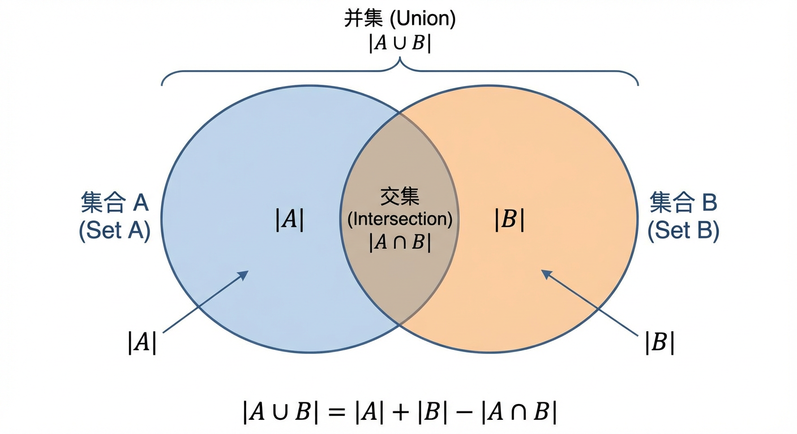
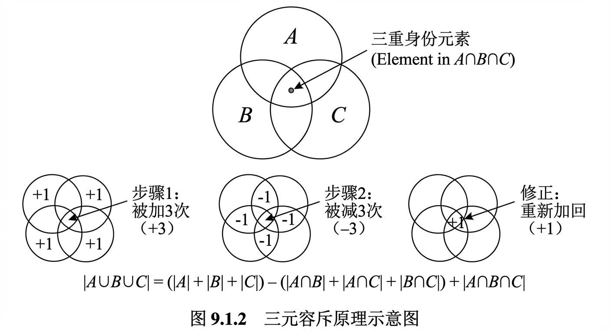
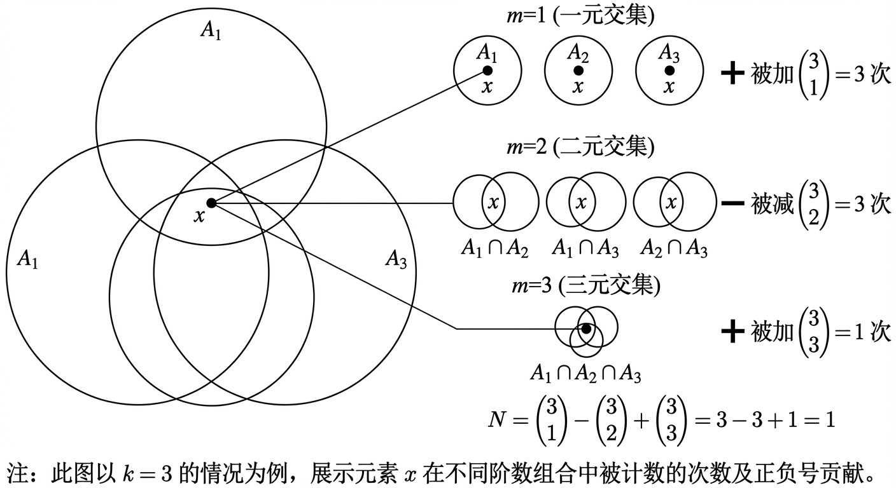
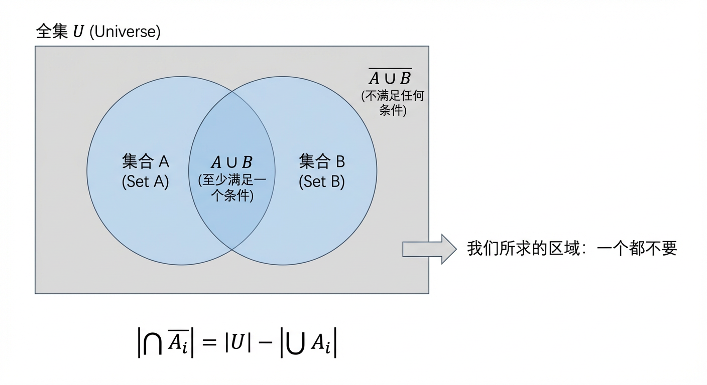
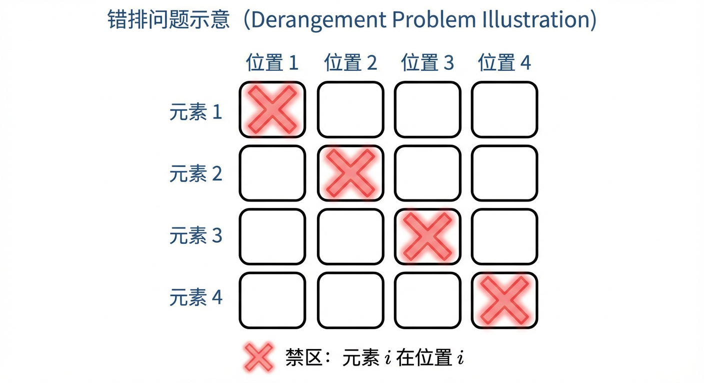
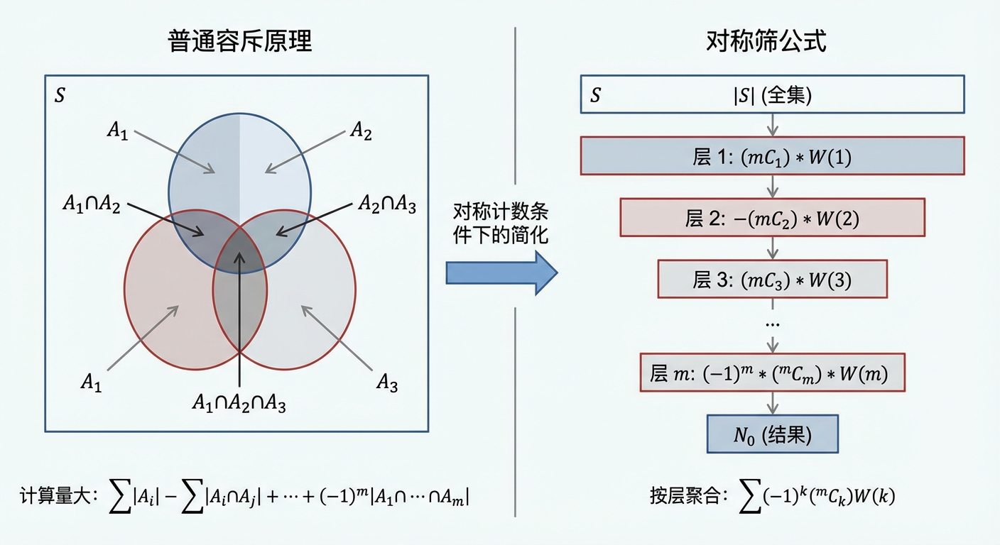
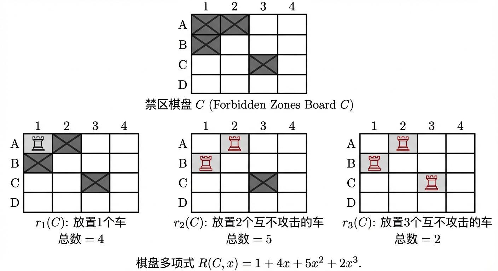

# 第9章：容斥原理

在第8章的加法法则与乘法法则基础上，本章进一步处理“对象属性发生交叠”时的计数困难：当多个条件同时出现时，直接相加会导致重复计数。第9章首先给出系统修正重复计数的**容斥原理**（9.1），随后在此框架之上讨论当条件具有**对称结构**时如何将容斥求和“按层聚合”以显著简化计算，并进一步引出处理非对称限制的代数工具（9.2）。这种从“普适原理”到“结构化简化”的递进，将为第10章“递推方程与生成函数”中“把组合问题代数化”的方法奠定延续性的认知基础。

---

## 9.1 容斥原理及其应用

在第8章中，我们已经掌握了组合计数的两个基本工具：加法法则与乘法法则。这些法则是处理由互斥类别或独立步骤构成的计数问题的基石。然而，当现实世界的问题呈现出更为复杂的交叠关系时——例如，一个对象可能同时具备多种属性——简单的相加便会因“重复计数”而失效。我们如何才能在多个条件的并存与交叠中，系统地修正我们的计算，以确保每个对象都被精确地、仅有一次地计入总数？这正是本节将要深入探讨的核心议题。

我们将以一种逐步构建的方式，揭示**容斥原理（Principle of Inclusion-Exclusion, PIE）**的内在逻辑。它不仅是一个公式，更是一种优雅的思维范式，用于在重叠的属性集合中进行精确导航。我们将从最简单的双集合情境出发，感受“重复计数—修正”这一基本节奏；随后将其推广至任意多个集合，并给出严谨的证明；最后，我们将通过一系列经典应用，展示如何将容斥原理作为一种强大的建模工具，嵌入我们解决组合问题的完整方法论之中。

### 1. 容斥原理的基本形式

#### 从两个集合到三个集合的推广

让我们从一个最基本的情形开始。假设我们想要求两个有限集合 $A$ 和 $B$ 的并集 $A \cup B$ 的大小。一个直观的想法是直接将两个集合的大小相加，即 $|A| + |B|$。然而，这种方法忽略了一个关键问题：任何同时属于 $A$ 和 $B$ 的元素（即位于交集 $A \cap B$ 中的元素），在 $|A|$ 的计数中被计入一次，在 $|B|$ 中又被计入一次。为了纠正这种重复计数，我们必须减去这部分重叠的大小。由此，我们得到了处理两个集合并集的基本公式，这便是容斥原理最简单的形式：

**定理 9.1.1（二元容斥原理）** 对于任意两个有限集合 $A$ 和 $B$，有
$$|A \cup B| = |A| + |B| - |A \cap B|$$

这个公式的结构体现了一种“包含”与“排除”的优美节奏：首先“包含”所有单个集合的元素，再“排除”那些被重复计数的交集元素。例如，若已知 $|A|=12$, $|B|=18$, 且 $|A \cap B|=5$，则它们的并集大小为 $|A \cup B| = 12 + 18 - 5 = 25$。这个等式关系是代数性的，意味着只要知道其中任意三个量，便可求出第四个。例如，若一个包含 $N$ 个元素的总体中，每个元素都至少属于集合 $A$ 或 $B$ 之一（即 $A \cup B = U$），那么两集合的交集大小就可表示为 $|A \cap B| = |A| + |B| - |U|$。

现在，让我们将这一思想的边界推向三个集合 $A, B, C$ 的情形，以探寻其更深层的结构。一个自然的尝试是先将三个集合的大小相加：$|A|+|B|+|C|$。通过韦恩图（Venn Diagram）不难发现，这个初步的总和正确地计算了只属于一个集合的元素，但对于那些属于至少两个集合的元素，则产生了重复计数。

为了修正，我们仿照二元情况，减去所有两两相交的集合大小：
$$|A|+|B|+|C| - |A \cap B| - |A \cap C| - |B \cap C|$$
此时，我们需要仔细审视一个特殊群体——那些同时属于三个集合 $A, B, C$ 的元素。让我们追踪一个这样的元素在计算中经历的“命运”：
1.  在第一步（$|A|+|B|+|C|$），它被加了 3 次。
2.  在第二步（$-|A \cap B| - |A \cap C| - |B \cap C|$），由于它同时属于这三个交集，它被减了 3 次。
其净计数因此变为 $3-3=0$。我们发现，在试图修正对“双重身份”元素的重复计数时，我们意外地将“三重身份”的元素完全排除了。我们过度修正了。为了弥补这一疏漏，我们必须将这部分元素重新加回来。这便引出了三元容斥原理的完整形态：

**定理 9.1.2（三元容斥原理）** 对于任意三个有限集合 $A, B, C$，有
$$|A \cup B \cup C| = (|A|+|B|+|C|) - (|A \cap B|+|A \cap C|+|B \cap C|) + |A \cap B \cap C|$$

从二元到三元的演进，让我们清晰地感知到容斥原理的核心节律：加上所有单个集合的大小，减去所有二元交集的大小，再加上所有三元交集的大小…… 这种符号的交替与交集阶数的递增，预示着一个可以推广到任意多个集合的普适模式。

#### 广义容斥原理

这种“包含-排除”的舞蹈可以完美地推广到任意 $n$ 个有限集合 $A_1, A_2, \dots, A_n$。其并集的大小可以通过遵循一种普适的节奏来计算：首先，**容纳**所有单个集合的大小；然后，**排除**所有可能的二元交集的大小；接着，**容纳**所有可能的三元交集的大小……如此交替进行，直至到达所有 $n$ 个集合的交集。

**定理 9.1.3（广义容斥原理）** 设 $A_1, A_2, \dots, A_n$ 为 $n$ 个有限集合，则其并集的大小为：
$$|\bigcup_{i=1}^{n} A_i| = \sum_{1 \le i \le n} |A_i| - \sum_{1 \le i < j \le n} |A_i \cap A_j| + \sum_{1 \le i < j < k \le n} |A_i \cap A_j \cap A_k| - \dots + (-1)^{n-1} |A_1 \cap \dots \cap A_n|$$
为了使表达更为紧凑，我们可以引入一种更抽象的记法。令 $I = \{1, 2, \dots, n\}$。对于 $I$ 的任意非空子集 $J$，我们定义 $A_J = \bigcap_{j \in J} A_j$。那么，上述公式可以优雅地写为：
$$|\bigcup_{i=1}^{n} A_i| = \sum_{\emptyset \neq J \subseteq I} (-1)^{|J|-1} |A_J|$$

**证明：** 为何这个复杂的交替和能够精确地计算并集的大小？其精妙之处在于，它确保了并集中任何一个元素，无论其身份如何重叠，最终都只被计算一次。
我们来考察一个任意元素 $x \in \bigcup_{i=1}^{n} A_i$。假设 $x$ 恰好属于这 $n$ 个集合中的 $k$ 个（$1 \le k \le n$）。现在我们来追踪 $x$ 在公式右侧被计数的总次数：
- 在第一项 $\sum |A_i|$ 中，由于 $x$ 属于 $k$ 个集合，它被加了 $\binom{k}{1}$ 次。
- 在第二项 $\sum |A_i \cap A_j|$ 中，$x$ 属于由它所在的那 $k$ 个集合构成的任意两个集合的交集，这样的交集有 $\binom{k}{2}$ 个。因此，它被减了 $\binom{k}{2}$ 次。
- 以此类推，对于包含 $m$ 个集合的交集项 $\sum |A_{i_1} \cap \dots \cap A_{i_m}|$，$x$ 的贡献次数为 $(-1)^{m-1}\binom{k}{m}$。

因此，元素 $x$ 被计数的总次数为：

$$N = \binom{k}{1} - \binom{k}{2} + \binom{k}{3} - \dots + (-1)^{k-1} \binom{k}{k}$$
回忆在第 8 章中学习的二项式定理，我们知道组合恒等式：
$$\sum_{m=0}^{k} (-1)^m \binom{k}{m} = \binom{k}{0} - \binom{k}{1} + \binom{k}{2} - \dots + (-1)^k \binom{k}{k} = (1-1)^k = 0$$
移项可得：
$$\binom{k}{1} - \binom{k}{2} + \binom{k}{3} - \dots + (-1)^{k-1} \binom{k}{k} = \binom{k}{0} = 1$$
这表明，我们计算出的净计数 $N$ 恰好为 1。对于任何一个在并集中的元素，无论它属于多少个子集，最终都精确地被计数了一次。而对于不在并集中的任何元素，它在公式右侧的每一项中贡献都为 0，总计数自然也为 0。至此，定理得证。
这个证明不仅揭示了容斥原理的正确性，也展现了组合恒等式与计数原理之间深刻的内在联系。

### 2. 容斥原理的应用

掌握了容斥原理的公式和证明，只是完成了理论构建的第一步。其真正的价值体现在将抽象的公式转化为解决具体问题的强大建模工具。应用容斥原理的核心流程在于：**从问题描述中提炼出全集和一系列属性，将这些属性定义为集合，然后系统地计算这些集合及其各阶交集的大小，最后根据问题是要求“至少一个”还是“一个都不要”来选择合适的容斥公式进行计算。**

#### 补集形式与计数策略

在许多组合问题中，我们更关心的是计算**不满足任何一个**指定条件的对象的数量。这类“禁止性”问题可以巧妙地借助容斥原理的**补集形式（complementary form）**来解决。

设 $U$ 为全集，我们想要求解不具有任何性质 $P_1, P_2, \dots, P_n$ 的元素的数量。令 $A_i$ 为 $U$ 中具有性质 $P_i$ 的元素的集合。我们所求的，正是集合 $\overline{A_1} \cap \overline{A_2} \cap \dots \cap \overline{A_n}$ 的大小。根据德摩根定律，这个集合等价于 $\overline{A_1 \cup A_2 \cup \dots \cup A_n}$。因此，其大小为：
$$|\bigcap_{i=1}^{n} \overline{A_i}| = |U| - |\bigcup_{i=1}^{n} A_i|$$

将广义容斥原理公式代入，我们得到补集形式的表达式：
$$|\bigcap_{i=1}^{n} \overline{A_i}| = |U| - \sum |A_i| + \sum |A_i \cap A_j| - \dots + (-1)^{n} |\bigcap_{i=1}^{n} A_i| = \sum_{J \subseteq I} (-1)^{|J|} |A_J|$$
其中 $A_{\emptyset}$ 定义为全集 $U$。

在实际应用中，一个关键的建模策略是判断直接计算并集（“至少满足一个条件”）与计算其补集（“不满足任何条件”）的难易程度。例如，要计算一副52张牌中任取5张，手牌中“至少含一张K或一张Q或一张J”的数量，直接应用容斥原理会涉及对7个不同交集项的复杂计算。相比之下，其补集问题——“不含K、Q、J的5张手牌数量”——则简单得多：我们只需从总共 $52 - 3 \times 4 = 40$ 张牌中选取5张，即 $\binom{40}{5}$。因此，原问题的答案就是 $\binom{52}{5} - \binom{40}{5}$。这个例子启发我们，灵活选择视角是高效解决组合问题的关键。

#### 典型应用举例

容斥原理的应用遍及离散数学的各个角落，以下我们将通过几个范式性的例子来展示其建模流程。

**1. 带限制条件的排列：错排问题**

一个经典的容斥原理应用是**错排问题（Derangement Problem）**。一个错排是指一个排列中所有元素都不在其“自然”位置上。例如，求集合 $\{1, 2, 3, 4\}$ 的所有排列中，数字 $i$ 都不在第 $i$ 个位置上的排列数量。

- **建模**：
    - 全集 $U$ 是 $\{1, 2, 3, 4\}$ 的所有排列，所以 $|U| = 4!$。
    - 我们要避免的性质是 $P_i$：“数字 $i$ 在第 $i$ 个位置上”。令 $A_i$ 为具有性质 $P_i$ 的排列构成的集合。
    - 目标是计算 $|\overline{A_1} \cap \overline{A_2} \cap \overline{A_3} \cap \overline{A_4}|$。
- **计算交集**：
    - $|A_i|$：若数字 $i$ 固定在第 $i$ 位，其余 3 个数字可任意排列，故 $|A_i| = 3!$。满足该性质的集合有 $\binom{4}{1}$ 个。
    - $|A_i \cap A_j|$：若数字 $i, j$ 固定在各自位置，其余 2 个数字可任意排列，故 $|A_i \cap A_j| = 2!$。这样的交集有 $\binom{4}{2}$ 个。
    - 以此类推， $|A_i \cap A_j \cap A_k| = 1!$，有 $\binom{4}{3}$ 个；$|A_1 \cap A_2 \cap A_3 \cap A_4| = 0! = 1$，有 $\binom{4}{4}$ 个。
- **应用公式**：
    根据补集形式，错排数 $D_4$ 为：
    $$D_4 = 4! - \binom{4}{1}3! + \binom{4}{2}2! - \binom{4}{3}1! + \binom{4}{4}0! = 24 - 4 \cdot 6 + 6 \cdot 2 - 4 \cdot 1 + 1 \cdot 1 = 9$$
此方法可以推广到任意 $n$ 个元素的错排数 $D_n = n! \sum_{k=0}^{n} \frac{(-1)^k}{k!}$。

**2. 满射函数计数**

容斥原理是计算**满射函数（Surjective Functions）**数量的标准方法。一个从集合 $A$ 到 $B$ 的满射函数确保了 $B$ 中的每个元素都至少是 $A$ 中一个元素的像。

考虑计算从一个含 6 个不同元素的集合 $A$ 到一个含 4 个不同元素的集合 $B$ 的满射函数数量。

- **建模**：
    - 全集 $U$ 是从 $A$ 到 $B$ 的所有函数。由于 $A$ 中每个元素都有 4 种可能的像，故 $|U| = 4^6$。
    - 我们要避免的性质是 $P_i$：“集合 $B$ 中的元素 $b_i$ 不在函数的值域内”。令 $A_i$ 为值域不包含 $b_i$ 的函数集合。
    - 满射函数即不具有任何性质 $P_i$ 的函数，目标是计算 $|\overline{A_1} \cap \overline{A_2} \cap \overline{A_3} \cap \overline{A_4}|$。
- **计算交集**：
    - $|A_i|$：若值域不含 $b_i$，则 $A$ 中每个元素只能映射到 $B$ 中剩下的 3 个元素，故 $|A_i| = 3^6$。这样的集合有 $\binom{4}{1}$ 个。
    - $|A_i \cap A_j|$：若值域不含 $b_i, b_j$，则 $A$ 中每个元素只能映射到剩下的 2 个元素，故 $|A_i \cap A_j| = 2^6$。这样的交集有 $\binom{4}{2}$ 个。
    - 以此类推。
- **应用公式**：
    满射函数的数量为：
    $$\binom{4}{0}4^6 - \binom{4}{1}3^6 + \binom{4}{2}2^6 - \binom{4}{3}1^6 + \binom{4}{4}0^6$$
    $$= 1 \cdot 4096 - 4 \cdot 729 + 6 \cdot 64 - 4 \cdot 1 + 1 \cdot 0 = 4096 - 2916 + 384 - 4 = 1560$$
一般地，从 $m$ 元集到 $n$ 元集的满射函数数量为 $\sum_{k=0}^{n} (-1)^k \binom{n}{k} (n-k)^m$。

**3. 整除性问题与欧拉函数**

在数论中，容斥原理是解决整除性计数问题的利器，其中最经典的应用莫过于推导**欧拉函数（Euler's Totient Function）** $\phi(n)$。$\phi(n)$ 定义为小于或等于 $n$ 的正整数中与 $n$ 互质的数的个数。

与 $n$ 互质意味着该数不能被任何 $n$ 的素因子整除。假设 $n$ 的素因子分解为 $n = p_1^{k_1} p_2^{k_2} \dots p_r^{k_r}$。
- **建模**：
    - 全集 $U=\{1, 2, \dots, n\}$。
    - 待排除的性质 $P_i$ 是“能被素因子 $p_i$ 整除”。令 $A_i$ 为 $U$ 中 $p_i$ 的倍数的集合。
    - $\phi(n)$ 即为 $|\overline{A_1} \cap \dots \cap \overline{A_r}|$。
- **计算交集**：
    - 在 $\{1, \dots, n\}$ 中，能被 $d$ 整除的数有 $\lfloor n/d \rfloor$ 个。由于 $p_i$ 和它们的积都是 $n$ 的因子，此处的向下取整可以去掉。
    - $|A_i| = n/p_i$。
    - $|A_i \cap A_j| = n/(p_i p_j)$，以此类推。
- **应用公式**：
    $$\phi(n) = n - \sum_{i} \frac{n}{p_i} + \sum_{i<j} \frac{n}{p_i p_j} - \dots + (-1)^r \frac{n}{p_1 \dots p_r}$$
    将 $n$ 提取出来，即可得到著名的欧拉函数积性公式：
    $$\phi(n) = n \left(1 - \frac{1}{p_1}\right) \left(1 - \frac{1}{p_2}\right) \dots \left(1 - \frac{1}{p_r}\right) = n \prod_{p|n, p \text{ is prime}} \left(1 - \frac{1}{p}\right)$$
例如，计算与 210 互质的数的数量，即 $\phi(210)$。由于 $210 = 2 \cdot 3 \cdot 5 \cdot 7$，应用公式得 $\phi(210) = 210(1-1/2)(1-1/3)(1-1/5)(1-1/7) = 48$。

#### 延伸思考：理论的统一性与局限性

值得注意的是，容斥原理的结构不仅限于组合计数。在第12章我们将看到，它在概率论中以几乎完全相同的形式出现，用于计算事件并集的概率：$P(\bigcup A_i) = \sum P(A_i) - \sum P(A_i \cap A_j) + \dots$。这种形式上的统一性揭示了容斥原理作为一种处理可加性度量（如集合基数、概率、面积等）的基本数学结构。

然而，容斥原理的优雅也伴随着一个重要的现实挑战：计算的复杂性。考虑一个在算法设计中遇到的问题：计算一个矩阵的**积和式（permanent）**。一个名为**雷瑟公式（Ryser's Formula）**的著名结果正是容斥原理的一个精妙应用：
$$ \text{perm}(A) = \sum_{S \subseteq \{1, \dots, n\}} (-1)^{n-|S|} \prod_{i=1}^n \left(\sum_{j \in S} A_{ij}\right) $$
这个公式在数学上是完美的，但从计算的角度看，它要求我们遍历列索引的所有 $2^n$ 个子集。这意味着基于该公式的直接算法具有指数级别的计算复杂度，对于稍大的矩阵（如 $n=50$）就变得不可行。这给我们一个深刻的教训：一个在数学上精确而优美的公式，未必是一个在计算上实用的算法。容斥原理的优雅，是以潜在的指数级计算代价换来的。

### 小结

在本节中，我们从修正简单加法中的重复计数问题出发，循序渐进地构建了容斥原理。我们始于两个集合的简单形式，通过引入第三个集合，洞察到其“包含-排除”交替修正的内在节律，并最终将其推广至任意多个集合的广义形式，同时给出了基于组合恒等式的严谨证明。

更重要的是，我们将容斥原理定位为一个强大的建模工具。通过其直接形式与补集形式，我们学会了如何将复杂的“或”逻辑约束和“禁止性”约束的计数问题，系统地转化为对一系列交集大小的计算。无论是经典的错排问题、满射函数计数，还是数论中的欧拉函数，容斥原理都提供了一条清晰、统一的解决路径。

容斥原理不仅是第8章基本计数法则的逻辑延伸，它也为后续的学习奠定了基础。它与概率论的内在联系，为第12章的学习埋下了伏笔；而其在算法应用中暴露的计算复杂性问题，则激发我们思考更高效的计数策略。这引出了我们下一节的主题：对于具有高度对称性的问题，我们能否在容斥原理的基础上，发展出更为结构化和简化的计数框架？这便是对称筛公式将要回答的问题。

承接上节末尾提出的“计算复杂性”挑战：广义容斥原理的项数随性质数 $m$ 以 $2^m$ 级别增长。下一节将展示一种典型的“结构化降维”思想：当约束条件具有内在对称性时，很多交集项的大小相同，可以按交集阶数聚合，从而把原本指数级的逐项求和，压缩为只需要计算 $m+1$ 个代表性量的交替和——这正是**对称筛公式**的核心动机。同时，当对称性不足以完全成立时，我们还将看到如何借助代数编码（棋盘多项式）来组织容斥计算，为后续更一般的代数组合方法做铺垫。

---

## 9.2 对称筛公式及其应用

在上一节中，我们建立了容斥原理（Principle of Inclusion-Exclusion, PIE）作为处理重叠集合计数的普适框架。我们学会了如何通过一个交替求和的级数，系统性地修正因简单相加而导致的重复计数。然而，当待处理的性质（或条件）数量庞大时，直接应用容斥原理将面临一项艰巨的任务：逐一计算所有可能尺寸的交集。幸运的是，在许多组合问题中，约束条件常常呈现出一种深刻的对称性。这种对称性一旦被识别并加以利用，便能极大地简化计算，将复杂的容斥求和演化为一个更优雅、更紧凑的代数形式。本节将从这一观察出发，引出容斥原理的一个重要特例——**对称筛公式 (Symmetric Sieve Formula)**，并将其应用于一类经典的组合问题：**有限制条件的排列 (Permutations with Restricted Positions)**。在此过程中，我们将引入一个强大的代数工具——**棋盘多项式 (Rook Polynomial)**，它能将复杂的几何位置约束转化为简洁的多项式系数，从而将一类看似棘手的计数问题纳入一个标准化的、可计算的流水线中。

### 对称筛公式：从逐项容斥到层级聚合

让我们回顾容斥原理的核心：对于一个全集 $S$ 和一系列性质 $P_1, P_2, \dots, P_m$，不具备任何性质的对象数量为：
$$N(\overline{P_1}\overline{P_2}\cdots\overline{P_m}) = |S| - \sum_i |A_i| + \sum_{i<j} |A_i \cap A_j| - \cdots + (-1)^m |A_1 \cap \cdots \cap A_m|$$
其中 $A_i$ 是 $S$ 中具备性质 $P_i$ 的对象构成的集合。此公式要求我们计算所有 $2^m-1$ 个非空交集的大小。

现在，设想一种特殊但常见的情形：所有性质在结构上是等价的。这意味着，任何 $k$ 个性质的交集大小，都仅仅取决于交集的“尺寸” $k$，而与具体是哪 $k$ 个性质无关。例如，在数论的筛法（Sieve Theory）语境下，当我们试图从一个整数集合中筛去所有小素数的倍数时，对于不同的素数 $p$ 和 $q$，性质“是 $p$ 的倍数”与“是 $q$ 的倍数”在结构上是对称的。在更形式化的语言中，我们做出如下定义：

**定义 9.2.1（对称计数条件）**：
设 $S$ 为全集，$\{P_1, \dots, P_m\}$ 为一组性质。如果对于任意的 $1 \le k \le m$，所有由 $k$ 个性质构成的交集大小都相等，即对于任意的 $\{i_1, \dots, i_k\} \subseteq \{1, \dots, m\}$，都有
$$|A_{i_1} \cap A_{i_2} \cap \cdots \cap A_{i_k}| = W(k)$$
其中 $W(k)$ 是一个只依赖于 $k$ 的数值，我们就称这组性质满足对称计数条件。

在对称计数条件下，容斥原理中的求和项可以被极大地简化。对于任意固定的 $k$，求和项 $\sum_{1 \le i_1 < \dots < i_k \le m} |A_{i_1} \cap \dots \cap A_{i_k}|$ 包含了 $\binom{m}{k}$ 个完全相同的项，每一项的值都是 $W(k)$。因此，这部分求和可以被整体替换为 $\binom{m}{k} W(k)$。将此代入容斥原理，我们便得到了对称筛公式。

**定理 9.2.1（对称筛公式）**：
若一组性质 $\{P_1, \dots, P_m\}$ 满足对称计数条件，其中任意 $k$ 个性质的交集大小为 $W(k)$，则全集 $S$ 中不具备任何这些性质的对象数量为：
$$N_0 = |S| - \binom{m}{1}W(1) + \binom{m}{2}W(2) - \cdots + (-1)^m \binom{m}{m}W(m) = \sum_{k=0}^{m} (-1)^k \binom{m}{k} W(k)$$
其中我们定义 $W(0) = |S|$。

这个公式的威力在于，它将计算的焦点从“逐一识别并计算每个交集”转变为“按对称层级聚合计数”。我们不再需要处理指数级增长的项，而只需计算 $m+1$ 个代表性的数值 $W(0), W(1), \dots, W(m)$。这是一种从“个体”思维到“结构”思维的跃升，它揭示了当问题内含对称性时，组合计数的复杂度可以被显著降低。

值得注意的是，这种“筛法”思想在数学的其他分支，尤其是在解析数论中，扮演着核心角色。在那里，数学家们使用更广义的筛法来估计素数的分布，例如孪生素数猜想（Twin Prime Conjecture）或哥德巴赫猜想（Goldbach Conjecture）。这些问题可以被表述为从整数序列中筛去满足特定同余条件的数。例如，在孪生素数问题中，对于每一个奇素数 $p$，我们需要筛去使得 $n(n+2) \equiv 0 \pmod p$ 的数 $n$。这里，性质“$n$ 或 $n+2$ 是 $p$ 的倍数”对所有奇素数 $p$ 而言，其局部排除的模式是高度对称的（都排除了两个残差类）。尽管这些数论筛法通常需要处理近似和误差项，但其组合核心——通过对称性简化容斥原理——与我们在此讨论的对称筛公式一脉相承。然而，这类组合筛法也存在深刻的局限性，即所谓的**奇偶性问题 (Parity Problem)**。它指出，纯粹的组合筛法无法有效区分一个数拥有奇数个大素数因子还是偶数个大素数因子。这正是为何筛法可以给出孪生素数数量的优秀上界，却无法证明其存在性（即给出一个正的下界）的根本原因。这一洞见提醒我们，即使是最强大的工具，其适用范围和解释力也存在边界，而探索这些边界本身，正是推动数学发展的动力之一。

### 有限制条件的排列与棋盘多项式

对称筛公式为我们提供了一个优雅的工具，但它的应用前提是严格的对称性。在组合计数中，许多问题并不完全满足此条件，但其内在结构依然可以通过代数方法加以利用。一个典型的例子便是“有限制条件的排列问题”，也称为“错排问题”的推广。

考虑一个经典场景：$n$ 位宾客参加晚宴，并将自己的帽子交给侍者。晚宴结束后，侍者随机地将 $n$ 顶帽子发还给宾客。有多少种分发方式，使得没有任何一位宾客拿到自己的帽子？这就是著名的**错排问题 (Derangement Problem)**。

我们可以将此问题建模为：求集合 $\{1, 2, \dots, n\}$ 到自身的排列 $\pi$，使得对于所有的 $i \in \{1, \dots, n\}$，都有 $\pi(i) \neq i$。让我们用容斥原理来解决它。全集 $S$ 是所有 $n!$ 种排列。性质 $P_i$ 定义为“排列 $\pi$ 满足 $\pi(i)=i$”。我们要求的是不满足任何性质 $P_i$ 的排列数量。

这是一个完美的对称问题。对于任意 $k$ 个性质的交集 $A_{i_1} \cap \dots \cap A_{i_k}$，它代表了满足 $\pi(i_1)=i_1, \dots, \pi(i_k)=i_k$ 的所有排列。这意味着这 $k$ 个元素的位置被固定，而剩下的 $n-k$ 个元素可以在剩余的 $n-k$ 个位置上任意排列。因此，交集的大小为 $W(k) = (n-k)!$。根据对称筛公式，错排数 $D_n$ 为：
$$D_n = \sum_{k=0}^{n} (-1)^k \binom{n}{k} (n-k)! = \sum_{k=0}^{n} (-1)^k \frac{n!}{k!(n-k)!} (n-k)! = n! \sum_{k=0}^{n} \frac{(-1)^k}{k!}$$
这个结果优雅地展现了对称筛公式的威力。

然而，如果限制条件变得不那么规则，情况会怎样？例如，假设有 4 位员工 A, B, C, D 被分配到 4 个岗位 1, 2, 3, 4。但存在如下限制：A 不能去 1 或 2，B 不能去 1，C 不能去 3。此时，性质“A 在岗位 1”与“B 在岗位 1”显然不再对称，我们无法直接套用对称筛公式。

为了系统性地解决这类问题，我们引入一个精妙的视觉化与代数化工具：**棋盘多项式 (Rook Polynomial)**，或称车多项式。

1.  **棋盘表示**：我们将一个 $n \times n$ 的排列问题想象成一个 $n \times n$ 的棋盘。行代表对象（如员工），列代表位置（如岗位）。一个排列对应于在棋盘上放置 $n$ 个“车”（Rook），使得它们两两之间互不攻击（即每行每列恰好有一个车）。限制条件，即“某对象不能去某位置”，则对应于棋盘上的**禁区 (Forbidden Positions)**。我们将所有禁区构成的子棋盘记为 $C$。问题就转化为：在 $n \times n$ 的棋盘上，有多少种放置 $n$ 个互不攻击的车的方法，使得没有一个车落在禁区 $C$ 上？

2.  **容斥原理的应用**：设 $P_i$ 为“第 $i$ 个位置被一个落在禁区 $C$ 上的车占据”的性质。我们要求的是没有任何性质被满足的方案数。根据容斥原理，答案是：

    $$N_0 = \sum_{k=0}^{n} (-1)^k S_k$$
    其中 $S_k$ 是所有 $k$ 个性质交集大小之和。$S_k$ 的组合意义是什么？它是在棋盘上放置 $k$ 个车，这 $k$ 个车都必须落在禁区 $C$ 上，并且它们所占据的行和列各不相同（即它们是互不攻击的），而剩下的 $n-k$ 个车可以在剩余的 $n-k$ 行和列中任意放置。

3.  **棋盘多项式的定义**：$S_k$ 的计算分为两步。首先，我们需要计算在禁区棋盘 $C$ 上放置 $k$ 个互不攻击的车的方法数。这个纯粹依赖于禁区 $C$ 几何形状的组合数，我们记为 $r_k(C)$。一旦这 $k$ 个车放置完毕，它们就占据了 $k$ 行和 $k$ 列。剩下的 $n-k$ 个车可以在余下的 $(n-k) \times (n-k)$ 的棋盘上以 $(n-k)!$ 种方式自由放置。因此，$S_k = r_k(C) \cdot (n-k)!$。

    这启发我们定义一个只与禁区 $C$ 相关的多项式，用它的系数来编码 $r_k(C)$ 的信息。

    **定义 9.2.2（棋盘多项式）**：
    对于一个棋盘（或其任意子集）$C$，其棋盘多项式 $R(x, C)$ 定义为：
    $$R(x, C) = \sum_{k=0}^{\infty} r_k(C) x^k$$
    其中 $r_k(C)$ 是在 $C$ 上放置 $k$ 个互不攻击的车的方法数。对于一个 $n \times n$ 棋盘的子集 $C$，$r_k(C)=0$ 当 $k>n$。

4.  **主定理**：将 $S_k = r_k(C) \cdot (n-k)!$ 代入容斥原理的表达式，我们立即得到解决有限制条件排列问题的核心定理。

    **定理 9.2.2（有限制条件的排列公式）**：
    在一个 $n \times n$ 的排列问题中，若禁区由棋盘 $C$ 描述，则满足所有限制条件的排列数（即没有车落在 $C$ 上）为：
    $$N_C = \sum_{k=0}^{n} (-1)^k r_k(C) (n-k)!$$

这个定理是非凡的。它将一个复杂的排列计数问题分解为两个独立的部分：一部分是纯粹与禁区几何形状相关的组合问题，其信息被完全编码在棋盘多项式的系数 $r_k(C)$ 中；另一部分是标准的阶乘项 $(n-k)!$。我们的任务从直接计算交集，转变为计算棋盘多项式。

**示例：** 让我们回到之前 4 位员工分配到 4 个岗位的问题。
员工：A, B, C, D。岗位：1, 2, 3, 4。
禁区：A不能去1, 2；B不能去1；C不能去3。
这对应一个 $4 \times 4$ 棋盘上的禁区 $C$，在 (A,1), (A,2), (B,1), (C,3) 位置有方格。

我们需要计算 $r_k(C)$：
-   $r_0(C) = 1$ (放置 0 个车总有 1 种方法)。
-   $r_1(C) = 4$ (禁区有 4 个方格，可任选一个放置 1 个车)。
-   $r_2(C)$: 我们需要选择 2 个互不攻击的禁区方格。可能的组合有 {(A,1), (C,3)}, {(A,2), (B,1)}, {(A,2), (C,3)}, {(B,1), (C,3)}。所以 $r_2(C) = 4$。
-   $r_3(C)$: 我们需要选择 3 个互不攻击的禁区方格。唯一可能的组合是 {(A,2), (B,1), (C,3)}。所以 $r_3(C) = 1$。
-   $r_4(C) = 0$ (无法在 4 个禁区方格中放置 4 个互不攻击的车)。

根据定理 9.2.2，满足条件的排列数为：
\begin{align*} N_C &= r_0(C)4! - r_1(C)3! + r_2(C)2! - r_3(C)1! + r_4(C)0! \\ &= 1 \cdot 24 - 4 \cdot 6 + 4 \cdot 2 - 1 \cdot 1 + 0 \cdot 1 \\ &= 24 - 24 + 8 - 1 \\ &= 7 \end{align*}
因此，共有 7 种有效的分配方案。

通过棋盘多项式，我们将一个非对称的、看似棘手的计数问题，转化成了一个结构清晰、步骤明确的代数计算。这完美体现了离散数学中一个核心的方法论：**将组合结构代数化**。

### 小结

本节内容从容斥原理的对称性考量出发，将我们的计数工具箱从普适但繁琐的逐项容斥，升级到了两个更具结构化的层面。

首先，我们提炼出了**对称筛公式**，它展示了当问题的约束条件具备内在对称性时，计算量如何得以大幅度简化。这一公式不仅是组合计数中的利器，更与数论等领域中的“筛法”思想遥相呼应，让我们得以一窥组合方法在解决深刻数学猜想（如孪生素数猜想）时所扮演的角色及其固有的“奇偶性”局限。这不仅是知识的深化，更是对数学工具能力边界的哲学反思。

其次，在面对更普遍的、非对称的限制条件时，我们没有止步于此，而是引入了**棋盘多项式**这一更为普适和强大的代数工具。通过将几何位置约束巧妙地编码为多项式系数，我们将复杂的“有限制条件的排列”问题转化为一个“公式-表示-计算”的标准化流程。棋盘多项式不仅解决了问题，更重要的是，它示范了一种高级的数学思维范式：**通过寻找恰当的代数表示来驯服组合的复杂性**。

从容斥原理到对称筛公式，再到棋盘多项式，我们构建了一个处理约束性计数问题的连续方法谱系。这一历程不仅仅是公式的堆砌，更是思维方式的层层递进。更进一步地，本节通过多项式来编码和组织计数的思想，为我们即将进入的**第10章：递推方程与生成函数**铺设了坚实的认知基础。在那里，“将组合问题转化为代数对象再进行分析”的策略将不再是特例，而会成为我们求解更广泛计数问题的核心驱动力。本节所开启的，是通往一个更为广阔和强大的代数组合世界的大门。

至此我们看到两条并行主线：一条是9.1给出的“交替修正”的普适逻辑；另一条是9.2展示的“利用结构压缩容斥信息”的思想（对称筛用 $W(k)$ 聚合，棋盘多项式用 $r_k(C)$ 编码几何）。二者共同强调：当我们把计数对象与“性质集合/禁区结构”建立对应关系时，容斥不只是公式，而是一套可迁移的建模语言；而这种语言在后续章节将进一步与递推与生成函数相互贯通。

---

## 总结

本章围绕“重复计数的系统修正”这一核心矛盾，建立了从一般到特殊、从直接到结构化的完整知识链条。

在9.1中，我们从二元并集出发，通过分析交集导致的重复计数，得到二元与三元容斥公式，并推广到**广义容斥原理**：
\[
\left|\bigcup_{i=1}^{n}A_i\right|
=\sum_{\emptyset\neq J\subseteq I}(-1)^{|J|-1}|A_J|.
\]
其证明揭示了“每个元素最终被计为1次”的组合恒等式基础，并进一步给出**补集形式**以处理“一个都不满足”的禁止性计数。随后通过错排、满射计数与欧拉函数等例子，展示了容斥原理作为建模工具的通用流程；同时也指出了容斥在计算上可能遭遇的指数级复杂性（如Ryser公式）。

在9.2中，我们针对这种复杂性给出两种结构化策略：当性质满足对称计数条件时，利用**对称筛公式**
\[
N_0=\sum_{k=0}^{m}(-1)^k\binom{m}{k}W(k)
\]
将“逐项交集”压缩为“按交集阶数聚合”；当对称性不足时，引入**棋盘多项式**与公式
\[
N_C=\sum_{k=0}^{n}(-1)^k r_k(C)(n-k)!
\]
把几何禁区信息编码为代数系数，从而标准化地组织容斥计算。

整体而言，本章的思想要点是：一方面通过交替和精确校正重叠，另一方面通过识别对称与选择代数表示来降低复杂度。这种“从集合结构到代数表达”的路径，将在第10章进一步发展为更系统的递推与生成函数方法。

---

## 练习题

1. [多选题] 设 $P$ 为正整数在“整除”关系下形成的偏序集（$a\preceq b \Leftrightarrow a\mid b$）。对算术函数 $f,g:\mathbb N\to \mathbb C$，满足对任意 $n\in\mathbb N$，
\[
f(n)=\sum_{d\mid n}g(d).
\]
已知 $1\le n\le 12$ 时
\[
\begin{aligned}
&f(1)=1,\ f(2)=1,\ f(3)=2,\ f(4)=1,\ f(5)=2,\ f(6)=2,\\
&f(7)=2,\ f(8)=1,\ f(9)=3,\ f(10)=2,\ f(11)=2,\ f(12)=2.
\end{aligned}
\]
下列关于“容斥原理与Möbius反演关系”以及由此重构 $g$ 的说法，哪些是正确的？（可多选）

A. 在有限集 $X$ 的幂集按包含关系形成的布尔格上，Möbius反演可导出容斥原理，因为区间 $(A,B)$ 的Möbius函数为 $\mu(A,B)=(-1)^{|B\setminus A|}$；在整除偏序集上，若 $f(n)=\sum_{d\mid n}g(d)$，则
\[
g(n)=\sum_{d\mid n}\mu(d)\,f\!\left(\frac nd\right),
\]
其中 $\mu$ 为经典数论Möbius函数。

B. 容斥原理涉及补集，因而不能表示为Möbius反演；Möbius反演仅适用于没有补结构的格。

C. 由给定 $f(n)$ 数据重构得到
\[
\begin{aligned}
&g(1)=1,\ g(2)=0,\ g(3)=1,\ g(4)=0,\ g(5)=1,\ g(6)=0,\\
&g(7)=1,\ g(8)=0,\ g(9)=1,\ g(10)=0,\ g(11)=1,\ g(12)=0.
\end{aligned}
\]

D. 与上述数据相容的唯一可能是 $g(n)\equiv 1$（对所有 $n$ 恒为1）。

E. 反演公式为
\[
g(n)=\sum_{d\mid n}\mu(d)\,f(d).
\]

2. [多选题]（本题为跨域表述，但请仅依据题干给出的“守恒—滞留时间—交替效应”逻辑作答。）某“单腔体-单开口”的系统在腔体内先经历“腔内作用”（类比容斥/筛法中对对象施加性质筛除前的累积作用），题干给出：在扩散受限且腔内浓度近似均匀时，单个粒子的“腔内作用总量”与其平均驻留时间 $\tau$ 成正比；而稳态下 $\tau\approx V/Q_{\text{eff}}$。设两种形态的有效体积 $V$ 相同，并满足 $\phi_R>\phi_B$ 且 $Q_{\text{eff},R}<Q_{\text{eff},B}$。在此基础上，判断下列说法哪些最一致。（可多选）

A. 均匀环向分布的“筛状结构”通过增强回流并降低有效外流率，从而增大平均驻留时间，进而增加单位粒子的腔内作用累积。

B. “双侧成簇、留下大缺口”的结构因为增大通过流率，所以会增加腔内作用累积（在题干给定的扩散受限与作用量 $\propto\tau$ 前提下）。

C. 在固定“驱动功/驱动模式”下，减小开口半径会因剪切增大而降低滞留、使粒子更快排出。

D. 若另一类系统没有该“环向筛状结构”，则其驻留时间分布主要由内部拓扑与泵吸方式决定；边界对称性本身不直接增强开口处的预滞留效果。

E. 由于腔内作用先于后续步骤，任何能增加预阶段驻留时间（例如通过降低 $Q_{\text{eff}}$）的形态，都会增加进入后续步骤前的作用累积。

**参考答案（习题解答要点）**

1. 选 A、C。要点：  
   - 布尔格上的Möbius函数满足 $\mu(A,B)=(-1)^{|B\setminus A|}$，其反演给出交替和结构，正是容斥原理的代数本质；整除偏序集上 $f=\zeta*g$，反演为 $g=\mu*f$，即
     \[
     g(n)=\sum_{d\mid n}\mu(d)\,f(n/d).
     \]
   - 由该公式逐项计算（或递推）可得 $g(1)=1$，且 $g(n)$ 在 $1\le n\le 12$ 内呈“奇数为1、偶数为0”，与选项C一致。  
   - B错误：容斥原理是Möbius反演在布尔格上的特例，并不因“补集”而排斥。  
   - D错误：若 $g\equiv 1$ 则 $f(n)$ 等于约数个数函数 $\tau(n)$，与 $f(2)=1$ 等矛盾。  
   - E错误：缺少 $f(n/d)$（或等价重标）这一关键结构，代入会与计算结果冲突。

2. 选 A、D、E。要点：  
   - 题干给定“作用量 $\propto\tau$”与 $\tau\approx V/Q_{\text{eff}}$，且 $V$ 相同、$Q_{\text{eff},R}<Q_{\text{eff},B}$，故 $\tau_R>\tau_B$，从而A成立、B不成立。  
   - C与“减小开口导致阻力增大、$Q_{\text{eff}}$倾向减小、从而 $\tau$ 增大”的守恒/阻力直觉不一致，在题干逻辑下不成立。  
   - D为比较性判断：没有“环向筛”时，决定驻留时间的主导因素转为内部拓扑与泵吸机制，边界对称性不再直接起相同作用。  
   - E是对“作用量 $\propto\tau$”的直接推广：凡增大预阶段驻留时间者均增大预阶段累积作用量。