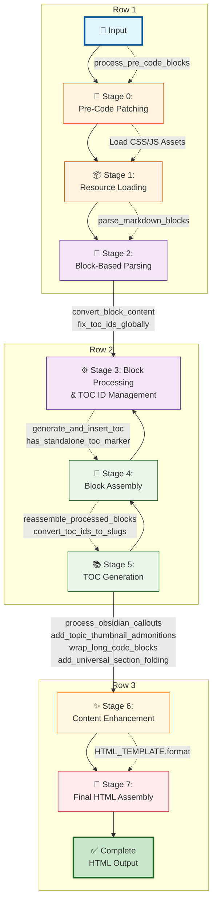

# Advanced Markdown to HTML Converter

A sophisticated Python-based markdown to HTML conversion system with advanced styling, responsive tables, and intelligent list formatting. It's built with a robust block-based architecture for fault-tolerant processing of complex academic and technical documents.

[TOC]

## Installation

### Prerequisites
```bash
# Required Python package
pip install mistune>=3.0.0
```

### Quick Setup
1.  **Download the complete md2html system**:
    ```bash
    git clone <repository-url> md2html
    cd md2html
    ```

2.  **One-time asset download** (recommended):
    ```bash
    python md2html.py sample.md --download-themes
    # Downloads 40+ premium themes to .prism/ directory
    ```

3.  **Verify installation**:
    ```bash
    python md2html.py sample.md sample.html
    # Should generate sample.html with all features
    # (add [TOC] to sample.md to test table of contents)
    ```

## Usage

### Basic Conversion
```bash
python md2html.py input.md output.html
```

**Flexible Execution**: The script can be run from any directory with absolute or relative paths:
```bash
# Run from any directory with absolute path
python /path/to/md2html/md2html.py input.md output.html

# Run from parent directory with relative path  
python md2html/md2html.py README.md

# Run from different directory entirely
cd /tmp && python /Users/name/md2html/md2html.py /path/to/input.md
```

All `.prism/` assets are automatically resolved relative to the script location, not your current working directory.

### Advanced Options
```bash
# With custom CSS
python md2html.py input.md output.html --css custom.css

# Dark theme for code blocks
python md2html.py input.md output.html --theme dark

# Line numbers in code blocks
python md2html.py input.md output.html --line-numbers

# Collapsible sections (fold sections containing specific keywords)
python md2html.py input.md output.html --fold-sections "solution" "answer"

# Collapsible long code blocks (>N lines)
python md2html.py input.md output.html --collapse 50

# Table of contents (add [TOC] line in your markdown)
# python md2html.py input.md output.html


# Disable standalone boxed math expressions (enabled by default)
python md2html.py input.md output.html
python md2html.py input.md output.html --no-boxed-math

# Disable choice options formatting, convert A. B. C. to single lines (eabled by default)
python md2html.py input.md output.html
python md2html.py input.md output.html --no-choice-options

# Mermaid diagram rendering (enabled by default)
python md2html.py input.md output.html  # Mermaid diagrams rendered
python md2html.py input.md output.html --no-mermaid  # Disable Mermaid rendering
```

### Full Command Reference
```bash
python md2html.py [-h] [--css CSS] [--theme THEME] [--line-numbers]
                  [--collapse N] [--download-themes]
                  [--inline-lang INLINE_LANG]  
                  [--fold-sections [FOLD_SECTIONS ...]] 
                  [--no-boxed-math] [--no-choice-options] [--no-mermaid]
                  [input_file] [output_file]
```

**New Options:**
- `--no-boxed-math`: Disable standalone `\boxed{...}` math rendering
- `--no-choice-options`: Disable formatting choice options (A. B. C.) as single-line styled paragraphs
- `--no-mermaid`: Disable Mermaid diagram rendering (Mermaid is enabled by default)


## Core Features

- **Flexible Path Resolution**: Can be executed from any directory with absolute or relative paths. All `.prism/` assets are automatically resolved relative to the script location, ensuring consistent behavior regardless of current working directory.
- **Smart Code Blocks**: Includes an intelligent algorithm to repair broken or unpaired code fences, minimizing structural damage. Invalid fences generate interactive warning callouts in the rendered HTML. Features 40+ syntax themes, collapsible long blocks, and selective dark theming.
- **Robust Fence Processing**: Unified fence validation system with comprehensive edge case handling. Context-aware processing ensures fences inside code blocks are preserved literally while standalone invalid fences generate appropriate warnings.
- **Fault-Tolerant Processing**: A block-based architecture parses the document in isolated sections. A syntax error in one section won't prevent the other 80-90% of the document from rendering correctly. Failed blocks are displayed in console output and highlighted in the rendered HTML.
- **Interactive TOC**: Table of Contents generation triggered only when `[TOC]` appears as a standalone line in the markdown, with TOC inserted exactly at that location.
- **Section Folding**: Automatically makes sections collapsible based on keywords (e.g., "Solution"), allowing users to interactively hide and show content.
- **Responsive Tables & Design**: JavaScript-based responsive padding adjustment and hover row highlight. The entire layout is built with a PC-first hybrid design to ensure readability on all devices.
- **Advanced LaTeX Support**: A protection-based pipeline isolates complex LaTeX math environments from the markdown parser, preventing corruption of backslashes, alignment operators, and line breaks for perfect rendering.
- **Standalone Boxed Math**: Automatically converts standalone `\boxed{...}` expressions to display math format. Only processes lines starting exactly with `\boxed` to avoid conflicts with standard markdown code block syntax.
- **Enhanced Callouts**: Multi-line Obsidian-style callouts with support for code blocks inside callouts. Converts `> [!TYPE]` blockquotes into rich, interactive notification boxes with proper content separation.
- **Choice Options Formatting**: Automatically detects and formats multiple-choice questions into clean, single-line styled paragraphs. Supports three common formats: `A.` (period), `A)` (parenthesis), and `(A)` (in parentheses). Perfect for educational content and quizzes.
- **Interactive Mermaid Diagrams**: Full support for Mermaid.js diagram rendering from ```mermaid code blocks. Automatically converts flowcharts, sequence diagrams, Gantt charts, and more into interactive SVG diagrams. Enabled by default with graceful fallback to syntax-highlighted code blocks when disabled.

## Architecture

### Core Principles
The converter is built on three core principles:

1.  **Block-Based Processing**: The input markdown is parsed into hierarchical **blocks**. A block is a logical section of the document defined by a markdown header (e.g., `## My Section`) and includes all content until the next header of the same or higher level. This isolates errors, allowing the rest of the document to render even if one section is corrupted.

2.  **Sequential Pipeline**: Conversion follows a strict 8-stage process. This ensures complex features like code-fence repair, LaTeX protection, and interactive callouts are applied in the correct order without interfering with each other.

3.  **Offline-First Asset Management**: The system relies on a local `.prism/` directory for all CSS and JS assets, ensuring consistent, fast, and offline-capable rendering.

### File Structure
The system relies on a clear separation between Python logic and static assets.

```
md2html/                              # ← Your project directory
├── 📁  
│   └── README.md                     # README file
│
├── 📁 doc
│   ├── fence_system_guide.md         # Fence system documentation
│   └── Documentation.md              # Comprehensive README file 
│
├── 📁 test 
│   ├── fence_test_suite.md           # test fence code treament 
│   ├── error_handling_demo.md        # block-based error isolation 
│   ├── markdown_vs_mistune.py        # pure markdown and mistune pack for test
│   └── ...                           # other miscellaneous tests
│
├── 📁 Required Python Modules
│   ├── md2html.py                    # Main conversion script
│   ├── pre_code_patch.py             # Pre-code fence repair 
│   ├── parse_blocks.py               # Block-based parsing
│   └── fence_utils.py                # Unified fence validation system
│
└── 📁 .prism/                        # ← Asset directory
    ├── 🎨 Core Stylesheets 
    │   ├── style.css                 # Main responsive stylesheet  
    │   ├── normalize.css             # Cross-browser normalization
    │   ├── modern-base.css           # Modern typography & base styles
    │   └── mobile-responsive.css     # Mobile-first responsive design
    │
    ├── 🎯 Interactive Features 
    │   ├── callouts.js               # Callouts click-to-collapse JS
    │   └── mistune_toc.css           # TOC styling and symbols
    │
    └── ✨ Syntax Highlighting 
        ├── prism.js                  # Core Prism.js library 
        └── theme-prism-*.css         # At least ONE theme file:
            ├── theme-prism.css               # Default light theme 
            └── theme-prism-one-dark.css      # Modern dark choice
            └── ... (optional: 37+ more themes)
```


### Conversion Pipeline
The md2html converter implements a **sophisticated 8-stage pipeline** designed for reliability, error isolation, and complex document feature support. Each stage has a specific purpose and must occur in the correct order to prevent processing conflicts.



**Stage Breakdown with Function Calls:**

1.  **Stage 0: Pre-Code Patching** → `process_pre_code_blocks(md_text)`
    - Fixes broken ``` code fences before any other processing
    - Ensures structural integrity of code blocks

2.  **Stage 1: Resource Loading** → CSS/JS Asset Loading
    - Loads all necessary CSS and JS assets from the `.prism/` directory
    - Configures themes and styling options

3.  **Stage 2: Block-Based Parsing** → `parse_markdown_blocks(md_text)`
    - Splits the markdown into isolated sections based on headers
    - Creates hierarchical block structure for fault tolerance

4.  **Stage 3: Block Processing & TOC ID Management** → `convert_block_content()`, `fix_toc_ids_globally()`
    - Processes each block safely in isolation with LaTeX protection
    - Ensures that header IDs are unique across all processed blocks

5.  **Stage 4: Block Assembly** → `reassemble_processed_blocks()`, `convert_toc_ids_to_slugs()`
    - Reassembles the processed HTML from all blocks into a single document
    - Converts generic TOC IDs to user-specified anchor slugs

6.  **Stage 5: TOC Generation** → `has_standalone_toc_marker()`, `generate_and_insert_toc()`
    - Detects [TOC] markers in markdown and inserts Table of Contents at that location
    - Only generates TOC when explicitly requested

7.  **Stage 6: Content Enhancement** → `process_obsidian_callouts()`, `add_topic_thumbnail_admonitions()`, `wrap_long_code_blocks()`, `add_universal_section_folding()`
    - Applies post-processing features like Obsidian callouts and admonition boxes
    - Adds collapsible code blocks and section folding functionality

8.  **Stage 7: Final HTML Assembly** → `HTML_TEMPLATE.format()`
    - Injects the final HTML body into the main template with all assets
    - Produces the complete, ready-to-serve HTML document


## Feature Dive

### 🧩 Block-Based Processing Architecture

**The Problem: Monolithic Processing Failure**
Traditional markdown converters process entire documents as single units. One corrupted section (malformed LaTeX, broken code fences, invalid HTML) breaks the entire document.

**The Solution: Hierarchical Block Processing**
**md2html** implements a **2-level hierarchical block system** that isolates errors and ensures maximum document recovery. Each **Block** represents a **hierarchical document section** defined by markdown headers (H1, H2, etc.).

**Benefits**:
- **Fault Tolerance**: A broken section doesn't kill the entire document. The system gracefully degrades, showing an error for the failed block while rendering the rest.
- **Debugging & Diagnostics**: Errors are reported per-section with line numbers, making them easy to find and fix.
- **Scalability**: Enables future enhancements like parallel processing.

**Real-World Results**: Academic papers with complex math and code achieve **85-95% block success rates** even with malformed content, compared to **0% success** with monolithic processing.

### ⚡ Smart Code Block System
**The Problem**: Unpaired ````` ``` ````` fences corrupt the entire HTML rendering.

**Our Solution**: An intelligent pairing algorithm that minimizes structural damage. It treats language fences (e.g., ````` ```python `````) as sacred and finds the optimal plain fence (````` ``` `````) to treat as the "culprit" if an odd number exists. The goal is to minimize the number of markdown headers (`##`) that get trapped inside a code block.

### 🔧 Advanced LaTeX Math Integration
**The Problem**: Complex LaTeX expressions are often corrupted by standard markdown processing library such as `markdown` and `mistune` (adopt here for better nested list suppport), which  misinterprets `&`, `\`, and other special characters.

**The Solution**: A **protection-based pipeline**. Before the main markdown conversion, complex LaTeX environments (`$...$`, `\[...\]`, etc.) are identified and replaced with a placeholder. After the HTML is generated, these placeholders are restored with the original, untouched LaTeX content, ensuring perfect rendering by MathJax.

### 📚 Interactive Table of Contents System

The system generates TOC only when `[TOC]` appears as a standalone line in the markdown, inserting the table of contents exactly at that location.

**Smart Header ID System**:
A key challenge with block-based processing is that each block might generate a header with `id="toc_1"`. To solve this, a global counter is used to ensure every `toc_n` ID is unique across the entire document. The system also detects custom anchors from markdown links (e.g., `[Problem 1](#problem-1)`) and uses them to create clean, semantic IDs.

### 🎨 Intelligent Table System

**The Problem**: Traditional responsive tables use CSS media queries based on the *browser window's* width, which doesn't work well for tables whose formatting should depend on their *content's* width.

**The Solution**: A **content-aware padding algorithm** implemented in JavaScript. After the page loads, the script measures the actual rendered width of each table.
- **Wide tables** (e.g., complex physics data) that exceed a certain threshold get compact padding.
- **Narrower tables** get more spacious, readable padding.

This ensures formatting is appropriate for the content, not the viewport.

### 🎯 Callouts & Admonition Boxes

The system supports two types of styled boxes to highlight information: interactive Obsidian-style callouts and simpler keyword-based admonition boxes.

#### Obsidian-Style Callouts

Transforms simple markdown blockquotes into interactive, styled notification boxes with click-to-collapse functionality. The currently supported types include `note`, `warning`, `bug`, `tip`, `success`, `question`, `failure`, `danger`, `example`, `quote` (12+ total).

**Markdown Syntax**:
```markdown
> [!note] Information Callout
> Use this for general information and notes

> [!warning] Warning Callout  
> Important warnings and cautions
```
**Output**: This generates a styled, collapsible box with a unique icon and color corresponding to the type (`note`, `warning`, etc.).

#### Admonition Boxes

Admonition boxes are simple, non-collapsible styled containers generated from specific keywords. They are ideal for highlighting topics, key terms, or metadata directly within the document flow.

**Markdown Syntax**:
This feature is triggered by using `**Topic**:` and optionally `**Thumbnail**:` at the beginning of a paragraph.

```markdown
**Topic**: Multicritical points (123)
**Thumbnail**: This is a description of the topic.
```

**Output**: This combination is automatically converted into a single, styled orange admonition box, with the "Topic" as the title and the "Thumbnail" as the body content. If `**Thumbnail**:` is omitted, an admonition box with only a title is created.

### 🎨 Interactive Mermaid Diagrams

**The Problem: Complex Diagram Creation**
Creating flowcharts, sequence diagrams, and other visual representations in documentation often requires external tools, breaking the markdown workflow and creating maintenance overhead.

**The Solution: Integrated Mermaid.js Rendering**
**md2html** includes full Mermaid.js integration that automatically converts ```mermaid code blocks into interactive SVG diagrams. The system supports all Mermaid diagram types including flowcharts, sequence diagrams, Gantt charts, class diagrams, and more.

**Key Features:**
- **Automatic Detection**: Recognizes ```mermaid code blocks and processes them seamlessly
- **Default Enabled**: Mermaid rendering is enabled by default for convenience
- **Graceful Fallback**: When disabled with `--no-mermaid`, diagrams remain as syntax-highlighted code blocks
- **Responsive Design**: Generated SVG diagrams automatically scale and adapt to different screen sizes
- **Rich Diagram Support**: Flowcharts, sequence diagrams, Gantt charts, class diagrams, state diagrams, and more

**Example Usage:**
```markdown
​```mermaid
flowchart TD
    A[Start] --> B{Decision?}
    B -->|Yes| C[Action 1]
    B -->|No| D[Action 2]
​```
```

**Benefits:**
- **Workflow Integration**: Diagrams live alongside documentation source code
- **Version Control**: Diagram definitions are tracked with documentation changes
- **Maintenance**: No external files or tools required for diagram updates
- **Performance**: CDN-delivered Mermaid.js ensures fast loading and latest features

### 📱 Cross-Platform Responsive Design
We adopt a **PC-First Hybrid Approach** to ensure a high-quality experience for the primary (desktop) use case without compromising the experience on other platforms.

- **PC (`>1023px`)**: The default CSS is optimized for a desktop, information-dense layout (e.g., a fixed 700px width for the main content). Then, CSS media queries are used to layer on adjustments for other devices:
- **Tablet (`768px-1023px`)**: The desktop layout is refined with better spacing and modern touches.
- **Mobile (`<767px`)**: A complete transformation is applied for readability on small screens (e.g., full width, larger fonts).

This strategy ensures a high-quality experience for the primary (desktop) use case without compromising the experience on other platforms.

## License

This project is a custom markdown converter developed for advanced document generation with emphasis on beautiful table formatting, intelligent list processing, and modern web standards.
