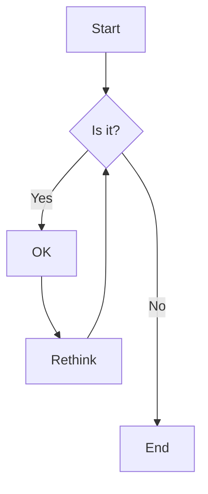
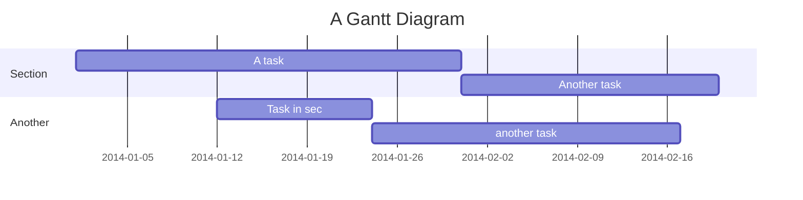

# Sample Document for MD2HTML Testing

This document demonstrates the conversion of Markdown to HTML with comprehensive testing of all supported features.

[TOC]

## Unicode Character Tests

This section tests the rendering of various Unicode characters and symbols.

### Mathematical Symbols
- Superscripts: x², x³, x⁴, x⁵, x⁶, x⁷, x⁸, x⁹, x¹⁰
- Subscripts: H₂O, CO₂, CH₄, N₂O, SO₄²⁻, Ca²⁺
- Greek letters: α, β, γ, δ, ε, ζ, η, θ, λ, μ, π, ρ, σ, τ, φ, χ, ψ, ω
- Greek capitals: Α, Β, Γ, Δ, Ε, Θ, Λ, Π, Σ, Φ, Ψ, Ω
- Math operators: ±, ×, ÷, ≠, ≤, ≥, ≈, ∞, ∑, ∏, ∫, ∂, ∇, √, ∆

### Physical Units
- Speed: m/s², km/h, rad/s²
- Energy: J/kg·K, W/m²·K, kWh
- Temperature: °C, °F, K
- Angles: 45°, 90°, 180°, 2π radians
- Electricity: μA, mV, kΩ, MΩ

---

## LaTeX Math and Math Delimiter Tests

This section demonstrates all supported LaTeX math delimiter types and features.

### Inline Math
In line math with `$...$` should render. Einstein's mass-energy equivalence is $E = mc^2$ where $c$ is the speed of light.

In line math with `\(...\)` should render. Einstein's mass-energy equivalence is \(E = mc^2\) where \(c\) is the speed of light.

In line math with mixed `$..$` and `\(...\)`, for example $E = mc^2$ and \(z = 9\) both should render. The equation \(E = mc^2\) should render, but `\(E = mc^2\)` in backticks should not.

### Display Math
Display math with `$$...$$` should render:
$$F(x) = \int_{-\infty}^{\infty} f(t) e^{-2\pi ixt} dt$$

Display math with `\[...\]` should render:
\[
E = mc^2 + \frac{1}{2}mv^2
\]

Test math with `<` and `>` inside (need to escape to avoid html parsing), for example `$<\psi>$` should be rendered in this way: $<\psi>$, and
$$
\hat{H}=\sum_{i=1}^N \frac{\hat{\mathbf{p}}_i^2}{2m}+\sum_{1\le i<j\le N} U(|\hat{\mathbf{r}}_i-\hat{\mathbf{r}}_j|),
$$

Test boxed math
$$\boxed{H = -\sum_i p_i \log p_i}$$

For math with `$$..$$` and `\[...\]` even in a line, for example $$E = mc^2$$ and \[y = 8\] both should also render.

### Math In Code
Inline code: `\(x = 7\)` and `\[y = 8\]` and `$$z = 9$$`

Code block:
```
\(x = 7\)
\[y = 8\]
$$z = 9$$
```

### Mixed Case with Code
If the problem asks for the value of $x$ and the solution is $x=7$, the output for this section should be `$$\boxed{7}$$`, not `$$\boxed{x=7}$$`. Similarly, if the solution derives the equation $E=mc^2$, the output should be **just** `$$\boxed{mc^{2}}$$`.

Here all math should render. Consider the equation $f(x) = x^2 + 1$ and the integral \(\int_0^1 f(x)dx\). The solution is:
$$\int_0^1 (x^2 + 1)dx = \left[\frac{x^3}{3} + x\right]_0^1 = \frac{4}{3}$$

### Math Delimiters with Multiple Lines

#### Math Context (Should Preserve \,)

Inline math: $a \, b \; c \: d \! e$ for `$a \, b \; c \: d \! e$`

Display math: $$\int_0^1 x \, dx \quad \text{and} \quad \sum_{i=1}^n a_i \, b_i$$

Complex spacing: $\alpha \, \beta \; \gamma \: \delta \! \epsilon \quad \zeta$ for `$\alpha \, \beta \; \gamma \: \delta \! \epsilon \quad \zeta$`

#### Non-Math Context (Should Process Normally)

Regular text with backslashes: This is normal text \, with backslashes.

Code context: `function(a \, b)` should not be treated as math.

Code block with backslashes:

```python
def process_data(x \, y):
    # This \, should not be treated as math spacing
    return x + y
```

#### Edge Cases

Mixed contexts: Here's some text $x \, y$ and then more \, text.

Escaped backslashes in math `$a \\, b$`: $a \\, b$ (should show new line and a literal comma)

Multiple spaces in math: $a \,\, b$ and $c \;\; d$


### Complex Display Math with Multiple Lines
Complex display math in multiple lines with `\[...\]` math delimiter,
\[
\begin{align}
\nabla \cdot \mathbf{E} &= \frac{\rho}{\epsilon_0} \\
\nabla \cdot \mathbf{B} &= 0 \\
\nabla \times \mathbf{E} &= -\frac{\partial \mathbf{B}}{\partial t} \\
\nabla \times \mathbf{B} &= \mu_0 \mathbf{J} + \mu_0 \epsilon_0 \frac{\partial \mathbf{E}}{\partial t}
\end{align}
\]


### Matrix Notation
\[
\mathbf{A} = \begin{pmatrix}
a_{11} & a_{12} & \cdots & a_{1n} \\
a_{21} & a_{22} & \cdots & a_{2n} \\
\vdots & \vdots & \ddots & \vdots \\
a_{m1} & a_{m2} & \cdots & a_{mn}
\end{pmatrix}
\]


### Standalone Boxed Expressions
Standalone `\boxed{...}` not rendered as math currently (we can render single line version in the
future if needed)

\boxed{\sum_{n=1}^{\infty} \frac{1}{n^2} = \frac{\pi^2}{6}}

However, `\boxed{}` has to be standalone, not inside code fence blocks etc. For example, with leading spaces it is rendered as code block. This should render as a code block:

    \boxed{E = mc^2}
    \boxed{F = ma}

---

## List Formatting Tests

This section tests various list types and nesting patterns.

### Normal List With Preceding Text

**Final Answer Format Instructions:**
- Your answer must be a single analytic expression.
- Use the symbol $\pi$ for pi.
- Use standard mathematical notation: multiplication must be denoted explicitly (e.g., $a \cdot b$ or $ab$), and fractions must be written using `\frac{}{}`.
- The expression must be boxed using `$\boxed{}$`.


### Mixed Indentation Lists
1. First main item
    - Nested bullet point (4-space indent)
        - Deeply nested item (8-space indent)
    - Another nested item
2. Second main item
    - Different indentation (2-space indent)
    - Sub-item with 4-space indent
3. Third main item with multiple paragraphs This paragraph is part of item 3.
    - Nested list after paragraph
    - Another nested item

### Complex Nested Structure
1. **Project Setup**
    This is the main project setup phase.
    1. Create virtual environment:
       ```bash
       python -m venv venv
       source venv/bin/activate  # Linux/Mac
       venv\Scripts\activate     # Windows
       ```
    2. Install dependencies:
      - Core packages: `pip install markdown`
      - Optional packages: `pip install beautifulsoup4`

2. **Configuration**
    - Edit configuration file
    - Set up templates
    - Configure themes

3. **Testing**
    Run tests to verify setup.
    - Unit tests: `pytest tests/`
    - Integration tests: `pytest integration/`

### GitHub-Style Task Lists

**Project Development Checklist:**
- [x] Set up project structure
- [x] Implement basic markdown conversion
- [x] Add syntax highlighting with Prism.js
- [x] Create responsive table system
- [x] Migrate from Python markdown to Mistune
- [ ] Add table of contents generation
- [ ] Implement advanced math rendering
- [ ] Create mobile-responsive design
- [ ] Add print stylesheet optimization

**Feature Implementation Status:**
- [x] **Core Features**
  - [x] Markdown to HTML conversion
  - [x] Code syntax highlighting
  - [x] Math equation rendering
- [x] **Advanced Tables**
  - [x] Responsive padding adjustment
  - [x] Hover effects and modern styling
  - [x] Natural width sizing
- [ ] **Enhanced Features**
  - [x] Section collapsing functionality
  - [ ] Advanced TOC with anchor links
  - [ ] Custom theme system
  - [ ] Plugin architecture

---

## Fence Code Block Tests
Since pre code blocks have the highest priority (section headers `##` can be inside code blocks), we handle ````` ``` ````` first.

### Inline Code Examples That Should NOT Be Treated as Fences
Don't confuse ````` ``` ````` with regular quotes or `single backticks`.

Here we discuss how ````` ``` ````` fences work in markdown.

The process handles ````` ```python ````` and ````` ```javascript ````` and ````` ``` ````` all correctly.

Since pre code blocks have the highest priority (section headers `##` can be inside code blocks), we handle this first. To prevent unpaired ````` ``` ````` from corrupting HTML rendering, we patch the source markdown to ensure ````` ``` ````` are properly paired.


An intelligent pairing algorithm that minimizes structural damage. It treats language fences (e.g., ````` ```python `````) as sacred and finds the optimal plain fence (````` ``` `````) to treat as the "culprit" if an odd number exists.


### Real Code Block

#### Plain Fences
```
This is a plain code block
No language specified
```

#### Language Fences

```c++
#include <iostream>
int main() {
    std::cout << "Hello World!" << std::endl;
    return 0;
}
```

#### Indented Fences

    ```
    This is indented with spaces
    ```

    ```python
    # This is indented with a tab
    def indented_function():
        pass
    ```

### Code Blocks with Backslashes

```python
# test of code blocks containing invalid ```: 123 life is good. If not seeing this, failed
------------------------
```123 life is good```
------------------------
```

### Invalid Fence Attempts

These should NOT create code blocks:

``` extra text after fence
```python print("code on same line")
Text before  ```` ``` ```` fence

```markdown
```with space after
```123invalid
```-also-invalid
```contains spaces in language
```

### Real Code Blocks for Comparison

These SHOULD work correctly:

```shell-script
#!/bin/bash
echo "Valid language name with hyphen"
```

### Invalid Code Fence Detection

#### Invalid Fence
```123invalid
Should be replaced with warning.

```-invalid
Should be replaced with warning.

Valid Fences below  (Should Work Normally)

```python
print("This should work fine")
```

#### Invalid Fences Inside Valid Code (Should NOT Warn)

```bash
echo "Testing invalid fences inside code blocks:"
```123invalid
``` extra text
```python print("code")
echo "All above should be preserved"
```


## Table Formatting Tests

This section tests various table layouts and formatting options.

### Basic Table
| Column A | Column B | Column C |
|----------|----------|----------|
| Data 1   | Data 2   | Data 3   |
| Item X   | Item Y   | Item Z   |

### Scientific Data Table

A line before the table should not affect table rendering.
| Particle | Representation | $g$ | $B$ | $L$ | $Y$ |
|:---------|:---------------|:---:|:---:|:---:|:---:|
| Left-handed quarks | $({\bf 3}, {\bf 2})_{1/6}$ | 6 | 1/3 | 0 | 1/6 |
| Right-handed up-quark | $({\bf 3}, {\bf 1})_{2/3}$| 3 | 1/3 | 0 | 2/3 |
| Right-handed down-quark | $({\bf 3}, {\bf 1})_{-1/3}$ | 3 | 1/3 | 0 | -1/3 |
| Left-handed leptons | $({\bf 1}, {\bf 2})_{-1/2}$| 2 | 0 | 1 | -1/2 |
| Right-handed electron | $({\bf 1}, {\bf 1})_{-1}$ | 1 | 0 | 1 | -1 |
| Higgs boson, $H$ | $({\bf 1}, {\bf 2})_{1/2}$ | 2 | 0 | 0 | 1/2 |

### Performance Statistics Table

**A line before the table should not affect table rendering.**
| Subject | Total Files | ✓ Success | ✗ Failure | Success Rate | ? Missing |
|---------|-------------|-----------|-----------|--------------|-----------|
| Electromagnetism | 24,782 | 12,379 | 12,352 | 50.0% | 51 |
| Linear Algebra | 62,265 | 47,324 | 14,506 | 76.0% | 435 |
| Many Body Physics | 42,146 | 19,577 | 22,407 | 46.5% | 162 |
| Mathematical Analysis | 76,771 | 50,986 | 25,407 | 66.4% | 378 |
| Mechanics | 21,965 | 12,129 | 9,768 | 55.2% | 68 |
| **TOTAL** | **379,752** | **142,395** | **84,440** | **37.5%** | **1,094** |

---


## Code Syntax Highlighting Tests

This section demonstrates syntax highlighting for various programming languages.

### JSON Configuration
```json
{
    "name": "md2html-converter",
    "version": "1.0.0",
    "dependencies": {
        "markdown": "^3.4.0"
    },
    "settings": {
        "theme": "elegant",
        "math_support": true,
        "code_highlighting": true
    }
}
```

### JavaScript Example
```javascript
class MathUtils {
    static factorial(n) {
        if (n === 0 || n === 1) return 1;
        return n * this.factorial(n - 1);
    }

    static isPrime(num) {
        if (num < 2) return false;
        for (let i = 2; i <= Math.sqrt(num); i++) {
            if (num % i === 0) return false;
        }
        return true;
    }
}
```


### Python Code Block
```python
# Test of Python syntax highlighting
import numpy as np
import matplotlib.pyplot as plt

def fibonacci(n):
    """Generate the first n Fibonacci numbers."""
    if n <= 0:
        return []
    elif n == 1:
        return [0]
    elif n == 2:
        return [0, 1]

    fib = [0, 1]
    for i in range(2, n):
        fib.append(fib[i-1] + fib[i-2])
    return fib

if __name__ == "__main__":
    numbers = fibonacci(10)
    print(f"First 10 Fibonacci numbers: {numbers}")
```

---

## Chemistry Test

### Basic Chemical Formulas
Water: $\ce{H2O}$

Sulfuric acid: $\ce{H2SO4}$

Chemical formula label (nested): $\ce{A ->[\ce{H2O}] B}$

### Chemical Reactions

$$\ce{2H2 + O2 -> 2H2O}$$

$$\ce{Zn^2+ <=>[\ce{+ 2OH-}][\ce{+ 2H+}] $\underset{\text{amphoteric hydroxide}}{\ce{Zn(OH)2 v}}$ <=>[\ce{+ 2OH-}][\ce{+ 2H+}] $\underset{\text{tetrahydroxozincate}}{\ce{[Zn(OH)4]^2-}}$}$$

## Mermaid Diagrams

Mermaid diagrams are rendered by default, unless a `--no-mermaid` flag is used to overide.

### Flow Chart



### Gantt Chart



---

## Problem Examples

This section contains sample problems demonstrating real-world usage scenarios.

## Problem 1: Physics - Multicritical Points

**Topic**: Multicritical points (Advanced Statistical Mechanics)

**Thumbnail**: For a system described by two coupled scalar order parameters at a stable tetracritical point, calculate the mean-field ratio of the two order parameter magnitudes in the mixed-symmetry phase.

### Problem Statement

Consider a system with free energy functional:
$$F(\phi_1, \phi_2) = \frac{1}{2} r_1 \phi_1^2 + \frac{1}{2} r_2 \phi_2^2 + \frac{1}{4} g_1 \phi_1^4 + \frac{1}{4} g_2 \phi_2^4 + \frac{1}{2} g_{12} \phi_1^2 \phi_2^2$$

At the tetracritical point, both order parameters can be non-zero. Find the ratio of the order parameter magnitudes when $r_1 = r_2 = 0$.

### Solution

The equilibrium conditions are:
$$\frac{\partial F}{\partial \phi_1} = r_1 \phi_1 + g_1 \phi_1^3 + g_{12} \phi_1 \phi_2^2 = 0$$
$$\frac{\partial F}{\partial \phi_2} = r_2 \phi_2 + g_2 \phi_2^3 + g_{12} \phi_1^2 \phi_2 = 0$$

Setting $r_1 = r_2 = 0$ and assuming non-trivial solutions:
$$g_1 \phi_1^2 + g_{12} \phi_2^2 = 0 \quad \Rightarrow \quad \phi_1^2 = -\frac{g_{12}}{g_1} \phi_2^2$$
$$g_2 \phi_2^2 + g_{12} \phi_1^2 = 0 \quad \Rightarrow \quad \phi_2^2 = -\frac{g_{12}}{g_2} \phi_1^2$$

Substituting the second into the first:
$$\phi_1^2 = -\frac{g_{12}}{g_1} \left(-\frac{g_{12}}{g_2} \phi_1^2\right) = \frac{g_{12}^2}{g_1 g_2} \phi_1^2$$

For non-trivial solutions: $\frac{g_{12}^2}{g_1 g_2} = 1$, thus $g_{12}^2 = g_1 g_2$.

The ratio of magnitudes is:
$$\frac{|\phi_1|}{|\phi_2|} = \sqrt{\frac{g_2 - g_{12}}{g_1 - g_{12}}}$$

### Answer
$$\boxed{\sqrt{\frac{g_2 - g_{12}}{g_1 - g_{12}}}}$$

---

## Problem 2: Mathematics - Advanced Calculus

**Topic**: Multivariable optimization with constraints

**Thumbnail**: Find the extrema of $f(x,y) = x^2 + y^2 - xy$ subject to the constraint $x + y = 1$.

### Problem Statement

Using Lagrange multipliers, find the critical points of:
$$f(x,y) = x^2 + y^2 - xy$$
subject to the constraint:
$$g(x,y) = x + y - 1 = 0$$

### Solution

Set up the Lagrangian:
$$\mathcal{L}(x,y,\lambda) = x^2 + y^2 - xy - \lambda(x + y - 1)$$

Taking partial derivatives:
$$\frac{\partial \mathcal{L}}{\partial x} = 2x - y - \lambda = 0$$
$$\frac{\partial \mathcal{L}}{\partial y} = 2y - x - \lambda = 0$$
$$\frac{\partial \mathcal{L}}{\partial \lambda} = -(x + y - 1) = 0$$

From the first two equations: $2x - y = 2y - x$, which gives $3x = 3y$, so $x = y$.

Using the constraint $x + y = 1$ with $x = y$:
$$2x = 1 \quad \Rightarrow \quad x = y = \frac{1}{2}$$

The critical point is $\left(\frac{1}{2}, \frac{1}{2}\right)$ with function value:
$$f\left(\frac{1}{2}, \frac{1}{2}\right) = \frac{1}{4} + \frac{1}{4} - \frac{1}{4} = \frac{1}{4}$$

### Answer
\boxed{\text{Minimum at } \left(\frac{1}{2}, \frac{1}{2}\right) \text{ with value } \frac{1}{4}}

---
