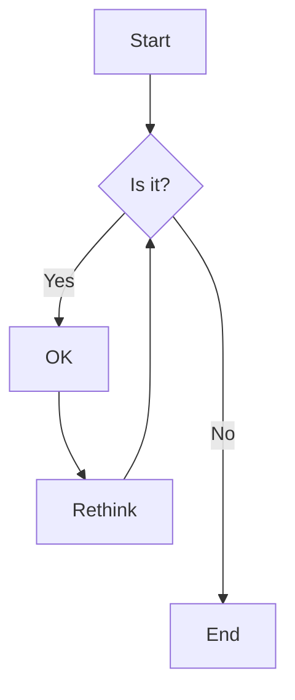
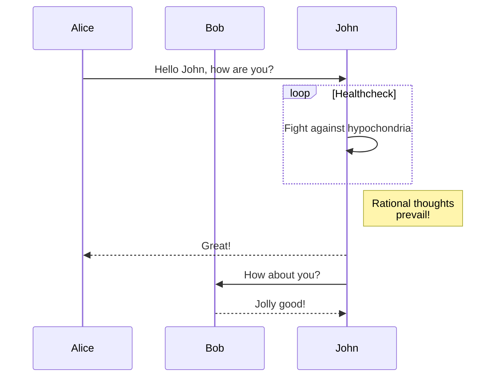
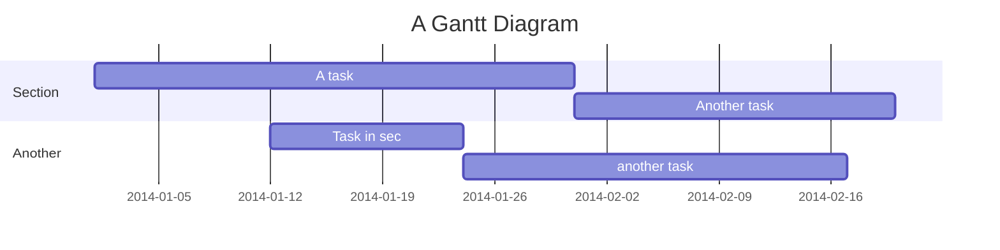

# Mermaid Diagram Test

This document tests various types of Mermaid diagrams.

## Flowchart



## Sequence Diagram



## Gantt Chart



## Regular Code Block (should not be processed)

```python
print("This is regular Python code")
# This should remain a code block
```